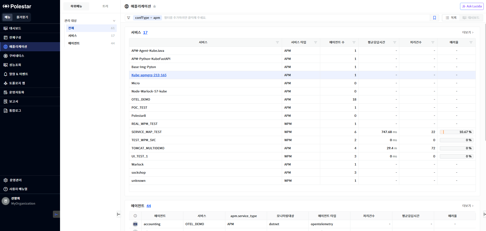

서비스 목록

전체 구성에서 \[서비스\]의 \[더보기\>\] 선택하면 전체 애플리케이션의 서비스 목록을 확인할 수 있습니다. 애플리케이션은 에이전트들의 그룹인 서비스 단위로 조회할 수 있습니다.

<table>
<tbody>
<tr class="odd">
<td>
노트

전체 구성에서 관리되는 서비스는 [전체구성] 메뉴의 [관리 대상 추가] 에서 애플리케이션[관리 대상 등록]을 통해 등록되어야 합니다.
</td>
</tr>
</tbody>
</table>

> ▶ \[그림1\] 서비스 목록
> 
> 서비스

<table>
<thead>
<tr class="header">
<th>서비스</th>
<th>에이전트를 관리하는 서비스명을 표시합니다.</th>
</tr>
</thead>
<tbody>
<tr class="odd">
<td>서비스 타입</td>
<td>
APM과 WPM으로 서비스 타입이 표시됩니다.

APM 에이전트가 설치되는 서비스의 경우 APM 타입으로 표시되며 WPM에이전트가 설치되는 서비스는 WPM 타입으로 표시됩니다.
</td>
</tr>
<tr class="even">
<td>에이전트 수</td>
<td>해당 서비스에 속하는 에이전트 수를 표시합니다</td>
</tr>
<tr class="odd">
<td>평균응답시간</td>
<td>서비스내의 애플리케이션에서 수행된 트레이스들의 평균 응답시간을 표시합니다.</td>
</tr>
<tr class="even">
<td>처리건수</td>
<td>서비스내의 애플리케이션에서 수행된 트레이스 건수를 표시합니다.</td>
</tr>
<tr class="odd">
<td>에러율</td>
<td>
서비스내의 애플리케이션에서 수행된 전체 트레이스 건수 대비 에러가 발생한 트레이스의 비율입니다

APM 서비스 타입 계산 방식 :( 에러트레이스 건수 / 전체 트레이스 건수 ) * 100

단위 : % 
 
WPM 서비스 타입 : 에이전트로 부터 수집한 에러율을 평균값으로 표시합니다.
</td>
</tr>
</tbody>
</table>

