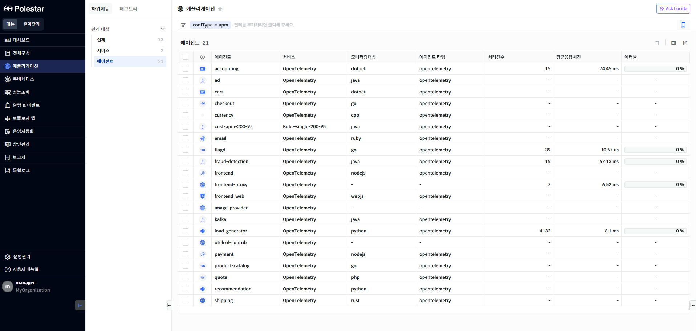
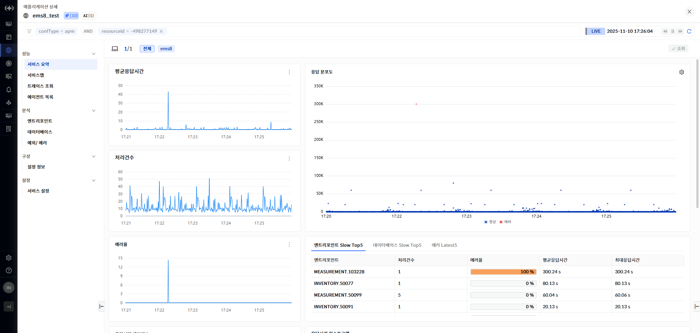

에이전트 목록

애플리케이션의 에이전트 목록을 확인하기 위해서는 \[애플리케이션\]의 \[전체\]를 선택 후 에이전트 목록에서 \[더보기\]를 선택하거나 \[애플리케이션\]의 \[에이전트\]를 선택하면 에이전트 목록을 확인할 수 있습니다.

<table>
<tbody>
<tr class="odd">
<td>
노트

전체 구성에서 관리되는 애플리케이션은 [전체구성] 메뉴의 [관리 대상 추가] 에서 애플리케이션[관리 대상 등록]을 통해 등록하거나 애플리케이션의 [설정] &gt; [서비스 설정]에서 에이전트 자동 추가가 선택되어 있을 경우 에이전트가 자동 추가됩니다
</td>
</tr>
</tbody>
</table>

▶ \[그림 1\] 애플리케이션 에이전트 목록

> 에이전트

<table>
<thead>
<tr class="header">
<th>에이전트 가용성 및 관리 상태</th>
<th>에이전트의 상태를 표시합니다. 에이전트 상태는 10초마다 전송되는 에이전트 메트릭 데이터를 수신 받았을 경우 UP, 메트릭 데이터가 전송되지 않을 경우 Down으로 평가합니다.</th>
</tr>
</thead>
<tbody>
<tr class="odd">
<td>에이전트</td>
<td>
애플리케이션이 수행되는 에이전트 명을 표시합니다.

에이전트 설치 시 설정을 통해 지정됩니다.
</td>
</tr>
<tr class="even">
<td>서비스</td>
<td>
애플리케이션이 수행되는 에이전트의 서비스 명을 표시합니다.

에이전트 설치 시 설정을 통해 지정됩니다.
</td>
</tr>
<tr class="odd">
<td>모니터링대상</td>
<td>에이전트가 모니터링하는 언어를 표시합니다.</td>
</tr>
<tr class="even">
<td>에이전트 타입</td>
<td>설치된 에이전트의 타입을 의미합니다.</td>
</tr>
<tr class="odd">
<td>처리건수</td>
<td>해당 에이전트가 최근 15분 내 처리한 트레이스 수를 표시합니다.</td>
</tr>
<tr class="even">
<td>평균응답시간</td>
<td>해당 에이전트가 최근 15분 내 처리한 트레이스의 평균응답시간을 표시합니다.</td>
</tr>
<tr class="odd">
<td>에러율</td>
<td>
해당 에이전트가 최근 15분 내 처리한 트레이스에서 발생한 에러 트레이스의 비율을 표시합니다.

계산 방식 : 에러 트레이스 건수/전체 트레이스 수 * 100
</td>
</tr>
</tbody>
</table>

> 에이전트 상세 화면 이동

1.  상세 성능 확인하고자 하는 에이전트 명을 클릭.

에이전트 상세

에이전트 목록에서 특정 에이전트명을 클릭하면 애플리케이션 상세 화면의 성능\>서비스요약으로 이동합니다.

애플리케이션 서비스 상단의 에이전트 목록 구간에서 클릭한 에이전트가 선택된 상태의 화면이 표시됩니다.

▶ \[그림1\] 애플리케이션 상세 – 에이전트 선택

선택한 하나의 에이전트 관점에서 애플리케이션 상세에서 제공하는 기능을 표시 됩니다.

상세한 내용은 “애플리케이션 상세” 문서를 참고합니다.

