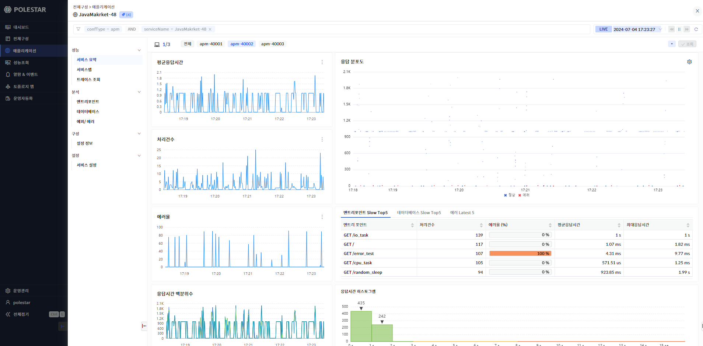

에이전트 상세

에이전트 목록에서 특정 에이전트명을 클릭하면 애플리케이션 상세 화면의 성능\>서비스요약으로 이동합니다.

애플리케이션 서비스 상단의 에이전트 목록 구간에서 클릭한 에이전트가 선택된 상태의 화면이 표시됩니다.

▶ \[그림1\] 애플리케이션 상세 – 에이전트 선택

선택한 하나의 에이전트 관점에서 애플리케이션 상세에서 제공하는 기능을 표시 됩니다.

상세한 내용은 “애플리케이션 상세” 문서를 참고합니다.

