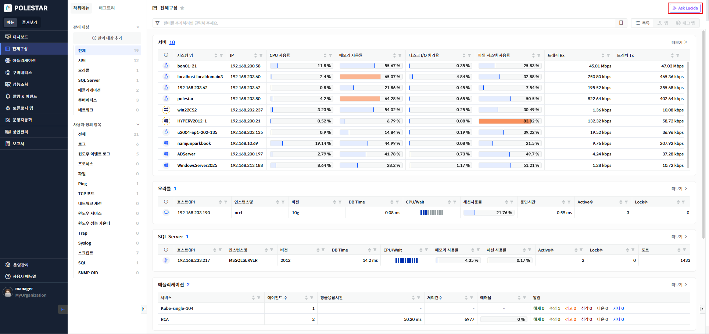
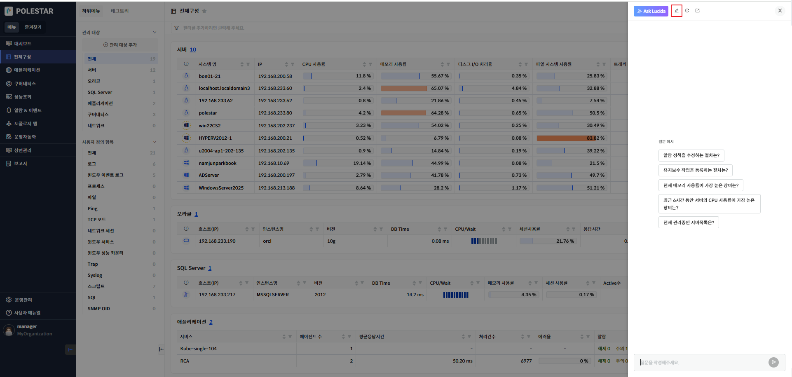
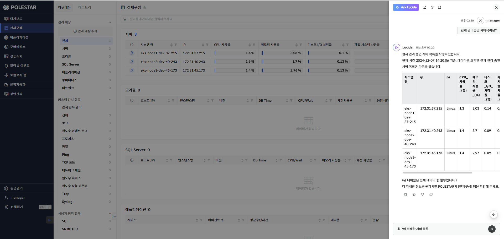
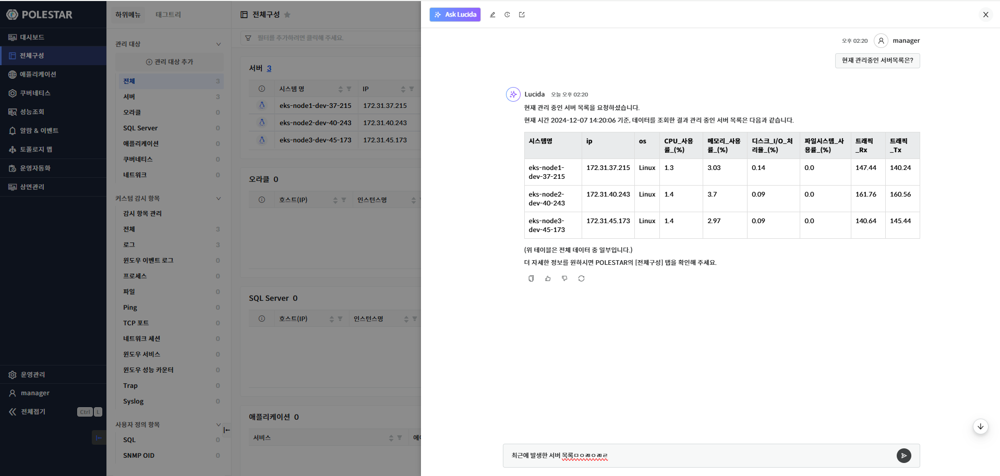
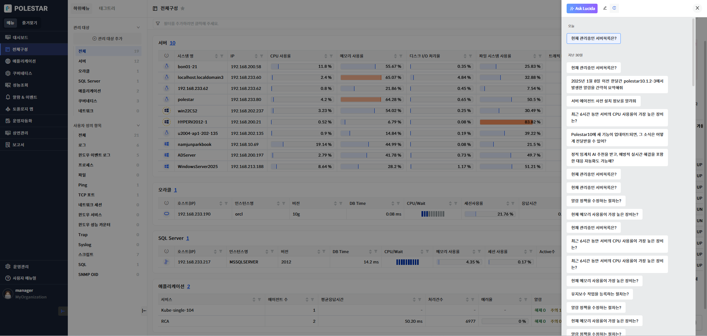
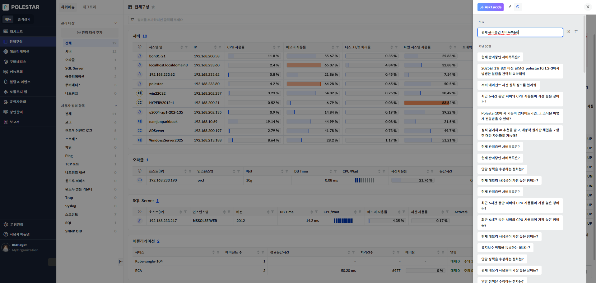
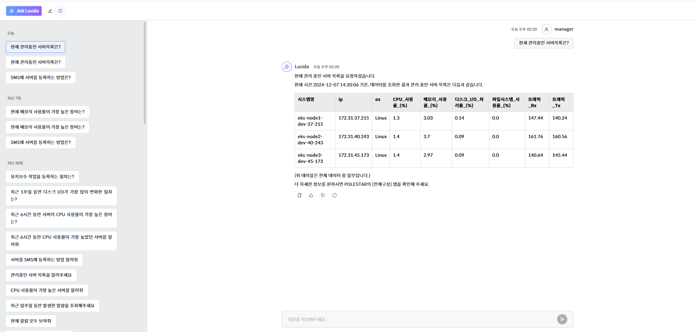

Ask Lucida

Ask Lucida는 AI 어시스턴트 기능입니다. 자연어 기반 검색으로 Polestar10에서 관리하는 대상에 대한 알람, 구성, 성능, 사용자, 매뉴얼에 대한 조회 및 요약 정보를 제공합니다.

주제별 관리를 위한 새채팅 기능과 과거의 대화 목록을 확인하고 계속 질문 하기 기능을 제공 합니다.

화면 오른쪽 상단에 Ask Lucida 버튼을 클릭 하여 사용 할 수 있습니다

<table>
<tbody>
<tr class="odd">
<td>
노트

Ask Lucida 버튼은 대부분 오른쪽 상단에 위치하고 있으나 특별한 기능화면에서는 표시 되지 않을 수 있습니다.
</td>
</tr>
</tbody>
</table>

▶ \[그림 1\] Ask Lucida

새 채팅

채팅 창 상단에 있는 \[새 채팅\] 버튼을 누르면 새로운 채팅을 시작 할 수 있습니다.

새 채팅 시작시 질문 예시를 제공합니다.

<table>
<tbody>
<tr class="odd">
<td>
노트

새 채팅 시작 시 첫번째 질문은 히스토리의 제목으로 사용됩니다.
</td>
</tr>
</tbody>
</table>

▶ \[그림 2\] 새채팅

질문하기

샘플 예시를 클릭 하거나 채팅창 하단에 질문입력란에 내용을 작성 후 \[엔터\] 또는 \[전송\] 버튼을 눌러 질문을 할 수 있습니다.

질문을 할 경우 채팅 창에 질문시간,질문자, 질문내용이 표시되고 그 아래에 응답시간과 응답 결과가 표시 됩니다.

채팅 창 크기를 조절 할 수 있고 \[새 창\] 버튼을 클릭 하여 큰 화면으로 볼 수 있습니다.

<table>
<tbody>
<tr class="odd">
<td>
노트

현재는 복잡한 질문에 대한 답변은 할 수 없습니다.

알람, 구성, 성능, 매뉴얼에 대한 질문에 대한 답변을 제공 합니다.

사용자에게 할당 된 역할의 기능 권한에 따라 질문에 제약을 받을 수 있습니다.

질문 시 입력 제한 500 이상은 할 수 없습니다
</td>
</tr>
</tbody>
</table>

▶ \[그림 3\] 질문하기

▶ \[그림 4\] 질문결과 확대보기

> 응답 결과

| 응답자    | Lucida                                                |
| ------ | ----------------------------------------------------- |
| 응답 시간  | 응답 결과를 송신한 시간을 표시 합니다.                                |
| 내용     | 질문한 응답을 답변 또는 오류를 표시 합니다.                             |
| 복사     | \[복사\] 아이콘을 클릭 하면 응답 결과를 복사 할 수 있습니다.                 |
| 좋은 응답  | \[좋은 응답\] 아이콘을 클릭 하여 좋은 응답 여부로 저장 할 수 있습니다.           |
| 별로인 응답 | \[별로인 응답\] 아이콘을 클릭 하여 별로인 응답 여부로 저장 할 수 있습니다.         |
| 다시 시도  | \[응답 결과가 실패 시 \[다시 시도\] 버튼을 클릭 하여 질문을 다시 요청 할 수 있습니다. |

> 다시 시도 절차

1.  히스토리 클릭

2.  불러오기 원하는 대화 제목 선택

3.  선택한 대화의 질문과 응답 목록이 대화창에 표시됨

히스토리 목록

채팅 창 상단에 있는 \[히스토리\] 버튼을 누르면 기존의 대화 목록을 확인 할 수 있습니다.

히스토리 제목을 클릭하며 기존의 질문 및 응답 목록을 확인 할 수 있으며 계속 질문을 할 수 있습니다.

▶ \[그림 5\] 히스토리 목록

> 히스토리 불러오기 절차

1.  히스토리 클릭

2.  불러오기 원하는 대화 제목 선택

3.  선택한 대화의 질문과 응답 목록이 대화창에 표시됨

<table>
<tbody>
<tr class="odd">
<td>
노트

히스토리 불러오기 한 대화에서 질문을 계속 할 경우 불러온 대화에 내용이 기록 됩니다.
</td>
</tr>
</tbody>
</table>

히스토리 수성 및 삭제하기

히스토리의 제목의 수정하거나 삭제 할 수 있습니다

▶ \[그림 6\] 히스토리 수정 및 삭제

> 히스토리 제목 편집

1.  히스토리 클릭

2.  편집이 필요한 대상 마우스 오버

3.  \[편집\] 버튼 클릭

4.  제목 수정 후 \[엔터\] 누르기

> 히스토리 삭제

1.  히스토리 클릭

2.  삭제 필요한 대상 마우스 오버

3.  \[삭제\] 버튼 클릭

새창 보기

새창 보기 기능을 이용하여 Ask Lucida 화면 크게 볼 수 있습니다.

새창 보기는 브라우저의 새로운 탭에 표시 되면 왼족은 히스토리와 대화창으로 구성 되어 표시 됩니다.

<table>
<tbody>
<tr class="odd">
<td>
노트

새창 보기 모드에서도 크기가 조절이 됩니다.

기본에 Ask Lucida에서 제공하는 기능을 그대로 제공합니다
</td>
</tr>
</tbody>
</table>

▶ \[그림 7\] 새창 보기

> 새창 보기 절차

1.  \[Ask Lucida\] 클릭

2.  화면 상단에 \[새 창\] 버튼 클릭 하기

