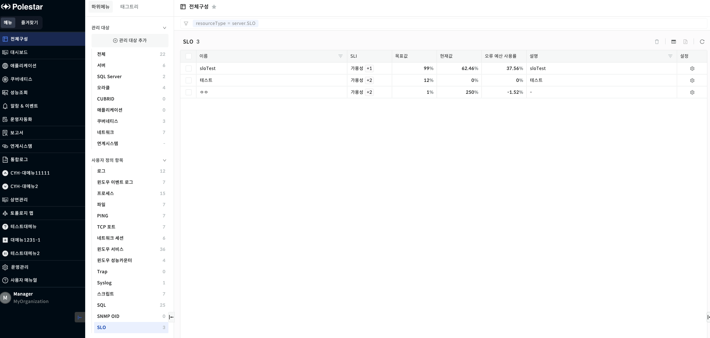
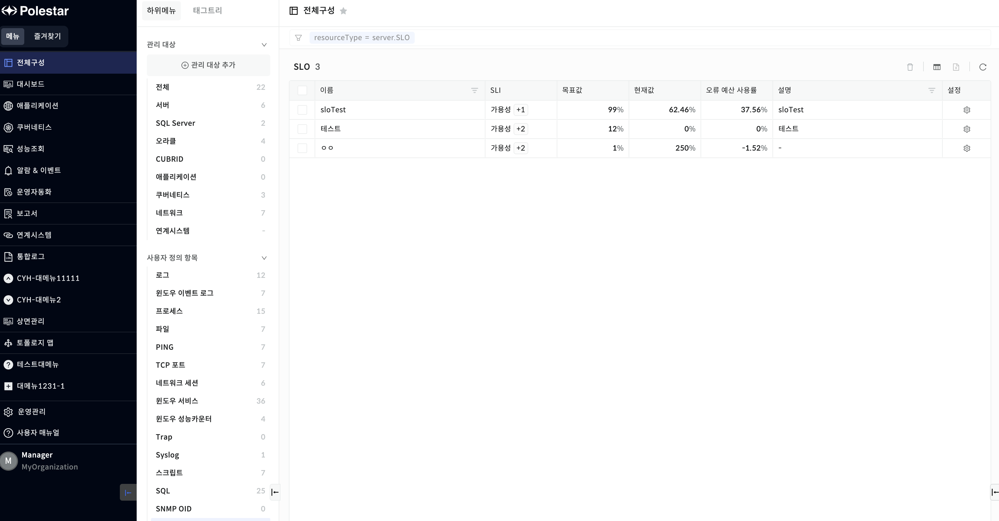
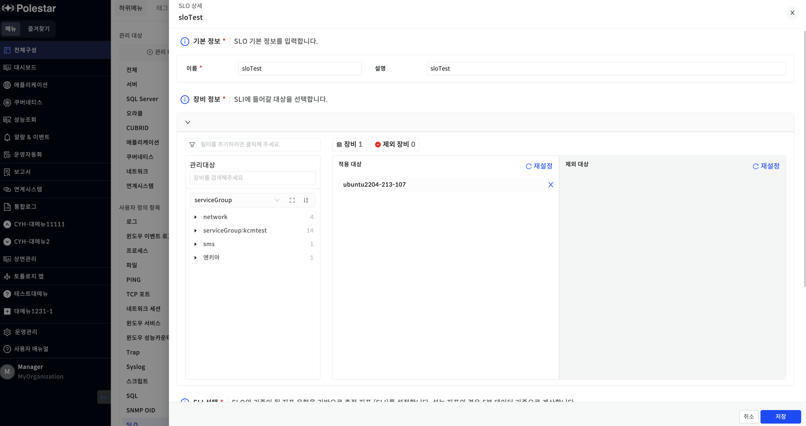
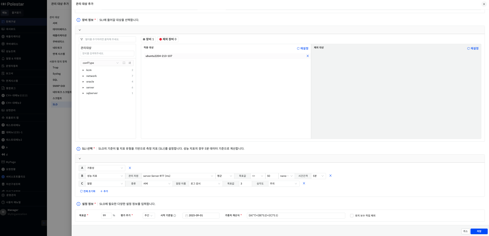
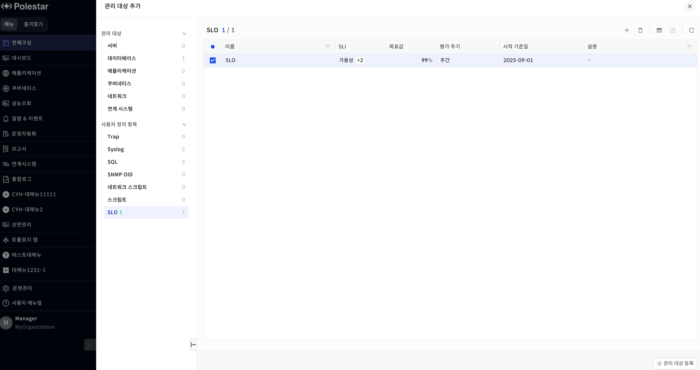
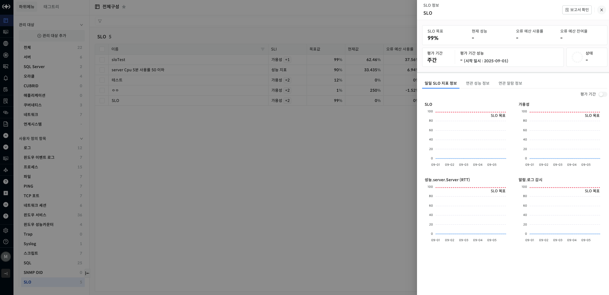
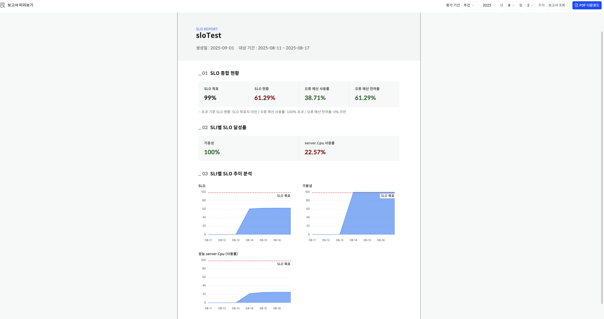
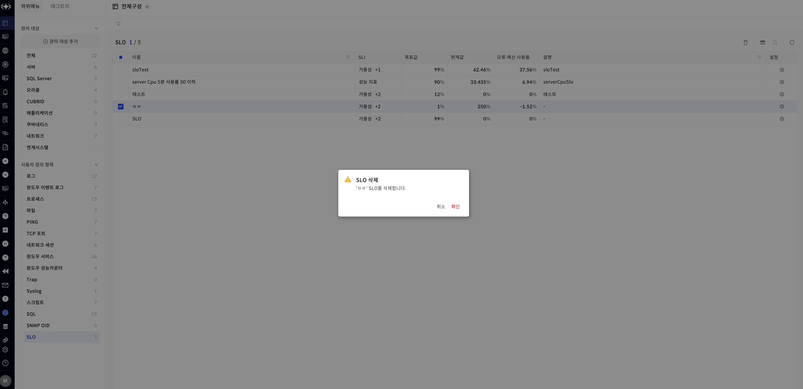
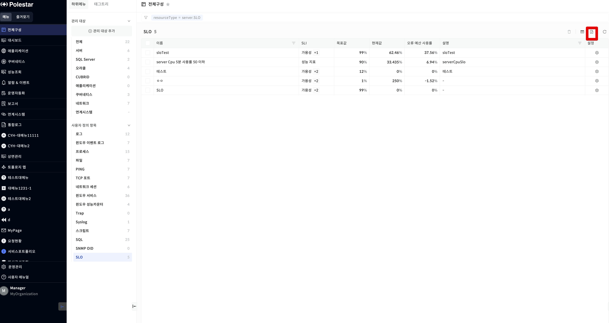

SLO 목록

등록된 SLO 항목의 현황을 시각적으로 확인하고, 설정된 목표 기준에 따라 주간/월간 단위 평가를 진행하는 기능을 제공합니다.

▶ \[그림1\] SLO 목록

> SLO 목록

| 이름       | SLO의 이름을 표시합니다.                      |
| -------- | ------------------------------------ |
| SLI      | 평가를 진행할 대상들을 표시합니다.                  |
| 목표값      | SLO의 목표를 표시합니다.                      |
| 현재값      | SLI에 따른 현재값을 표시합니다.                  |
| 오류예산 사용률 | 오류 예산 사용률을 표시합니다. 소수점 둘째 자리까지 표시합니다. |
| 설명       | SLO에 대한 설명을 표시합니다.                   |

SLO 상세

SLO 목록에서 설정을 클릭하여 상세 드로어를 확인할 수 있습니다.

▶ \[그림2\] SLO 목록

SLO 설정 드로어

SLO 현황에서 설정을 클릭하여 확인할 수 있습니다.

▶ \[그림3\] SLO 설정 드로어

SLO 관리 대상 추가

사용자는 전체 구성 \> 관리 대상 추가 \> 사용자 정의 항목 \> SLO 경로를 통해 등록할 수 있습니다.

▶ \[그림4\] SLO 등록 드로어

> SLO 등록

<table>
<thead>
<tr class="header">
<th>이름</th>
<th>SLO의 이름을 입력합니다.</th>
</tr>
</thead>
<tbody>
<tr class="odd">
<td>설명</td>
<td>SLO의 설명을 입력합니다.</td>
</tr>
<tr class="even">
<td>장비 정보</td>
<td>SLI에 들어갈 대상을 선택합니다.</td>
</tr>
<tr class="odd">
<td>SLI 선택</td>
<td>
SLI를 선택합니다.

SLI는 3가지가 있습니다.

성능지표는 선택된 장비에 따라 다른 목록이 표시됩니다.

알람은 선택된 종류의 알람의 이름이 표시됩니다.

<ol type="1">
<li>
가용성
</li>
<li>
성능지표
</li>
<li>
알람이
</li>
</ol></td>
</tr>
<tr class="even">
<td>설정 정보</td>
<td>
목표값 : SLO의 목표값을 설정합니다.

평가주기 : 주간 / 월간을 선택합니다.

시작 기준일 : SLO펼가 시작할 기준일을 선택합니다.

가중치 계산식 : SLI의 가중치를 계산할 계산식을 작성합니다. ex) ({A}*0.5)+({B}*0.5)

유지 보수 작업 제외 : 유지보수 작업 제외 여부를 선택합니다.
</td>
</tr>
</tbody>
</table>

SLO 관리 대상 등록

SLO는 관리 대상 등록된 후 SLO 평가 및 현황에서 확인할 수 있습니다.

▶ \[그림5\] SLO 관리 대상 등록

SLO 상세

SLO 현황에서 이름을 클릭하여 상세를 확인할 수 있습니다.

▶ \[그림6\] SLO 관리 대상 등록

> SLO 상세

<table>
<thead>
<tr class="header">
<th>SLO 목표</th>
<th>SLO의 목표를 표시합니다.</th>
</tr>
</thead>
<tbody>
<tr class="odd">
<td>현재 성능</td>
<td>
현재 성능을 표시합니다.

SLO는 매일 3시에 평가를 시작하여 전날 기준으로 현재 성능을 표시합니다.
</td>
</tr>
<tr class="even">
<td>오류 예산 사용률</td>
<td>오류 예산 사용률을 표시합니다.</td>
</tr>
<tr class="odd">
<td>오류 예산 잔여율</td>
<td>오류 예산 잔여율을 표시합니다.</td>
</tr>
<tr class="even">
<td>평가 기간</td>
<td>주간 / 월간을 표시합니다.</td>
</tr>
<tr class="odd">
<td>평가 기간 성능</td>
<td>평가 기간 시작일로부터 주간./ 월간에 따른 평가 기간 성능이 표시됩니다.</td>
</tr>
<tr class="even">
<td>일일 SLO 지표 정보</td>
<td>
SLO의 현재값을 차트로 표시합니다.

차트에는 SLO 목표가 표시됩니다.

각 SLI 지표마다 차트가 표시됩니다.
</td>
</tr>
<tr class="odd">
<td>연관 성능 정보</td>
<td>선택된 장비의 연관된 성능 정보가 표시됩니다.</td>
</tr>
<tr class="even">
<td>연관 알람 정보</td>
<td>선택된 장비의 연관 알람 정보가 표시됩니다.</td>
</tr>
</tbody>
</table>

SLO 보고서

SLO 결과에 따른 보고서를 볼 수 있고 PDF를 다운 받을 수 있습니다.

SLO 상세에서 보고서 확인을 눌러 새창을 확인할 수 있습니다.

▶ \[그림7\] SLO 보고서 미리보기

> SLO 보고서

| SLO 목표         | SLO의 목표를 표시합니다.                           |
| -------------- | ----------------------------------------- |
| SLO 현황         | 평가 기준의 현재 성능을 표시합니다.                      |
| 오류 예산 사용률      | 평가 기준의 오류 예산 사용률을 표시합니다.                  |
| 오류 예산 잔여율      | 평가 기준의 오류 예산 잔여율을 표시합니다.                  |
| 평가 기간          | 주간 / 월간 및 년 / 월 / 주차를 선택합니다.              |
| 평가 기간 성능       | 평가 기간 시작일로부터 주간./ 월간에 따른 평가 기간 성능이 표시됩니다. |
| SLI별 SLO 달성률   | 선택한 SLI별 달성률이 표시됩니다.                      |
| SLI별 SLO 추이 분석 | SLO 및 SLI 별 평가기준 차트를 표시합니다.               |
| PDF 다운로드       | 미리보기한 SLO 보고서를 PDF로 다운받을 수 있습니다.          |

SLO 삭제

삭제할 SLO를 선택하고 \[삭제\] 버튼을 선택하여 SLO를 삭제할 수 있습니다.

▶ \[그림8\] SLO 삭제

엑셀 저장

SLO 목록의 우측 상단 \[엑셀 저장\] 버튼을 통해 SLO 목록을 엑셀로 저장할 수 있습니다. 그리드 컬럼 검색 기능 등을 통해 엑셀에 보여줄 컬럼과 내용을 원하는 조건에 맞게 필터링하여 저장할 수 있습니다.

▶ \[그림9\] SLO 엑셀 저장

