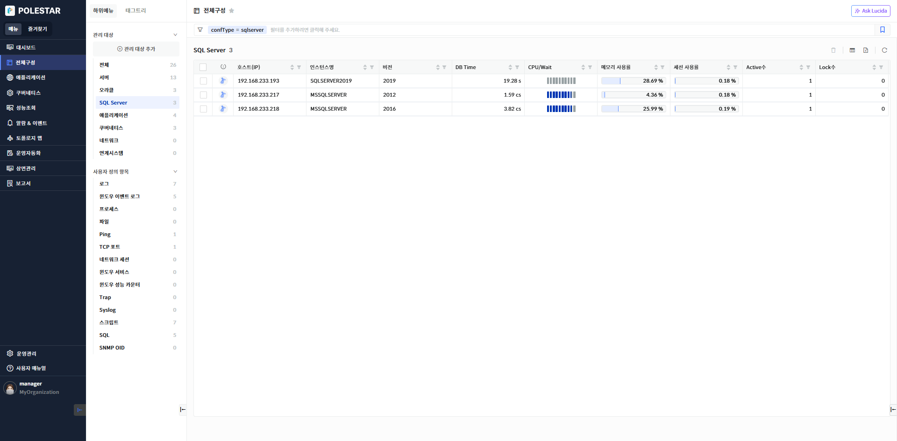
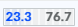
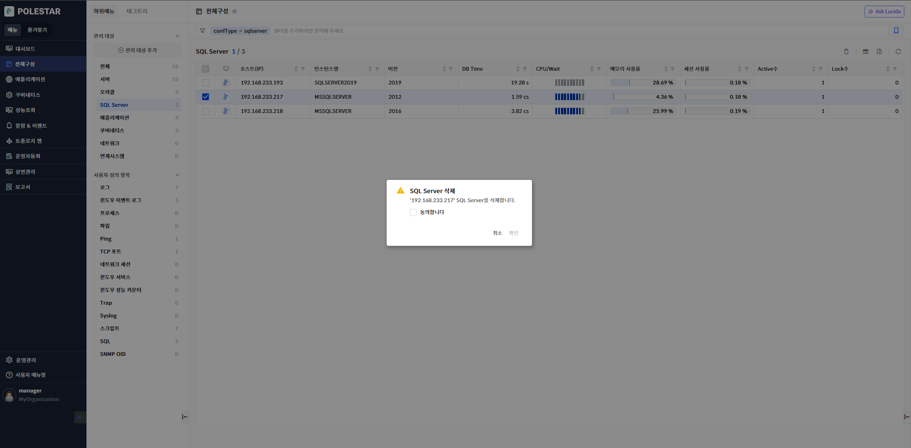
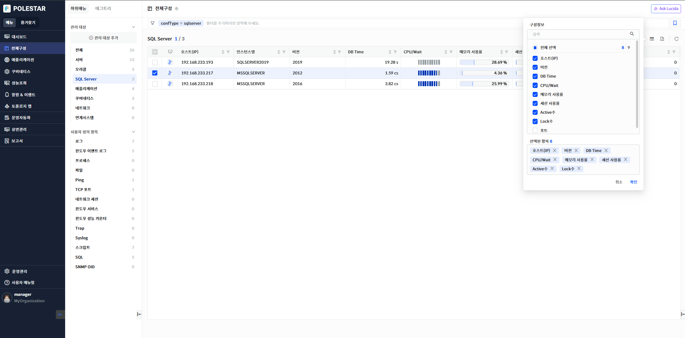

SQL Server 목록

전체 구성에서 \[SQL Server\]를 선택하거나 전체에서 SQL Server의 \[더보기\>\]를 선택하면 전체 SQL Server 목록을 확인할 수 있습니다. SQL Server 목록을 통해 SQL Server가 설치된 호스트(IP), 인스턴스명, 버전, Port 정보를 확인하고 검색해 볼 수 있으며 SQL Server의 주요 성능 지표(CPU 사용률, 메모리 사용률, Active(세션)수 등)를 확인하여 SQL Server의 전체적인 부하를 파악하고 비교해볼 수 있습니다. 또한 해당 화면에서 등록된 SQL Server를 삭제할 수 있습니다.

<table>
<tbody>
<tr class="odd">
<td>
노트

전체 구성에서 관리되는 SQL Server은 [전체구성] 메뉴의 [관리 대상 추가]에서 SQL Server [관리 대상 등록]을 통해 등록되어야 합니다. 그리고 SQL Server 목록에는 로그인 사용자에게 읽기 권한이 할당된 SQL Server만 표시됩니다.
</td>
</tr>
</tbody>
</table>

> ▶ \[그림1\] SQL Server목록
> 
> SQL Server 목록

<table>
<thead>
<tr class="header">
<th>DB</th>
<th>
DB 종류를 아이콘으로 표시하고 색깔은 가용성을 표시합니다.

<table>
<thead>
<tr class="header">
<th><strong>: SQL Server 정상 상태 표시(Up)</strong></th>
</tr>
</thead>
<tbody>
<tr class="odd">
<td><strong>: SQL Server 다운 상태 표시(Down)</strong></td>
</tr>
</tbody>
</table></th>
</tr>
</thead>
<tbody>
<tr class="odd">
<td>호스트(IP)</td>
<td>SQL Server 등록 시 입력했던 호스트명 또는 IP가 표시됩니다</td>
</tr>
<tr class="even">
<td>인스턴스명</td>
<td>SQL Server의 인스턴스명입니다. 인스턴스명이 없는 경우 기본 인스턴스명인 “MSSQLSERVER”로 표시됩니다. 인스턴스명에 매핑 되는 태그 키 값은 “dbName”입니다. 태그 필터 사용시 유의하세요.</td>
</tr>
<tr class="odd">
<td>버전</td>
<td>SQL Server Major 버전명이 표시됩니다.</td>
</tr>
<tr class="even">
<td>DB Time</td>
<td>
SQL Server가 사용한 CPU와 대기시간의 총합을 표시합니다.

해당 시간은 SQL Server 수집주기(디폴트 60초) 동안 사용한 CPU와 대기시간의 합을 수집주기로 나눈 시간(초당시간)입니다. 예를 들어 해당 시간이 1초 이상이고 DB Time이 모두 CPU 사용 시간이라면 ‘SQL Server가 프로세스가 1개 이상의 CPU 코어를 사용하였다’ 라고 해석할 수 있습니다.

단위: ms
</td>
</tr>
<tr class="odd">
<td>CPU/Wait</td>
<td>
DB Time이 CPU를 사용한 시간인지 대기로 인한 시간인지를 비율로 표시한 게이지 바입니다. 해당 게이지바가  라면 이는 DB Time 소요시간 중 23.3%는 CPU를 사용하였고 나머지 76.7%는 대기 이벤트 사용 시간이라는 것을 알 수 있습니다.

단위: %
</td>
</tr>
<tr class="even">
<td>메모리 사용률</td>
<td>SQL Server에 할당된 메모리 가용량 대비 실제 사용한 사용량의 비율입니다. 메모리 사용률이 평소 보다 높다면 메모리 사용율을 높이는 비효율적인 쿼리나 잘못된 인덱스 사용은 없는지 확인이 필요합니다. 메모리 사용이 비효율적인 쿼리는 SQL 분석(현황, 이력) 화면이나 SQL 성능화면에서 쿼리의 메모리 사용률 항목을 통해 점검해 볼 수 있습니다.</td>
</tr>
<tr class="odd">
<td>세션 사용률</td>
<td>
SQL Server의 허용 가능 전체 세션 수 대비 현재 사용하고 있는 세션수의 비율을 표시합니다. 이를 통해 현재 SQL Server에 세션이 많이 접속하였는지 또 허용 세션 수에 여유가 있는지 등을 파악할 수 있습니다. 일반적으로 세션 사용률은 높지 않아야 하며 세션 사용률이 100%에 가깝다면 SQL Server에 매우 큰 부하가 있다고 판단할 수 있으며 빠른 조치가 필요한 상황이라고 할 수 있습니다.

단위: %
</td>
</tr>
<tr class="even">
<td>Active수</td>
<td>
현재 SQL Server에서 수행되는 Active 세션의 수를 표시합니다. Active 세션은 현재 SQL Server 내에서 쿼리가 수행되거나 작업중인 세션을 의미합니다. Active 세션수가 평소보다 많이 높다면 세션 현황 조회 기능이나 분석 기능을 통해 어떤 세션 때문인지 분석해 볼 필요가 있습니다.

단위: count
</td>
</tr>
<tr class="odd">
<td>Lock수</td>
<td>
현재 SQL Server 세션 중 Lock으로 인해 블록 된 세션 수를 표시합니다. 장기적으로 보통 Lock 세션 수는 0개인 것이 일반적입니다. 따라서 장기적으로 Lock수가 높다면 세션 현황 조회 기능이나 분석 기능을 통해 어떤 세션이 Lock을 유발하고 블록 되는지 분석할 필요가 있습니다.

단위: count
</td>
</tr>
<tr class="even">
<td>Port</td>
<td>SQL Server 등록 시 입력했던 Listen 포트입니다</td>
</tr>
</tbody>
</table>

<table>
<tbody>
<tr class="odd">
<td>
노트

SQL Server 인스턴스명에 매핑 되는 태그 키 값은 “dbName”입니다. 태그 필터 사용시 유의하세요. 태그 키 값이 “dbName”인 이유는 오라클 이외의 모든 데이터베이스에서 공통으로 사용하기 위함입니다.
</td>
</tr>
</tbody>
</table>

SQL Server 삭제

삭제할 SQL Server을 선택하고 \[삭제\] 버튼을 선택하여 SQL Server를 삭제할 수 있습니다.

삭제할 대상을 선택하고 \[삭제\] 버튼을 선택하여 삭제할 수 있습니다.

삭제가 되면 SQL Server 수집(쿼리 수행)이 중지되며 SQL Server 등록이 해제됩니다.

SQL Server 등록 해제 및 삭제시에도 기존 데이터는 삭제되지 않고 유지됩니다. 따라서 삭제 후 SQL Server를 다시 등록하면 기존 데이터 정보를 다시 조회할 수 있습니다.

▶ \[그림2\] SQL Server 삭제

> SQL Server 삭제 절차

1.  삭제하고자 하는 SQL Server 선택 (다중 선택 가능)

2.  테이블 우측 상단의 삭제 아이콘 클릭

3.  메시지창에서 확인 클릭

컬럼 수정

SQL Server 목록의 우측 상단 \[컬럼 수정\] 버튼을 통해 SQL Server 목록에 원하는 컬럼을 표시하거나 제외할 수 있습니다. 엑셀 저장시에도 컬럼 수정을 통해 표시된 컬럼만 저장됩니다. 컬럼 수정 팝업창에서는 컬럼 검색 기능을 제공하며 선택된 항목을 하단에 표시하고 표시된 컬럼을 제외할 수 있는 기능을 제공합니다.

▶ \[그림3\] SQL Server 목록 컬럼 수정

> SQL Server 컬럼 수정 절차

1.  SQL Server 목록에서 우측 상단 컬럼 수정 아이콘 클릭

2.  컬럼 수정 팝업창에서 화면에 표시하고자 하는 컬럼을 체크박스에서 선택

3.  저장 버튼 클릭

엑셀 저장

SQL Server 목록의 우측 상단 \[엑셀 저장\] 버튼을 통해 SQL Server 목록을 엑셀로 저장할 수 있습니다. 컬럼 수정 기능, 상단 태그 검색 기능, 그리드 컬럼 검색 기능 등을 통해 엑셀에 보여줄 컬럼과 내용을 원하는 조건에 맞게 필터링하여 저장할 수 있습니다.

▶ \[그림4\] SQL Server 목록 엑셀 저장

> SQL Server 목록 엑셀 저장 및 조회 절차

1.  SQL Server 목록에서 우측 상단 엑셀 저장 아이콘 클릭

2.  브라우저 우측 상단 창에 저장된 엑셀 파일명이 표시됨

3.  해당 파일명을 클릭하여 엑셀 파일 확인

