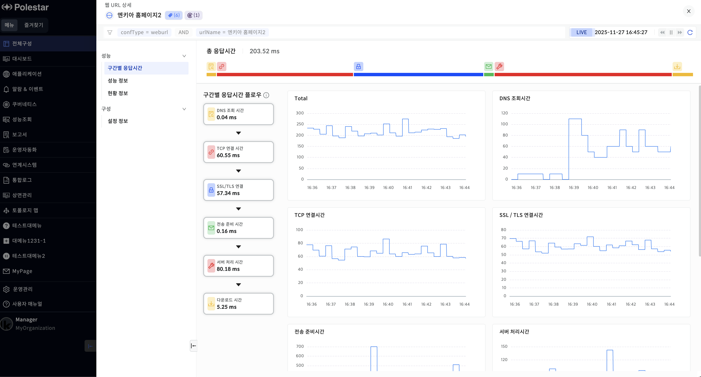
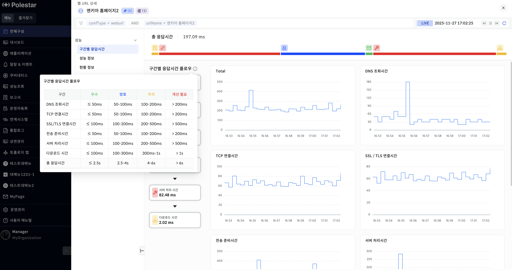
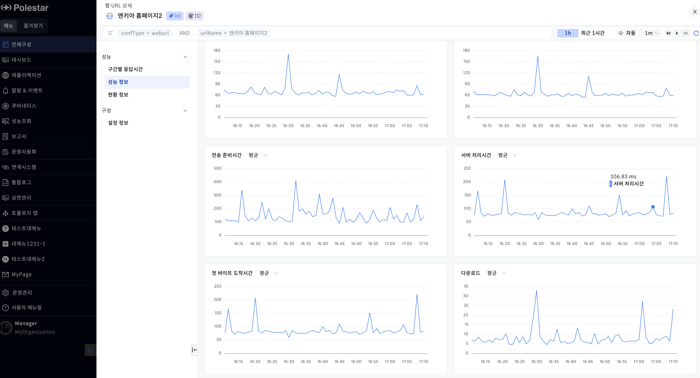
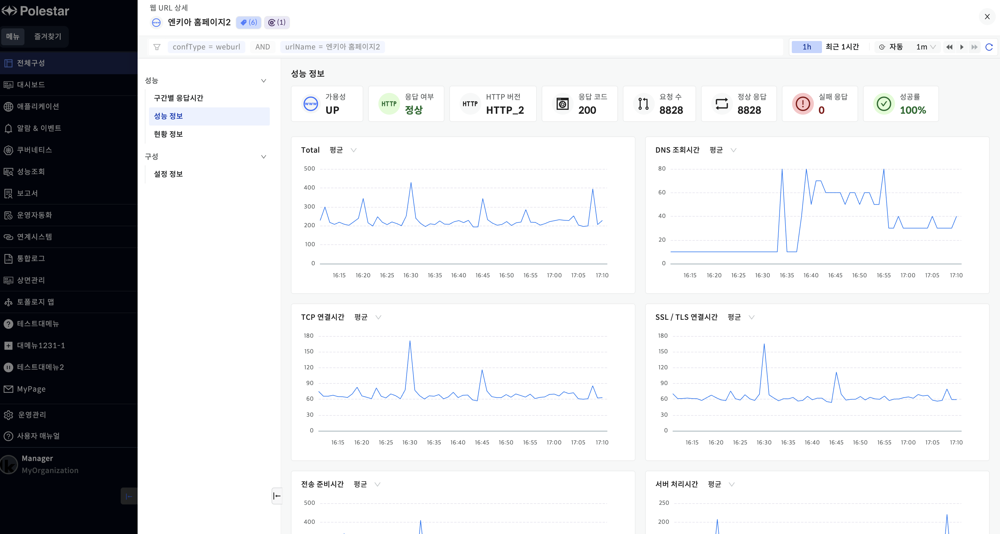
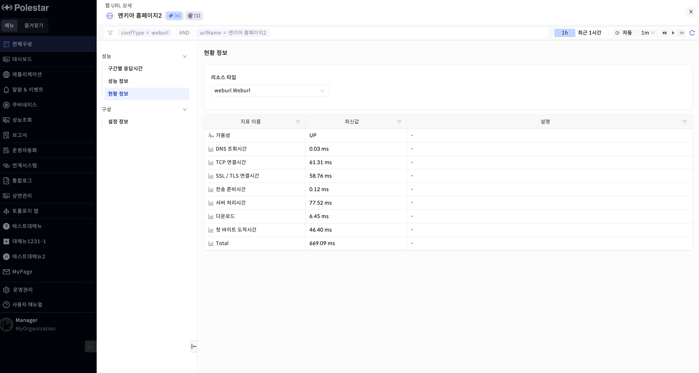
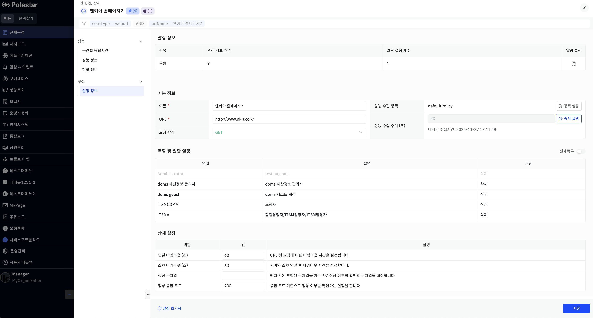
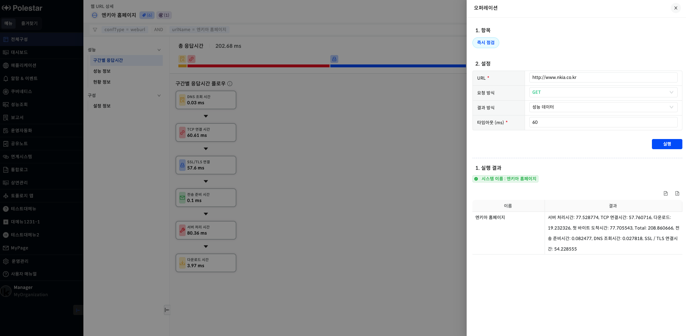

웹 URL 상세

웹 URL 목록에서 시스템 이름을 클릭하여 상세 드로어를 확인할 수 있습니다. 드로어에서는 구간별 응답시간, 성능 정보, 현황정보, 설정 정보를 확인할 수 있습니다.

▶ \[그림 \] 웹 URL **상세**

구간별 응답시간

구간별 응답시간 플로우를 통해 현재 상태를 확인할 수 있습니다.

기본이 Live이며, 설정 정보에 설정된 구간별 수집시간 기준으로 Live가 동작합니다.

▶ \[그림2\] 웹 URL 구간별 응답시간

성능정보

성능 정보를 확인할 수 있습니다.

▶ \[그림3\] 웹 URL 성능 정보

▶ \[그림4\] 웹 URL 성능 정보

> 성능 정보 목록

| ToTal       | 총 응답시간을 표시합니다.       |
| ----------- | -------------------- |
| DNS 조회시간    | DNS 조회시간을 표시합니다.     |
| TCP 연결시간    | TCP 연결시간을 표시합니다.     |
| 총 응답시간      | 총 응답시간을 표시합니다.       |
| SSL/TLS연결시간 | SSL/TLS 연결시간을 표시합니다. |
| 전송 준비시간     | 전송 준비시간을 표시합니다.      |
| 서버 처리시간     | 서러 처리시간을 표시합니다.      |
| 첫 바이트 도착시간  | 첫 바이트 도착시간을 표시합니다.   |
| 다운로드        | 다운로드 시간을 표시합니다.      |

현황 정보

성능 현황 데이터를 확인할 수 있는 페이지입니다.

▶ \[그림5\] 웹 URL 현황 정보

> 현황 정보 목록

| 가용성         | 가용성 정보를 표시합니다.       |
| ----------- | -------------------- |
| DNS 조회시간    | DNS 조회시간을 표시합니다.     |
| TCP 연결시간    | TCP 연결시간을 표시합니다.     |
| SSL/TLS연결시간 | SSL/TLS 연결시간을 표시합니다. |
| 전송 준비시간     | 전송 준비시간을 표시합니다.      |
| 서버 처리시간     | 서러 처리시간을 표시합니다.      |
| 다운로드        | 다운로드 시간을 표시합니다.      |
| 첫 바이트 도착시간  | 첫 바이트 도착시간을 표시합니다.   |
| Total       | 총 응답시간을 표시합니다.       |

설정 정보

웹 URL 감시 대상의 설정 정보를 표시합니다.

▶ \[그림6\] 웹 URL 설정 정보

> 설정 정보 목록

<table>
<thead>
<tr class="header">
<th>알람 정보</th>
<th>
알람 정보를 표시합니다.

관리 지표 개수 : 관리 되는 지표 대상을 표시합니다.

알람 설정 개수 : 알람이 설정된 개수를 표시합니다.
</th>
</tr>
</thead>
<tbody>
<tr class="odd">
<td>기본 정보</td>
<td>
이름 : 웹 URL을 등록한 이름을 표시합니다.

성능 수집 정책 : 관리 지표를 수집하는 정책을 표시합니다.

URL : 웹 URL을 등록한 URL을 표시합니다.

성능 수집 주기(초) : 성능 수집 정책에 정의된 수집 주기를 표시합니다. 구간별 응답시간의 Live 모드에서 사용됩니다.

요청 방식 : URL에 요청하는 방식을 표시합니다.
</td>
</tr>
<tr class="even">
<td>역할 및 권한 설정</td>
<td>해당 웹 URL에 접근 할 수 있는 역할과 권한을 설정합니다.</td>
</tr>
<tr class="odd">
<td>상세 설정</td>
<td>
등록된 웹 URL의 상세 설정을 표시합니다.

연결 타임아웃(초) : URL 첫 요청에 대한 타임아웃 시간을 설정합니다.

소켓 타임아웃(초): 서버와 소켓 연결 후 타임아웃 시간을 설정합니다.

정상 문자열 : 헤더 안에 포함된 문자열을 기준으로 정상 여부를 확인할 문자열을 설정합니다.

정상 응답 코드 : 응답 코드 기준으로 정상 여부를 확인하는 설정을 합니다.
</td>
</tr>
</tbody>
</table>

웹 URL 오퍼레이션

오퍼레이션을 실행 할 수 있습니다. 웹 URL의 상태를 확인하기 위한 기능을 제공합니다.

▶ \[그림7\] 웹 URL 오퍼레이션

> 웹 URL 오퍼레이션

| 항목        | 항목은 즉시 점검 하나로 즉시 실행 결과를 확인할 수 있습니다. |
| --------- | ----------------------------------- |
| URL       | 요청할 URL을 작성합니다.                     |
| 요청 방식     | 요청 방식은 GET, POST 두가지가 있습니다.         |
| 결과 방식     | 결과 방식은 성능 데이터, 응답 결과가 있습니다.         |
| 타임 아웃(ms) | 타임 아웃은 요청시 설정할 타임 아웃시간을 설정합니다.      |
| 실행 결과     | 결과 방식에 따른 결과가. 표시 됩니다.              |

