개별 알람 정책

개별 알람 정책은 대상 리소스를 지정하여 적용하는 알람 정책입니다. 대상 리소스는 다양한 OS의 서버, 데이터베이스, KCM, 어플리케이션 서버 등 다양한 대상을 선택할 수 있습니다. 대상 리소스에서 수집되는 다양한 성능 정보, 이벤트, 구성 정보를 대상으로 알람 정책을 설정하고 모니터링 할 수 있습니다. 지표를 선택하면 해당 지표의 이력정보 또는 현재 값을 보여주기 때문에 임계 값을 설정하는데 도움을 줄 수 있습니다.

알람 정책에 통보 설정을 추가하여 사용자에게 즉시 통보가 가능하며 즉시 통보 설정과 함께 여러 개의 지연 통보 설정을 통해서 알람이 해제되지 않는 상황이 지속되면 상위 담당자, 관리자에게 순차적으로 통보할 수 있습니다. 액션 설정을 통해서 자동 복구 처리 및 기타 필요한 작업을 수행할 수 있습니다.

개별 알람 정책 중에는 공통 알람 정책을 대상 시스템에 적용한 알람 정책도 포함되며 목록에서 \[정책명\]이 있는 개별 알람 정책은 공통 알람 정책을 통해서 배포된 정책입니다.

<table>
<tbody>
<tr class="odd">
<td>
노트

공통 알람 정책으로 배포된 알람 정책을 개별 알람 정책에서 선택하고 수정하면 대상 리소스의 개별 알람 정책으로 변경됩니다. 공통 알람 정책을 변경하려면 공통 알람 정책 메뉴에서 수정해야 합니다.

간단한 작업으로 인해서 불필요한 알람이 발생하는 상황이라면 알람 정책의 [사용 여부]를 미사용으로 변경하여 설정의 변경 없이 알람이 발생되지 않도록 할 수 있습니다.
</td>
</tr>
</tbody>
</table>

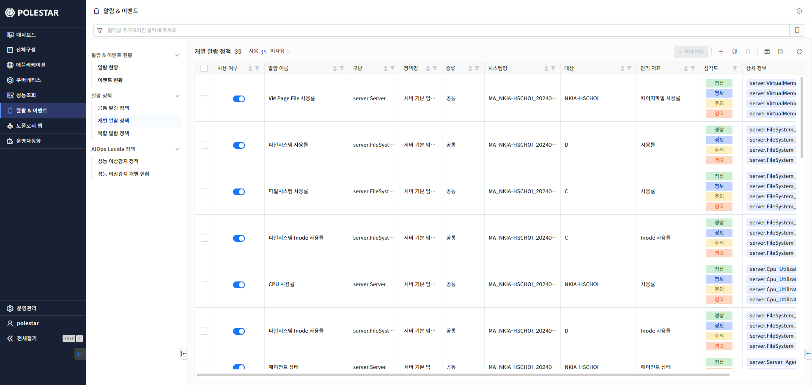

▶ \[그림1\] 개별 알람 정책 목록

화면 지표

<table>
<thead>
<tr class="header">
<th>사용여부</th>
<th>
사용 여부입니다.

토글 버튼()을 클릭하면 사용 여부가 변경됩니다.

미사용인 경우 해당 알람 정책으로 알람이 발생되지 않습니다.
</th>
</tr>
</thead>
<tbody>
<tr class="odd">
<td>알람 이름</td>
<td>알람 정책 이름입니다.</td>
</tr>
<tr class="even">
<td>구분</td>
<td>대상 시스템 타입입니다.</td>
</tr>
<tr class="odd">
<td>정책명</td>
<td>공통 알람 정책이 적용된 개별 알람 정책인 경우 공통 알람 정책명이 표시됩니다.</td>
</tr>
<tr class="even">
<td>종류</td>
<td>
공통 알람 정책이 적용된 알람 정책인지 개별 알람 정책인지 나타냅니다.

공통: 공통 알람 정책

개별: 개별 알람 정책
</td>
</tr>
<tr class="odd">
<td>시스템명</td>
<td>알람 정책이 적용된 대상의 시스템명입니다.</td>
</tr>
<tr class="even">
<td>대상</td>
<td>알람 정책이 적용된 대상의 이름입니다.</td>
</tr>
<tr class="odd">
<td>관리 지표</td>
<td>대상 시스템의 관리 지표입니다. 알람 설정이 [임계값 비교]인 경우 표시됩니다.</td>
</tr>
<tr class="even">
<td>심각도</td>
<td>
알람의 심각도 레벨을 선택합니다.

심각도 레벨 및 순서는 아래와 같습니다.

</td>
</tr>
<tr class="odd">
<td>상세 정보</td>
<td>심각도별 컨디션 로그입니다.</td>
</tr>
</tbody>
</table>

개별 알람 정책 등록

테이블 우측 상단의 \[+\] 아이콘 버튼(클릭 시 "개별 알람 정책 등록" 화면 진입)을 선택하여 새로운 개별 알람 정책을 추가할 수 있습니다.

알람 정책 추가 시 입력 항목이 많고 선택에 따른 화면 변경이 있으므로 화면의 영역별로 설명합니다

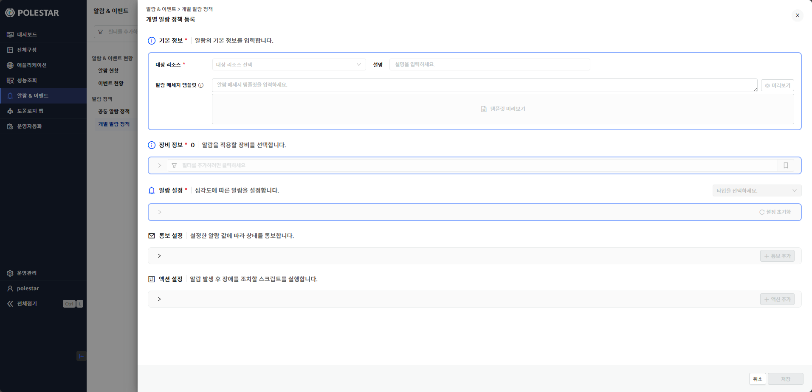

▶ \[그림2\] 개별 알람 정책

기본 정보

알람 정책이 적용되는 대상 리소스, 설명 등 기본적인 정보를 입력합니다. 메세지 템플릿을 입력하여 알람 메세지 형식을 지정할 수 있습니다. 대상 리소스를 선택하면 하단의 \[장비 정보\]에 대상 리소스 타입의 장비 목록이 조회됩니다.

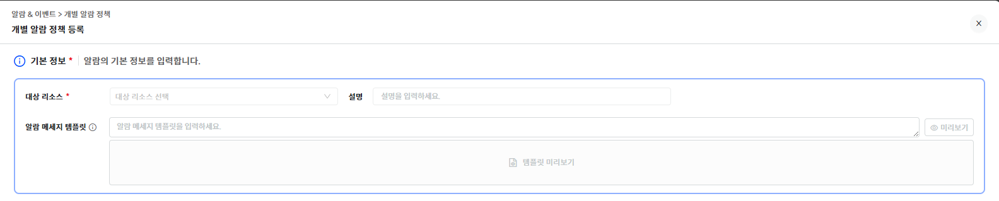

▶ \[그림3\] 개별 알람 정책 – 기본 정보

화면 지표

<table>
<thead>
<tr class="header">
<th>대상 리소스</th>
<th>대상 리소스의 타입을 선택합니다.</th>
</tr>
</thead>
<tbody>
<tr class="odd">
<td>설명</td>
<td>알람 정책 설명을 입력합니다.</td>
</tr>
<tr class="even">
<td>알람 메세지 템플릿</td>
<td>
알람의 메세지 형식을 등록합니다.

입력하지 않으면 기본 메세지 형식으로 생성됩니다.
</td>
</tr>
<tr class="odd">
<td>미리보기 버튼</td>
<td>하단에 입력한 템플릿으로 형식으로 생성된 메세지를 볼 수 있습니다.</td>
</tr>
</tbody>
</table>

알람 메시지 템플릿 입력 절차

사용자가 원하는 알람 메세지 형식을 정의합니다. 메세지에는 \[표현식\]을 추가하여 알람과 관련된 속성을 입력할 수 있습니다. \[$문자열\] 형식으로 입력하면 문자열을 포함하는 속성 표현 값이 Drop Box로 표시되어 선택할 수 있습니다. \[알람 메세지 템플릿\] 타이틀 옆에 있는 도움말 버튼을 클릭하면 도움말 창이 나타나며 사용할 수 있는 \[표현식\]을 확인할 수 있습니다. 입력 후에는 \[미리보기\] 버튼을 클릭하여 원하는 메세지 형식이 맞는지 미리 확인해 볼 수 있습니다.

1.  \[$\]문자 입력.

2.  \[$\]문자에 붙여서 문자를 입력합니다

3.  표시되는 내용중 원하는 내용을 선택합니다

4.  메세지를 입력하여 템플릿을 완성합니다.

5.  미리보기 클릭하여 확인

▶ \[그림4\] 알람 메세지 템플릿 도움말

▶ \[그림5\] 알람 메세지 템플릿 미리보기

장비 정보

알람 정책을 적용하려는 구성을 선택할 수 있습니다. 테이블에는 위에서 선택한 \[대상 리소스\] 타입의 구성 목록이 표시됩니다. 그리드의 컬럼 필터링 기능을 이용하여 대상 장비를 검색할 수 있습니다. 또한, 테이블 상단의 태그 필터링을 이용해서 대상 장비를 검색할 수 있습니다. 태그는 구성 등록 시 자동으로 입력되는 태그 값이 있고 사용자가 수동으로 입력하여 등록하는 커스텀 태그 값이 있습니다. 입력한 태그 조합이 자주 사용하는 조건이면 관심 목록으로 저장하고 불러올 수 있습니다. 대상을 선택하면 \[장비 정보\]타이틀 옆에 선택한 개수가 표시됩니다.

<table>
<tbody>
<tr class="odd">
<td>
노트

태그 정보를 활용하면 원하는 대상 목록을 쉽게 찾을 수 있습니다. 사용자는 대상 장비의 구성 보기(전체 구성&gt; 서버&gt; 시스템 명 클릭) 상세 화면에서 태그 정보를 조회하고 새로운 커스텀 태그를 입력할 수 있습니다.
</td>
</tr>
</tbody>
</table>

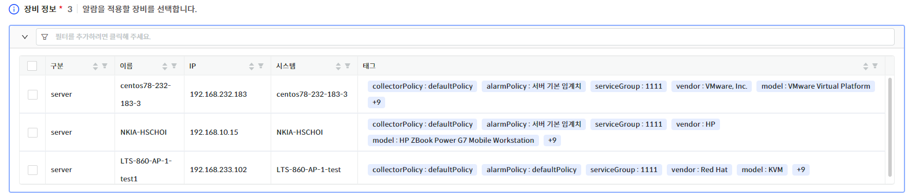

▶ \[그림6\] 장비 정보

화면 지표

<table>
<thead>
<tr class="header">
<th>구분</th>
<th>
대상 리소스의 시스템 타입입니다.

server, oracle, apm 과 같은 정보를 표시합니다.
</th>
</tr>
</thead>
<tbody>
<tr class="odd">
<td>이름</td>
<td>대상 장비의 구성 이름입니다.</td>
</tr>
<tr class="even">
<td>IP</td>
<td>대상 장비의 IP입니다.</td>
</tr>
<tr class="odd">
<td>시스템</td>
<td>대상 장비의 시스템명입니다.</td>
</tr>
<tr class="even">
<td>태그</td>
<td>대상 장비에 등록된 태그 정보입니다</td>
</tr>
</tbody>
</table>

알람 설정(임계값 비교)

장비를 선택하면 \[알람 설정\]이 활성화됩니다. 알람 정책의 알람 설정 중에서 \[임계값 비교\] 설정입니다. 임계값은 등록된 대상 시스템이 수집하는 성능/가용성/문자열 값을 가지고 판단합니다. 즉시 발생/연속발생/N회평가 3 가지의 판단 기준으로 설정 가능합니다. \[심각도 추가\] 버튼을 선택하여 여러 단계의 심각도별 정책을 설정할 수 있습니다. 지표를 선택하면 지표의 이력 데이터 또는 현재 값이 하단에 표시됩니다.

<table>
<tbody>
<tr class="odd">
<td>
노트

여러 단계의 심각도 레벨을 설정할 수 있습니다. 높은 레벨부터 판단하여 조건을 충족하면 알람이 발생됩니다..
</td>
</tr>
</tbody>
</table>

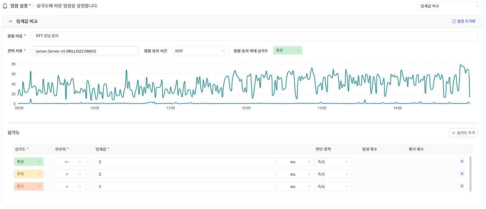

▶ \[그림7\] 알람 설정(임계값 비교)

화면 지표

<table>
<thead>
<tr class="header">
<th>알람 이름</th>
<th>알람 정책의 이름을 입력합니다.</th>
</tr>
</thead>
<tbody>
<tr class="odd">
<td>관리 지표</td>
<td>
감시할 지표를 선택합니다.

관리 지표는 상단에서 입력한 [기본정보]의 [대상 리소스]의 지표가 목록으로 표시됩니다.
</td>
</tr>
<tr class="even">
<td>알람 유지 시간</td>
<td>알람이 발생되고 상태를 유지하는 시간입니다. 해당 시간이 지나면 자동으로 해제됩니다.</td>
</tr>
<tr class="odd">
<td>알람 유지 최대 심각도</td>
<td>
알람 유지 시간이 적용되는 최대 심각도 레벨입니다.

그 이상의 심각도 알람은 자동 해제 없이 계속 유지됩니다.
</td>
</tr>
<tr class="even">
<td>심각도</td>
<td>
알람의 심각도 레벨을 선택합니다.

심각도 레벨 및 순서는 아래와 같습니다.

</td>
</tr>
<tr class="odd">
<td>연산자</td>
<td>
수집된 지표 값과 비교할 연산자를 선택합니다.

</td>
</tr>
<tr class="even">
<td>임계값</td>
<td>
임계값을 입력합니다.

단위를 선택하여 지표의 단위를 변경하여 비교할 수 있습니다.
</td>
</tr>
<tr class="odd">
<td>판단 정책</td>
<td>
판단 정책을 선택합니다.

즉시: 판단 즉시 알람을 발생시킵니다.

연속 발생: 발생 횟수만큼 연속으로 조건을 충족하면 알람이 발생됩니다.

N회 평가: 평가 횟수내에 발생 횟수만큼 조건을 충족하면 알람이 발생됩니다.
</td>
</tr>
<tr class="even">
<td>발생 횟수</td>
<td>발생 횟수를 입력합니다.</td>
</tr>
<tr class="odd">
<td>평가 횟수</td>
<td>평가 횟수를 입력합니다.</td>
</tr>
</tbody>
</table>

알람 설정(이벤트 탐지)

알람 정책의 알람 설정 중에서 \[이벤트 탐지\] 설정입니다. 이벤트 탐지는 \[기본 정보\]에서 로그모니터(server.LogMonitor)와 같이 이벤트를 발생시키는 \[대상 리소스\]를 선택해야 합니다.

<table>
<tbody>
<tr class="odd">
<td>
노트

대상 리소스가 동일한 이벤트를 대량으로 발생시킬 수 있는 경우 알람 정책을 모두발생(동일 컨디션 로그 제외)을 선택하면 동일한 메세지의 알람이 발생되는 것을 방지할 수 있습니다.
</td>
</tr>
</tbody>
</table>

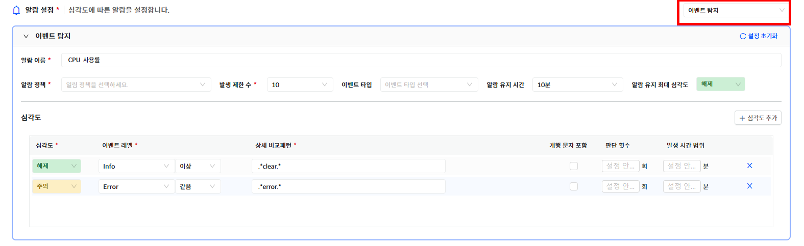

▶ \[그림8\] 알람 정책 – 알람 설정(이벤트 탐지)

화면 지표

<table>
<thead>
<tr class="header">
<th>알람 이름</th>
<th>알람 정책의 이름을 입력합니다.</th>
</tr>
</thead>
<tbody>
<tr class="odd">
<td>알람 정책</td>
<td>
모두 발생

조건이 충족되면 모두 알람을 발생시킵니다.

처음 하나

처음 한번만 발생되고 알람이 해제되면 다시 발생됩니다.

마지막 하나(통보 모두 발생)

새로운 알람이 발생되면 기존에 발생된 알람을 자동으로 해제하여 마지막 알람만 유지합니다. 통보는 모두 발생됩니다.

모두 발생(동일 컨디션 로그 제외)

조건이 충족되고 기존에 동일한 컨디션 로그의 알람이 없는 경우 알람을 발생시킵니다.

마지막 하나(처음 발생시만 통보)

새로운 알람이 발생되면 기존에 발생된 알람을 자동으로 해제하여 마지막 알람만 유지합니다. 통보는 처음 발생시에만 통보됩니다.
</td>
</tr>
<tr class="even">
<td>발생 제한 수</td>
<td>1분간 발생될 수 있는 알람 개수를 선택합니다.</td>
</tr>
<tr class="odd">
<td>이벤트 타입</td>
<td>
이벤트 타입을 선택합니다.

대상 리소스에서 발생될 수 있는 이벤트 타입을 선택합니다.
</td>
</tr>
<tr class="even">
<td>알람 유지 시간</td>
<td>알람이 발생되고 상태를 유지하는 시간입니다. 해당 시간이 지나면 자동으로 해제됩니다.</td>
</tr>
<tr class="odd">
<td>알람 유지 최대 심각도</td>
<td>
알람 유지 시간이 적용되는 최대 심각도 레벨입니다.

그 이상의 심각도 알람은 자동 해제 없이 계속 유지됩니다.
</td>
</tr>
<tr class="even">
<td>심각도</td>
<td>
알람의 심각도 레벨을 선택합니다.

심각도 레벨 및 순서는 아래와 같습니다.

</td>
</tr>
<tr class="odd">
<td>이벤트 레벨</td>
<td>
이벤트 레벨 및 비교 방법을 선택합니다.

이벤트 레벨 및 순서는 아래와 같습니다.

Fatal

Error

Warn

Info

Debug
</td>
</tr>
<tr class="even">
<td>상세 비교 패턴</td>
<td>이벤트 메세지에서 탐지할 정규식 패턴을 입력합니다.</td>
</tr>
<tr class="odd">
<td>개행 문자 포함</td>
<td>
이벤트 메세지에 개행 문자의 포함 여부를 선택합니다.

[개행 문자 포함] 여부에 따라서 내부에서 정규식 패턴 탐지 방법이 달라집니다.
</td>
</tr>
<tr class="even">
<td>판단 횟수</td>
<td>
알람이 발생되기 위한 조건인 탐지 횟수를 입력합니다.

입력 값이 없으면 이벤트 마다 알람이 발생됩니다.

발생 시간 범위 내에서 해당 횟수 이상 [상세 비교 패턴]이 탐지되면 알람이 발생됩니다.

따라서, [판단 횟수]와 [발생 시간 범위]는 동시에 입력되거나 모두 입력되지 않아야 합니다.
</td>
</tr>
<tr class="odd">
<td>발생 시간 범위</td>
<td>발생 시간 범위를 입력합니다.</td>
</tr>
</tbody>
</table>

알람 설정(구성 변경 탐지)

알람 정책의 알람 설정 중에서 \[구성 변경 탐지\] 설정입니다. 구성 변경 탐지는 대상 리소스에서 주기적으로 수집되는 구성 정보의 속성 값 추가/삭제/변경 여부를 탐지합니다. 구성 정보의 특정 속성을 지정하지 않고 모든 속성 중에서 일부라도 변경되면 탐지됩니다.

<table>
<tbody>
<tr class="odd">
<td>
노트

구성 변경 탐지 설정으로 알람이 발생되는 경우는 항상 구성 변경 이력이 발생됩니다.
</td>
</tr>
</tbody>
</table>

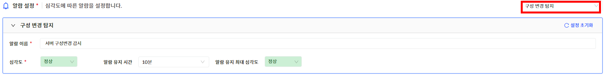

▶ \[그림9\] 알람 정책 – 알람 설정(구성 변경 탐지)

화면 지표

<table>
<thead>
<tr class="header">
<th>알람 이름</th>
<th>알람 정책의 이름을 입력합니다.</th>
</tr>
</thead>
<tbody>
<tr class="odd">
<td>심각도</td>
<td>
알람의 심각도 레벨을 선택합니다.

심각도 레벨 및 순서는 아래와 같습니다.

</td>
</tr>
<tr class="even">
<td>알람 유지 시간</td>
<td>알람이 발생되고 상태를 유지하는 시간입니다. 해당 시간이 지나면 자동으로 해제됩니다.</td>
</tr>
<tr class="odd">
<td>알람 유지 최대 심각도</td>
<td>
알람 유지 시간이 적용되는 최대 심각도 레벨입니다.

그 이상의 심각도 알람은 자동 해제 없이 계속 유지됩니다.
</td>
</tr>
</tbody>
</table>

알람 설정(베이스라인 비교)

알람 정책의 알람 설정 중에서 \[베이스라인 비교\] 설정입니다. 베이스라인은 등록된 대상 시스템이 수집하는 성능 값의 통계 데이터를 가지고 판단합니다. 임계치 비교 설정과 유사하지만 베이스라인을 선택하기 위해 기준과 베이스라인을 지정해야 합니다. 즉시 발생/연속발생/N회평가 3 가지의 판단 기준으로 설정 가능합니다. \[심각도 추가\] 버튼을 선택하여 여러 단계의 심각도별 정책을 설정할 수 있습니다.

<table>
<tbody>
<tr class="odd">
<td>
노트

임계치 비교 설정과 동일하게 컨디션을 설정할 수 있습니다. 베이스라인에 맞는 성능 통계 데이터가 쌓인 이후에 모니터링 판단이 가능합니다..
</td>
</tr>
</tbody>
</table>

▶ \[그림10\] 알람 정책 – 알람 설정(베이스라인 비교)

기본 정보

<table>
<thead>
<tr class="header">
<th>알람 이름</th>
<th>알람 정책의 이름을 입력합니다.</th>
</tr>
</thead>
<tbody>
<tr class="odd">
<td>관리 지표</td>
<td>
감시할 지표를 선택합니다.

관리 지표는 상단에서 입력한 [기본정보]의 [대상 리소스]의 지표가 목록으로 표시됩니다.
</td>
</tr>
<tr class="even">
<td>알람 유지 시간</td>
<td>알람이 발생되고 상태를 유지하는 시간입니다. 해당 시간이 지나면 자동으로 해제됩니다.</td>
</tr>
<tr class="odd">
<td>알람 유지 최대 심각도</td>
<td>
알람 유지 시간이 적용되는 최대 심각도 레벨입니다.

그 이상의 심각도 알람은 자동 해제 없이 계속 유지됩니다.
</td>
</tr>
<tr class="even">
<td>기준</td>
<td>변화 값 또는 변경 비율 중에서 선택합니다.</td>
</tr>
<tr class="odd">
<td>베이스라인</td>
<td>
성능 통계 비교 대상을 선택합니다.

의 최소 / 평균 / 최대 중에서 선택합니다.
</td>
</tr>
<tr class="even">
<td>심각도</td>
<td>
알람의 심각도 레벨을 선택합니다.

심각도 레벨 및 순서는 아래와 같습니다.

</td>
</tr>
<tr class="odd">
<td>연산자</td>
<td>
수집된 지표 값과 비교할 연산자를 선택합니다.

</td>
</tr>
<tr class="even">
<td>임계값</td>
<td>
임계값을 입력합니다.

단위를 선택하여 지표의 단위를 변경하여 비교할 수 있습니다.
</td>
</tr>
<tr class="odd">
<td>판단 정책</td>
<td>
판단 정책을 선택합니다.

즉시: 판단 즉시 알람을 발생시킵니다.

연속 발생: 발생 횟수만큼 연속으로 조건을 충족하면 알람이 발생됩니다.

N회 평가: 평가 횟수내에 발생 횟수만큼 조건을 충족하면 알람이 발생됩니다.
</td>
</tr>
<tr class="even">
<td>발생 횟수</td>
<td>발생 횟수를 입력합니다.</td>
</tr>
<tr class="odd">
<td>평가 횟수</td>
<td>평가 횟수를 입력합니다.</td>
</tr>
</tbody>
</table>

통보 설정

알람이 발생되면 통보 설정에 따라서 사용자에게 통보가 발송됩니다. 통보 이력은 \[알람 현황 \> 알람 상세 보기\]의 통보 이력 탭에서 확인 할 수 있습니다.

<table>
<tbody>
<tr class="odd">
<td>
노트

통보 발송의 성공 여부는 통보 설정에 등록된 대상 시스템으로의 통보 메세지 전송 성공여부를 의미하며 실제 사용자에게 통보가 전달되었음을 의미하지는 않습니다.
</td>
</tr>
</tbody>
</table>

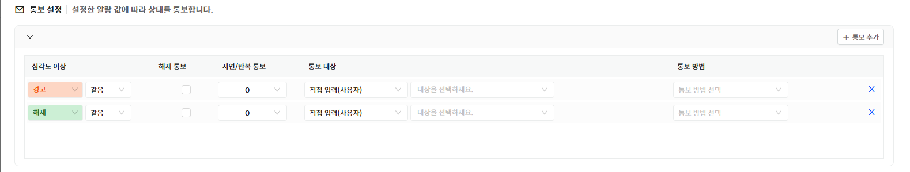

▶ \[그림11\] 알람 정책 – 통보 설정

화면 지표

<table>
<thead>
<tr class="header">
<th>심각도</th>
<th>통보 대상이 되는 알람의 심각도 레벨을 선택합니다.</th>
</tr>
</thead>
<tbody>
<tr class="odd">
<td>해제 통보</td>
<td>알람이 해제되는 경우 통보를 발송할 지 여부를 선택합니다.</td>
</tr>
<tr class="even">
<td>지연/반복 통보</td>
<td>
통보 발송 시기를 설정합니다.

[즉시 이후 반복]은 즉시 통보 이후 알람이 해제되지 않으면 반복해서 통보를 보냅니다. 5분 간격으로 3회 발송됩니다.

설정할 수 있는 옵션은 다음과 같습니다.

즉시

5분 지연

10분 지연

30분 지연

1 시간 지연

6시간 지연

12시간 지연

1일 지연

즉시 이후 반복
</td>
</tr>
<tr class="odd">
<td>통보 대상</td>
<td>
통보 대상을 입력합니다.

방식은 다음과 같습니다.

직접 입력(사용자)를 선택하고 사용자를 선택합니다.

직접 입력(사용자 그룹)을 선택하고 사용자 그룹을 선택합니다.

직접 입력(역할)을 선택하고 역할을 선택합니다.
</td>
</tr>
<tr class="even">
<td>통보 방법</td>
<td>
통보 방법을 선택합니다.

통보 방법은 [운영 관리&gt; 기본 설정&gt; 통보 설정]메뉴의 [통보 방식]탭에서 확인 가능합니다. (사용 여부와 상관없이 표현됩니다.)
</td>
</tr>
</tbody>
</table>

액션 설정

액션 설정은 알람 발생 후 자동으로 장애를 조치하거나 상황에 대한 정보를 남길 수 있도록 특정 명령어를 등록하여 실행할 수 있는 기능입니다. 알람의 심각도별 액션을 설정할 수 있습니다.

▶ \[그림12\] 알람 정책 – 액션 설정

화면 지표

<table>
<thead>
<tr class="header">
<th>액션 종류</th>
<th>
액션의 종류를 선택합니다.

현재는 AGENT에서 실행 옵션만 제공됩니다.

AGENT에서 실행

등록된 명령어를 대상 시스템의 Agent에서 실행합니다.
</th>
</tr>
</thead>
<tbody>
<tr class="odd">
<td>실행 스크립트</td>
<td>
실행할 스크립트 명령어입니다.

전체 경로를 입력하여 등록해야 합니다
</td>
</tr>
<tr class="even">
<td>심각도</td>
<td>알람의 심각도 레벨을 선택합니다</td>
</tr>
</tbody>
</table>

개별 알람 정책 삭제

개별 알람 정책을 삭제하려는 경우 목록에서 삭제할 정책을 선택하고 \[삭제\] 버튼을 클릭해서 삭제할 수 있습니다.

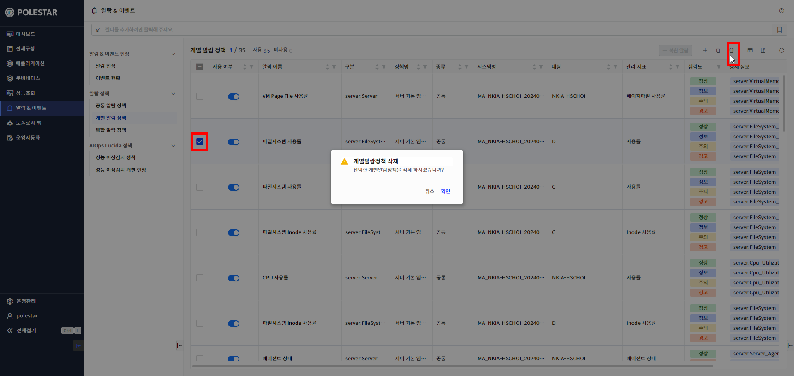

▶ \[그림13\] 개별 알람 정책 삭제

개별 알람 정책 수정 절차

1.  삭제하고자 하는 개별 알람 정책을 선택 (다중 선택 가능)

2.  테이블 우측 상단의 삭제 아이콘 클릭

3.  메시시창에서 확인 클릭

개별 알람 정책 수정

목록에서 알람 이름을 클릭하면 개별 알람 정책의 상세 내용이 표시됩니다. 대상 리소스와 장비 정보는 수정할 수 없고 알람 정책 정보와 통보설정, 액션설정을 수정할 수 있습니다.

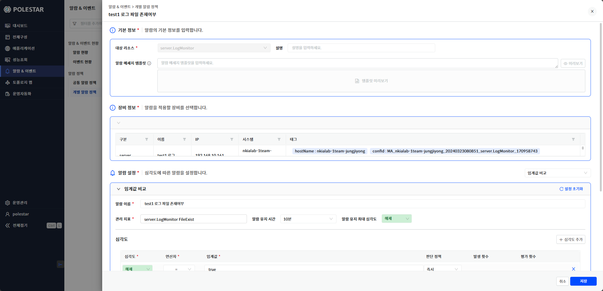

▶ \[그림14\] 개별 알람 정책 수정

개별 알람 정책 수정 절차

1.  목록에서 수정하고자 하는 개별 알람 정책의 이름을 선택.

2.  상세 보기 창이 표시되면 \[알람 정책 등록\]과 동일한 방식으로 수정.

3.  하단의 저장 클릭

개별 알람 정책 복사

등록된 개별 알람 정책을 선택하여 다른 대상 리소스에 적용할 수 있습니다. 개별 알람 정책이 복사되어 적용됩니다. 개별 알람 정책을 여러 개 동시에 선택하고 복사할 수 있습니다. 여러 개의 알람을 동시에 복사하는 경우에는 선택한 알람 정책들의 대상 리소스 타입이 모두 동일해야 합니다. 실행 후 복사 결과 화면에서 대상 리소스별 복사 성공 여부 및 에러메세지를 확인할 수 있습니다.

<table>
<tbody>
<tr class="odd">
<td>
노트

개별 알람 정책 복사는 복사하여 적용하는 기능입니다. 수정은 개별적으로 적용됩니다. 동일한 알람 정책을 계속 유지하고 동시에 변경하려면 공통 알람 정책을 사용해야 합니다.
</td>
</tr>
</tbody>
</table>

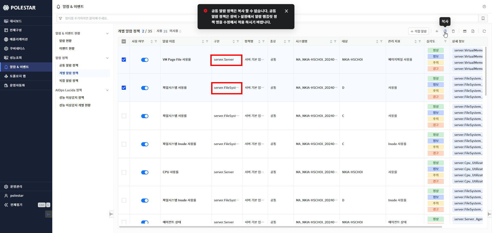

▶ \[그림15\] 대상 리소스 타입이 다른 개별 알람 정책 선택 시 경고 메세지 창

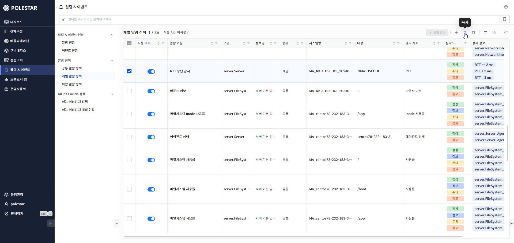

▶ \[그림16\] 개별 알람 정책 복사

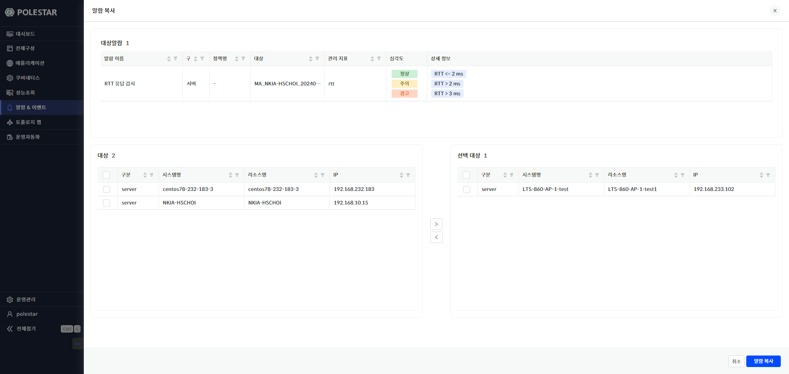

▶ \[그림17\] 개별 알람 정책 복사

화면 지표

<table>
<thead>
<tr class="header">
<th>알람 이름</th>
<th>알람 이름.</th>
</tr>
</thead>
<tbody>
<tr class="odd">
<td>구분</td>
<td>대상 리소스 타입</td>
</tr>
<tr class="even">
<td>정책명</td>
<td>공통 알람 정책의 이름</td>
</tr>
<tr class="odd">
<td>대상</td>
<td>알람 정책 대상 리소스</td>
</tr>
<tr class="even">
<td>관리 지표</td>
<td>관리 지표 이름</td>
</tr>
<tr class="odd">
<td>심각도</td>
<td>
알람의 심각도 레벨을 선택합니다.

심각도 레벨 및 순서는 아래와 같습니다.

</td>
</tr>
<tr class="even">
<td>상세 정보</td>
<td>심각도별 컨디션 로그입니다.</td>
</tr>
</tbody>
</table>

화면 지표

알람 정책을 적용하기 위해 선택한 대상 리소스 목록

| 구분   | 대상 리소스 타입      |
| ---- | -------------- |
| 시스템명 | 대상 리소스의 시스템 이름 |
| 리소스명 | 대상 리소스 이름      |
| IP   | 대상 리소스의 IP     |

알람 복사 결과

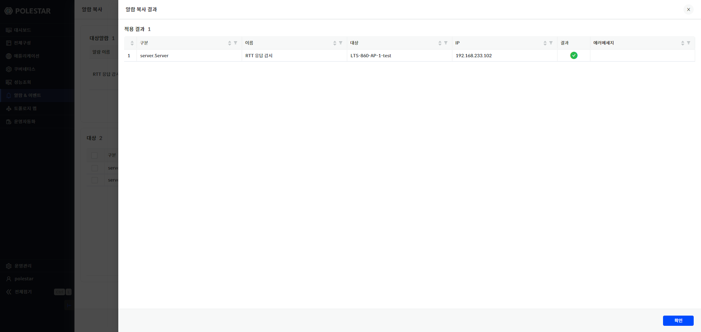

▶ \[그림18\] 알람 복사 결과

화면 지표

| 라인    | 라인 번호.         |
| ----- | -------------- |
| 구분    | 대상 리소스 타입      |
| 이름    | 알람 이름          |
| 대상    | 대상 리소스 이름      |
| IP    | 대상 리소스 IP      |
| 결과    | 알람 복사 결과       |
| 에러메세지 | 에러가 발생한 경우 메세지 |

개별 알람 정책 수정 절차

1.  목록에서 수정하고자 하는 개별 알람 정책의 이름을 선택.

2.  테이블 우측 상단의 \[개별 알람 정책 복사\]버튼 선택

3.  대상 목록에서 선택하고 선택 대상으로 이동

4.  하단의 \[알람 복사\] 버튼 선택 후 복사 선택

5.  알람 복사 결과 창에서 적용 결과 확인

복합 알람 정책

여러 개의 개별 알람 정책을 묶어서 새로운 복합 알람 정책을 등록할 수 있습니다. 복합 알람 정책은 여러 가지 지표의 묶음으로 알람 발생 상황을 모니터링하는 기능입니다. 서비스의 주요 지표에 등록된 알람을 묶어서 서비스 감시 알람 정책을 등록할 수 있습니다. 복합 알람 정책을 관리하는 기능은 \[복합 알람 정책 매뉴얼\]에서 확인할 수 있습니다.

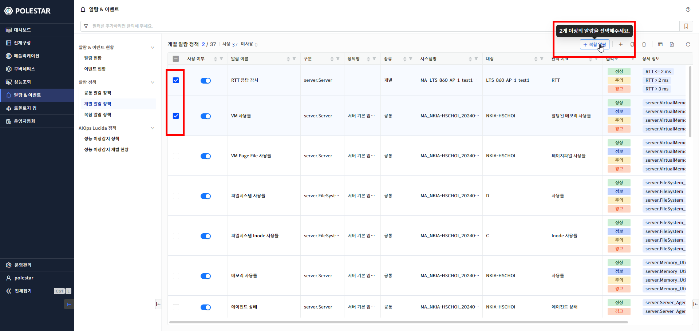

▶ \[그림19\] 복합 알람 정책 등록

