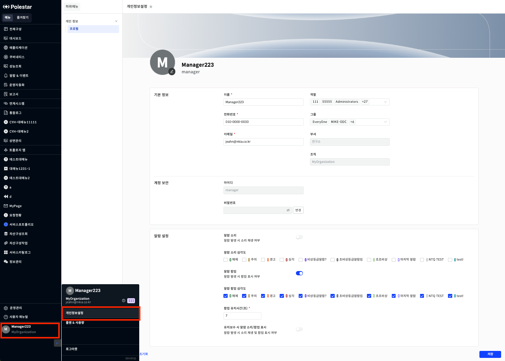
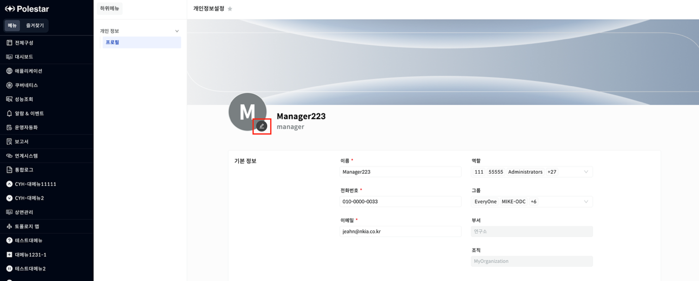
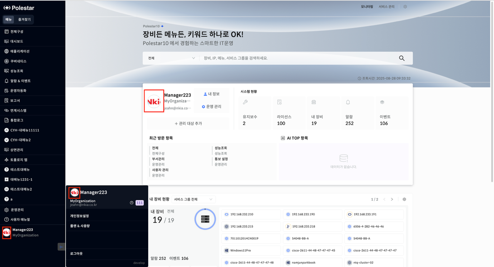
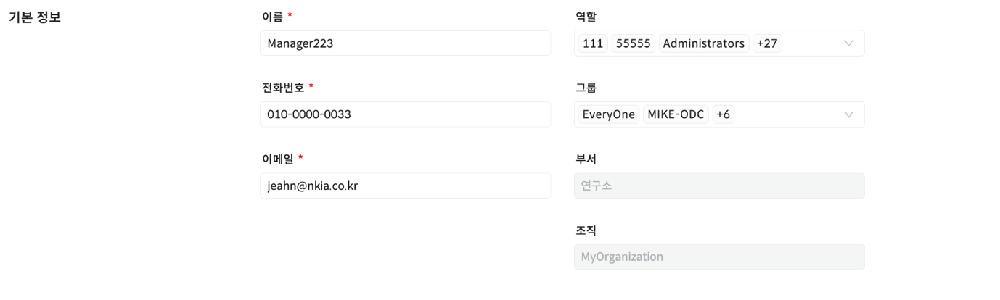
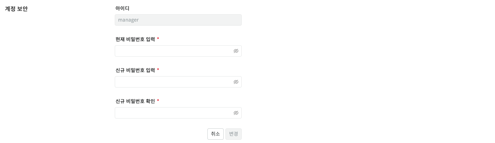
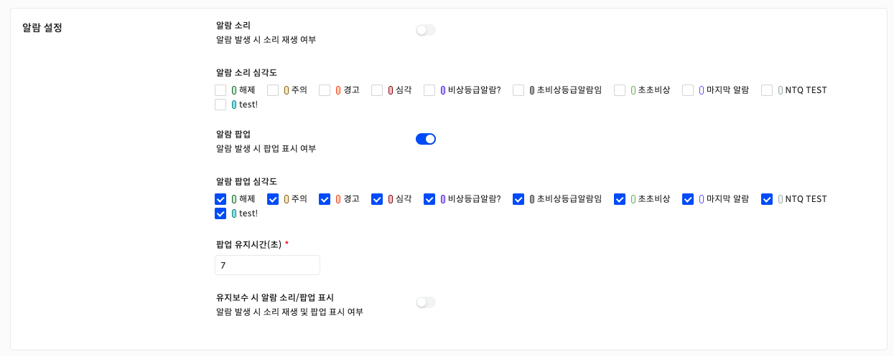
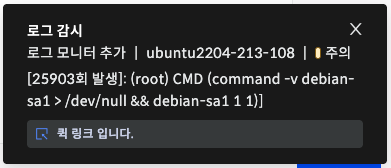
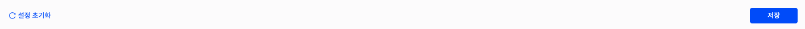

개인정보 프로필

사용자 메뉴에서 \[개인정보설정\]을 선택하면 개인 정보를 확인하고 수정할 수 있는 화면을 확인할 수 있습니다.

▶ \[그림1\] 개인정보 프로필

프로필 이미지 설정

사용자 계정의 프로필 이미지를 설정할 수 있습니다.

▶ \[그림2\] 프로필 이미지 설정

<table>
<tbody>
<tr class="odd">
<td>
노트

이미지의 사이즈는 2MB 를 넘길 수 없으며 jpg 또는 jpeg 형식만 지원합니다.

이미지를 설정하지 않으면 계정 이름의 첫 글자가 표시됩니다.
</td>
</tr>
</tbody>
</table>

프로필로 설정된 이미지는 대메뉴, 사용자 메뉴, 사용자 포털에 적용됩니다.

▶ \[그림3\] 프로필 이미지 적용

기본 정보

사용자 프로필의 기본 정보를 표시하며, 일부 항목을 제외하고 수정이 가능합니다.

▶ \[그림3\] 기본 정보

화면 지표

| 이름   | 사용자의 이름이 표시됩니다.                                                  |
| ---- | ---------------------------------------------------------------- |
| 전화번호 | 사용자의 전화번호가 표시됩니다.                                                |
| 이메일  | 사용자의 이메일 주소가 표시됩니다.                                              |
| 역할   | 현재 사용자의 역할을 나타냅니다. 해당 영역을 누르면 사용자의 역할을 변경할 수 있습니다. (다중 선택 가능)    |
| 그룹   | 현재 사용자의 그룹 정보를 나타냅니다. 해당 영역을 누르면 사용자의 그룹을 변경할 수 있습니다. (다중 선택 가능) |
| 부서   | 사용자의 부서가 표시됩니다. (수정 불가)                                          |
| 조직   | 사용자의 조직이 표시됩니다. (수정 불가)                                          |

계정 보안

계정의 비밀번호를 변경할 수 있는 기능을 제공합니다.

▶ \[그림4\] 계정 보안

▶ \[그림5\] 비밀번호 변경

계정 보안

사용자의 비밀번호를 변경할 수 있는 기능을 제공합니다.

화면 지표

| 아이디        | 현재 로그인한 계정의 아이디를 표시하며 수정할 수 없습니다.                                   |
| ---------- | ------------------------------------------------------------------- |
| 변경         | 클릭 시 비밀번호를 변경할 수 있는 UI로 전환됩니다.                                      |
| 현재 비밀번호 입력 | 현재 사용중인 비밀번호를 입력합니다.                                                |
| 신규 비밀번호 입력 | 새롭게 변경할 비밀번호를 입력합니다. 입력 시, 관리자가 설정한 비밀번호 복잡도에 따라 실시간 유효성 검사가 진행됩니다. |
| 신규 비밀번호 확인 | 새롭게 변경할 비밀번호를 한 번 더 입력합니다.                                          |

알람 설정

알람 발생 시 알람 소리, 팝업 표시 여부를 설정할 수 있는 기능을 제공합니다.

▶ \[그림6\] 알람 설정

화면 지표

<table>
<thead>
<tr class="header">
<th>알람 소리</th>
<th>알람 발생 시 소리 재생 여부를 설정합니다.</th>
</tr>
</thead>
<tbody>
<tr class="odd">
<td>알람 소리 심각도</td>
<td>[운영관리] &gt; [EMS] &gt; [알람 심각도 설정]에서 등록한 심각도가 표시되며, 소리를 발생시킬 심각도를 선택합니다. 
알람 소리는 [알람 심각도 설정]에서 등록할 수 있습니다.</td>
</tr>
<tr class="even">
<td>알람 팝업</td>
<td>알람 발생 시 팝업 표시 여부를 설정합니다.</td>
</tr>
<tr class="odd">
<td>알람 팝업 심각도</td>
<td>[운영관리] &gt; [EMS] &gt; [알람 심각도 설정]에서 등록한 심각도가 표시되며, 팝업을 표시할 심각도를 선택합니다.</td>
</tr>
<tr class="even">
<td>팝업 유지시간(초)</td>
<td>팝업을 유지할 시간을 설정합니다. 1이상 입력해야 하며, 최대 60초까지 설정 가능합니다.</td>
</tr>
<tr class="odd">
<td>유지보수 시 알람 소리/팝업 표시</td>
<td>유지보수 알람 발생 시 소리 재생 여부/팝업 표시 여부를 설정합니다.</td>
</tr>
</tbody>
</table>

알람 팝업

알람 발생 시 팝업을 표시하도록 설정하면 알람 팝업을 확인할 수 있습니다.

▶ \[그림7\] 알람 팝업

화면 지표

<table>
<thead>
<tr class="header">
<th>제목</th>
<th>알람 정의 이름을 표시합니다.</th>
</tr>
</thead>
<tbody>
<tr class="odd">
<td>내용</td>
<td>리소스명, 호스트명, 심각도를 표시합니다 
리소스명과 호스트명 영역을 클릭하면 해당 리소스 도메인의 상세 화면이 열리며 내용을 확인할 수 있습니다.</td>
</tr>
<tr class="even">
<td>퀵 링크</td>
<td>‘퀵 링크 입니다.’ 영역을 클릭하면 알람 상세 화면이 열리며 내용을 확인할 수 있습니다.</td>
</tr>
</tbody>
</table>

설정 저장

▶ \[그림8\] 설정 버튼

화면 지표

| 설정 초기화 | 설정한 정보들을 해당 페이지를 처음 조회한 상태로 되돌립니다. |
| ------ | ---------------------------------- |
| 저장     | 설정한 정보들을 저장합니다.                    |

