공통 알람 정책

알람 정책들을 그룹으로 묶어서 하나의 공통 알람 정책을 정의합니다. 공통 알람 정책은 도메인 속성이 있으며 적용할 대상 시스템의 구성 타입을 나타냅니다. 도메인은 server/network/apm/kcm/oracle … 과 같은 값을 가집니다. 도메인별 기본 정책이 있으며 Polestar서비스가 시작되면 도메인별로 기본 정책이 하나씩 자동으로 생성됩니다. 기본 정책은 삭제될 수 없으며 삭제하려면 도메인 기본 정책을 같은 도메인을 가진 다른 공통 알람 정책으로 변경 후 삭제할 수 있습니다.

시스템에서 관리되는 구성은 하나의 공통 알람 정책을 가져야만 하며 구성이 추가되는 시점에 하나의 공통 알람 정책을 선택해야 합니다. 사용자는 여러 개의 공통 알람 정책을 정의하여 업무를 구성하는 시스템마다 다른 알람 정책을 손쉽게 적용할 수 있습니다. 공통 알람 정책이 적용된 구성에 새로운 하위 구성(파일시스템과 같은)이 추가되면 공통 알람 정책이 자동으로 적용됩니다.

<table>
<tbody>
<tr class="odd">
<td>
노트

공통 알람 정책의 하위 알람 정책이 변경되면 해당 정책에 속한 모든 구성의 알람 정책에 영향이 있습니다. 따라서, 공통 알람 정책은 권한 관리가 필수입니다. 공통 알람 정책은 정책마다 접근 권한이 있으며 쓰기 권한이 있는 사용자만 수정할 수 있습니다. 사용자에게 읽기/쓰기 권한이 없는 공통 알람 정책은 목록에서 보이지 않습니다. 모든 사용자에게 공통 알람 정책을 수정할 수 있는 권한을 부여하기 보다는 관리자급 사용자에게 권한을 부여하여 관리하는 방법을 권장합니다.
</td>
</tr>
</tbody>
</table>

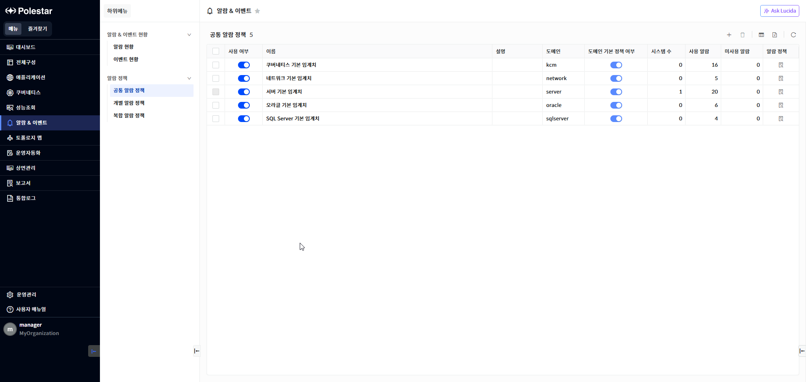

▶ \[그림1\] 공통 알람 정책 목록

화면 지표

<table>
<thead>
<tr class="header">
<th>사용여부</th>
<th>
사용 여부입니다.

토글 버튼()을 클릭하면 사용 여부가 변경됩니다.

미사용인 경우 해당 공통 알람 정책으로 알람이 발생되지 않습니다 .
</th>
</tr>
</thead>
<tbody>
<tr class="odd">
<td>이름</td>
<td>공통 알람 정책 이름입니다.</td>
</tr>
<tr class="even">
<td>설명</td>
<td>설명입니다.</td>
</tr>
<tr class="odd">
<td>도메인</td>
<td>정책을 적용할 구성 대상 타입입니다.</td>
</tr>
<tr class="even">
<td>도메인 기본 정책 여부</td>
<td>기본 정책 여부를 표시합니다.</td>
</tr>
<tr class="odd">
<td>시스템 수</td>
<td>공통 알람 정책이 적용된 구성 시스템 개수입니다.</td>
</tr>
<tr class="even">
<td>사용 알람</td>
<td>하위에 등록된 알람 정책 중에서 사용 여부가 사용인 개수입니다.</td>
</tr>
<tr class="odd">
<td>미사용 알람</td>
<td>하위에 등록된 알람 정책 중에서 사용 여부가 미사용인 개수입니다.</td>
</tr>
</tbody>
</table>

공통 알람 정책 등록

공통 알람 정책 등록 버튼을 클릭하여 새로운 공통 알람 정책을 등록할 수 있습니다. 이름은 중복될 수 없습니다.

<table>
<tbody>
<tr class="odd">
<td>
노트

공통 알람 정책을 삭제하려면 적용된 시스템 개수가 0 이어야 합니다. 다른 공통 알람 정책에 시스템 추가 기능을 사용하여 삭제하려는 공통 알람 정책이 적용된 시스템을 삭제할 수 있습니다.
</td>
</tr>
</tbody>
</table>

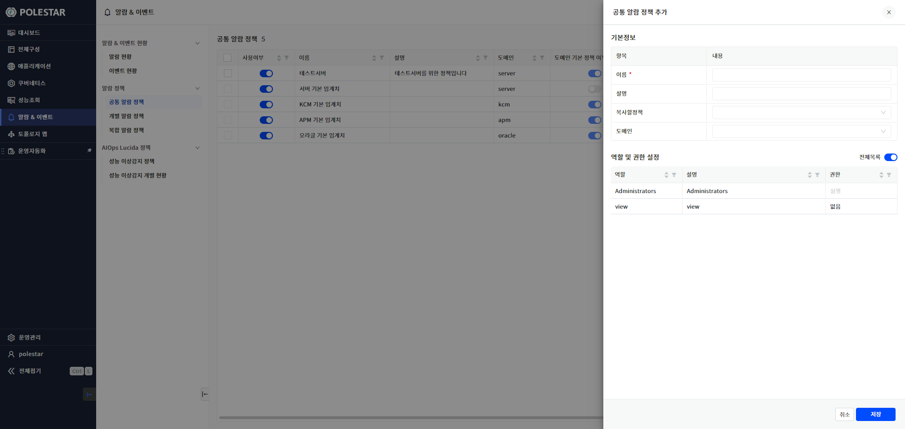

▶ \[그림2\] 공통 알람 정책 등록

화면 지표

<table>
<thead>
<tr class="header">
<th>사용여부</th>
<th>
사용 여부입니다.

토글 버튼()을 클릭하면 사용 여부가 변경됩니다.

미사용인 경우 해당 공통 알람 정책으로 알람이 발생되지 않습니다 .
</th>
</tr>
</thead>
<tbody>
<tr class="odd">
<td>이름</td>
<td>공통 알람 정책의 이름을 입력합니다.</td>
</tr>
<tr class="even">
<td>설명</td>
<td>공통 알람 정책의 설명을 입력합니다.</td>
</tr>
<tr class="odd">
<td>복사할 정책</td>
<td>
복사할 알람 정책을 포함하는 공통 알람 정책을 선택합니다.

박스를 클릭하면 공통 알람 정책 목록이 표시되고 선택할 수 있습니다.
</td>
</tr>
<tr class="even">
<td>도메인</td>
<td>
정책을 적용할 구성 타입을 선택합니다.

구성 타입은 erver, network, apm, oracle 과 같은 값을 가지고 있습니다.
</td>
</tr>
<tr class="odd">
<td>역할 및 권한 설정</td>
<td>
권한 정보를 선택합니다.

권한이 없는 역할은 해당 공통 알람 정책을 조회하거나 수정할 수 없습니다.
</td>
</tr>
</tbody>
</table>

공통 알람 정책 등록 절차

1.  테이블 우측 상단의 공통 알람 정책 등록 버튼을 클릭합니다.

2.  필수 항목인 이름을 입력합니다.

3.  복사할 정책을 선택하면 해당 정책의 하위 알람 정책과 동일한 하위 알람 정책이 등록됩니다.

4.  도메인을 선택합니다.

5.  권한을 선택합니다.

6.  \[저장\] 버튼을 선택하여 저장합니다.

공통 알람 정책 삭제

공통 알람 정책을 삭제하려는 경우 목록에서 삭제할 정책을 선택하고 \[삭제\] 버튼을 클릭해서 삭제할 수 있습니다.

도메인별 기본 정책은 삭제할 수 없습니다. 또한, 공통 알람 정책이 적용된 시스템이 있는 경우 삭제할 수 없습니다. 적용된 시스템이 있는 경우 해당 시스템을 다른 공통 알람 정책으로 변경 후 공통 알람 정책을 삭제 수 있습니다.

<table>
<tbody>
<tr class="odd">
<td>
노트

공통 알람 정책을 삭제하려면 적용된 시스템 개수가 0 이어야 합니다. 다른 공통 알람 정책에 시스템 추가 기능을 사용하여 삭제하려는 공통 알람 정책이 적용된 시스템을 삭제할 수 있습니다.
</td>
</tr>
</tbody>
</table>

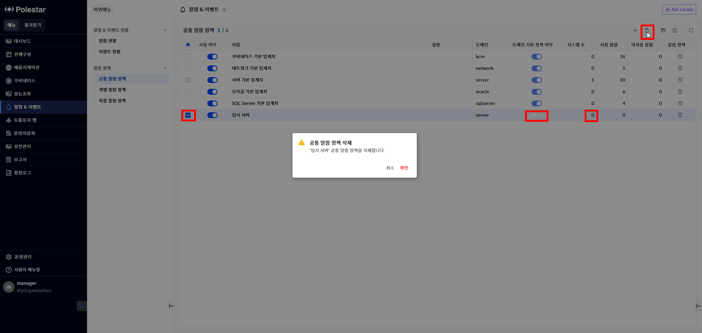

▶ \[그림3\] 공통 알람 정책 삭제

공통 알람 정책 삭제 절차

1.  삭제하고자 하는 공통 알람 정책 선택 (다중 선택 가능).

2.  테이블 우측 상단의 삭제 아이콘 클릭

3.  메시시창에서 확인 클릭

공통 알람 정책 수정

공통 알람 정책의 이름, 설명, 권한을 수정할 수 있습니다. 태그는 이름과 동일한 값으로 이름을 변경하면 자동으로 이름과 같은 값으로 변경됩니다. 권한을 추가하려는 경우 전체목록() 버튼을 클릭하여 전체 권한 목록을 조회한 후 권한을 선택할 수 있습니다.

<table>
<tbody>
<tr class="odd">
<td>
노트

공통 알람 정책은 권한 정보를 가지고 있으면 사용자는 자신의 권한에 따라서 정책을 조회/수정/삭제할 수 있습니다. 예를 들어 조회 권한이 없는 정책은 목록에 표시되지 않습니다.
</td>
</tr>
</tbody>
</table>

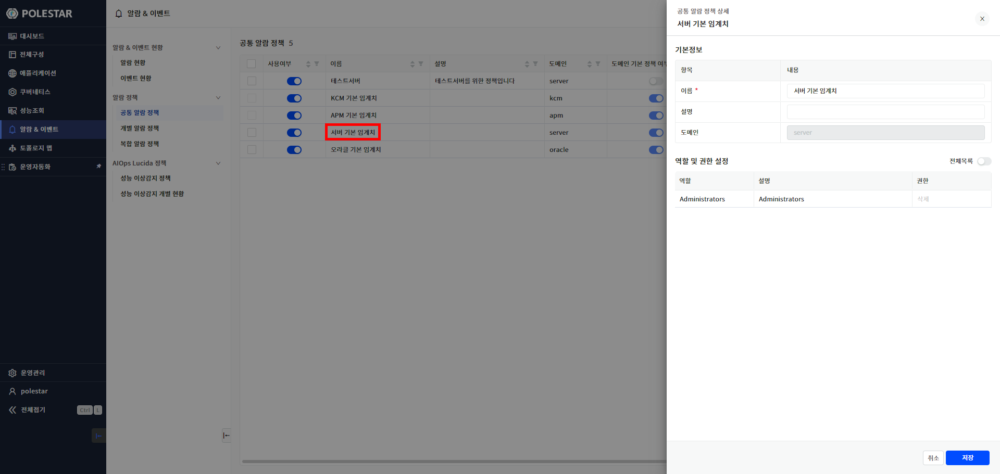

▶ \[그림4\] 공통 알람 정책 수정

시스템 추가

공통 알람 정책을 적용할 시스템을 추가할 수 있습니다. 시스템을 추가하면 공통 알람 정책의 하위 알람 정책이 시스템에 자동으로 적용됩니다. 시스템에 하위 구성이 추가되는 경우에 해당 하위 구성에 맞는 알람 정책이 있다면 즉시 적용됩니다.

<table>
<tbody>
<tr class="odd">
<td>
노트

시스템은 동시에 여러 개의 공통 알람 정책을 적용할 수 있습니다. 공통 알람 정책을 리소스 종류별로 생성하여 다양하게 조합하여 시스템에 적용할 수 있습니다.

사용자는 쓰기 권한이 있는 시스템에 대해서 공통 알람 대상으로 선택하여 적용할 수 있습니다.
</td>
</tr>
</tbody>
</table>

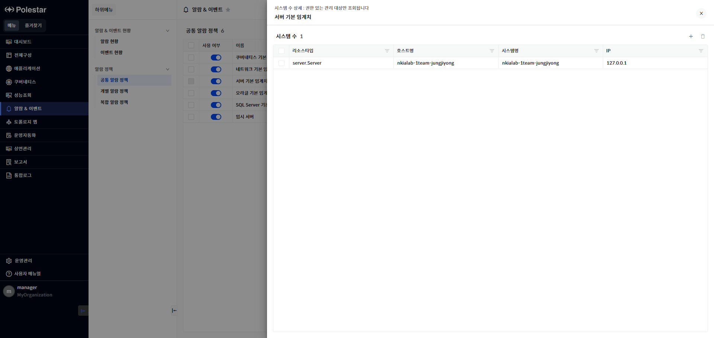

▶ \[그림5\] 공통 알람 정책이 적용된 시스템 목록

화면 지표

<table>
<thead>
<tr class="header">
<th>리소스 타입</th>
<th>
시스템의 타입입니다.

server.Server, apm.Agent. oracle.Oracle 과 같이 시스템을 구분하는 타입 값을 가지고 있습니다.
</th>
</tr>
</thead>
<tbody>
<tr class="odd">
<td>호스트명</td>
<td>시스템의 호스트명입니다.</td>
</tr>
<tr class="even">
<td>시스템명</td>
<td>시스템의 이름입니다..</td>
</tr>
<tr class="odd">
<td>IP</td>
<td>IP입니다.</td>
</tr>
</tbody>
</table>

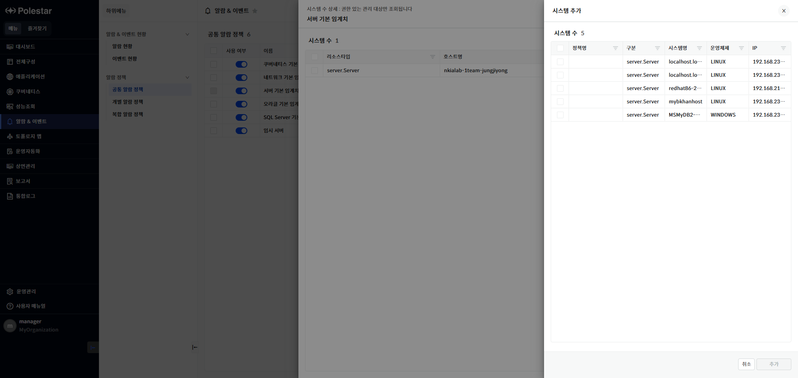

▶ \[그림6\] 대상 추가 버튼 클릭

화면 지표

| 정책명  | 시스템에 적용되어 있는 공통 알람 정책 이름입니다. |
| ---- | ---------------------------- |
| 구분   | 시스템의 타입입니다.                  |
| 시스템명 | 시스템의 이름입니다.                  |
| 운영체제 | 시스템의 운영체제입니다.                |
| IP   | IP입니다.                       |

> 공통 알람 정책에 시스템 추가 절차

1.  > 목록에서 시스템을 추가하려는 공통 알람 정책의 \[시스템 수\]를 클릭합니다.

2.  > 테이블 우측 상단의 \[대상 추가\] 버튼을 클릭합니다.

3.  > 목록에서 시스템을 선택합니다.

4.  > \[추가\] 버튼을 선택하여 시스템을 추가합니다.

알람 정책

공통 알람 정책은 여러 개의 알람 정책으로 구성될 수 있습니다. 알람 정책이 추가, 수정, 삭제되는 경우 공통 알람 정책이 적용된 시스템에 즉시 해당 알람 정책이 적용됩니다. 알람 정책의 사용 여부에 따라서 시스템에 일부 알람 정책을 적용하지 않도록 할 수 있습니다.

<table>
<tbody>
<tr class="odd">
<td>
노트

공통 알람 정책이 사용이고 하위 알람 정책이 사용인 경우 시스템에 적용됩니다. 그렇지 않으면 알람이 발생되지 않습니다.
</td>
</tr>
</tbody>
</table>

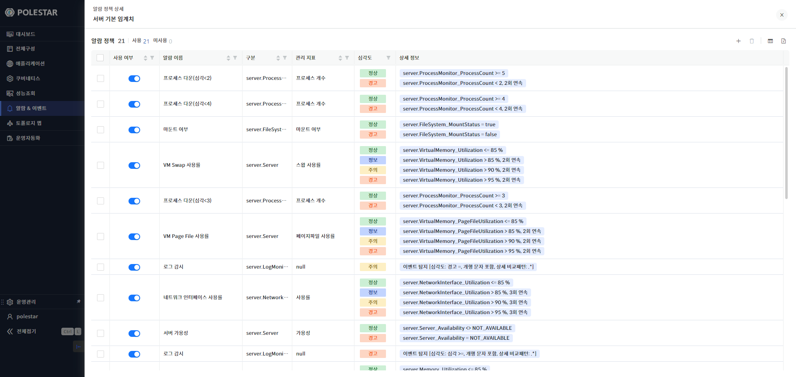

> ▶ \[그림7\] 공통 알람 정책의 알람 정책 목록
> 
> 화면 지표

<table>
<thead>
<tr class="header">
<th>사용 여부</th>
<th>해당 알람 정책의 사용 여부입니다.</th>
</tr>
</thead>
<tbody>
<tr class="odd">
<td>알람 이름</td>
<td>알람 정책 이름입니다.</td>
</tr>
<tr class="even">
<td>구분</td>
<td>
시스템의 타입입니다.

타입 정보는 아래와 같습니다.

서버: server.Server

오라클: oracle.Oracle

어플리케이션: apm.Apm
</td>
</tr>
<tr class="odd">
<td>관리 지표</td>
<td>알람 정책에 설정된 지표입니다</td>
</tr>
<tr class="even">
<td>심각도</td>
<td>알람 정책에 설정된 심각도입니다.</td>
</tr>
<tr class="odd">
<td>상세 정보</td>
<td>심각도별 컨디션 조건입니다.</td>
</tr>
</tbody>
</table>

알람 정책 추가

테이블 우측 상단의 \[알람 정책 등록\] 버튼을 선택하여 새로운 알람 정책을 공통 알람 정책에 추가할 수 있습니다. 알람 정책 추가 시 입력 항목이 많고 선택에 따른 화면 변경이 있으므로 화면의 영역별로 설명합니다.

<table>
<tbody>
<tr class="odd">
<td>
노트

공통 알람 정책에 알람 정책을 추가하면 즉시 대상 시스템에 적용됩니다.
</td>
</tr>
</tbody>
</table>

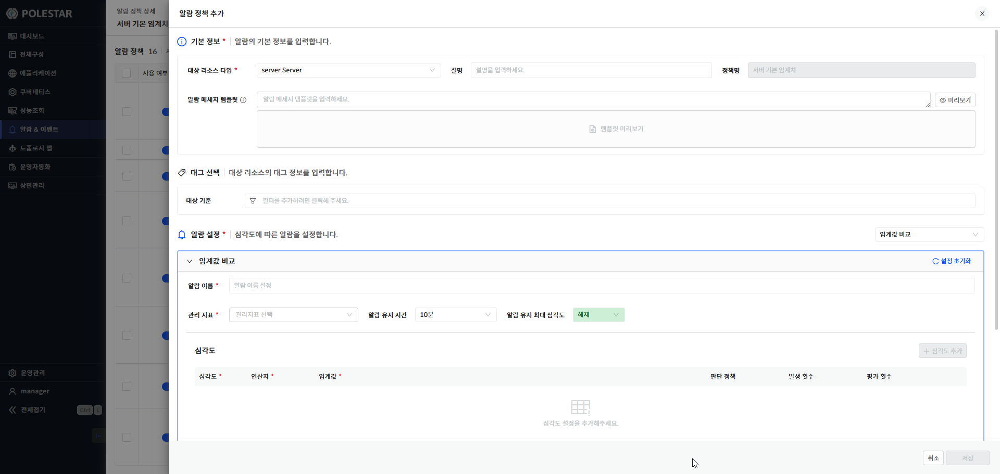

▶ \[그림8\] 알람 정책

알람 정책 - 기본 정보

알람 정책이 적용되는 대상 리소스. 설명 등 기본적인 정보를 입력합니다. 메세지 템플릿을 입력하여 알람 메세지 형식을 지정할 수 있습니다.

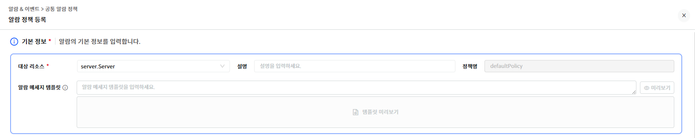

▶ \[그림9\] 알람 정책 – 기본 정보

기본 정보

<table>
<thead>
<tr class="header">
<th>대상 리소스</th>
<th>대상 리소스의 타입을 선택합니다.</th>
</tr>
</thead>
<tbody>
<tr class="odd">
<td>설명</td>
<td>알람 정책 설명을 입력합니다.</td>
</tr>
<tr class="even">
<td>정책명</td>
<td>공통 알람 정책 이름입니다.</td>
</tr>
<tr class="odd">
<td>알람 메세지 템플릿</td>
<td>
알람의 메세지 형식을 등록합니다.

입력하지 않으면 기본 메세지 형식으로 생성됩니다.
</td>
</tr>
<tr class="even">
<td>미리보기 버튼</td>
<td>하단에 입력한 템플릿으로 형식으로 생성된 메세지를 볼 수 있습니다.</td>
</tr>
</tbody>
</table>

알람 메시지 템플릿 입력 절차

사용자가 원하는 알람 메시지 형식을 정의합니다. 메시지에는 \[표현식\]을 추가하여 알람과 관련된 속성을 입력할 수 있습니다. \[$문자열\] 형식으로 입력하면 문자열을 포함하는 속성 표현 값이 Drop Box로 표시되어 선택할 수 있습니다. \[알람 메세지 템플릿\] 타이틀 옆에 있는 도움말 버튼을 클릭하면 도움말 창이 나타나며 사용할 수 있는 \[표현식\]을 확인할 수 있습니다. 입력 후에는 \[미리보기\] 버튼을 클릭하여 원하는 메세지 형식이 맞는지 미리 확인해 볼 수 있습니다.

1.  \[$\]문자 입력.

2.  \[$\]문자에 붙여서 문자를 입력합니다

3.  표시되는 내용중 원하는 내용을 선택합니다

4.  메세지를 입력하여 템플릿을 완성합니다.

5.  미리보기 클릭하여 확인

▶ \[그림10\] 알람 메세지 템플릿 도움말

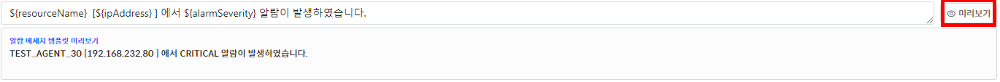

▶ \[그림11\] 알람 메세지 템플릿 미리보기

알람 정책 – 태그 선택

대상 리소스를 필터링 하기 위해서 태그 정보를 입력합니다. 대상 리소스 타입만으로는 특정 대상을 구분할 수 없는 경우 태그 정보를 이용하여 상세히 필터링 할 수 있습니다.

<table>
<tbody>
<tr class="odd">
<td>
노트

예를 들어 대상 리소스 타입이 아래와 같은 경우 태그 입력이 필요합니다.

파일 시스템, 데이터베이스의 테이블 스페이스, 네트워크 인터페이스처럼 하나의 장비에 다중으로 존재하는 하위 리소스들에 대해서 주요한 대상만 알람 정책을 적용하려는 경우 태그 정보를 이용하여 대상 리소스를 특정 지을 수 있습니다.
</td>
</tr>
</tbody>
</table>

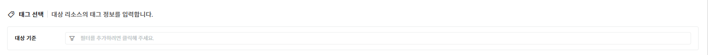

▶ \[그림12\] 알람 정책 – 태그 입력

알람 정책 – 알람 설정(임계값 비교)

알람 정책의 알람 설정 중에서 \[임계값 비교\] 설정입니다. 임계값은 등록된 대상 시스템이 수집하는 성능/가용성/문자열 값을 가지고 판단합니다. 즉시 발생/연속발생/N회평가 3 가지의 판단 기준으로 설정 가능합니다. \[심각도 추가\] 버튼을 선택하여 여러 단계의 심각도별 정책을 설정할 수 있습니다.

<table>
<tbody>
<tr class="odd">
<td>
노트

여러 단계의 심각도 레벨을 설정할 수 있습니다. 높은 레벨부터 판단하여 조건을 충족하면 알람이 발생됩니다.
</td>
</tr>
</tbody>
</table>

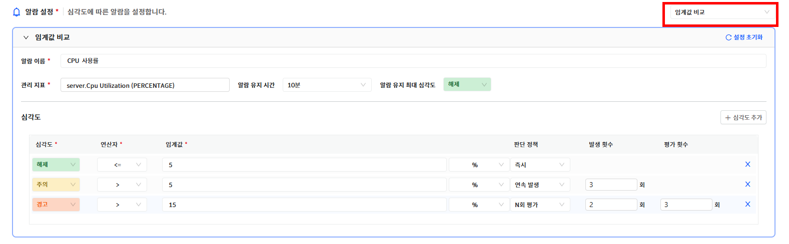

▶ \[그림13\] 알람 정책 – 알람 설정(임계값 비교)

기본 정보

<table>
<thead>
<tr class="header">
<th>알람 이름</th>
<th>알람 정책의 이름을 입력합니다.</th>
</tr>
</thead>
<tbody>
<tr class="odd">
<td>관리 지표</td>
<td>
감시할 지표를 선택합니다.

관리 지표는 상단에서 입력한 [기본정보]의 [대상 리소스]의 지표가 목록으로 표시됩니다.
</td>
</tr>
<tr class="even">
<td>알람 유지 시간</td>
<td>알람이 발생되고 상태를 유지하는 시간입니다. 해당 시간이 지나면 자동으로 해제됩니다.</td>
</tr>
<tr class="odd">
<td>알람 유지 최대 심각도</td>
<td>
알람 유지 시간이 적용되는 최대 심각도 레벨입니다.

그 이상의 심각도 알람은 자동 해제 없이 계속 유지됩니다.
</td>
</tr>
<tr class="even">
<td>심각도</td>
<td>
알람의 심각도 레벨을 선택합니다.

심각도 레벨 및 순서는 아래와 같습니다.

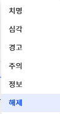
</td>
</tr>
<tr class="odd">
<td>연산자</td>
<td>
수집된 지표 값과 비교할 연산자를 선택합니다.

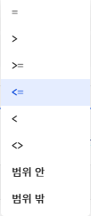
</td>
</tr>
<tr class="even">
<td>임계값</td>
<td>
임계값을 입력합니다.

단위를 선택하여 지표의 단위를 변경하여 비교할 수 있습니다.
</td>
</tr>
<tr class="odd">
<td>판단 정책</td>
<td>
판단 정책을 선택합니다.

즉시: 판단 즉시 알람을 발생시킵니다.

연속 발생: 발생 횟수만큼 연속으로 조건을 충족하면 알람이 발생됩니다.

N회 평가: 평가 횟수내에 발생 횟수만큼 조건을 충족하면 알람이 발생됩니다.
</td>
</tr>
<tr class="even">
<td>발생 횟수</td>
<td>발생 횟수를 입력합니다.</td>
</tr>
<tr class="odd">
<td>평가 횟수</td>
<td>평가 횟수를 입력합니다.</td>
</tr>
</tbody>
</table>

알람 정책 – 알람 설정(이벤트 탐지)

알람 정책의 알람 설정 중에서 \[이벤트 탐지\] 설정입니다. 이벤트 탐지는 \[기본 정보\]에서 로그모니터 (server.LogMonitor)와 같이 이벤트를 발생시키는 \[대상 리소스\]를 선택해야 합니다.

<table>
<tbody>
<tr class="odd">
<td>
노트

대상 리소스가 동일한 이벤트를 대량으로 발생시킬 수 있는 경우 알람 정책을 모두발생(동일 컨디션 로그 제외)을 선택하면 동일한 메세지의 알람이 발생되는 것을 방지할 수 있습니다.
</td>
</tr>
</tbody>
</table>

▶ \[그림14\] 알람 정책 – 알람 설정(이벤트 탐지)

화면 지표

<table>
<thead>
<tr class="header">
<th>알람 이름</th>
<th>알람 정책의 이름을 입력합니다.</th>
</tr>
</thead>
<tbody>
<tr class="odd">
<td>알람 정책</td>
<td>
모두 발생

조건이 충족되면 모두 알람을 발생시킵니다.

처음 하나

처음 한번만 발생되고 알람이 해제되면 다시 발생됩니다.

마지막 하나(통보 모두 발생)

새로운 알람이 발생되면 기존에 발생된 알람을 자동으로 해제하여 마지막 알람만 유지합니다. 통보는 모두 발생됩니다.

모두 발생(동일 컨디션 로그 제외)

조건이 충족되고 기존에 동일한 컨디션 로그의 알람이 없는 경우 알람을 발생시킵니다.

마지막 하나(처음 발생시만 통보)

새로운 알람이 발생되면 기존에 발생된 알람을 자동으로 해제하여 마지막 알람만 유지합니다. 통보는 처음 발생시에만 통보됩니다.
</td>
</tr>
<tr class="even">
<td>발생 제한 수</td>
<td>1분간 발생될 수 있는 알람 개수를 선택합니다.</td>
</tr>
<tr class="odd">
<td>이벤트 타입</td>
<td>
이벤트 타입을 선택합니다.

대상 리소스에서 발생될 수 있는 이벤트 타입을 선택합니다.
</td>
</tr>
<tr class="even">
<td>알람 유지 시간</td>
<td>알람이 발생되고 상태를 유지하는 시간입니다. 해당 시간이 지나면 자동으로 해제됩니다.</td>
</tr>
<tr class="odd">
<td>알람 유지 최대 심각도</td>
<td>
알람 유지 시간이 적용되는 최대 심각도 레벨입니다.

그 이상의 심각도 알람은 자동 해제 없이 계속 유지됩니다.
</td>
</tr>
<tr class="even">
<td>심각도</td>
<td>
알람의 심각도 레벨을 선택합니다.

심각도 레벨 및 순서는 아래와 같습니다.

</td>
</tr>
<tr class="odd">
<td>이벤트 레벨</td>
<td>
이벤트 레벨 및 비교 방법을 선택합니다.

이벤트 레벨 및 순서는 아래와 같습니다.

Fatal

Error

Warn

Info

Debug
</td>
</tr>
<tr class="even">
<td>상세 비교 패턴</td>
<td>이벤트 메세지에서 탐지할 정규식 패턴을 입력합니다.</td>
</tr>
<tr class="odd">
<td>개행 문자 포함</td>
<td>
이벤트 메세지에 개행 문자의 포함 여부를 선택합니다.

[개행 문자 포함] 여부에 따라서 내부에서 정규식 패턴 탐지 방법이 달라집니다.
</td>
</tr>
<tr class="even">
<td>판단 횟수</td>
<td>
알람이 발생되기 위한 조건인 탐지 횟수를 입력합니다.

입력 값이 없으면 이벤트 마다 알람이 발생됩니다.

발생 시간 범위 내에서 해당 횟수 이상 [상세 비교 패턴]이 탐지되면 알람이 발생됩니다.

따라서, [판단 횟수]와 [발생 시간 범위]는 동시에 입력되거나 모두 입력되지 않아야 합니다.
</td>
</tr>
<tr class="odd">
<td>발생 시간 범위</td>
<td>발생 시간 범위를 입력합니다.</td>
</tr>
</tbody>
</table>

알람 정책 – 알람 설정(구성 변경 탐지)

알람 정책의 알람 설정 중에서 \[구성 변경 탐지\] 설정입니다. 구성 변경 탐지는 대상 리소스에서 주기적으로 수집되는 구성 정보의 속성 값 추가/삭제/변경 여부를 탐지합니다. 구성 정보의 특정 속성을 지정하지 않고 모든 속성 중에서 일부라도 변경되면 탐지됩니다.

<table>
<tbody>
<tr class="odd">
<td>
노트

구성 변경 탐지 설정으로 알람이 발생되는 경우는 항상 구성 변경 이력이 발생됩니다.
</td>
</tr>
</tbody>
</table>

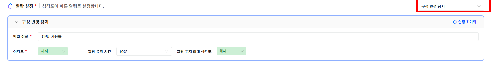

▶ \[그림15\] 알람 정책 – 알람 설정(구성 변경 탐지)

화면 지표

<table>
<thead>
<tr class="header">
<th>알람 이름</th>
<th>알람 정책의 이름을 입력합니다.</th>
</tr>
</thead>
<tbody>
<tr class="odd">
<td>심각도</td>
<td>
알람의 심각도 레벨을 선택합니다.

심각도 레벨 및 순서는 아래와 같습니다.

</td>
</tr>
<tr class="even">
<td>알람 유지 시간</td>
<td>알람이 발생되고 상태를 유지하는 시간입니다. 해당 시간이 지나면 자동으로 해제됩니다.</td>
</tr>
<tr class="odd">
<td>알람 유지 최대 심각도</td>
<td>
알람 유지 시간이 적용되는 최대 심각도 레벨입니다.

그 이상의 심각도 알람은 자동 해제 없이 계속 유지됩니다.
</td>
</tr>
</tbody>
</table>

알람 정책 – 알람 설정(베이스라인 비교)

알람 정책의 알람 설정 중에서 \[베이스라인 비교\] 설정입니다. 베이스라인은 등록된 대상 시스템이 수집하는 성능 값의 통계 데이터를 가지고 판단합니다. 임계치 비교 설정과 유사하지만 베이스라인을 선택하기 위해 기준과 베이스라인을 지정해야 합니다. 즉시 발생/연속발생/N회평가 3 가지의 판단 기준으로 설정 가능합니다. \[심각도 추가\] 버튼을 선택하여 여러 단계의 심각도별 정책을 설정할 수 있습니다.

<table>
<tbody>
<tr class="odd">
<td>
노트

임계치 비교 설정과 동일하게 컨디션을 설정할 수 있습니다. 베이스라인에 맞는 성능 통계 데이터가 쌓인 이후에 모니터링 판단이 가능합니다..
</td>
</tr>
</tbody>
</table>

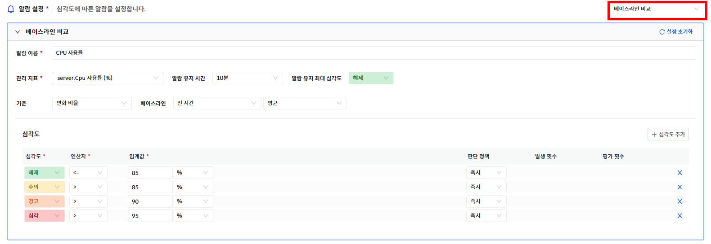

▶ \[그림16\] 알람 정책 – 알람 설정(베이스라인 비교)

기본 정보

<table>
<thead>
<tr class="header">
<th>알람 이름</th>
<th>알람 정책의 이름을 입력합니다.</th>
</tr>
</thead>
<tbody>
<tr class="odd">
<td>관리 지표</td>
<td>
감시할 지표를 선택합니다.

관리 지표는 상단에서 입력한 [기본정보]의 [대상 리소스]의 지표가 목록으로 표시됩니다.
</td>
</tr>
<tr class="even">
<td>알람 유지 시간</td>
<td>알람이 발생되고 상태를 유지하는 시간입니다. 해당 시간이 지나면 자동으로 해제됩니다.</td>
</tr>
<tr class="odd">
<td>알람 유지 최대 심각도</td>
<td>
알람 유지 시간이 적용되는 최대 심각도 레벨입니다.

그 이상의 심각도 알람은 자동 해제 없이 계속 유지됩니다.
</td>
</tr>
<tr class="even">
<td>기준</td>
<td>변화 값 또는 변경 비율 중에서 선택합니다.</td>
</tr>
<tr class="odd">
<td>베이스라인</td>
<td>
성능 통계 비교 대상을 선택합니다.

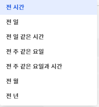

의 최소 / 평균 / 최대 중에서 선택합니다.
</td>
</tr>
<tr class="even">
<td>심각도</td>
<td>
알람의 심각도 레벨을 선택합니다.

심각도 레벨 및 순서는 아래와 같습니다.

</td>
</tr>
<tr class="odd">
<td>연산자</td>
<td>
수집된 지표 값과 비교할 연산자를 선택합니다.

</td>
</tr>
<tr class="even">
<td>임계값</td>
<td>
임계값을 입력합니다.

단위를 선택하여 지표의 단위를 변경하여 비교할 수 있습니다.
</td>
</tr>
<tr class="odd">
<td>판단 정책</td>
<td>
판단 정책을 선택합니다.

즉시: 판단 즉시 알람을 발생시킵니다.

연속 발생: 발생 횟수만큼 연속으로 조건을 충족하면 알람이 발생됩니다.

N회 평가: 평가 횟수내에 발생 횟수만큼 조건을 충족하면 알람이 발생됩니다.
</td>
</tr>
<tr class="even">
<td>발생 횟수</td>
<td>발생 횟수를 입력합니다.</td>
</tr>
<tr class="odd">
<td>평가 횟수</td>
<td>평가 횟수를 입력합니다.</td>
</tr>
</tbody>
</table>

통보 설정

알람이 발생되면 통보 설정에 따라서 사용자에게 통보가 발송됩니다. 통보 이력은 \[알람 현황 \> 알람 상세 보기\]의 통보 이력 탭에서 확인 할 수 있습니다.

<table>
<tbody>
<tr class="odd">
<td>
노트

통보 발송의 성공 여부는 통보 설정에 등록된 대상 시스템으로의 통보 메세지 전송 성공여부를 의미하며 실제 사용자에게 통보가 전달되었음을 의미하지는 않습니다.
</td>
</tr>
</tbody>
</table>

▶ \[그림17\] 알람 정책 – 통보 설정

화면 지표

<table>
<thead>
<tr class="header">
<th>심각도</th>
<th>통보 대상이 되는 알람의 심각도 레벨을 선택합니다.</th>
</tr>
</thead>
<tbody>
<tr class="odd">
<td>해제 통보</td>
<td>알람이 해제되는 경우 통보를 발송할 지 여부를 선택합니다.</td>
</tr>
<tr class="even">
<td>지연/반복 통보</td>
<td>
통보 발송 시기를 설정합니다.

[즉시 이후 반복]은 즉시 통보 이후 알람이 해제되지 않으면 반복해서 통보를 보냅니다. 5분 간격으로 3회 발송됩니다.

설정할 수 있는 옵션은 다음과 같습니다.

즉시

5분 지연

10분 지연

30분 지연

1 시간 지연

6시간 지연

12시간 지연

1일 지연

즉시 이후 반복
</td>
</tr>
<tr class="odd">
<td>통보 대상</td>
<td>
통보 대상을 입력합니다.

방식은 다음과 같습니다.

직접 입력(사용자)를 선택하고 사용자를 선택합니다.

직접 입력(사용자 그룹)을 선택하고 사용자 그룹을 선택합니다.

직접 입력(역할)을 선택하고 역할을 선택합니다.
</td>
</tr>
<tr class="even">
<td>통보 방법</td>
<td>
통보 방법을 선택합니다.

통보 방법은 [운영 관리&gt; 기본 설정&gt; 통보 설정]메뉴의 [통보 방식]탭에서 확인 가능합니다. (사용 여부와 상관없이 표현됩니다.)
</td>
</tr>
</tbody>
</table>

액션 설정

액션 설정은 알람 발생 후 자동으로 장애를 조치하거나 상황에 대한 정보를 남길 수 있도록 특정 명령어를 등록하여 실행할 수 있는 기능입니다. 알람의 심각도별 액션을 설정할 수 있습니다.

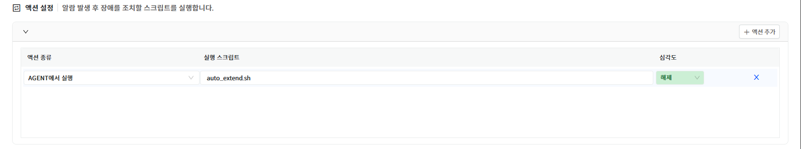

▶ \[그림18\] 알람 정책 – 액션 설정

화면 지표

<table>
<thead>
<tr class="header">
<th>액션 종류</th>
<th>
액션의 종류를 선택합니다.

현재는 AGENT에서 실행 옵션만 제공됩니다.

AGENT에서 실행

등록된 명령어를 대상 시스템의 Agent에서 실행합니다.
</th>
</tr>
</thead>
<tbody>
<tr class="odd">
<td>실행 스크립트</td>
<td>
실행할 스크립트 명령어입니다.

전체 경로를 입력하여 등록해야 합니다
</td>
</tr>
<tr class="even">
<td>심각도</td>
<td>알람의 심각도 레벨을 선택합니다</td>
</tr>
</tbody>
</table>

알람 정책 삭제

공통 알람 정책에 등록된 알람 정책을 삭제할 수 있습니다.

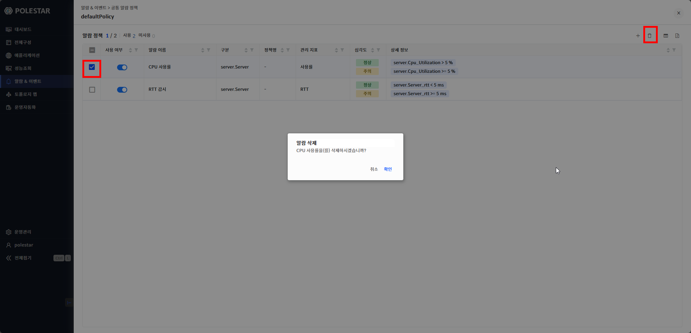

▶ \[그림19\] 알람 정책 삭제

알람 정책 삭제 절차

1.  삭제하고자 하는 알람 정책을 선택 (다중 선택 가능)

2.  테이블 우측 상단의 삭제 아이콘 클릭

3.  메시시창에서 확인 클릭

알람 정책 수정

공통 알람 정책에 등록된 알람 정책을 수정할 수 있습니다.

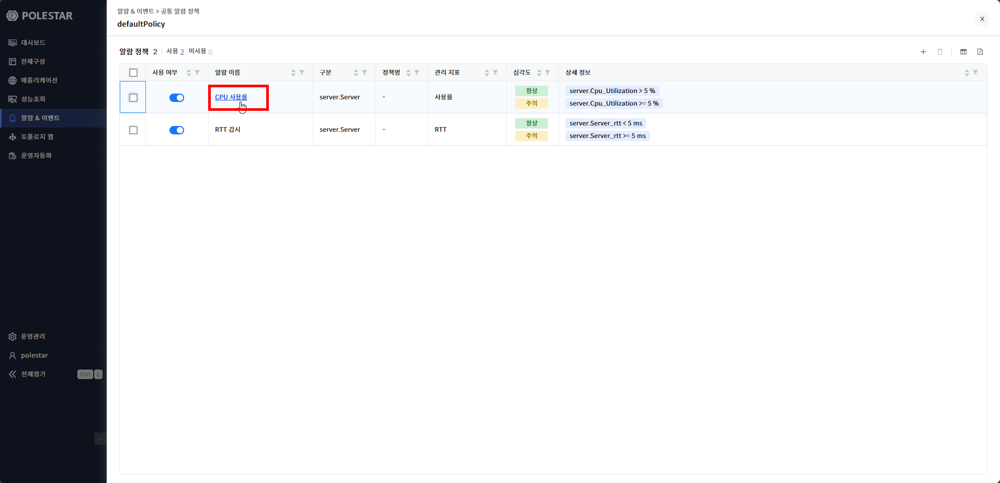

▶ \[그림19\] 알람 정책 수정

알람 정책 삭제 절차

1.  수정하고자 하는 알람 정책의 이름을 선택.

2.  상세 보기 창이 표시되면 \[알람 정책 등록\]과 동일한 방식으로 수정.

3.  하단의 저장 클릭

