관리 대상 추가

전체구성에서 \[관리 대상 추가\] 버튼을 클릭하여 관리 장비 타입별로 신규 장비를 등록할 수 있습니다. 관리 대상 메뉴에는 각 관리 장비 타입을 선택하여 신규 장비 등록 절차를 시작합니다.

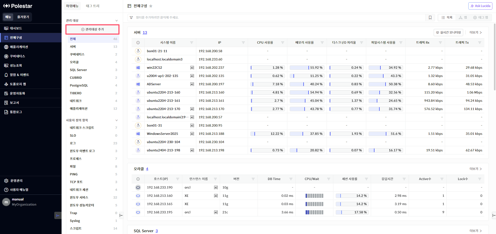

▶ \[그림 1\] 관리 대상 추가

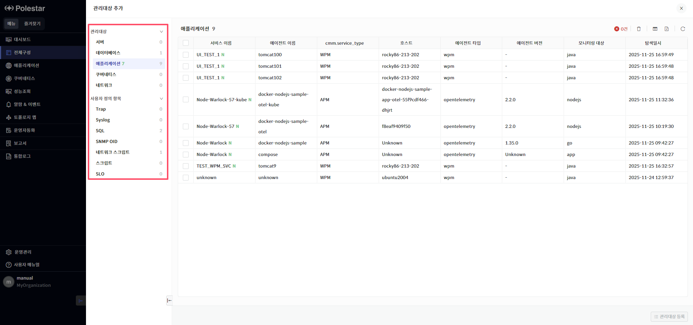

▶ \[그림 2\] 관리 대상 메뉴

관리 대상 - 애플리케이션

관리 대상 메뉴에서 \[애플리케이션\]를 선택하면 애플리케이션 에이전트가 설치된 등록 대기 상태의 에이전트 목록을 확인할 수 있습니다. 관리 대상 메뉴에 녹색으로 표시되는 숫자는 POLESTAR에 연결된 지 24시간이 경과하지 않은 신규 애플리케이션 개수를 의미합니다. 등록 대기 애플리케이션 에이전트 목록 우측 상단에는 등록 실패 이력이 있는 애플리케이션 에이전트 개수가 표시됩니다.

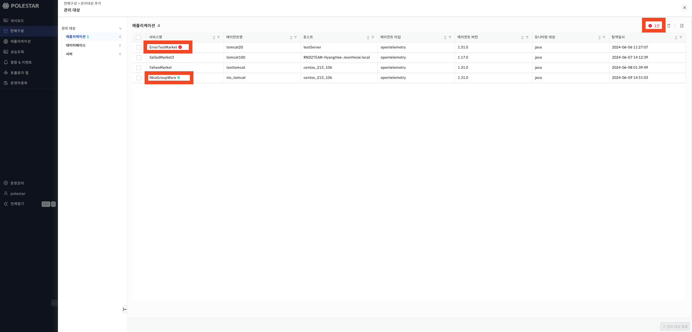

▶ \[그림 \] 관리 대상 - 등록 대기 애플리케이션 목록

화면 지표

<table>
<thead>
<tr class="header">
<th>서비스명</th>
<th>
애플리케이션 에이전트 설치 시 설정한 서비스 명을 표시합니다.

 : POLESTAR에 연결된지 24시간이 경과하지 않은 신규 에이전트

 : 등록 실패 이력이 있는 에이전트.
</th>
</tr>
</thead>
<tbody>
<tr class="odd">
<td>에이전트</td>
<td>애플리케이션 에이전트가 설치된 에이전트 명</td>
</tr>
<tr class="even">
<td>호스트</td>
<td>애플리케이션 에이전트가 설치된 시스템의 호스트명</td>
</tr>
<tr class="odd">
<td>에이전트 타입</td>
<td>에이전트의 타입. Opentelemetry 에이전트의 경우 opentelemetry라고 표시됩니다.</td>
</tr>
<tr class="even">
<td>에이전트버전</td>
<td>설치된 에이전트 버전을 표시합니다.</td>
</tr>
<tr class="odd">
<td>모니터링 대상</td>
<td>에이전트가 모니터링하고 하고 있는 애플리케이션의 언어를 표시합니다.</td>
</tr>
</tbody>
</table>

관리 대상 – 애플리케이션 등록

등록 대기 에이전트 목록에서 애플리케이션을 선택하여 등록할 수 있습니다. 등록 시 공통 알람 정책과 서비스태그를 설정할 수 있습니다. 애플리케이션 에이전트의 경우 수집정책, 관리 상태는 초기 지정 값을 사용합니다.

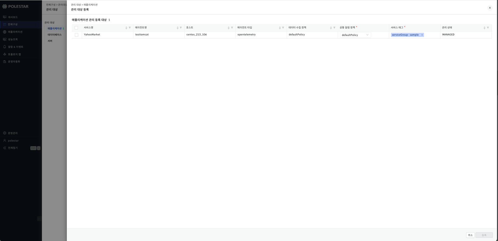

▶ \[그림 \] 관리 대상 – 애플리케이션 등록 - 필수 항목 설정

<table>
<tbody>
<tr class="odd">
<td>
노트

애플리케이션 등록 시 데이터 수집 정책은 “defaultPolicy” 즉 기본정책을 사용하며 관리상태는 등록 시 “MANAGED”로 설정됩니다. 애플리케이션 등록 화면에서는 이를 변경할 수 없습니다.
</td>
</tr>
</tbody>
</table>

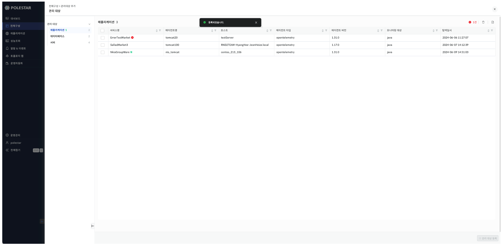

▶ \[그림 \] 관리 대상 - 애플리케이션 등록 - 등록 완료

화면 지표

<table>
<thead>
<tr class="header">
<th>서비스</th>
<th>
에이전트 설치 시 설정한 서비스 명을 표시합니다.

설정 방법은 관리자 매뉴얼을 참고합니다.
</th>
</tr>
</thead>
<tbody>
<tr class="odd">
<td>에이전트</td>
<td>애플리케이션 에이전트가 설치된 에이전트 명</td>
</tr>
<tr class="even">
<td>호스트</td>
<td>애플리케이션 에이전트가 설치된 시스템의 호스트명</td>
</tr>
<tr class="odd">
<td>데이터 수집 정책</td>
<td>등록하려는 에이전트가 포함되어 있는 서비스에 할당되는 데이터 수집 정책입니다. 애플리케이션 초기 지정된 defaultPolicy가 지정되어 있습니다.</td>
</tr>
<tr class="even">
<td>공통 알람 정책</td>
<td>
등록하려는 에이전트에 할당할 알람 정책을 선택합니다. 알람 정책을 선택하여 미리 정의한 알람 설정을 일괄 적용할 수 있습니다.

 : 선택한 알람 정책의 세부 설정 목록 호출
</td>
</tr>
<tr class="odd">
<td>성능 이상감지 정책</td>
<td>
등록하려는 애플리케이션에 할당할 성능 이상감지 정책을 선택합니다. 성능 이상감지 정책에 따라 대상 애플리케이션 성능 지표 중 이상 감지를 할 지표가 일괄 설정됩니다.

 : 선택한 성능 이상감지 정책의 세부 설정 목록 호출
</td>
</tr>
<tr class="even">
<td>서비스 태그</td>
<td>등록하려는 에이전트가 포함된 서비스에 적용할 서비스 태그를 선택합니다. 기존 등록된 서비스 태그를 사용하거나, 신규 서비스 태그를 생성하여 적용할 수 있습니다.</td>
</tr>
<tr class="odd">
<td>관리 상태</td>
<td>애플리케이션 에이전트는 관리상태가 등록 시 “MANAGED”로 적용됩니다.</td>
</tr>
</tbody>
</table>

애플리케이션 등록 절차

1.  등록 대기 애플리케이션 목록에서 등록할 애플리케이션 선택 (다수 선택 가능)

2.  화면 우측 하단의 \[관리 대상 등록\] 버튼 클릭

3.  필수 항목 설정 (공통 알람 정책, 서비스 태그)

4.  등록할 애플리케이션 선택 (다수 선택 가능)

5.  화면 우측 사단의 \[등록\] 버튼 클릭

관리 대상 – 애플리케이션 등록 – 일괄 변경

등록 대기 애플리케이션 목록에서 전체 대상으로 설정값을 일괄적으로 변경할 수 있습니다.

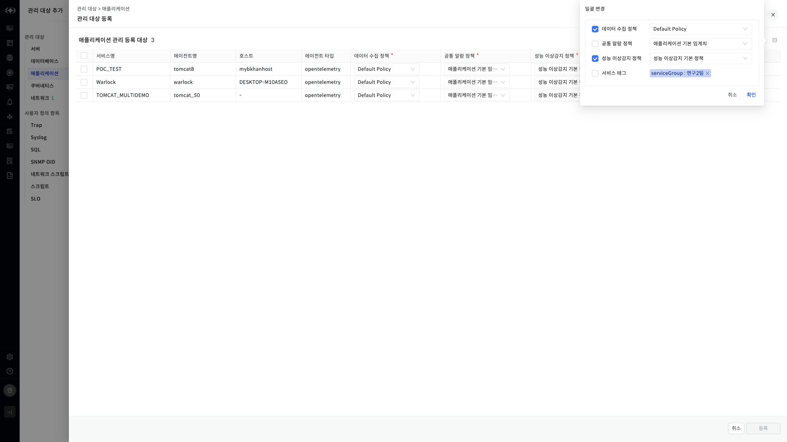

▶ \[그림 \] 관리 대상 - 애플리케이션 등록 – 일괄 변경

설정값 일괄 변경 절차

1.  페이지 우측 상단의 일괄변경 아이콘을 클릭

2.  변경할 항목을 체크 후, 선택 상자에서 데이터를 선택

3.  우측 하단의 \[확인\] 버튼 클릭

4.  그리드에 있는 모든 대상의 항목이 일괄변경

관리 대상 – 애플리케이션 삭제

등록 대기 상태의 애플리케이션을 삭제할 수 있습니다. 삭제한 등록 대기 애플리케이션은 삭제 후 바로 다시 등록 대기 상태 장비로 재등록되어 등록 대기 목록에 추가됩니다. 따라서 애플리케이션을 완전히 삭제하려면 애플리케이션 에이전트 옵션 또는 모듈을 애플리케이션에서 제거해야 합니다. 아래 노트를 참고하여 애플리케이션을 삭제하면 원치 않는 애플리케이션이 등록 대기 목록에 추가되는 일을 방지할 수 있습니다.

<table>
<tbody>
<tr class="odd">
<td>
노트

애플리케이션을 완전히 삭제하려면, 해당 애플리케이션에서 에이전트 연동 옵션 또는 모듈 직접 삭제하여야 합니다. 에이전트의 언어별 삭제 방법은 애플리케이션 설치 매뉴얼을 참고합니다.
</td>
</tr>
</tbody>
</table>

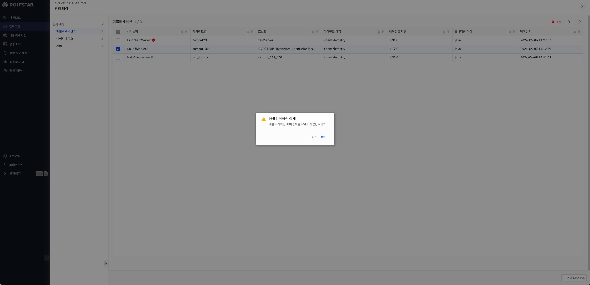

▶ \[그림 \] 관리 대상 – 애플리케이션 에이전트 삭제

애플리케이션 삭제 절차

1.  등록 대기 애플리케이션 목록에서 삭제할 서버 선택 (다수 선택 가능)

2.  등록 대기 애플리케이션 목록 우측 상단의 \[삭제\] 버튼 클릭

3.  삭제 확인 메시지창에서 \[확인\] 버튼 클릭

관리 대상 – 데이터베이스

관리 대상 메뉴에서 \[데이터베이스\]를 선택하면 데이터베이스 등록 대기 목록 화면이 표시됩니다. 등록 대기 목록 상단에 데이터베이스 등록(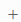) 버튼을 클릭하면 데이터베이스 등록 드로우가 표시됩니다. 해당 드로우 화면을 통해 데이터베이스 등록 대기 목록에 신규 데이터베이스를 추가를 할 수 있습니다. 이후 등록 대기 목록에 추가된 데이터베이스는 우측 하단 관리 대상 등록 버튼을 이용하여 실제 관리 대상 데이터베이스로 등록할 수 있습니다.

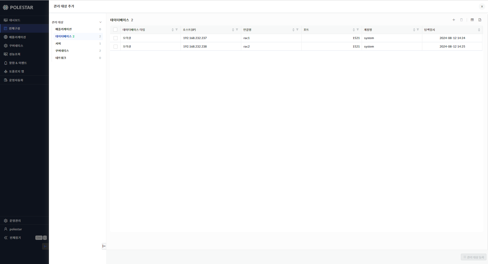

▶ \[그림 \] 관리 대상 – 데이터베이스 등록 대기 목록

화면 지표

| 데이터베이스 타입 | 추가할 데이터베이스 타입을 표시합니다.                |
| --------- | ------------------------------------ |
| 호스트(IP)   | 추가할 데이터베이스의 호스트명 또는 IP명입니다.          |
| 연결명       | 데이터베이스 연결명입니다. 오라클의 경우 SID나 서비스명입니다. |
| 포트        | 추가할 데이터베이스의 포트입니다.                   |
| 계정명       | 데이터베이스 접속 계정명입니다.                    |
| 탐색일시      | 데이터베이스를 등록 대기 목록에 추가한 일시입니다.         |

데이터베이스 등록 대기 목록에 추가 절차

1.  데이터베이스 등록 대기 목록 상단에 데이터베이스 추가() 버튼을 선택

2.  데이터베이스 등록 드로우에서 각종 연결정보 입력 및 이력 정보 수집 여부 선택

3.  데이터베이스 등록 드로우 하단 추가 버튼 선택

관리 대상 – 데이터베이스 등록 드로우

데이터베이스 등록 대기 목록 상단에 데이터베이스 등록() 버튼을 클릭하면 표시되는 드로우 화면에서 데이터베이스 등록에 필요한 기본 접속 정보 및 데이터베이스별 상세 설정을 할 수 있습니다. 설정 후 저장 버튼을 클릭하면 데이터베이스 등록 대기 목록에 등록 드로우에 설정한 데이터베이스가 추가됩니다.

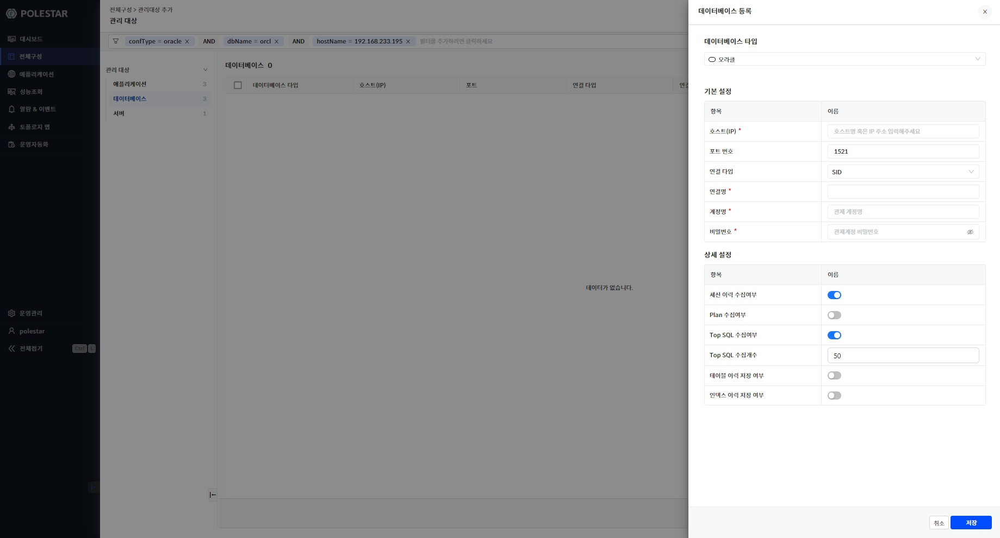

▶ \[그림 \] 관리 대상 – 데이터베이스 등록 드로우

데이터베이스 등록 드로우 항목

<table>
<thead>
<tr class="header">
<th>데이터베이스 타입</th>
<th>추가할 데이터베이스 타입을 선택합니다.</th>
</tr>
</thead>
<tbody>
<tr class="odd">
<td>호스트(IP)</td>
<td>추가할 데이터베이스의 호스트명 또는 IP를 입력합니다.</td>
</tr>
<tr class="even">
<td>포트</td>
<td>추가할 데이터베이스의 포트입니다..</td>
</tr>
<tr class="odd">
<td>연결 타입</td>
<td>데이터베이스의 연결 타입을 선택합니다. 오라클의 경우 SID와 서비스로 구분됩니다.</td>
</tr>
<tr class="even">
<td>연결명</td>
<td>추가할 데이터베이스의 연결명을 입력합니다...</td>
</tr>
<tr class="odd">
<td>계정명</td>
<td>추가할 데이터베이스의 계정명을 입력합니다.</td>
</tr>
<tr class="even">
<td>비밀번호</td>
<td>추가할 데이터베이스의 비밀번호를 입력합니다.</td>
</tr>
<tr class="odd">
<td>세션 이력 수집여부</td>
<td>세션 이력을 수집할 지 여부를 선택합니다. 세션 이력을 저장하면 세션 분석화면을 통해 세션 분석을 할 수 있습니다.</td>
</tr>
<tr class="even">
<td>Plan 수집여부</td>
<td>Plan 정보를 수집할 지 여부를 선택합니다. Plan 정보를 수집하면 Top SQL 분석 및 SQL 분석 화면에서 Plan 정보를 볼 수 있습니다.</td>
</tr>
<tr class="odd">
<td>Top SQL 수집여부</td>
<td>Top SQL 이력을 수집할지 여부를 선택합니다. Top SQL을 수집 하면Top SQL 분석 및 SQL 분석 화면에서 SQL 이력 분석을 할 수 있습니다.</td>
</tr>
<tr class="even">
<td>Top SQL 수집개수</td>
<td>Top SQL 이력 저장 시 저장될 Top SQL 개수를 설정합니다. 수집 개수가 많을수록 많은 SQL이 저장되지만 모니터링 대상 데이터베이스에 부하를 줄 수 있습니다.</td>
</tr>
<tr class="odd">
<td>테이블 이력 저장 여부(오라클)</td>
<td>테이블 구성 정보를 저장할지 여부를 선택합니다. 전체 테이블 목록 및 테이블의 상태 등이 구성에 저장되며 추후 구성 이력 비교에서 변경된 정보를 조회해볼 수 있습니다. 단 테이블이 많은 오라클 장비의 경우 조회 부하가 있을 수 있습니다. 단순 모니터링을 하는 경우라면 수집 하지 않는 것이 좋습니다.</td>
</tr>
<tr class="even">
<td>인덱스 이력 저장 여부(오라클)</td>
<td>인덱스 구성 정보를 저장할지 여부를 선택합니다. 전체 인덱스 목록 및 인덱스의 상태 등이 구성에 저장되며 추후 구성 이력 비교에서 변경된 정보를 조회해볼 수 있습니다. 단 인덱스가 많은 오라클의 경우 조회 부하가 있을 수 있습니다. 단순 모니터링을 하는 경우라면 수집하지 않는 것이 좋습니다.</td>
</tr>
<tr class="odd">
<td>매니저 서버 포트(CUBRID)</td>
<td>성능 모니터링을 관장하는CUBRID 매니저 서버 접속 포트를 입력합니다.</td>
</tr>
<tr class="even">
<td>매니저 서버 계정명(CUBRID)</td>
<td>성능 모니터링을 관장하는CUBRID 매니저 서버 접속용 계정명을 입력합니다. 해당 계정은 CUBRID monitor 권한이 필요합니다.</td>
</tr>
<tr class="odd">
<td>매니저 서버 비밀번호(CUBRID)</td>
<td>성능 모니터링을 관장하는CUBRID 매니저 서버 접속용 계정명의 비밀번호를 입력합니다.</td>
</tr>
<tr class="even">
<td>데이터베이스 접속 포트(CUBRID)</td>
<td>관제 대상 CUBRID 데이터베이스의 접속 포트를 입력합니다.</td>
</tr>
<tr class="odd">
<td>데이터베이스 계정명(CUBRID)</td>
<td>관제 대상 CUBRID 데이터베이스의 접속 계정명을 입력합니다. 해당 계정 CUBRID monitor 권한이 필요합니다.</td>
</tr>
<tr class="even">
<td>데이터베이스 비밀번호(CUBRID)</td>
<td>관제 대상 CUBRID 데이터베이스의 접속 계정명의 비밀 번호를 입력합니다.</td>
</tr>
<tr class="odd">
<td>세션 이력 수집 주기(CUBRID)</td>
<td>
CUBRID 세션 이력 수집 주기를 입력합니다.

입력 가능 값: 5초, 10초, 20초, 30초, 60초, 120초, 300초, 600초
</td>
</tr>
</tbody>
</table>

<table>
<tbody>
<tr class="odd">
<td>
노트

관제 대상 데이터베이스 모니터링을 위해 최소한의 부하만으로 가용성 및 성능 모니터링만 필요하다면 Plan 이력이나 Top SQL 수집 여부, 테이블/인덱스 이력 저장 여부를 “아니오”로 설정하여 대상 장비 모니터링을 위해 수행되는 쿼리 부하를 줄일 수 있습니다.
</td>
</tr>
</tbody>
</table>

데이터베이스 최종 등록 절차

1.  데이터베이스 등록 대기 목록에서 등록하고자 하는 데이터베이스를 목록 체크 박스에서 선택하고 우측 하단 관리 대상 등록 버튼 선택 하면 데이터베이스 관리 등록 대상 드로우가 표시됨.

2.  데이터베이스 관리 등록 대상 드로우에서 데이터 수집정책, 공통 알람 정책, 성능 이상감지 정책, 서비스 태그, 관리 상태를 설정

3.  등록할 대상을 목록 좌측 체크박스에서 선택하고 등록 버튼 선택

관리 대상 – 데이터베이스\> 관리 대상 등록 드로우

데이터베이스 등록 대기 목록에서 등록할 데이터베이스를 선택하고 목록화면 하단에 관리 대상 등록 버튼을 선택하면 아래처럼 데이터베이스\> 관리 대상 등록 드로우 화면이 표시됩니다. 해당 화면에서는 등록하려는 데이터베이스의 데이터 수집 정책, 공통 알람 정책, 성능 이상감지 정책, 서비스 태그, 관리 상태를 설정하고 대상 데이터베이스를 실제 관리 대상으로 등록하는 기능을 제공합니다.

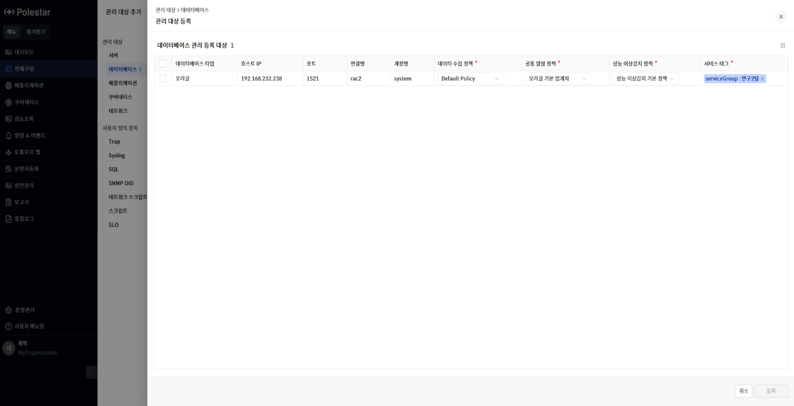

▶ \[그림 \] 관리 대상 – 데이터베이스\> 관리 대상 등록 드로우

데이터베이스 관리 대상 등록 드로우 항목

<table>
<thead>
<tr class="header">
<th>데이터베이스명</th>
<th>등록하려는 데이터베이스명이 표시됩니다..</th>
</tr>
</thead>
<tbody>
<tr class="odd">
<td>호스트(IP)</td>
<td>등록하려는 데이터베이스의 호스트명 또는 IP가 표시됩니다.</td>
</tr>
<tr class="even">
<td>포트</td>
<td>등록하려는 데이터베이스의 포트 정보가 표시됩니다.</td>
</tr>
<tr class="odd">
<td>연결명</td>
<td>등록하려는 데이터베이스의 연결명이 표시됩니다. 오라클의 경우 연결 타입에 따라 SID 또는 서비스명이 표시됩니다.</td>
</tr>
<tr class="even">
<td>계정명</td>
<td>등록 대상 데이터베이스에 연결되는 계정명이 표시됩니다.</td>
</tr>
<tr class="odd">
<td>데이터 수집 정책</td>
<td>
등록하려는 데이터베이스에 할당할 데이터 수집 정책을 선택합니다. 수집 정책에 따라 성능 지표별 데이터 수집 여부, 수집 주기, 통계 데이터 저장 여부가 일괄 적용됩니다.

 : 선택한 데이터 수집 정책의 세부 설정 목록 호출
</td>
</tr>
<tr class="even">
<td>공통 알람 정책</td>
<td>
등록하려는 데이터베이스에 할당할 알람 정책을 선택합니다. 알람 정책을 선택하여 미리 정의한 알람 설정을 일괄 적용할 수 있습니다.

 : 선택한 알람 정책의 세부 설정 목록 호출
</td>
</tr>
<tr class="odd">
<td>성능 이상감지 정책</td>
<td>
등록하려는 데이터베이스에 할당할 성능 이상감지 정책을 선택합니다. 성능 이상감지 정책에 따라 대상 데이터베이스 성능 지표 중 이상 감지를 할 지표가 일괄 설정됩니다.

 : 선택한 성능 이상감지 정책의 세부 설정 목록 호출
</td>
</tr>
<tr class="even">
<td>서비스 태그</td>
<td>등록하려는 데이터베이스에 적용할 서비스 태그를 선택합니다. 기존 등록된 서비스 태그를 사용하거나, 신규 서비스 태그를 생성하여 적용할 수 있습니다.</td>
</tr>
</tbody>
</table>

관리 대상 – 데이터베이스 등록 – 일괄 변경

등록 대기 데이터베이스 목록에서 전체 대상으로 설정 값을 일괄적으로 변경할 수 있습니다.

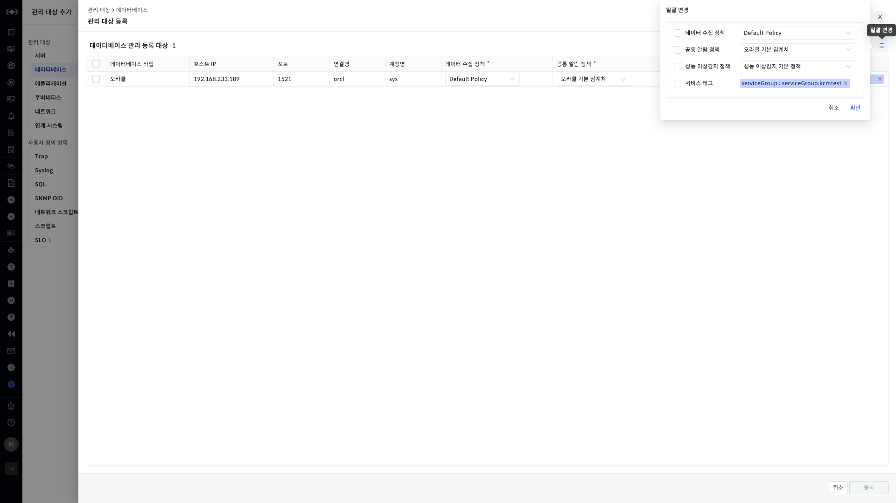

▶ \[그림 \] 관리 대상 – 데이터베이스 관리 대상 등록 – 일괄 변경

설정값 일괄 변경 절차

1.  페이지 우측 상단의 일괄변경 아이콘을 클릭

2.  변경할 항목을 체크 후, 선택 상자에서 데이터를 선택

3.  우측 하단의 \[확인\] 버튼 클릭

4.  그리드에 있는 모든 대상의 항목이 일괄변경

관리 대상 – 등록 대기 데이터베이스 삭제

등록 대기 데이터베이스 목록에서 데이터베이스를 삭제하여 데이터베이스를 등록 대기 상태에서 삭제할 수 있습니다.

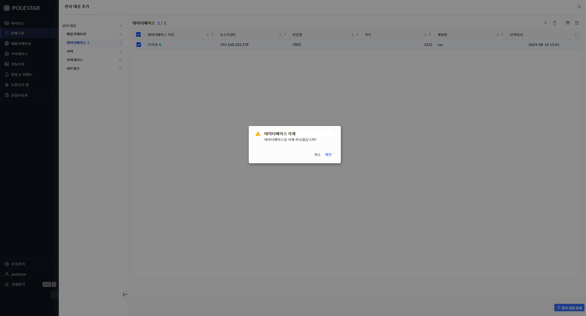

▶ \[그림 \] 관리 대상 – 등록 대기 데이터베이스 삭제

등록 대기 데이터베이스 삭제 절차

1.  등록 대기 데이터베이스 목록에서 삭제할 데이터베이스 선택 (다수 선택 가능)

2.  등록 대기 데이터베이스 목록 우측 상단의 \[삭제\] 버튼 클릭

3.  삭제 확인 메시지창에서 \[확인\] 버튼 클릭

관리 대상 - 서버

관리 대상 메뉴에서 \[서버\]를 선택하면 에이전트가 설치된 등록 대기 상태의 서버 목록을 확인할 수 있습니다. 관리 대상 메뉴에 녹색으로 표시되는 숫자는 POLESTAR에 연결된 지 24시간이 경과하지 않은 신규 서버 개수를 의미합니다. 등록 대기 서버 목록 우측 상단에는 등록 실패 이력이 있는 서버 개수가 표시됩니다.

<table>
<tbody>
<tr class="odd">
<td>
노트

서버 에이전트를 설치하고 기동했으나 POLESTAR 관리 대상 추가 목록에 표시되지 않는 경우, POLESTAR에 등록된 조직 개수와 에이전트 설정 확인이 필요합니다.

<ul>
<li>
조직 조회는 [운영관리 &gt; 조직 관리] 매뉴얼을 참고하시기 바랍니다.
</li>
<li>
서버 에이전트 설정은 관리자 매뉴얼의 [SMS Agent 설치 가이드]를 참고하시기 바랍니다.
</li>
</ul>

만약 등록된 조직이 2개 이상인 경우, 에이전트 설치 시 조직Id(=TENANT ID)를 설정해야 올바른 조직으로 에이전트를 등록할 수 있습니다.

(등록된 조직이 1개인 경우, 에이전트에 조직Id 정보를 설정하지 않더라도 서버 등록 및 데이터 수집이 정상적으로 동작합니다.)
</td>
</tr>
</tbody>
</table>

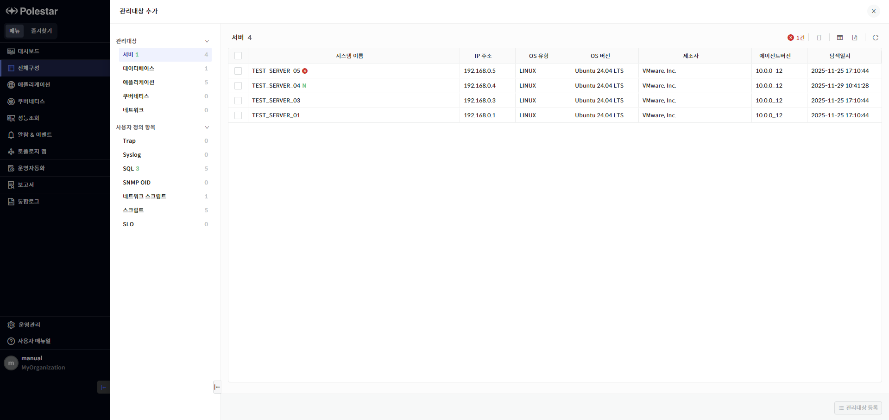

▶ \[그림 13\] 관리 대상 - 등록 대기 서버 목록

등록 대기 서버 항목

<table>
<thead>
<tr class="header">
<th>시스템 이름</th>
<th>
에이전트가 설치된 서버의 시스템 이름을 표시합니다. 시스템 이름은 서버의 호스트 이름입니다. 시스템 이름은 서버 등록 후 사용자 편의에 따라 변경할 수 있습니다.

 : POLESTAR에 연결된지 24시간이 경과하지 않은 신규 서버

 : 등록 실패 이력이 있는 서버 (툴팁에서 실패 메시지 확인 가능)
</th>
</tr>
</thead>
<tbody>
<tr class="odd">
<td>IP 주소</td>
<td>에이전트가 설치된 서버의 IP 주소를 표시합니다.</td>
</tr>
<tr class="even">
<td>OS 유형</td>
<td>에이전트가 설치된 서버의 운영체제를 표시합니다.</td>
</tr>
<tr class="odd">
<td>OS 버전</td>
<td>에이전트가 설치된 서버의 운영체제 버전을 표시합니다.</td>
</tr>
<tr class="even">
<td>제조사</td>
<td>서버 장비 제조사를 표시합니다.</td>
</tr>
<tr class="odd">
<td>에이전트버전</td>
<td>설치된 에이전트 버전을 표시합니다.</td>
</tr>
<tr class="even">
<td>탐색일시</td>
<td>에이전트가 POLESTAR에 연결된 일시를 표시합니다.</td>
</tr>
</tbody>
</table>

<table>
<tbody>
<tr class="odd">
<td>
노트

등록 과정 중 오류가 발생하여 정상적으로 서버 등록 과정을 종료하지 못한 모든 경우는 ‘등록 오류 서버’로 분류하여 시스템명 뒤에  아이콘이 표시됩니다. 등록 오류가 재발하지 않으면 등록 오류 서버도 신규 서버로 등록할 수 있습니다.

에이전트가 기동 중이 아니더라도 등록 대기 서버 목록에 포함되어 있는 서버는 신규 서버로 등록할 수 있습니다.
</td>
</tr>
</tbody>
</table>

관리 대상 - 서버 등록

등록 대기 서버 목록에서 서버를 선택하여 등록할 수 있습니다. 등록 시 데이터 수집 정책, 공통 알람 정책, 성능 이상감지 정책, 그룹, 서비스 태그, 관리 상태를 설정해야 합니다.

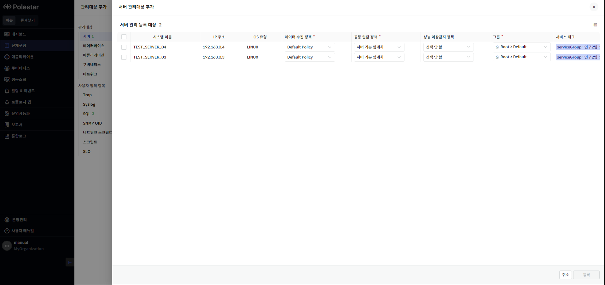

▶ \[그림 14\] 관리 대상 – 서버 등록 – 필수 항목 설정

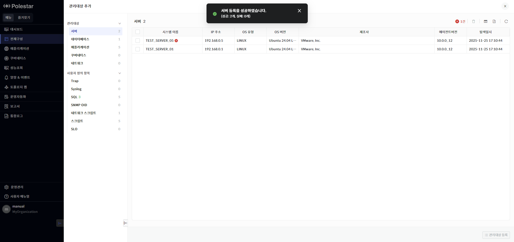

▶ \[그림 15\] 관리 대상 - 서버 등록 - 등록 완료

서버 등록 항목

<table>
<thead>
<tr class="header">
<th>시스템 이름</th>
<th>등록하려는 서버의 시스템 이름을 표시합니다.</th>
</tr>
</thead>
<tbody>
<tr class="odd">
<td>IP 주소</td>
<td>등록하려는 서버의 IP 주소를 표시합니다.</td>
</tr>
<tr class="even">
<td>OS 유형</td>
<td>등록하려는 서버의 운영체제를 표시합니다.</td>
</tr>
<tr class="odd">
<td>데이터 수집 정책</td>
<td>
등록하려는 서버에 할당할 데이터 수집 정책을 선택합니다. 수집 정책에 따라 성능 지표별 데이터 수집 여부, 수집 주기, 통계 데이터 저장 여부가 일괄 적용됩니다.

 : 선택한 데이터 수집 정책의 세부 설정 목록 호출
</td>
</tr>
<tr class="even">
<td>공통 알람 정책</td>
<td>
등록하려는 서버에 할당할 알람 정책을 선택합니다. 알람 정책을 선택하여 미리 정의한 알람 설정을 일괄 적용할 수 있습니다.

 : 선택한 알람 정책의 세부 설정 목록 호출
</td>
</tr>
<tr class="odd">
<td>성능 이상감지 정책</td>
<td>
등록하려는 서버에 할당할 성능 이상감지 정책을 선택합니다. 성능 이상감지 정책에 따라 대상 서버의성능 지표 중 이상 감지를 할 지표가 일괄 설정됩니다.

 : 선택한 성능 이상감지 정책의 세부 설정 목록 호출
</td>
</tr>
<tr class="even">
<td>그룹</td>
<td>등록하려는 서버의 그룹을 선택합니다.</td>
</tr>
<tr class="odd">
<td>서비스 태그</td>
<td>등록하려는 서버에 적용할 서비스 태그를 선택합니다. 기존 등록된 서비스 태그를 사용하거나, 신규 서비스 태그를 생성하여 적용할 수 있습니다.</td>
</tr>
<tr class="even">
<td>관리 상태</td>
<td>
등록하려는 서버의 관리 상태를 선택합니다.

MANAGED: 관리 (성능 및 구성 데이터 수집)

UNMANAGED: 관리 안함 (성능 및 구성 데이터 수집 안함)
</td>
</tr>
</tbody>
</table>

<table>
<tbody>
<tr class="odd">
<td>
노트

데이터 수집 정책, 공통 알람 정책의 기본 설정 항목은 다음과 같습니다.

<ul>
<li>
데이터 수집 정책: [운영관리 &gt; 데이터 수집 설정 &gt; 관리 지표 공통 설정] 중 자동 적용이 활성화되어 있는 항목을 기본 정책으로 설정합니다.
</li>
<li>
공통 알람 정책: [알람 &amp; 이벤트 &gt; 공통 알람 정책]에 정의된 서버용 정책 중 기본 정책으로 설정되어 있는 항목을 사용합니다.
</li>
</ul></td>
</tr>
</tbody>
</table>

서버 등록 절차

1.  등록 대기 서버 목록에서 등록할 서버 선택 (다수 선택 가능)

2.  화면 우측 하단의 \[관리 대상 등록\] 버튼 클릭

3.  필수 항목 설정 (데이터 수집 정책, 공통 알람 정책, 그룹, 관리 상태)

4.  등록할 서버 선택 (다수 선택 가능)

5.  화면 우측 사단의 \[등록\] 버튼 클릭

관리 대상 – 서버 등록 – 일괄 변경

등록 대기 서버 목록에서 전체 대상으로 설정값을 일괄적으로 변경할 수 있습니다.

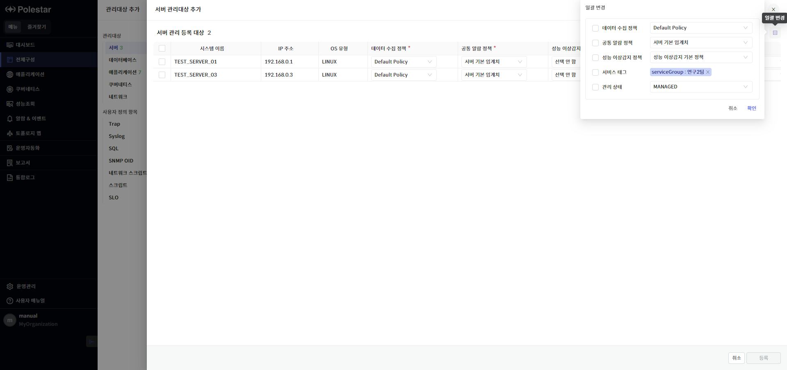

▶ \[그림 16\] 관리 대상 – 서버 등록 – 일괄 변경

설정값 일괄 변경 절차

1.  페이지 우측 상단의 일괄변경 아이콘을 클릭

2.  변경할 항목을 체크 후, 선택 상자에서 데이터를 선택

3.  우측 하단의 \[확인\] 버튼 클릭

4.  그리드에 있는 모든 대상의 항목이 일괄변경

관리 대상 - 서버 삭제

등록 대기 상태의 서버를 삭제할 수 있습니다. 삭제한 등록 대기 서버의 에이전트를 다시 기동하면 해당 서버는 등록 대기 상태 장비로 재등록 되어 등록 대기 목록에 추가됩니다. 아래 노트를 참고하여 에이전트를 삭제하면 원치 않는 서버가 등록 대기 목록에 추가되는 일을 방지할 수 있습니다.

<table>
<tbody>
<tr class="odd">
<td>
노트

에이전트를 완전히 삭제하려면, 해당 서버에 접속하여 직접 삭제하여야 합니다.

./AgentInstall.sh –uninstall (SMS Agent 설치 매뉴얼 참조)
</td>
</tr>
</tbody>
</table>

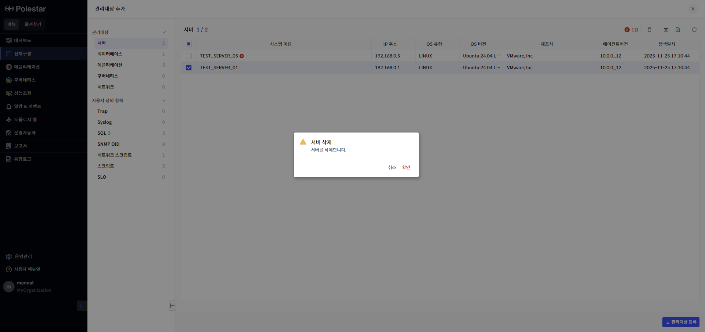

▶ \[그림 17\] 관리 대상 - 서버 삭제

서버 삭제 절차

1.  등록 대기 서버 목록에서 삭제할 서버 선택 (다수 선택 가능)

2.  등록 대기 서버 목록 우측 상단의 \[삭제\] 버튼 클릭

3.  삭제 확인 메시지창에서 \[확인\] 버튼 클릭

관리 대상 – 네트워크

관리 대상 메뉴에서 \[네트워크\]를 클릭하여 등록 대기 상태의 네트워크 목록을 확인할 수 있습니다. 관리 대상 메뉴에 녹색으로 표시되는 숫자는 POLESTAR에 연결된 지 24시간이 경과하지 않은 신규 네트워크 개수를 의미합니다. 등록 대기 네트워크 목록 우측 상단에는 등록 실패 이력이 있는 네트워크 개수가 표시됩니다.

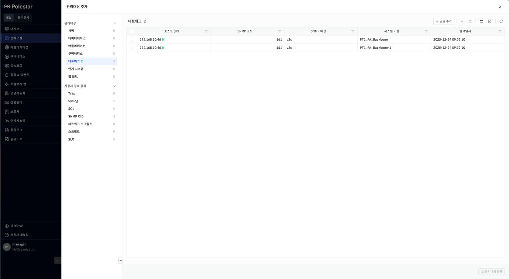

▶ \[그림 18\] 관리 대상 - 등록 대기 네트워크 목록

등록 대기 네트워크 항목

| 호스트 (IP) | 네트워크의 호스트(IP)를 표시합니다.          |
| -------- | ------------------------------ |
| SNMP 포트  | SNMP 포트 정보를 표시합니다.             |
| SNMP 버전  | SNMP 버전 정보를 표시합니다.             |
| 시스템 이름   | 네트워크의 시스템 이름을 표시합니다.           |
| 탐색일시     | 네트워크가 POLESTAR에 탐색된 일시를 표시합니다. |

관리 대상 – 네트워크 등록 드로우

네트워크 등록 대기 목록 상단에 네트워크 등록() 버튼을 클릭하면 표시되는 드로우 화면에서 네트워크 등록에 필요한 기본 접속 정보 및 상세 설정을 할 수 있습니다. 설정 후 저장 버튼을 클릭하면 네트워크 등록 대기 목록에 등록 드로우에 설정한 네트워크가 추가 됩니다.

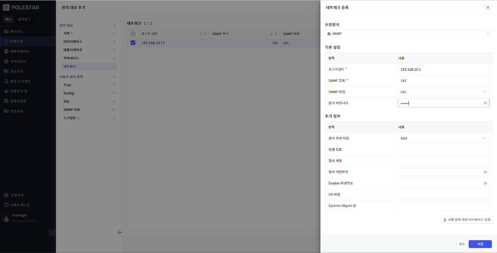

▶ \[그림 \] 관리 대상 – 네트워크 등록 드로우

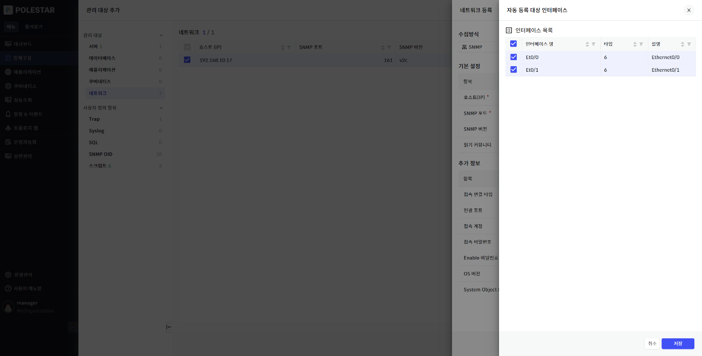

▶ \[그림 \] 관리 대상 – 자동 대상 인터페이스 등록 드로우

네트워크 등록 드로우 항목

| 호스트(IP)         | 추가할 네트워크의 호스트명 또는 IP를 입력합니다.           |
| --------------- | -------------------------------------- |
| SNMP 포트         | 추가할 네트워크의 포트를 입력합니다.                   |
| SNMP 버전         | 추가할 네트워크의 SNMP 버전을 선택합니다.(v1, v2c, v3) |
| 읽기 커뮤니티         | 추가할 네트워크의 읽기 커뮤니티를 입력합니다.              |
| 접속 연결 타입        | 네트워크 장비의 접속 연결 타입을 선택합니다.(SSH, TELNET) |
| 연결 포트           | 네트워크 장비의 접속 연결 포트를 입력합니다.              |
| 접속 계정           | 네트워크 장비의 접속 계정을 입력합니다.                 |
| 접속 비밀번호         | 네트워크 장비의 접속 비밀번호를 입력합니다.               |
| Enable 비밀번호     | 네트워크 장비의 Enable 비밀번호를 입력합니다.           |
| OS 버전           | 네트워크 장비의 OS 버전 정보를 입력합니다.              |
| SystemObject ID | 네트워크 장비의 System Object ID를 입력합니다.      |
| 자동 등록 대상 인터페이스  | 네트워크 장비에서 모니터링 대상으로 설정할 인터페이스를 선택합니다.  |

관리 대상 - 네트워크 일괄 추가

CSV 파일을 이용하여 여러 네트워크 장비를 한 번에 등록 대기 장비로 추가할 수 있습니다. 네트워크 등록 대기 목록 상단의 \[+ 일괄 추가\] 버튼을 클릭하면 일괄 추가 드로어가 표시됩니다. 네트워크 일괄 추가 드로어 화면에서 CSV 템플릿을 다운로드하여 등록 대기 장비의 정보를 작성한 후 수정된 파일을 업로드할 수 있습니다. 검증 버튼을 클릭하여 장비 정보의 입력값 검증과 SNMP 연결 검증을 거쳐 여러 장비를 일괄 등록할 수 있습니다.

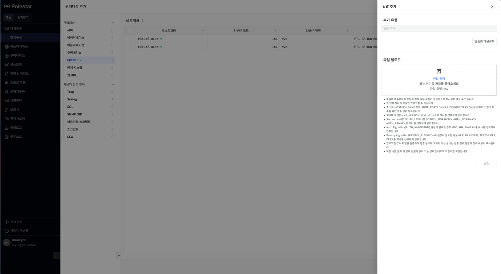

▶ \[그림 21\] 관리 대상 – 네트워크 일괄 추가 드로어

일괄 추가 드로어 구성

| 추가유형      | “일괄 추가”가 고정값으로 표시됩니다.                                           |
| --------- | --------------------------------------------------------------- |
| 템플릿 다운로드  | CSV 템플릿 파일을 다운로드합니다. 템플릿에는 등록에 필요한 18개 필드가 포함되어 있습니다.           |
| 파일 업로드 영역 | CSV 파일을 드래그 앤 드롭하거나 파일 선택을 통해 업로드합니다. 한 번에 하나의 파일만 업로드할 수 있습니다. |
| 가이드라인     | CSV 작성 시의 유의사항이 안내됩니다.                                          |
| 검증 버튼     | 업로드된 CSV 파일의 검증을 시작합니다.                                         |

CSV 템플릿 필드

| HOST(IP)           | 유효한 장비 IP 주소를 입력합니다. IPv4 또는 IPv6 형식을 지원합니다. 필수 입력 항목입니다.                                           |
| ------------------ | --------------------------------------------------------------------------------------------------- |
| SNMP\_PORT         | SNMP 포트 번호를 입력합니다. 1\~65535까지의 정수를 지원하며 기본값은 161입니다. 필수 입력 항목입니다.                                   |
| SNMP\_VERSION      | SNMP 버전(v1, v2c, v3)을 입력합니다. 필수 입력 항목입니다.                                                           |
| READ\_COMMUNITY    | SNMP 읽기 커뮤니티 문자열을 입력합니다.                                                                            |
| USM\_USER          | SNMP v3 사용자명을 입력합니다. SNMP v3 사용 시 필수 입력 항목입니다.                                                      |
| SECURE\_LEVEL      | SNMP v3 보안 레벨을 입력합니다. SNMP v3 사용 시 필수 입력 항목입니다. (NOAUTH\_NOPRIVACY, AUTH\_NOPRIVACY, AUTH\_PRIVACY) |
| AUTH\_ALGORITHM    | 인증 알고리즘을 입력합니다. (MD5, SHA, SHA256 등)                                                                |
| AUTH\_PASSWORD     | 인증 비밀번호를 입력합니다. 인증 알고리즘에서 AUTH 레벨 사용 시 필수 입력 항목입니다.                                                 |
| PRIVACY\_ALGORITHM | 암호화 알고리즘을 입력합니다. (DES, DES3, AES128, AES192, AES256)                                                |
| PRIVACY\_PASSWORD  | 암호화 비밀번호를 입력합니다. 암호화 알고리즘에서 PRIV 레벨 사용 시 필수 입력 항목입니다.                                               |
| CONTEXT\_NAME      | SNMP v3 컨텍스트 이름을 입력합니다.                                                                             |
| CONNECT\_TYPE      | 접속 타입을 입력합니다. (SSH, TELNET)                                                                         |
| CONNECT\_PORT      | 접속 포트를 입력합니다.                                                                                       |
| USER\_NAME         | 접속 사용자명을 입력합니다.                                                                                     |
| PASSWORD           | 접속 비밀번호를 입력합니다.                                                                                     |
| ENABLE\_PASSWORD   | Enable 비밀번호를 입력합니다.                                                                                 |
| OS\_VERSION        | OS 버전 정보를 입력합니다.                                                                                    |
| SYSTEM\_OBJECT\_ID | System OID 정보를 입력합니다.                                                                               |

<table>
<tbody>
<tr class="odd">
<td>
노트

SNMP 버전에 따라 필수 입력 필드가 다릅니다.

<ul>
<li>
v1, v2c: HOST, SNMP_PORT, SNMP_VERSION, READ_COMMUNITY
</li>
<li>
v3 공통: HOST, SNMP_PORT, SNMP_VERSION, USM_USER, SECURE_LEVEL
</li>
<li>
v3 (AUTH_NOPRIVACY): v3 공통 필드 + AUTH_ALGORITHM, AUTH_PASSWORD
</li>
<li>
v3 (AUTH_PRIVACY): v3 공통 필드 + PRIVACY_ALGORITHM, PRIVACY_PASSWORD
</li>
</ul></td>
</tr>
</tbody>
</table>

관리 대상 - 네트워크 일괄 추가 사전 검증

CSV 파일 업로드 후 \[검증\] 버튼을 클릭하면 좌측에 업로드 목록 영역이 추가로 드로우됩니다. 이 목록에서는 CSV 파일을 통해 업로드한 네트워크 장비의 정보의 정적 검증 결과와 SNMP 통신을 사용한 동적 검증 결과를 확인할 수 있습니다. CSV 파일에 입력된 정보 중 네트워크 장비를 식별할 수 있는 최소한의 정보들이 테이블 목록에 표시되며, 순번 컬럼과 검증 결과 컬럼을 통해 행 별로 검증 결과를 확인할 수 있습니다.

검증 상태가 불가능인 경우 검증 결과 컬럼에 실패 사유가 표시됩니다. 저장 버튼을 클릭하면 업로드 목록 중 가능 상태인 장비에 대해서만 저장이 진행됩니다.

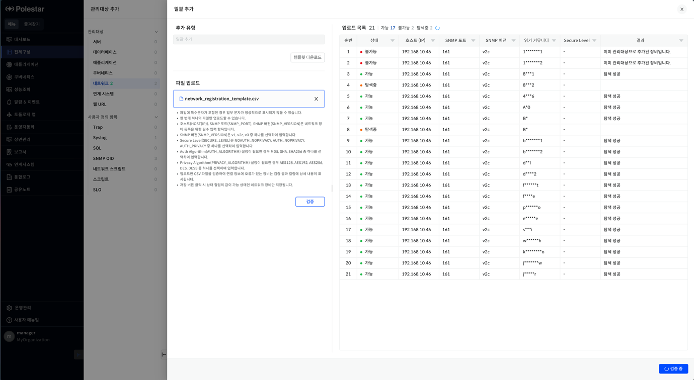

▶ \[그림 22\] 관리 대상 – 네트워크 일괄 추가 사전 검증 화면

업로드 목록 항목

<table>
<thead>
<tr class="header">
<th>순번</th>
<th>CSV 파일 내 행 번호를 표시합니다.</th>
</tr>
</thead>
<tbody>
<tr class="odd">
<td>상태</td>
<td>
검증 상태를 표시합니다.

<ul>
<li>
가능: 정적 검증과 동적 검증에 모두 성공하여 저장이 가능한 상태입니다.
</li>
<li>
불가능: 정적 검증 또는 동적 검증에 실패하여 저장이 불가능한 상태입니다.
</li>
<li>
탐색중: 정적 검증에 통과하여SNMP 통신 기반으로 네트워크 장비를 탐색중입니다. 탐색에 성공하면 가능 상태가 되고, 그렇지 않으면 불가능 상태가 됩니다.
</li>
</ul></td>
</tr>
<tr class="even">
<td>호스트 (IP)</td>
<td>장비 IP 주소를 표시합니다.</td>
</tr>
<tr class="odd">
<td>SNMP 포트</td>
<td>SNMP 포트 번호를 표시합니다.</td>
</tr>
<tr class="even">
<td>SNMP 버전</td>
<td>SNMP 버전을 표시합니다. (v1, v2c, v3)</td>
</tr>
<tr class="odd">
<td>읽기 커뮤니티</td>
<td>읽기 커뮤니티의 첫 번째와 마지막 문자열을 제외하고 마스킹 처리하여 표시합니다.</td>
</tr>
<tr class="even">
<td>Secure Level</td>
<td>SNMP 버전이 v3인 경우, 보안 레벨을 표시합니다.</td>
</tr>
<tr class="odd">
<td>결과</td>
<td>검증 결과를 표시합니다.</td>
</tr>
</tbody>
</table>

검증 결과 메시지

| 결과 유형      | 메시지                                                                                        |
| ---------- | ------------------------------------------------------------------------------------------ |
| 필수 값 누락    | 호스트(HOST(IP))는 필수 입력 항목입니다.                                                                |
| 필수 값 누락    | SNMP 포트(SNMP\_PORT)는 필수 입력 항목입니다.                                                          |
| 필수 값 누락    | SNMP\_VERSION은 필수 입력 항목입니다.                                                                |
| 필수 값 누락    | SNMP 버전(SNMP\_VERSION)을 v3로 설정한 경우 Usm User(USM\_USER)은 필수 입력 항목입니다.                       |
| 필수 값 누락    | SNMP 버전(SNMP\_VERSION)을 v3로 설정한 경우 Secure Level(SECURE\_LEVEL)은 필수 입력 항목입니다.               |
| 형식 오류      | 호스트(HOST(IP))는 IP 주소 형식으로 입력해야 합니다.                                                        |
| 형식 오류      | SNMP 포트(SNMP\_PORT)는 숫자만 입력해야 합니다.                                                         |
| 형식 오류      | SNMP 버전(SNMP\_VERSION)은 v1, v2c, v3 중 하나여야 합니다.                                            |
| 형식 오류      | Secure Level(SECURE\_LEVEL)은 NOAUTH\_NOPRIVACY, AUTH\_NOPRIVACY, AUTH\_PRIVACY 중 하나여야 합니다. |
| 중복 장비      | 이미 등록된 장비입니다.                                                                              |
| 중복 장비      | 이미 관리대상으로 추가된 장비입니다.                                                                       |
| SNMP 연결 실패 | 탐색 실패                                                                                      |
| SNMP 연결 실패 | 탐색 실패 (Timeout)                                                                            |

관리 대상 - 네트워크 일괄 추가 저장

네트워크 일괄 추가 검증 과정을 거친 뒤 \[저장\] 버튼을 클릭하면 업로드 목록 중 가능 상태인 장비를 대상으로 저장이 진행됩니다. 저장이 완료되면 업로드 목록 영역이 처리 결과 목록으로 변경되며, 결과 컬럼에 네트워크 장비의 저장 성공 여부가 표시됩니다. 단, 검증에 실패하여 저장 대상이 아닌 네트워크 장비의 경우 검증 결과 내용이 결과 컬럼에 동일하게 표시됩니다.

<table>
<tbody>
<tr class="odd">
<td>
주의

저장 버튼 클릭 시 상태가 [가능]인 네트워크 장비에 대해서만 저장이 진행됩니다. 상태가 [불가능]인 네트워크 장비는 저장하지 않으므로, 등록하려는 네트워크 장비의 검증 결과 메시지를 참고하여 CSV 파일을 수정한 뒤 다시 검증을 진행해야 합니다.
</td>
</tr>
</tbody>
</table>

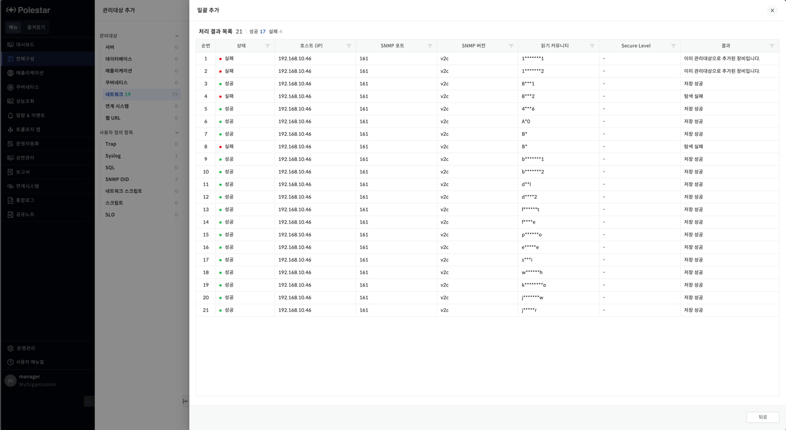

▶ \[그림 23\] 관리 대상 – 네트워크 일괄 추가 처리 결과 화면

처리 결과 목록 항목

<table>
<thead>
<tr class="header">
<th>순번</th>
<th>CSV 파일 내 행 번호를 표시합니다.</th>
</tr>
</thead>
<tbody>
<tr class="odd">
<td>상태</td>
<td>
검증 상태를 표시합니다.

<ul>
<li>
성공: 네트워크 장비가 성공적으로 저장된 경우 성공 상태가 됩니다.
</li>
<li>
실패: 네트워크 장비 저장 대상이 아니거나 저장에 실패한 경우 실패 상태가 됩니다.
</li>
</ul></td>
</tr>
<tr class="even">
<td>호스트 (IP)</td>
<td>장비 IP 주소를 표시합니다.</td>
</tr>
<tr class="odd">
<td>SNMP 포트</td>
<td>SNMP 포트 번호를 표시합니다.</td>
</tr>
<tr class="even">
<td>SNMP 버전</td>
<td>SNMP 버전을 표시합니다. (v1, v2c, v3)</td>
</tr>
<tr class="odd">
<td>읽기 커뮤니티</td>
<td>읽기 커뮤니티를 첫 번째와 마지막 문자열을 제외하고 마스킹 처리하여 표시합니다.</td>
</tr>
<tr class="even">
<td>Secure Level</td>
<td>SNMP 버전이 v3인 경우, 보안 레벨을 표시합니다.</td>
</tr>
<tr class="odd">
<td>결과</td>
<td>처리 결과를 표시합니다. 단, 검증에 실패한 장비의 경우 검증 결과가 표시됩니다.</td>
</tr>
</tbody>
</table>

저장 결과 메시지

| 결과 유형 | 메시지                               |
| ----- | --------------------------------- |
| 성공    | 저장 성공                             |
| 실패    | 저장 실패                             |
| 실패    | 검증에 실패한 장비의 경우, 검증 실패 메시지가 나타납니다. |

관리 대상 - 네트워크 등록

등록 대기 네트워크 목록에서 네트워크를 선택하여 등록할 수 있습니다. 등록 시 데이터 수집 정책, 공통 알람 정책, 성능 이상감지 정책, 서비스 태그, 관리 상태를 설정해야 합니다.

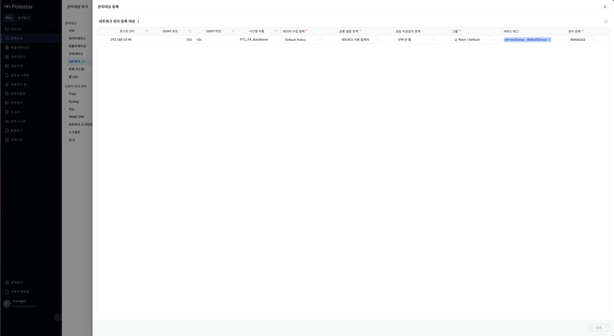

▶ \[그림 24\] 관리 대상 – 네트워크 등록 – 필수 항목 설정

네트워크 등록 항목

<table>
<thead>
<tr class="header">
<th>호스트 (IP)</th>
<th>등록하려는 네트워크의 IP 주소를 표시합니다.</th>
</tr>
</thead>
<tbody>
<tr class="odd">
<td>SNMP 포트</td>
<td>등록하려는 네트워크의 SNMP 포트 정보를 표시합니다.</td>
</tr>
<tr class="even">
<td>SNMP 버전</td>
<td>등록하려는 네트워크의 SNMP 버전을 표시합니다.</td>
</tr>
<tr class="odd">
<td>시스템 이름</td>
<td>등록하려는 네트워크의 시스템 이름을 표시합니다.</td>
</tr>
<tr class="even">
<td>데이터 수집 정책</td>
<td>
등록하려는 네트워크에 할당할 데이터 수집 정책을 선택합니다. 수집 정책에 따라 성능 지표 별 데이터 수집 여부, 수집 주기, 통계 데이터 저장 여부가 일괄 적용됩니다.

 : 선택한 데이터 수집 정책의 세부 설정 목록 호출
</td>
</tr>
<tr class="odd">
<td>공통 알람 정책</td>
<td>
등록하려는 네트워크에 할당할 알람 정책을 선택합니다. 알람 정책을 선택하여 미리 정의한 알람 설정을 일괄 적용할 수 있습니다.

 : 선택한 알람 정책의 세부 설정 목록 호출
</td>
</tr>
<tr class="even">
<td>성능 이상감지 정책</td>
<td>
등록하려는 네트워크에 할당할 성능 이상감지 정책을 선택합니다. 성능 이상감지 정책에 따라 대상 네트워크의성능 지표 중 이상 감지를 할 지표가 일괄 설정됩니다.

 : 선택한 성능 이상감지 정책의 세부 설정 목록 호출
</td>
</tr>
<tr class="odd">
<td>그룹</td>
<td>등록하려는 네트워크의 그룹을 선택합니다.</td>
</tr>
<tr class="even">
<td>서비스 태그</td>
<td>등록하려는 네트워크에 적용할 서비스 태그를 선택합니다. 기존 등록된 서비스 태그를 사용하거나, 신규 서비스 태그를 생성하여 적용할 수 있습니다.</td>
</tr>
<tr class="odd">
<td>관리 상태</td>
<td>
등록하려는 네트워크의 관리 상태를 선택합니다.

MANAGED: 관리 (성능 및 구성 데이터 수집)

UNMANAGED: 관리 안함 (성능 및 구성 데이터 수집 안함)
</td>
</tr>
</tbody>
</table>

<table>
<tbody>
<tr class="odd">
<td>
노트

데이터 수집 정책, 공통 알람 정책, 성능 이상감지 정책의 기본 설정 항목은 다음과 같습니다.

<ul>
<li>
데이터 수집 정책: [운영관리 &gt; 데이터 수집 설정 &gt; 관리 지표 공통 설정] 중 자동 적용이 활성화되어 있는 항목을 기본 정책으로 설정합니다.
</li>
<li>
공통 알람 정책: [알람 &amp; 이벤트 &gt; 공통 알람 정책]에 정의된 네트워크용 정책 중 기본 정책으로 설정되어 있는 항목을 사용합니다.
</li>
<li>
성능 이상감지 정책: [알람 &amp; 이벤트 &gt; 성능 이상감지 정책] 중 자동 적용이 활성화되어 있는 항목을 기본 정책으로 설정합니다.
</li>
</ul></td>
</tr>
</tbody>
</table>

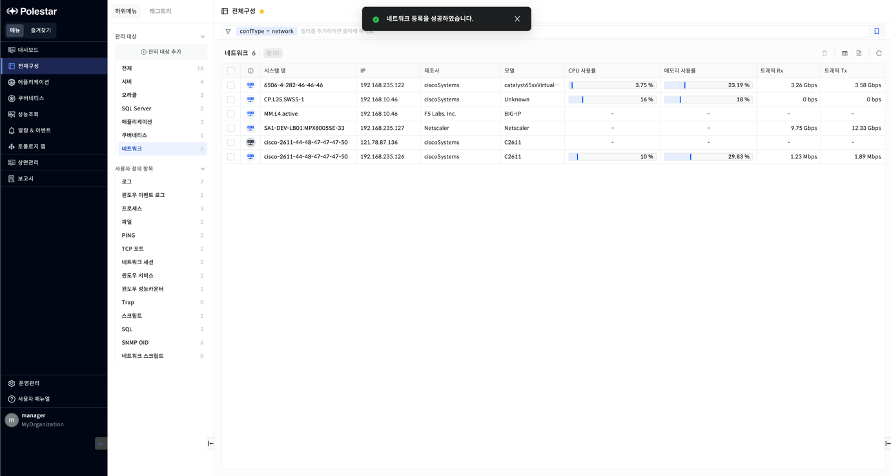

▶ \[그림 25\] 관리 대상 - 네트워크 등록 - 등록 완료

네트워크 등록 절차

1.  등록 대기 네트워크 목록에서 등록할 네트워크 선택 (다수 선택 가능)

2.  화면 우측 하단의 \[관리 대상 등록\] 버튼 클릭

3.  필수 항목 설정 (데이터 수집 정책, 공통 알람 정책, 서비스 태그, 관리 상태)

4.  등록할 네트워크 선택 (다수 선택 가능)

5.  화면 우측 사단의 \[등록\] 버튼 클릭

관리 대상 – 네트워크 등록 – 일괄 변경

네트워크 관리 대상 등록 드로어에서 네트워크 관리 등록 대상 목록의 네트워크 장비에 대해 데이터 수집 정책, 공통 알람 정책, 성능 이상감지 정책, 서비스 태그, 관리 상태 정보를 일괄 변경할 수 있습니다.

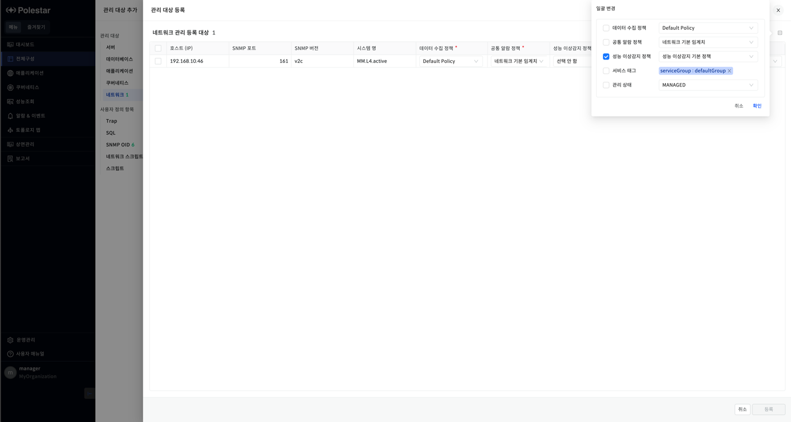

▶ \[그림 26\] 관리 대상 – 네트워크 등록 – 일괄 변경

설정값 일괄 변경 절차

1.  페이지 우측 상단의 일괄변경 아이콘을 클릭

2.  변경할 항목을 체크 후, 선택 상자에서 데이터를 선택

3.  우측 하단의 \[확인\] 버튼 클릭

4.  그리드에 있는 모든 대상의 항목이 일괄변경

관리 대상 - 네트워크 삭제

등록 대기 상태의 네트워크를 삭제할 수 있습니다.

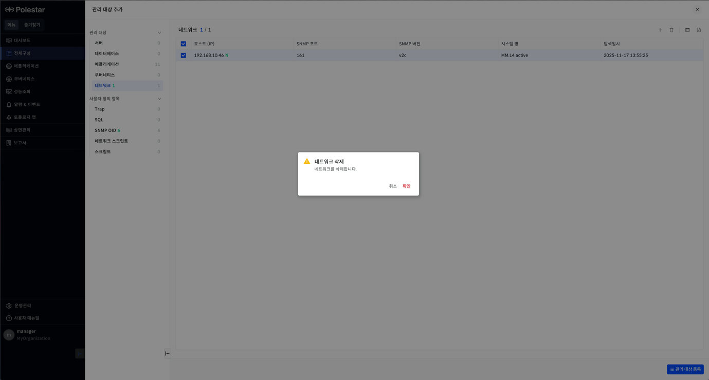

▶ \[그림 27\] 관리 대상 - 네트워크 삭제

네트워크 삭제 절차

1.  등록 대기 네트워크 목록에서 삭제할 네트워크 선택 (다수 선택 가능)

2.  등록 대기 네트워크 목록 우측 상단의 \[삭제\] 버튼 클릭

3.  삭제 확인 메시지창에서 \[확인\] 버튼 클릭

관리 대상 – 쿠버네티스

관리 대상 메뉴에서 \[쿠버네티스\]를 선택하면 에이전트가 설치된 등록 대기 상태의 클러스터 목록을 확인할 수 있습니다. 관리 대상 메뉴에 녹색으로 표시되는 숫자는 POLESTAR에 연결된 지 24시간이 경과하지 않은 신규 쿠버네티스 클러스터 개수를 의미합니다. 등록 대기 쿠버네티스 클러스터 에이전트 목록 우측 상단에는 등록 실패 이력이 있는 쿠버네티스 클러스터 에이전트 개수가 표시됩니다.

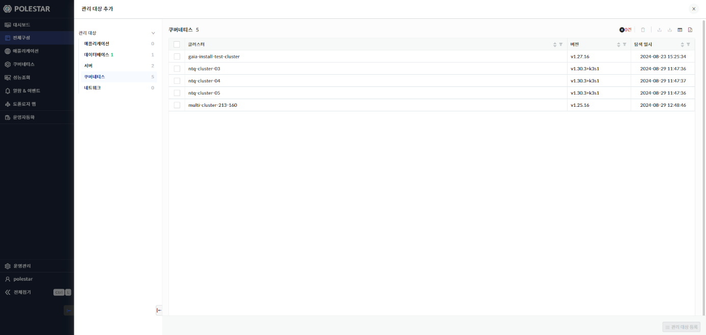

▶ \[그림 \] 관리 대상 - 등록 대기 쿠버네티스 클러스터 목록

화면 지표

<table>
<thead>
<tr class="header">
<th>클러스터</th>
<th><table>
<tbody>
<tr class="odd">
<td>쿠버네티스 클러스터명을 표시합니다. 에이전트에서 설정한 쿠버네티스 클러스터명이 표시됩니다.</td>
</tr>
</tbody>
</table></th>
</tr>
</thead>
<tbody>
<tr class="odd">
<td>버전</td>
<td>클러스터의 쿠버네티스 버전을 표시합니다.</td>
</tr>
<tr class="even">
<td>노드 수</td>
<td>클러스터의 노드수를 표시합니다.</td>
</tr>
</tbody>
</table>

관리 대상 – 쿠버네티스 등록

등록 대기 에이전트 목록에서 쿠버네티스를 선택하여 등록할 수 있습니다. 등록 시 데이터 수집정책, 공통 알람 정책, 성능 이상감지 정책과 서비스태그를 설정할 수 있다.

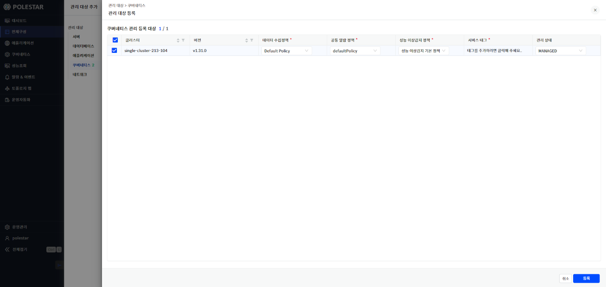

▶ \[그림 \] 관리 대상 – 쿠버네티스 클러스터 등록 - 필수 항목 설정

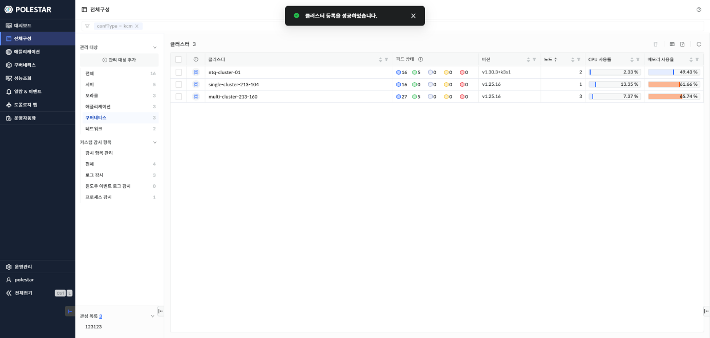

▶ \[그림 \] 관리 대상 – 쿠버네티스 클러스터 등록 - 등록 완료

화면 지표

<table>
<thead>
<tr class="header">
<th>클러스터</th>
<th><table>
<tbody>
<tr class="odd">
<td>쿠버네티스 클러스터명을 표시합니다. 에이전트에서 설정한 쿠버네티스 클러스터명이 표시됩니다.</td>
</tr>
</tbody>
</table></th>
</tr>
</thead>
<tbody>
<tr class="odd">
<td>버전</td>
<td>쿠버네티스 클러스터의 버전을 표시합니다.</td>
</tr>
<tr class="even">
<td>데이터 수집 정책</td>
<td>등록하려는 에이전트가 포함되어 있는 쿠버네티스에 할당되는 데이터 수집 정책입니다.</td>
</tr>
<tr class="odd">
<td>공통 알람 정책</td>
<td>
등록하려는 에이전트에 할당할 알람 정책을 선택합니다. 알람 정책을 선택하여 미리 정의한 알람 설정을 일괄 적용할 수 있습니다.

 : 선택한 알람 정책의 세부 설정 목록 호출
</td>
</tr>
<tr class="even">
<td>성능 이상감지 정책</td>
<td>
등록하려는 쿠버네티스에 할당할 성능 이상감지 정책을 선택합니다. 성능 이상감지 정책에 따라 대상 쿠버네티스 성능 지표 중 이상 감지를 할 지표가 일괄 설정됩니다.

 : 선택한 성능 이상감지 정책의 세부 설정 목록 호출
</td>
</tr>
<tr class="odd">
<td>서비스 태그</td>
<td>등록하려는 에이전트가 포함된 서비스에 적용할 서비스 태그를 선택합니다. 기존 등록된 서비스 태그를 사용하거나, 신규 서비스 태그를 생성하여 적용할 수 있습니다.</td>
</tr>
<tr class="even">
<td>관리 상태</td>
<td>
등록하려는 쿠버네티스의 관리 상태를 선택합니다.

MANAGED: 관리 (성능 및 구성 데이터 수집)

UNMANAGED: 관리 안함 (성능 및 구성 데이터 수집 안함)
</td>
</tr>
</tbody>
</table>

쿠버네티스 등록 절차

1.  등록 대기 쿠버네티스 목록에서 등록할 쿠버네티스 클러스터 선택 (다수 선택 가능)

2.  화면 우측 하단의 \[관리 대상 등록\] 버튼 클릭

3.  필수 항목 설정 (데이터수집정책, 공통 알람 정책, 성능 이상감지 정책, 서비스 태그)

4.  등록할 쿠버네티스 클러스터 선택 (다수 선택 가능)

5.  화면 우측 사단의 \[등록\] 버튼 클릭

관리 대상 – 쿠버네티스 등록 – 일괄 변경

등록 대기 쿠버네티스 목록에서 전체 대상으로 설정값을 일괄적으로 변경할 수 있습니다.

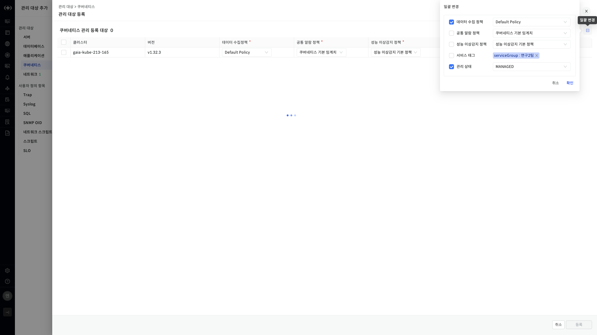

▶ \[그림 31\] 관리 대상 – 쿠버네티스 등록 – 일괄 변경

설정값 일괄 변경 절차

1.  페이지 우측 상단의 일괄변경 아이콘을 클릭

2.  변경할 항목을 체크 후, 선택 상자에서 데이터를 선택

3.  우측 하단의 \[확인\] 버튼 클릭

4.  그리드에 있는 모든 대상의 항목이 일괄변경

관리 대상 – 쿠버네티스 삭제

등록 대기 상태의 쿠버네티스를 삭제할 수 있습니다. 삭제한 등록 대기 쿠버네티스는 삭제 후 바로 다시 등록 대기 상태 장비로 재등록되어 등록 대기 목록에 추가됩니다. 따라서 쿠버네티스를 완전히 삭제하려면 쿠버네티스에서 에이전트 파드를 제거해야 합니다. 아래 노트를 참고하여 쿠버네티스를 삭제하면 원치 않는 쿠버네티스 등록 대기 목록에 추가되는 일을 방지할 수 있습니다.

<table>
<tbody>
<tr class="odd">
<td>
노트

쿠버네티스를 완전히 삭제하려면, 해당 쿠버네티스 환경에서 쿠버네티스 에이전트 파드를 제거 해야 합니다. 에이전트 파드 제거는 KCM 관리자 매뉴얼의 KCM에이전트부분을 참고합니다.
</td>
</tr>
</tbody>
</table>

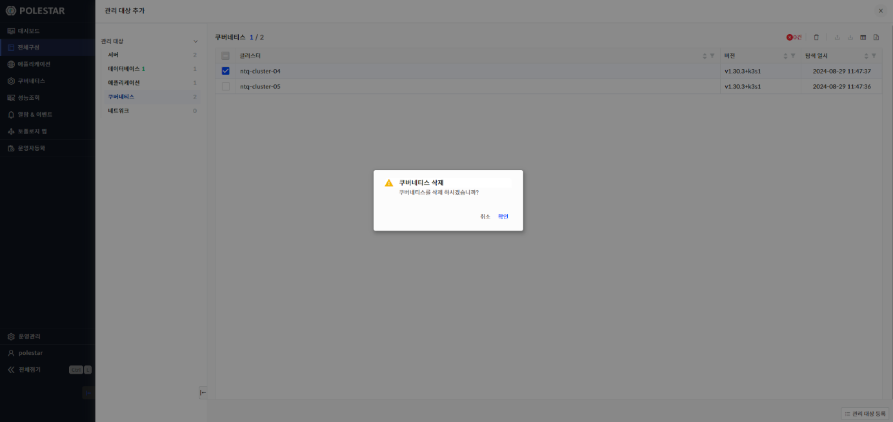

▶ \[그림 \] 관리 대상 – 쿠버네티스 에이전트 삭제

쿠버네티스 삭제 절차

1.  등록 대기 쿠버네티스 목록에서 삭제할 서버 선택 (다수 선택 가능)

2.  등록 대기 쿠버네티스 목록 우측 상단의 \[삭제\] 버튼 클릭

3.  삭제 확인 메시지창에서 \[확인\] 버튼 클릭

관리 대상 – 연계시스템

관리 대상 메뉴에서 \[연계시스템\]을 선택하면 관리 대상으로 등록된 연계시스템 목록을 확인할 수 있습니다. 관리 대상 메뉴에 녹색으로 표시되는 숫자는 POLESTAR에 연결된 지 24시간이 경과하지 않은 신규 연계시스템 개수를 의미합니다.

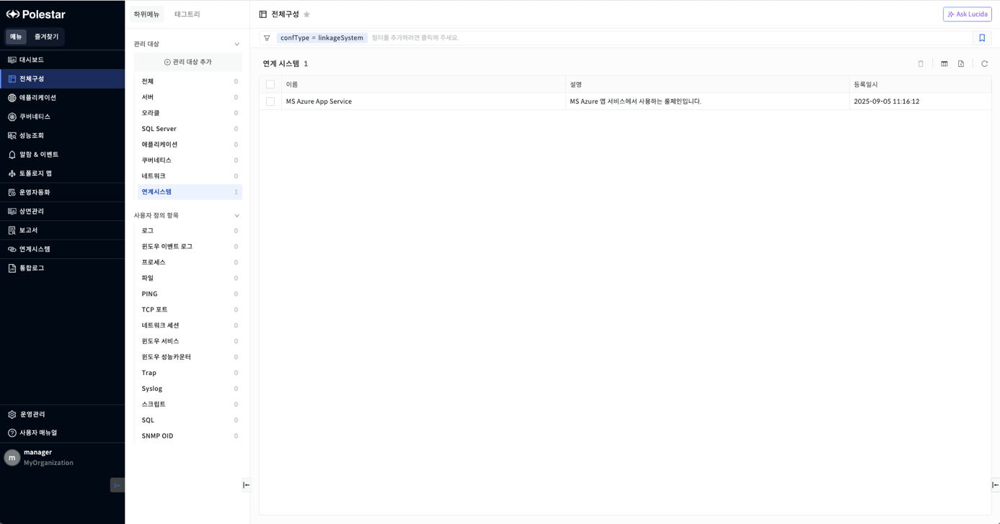

▶ \[그림 33\] 관리 대상 – 연계시스템

> 연계시스템 목록 정보

| 이름   | 등록할 때 입력한 연계시스템의 이름입니다.       |
| ---- | ----------------------------- |
| 설명   | 연계시스템의 설명입니다. 설명은 변경할 수 있습니다. |
| 등록일시 | 연계시스템을 등록할 때의 일시입니다.          |

관리 대상 추가 – 연계시스템 \> 연계시스템 등록 드로어

\[전체구성\] \> \[+ 관리 대상 추가\] \> \[연계시스템\] \> 그리드 우측 상단에 있는 (+) 버튼을 눌러

새로운 연계시스템을 등록할 수 있는 기능입니다.

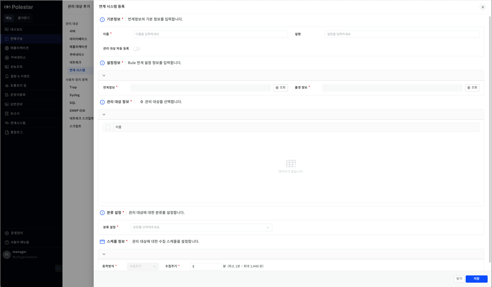

▶ \[그림 34\] 연계시스템 등록

> 연계시스템 등록 드로어 화면 정보

| 이름          | 연계시스템의 이름을 입력합니다(필수)                                                 |
| ----------- | -------------------------------------------------------------------- |
| 설명          | 연계시스템의 설명을 입력합니다.                                                    |
| 관리 대상 자동 등록 | 선택하면 관리 대상으로 자동으로 등록됩니다.                                             |
| 연계 정보       | 연계시스템에 사용할 연계정보를 조회하고 선택합니다.                                         |
| 룰 셋 정보      | 연계시스템에 사용할 룰 셋을 조회하고 선택합니다.                                          |
| 관리 대상 정보    | 연계 정보와 룰 셋 정보를 모두 선택하면 선택할 수 있는 관리 대상 목록이 나타납니다. 목록에서 관리할 대상을 선택합니다. |
| 분류 설정       | 관리 대상이 등록될 분류를 선택합니다(예: MS Azure \> VM)                              |
| 동작 방식       | 사용자 정의 SQL이 수집되는 방식을 선택합니다. 현재 버전은 수집주기만 선택 가능합니다.                   |
| 수집주기        | 동작방식이 수집주기인 경우 수집주기를 설정할 수 있습니다. 최소 1분에서 최대 1440분(1일)까지 입력이 가능합니다.   |
| 닫기          | 닫기 버튼을 클릭하면 연계시스템 등록을 취소하고 드로어를 닫습니다.                                |
| 저장          | 연계시스템 등록 드로어에 입력한 정보로 연계시스템을 등록 목록에 추가합니다.                           |

관리 대상 추가 – 연계시스템 삭제

등록 대기 상태(관리 대상 등록 전)의 연계시스템을 삭제할 수 있습니다.

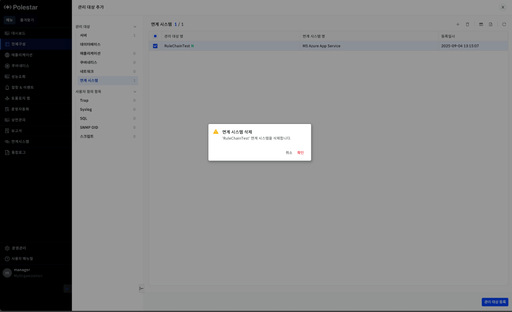

▶ \[그림 35\] 관리 대상 추가 – 연계시스템 삭제

연계시스템 삭제 절차

1.  연계시스템 목록에서 삭제할 연계시스템 선택(다수 선택 가능)

2.  연계시스템 목록 우측 상단의 휴지통 모양의 아이콘 클릭

3.  삭제 확인 메시지창에서 \[확인\] 버튼 클릭

관리 대상 추가 – 연계시스템 - 관리 대상 등록

관리 대상 자동 등록을 활성화하지 않은 연계시스템을 관리 대상으로 등록합니다.

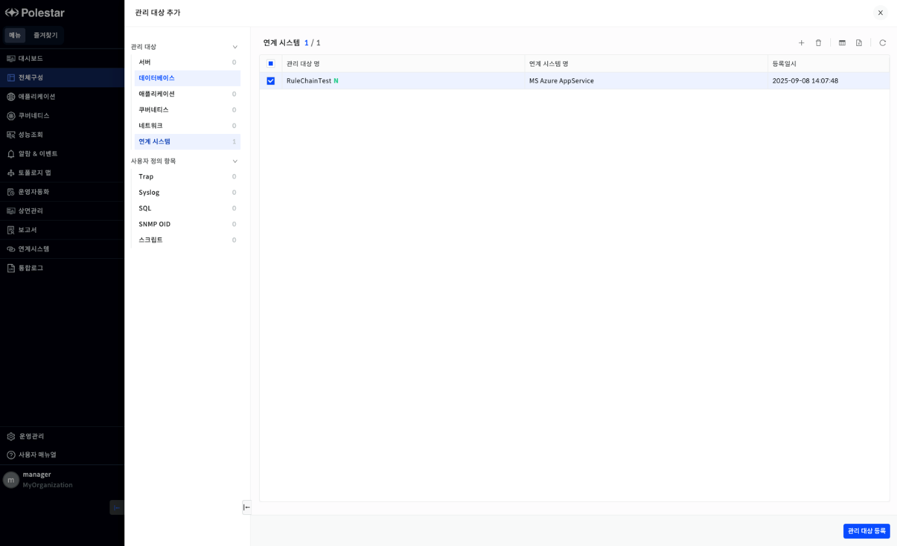

▶ \[그림 36\] 관리 대상 추가 – 연계시스템 관리 대상 등록

연계시스템 관리 대상 등록 절차

1.  연계시스템 목록에서 관리 대상으로 등록할 연계시스템 선택(다수 선택 가능)

2.  연계시스템 목록 우측 하단의 관리 대상 등록 버튼 클릭

3.  관리 대상 등록 확인 메시지창에서 \[확인\] 버튼 클릭

관리 대상 – 연계시스템 삭제

관리 대상으로 등록한 연계시스템을 삭제할 수 있습니다.

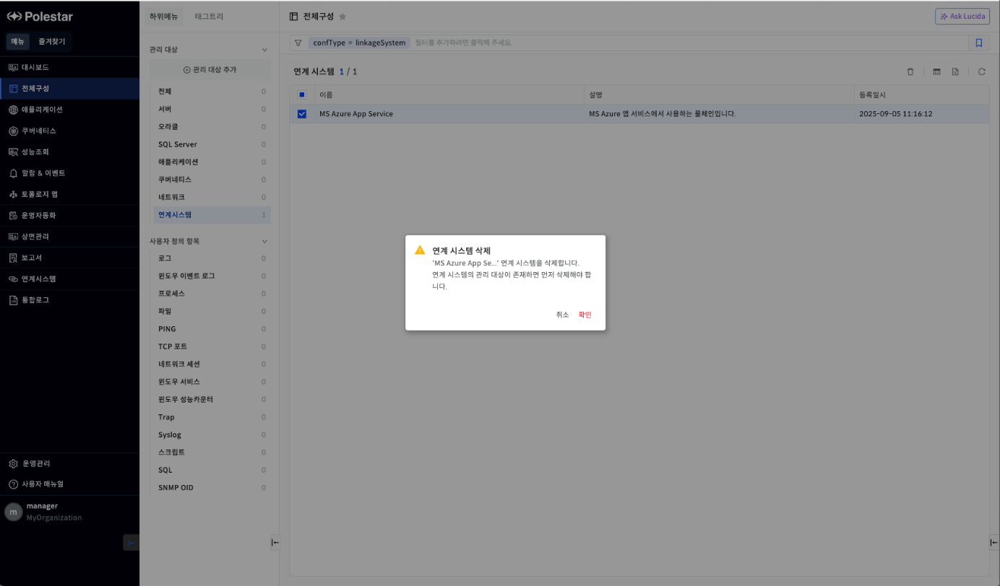

▶ \[그림 37\] 관리 대상 – 연계시스템 삭제

<table>
<tbody>
<tr class="odd">
<td>
노트

관리 대상으로 등록된 연계시스템을 삭제하려면, 해당 연계시스템을 사용해서 모니터링을 시작한 [관리 대상]을 먼저 삭제해야 합니다. 모니터링 하고 있는 관리 대상은 대메뉴 [연계시스템]에서 확인할 수 있습니다.
</td>
</tr>
</tbody>
</table>

연계시스템 삭제 절차

1.  연계시스템 목록에서 삭제할 연계시스템 선택(다수 선택 가능)

2.  연계시스템 목록 우측 상단의 휴지통 모양의 아이콘 클릭

3.  삭제 확인 메시지창에서 \[확인\] 버튼 클릭

관리 대상 – 웹 URL

관리 대상 메뉴에서 \[웹 URL\]을 선택하면 사용자가 등록한 대기 상태의 웹 URL 목록을 확인할 수 있습니다. 관리 대상 메뉴에 녹색으로 표시되는 숫자는 POLESTAR에 연결된 지 24시간이 경과하지 않은 신규 웹 URL 개수를 의미합니다.

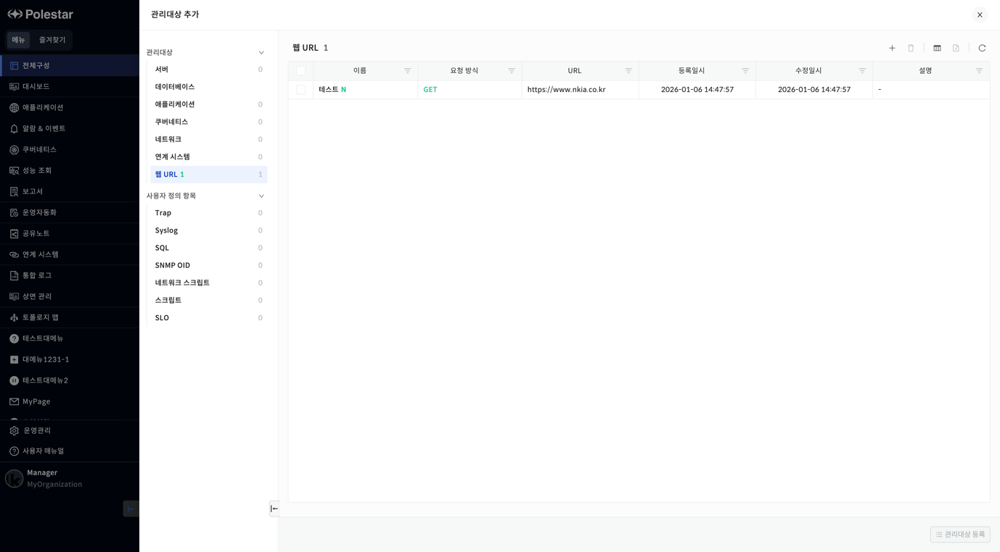

▶ \[그림38\] 관리 대상 – 등록 대기 웹 URL 목록

등록 대기 웹 URL 항목

| 이름    | 웹 URL의 이름을 표시합니다.        |
| ----- | ------------------------ |
| 요청 방식 | 요청 방식을 표현합니다. (GET/POST) |
| URL   | 등록된 URL을 표현합니다.          |
| 등록 일시 | 웹 URL이 등록된 일시를 표시합니다.    |
| 수정 일시 | 웹 URL의 마지막 수정 일시를 표시합니다. |
| 설명    | 웹 URL 에 대한 설명을 표시합니다.    |

관리 대상 - 웹 URL 등록

웹 URL 등록 대기 목록 상단의  버튼을 클릭하면 표시되는 드로우 화면에서 웹 URL 등록에 필요한 기본 접속 정보를 설정할 수 있습니다. (테이블에서 특정 이름 클릭 시 해당 웹 URL의 상세를 설정할 수 있는 드로어가 열림) 설정 후 저장 버튼을 클릭하면 웹 URL 등록 대기 목록에 등록 드로우에 설정한 웹 URL이 추가 됩니다.

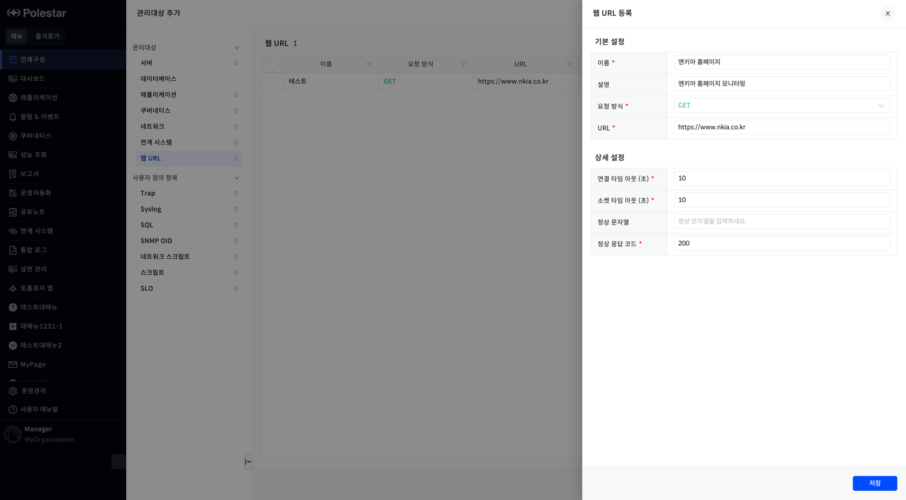

▶ \[그림39\] 웹 URL

> 웹 URL 등록 항목

<table>
<thead>
<tr class="header">
<th>이름</th>
<th>웹 URL의 이름을 입력합니다.</th>
</tr>
</thead>
<tbody>
<tr class="odd">
<td>설명</td>
<td>웹 URL의 설명을 입력합니다.</td>
</tr>
<tr class="even">
<td>요청 방식</td>
<td>요청할 방식을 선택합니다. (GET/POST)</td>
</tr>
<tr class="odd">
<td>브라우저</td>
<td>브라우저를 선택합니다. (Chrome/Firefox/Edge)</td>
</tr>
<tr class="even">
<td>상세 설정</td>
<td>
등록된 웹 URL의 상세 설정을 표시합니다.

연결 타임아웃(초) : URL 첫 요청에 대한 타임아웃 시간을 설정합니다.

소켓 타임아웃(초): 서버와 소켓 연결 후 타임아웃 시간을 설정합니다.

정상 문자열 : 헤더 안에 포함된 문자열을 기준으로 정상 여부를 확인할 문자열을 설정합니다.

정상 응답 코드 : 응답 코드 기준으로 정상 여부를 확인하는 설정을 합니다.
</td>
</tr>
</tbody>
</table>

관리 대상 - 웹 URL 관리 대상 등록

등록 대기 네트워크 목록에서 웹 URL을 선택하여 등록할 수 있습니다. 등록 시 데이터 수집 정책, 공통 알람 정책, 성능 이상감지 정책, 서비스 태그, 관리 상태를 설정해야 합니다.

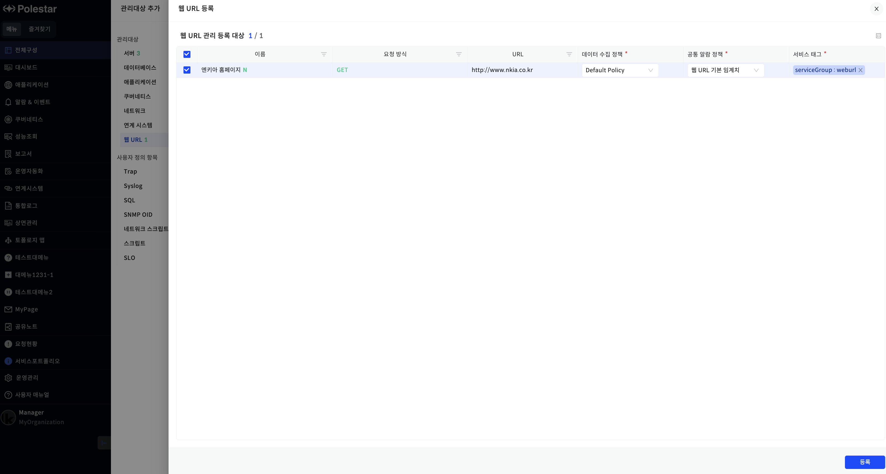

▶ \[그림40\] 웹 URL 관리 대상 등록

웹 URL 삭제

삭제할 웹 URL을 선택하고 \[삭제\] 버튼을 선택하여 웹 URL을 삭제할 수 있습니다.

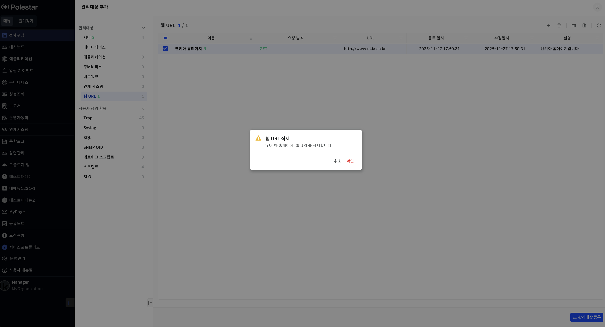

▶ \[그림41\] 웹 URL 관리 대상 삭제

관리 대상 – 사용자 정의 항목 \> Trap

관리 대상 메뉴에서 \[사용자 정의 항목\] \> Trap을 선택하면 Trap 등록 대기 목록 화면이 표시됩니다. 등록 대기 목록 상단의 추가() 버튼을 클릭하면 Trap 등록 드로어가 표시됩니다. 해당 드로어 화면을 통해 Trap 등록 대기 목록에 신규 Trap을 추가할 수 있습니다. 이후 등록 대기 목록에 추가된 Trap은 우측 하단 관리 대상 등록 버튼을 이용하여 실제 관리 대상 Trap으로 등록할 수 있습니다. 관리 대상 메뉴에 녹색으로 표시되는 숫자는 POLESTAR에 등록된 지 24시간이 경과하지 않은 신규 Trap 포트 개수를 의미합니다.

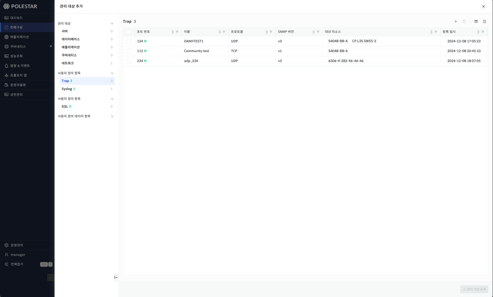

▶ \[그림 42\] 관리 대상 – 사용자 정의 항목 \> Trap 등록 대기 목록

화면 지표

| 포트 번호   | 등록하려는 Trap 포트 번호가 표시됩니다.                                                                                                                             |
| ------- | ---------------------------------------------------------------------------------------------------------------------------------------------------- |
| 이름      | 등록하려는 Trap의 이름이 표시됩니다. 등록 시 입력하지 않은 경우 프로토콜과 포트 번호를 조합한 이름이 자동으로 설정됩니다. 예를 들어, 162 포트 번호에 UDP 프로토콜을 사용하면서 이름을 설정하지 않은 경우 자동으로 udp\_162 라는 이름이 설정됩니다. |
| 프로토콜    | 등록하려는 Trap 포트의 프로토콜 정보(ex. TCP 또는 UDP)가 표시됩니다. 대부분 UDP 프로토콜을 사용합니다.                                                                                  |
| SNMP 버전 | 등록하려는 Trap에서 SNMP Trap 이벤트에 사용할 SNMP 버전 정보가 표시됩니다.                                                                                                   |
| 대상 리소스  | 등록하려는 Trap의 대상 리소스가 표시됩니다. 계정 내의 네트워크 장비 중에서 로그인한 사용자에게 읽기 권한이 할당된 장비만 목록에 표시됩니다.                                                                    |
| 등록 일시   | Trap을 등록 대기 목록에 추가한 일시가 표시됩니다.                                                                                                                       |

Trap 등록 대기 목록 추가 절차

1.  Trap 등록 대기 목록 상단의 추가() 버튼을 선택

2.  Trap 등록 드로어에서 추가하려는 기본정보, 장비정보, 설정정보 입력

3.  Trap 등록 드로어 하단 저장 버튼 선택

관리 대상 – 사용자 정의 항목 \> Trap등록 드로어

Trap등록 대기 목록 상단의 추가() 버튼을 클릭하면 표시되는 드로어 화면에서 Trap등록에 필요한 기본 연결정보 및 SNMP 상세 설정을 할 수 있습니다. 설정 후 저장 버튼을 클릭하면 Trap등록 대기 목록에 Trap이 추가됩니다.

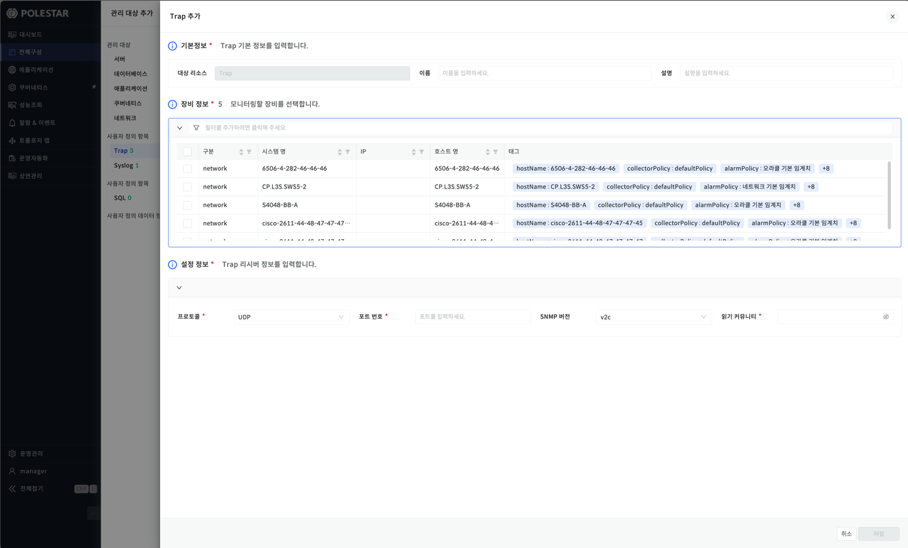

▶ \[그림 43\] 관리 대상 – Trap 등록 드로어

Trap 등록 드로어 항목

| 이름        | 추가할 Trap의 이름을 입력합니다.                                                                                                                                                          |
| --------- | ----------------------------------------------------------------------------------------------------------------------------------------------------------------------------- |
| 설명        | 추가할 Trap의 설명을 입력합니다.                                                                                                                                                          |
| 장비 정보     | 추가할 Trap의 대상 리소스를 선택합니다. 네트워크 장비만 선택 가능합니다.                                                                                                                                   |
| 프로토콜      | SNMP Trap 이벤트를 수신하기 위한 프로토콜 정보를 선택합니다.                                                                                                                                        |
| 포트 번호     | 추가할 Trap의 포트 번호를 입력합니다. 숫자만 입력 가능합니다.                                                                                                                                         |
| SNMP 버전   | 추가할 Trap의 SNMP 버전을 입력합니다.                                                                                                                                                     |
| 읽기 커뮤니티   | SNMP 버전 v1과 v2c에서 사용할 읽기 커뮤니티 정보를 입력합니다.                                                                                                                                      |
| v3추가 보안설정 | SNMP 버전 v3에서 사용할 추가 보안설정 정보를 입력합니다. USM User, Secure Level, Auth Algorithm, Auth Password, Privacy Algorithm, Privacy Password, Context Name의 필드를 Secure Level의 종류에 따라 입력합니다. |

Trap 최종 등록 절차

1.  등록하고자 하는 Trap을 등록 대기 목록의 체크 박스에서 선택(다중 선택 가능)

2.  우측 하단의 관리 대상 등록 버튼 클릭

관리 대상 – 사용자 정의 항목 \> Trap 삭제

등록 대기 목록에서 삭제할 Trap을 선택하고 \[삭제\] 버튼을 선택하여 Trap을 삭제할 수 있습니다.

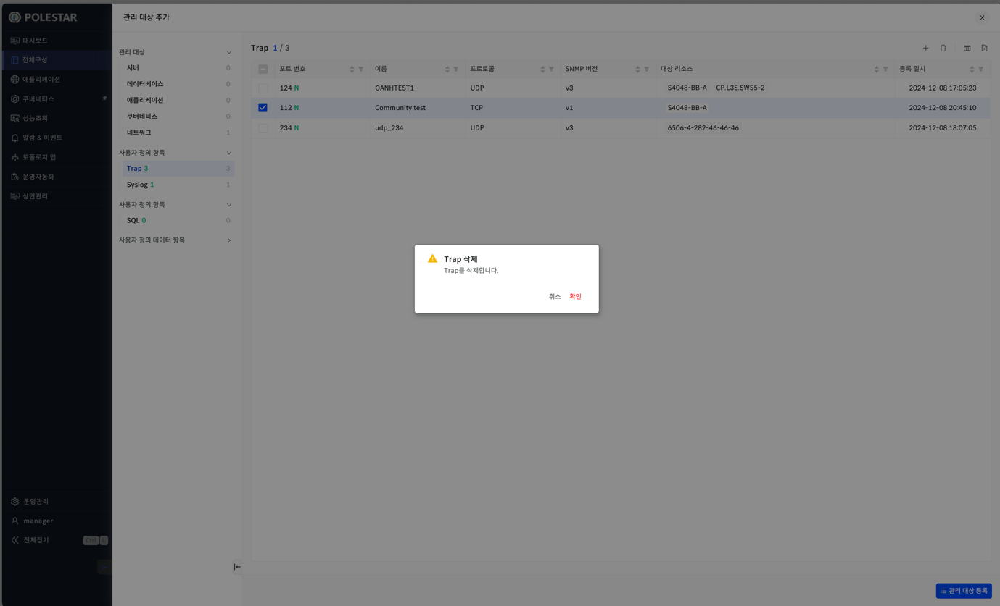

▶ \[그림 44\] 관리 대상 – 등록 대기 Trap 삭제

등록 대기 Trap 삭제 절차

1.  등록 대기 목록에서 삭제할 Trap선택 (다수 선택 가능)

2.  등록 대기 목록 우측 상단의 \[삭제\] 버튼 클릭

3.  삭제 확인 메시지창에서 \[확인\] 버튼 클릭

관리 대상 – 사용자 정의 항목 \> Syslog

관리 대상 메뉴에서 \[사용자 정의 항목\] \> Syslog을 선택하면 Syslog등록 대기 목록 화면이 표시됩니다. 등록 대기 목록 상단의 추가() 버튼을 클릭하면 Syslog등록 드로어가 표시됩니다. 해당 드로어 화면을 통해 Syslog 등록 대기 목록에 신규 Syslog를 추가할 수 있습니다. 등록 대기 목록에 추가된 Syslog는 우측 하단의 관리 대상 등록 버튼을 이용하여 실제 관리 대상으로 등록할 수 있습니다. 관리 대상 메뉴에 녹색으로 표시되는 숫자는 POLESTAR에 등록된 지 24시간이 경과하지 않은 신규 Syslog포트 개수를 의미합니다.

▶ \[그림 45\] 관리 대상 – 사용자 정의 항목 \> Syslog등록 대기 목록

화면 지표

| 포트 번호        | 등록하려는 Syslog포트 번호가 표시됩니다.                                                                                                                              |
| ------------ | ------------------------------------------------------------------------------------------------------------------------------------------------------ |
| 이름           | 등록하려는 Syslog의 이름이 표시됩니다. 등록 시 입력하지 않은 경우 프로토콜과 포트 번호를 조합한 이름이 자동으로 설정됩니다. 예를 들어, 514 포트 번호에 UDP 프로토콜을 사용하면서 이름을 설정하지 않은 경우 자동으로 udp\_514 라는 이름이 설정됩니다. |
| 프로토콜         | 등록하려는 Syslog 포트의 프로토콜 정보(ex. TCP 또는 UDP)가 표시됩니다. 대부분 UDP 프로토콜을 사용합니다.                                                                                  |
| 인코딩 타입       | 등록하려는 Syslog의 인코딩 타입이 표시됩니다. 이 정보는 Syslog 이벤트 수신 시 메시지 인코딩에 사용됩니다. 등록 시 사용자 지정 인코딩 타입을 설정한 경우, CUSTOM이라는 인코딩 타입 대신 사용자 지정 인코딩 타입이 그대로 표시됩니다.           |
| 미등록 장비 수신 여부 | 등록하려는 Syslog의 미등록 장비 수신 여부가 표시됩니다. 이 정보는 시스템에 등록되지 않은 장비에서 발생한 Syslog 이벤트를 수신할지 여부를 나타냅니다. 수신 비활성화 시 시스템에 등록된 장비의 Syslog 이벤트만 수신합니다.                   |
| 등록 일시        | Syslog를 등록 대기 목록에 추가한 일시가 표시됩니다.                                                                                                                       |

Syslog 등록 대기 목록 추가 절차

1.  Syslog 등록 대기 목록 상단의 추가() 버튼 선택

2.  Syslog등록 드로어에서 기본정보, 설정정보, 이벤트설정 입력

3.  Syslog등록 드로어 하단의 저장 버튼 선택

관리 대상 – 사용자 정의 항목 \> Syslog 등록 드로어

Syslog등록 대기 목록 상단의 추가() 버튼을 클릭하면 Syslog 등록 드로어가 표시됩니다. Syslog 등록 드로어에서 Syslog등록에 필요한 기본 설정 정보 및 Syslog이벤트 심각도를 설정할 수 있습니다. 설정 후 우측 하단의 저장 버튼을 클릭하면 Syslog등록 대기 목록에 등록 드로어에 설정한 Syslog가 추가됩니다.

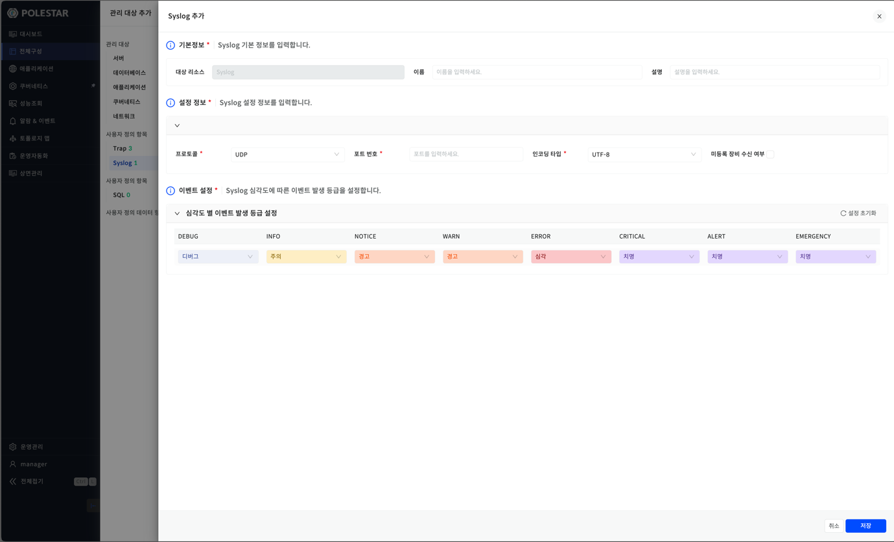

▶ \[그림 46\] 관리 대상 – 사용자 정의 항목 Syslog 등록 드로어

Syslog등록 드로어 항목

| 이름                 | 추가할 Syslog의 이름을 입력합니다.                                                                                                                     |
| ------------------ | ------------------------------------------------------------------------------------------------------------------------------------------ |
| 설명                 | 추가할 Syslog의 설명을 입력합니다.                                                                                                                     |
| 프로토콜               | 추가할 Syslog의 프로토콜 정보를 선택합니다.                                                                                                                |
| 포트 번호              | 추가할Syslog의 포트 번호를 입력합니다. 숫자만 입력 가능합니다.                                                                                                     |
| 인코딩 타입             | Syslog포트 등록 시 입력했던 인코딩 타입이 표시됩니다. 이 정보는 Syslog이벤트 수신 시 메시지 인코딩에 사용됩니다. CUSTOM 인코딩 타입을 선택할 경우 사용자 정의 인코딩 타입을 설정할 수 있는 텍스트필드가 나타납니다.         |
| 사용자 정의 인코딩 타입      | 직접 지정해서 사용하고자 하는 인코딩 타입을 입력합니다.                                                                                                            |
| 미등록 장비 수신 여부       | Syslog 포트 등록 시 설정했던 미등록 장비 수신 여부가 표시됩니다. 이 정보는 시스템에 등록되지 않은 장비에서 발생한 Syslog 이벤트를 수신할지 여부를 나타냅니다. 수신 비활성화 시 시스템에 등록된 장비의 Syslog 이벤트만 수신합니다. |
| 심각도 별 이벤트 발생 등급 설정 | Syslog 이벤트의 8단계 심각도 별로 POLESTAR의 이벤트 발생 등급을 설정할 수 있습니다. Syslog 심각도 별로 설정된 이벤트 발생 등급에 따라 POLESTAR 이벤트 등급이 결정됩니다.                            |

Syslog 최종 등록 절차

1.  등록하고자 하는 Syslog를 등록 대기 목록의 체크 박스에서 선택(다중 선택 가능)

2.  우측 하단의 관리 대상 등록 버튼 클릭

관리 대상 – 사용자 정의 항목 \> Syslog 삭제

등록 대기 목록에서 삭제할 Syslog을 선택하고 \[삭제\] 버튼을 클릭하여 Syslog를 삭제할 수 있습니다.

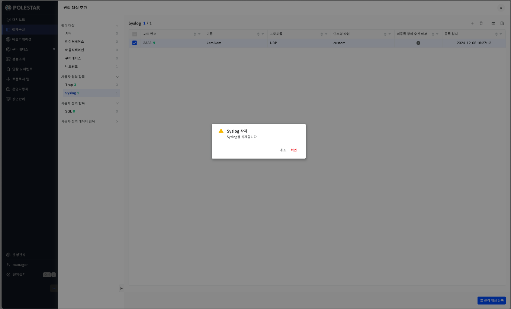

▶ \[그림 47\] 관리 대상 – 사용자 정의 항목 \> Syslog삭제

등록 대기 Syslog삭제 절차

1.  등록 대기 목록에서 삭제할 Syslog선택 (다수 선택 가능)

2.  등록 대기 목록 우측 상단의 \[삭제\] 버튼 클릭

3.  삭제 확인 메시지창에서 \[확인\] 버튼 클릭

관리 대상 – 사용자 정의 항목 \> SNMP OID

관리 대상 메뉴에서 \[사용자 정의 항목\] \> SNMP OID를 선택하면 SNMP OID 등록 대기 목록 화면이 표시됩니다. 등록 대기 목록 상단의 추가() 버튼을 클릭하면 SNMP OID 등록 드로어가 표시됩니다. 해당 드로어 화면을 통해 SNMP OID 등록 대기 목록에 신규 SNMP OID를 등록할 수 있습니다. \[운영관리 - 사용자 정의 템플릿\] \> SNMP OID 에서 정의한 SNMP OID 템플릿을 네트워크 장비에 실제로 등록하여 모니터링할 수 있습니다.

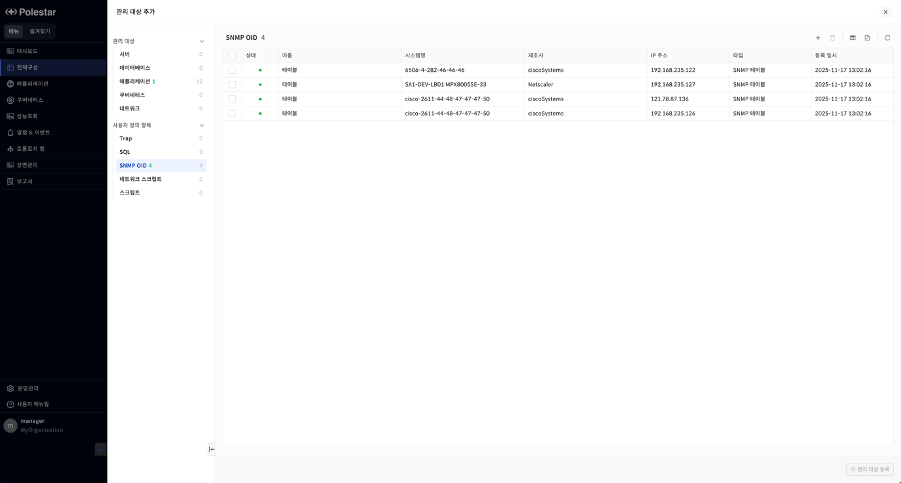

▶ \[그림 48\] 관리 대상 – 사용자 정의 항목 \> SNMP OID 등록 대기 목록

화면 지표

| 상태    | SNMP OID의 상태 정보를 표시합니다.                         |
| ----- | ----------------------------------------------- |
| 시스템 명 | SNMP OID를 등록한 네트워크 장비의 시스템 이름이 표시됩니다.           |
| 제조사   | SNMP OID를 등록한 네트워크에서 수집된 제조사 정보가 표시됩니다.         |
| IP 주소 | SNMP OID를 등록한 네트워크 등록 시 입력했던 호스트명 또는 IP가 표시됩니다. |
| 타입    | SNMP OID의 타입이 표시됩니다.                            |
| 등록일시  | SNMP OID 를 등록한 등록일시가 표시됩니다.                     |

SNMP OID 등록 목록 추가 절차

1.  SNMP OID 등록 대기 목록 상단의 추가() 버튼 선택

2.  SNMP OID 등록 드로어에서 기본정보, 장비정보, 스케줄정보 입력

3.  우측 하단의 저장 버튼 선택

관리 대상 – 사용자 정의 항목 \> SNMP OID 등록 드로어

SNMP OID 등록 대기 목록 상단의 추가() 버튼을 클릭하면 SNMP OID 등록 드로어가 표시됩니다. SNMP OID 등록 드로어에서 SNMP OID 등록에 필요한 기본 설정 정보를 입력할 수 있습니다. 설정 후 우측 하단의 저장 버튼을 클릭하면 SNMP OID 등록 대기 목록에 설정한 SNMP OID가 추가됩니다.

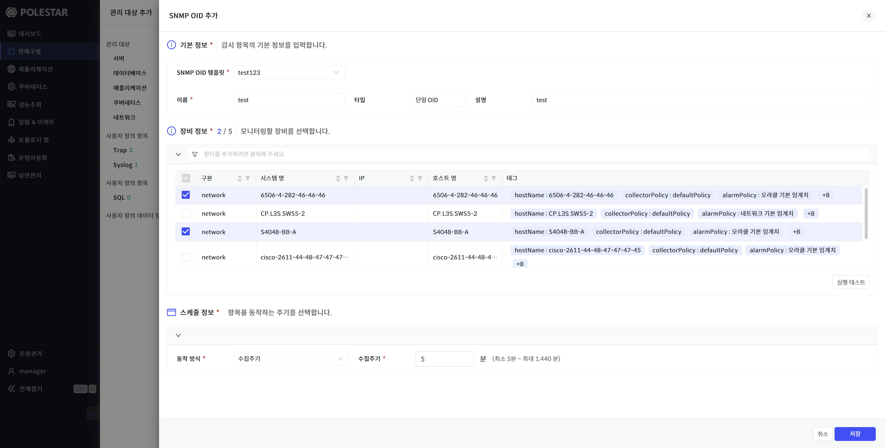

> ▶ \[그림 49\] 관리대상 – 사용자 정의 항목 \> SNMP OID 등록 드로어
> 
> 기본 정보

| SNMP OID 템플릿 | SNMP OID 템플릿 목록에서 템플릿을 선택합니다.         |
| ------------ | ------------------------------------- |
| 이름           | SNMP OID 의 이름을 입력합니다.                 |
| 타입           | SNMP OID 의 타입이SNMP OID 템플릿에 따라 선택됩니다. |
| 설명           | SNMP OID 의 설명을 입력합니다.                 |

> 장비 정보

모니터링 하고자 하는 장비를 선택합니다.

> 스케줄 정보

SNMP OID의 스케줄 정보를 입력합니다.

실행 테스트

장비 정보에서 선택된 네트워크 장비를 대상으로 SNMP OID 템플릿에서 정의한 OID의 실행 테스트 결과를 확인할 수 있습니다.

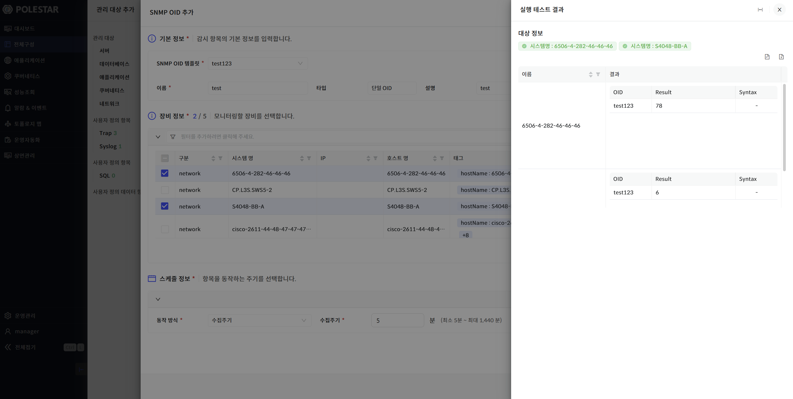

▶ \[그림 50\] SNMP OID 실행 테스트

관리 대상 – 사용자 정의 항목 \> SNMP OID 삭제

삭제할 SNMP OID를 선택하고 \[삭제\] 버튼을 선택하여 SNMP OID 템플릿을 삭제할 수 있습니다.

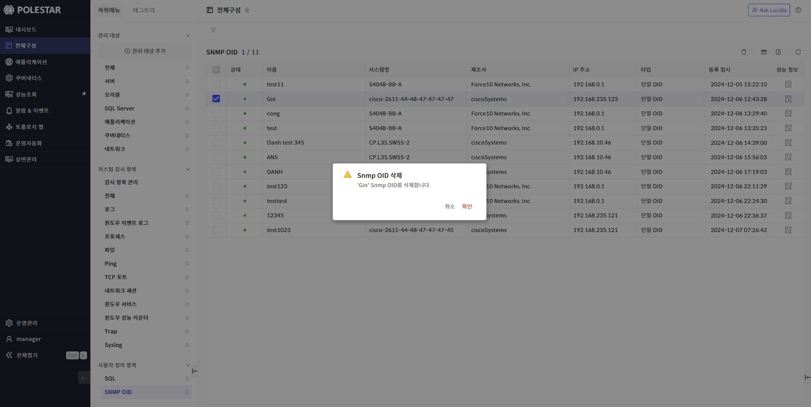

▶ \[그림 51\] 관리대상 – 사용자 정의 항목 \> SNMP OID 삭제

> 등록 대기 SNMP OID 삭제 절차

1.  등록 대기 목록에서 삭제할 SNMP OID 선택 (다수 선택 가능)

2.  등록 대기 목록 우측 상단의 \[삭제\] 버튼 클릭

3.  삭제 확인 메시지창에서 \[확인\] 버튼 클릭

관리 대상 – 사용자 정의 항목 \> 스크립트

관리 대상 메뉴에서 \[사용자 정의 항목\] \> 스크립트를 선택하면 스크립트 등록 목록 화면이 표시됩니다. 등록 목록 상단에 스크립트 등록() 버튼을 클릭하면 사용자 정의 스크립트 등록 드로어가 표시됩니다. 해당 드로어 화면을 통해 신규 사용자 정의 스크립트를 등록할 수 있습니다.

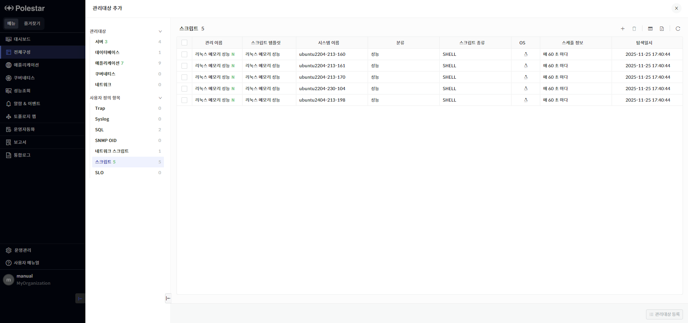

▶ \[그림 52\] 관리 대상 – 사용자 정의 항목 \> 스크립트 등록 목록

> 사용자 정의 스크립트 등록 목록

<table>
<thead>
<tr class="header">
<th>관리 이름</th>
<th>사용자 정의 스크립트 등록 시 정의한 이름이 표시됩니다. 해당 이름을 클릭하면 해당 관리 이름에 대한 사용자 정의 스크립트 상세 드로어가 표시됩니다.</th>
</tr>
</thead>
<tbody>
<tr class="odd">
<td>스크립트 템플릿</td>
<td>해당 사용자 정의 스크립트에 지정한 사용자 정의 스크립트 템플릿명을 표시합니다.</td>
</tr>
<tr class="even">
<td>시스템 이름</td>
<td>사용자 정의 스크립트 대상 시스템 이름을 표시합니다.</td>
</tr>
<tr class="odd">
<td>분류</td>
<td>
사용자 정의 스크립트의 분류명입니다. 해당 스크립트의 용도를 표시합니다.

분류 목록: 구성, 성능, 변경, 점검, 동작
</td>
</tr>
<tr class="even">
<td>스크립트 종류</td>
<td>
스크립트 종류를 표시합니다. 스크립트 종류는 OS에 따라 구분됩니다.

Unix/Linux 계열은 SHELL, Windows의 경우는 Windows Batch, VB Script, Power Shell 중 템플릿 등록 시 선택한 항목이 표시됩니다.
</td>
</tr>
<tr class="odd">
<td>OS</td>
<td>
사용자 정의 템플릿 선택 시 선택한 OS 타입이 표시됩니다.

OS 목록: Linux, AIX, HPUX, SUNOS, Windows
</td>
</tr>
<tr class="even">
<td>스케줄 정보</td>
<td>사용자 정의 스크립트 추가 시 설정한 스케줄 정보가 표시됩니다.</td>
</tr>
<tr class="odd">
<td>탐색일시</td>
<td>스크립트 등록 목록에 추가된 일시를 표시합니다.</td>
</tr>
</tbody>
</table>

<table>
<tbody>
<tr class="odd">
<td>
노트

탐색일시가 현재 시점 기준으로 1일을 경과하지 않은 경우, 관리 이름 컬럼에 ‘N’ 표시가 되고 좌측 스크립트 메뉴에도 ‘N’으로 표시된 개수가 표시됩니다.
</td>
</tr>
</tbody>
</table>

사용자 정의 스크립트 등록 목록으로 추가

1.  사용자 정의 스크립트 등록 목록 상단의 추가() 버튼을 선택

2.  사용자 정의 스크립트 추가 드로어에서 템플릿 선택 및 기본정보, 장비정보, 스케줄 정보 입력

관리 대상 – 사용자 정의 항목 \> 스크립트 등록 드로어

사용자 정의 스크립트 등록 드로어를 통해 사용자가 정의한 스크립트 템플릿을 실제 장비에 적용하여 사용자가 정의한 지표를 수집하고 모니터링할 수 있습니다.

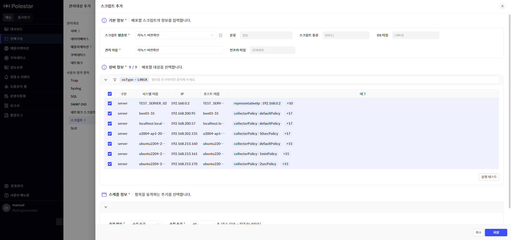

▶ \[그림 53\] 사용자 정의 스크립트 등록

> 사용자 정의 스크립트 등록 드로어 화면 정보

<table>
<thead>
<tr class="header">
<th>스크립트 템플릿</th>
<th>스크립트 템플릿 목록에서 대상 시스템에 적용할 스크립트 템플릿을 선택합니다.</th>
</tr>
</thead>
<tbody>
<tr class="odd">
<td>템플릿 자세히 보기()</td>
<td>템플릿 자세히 보기 버튼을 클릭하면 해당 스크립트 템플릿의 상세 정보를 확인할 수 있는 드로어가 표시됩니다.</td>
</tr>
<tr class="even">
<td>분류</td>
<td>
선택한 사용자 정의 스크립트 템플릿의 분류명입니다. 해당 스크립트의 용도를 표시합니다.

분류 목록: 구성, 성능, 변경, 점검, 동작
</td>
</tr>
<tr class="odd">
<td>스크립트 종류</td>
<td>
선택한 사용자 정의 스크립트 템플릿의 스크립트 종류를 표시합니다.

스크립트 종류는 OS에 따라 구분됩니다. Unix/Linux 계열은 SHELL, Windows의 경우는 Windows Batch, VB Script, Power Shell중 템플릿 등록 시 선택한 항목이 표시됩니다.
</td>
</tr>
<tr class="even">
<td>OS 타입</td>
<td>
선택한 사용자 정의 스크립트 템플릿의 OS 타입명이 표시됩니다.

OS 타입 목록: Linux, AIX, HPUX, SUNOS, Windows
</td>
</tr>
<tr class="odd">
<td>관리 이름</td>
<td>해당 사용자 정의 스크립트 배포 이름을 입력합니다.</td>
</tr>
<tr class="even">
<td>인프라 타입</td>
<td>
선택한 사용자 정의 스크립트 템플릿의 인프라 타입이 표시됩니다.

인프라 타입 목록: SERVER, NETWORK
</td>
</tr>
<tr class="odd">
<td>장비 정보</td>
<td>배포할 대상 장비 전체 목록이 표시되고 체크박스에서 체크하여 원하는 장비를 선택합니다.</td>
</tr>
<tr class="even">
<td>실행 테스트</td>
<td>실행 테스트 버튼을 클릭하면 선택한 장비에서 스크립트 템플릿에 등록된 스크립트를 실행하여 결과를 확인할 수 있는 드로어가 표시됩니다. 자세한 내용은 [실행 테스트 결과 드로어] 매뉴얼에서 확인하세요.</td>
</tr>
<tr class="odd">
<td>동작 방식</td>
<td>사용자 정의 스크립트가 수집되는 방식을 선택합니다. 현재 버전은 ‘수집 주기’만 선택할 수 있습니다.</td>
</tr>
<tr class="even">
<td>수집 주기</td>
<td>
동작 방식이 ‘수집 주기’인 경우 수집 주기를 설정할 수 있습니다.

최소 10초에서 최대 1440*60초(1일)까지 입력이 가능합니다. 하기 최소 수집 주기에 대한 주의 사항을 꼭 확인하시기 바랍니다.
</td>
</tr>
<tr class="odd">
<td>취소</td>
<td>취소 버튼을 클릭하면 사용자 정의 스크립트 등록을 취소하고 드로어가 닫힙니다.</td>
</tr>
<tr class="even">
<td>저장</td>
<td>사용자 정의 스크립트 등록 드로어에 입력한 정보로 사용자 정의 스크립트를 등록 목록에 추가합니다.</td>
</tr>
</tbody>
</table>

<table>
<tbody>
<tr class="odd">
<td>
노트

등록 드로어에서 저장 버튼을 클릭하면 사용자 정의 스크립트 등록 목록에 추가됩니다. 최종적으로 사용자 정의 스크립트가 등록되려면 사용자 정의 스크립트 등록 목록에서 등록할 대상을 선택하고 [관리 대상 등록]을 실행해야 합니다.
</td>
</tr>
</tbody>
</table>

<table>
<tbody>
<tr class="odd">
<td>
주의

사용자 정의 스크립트의 최소 설정 가능 수집 주기는 10초이지만, 스크립트의 실행시간이 매우 길거나 등록 대상 시스템이 많은 경우 10초내 수집할 수 없는 경우가 발생합니다. 따라서 수집 주기는 스크립트의 실행 시간, 대상 장비 등록 수, 타입아웃 시간 등을 고려하여 적절하게 설정하여야 원할 한 성능 수집이 가능합니다.
</td>
</tr>
</tbody>
</table>

실행 테스트 결과 드로어

선택한 대상 장비에서 스크립트 템플릿에 정의한 스크립트를 실행하여 얻은 결과를 장비별로 확인할 수 있습니다. 스크립트가 성공한 장비는 초록색 카드로 표시되고 실패한 장비는 빨간색 카드로 표시됩니다. 초록색 카드로 표시된 시스템을 선택하면 해당 장비에서 실행한 스크립트 결과 및 해당 결과에 대한 지표 설정 정보를 확인할 수 있습니다.

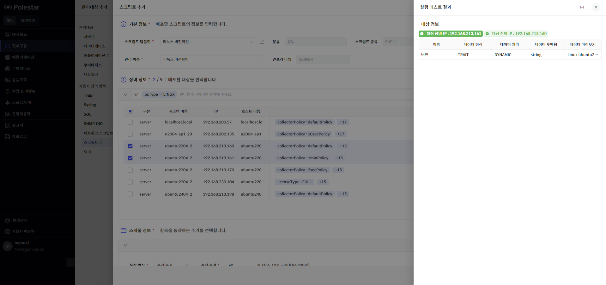

▶ \[그림 54\] 사용자 정의 스크립트 실행 테스트 드로어

> 실행 테스트 결과 드로어 화면 정보

<table>
<thead>
<tr class="header">
<th>이름</th>
<th>해당 결과에 대한 지표 이름입니다.</th>
</tr>
</thead>
<tbody>
<tr class="odd">
<td>데이터 형식</td>
<td>
지표의 데이터 형식 정보를 표시합니다.

데이터 형식: 숫자 (METRIC), 문자 (TRAIT)
</td>
</tr>
<tr class="even">
<td>데이터 처리</td>
<td>
수집한 데이터의 처리 방식을 표시합니다.

[숫자 (METRIC)]

<ul>
<li>
측정값 사용: 현재 수집된 값을 그대로 지표화
</li>
<li>
상향 변화량: 수집된 값이 누적해서 증가하는 값을 때 수집 주기내 변화량을 지표화
</li>
<li>
하향 변화량: 수집된 값이 누적해서 감소하는 값을 때 수집 주기내 변화량을 지표화
</li>
</ul>

[문자 (TRAIT)]

<ul>
<li>
측정값 사용: 현재 수집된 값을 그대로 지표화
</li>
<li>
정규식: 데이터 포맷팅에 정의한 정규식으로 수집한 값을 필터링하여 지표화
</li>
</ul></td>
</tr>
<tr class="odd">
<td>데이터 포맷팅</td>
<td>데이터 형식이 문자이고 데이터 처리가 정규식일 때 데이터 포맷팅이 적용된 문자열을 표시합니다.</td>
</tr>
<tr class="even">
<td>데이터 미리보기</td>
<td>대상 장비에서 실행한 스크립트 결과가 표시됩니다.</td>
</tr>
</tbody>
</table>

사용자 정의 스크립트 등록 목록에서 삭제

사용자 정의 스크립트 등록 목록에서 삭제할 사용자 정의 스크립트를 선택하고 \[삭제\] 버튼을 선택하여 사용자 정의 스크립트를 삭제할 수 있습니다.

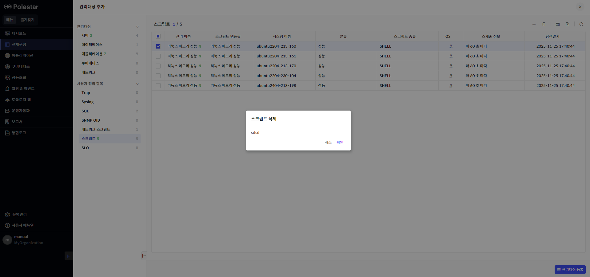

▶ \[그림 55\] 사용자 정의 스크립트 등록 목록에서 삭제

> 사용자 정의 스크립트 등록 목록에서 삭제 절차

1.  삭제하고자 하는 사용자 정의 스크립트 선택 (다중 선택 가능)

2.  테이블 우측 상단의 삭제 아이콘 클릭

3.  메시지창에서 확인 클릭

엑셀 저장

사용자 정의 스크립트 등록 목록의 우측 상단 \[엑셀 저장\] 버튼을 통해 사용자 정의 스크립트 등록 목록을 엑셀로 저장할 수 있습니다. 그리드 컬럼 검색 기능 등을 통해 엑셀에 보여줄 컬럼과 내용을 원하는 조건에 맞게 필터링하여 저장할 수 있습니다.

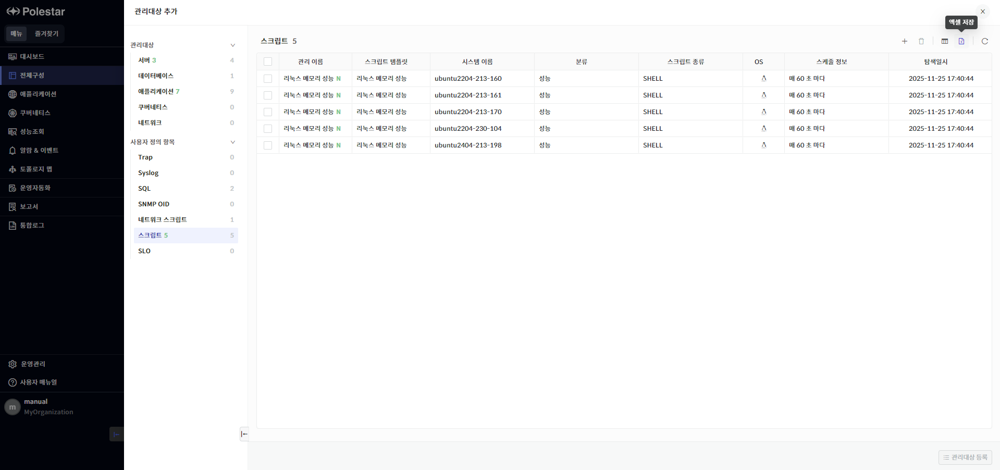

▶ \[그림 56\] 사용자 정의 스크립트 등록 목록 엑셀 저장

> 사용자 정의 스크립트 등록 목록 엑셀 저장 및 조회 절차

1.  사용자 정의 스크립트 등록 목록에서 우측 상단 엑셀 저장 아이콘 클릭

2.  브라우저 우측 상단 창에 저장된 엑셀 파일명이 표시됨

3.  해당 파일명을 클릭하여 엑셀 파일 확인

관리 대상 – 사용자 정의 항목 \> SQL

관리 대상 메뉴에서 \[사용자 정의 항목\] \> SQL을 선택하면 SQL 등록목록 화면이 표시됩니다. 등록 목록 상단에 SQL등록() 버튼을 클릭하면 사용자 정의 SQL 등록 드로우가 표시됩니다. 해당 드로우 화면을 통해 신규 사용자 정의 SQL을 등록할 수 있습니다.

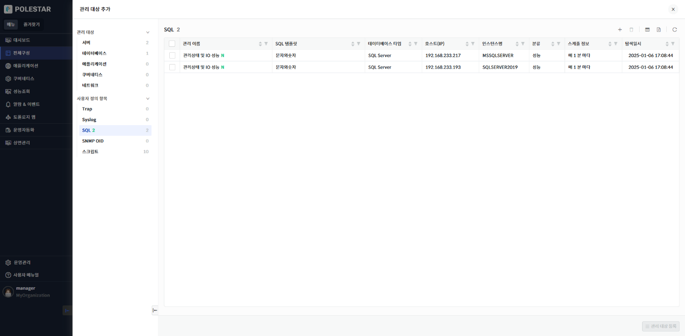

▶ \[그림 57\] 관리 대상 – 사용자 정의 항목 \> SQL 등록 목록

> 사용자 정의 SQL 등록 목록

<table>
<thead>
<tr class="header">
<th>관리 이름</th>
<th>사용자 정의 SQL 추가 시 입력했던 이름입니다.</th>
</tr>
</thead>
<tbody>
<tr class="odd">
<td>SQL 템플릿</td>
<td>해당 데이터베이스에 적용된 사용자 정의 SQL 템플릿 명입니다.</td>
</tr>
<tr class="even">
<td>데이터베이스 타입</td>
<td>
데이터베이스 타입을 표시합니다.

타입 목록 : 오라클, SQL Server
</td>
</tr>
<tr class="odd">
<td>호스트(IP)</td>
<td>데이터베이스의 호스트 또는 IP 정보가 표시됩니다.</td>
</tr>
<tr class="even">
<td>인스턴스명</td>
<td>데이터베이스의 인스턴스명이 표시됩니다.</td>
</tr>
<tr class="odd">
<td>분류</td>
<td>사용자 정의 SQL의 분류명입니다..</td>
</tr>
<tr class="even">
<td>스케줄 정보</td>
<td>사용자 정의 SQL 추가 시 설정한 스케줄 정보가 표시됩니다.</td>
</tr>
<tr class="odd">
<td>탐색 일시</td>
<td>SQL 등록 목록에 추가된 일시입니다.</td>
</tr>
</tbody>
</table>

<table>
<tbody>
<tr class="odd">
<td>
노트

탐색 일시가 현재 시점 기준 1일 이하인 경우 관리 이름 컬럼에 ‘N’ 표시가 되고 좌측 SQL메뉴에도 ‘N’으로 표시된 개수가 표시됩니다.
</td>
</tr>
</tbody>
</table>

사용자 정의 SQL 등록 목록에 추가 절차

3.  사용자 정의 SQL 등록 목록 상단에 추가() 버튼을 선택

4.  사용자 정의 SQL 등록 드로우에서 템플릿 선택 및 기본정보, 장비정보, 스케줄정보 입력

관리 대상 – 사용자 정의 항목 \> SQL 등록 드로어

사용자 정의 SQL 등록 드로어를 통해 사용자가 정의해둔SQL 템플릿을 실제 장비에 적용하여 사용자가 정의한 지표를 수집하고 모니터링할 수 있습니다.

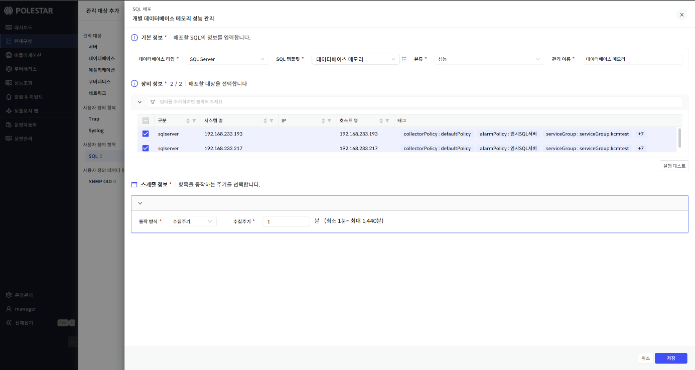

> ▶ \[그림 58\] 사용자 정의 SQL 등록
> 
> SQL 등록 드로어 화면 정보

<table>
<thead>
<tr class="header">
<th>데이터베이스 타입</th>
<th>
데이터베이스의 타입을 선택합니다.

목록값 : 오라클, SQL Server
</th>
</tr>
</thead>
<tbody>
<tr class="odd">
<td>SQL 템플릿</td>
<td>SQL 템플릿 목록에서 대상 데이터베이스에 적용할 SQL 템플릿을 선택 합니다.</td>
</tr>
<tr class="even">
<td>템플릿 자세히 보기()</td>
<td>템플릿 자세히 보기 버튼을 클릭하면 해당 SQL 템플릿의 상세 정보를 확인할 수 있는 드로어가 표시됩니다.</td>
</tr>
<tr class="odd">
<td>분류</td>
<td>사용자 정의 SQL의 용도를 선택합니다. 현재 버전은 성능만 선택 가능합니다.</td>
</tr>
<tr class="even">
<td>관리 이름</td>
<td>추가할 사용자 정의 SQL의 관리 이름을 입력합니다.</td>
</tr>
<tr class="odd">
<td>장비 정보</td>
<td>배포할 대상 장비 전체 목록이 표시되고 체크박스에서 체크하여 원하는 장비를 선택합니다.</td>
</tr>
<tr class="even">
<td>실행 테스트 버튼</td>
<td>실행 테스트 버튼을 클릭하면 선택한 장비에 대해 SQL 템플릿에 등록된 SQL을 실행해 결과를 확인할 수 있는 드로어가 표시됩니다. 자세한 내용은 하기 [실행 테스트 드로어]에서 확인하세요.</td>
</tr>
<tr class="odd">
<td>동작 방식</td>
<td>사용자 정의 SQL이 수집되는 방식을 선택합니다. 현재 버전은 수집주기만 선택 가능합니다.</td>
</tr>
<tr class="even">
<td>수집주기</td>
<td>동작방식이 수집주기인 경우 수집주기를 설정할 수 있습니다. 최소 1분에서 최대 1440분(1일)까지 입력이 가능합니다.</td>
</tr>
<tr class="odd">
<td>취소</td>
<td>취소 버튼을 클릭하면 사용자 정의 SQL 등록을 취소하고 드로어가 닫힙니다.</td>
</tr>
<tr class="even">
<td>저장</td>
<td>사용자 정의 SQL 등록 드로어에 입력한 정보로 사용자 정의 SQL을 등록 목록에 추가합니다.</td>
</tr>
</tbody>
</table>

<table>
<tbody>
<tr class="odd">
<td>
노트

등록 드로어에서 저장 버튼을 클릭하면 사용자 정의 SQL 등록 목록에 추가됩니다. 최종적으로 사용자 정의 SQL이 등록되려면 사용자 정의 SQL 등록 목록에서 원하는 대상을 체크박스에서 체크하여 [관리 대상 등록]을 선택해야 합니다.
</td>
</tr>
</tbody>
</table>

실행 테스트 드로어

선택한 대상 데이터베이스에 SQL 템플릿에 정의한 SQL을 실행하여 나온 결과에서 정의한 OID 를 \[장비 정보\] 에서 선택한 장비에서 수행한 결과를 확인 할 수 있습니다.

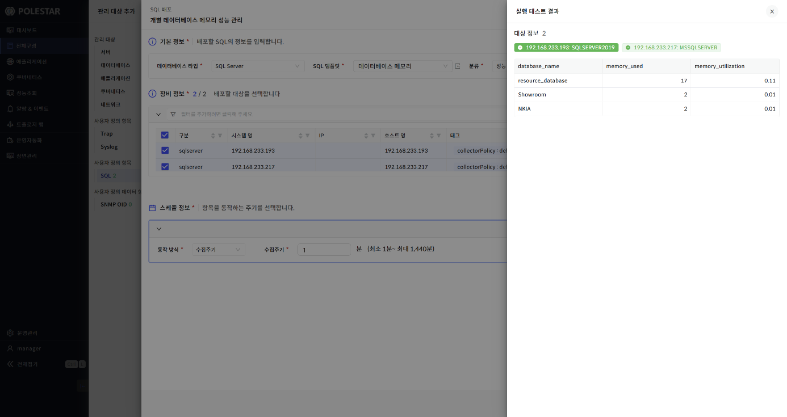

▶ \[그림 59\] 사용자 정의 SQL 실행 테스트 드로어

사용자 정의 SQL 등록 목록에서 삭제

사용자 정의 SQL 등록 목록에서 삭제할 사용자 정의 SQL을 선택하고 \[삭제\] 버튼을 선택하여 사용자 정의 SQL을 삭제할 수 있습니다.

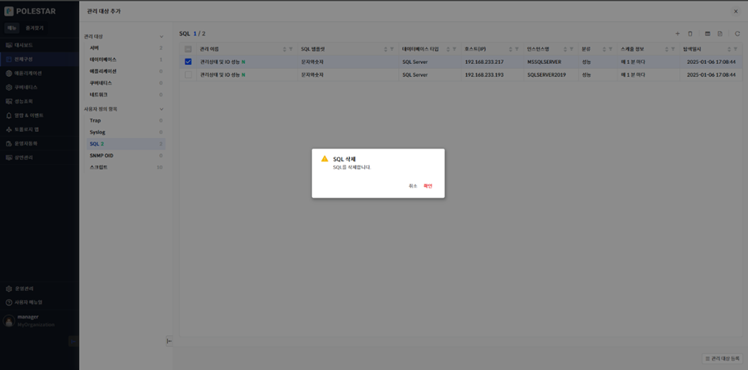

▶ \[그림 60\] 사용자 정의 SQL 등록 목록에서 삭제

> 사용자 정의 SQL 등록 목록에서 삭제 절차

1.  삭제하고자 하는 사용자 정의SQL 선택 (다중 선택 가능)

2.  테이블 우측 상단의 삭제 아이콘 클릭

3.  메시지창에서 확인 클릭

엑셀 저장

사용자 정의 SQL 등록 목록의 우측 상단 \[엑셀 저장\] 버튼을 통해 사용자 정의SQL 등록 목록을 엑셀로 저장할 수 있습니다. 그리드 컬럼 검색 기능 등을 통해 엑셀에 보여줄 컬럼과 내용을 원하는 조건에 맞게 필터링하여 저장할 수 있습니다.

> 사용자 정의 SQL 등록 목록 엑셀 저장 및 조회 절차

1.  사용자 정의 SQL 등록 목록에서 우측 상단 엑셀 저장 아이콘 클릭

2.  브라우저 우측 상단 창에 저장된 엑셀 파일명이 표시됨

3.  해당 파일명을 클릭하여 엑셀 파일 확인

관리 대상 – 사용자 정의 항목 \> 네트워크 스크립트

관리 대상 메뉴에서 \[사용자 정의 항목\] \> 네트워크 스크립트를 선택하면 네트워크 스크립트 등록목록 화면이 표시됩니다. 등록 목록 상단에 네트워크 스크립트 등록() 버튼을 클릭하면 사용자 정의 네트워크 스크립트 등록 드로우가 표시됩니다. 해당 드로우 화면을 통해 신규 사용자 정의 네트워크 스크립트를 등록할 수 있습니다.

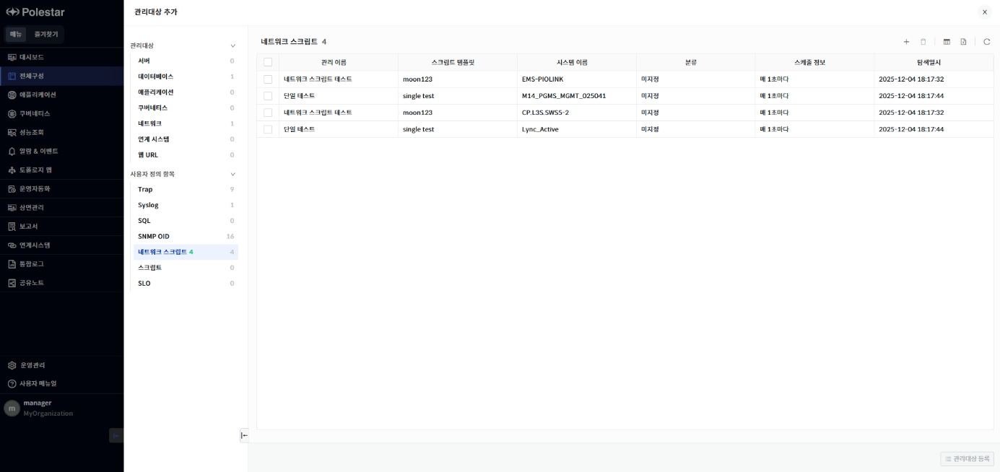

▶ \[그림 61\] 관리 대상 – 사용자 정의 항목 \> 네트워크 스크립트 등록 목록

> 사용자 정의 네트워크 스크립트 등록 목록

| 관리 이름    | 네트워크 스크립트 추가 시 입력했던 이름입니다.        |
| -------- | --------------------------------- |
| 스크립트 템플릿 | 해당 네트워크 스크립트의 템플릿 명입니다.           |
| 시스템 이름   | 등록된 장비의 시스템명 입니다.                 |
| 분류       | 네트워크 스크립트의 분류명입니다..               |
| 스케줄 정보   | 해당 네트워크 스크립트에서 설정한 스케줄 정보가 표시됩니다. |
| 탐색 일시    | 네트워크 스크립트 등록 목록에 추가된 일시입니다.       |

<table>
<tbody>
<tr class="odd">
<td>
노트

탐색 일시가 현재 시점 기준 1일 이하인 경우 관리 이름 컬럼에 ‘N’ 표시가 되고 좌측 네트워크 스크립트 메뉴에도 ‘N’으로 표시된 개수가 표시됩니다.
</td>
</tr>
</tbody>
</table>

사용자 정의 네트워크 스크립트 등록 목록에 추가 절차

1.  사용자 정의 SQL 등록 목록 상단에 추가() 버튼을 선택

2.  사용자 정의 SQL 등록 드로우에서 템플릿 선택 및 기본정보, 장비정보, 스케줄정보 입력

관리 대상 – 사용자 정의 항목 \> 네트워크 스크립트 등록 드로어

사용자 정의 네트워크 스크립트 등록 드로어를 통해 사용자가 정의해둔 네트워크 스크립트 템플릿을 실제 장비에 적용하여 사용자가 정의한 지표를 수집하고 모니터링할 수 있습니다.

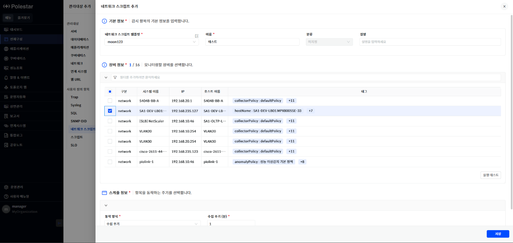

> ▶ \[그림 62\] 네트워크 스크립트 등록
> 
> 네트워크 스크립트 등록 드로어 화면 정보

| 네트워크 스크립트 템플릿                                                                                                                         | 네트워크 스크립트 템플릿 목록에서 대상 네트워크 장비에 적용할 네트워크 스크립트 템플릿을 선택 합니다.                                                           |
| ------------------------------------------------------------------------------------------------------------------------------------- | ------------------------------------------------------------------------------------------------------------------- |
| 템플릿 자세히 보기() | 템플릿 자세히 보기 버튼을 클릭하면 해당 네트워크 스크립트 템플릿의 상세 정보를 확인할 수 있는 드로어가 표시됩니다.                                                   |
| 이름                                                                                                                                    | 네트워크 스크립트의 이름을 입력합니다.                                                                                               |
| 분류                                                                                                                                    | 네트워크 스크립트의 용도를 선택합니다.                                                                                               |
| 설명                                                                                                                                    | 네트워크 스크립트의 설명을 입력합니다.                                                                                               |
| 장비 정보                                                                                                                                 | 네트워크 스크립트를 등록하고자 하는 장비를 선택합니다.                                                                                      |
| 실행 테스트 버튼                                                                                                                             | 실행 테스트 버튼을 클릭하면 선택한 장비에 대해 네트워크 스크립트 템플릿에 등록된 스크립트를 실행해 결과를 확인할 수 있는 드로어가 표시됩니다. 자세한 내용은 하기 \[실행 테스트 드로어\]에서 확인하세요. |
| 동작 방식                                                                                                                                 | 네트워크 스크립트 수집되는 방식을 선택합니다.                                                                                           |
| 수집주기                                                                                                                                  | 동작방식이 수집주기인 경우 수집주기를 설정할 수 있습니다. 최소 1분에서 최대 1440분(1일)까지 입력이 가능합니다.                                                  |
| 스케줄 등록                                                                                                                                | 동작방식이 스케줄등록일 경우 스케줄을 설정합니다.                                                                                         |
| 저장                                                                                                                                    | 네트워크 스크립트 등록 드로어에 입력한 정보로 네트워크 스크립트 등록 목록에 추가합니다.                                                                   |

<table>
<tbody>
<tr class="odd">
<td>
노트

등록 드로어에서 저장 버튼을 클릭하면 네트워크 스크립트 등록 목록에 추가됩니다. 최종적으로 사용자 정의 SQL이 등록되려면 사용자 정의 SQL 등록 목록에서 원하는 대상을 체크박스에서 체크하여 [관리 대상 등록]을 선택해야 합니다.
</td>
</tr>
</tbody>
</table>

실행 테스트 드로어

선택한 대상 네트워크 장비에서 네트워크 스크립트 템플릿에 정의한 스크립트를 실행하여 나온 결과에서 정의한 스크립트를 \[장비 정보\] 에서 선택하여 수행한 결과를 확인 할 수 있습니다.

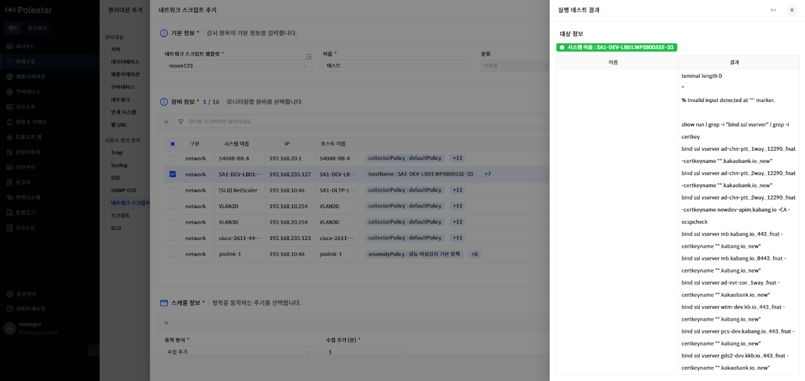

▶ \[그림 63\] 네트워크 스크립트 실행 테스트 드로어

네트워크 스크립트 등록 목록에서 삭제

네트워크 스크립트 등록 목록에서 삭제할 네트워크 스크립트를 선택하고 \[삭제\] 버튼을 선택하여 네트워크 스크립트를 삭제할 수 있습니다.

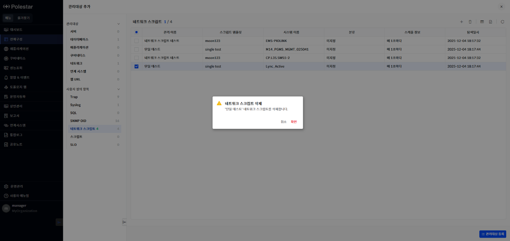

▶ \[그림 64\] 사용자 정의 SQL 등록 목록에서 삭제

> 네트워크 스크립트 등록 목록에서 삭제 절차

1.  삭제하고자 하는 네트워크 스크립트 선택 (다중 선택 가능)

2.  테이블 우측 상단의 삭제 아이콘 클릭

3.  메시지창에서 확인 클릭

엑셀 저장

네트워크 스크립트 등록 목록의 우측 상단 \[엑셀 저장\] 버튼을 통해 네트워크 스크립트 등록 목록을 엑셀로 저장할 수 있습니다. 그리드 컬럼 검색 기능 등을 통해 엑셀에 보여줄 컬럼과 내용을 원하는 조건에 맞게 필터링하여 저장할 수 있습니다.

> 네트워크 스크립트 등록 목록 엑셀 저장 및 조회 절차

1.  네트워크 스크립트 등록 목록에서 우측 상단 엑셀 저장 아이콘 클릭

2.  브라우저 우측 상단 창에 저장된 엑셀 파일명이 표시됨

3.  해당 파일명을 클릭하여 엑셀 파일 확인

