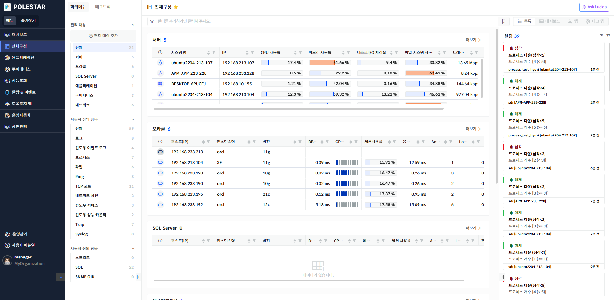
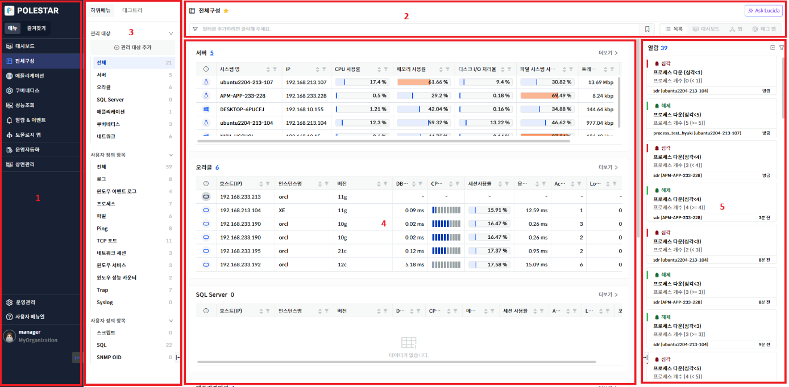
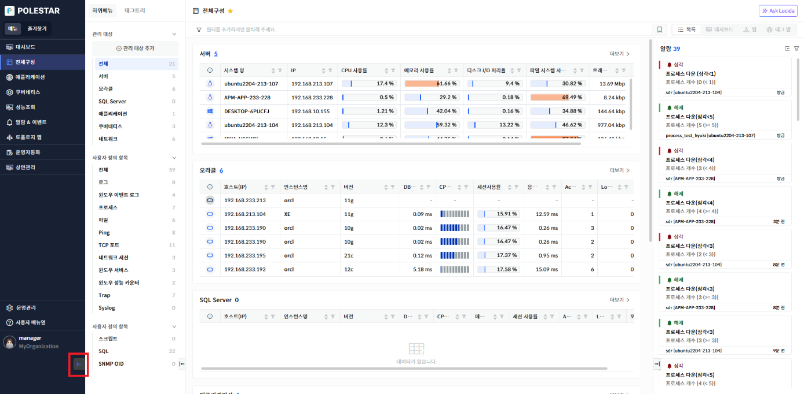
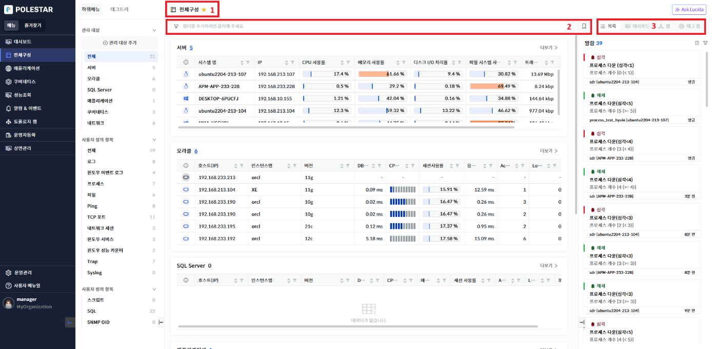
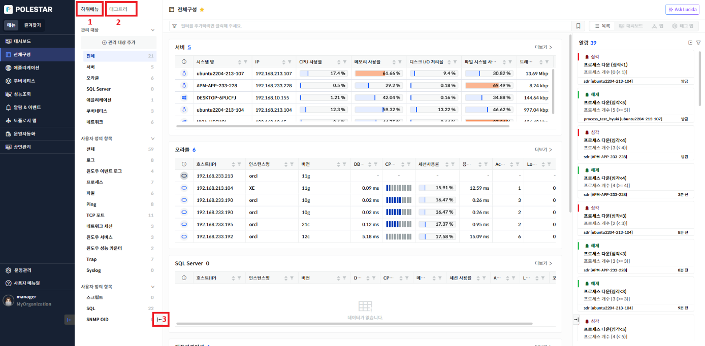
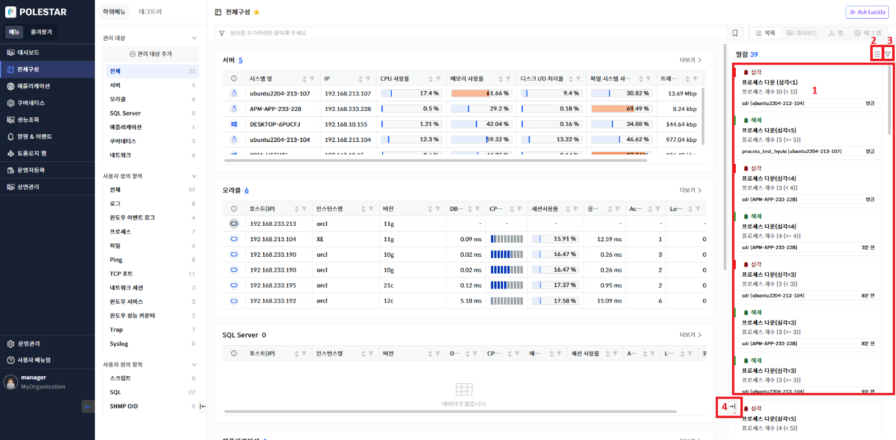

레이아웃

로그인 후 나타나는 전체 레이아웃입니다.

▶ \[그림1\] 전체 레이아웃

▶ \[그림2\] 전체 레이아웃 설명

1.  전체 메인메뉴를 표시합니다.

2.  브레드크럼, 태그 필터, 레이아웃 버튼(목록/맵/대시보드/태그맵) 등을 포함하는 헤더입니다.

3.  선택한 메인 메뉴의 서브메뉴 또는 등록된 태그 트리가 표시됩니다.

4.  선택된 서브메뉴의 컨텐츠가 표시됩니다.

5.  페이지마다 보여야 할 알람들이 표시됩니다.

레이아웃 – 메인 메뉴

▶ \[그림3\] 메인 메뉴 영역

1.  버튼 클릭을 통해 메인메뉴의 접기 상태를 on/off할 수 있습니다.

레이아웃 – 헤더

▶ \[그림4\] 헤더 영역

1.  현재 선택되어 있는 메인 메뉴를 표시하고 \[별\] 아이콘을 클릭시 해당 페이지를 즐겨찾기 등록할 수 있습니다.

2.  레이아웃 내부의 데이터를 필터링하는 데이터를 설정합니다. 우측의 즐겨찾기 버튼으로 설정한 태그 필터를 즐겨찾기 할 수 있습니다.

3.  전체구성의 전체 화면의 표시 방식을 리스트 또는 맵, 대시보드, 태그맵 등 부여된 권한에 맞는 버튼이 활성화 되어 선택할 수 있습니다.

레이아웃 – 서브메뉴

▶ \[그림5\] 서브 메뉴 영역

1.  대메뉴 아래에 있는 서브 메뉴들이 표시됩니다.

2.  등록된 태그 정보가 트리로 표시됩니다.

3.  버튼 클릭을 통해 서브메뉴의 접기 상태를 on/off할 수 있습니다.

레이아웃 – 알람

▶ \[그림6\] 알람 패널 영역

1.  현재 표시하는 페이지 기준의 알람이 표시됩니다.

2.  알람 상세보기 드로어를 표시합니다.

3.  표시할 알람의 유형을 선택할 수 있습니다.

4.  버튼 클릭을 통해 알람 패널 영역의 접기 상태를 on/off할 수 있습니다.

