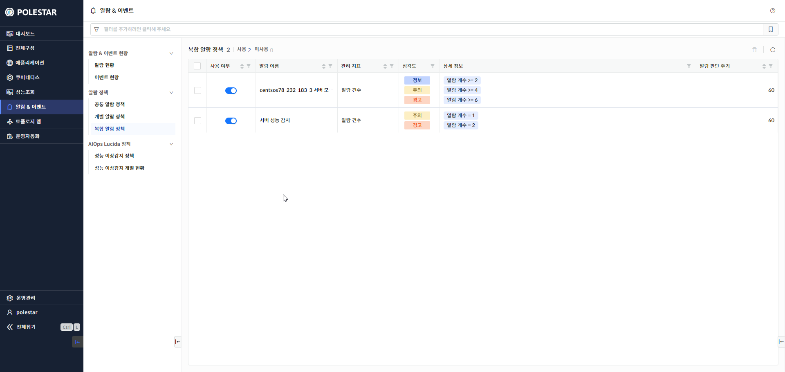
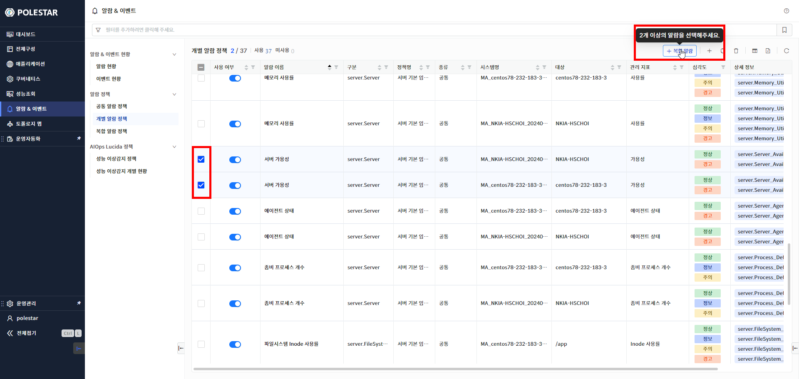
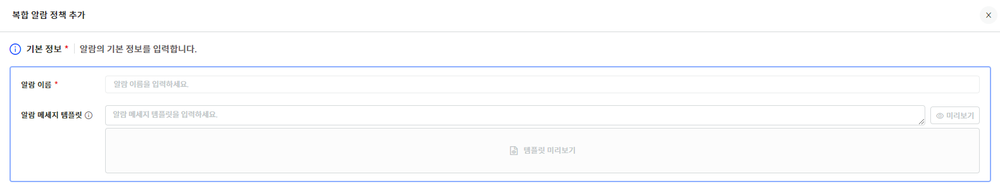
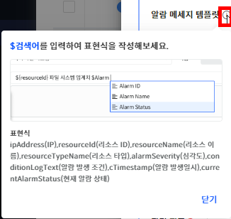
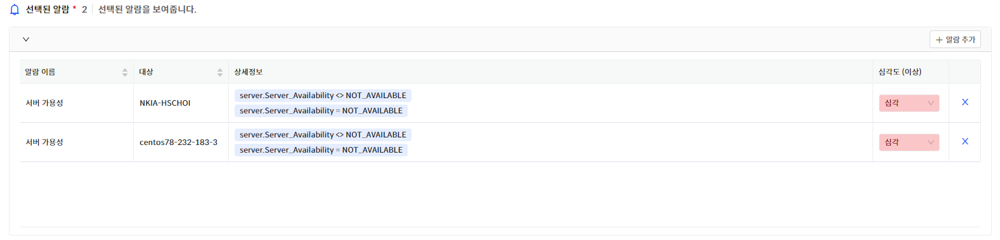
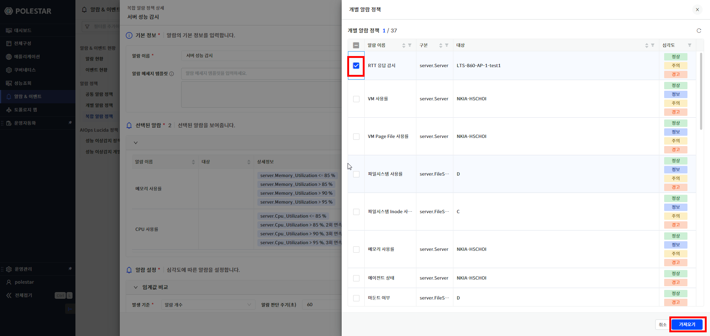
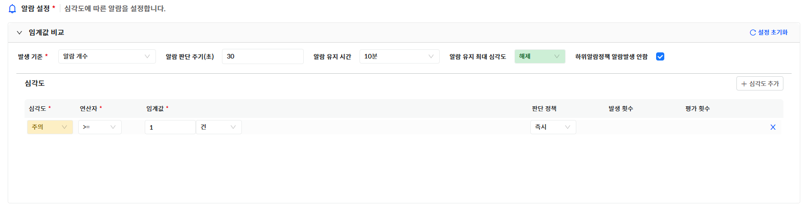
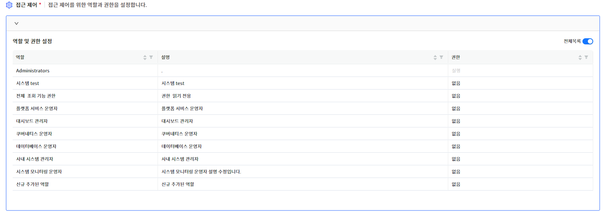
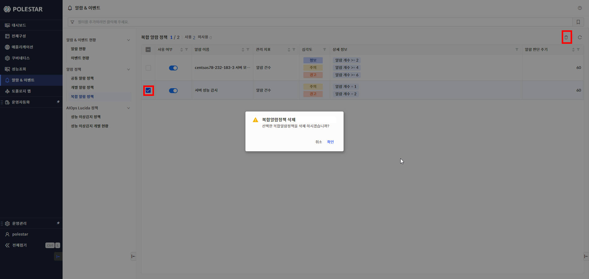
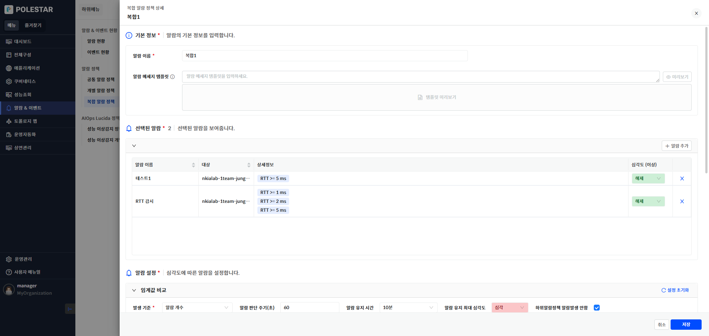

복합 알람 정책

복합 알람 정책은 단순하게 특정 지표에 대한 모니터링은 넘어, 여러 지표를 조합하여 복합적인 상태를 판단하고 알람을 발생시키는 정책입니다. 주요한 지표들의 개별 알람 정책을 조합하여 복합 알람 정책을 등록함으로써 인프라 및 서비스의 가용성 상태를 모니터링할 수 있도록 지원하는 알람 설정 정책입니다.

개별 알람 정책 목록에서 2개 이상의 정책을 선택하여 등록할 수 있습니다. 등록된 개별 알람 정책에서 발생된 알람 개수 및 알람 발생 비율에 임계값을 설정하여 모니터링합니다.

알람 정책에 통보 설정을 추가하여 사용자에게 즉시 통보가 가능하며 즉시 통보 설정과 함께 여러 개의 지연 통보 설정을 통해서 알람이 해제되지 않는 상황이 지속되면 상위 담당자, 관리자에게 순차적으로 통보할 수 있습니다.

<table>
<tbody>
<tr class="odd">
<td>
노트

여러 지표를 조합하여 복합적인 상태를 판단하는 새로운 서비스 지표로 활용할 수 있습니다.
</td>
</tr>
</tbody>
</table>

▶ \[그림1\] 복합 알람 정책 목록

화면 지표

<table>
<thead>
<tr class="header">
<th>사용여부</th>
<th>
사용 여부입니다.

토글 버튼()을 클릭하면 사용 여부가 변경됩니다.

미사용인 경우 해당 알람 정책으로 알람이 발생되지 않습니다.
</th>
</tr>
</thead>
<tbody>
<tr class="odd">
<td>알람 이름</td>
<td>알람 정책 이름입니다.</td>
</tr>
<tr class="even">
<td>관리 지표</td>
<td>
복합 알람 정책을 판단하는 기준입니다.

[알람 개수] 또는 [알람 비율]입니다.
</td>
</tr>
<tr class="odd">
<td>심각도</td>
<td>
알람의 심각도 레벨을 선택합니다.

심각도 레벨 및 순서는 아래와 같습니다.

</td>
</tr>
<tr class="even">
<td>상세 정보</td>
<td>심각도별 컨디션 로그입니다.</td>
</tr>
<tr class="odd">
<td>알람 판단 주기</td>
<td>정책을 평가하는 주기입니다.</td>
</tr>
</tbody>
</table>

복합 알람 정책 등록

개별 알람 정책 목록 조회 테이블 우측 상단의 \[복합 알람\]버튼을 선택하여 새로운 복합 알람 정책을 추가할 수 있습니다.

알람 정책 추가 시 입력 항목이 많고 선택에 따른 화면 변경이 있으므로 화면의 영역별로 설명합니다

▶ \[그림2\] 복합 알람 정책의 개별 알람 정책 선택

기본 정보

복합 알람 정책의 알람 이름을 입력합니다. 메세지 템플릿을 입력하여 알람 메세지 형식을 지정할 수 있습니다.

▶ \[그림3\] 복합 알람 정책 – 기본 정보

화면 지표

<table>
<thead>
<tr class="header">
<th>알람 이름</th>
<th>복합 알람 정책의 이름을 입력합니다.</th>
</tr>
</thead>
<tbody>
<tr class="odd">
<td>알람 메세지 템플릿</td>
<td>
알람의 메세지 형식을 등록합니다.

입력하지 않으면 기본 메세지 형식으로 생성됩니다.
</td>
</tr>
<tr class="even">
<td>미리보기 버튼</td>
<td>하단에 입력한 템플릿으로 형식으로 생성된 메세지를 볼 수 있습니다.</td>
</tr>
</tbody>
</table>

알람 메시지 템플릿 입력 절차

사용자가 원하는 알람 메세지 형식을 정의합니다. 메세지에는 \[표현식\]을 추가하여 알람과 관련된 속성을 입력할 수 있습니다. \[$문자열\] 형식으로 입력하면 문자열을 포함하는 속성 표현 값이 Drop Box로 표시되어 선택할 수 있습니다. \[알람 메세지 템플릿\] 타이틀 옆에 있는 도움말 버튼을 클릭하면 도움말 창이 나타나며 사용할 수 있는 \[표현식\]을 확인할 수 있습니다. 입력 후에는 \[미리보기\] 버튼을 클릭하여 원하는 메세지 형식이 맞는지 미리 확인해 볼 수 있습니다.

1.  \[$\]문자 입력.

2.  \[$\]문자에 붙여서 문자를 입력합니다

3.  표시되는 내용중 원하는 내용을 선택합니다

4.  메세지를 입력하여 템플릿을 완성합니다.

5.  미리보기 클릭하여 확인

▶ \[그림4\] 알람 메세지 템플릿 도움말

▶ \[그림5\] 알람 메세지 템플릿 미리보기

선택된 알람

복합 알람 정책을 구성하는 개별 알람 정책을 선택할 수 있습니다. 테이블에는 개별 알람 정책 목록 화면에서 선택한 개별 알람 정책 목록이 표시됩니다. 그리드의 컬럼 필터링 기능을 이용하여 대상 장비를 검색할 수 있습니다. 우측 상단의 \[알람 추가\]기능으로 신규 알람을 추가할 수 있고 목록에서 불필요한 개별 알람 정책을 삭제할 수 있습니다. 개별 알람 정책마다 발생되는 알람의 심각도를 선택하여 복합 알람 정책에 필요한 알람 심각도만 적용할 수 있습니다.

<table>
<tbody>
<tr class="odd">
<td>
노트

개별 알람 정책의 심각도를 설정하여 복합 알람 정책으로 서비스의 상태를 모니터링하려는 민감도를 조정할 수 있습니다.
</td>
</tr>
</tbody>
</table>

▶ \[그림6\] 선택된 개별 알람 정책 정보

화면 지표

| 알람 이름 | 개별 알람 정책의 이름입니다.               |
| ----- | ------------------------------ |
| 대상    | 개별 알람 정책 대상 장비의 이름입니다.         |
| 상세정보  | 개별 알람 정책에 설정된 임계치 설정 정보입니다.    |
| 심각도   | 개별 알람 정책에 발생되는 알람의 심각도를 설정합니다. |

알람 추가

알람 추가 버튼을 클릭하면 추가할 개별 알람 정책을 선택할 수 있는 화면이 나타납니다.

▶ \[그림7\] 선택된 알람 - 알람 추가

화면 지표

| 알람 이름 | 개별 알람 정책의 이름을 입력합니다.      |
| ----- | ------------------------- |
| 구분    | 대상 시스템의 타입입니다.            |
| 대상    | 개별 알람 정책이 적용되는 대상의 이름입니다. |
| 심각도   | 개별 알람 정책에 설정된 심각도 정보입니다.  |

알람 추가 절차

선택된 알람에 새로운 개별 알람 정책을 추가합니다.

1.  > 알람 추가 버튼을 클릭합니다.

2.  > 개별 알람 정책을 선택합니다.

3.  > 가져오기 버튼을 클릭합니다.

선택된 알람 목록에서 추가된 개별 알람 정책을 확인합니다.

알람 삭제 절차

선택된 알람에 있는 개별 알람 정책을 삭제합니다.

1.  > 삭제하려는 개별 알람 정책의  버튼을 클릭합니다.

2.  > 선택된 알람 목록에서 삭제를 확인합니다.

알람 설정

알람 이름을 입력하면 \[알람 설정\]이 활성화됩니다. \[임계값 비교\] 방식으로 설정합니다. 임계값은 등록된 개별 알람 정책에서 발생되는 알람 개수/알람 비율 값을 가지고 판단합니다. 즉시 발생/연속발생/N회평가 3 가지의 판단 기준으로 설정 가능합니다. \[심각도 추가\] 버튼을 선택하여 여러 단계의 심각도별 정책을 설정할 수 있습니다. 지표를 선택하면 지표의 이력 데이터 또는 현재 값이 하단에 표시됩니다. \[하위알람정책 알람발생 안함\]이 체크되어 있으면 하위 알람은 발생되지 않고 복합 알람만 발생됩니다.

<table>
<tbody>
<tr class="odd">
<td>
노트

여러 단계의 심각도 레벨을 설정할 수 있습니다. 높은 레벨부터 판단하여 조건을 충족하면 알람이 발생됩니다.

[하위알람정책 알람발생 안함]을 선택하여 알람 발생을 억제하고 필요한 복합(서비스) 알람만 발생시킬 수 있습니다.
</td>
</tr>
</tbody>
</table>

▶ \[그림8\] 알람 설정

화면 지표

<table>
<thead>
<tr class="header">
<th>발생 기준</th>
<th>
복합 알람 정책의 판단 기준이 되는 지표를 설정합니다.

발생 기준 값

<ul>
<li>
알람 개수: 개별 알람 정책에서 발생된 알람 개수
</li>
<li>
알람 비율: 등록된 개별 알람 정책 개수 대비 발생된 알람 개수
</li>
</ul></th>
</tr>
</thead>
<tbody>
<tr class="odd">
<td>알람 판단 주기</td>
<td>복합 알람 정책을 평가할 주기를 설정합니다.</td>
</tr>
<tr class="even">
<td>알람 유지 시간</td>
<td>알람이 발생되고 상태를 유지하는 시간입니다. 해당 시간이 지나면 자동으로 해제됩니다.</td>
</tr>
<tr class="odd">
<td>알람 유지 최대 심각도</td>
<td>
알람 유지 시간이 적용되는 최대 심각도 레벨입니다.

그 이상의 심각도 알람은 자동 해제 없이 계속 유지됩니다.
</td>
</tr>
<tr class="even">
<td>하위알람정책 알람 발생 안함</td>
<td>항목을 체크하면 하위 알람 정책의 알람을 발생시키지 않고 복합 알람만 발생시킬 수 있습니다.</td>
</tr>
<tr class="odd">
<td>심각도</td>
<td>
알람의 심각도 레벨을 선택합니다.

심각도 레벨 및 순서는 아래와 같습니다.

</td>
</tr>
<tr class="even">
<td>연산자</td>
<td>
수집된 지표 값과 비교할 연산자를 선택합니다.

</td>
</tr>
<tr class="odd">
<td>임계값</td>
<td>
임계값을 입력합니다.

단위를 선택하여 지표의 단위를 변경하여 비교할 수 있습니다.
</td>
</tr>
<tr class="even">
<td>판단 정책</td>
<td>
판단 정책을 선택합니다.

즉시: 판단 즉시 알람을 발생시킵니다.

연속 발생: 발생 횟수만큼 연속으로 조건을 충족하면 알람이 발생됩니다.

N회 평가: 평가 횟수내에 발생 횟수만큼 조건을 충족하면 알람이 발생됩니다.
</td>
</tr>
<tr class="odd">
<td>발생 횟수</td>
<td>발생 횟수를 입력합니다.</td>
</tr>
<tr class="even">
<td>평가 횟수</td>
<td>평가 횟수를 입력합니다.</td>
</tr>
</tbody>
</table>

통보 설정

알람이 발생되면 통보 설정에 따라서 사용자에게 통보가 발송됩니다. 통보 이력은 \[알람 현황 \> 알람 상세 보기\]의 통보 이력 탭에서 확인 할 수 있습니다.

<table>
<tbody>
<tr class="odd">
<td>
노트

통보 발송의 성공 여부는 통보 설정에 등록된 대상 시스템으로의 통보 메세지 전송 성공여부를 의미하며 실제 사용자에게 통보가 전달되었음을 의미하지는 않습니다.
</td>
</tr>
</tbody>
</table>

▶ \[그림9\] 알람 정책 – 통보 설정

화면 지표

<table>
<thead>
<tr class="header">
<th>심각도</th>
<th>통보 대상이 되는 알람의 심각도 레벨을 선택합니다.</th>
</tr>
</thead>
<tbody>
<tr class="odd">
<td>해제 통보</td>
<td>알람이 해제되는 경우 통보를 발송할 지 여부를 선택합니다.</td>
</tr>
<tr class="even">
<td>지연/반복 통보</td>
<td>
통보 발송 시기를 설정합니다.

[즉시 이후 반복]은 즉시 통보 이후 알람이 해제되지 않으면 반복해서 통보를 보냅니다. 5분 간격으로 3회 발송됩니다.

설정할 수 있는 옵션은 다음과 같습니다.

즉시

5분 지연

10분 지연

30분 지연

1 시간 지연

6시간 지연

12시간 지연

1일 지연

즉시 이후 반복
</td>
</tr>
<tr class="odd">
<td>통보 대상</td>
<td>
통보 대상을 입력합니다.

방식은 다음과 같습니다.

직접 입력(사용자)를 선택하고 사용자를 선택합니다.

직접 입력(사용자 그룹)을 선택하고 사용자 그룹을 선택합니다.

직접 입력(역할)을 선택하고 역할을 선택합니다.
</td>
</tr>
<tr class="even">
<td>통보 방법</td>
<td>
통보 방법을 선택합니다.

통보 방법은 [운영 관리&gt; 기본 설정&gt; 통보 설정]메뉴의 [통보 방식]탭에서 확인 가능합니다.
</td>
</tr>
</tbody>
</table>

접근 설정

복합 알람 정책에 대한 접근 권한을 설정합니다.

<table>
<tbody>
<tr class="odd">
<td>
노트

복합 알람 정책은 개별 장비에 종속적이지 않으므로 장비의 역할 권한에 따라서 접근이 되지 않고 독립적인 권한 정보를 가지고 있습니다.
</td>
</tr>
</tbody>
</table>

▶ \[그림10\] 접근 제어

화면 지표

<table>
<thead>
<tr class="header">
<th>역할</th>
<th>역할 이름입니다.</th>
</tr>
</thead>
<tbody>
<tr class="odd">
<td>설명</td>
<td>역할에 대한 설명입니다.</td>
</tr>
<tr class="even">
<td>권한</td>
<td>
역할에 부여되는 접근 권한입니다.

권한은 아래와 같으며 밑에 있는 권한은 상위에 있는 권한을 포함합니다.

없음: 권한이 없습니다.

읽기: 조회할 수 있습니다.

실행: 대상에 오퍼레이션 기능이 있다면 실행할 수 있습니다.

쓰기: 대상의 속성을 수정할 수 있습니다.

삭제: 대상을 삭제할 수 있습니다.
</td>
</tr>
</tbody>
</table>

복합 알람 정책 삭제

복합 알람 정책을 삭제하려는 경우 목록에서 삭제할 정책을 선택하고 \[삭제\] 버튼을 클릭해서 삭제할 수 있습니다.

▶ \[그림11\] 복합 알람 정책 삭제

복합 알람 정책 삭제 절차

1.  삭제하고자 하는 복합 알람 정책을 선택 (다중 선택 가능)

2.  테이블 우측 상단의 삭제 아이콘 클릭

3.  메시시창에서 확인 클릭

복합 알람 정책 수정

목록에서 알람 이름을 클릭하면 복합 알람 정책의 상세 내용이 표시됩니다. \[기본 정보\], \[선택된 알람\], \[알람 설정\], \[통보 설정\], \[접근 제어\]를 수정할 수 있습니다. \[알람 추가\]를 통해서 신규 개별 알람 정책을 추가할 수 있습니다.

▶ \[그림12\] 복합 알람 정책 수정

복합 알람 정책 수정 절차

1.  목록에서 수정하고자 하는 복합 알람 정책의 이름을 선택.

2.  상세 보기 창이 표시되면 \[복합 알람 정책 등록\]과 동일한 방식으로 수정.

3.  하단의 저장 클릭

