서버 상세

서버 목록에서 특정 장비의 ‘시스템 이름’을 클릭하여 장비의 상세 성능 및 구성 정보를 확인할 수 있습니다.

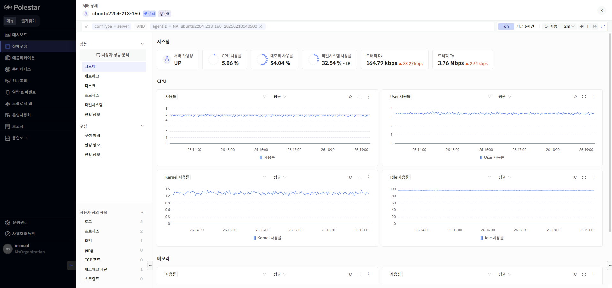

▶ \[그림1\] 서버 상세

태그 상세 정보

화면 상단의 \[태그\] 버튼을 클릭하여 서버에 등록되어 있는 태그 정보를 관리할 수 있습니다.

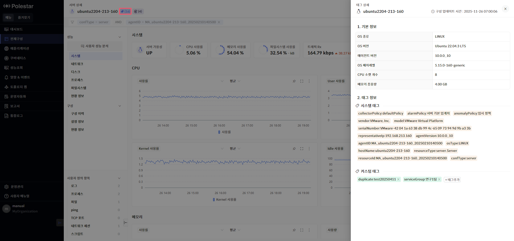

▶ \[그림2\] 태그 상세 정보

기본 정보

| OS종류      | 서버에 설치된 OS 종류를 표시합니다.            |
| --------- | -------------------------------- |
| OS버전      | 서버에 설치된 OS의 버전 정보를 표시합니다.        |
| 에이전트 버전   | 서버에 설치된 POLESTAR 에이전트 버전을 표시합니다. |
| OS 패치레벨   | 서버에 설치된 OS의 패치 레벨을 표시합니다.        |
| CPU 소켓 개수 | 물리적 CPU 개수를 표시합니다.               |
| 메모리 총용량   | 물리적 메모리의 총용량을 표시합니다.             |

시스템 태그

POLESTAR 시스템에 의해 자동 등록된 태그입니다. 시스템 태그는 사용자가 변경 및 삭제할 수 없습니다.

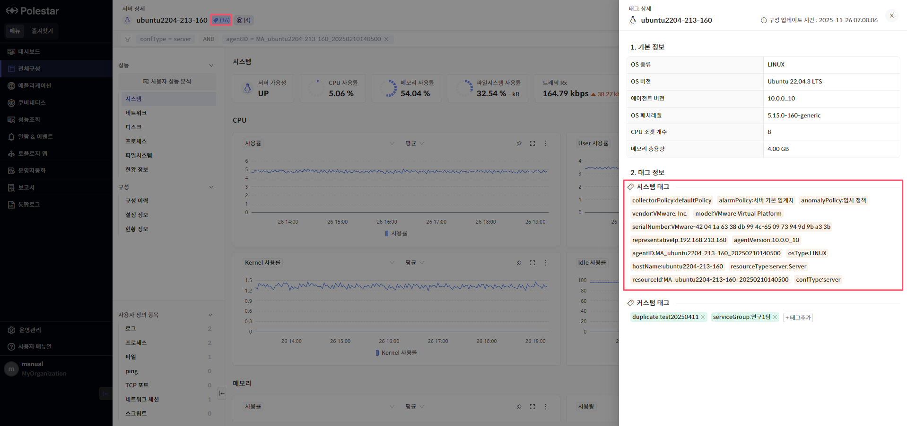

▶ \[그림3\] 시스템 태그

커스텀 태그

사용자가 등록한 태그입니다. 사용자의 목적에 따라 등록, 수정 및 삭제할 수 있습니다.

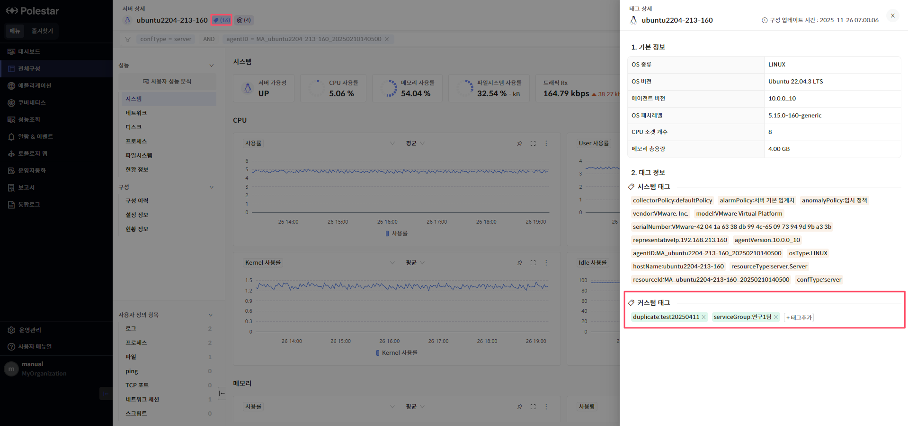

▶ \[그림4\] 커스텀 태그

커스텀 태그 추가

커스텀 태그의 \[태그추가\] 버튼을 선택하여 서버 장비에 커스텀 태그를 등록할 수 있습니다. 이미 등록되어 있는 태그키를 사용하거나, 새로운 태그키를 입력할 수 있습니다.

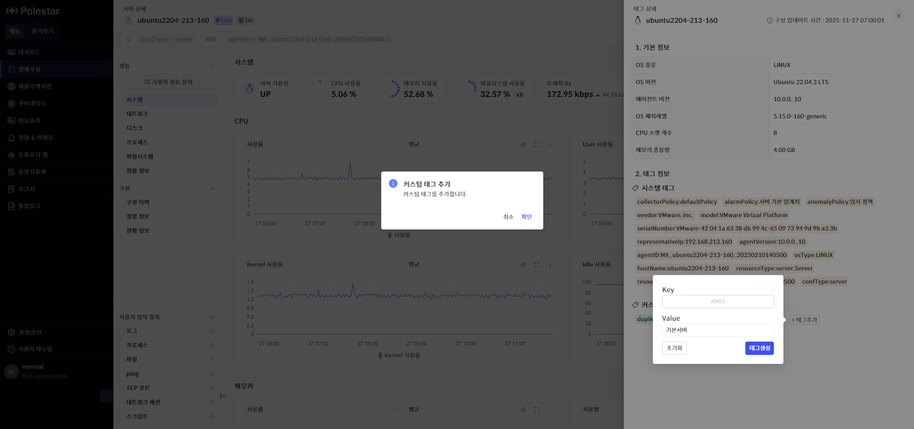

▶ \[그림5\] 커스텀 태그 추가

커스텀 태그 추가 절차

1.  태그 상세 정보 드로어에서 \[태그추가\] 버튼 클릭

2.  태그 추가용 팝업창에서 ‘Key’ 입력란을 클릭하여 등록되어 있는 커스텀 태그 키 선택

3.  신규 커스텀 태그기를 추가하는 경우, 태그 키 목록 상단의 ‘직접입력’ 선택하고 태그 키 입력

4.  ‘Value’ 입력란에 태그 값 입력

5.  \[태그생성\] 버튼 클릭

6.  커스텀 태그 추가 메시지창에서 \[확인\] 버튼 클릭

커스텀 태그 수정

등록한 커스텀 태그의 값을 변경할 수 있습니다.

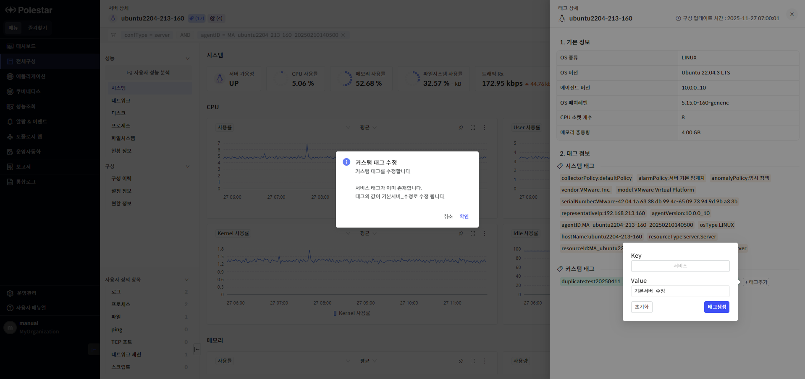

▶ \[그림6\] 커스텀 태그 수정

커스텀 태그 수정 절차

1.  태그 상세 정보 드로어에서 \[태그추가\] 버튼 클릭

2.  태그 추가용 팝업창에서 ‘Key’ 입력란을 클릭하고 값을 변경할 태그 키 선택

3.  변경할 태그 값을 ‘Value’ 입력란에 입력

4.  \[태그생성\] 버튼 클릭

5.  커스텀 필터 수정 메시지창에서 \[확인\] 버튼 클릭

커스텀 태그 삭제

등록된 커스텀 태그를 삭제할 수 있습니다.

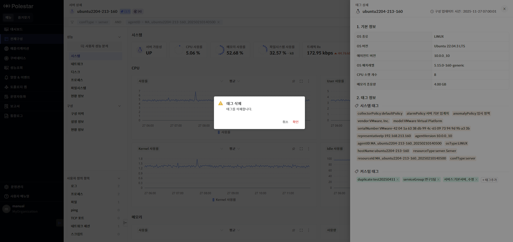

▶ \[그림7\] 커스텀 태그 삭제

커스텀 태그 삭제 절차

1.  태그 상세 정보 드로어에서 삭제할 태그의 ‘X’ 버튼 클릭

2.  커스텀 필터 삭제 메시지창에서 \[확인\] 버튼 클릭

오퍼레이션

화면 상단의 \[오퍼레이션\] 버튼을 클릭하여 서버에서 지원하는 오퍼레이션을 실행할 수 있습니다. 사용자는 실행한 오퍼레이션 결과를 다운로드 받을 수 있습니다.

<table>
<tbody>
<tr class="odd">
<td>
노트

서버 목록에서 오퍼레이션을 실행하면 다수의 장비에 동일한 오퍼레이션을 실행할 수 있습니다.
</td>
</tr>
</tbody>
</table>

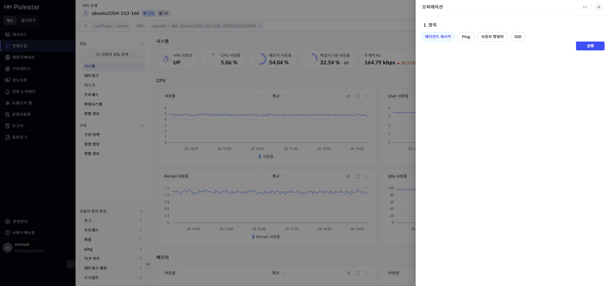

▶ \[그림8\] 오퍼레이션

에이전트 재시작

서버에 설치된 POLESTAR 에이전트를 재시작합니다. 에이전트가 재시작 되는 동안은 알람 발생 및 구성/성능 수집이 중지됩니다.

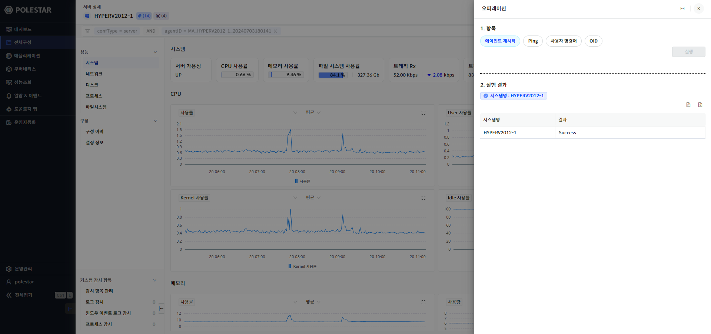

▶ \[그림9\] 에이전트 재시작

Ping

POLESTAR가 실행 중인 서버에서 대상 서버로 ICMP Ping을 수행하여 RTT값을 측정합니다.

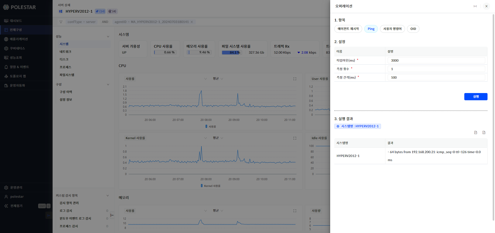

▶ \[그림10\] Ping

입력 항목

<table>
<thead>
<tr class="header">
<th>타임아웃</th>
<th>응답 대기 시간을 입력합니다. (기본값: 3000, 단위: 밀리초(ms))</th>
</tr>
</thead>
<tbody>
<tr class="odd">
<td>측정 횟수</td>
<td>ICMP 측정을 시도할 횟수를 입력합니다. (기본값: 1)</td>
</tr>
<tr class="even">
<td>측정 간격</td>
<td>
측정 시도 사이의 시간 간격을 입력합니다.

(기본값: 500, 단위: 밀리초(ms))
</td>
</tr>
</tbody>
</table>

사용자 명령어

서버에서 입력된 명령어를 실행하여 결과를 확인할 수 있습니다. 서버 shutdown과 같이 위험한 명령이나 사용자 실수를 유발할 수 있는 삭제 명령은 제한됩니다.

<table>
<tbody>
<tr class="odd">
<td>
노트

[운영관리] 메뉴의 [명령어 제한] 기능을 사용하여 오퍼레이션으로 실행하는 명령어를 제한할 수 있습니다.
</td>
</tr>
</tbody>
</table>

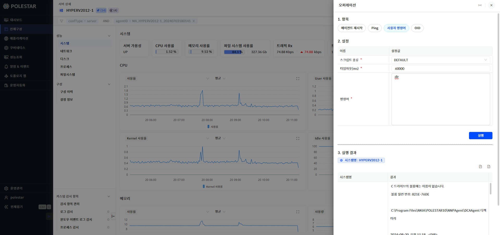

▶ \[그림11\] 사용자 명령어

입력 항목

<table>
<thead>
<tr class="header">
<th>스크립트 종류</th>
<th>
명령어를 실행할 스크립트 종류를 선택합니다.

DEFAULT: Unix/Linux계열은 Shell Script가 실행되며, Windows 계열은 batch로 실행

VB_SCRIPT: Visual Basic Script

WINDOWS_POWERSHELL: Windows PowerShell
</th>
</tr>
</thead>
<tbody>
<tr class="odd">
<td>타임아웃</td>
<td>
응답 대기 시간을 입력합니다. (기본값: 60000, 단위: 밀리초(ms))

네트워크 지연이나 일시적인 응답 지연으로 인한 오류를 최소화하기 위해 설정한 타임아웃 시간에 10초의 버퍼 시간이 자동으로 추가됩니다.
</td>
</tr>
<tr class="even">
<td>명령어</td>
<td>서버에서 실행할 명령어를 입력합니다. 제한된 문구를 포함한 명령어는 실행할 수 없습니다.</td>
</tr>
</tbody>
</table>

OID

POLESTAR에서 수집하는 성능 및 구성 지표에 부여된 OID를 입력하여 데이터를 조회할 수 있습니다. OID는 에이전트에서 수집하는 데이터의 ID로 분석을 위한 데이터 요청 시 사용됩니다.

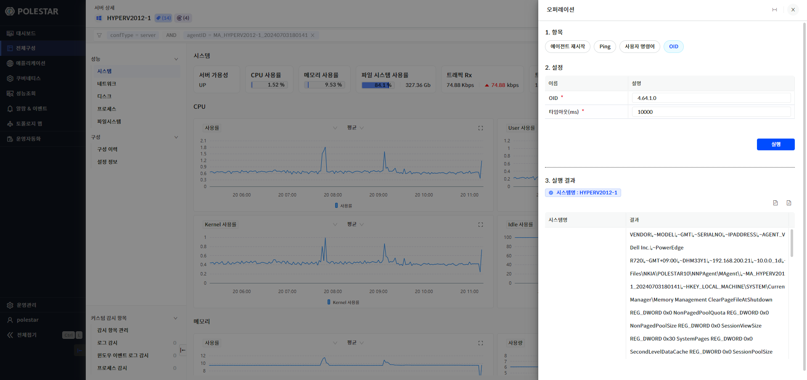

▶ \[그림12\] OID

입력 항목

<table>
<thead>
<tr class="header">
<th>OID</th>
<th>에이전트에 요청할 수집 데이터의 OID를 입력합니다..</th>
</tr>
</thead>
<tbody>
<tr class="odd">
<td>타임아웃</td>
<td>
응답 대기 시간을 입력합니다. (기본값: 10000, 단위: 밀리초(ms))

네트워크 지연이나 일시적인 응답 지연으로 인한 오류를 최소화하기 위해 설정한 타임아웃 시간에 10초의 버퍼 시간이 자동으로 추가됩니다.
</td>
</tr>
</tbody>
</table>

<table>
<tbody>
<tr class="odd">
<td>
노트

데이터별 OID는 NKIA의 유지보수 담당자에게 문의하시기 바랍니다.
</td>
</tr>
</tbody>
</table>

사용자 성능 분석

서버 상세 드로어에 표시되는 성능 데이터 차트에서 관심 있는 지표를 PIN 아이콘으로 선택하고 \[사용자 성능 분석\] 버튼을 클릭하면 PIN 표시한 지표만 사용자 성능 분석 드로어에 모아서 확인할 수 있습니다.  
이 기능을 이용하면 서버 상세 드로어에서 리소스 타입간 화면 이동을 하지 않고도 원하는 성능 지표만 빠르게 비교·분석할 수 있습니다

\[사용자 성능 분석\] 버튼에는 사용자가 PIN 표시한 지표 개수가 표시되고, 버튼을 클릭하면 선택한 지표를 확인할 수 있는 사용자 성능 분석 드로어가 표시됩니다. 타임 셀렉터를 사용해서 조회 기간을 변경하거나, \[전체삭제\] 버튼으로 선택한 지표를 초기화할 수 있습니다.

<table>
<tbody>
<tr class="odd">
<td>
노트

PIN 아이콘은 Metric 타입 데이터 차트에만 표시됩니다. Tabular 타입 데이터 차트에는 표시되지 않습니다.

사용자 성능 분석 드로어에서 타임 셀렉터가 ‘LIVE’ 모드인 경우, 성능 데이터 차트에서 집계 타입 셀렉터와 확대보기 기능을 지원하지 않습니다. (집계 타입: 평균, 최소, 최대, 합)
</td>
</tr>
</tbody>
</table>

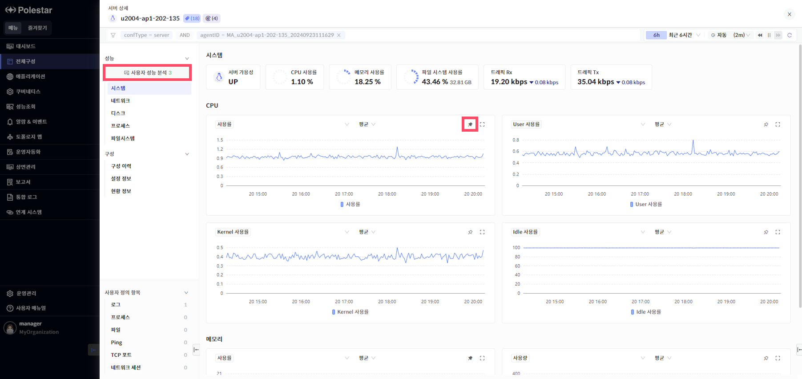

▶ \[그림13\] 성능 데이터 차트 - PIN 표시

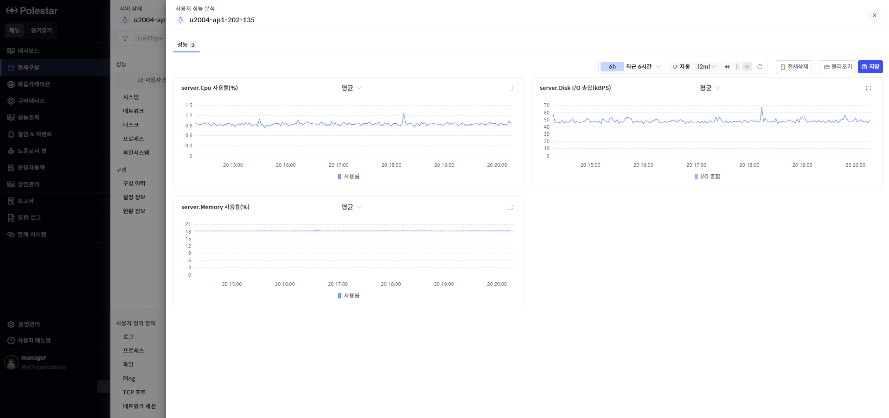

▶ \[그림14\] 사용자 성능 분석

사용자 성능 분석 저장

사용자는 사용자 성능 분석 드로어에서 조회하고 있는 지표 정보를 저장할 수 있습니다. 조회 중인 차트가 있는 경우, 화면 우측 상단의 \[저장\] 버튼이 활성화되고 조회 중인 지표 목록을 저장할 수 있습니다.

<table>
<tbody>
<tr class="odd">
<td>
노트

사용자 성능 분석 저장은 지표 정보만 저장합니다. 조회 기간과 성능 데이터를 저장하는 스냅샷 기능이 아닙니다.

사용자 성능 분석 관리 기능(저장, 수정, 삭제)은 서버 조회 역할이 있는 계정에서 사용할 수 있습니다.
</td>
</tr>
</tbody>
</table>

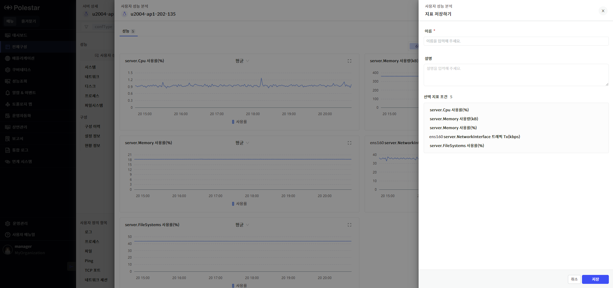

▶ \[그림15\] 사용자 성능 분석 저장

사용자 성능 분석 저장 절차

1.  사용자 성능 분석 드로어에 표시되는 차트가 1개 이상인 경우, 화면 우측 상단의 \[저장\] 버튼 클릭

2.  이름 및 설명 필드 입력하고 \[저장\] 버튼 클릭

사용자 성능 분석 불러오기

\[불러오기\] 버튼을 클릭하면 저장한 사용자 성능 분석 항목을 확인할 수 있습니다. 데이터를 확인 중인 서버에서 사용자가 등록한 사용자 성능 분석 항목만 조회가 가능합니다.

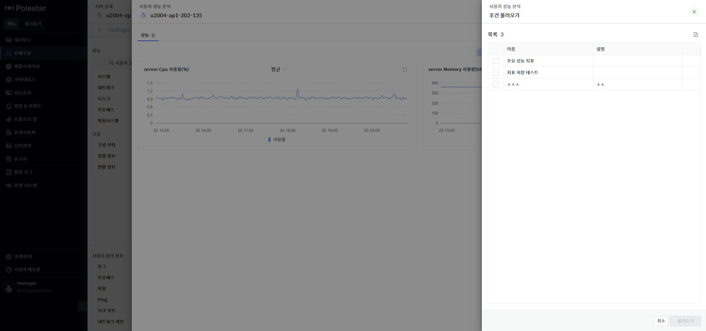

▶ \[그림16\] 사용자 성능 분석 불러오기

사용자 성능 분석 불러오기 절차

1.  화면 우측 상단의 \[불러오기\] 버튼 클릭

2.  불러올 사용자 성능 분석 항목 클릭

3.  \[불러오기\] 버튼 클릭

사용자 성능 분석 수정

\[불러오기\]를 통해 특정 사용자 성능 분석 항목을 조회하고 있는 경우, 차트의 집계 타입(평균, 최소, 최대, 합)을 변경할 수 있습니다.

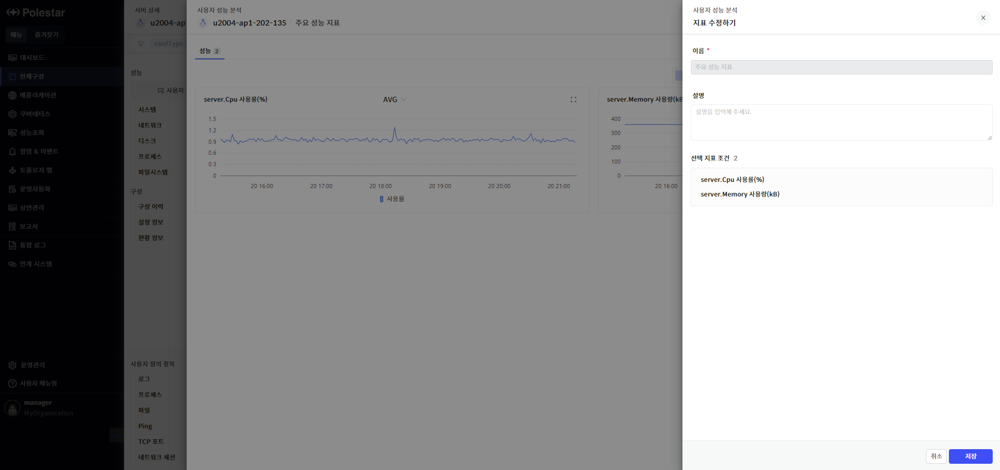

▶ \[그림17\] 사용자 성능 분석 수정

사용자 성능 분석 삭제

\[불러오기\] 목록에서 특정 사용자 성능 분석 항목을 선택하여 삭제할 수 있습니다.

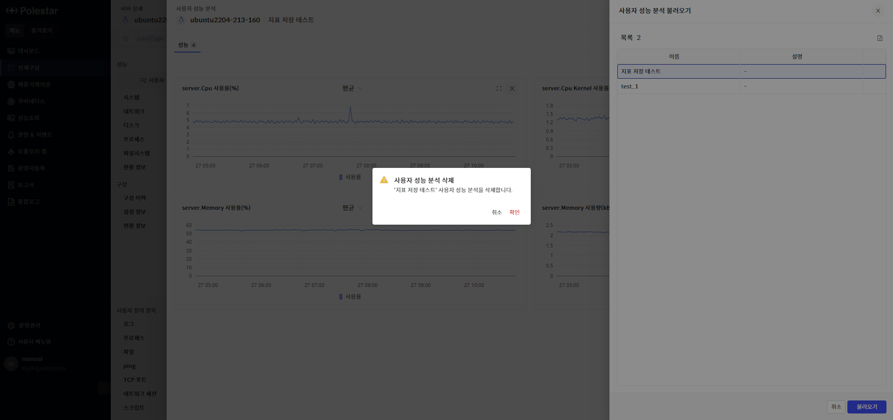

▶ \[그림18\] 사용자 성능 분석 삭제

사용자 성능 분석 삭제 절차

1.  화면 우측 상단의 \[불러오기\] 버튼 클릭

2.  특정 항목에 마우스 hover시 나타나는 \[삭제\] 버튼 클릭

3.  삭제 안내 팝업창에서 \[확인\] 버튼 클릭

시스템

서버의 가용성 정보와 주요 성능 데이터를 카드 형식으로 제공하며, CPU와 메모리 성능 데이터를 라인 차트 형태로 조회할 수 있습니다. 차트의 조회 범위는 화면 우측 상단의 타임 셀렉터 설정을 따르며, ‘최근 6시간’ 옵션이 기본 적용되어 있습니다.

<table>
<tbody>
<tr class="odd">
<td>
노트

타임 셀렉터에 대한 상세 설명은 ‘성능조회’ 매뉴얼을 참고하시기 바랍니다.
</td>
</tr>
</tbody>
</table>

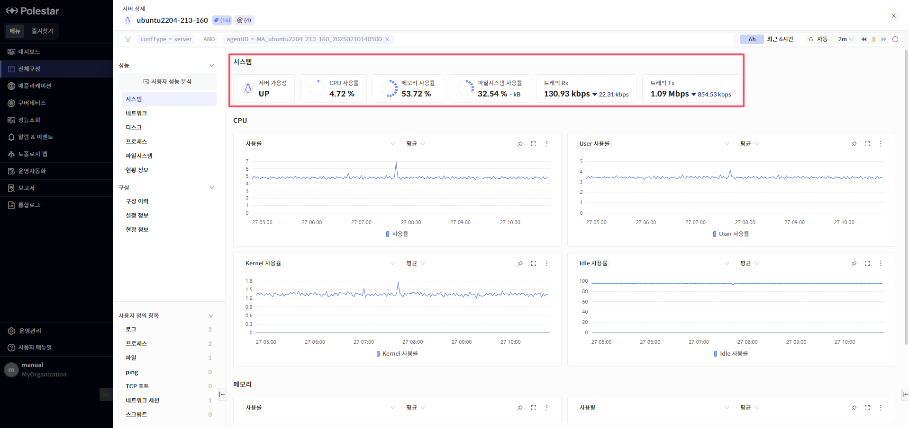

▶ \[그림19\] 시스템

화면 지표

<table>
<thead>
<tr class="header">
<th>서버 가용성</th>
<th>
서버의 가용성을 표시합니다

UP : 정상적으로 장비 모니터링 중인 상태

DOWN : 에이전트를 연결할 수 없는 상태

UNKNOWN : 에이전트 연결을 확인할 수 없는 상태
</th>
</tr>
</thead>
<tbody>
<tr class="odd">
<td>CPU 사용률</td>
<td>CPU 평균 사용률을 표시합니다. (1분 통계 데이터 사용)</td>
</tr>
<tr class="even">
<td>메모리 사용률</td>
<td>물리적 메모리 사용률을 표시합니다. (1분 통계 데이터 사용)</td>
</tr>
<tr class="odd">
<td>파일시스템 사용률</td>
<td>
파일시스템 사용률과 파일시스템 총용량을 표시합니다.

(1분 통계 데이터 사용)
</td>
</tr>
<tr class="even">
<td>트래픽 Rx</td>
<td>
포트로 유입된 트래픽의 평균값과 변화량을 표시합니다.

 : 직전 수집값보다 트래픽 증가

: 직전 수집값보다 트래픽 감소

(1분 통계 데이터 사용)
</td>
</tr>
<tr class="odd">
<td>트래픽 Tx</td>
<td>
포트에서 나간 트래픽의 평균값과 변화량을 표시합니다.

 : 직전 수집값보다 트래픽 증가

: 직전 수집값보다 트래픽 감소

(1분 통계 데이터 사용)
</td>
</tr>
</tbody>
</table>

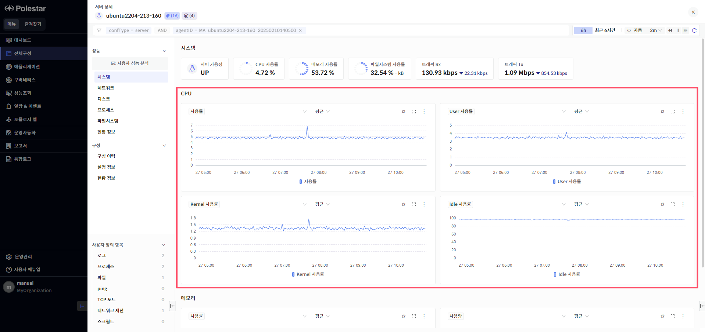

▶ \[그림20\] CPU

차트에서 관리 지표와 성능 데이터 타입을 선택할 수 있습니다. 관리 지표는 차트당 최대 5개까지 복수 선택할 수 있으며, 선택한 관리 지표는 차트 하단 범례에 표시됩니다.

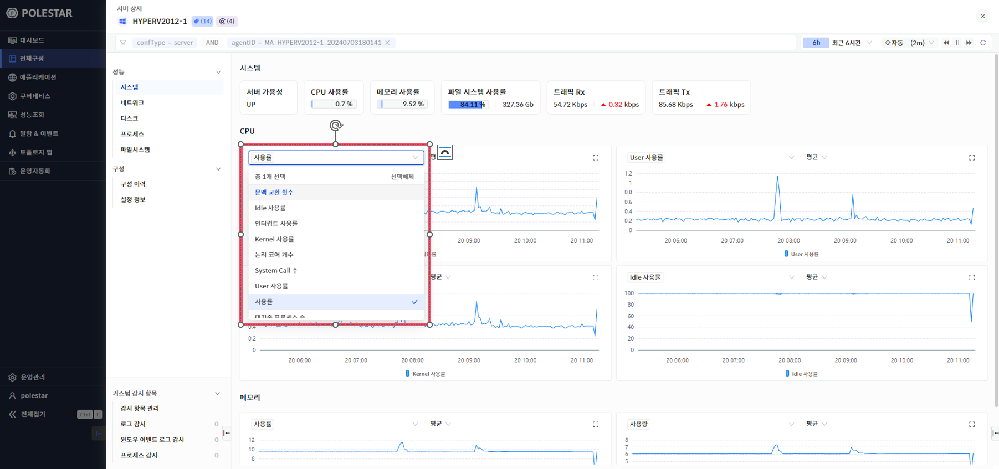

▶ \[그림21\] CPU - 관리 지표 선택

<table>
<tbody>
<tr class="odd">
<td>
노트

POLESTAR에서 지원하는 서버의 성능 관리 지표는 관리항목 정의서를 참고하시기 바랍니다.
</td>
</tr>
</tbody>
</table>

화면 지표

| 평균 | 타임 셀렉터에 해당하는 성능 통계 데이터(1분,5분,1시간,1일)를 산출하는데 사용한 데이터의 평균값을 차트를 표시합니다. |
| -- | -------------------------------------------------------------------- |
| 최소 | 타임 셀렉터에 해당하는 성능 통계 데이터(1분,5분,1시간,1일)를 산출하는데 사용한 데이터의 최소값을 차트로 표시합니다. |
| 최대 | 타임 셀렉터에 해당하는 성능 통계 데이터(1분,5분,1시간,1일)를 산출하는데 사용한 데이터의 최대값을 차트로 표시합니다. |
| 합  | 타임 셀렉터에 해당하는 성능 통계 데이터(1분,5분,1시간,1일)를 산출하는데 사용한 데이터의 합산값을 차트로 표시합니다. |

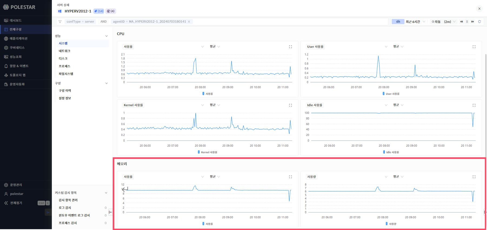

▶ \[그림22\] 메모리

네트워크

서버의 전체 네트워크 성능 차트 및 개별 네트워크 인터페이스 목록을 제공합니다. 개별 네트워크 인터페이스 목록을 펼치면 개별 네트워크 인터페이스의 성능 차트를 조회할 수 있습니다.

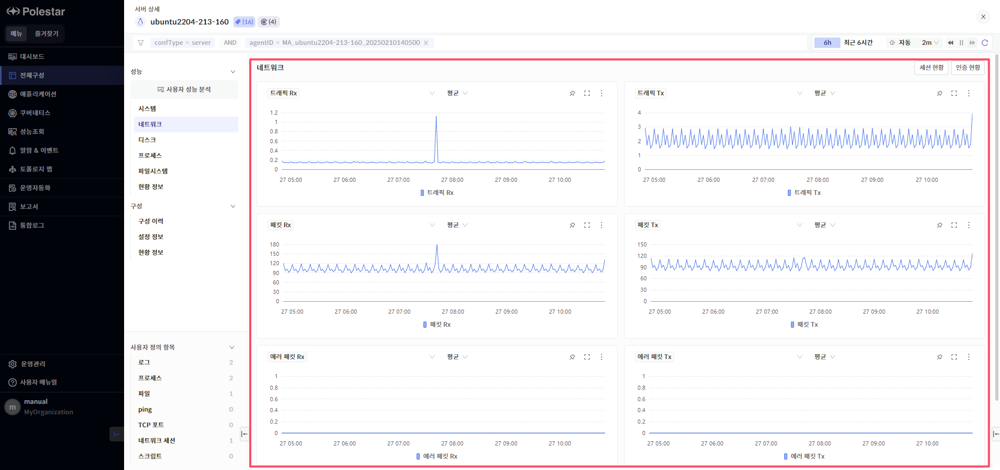

▶ \[그림23\] 전체 네트워크

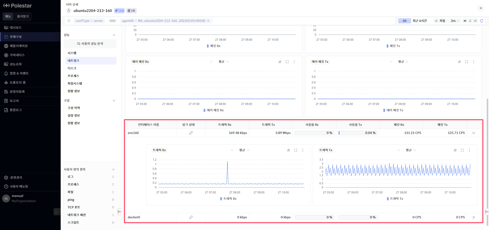

▶ \[그림24\] 개별 네트워크 목록

화면 지표

<table>
<thead>
<tr class="header">
<th>인터페이스 이름</th>
<th>네트워크 인터페이스 이름을 표시합니다.</th>
</tr>
</thead>
<tbody>
<tr class="odd">
<td>링크 상태</td>
<td>
링크 연결 상태를 표시합니다

: 링크 연결 상태 UP

 : 링크 연결 상태 DOWN
</td>
</tr>
<tr class="even">
<td>트래픽 Rx</td>
<td>단위 시간당 포트로 유입된 트래픽의 평균값을 표시합니다.</td>
</tr>
<tr class="odd">
<td>트래픽 Tx</td>
<td>단위 시간당 포트에서 나간 트래픽의 평균값을 표시합니다.</td>
</tr>
<tr class="even">
<td>사용률 Rx</td>
<td>Interface 대역폭 대비 수신 트래픽 비율을 표시합니다.</td>
</tr>
<tr class="odd">
<td>사용률 Tx</td>
<td>Interface 대역폭 대비 송신 트래픽 비율을 표시합니다.</td>
</tr>
<tr class="even">
<td>트래픽 패킷 Rx</td>
<td>단위 시간당 포트로 유입된 패킷 수를 표시합니다.</td>
</tr>
<tr class="odd">
<td>트래픽 패킷 Tx</td>
<td>단위 시간당 포트로 유입된 패킷 수를 표시합니다.</td>
</tr>
</tbody>
</table>

네트워크 세션 현황

네트워크 화면의 우측 상단에서 \[세션 현황\] 버튼을 클릭하면 서버에 연결된 네트워크 접속 현황 정보 목록을 확인할 수 있습니다.

<table>
<tbody>
<tr class="odd">
<td>
노트

세션 현황 정보는 netstat -an 명령어 실행 결과와 동일합니다.
</td>
</tr>
</tbody>
</table>

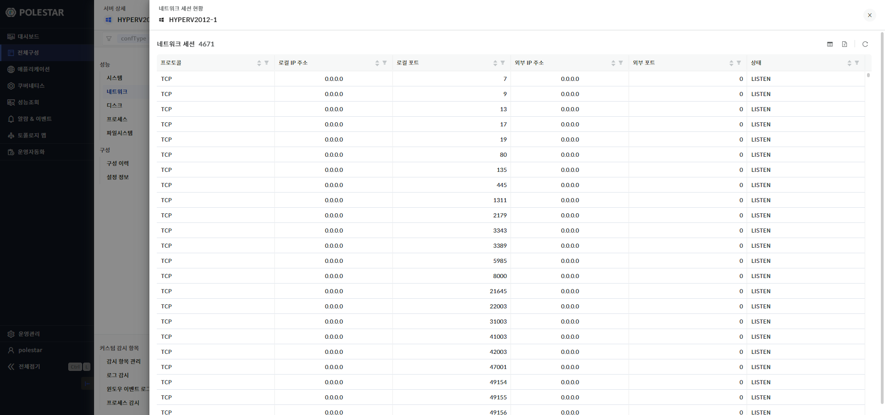

▶ \[그림25\] 네트워크 세션 현황

화면 지표

<table>
<thead>
<tr class="header">
<th>프로토콜</th>
<th>
프로토콜 종류를 표시합니다.

프로토콜 종류: TCP, TCP4, TCP6, UDP, UDP4, UDP6
</th>
</tr>
</thead>
<tbody>
<tr class="odd">
<td>로컬 IP 주소</td>
<td>출발지 주소를 표시합니다.</td>
</tr>
<tr class="even">
<td>로컬 포트</td>
<td>출발지 포트를 표시합니다.</td>
</tr>
<tr class="odd">
<td>외부 IP 주소</td>
<td>목적지 주소를 표시합니다.</td>
</tr>
<tr class="even">
<td>외부 포트</td>
<td>목적지 포트를 표시합니다.</td>
</tr>
<tr class="odd">
<td>상태</td>
<td>포트 상태를 표시합니다.</td>
</tr>
</tbody>
</table>

네트워크 인증 현황

네트워크 화면의 우측 상단에서 \[인증 현황\] 버튼을 클릭하면 서버 네트워크 세션에 대한 로컬 포트 별 인증 현황을 관리하는 드로어를 호출할 수 있습니다. 포트별 인증 여부에 따라 네트워크 성능 데이터(인증 LISTEN 수, 비인증 LISTEN 수)를 수집합니다.

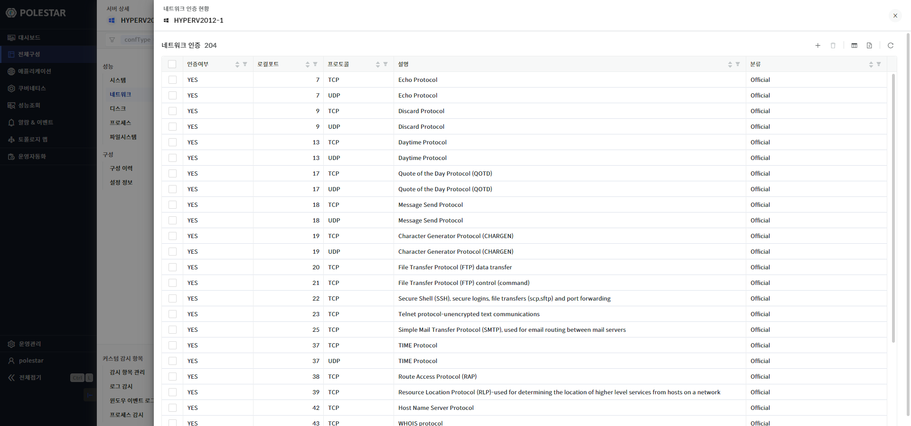

▶ \[그림26\] 네트워크 인증 현황

화면 지표

<table>
<thead>
<tr class="header">
<th>인증 여부</th>
<th>
포트의 인증 여부를 표시합니다.

YES: 인증 포트

NO: 미인증 포트
</th>
</tr>
</thead>
<tbody>
<tr class="odd">
<td>로컬 포트</td>
<td>출발지 포트를 표시합니다.</td>
</tr>
<tr class="even">
<td>프로토콜</td>
<td>
프로토콜 종류를 표시합니다.

프로토콜 종류: TCP, TCP4, TCP6, UDP, UDP4, UDP6
</td>
</tr>
<tr class="odd">
<td>설명</td>
<td>포트에 대한 설명을 표시합니다.</td>
</tr>
<tr class="even">
<td>분류</td>
<td>
포트 분류를 표시합니다.

Official: POLESTAR에 등록되어 있는 기본 포트

Unofficial: 사용자가 등록한 포트
</td>
</tr>
</tbody>
</table>

디스크

서버의 전체 디스크 성능 차트 및 개별 디스크 목록을 제공합니다. 디스크 목록을 펼치면 개별 디스크의 성능 차트를 조회할 수 있습니다.

개별 디스크는 최대 6시간 동안의 성능 데이터를 조회할 수 있습니다. 화면 우측 상단의 타임 셀렉터 기간을 6시간보다 길게 설정하더라도 개별 디스크 성능 데이터는 최대 6시간까지만 표시됩니다

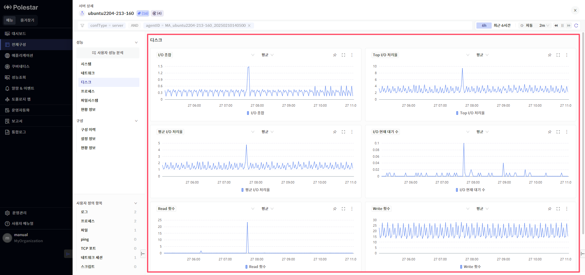

▶ \[그림27\] 전체 디스크

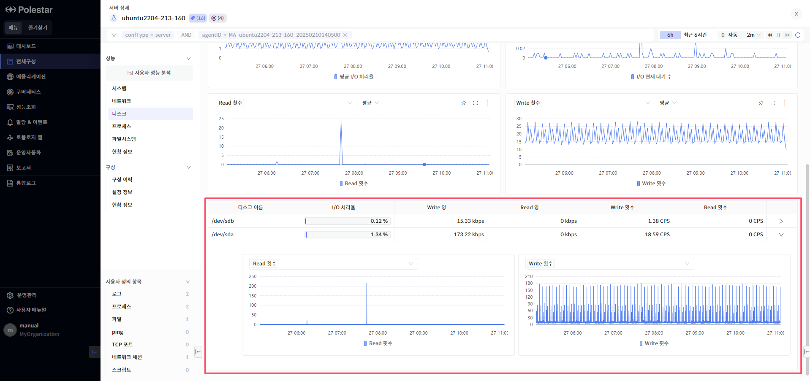

▶ \[그림28\] 개별 디스크

화면 지표

| 디스크 이름   | 디스크 이름을 표시합니다.          |
| -------- | ----------------------- |
| I/O 처리율  | I/O 처리율을 표시합니다.         |
| Write 양  | 디스크에 초당 쓴 양을 표시합니다.     |
| Read 양   | 디스크로부터 초당 읽은 양을 표시합니다.  |
| Write 횟수 | 디스크에 초당 쓴 횟수를 표시합니다.    |
| Read 횟수  | 디스크로부터 초당 읽은 횟수를 표시합니다. |

프로세스

서버의 전체 프로세스 성능 차트 및 개별 프로세스 목록을 제공합니다.

개별 프로세스는 최대 6시간 동안의 성능 데이터를 조회할 수 있습니다. 화면 우측 상단의 타임 셀렉터 기간을 6시간보다 길게 설정하더라도 개별 프로세스 성능 데이터는 최대 6시간까지만 표시됩니다.

전체 프로세스 성능 차트에서 특정 시점을 클릭하면 선택한 시점이 붉은색 라인으로 표시되고, 개별 프로세스 목록이 선택한 시점으로 갱신됩니다. 개별 프로세스 성능 데이터는 선택한 시점 전후 3시간 동안의 데이터가 표시됩니다. 데이터 보관 기한이 만료된 시점을 선택한 경우, 개별 프로세스 목록은 표시되지 않습니다. 개별 프로세스 목록 좌측 상단의 ‘새로고침’ 버튼을 클릭하여 개별 프로세스 목록을 초기화할 수 있습니다.

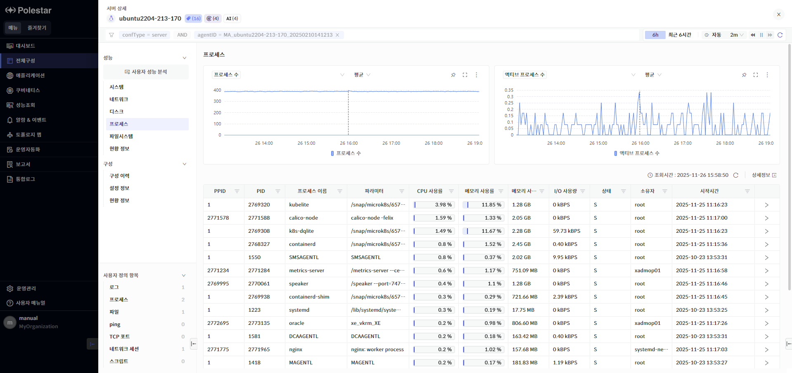

▶ \[그림29\] 프로세스

프로세스 상세

개별 프로세스 목록 우측 상단의 \[상세정보\] 버튼을 클릭하여 프로세스 상세 드로어로 이동할 수 있습니다. 프로세스 상세 드로어는 현재 실행중인 전체 프로세스의 CPU 사용률, 메모리 사용률, I/O 사용량 차트와 개별 프로세스 목록으로 구성되어 있습니다.

개별 프로세스 상단에 있는 필터에서는 ‘PPID’, ‘PID’, ‘프로세스 이름’, ‘소유자’로 프로세스를 필터링 할 수 있으며 필터링된 프로세스의 CPU 사용률, 메모리 사용률, I/O 사용량 차트가 상단 차트에 추가됩니다. 개별 프로세스 필터는 AND 조건 검색만 지원합니다.

이전 프로세스 화면에서 특정 시점을 선택한 경우, 프로세스 상세 화면의 성능 차트와 개별 프로세스 목록 또한 선택한 시점을 기준으로 표시됩니다. 프로세스 상세 화면에서 다른 시점을 선택할 수 있으나, 프로세스 상세 화면에서 선택한 시점이 이전 프로세스 화면에 적용되지는 않습니다.

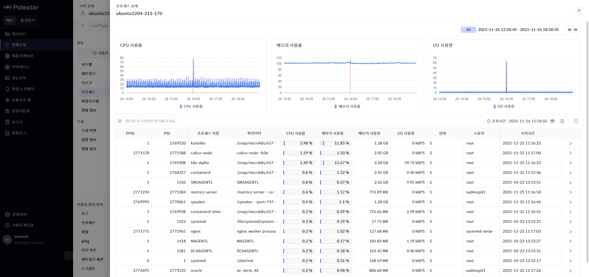

▶ \[그림30\] 프로세스 상세

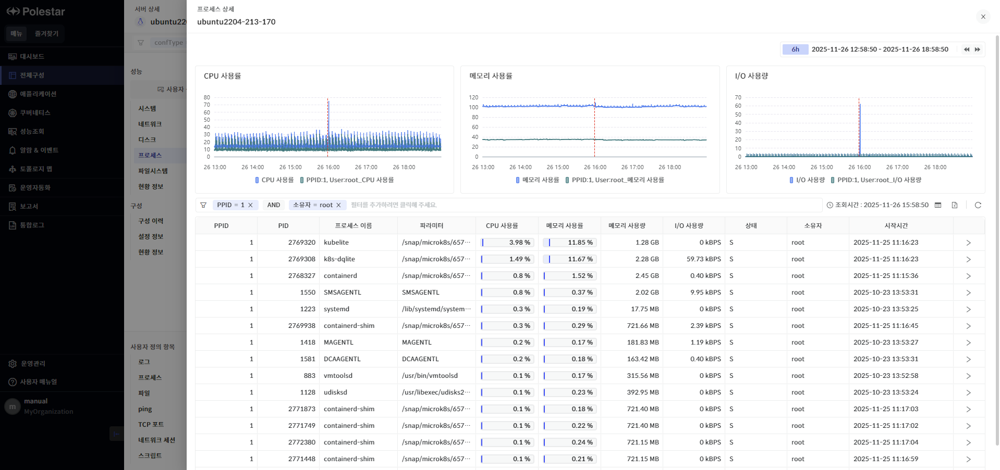

▶ \[그림31\] 프로세스 상세 – 필터

화면 지표

| PPID    | 프로세스의 PPID를 표시합니다                       |
| ------- | --------------------------------------- |
| PID     | 프로세스의 PID를 표시합니다.                       |
| 프로세스 이름 | 프로세스 이름을 표시합니다.                         |
| 파라미터    | 프로세스의 환경변수 정보를 표시합니다.                   |
| CPU 사용률 | 프로세스의 CPU 사용률을 표시합니다.                   |
| 메모리 사용률 | 프로세스의 메모리 사용률을 표시합니다.                   |
| 메모리 사용량 | 프로세스의 메모리 사용량을 표시합니다.                   |
| I/O 사용량 | 프로세스의 I/O 사용량을 표시합니다.                   |
| 상태      | 프로세스의 상태를 표시합니다. (LINUX/UNIX 서버인 경우 지원) |
| 소유자     | 프로세스의 소유자를 표시합니다.                       |
| 시작시간    | 프로세스 시작시간을 표시합니다.                       |

<table>
<tbody>
<tr class="odd">
<td>
노트

LINUX/UNIX 서버는 아래와 같이 프로세스 상태 정보를 제공합니다.

<table>
<thead>
<tr class="header">
<th>R</th>
<th>프로세스가 실행 가능한 상태 (툴팁: runnable)</th>
</tr>
</thead>
<tbody>
<tr class="odd">
<td>S</td>
<td>대기 상태 (툴팁: sleeping)</td>
</tr>
<tr class="even">
<td>T</td>
<td>일시 중단 상태 (툴팁: stopped)</td>
</tr>
<tr class="odd">
<td>Z</td>
<td>좀비 상태 (툴팁: runnable)</td>
</tr>
<tr class="even">
<td>A</td>
<td>활성 상태 (툴팁: active)</td>
</tr>
<tr class="odd">
<td>W</td>
<td>스왑된 상태 (툴팁: swapped)</td>
</tr>
<tr class="even">
<td>I</td>
<td>유휴 상태 (툴팁: idle)</td>
</tr>
<tr class="odd">
<td>?</td>
<td>그 밖의 모든 상태 (기타) (툴팁: etc)</td>
</tr>
</tbody>
</table></td>
</tr>
</tbody>
</table>

파일시스템

서버의 전체 파일시스템 성능 차트 및 개별 파일시스템 목록을 제공합니다. 개별 파일시스템 목록을 펼치면 개별 파일시스템의 성능 차트를 조회할 수 있습니다.

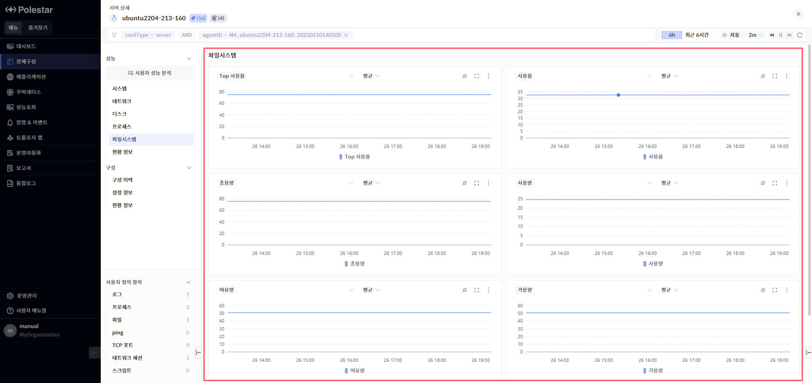

▶ \[그림32\] 전체 파일시스템

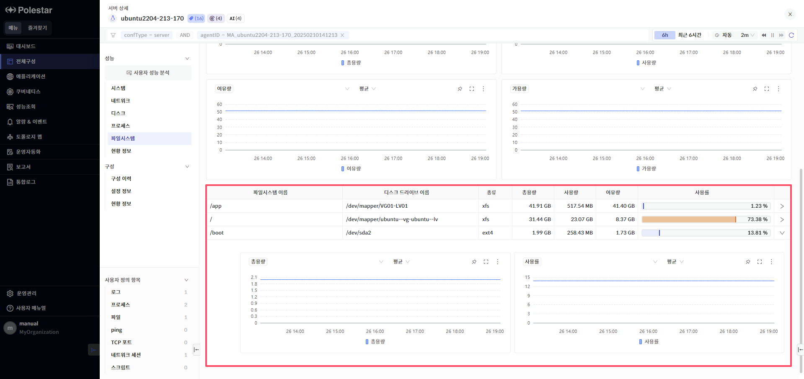

▶ \[그림33\] 개별 파일시스템

화면 지표

| 파일시스템 이름    | 파일시스템 이름을 표시합니다.               |
| ----------- | ------------------------------ |
| 디스크 드라이브 이름 | 파일시스템과 연계된 디스크 드라이브 이름을 표시합니다. |
| 종류          | 파일시스템 종류를 표시합니다.               |
| 총용량         | 파일시스템의 총용량을 표시합니다.             |
| 사용량         | 파일시스템이 사용 중인 용량을 표시합니다.        |
| 여유량         | 파일시스템의 사용 가능한 블록 사이즈를 표시합니다.   |
| 사용률         | 파일시스템이 사용 중인 용량의 백분율을 표시합니다.   |

GPU

LINUX 및 WINDOWS 서버에 NVIDIA GPU가 설치되어 있는 경우, 전체 GPU 성능 차트 및 개별 GPU 목록을 제공합니다. GPU 목록을 펼치면 개별 GPU의 성능 차트를 조회할 수 있습니다.

<table>
<tbody>
<tr class="odd">
<td>
노트

LINUX OS 서버는 GPU 수집을 지원하는 에이전트를 설치해야 GPU 관련 정보를 모니터링할 수 있습니다. 에이전트의 GPU 지원 여부는 NKIA의 유지보수 담당자에게 문의하시기 바랍니다.
</td>
</tr>
</tbody>
</table>

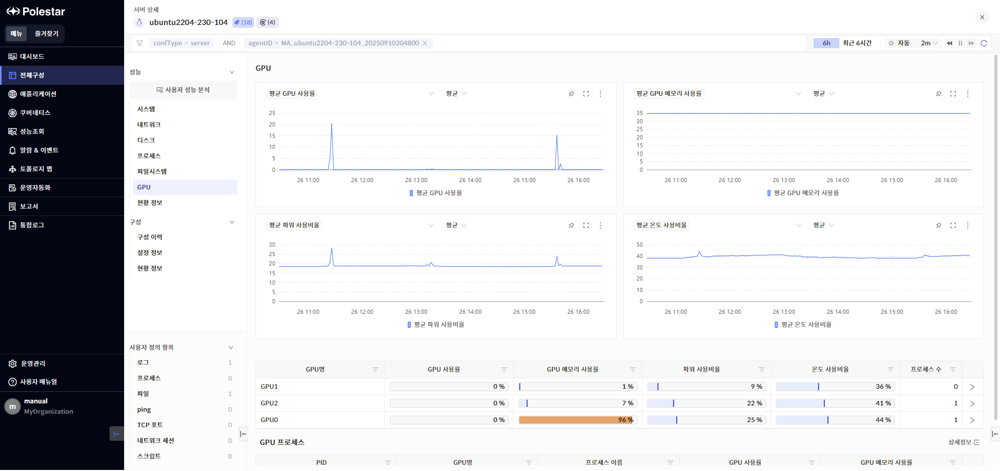

▶ \[그림34\] GPU

화면 지표

| GPU 이름      | GPU 카드의 이름을 표시합니다.                    |
| ----------- | ------------------------------------- |
| GPU 사용률     | GPU 사용률을 표시합니다.                       |
| GPU 메모리 사용률 | GPU 카드의 메모리 사용률을 표시합니다.               |
| 파워 사용비율     | GPU 카드의 파워 최대량 대비 현재 파워 사용 비율을 표시합니다. |
| 온도 사용비율     | GPU 카드의 최대 온도 대비 현재 온도 사용 비율을 표시합니다.  |
| 프로세스 수      | GPU 카드를 사용하는 프로세스 개수를 표시합니다.          |

GPU 프로세스는 GPU 사용률이 높은 순서대로 최대 20개의 GPU 프로세스 정보를 표시합니다. GPU 프로세스 목록을 펼치면 최대 6시간 동안의 GPU 성능 데이터와 PID가 동일한 프로세스의 성능 데이터를 조회할 수 있습니다. 화면 우측 상단의 타임 셀렉터 기간을 6시간보다 길게 설정하더라도 GPU 프로세스 성능 차트는 최대 6시간까지만 표시됩니다.

전체 또는 개별 GPU 성능 차트에서 특정 시점을 클릭하면 선택한 시점이 붉은색 라인으로 표시되고, GPU 프로세스 목록이 선택한 시점으로 갱신됩니다. GPU 프로세스 성능 데이터는 선택한 시점 전후 3시간 동안의 데이터가 표시됩니다. 데이터 보관 기한이 만료된 시점을 선택한 경우, GPU 프로세스 목록은 표시되지 않습니다. GPU 프로세스 목록 좌측 상단의 ‘새로고침’ 버튼을 클릭하여 GPU 프로세스 목록을 초기화할 수 있습니다.

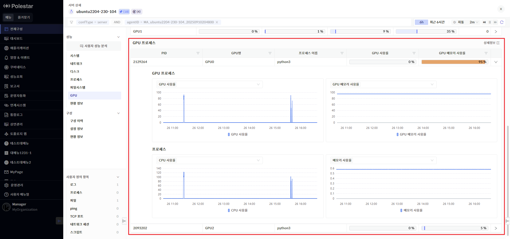

▶ \[그림35\] GPU 프로세스

GPU 프로세스 상세

GPU 프로세스 목록 우측 상단의 \[상세정보\] 버튼을 클릭하여 GPU 프로세스 상세 드로어로 이동할 수 있습니다. GPU 프로세스 상세 드로어는 현재 GPU에서 실행 중인 전체 프로세스의 GPU 사용률, GPU 메모리 사용률 차트와 GPU 프로세스 목록으로 구성되어 있습니다.

GPU 프로세스 목록 상단에 있는 필터에서는 ‘PID’, ‘GPU 이름’, ‘프로세스 이름’으로 프로세스를 필터링 할 수 있으며 필터링 된 프로세스의 GPU 사용률, GPU 메모리 사용률이 상단 차트에 추가됩니다. GPU 프로세스 필터는 AND 조건 검색만 지원합니다.

이전 GPU 화면에서 특정 시점을 선택한 경우, GPU 프로세스 상세 화면의 성능 차트와 GPU 프로세스 목록 또한 선택한 시점을 기준으로 표시됩니다. GPU 프로세스 상세 화면에서 다른 시점을 선택할 수 있으나, GPU 프로세스 상세 화면에서 선택한 시점이 이전 GPU 화면에 적용되지는 않습니다.

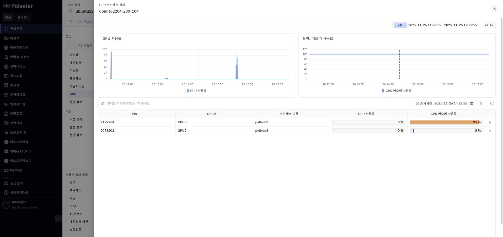

▶ \[그림36\] GPU 프로세스 상세

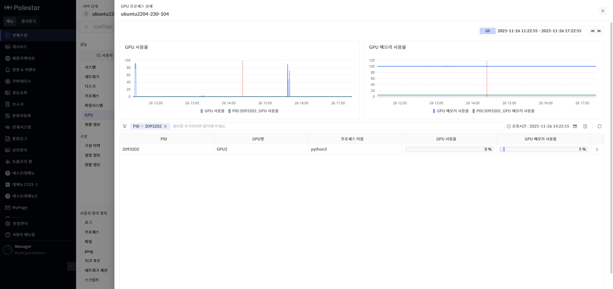

▶ \[그림37\] GPU 프로세스 상세 – 필터

화면 지표

| PID         | 프로세스의 PID를 표시합니다.         |
| ----------- | ------------------------- |
| GPU 이름      | GPU 카드의 이름을 표시합니다.        |
| 프로세스 이름     | 프로세스의 이름을 표시합니다.          |
| GPU 사용률     | 프로세스의 GPU 사용률을 표시합니다.     |
| GPU 메모리 사용률 | 프로세스의 GPU 메모리 사용률을 표시합니다. |

현황 정보

성능 현황 정보는 서버에서 수집하고 있는 성능 데이터의 현재값과 이력을 제공합니다. ‘리소스 타입’에서 CPU, DISK와 같은 성능 관리 지표 그룹을 선택하면 해당 리소스 타입에 속해 있는 성능 데이터의 현재값을 조회할 수 있습니다. 네트워크 인터페이스나 파일시스템처럼 서버에 다수의 개별 리소스가 있을 수 있는 경우, ‘리소스’에서 특정 항목을 선택할 수 있습니다.

성능 관리 지표의 데이터 타입에 따라 ‘지표 이름’ 컬럼에 아이콘이 표시됩니다. 가용성과 문자열 데이터 타입인 경우, 최신값을 클릭하여 데이터 변경 이력을 확인할 수 있습니다. 수치 데이터 타입은 통계 데이터 차트를 제공합니다.

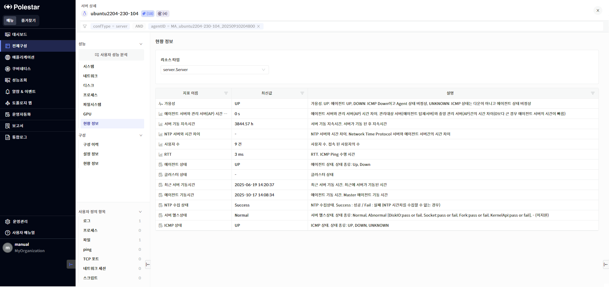

▶ \[그림38\] 현황 정보

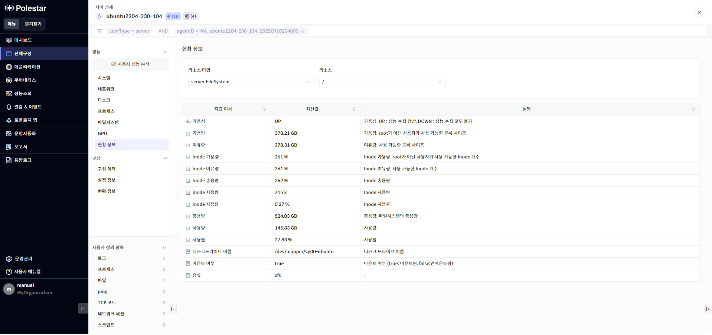

▶ \[그림39\] 현황 정보 – 개별 리소스

화면 지표

<table>
<thead>
<tr class="header">
<th>지표 이름</th>
<th>
성능 관리 지표의 이름을 표시합니다.

아이콘으로 데이터 타입을 분별할 수 있습니다.

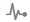: 가용성 지표

: 수치 데이터

: 문자열 데이터
</th>
</tr>
</thead>
<tbody>
<tr class="odd">
<td>최신값</td>
<td>
가장 최근에 수집한 성능 데이터를 표시합니다.

(수치 데이터 최신값: 최근 60분 이내 생성된 1분 통계 데이터)
</td>
</tr>
<tr class="even">
<td>설명</td>
<td>성능 관리 지표에 대한 설명을 표시합니다.</td>
</tr>
</tbody>
</table>

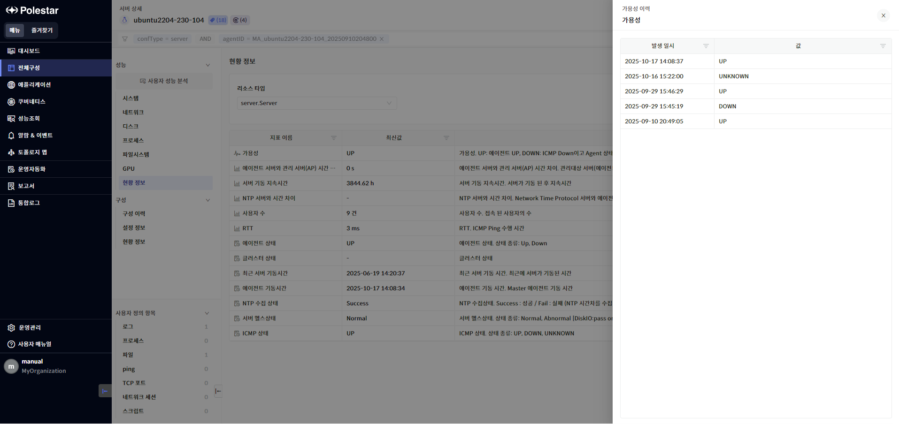

▶ \[그림40\] 현황 정보 – 가용성 이력

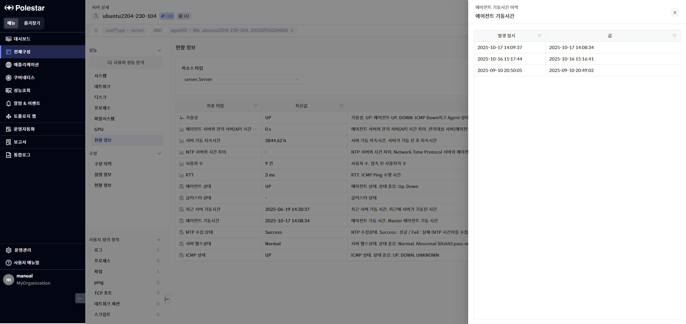

▶ \[그림41\] 현황 정보 – 문자열 이력

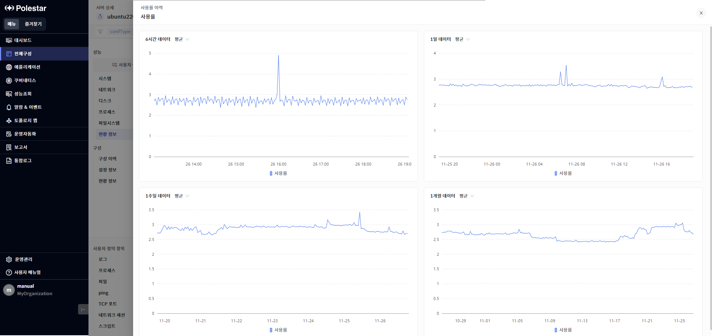

▶ \[그림42\] 현황 정보 – 통계 차트

구성 정보

서버의 관리 항목별 구성 정보를 조회할 수 있습니다. 기본적으로 구성 변경 현황 차트와 가장 최근에 수집한 구성 데이터 목록이 표시됩니다.

구성 변경 현황 차트는 화면 우측 상단의 타임 셀렉터 기간에 따라 구성 변경 건수를 조회합니다. 수집한 구성 정보가 기존 데이터와 다를 경우, 구성 변경 현황 차트에 변경 건수가 추가됩니다. 구성 변경 현황 차트를 클릭하여 구체적인 변경 시점을 선택하면 최신 데이터와 선택한 시점의 구성 이력 데이터를 대조할 수 있고, 변경된 항목만 화면에 표시되도록 필터링을 적용할 수 있습니다.

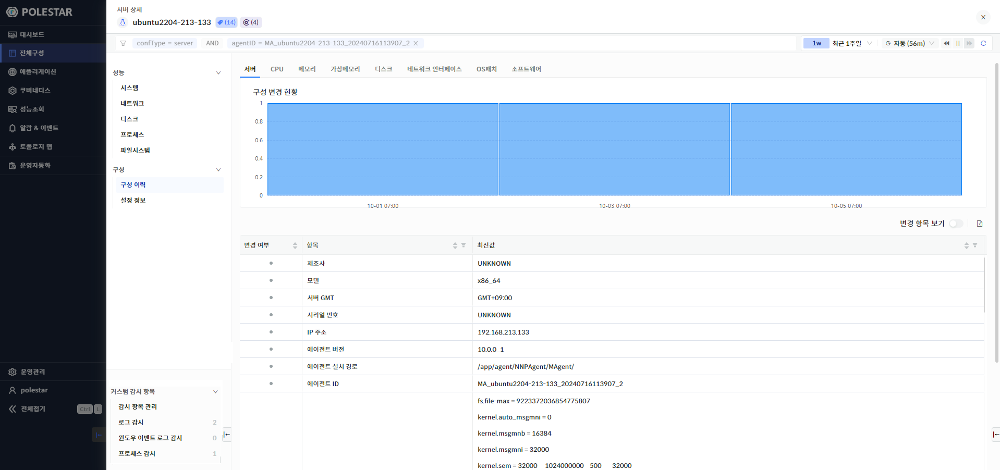

▶ \[그림43\] 구성 정보

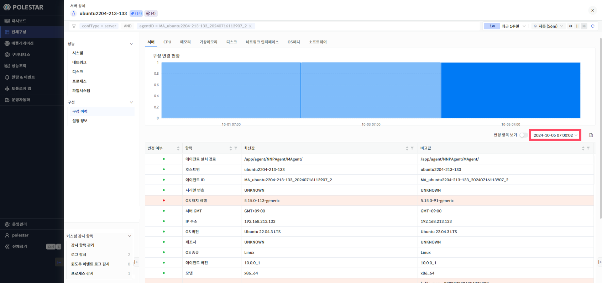

▶ \[그림44\] 구성 정보 - 이력 비교

설정 정보

설정 정보 메뉴에서 서버 장비의 기본 정보와 POLESTAR 정책, 권한, 리소스 담당자를 변경할 수 있습니다.

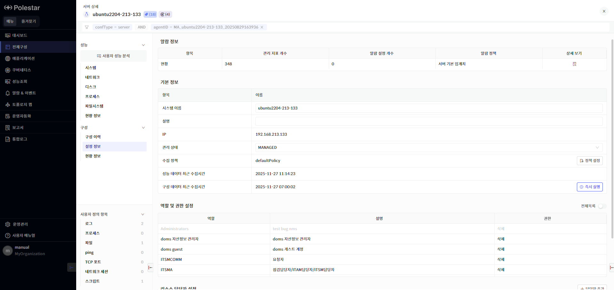

▶ \[그림45\] 설정 정보

알람 정보

서버에서 수집하는 관리 지표 개수와 현재 설정된 알람 개수 및 알람 정책 정보를 제공합니다. \[상세보기\]를 선택하여 알람 상세 드로어에서 알람 정책의 세부 알람 설정 목록을 확인할 수 있습니다.

<table>
<tbody>
<tr class="odd">
<td>
노트

세부 알람 설정은 [알람 &amp; 이벤트] 메뉴에서 변경할 수 있습니다. 자세한 내용은 ‘알람 상세’ 매뉴얼을 참고하시기 바랍니다.
</td>
</tr>
</tbody>
</table>

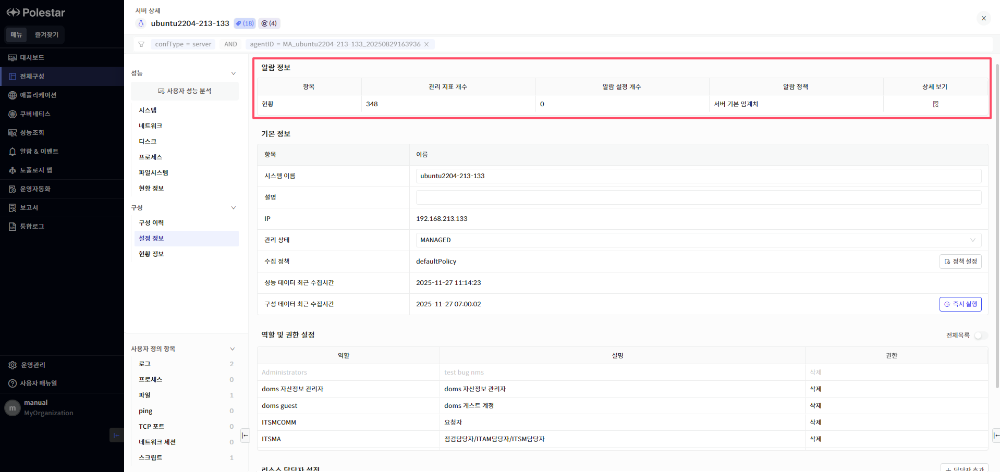

▶ \[그림46\] 알람 정보

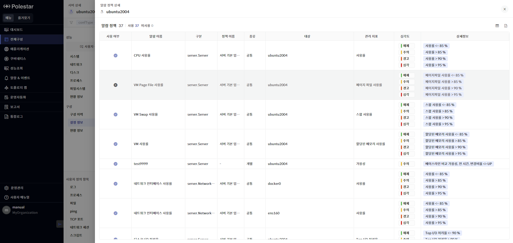

▶ \[그림47\] 알람 정보 - 알람 상세

화면 지표

| 관리 지표 개수 | POLESTAR에서 관리하는 성능 지표 개수를 표시합니다.         |
| -------- | ---------------------------------------- |
| 알람 설정 개수 | 서버에 설정된 알람 개수를 표시합니다.                    |
| 알람 정책    | 서버에 설정된 알람 정책을 표시합니다.                    |
| 상세 보기    | 알람 정책의 세부 알람 설정 목록을 확인할 수 있는 드로어를 호출합니다. |

기본 정보

서버의 기본 정보를 표시합니다. ‘시스템 이름’, ‘설명’, ‘관리 상태’ 항목은 변경할 수 있습니다.

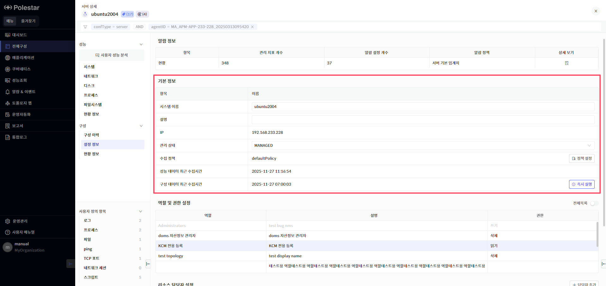

▶ \[그림48\] 기본 정보

화면 지표

<table>
<thead>
<tr class="header">
<th>시스템 이름</th>
<th>서버의 이름을 표시합니다. (변경할 수 있는 항목)</th>
</tr>
</thead>
<tbody>
<tr class="odd">
<td>설명</td>
<td>서버에 대한 설명을 표시합니다. (변경할 수 있는 항목)</td>
</tr>
<tr class="even">
<td>IP</td>
<td>서버의 IP주소를 표시합니다.</td>
</tr>
<tr class="odd">
<td>관리 상태</td>
<td>
서버의 관리 상태를 표시합니다. (변경할 수 있는 항목)

MANAGED: 관리 (성능 및 구성 데이터 수집)

UNMANAGED: 관리 안함 (성능 및 구성 데이터 수집 안함)
</td>
</tr>
<tr class="even">
<td>수집 정책</td>
<td>서버에 설정된 데이터 수집 정책 이름을 표시합니다.</td>
</tr>
<tr class="odd">
<td>
성능 데이터

최근 수집 시간
</td>
<td>
가장 최근에 수집한 서버의 성능 데이터 시점을 표시합니다.

(성능 데이터 조회 대상: server.Server)
</td>
</tr>
<tr class="even">
<td>
구성 데이터

최근 수집 시간
</td>
<td>
가장 최근에 수집한 서버의 구성 데이터 시점을 표시합니다.

(구성 데이터 조회 대상: server.Server)
</td>
</tr>
</tbody>
</table>

정책 설정

기본 정보 목록에서 \[정책 설정\] 버튼은 클릭하여 서버에 설정된 데이터 수집 정책의 세부 설정을 목록을 조회할 수 있고, 설정을 변경하거나 변경된 설정을 수집 정책의 기본값으로 초기화할 수 있습니다.

<table>
<tbody>
<tr class="odd">
<td>
노트

데이터 수집 정책 설정 방법은 ‘데이터수집설정’ 매뉴얼을 참고하시기 바랍니다.
</td>
</tr>
</tbody>
</table>

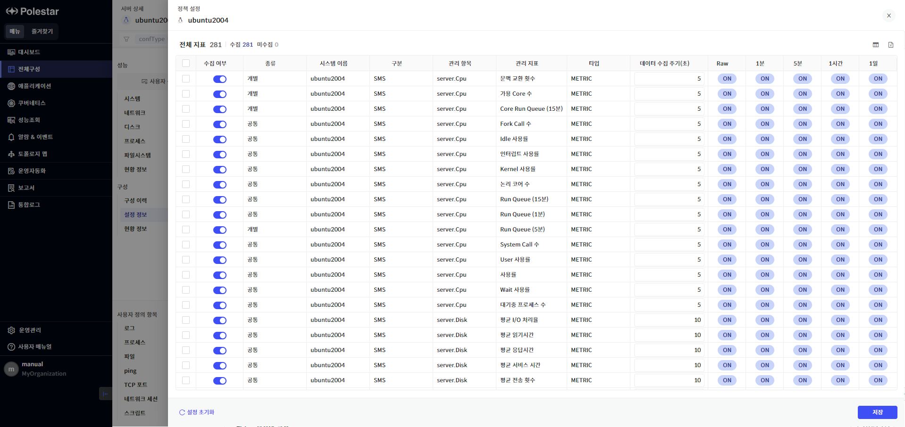

▶ \[그림49\] 기본 정보 - 정책 설정

화면 지표

<table>
<thead>
<tr class="header">
<th>수집 여부</th>
<th>
지표별 성능 데이터 수집 여부를 설정합니다.

기본적으로 POLESTAR에서 지원하는 모든 지표를 수집하도록 설정되어 있으며, 수집 여부 변경 시 해당 지표는 더 이상 POLESTAR에서 처리하지 않습니다.

 : 수집 지표

 : 미수집 지표
</th>
</tr>
</thead>
<tbody>
<tr class="odd">
<td>종류</td>
<td>
지표 설정 종류를 표시합니다. 기본값은 ‘공통’이며, 세부 설정을 변경한 경우 ‘개별’로 표시됩니다.

공통: 공통 설정. 관리지표 공통 설정의 지표 설정을 동일하게 사용하는 경우

개별: 개별 설정. 관리지표 공통 설정의 지표 설정을 변경해서 사용하는 경우
</td>
</tr>
<tr class="even">
<td>시스템 이름</td>
<td>서버의 이름을 표시합니다.</td>
</tr>
<tr class="odd">
<td>구분</td>
<td>POLESTAR에서 관제하는 제품군을 표시합니다.</td>
</tr>
<tr class="even">
<td>관리 항목</td>
<td>지표 그룹을 표시합니다.</td>
</tr>
<tr class="odd">
<td>관리 지표</td>
<td>지표 이름을 표시합니다.</td>
</tr>
<tr class="even">
<td>타입</td>
<td>
지표의 데이터 타입을 표시합니다.

AVAILABILITY: 가용성 데이터

TRAIT: 문자열 데이터

METRIC: 수치 데이터

TABULAR: 목록형 데이터
</td>
</tr>
<tr class="odd">
<td>데이터 수집 주기</td>
<td>
지표별 데이터 수집 주기를 표시합니다.

모든 지표는 기본 60초 주기로 설정되어 있습니다. 데이터 수집 주기는 관리 항목별로 공통 적용되기 때문에 특정 지표의 데이터 수집 주기를 변경하면 해당 지표와 관리 항목이 동일한 모든 지표의 데이터 수집 주기가 일괄 업데이트 됩니다.
</td>
</tr>
</tbody>
</table>

즉시 실행

기본 정보 목록에서 \[즉시 실행\] 버튼을 클릭하여 서버의 구성 정보를 즉시 수집할 수 있습니다.

서버는 1일 1회 구성 데이터를 수집합니다. 만약 구성 데이터 갱신이 필요한 경우, \[즉시 실행\] 기능을 통해 수동으로 구성 데이터 수집을 실행할 수 있습니다.

<table>
<tbody>
<tr class="odd">
<td>
주의

구성 데이터 즉시 수집을 실행하면 [즉시 실행] 버튼은 ‘설정 정보’ 화면에 다시 접속할 때까지 비활성화 상태로 표시됩니다.

구성 데이터 즉시 수집 기능을 연속적으로 실행하면 에이전트에 부하가 발생할 수 있습니다. 에이전트는 마지막 구성 데이터 수집 시점으로부터 최소 5분이 경과해야 다시 구성 데이터를 수집하도록 내부적으로 부하 방지 설정이 적용되어 있습니다.
</td>
</tr>
</tbody>
</table>

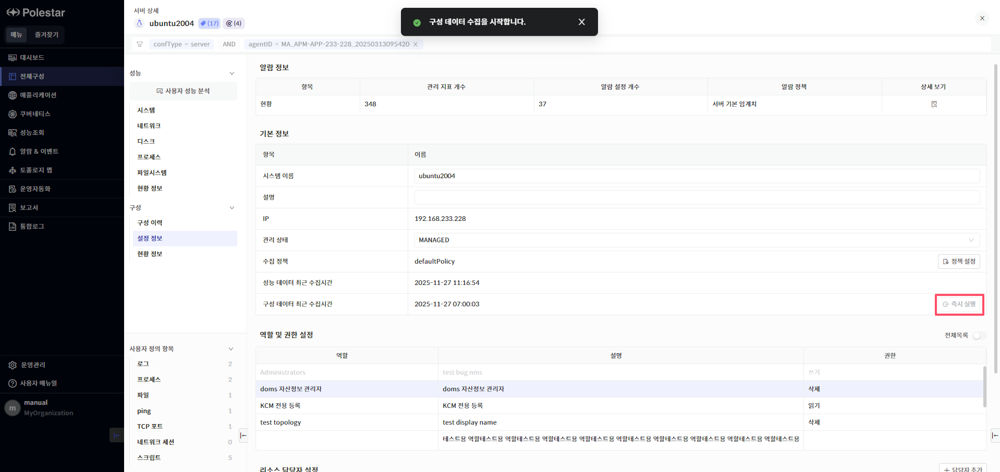

▶ \[그림50\] 기본 정보 - 즉시 실행

역할 및 권한 설정

서버에 대한 접근 권한을 조회하고 변경할 수 있습니다. Administrators 역할은 모든 장비에 기본으로 포함되어 있으며 해제할 수 없습니다.

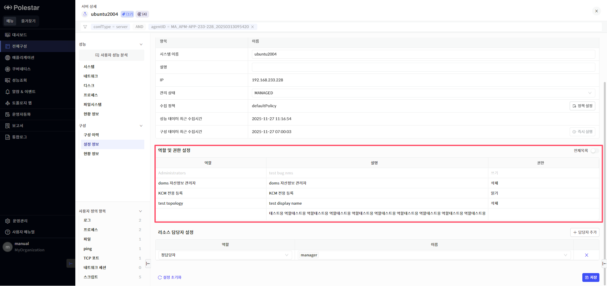

▶ \[그림51\] 역할 및 권한 설정

리소스 담당자 설정

서버의 담당자를 설정할 수 있습니다.

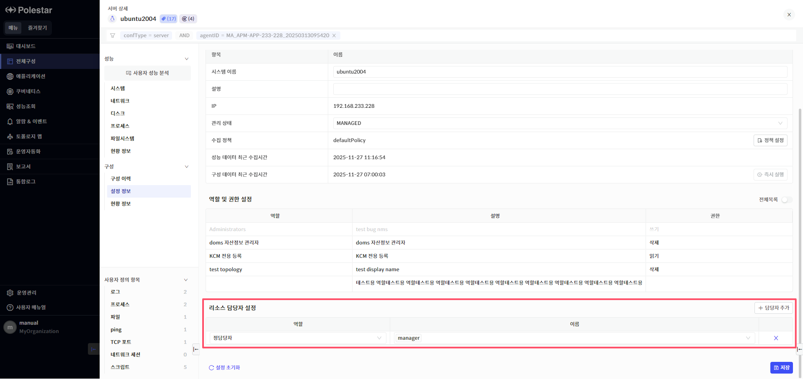

▶ \[그림52\] 리소스 담당자 설정

설정 초기화

설정 정보 화면 하단의 \[설정 초기화\] 버튼을 클릭하여 설정 정보 화면에서 변경했으나 아직 저장은 하지 않은 모든 입력값을 처음 조회 상태로 되돌릴 수 있습니다.

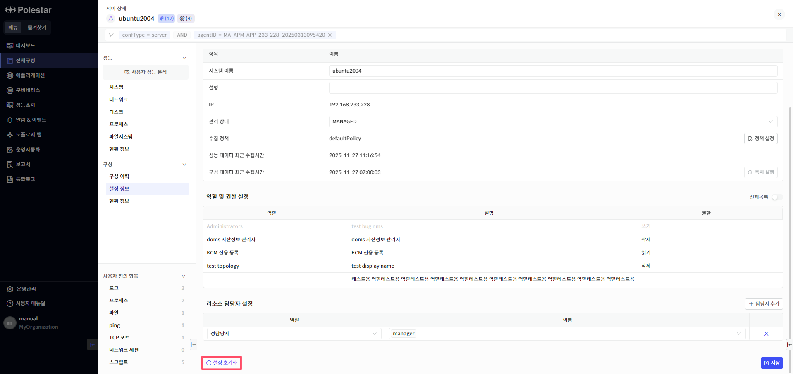

▶ \[그림53\] 설정 초기화

현황 정보

구성 현황 정보 화면에서는 현재 시점의 서버 주요 구성 정보를 제공합니다. 종합, 파일시스템, 디스크, 네트워크 인터페이스, 소프트웨어 구성 정보를 확인할 수 있으며, 서버에 따라 OS패치, GPU, HBA 정보를 지원합니다.

종합

서버의 현재 주요 구성 정보(시스템 정보, CPU 정보, 메모리 정보, 디스크 정보, 네트워크 인터페이스 정보, 파일시스템 정보, 소프트웨어 정보)와 에이전트 정보를 확인할 수 있습니다.

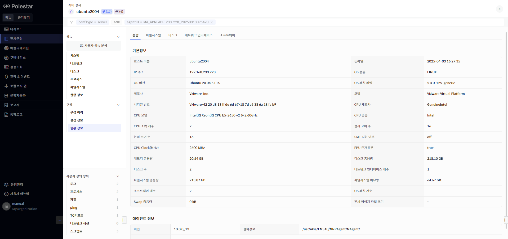

▶ \[그림54\] 종합

기본정보 지표

<table>
<thead>
<tr class="header">
<th>호스트 이름</th>
<th>서버의 호스트명을 표시합니다.</th>
</tr>
</thead>
<tbody>
<tr class="odd">
<td>등록일</td>
<td>서버 등록일을 표시합니다.</td>
</tr>
<tr class="even">
<td>IP 주소</td>
<td>
서버의 IP를 표시합니다.

IP는 에이전트에서 AP서버로 연결된 후 그 연결세션의 서버 IP정보입니다.
</td>
</tr>
<tr class="odd">
<td>OS 종류</td>
<td>
서버 운영체제 종류를 표시합니다.

POLESTAR는 WINDOWS, LINUX, UNIX, AIX, HPUX, SUNOS를 지원합니다.
</td>
</tr>
<tr class="even">
<td>OS 버전</td>
<td>서버 운영체제의 버전 정보를 표시합니다.</td>
</tr>
<tr class="odd">
<td>OS 패치 레벨</td>
<td>서버 운영체제의 패치 레벨을 표시합니다.</td>
</tr>
<tr class="even">
<td>제조사</td>
<td>서버 장비의 제조사 정보를 표시합니다.</td>
</tr>
<tr class="odd">
<td>모델</td>
<td>서버 모델 정보를 표시합니다.</td>
</tr>
<tr class="even">
<td>시리얼 번호</td>
<td>서버의 시리얼 번호를 표시합니다.</td>
</tr>
<tr class="odd">
<td>CPU 제조사</td>
<td>CPU 제조사 정보를 표시합니다.</td>
</tr>
<tr class="even">
<td>CPU 모델</td>
<td>CPU 모델 정보를 표시합니다.</td>
</tr>
<tr class="odd">
<td>CPU 종류</td>
<td>CPU 종류를 표시합니다.</td>
</tr>
<tr class="even">
<td>CPU 소켓 개수</td>
<td>CPU 소켓(혹은 슬롯)개수를 표시합니다. (=물리적 CPU 개수)</td>
</tr>
<tr class="odd">
<td>물리 코어 수</td>
<td>물리적 CPU 코어 개수를 표시합니다.</td>
</tr>
<tr class="even">
<td>논리 코어 수</td>
<td>논리적CPU 코어 개수를 표시합니다.</td>
</tr>
<tr class="odd">
<td>SMT 지원여부</td>
<td>
CPU 종류가 IBM이면 SMT, 인텔이면 Hyper-Threading 지원 여부를 표시합니다.

표시 정보: on 또는 off
</td>
</tr>
<tr class="even">
<td>CPU Clock</td>
<td>
CPU Clock 정보를 표시합니다.

단위: MHz
</td>
</tr>
<tr class="odd">
<td>FPU 존재유무</td>
<td>
부동소수점 연산을 위한 co-processor 타입 존재 유무를 표시합니다.

표시 정보: true 또는 false
</td>
</tr>
<tr class="even">
<td>메모리 총용량</td>
<td>
물리적 메모리 총용량을 표시합니다.

단위: kB
</td>
</tr>
<tr class="odd">
<td>디스크 총용량</td>
<td>
디스크 총용량을 표시합니다.

단위: MB
</td>
</tr>
<tr class="even">
<td>디스크 수</td>
<td>디스크 개수를 표시합니다.</td>
</tr>
<tr class="odd">
<td>네트워크 인터페이스 수</td>
<td>네트워크 인터페이스 개수를 표시합니다. IP가 할당된 인터페이스 개수입니다.</td>
</tr>
<tr class="even">
<td>파일시스템 총용량</td>
<td>
파일시스템 총용량을 표시합니다.

단위: kB
</td>
</tr>
<tr class="odd">
<td>파일시스템 여유량</td>
<td>
파일시스템 여유량을 표시합니다.

단위: kB
</td>
</tr>
<tr class="even">
<td>소프트웨어 개수</td>
<td>
소프트웨어 개수를 표시합니다.

LINUX/UNIX 서버는 [운영자동화 &gt; 소프트웨어 관리 &gt; 소프트웨어 현황] 목록에서 수집한 소프트웨어 개수가 표시됩니다.
</td>
</tr>
<tr class="odd">
<td>OS 패치 개수</td>
<td>WINDOWS 서버의 OS 패치 개수를 표시합니다.</td>
</tr>
<tr class="even">
<td>Swap 총용량</td>
<td>
LINUX/UNIX 서버의 Swap 공간 총용량을 표시합니다.

단위: KB
</td>
</tr>
<tr class="odd">
<td>전체 페이지 파일 크기</td>
<td>
WINDOWS 서버의 전체 페이지 파일 크기를 표시합니다.

단위: kB
</td>
</tr>
</tbody>
</table>

에이전트 정보 지표

| 버전   | 서버에 설치된 에이전트 버전 정보를 표시합니다. |
| ---- | -------------------------- |
| 설치경로 | 에이전트 설치 경로를 표시합니다.         |
| ID   | 에이전트 ID를 표시합니다.            |

파일시스템

서버의 파일시스템 현황 정보를 제공합니다.

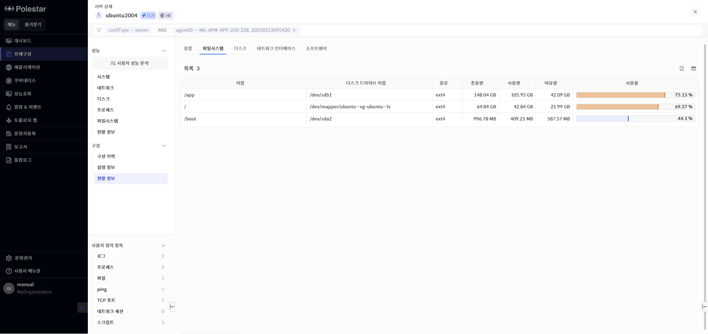

▶ \[그림55\] 파일시스템

화면 지표

<table>
<thead>
<tr class="header">
<th>이름</th>
<th>파일시스템 이름을 표시합니다.</th>
</tr>
</thead>
<tbody>
<tr class="odd">
<td>디스크 드라이브 이름</td>
<td>파일시스템과 연계된 디스크 드라이브 이름을 표시합니다.</td>
</tr>
<tr class="even">
<td>종류</td>
<td>파일시스템 종류를 표시합니다.</td>
</tr>
<tr class="odd">
<td>총용량</td>
<td>
파일시스템의 총용량을 표시합니다.

단위: kB
</td>
</tr>
<tr class="even">
<td>사용량</td>
<td>
파일시스템이 사용 중인 용량을 표시합니다.

단위: kB
</td>
</tr>
<tr class="odd">
<td>여유량</td>
<td>
파일시스템의 사용 가능한 블록 사이즈를 표시합니다.

단위: kB
</td>
</tr>
<tr class="even">
<td>사용률</td>
<td>
파일시스템이 사용 중인 용량의 백분율을 표시합니다.

단위: %
</td>
</tr>
</tbody>
</table>

디스크

서버의 디스크 현황 정보를 제공합니다.

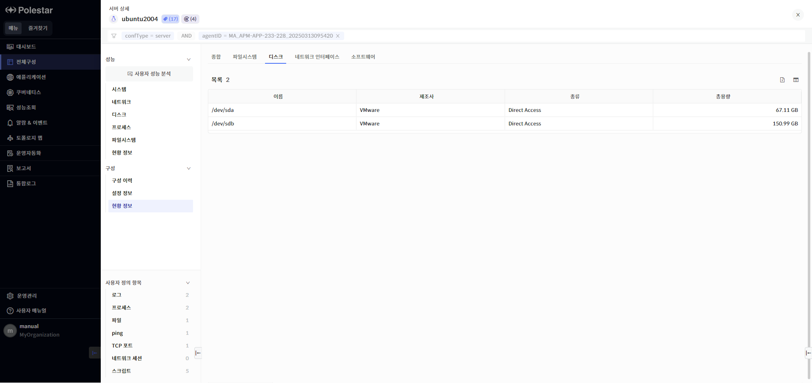

▶ \[그림56\] 디스크

화면 지표

<table>
<thead>
<tr class="header">
<th>이름</th>
<th>디스크 이름을 표시합니다.</th>
</tr>
</thead>
<tbody>
<tr class="odd">
<td>제조사</td>
<td>디스크 제조사 정보를 표시합니다.</td>
</tr>
<tr class="even">
<td>종류</td>
<td>디스크 종류를 표시합니다.</td>
</tr>
<tr class="odd">
<td>총용량</td>
<td>
디스크 총용량을 표시합니다.

단위: MB
</td>
</tr>
</tbody>
</table>

네트워크 인터페이스

서버의 네트워크 인터페이스 현황 정보를 제공합니다.

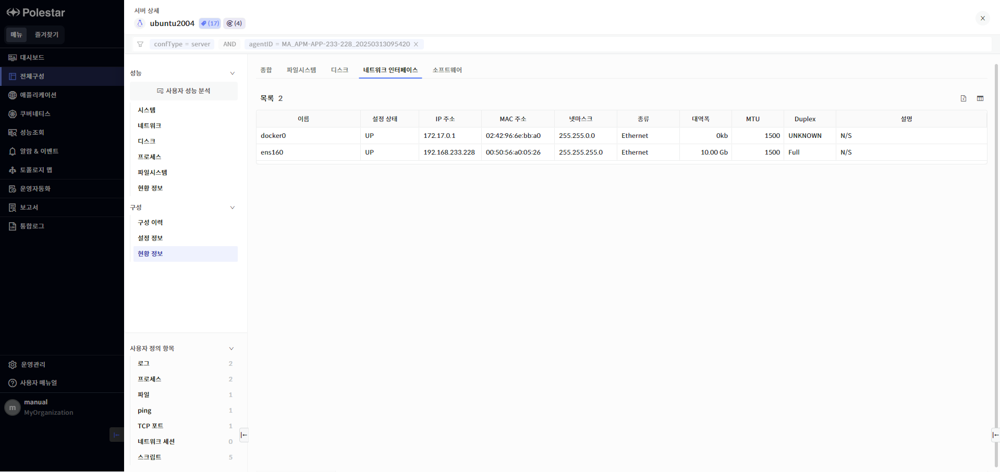

▶ \[그림57\] 네트워크 인터페이스

화면 지표

<table>
<thead>
<tr class="header">
<th>이름</th>
<th>네트워크 인터페이스 이름을 표시합니다.</th>
</tr>
</thead>
<tbody>
<tr class="odd">
<td>설정 상태</td>
<td>
네트워크 인터페이스 설정 상태를 표시합니다.

표시 정보: UP 또는 DOWN
</td>
</tr>
<tr class="even">
<td>IP주소</td>
<td>네트워크 인터페이스에 할당된 IP 주소를 표시합니다.</td>
</tr>
<tr class="odd">
<td>MAC주소</td>
<td>네트워크 인터페이스의 MAC 주소를 표시합니다.</td>
</tr>
<tr class="even">
<td>넷마스크</td>
<td>경유지로 가기 위해 설정한 넷마스크 정보를 표시합니다.</td>
</tr>
<tr class="odd">
<td>종류</td>
<td>네트워크 인터페이스 종류를 표시합니다.</td>
</tr>
<tr class="even">
<td>대역폭</td>
<td>네트워크 인터페이스 대역폭 정보를 표시합니다.</td>
</tr>
<tr class="odd">
<td>MTU</td>
<td>Maximum Transmission Unit(최대 전송 단위)을 표시합니다.</td>
</tr>
<tr class="even">
<td>Duplex</td>
<td>전이중(FullDuplex)/반이중(HalfDuplex) 통신 설정 상태를 표시합니다.</td>
</tr>
<tr class="odd">
<td>설명</td>
<td>네트워크 인터페이스에 등록된 설명 정보를 표시합니다.</td>
</tr>
</tbody>
</table>

소프트웨어

서버의 소프트웨어 현황 정보를 제공합니다. LINUX/UNIX 서버의 소프트웨어 현황 정보는 \[운영자동화 \> 소프트웨어 관리 \> 소프트웨어 현황\] 목록에서 더 자세한 정보를 확인할 수 있습니다.

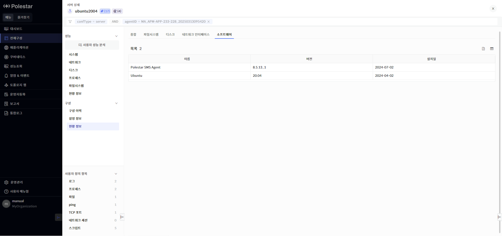

▶ \[그림58\] 소프트웨어

화면 지표

| 이름   | 소프트웨어 이름을 표시합니다.    |
| ---- | ------------------- |
| 버전   | 소프트웨어 버전 정보를 표시합니다. |
| 설치일자 | 소프트웨어 설치일자를 표시합니다.  |

OS패치

WINDOWS 서버의 OS패치 현황 정보를 제공합니다.

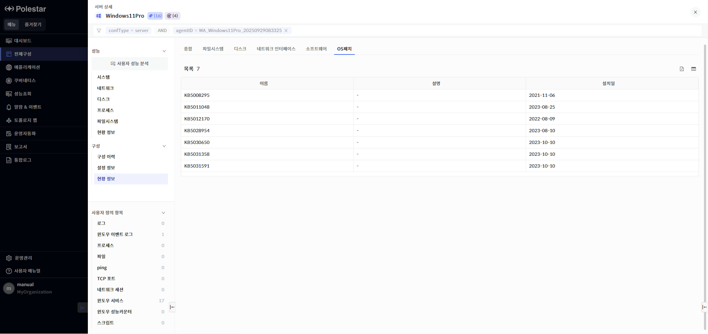

▶ \[그림59\] OS패치

화면 지표

| 이름   | OS패치 이름을 표시합니다.    |
| ---- | ------------------ |
| 설명   | OS패치 설명 정보를 표시합니다. |
| 설치일자 | OS패치 설치일자를 표시합니다.  |

GPU

GPU를 지원하는 서버의 경우, GPU 현황 정보를 제공합니다.

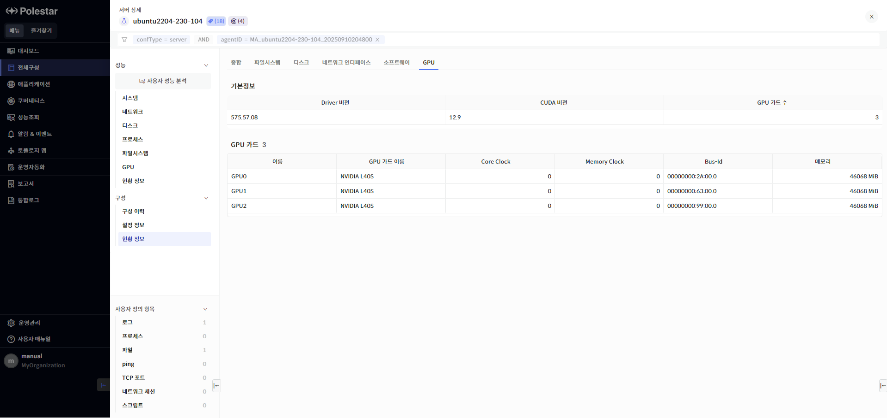

▶ \[그림60\] GPU

기본 정보 지표

| Driver 버전 | GPU Driver 정보를 표시합니다. |
| --------- | --------------------- |
| CUDA 버전   | GPU CUDA 정보를 표시합니다.   |
| GPU 카드 수  | GPU 카드 수를 표시합니다.      |

GPU 카드 지표

<table>
<thead>
<tr class="header">
<th>이름</th>
<th>GPU 이름을 표시합니다.</th>
</tr>
</thead>
<tbody>
<tr class="odd">
<td>GPU 카드 이름</td>
<td>GPU 카드 이름을 표시합니다.</td>
</tr>
<tr class="even">
<td>Core Clock</td>
<td>
GPU 카드의 Core Clock 정보를 표시합니다.

단위: MHz
</td>
</tr>
<tr class="odd">
<td>Memory Clock</td>
<td>
GPU 카드의 Memory Clock 정보를 표시합니다.

단위: MHz
</td>
</tr>
<tr class="even">
<td>Bus-Id</td>
<td>GPU 카드의 Bus-ID 정보를 표시합니다.</td>
</tr>
<tr class="odd">
<td>메모리</td>
<td>
GPU카드의 메모리 크기를 표시합니다.

단위: MiB
</td>
</tr>
</tbody>
</table>

HBA

HBA를 지원하는 서버의 경우, HBA 현황 정보를 제공합니다.

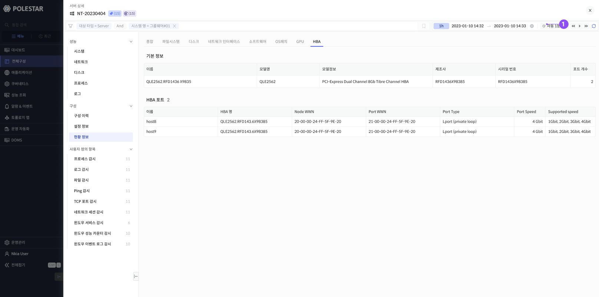

▶ \[그림61\] HBA

기본 정보 지표

| 이름     | HBA 이름을 표시합니다.     |
| ------ | ------------------ |
| 모델     | HBA 모델 이름을 표시합니다.  |
| 모델 정보  | HBA 모델 정보를 표시합니다.  |
| 제조사    | HBA 제조사 정보를 표시합니다. |
| 시리얼 번호 | HBA 시리얼 번호를 표시합니다. |
| 포트 개수  | HBA의 포트 개수를 표시합니다. |

HBA 포트 지표

| 이름              | HBA 포트 이름을 표시합니다.                                      |
| --------------- | ------------------------------------------------------ |
| HBA이름           | HBA 이름을 표시합니다.                                         |
| Node WWN        | Port WWN과 연결된 파이버 채널 노드를 고유하게 식별하는 64비트 WWN 정보를 표시합니다. |
| Port WWN        | PortWWN 파이버 채널 포트를 고유하게 식별하는 64비트 WWN 정보를 표시합니다.       |
| Port Type       | HBA 포트 종류를 표시합니다.                                      |
| Port Speed      | 현재 작동 중인 신호비트 전송률을 표시합니다.                              |
| Supported Speed | 지원가능한 신호비트 전송률을 표시합니다.                                 |

