알람 상세 내용

알람 목록에서 \[알람 이름\]을 클릭하면 알람 상세 정보가 표시됩니다. 상세에서는 알람이 발생된 구성정보 및 처리현황 정보를 확인할 수 있습니다. 또한, 해당 알람 정의로 발생된 알람 목록을 조회할 수 있으며 알람이 발생된 조건인 컨디션 로그 상세 내용을 확인할 수 있습니다. 알람 정의에 설정된 통보 설정으로 알람이 통보된 사용자 정보를 확인할 수 있습니다. 우측 패널에는 알람이 발생된 시스템의 알람 이력이 조회되어 연관된 알람이 있는지 확인할 수 있습니다.

화면 상단에 알람 심각도, 구성 정보, 알람 메시지 정보가 표시됩니다. 처리 현황을 확인하고 알람 상태를 업데이트 할 수 있습니다.

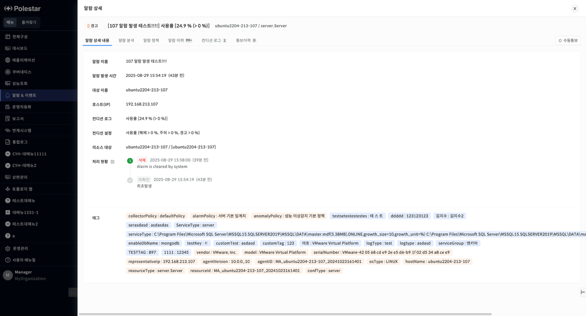

▶ \[그림1\] 알람 상세 내용

화면 지표

| 알람 이름    | 알람 정책의 이름입니다.              |
| -------- | -------------------------- |
| 알람 발생 시간 | 알람이 발생된 시간입니다.             |
| 대상이름     | 알람이 발생된 구성의 이름입니다.         |
| 호스트(IP)  | 알람이 발생된 구성의 호스트명 또는 IP입니다. |
| 컨디션 로그   | 알람 메시지입니다.                 |
| 컨디션 설정   | 알람 정의에 설정된 알람 발생 조건입니다.    |
| 리소스 대상   | 알람이 발생된 구성의 이름입니다..        |
| 처리 현황    | 알람의 현재 상태 및 처리 현황입니다.      |
| 태그       | 알람이 발생된 구성의 태그 정보입니다.      |

알람 처리 상태 수정

처리 현황 옆에 있는 편집 아이콘(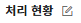)을 클릭하면 새로운 처리 현황을 등록할 수 있는 창이 표시됩니다.

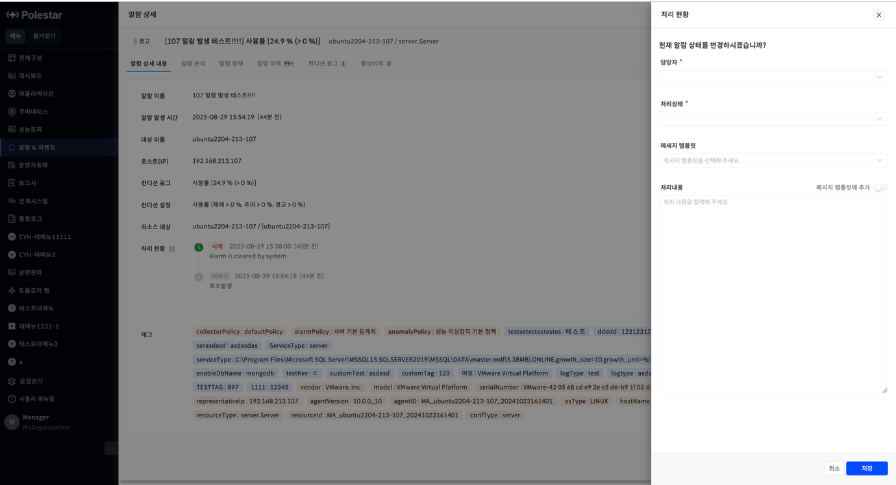

▶ \[그림2\] 알람 처리 현황 수정

화면 지표

<table>
<thead>
<tr class="header">
<th>담당자</th>
<th>사용자 목록에서 담당자로 지정할 사용자를 선택합니다..</th>
</tr>
</thead>
<tbody>
<tr class="odd">
<td>처리상태</td>
<td>
알람의 상태를 지정합니다.

미확인

확인

처리중

완료

삭제
</td>
</tr>
<tr class="even">
<td>메시지 템플릿</td>
<td>사전에 등록된 메시지 목록입니다.</td>
</tr>
<tr class="odd">
<td>처리내용</td>
<td>알람 상태와 관련된 메시지를 입력합니다.</td>
</tr>
<tr class="even">
<td>메시지 템플릿 추가 버튼</td>
<td>
선택하고 저장하면 현재 입력된 메시지가 메시지 템플릿으로 등록됩니다.

사용자는 메시지 입력 시 자주 사용되는 메시지를 메시지 템플릿으로 등록하여 사용할 수 있습니다.
</td>
</tr>
<tr class="odd">
<td>취소 버튼</td>
<td>입력을 취소하고 팝업 창을 닫습니다.</td>
</tr>
<tr class="even">
<td>저장 버튼</td>
<td>입력된 내용을 저장합니다.</td>
</tr>
</tbody>
</table>

알람 분석

알람&이벤트 \> 알람 현황 \> 알람 목록의 \[알람 이름\] 혹은 우측 알람 패널에서 특정 알람을 선택하면 알람 상세 Drawer 가 열리며, 알람 분석 탭에 접속하여 알람에 대한 분석 데이터를 확인할 수 있습니다.

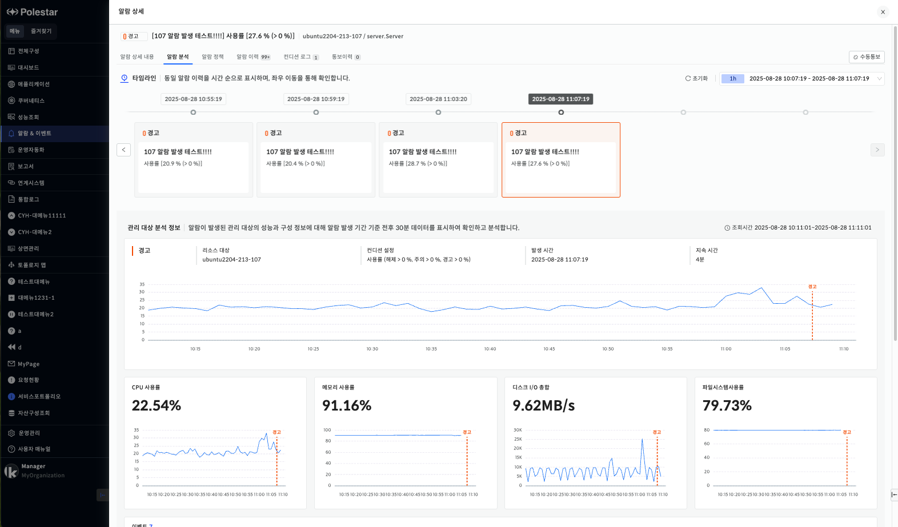

▶ \[그림3\] 알람 분석

타임라인

우측 타임셀렉터의 시간 범위에 해당하는 알람 이력을 확인할 수 있으며, 기본 시간 범위는 선택한 알람 발생 전후 30분(총 1시간)입니다. (시간 범위 수정 가능)

가장 최근에 발생한 알람 이력이 기본으로 선택되며, 초기화 버튼 클릭 시에도 동일하게 적용됩니다.

<table>
<tbody>
<tr class="odd">
<td>
노트

선택한 알람 발생 시간이 현재 시간과 30분 미만으로 차이나는 경우, 시간 범위는 (현재 시간-1) 시 ~ 현재 시간으로 설정됩니다.

예: 현재 시간: 2025-08-21 11:10:21, 알람 발생 시간: 2025-08-21 11:30:22 경우, 시간 범위: 2025-08-21 10:40:21 ~ 2025-08-21 11:40:21
</td>
</tr>
</tbody>
</table>

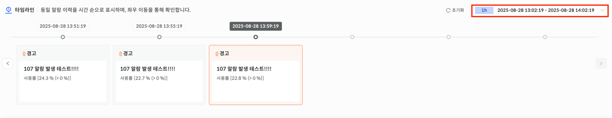

▶ \[그림4\] 타임라인

관리 대상 분석 정보

알람이 발생된 관리 대상의 성능과 구성 정보에 대해 상단에서 선택한 알람 이력의 발생 시간 전후 30분 데이터를 표시하여 확인하고 분석할 수 있습니다.

<table>
<tbody>
<tr class="odd">
<td>
노트

선택한 알람 이력의 발생 시간이 현재 시간과 30분 미만으로 차이나는 경우, 조회 시간은 (현재 시간-1) 시 ~ 현재 시간으로 설정됩니다.

예: 현재 시간: 2025-08-21 11:10:21, 알람 발생 시간: 2025-08-21 11:30:22 경우, 조회 시간: 2025-08-21 10:40:21 ~ 2025-08-21 11:40:21
</td>
</tr>
</tbody>
</table>

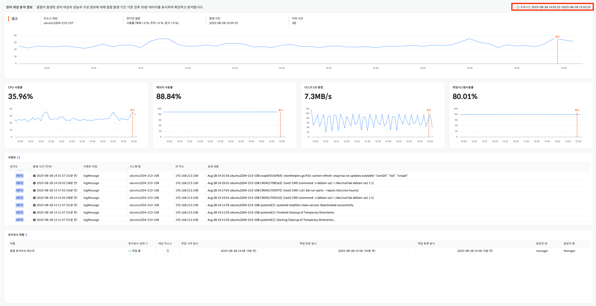

▶ \[그림5\] 관리 대상 분석 정보

매트릭 지표 차트

상단의 조회 시간을 기준으로 알람이 발생한 장비의 매트릭 지표 차트입니다. 알람이 발생한 시점에 심각도가 표시되며, 매트릭 데이터인 경우에만 제공됩니다.

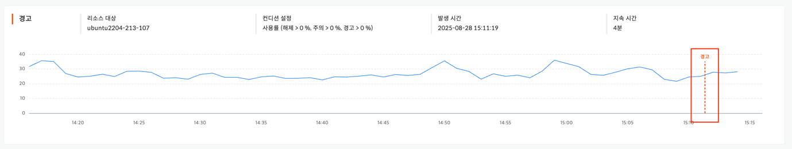

▶ \[그림6\] 매트릭 지표 차트

| 심각도    | 선택한 알람 이력의 심각도를 나타냅니다.         |
| ------ | ------------------------------ |
| 리소스 대상 | 선택한 알람이 발생된 리소스 대상을 나타냅니다.     |
| 컨디션 설정 | 선택한 알람이 발생된 대상의 컨디션 설정을 나타냅니다. |
| 발생 시간  | 선택한 알람 이력의 발생 시간을 나타냅니다.       |
| 지속 시간  | 현재 시점을 기준으로 알람의 지속 시간을 표시합니다.  |

성능 지표 차트

관리 대상의 성능 지표 차트입니다. 도메인 별로 표현할 대표 지표 4개를 선정하여 보여주며 알람이 발생한 시점의 심각도와 데이터를 표시합니다.

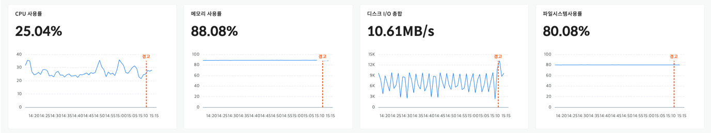

▶ \[그림7\] 성능 차트

이벤트 현황

상단의 조회 시간대에 발생한 이벤트 현황 및 이력 목록입니다. \[상세 내용\] 필드의 데이터 클릭 시 해당 이벤트의 상세 내용을 확인할 수 있습니다.

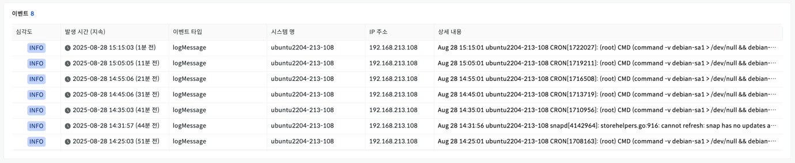

▶ \[그림8\] 이벤트

유지보수 현황

조회 시간대 기준으로 \[작업 시작 일시\], \[작업 완료 일시\]가 포함된 유지보수 작업 현황 목록입니다. \[대상 리소스\] 필드의 데이터 클릭 시 해당 유지보수 작업에 등록된 대상 리소스 정보를 확인할 수 있습니다.

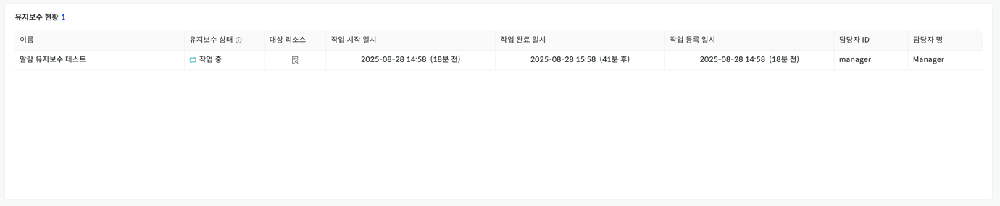

▶ \[그림9\] 유지보수 현황

연관 장비 분석 정보

선택한 알람의 발생 시간을 기준으로, 가장 가깝게 발생한 알람 10개, 또는 20개를 장비 별로 확인할 수 있으며, 헥사곤 차트를 통해 제공합니다.

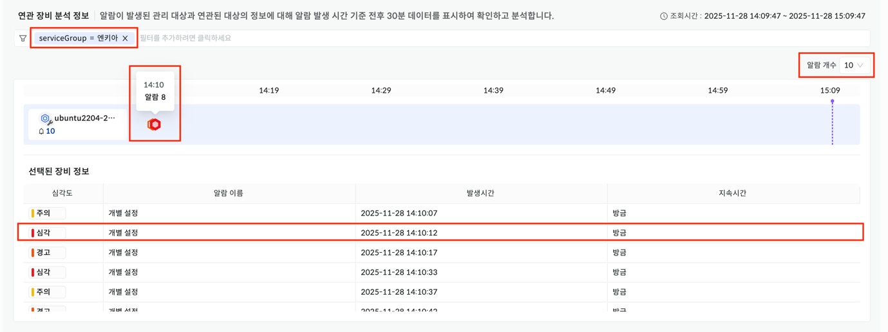

▶ \[그림10\] 연관 장비 분석 정보

| 태그 필터     | 장비를 필터링하며 설정된 서비스 그룹으로 기본 설정됩니다.                                                                          |
| --------- | --------------------------------------------------------------------------------------------------------- |
| 알람 개수     | 헥사곤 차트에 표현할 알람의 개수를 선택합니다. (10개 또는 20개)                                                                   |
| 헥사곤 차트    | 1분 간격 차트로, 같은 분에 발생한 여러 알람은 한 개의 헥사곤으로 표현되며, 그 중 가장 높은 심각도의 색깔로 표현됩니다.                                    |
| 헥사곤       | 헥사곤에 마우스 hover 시 해당 분에 나타난 알람의 개수와 시간이 나타나며, 클릭 시 해당 장비의 상세 알람 정보를 담고 있는 그리드가 나타납니다.                      |
| 선택된 장비 정보 | 특정 Row 클릭 시 해당 장비와 알람 정보를 기반으로한 매트릭 지표 차트, 성능 지표 차트, 이벤트 현황 목록, 유지보수 현황 목록을 확인할 수 있습니다. (관리 대상 분석 정보와 동일) |

알람 정책

해당 알람과 관련된 알람 정책 정보를 조회합니다.

세부 사항에 대한 설명은 \[개별 알람 정책\]매뉴얼을 참고하세요

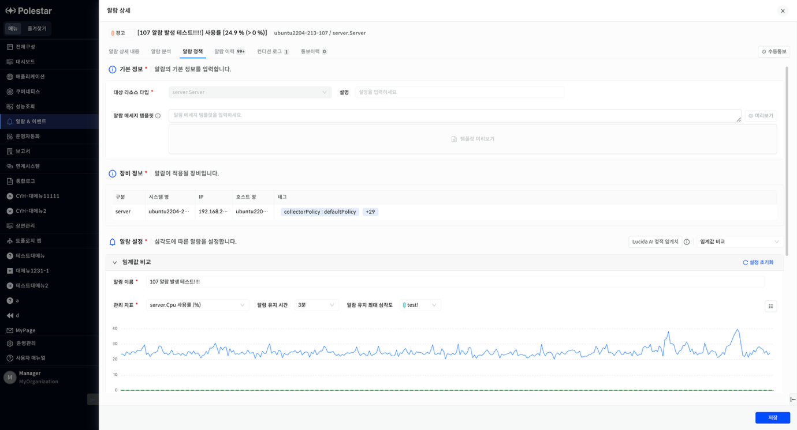

▶ \[그림11\] 알람 정책

알람 이력

해당 알람과 관련된 알람 정의로 발생된 알람 발생 이력을 조회합니다.

<table>
<tbody>
<tr class="odd">
<td>
노트

처리이력이 있는 알람은 처리이력 컬럼에 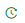 아이콘이 표시되며 클릭 시 처리이력이 화면에 표시됩니다.
</td>
</tr>
</tbody>
</table>

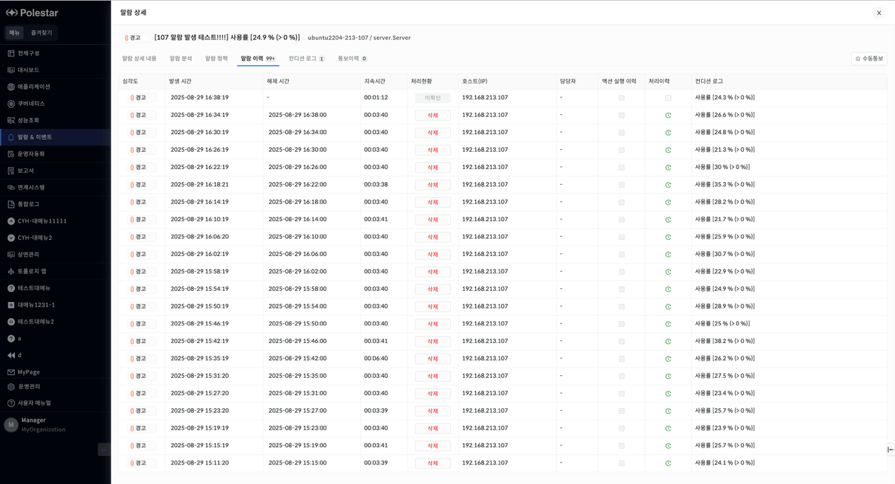

▶ \[그림12\] 알람 이력

화면 지표

<table>
<thead>
<tr class="header">
<th>심각도</th>
<th>알람의 심각도 레벨입니다.</th>
</tr>
</thead>
<tbody>
<tr class="odd">
<td>발생 시간</td>
<td>알람이 발생된 시간부터 해제되기까지 지속된 시간입니다</td>
</tr>
<tr class="even">
<td>해제 시간</td>
<td>알람이 해제된 시간입니다. 아직 해제되지 않았으면 빈 값이 표시됩니다.</td>
</tr>
<tr class="odd">
<td>지속시간</td>
<td>알람 발생에서 해제 시간까지의 시간입니다.</td>
</tr>
<tr class="even">
<td>처리현황</td>
<td>현재 알람의 처리 상태입니다.</td>
</tr>
<tr class="odd">
<td>호스트(IP)</td>
<td>알람이 발생된 구성의 호스트명 또는 IP 정보입니다.</td>
</tr>
<tr class="even">
<td>담당자</td>
<td>알람 처리 담당자입니다.</td>
</tr>
<tr class="odd">
<td>액션 실행 이력</td>
<td>
알람 정책에 등록된 액션의 실행 결과 상태를 표시합니다.

 또는  아이콘으로 표시되어 있는 경우 클릭하면 처리이력 정보가 표시됩니다. 아이콘은 액션실행의 결과가 에러 상태를 나타냅니다.

 아이콘은 이력이 존재하지 않는 상태이고 클릭되지 않습니다.
</td>
</tr>
<tr class="even">
<td>처리이력</td>
<td> 아이콘으로 표시되어 있는 경우 클릭하면 처리이력 정보가 표시됩니다.  아이콘은 처리이력이 존재하지 않는 상태이고 클릭되지 않습니다.</td>
</tr>
<tr class="odd">
<td>컨디션 로그</td>
<td>알람 메시지입니다.</td>
</tr>
</tbody>
</table>

액션 실행 이력

액션 실행 이력 정보를 조회합니다.

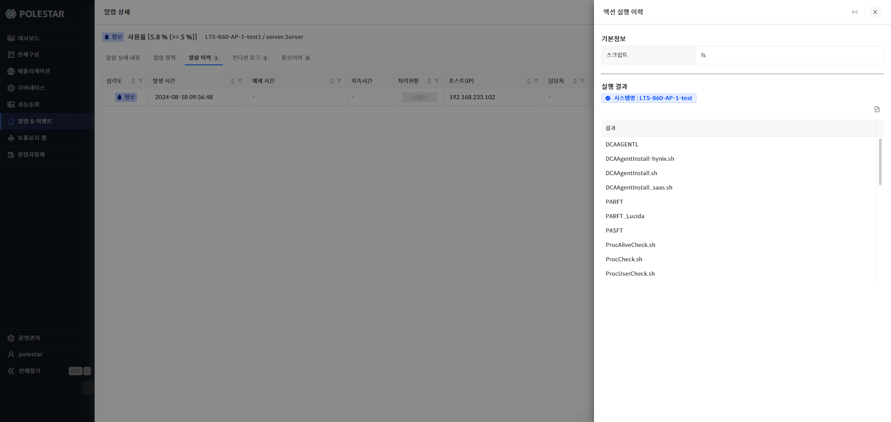

▶ \[그림13\] 알람 이력 목록에서 액션 실행 이력 아이콘 클릭

화면 지표

<table>
<thead>
<tr class="header">
<th>스크립트</th>
<th>실행한 스크립트입니다.</th>
</tr>
</thead>
<tbody>
<tr class="odd">
<td>실행결과</td>
<td>
시스템명에 색상으로 실행 결과를 표시합니다.

파란색: 정상

빨간색: 에러
</td>
</tr>
<tr class="even">
<td><ul>
<li>
아이콘
</li>
</ul></td>
<td>결과를 txt 파일로 다운로드합니다.</td>
</tr>
<tr class="odd">
<td>결과</td>
<td>스크립트 실행 응답 메시지입니다.</td>
</tr>
</tbody>
</table>

처리 이력

알람을 처리한 이력 정보를 조회합니다.

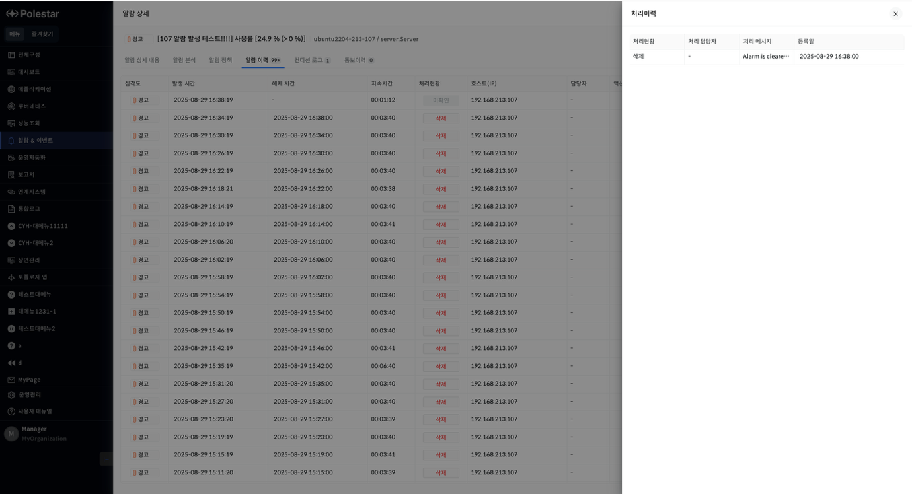

▶ \[그림14\] 알람 이력 목록에서 처리이력 아이콘 클릭

화면 지표

| 처리 현황  | 알람의 상태입니다.         |
| ------ | ------------------ |
| 처리 담당자 | 처리 담당자 이름입니다       |
| 처리 메시지 | 처리 내역을 입력한 메시지입니다. |
| 등록일    | 처리한 날짜입니다.         |

컨디션 로그

알람이 발생된 컨디션 로그 정보를 조회합니다.

<table>
<tbody>
<tr class="odd">
<td>
노트

컨디션 로그는 알람 정의 설정에서 즉시 발생인 경우 1 건이며 발생횟수 설정이면 횟수만큼 조회됩니다.
</td>
</tr>
</tbody>
</table>

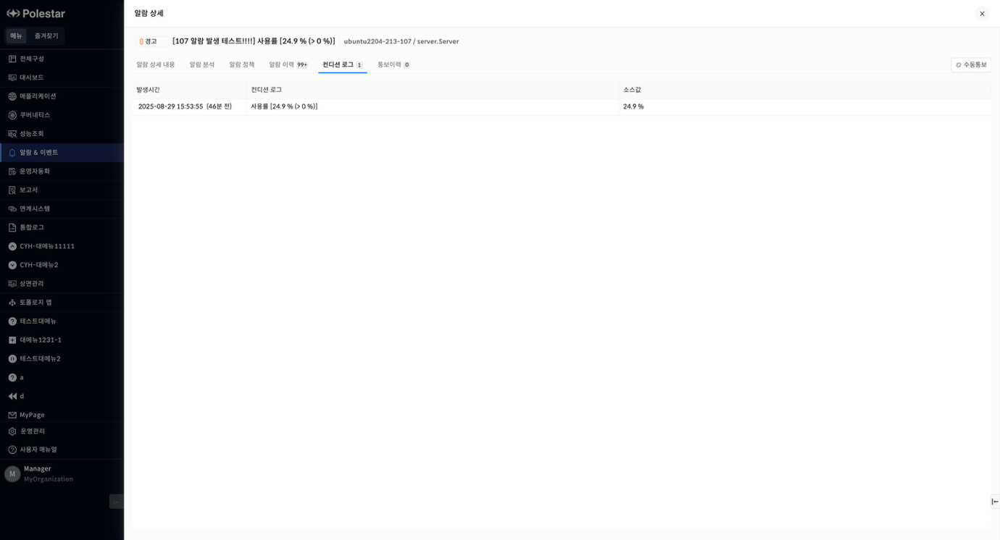

▶ \[그림15\] 컨디션 로그

화면 지표

| 발생 시간  | 알람이 발생된 시간부터 해제되기까지 지속된 시간입니다                                             |
| ------ | ------------------------------------------------------------------------- |
| 컨디션 로그 | 알람 메시지입니다.                                                                |
| 소스값    | 알람 정의에서 선택한 지표의 수집 값입니다. 성능 지표인 경우 수집된 성능 정보이고 이벤트 탐지인 경우는 수집된 이벤트 로그입니다. |

통보이력

해당 알람으로 발생된 통보 이력 정보를 조회합니다.

<table>
<tbody>
<tr class="odd">
<td>
주의

알람 정의의 통보설정에 의해서 발생된 통보 이력입니다. 지연통보로 설정되었다면 아직 통보이력이 없을 수 있습니다.
</td>
</tr>
</tbody>
</table>

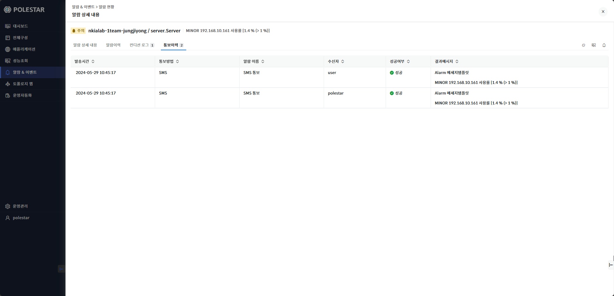

▶ \[그림16\] 통보 이력

화면 지표

<table>
<thead>
<tr class="header">
<th>발송 시간</th>
<th>통보 발송 시간입니다.</th>
</tr>
</thead>
<tbody>
<tr class="odd">
<td>통보방법</td>
<td>통보 방법입니다.</td>
</tr>
<tr class="even">
<td>통보이름</td>
<td>
통보 설정 이름입니다.

통보설정은 [운영관리 &gt; 기본 설정 &gt; 통보 설정] 메뉴의 [통보방식]탭을 통해서 등록되며 등록 시 입력된 이름입니다.
</td>
</tr>
<tr class="odd">
<td>수신자</td>
<td>통보를 수신한 사람입니다.</td>
</tr>
<tr class="even">
<td>성공여부</td>
<td>통보 발송 성공여부입니다.</td>
</tr>
<tr class="odd">
<td>결과메세지</td>
<td>
통보 메세지 템플릿 정보와 통보된 메시지 정보입니다.

통보 메시지 템플릿 설정은 [운영관리 &gt; 기본 설정 &gt; 통보 설정] 메뉴의 [통보 메시지 템플릿]탭 메뉴를 통해서 등록되며 등록 시 입력된 이름입니다
</td>
</tr>
</tbody>
</table>

수동 통보

해당 알람에 대해서 사용자나 사용자그룹 또는 역할에 속한 사용자들에게 통보메시지를 보낼 수 있습니다.

통보 메시지는 알람 메시지가 자동으로 입력되지만 사용자가 수정할 수 있습니다.

<table>
<tbody>
<tr class="odd">
<td>
노트

수동 통보는 통보 방식이 등록되어 있어야 사용할 수 있습니다. 통보 방식은 [운영관리&gt; 통보 설정] 메뉴에서 등록할 수 있습니다.
</td>
</tr>
</tbody>
</table>

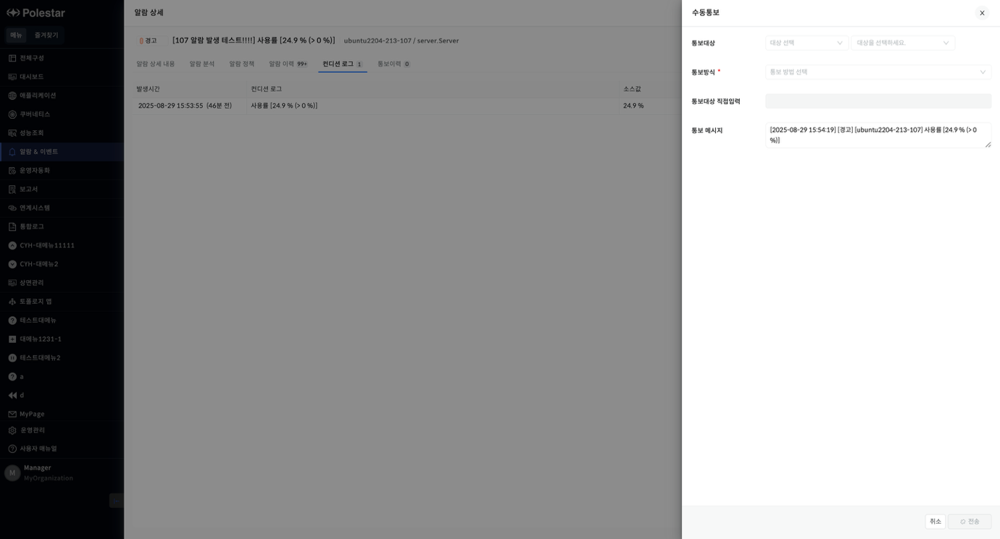

▶ \[그림17\] 수동 통보

화면 지표

<table>
<thead>
<tr class="header">
<th>통보 대상</th>
<th>
통보 메시지를 받는 대상입니다.

시용자그룹 또는 역할을 선택하면 해당 설정에 속한 모든 사용자에게 통보됩니다.

대상 종류

<ul>
<li>
사용자
</li>
<li>
사용자 그룹
</li>
<li>
역할
</li>
</ul></th>
</tr>
</thead>
<tbody>
<tr class="odd">
<td>통보방식</td>
<td>
통보 방법입니다.

등록된 통보 방식 중에서 선택합니다
</td>
</tr>
<tr class="even">
<td>통보대상 직접입력</td>
<td>통보 대상의 연락처를 직접 입력합니다.</td>
</tr>
<tr class="odd">
<td>통보메시지</td>
<td>전달할 메시지입니다.</td>
</tr>
</tbody>
</table>

