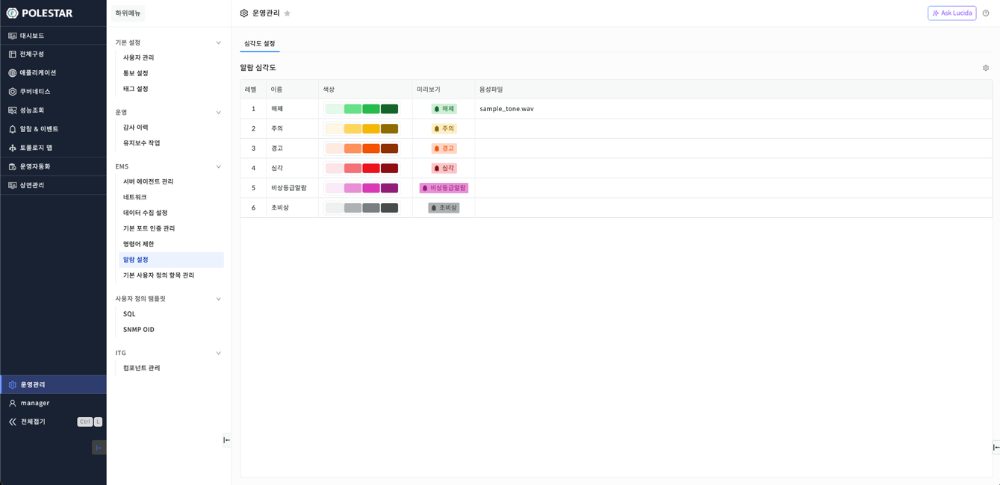
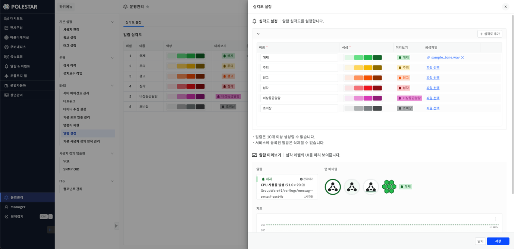
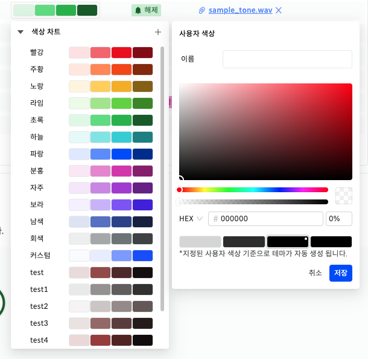

알람 설정

\[운영관리\] 메뉴를 선택하면 \[EMS\] \> \[알람 설정\] 화면을 확인할 수 있습니다.

알람 설정 화면은 \[심각도 설정\] 총 1개의 탭으로 구성되어 있습니다.

▶ \[그림1\] 심각도 설정 탭

화면 지표

| 레벨   | 심각도의 레벨을 표시합니다.   |
| ---- | ----------------- |
| 이름   | 심각도의 이름을 표시합니다.   |
| 색상   | 심각도의 색상을 표시합니다.   |
| 미리보기 | 심각도의 미리보기를 표시합니다. |
| 음성파일 | 심각도의 음성파일을 표시합니다. |

심각도 설정

알람 심각도 목록 우측 상단 \[심각도 설정\] 아이콘을 클릭하면 심각도를 설정할 수 있습니다.

<table>
<tbody>
<tr class="odd">
<td>
노트

해제, 주의, 경고, 심각 총 4개의 기본 심각도가 등록되어 있습니다.

알람 심각도는 최대 10개까지만 등록할 수 있습니다.

서비스에 등록된 알람은 삭제할 수 없습니다.
</td>
</tr>
</tbody>
</table>

▶ \[그림2\] 심각도 설정

화면 지표

<table>
<thead>
<tr class="header">
<th>이름</th>
<th>
심각도의 이름을 입력합니다.

작성 규칙 : 기존에 등록된 심각도의 이름과 중복되면 안됩니다.
</th>
</tr>
</thead>
<tbody>
<tr class="odd">
<td>색상</td>
<td>
심각도의 색상을 표시합니다.

색상을 클릭하면 색상차트 팝업 창이 표시됩니다.
</td>
</tr>
<tr class="even">
<td>미리보기</td>
<td>설정된 심각도의 미리보기를 표시합니다.</td>
</tr>
<tr class="odd">
<td>음성파일</td>
<td>
등록된 음성파일을 표시합니다.

[파일 선택] 또는 [등록된 음성파일] 을 클릭하면 음성파일을 등록할 수 있습니다.

등록 가능한 확장자 : .wav, audio/wav, audio/x-wav
</td>
</tr>
</tbody>
</table>

서버 삭제 절차

1.  삭제하고자 하는 서버 선택 (다중 선택 가능)

2.  서버 목록 우측 상단의 \[삭제\] 버튼 클릭

3.  삭제 안내 팝업창 내용 확인 후 \[확인\] 버튼 클릭

심각도 추가

여러 서버에서 일괄적으로 오퍼레이션을 실행할 수 있습니다.

오퍼레이션을 실행할 서버를 선택하고 오퍼레이션 아이콘을 클릭하여 동일한 오퍼레이션을 다수의 서버에서 동시에 실행할 수 있습니다.

실행한 결과는 TXT 또는 엑셀 파일로 다운로드 받을 수 있습니다.

심각도 추가 절차

1.  심각도 설정의 \[심각도 추가\] 버튼 클릭

2.  이름 입력

3.  색상을 클릭해 색상 차트에서 색상 선택

4.  음성파일 추가 시 \[파일 선택\] 또는 \[등록된 음성파일\]을 클릭해 등록

5.  알람 미리보기 후 \[저장\] 버튼 클릭

6.  메시지창에서 \[동의합니다\] 체크 후, 활성화된 \[확인\] 버튼 클릭

심각도 색상 추가

심각도 설정 중 \[색상\]을 클릭하면 나타나는 팝업 창에서 \[+\] 버튼을 클릭하면 사용자 색상을 추가할 수 있는 팝업 창이 열립니다.

▶ \[그림3\] 사용자 색상 추가 팝업 창

색상 추가 절차

1.  색상 차트 우측 상단 \[+\] 버튼 클릭

2.  이름 입력 (기존에 등록된 색상 차트명과 중복되면 안됩니다.)

3.  색상 팔레트에서 색상 선택

4.  \[저장\] 버튼 클릭

