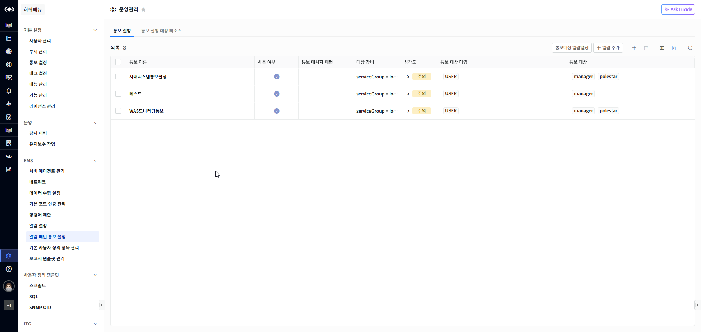
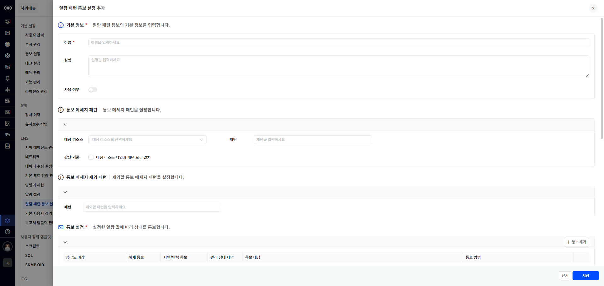
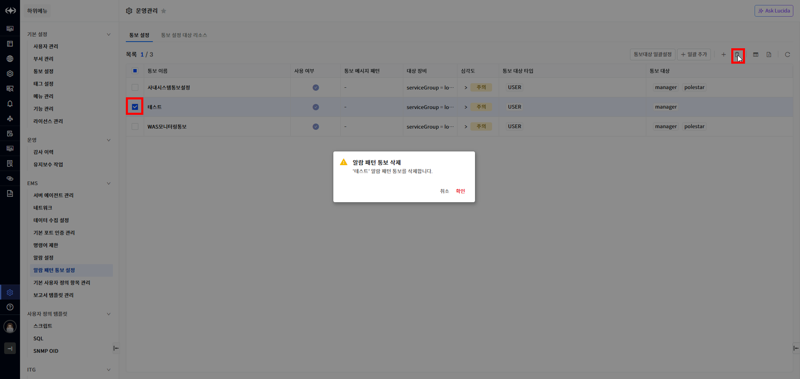
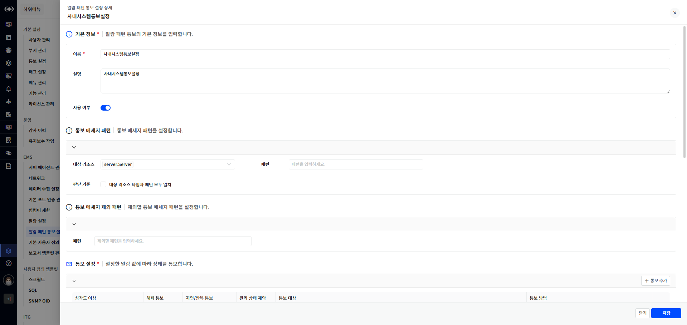
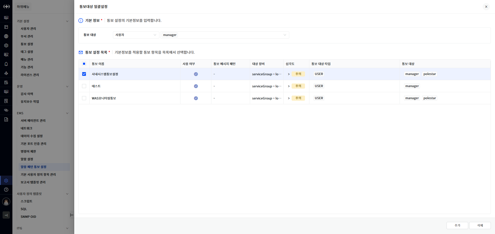
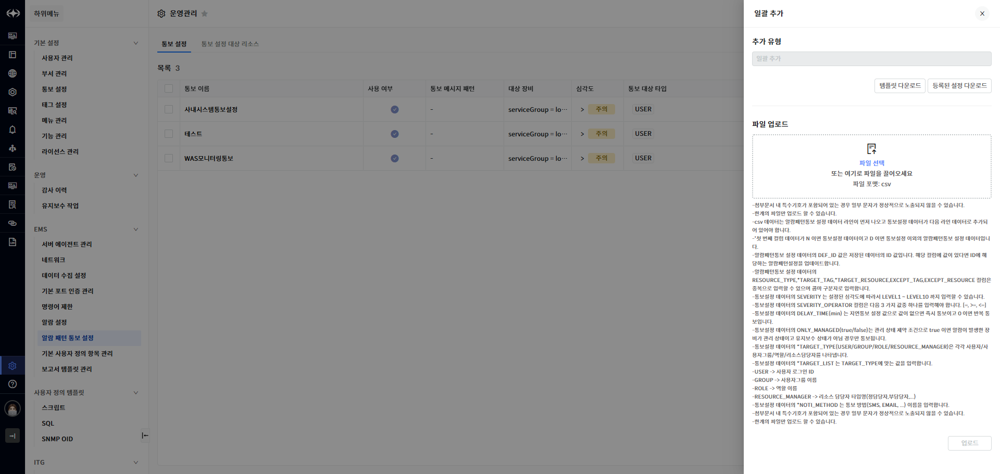
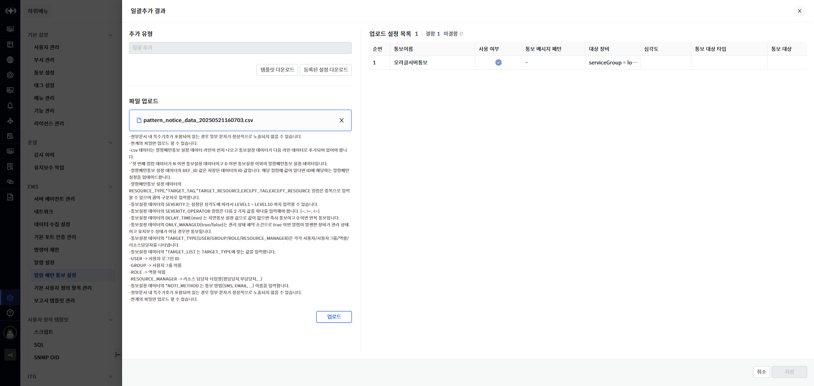
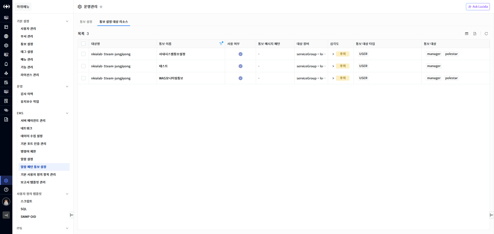

알람 패턴 통보 설정

알람 패턴 통보 설정은 선택한 대상 장비에서 발생되는 알람에 대해서 알람 메시지 또는 알람이 발생된 장비의 리소스타입에 따라서 필터링하여 통보를 보내는 기능입니다. 이를 통해 관리자는 필요한 알람 정보만을 선별적으로 받아볼 수 있습니다.

<table>
<tbody>
<tr class="odd">
<td>
노트

대상 장비 선택 시 특정 서비스에 속한 모든 장비를 선택하면 추후 해당 서비스에 장비 변경이 발생되는 경우 통보를 받지 못할 수 있습니다. 이 경우에는 대상 장비 선택에서 serviceGroup 태그 값을 선택하여 해당 serviceGroup 태그 값을 가지는 모든 장비에 대해서 통보를 받을 수 있습니다.
</td>
</tr>
</tbody>
</table>

▶ \[그림1\] 알람 패턴 통보 설정 목록 – 통보 설정

화면 지표

<table>
<thead>
<tr class="header">
<th>통보 이름</th>
<th>알람 패턴 통보 설정 이름입니다.</th>
</tr>
</thead>
<tbody>
<tr class="odd">
<td>사용 여부</td>
<td>
사용 여부입니다.

토글 버튼()을 클릭하면 사용 여부가 변경됩니다.
</td>
</tr>
<tr class="even">
<td>통보 메시지 패턴</td>
<td>통보 대상 메시지 패턴입니다.</td>
</tr>
<tr class="odd">
<td>대상 장비</td>
<td>통보 대상 장비입니다. 장비 이름 또는 serviceGroup 태그 값입니다.</td>
</tr>
<tr class="even">
<td>심각도</td>
<td>통보 대상 알람의 심각도 입니다.</td>
</tr>
<tr class="odd">
<td>통보 대상 타입</td>
<td>
통보 대상 타입입니다.

<ul>
<li>
사용자
</li>
<li>
사용자 그룹
</li>
<li>
역할
</li>
<li>
리소스 담당자
</li>
</ul></td>
</tr>
<tr class="even">
<td>통보 대상</td>
<td>통보 대상입니다. 통보 대상 타입에 따라서 선택한 정보입니다.</td>
</tr>
</tbody>
</table>

알람 패턴 통보 설정 등록

등록 버튼을 클릭하여 새로운 알람 패턴 통보 설정을 등록할 수 있습니다.

▶ \[그림2\] 알람 패턴 통보 설정 등록

화면 지표

<table>
<thead>
<tr class="header">
<th>이름</th>
<th>설정 이름입니다.</th>
</tr>
</thead>
<tbody>
<tr class="odd">
<td>설명</td>
<td>설정에 대한 설명입니다.</td>
</tr>
<tr class="even">
<td>사용 여부</td>
<td>
사용 여부입니다.

토글 버튼()을 클릭하면 사용 여부가 변경됩니다.

미사용인 경우 해당 통보가 발생되지 않습니다
</td>
</tr>
<tr class="odd">
<td>대상 리소스</td>
<td>통보 대상 리소스 타입을 선택합니다. 다중 선택이 가능합니다.</td>
</tr>
<tr class="even">
<td>패턴</td>
<td>통보 대상 알람 메시지 패턴입니다.</td>
</tr>
<tr class="odd">
<td>판단 기준</td>
<td>
대상 리소스 타입과 패턴 모두 일치 여부를 체크합니다.

체크하면 [대상 리소스] 설정과 [패턴]설정 모두 만족하는 경우 통보됩니다.
</td>
</tr>
<tr class="even">
<td>패턴(통보 메시지 제외 패턴)</td>
<td>통보 제외 대상 알람 메시지 패턴입니다.</td>
</tr>
<tr class="odd">
<td>심각도 이상</td>
<td>
통보 대상이 되는 알람의 심각도 레벨을 선택합니다.

<ul>
<li>
이상: 해당 심각도 이상이면 통보됩니다.
</li>
<li>
같음: 동일한 심각도인 경우만 통보됩니다.
</li>
<li>
이하:해당 심각도 이하이면 통보됩니다.
</li>
</ul></td>
</tr>
<tr class="even">
<td>해제 통보</td>
<td>알람이 해제되는 경우 통보를 발송할 지 여부를 선택합니다.</td>
</tr>
<tr class="odd">
<td>지연/반복 통보</td>
<td>
통보 발송 시기를 설정합니다.

[즉시 이후 반복]은 즉시 통보 이후 알람이 해제되지 않으면 반복해서 통보를 보냅니다. 5분 간격으로 3회 발송됩니다.

설정할 수 있는 옵션은 다음과 같습니다.

즉시

5분 지연

10분 지연

30분 지연

1 시간 지연

6시간 지연

12시간 지연

1일 지연

즉시 이후 반복
</td>
</tr>
<tr class="even">
<td>관리 상태 제약</td>
<td>장비의 관리 상태가 대기 또는 유지보수 상태이면 통보를 보내지 않습니다.</td>
</tr>
<tr class="odd">
<td>통보 대상</td>
<td>
통보대상 타입

<ul>
<li>
사용자
</li>
<li>
사용자 그룹
</li>
<li>
역할
</li>
<li>
리소스담당자
</li>
</ul></td>
</tr>
<tr class="even">
<td>통보 방법</td>
<td>
통보를 보내는 방법을 선택합니다.

선택 목록에는 운영관리&gt; 기본설정&gt; 통보설정 메뉴에 정의된 통보 방법이 표시됩니다.
</td>
</tr>
<tr class="odd">
<td>관리 대상</td>
<td>
대상 장비를 검색하여 선택할 수 있습니다.

장비를 태그를 선택하고 Drag하면 추가할 수 있습니다.
</td>
</tr>
<tr class="even">
<td>적용 대상</td>
<td>
선택한 장비의 알람인 경우 통보됩니다.

[장비]버튼을 클릭하면 선택한 장비와 태그를 기반으로 대상 장비 목록 화면이 표시됩니다.
</td>
</tr>
<tr class="odd">
<td>제외 대상</td>
<td>
선택한 장비의 알람인 경우 통보되지 않습니다.

[제외 장비]버튼을 클릭하면 선택한 장비와 태그를 기반으로 제외 대상 장비 목록 화면이 표시됩니다.
</td>
</tr>
</tbody>
</table>

알람 패턴 통보 설정 등록 절차

1.  테이블 우측 상단의 추가 버튼을 클릭합니다.

2.  기본 정보, 통보 메시지 패턴, 통보 메시지 제외 패턴을 입력합니다.

3.  \[통보 추가\]버튼을 선택하여 라인을 추가하고 통보설정 정보를 입력합니다.

4.  장비 정보에서 적용 대상 또는 제외 대상 장비를 Drag하여 선택합니다.

5.  \[저장\] 버튼을 선택하여 저장합니다.

알람 패턴 통보 설정 삭제

알람 패턴 통보 설정을 삭제하려는 경우 목록에서 삭제할 정책을 선택하고 \[삭제\] 버튼을 클릭해서 삭제할 수 있습니다.

▶ \[그림3\] 알람 패턴 통보 설정 삭제

알람 패턴 통보 설정 삭제 절차

1.  삭제하고자 하는 알람 패턴 통보 설정 선택 (다중 선택 가능).

2.  테이블 우측 상단의 삭제 아이콘 클릭

3.  메시시창에서 확인 클릭

알람 패턴 통보 설정 수정

알람 패턴 통보 설정 목록에서 통보 이름을 선택하면 상세화면이 나타나며 등록된 내용을 수정할 수 있습니다.

<table>
<tbody>
<tr class="odd">
<td>
노트

설정 내용 중에서 통보 대상만 일괄로 추가 또는 삭제하려는 경우 상단의 [통보대상 일괄설정] 기능으로 다른 설정은 변경하지 않고 통보를 받는 대상만 변경할 수 있습니다.
</td>
</tr>
</tbody>
</table>

▶ \[그림4\] 알람 패턴 통보 설정 수정

통보 대상 일괄설정

알람 패턴 통보 설정에서 통보 대상을 일괄로 추가 또는 삭제할 수 있습니다. 추가하려는 경우 추가하는 통보 대상 타입으로 설정된 통보가 존재하는 경우 추가됩니다.

<table>
<tbody>
<tr class="odd">
<td>
노트

특정 통보 대상자가 퇴사하는 경우 해당 기능을 사용하여 전체 알람 패턴 통보 설정에서 일괄로 삭제할 수 있습니다.
</td>
</tr>
</tbody>
</table>

▶ \[그림5\] 통보 대상 일괄 설정

화면 지표

<table>
<thead>
<tr class="header">
<th>통보 대상</th>
<th>
통보대상 타입

<ul>
<li>
사용자
</li>
<li>
사용자 그룹
</li>
<li>
역할
</li>
</ul>

리소스담당자
</th>
</tr>
</thead>
<tbody>
<tr class="odd">
<td>통보 이름</td>
<td>알람 패턴 통보 설정 이름입니다.</td>
</tr>
<tr class="even">
<td>사용 여부</td>
<td>
사용 여부입니다.

토글 버튼()을 클릭하면 사용 여부가 변경됩니다.
</td>
</tr>
<tr class="odd">
<td>통보 메시지 패턴</td>
<td>통보 대상 메시지 패턴입니다.</td>
</tr>
<tr class="even">
<td>대상 장비</td>
<td>통보 대상 장비입니다. 장비 이름 또는 serviceGroup 태그 값입니다.</td>
</tr>
<tr class="odd">
<td>심각도</td>
<td>통보 대상 알람의 심각도 입니다.</td>
</tr>
<tr class="even">
<td>통보 대상 타입</td>
<td>
통보 대상 타입입니다.

<ul>
<li>
사용자
</li>
<li>
사용자 그룹
</li>
<li>
역할
</li>
</ul>

리소스 담당자
</td>
</tr>
<tr class="odd">
<td>통보 대상</td>
<td>통보 대상입니다. 통보 대상 타입에 따라서 선택한 정보입니다.</td>
</tr>
</tbody>
</table>

통보 대상 일괄설정 절차

1.  목록 테이블 우측 상단의 \[통보대상 일괄설정\]을 선택합니다.

2.  통보 대상을 선택합니다.

3.  적용할 통보 설정 목록을 선택합니다

4.  추가하려면 \[추가\]를 삭제하려면 \[삭제\] 선택합니다

일괄추가

사용자는 csv 파일에 알람 패턴 통보 설정을 정리하여 업로드하면 일괄로 설정 목록을 추가할 수 있습니다. Csv 파일에는 알람 패턴 통보 설정 등록 시 입력하는 모든 항목을 입력할 수 있습니다. 입력 항목 중에서 DEF\_ID컬럼에 등록된 알람 패턴 통보 설정의 ID를 입력하면 해당 설정을 업데이트합니다. 일괄추가 화면에서 csv 파일을 작성하기 위한 템플릿을 다운로드 할 수 있으며 설정된 목록을 포함하여 다운로드 할 수도 있습니다.

<table>
<tbody>
<tr class="odd">
<td>
노트

일괄추가 뿐만 아니라 일괄로 수정하려는 경우도 다운로드하여 수정 후 업로드 하면 일괄로 수정할 수 있습니다. 이 경우 DEF_ID(알람 패턴 통보 설정 ID값)를 수정하거나 삭제하면 안됩니다. 해당 ID 값으로 등록된 설정정보가 없으면 오류를 발생시키지만 삭제하는 경우 신규로 등록됩니다.

[Csv 작성 방법]

- csv 데이터는 알람 패턴통보 설정 데이터 라인이 먼저 나오고 통보설정 데이터가 다음 라인 데이터로 추가되어 있어야 합니다.

- 첫 번째 컬럼 데이터가 N이면 통보설정 데이터이고 D이면 통보설정 이외의 알람 패턴통보 설정 데이터입니다.

- 알람 패턴통보 설정 데이터의 DEF_ID 값은 저장된 데이터의 ID 값입니다. 해당 컬럼에 값이 있다면 ID에 해당하는 알람 패턴설정을 업데이트합니다.

- 알람 패턴통보 설정 데이터의 RESOURCE_TYPE, *TARGET_TAG, *TARGET_RESOURCE, EXCEPT_TAG, EXCEPT_RESOURCE 컬럼은 중복으로 입력할 수 있으며 콤마 구분자로 입력합니다.

- 통보설정 데이터의 SEVERITY는 설정된 심각도에 따라서 LEVEL1 ~ LEVEL10까지 입력할 수 있습니다.

- 통보설정 데이터의 SEVERITY_OPERATOR 컬럼은 다음 3 가지 값 중에서 하나를 입력해야 합니다. [=, &gt;=, &lt;=]

- 통보설정 데이터의 DELAY_TIME(min)는 지연통보 설정 값으로 값이 없으면 즉시 통보이고 0 이면 반복 통보입니다.

- 통보설정 데이터의 ONLY_MANAGED(true/false)는 관리 상태 제약 조건으로 true이면 알람이 발생한 장비가 관리 상태이고 유지보수 상태가 아님 경우만 통보됩니다.

- 통보설정 데이터의 *TARGET_TYPE(USER/GROUP/ROLE/RESOURCE_MANAGER)은 각각 사용자/사용자그룹/역할/리소스담당자를 나타냅니다.

- 통보설정 데이터의 *TARGET_LIST는 TARGET_TYPE에 맞는 값을 입력합니다.

- USER -&gt; 사용자 로그인 ID

- GROUP -&gt; 사용자그룹 이름

- ROLE -&gt; 역할 이름

- RESOURCE_MANAGER -&gt; 리소스 담당자 타입 명(정담당자, 부담당자, ...)

- 통보설정 데이터의 *NOTI_METHOD는 통보 방법(SMS, EMAIL, ...) 이름을 입력합니다.

- 첨부문서 내 특수기호가 포함되어 있는 경우 일부 문자가 정상적으로 노출되지 않을 수 있습니다.

- 한개의 파일만 업로드 할 수 있습니다.
</td>
</tr>
</tbody>
</table>

▶ \[그림6\] 일괄추가 – 파일 선택

화면 지표

<table>
<thead>
<tr class="header">
<th>템플릿 다운로드</th>
<th>Csv 작성을 위한 템플릿 파일을 다운로드합니다.</th>
</tr>
</thead>
<tbody>
<tr class="odd">
<td><strong>등록된 설정 다운로드</strong></td>
<td>Csv 작성을 위한 템플릿 파일 형식으로 등록된 설정 목록을 다운로드합니다.</td>
</tr>
<tr class="even">
<td>파일 업로드</td>
<td>
업로드할 csv 파일을 선택합니다.

파일 선택 하단에 있는 정보는 csv 파일 작성에 대한 설명입니다.
</td>
</tr>
<tr class="odd">
<td>업로드</td>
<td>
선택한 csv 파일을 업로드합니다.

파일을 선택하지 않았으면 비활성화 되어 있습니다.
</td>
</tr>
</tbody>
</table>

▶ \[그림7\] 일괄추가 – 파일 업로드 결과 화면

화면 지표

<table>
<thead>
<tr class="header">
<th>결함</th>
<th>업로드한 내용중 결함이 있는 건수.</th>
</tr>
</thead>
<tbody>
<tr class="odd">
<td><strong>미결함</strong></td>
<td>업로드한 내용중 결함이 없는 건수.</td>
</tr>
<tr class="even">
<td>순번</td>
<td>순번입니다.</td>
</tr>
<tr class="odd">
<td>통보 이름</td>
<td>알람 패턴 통보 설정 이름입니다.</td>
</tr>
<tr class="even">
<td>사용 여부</td>
<td>
사용 여부입니다.

토글 버튼()을 클릭하면 사용 여부가 변경됩니다.
</td>
</tr>
<tr class="odd">
<td>통보 메시지 패턴</td>
<td>통보 대상 메시지 패턴입니다.</td>
</tr>
<tr class="even">
<td>대상 장비</td>
<td>통보 대상 장비입니다. 장비 이름 또는 serviceGroup 태그 값입니다.</td>
</tr>
<tr class="odd">
<td>심각도</td>
<td>통보 대상 알람의 심각도 입니다.</td>
</tr>
<tr class="even">
<td>통보 대상 타입</td>
<td>
통보 대상 타입입니다.

<ul>
<li>
사용자
</li>
<li>
사용자 그룹
</li>
<li>
역할
</li>
</ul>

리소스 담당자
</td>
</tr>
<tr class="odd">
<td>통보 대상</td>
<td>통보 대상입니다. 통보 대상 타입에 따라서 선택한 정보입니다.</td>
</tr>
<tr class="even">
<td>결함</td>
<td>결함이 있는 경우 메시지가 표시됩니다.</td>
</tr>
</tbody>
</table>

일괄추가 절차

1.  목록 테이블 우측 상단의 \[일괄추가\]를 선택합니다.

2.  업로드할 csv 파일을 선택합니다

3.  \[업로드\]를 선택하여 파일을 업로드합니다.

4.  업로드한 내용을 확인합니다. 결함이 확인되면 csv 파일 수정 후 업로드를 다시 수행합니다.

5.  결함이 없으면 \[저장\]버튼이 활성화되어 있습니다. \[저장\]을 선택합니다.

6.  목록에서 업로드한 내용을 확인합니다.

통보 설정 대상 리소스

사용자는 장비 기준으로 장비에 설정된 알람 패턴 통보 설정 정보를 조회할 수 있습니다. 하나의 장비는 여러 개의 알람 패턴 통보 설정에 포함되어 있을 수 있습니다.

▶ \[그림7\] 통보 설정 대상 리소스 목록

화면 지표

<table>
<thead>
<tr class="header">
<th>대상명</th>
<th>알람 패턴 통보 설정의 대상이 되는 장비 이름입니다.</th>
</tr>
</thead>
<tbody>
<tr class="odd">
<td>통보 이름</td>
<td>알람 패턴 통보 설정 이름입니다.</td>
</tr>
<tr class="even">
<td>사용 여부</td>
<td>
사용 여부입니다.

토글 버튼()을 클릭하면 사용 여부가 변경됩니다.
</td>
</tr>
<tr class="odd">
<td>통보 메시지 패턴</td>
<td>통보 대상 메시지 패턴입니다.</td>
</tr>
<tr class="even">
<td>대상 장비</td>
<td>통보 대상 장비입니다. 장비 이름 또는 serviceGroup 태그 값입니다.</td>
</tr>
<tr class="odd">
<td>심각도</td>
<td>통보 대상 알람의 심각도 입니다.</td>
</tr>
<tr class="even">
<td>통보 대상 타입</td>
<td>
통보 대상 타입입니다.

<ul>
<li>
사용자
</li>
<li>
사용자 그룹
</li>
<li>
역할
</li>
</ul>

리소스 담당자
</td>
</tr>
<tr class="odd">
<td>통보 대상</td>
<td>통보 대상입니다. 통보 대상 타입에 따라서 선택한 정보입니다.</td>
</tr>
</tbody>
</table>

