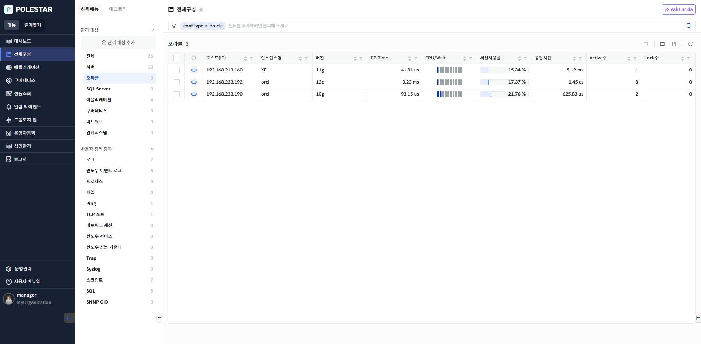
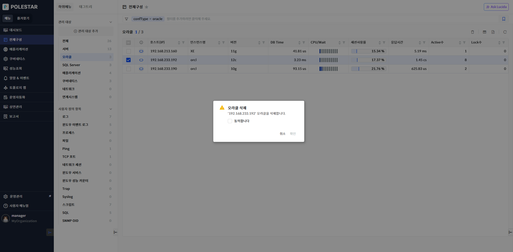
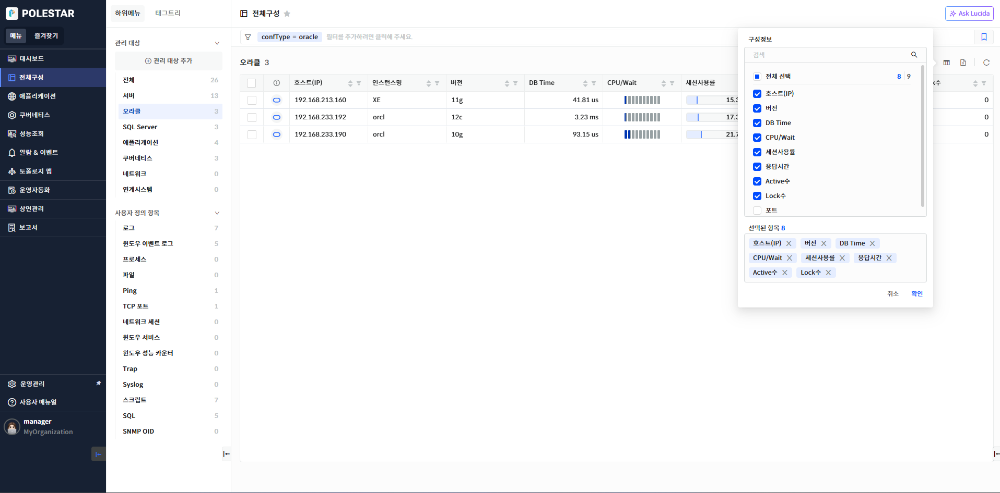
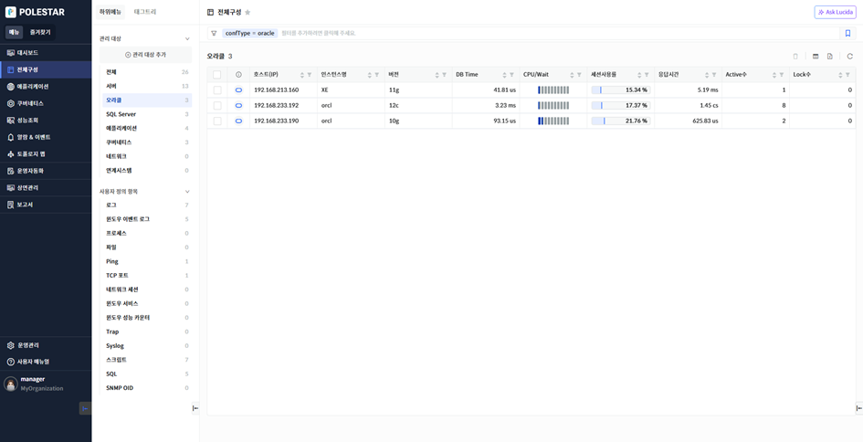

오라클 목록

전체 구성에서 \[오라클\]를 선택하거나 전체에서 오라클의 \[더보기\>\]를 선택하면 전체 오라클 목록을 확인할 수 있습니다. 오라클 목록을 통해 오라클이 설치된 호스트(IP), 인스턴스명, 버전, Port 정보를 확인하고 검색해 볼 수 있으며 오라클의 주요 성능 지표(DB Time, 응답시간, Active(세션)수 등)를 확인하여 오라클의 전체적인 부하를 파악하고 비교해볼 수 있습니다. 또한 해당 화면에서 등록된 오라클을 삭제할 수 있습니다.

<table>
<tbody>
<tr class="odd">
<td>
노트

전체 구성에서 관리되는 오라클은 [전체구성] 메뉴의 [관리 대상 추가]에서 오라클 [관리 대상 등록]을 통해 등록되어야 합니다. 그리고 오라클 목록에는 로그인 사용자에게 읽기 권한이 할당된 오라클만 표시됩니다.
</td>
</tr>
</tbody>
</table>

> ▶ \[그림1\] 오라클 목록
> 
> 오라클 목록

<table>
<thead>
<tr class="header">
<th>DB</th>
<th>
DB 종류를 아이콘으로 표시하고 색깔은 가용성을 표시합니다.

<table>
<thead>
<tr class="header">
<th><strong>: 오라클 정상 상태 표시(Up)</strong></th>
</tr>
</thead>
<tbody>
<tr class="odd">
<td><strong>: 오라클 다운 상태 표시(Down)</strong></td>
</tr>
</tbody>
</table></th>
</tr>
</thead>
<tbody>
<tr class="odd">
<td>호스트(IP)</td>
<td>오라클 등록시 입력했던 호스트명 또는 IP가 표시됩니다</td>
</tr>
<tr class="even">
<td>인스턴스명</td>
<td>오라클 등록시 입력했던 오라클의 SID명 또는 서비스명이 표시됩니다. 인스턴스명에 매핑 되는 태그키값은 “dbName”입니다. 태그 필터 사용시 유의하세요.</td>
</tr>
<tr class="odd">
<td>버전</td>
<td>오라클 Major 버전명이 표시됩니다.</td>
</tr>
<tr class="even">
<td>DB Time</td>
<td>
오라클이 사용한 CPU와 대기시간의 총합을 표시합니다.

해당 시간은 오라클 수집주기(디폴트 60초) 동안 사용한 CPU와 대기시간의 합을 수집주기로 나눈 시간(초당시간)입니다. 예를 들어 해당 시간이 1초 이상이고 DB Time이 모두 CPU 사용 시간이라면 ‘오라클 프로세스가 1개 이상의 CPU 코어를 사용하였다’ 라고 해석할 수 있습니다.

단위: ms
</td>
</tr>
<tr class="odd">
<td>CPU/Wait</td>
<td>
DB Time이 CPU를 사용한 시간인지 오라클 대기 이벤트(노트 참조) 사용 시간인지를 비율로 표시한 게이지 바입니다. 해당 게이지바가  라면 이는 DB Time 소요시간 중 23.3%는 CPU를 사용하였고 나머지 76.7%는 대기 이벤트 사용 시간이라는 것을 알 수 있습니다.

단위: %
</td>
</tr>
<tr class="even">
<td>세션사용률</td>
<td>
오라클 허용 가능 전체 세션 수 대비 현재 사용하고 있는 세션수의 비율을 표시합니다. 이를 통해 현재 오라클에 세션이 많이 접속하였는지 또 허용 세션 수에 여유가 있는지 등을 파악할 수 있습니다. 일반적으로 세션 사용률은 높지 않아야 하며 세션 사용률이 100%에 가깝다면 오라클 서버에 매우 큰 부하가 있다고 판단할 수 있으며 빠른 조치가 필요한 상황이라고 할 수 있습니다.

단위: %
</td>
</tr>
<tr class="odd">
<td>응답시간</td>
<td>
오라클 서비스 응답 시간을 표시합니다. 해당 지표는 V$SYSTEMETRIC 뷰의 ‘SQL Service Response Time’을 이용합니다. 서비스 응답시간이 평소보다 많이 높다면 세션 분석이나 SQL 분석을 통해 지연되는 사유를 분석해 볼 필요가 있습니다.

단위: ms
</td>
</tr>
<tr class="even">
<td>Active수</td>
<td>
현재 오라클에서 수행되는 Active 세션의 수를 표시합니다. Active 세션은 현재 오라클 내에서 쿼리가 수행되거나 작업중인 세션을 의미합니다. Active 세션수가 평소보다 많이 높다면 세션 현황 조회 기능이나 분석 기능을 통해 어떤 세션 때문인지 분석해 볼 필요가 있습니다.

단위: count
</td>
</tr>
<tr class="odd">
<td>Lock수</td>
<td>
현재 오라클 세션 중 Lock으로 인해 블록 된 세션 수를 표시합니다. 장기적으로 보통 Lock 세션 수는 0개인 것이 일반적입니다. 따라서 장기적으로 Lock수가 높다면 세션 현황 조회 기능이나 분석 기능을 통해 어떤 세션이 Lock을 유발하고 블록 되는지 분석할 필요가 있습니다.

단위: count
</td>
</tr>
<tr class="even">
<td>Port</td>
<td>오라클 등록 시 입력했던 Listen 포트입니다</td>
</tr>
</tbody>
</table>

<table>
<tbody>
<tr class="odd">
<td>
노트

오라클 대기 이벤트는 오라클 데이터베이스가 특정 작업을 수행하는 동안 시간이 지체되는 원인을 나타냅니다. 즉, 데이터베이스 세션이 작업을 처리하는 동안 어떤 이유로 인해 대기하고 있는지를 보여줍니다. 주요 대기 이벤트 유형은 다음과 같습니다.

<strong>1.</strong> <strong>디스크 I/O 대기</strong>: 데이터베이스가 디스크에서 데이터를 읽거나 쓸 때 발생하는 대기입니다. 예를 들어, db file sequential read, db file scattered read 같은 이벤트가 있습니다.

<strong>2.</strong> <strong>락 대기(Lock Waits)</strong>: 트랜잭션이 동일한 자원을 동시에 접근하려고 할 때 발생하는 대기입니다. 예를 들어, enq: TX - row lock contention 이벤트가 있습니다.

<strong>3.</strong> <strong>네트워크 대기(Network Waits)</strong>: 네트워크 통신 중 발생하는 대기입니다. 예를 들어, SQL*Net message from client 이벤트가 있습니다.
</td>
</tr>
</tbody>
</table>

<table>
<tbody>
<tr class="odd">
<td>
노트

오라클 인스턴스명에 매핑 되는 태그 키 값은 “dbName”입니다. 태그 필터 사용시 유의하세요. 태그 키 값이 “dbName”인 이유는 오라클 이외의 모든 데이터베이스에서 공통으로 사용하기 위함입니다.
</td>
</tr>
</tbody>
</table>

오라클 삭제

삭제할 오라클을 선택하고 \[삭제\] 버튼을 선택하여 오라클 삭제할 수 있습니다.

삭제할 서버를 선택하고 \[삭제\] 버튼을 선택하고 서버를 삭제할 수 있습니다.

삭제가 되면 오라클 수집(쿼리 수행)이 중지되며 오라클 등록이 해제가 됩니다.

오라클 등록 해제 및 삭제시에도 기존 데이터는 삭제되지 않고 유지됩니다. 따라서 삭제 후 오라클을 다시 등록하면 기존 데이터 정보를 다시 조회할 수 있습니다.

▶ \[그림2\] 오라클 삭제

> 오라클 삭제 절차

1.  삭제하고자 하는 오라클 선택 (다중 선택 가능)

2.  테이블 우측 상단의 삭제 아이콘 클릭

3.  메시지창에서 확인 클릭

컬럼 수정

오라클 목록의 우측 상단 \[컬럼 수정\] 버튼을 통해 오라클 목록에 원하는 컬럼을 표시하거나 제외할 수 있습니다. 엑셀 저장시에도 컬럼 수정을 통해 표시된 컬럼만 저장됩니다. 컬럼 수정 팝업창에서는 컬럼 검색 기능을 제공하며 선택된 항목을 하단에 표시하고 표시된 컬럼을 제외할 수 있는 기능을 제공합니다.

▶ \[그림3\] 오라클 목록 컬럼 수정

> 오라클 컬럼 수정 절차

1.  오라클 목록에서 우측 상단 컬럼 수정 아이콘 클릭

2.  컬럼 수정 팝업창에서 화면에 표시하고자 하는 컬럼을 체크박스에서 선택

3.  저장 버튼 클릭

엑셀 저장

오라클 목록의 우측 상단 \[엑셀 저장\] 버튼을 통해 오라클 목록을 엑셀로 저장할 수 있습니다. 컬럼 수정 기능, 상단 태그 검색 기능, 그리드 컬럼 검색 기능 등을 통해 엑셀에 보여줄 컬럼과 내용을 원하는 조건에 맞게 필터링하여 저장할 수 있습니다.

▶ \[그림4\] 오라클 목록 엑셀 저장

> 오라클 목록 엑셀 저장 및 조회 절차

1.  오라클 목록에서 우측 상단 엑셀 저장 아이콘 클릭

2.  브라우저 우측 상단 창에 저장된 엑셀 파일명이 표시됨

3.  해당 파일명을 클릭하여 엑셀 파일 확인

