오라클 상세

오라클 상세 화면에서는 오라클의 성능 정보, 구성 정보를 확인할 수 있으며 세션 및 SQL 수행 이력을 상세 분석할 수 있습니다. 성능 메뉴에서는 카테고리(인스턴스, 세션(프로세스), SQL, 메모리, 로그, Storage)별로 성능을 확인할 수 있습니다. 구성 이력에서는 오라클 구성 정보(환경변수, 기동시간, 사용자 목록 등)의 변경 이력을 확인할 수 있으며 현황 정보에서는 환경변수, 사용자, 테이블스페이스, 테이블, 인덱스의 현재 시점 구성 정보를 확인할 수 있습니다. 설정 정보에서는 오라클 접속 정보를 수정하거나 역할 및 담당자 등을 설정할 수 있습니다. 세션 분석 메뉴를 통해 오라클에 수행된 세션의 이력을 분석할 수 있고 Top SQL 분석을 통해 오라클에 수행된 SQL 중 성능 지연이 발생된 SQL을 빠르게 찾고 분석할 수 있습니다. 마지막으로 SQL 성능 분석에서는 Top SQL로 수집된 SQL의 성능 지표를 Scatter 차트에 표시하여 한눈에 Top SQL들의 성능을 확인하고 원하는 SQL을 선택하여 분석할 수 있습니다.

오라클 인스턴스 성능

오라클 인스턴스 성능 화면은 오라클 인스턴스의 전반적인 상태, 성능, 효율성 정보를 조회할 수 있는 화면입니다. 상단에 오라클 주요 백그라운드 프로세스 수와 LISTENER(리스너) 접속 가능 여부가 표시되고 그 밑으로 오라클 주요 성능 지표에 대한 차트와 오라클 Effciency(효율성) 지표에 대한 Gauge 바 목록이 표시됩니다.

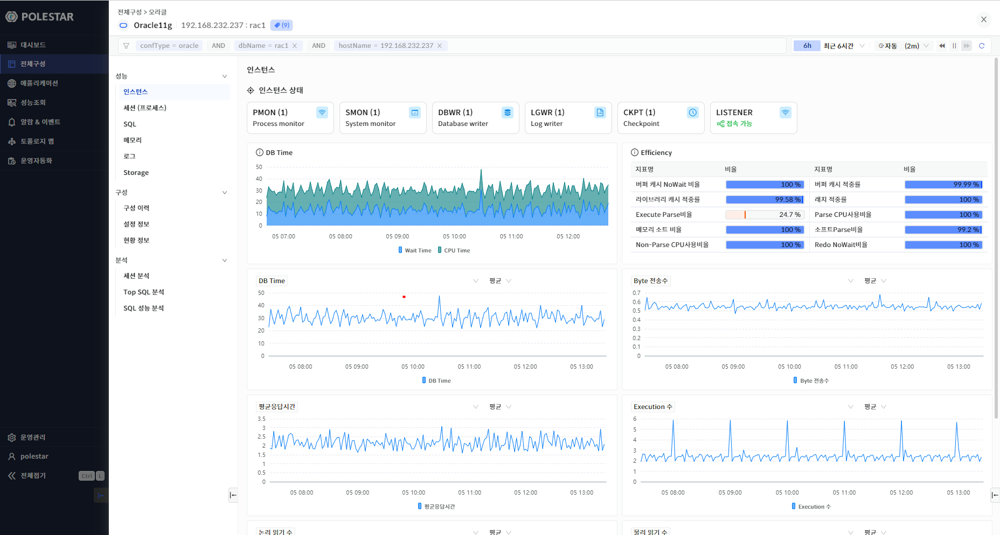

> ▶ \[그림1\] 오라클 인스턴스 성능

인스턴스 상태

오라클의 주요 백그라운드 프로세스의 수와 LISTENER(리스너) 접속 여부를 표시합니다.

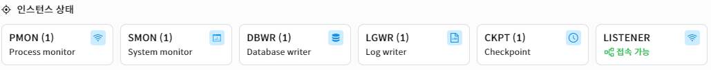

▶ \[그림2\] 오라클 인스턴스 상태

> 화면 지표

| PMON     | PMON(Process Monitor) 프로세스는 실패한 사용자 프로세스를 정리하고, 실패한 프로세스가 보유하고 있던 리소스를 해제하는 역할을 합니다. 괄호 안의 개수는 Process monitor 프로세스 개수를 표시하며 해당 개수가 0개인 경우 프로세스가 다운되거나 상태가 이상한 경우입니다. Process Monitor 프로세스는 오라클 내에 1개만 활성화됩니다 |
| -------- | ------------------------------------------------------------------------------------------------------------------------------------------------------------------------------------------------------------- |
| SMON     | SMON(System Monitor) 프로세스는 시스템 레벨의 복구 작업을 수행하고, 인스턴스가 시작될 때 필요한 복구 작업을 처리합니다. System Monitor도 오라클 내에 1개만 활성화됩니다.                                                                                              |
| DBWR     | DBWR(Database Writer)는 Buffer Cache에서 변경된 데이터를 파일에 기록하거나 파일에서 다시 Buffer Cache로 불러오는 역할을 수행합니다. Database writer는 오라클 서버 규모에 따라 1개 이상일 수 있습니다. 따라서 화면에 DBWR 개수가 오라클 설정 개수보다 적다면 해당 프로세스의 이상 여부를 확인하여야 합니다.      |
| LGWR     | LGWR(Log Writer) 프로세스는 Redo 로그 버퍼에 있는 변경된 트랜잭션 데이터를 Redo 로그 파일에 기록하는 역할을 합니다. Log Writer 프로세스는 오라클 내에 1개만 활성화됩니다.                                                                                             |
| CKPT     | CKPT(Checkpoint) 프로세스는 데이터 파일/컨트롤 파일에 체크포인트 정보를 기록하는 역할을 합니다. Checkpoint 프로세스는 오라클 내에 1개만 활성화됩니다.                                                                                                             |
| LISTENER | 리스너 프로세스에 접속 요청 시도가 정상적으로 되는지를 표시합니다. 리스너 프로세스에 접속이 가능하지 않다면 리스너 프로세스나 리스너 프로세스 설정 파일(LISTENER.ORA 또는 TNSName…)을 점검할 필요가 있습니다.                                                                                |

DB Time 누적 Area 차트

DB Time을 CPU 시간과 대기 시간의 누적 Area 차트로 표현한 차트입니다. 이를 통해 오라클이 사용한 시간과 함께 해당 시점 CPU를 많이 사용하였는지 대기 이벤트를 많이 대기하였는지 한눈에 파악 할 수 있습니다.

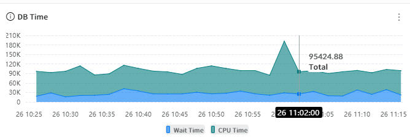

▶ \[그림3\] DB Time 누적 영역 차트

오라클 Efficiency(효율성) 목록

오라클 효율성 지표 값을 통해 현재 오라클이 효율적으로 잘 운영되고 있는지 확인할 수 있습니다. 또한 효율성 지표를 통해 성능을 평가하고 문제를 진단하는데 유용하게 사용될 수 있습니다. 해당 지표들은 100%일때가 가장 효율적이라고 판단할 수 있으며 비율이 낮을수록 해당 지표의 효율성이 낮다고 판단할 수 있습니다. 특히 버퍼 캐시 적중률, Redo NoWait비율이 매우 낮다면 세션 및 SQL 분석을 통해 원인을 찾고 개선할 필요성이 있습니다.

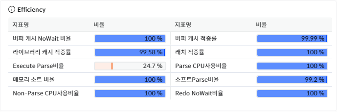

▶ \[그림4\] 오라클 Efficiency(효율성) 목록

> Efficiency 지표

<table>
<thead>
<tr class="header">
<th>버퍼 캐시 NoWait 비율</th>
<th>
버퍼 캐시에서 데이터 블록을 요청할 때 기다림 없이 즉시 제공되는 비율을 나타냅니다. 이는 버퍼 캐시의 효율성을 측정하는 중요한 지표입니다. 이 비율이 높을수록 버퍼 캐시가 효율적으로 작동하고 있음을 나타내며, 낮을 경우 캐시 미스가 많이 발생하고 있음을 의미합니다.

계산식: (즉시 제공된 버퍼 요청 수 / 전체 버퍼 요청 수) * 100
</th>
</tr>
</thead>
<tbody>
<tr class="odd">
<td>버퍼 캐시 적중률</td>
<td>
데이터베이스가 디스크가 아닌 버퍼 캐시에서 데이터를 찾는 비율을 나타냅니다. 이 비율이 높을수록 데이터베이스가 디스크 I/O 대신 메모리에서 데이터를 효율적으로 읽고 있음을 나타냅니다.

계산식: (버퍼 캐시 히트 수 / (버퍼 캐시 히트 수 + 버퍼 캐시 미스 수)) * 100
</td>
</tr>
<tr class="even">
<td>라이브러리 캐시 적중률</td>
<td>
SQL 명령어와 PL/SQL 코드의 파싱된 형태가 라이브러리 캐시에 저장되었을 때 이를 재사용하는 비율을 나타냅니다. 높은 적중률은 파싱된 코드가 캐시에 잘 저장되고 재사용되고 있음을 의미합니다. 이는 파싱 오버헤드를 줄여 성능을 향상시킵니다.

계산식: (라이브러리 캐시 히트 수 / (라이브러리 캐시 히트 수 + 라이브러리 캐시 미스 수)) * 100
</td>
</tr>
<tr class="odd">
<td>래치 적중률</td>
<td>
래치는 짧은 기간 동안 필요한 데이터 구조에 대한 접근을 제어하는 메커니즘입니다. 래치 적중률은 래치가 경쟁 없이 즉시 제공되는 비율을 나타냅니다. 높은 래치 적중률은 래치 경쟁이 적고 시스템이 효율적으로 동작하고 있음을 나타냅니다.

계산식: (래치 히트 수 / (래치 히트 수 + 래치 미스 수)) * 100
</td>
</tr>
<tr class="even">
<td>Execute Parse 비율</td>
<td>SQL 명령어가 파싱되는 횟수에 비해 실제로 실행되는 횟수의 비율을 나타냅니다. 높은 비율은 동일한 SQL 명령어가 여러 번 파싱되지 않고 재사용되고 있음을 나타내며, 이는 성능 최적화에 도움이 됩니다.</td>
</tr>
<tr class="odd">
<td>Parse CPU 사용 비율</td>
<td>
SQL 명령어를 파싱하는 동안 CPU가 실제로 사용된 시간의 비율을 나타냅니다. 이 비율이 높을수록 파싱 작업이 효율적으로 수행되고 있음을 의미합니다.

계산식: (파싱 CPU 시간 / 파싱 경과 시간) * 100
</td>
</tr>
<tr class="even">
<td>메모리 소트 비율</td>
<td>
메모리 내에서 소트 작업이 수행되는 비율을 나타냅니다. 높은 비율은 소트 작업이 디스크가 아닌 메모리에서 수행되고 있어 성능이 향상됨을 의미합니다.

계산식: (메모리 내 소트 수 / 전체 소트 수) * 100
</td>
</tr>
<tr class="odd">
<td>소프트 Parse 비율</td>
<td>
새로운 SQL 명령어를 파싱하지 않고 기존의 파싱된 SQL 명령어를 재사용하는 비율을 나타냅니다. 높은 소프트 파싱 비율은 데이터베이스가 파싱 오버헤드를 줄이고 효율적으로 운영되고 있음을 나타냅니다.

계산식: (소프트 파싱된 SQL 명령어 수 / 전체 파싱된 SQL 명령어 수) * 100
</td>
</tr>
<tr class="even">
<td>Non-Parse CPU사용비율</td>
<td>
전체 CPU 사용량 중 SQL 파싱 외의 작업에 사용된 비율을 나타냅니다. 이 비율이 높을수록 CPU가 파싱 이외의 실제 작업에 더 많이 사용되고 있음을 나타냅니다.

계산식: (전체 CPU 사용량 - 파싱에 사용된 CPU 사용량) / 전체 CPU 사용량 * 100
</td>
</tr>
<tr class="odd">
<td>Redo NoWait비율</td>
<td>
Redo 로그 버퍼에 대한 접근이 기다림 없이 즉시 제공되는 비율을 나타냅니다. 높은 비율은 Redo 로그 버퍼의 경쟁이 적고 성능이 최적화되어 있음을 나타냅니다.

계산식: (Redo 로그 버퍼 NoWait 수 / 전체 Redo 로그 버퍼 요청 수) * 100
</td>
</tr>
</tbody>
</table>

<table>
<tbody>
<tr class="odd">
<td>
노트

효율성 지표들은 모두 수집 주기내에 수행된 성능 값을 기반으로 산정됩니다. 따라서 오라클 기동 후부터 전체 기간에 대해서 산정하는 값과 차이가 있을 수 있습니다. 예를 들어 버퍼 캐시 적중률의 경우 일반적으로 알려진 쿼리를 수행하여 나온 값은 오라클 기동 후부터 쿼리를 실행하는 시점까지의 전체 누적 값을 기반으로 계산됩니다. 이 값은 오라클의 기동 후부터 현재까지의 성능을 가늠해볼 수 있는 값이나 현재 시점을 성능을 알 수는 없습니다. 이에 POLESTAR DPM(오라클) 제품에서는 수집 주기에 성능 값만으로 버퍼 캐시 적중률을 산정합니다. 이렇게 하면 보다 현재 시점의 성능 파악을 쉽게 할 수 있으며 해당 지표의 변화 추이도 상세히 파악할 수 있습니다.
</td>
</tr>
</tbody>
</table>

멀티 지표 라인 차트

오라클 인스턴스의 주요 지표(DB Time, 평균응답시간, Execution수, 논리 읽기 수, 물리 읽기 수, Byte 전송수/수신수)를 라인차트로 확인하여 해당 시점 각 주요 항목별 이상이 없는지 빠르게 확인할 수 있습니다. 또한 차트 좌측 상단 콤보 박스를 통해 인스턴스 관련 추가 지표(효율성 목록에 표시한 지표 등)를 차트에 추가하여 비교 조회할 수 있습니다.

<table>
<tbody>
<tr class="odd">
<td>
노트

한 차트에 지표는 최대 5개까지 추가 가능합니다. 차트는 마우스 드래그를 통해 특정 영역을 확대할 수 있으며 X축을 마우스 드래그 하여 시점 이동도 가능합니다.
</td>
</tr>
</tbody>
</table>

오라클 세션(프로세스) 성능

오라클 세션 및 프로세스 관련 성능을 조회하는 화면입니다. 상단에 세션 사용률 및 세션 수 현황이 표시되며 하단에 세션 관련 지표의 라인차트와 누적 영역 차트가 표시되고 그 밑으로 현재 수행 중이거나 락 세션 목록이 표시됩니다. 해당 화면에서는 추가적으로 “세션 현황”을 볼 수 있는 화면을 제공하며 세션 현황 화면을 통해 세션이 수행한 SQL 정보, “개별 세션 이력 조회”, “개별 SQL 이력 조회”가 가능합니다. “세션 상세 현황”, “개별 세션 이력 조회”, “개별 SQL 이력 조회”에 대한 상세 내용은 본 매뉴얼의 관련 절을 참조하세요.

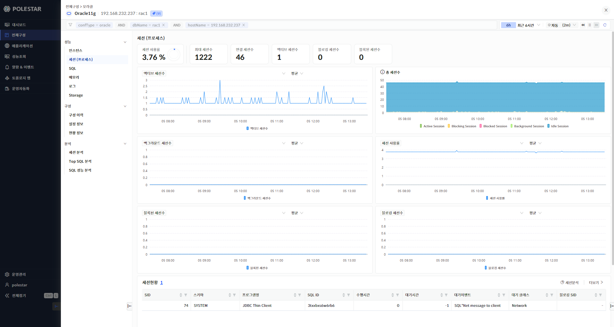

▶ \[그림5\] 오라클 세션(프로세스) 성능

세션 사용률 및 세션수 현황

현재 시점 오라클 허용 가능 최대 세션수 및 연결 세션수, 세션 사용률, 엑티브/블록/블로킹 세션수가 표시되며 연결 세션수 카드 우측 상단에 표시되는 아이콘()을 선택하면 세션 현황 화면이 표시됩니다. 세션 현황 화면에서는 현재 접속된 모든 세션 목록을 조회하고 분석할 수 있으며 자세한 내용은 “세션 현황 화면”절에서 확인하실 수 있습니다.

▶ \[그림6\] 세션 사용률 및 세션수 현황

총 세션수 누적 영역 차트

오라클 접속 세션수를 5가지 상태(Active/Idle/Background/Blocking/Blocked)로 나누어 누적 영역 차트로 표시합니다. 각 범례를 멀티 선택하여 원하는 범례들 만을 보실 수 있습니다. 특히 전체 세션 대비 Active 세션이 많이 지는 시간대나 Blocking, Blocked 세션수가 있는 시간대는 유의해서 살펴볼 필요가 있습니다.

멀티 지표 라인 차트

오라클 세션 관련 주요 지표(엑티브 세션수, 백그라운드 세션수, 세션 사용률, 블록된 세션수, 블로킹 세션수)를 라인차트로 확인하여 해당 시점 각 주요항목별 이상이 없는 지 빠르게 확인할 수 있습니다. 또한 차트 좌측 상단 콤보 박스를 통해 세션 관련 추가 지표를 차트에 추가하여 비교 조회할 수 있습니다.

<table>
<tbody>
<tr class="odd">
<td>
노트

한 차트에 지표는 최대 5개까지 추가 가능합니다. 차트는 마우스 드래그를 통해 특정 영역을 확대할 수 있으며 X축을 마우스 드래그 하여 시점 이동도 가능합니다.
</td>
</tr>
</tbody>
</table>

세션현황 요약 목록

현재 접속된 세션중 Activie 상태이거나 Blocking, Blocked 상태인 세션 목록을 표시합니다. 해당 목록을 통해 현재 수행중인 세션이나 블락된 세션 정보를 확인할 수 있습니다. 보다 상세한 세션 현황 정보는 우측 상단 \[더보기\] 버튼을 클릭하면 나오는 세션 현황 화면에서 확인할 수 있으며 현지 시점 및 과거 수행된 세션 이력을 분석하고 싶다면 우측 상단 \[세션분석\] 버튼을 클릭하여 나오는 세션 이력 화면에서 상세 분석하실 수 있습니다.

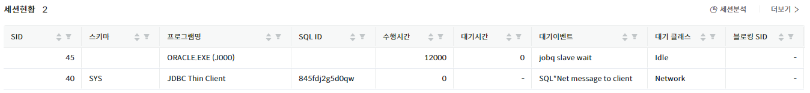

▶ \[그림7\] 세션현황 요약 목록

> 세션현황 목록

| SID     | 세션을 고유하게 식별하는 세션 ID입니다. 각 세션은 고유한 SID를 가지며, 이를 통해 특정 세션을 추적할 수 있습니다. 세션 ID는 숫자로 표시됩니다.                                               |
| ------- | ------------------------------------------------------------------------------------------------------------------------------------ |
| 스키마     | 세션이 현재 사용하고 있는 데이터베이스 스키마의 이름입니다. 스키마는 데이터베이스 객체(테이블, 뷰 등)의 논리적 그룹을 나타냅니다.                                                           |
| 프로그램명   | 데이터베이스에 연결된 클라이언트 프로그램의 이름입니다. 예를 들어, SQL\*Plus, Toad, JDBC 드라이버 등이 될 수 있습니다. 백그라운드 세션의 경우 보통 oracle로 시작하는 이름을 가집니다.                 |
| SQL ID  | 세션이 현재 실행 중인 SQL 문을 고유하게 식별하는 SQL ID입니다. 이는 특정 SQL 문을 추적하고 성능을 분석하는 데 유용합니다.                                                         |
| 수행시간    | 세션이 현재 SQL 문을 실행하는 데 걸린 총 시간입니다.                                                                                                     |
| 대기시간    | 세션이 자원(예: 잠금, 디스크 I/O 등)을 기다리는 데 걸린 총 시간입니다. 이 시간은 세션의 성능 문제를 진단하는 데 중요한 지표입니다.                                                      |
| 대기이벤트   | 세션이 현재 기다리고 있는 특정 이벤트입니다. 예를 들어, 'db file sequential read', 'latch: cache buffers chains' 등이 될 수 있습니다. 이는 세션의 대기 현황을 파악하는 데 도움이 됩니다. |
| 대기클래스   | 대기 이벤트의 클래스를 나타냅니다. 예를 들어, 'User I/O', 'System I/O', 'Concurrency' 등이 있습니다. 이는 대기 이벤트를 그룹화하여 분석하는 데 유용합니다.                           |
| 블로킹 SID | 현재 세션을 블로킹하고 있는 세션의 SID입니다. 이는 잠금 경합 문제를 해결하는 데 중요한 정보를 제공합니다.                                                                       |

오라클 SQL 성능

오라클에서 수행되는 SQL에 대한 성능을 조회하는 화면입니다. 상단에 SQL 평균응답시간, Execution수, 트랜잭션 수에 대한 라인차트가 표시되고 Top SQL에 대한 평균 수행시간을 Scatter 차트로 보여줍니다. 다음으로 Top 5 SQL을 4가지 기준(평균 수행시간, 평균 CPU시간, 평균 논리 읽기 수, 평균 물리 읽기 수)으로 표시합니다. Top 5 SQL 목록에서는 “Top SQL 분석” 화면으로 이동할 수 있는 기능도 제공합니다. “Top SQL 분석” 화면에 대한 자세한 내용은 “Top SQL 분석”절을 참조하세요.

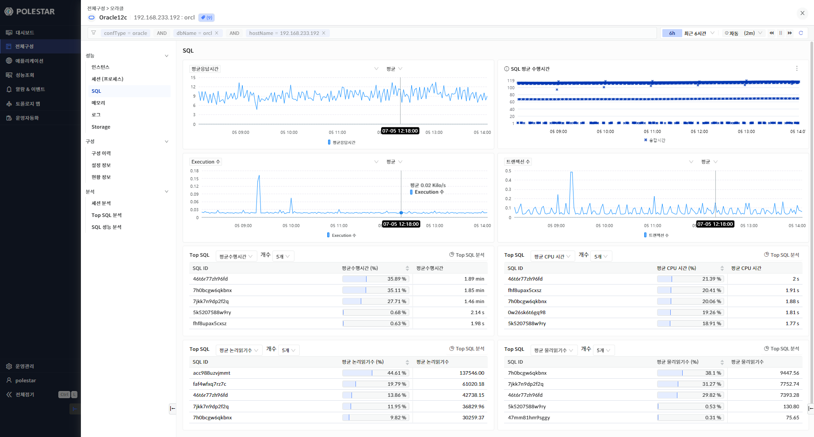

▶ \[그림8\] 오라클 세션(프로세스) 성능

멀티 지표 라인 차트

오라클 SQL 성능 주요 지표(평균응답시간, Execution수, 트랜젝션수)를 라인차트로 확인하여 해당 시점 각 주요항목별 이상이 없는 지 빠르게 확인할 수 있습니다.

<table>
<tbody>
<tr class="odd">
<td>
노트

한 차트에 지표는 최대 5개까지 추가 가능합니다. 차트는 마우스 드래그를 통해 특정 영역을 확대할 수 있으며 X축을 마우스 드래그 하여 시점 이동도 가능합니다.
</td>
</tr>
</tbody>
</table>

SQL 평균 수행시간 Scatter 차트

평균 수행시간이 1초 이상인 SQL의 수행시간을 Scatter 차트에 각 점으로 표시합니다. 우측 상단에 차트 메뉴를 통해 “SQL 성능 분석” 화면으로 이동할 수 있습니다. “SQL 성능 분석”에 대한 자세한 내용은 “SQL 성능 분석”절을 참조하세요.

▶ \[그림9\] SQL 평균 수행시간 Scatter 차트

<table>
<tbody>
<tr class="odd">
<td>
노트

Scatter 차트는 최대 1일 데이터 까지만 표시되며 따라서 타임 셀렉터를 1일 이상으로 설정하여도 조회 기간 중 가장 최근 1일 데이터 까지만 표시됩니다.
</td>
</tr>
</tbody>
</table>

Top SQL 목록

Top SQL목록은 4가지 기준(평균 수행시간, 평균 CPU시간, 평균 논리 읽기 수, 평균 물리 읽기 수)으로 기준 값이 큰 5개의 SQL을 각 지표 값과 함께 표시합니다. 표시되는 개수는 콤보 박스에서 선택(5개, 10개, 20개)가능하며 기준 지표도 콤보 박스에서 변경할 수 있습니다. 또한 목록 우측 상단 \[Top SQL 분석\] 버튼을 선택하여 “Top SQL 분석” 화면으로 이동할 수 있습니다. “SQL 성능 분석”에 대한 자세한 내용은 “SQL 성능 분석”절을 참조하세요.

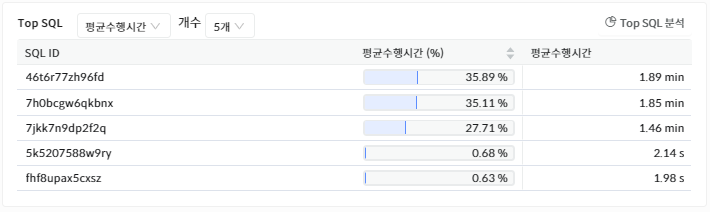

▶ \[그림10\] Top SQL 목록

오라클 메모리 성능

오라클에서 사용하는 메모리(캐시)관련 성능을 조회하는 화면입니다. 상단에 전반적인 SGA, PGA 사용현황을 도넛 차트로 표시합니다. 하단에는 메모리(캐시) 관련 주요 지표를 라인차트로 표시합니다.

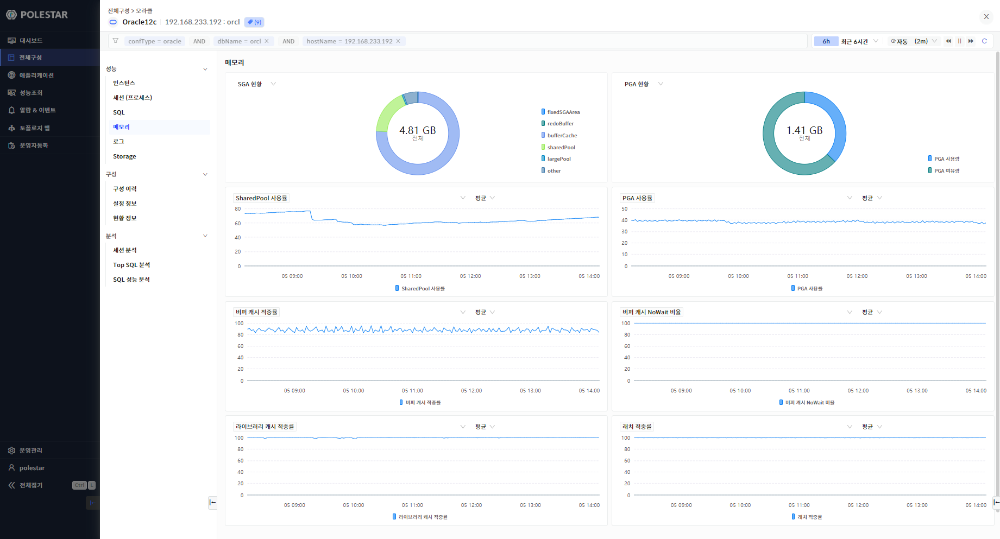

▶ \[그림11\] 오라클 메모리 성능

멀티 지표 라인 차트

오라클 메모리(캐시) 관련 주요 성능 지표(SharedPool 사용률, PGA 사용률, 버퍼 캐시 적중률, 버퍼 캐시 NoWait 비율, 라이브러리 캐시 적중률, 래치 적중률)를 라인차트로 확인하여 해당 시점 각 주요항목별 이상이 없는 지 빠르게 확인할 수 있습니다.

<table>
<tbody>
<tr class="odd">
<td>
노트

한 차트에 지표는 최대 5개까지 추가 가능합니다. 차트는 마우스 드래그를 통해 특정 영역을 확대할 수 있으며 X축을 마우스 드래그 하여 시점 이동도 가능합니다.
</td>
</tr>
</tbody>
</table>

오라클 로그 성능

오라클 Redo 로그 관련 성능을 조회하는 화면입니다. Redo 로그 관련 주요 지표를 라인차트로 표시합니다.

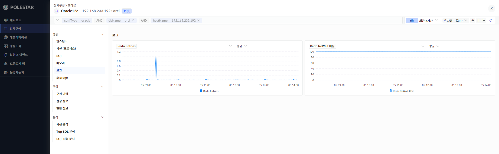

▶ \[그림12\] 오라클 로그 성능

멀티 지표 라인 차트

오라클 로그 관련 주요 성능 지표(Redo Entries, Redo NoWait 비율)를 라인차트로 확인하여 해당 시점 각 주요항목별 이상이 없는 지 빠르게 확인할 수 있습니다.

<table>
<tbody>
<tr class="odd">
<td>
노트

한 차트에 지표는 최대 5개까지 추가 가능합니다. 차트는 마우스 드래그를 통해 특정 영역을 확대할 수 있으며 X축을 마우스 드래그 하여 시점 이동도 가능합니다.
</td>
</tr>
</tbody>
</table>

오라클 Storage 성능

오라클 Storage(저장공간) 관련 성능을 조회하는 화면입니다. 테이블스페이스, 테이블, 인덱스 관련 주요 지표를 라인차트로 표시하며 하단에 테이블스페이스 사용량이 높은 Top 5 테이블스페이스 정보를 목록으로 보여줍니다.

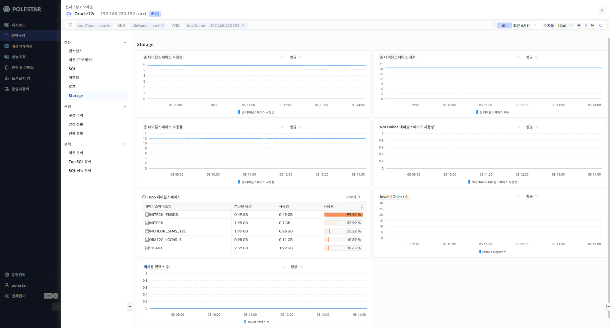

▶ \[그림13\] 오라클 Storage 성능

멀티 지표 라인 차트

오라클 Storage 관련 주요 성능 지표(총 테이블스페이스 사용량, 총 테이블스페이스 개수, 총 테이블스페이스 사용률, Not Online 테이블스페이스 사용량, Invalid Object수, 미사용 인덱스 수)를 라인차트로 확인하여 해당 시점 각 주요항목별 이상이 없는 지 빠르게 확인할 수 있습니다.

<table>
<tbody>
<tr class="odd">
<td>
노트

한 차트에 지표는 최대 5개까지 추가 가능합니다. 차트는 마우스 드래그를 통해 특정 영역을 확대할 수 있으며 X축을 마우스 드래그 하여 시점 이동도 가능합니다.
</td>
</tr>
</tbody>
</table>

Top5 테이블스페이스

테이블 스페이스 사용률이 높은 5개의 테이블스페이스를 목록으로 표시합니다. 목록에는 테이블스페이스에 할당된 용량, 사용량, 사용률 정보가 표시됩니다. 목록 우측 상단 \[모두 보기\] 버튼을 클릭하면 “테이블스페이스 목록” 화면이 표시됩니다. “테이블스페이스 목록”화면을 통해 전체 테이블스페이스 목록과 각 테이블스페이스 사용량 및 상태를 확인하실 수 있습니다. 보다 자세한 내용은 “테이블스페이스 목록”절을 참조하세요.

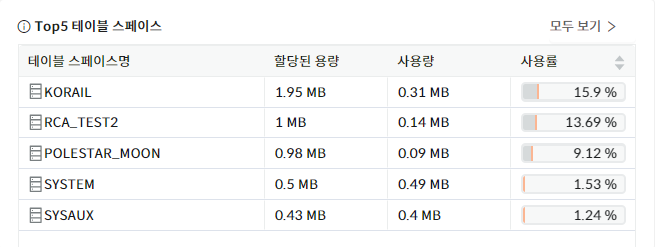

▶ \[그림14\] Top5 테이블스페이스 목록

테이블스페이스 목록

오라클 테이블스페이스 전체 목록 및 관련 성능을 조회하는 화면입니다. 각 테이블스페이스의 최대 가용량 대비 사용률에 대한 이력 차트를 제공합니다. 차트를 클릭하면 클릭한 차트 아래로 확대된 차트가 표시되고 해당 차트에서 X축 드래그를 통해 해당 기간에 대한 차트 확대를 할 수 있습니다.

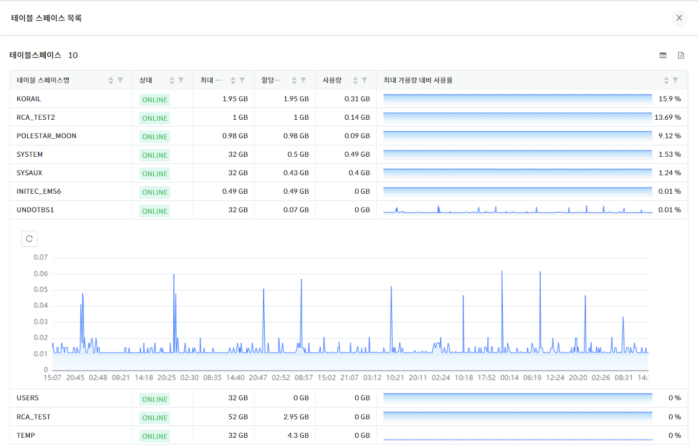

▶ \[그림15\] 테이블스페이스 목록

> 테이블스페이스 목록

<table>
<thead>
<tr class="header">
<th>테이블스페이스명</th>
<th>테이블스페이스 이름입니다.</th>
</tr>
</thead>
<tbody>
<tr class="odd">
<td>상태</td>
<td>
테이블스페이스 상태를 표시합니다.

상태값 목록

ONLINE: 테이블스페이스가 온라인 상태로 사용 가능함.

OFFLINE: 테이블스페이스가 오프라인 상태로 접근 불가능함.

READ ONLY: 테이블스페이스가 읽기 전용 상태로 데이터 수정 불가능함.

READ WRITE: 테이블스페이스가 읽기-쓰기 가능 상태로 정상 운영 중임.
</td>
</tr>
<tr class="even">
<td>최대 가용량</td>
<td>테이블스페이스에 할당 가능한 최대 가용량입니다.</td>
</tr>
<tr class="odd">
<td>할당된 용량</td>
<td>테이블스페이스에 현재 할당된 용량입니다.</td>
</tr>
<tr class="even">
<td>사용량</td>
<td>테이블스페이스에 현재 할당된 용량 대비 사용률입니다.</td>
</tr>
<tr class="odd">
<td>최대 가용량 대비 사용률</td>
<td>테이블스페이스에 할당 가능한 최대 가용량 대비 사용률입니다.</td>
</tr>
</tbody>
</table>

오라클 구성

오라클 구성 메뉴는 구성이력, 설정정보, 현황정보로 구성 되어있습니다. 구성 이력에서는 오라클 환경변수, 사용자목록, 테이블 목록 등 구성정보를 확인하고 변경이력을 비교 조회할 수 있으며 설정 정보에서는 현재 설정된 오라클 접속 정보나 담당자, 수집 조건 등 변경할 수 있습니다. 그리고 현황정보에서는 현재 시점의 환경변수, 사용자목록, 테이블스페이스 사용량, 테이블 목록, 인덱스 목록을 확인하실 수 있습니다.

<table>
<tbody>
<tr class="odd">
<td>
노트

현황정보의 경우 대상 오라클에 직접 조회 쿼리를 수행하여 가져옵니다. 따라서 오라클이 다운된 경우는 조회할 수 없습니다.
</td>
</tr>
</tbody>
</table>

오라클 구성 이력

구성 이력화면은 크게 오라클과 테이블스페이스 2개의 탭으로 구분하여 표시합니다. 화면 구성은 상단에 구성 변경 현황 바차트가 표시되어 타임 셀렉터 기간내에 변경이 발생된 구성 변경 개수를 표시해줍니다. 이를 통해 구성이 변경된 시점을 쉽게 파악할 수 있습니다. 하단에는 현재 시점의 구성 정보가 표시됩니다. 구성 이력화면에서는 현재 시점의 구성 정보와 과거 구성 정보를 비교해 볼 수 있는 기능을 제공합니다. 자세한 내용은 ”구성 이력 조회 방법”절을 참고하세요.

오라클 탭

오라클 탭에서는 오라클 환경변수, 사용자목록, 테이블 목록, 인덱스 목록 등의 구성정보를 조회하거나 과거 이력과 비교할 수 있습니다.

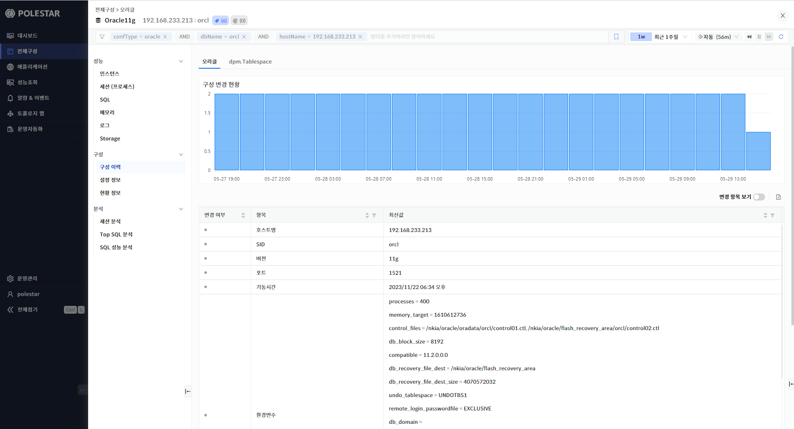

▶ \[그림16\] 오라클 구성 탭

> 오라클 구성 지표

<table>
<thead>
<tr class="header">
<th>호스트명</th>
<th>오라클 등록시 입력한 호스트명 또는 IP (예: oracle-server1)</th>
</tr>
</thead>
<tbody>
<tr class="odd">
<td>SID</td>
<td>오라클 등록시 입력한 SID명 또는 서비스명(예: orcl)</td>
</tr>
<tr class="even">
<td>버전</td>
<td>오라클 Major 버전(예: 11g, 21c)</td>
</tr>
<tr class="odd">
<td>포트</td>
<td>오라클 접속 포트(예: 1521)</td>
</tr>
<tr class="even">
<td>기동시간</td>
<td>오라클 기동 시간(예: 2033/11/22 06:34 오후)</td>
</tr>
<tr class="odd">
<td>환경변수</td>
<td>
오라클 환경 변수 중 사용자가 변경한 환경 변수를 “변수명 = 값”으로 표시

(예: processes = 400

memory_target = 1610612736

db_block_size = 8192)

예시 설명

변수명(process) = 값(400)으로 표시
</td>
</tr>
<tr class="even">
<td>사용자 목록</td>
<td>
오라클에 등록된 사용자 목록 및 속성을 표시

(예: SYS(74) = status(OPEN),created(09/08/15),lockDate(),expiryDate())

예시 설명

SYS: 사용자명

(74): 사용자 ID

satus: 사용자 상태(OPEN, LOCKED, EXPIRED, EXPIRED&amp;LOCKED)

created: 사용자 생성 일자

lockDate: 사용자 잠금 발생일자

expiryDate: 사용자 삭제 일자
</td>
</tr>
<tr class="odd">
<td>테이블 목록</td>
<td>
오라클에 추가된 테이블 목록 및 속성을 표시

(예: USER1.HISTORY_TBL = ctime(24-03-05 05:06),status(VALID), last_ddl4-03-05 05:06))

예시 설명

USER1: 스키마명

HISTORY_TBL: 테이블명

cime: 생성일자

status: 테이블 상태(VALID, INVALID)

VALID:: 테이블이 유효하고, 컴파일 오류 없이 정상적으로 사용 가능한 상태

INVALID: 테이블이 유효하지 않거나, 컴파일 오류가 있는 상태입니다. 예를 들어, 객체의 종속성에 문제가 있거나, 객체 정의에 오류가 있는 경우입니다. INVALID 상태의 객체는 재컴파일이 필요할 수 있습니다.

last_ddl: 테이블에 마지막 DDL(Data Definition Language) 작업이 수행된 시간

주요 DDL 작업 예시

CREATE (객체 생성)

ALTER(객체 수정)

DROP(객체 삭제)

TRUNCATE(테이블 데이터 삭제)

RENAME(객체 이름 변경)

GRANT 및 REVOKE(권한 부여 및 회수)
</td>
</tr>
<tr class="even">
<td>인덱스 목록</td>
<td>
오라클에 추가된 인덱스 목록 및 속성을 표시

(예: USER1.SYS_HIST_INX1= ctime(24-03-05 05:06),status(VALID), last_ddl(24-03-05 05:06))

예시 설명

USER1: 스키마명

SYS_HIST_INX1: 인덱스명

ctime: 생성일자

status: 인덱스 상태(VALID, INVALID)

VALID: 인덱스가 유효하고, 컴파일 오류 없이 정상적으로 사용 가능한 상태

INVALID: 인덱스가 유효하지 않거나, 컴파일 오류가 있는 상태입니다. 예를 들어, 객체의 종속성에 문제가 있거나, 객체 정의에 오류가 있는 경우입니다. INVALID 상태의 객체는 재컴파일이 필요할 수 있습니다.

last_ddl: 테이블에 마지막 DDL(Data Definition Language) 작업이 수행된 시간
</td>
</tr>
</tbody>
</table>

<table>
<tbody>
<tr class="odd">
<td>
주의

테이블 목록과 인덱스 목록은 오라클 내에 테이블과 인덱스가 많을 경우 대상서버에 쿼리 부하 및 저장 부하가 발생할 수 있습니다. 따라서 테이블과 인덱스 생성 및 상태 변경이 필요한 오라클에 한하여 저장하는 것이 좋습니다. 테이블 및 인덱스 구성 저장 여부는 오라클 추가시나 오라클 설정에서 지정할 수 있습니다.
</td>
</tr>
</tbody>
</table>

테이블스페이스 탭

테이블스페이스 탭에서는 개별 테이블스페이스별 구성 정보를 확인하고 이력 비교해 볼 수 있습니다.

▶ \[그림17\] 테이블스페이스 구성 탭

> 테이블스페이스 구성

<table>
<thead>
<tr class="header">
<th>크기</th>
<th>테이블스페이스의 Byte 단위 용량.</th>
</tr>
</thead>
<tbody>
<tr class="odd">
<td>상태</td>
<td>
테이블스페이스 상태(ONLINE, OFFLINE, READ ONLY, READ WRITE)

상태값 설명

ONLINE: 테이블스페이스가 온라인 상태로 사용 가능함.

OFFLINE: 테이블스페이스가 오프라인 상태로 접근 불가능함

READ ONLY: 테이블스페이스가 읽기 전용 상태로 데이터 수정 불가능함.

READ WRITE: 테이블스페이스가 읽기-쓰기 가능 상태로 정상 운영중임.
</td>
</tr>
</tbody>
</table>

구성 변경 이력 조회

구성 이력화면은 오라클의 현재 구성과 과거 구성 값을 항목별로 비교하여 변경 여부를 확인할 수 있는 기능을 제공합니다. 이를 통해 과거 구성 값이 현재 어떻게 변경되었는지 확인이 가능합니다. 또한 비교 목록 우측 상단에 변경 항목 보기 토글 버튼을 클릭하면 변경이 발생된 항목만 표시하여 빠르게 변경 항목 확인이 가능합니다.

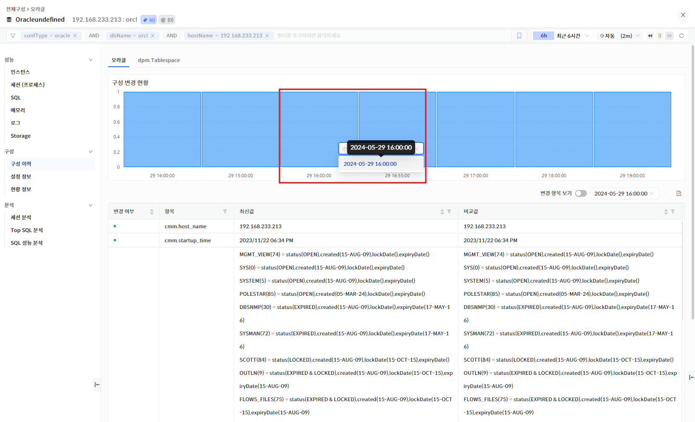

▶ \[그림18\] 구성 변경 이력 조회

> 구성 변경 이력 조회 절차

1.  구성 변경 현황 바 차트에서 비교하고자 하는 시점의 바를 클릭

2.  팝업으로 표시된 콤보 박스에서 비교하고자 하는 일자 선택

3.  하단 목록에 항목별로 최신 값과 비교 값이 표시되고 변경된 항목은 변경여부 컬럼에 빨간색으로 표시됨

4.  목록 상단에 변경 항목 보기 토글 버튼을 클릭하면 변경된 항목만 목록에 표시됨

5.  목록 상단에 날자 선택 콤보 박스에서 비교 날짜를 선택하여도 목록에 비교날짜에 해당하는 값이 비교 값에 표시되어 비교할 수 있음

엑셀 저장

구성 목록 우측 상단 \[엑셀 저장\] 버튼을 통해 세션 목록을 엑셀로 저장할 수 있습니다.

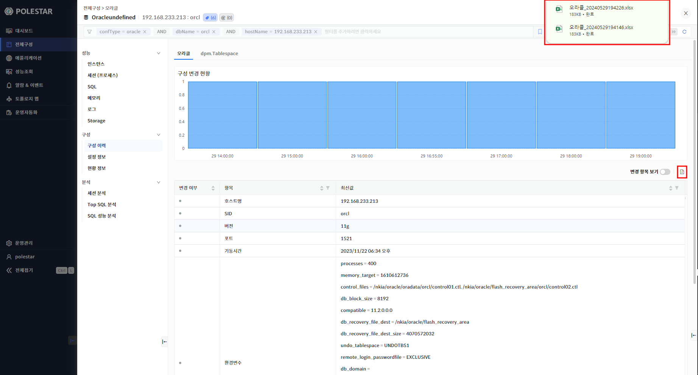

▶ \[그림19\] 구성 목록 엑셀 저장

> 구성 목록 엑셀 저장 및 조회 절차

1.  구성에서 우측 상단 엑셀 저장 아이콘 클릭

2.  브라우저 우측 상단 창에 저장된 엑셀 파일명이 표시됨

3.  해당 파일명을 클릭하여 엑셀 파일 확인

오라클 설정 정보

설정 정보 화면은 오라클에 설정한 기본 접속 정보와 상세정보(Top SQL 수집여부, Plan 수집 여부 등) 관리 상태, 해당 오라클에 대한 역할별 권한 설정, 담당자 설정을 할 수 있는 화면입니다. 부가적으로 오라클에 설정되어 있는 알람 정보(알람 정책 및 알람 개수), 수집 정책, 성능/구성 최근 수집 시간을 확인할 수 있으며 성능 및 구성을 즉시 수집할 수 있는 기능도 제공합니다.

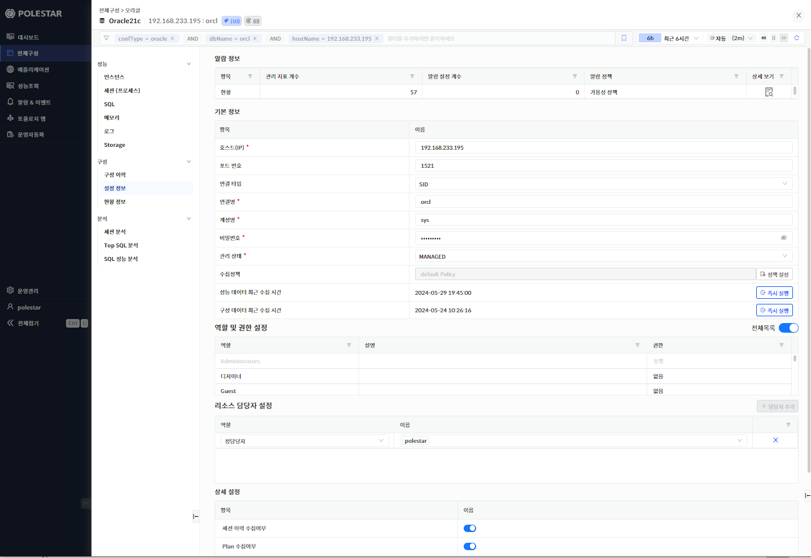

▶ \[그림20\] 오라클 설정 정보

알람 정보

오라클에서 수집하는 관리 지표 개수와 현재 설정된 알람 개수 및 알람 정책 정보를 제공합니다. \[상세보기\]를 선택하여 알람 상세 드로어에서 알람 정책의 세부 알람 설정 목록을 확인할 수 있습니다.

<table>
<tbody>
<tr class="odd">
<td>
노트

세부 알람 설정은 [알람 &amp; 이벤트] 메뉴에서 변경할 수 있습니다. 자세한 내용은 ‘알람 상세’ 매뉴얼을 참고하시기 바랍니다.
</td>
</tr>
</tbody>
</table>

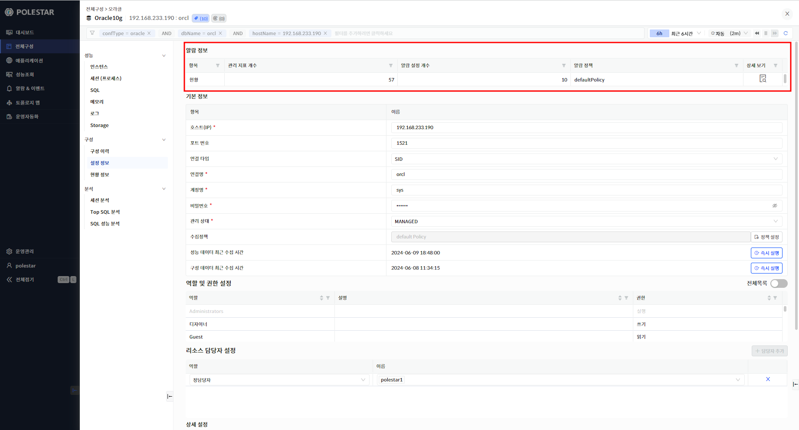

▶ \[그림21\] 알람 정보

▶ \[그림22\] 알람 정책 목록

> 알람 정책 목록

| 관리 지표 개수 | POLESTAR에서 관리하는 성능 지표 개수를 표시합니다.         |
| -------- | ---------------------------------------- |
| 알람 설정 개수 | 서버에 설정된 알람 개수를 표시합니다..                   |
| 알람 정책    | 서버에 설정된 알람 정책을 표시합니다.                    |
| 상세 보기    | 알람 정책의 세부 알람 설정 목록을 확인할 수 있는 드로어를 호출합니다. |

기본 정보

오라클의 기본 정보를 표시합니다. ‘호스트(IP)’, ‘포트번호’, ‘연결명’, ‘비밀번호’ 등의 항목을 변경할 수 있습니다.

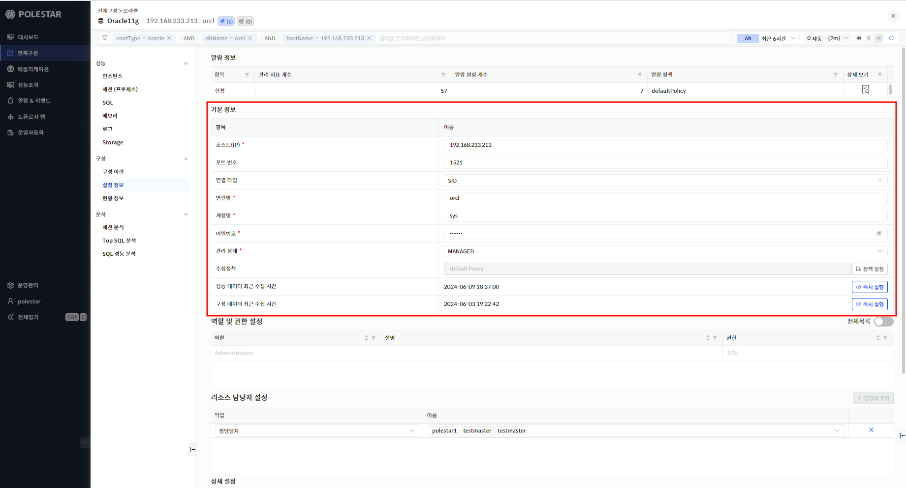

▶ \[그림23\] 기본 정보

> 기본 정보

| 호스트(IP)         | 오라클 호스트명 또는 IP입니다.                                                                           |
| --------------- | -------------------------------------------------------------------------------------------- |
| 포트 번호           | 오라클 포트 번호입니다.                                                                                |
| 연결 타입           | 오라클 연결 타입입니다. 오라클의 경우 SID와 서비스로 구분됩니다.                                                       |
| 연결명             | 오라클의 연결명을 입력합니다. 위의 연결 타입에 따라 SID명이거나 서비스 명입니다.                                              |
| 계정명             | 오라클의 접속 계정 이름입니다.                                                                            |
| 비밀번호            | 오라클 접속 계정의 비밀번호입니다.                                                                          |
| 관리 상태           | 대상 오라클의 관리 상태를 선택합니다.                                                                        |
| 수집 정책           | 대상 오라클의 수집 정택입니다. 우측 정책 설정 버튼을 클릭하여 대상 오라클의 지표 별 수집 정책을 설정할 수 있습니다. 상세한 내용은 “정책 설정”절을 참조하세요. |
| 성능 데이터 최근 수집 시간 | 오라클 성능 데이터를 수집한 가장 최근 시간을 표시합니다. 즉시 실행 버튼을 클릭하여 성능 데이터 수집을 즉시 실행하실 수 있습니다.                   |
| 구성 데이터 최근 수집 시간 | 오라클 구성 데이터를 수집한 가장 최근 시간을 표시합니다. 즉시 실행 버튼을 클릭하여 구성데이터 수집을 즉시 실행하실 수 있습니다.                    |

정책 설정

기본 정보 목록에서 \[정책 설정\] 버튼은 클릭하여 오라클에 설정된 데이터 수집 정책의 세부 설정을 목록을 조회할 수 있고, 설정을 변경하거나 변경된 설정을 수집 정책의 기본값으로 초기화할 수 있습니다. 데이터 수집 정책 설정 방법에 대한 자세한 내용은 ‘데이터수집설정’ 매뉴얼을 참조하시기 바랍니다.

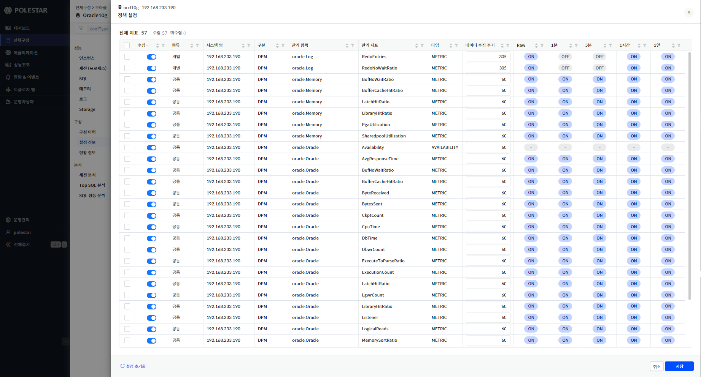

▶ \[그림24\] 기본 정보 – 정책 설정

> 정책 설정 목록

<table>
<thead>
<tr class="header">
<th>수집여부</th>
<th>
지표별 성능 데이터 수집 여부를 설정합니다.

기본적으로 POLESTAR에서 지원하는 모든 지표를 수집하도록 설정 되어있으며, 수집 여부 변경 시 해당 지표는 더 이상 POLESTAR에서 처리하지 않습니다.

: 수집 지표

: 미수집 지표
</th>
</tr>
</thead>
<tbody>
<tr class="odd">
<td>종류</td>
<td>
지표 설정 종류를 표시합니다. 기본값은 ‘COMMON’이며, 세부 설정을 변경한 경우 ‘CUSTOM’으로 표시됩니다.

COMMON: 공통 설정, 관리지표 공통 설정의 지표 설정을 동일하게 사용하는 경우

CUSTOM: 개별 설정, 관리지표 공통 설정의 지표 설정을 변경해서 사용하는 경우
</td>
</tr>
<tr class="even">
<td>시스템 명</td>
<td>오라클의 호스트명 또는 IP를 표시합니다.</td>
</tr>
<tr class="odd">
<td>구분</td>
<td>POLESTAR에서 관제하는 제품군을 표시합니다.</td>
</tr>
<tr class="even">
<td>관리 항목</td>
<td>지표 그룹을 표시합니다.</td>
</tr>
<tr class="odd">
<td>관리 지표</td>
<td>지표명을 표시합니다.</td>
</tr>
<tr class="even">
<td>타입</td>
<td>
지표의 데이터 타입을 표시합니다.

AVAILABILITY: 가용성 데이터

TRAIT: 문자열 데이터

METRIC: 수치 데이터

TABULAR: 목록형 데이터
</td>
</tr>
<tr class="odd">
<td>데이터 수집 주기</td>
<td>
지표 별 데이터 수집 주기를 표시합니다.

모든 지표는 기본 60초 주기로 설정되어 있습니다. 데이터 수집 주기는 관리 항목별로 공통 적용되기 때문에 특정 지표의 데이터 수집 주기를 변경하면 해당 지표와 관리 항목이 동일한 모든 지표의 데이터 수집 주기가 일괄 업데이트 됩니다.
</td>
</tr>
<tr class="even">
<td>통계 데이터</td>
<td>
METRIC 데이터의 주기 별 통계 데이터 저장 여부를 설정합니다.

POLESTAR는 1분, 5분, 1시간, 1일 주기의 통계 데이터를 제공합니다.

통계 저장 여부는 METRIC 데이터에 대해서만 설정할 수 있으며, 데이터 수집 주기가 통계 주기보다 긴 경우만 통계 저장을 지원합니다.

<ul>
<li>
: 통계 데이터 저장
</li>
</ul>
<ul>
<li>
: 통계 데이터 저장 안함
</li>
</ul></td>
</tr>
</tbody>
</table>

역할 및 권한 설정

오라클에 대한 접근 권한을 조회하고 변경할 수 있습니다. Administrators 역할은 모든 장비에 기본으로 포함되어 있으며 해제할 수 없습니다.

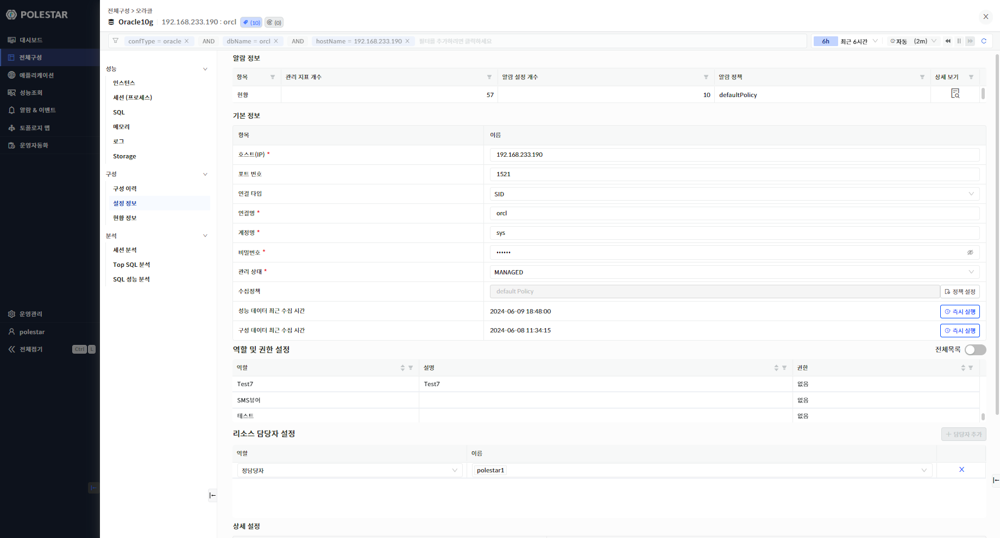

▶ \[그림25\] 역할 및 권한 설정

리소스 담당자 설정

오라클의 담당자를 설정할 수 있습니다. (‘담당자 추가’ 기능은 지원 예정입니다.)

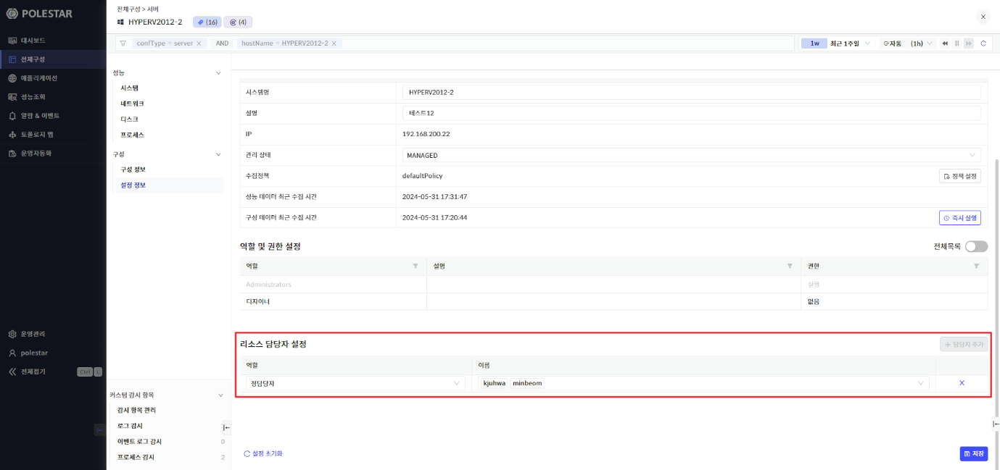

▶ \[그림26\] 리소스 담당자 설정

설정 초기화

설정 정보 화면 하단의 \[설정 초기화\] 버튼을 클릭하여 설정 정보 화면에서 변경했으나 아직 저장은 하지 않은 모든 입력 값을 처음 조회 상태로 되돌릴 수 있습니다.

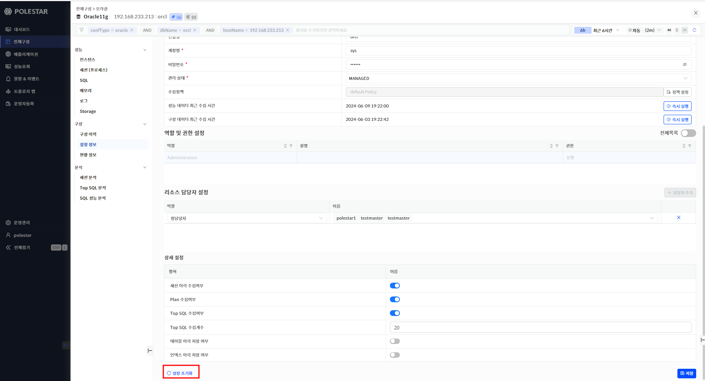

▶ \[그림27\] 설정 초기화

상세 설정

상세 설정을 통해 대상 오라클에 세션 이력 정보를 수집여부, Plan 수집여부, Top SQL 수집 여부, Top SQL 수집 개수 등을 설정할 수 있습니다.

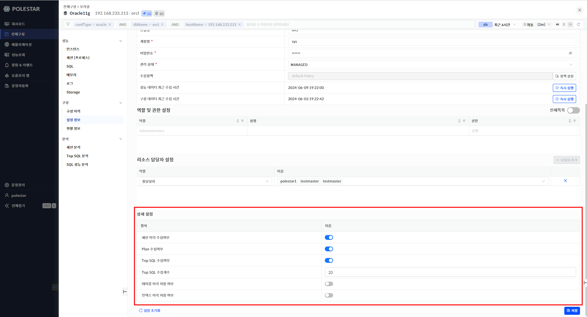

▶ \[그림28\] 상세 설정

> 상세 설정

| 세션 이력 수집 여부  | 세션 이력을 수집할 지 여부를 선택합니다. 세션 이력을 저장하면 세션 분석화면을 통해 세션 분석을 할 수 있습니다.                                                                                                       |
| ------------ | ---------------------------------------------------------------------------------------------------------------------------------------------------------------------- |
| Plan 수집여부    | Plan 정보를 수집할 지 여부를 선택합니다. Plan 정보를 수집하면 Top SQL 분석 및 SQL 분석 화면에서 Plan 정보를 볼 수 있습니다.                                                                                    |
| Top SQL 수집여부 | Top SQL 이력을 수집할지 여부를 선택합니다. Top SQL을 수집 하면Top SQL 분석 및 SQL 분석 화면에서 SQL 이력 분석을 할 수 있습니다.                                                                                |
| Top SQL 수집개수 | Top SQL 이력 저장 시 저장될 Top SQL 개수를 설정합니다. 수집 개수가 많을수록 많은 SQL이 저장되지만 모니터링 대상 데이터베이스에 부하를 줄 수 있습니다.                                                                         |
| 테이블 이력 저장 여부 | 테이블 구성 정보를 저장할지 여부를 선택합니다. 전체 테이블 목록 및 테이블의 상태 등이 구성에 저장되며 추후 구성 이력 비교에서 변경된 정보를 조회해볼 수 있습니다. 단 테이블이 많은 오라클 장비의 경우 조회 부하가 있을 수 있습니다. 단순 모니터링을 하는 경우라면 수집하지 않는 것이 좋습니다. |
| 인덱스 이력 저장 여부 | 인덱스 구성 정보를 저장할지 여부를 선택합니다. 전체 인덱스 목록 및 인덱스의 상태 등이 구성에 저장되며 추후 구성 이력 비교에서 변경된 정보를 조회해볼 수 있습니다. 단 인덱스가 많은 오라클의 경우 조회 부하가 있을 수 있습니다. 단순 모니터링을 하는 경우라면 수집하지 않는 것이 좋습니다.    |

<table>
<tbody>
<tr class="odd">
<td>
노트

관제 대상 데이터베이스 모니터링을 위해 최소한의 부하만으로 가용성 및 성능 모니터링만 필요하다면 Plan 이력이나 Top SQL 수집 여부, 테이블/인덱스 이력 저장 여부를 “아니오”로 설정하여 대상 장비 모니터링을 위해 수행되는 쿼리 부하를 줄일 수 있습니다.
</td>
</tr>
</tbody>
</table>

오라클 구성 현황 정보

구성 현황 정보화면에서는 현재 시점의 오라클 환경 변수, 사용자, 테이블스페이스, 테이블, 인덱스 정보를 제공합니다. 해당 화면을 통해 조회하고자 하는 환경 변수를 목록 검색으로 빠르게 찾아볼 수 있으며 오라클 내에 사용자 목록 및 사용자의 현재 상태 등을 조회하거나 테이블스페이스, 테이블, 인덱스의 사용현황을 쉽게 파악할 수 있습니다.

<table>
<tbody>
<tr class="odd">
<td>
노트

구성 현황 값은 오라클의 현재 값을 조회하기 위해 대상 오라클에 직접 쿼리를 수행하여 조회해 옵니다. 따라서 오라클이 다운된 상태에서는 조회할 수 없습니다. 다운된 상태에서는 구성 이력 화면에서 요약된 구성 정보로 확인하실 수 있습니다.
</td>
</tr>
</tbody>
</table>

환경 변수

오라클에 설정된 환경 변수 값 및 해당 변수의 상태 값, 사용자 수정 여부, 영문 설명을 볼 수 있는 화면입니다.

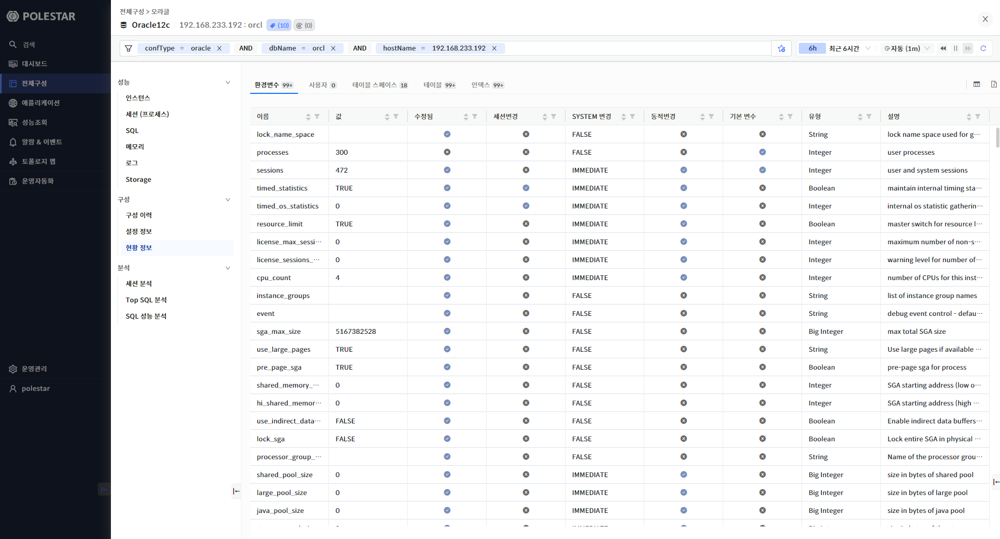

▶ \[그림29\] 오라클 환경 변수 정보

> 환경 변수 목록

<table>
<thead>
<tr class="header">
<th>이름</th>
<th>환경 변수 이름입니다.</th>
</tr>
</thead>
<tbody>
<tr class="odd">
<td>값</td>
<td>환경 변수 현재 설정 값입니다.</td>
</tr>
<tr class="even">
<td>수정됨</td>
<td>환경 변수가 기본값을 사용 중인지 여부를 나타냅니다.</td>
</tr>
<tr class="odd">
<td>세션변경</td>
<td>환경 변수가 세션 레벨에서 수정 가능한지를 나타냅니다. 세션 레벨에서 수정 가능한 환경변수는 현재 세션에만 영향을 미치며, 다른 세션에는 영향을 주지 않습니다.</td>
</tr>
<tr class="even">
<td>SYSTEM변경</td>
<td>
매개변수가 시스템 레벨에서 수정 가능한지를 나타냅니다. 시스템 레벨에서 수정 가능한 매개변수는 데이터베이스 인스턴스 전체에 영향을 미칩니다.

IMMEDIATE: 매개변수를 즉시 변경할 수 있음

DEFERRED: 변경이 다음 세션 또는 인스턴스 시작 시 적용됨

FALSE: 시스템 레벨에서 매개변수를 수정할 수 없음
</td>
</tr>
<tr class="odd">
<td>동적변경</td>
<td>환경변수가 인스턴스 레벨에서 수정 가능한지를 나타냅니다. 인스턴스 레벨에서 수정 가능하다는 것은 클러스터 환경에서 각 인스턴스(예: Oracle Real Application Clusters, RAC)에 대해 개별적으로 환경변수를 설정할 수 있다는 의미입니다.</td>
</tr>
<tr class="even">
<td>기본 변수</td>
<td>환경변수가 기본 환경변수인지 여부를 나타냅니다. 기본 변수는 데이터베이스의 기본 설정을 구성하는 데 필요한 환경 변수입니다. 일반적으로 데이터베이스를 설치하고 기본적인 성능과 운영을 설정하는 데 사용됩니다.</td>
</tr>
<tr class="odd">
<td>유형</td>
<td>
환경변수의 데이터 유형을 나타냅니다

데이터 유형

Boolean, String, Integer, Parameter file, Reserved, Big Integer
</td>
</tr>
<tr class="even">
<td>설명</td>
<td>환경변수에 대한 설명입니다. 환경변수가 무엇을 하는지, 어떤 용도로 사용되는지에 대한 정보를 제공합니다.</td>
</tr>
</tbody>
</table>

사용자

오라클에 등록된 사용자 전체 목록 및 사용자 상태, 생성일자, 유저 그룹 등을 조회할 수 있는 화면입니다.

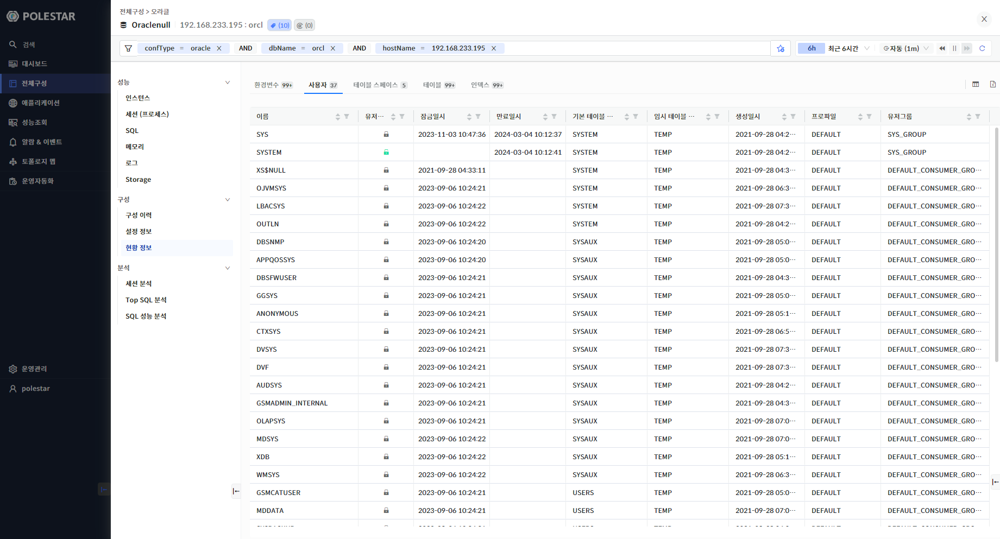

▶ \[그림30\] 오라클 사용자 정보

> 사용자 목록

<table>
<thead>
<tr class="header">
<th>이름</th>
<th>사용자 계정명입니다.</th>
</tr>
</thead>
<tbody>
<tr class="odd">
<td>유저상태</td>
<td>
사용자의 계정 상태를 나타냅니다.

OPEN: 계정이 활성화되어 있습니다.

LOCKED: 계정이 잠겨 있습니다.

EXPIRED: 계정의 비밀번호가 만료되었습니다.

EXPIRED (GRACE): 계정의 비밀번호가 곧 만료됩니다.

LOCKED (TIMED): 시간에 의해 잠긴 계정입니다.

EXPIRED &amp; LOCKED: 계정이 만료되고 잠겼습니다.

EXPIRED &amp; LOCKED (TIMED): 계정이 만료되고 시간에 의해 잠겼습니다.
</td>
</tr>
<tr class="even">
<td>잠금일시</td>
<td>사용자 계정이 잠긴 날짜와 시간을 나타냅니다. 잠긴 계정의 경우에만 값이 있으며, yyyy-mm-dd hh24:mi:ss 형식으로 표시됩니다.</td>
</tr>
<tr class="odd">
<td>만료일시</td>
<td>계정의 비밀번호가 만료되는 날짜와 시간을 나타냅니다. 비밀번호가 만료된 계정은 비밀번호를 변경해야 합니다. yyyy-mm-dd hh24:mi:ss 형식으로 표시됩니다.</td>
</tr>
<tr class="even">
<td>기본 테이블</td>
<td>사용자의 기본 테이블스페이스를 나타냅니다. 사용자가 새로운 객체(테이블, 인덱스 등)를 생성할 때 기본적으로 할당되는 테이블스페이스입니다.</td>
</tr>
<tr class="odd">
<td>임시 테이블</td>
<td>사용자의 임시 테이블스페이스를 나타냅니다. 사용자가 정렬 작업이나 해시 조인과 같은 임시 작업을 수행할 때 사용됩니다.</td>
</tr>
<tr class="even">
<td>생성일시</td>
<td>사용자가 생성된 날짜와 시간을 나타냅니다. yyyy-mm-dd hh24:mi:ss 형식으로 표시됩니다.</td>
</tr>
<tr class="odd">
<td>프로파일</td>
<td>사용자가 속한 프로파일을 나타냅니다. 프로파일은 사용자의 자원 사용을 제어하는 설정의 집합으로, 비밀번호 정책, 세션 자원 한도 등을 포함합니다.</td>
</tr>
<tr class="even">
<td>유저그룹</td>
<td>사용자가 속한 초기 자원 소비자 그룹을 나타냅니다. 자원 소비자 그룹은 데이터베이스 리소스를 관리하고 할당하는 데 사용됩니다. 이는 오라클 데이터베이스 리소스 관리자(Oracle Database Resource Manager) 기능의 일부입니다.</td>
</tr>
</tbody>
</table>

테이블스페이스

오라클 테이블스페이스 전체 목록 및 관련 성능을 조회하는 화면입니다. 각 테이블스페이스의 최대 가용량 대비 사용률에 대한 이력 차트를 제공합니다. 차트를 클릭하면 클릭한 차트 아래로 확대된 차트가 표시되고 해당 차트에서 X축 드래그를 통해 해당 기간에 대한 차트 확대를 할 수 있습니다.

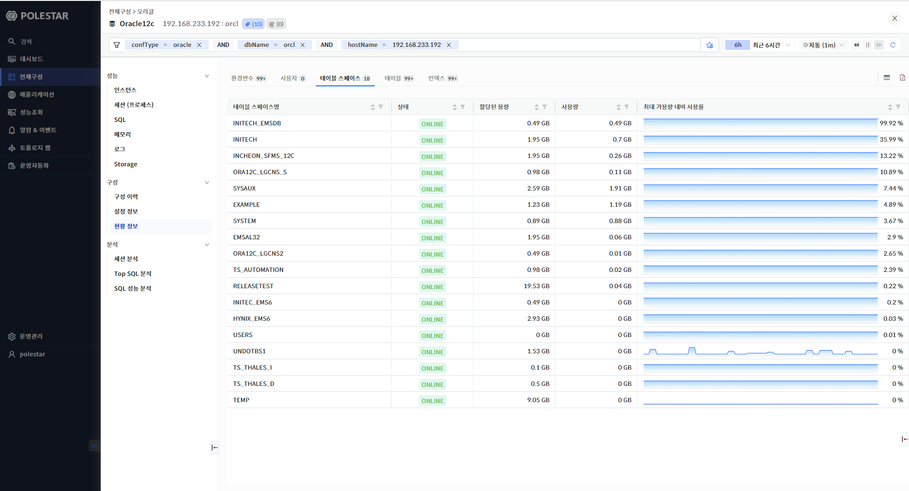

▶ \[그림31\] 오라클 테이블스페이스 목록

> 테이블스페이스 목록

<table>
<thead>
<tr class="header">
<th>테이블스페이스명</th>
<th>테이블스페이스 이름입니다.</th>
</tr>
</thead>
<tbody>
<tr class="odd">
<td>유저상태</td>
<td>
테이블스페이스 상태를 표시합니다.

상태값 목록

ONLINE: 테이블스페이스가 온라인 상태로 사용 가능함.

OFFLINE: 테이블스페이스가 오프라인 상태로 접근 불가능함.

READ ONLY: 테이블스페이스가 읽기 전용 상태로 데이터 수정 불가능함.

READ WRITE: 테이블스페이스가 읽기-쓰기 가능 상태로 정상 운영 중임.
</td>
</tr>
<tr class="even">
<td>최대 가용량</td>
<td>테이블스페이스에 할당 가능한 최대 가용량입니다.</td>
</tr>
<tr class="odd">
<td>할당된 용량</td>
<td>테이블스페이스에 현재 할당된 용량입니다.</td>
</tr>
<tr class="even">
<td>사용량</td>
<td>테이블스페이스에 현재 할당된 용량 대비 사용률입니다.</td>
</tr>
<tr class="odd">
<td>최대 가용량 대비 사용률</td>
<td>테이블스페이스에 할당 가능한 최대 가용량 대비 사용률입니다.</td>
</tr>
</tbody>
</table>

테이블

오라클에 생성된 모든 테이블 목록을 조회할 수 있는 화면입니다. 해당 화면을 통해 테이블의 용량, 상태, 생성일시, 마지막으로 DDL(Data Definition Language)을 수행한 시간 등을 확인할 수 있습니다.

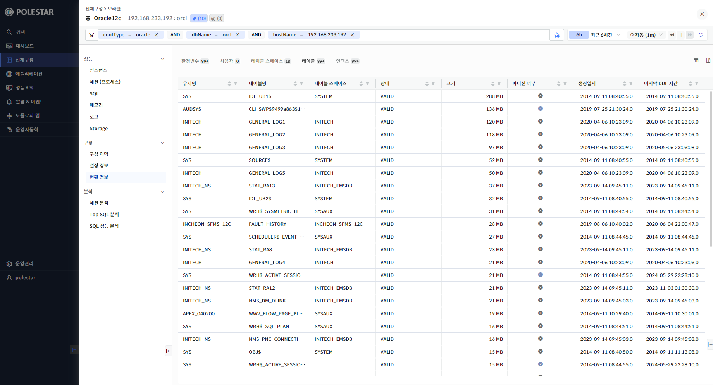

▶ \[그림32\] 오라클 테이블 목록

> 테이블 목록

<table>
<thead>
<tr class="header">
<th>유저명</th>
<th>테이블 소유한 사용자 이름입니다.</th>
</tr>
</thead>
<tbody>
<tr class="odd">
<td>테이블명</td>
<td>테이블 이름입니다.</td>
</tr>
<tr class="even">
<td>테이블스페이스</td>
<td>테이블이 속한 테이블스페이스의 이름입니다.</td>
</tr>
<tr class="odd">
<td>상태</td>
<td>
테이블의 상태를 나타냅니다.

VALID: 테이블이 유효하고, 컴파일 오류 없이 정상적으로 사용 가능한 상태

INVALID: 테이블이 유효하지 않거나, 컴파일 오류가 있는 상태입니다. 예를 들어, 객체의 종속성에 문제가 있거나, 객체 정의에 오류가 있는 경우입니다. INVALID 상태의 객체는 재 컴파일이 필요할 수 있습니다.
</td>
</tr>
<tr class="even">
<td>크기</td>
<td>테이블의 크기를 메가바이트(MB) 단위로 나타냅니다.</td>
</tr>
<tr class="odd">
<td>파티션 여부</td>
<td>테이블이 파티셔닝 되어 있는지 여부를 나타냅니다.</td>
</tr>
<tr class="even">
<td>생성일시</td>
<td>테이블이 생성된 날짜와 시간을 나타냅니다.</td>
</tr>
<tr class="odd">
<td>마지막 DDL 시간</td>
<td>
테이블에 마지막 DDL(Data Definition Language) 작업이 수행된 시간입니다.

주요 DDL 작업 예시

- CREATE (객체 생성)

- ALTER (객체 수정)

- DROP (객체 삭제)

- TRUNCATE (테이블 데이터 삭제)

- RENAME (객체 이름 변경)

- GRANT 및 REVOKE (권한 부여 및 회수)

- TRUNCATE (테이블 데이터 삭제)

- RENAME (객체 이름 변경)

- GRANT 및 REVOKE (권한 부여 및 회수)
</td>
</tr>
</tbody>
</table>

인덱스

오라클에 생성된 모든 인덱스 목록을 조회할 수 있는 화면입니다. 해당 화면을 통해 인덱스 용량, 상태, 생성일시, 마지막으로 통계 수집 일시 등을 확인할 수 있습니다.

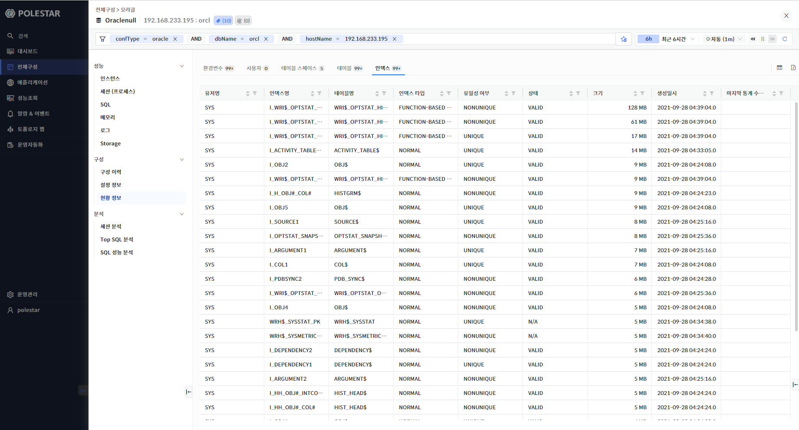

▶ \[그림33\] 오라클 인덱스 목록

> 인덱스 목록

<table>
<thead>
<tr class="header">
<th>유저명</th>
<th>인덱스를 소유한 사용자 이름입니다.</th>
</tr>
</thead>
<tbody>
<tr class="odd">
<td>인덱스명</td>
<td>인덱스 이름입니다.</td>
</tr>
<tr class="even">
<td>테이블명</td>
<td>해당 인덱스가 생성된 테이블 이름입니다.</td>
</tr>
<tr class="odd">
<td>인덱스 타입</td>
<td>
인덱스의 유형을 나타냅니다.

NORMAL: 일반 B-tree 인덱스.

BITMAP: 비트맵 인덱스.

FUNCTION-BASED NORMAL: 함수 기반 인덱스.

DOMAIN: 도메인 인덱스.
</td>
</tr>
<tr class="even">
<td>유일성 여부</td>
<td>
인덱스의 유일성 여부를 나타냅니다.

UNIQUE: 인덱스가 유일한 값을 보장합니다.

NONUNIQUE: 인덱스가 유일한 값을 보장하지 않습니다.
</td>
</tr>
<tr class="odd">
<td>상태</td>
<td>
인덱스의 상태를 나타냅니다.

VALID: 인덱스가 유효하고, 컴파일 오류 없이 정상적으로 사용 가능한 상태

INVALID: 인덱스가 유효하지 않거나, 컴파일 오류가 있는 상태입니다. 예를 들어, 객체의 종속성에 문제가 있거나, 객체 정의에 오류가 있는 경우입니다. INVALID 상태의 객체는 재 컴파일이 필요할 수 있습니다.
</td>
</tr>
<tr class="even">
<td>크기</td>
<td>인덱스의 크기를 메가바이트(MB) 단위로 나타냅니다.</td>
</tr>
<tr class="odd">
<td>생성일시</td>
<td>인덱스가 생성된 날짜와 시간을 나타냅니다.</td>
</tr>
<tr class="even">
<td>마지막 통계 수집 시간</td>
<td>인덱스 통계 정보가 마지막으로 갱신된 날짜와 시간을 나타냅니다. 이는 옵티마이저가 쿼리 성능을 최적화하는 데 사용됩니다. 통계 정보는 인덱스의 데이터 분포를 기반으로 쿼리 실행 계획을 수립하는 데 중요한 역할을 합니다.</td>
</tr>
</tbody>
</table>

오라클 분석

오라클 분석 기능은 세션 현황, 세션 이력, Top SQL 이력, SQL 성능에 대한 총 4가지 분석 기능을 제공합니다. 세션 현황 화면을 통해 현재 접속된 오라클의 모든 세션 목록과 Lock 발생 현황을 확인할 수 있습니다. 세션 이력 화면을 통해서는 오라클에 접속한 세션들에 대한 수행 SQL, 대기이벤트 정보, Lock 정보의 상세 이력 정보 등을 확인할 수 있습니다. Top SQL 분석을 통해서는 오라클에 수행된 SQL중 수행시간이 느린 쿼리를 분석할 수 있습니다. 마지막으로 SQL 성능 분석을 통해서는 개별 SQL의 응답시간을 Scatter 차트로 한 눈에 살펴보면서 상세히 분석할 수 있습니다.

<table>
<tbody>
<tr class="odd">
<td>
노트

오라클 분석 화면에 표현되는 세션, SQL, Plan 이력 정보 저장 여부 및 Top SQL수집 개수는 오라클 추가시나 오라클 환경 설정에서 설정할 수 있습니다.
</td>
</tr>
</tbody>
</table>

오라클 세션 현황

오라클에 현재 접속된 모든 세션 목록과 Lock 발생 현황을 표시해주는 화면입니다. 상단에 세션 사용률 및 세션 수 정보가 카드로 표시되고 그 다음으로 상태, 스키마, SQL별 세션 수를 도넛 차트로 표시합니다. 그리고 최하단에 상세 세션 목록 및 Lock 세션(Lock Tree) 목록이 표시됩니다.

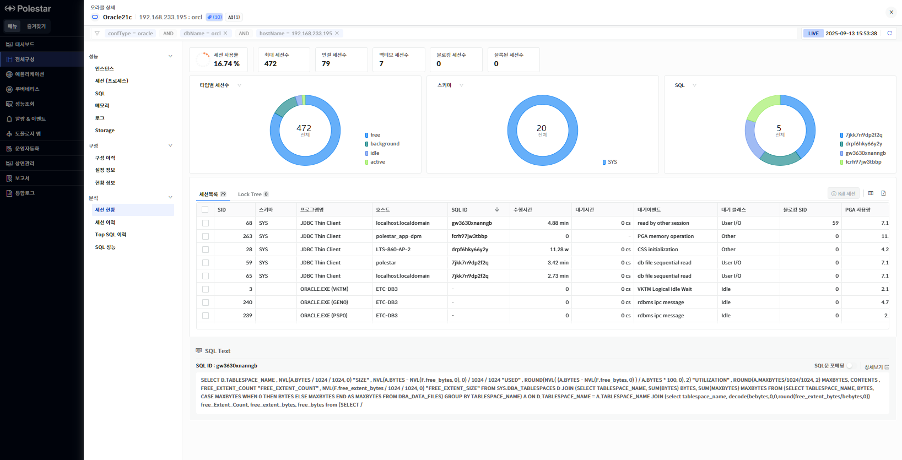

▶ \[그림34\] 세션 현황

조회시간 및 화면 리프레시 버튼

화면 추측 상단 타임셀렉터에 현재 조회된 세션 현황의 조회 시간이 표시되며 리프레시(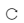) 아이콘을 통해 현재 시점의 오라클 세션 목록을 다시 조회해 올 수 있습니다.

▶ \[그림35\] 조회시간 및 화면 리프레시 버튼

세션 사용률 및 세션수 현황

현재 시점 오라클 허용 가능 최대 세션수 및 연결 세션수, 세션 사용률, 엑티브/블록/블로킹 세션수가 표시됩니다.

▶ \[그림36\] 세션 사용률 및 세션수 현황

카테고리별 세션 수 도넛 차트

5가지 카테고리(타입, 스키마, SQL, 호스트, 프로그램)별 세션 수에 대한 도넛 차트가 표시됩니다. 각 카테고리는 도넛 차트 좌측 상단의 콤보 박스를 통해 선택 가능하며 범례를 선택하면 해당 범례에 해당하는 세션수만 도넛차트와 세션목록, Lock Tree 목록에 표시됩니다. 도넛 차트 필터링 기능을 통해 특정 SQL이나 스키마 상태 등을 필터링하여 현재 접속된 세션 목록을 상세분석 하실 수 있습니다.

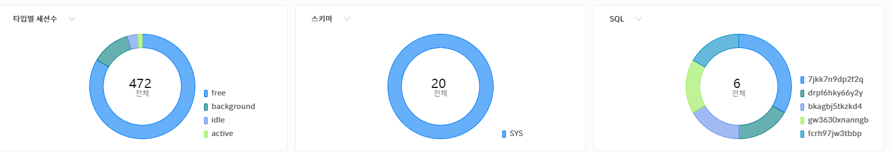

▶ \[그림37\] 카테고리별 세션 수 도넛 차트

세션 목록

현재 오라클에 접속된 모든 세션 목록이 표시됩니다. 해당 목록을 통해 어떤 사용자(스키마), 프로그램, 호스트가 접속했는지 확인할 수 있으며 세션의 상태(active, blocked, blocking 등) 및 수행중인 SQL, 대기중인 이벤트, PGA 메모리 사용량 등을 확인할 수 있습니다. 세션 목록은 추가로 하기와 같은 기능을 제공합니다.

제공 기능

1.  세션이 수행한 SQL Text를 보여주는 기능(SQL Text 포메팅 기능 포함)

2.  세션이 수행한 SQL에 대한 상세 이력 조회 기능

3.  세션 상세 이력 조회 기능

4.  문제가 되는 사용자 세션을 종료(Kill)할 수 있는 기능

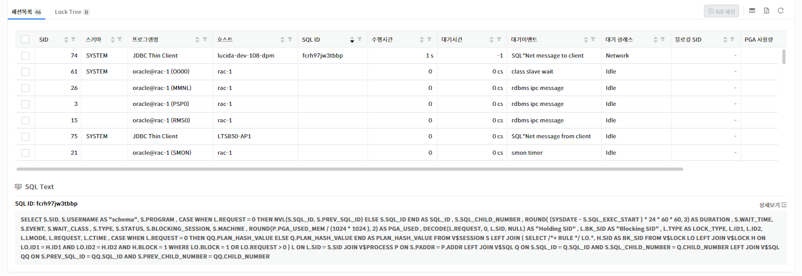

▶ \[그림38\] 세션 목록

> 세션 목록

| SID     | 세션을 고유하게 식별하는 세션 ID입니다. 각 세션은 고유한 SID를 가지며, 이를 통해 특정 세션을 추적할 수 있습니다. 세션 ID는 숫자로 표시됩니다.                                               |
| ------- | ------------------------------------------------------------------------------------------------------------------------------------ |
| 스키마     | 세션이 현재 사용하고 있는 데이터베이스 스키마의 이름입니다. 스키마는 데이터베이스 객체(테이블, 뷰 등)의 논리적 그룹을 나타냅니다.                                                           |
| 프로그램명   | 데이터베이스에 연결된 클라이언트 프로그램의 이름입니다. 예를 들어, SQL\*Plus, Toad, JDBC 드라이버 등이 될 수 있습니다. 백그라운드 세션의 경우 보통 oracle로 시작하는 이름을 가집니다.                 |
| 호스트     | 데이터베이스에 연결된 클라이언트 머신의 호스트 명입니다. 클라이언트가 실행 중인 서버나 컴퓨터의 이름을 나타냅니다.                                                                     |
| SQL ID  | 세션이 현재 실행 중인 SQL 문을 고유하게 식별하는 SQL ID입니다. 이는 특정 SQL 문을 추적하고 성능을 분석하는 데 유용합니다.                                                         |
| 수행시간    | 세션이 현재 SQL 문을 실행하는 데 걸린 총 시간입니다.                                                                                                     |
| 대기시간    | 세션이 자원(예: 잠금, 디스크 I/O 등)을 기다리는 데 걸린 총 시간입니다. 이 시간은 세션의 성능 문제를 진단하는 데 중요한 지표입니다.                                                      |
| 대기이벤트   | 세션이 현재 기다리고 있는 특정 이벤트입니다. 예를 들어, 'db file sequential read', 'latch: cache buffers chains' 등이 될 수 있습니다. 이는 세션의 대기 현황을 파악하는 데 도움이 됩니다. |
| 대기클래스   | 대기 이벤트의 클래스를 나타냅니다. 예를 들어, 'User I/O', 'System I/O', 'Concurrency' 등이 있습니다. 이는 대기 이벤트를 그룹화하여 분석하는 데 유용합니다.                           |
| 블로킹 SID | 현재 세션을 블로킹하고 있는 세션의 SID입니다. 이는 잠금 경합 문제를 해결하는 데 중요한 정보를 제공합니다.                                                                       |
| PGA 사용량 | 세션이 사용하고 있는 프로세스 글로벌 영역(PGA)의 메모리 양입니다. PGA는 세션별로 할당된 메모리로, 정렬 작업, 해시 조인 등에서 사용됩니다.                                                  |
| 타입      | 세션의 타입을 나타냅니다. 타입은 총 5개의 카테고리(background, active, idle, blocking, blocked)로 되어 있습니다.                                                 |

Lock Tree

오라클에 락 세션이 발생되면 Lock Tree 목록에서 해당 락 세션들을 확인할 수 있습니다. Lock Tree에서는 락을 유발한 세션(블로킹 세션)을 부모로 하고 해당 락으로 인해 블록된 세션을 자식으로 하는 트리 형태로 목록을 표시합니다. 부모락 세션을 기준으로 해당 트리를 접거나 펼쳐 볼 수 있으며 SQL ID 컬럼에 있는 SQL ID를 선택하면 하단에 해당 SQL ID에 해당하는 SQL Text가 표시됩니다. SQL Text 창의 우측 상단에 SQL문 포메팅 버튼을 클릭하면 해당 SQL문을 포메팅하여 볼 수 있으며 상세보기버튼을 클릭하면 SQL Text 상세 드로어가 표시되며 해당 드로어 화면에서 SQL에 대한 상세 성능 이력 정보 및 Plan 정보를 확인할 수 있습니다. 자세한 내용은 “개별 SQL 이력 보기(SQL Text 상세 드로어)”절을 참조하세요.

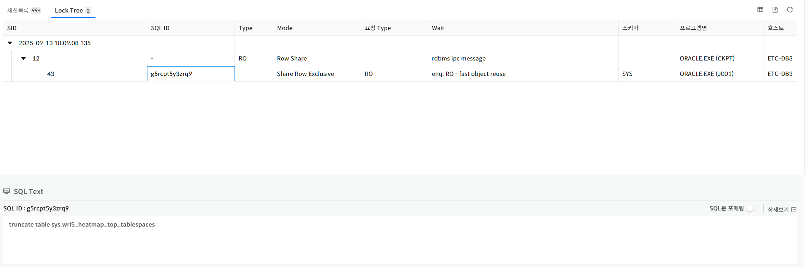

▶ \[그림39\] Lock Tree

> Lock Tree 목록

| SID     | 세션을 고유하게 식별하는 세션 ID입니다. 락을 유발한 세션을 부모로하여 해당 락으로 인해 블록된 세션을 자식으로 하는 트리형태로 표시합니다.                       |
| ------- | ----------------------------------------------------------------------------------------------------- |
| SQL ID  | 락을 유발하거나 락된 세션에서 수행한 SQL ID(SQL 식별 ID)입니다.                                                            |
| Type    | 잠금의 타입을 나타냅니다. 예를 들어, 'TX'는 트랜잭션 잠금을 의미합니다. 이 컬럼이 비어 있는 경우, 해당 세션은 현재 잠금을 소유하고 있지 않음을 나타냅니다.          |
| Mode    | 현재 세션이 소유하고 있는 잠금의 모드를 나타냅니다. 'Exclusive' 모드는 배타적 잠금을 의미합니다. 현재 잠금을 소유하고 있지 않은 세션은 ‘No Lock’으로 표시됩니다. |
| 요청 Type | 세션이 요청한 잠금의 타입을 나타냅니다. 예를 들어, 'TX'는 트랜잭션 잠금을 의미합니다.                                                   |
| 대기이벤트   | 세션이 현재 기다리고 있는 특정 이벤트를 나타냅니다. 예를 들어, 'enq: TX - row lock contention'은 행 잠금 경합을 나타냅니다.                 |
| 스키마     | 세션이 현재 사용하고 있는 데이터베이스 스키마의 이름입니다. 스키마는 데이터베이스 객체(테이블, 뷰 등)의 논리적 그룹을 나타냅니다.                            |
| 프로그램명   | 데이터베이스에 연결된 클라이언트 프로그램의 이름입니다. 예를 들어, 'DBAny.exe'는 데이터베이스와 연결된 클라이언트 프로그램을 나타냅니다.                     |
| 호스트     | 데이터베이스에 연결된 클라이언트 머신의 호스트 명입니다. 클라이언트가 실행 중인 서버나 컴퓨터의 이름을 나타냅니다.                                      |
| 대기시간    | 세션이 현재 대기 중인 시간입니다                                                                                    |
| Status  | 세션의 현재 상태를 나타냅니다. 초록색은 세션이 활성 상태를 나타내며 회색은 비활성화 상태를 나타냅니다.                                            |

개별 세션 이력 조회(SID 드로어)

세션 목록의 SID 컬럼에서 특정 SID를 선택하면 선택한 세션에 대한 상세 이력을 조회할 수 있는 드로어 화면이 열립니다. 해당 화면을 선택한 세션이 과거에 수행한 SQL 및 대기 이벤트 정보를 상세 조회할 수 있습니다. 보다 상세한 내용은 “개별 세션 이력 조회”절을 참조하세요.

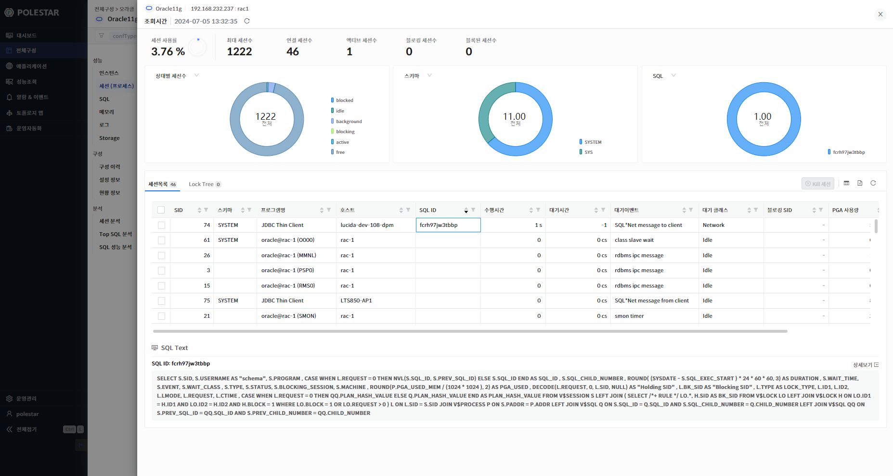

▶ \[그림40\] 세션목록에서 특정 SID 하나를 선택

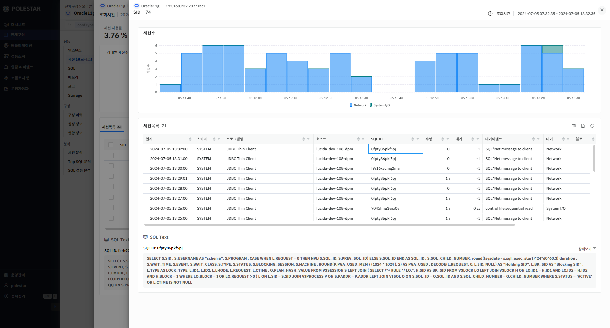

▶ \[그림41\] 선택한 SID에 대한 세션 이력 화면

> 개별 세션 이력 조회 절차

1.  세션목록에서 특정 SID 하나를 선택(화면 예시: 71)

2.  선택한 SID(화면 예시: 71)에 대한 세션 상세 이력 화면이 표시됨

세션 수행 SQL 조회

세션 목록의 SQL ID 컬럼에서 특정 SQL ID를 선택하면 선택한 SQL ID에 대한 SQL Text를 하단 SQL Text창에서 확인할 수 있습니다.

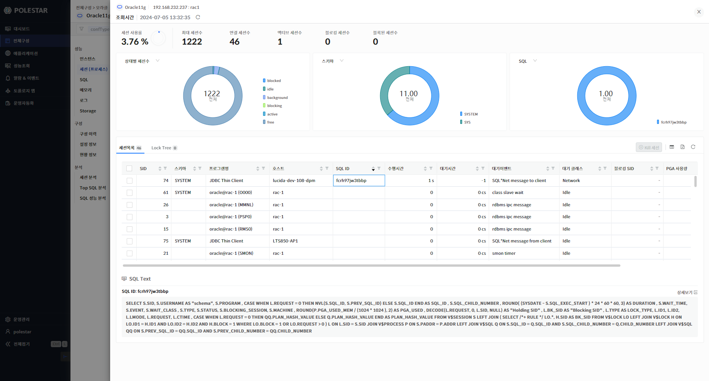

▶ \[그림42\] 선택한 SQL ID에 대한 SQL Text 표시 화면

> 세션 수행 SQL 조회 절차

1.  세션목록에서 특정 SQL ID를 선택

2.  하단 SQL Text 창에 선택한 SQL ID에 대한 SQL Text가 표시됨

<table>
<tbody>
<tr class="odd">
<td>
주의

선택한 SQL ID에 해당하는 SQL Text는 조회 시점 오라클 SQL Text 뷰 테이블(캐시)에 없으면 표시되지 않을 수 있습니다.
</td>
</tr>
</tbody>
</table>

개별 SQL 이력 조회(SQL Text 상세 드로어)

SQL Text 창의 우측 상세보기 버튼을 클릭하면 해당 SQL에 대한 상세 성능 이력 정보를 조회할 수 있는 드로어 화면이 나옵니다. 개별 SQL 이력 조회를 통해 해당 SQL의 과거 수행 이력 및 수행시간 Plan 정보, 수행 세션 수 정보 등을 확인할 수 있습니다.

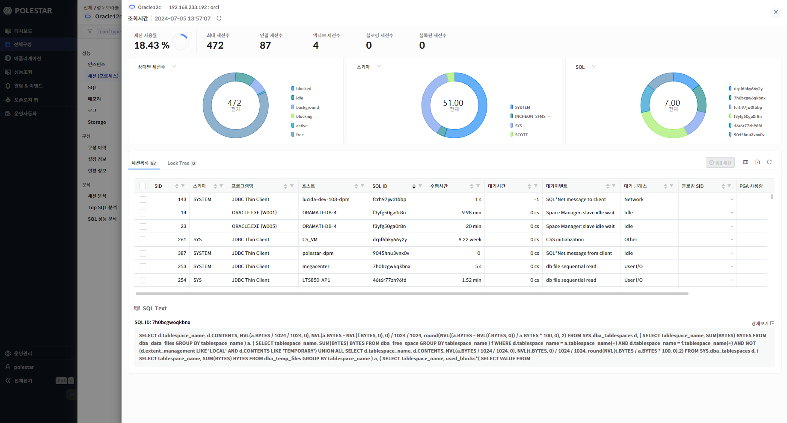

▶ \[그림43\] 개별 SQL 이력 조회 절차

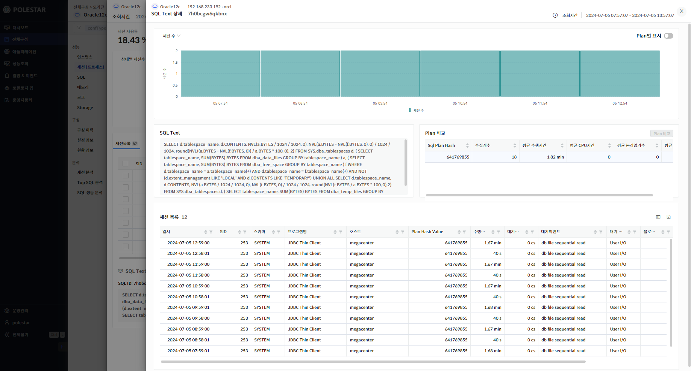

▶ \[그림44\] 개별 SQL에 대한 이력 화면

> 개별 SQL 이력 조회 절차

1.  세션목록에서 특정 SQL ID를 선택

2.  하단 SQL Text 창에 선택한 SQL ID에 대한 SQL Text가 표시됨

3.  SQL Text 우측 상단에 상세보기 버튼 클릭

4.  선택한 SQL에 대한 이력 조회 드로어 화면 표시

5.  좌측 상단 콤보 박스에서 세션수 또는 평균 수행시간을 선택하여 개별 SQL 성능 조회

<table>
<tbody>
<tr class="odd">
<td>
노트

SQL Text 상세 드로어 화면에서는 좌측 상단 콤보 박스에서 세션수 또는 평균 수행시간 항목을 선택하여 각 SQL이 수행한 세션 정보나 SQL 평균 수행시간 이력 정보를 확인할 수 있습니다.
</td>
</tr>
</tbody>
</table>

<table>
<tbody>
<tr class="odd">
<td>
주의

SQL Text 상세 드로어 화면에서 좌측 상단 콤보 박스에 세션수나 평균 수행시간항목은 해당 SQL에 대한 세션 이력 정보 또는 Top SQL 이력 정보가 있을 때에만 표시됩니다.
</td>
</tr>
</tbody>
</table>

Kill 세션

세션 목록에서 종료하고자 하는 세션을 체크하고 Kill 세션 버튼을 클릭하면 해당 세션을 종료할 수 있습니다. 보통 락을 유발하는 세션을 종료하여 블록된 세션들이 작업을 수행할 수 있도록 할 때 사용합니다. 단 문제가 없는 세션을 종료하지 않도록 주의할 필요가 있습니다.

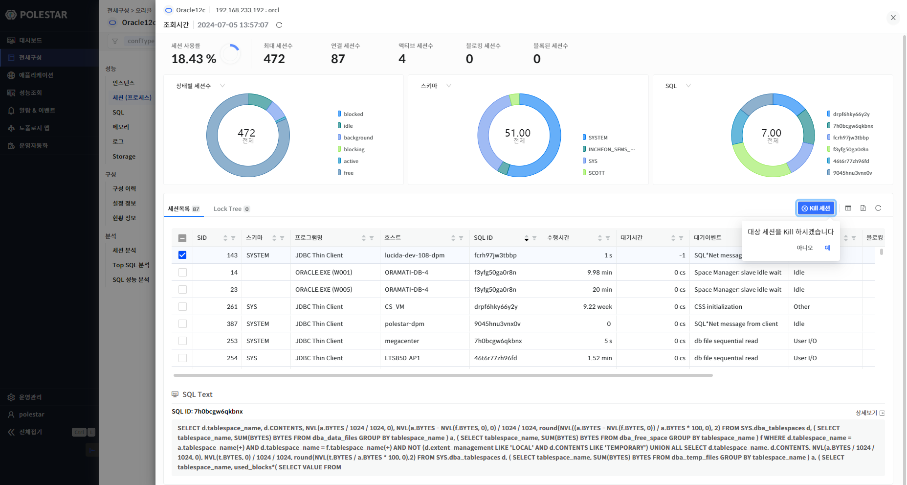

▶ \[그림45\] Kill 세션 절차

> 세션 Kill 절차

1.  세션목록에서 특정 세션을 선택(화면 예시: 38)

2.  세션목록 상단의 Kill 버튼을 클릭

3.  대상 세션을 Kill 하시겠습니까? 팝업 창에서 ‘예’ 선택

<table>
<tbody>
<tr class="odd">
<td>
노트

Kill 세션으로 종료할 수 있는 세션은 사용자 세션이며 백그라운드 세션은 Kill 세션 버튼을 수행하여도 종료되지 않습니다. 이는 정상적인 백그라운드 세션이 강제 종료되는 것을 방지하기 위함입니다.
</td>
</tr>
</tbody>
</table>

컬럼 수정

세션 목록의 우측 상단 \[컬럼 수정\] 버튼을 통해 세션 목록에 원하는 컬럼을 표시하거나 제외할 수 있습니다. 엑셀 저장시에도 컬럼 수정을 통해 표시된 컬럼만 저장됩니다. 컬럼 수정 드로어는 컬럼 검색 기능을 제공하며 선택된 항목을 하단에 표시하고 표시된 컬럼을 제외할 수 있는 기능을 제공합니다.

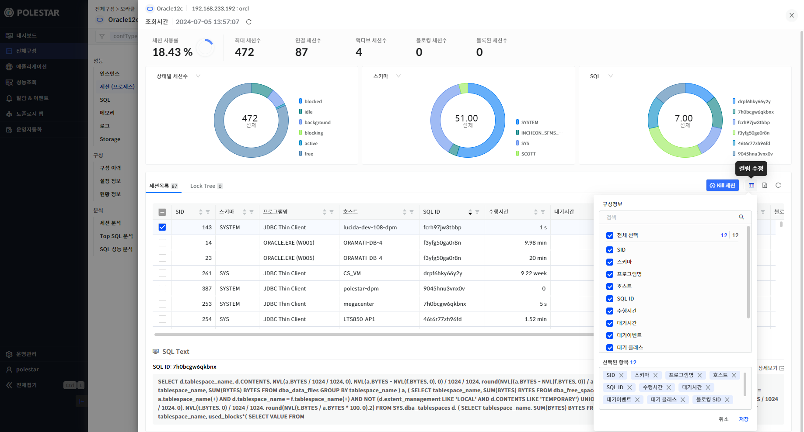

▶ \[그림46\] 세션목록 컬럼 수정

> 세션목록 컬럼 수정 절차

1.  세션목록에서 우측 상단 컬럼 수정 아이콘 클릭

2.  컬럼 수정 드로어에서 화면에 표시하고자 하는 컬럼을 체크박스에서 선택

3.  저장 버튼 클릭

엑셀 저장

세션 목록의 우측 상단 \[엑셀 저장\] 버튼을 통해 세션 목록을 엑셀로 저장할 수 있습니다. 컬럼 수정 기능, 상단 태그 검색 기능, 그리드 컬럼 검색 기능 등을 통해 엑셀에 보여줄 컬럼과 내용을 원하는 조건에 맞게 필터링하여 저장할 수 있습니다.

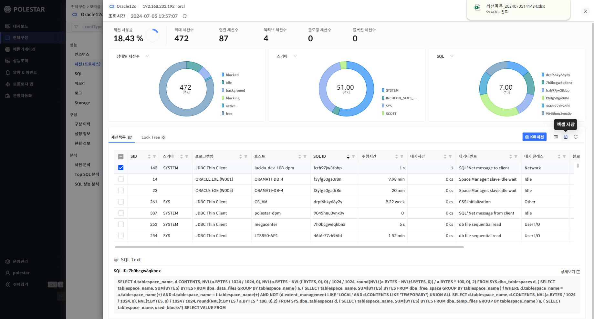

▶ \[그림47\] 세션목록 엑셀 저장

> 세션목록 컬럼 수정 절차

1.  세션 목록에서 우측 상단 엑셀 저장 아이콘 클릭

2.  브라우저 우측 상단 창에 저장된 엑셀 파일명이 표시됨

3.  해당 파일명을 클릭하여 엑셀 파일 확인

세션 이력

세션 이력 화면을 통해 오라클에 접속한 세션들에 대해 7가지 관점(대기 클래스, SQL, 대기이벤트, 스키마, 프로그램, 호스트, 세션 Lock세션)으로 각 관점 별 수행 SQL과 수행시간, 대기이벤트 정보, Lock 정보 등을 확인할 수 있습니다.

대기 클래스

대기 클래스 관점으로 세션 수행 이력을 분석할 수 있는 화면입니다. 대기 클래스는 세션이 자원을 기다리는 동안 어떤 유형의 대기 상태에 있는지를 분류합니다. 대기 클래스는 대기 이벤트를 여러 범주로 나누어 세션이 전반적으로 어떤 범주의 대기를 하였는지 분석하는데 도움을 줍니다. 대기 클래스에 대한 자세한 내용은 하단 대기 클래스 설명 부분을 참조하세요. 화면 구성은 상단에 해당 대기 클래스를 대기한 세션수가 많은 순으로 표시하는 목록과 도넛 차트가 있고 그 밑으로 타임 셀렉터 기간 동안 세션이 대기한 대기 클래스 수를 누적 바차트로 표시합니다. 바 차트 밑으로는 상세 세션목록과 Lock Tree 목록이 표시되며 세션목록이나 Lock Tree에서 SQL ID 컬럼에 있는 SQL ID를 클릭하면 하단에 해당 SQL ID에 대한 SQL Text가 표시됩니다.

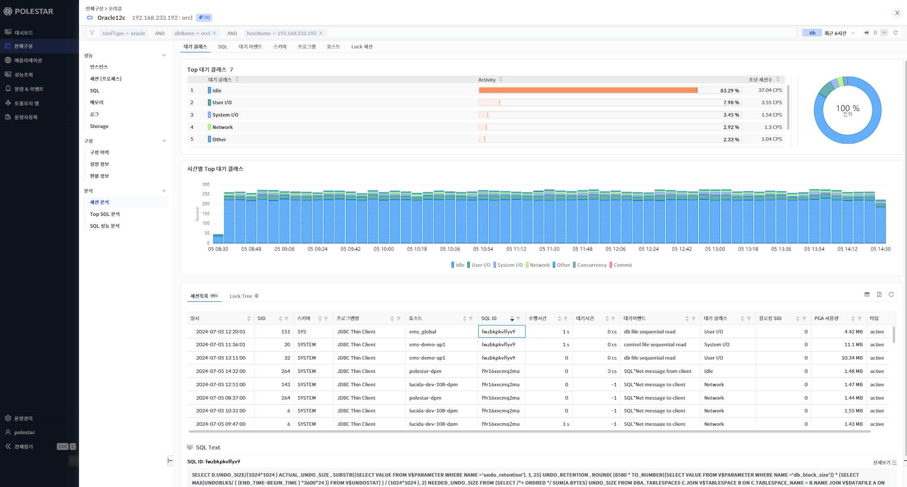

▶ \[그림48\] 오라클 세션 이력\> 대기 클래스

대기 클래스 목록

대기 클래스 세션수가 많은 순으로 목록이 표시되며 특정 대기 클래스를 클릭하면 하단 바차트에 선택된 대기 클래스가 하이라이트 처리되며 세션목록, Lock Tree에는 선택된 대기 클래스를 대기한 세션만 표시됩니다.

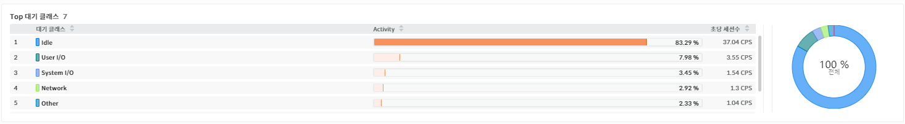

▶ \[그림49\] Top 대기 클래스 목록

> Top 대기 클래스 목록

<table>
<thead>
<tr class="header">
<th>대기 클래스</th>
<th>
대기 클래스 이름입니다.

오라클 대기 클래스는 총 12이며 각각의 클래스는 아래와 같습니다.

1. Administrative

관리 작업으로 인해 발생하는 대기입니다. 주로 데이터베이스 관리자(DBA)가 수행하는 작업과 관련이 있습니다.

예: 데이터 파일 추가, 백업 및 복구 작업, 인덱스 생성 등.

2. Application

애플리케이션 수준에서 발생하는 대기입니다. 주로 애플리케이션 코드의 문제로 인해 발생할 수 있습니다.

예: 사용자 정의 잠금, 애플리케이션 코드 내의 동기화 문제 등.

3. Cluster

클러스터 환경에서 발생하는 대기입니다. 주로 RAC(Real Application Clusters) 환경에서 노드 간의 통신과 관련이 있습니다.

예: 캐시 퓨전, 글로벌 엔큐 잠금 등.

4. Commit

트랜잭션 커밋 작업을 기다리는 대기입니다. 주로 트랜잭션 로그에 대한 동기화 작업과 관련이 있습니다.

예: 'log file sync' 이벤트는 커밋 시 로그 파일에 대한 동기화를 기다리는 경우입니다.

5. Concurrency

동시성 제어와 관련된 대기입니다. 여러 세션이 동시에 동일한 자원에 접근하려고 할 때 발생합니다.

예: 라이브러리 캐시 잠금, 로우 잠금 경합 등.

6. Configuration

데이터베이스 설정과 구성과 관련된 대기입니다. 잘못된 설정이나 비효율적인 구성으로 인해 발생할 수 있습니다.

예: 초기화 파라미터 설정 문제, SGA 크기 설정 문제 등.

7. Idle

세션이 아무 작업도 하지 않고 있는 상태입니다. 주로 대기 이벤트는 클라이언트의 요청을 기다리는 경우가 많습니다.

예: 'SQL*Net message from client'는 클라이언트의 요청을 기다리는 상태를 나타냅니다.

8. Network

네트워크 통신과 관련된 대기입니다. 데이터베이스와 클라이언트 간의 데이터 전송과 관련이 있습니다.

예: 'SQLNet message to client', 'SQLNet more data from client' 등.

9. Other

다른 대기 클래스에 속하지 않는 대기 이벤트입니다. 특정한 범주에 속하지 않는 다양한 대기 상황을 포함합니다.

예: 특정 이벤트가 여러 범주에 걸쳐 있을 때 사용될 수 있습니다.

10. Scheduler

스케줄러 작업과 관련된 대기입니다. 주로 데이터베이스 작업 스케줄러와 관련이 있습니다.

예: DBMS_SCHEDULER 패키지를 사용한 작업 스케줄링 대기 등.

11. System I/O

시스템 수준의 I/O 작업을 기다리는 대기입니다. 데이터베이스의 내부 작업과 관련이 있습니다.

예: 'log file parallel write', 'control file sequential read' 등.

12. User I/O

사용자 I/O 요청을 기다리는 대기입니다. 데이터베이스 파일에 대한 읽기/쓰기 작업과 관련이 있습니다.

예: 'db file sequential read', 'db file scattered read' 등.
</th>
</tr>
</thead>
<tbody>
<tr class="odd">
<td>Activity</td>
<td>타임 셀렉터 기간동안 발생된 대기 클래스 세션수의 비율입니다.</td>
</tr>
<tr class="even">
<td>초당 세션수</td>
<td>타임 셀렉터 기간동안 발생된 대기 클래스 세션수를 초당 개수로 표현한 값입니다. 예를 들어 3 CPS면 초당 3개의 세션이 해당 대기 클래스로 대기했다고 해석 할 수 있습니다.</td>
</tr>
</tbody>
</table>

기간별 Top 대기 클래스(바차트)

타임 셀렉터 기간에 해당하는 대기 클래스별 세션 수를 누적 바차트로 표시합니다. 바차트의 간격은 기간별로 달라지며 바 차트 개수는 최대 60개까지 표현됩니다. 바차트를 1개 선택하면 해당 시점의 바차트만 활성화되고 하단 세션 목록은 바 차트 1개에 해당하는 기간의 세션만 표시됩니다. 따라서 상단에 대기 클래스 목록에서 대기 클래스를 선택하고 바차트에서 특정 바 1개를 선택한다면 특정 시점에 선택한 대기 클래스 목록만 세션 목록에서 필터링하여 조회할 수 있습니다.

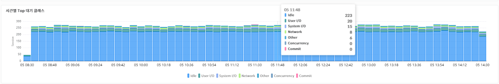

▶ \[그림50\] 기간별 Top 대기 클래스

세션목록

타임 셀렉터에 선택한 기간내 오라클에 접속 했던 모든 세션 이력이 표시됩니다. 해당 목록을 통해 과거 특정 시점에 어떤 사용자(스키마), 프로그램, 호스트가 접속했는지 확인 할 수 있으며 세션의 상태(active, blocked, bloking등) 및 수행중인 SQL, 대기중인 이벤트, PGA 메모리 사용량 등을 확인 할 수 있습니다. 세션 목록은 추가로 하기와 같은 기능을 제공합니다.

제공 기능

1.  세션이 수행한 SQL Text를 보여주는 기능(SQL Text 포메팅 기능 포함)

2.  세션이 수행한 SQL에 대한 상세 이력 조회 기능

3.  세션 상세 이력 조회 기능

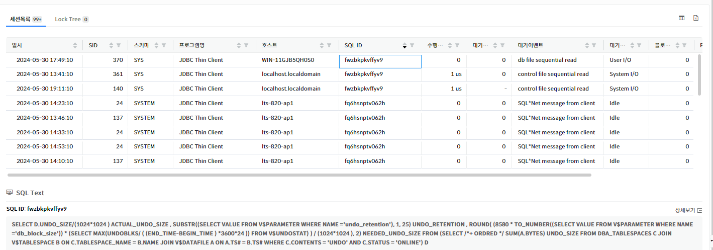

▶ \[그림51\] 세션 목록(이력)

<table>
<tbody>
<tr class="odd">
<td>
주의

세션 목록 상단 바 차트에서 바 1개를 선택 시 세션 목록 및 Lock Tree에는 선택한 바에 있는 범례의 세션만 표현되는 것이 아니고 해당 바 기간내의 모든 세션이 표시됩니다. 이는 해당 기간에 수행된 모든 세션을 함께 비교하기 위함입니다.
</td>
</tr>
</tbody>
</table>

> 세션 목록

| 일시      | 세션이 수행된 시간을 표시합니다.                                                                                                                   |
| ------- | ------------------------------------------------------------------------------------------------------------------------------------ |
| SID     | 세션을 고유하게 식별하는 세션 ID입니다. 각 세션은 고유한 SID를 가지며, 이를 통해 특정 세션을 추적할 수 있습니다. 세션 ID는 숫자로 표시됩니다.                                               |
| 스키마     | 세션이 현재 사용하고 있는 데이터베이스 스키마의 이름입니다. 스키마는 데이터베이스 객체(테이블, 뷰 등)의 논리적 그룹을 나타냅니다.                                                           |
| 프로그램명   | 데이터베이스에 연결된 클라이언트 프로그램의 이름입니다. 예를 들어, SQL\*Plus, Toad, JDBC 드라이버 등이 될 수 있습니다. 백그라운드 세션의 경우 보통 oracle로 시작하는 이름을 가집니다.                 |
| 호스트     | 데이터베이스에 연결된 클라이언트 머신의 호스트 명입니다. 클라이언트가 실행 중인 서버나 컴퓨터의 이름을 나타냅니다.                                                                     |
| SQL ID  | 세션이 현재 실행 중인 SQL 문을 고유하게 식별하는 SQL ID입니다. 이는 특정 SQL 문을 추적하고 성능을 분석하는 데 유용합니다.                                                         |
| 수행시간    | 세션이 현재 SQL 문을 실행하는 데 걸린 총 시간입니다.                                                                                                     |
| 대기시간    | 세션이 자원(예: 잠금, 디스크 I/O 등)을 기다리는 데 걸린 총 시간입니다. 이 시간은 세션의 성능 문제를 진단하는 데 중요한 지표입니다.                                                      |
| 대기이벤트   | 세션이 현재 기다리고 있는 특정 이벤트입니다. 예를 들어, 'db file sequential read', 'latch: cache buffers chains' 등이 될 수 있습니다. 이는 세션의 대기 현황을 파악하는 데 도움이 됩니다. |
| 대기클래스   | 대기 이벤트의 클래스를 나타냅니다. 예를 들어, 'User I/O', 'System I/O', 'Concurrency' 등이 있습니다. 이는 대기 이벤트를 그룹화하여 분석하는 데 유용합니다.                           |
| 블로킹 SID | 현재 세션을 블로킹하고 있는 세션의 SID입니다. 이는 잠금 경합 문제를 해결하는 데 중요한 정보를 제공합니다.                                                                       |
| PGA 사용량 | 세션이 사용하고 있는 프로세스 글로벌 영역(PGA)의 메모리 양입니다. PGA는 세션별로 할당된 메모리로, 정렬 작업, 해시 조인 등에서 사용됩니다.                                                  |
| 타입      | 세션의 타입을 나타냅니다. 타입은 총 5개의 카테고리(background, active, idle, blocking, blocked)로 되어 있습니다.                                                 |

개별 세션 이력 조회

> 세션 목록의 SID 컬럼에서 특정 SID(화면 예: 264)를 선택하면 선택한 세션에 대한 상세 이력을 조회할 수 있는 드로어 화면이 열립니다. 해당 화면을 선택한 세션이 과거에 수행한 SQL 및 대기 이벤트 정보를 상세 조회할 수 있습니다.

▶ \[그림52\] 세션목록에서 특정 SID 하나를 선택

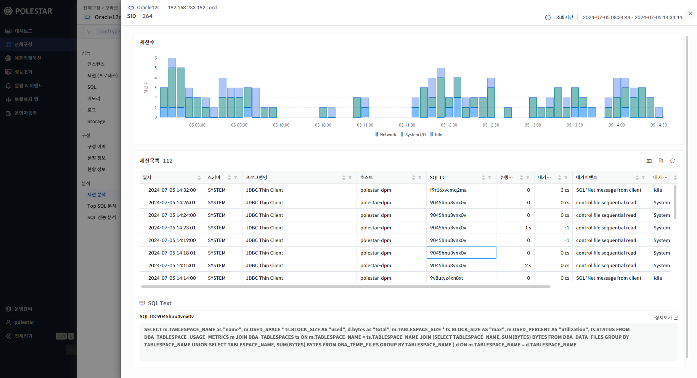

▶ \[그림53\] 선택한 SID에 대한 세션 이력 화면

> 개별 세션 이력 조회 절차

1.  세션목록에서 특정 SID 하나를 선택(화면 예시: 264)

2.  선택한 SID(화면 예시: 264)에 대한 세션 상세 이력 화면이 표시됨

세션 수행 SQL 조회

세션 목록의 SQL ID 컬럼에서 특정 SQL ID를 선택하면 선택한 SQL ID에 대한 SQL Text를 하단 SQL Text창에서 확인할 수 있습니다.

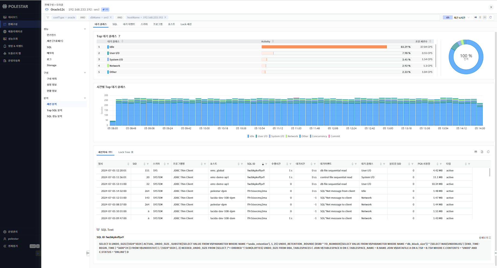

▶ \[그림54\] 선택한 SQL ID에 SQL Text 표시 화면

> 세션 수행 SQL 조회 절차

1.  세션목록에서 특정 SQL ID를 선택

2.  하단 SQL Text 창에 선택한 SQL ID에 대한 SQL Text가 표시됨

<table>
<tbody>
<tr class="odd">
<td>
주의

선택한 SQL ID에 해당하는 SQL Text는 조회 시점 오라클 SQL Text 뷰 테이블(캐시)에 없으면 표시되지 않을 수 있습니다.
</td>
</tr>
</tbody>
</table>

개별 SQL 이력 조회

SQL Text 창의 우측 상세보기 버튼을 클릭하면 해당 SQL에 대한 상세 성능 이력 정보를 조회할 수 있는 드로어 화면이 나옵니다. 개별 SQL 이력 조회를 통해 해당 SQL의 과거 수행 이력 및 수행시간 Plan 정보, 수행 세션 수 정보 등을 확인할 수 있습니다.

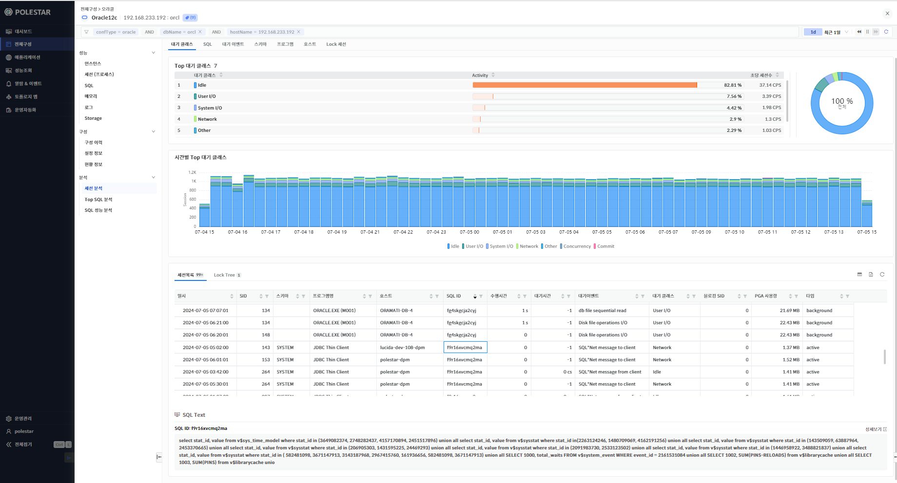

▶ \[그림55\] 개별 SQL 이력 조회 절차

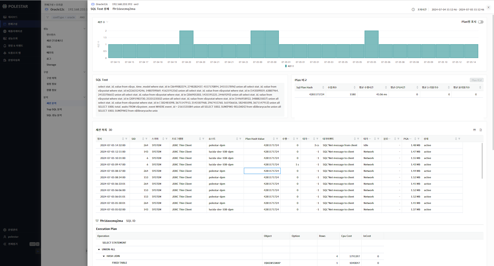

▶ \[그림56\] 개별 SQL 이력 조회 절차

> 개별 SQL 이력 조회 절차

1.  세션목록에서 특정 SQL ID를 선택

2.  하단 SQL Text 창에 선택한 SQL ID에 대한 SQL Text가 표시됨

3.  SQL Text 우측 상단에 상세보기 버튼 클릭

4.  선택한 SQL에 대한 이력 조회 드로어 화면 표시

5.  좌측 상단 콤보 박스에서 세션수 또는 평균 수행시간을 선택

<table>
<tbody>
<tr class="odd">
<td>
노트

SQL Text 상세 드로어 화면에서는 좌측 상단 콤보 박스에서 세션수 또는 평균 수행시간 항목을 선택하여 각 SQL이 수행한 세션 정보나 SQL 평균 수행시간 이력 정보를 확인할 수 있습니다.
</td>
</tr>
</tbody>
</table>

<table>
<tbody>
<tr class="odd">
<td>
주의

SQL Text 상세 드로어 화면에서 좌측 상단 콤보 박스에 세션수나 평균 수행시간항목은 해당 SQL에 대한 세션 이력 정보 또는 Top SQL 이력 정보가 있을 때에만 표시됩니다.
</td>
</tr>
</tbody>
</table>

SQL

SQL 이 수행된 관점으로 세션 수행 이력을 분석할 수 있는 화면입니다. 화면 구성은 상단에 해당 SQL을 수행한 세션의 수가 많은 순으로 표시하는 목록과 도넛 차트가 있고 그 밑으로 타임 셀렉터 기간 동안 해당 SQL을 수행한 세션수를 누적 바차트로 표시합니다. 바 차트 밑으로는 상세 세션목록과 Lock Tree 목록이 표시되며 세션목록이나 Lock Tree에서 SQL ID 컬럼에 있는 SQL ID를 클릭하면 하단에 해당 SQL ID에 대한 SQL Text가 표시됩니다.

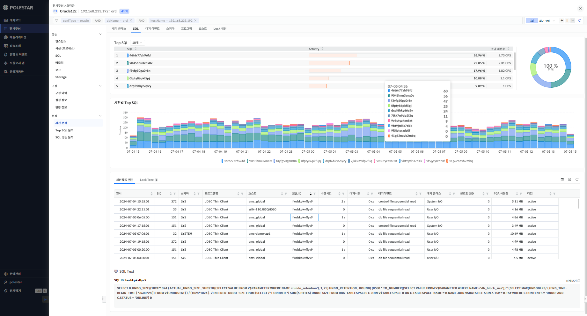

▶ \[그림57\] 오라클 세션 이력\> SQL

Top SQL 목록

SQL을 수행한 세션수가 많은 순으로 목록이 표시되며 특정 SQL을 클릭하면 하단 바차트에 선택된 SQL이 하이라이트 처리되며 세션목록, Lock Tree에는 선택된 SQL을 수행한 세션만 표시됩니다. Top SQL 타이틀 옆에 콤보 박스에서 Top SQL 목록에 표시할 개수를 선택할 수 있습니다.

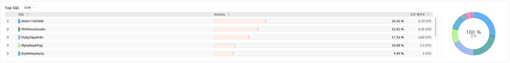

▶ \[그림58\] Top SQL 목록

> Top SQL 목록

<table>
<thead>
<tr class="header">
<th>SQL</th>
<th>
세션이 수행한 SQL ID입니다.

해당 SQL ID에 마우스를 Hover하면 SQL ID에 해당하는 SQL Text가 툴 팁으로 표시됩니다.
</th>
</tr>
</thead>
<tbody>
<tr class="odd">
<td>Activity</td>
<td>타임 셀렉터 기간동안 해당 SQL을 실행한 세션수의 비율입니다.</td>
</tr>
<tr class="even">
<td>초당 세션수</td>
<td>타임 셀렉터 기간동안 해당 SQL을 수행한 세션수를 초당 개수로 표현한 값입니다. 예를 들어 3 CPS면 초당 3개의 세션이 해당 SQL을 수행 했다라고 해석할 수 있습니다.</td>
</tr>
</tbody>
</table>

기간별 Top SQL(바차트)

타임 셀렉터 기간에 해당하는 SQL 수행 세션 수를 누적 바차트로 표시합니다. 바차트의 간격은 기간별로 달라지며 바 차트 개수는 최대 60개까지 표현됩니다. 바차트를 1개 선택하면 해당 시점의 바차트만 활성화되고 하단 세션 목록은 바 차트 1개에 해당하는 기간의 세션만 표시됩니다. 따라서 상단에 Top SQL 목록에서 특정 SQL를 선택하고 바차트에서 특정 바 1개를 선택한다면 특정 시점에 선택한 SQL을 수행한 세션들만 세션 목록에서 필터링하여 조회할 수 있습니다.

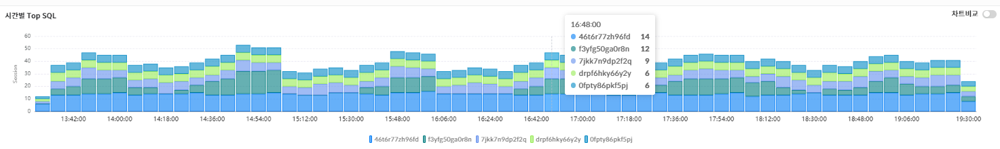

▶ \[그림59\] 기간별 Top SQL

세션목록

세션목록은 대기 클래스 탭의 세션목록과 기능이 동일합니다. 대기 클래스 탭 절을 참조하세요.

대기 이벤트

대기 이벤트 관점으로 세션 수행 이력을 분석할 수 있는 화면입니다. 화면 구성은 상단에 해당 대기 이벤트를 대기한 세션의 수가 많은 순으로 표시하는 목록과 도넛 차트가 있고 그 밑으로 타임 셀렉터 기간 동안 해당 대기 이벤트를 대기한 세션 수를 누적 바차트로 표시합니다. 바 차트 밑으로는 상세 세션목록과 Lock Tree 목록이 표시되며 세션목록이나 Lock Tree에서 SQL ID 컬럼에 있는 SQL ID를 클릭하면 하단에 해당 SQL ID에 대한 SQL Text가 표시됩니다.

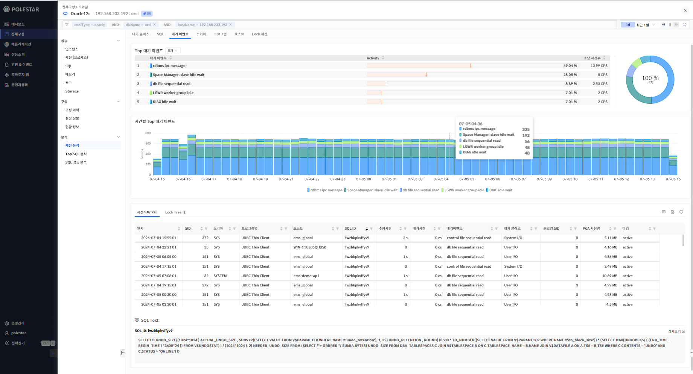

▶ \[그림60\] 오라클 세션 이력\> 대기 이벤트

Top 대기 이벤트

대기 이벤트 세션수가 많은 순으로 목록이 표시되며 특정 대기 이벤트를 클릭하면 하단 바차트에 선택된 대기 이벤트가 하이라이트 처리되며 세션목록, Lock Tree에는 선택된 대기 이벤트를 대기한 세션만 표시됩니다. Top 대기 이벤트 옆에 콤보 박스에서 Top 대기 이벤트 목록에 표시할 개수를 선택할 수 있습니다.

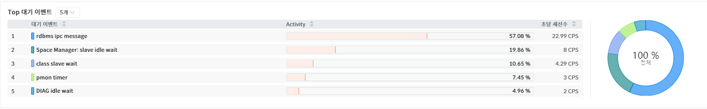

▶ \[그림61\] Top 대기 이벤트

> Top 대기 이벤트 목록

<table>
<thead>
<tr class="header">
<th>대기 이벤트</th>
<th>
세션이 대기한 대기 이벤트 이름입니다.

대기 이벤트(Wait Event)는 데이터베이스 세션이 자원을 기다리는 동안 발생하는 다양한 상황을 나타냅니다. 각 대기 이벤트는 특정 유형의 자원 대기를 설명하며, 이를 통해 데이터베이스 관리자는 성능 병목 현상을 분석하고 최적화할 수 있습니다.

대기 클래스 별 주요 대기 이벤트

1. Administrative(관리 작업으로 인해 발생하는 대기) 예시

log file switch (archiving needed): 로그 파일 전환 시 아카이빙 필요로 대기

log file switch (checkpoint incomplete): 체크포인트가 완료되지 않아 로그 파일 전환 대기

2. Application(애플리케이션 코드나 사용자 작업과 관련된 대기) 예시

enq: TX - row lock contention: 트랜잭션의 행 잠금 대기

enq: TM - contention: 테이블 잠금 경합 대기

3. Cluster(RAC 환경에서 노드 간 통신이나 리소스 경합으로 인한 대기) 예시

gc buffer busy acquire: 다른 노드로부터 버퍼 획득 대기

gc buffer busy release: 다른 노드로 버퍼 릴리즈 대기

4. Commit(트랜잭션 커밋 작업을 기다리는 대기) 예시

log file sync: 커밋 시 로그 파일 동기화 대기

log file parallel write: 여러 로그 파일 동시 쓰기 대기

5. Concurrency(동시성 제어 문제로 인한 대기) 예시

library cache lock: 라이브러리 캐시 잠금 대기

library cache pin: 라이브러리 캐시 핀 대기

6. Configuration(데이터베이스 설정 및 구성 문제로 인한 대기) 예시

log buffer space: 로그 버퍼 공간 부족 대기

undo segment extension: 언두 세그먼트 확장 대기

7. Idle(세션이 유휴 상태일때) 예시

SQL*Net message from client: 클라이언트 요청 대기

pmon timer: PMON 타이머 대기

8. Network(네트워크 통신 문제로 인한 대기) 예시

SQL*Net more data from client: 클라이언트로부터 추가 데이터 수신 대기

SQL*Net more data to client: 클라이언트로 추가 데이터 전송 대기

9. Other(특정 카테고리에 속하지 않는 경우) 예시

rdbms ipc message: 인스턴스 간 IPC 메시지 대기

pmon timer: PMON 타이머 대기

10. Scheduler(스케줄러 작업과 관련된 대기) 예시

jobq slave wait: 작업 큐 슬레이브 대기

dbms_scheduler job wait: DBMS_SCHEDULER 작업 대기

11. System I/O(시스템 수준의 I/O 작업 대기) 예시

control file sequential read: 제어 파일 순차적 읽기 대기

control file parallel write: 제어 파일 병렬 쓰기 대기

12. User I/O(사용자 I/O 요청 대기) 예시

db file sequential read: 데이터 파일 순차적 읽기 대기

db file scattered read: 데이터 파일 분산 읽기 대기

direct path read: 직접 경로 읽기 대기

direct path write: 직접 경로 쓰기 대기
</th>
</tr>
</thead>
<tbody>
<tr class="odd">
<td>Activity</td>
<td>타임 셀렉터 기간동안 해당 대기 이벤트를 대기한 세션수의 비율입니다.</td>
</tr>
<tr class="even">
<td>초당 세션수</td>
<td>타임 셀렉터 기간동안 해당 대기 이벤트를 대기한 세션수를 초당 개수로 표현한 값입니다. 예를 들어 3 CPS면 초당 3개의 세션이 해당 대기이벤트를 대기했다라고 해석할 수 있습니다.</td>
</tr>
</tbody>
</table>

기간별 Top 대기 이벤트(바차트)

타임 셀렉터 기간에 해당하는 대기 이벤트 대기 세션 수를 누적 바차트로 표시합니다. 바차트의 간격은 기간별로 달라지며 바 차트 개수는 최대 60개까지 표현됩니다. 바차트를 1개 선택하면 해당 시점의 바차트만 활성화되고 하단 세션 목록은 바 차트 1개에 해당하는 기간의 세션만 표시됩니다. 따라서 상단에 Top 대기 이벤트 목록에서 특정 SQL를 선택하고 바차트에서 특정 바 1개를 선택한다면 특정 시점에 선택한 대기 이벤트를 대기한 세션들만 세션 목록에서 필터링하여 조회할 수 있습니다.

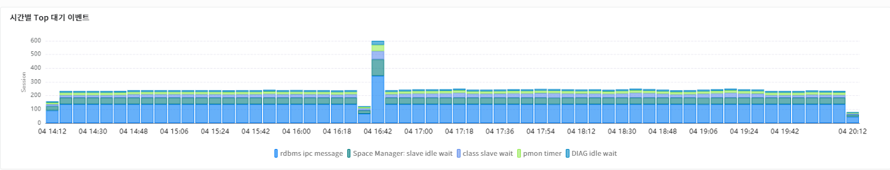

▶ \[그림62\] 기간별 대기 이벤트

세션목록

세션목록은 대기 클래스 탭의 세션목록과 기능이 동일합니다. 대기 클래스 탭 절을 참조하세요.

스키마

세션을 수행한 스키마 관점으로 세션 수행 이력을 분석할 수 있는 화면입니다. 화면 구성은 상단에 해당 스키마가 수행한 세션의 수가 많은 순으로 표시하는 목록과 도넛 차트가 있고 그 밑으로 타임 셀렉터 기간 동안 해당 스키마가 수행한 세션 수를 누적 바차트로 표시합니다. 바 차트 밑으로는 상세 세션목록과 Lock Tree 목록이 표시되며 세션목록이나 Lock Tree에서 SQL ID 컬럼에 있는 SQL ID를 클릭하면 하단에 해당 SQL ID에 대한 SQL Text가 표시됩니다.

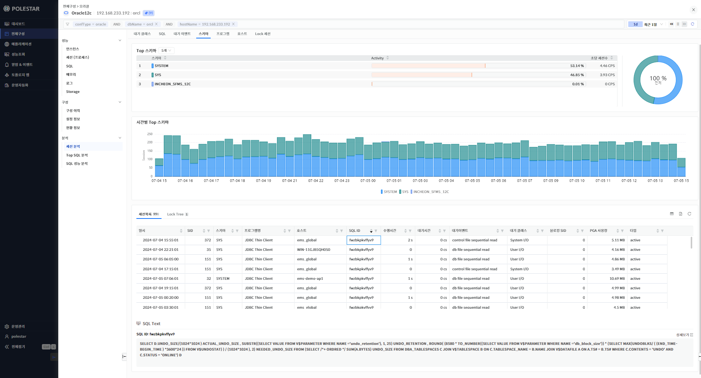

▶ \[그림63\] 오라클 세션 이력\> 스키마

Top 스키마 목록

스키마가 수행한 세션수가 많은 순으로 목록이 표시되며 특정 스키마를 클릭하면 하단 바차트에 선택된 스키마가 하이라이트 처리되며 세션목록, Lock Tree에는 선택된 스카마에서 수행한 세션만 표시됩니다. Top 스키마 타이틀 옆에 콤보 박스에서 Top 스키마 목록에 표시할 개수를 선택할 수 있습니다.

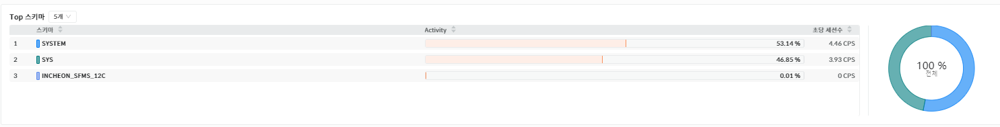

▶ \[그림64\] Top 스키마 목록

> Top 스키마 목록

| 스키마      | 세션을 수행한 스키마 명입니다.                                                                                |
| -------- | ------------------------------------------------------------------------------------------------ |
| Activity | 타임 셀렉터 기간동안 해당 스키마가 실행한 세션수의 비율입니다.                                                              |
| 초당 세션수   | 타임 셀렉터 기간동안 해당 스키마가 수행한 세션수를 초당 개수로 표현한 값입니다. 예를 들어 3 CPS면 초당 3개의 세션을 해당 스키마가 수행했다라고 해석할 수 있습니다. |

기간별 Top 스키마(바차트)

타임 셀렉터 기간에 해당하는 스키마가 수행한 세션 수를 누적 바차트로 표시합니다. 바차트의 간격은 기간별로 달라지며 바 차트 개수는 최대 60개까지 표현됩니다. 바차트를 1개 선택하면 해당 시점의 바차트만 활성화되고 하단 세션 목록은 바 차트 1개에 해당하는 기간의 세션만 표시됩니다. 따라서 상단에 Top 스키마 목록에서 특정 스키마를 선택하고 바차트에서 특정 바 1개를 선택한다면 특정 시점에 선택한 스키마가 수행한 세션들만 세션 목록에서 필터링하여 조회할 수 있습니다.

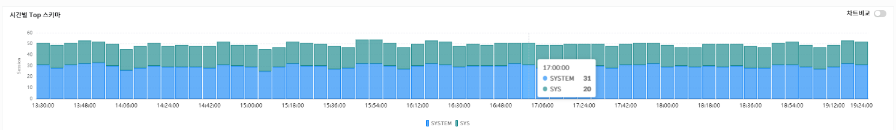

▶ \[그림65\] 기간별 Top 스키마

세션 목록

세션목록은 대기 클래스 탭의 세션목록과 기능이 동일합니다. 대기 클래스 탭 절을 참조하세요.

프로그램

세션을 수행한 프로그램 관점으로 세션 수행 이력을 분석할 수 있는 화면입니다. 화면 구성은 상단에 해당 프로그램이 수행한 세션의 수가 많은 순으로 표시하는 목록과 도넛 차트가 있고 그 밑으로 타임 셀렉터 기간 동안 해당 스키마가 수행한 세션 수를 누적 바차트로 표시합니다. 바 차트 밑으로는 상세 세션목록과 Lock Tree 목록이 표시되며 세션목록이나 Lock Tree에서 SQL ID 컬럼에 있는 SQL ID를 클릭하면 하단에 해당 SQL ID에 대한 SQL Text가 표시됩니다.

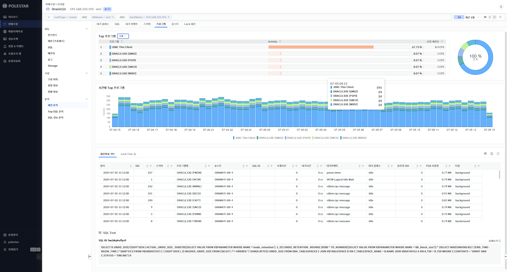

▶ \[그림66\] 오라클 세션 이력\> 프로그램

Top 프로그램 목록

프로그램이 수행한 세션수가 많은 순으로 목록이 표시되며 특정 프로그램을 클릭하면 하단 바차트에 선택된 프로그램이 하이라이트 처리되며 세션목록, Lock Tree에는 선택된 프로그램에서 수행한 세션만 표시됩니다. Top 프로그램 타이틀 옆에 콤보 박스에서 Top 프로그램 목록에 표시할 개수를 선택할 수 있습니다.

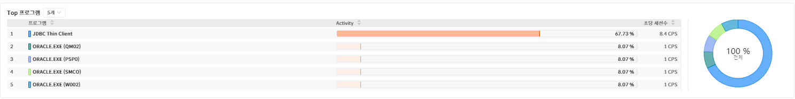

▶ \[그림67\] Top 프로그램 목록

> Top 프로그램 목록

| 프로그램     | 세션을 수행한 프로그램 명입니다.                                                                                   |
| -------- | ---------------------------------------------------------------------------------------------------- |
| Activity | 타임 셀렉터 기간동안 해당 프로그램이 실행한 세션수의 비율입니다.                                                                 |
| 초당 세션수   | 타임 셀렉터 기간동안 해당 프로그램이 수행한 세션수를 초당 개수로 표현한 값입니다. 예를 들어 3 CPS면 초당 3개의 세션을 해당 프로그램이 수행 했다라고 해석 할 수 있습니다. |

기간별 Top 프로그램(바차트)

타임 셀렉터 기간에 해당하는 프로그램이 수행한 세션 수를 누적 바차트로 표시합니다. 바차트의 간격은 기간별로 달라지며 바 차트 개수는 최대 60개까지 표현됩니다. 바차트를 1개 선택하면 해당 시점의 바차트만 활성화되고 하단 세션 목록은 바 차트 1개에 해당하는 기간의 세션만 표시됩니다. 따라서 상단에 Top 프로그램 목록에서 특정 프로그램을 선택하고 바차트에서 특정 바 1개를 선택한다면 특정 시점에 선택한 프로그램이 수행한 세션들만 세션 목록에서 필터링하여 조회할 수 있습니다.

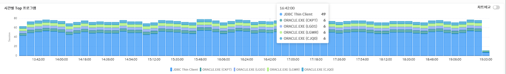

▶ \[그림68\] 기간별 Top 프로그램

세션목록

세션목록은 대기 클래스 탭의 세션목록과 기능이 동일합니다. 대기 클래스 탭 절을 참조하세요.

호스트

세션을 수행한 호스트(클라이언트) 관점으로 세션 수행 이력을 분석할 수 있는 화면입니다. 화면 구성은 상단에 해당 호스트가 수행한 세션의 수가 많은 순으로 표시하는 목록과 도넛 차트가 있고 그 밑으로 타임 셀렉터 기간 동안 해당 호스트가 수행한 세션 수를 누적 바차트로 표시합니다. 바 차트 밑으로는 상세 세션목록과 Lock Tree 목록이 표시되며 세션목록이나 Lock Tree에서 SQL ID 컬럼에 있는 SQL ID를 클릭하면 하단에 해당 SQL ID에 대한 SQL Text가 표시됩니다.

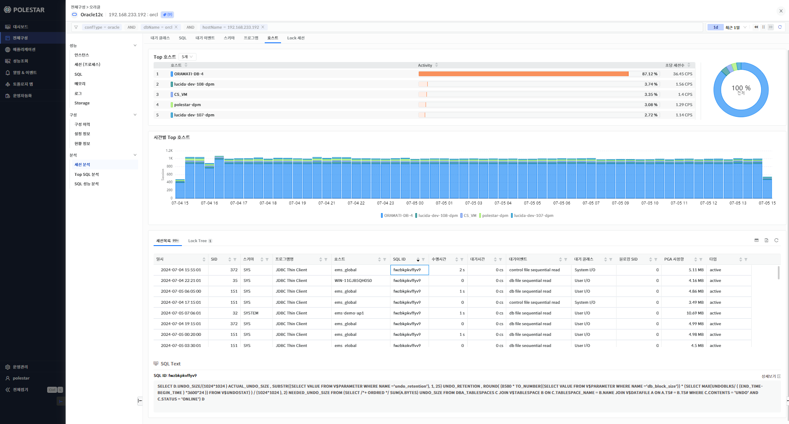

▶ \[그림69\] 오라클 세션 이력\> 호스트

Top 호스트 목록

호스트(클라이언트)가 수행한 세션수가 많은 순으로 목록이 표시되며 특정 호스트를 클릭하면 하단 바차트에 선택된 호스트가 하이라이트 처리되며 세션목록, Lock Tree에는 선택된 호스트에서 수행한 세션만 표시됩니다. Top 호스트 타이틀 옆에 콤보 박스에서 Top 호스트 목록에 표시할 개수를 선택할 수 있습니다.

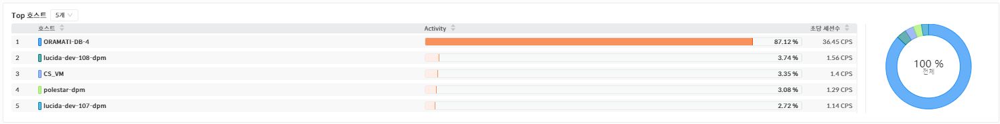

▶ \[그림70\] Top 호스트 목록

> Top 호스트 목록

| 호스트      | 세션을 수행한 호스트(클라이언트) 명입니다.                                                                          |
| -------- | ------------------------------------------------------------------------------------------------- |
| Activity | 타임 셀렉터 기간동안 해당 호스트가 실행한 세션수의 비율입니다.                                                               |
| 초당 세션수   | 타임 셀렉터 기간동안 해당 호스트가 수행한 세션수를 초당 개수로 표현한 값입니다. 예를 들어 3 CPS면 초당 3개의 세션을 해당 호스트가 수행 했다라고 해석할 수 있습니다. |

기간별 Top 호스트(바차트)

타임 셀렉터 기간에 해당하는 호스트가 수행한 세션 수를 누적 바차트로 표시합니다. 바차트의 간격은 기간별로 달라지며 바 차트 개수는 최대 60개까지 표현됩니다. 바차트를 1개 선택하면 해당 시점의 바차트만 활성화되고 하단 세션 목록은 바 차트 1개에 해당하는 기간의 세션만 표시됩니다. 따라서 상단에 Top 호스트 목록에서 특정 호스트를 선택하고 바차트에서 특정 바 1개를 선택한다면 특정 시점에 선택한 호스트가 수행한 세션들만 세션 목록에서 필터링하여 조회할 수 있습니다.

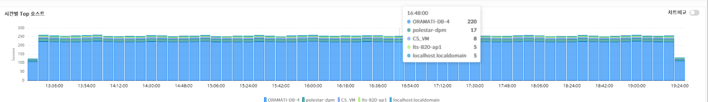

▶ \[그림71\] 기간별 Top 호스트

세션목록

세션목록은 대기 클래스 탭의 세션목록과 기능이 동일합니다. 대기 클래스 탭 절을 참조하세요.

세션

세션 관점으로 세션 수행 이력을 분석할 수 있는 화면입니다. 화면 구성은 상단에 세션의 수가 많은 세션 ID 순으로 표시하는 목록과 도넛 차트가 있고 그 밑으로 타임 셀렉터 기간 동안 해당 세션이 수행한 세션 수를 누적 바차트로 표시합니다. 바 차트 밑으로는 상세 세션목록과 Lock Tree 목록이 표시되며 세션목록이나 Lock Tree에서 SQL ID 컬럼에 있는 SQL ID를 클릭하면 하단에 해당 SQL ID에 대한 SQL Text가 표시됩니다.

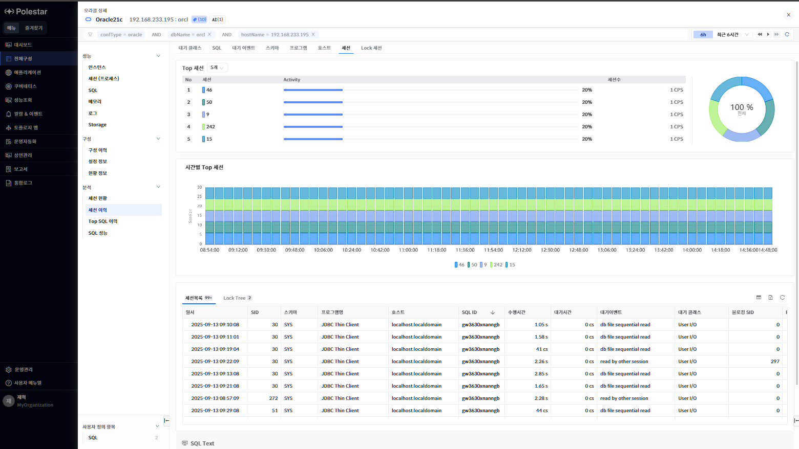

▶ \[그림66\] 오라클 세션 이력\> 세션

Top 세션 목록

세션이 수행한 세션수가 많은 순으로 목록이 표시되며 특정 세션 ID를 클릭하면 하단 바차트에 선택된 세션 ID가 하이라이트 처리되며 세션목록, Lock Tree에는 선택된 세션 ID에 해당하는 세션만 표시됩니다. Top 세션 타이틀 옆에 콤보 박스에서 Top 세션 목록에 표시할 개수를 선택할 수 있습니다.

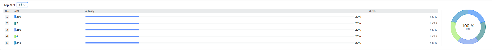

▶ \[그림67\] Top 세션 목록

> Top 세션 목록

| 세션       | 세션을 식별할 수 있는 ID입니다. 보통 SID라고 표현합니다.                                                               |
| -------- | ------------------------------------------------------------------------------------------------- |
| Activity | 타임 셀렉터 기간동안 해당 프로그램이 실행한 세션수의 비율입니다.                                                              |
| 초당 세션수   | 타임 셀렉터 기간동안 해당 세션이 수행한 세션수를 초당 개수로 표현한 값입니다. 예를 들어 3 CPS면 초당 3개의 세션을 해당 프로그램이 수행 했다라고 해석할 수 있습니다. |

기간별 Top 세션(바차트)

타임 셀렉터 기간에 해당하는 세션이 수행한 세션 수를 누적 바차트로 표시합니다. 바차트의 간격은 기간별로 달라지며 바 차트 개수는 최대 60개까지 표현됩니다. 바차트를 1개 선택하면 해당 시점의 바차트만 활성화되고 하단 세션 목록은 바 차트 1개에 해당하는 기간의 세션만 표시됩니다. 따라서 상단에 Top 프로그램 목록에서 특정 프로그램을 선택하고 바차트에서 특정 바 1개를 선택한다면 특정 시점에 선택한 프로그램이 수행한 세션들만 세션 목록에서 필터링하여 조회할 수 있습니다.

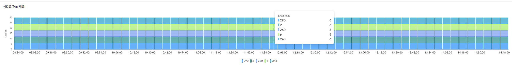

▶ \[그림68\] 기간별 Top 세션

세션목록

세션목록은 대기 클래스 탭의 세션목록과 기능이 동일합니다. 대기 클래스 탭 절을 참조하세요.

Lock 세션

오라클에 발생했던 Lock 관련 세션 정보를 조회하고 분석할 수 있는 화면입니다. 화면 구성은 상단에 Lock 발생이 많았던 세션 SID 순으로 표시하는 목록과 도넛 차트가 있고 그 밑으로 타임 셀렉터 기간 동안 Lock이 발생된 세션에 대한 세션 수를 누적 바차트로 표시합니다. 바 차트내 바 1개를 클릭하면 해당 바에 해당하는 기간 동안의 Lock 세션 이력이 하단 Lock Tree 목록에 표시됩니다. 바 차트 밑으로는 상세 세션목록과 Lock Tree 목록이 표시되며 세션목록이나 Lock Tree에서 SQL ID 컬럼에 있는 SQL ID를 클릭하면 하단에 해당 SQL ID에 대한 SQL Text가 표시됩니다.

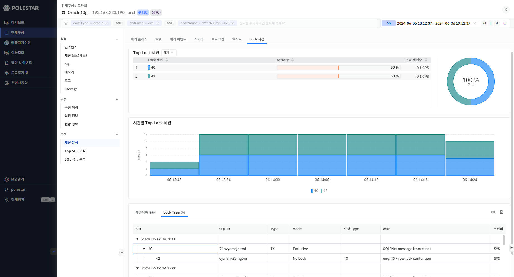

▶ \[그림72\] 오라클 세션 이력\> Lock 세션

Lock Tree

오라클에 락 세션이 발생되면 Lock Tree 목록에서 해당 락 세션들을 확인할 수 있습니다. Lock Tree에서는 락을 유발한 세션(블로킹 세션)을 부모로 하고 해당 락으로 인해 블록된 세션을 자식으로 하는 트리 형태로 목록을 표시합니다. 부모락 세션을 기준으로 해당 트리를 접거나 펼쳐 볼 수 있으며 SQL ID 컬럼에 있는 SQL ID를 선택하면 하단에 해당 SQL ID에 해당하는 SQL Text가 표시됩니다. SQL Text 창의 우측 상단에 SQL문 포메팅 버튼을 클릭하면 해당 SQL문을 포메팅하여 볼 수 있으며 상세보기버튼을 클릭하면 SQL Text 상세 드로어가 표시되며 해당 드로어 화면에서 SQL에 대한 상세 성능 이력 정보 및 Plan 정보를 확인할 수 있습니다. 자세한 내용은 “개별 SQL 이력 보기(SQL Text 상세 드로어)”절을 참조하세요.

▶ \[그림73\] Lock Tree

> Lock Tree 목록

| SID     | Lock 발생일시, Lock 발생 세션, 블록 된 세션을 트리형태로 표현합니다. Lock이 발생된 시간을 최 상단 부모로 하여 Lock을 유발한 세션을 그 밑에 나오고 해당 Lock으로 인해 블록 된 세션을 Lock 유발세션의 자식으로 하는 트리형태로 표시합니다. |
| ------- | --------------------------------------------------------------------------------------------------------------------------------------------------- |
| SQL ID  | Lock을 유발하거나 Lock된 세션에서 수행한 SQL ID(SQL 식별 ID)입니다.                                                                                                    |
| Type    | 잠금의 타입을 나타냅니다. 예를 들어, 'TX'는 트랜잭션 잠금을 의미합니다. 이 컬럼이 비어 있는 경우, 해당 세션은 현재 잠금을 소유하고 있지 않음을 나타냅니다.                                                        |
| Mode    | 현재 세션이 소유하고 있는 잠금의 모드를 나타냅니다. 'Exclusive' 모드는 배타적 잠금을 의미합니다. 현재 잠금을 소유하고 있지 않은 세션은 ‘No Lock’으로 표시됩니다.                                               |
| 요청 Type | 세션이 요청한 잠금의 타입을 나타냅니다. 예를 들어, 'TX'는 트랜잭션 잠금을 의미합니다.                                                                                                 |
| 대기이벤트   | 세션이 현재 기다리고 있는 특정 이벤트를 나타냅니다. 예를 들어, 'enq: TX - row lock contention'은 행 잠금 경합을 나타냅니다.                                                               |
| 스키마     | 세션이 현재 사용하고 있는 데이터베이스 스키마의 이름입니다. 스키마는 데이터베이스 객체(테이블, 뷰 등)의 논리적 그룹을 나타냅니다.                                                                          |
| 프로그램명   | 데이터베이스에 연결된 클라이언트 프로그램의 이름입니다. 예를 들어, 'DBAny.exe'는 데이터베이스와 연결된 클라이언트 프로그램을 나타냅니다.                                                                   |
| 호스트     | 데이터베이스에 연결된 클라이언트 머신의 호스트명입니다. 클라이언트가 실행 중인 서버나 컴퓨터의 이름을 나타냅니다.                                                                                     |
| 대기시간    | 세션이 현재 대기 중인 시간입니다.                                                                                                                                 |
| status  | 세션의 현재 상태를 나타냅니다. 초록색은 세션이 활성 상태를 나타내며 회색은 비활성화 상태를 나타냅니다.                                                                                          |

Top SQL 분석

Top SQL 분석 기능을 통해 오라클에 수행된 SQL들 중에 성능 이슈가 있는 SQL등을 3가지 관점(SQL, 스키마, 모듈)으로 분석해 볼 수 있습니다. SQL의 다양한 성능(평균 수행시간, 수행 수, 평균 CPU 시간, 평균 논리 읽기 수, 평균 물리 읽기 수 등) 기준으로, 최대 30개의 Top SQL을 검색하여 분석할 수 있습니다.

SQL

개별 SQL 단위로 성능 지연이 발생한 SQL을 분석할 수 있는 화면입니다. 다양한 성능 지표로 Top SQL을 조회하고 해당 Top SQL의 수행이력을 조회해 볼 수 있습니다. 또한 개별 SQL을 선택하여 한 SQL에 대한 상세 이력 분석이 가능하며 Top SQL 상세 목록에서 Plan Hash 값을 선택하면 상세 실행계획(Execution Plan)을 트리 그리드형태로 확인해 볼 수 있습니다. 또한 개별 SQL에 Plan 이 여려 개인 경우 Plan간 비교 기능도 제공합니다.

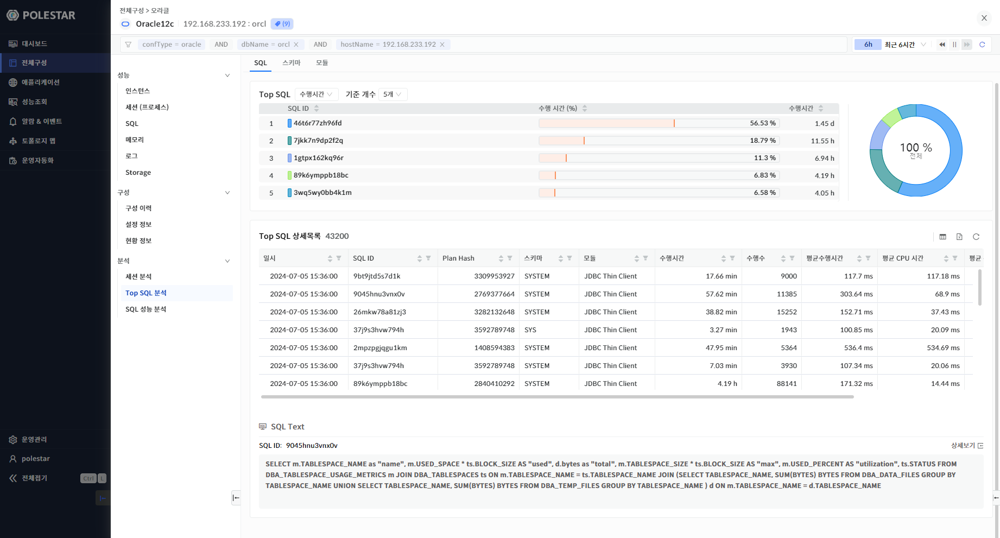

▶ \[그림74\] 오라클 Top SQL 분석 \> SQL

Top SQL 목록

Top SQL 목록 상단 콤보 박스에서 선택한 성능 지표(기본: 수행시간)가 높은 SQL을 선택한 기준개수(기본: 5개)만큼 표시합니다. 목록에서 특정 SQL ID를 클릭하면 하단 Top SQL 상세 목록에 선택된 SQL 이력 세션만 표시됩니다. Top SQL 기준 성능 지표(수행시간, 수행수, 평균 수행시간, 평균 CPU 시간, 평균 논리 읽기 수, 평균 물리 읽기 수)는 목록 상단 콤보 박스에서 선택할 수 있으며 Top SQL 개수도 목록 상단 개준 개수(5개, 10개, 15개, 20개, 30개)를 콤보 박스에서 선택할 수 있습니다.

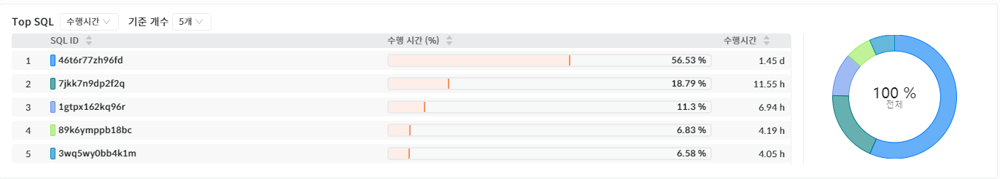

▶ \[그림75\] Top SQL 목록

> Top SQL 목록

| SQL ID       | Top SQL ID 입니다. SQL ID에 마우스를 Hover하면 해당 SQL ID에 해당하는 SQL Text가 툴팁으로 표시됩니다. 또한 해당 SQL ID를 선택하면 하단 Top SQL 상세 목록에서 해당 SQL ID에 해당하는 이력만 표시됩니다.. |
| ------------ | -------------------------------------------------------------------------------------------------------------------------------------------- |
| 수행시간(%)      | 오라클이 기동된 이후 총 수행된 SQL 수행시간을 목록에 나온 전체 SQL 대비 비율로 표시합니다.                                                                                      |
| 수행시간         | 오라클이 기동 된 이후 총 수행된 SQL 수행 시간입니다.                                                                                                             |
| 수행수(%)       | 오라클이 기동 된 이후 SQL이 수행한 횟수를 목록에 있는 SQL 전체 수행횟수의 비율로 표시합니다.                                                                                     |
| 수행수          | 오라클이 기동 된 이후 SQL이 수행한 횟수입니다.                                                                                                                 |
| 평균수행시간(%)    | 해당 SQL의 평균 수행 시간을 목록에 나온 전체 SQL 평균 수행 시간 대비 비율로 표시합니다.                                                                                       |
| 평균수행시간       | SQL 문이 한 번 실행될 때 평균 소요되는 시간입니다. SQL 수행한 시간을 수행 횟수로 나눈 값입니다.                                                                                  |
| 평균 CPU 시간(%) | 해당 SQL의 평균 CPU 시간을 목록에 나온 전체 SQL 평균 CPU 시간 대비 비율로 표시합니다.                                                                                     |
| 평균 논리읽기수(%)  | 해당 SQL의 평균 논리 읽기 수를 목록에 나온 전체 SQL 평균 논리 읽기 수 대비 비율로 표시합니다.                                                                                   |
| 평균 논리읽기수     | SQL 문이 한 번 실행될 때 평균 사용한 논리 읽기 수입니다. 오라클 기동 이후 SQL이 수행한 총 논리 읽기 수를 수행 횟수로 나눈 값입니다.                                                            |
| 평균 물리읽기수(%)  | 해당 SQL의 물리 읽기 수를 목록에 나온 전체 SQL 평균 물리 읽기 수 대비 비율로 표시합니다.                                                                                      |
| 평균 물리읽기수     | SQL 문이 한 번 실행될 때 평균 사용한 물리 읽기 수입니다. 오라클 기동 이후 SQL이 수행한 총 물리 읽기 수를 수행 횟수로 나눈 값입니다.                                                            |

Top SQL 상세 목록

타임 셀렉터에 선택한 기간내의 수집한 Top SQL 전체 목록이 표시됩니다. 상단 Top SQL 목록에서 원하는 SQL만 선택하여 필터링 하여 보실 수 있습니다. Top SQL 상세 목록을 해당 기간 어떤 SQL이 성능 부하를 발생하였는지 여러 성능 기준으로 확인하실 수 있습니다.

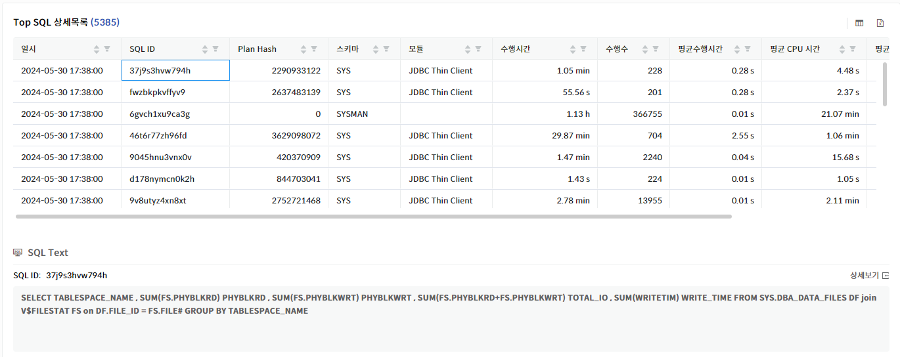

▶ \[그림76\] Top SQL 상세 목록

> Top SQL 상세 목록

| 일시        | SQL 이력 정보가 수집된 시간입니다.                                                             |
| --------- | --------------------------------------------------------------------------------- |
| SQL ID    | Top SQL ID입니다. 해당 SQL ID를 선택하면 하단 Top SQL 상세 목록에서 해당 SQL ID에 해당하는 이력만 표시됩니다.      |
| Plan Hash | SQL 이 수행될 때 어떤 Plan으로 수행되었는지 식별할 수 있는 식별값입니다.                                     |
| 스키마       | 어떤 스키마(사용자)가 수행했는지 표시합니다.                                                         |
| 모듈        | 어떤 모듈이 해당 SQL을 수행했는지 표시합니다.                                                       |
| 수행시간      | 오라클이 기동 된 이후 총 수행된 SQL 수행 시간입니다.                                                  |
| 수행수       | 오라클이 기동 된 이후 SQL이 수행한 횟수입니다.                                                      |
| 평균수행시간    | SQL 문이 한 번 실행될 때 평균 소요되는 시간입니다. SQL 수행한 시간을 수행 횟수로 나눈 값입니다.                       |
| 평균 CPU 시간 | SQL 문이 한 번 실행될 때 평균 소요되는 CPU 사용 시간입니다. SQL CPU 시간을 수행 횟수로 나눈 값입니다.                |
| 평균 논리읽기수  | SQL 문이 한 번 실행될 때 평균 사용한 논리 읽기 수입니다. 오라클 기동 이후 SQL이 수행한 총 논리 읽기 수를 수행 횟수로 나눈 값입니다. |
| 평균 물리읽기수  | SQL 문이 한 번 실행될 때 평균 사용한 물리 읽기 수입니다. 오라클 기동 이후 SQL이 수행한 총 물리 읽기 수를 수행 횟수로 나눈 값입니다  |

<table>
<tbody>
<tr class="odd">
<td>
노트

Top SQL에 나오는 SQL 목록은 상단 Top SQL에 표시된 SQL만 나오는 것이 아니고 타임 셀렉터에 선택한 기간내 Top SQL로 수집한 모든 SQL이 나옵니다. Top SQL 수집 여부 및 개수 설정은 오라클 추가시나 설정 정보에서 변경하실 수 있습니다.
</td>
</tr>
</tbody>
</table>

Execution Plan 목록

Top SQL 목록에서 Plan Hash 값을 선택하면 상세 실행계획(Execution Plan)을 하단 그림과 같이 트리 그리드 형태로 확인해 볼 수 있습니다. 트리 형태의 Plan정보를 Depth별로 펼치고 접어 가면서 살펴보실 수 있습니다.

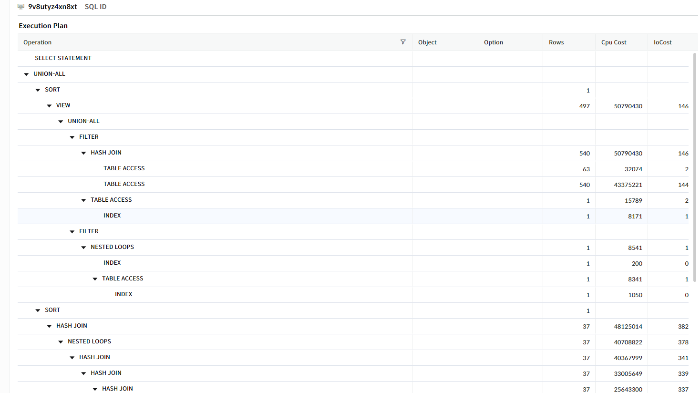

▶ \[그림77\] Execution Plan 목록

> Execution Plan 목록

<table>
<thead>
<tr class="header">
<th>Operation</th>
<th>
실행 계획에서 수행되는 연산의 유형입니다. 이 컬럼은 SQL 문이 어떻게 실행되는지를 보여줍니다.

예: TABLE ACCESS, INDEX SCAN, HASH JOIN, SORT
</th>
</tr>
</thead>
<tbody>
<tr class="odd">
<td>Object</td>
<td>
연산이 수행되는 객체의 이름입니다. 주로 테이블이나 인덱스의 이름을 나타냅니다.

예: EMPLOYEES (테이블 이름), IDX_EMP_NAME (인덱스 이름)
</td>
</tr>
<tr class="even">
<td>Option</td>
<td>
연산의 추가적인 옵션이나 방법을 나타냅니다. 연산의 구체적인 수행 방법에 대한 정보를 제공합니다. 연산이 수행되는 방식을 이해하고 성능 최적화를 위한 힌트를 얻는 데 사용됩니다.

예: FULL (전체 스캔), UNIQUE SCAN (고유 스캔), RANGE SCAN (범위 스캔)
</td>
</tr>
<tr class="odd">
<td>Rows</td>
<td>
각 연산에서 예상되는 결과 행(row)의 수입니다. CARDINALITY 컬럼을 ROWS라는 별칭으로 표시합니다. 각 단계에서 얼마나 많은 행이 처리될지를 예측하는 데 사용됩니다.

예: 1000 (해당 단계에서 예상되는 결과 행 수)
</td>
</tr>
<tr class="even">
<td>Cpu Cost</td>
<td>
각 연산에 대해 예상되는 CPU 비용입니다. 비용은 주어진 연산을 수행하는 데 필요한 CPU 리소스의 상대적 양을 나타냅니다. CPU 리소스 소모가 높은 연산을 식별하고 최적화할 때 사용됩니다.

예: 1500 (CPU 비용의 상대적 값)
</td>
</tr>
<tr class="odd">
<td>Io Cost</td>
<td>
각 연산에 대해 예상되는 I/O 비용입니다. 비용은 주어진 연산을 수행하는 데 필요한 디스크 I/O의 상대적 양을 나타냅니다. I/O 리소스 소모가 높은 연산을 식별하고 최적화할 때 사용됩니다.

예: 3000 (I/O 비용의 상대적 값)
</td>
</tr>
</tbody>
</table>

개별 SQL 이력 조회(SQL Text 드로어)

SQL Text 창의 우측 상세보기 버튼을 클릭하면 해당 SQL에 대한 상세 성능 이력 정보를 조회할 수 있는 드로어 화면이 나옵니다. 개별 SQL 이력 조회를 통해 해당 SQL의 과거 수행 이력 및 수행시간 Plan 정보, 수행 세션 수 정보 등을 확인할 수 있습니다.

▶ \[그림78\] 개별 SQL 상세 이력 조회 절차

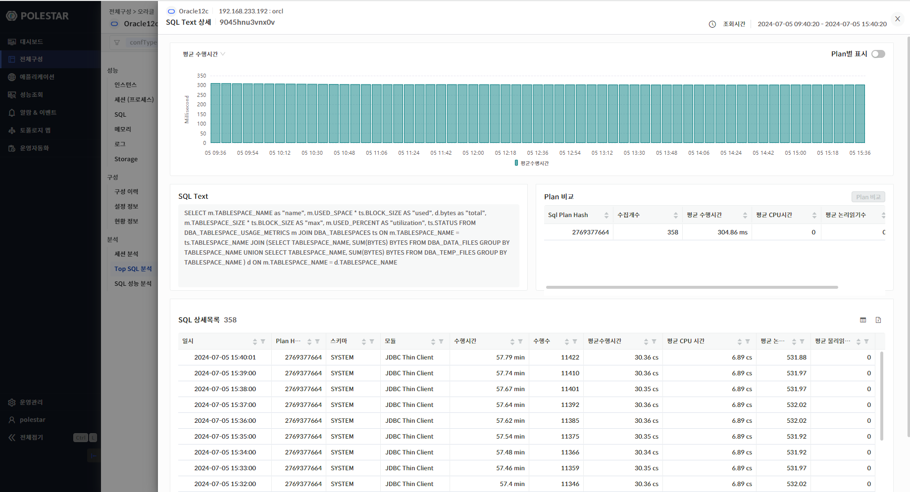

▶ \[그림79\] 개별 SQL 상세 이력 드로어

> 개별 SQL 이력 조회 절차

1.  Top SQL 목록에서 특정 SQL ID를 선택

2.  하단 SQL Text창에 선택한 SQL ID에 대한 SQL Text가 표시됨

3.  SQL Text 우측 상단에 상세보기 버튼 클릭

4.  선택한 SQL에 대한 이력 조회 드로어 화면 표시

5.  좌측 상단 콤보박스에서 세션수 또는 평균 수행시간을 선택

<table>
<tbody>
<tr class="odd">
<td>
노트

SQL Text 상세 드로어 화면에서는 좌측 상단 콤보 박스에서 세션수 또는 평균 수행시간 항목을 선택하여 각 SQL이 수행한 세션 정보나 SQL 평균 수행시간 이력 정보를 확인할 수 있습니다.
</td>
</tr>
</tbody>
</table>

<table>
<tbody>
<tr class="odd">
<td>
주의

SQL Text 상세 드로어 화면에서 좌측 상단 콤보 박스에 세션수나 평균 수행시간항목은 해당 SQL에 대한 세션 이력 정보 또는 Top SQL 이력 정보가 있을 때에만 표시됩니다.
</td>
</tr>
</tbody>
</table>

Plan 비교

개별 SQL 이력 보기 화면에서는 해당 SQL에서 수행된 Plan이 1개 이상인 경우 해당 Plan들을 비교해볼 수 있는 기능을 제공합니다. Plan 비교 목록 우측 상단 Plan 비교 버튼 선택하면 Plan 비교를 할 수 있습니다.

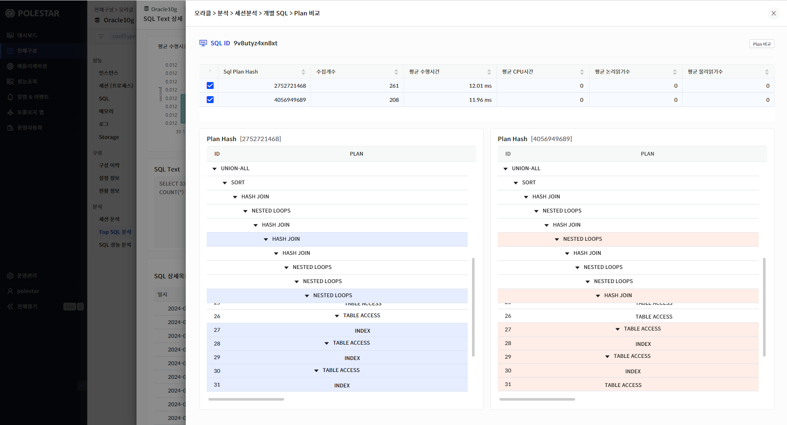

▶ \[그림80\] Plan 비교 드로어

<table>
<tbody>
<tr class="odd">
<td>
노트

동일 SQL에 Plan이 1개 이상이면 특정 시점에 해당 SQL에 성능 저하가 발생되거나 성능 개선이 있을 수 있습니다. 따라서 이런 경우 Plan 비교 기능을 통해 Plan을 비교하여 대상 SQL이 느려지거나 개선된 이유를 분석 할 수 있습니다.
</td>
</tr>
</tbody>
</table>

스키마

SQL을 수행한 스키마 단위로 성능 지연이 발생한 SQL을 분석할 수 있는 화면입니다. 다양한 성능 지표로 SQL을 많이 수행한 스키마 순으로 Top SQL의 수행이력을 조회해 볼 수 있습니다. 또한 개별 SQL을 선택하여 한 SQL에 대한 상세 이력 분석이 가능하며 Top SQL 상세 목록에서 Plan Hash 값을 선택하면 상세 실행계획(Execution Plan)을 트리 그리드형태로 확인해 볼 수 있습니다. 또한 개별 SQL에 Plan 이 여려 개인 경우 Plan간 비교 기능도 제공합니다.

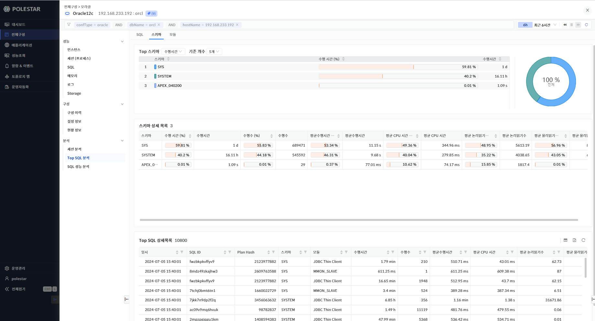

▶ \[그림81\] 오라클 Top SQL 분석 \> 스키마

Top 스키마 목록

Top 스키마 목록 상단 콤보 박스에서 선택한 성능 지표(기본: 수행시간)가 높은 스키마를 선택한 기준개수(기본: 5개)만큼 표시합니다. 목록에서 특정 스키마를 클릭하면 중단 스키마 상세 목록에 해당 스키마 목록이 하이라이트 되며, 하단 Top SQL 상세 목록에 선택된 스키마가 수행한 SQL 이력만 표시됩니다. Top 스키마 기준 성능 지표(수행시간, 수행수, 평균 수행시간, 평균 CPU 시간, 평균 논리 읽기 수, 평균 물리 읽기 수)는 목록 상단 콤보 박스에서 선택할 수 있으며 Top 스키마 개수도 목록 상단 개준 개수(5개, 10개, 15개, 20개, 30개)를 콤보 박스에서 선택할 수 있습니다.

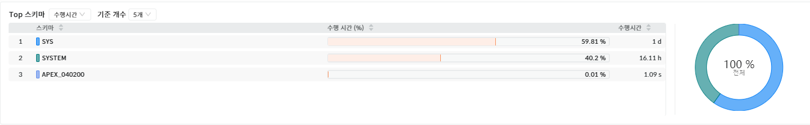

▶ \[그림82\] Top 스키마 목록

> Top 스키마 목록

| 스키마          | 스키마 명입니다. 해당 스키마를 선택하면 하단 Top SQL 상세 목록에서 해당 스키마에 해당하는 이력만 표시됩니다.         |
| ------------ | ------------------------------------------------------------------------- |
| 수행시간(%)      | 오라클이 기동 된 이후 해당 스키마에서 총 수행된 Top SQL 수행시간을 목록에 나온 스키마 수행시간 대비 비율로 표시합니다.   |
| 수행시간         | 오라클이 기동 된 이후 해당 스키마에서 수행된 총 Top SQL 수행 시간입니다.                             |
| 수행수(%)       | 오라클이 기동 된 이후 해당 스키마에서 수행한 Top SQL이 수행한 횟수를 목록에 있는 전체 스키마 수행횟수의 비율로 표시합니다. |
| 수행수          | 오라클이 기동 된 이후 해당 스키마에서 수행한 Top SQL이 수행한 횟수입니다.                             |
| 평균수행시간(%)    | 스키마에서 수행한 SQL들의 평균 수행 시간을 목록에 나온 전체 스키마평균 수행 시간 대비 비율로 표시합니다.             |
| 평균수행시간       | 스키마에서 수행한 SQL 문 전체에 대한 평균 수행 시간입니다.                                       |
| 평균 CPU 시간(%) | 스키마에서 수행한 SQL들의 평균 CPU 시간을 목록에 나온 전체 스키마평균 CPU 시간 대비 비율로 표시합니다.           |
| 평균 CPU 시간    | 스키마에서 수행한 SQL 문 전체에 대한 평균 CPU 시간입니다.                                      |
| 평균 논리읽기수(%)  | 스키마에서 수행한 SQL들의 평균 논리 읽기 수를 목록에 나온 전체 스키마 평균 논리 읽기 수 대비 비율로 표시합니다.        |
| 평균 논리읽기수     | 스키마에서 수행한 SQL 문 전체에 대한 평균 논리 읽기 수입니다.                                     |
| 평균 물리읽기수(%)  | 스키마에서 수행한 SQL들의 평균 물리 읽기 수를 목록에 나온 전체 스키마 평균 물리 일기 수 대비 비율로 표시합니다.        |
| 평균 물리읽기수     | 스키마에서 수행한 SQL 문 전체에 대한 평균 물리 읽기 수입니다.                                     |

<table>
<tbody>
<tr class="odd">
<td>
주의

스키마에서 사용한 수행 시간, 수행수 등의 성능 지표는 해당 기간내 모든 SQL이 아니고 수집한 Top SQL내에서의 합계입니다. Top SQL 수집 개수는 오라클 추가시나 오라클 설정 정보에서 변경하실 수 있습니다.
</td>
</tr>
</tbody>
</table>

스키마 상세 목록

Top 스키마 목록보다 상세한 성능 정보를 표시합니다. 이를 통해 스키마별 보다 상세한 성능 비교를 할 수 있습니다. 컬럼 값은 Top 스키마 목록내 설명과 동일합니다.

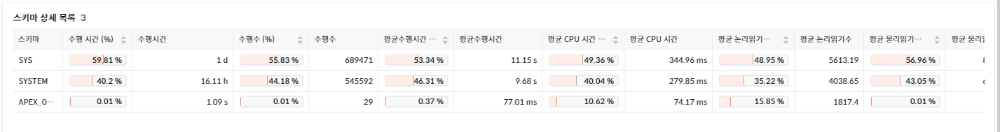

▶ \[그림83\] 스키마 상세 목록

Top SQL 상세 목록

Top SQL 상세 목록은 SQL 탭과 동일합니다. SQL 탭의 “Top SQL 상세 목록” 부분을 참조하세요.

모듈

SQL을 수행한 모듈 단위로 성능 지연이 발생한 SQL을 분석할 수 있는 화면입니다. 다양한 성능 지표로 SQL을 많이 수행한 모듈 순으로 Top SQL의 수행이력을 조회해 볼 수 있습니다. 또한 개별 SQL을 선택하여 한 SQL에 대한 상세 이력 분석이 가능하며 Top SQL 상세목록에서 Plan Hash 값을 선택하면 상세 실행계획(Execution Plan)을 트리 그리드형태로 확인해 볼 수 있습니다. 또한 개별 SQL에 Plan 이 여려 개인 경우 Plan간 비교 기능도 제공합니다.

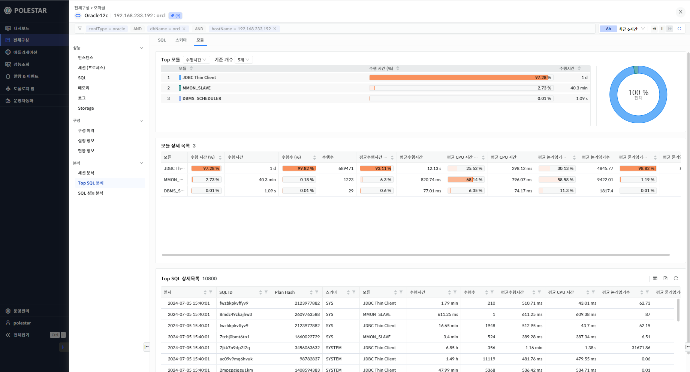

▶ \[그림84\] 오라클 Top SQL 분석 \> 모듈

Top 모듈 목록

Top 모듈 목록 상단 콤보 박스에서 선택한 성능 지표(기본: 수행시간)가 높은 모듈을 선택한 기준개수(기본: 5개)만큼 표시합니다. 목록에서 특정 모듈을 클릭하면 중단 모듈 상세 목록에 해당 모듈 목록이 하이라이트 되며, 하단 Top SQL 상세 목록에 선택된 스키마가 수행한 SQL 이력만 표시됩니다. Top 모듈 기준 성능 지표(수행시간, 수행수, 평균 수행시간, 평균 CPU 시간, 평균 논리 읽기 수, 평균 물리 읽기 수)는 목록 상단 콤보 박스에서 선택할 수 있으며 Top 모듈 개수도 목록 상단 개준 개수(5개, 10개, 15개, 20개, 30개)를 콤보 박스에서 선택할 수 있습니다.

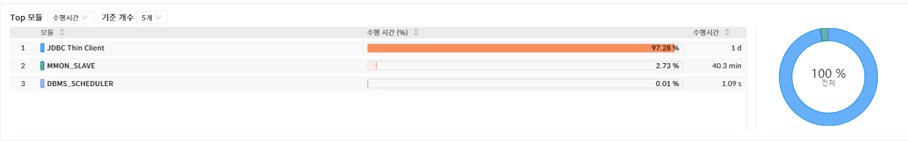

▶ \[그림85\] Top 모듈 목록

> Top 모듈 목록

| 스키마          | 모듈 명입니다. 해당 모듈명을 선택하면 하단 Top SQL 상세 목록에서 해당 모듈에 해당하는 이력만 표시됩니다.          |
| ------------ | ------------------------------------------------------------------------ |
| 수행시간(%)      | 오라클이 기동 된 이후 해당 모듈에서 총 수행된 Top SQL 수행시간을 목록에 나온 모듈 수행시간 대비 비율로 표시합니다.    |
| 수행시간         | 오라클이 기동 된 이후 해당 모듈에서 수행된 총 Top SQL 수행 시간입니다.                             |
| 수행수(%)       | 오라클이 기동 된 이후 해당 모듈에서 수행한 Top SQL이 수행한 횟수를 목록에 있는 전체 모듈의 수행횟수의 비율로 표시합니다. |
| 수행수          | 오라클이 기동 된 이후 해당 모듈에서 수행한 Top SQL이 수행한 횟수입니다.                             |
| 평균수행시간(%)    | 모듈에서 수행한 SQL들의 평균 수행 시간을 목록에 나온 전체 모듈 평균 수행 시간 대비 비율로 표시합니다.             |
| 평균수행시간       | 모듈에서 수행한 SQL 문 전체에 대한 평균 수행 시간입니다.                                       |
| 평균 CPU 시간(%) | 모듈에서 수행한 SQL들의 평균 CPU 시간을 목록에 나온 전체 모듈 평균 CPU 시간 대비 비율로 표시합니다.           |
| 평균 CPU 시간    | 모듈에서 수행한 SQL 문 전체에 대한 평균 CPU 시간입니다.                                      |
| 평균 논리읽기수(%)  | 모듈에서 수행한 SQL들의 평균 논리 읽기 수를 목록에 나온 전체 모듈 평균 논리 읽기 수 대비 비율로 표시합니다.         |
| 평균 논리읽기수     | 모듈에서 수행한 SQL 문 전체에 대한 평균 논리 읽기 수입니다.                                     |
| 평균 물리읽기수(%)  | 모듈에서 수행한 SQL들의 평균 물리 읽기 수를 목록에 나온 전체 모듈 평균 물리 일기 수 대비 비율로 표시합니다.         |
| 평균 물리읽기수     | 모듈에서 수행한 SQL 문 전체에 대한 평균 물리 읽기 수입니다.                                     |

<table>
<tbody>
<tr class="odd">
<td>
주의

모듈에서 사용한 수행 시간, 수행수 등의 성능 지표는 해당 기간내 모든 SQL이 아니고 수집한 Top SQL내에서의 합계입니다. Top SQL 수집 개수는 오라클 추가시나 오라클 설정 정보에서 변경하실 수 있습니다.
</td>
</tr>
</tbody>
</table>

모듈 상세 목록

Top 모듈 목록보다 상세한 성능 정보를 표시합니다. 이를 통해 모듈별 보다 상세한 성능 비교를 할 수 있습니다. 컬럼 값은 Top 모듈 목록내 설명과 동일합니다.

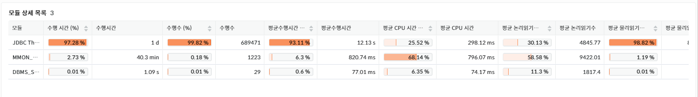

▶ \[그림86\] 모듈 상세 목록

Top SQL 상세 목록

op SQL 상세 목록은 SQL 탭과 동일합니다. SQL 탭의 “Top SQL 상세 목록” 부분을 참조하세요.

SQL 성능 분석

SQL 성능 분석 화면에서는 대상 오라클에서 수행된 개별 Top SQL의 평균 수행 시간을 분포도(Scatter) 차트로 표현하여 한눈에Top SQL의 평균 수행 시간을 확인할 수 있습니다. 또한 평균 시간외에 평균 CU 시간, 평균 논리 읽기 수, 평균 물리 읽기 수 지표도 제공하며 분포도(Scatter) 차트에 평균 수행시간이 특정 시간 이상 또는 이하인 SQL 만을 표시할 수 있습니다.

SQL 분포도

SQL 분포도는 기본 평균 수행시간이 1초 이상인 Top SQL의 평균 수행시간을 분포도(Scatter) 차트에 각 점으로 표시합니다. SQL 분포도 타이틀 옆의 콤보 박스를 통해 표시되는 지표를 평균 CPU 시간이나 평균 논리 읽기 수 또는 평균 물리 읽기수로 변경 가능하며 우측 상단 표시조건을 변경하여 평균 수행 시간 몇 초 이상 또는 이하인 SQL 만을 표시할 수 있습니다. 또한 마우스로 원하는 영역을 드래그 하여 선택하면 해당 영역에 해당하는 SQL 이력 정보만 SQL 상세 목록에 표시됩니다.

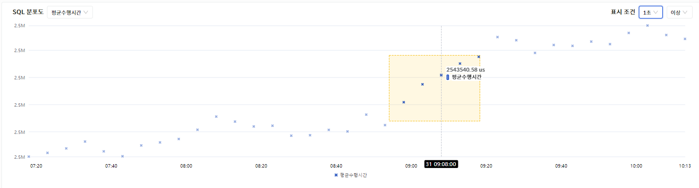

▶ \[그림87\] SQL 분포도

<table>
<tbody>
<tr class="odd">
<td>
주의

분포도(Scatter) 차트는 최대 6시간 간격의 데이터 까지만 표시됩니다.
</td>
</tr>
</tbody>
</table>

SQL 상세 목록

타임 셀렉터에 선택한 기간내의 수집한 SQL 전체 목록이 표시됩니다. 상단 SQL 분포도에서 특정 영역을 선택하면 해당하는 SQL에 대한 목록만 필터링 하여 보실 수 있습니다. 이를 통해 부하가 발생한 SQL에 대해 쉽게 찾고 분석할 수 있습니다.

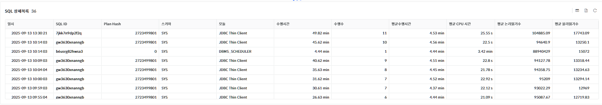

▶ \[그림88\] SQL 상세 목록

> SQL 상세 목록

| 일시        | SQL 이력 정보가 수집된 시간입니다.                                                             |
| --------- | --------------------------------------------------------------------------------- |
| SQL ID    | SQL ID입니다. 해당 SQL ID를 선택하면 하단 SQL 상세 목록에서 해당 SQL ID에 해당하는 이력만 표시됩니다.              |
| Plan Hash | SQL 이 수행될 때 어떤 Plan으로 수행되었는지 식별할 수 있는 식별 값입니다.                                    |
| 스키마       | 어떤 스키마(사용자)가 수행했는지 표시합니다.                                                         |
| 모듈        | 어떤 모듈이 해당 SQL을 수행했는지 표시합니다.                                                       |
| 수행시간      | 오라클이 기동 된 이후 총 수행된 SQL 수행 시간입니다.                                                  |
| 수행수       | 오라클이 기동 된 이후 SQL이 수행한 횟수입니다.                                                      |
| 평균수행시간    | SQL 문이 한 번 실행될 때 평균 소요되는 시간입니다. SQL 수행한 시간을 수행 횟수로 나눈 값입니다.                       |
| 평균 CPU 시간 | SQL 문이 한 번 실행될 때 평균 소요되는 CPU 사용 시간입니다. SQL CPU 시간을 수행 횟수로 나눈 값입니다.                |
| 평균 논리읽기수  | SQL 문이 한 번 실행될 때 평균 사용한 논리 읽기 수입니다. 오라클 기동 이후 SQL이 수행한 총 논리 읽기 수를 수행 횟수로 나눈 값입니다. |
| 평균 물리읽기수  | SQL 문이 한 번 실행될 때 평균 사용한 물리 읽기 수입니다. 오라클 기동 이후 SQL이 수행한 총 물리 읽기 수를 수행 횟수로 나눈 값입니다  |

