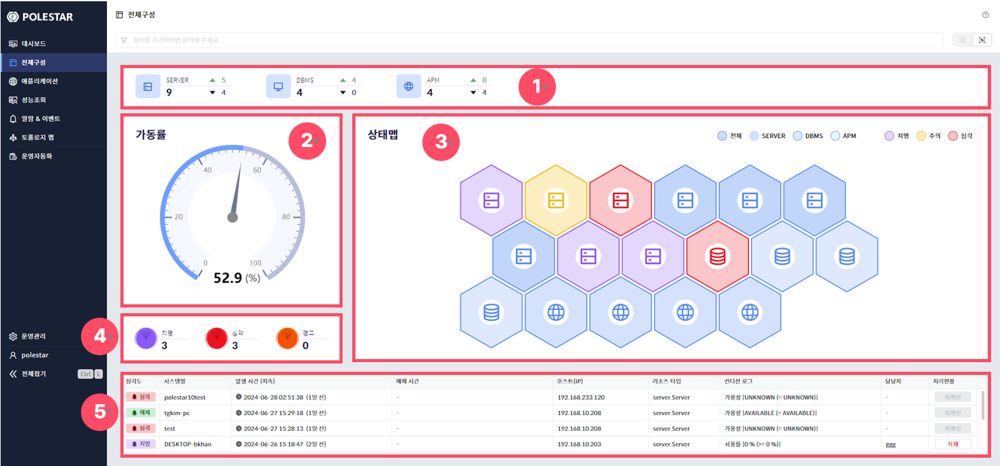
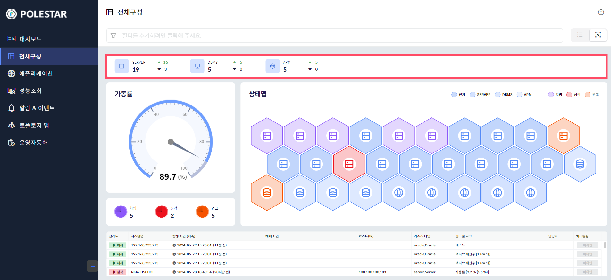
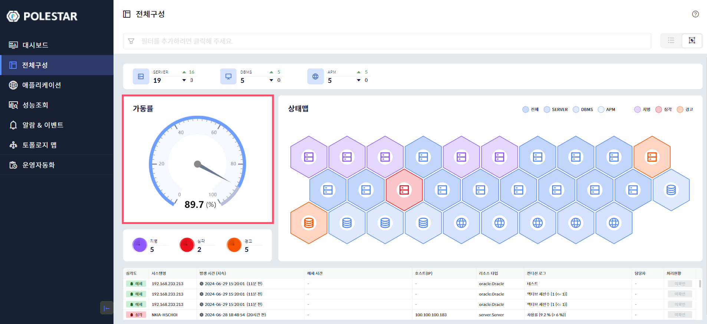
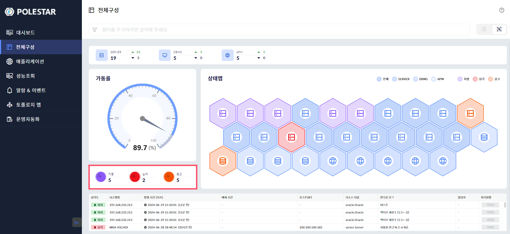
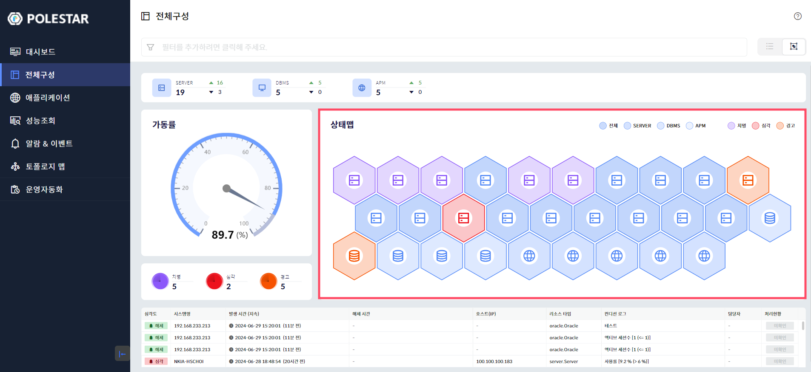
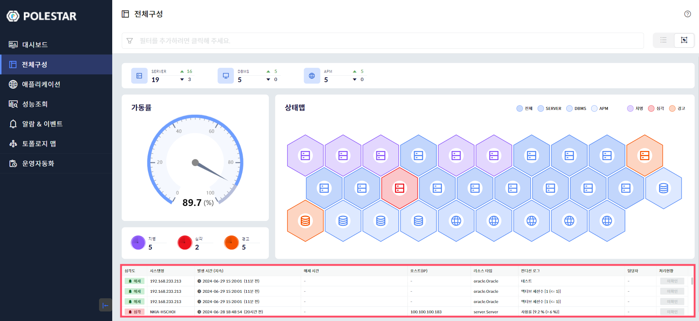

전체구성 (요약 대시보드)

로그인 후 요약 대시보드를 통해 전체 구성에 대한 요약정보를 확인할 수 있습니다.

<table>
<tbody>
<tr class="odd">
<td>
노트

요약 대시보드에서 제공하는 요약 지표는 [전체구성] 메뉴의 [관리 대상 추가]에서 [관리 대상 등록]을 통해 등록되어야 합니다.
</td>
</tr>
</tbody>
</table>

> ▶ \[그림1\] 요약 대시보드
> 
> 화면 지표

<table>
<thead>
<tr class="header">
<th>1. 구성정보</th>
<th>
관리대상 별 전체 구성정보에 대한 요약정보를 제공합니다.

관리대상 별 전체 구성현황 및 UP/DOWN 정보

▲ 가용성 UP

▼ 가용성 DOWN
</th>
</tr>
</thead>
<tbody>
<tr class="odd">
<td>2. 가동률</td>
<td>관리대상 전체 가동률을 제공합니다. (단위 : %)</td>
</tr>
<tr class="even">
<td>3. 상태맵</td>
<td>관리대상 항목별 헥사곤(Hexagon) 형태로 상태 맵을 제공합니다</td>
</tr>
<tr class="odd">
<td>4. 알람현황</td>
<td>현재 발생한 관리대상 전체의 상위 3단계 알람정보 총 수를 요약하여 제공합니다.</td>
</tr>
<tr class="even">
<td>5. 상세 알람현황</td>
<td>현재 발생한 실시간 알람현황 상세 목록을 제공합니다.</td>
</tr>
</tbody>
</table>

구성정보

관리대상 별 전체 구성정보에 대한 총수량을 제공합니다.

관리대상 별 UP, DOWN을 기준으로 가용성 정보를 제공합니다.

<table>
<tbody>
<tr class="odd">
<td>
노트

요약 대시보드에서는 UP, DOWN에 대한 주요정보를 제공하고 UNKOWN 정보는 제공하지 않습니다.
</td>
</tr>
</tbody>
</table>

> ▶ \[그림2\] 구성정보

가동률

관리대상 전체 가동률을 제공합니다.

관리대상 전체 항목의 UP, DOWN 기준정보를 토대로 합산 후 전체 가동율을 제공합니다.

<table>
<tbody>
<tr class="odd">
<td>
노트

가동률 예시 : 관리대상장비 (10식), UP (8식), DOWN (2식) = 가동율 80%
</td>
</tr>
</tbody>
</table>

▶ \[그림3\] 가동률

알람현황

현재 발생한 관리대상 전체의 상위 3단계 알람정보 총 수를 요약하여 제공합니다.

<table>
<tbody>
<tr class="odd">
<td>
노트

상위 3단계 이외 발생한 알람에 대한 지표는 제공하지 않습니다.
</td>
</tr>
</tbody>
</table>

▶ \[그림4\] 알람현황

상태맵

관리대상 항목별 헥사곤(Hexagon) 형태로 상태맵을 제공합니다.

기본적으로 알람정보와 연계하여 관리대상 장비의 상태를 실시간으로 확인할 수 있습니다.

관리대상장비가 많아 헥사곤의 수량이 많을 때는 상태맵 영역에서 사용자가 직접 맵을 확대, 축소, 드레그할 수 있는 기능을 제공합니다.

사용자는 상단의 관리대상 범례를 선택하여 해당 장비를 선별하여 모니터링이 가능합니다.

<table>
<tbody>
<tr class="odd">
<td>
노트

헥사곤 아이콘은 관리대상 분류별 각각의 아이콘을 상이하게 제공하며 각 헥사곤 아이콘 마우스호버시 해당 관리대상의 Type, NAME 정보가 제공됩니다.
</td>
</tr>
</tbody>
</table>

▶ \[그림5\] 상태맵

> 상태맵 사용법

| 확대        | 마우스휠을 위로 스크롤 시 맵이 확대됩니다.                                                               |
| --------- | -------------------------------------------------------------------------------------- |
| 축소        | 마우스휠을 아래로 스크롤 시 맵이 축소됩니다.                                                              |
| 이동        | 상하좌우로 마우스를 드래그하면 상하좌우로 이동할 수 있습니다.                                                     |
| 원위치       | 상태 맵 영역에서 마우스 더블 클릭시 디폴트화면으로 원위치 됩니다.                                                  |
| 상세정보      | 헥사곤 아이콘 마우스호버 시 해당 리소스의 Type, ALARM, NAME 정보가 제공됩니다.                                   |
| 리소스 범례 선택 | 원하는 리소스 선택 시 선택된 리소스만 헥사곤 아이콘이 활성화됩니다. (“전체” 범례를 선택 시 다시 전체 디폴트 화면으로 변경됩니다.)           |
| 알람 범례 선택  | 원하는 알람 선택 시 선택된 알람정보만 해당하는 리소스만 헥사곤 아이콘이 활성화됩니다. (“전체” 범례를 선택 시 다시 전체 디폴트 화면으로 변경됩니다.) |

실시간 알람현황

현재 발생한 실시간 알람현황 상세 목록을 최대 4개까지 제공합니다.

제공되는 정보는 \[알람&이벤트현황\]의 \[알람현황\] 정보와 동일합니다.

<table>
<tbody>
<tr class="odd">
<td>
노트

알람현황은 상위 3단계 알람현황을 제공하나 실시간 알람현황은 설정한 모든 알람에 대한 목록을 제공합니다.
</td>
</tr>
</tbody>
</table>

▶ \[그림6\] 실시간 알람현황

> 상태맵 사용법

<table>
<thead>
<tr class="header">
<th>심각도</th>
<th>알람의 심각도 레벨입니다.</th>
</tr>
</thead>
<tbody>
<tr class="odd">
<td>시스템명</td>
<td>알람이 발생된 구성 정보의 이름입니다.</td>
</tr>
<tr class="even">
<td>발생시간 (지속)</td>
<td>아직 해제되지 않은 알람은 발생 후 현재까지의 시간입니다.</td>
</tr>
<tr class="odd">
<td>해제 시간</td>
<td>알람이 해제된 시간입니다. 아직 해제되지 않았으면 빈 값이 표시됩니다.</td>
</tr>
<tr class="even">
<td>호스트(IP)</td>
<td>알람이 발생된 구성의 호스트명 또는 IP 정보입니다.</td>
</tr>
<tr class="odd">
<td>리소스 타입</td>
<td>알람이 발생된 구성의 타입 정보입니다.</td>
</tr>
<tr class="even">
<td>컨디션 로그</td>
<td>
알람 상태 로그입니다.

로그 형식은 기본 형식을 따라가거나 알람 정의에서 사용자가 설정할 수 있습니다.
</td>
</tr>
<tr class="odd">
<td>담당자</td>
<td>알람 처리상태에서 할당된 담당자입니다.</td>
</tr>
<tr class="even">
<td>처리현황</td>
<td>현재 알람의 처리 상태입니다.</td>
</tr>
</tbody>
</table>

