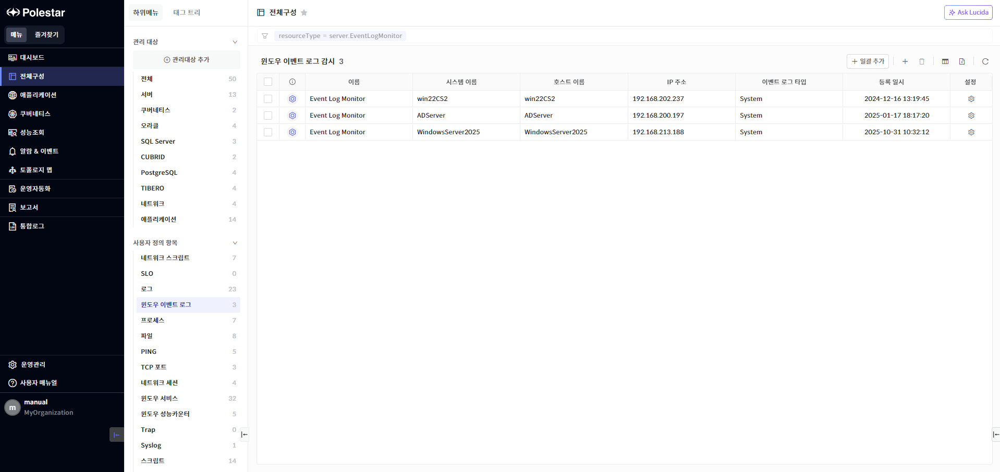
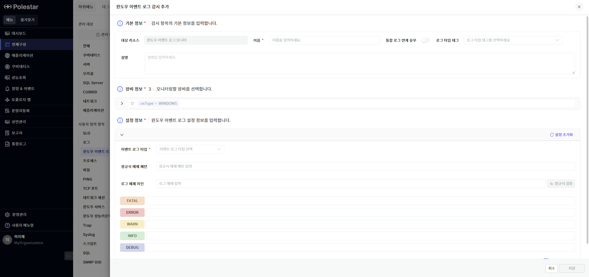
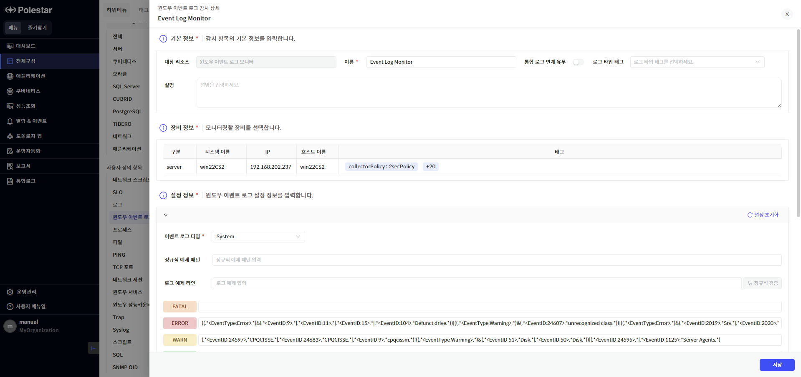
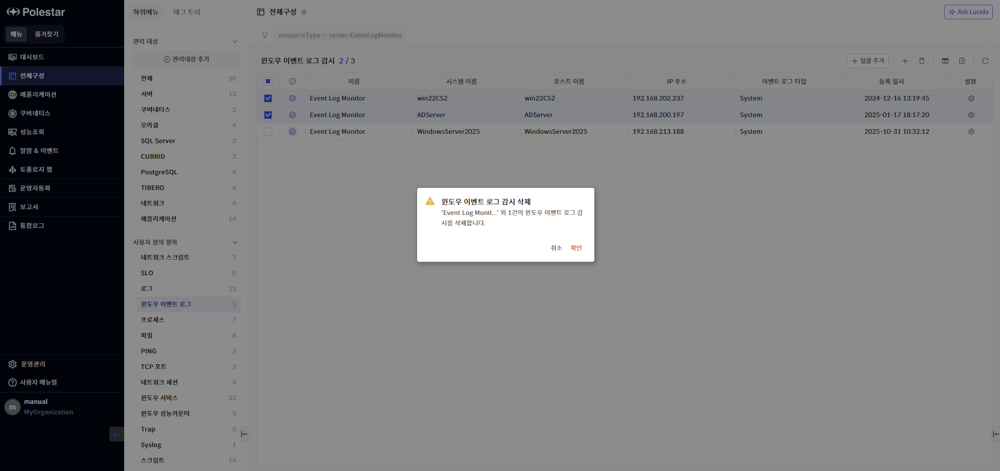
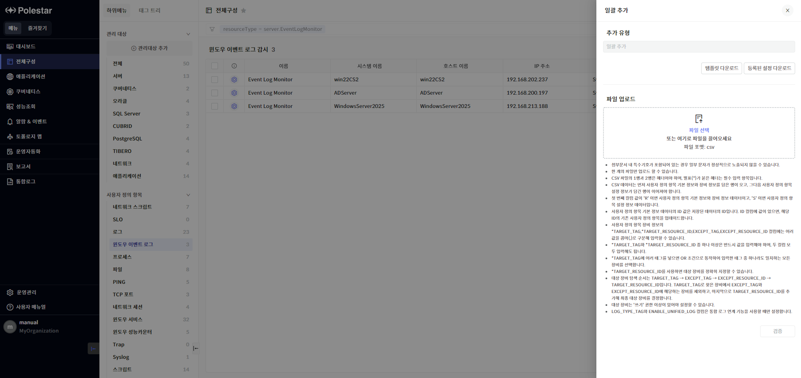
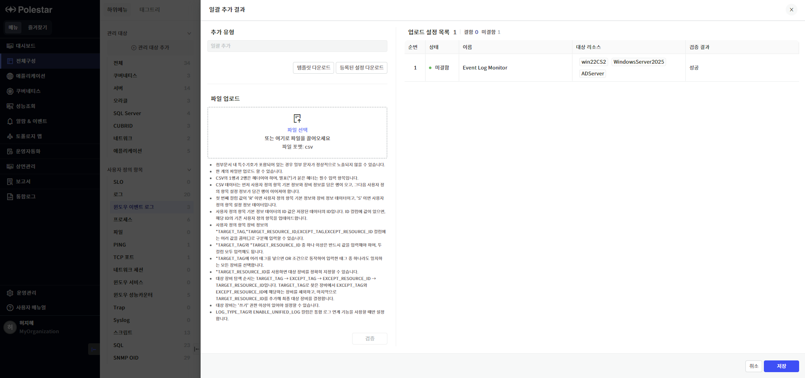

윈도우 이벤트 로그 감시

윈도우에서 발생되는 이벤트 로그에서 특정 패턴에 맞는 로그를 감시하는 기능입니다.

▶ \[그림1\] 윈도우 이벤트 로그 감시 목록

화면 지표

<table>
<thead>
<tr class="header">
<th>상태</th>
<th>
윈도우 이벤트 로그 감시 항목의 가용성 상태를 색상으로 표현합니다.

 : 윈도우 이벤트 로그 감시 지원

 : 윈도우 이벤트 로그 감시 미지원
</th>
</tr>
</thead>
<tbody>
<tr class="odd">
<td>이름</td>
<td>윈도우 이벤트 로그 감시 항목의 이름을 표시합니다.</td>
</tr>
<tr class="even">
<td>시스템 이름</td>
<td>윈도우 이벤트 로그 감시 항목이 등록된 서버의 시스템 이름을 표시합니다.</td>
</tr>
<tr class="odd">
<td>호스트 이름</td>
<td>윈도우 이벤트 로그 감시 항목이 등록된 서버의 호스트 이름을 표시합니다.</td>
</tr>
<tr class="even">
<td>IP 주소</td>
<td>윈도우 이벤트 로그 감시 항목이 등록된 서버의 IP 주소를 표시합니다.</td>
</tr>
<tr class="odd">
<td>이벤트 로그 타입</td>
<td>
감시 중인 윈도우 이벤트 로그 타입을 표시합니다.

<ul>
<li>
Application, Security, System, TaskScheduler
</li>
</ul></td>
</tr>
<tr class="even">
<td>등록 일시</td>
<td>윈도우 이벤트 로그 감시 항목이 등록된 일시를 표시합니다.</td>
</tr>
<tr class="odd">
<td>설정</td>
<td>윈도우 이벤트 로그 감시 설정을 변경할 수 있는 윈도우 이벤트 로그 상세 화면을 호출합니다.</td>
</tr>
</tbody>
</table>

<table>
<tbody>
<tr class="odd">
<td>
노트

윈도우 이벤트 로그 감시는 성능 정보를 제공하지 않습니다.
</td>
</tr>
</tbody>
</table>

윈도우 이벤트 로그 감시 추가

모니터링할 윈도우 이벤트 로그 파일 정보를 설정합니다. 모든 필수 항목을 입력해야 \[저장\] 버튼이 활성화됩니다.

<table>
<tbody>
<tr class="odd">
<td>
노트

사용자가 ‘쓰기’ 이상의 권한을 가지고 있는 윈도우 OS 서버에만 윈도우 이벤트 로그 감시를 등록할 수 있습니다.

윈도우 이벤트 로그 감시 추가 시, 서버 장비에 설정된 권한이 자동으로 적용됩니다. 윈도우 이벤트 로그 감시 수정 기능을 통해 권한 정보를 변경할 수 있습니다.
</td>
</tr>
</tbody>
</table>

▶ \[그림2\] 윈도우 이벤트 로그 감시 추가

기본 정보

<table>
<thead>
<tr class="header">
<th>대상 리소스</th>
<th>감시 항목의 타입을 표시합니다. ‘윈도우 이벤트 로그 모니터’ 타입이 자동으로 설정되어 있습니다.</th>
</tr>
</thead>
<tbody>
<tr class="odd">
<td>이름</td>
<td>윈도우 이벤트 로그 감시 항목의 이름을 입력합니다.</td>
</tr>
<tr class="even">
<td>통합 로그 연계 유무</td>
<td>
(※ [통합 로그] 라이선스가 활성화된 경우에만 표시됩니다.)

윈도우 이벤트 로그 감시 항목의 통합 로그 연계 유무를 설정합니다.
</td>
</tr>
<tr class="odd">
<td>로그 타입 태그</td>
<td>
(※ [통합 로그] 라이선스가 활성화된 경우에만 표시됩니다.)

윈도우 이벤트 로그 감시 항목의 로그 타입 태그를 설정합니다.
</td>
</tr>
<tr class="even">
<td>설명</td>
<td>윈도우 이벤트 로그 감시 항목의 설명을 입력합니다.</td>
</tr>
</tbody>
</table>

장비 정보

윈도우 이벤트 로그 감시 항목을 등록할 장비를 1대 이상 선택합니다. 장비 목록에는 사용자가 ‘쓰기’ 이상의 권한을 가지고 있는 윈도우 OS 서버만 표시되며, 태그 필터를 사용해 원하는 대상 장비를 상세 검색할 수 있습니다.

설정 정보

<table>
<thead>
<tr class="header">
<th>이벤트 로그 타입</th>
<th>
윈도우 이벤트 로그 타입을 선택합니다.

<ul>
<li>
Application, Security, System, TaskScheduler
</li>
</ul></th>
</tr>
</thead>
<tbody>
<tr class="odd">
<td>정규식 예제 패턴</td>
<td>등록할 정규식 패턴을 검증하기 위한 예제 패턴을 입력합니다.</td>
</tr>
<tr class="even">
<td>로그 예제 라인</td>
<td>정규식 패턴 검증에 사용할 로그 예제 라인을 입력합니다.</td>
</tr>
<tr class="odd">
<td>FATAL</td>
<td>‘FATAL’ 등급의 이벤트로 매칭할 패턴을 입력합니다.</td>
</tr>
<tr class="even">
<td>ERROR</td>
<td>‘ERROR’ 등급의 이벤트로 매칭할 패턴을 입력합니다.</td>
</tr>
<tr class="odd">
<td>WARN</td>
<td>‘WARN’ 등급의 이벤트로 매칭할 패턴을 입력합니다.</td>
</tr>
<tr class="even">
<td>INFO</td>
<td>‘INFO’ 등급의 이벤트로 매칭할 패턴을 입력합니다.</td>
</tr>
<tr class="odd">
<td>DEBUG</td>
<td>‘DEBUG’ 등급의 이벤트로 매칭할 패턴을 입력합니다.</td>
</tr>
<tr class="even">
<td>대소문자 구분</td>
<td>
메시지 패턴 대소문자 구분 여부를 설정합니다.

(체크 시 대소문자 구분)
</td>
</tr>
</tbody>
</table>

<table>
<tbody>
<tr class="odd">
<td>
노트

TaskScheduler의 경우 다음 OS는 지원하지 않습니다.

<ul>
<li>
미지원 OS : Windows 2003, Windows XP
</li>
</ul></td>
</tr>
</tbody>
</table>

윈도우 이벤트 로그 감시 추가 절차

1.  윈도우 이벤트 로그 감시 목록 우측 상단의 \[추가\] 버튼 클릭

2.  기본 정보, 장비 정보, 설정 정보를 입력하고 \[저장\] 버튼 클릭

윈도우 이벤트 로그 감시 수정

윈도우 이벤트 로그 감시 목록에서 ‘설정’ 필드를 클릭하여 등록한 윈도우 이벤트 로그 감시의 설정 정보와 역할 및 권한 설정을 수정할 수 있습니다. 윈도우 이벤트 로그 감시의 기본 권한은 서버 장비의 권한을 따르므로 ‘상속’ 옵션이 활성화되어 있습니다. ‘상속’ 옵션을 비활성화하면 윈도우 이벤트 로그 감시에만 적용되는 전용 권한을 설정할 수 있습니다. 모든 필수 항목을 입력해야 \[저장\] 버튼이 활성화됩니다.

<table>
<tbody>
<tr class="odd">
<td>
노트

사용자가 ‘쓰기’ 이상의 권한을 가지고 있는 윈도우 이벤트 로그 감시만 수정할 수 있습니다.
</td>
</tr>
</tbody>
</table>

▶ \[그림3\] 윈도우 이벤트 로그 상세

윈도우 이벤트 로그 감시 수정 절차

1.  윈도우 이벤트 로그 감시 목록에서 수정할 항목의 ‘설정’ 필드 클릭

2.  기본 정보, 설정 정보, 역할 및 권한 설정 중 수정할 항목을 변경하고 \[저장\] 버튼 클릭

윈도우 이벤트 로그 감시 삭제

윈도우 이벤트 로그 감시 목록에서 특정 윈도우 이벤트 로그 항목을 삭제할 수 있습니다.

<table>
<tbody>
<tr class="odd">
<td>
노트

윈도우 이벤트 로그 감시의 역할 및 권한 상속 여부에 따라 윈도우 이벤트 로그 감시를 삭제할 수 있는 최소 권한이 달라집니다. 역할 및 권한 상속 여부는 윈도우 이벤트 로그 상세 화면에서 확인할 수 있습니다.

<ul>
<li>
상속 ON: ‘쓰기’ 이상의 권한 필요
</li>
<li>
상속 OFF: ‘삭제’ 권한 필요
</li>
</ul></td>
</tr>
</tbody>
</table>

▶ \[그림4\] 로그 감시 삭제

윈도우 이벤트 로그 감시 삭제 절차

1.  윈도우 이벤트 로그 감시 목록에서 삭제할 윈도우 이벤트 로그 선택 (다수 선택 가능)

2.  윈도우 이벤트 로그 감시 목록 우측 상단의 \[삭제\] 버튼 클릭

윈도우 이벤트 로그 감시 일괄 추가

윈도우 이벤트 로그 감시 설정 정보를 CSV 형식으로 입력하여 다수의 윈도우 이벤트 로그 감시를 일괄 등록할 수 있습니다.

\[등록된 설정 다운로드\]를 통해 등록되어 있는 윈도우 이벤트 로그 감시 설정 정보를 CSV 파일로 다운로드하고, 이 CSV 파일을 활용하여 기존 윈도우 이벤트 로그 감시 설정을 일괄 업데이트 할 수 있습니다.

윈도우 이벤트 로그 감시 설정 정보를 저장한 CSV 파일을 업로드하고 \[검증\] 버튼을 클릭하면 CSV 파일 데이터의 유효성을 검사하여 등록 진행 가능 여부를 판별합니다. 하나라도 잘못된 설정이 포함되어 있는 경우 일괄 등록을 진행할 수 없습니다. 이 경우, ‘검증 결과’ 필드를 참고하여 설정 오류를 수정하고 다시 검증을 진행하시기 바랍니다.

<table>
<tbody>
<tr class="odd">
<td>
노트

CSV 파일에서 일괄 추가 대상 장비를 태그로 설정한 경우, 사용자의 장비 권한에 따라 윈도우 이벤트 로그 감시가 적용되는 장비가 달라질 수 있습니다.

<ul>
<li>
등록: 사용자가 ‘쓰기’ 이상의 권한을 가지고 있는 윈도우 OS 서버
</li>
<li>
수정: 사용자가 ‘쓰기’ 이상의 권한을 가지고 있는 윈도우 이벤트 로그 감시
</li>
</ul></td>
</tr>
</tbody>
</table>

▶ \[그림5\] 윈도우 이벤트 로그 감시 일괄 추가

▶ \[그림6\] 윈도우 이벤트 로그 감시 일괄 추가 – 검증 및 업로드 설정 목록

윈도우 이벤트 로그 감시 일괄 추가 절차

1.  윈도우 이벤트 로그 감시 목록 우측 상단의 \[일괄 추가\] 버튼 클릭

2.  \[등록된 설정 다운로드\] 버튼 클릭

3.  다운로드 받은 CSV 파일을 열고, 기존 등록되어 있는 윈도우 이벤트 로그 감시 설정을 참고해서 신규 윈도우 이벤트 로그 감시 설정 추가

4.  CSV 파일에 있던 기존 윈도우 이벤트 로그 감시 설정 삭제

5.  일괄 추가 드로어에서 CSV 파일 업로드하고 \[검증\] 버튼 클릭

6.  ‘업로드 설정 목록’에서 결함 유무 확인하고, 결함이 없는 경우 \[저장\] 버튼 클릭

