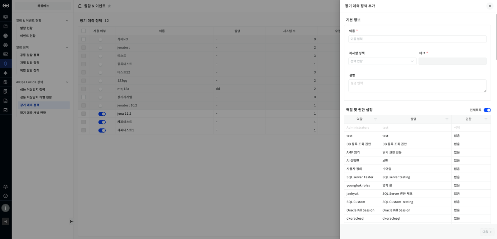
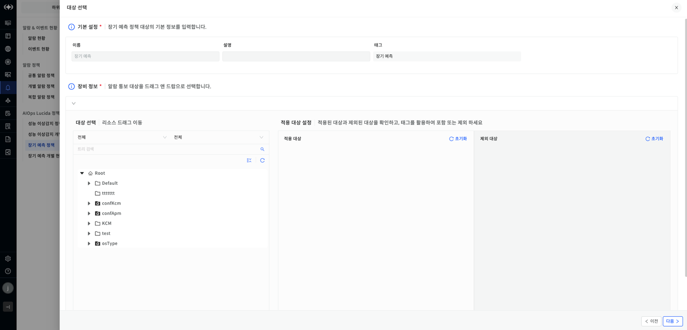
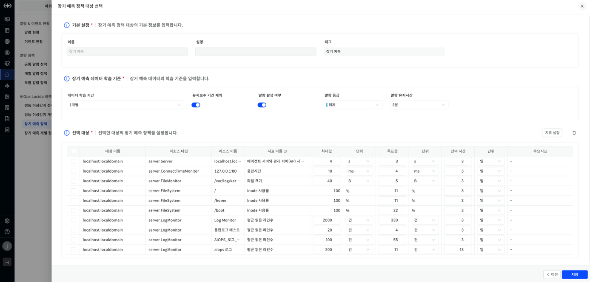
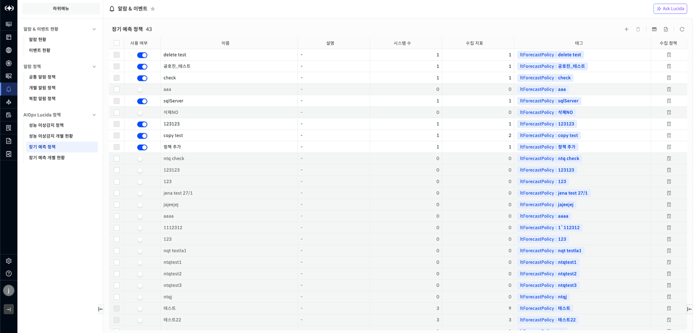
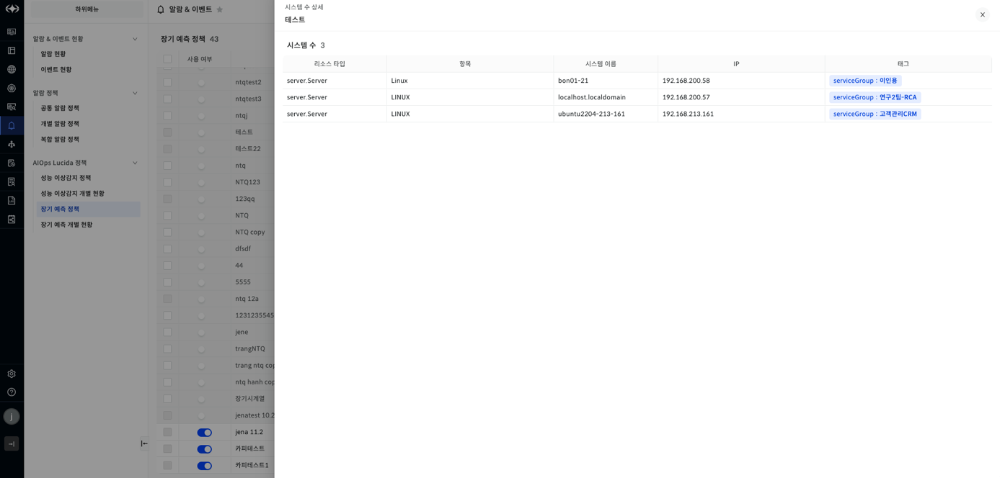
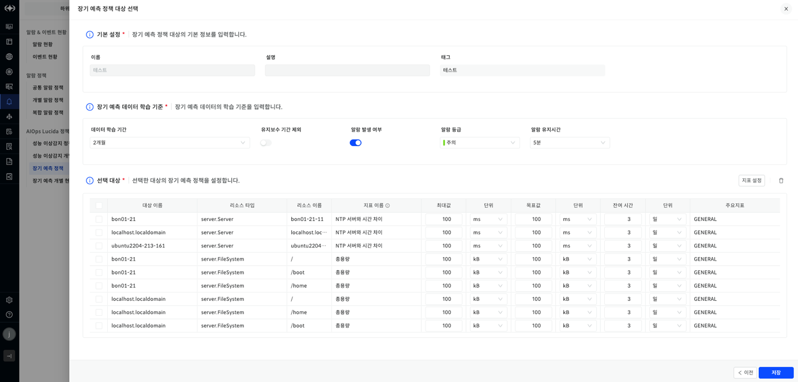

장기 예측 정책

장기 예측 정책은 관리대상들이 수집하고 있는 지표들의 성능 데이터를 예측하기 위해 필요한 정책들을 설정하는 기능입니다. 장기 예측 정책에 적용된 지표들은 5분단위로 장기예측을 수행합니다.

▶ \[그림1\] 장기 예측 정책 추가

▶ \[그림2\] 장기 예측 정책 추가(대상 선택)

▶ \[그림3\] 장기 예측 정책 추가(장기 예측 정책 대상 선택)

장기 예측 정책 추가 절차

1.  \[알람 & 이벤트\] \> \[장기 예측 정책\] 화면에서 오른쪽 상단의 \[+\]버튼을 클릭합니다.

2.  기본 정보, 역할 및 권한을 설정합니다.

3.  \[다음\] 버튼을 클릭합니다.

4.  \[대상 선택\] 화면에서 장기 예측을 수행할 대상을 선택합니다.

5.  \[다음\] 버튼을 클릭합니다.

6.  \[장기 예측 데이터 학습 기준\]을 설정합니다.

7.  \[선택 대상\] 오른쪽 상단의 \[지표 설정\]을 클릭하여 리소스 타입별 지표를 설정 후 \[저장\] 버튼을 클릭합니다.

8.  \[선택 대상\]에서 \[목표값\] 및 \[잔여 시간\]을 필수로 입력하고 이외의 값들은 선택 입력합니다.

9.  \[저장\] 버튼을 클릭합니다.

<table>
<tbody>
<tr class="odd">
<td>
노트

이미 등록된 장기 예측 정책 이름은 사용할 수 없습니다.
</td>
</tr>
</tbody>
</table>

장기 예측 정책 추가 항목

| 이름         | 장기 예측 정책 이름입니다.                                           |
| ---------- | --------------------------------------------------------- |
| 설명         | 장기 예측 정책 설명입니다.                                           |
| 복사할 정책     | 복사할 정책입니다. 복사되는 요소는 역할 및 권한과 장기 예측 데이터 학습 기준 및 선택 대상입니다.. |
| 태그         | 장기 예측 정책 태그입니다.                                           |
| 역할 및 권한 설정 | 장기 예측 정책의 역할 및 권한입니다.                                     |
| 데이터 학습 기간  | 장기 예측하는데 사용할 데이터 기간입니다.                                   |
| 유지보수 기간 제외 | 데이터 학습시 유지보수 기간 제외입니다.                                    |
| 알람 발생 여부   | 목표값 도달에 따른 알람 발생 여부입니다.                                   |
| 알람 등급      | 알람 등급입니다.                                                 |
| 알람 유지 시간   | 알람 유지 시간입니다.                                              |
| 대상 이름      | 대상 장비명입니다.                                                |
| 리소스 타입     | 대상의 리소스 타입입니다.                                            |
| 리소스 이름     | 리소스 이름입니다.                                                |
| 지표 이름      | 장기 예측 정책의 역할 및 권한입니다.                                     |
| 최대값        | 해당 지표의 최대값입니다.                                            |
| 목표값        | 알람을 발생시키기 위한 목표값입니다. 최대값을 넘을 수 없습니다.                      |
| 잔여 시간      | 목표값 도달할 때까지의 잔여시간입니다. 잔여시간이하가 됐을 때 장기예측 현황 화면에 명시합니다.     |
| 주요 지표      | 지표의 종류를 의미합니다.                                            |

장기 예측 정책 삭제 절차

1.  장기 예측 목록에서 삭제하고자 하는 장기 예측 정책을 체크합니다.

2.  오른쪽 상단 \[휴지통\] 버튼을 클릭합니다.

3.  알림이 나오면 \[확인\] 버튼을 클릭합니다.

<table>
<tbody>
<tr class="odd">
<td>
노트

장기 예측 정책의 시스템 수가 0인 경우에만 삭제할 수 있습니다.
</td>
</tr>
</tbody>
</table>

장기 예측 정책 목록

장기 예측 정책 목록을 확인하는 항목입니다. \[알람 & 이벤트\] \> \[장기 예측 정책\]을 클릭시 해당 화면을 확인할 수 있습니다. 각 컬럼별로 필터를 적용할 수 있습니다.

▶ \[그림4\] 장기 예측 정책 목록

장기 예측 정책 목록 항목

| 사용 여부 | 장기 예측 정책 사용여부를 설정할 수 있습니다. 사용여부 off시 해당 정책이 비활성화됩니다.     |
| ----- | -------------------------------------------------------- |
| 이름    | 장기 예측 정책 이름입니다.                                          |
| 설명    | 장기 예측 정책 설명입니다.                                          |
| 시스템 수 | 장기 예측 정책을 적용한 리소스의 개수입니다. 시스템 수를 클릭시 시스템 목록을 확인할 수 있습니다. |
| 수집 지표 | 장기 예측 정책에서 설정한 학습 대상 성능 지표 수 입니다.                        |
| 태그    | 장기 예측 정책 태그입니다.                                          |
| 수집 정책 | 장기 예측 정책 수집 정책을 확인할 수 있는 항목입니다. 클릭시 수집 정책을 확인할 수 있습니다.   |

<table>
<tbody>
<tr class="odd">
<td>
노트

장기 예측 정책 목록에서 사용 여부 비활성화시 해당 정책의 장기 예측 학습이 중지됩니다.
</td>
</tr>
</tbody>
</table>

시스템 수 상세

장기 예측 정책에 적용된 시스템들의 정보를 확인할 수 있습니다. 각 컬럼별로 필터 및 정렬 기능을 제공합니다.

▶ \[그림5\] 시스템 수 상세

시스템 수 항목

| 리소스 타입 | 시스템의 리소스 타입입니다.        |
| ------ | ---------------------- |
| 항목     | 각 시스템의 타입을 나타내는 항목입니다. |
| 시스템 이름 | 시스템의 이름입니다.            |
| IP 주소  | 시스템의 IP주소입니다.          |
| 태그     | 서비스 그룹 태그입니다.          |

수집 정책

장기 예측 정책의 상세한 정보를 확인할 수 있다. 장기 예측 정책 목록에서 임의의 장기 예측 정책의 수집 정책 버튼을 클릭시 확인이 가능하다.

▶ \[그림6\] 장기 예측 정책 상세

수집 정책 수정 절차

1.  \[알람 & 이벤트\] \> \[장기 예측 정책\] 목록에서 임의의 정책의 수집정책 버튼을 클릭합니다.

2.  \[선택 대상\] 변경 필요시 \[이전\] 버튼을 클릭하여 \[장비 정보\]를 변경한다.

3.  \[장기 예측 데이터 학습 기준\], \[선택 대상\], \[지표 설정\]을 설정한다.

4.  \[저장\] 버튼을 클릭한다.

