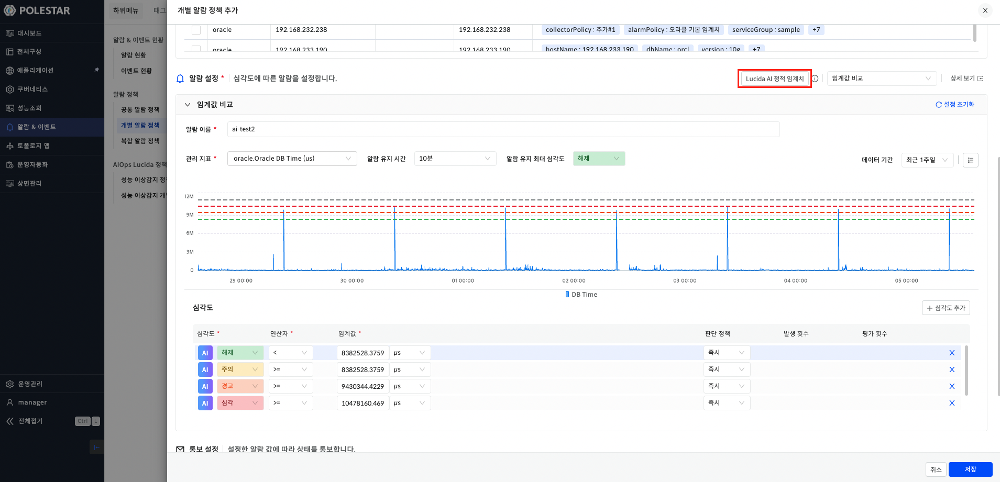
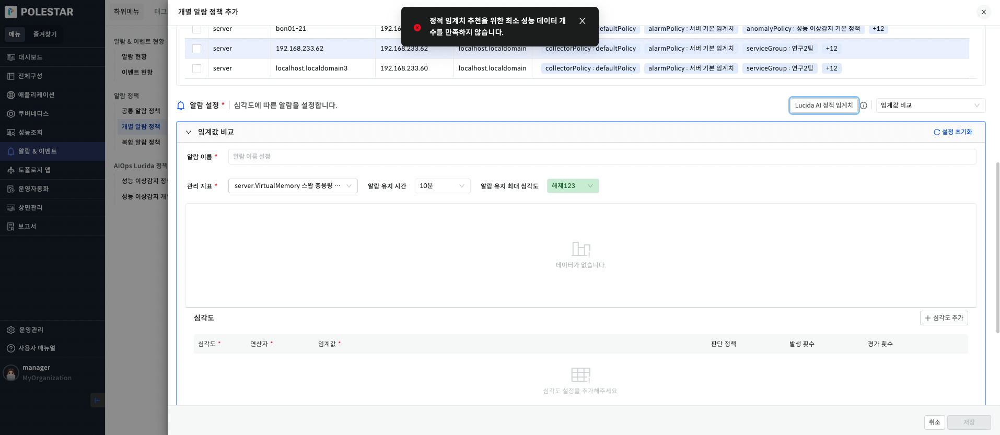
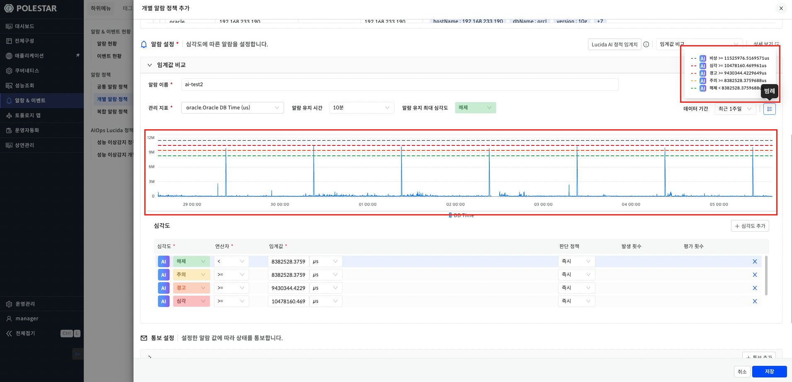
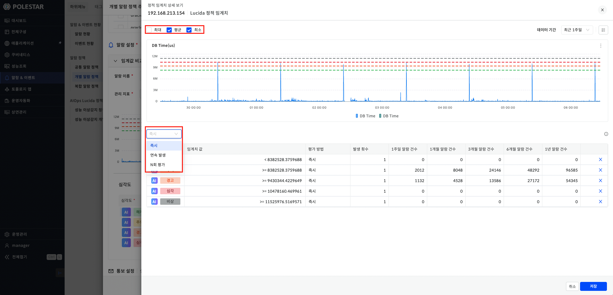
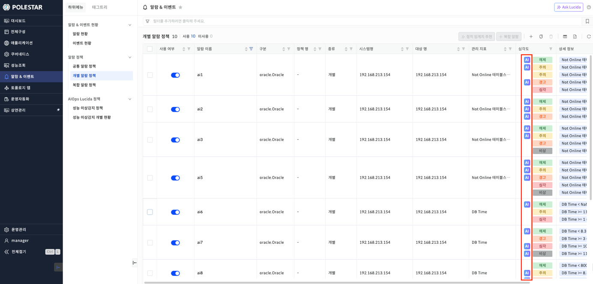
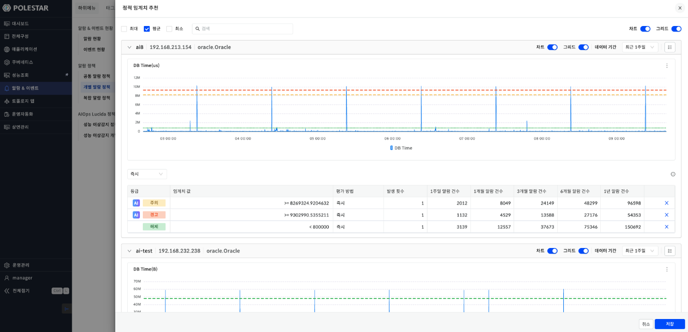

정적 임계치 추천

정적 임계치는 과거 데이터 학습을 통해 성능 데이터의 Static line 형태의 적절한 임계치 및 발생횟수 기준을 추천해주는 기능입니다. 사용자의 경험 또는 지식에 의존하던 성능 임계치를 데이터 기반의 Threshold를 생성하여 사용자 편의성 및 운영 효율성을 증대시킵니다. 정적 임계치 추천 기능은 개별 알람 정책 기능과 관련 있습니다. 개별 알람 정책의 자세한 내용은 개별 알람 정책 매뉴얼에서 확인할 수 있습니다.

▶ \[그림1\] 정적 임계치 추천

정적 임계치 추천 절차

1.  \[알람&이벤트\] \> \[개별 알람 정책\] 클릭한다.

2.  오른쪽 상단 \[+\] 버튼을 클릭한다.

3.  \[개별 알람 정책 추가\] 화면의 \[기본 정보\] 에서 \[대상 리소스 타입\]을 선택한다.

4.  \[장비 정보\]에서 임의의 장비 하나를 선택한다.

5.  \[알람 설정\]의 오른쪽 상단에서 \[임계값 비교\]를 선택한다.

6.  \[알람 이름\]을 입력하고 \[관리 지표\]를 선택한다.

7.  \[알람 설정\] 오른쪽 상단의 \[Lucida AI 정적 임계치\] 버튼을 클릭한다.

8.  \[심각도\]에서 추천 받은 심각도를 확인한다.

▶ \[그림2\] 정적 임계치 추천 실패 화면

<table>
<tbody>
<tr class="odd">
<td>
노트

정적 임계치를 추천 받기 위해서는 [장비 정보]에서 선택된 장비가 항상 1개만 체크돼야 합니다. 또한 선택한 [관리 지표]의 성능 데이터가 약 150개 미만인 경우 정적 임계치를 추천 받을 수 없어 경고창을 띄웁니다. 선택한 지표의 성능 데이터 수집 정보를 확인하기 위해서는 [성능 조회] 매뉴얼을 참고해주세요.
</td>
</tr>
</tbody>
</table>

<table>
<tbody>
<tr class="odd">
<td>
노트

[개별 알람 정책 추가] 화면에서 추천 받은 정적 임계치의 판단 정책은 항상 [즉시]입니다.

판단 정책을 변경하기 위해서는 정적 임계치를 추천 받은 후 [정적 임계치 상세 보기] 화면을 통해 변경할 수 있습니다. [정적 임계치 상세 보기] 화면은 [알람 설정]의 오른쪽 [상세 보기] 버튼을 통해 들어갈 수 있습니다.
</td>
</tr>
</tbody>
</table>

<table>
<tbody>
<tr class="odd">
<td>
노트

정적 임계치 추천 받을시 모든 심각도에 대해 추천을 받습니다. 추천 받은 심각도는 [AI] 문구가 표시된다. [AI]가 표시된 심각도를 수정시 [AI] 문구가 제거된다.
</td>
</tr>
</tbody>
</table>

정적 임계치 차트

정적 임계치 추천과 동일한 절차를 진행시 정적 임계치 추천을 위해 학습된 성능 데이터의 기간만큼 차트로 표시됩니다. 데이터 기간은 최근 1주일, 최근 1개월, 최근 3개월, 최근 6개월, 최근 1년을 선택할 수 있습니다. 차트에는 심각도의 임계치가 표시됩니다. 차트의 오른쪽 상단에는 \[범례\] 버튼이 있고 해당 버튼을 클릭시 차트에 그려진 심각도별 임계치 라인에 대한 정보가 표시됩니다.

▶ \[그림3\] 정적 임계치 차트

<table>
<tbody>
<tr class="odd">
<td>
노트

정적 임계치 차트 기간별 시간 단위

<ul>
<li>
최근 1주일 : 1분
</li>
<li>
최근 1개월 : 5분
</li>
<li>
최근 3개월 : 5분
</li>
<li>
최근 6개월 : 1시간
</li>
<li>
최근 1년 : 1일
</li>
</ul></td>
</tr>
</tbody>
</table>

정적 임계치 상세 보기

정적 임계치 상세 보기 화면은 \[알람 설정\] 오른쪽 상단 \[상세 보기\] 버튼 클릭을 통해 확인할 수 있습니다. 상세 보기 화면에서는 판단 정책을 변경할 수 있고 심각도별 임계치를 기반으로 예측된 알람 건수를 확인할 수 있습니다. 또한 정적 임계치 및 성능 데이터를 최대/평균/최소로 종합된 차트로 확인할 수 있습니다. \[저장\] 버튼을 클릭시 수정된 심각도별 임계치가 이전 화면에 반영됩니다.

▶ \[그림4\] 정적 임계치 상세 보기

임계치 값 변경

정적 임계치 상세보기 화면에서 임계치 변경을 할 수 있습니다. 임계치 변경을 하면 알람 건수를 재예측합니다.

정적 임계치 추천 절차

1.  정적 임계치 상세 보기 화면에서 임계치를 변경하고자 하는 심각도에 마우스 오버한다.

2.  오른쪽 마지막 컬럼의 \[편집\] 버튼을 클릭 후 임계치를 변경한다.

3.  오른쪽 마지막 컬럼의 \[적용\] 버튼을 클릭한다.

4.  임계치가 변경되고 알람 건수가 업데이트 된다.

정적 임계치 적용 하기

\[개별 알람 정책 추가\] 화면에서 사용자가 정적 임계치를 추천 받고 수정한 이후 \[저장\] 버튼을 클릭시 기존 개별 알람 정책과 동일하게 알람 정책이 추가됩니다. \[개별 알람 정책\] 목록에서 추가한 알람 정책을 보면 정적 임계치의 경우 심각도에 \[AI\] 문구가 표시되는걸 확인할 수 있습니다.

▶ \[그림5\] 정적 임계치 상세 보기

기존 알람 정책에 적용하기

기존에 등록한 개별 알람 정책도 정적 임계치를 추천 받을 수 있습니다. 기존 알람 정책에 정적 임계치를 추천 받는 방식은 신규 추가와 동일합니다.

<table>
<tbody>
<tr class="odd">
<td>
노트

[알람 설정]이 [임계값 비교]이고 선택한 [관리 지표]가 성능 데이터를 수집하는 지표에 대해서만 정적 임계치를 추천 받을 수 있습니다. 가용성 지표와 같이 성능 데이터를 수집하지 않는 지표는 정적 임계치를 추천 받을 수 없습니다.
</td>
</tr>
</tbody>
</table>

다중 정적 임계치 추천

동시에 다수의 개별 알람 정책에 정적 임계치를 추천받을 때 사용하는 기능입니다. \[개별 알람 정책\] 목록에서 정적 임계치 추천을 받고자 하는 개별 알람 정책을 체크 후 오른쪽 상단의 \[정적 임계치 추천\] 버튼을 클릭시 정적 임계치가 추천된 화면을 볼 수 있습니다. 다중 정적 임계치는 최소 두개에서 최대 다섯개의 개별 알람 정책만 추천 받을 수 있습니다. \[정적 임계치 추천\] 화면에 들어오면 왼쪽 상단의 \[검색\] 창에서는 알람 이름, 리소스 이름, 리소스 타입으로 개별 알람 정책을 검색할 수 있습니다. 각 지표별로 추천 받은 정적 임계치의 심각도와 임계치 성능 차트가 나옵니다. 이외의 기능들은 단일 알람 정책의 정적 임계치 \[상세보기\] 화면과 동일합니다.

▶ \[그림6\] 정적 임계치 상세 보기

<table>
<tbody>
<tr class="odd">
<td>
노트

단일 정적 임계치 추천과 마찬가지로 정적 임계치를 추천 받고자 하는 개별 알람 정책의 [알람 설정]이 [임계값 비교]이고 [관리 지표]가 성능 데이터를 수집할 수 있는 지표여야 합니다.
</td>
</tr>
</tbody>
</table>

