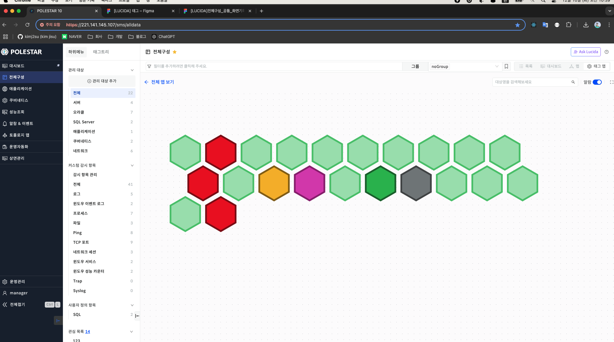
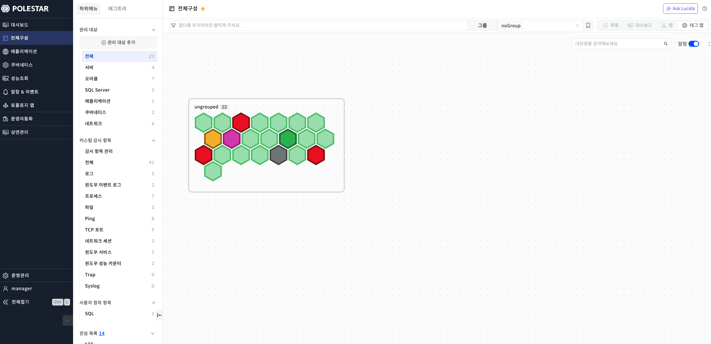
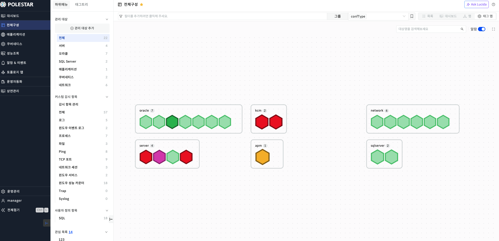
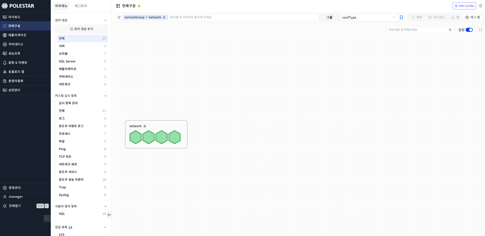
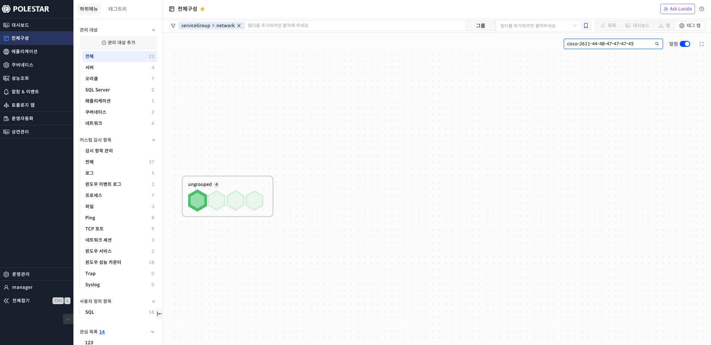
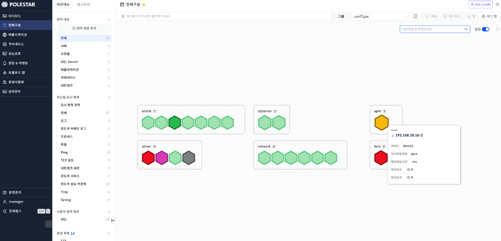
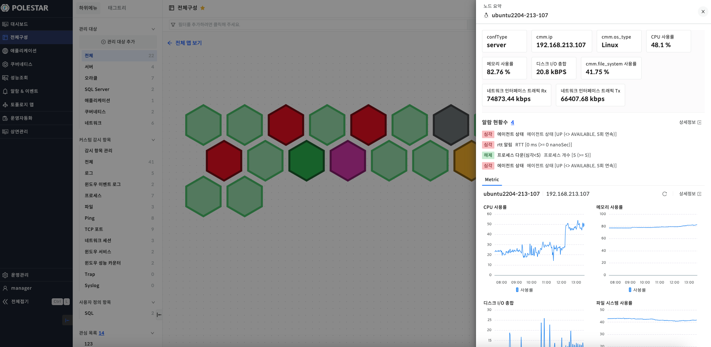

태그맵

구성 정보를 태그를 통해 그룹화하여 시각화하여 확인할 수 있는 페이지입니다.

우측 상단에 태그맵 버튼을 클릭하여 태그맵 페이지를 확인할 수 있습니다.

그룹핑, 알람 표시, 대상명 키워드 검색, 툴팁, 요약 정보를 확인할 수 있습니다.

태그맵 목록

구성 정보를 태그 키로 그룹화하여 전체 현황을 시각적으로 확인할 수 있는 기능을 제공합니다.

전체 맵 보기를 선택하여 그룹화된 태그맵을 확인할 수 있습니다.

<table>
<tbody>
<tr class="odd">
<td>
노트

초깃값은 noGroup인 미지정 상태로 ungrouped으로 표시됩니다.

상단의 필터를 통해 구성 정보를 필터링할 수 있습니다.

노드의 색은 알람 심각도의 색상이며 단일 대상의 알람이 많이 발생한 경우 가장 높은 등급의 알람 색상을 표시합니다.
</td>
</tr>
</tbody>
</table>

▶ \[그림1\] 태그맵 초깃값

▶ \[그림2\] 태그맵 – 전체 맵 보기

▶ \[그림3\] 태그맵 – confType 으로 그룹핑

▶ \[그림4\] 태그맵 – confType 으로 그룹핑, serviceGroup = network 필터

▶ \[그림5\] 태그맵 – confType 으로 그룹핑, serviceGroup = network 필터, 리스소 명으로 검색

화면 지표

<table>
<thead>
<tr class="header">
<th>태그 필터</th>
<th>기존의 태그 필터와 같은 기능으로 구성 정보의 태그를 통해 필터링할 수 있는 기능을 제공합니다.</th>
</tr>
</thead>
<tbody>
<tr class="odd">
<td>그룹</td>
<td>선택한 태그 키를 기반으로 구성 정보를 그룹핑할 수 있습니다.</td>
</tr>
<tr class="even">
<td>알람</td>
<td>알람 버튼을 통해 알람 표현은 on / off 할 수 있는 기능을 제공합니다.</td>
</tr>
<tr class="odd">
<td>검색 창</td>
<td>
그룹화된 구성 정보를 검색할 수 있는 기능을 제공합니다.

검색은 리소스 명으로 검색 됩니다.
</td>
</tr>
</tbody>
</table>

태그맵 툴팁

특정 관리 대상 노드에 Mouse Hover 시 툴팁이 표시되며 내용은 대상 명, 주요 성능 지표들이 나옵니다.

▶ \[그림6\] 공통 알람 정책 등록

태그맵 요약 정보

특정 노드를 선택할 시 우측 드로어가 열리며 노드의 정보를 확인할 수 있습니다.

▶ \[그림7\] 태그맵 요약 정보

화면 지표

<table>
<thead>
<tr class="header">
<th>성능 정보</th>
<th>대상 별로 주요 성능 지표가 표시됩니다.</th>
</tr>
</thead>
<tbody>
<tr class="odd">
<td>알람</td>
<td>
현재 대상의 알람의 현황이 표시됩니다.

상세 정보 클릭 시 알람의 상세 정보 화면으로 이동합니다.
</td>
</tr>
<tr class="even">
<td>성능</td>
<td>
대상 별로 지표를 확인할 수 있는 차트가 표시됩니다.

상세 정보 클릭 시 대상의 상세 정보 화면으로 이동합니다.
</td>
</tr>
</tbody>
</table>

