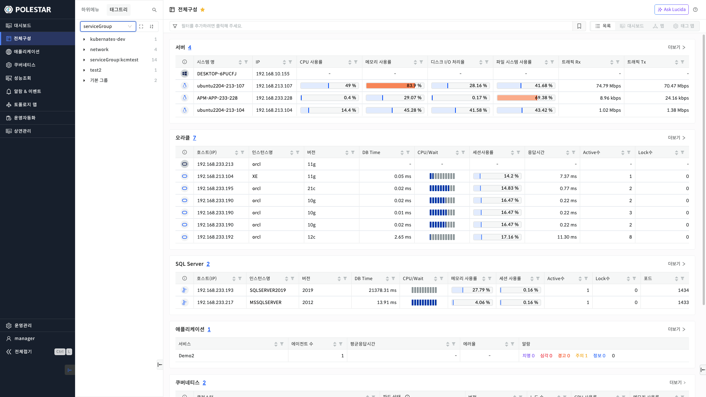
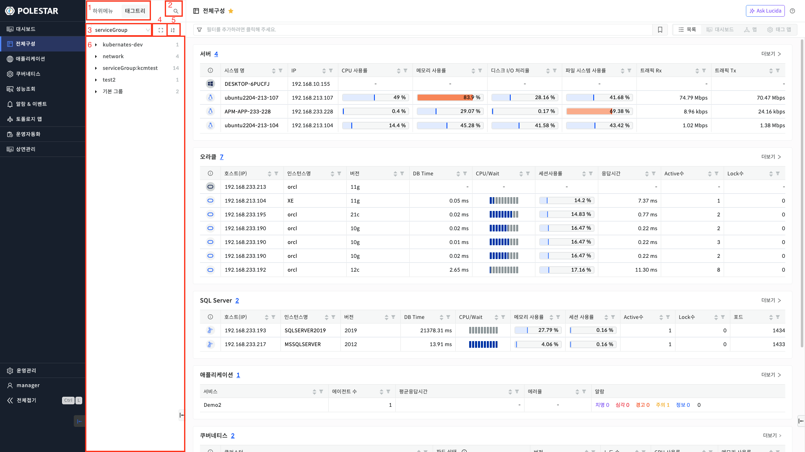
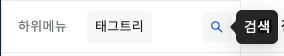
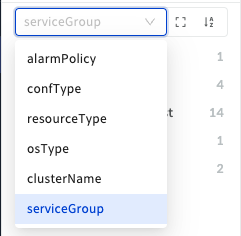
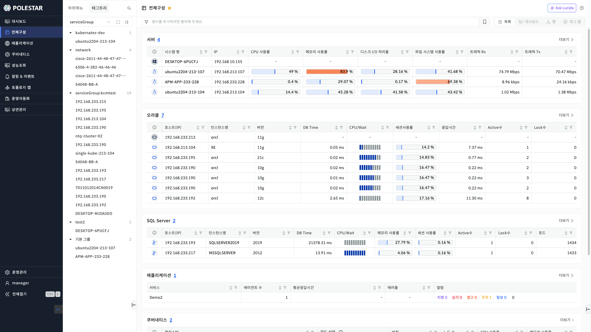
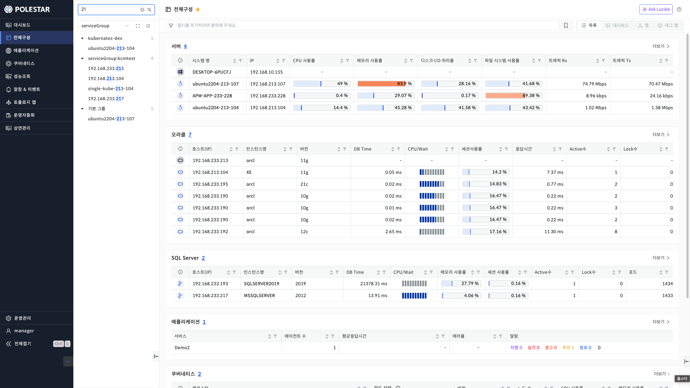
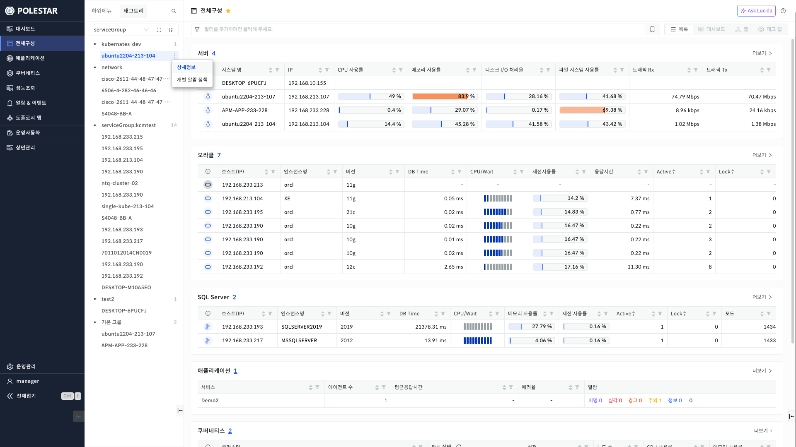
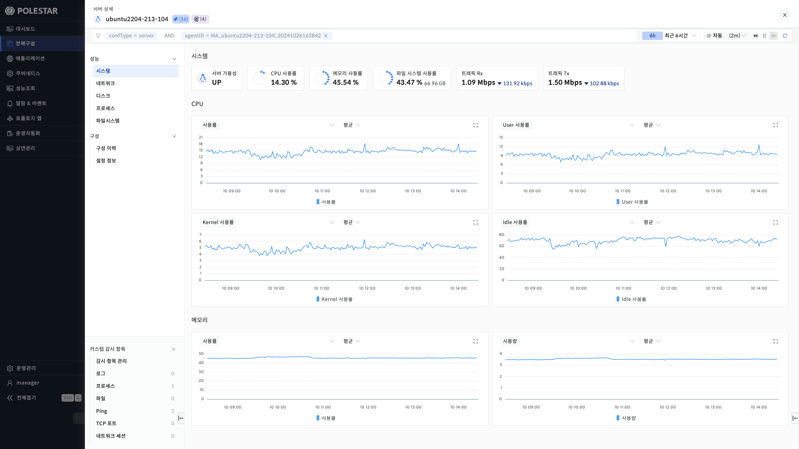
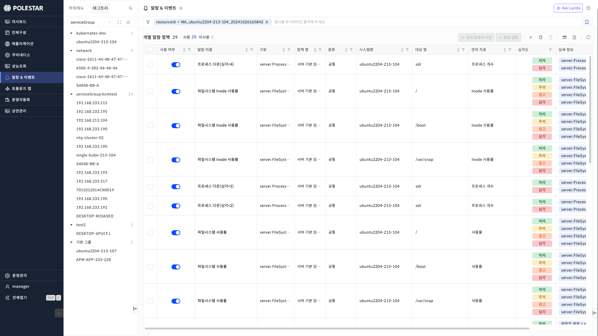
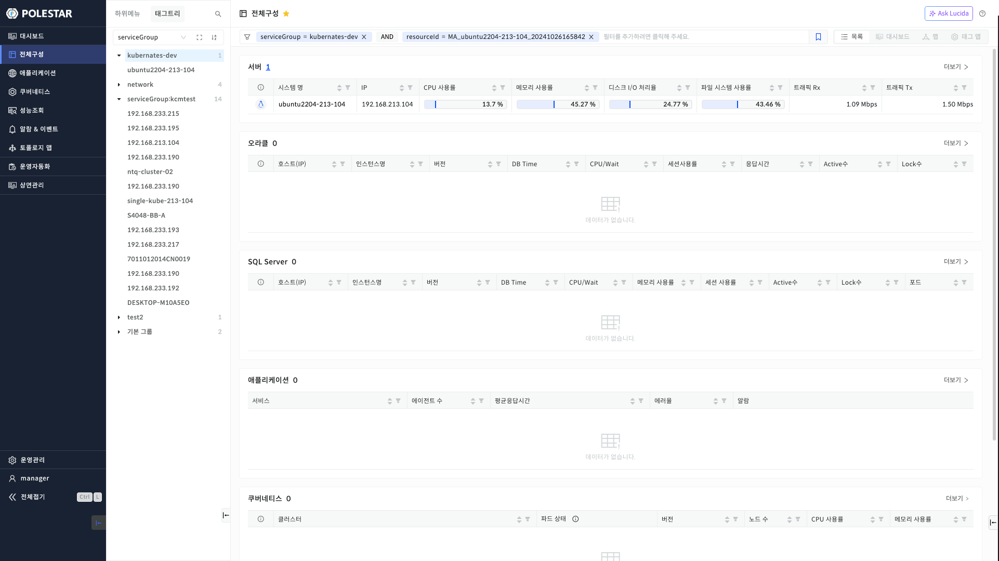

태그트리

장비의 태그별 트리를 볼 수 있는 태그 트리입니다.

▶ \[그림1\] 태그트리

▶ \[그림2\] 태그트리 설명

1.  하위메뉴, 태그트리 뷰 모드를 변경할 수 있는 버튼입니다.

2.  태그트리의 검색 필터입니다. 클릭 시, 좌측에 입력칸이 나타납니다.

▶ \[그림3\] 태그트리 검색 클릭 전

▶ \[그림4\] 태그트리 검색 클릭 후

3.  태그의 키를 선택할 수 있는 셀렉트 박스입니다. 클릭 시 항목이 드롭다운으로 나타납니다.

4.  트리의 접기/펼치기를 할 수 있는 버튼입니다.

5.  트리의 데이터를 오름차순/내림차순으로 정렬할 수 있는 버튼입니다. 초기값은 내림차순입니다.

6.  트리의 데이터가 나타나는 공간입니다.

태그트리 – 데이터 표시

▶ \[그림5\] 태그트리 데이터

1.  serviceGroup 키로 검색한 태그트리 데이터입니다.

2.  각 키의 부모 데이터는 자식 데이터의 갯수를 표시합니다.

태그트리 – 검색필터

▶ \[그림6\] 태그트리 검색필터

1.  상단에 있는 입력 창으로 데이터를 입력하면 동일한 데이터를 가진 장비가 하이라이트되어 표시됩니다.

태그트리 – 상세정보, 알람정책

▶ \[그림7\] 태그트리 상세정보

1.  장비를 클릭 또는 마우스 호버 시, 우측에 아이콘이 표시됩니다.

2.  아이콘을 클릭 시, 상세정보와 개별 알람 정책 드롭다운을 선택할 수 있습니다.

3.  상세정보 클릭 시, 장비의 상세정보를 보여주는 드로워가 나타납니다.

▶ \[그림8\] 태그트리 장비 상세정보 드로워

4.  개별알람정책 클릭 시, 개별알람정책 페이지로 이동하고, 선택한 장비가 필터링되어 표시됩니다.

> ▶ \[그림9\] 태그트리 장비 개별 알람 정책 페이지

태그트리 – 필터 설정

▶ \[그림10\] 태그트리 필터 설정

1.  트리 데이터를 더블클릭 시, 필터에 해당 장비에 대한 필터가 우측 공통 필터에 설정됩니다.

2.  트리 데이터를 우측 태그 필터에 드래그 시, 드래그한 필터에 해당 장비의 필터 값이 설정됩니다.

