통합 로그

통합 로그 기능은 수집된 이벤트나 로그를 통합하여 한 눈에 볼 수 있는 화면을 제공합니다. 통합 로그 화면은 메뉴에서 \[통합 로그\]를 클릭하면 볼 수 있습니다. 탭 종류로는 \[전체 현황\], \[메시지 패턴 현황\], \[파싱 설정\], \[로그 이상감지 현황\], \[로그 이상감지 모델 관리\] 등이 있습니다. 화면에 처음 진입시 왼쪽에는 검색 필터가 존재하고 디폴트로 로그 레벨 필터가 펼쳐있습니다. 로그 레벨 필터의 모든 항목들은 체크되어 있습니다. 기본적으로 \[전체 현황\] 탭이 선택되어 있고 전체 현황에서는 로그 개수 차트와 로그 메시지를 확인할 수 있습니다. 조회되는 로그 기간은 오른쪽 상단에 명시되어 있고 수정할 수 있습니다.

<table>
<tbody>
<tr class="odd">
<td>
노트

[로그 이상감지 현황], [로그 이상감지 모델 관리] 탭은 AIOPS 라이선스 및 권한이 있을 때 보입니다.
</td>
</tr>
</tbody>
</table>

통합 로그 수집 설정

\[관리 대상\]의 \[사용자 정의 항목\]에서 로그 감시 추가시 통합 로그 연계를 설정할 수 있습니다. \[통합 로그 연계 유무\]를 활성화하고 로그 타입 태그를 설정하면 해당 로그 감시에서 수집하는 로그를 통합로그 화면에서 모니터링할 수 있습니다.

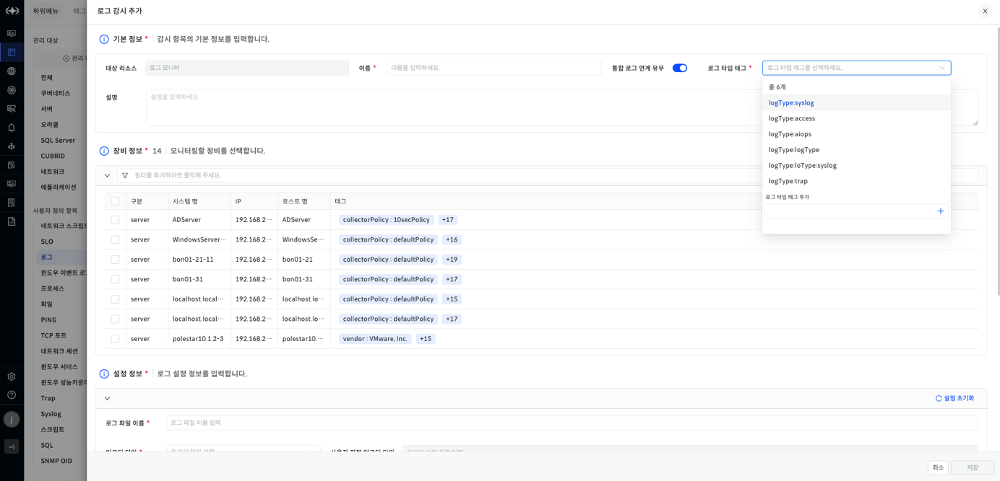

▶ \[그림1\] 관리 대상 \> 로그 \> 로그 감시 추가 화면

<table>
<tbody>
<tr class="odd">
<td>
노트

Log Monitor와 같이 이벤트로 쌓이는 모든 데이터는 API를 통해 통합 로그에서 모니터링할 수 있습니다.
</td>
</tr>
</tbody>
</table>

전체 현황

통합 로그 화면 처음 진입시 나타나는 화면으로 통합로그를 통해 수집되는 모든 로그들을 한눈에 볼 수 있는 화면입니다.

검색 필터

전체 현황의 검색 필터는 서비스 그룹 태그, 이벤트 타입, 로그 레벨, 관리 대상, 로그 이름으로 총 5가지의 필터가 존재합니다. 각 필터들은 열고 닫을 수 있고 검색이 가능합니다. 또한 데이터 기간동안 조회된 로그를 필터마다 그룹핑하여 개수를 표시하고 있습니다.

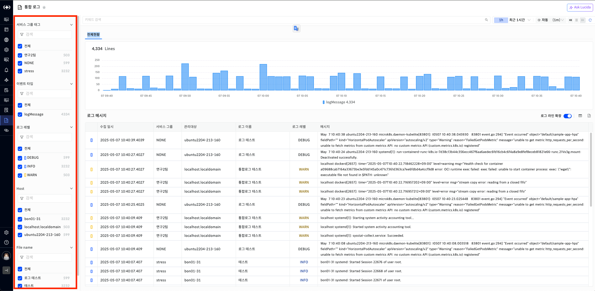

▶ \[그림2\] 통합로그 \> 전체 현황 \> 검색 필터

로그 개수 차트

화면 상단에 표시되는 로그 개수 차트는 시간대별 이벤트 타입별 로그 메시지 발생량을 누적 막대 그래프로 시각화해서 보여주고 있습니다. 범례에는 이벤트 타입별 로그 개수가 표시되고 있습니다. 차트를 드래그시 드래그한 범위내의 로그 메시지를 조회합니다.

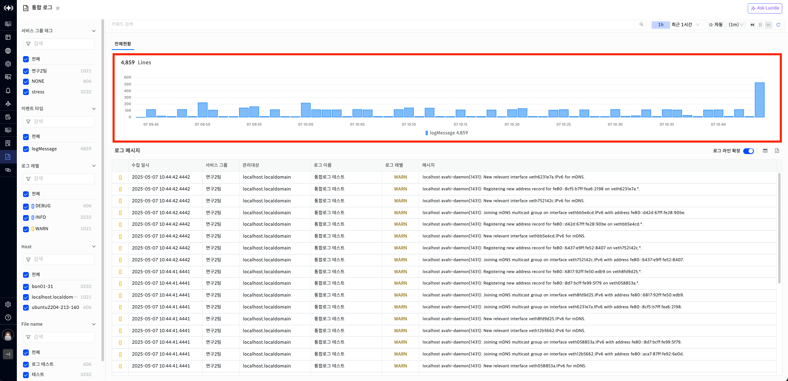

▶ \[그림3\] 통합로그 \> 전체 현황 \> 로그 개수 차트

로그 메시지

로그 메시지는 검색필터와 데이터 기간 내에 존재하는 로그를 조회한 결과를 보여줍니다. 컬럼으로는 로그 메시지, 로그 레벨, 메시지, 이벤트 타입, 관리 대상, 로그 이름 등이 있고 디폴트로 일시, 로그 레벨, 메시지를 보여줍니다. 가장 왼쪽 컬럼에는 로그 레벨을 색으로 표시하고 있습니다.

\[로그 라인 확장\] 스위치 버튼을 통해, 메시지 컬럼 영역의 로그를 확대해서 조회할 수 있습니다.

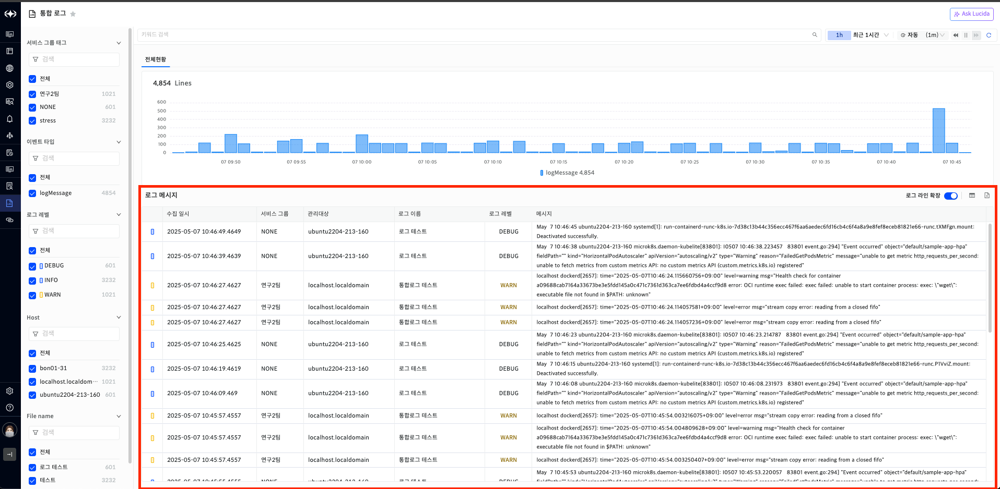

▶ \[그림4\] 통합로그 \> 전체 현황 \> 로그 메시지

로그 메시지 항목

| 일시     | 로그 발생 일시              |
| ------ | --------------------- |
| 로그 레벨  | 해당 로그의 레벨을 의미합니다.     |
| 메시지    | 로그 내용입니다.             |
| 이벤트 타입 | 해당 로그의 이벤트 타입입니다.     |
| 관리 대상  | 로그를 수집한 리소스의 호스트명입니다. |
| 로그 이름  | 수집한 로그의 리소스 이름입니다.    |

<table>
<tbody>
<tr class="odd">
<td>
노트

로그 메시지의 오른쪽 상단 [로그 라인 확장] 버튼 클릭시 메시지 컬럼에서 ...으로 표시된 로그 내용 전체가 표시됩니다.
</td>
</tr>
</tbody>
</table>

로그 메시지 엑셀 다운로드 절차

1.  \[로그 메시지\] 테이블의 오른쪽 상단의 \[엑셀 저장\] 버튼을 클릭한다.

2.  \[엑셀 다운로드\] 팝업창에서 다운 받을 로그의 최대 개수를 선택 후 \[다운로드\] 버튼을 클릭한다.

로그 상세

로그 상세 화면은 조회된 로그 메시지에서 특정 행을 클릭시 나오는 드로우로 확인할 수 있습니다. 로그 상세 화면 상단에는 호스트명과 이벤트 타입, 로그 메시지를 확인할 수 있습니다. 그 밑으로는 \[메시지 속성\]과 \[성능\] 탭이 있고 \[메시지 속성\]에서는 해당 로그에 대한 정보를 확인할 수 있습니다. 성능 탭에서는 로그가 발생한 호스트의 주요 지표 6개의 성능 차트를 보여줍니다. 로그 상세 오른쪽 상단에는 이전 로그 메시지와 다음 로그 메시지를 조회할 수 있는 화살표 버튼이 있습니다.

<table>
<tbody>
<tr class="odd">
<td>
노트

이전 로그 메시지와 다음 로그 메시지는 `로그 메시지` 목록에서 조회된 항목 기준으로 이동합니다. 따라서 항목에 존재하지 않은 메시지는 상세 조회되지 않습니다.
</td>
</tr>
</tbody>
</table>

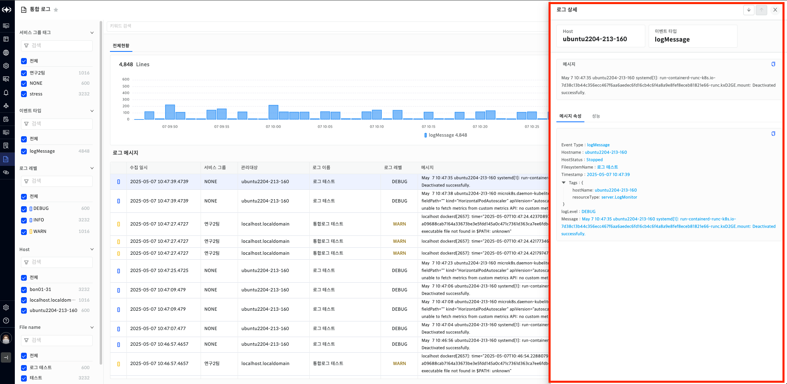

▶ \[그림5\] 통합로그 \> 전체 현황 \> 로그 메시지 상세

로그 상세 항목

<table>
<thead>
<tr class="header">
<th>Host</th>
<th>로그를 수집한 리소스의 호스트명입니다.</th>
</tr>
</thead>
<tbody>
<tr class="odd">
<td>이벤트 타입</td>
<td>해당 로그의 이벤트 타입입니다.</td>
</tr>
<tr class="even">
<td>메시지</td>
<td>로그 내용입니다.</td>
</tr>
<tr class="odd">
<td>메시지 속성</td>
<td>로그를 수집한 리소스의 메타 정보를 나타냅니다. 
수집 리소스에 따라 표현되는 항목이 상이합니다.</td>
</tr>
<tr class="even">
<td>성능</td>
<td>로그를 수집한 리소스의 `주요` 지표에 대한 성능 정보를 나타냅니다.</td>
</tr>
</tbody>
</table>

로그 상세 \> 성능 탭

로그 상세의 성능탭은 로그 수집 리소스의 주요 지표에 대한 성능 차트를 나타냅니다.

차트의 조회 범위는 로그가 발생한 시점을 기준으로 +-15분 표현하며, 로그가 발생한 시점은 빨간색 점선의 세로바를 통해 표현됩니다.

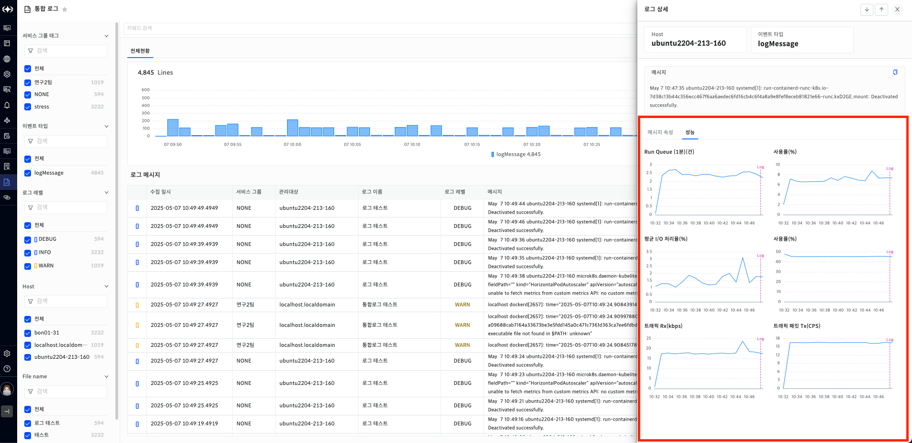

▶ \[그림6\] 통합로그 \> 전체 현황 \> 로그 메시지 상세 \> 성능

메시지 패턴 현황

메시지 패턴 현황은 수집된 로그 메시지를 패턴화하여 보여주는 화면입니다. 크게 \[매칭 로그\]와 \[미매칭 로그\]로 구분되어 있고 \[파싱 설정\]에서 설정한 로그 타입 태그를 가진 대상의 경우 \[메시지 패턴 현황\]에서 확인할 수 있습니다.

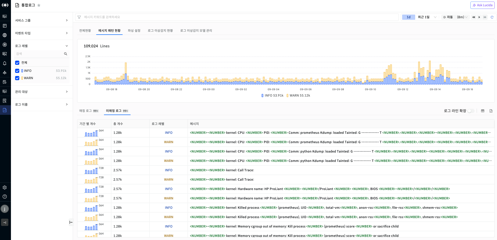

▶ \[그림7\] 통합로그 \> 메시지 패턴 현황

검색 필터

메시지 패턴 현황의 검색 필터는 서비스 그룹, 이벤트 타입, 로그 레벨, 관리 대상, 로그 이름, 파싱 이름으로 총 6가지의 필터가 존재합니다. 각 필터들은 열고 닫을 수 있고 검색이 가능합니다. 또한 데이터 기간동안 조회된 로그를 필터마다 그룹핑하여 개수를 표시하고 있습니다. 미매칭 로그의 경우 파싱 이름을 제외한 5가지의 필터가 존재합니다.

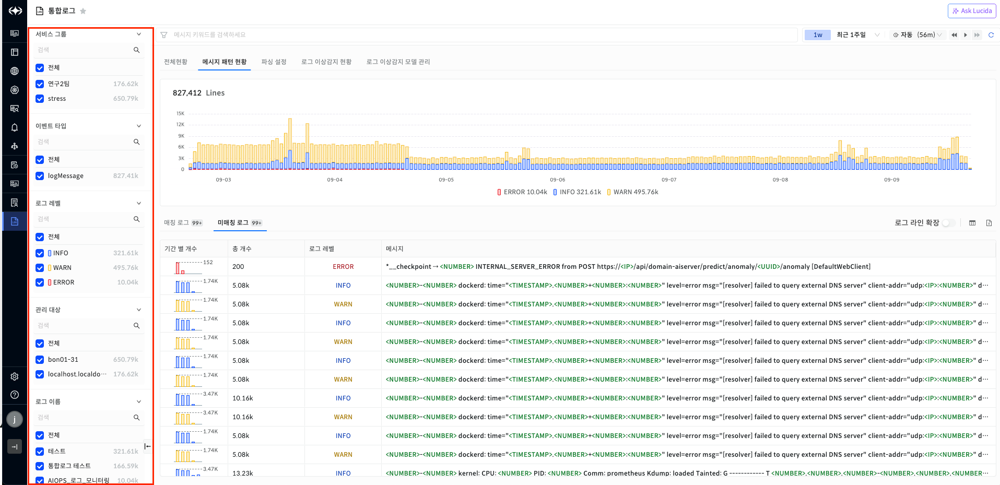

▶ \[그림8\] 통합로그 \> 메시지 패턴 현황 \> 검색 필터

로그 개수 차트

메시지 패턴 현황 화면 상단에 표시되는 로그 개수 차트는 시간대별 로그 레벨별 로그 메시지 발생량을 누적 막대 그래프로 시각화해서 보여주고 있습니다. 범례에는 로그 레벨별 로그 개수가 표시되고 있습니다. 차트를 드래그시 드래그한 범위내 패턴으로 그룹핑한 매칭/미매칭 로그들이 조회됩니다..

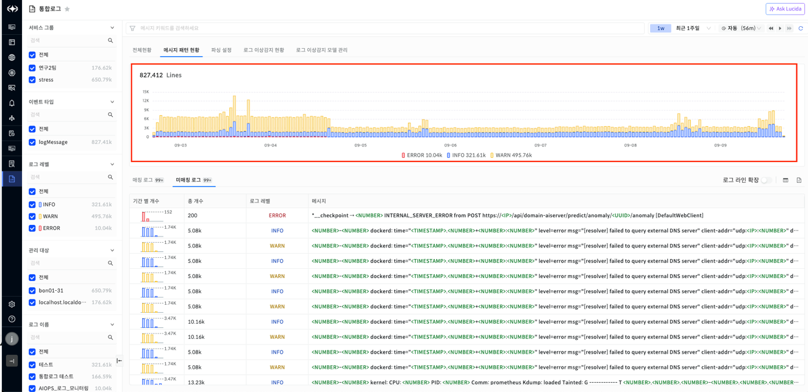

▶ \[그림9\] 통합로그 \> 메시지 패턴 현황 \> 로그 개수 차트

매칭/미매칭 로그

매칭/미매칭 로그는 검색필터와 데이터 기간 내에 존재하는 패턴들을 조회한 결과를 보여줍니다. 컬럼으로는 기간 별 개수, 총 개수, 로그 레벨, 파싱 이름, 메시지가 로그 메시지가 있습니다. 미매칭 로그의 경우 파싱 이름을 제외하고 동일한 컬럼을 보여주고 있습니다. 가장 왼쪽 컬럼인 기간 별 개수는 각 패턴의 개수를 5개의 막대 그래프로 보여주고 있습니다. 로그 레벨을 색으로 표시하고 있습니다. \[로그 라인 확장\] 스위치 버튼을 통해, 메시지 컬럼 영역의 로그를 확대해서 조회할 수 있습니다.

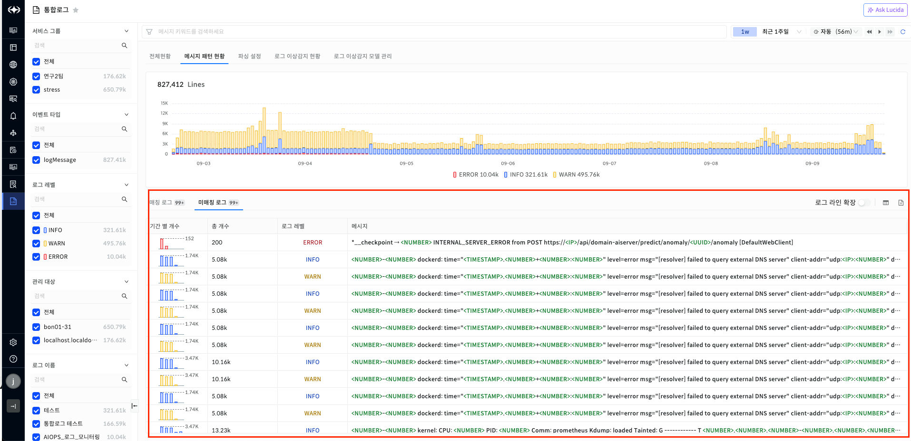

▶ \[그림10\] 통합로그 \> 전체 현황 \> 로그 메시지

매칭/미매칭 로그 그리드

| 기간 별 개수 | 조회된 기간을 5등분으로하여 차트로 표시하고 있습니다. |
| ------- | ------------------------------ |
| 로그 레벨   | 해당 로그의 레벨을 의미합니다.              |
| 총 개수    | 해당 패턴의 총 개수를 의미합니다.            |
| 파싱 이름   | 패턴화 한 파싱 이름                    |
| 메시지     | 패턴화된 로그 메시지                    |

<table>
<tbody>
<tr class="odd">
<td>
노트

매칭/미매칭 로그의 오른쪽 상단 [로그 라인 확장] 버튼 클릭시 메시지 컬럼에서 ...으로 표시된 로그 내용 전체가 표시됩니다.
</td>
</tr>
</tbody>
</table>

매칭/미매칭 엑셀 다운로드 절차

1.  \[매칭/미매칭 로그\] 테이블의 오른쪽 상단의 \[엑셀 저장\] 버튼을 클릭한다.

2.  \[엑셀 다운로드\] 팝업창에서 다운 받을 로그의 최대 개수를 선택 후 \[다운로드\] 버튼을 클릭한다.

매칭/미매칭 로그 상세

매칭/미매칭 로그 상세 화면은 매칭/미매칭 로그 그리드에서 특정 행을 클릭시 나오는 드로우로 확인할 수 있습니다. 상세 화면 상단에는 패턴이 명시되어 있고 그 아래에는 클릭한 패턴의 로그 개수 차트와 패턴에 해당하는 로그 메시지 목록들을 보여줍니다.

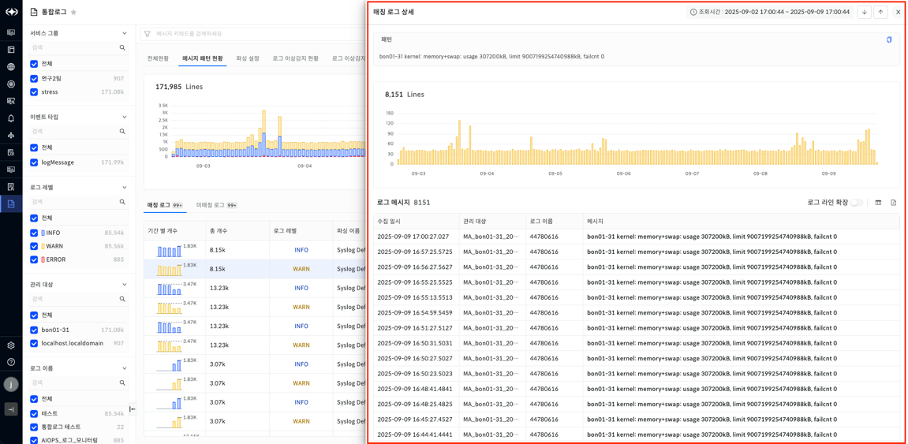

▶ \[그림11\] 통합로그 \> 전체 현황 \> 로그 메시지 상세

매칭/미매칭 로그 상세의 로그 메시지

| 수집 일시 | 로그의 수집 일시          |
| ----- | ------------------ |
| 관리 대상 | 로그를 수집한 리소스의 관리 대상 |
| 로그 이름 | 로그 대상의 이름          |
| 메시지   | 로그 메시지             |

로그 상세

매칭/미매칭 로그 상세의 로그 메시지 중 하나를 클릭시 로그 상세 드로워가 나옵니다. 전체 현황의 로그 상세 항목 참고.

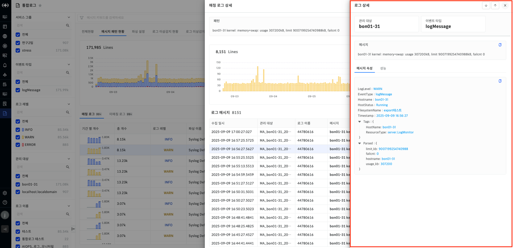

▶ \[그림12\] 통합로그 \> 전체 현황 \> 로그 메시지 상세 \> 로그 상세

<table>
<tbody>
<tr class="odd">
<td>
노트

매칭/미매칭 로그의 기간 별 개수 컬럼의 임의의 그래프를 클릭시 클릭한 기간에 대한 매칭/미매칭 로그 상세 드로워가 나온다.
</td>
</tr>
</tbody>
</table>

파싱 설정

파싱 설정은 수집한 로그를 Grok 패턴 혹은 정규 표현식으로 특정 컬럼을 추출해주고 파싱 설정 대상들에게 메시지 패턴화 기능을 제공합니다. 파싱 설정 대상은 파싱 설정 생성시 적용한 로그 타입 태그를 가진 관리 대상들입니다.

검색 필터

파싱 설정의 검색 필터는 사용 여부, 파싱 이름, 로그 타입 태그, 파싱 방식 등 총 4가지의 필터가 존재합니다. 각 필터들은 열고 닫을 수 있고 검색이 가능합니다.

파싱 목록

| 사용 여부    | 파싱 설정 사용 여부. 사용 여부 off시 파싱 설정이 비활성화됩니다. |
| -------- | --------------------------------------- |
| 파싱 이름    | 파싱 설정 이름                                |
| 로그 타입 태그 | 파싱 설정을 적용할 로그 타입 태그                     |
| 파싱 방식    | GROK/정규 표현식                             |
| 등록 일시    | 등록된 일시                                  |
| 수정 일시    | 수정된 일시                                  |
| 파싱 생성자   | 파싱 설정 생성한 생성자                           |

파싱 설정 등록 절차

1.  \[통합로그\] \> \[파싱 설정\] 화면에서 오른쪽 상단 \[+\] 버튼을 클릭한다.

2.  \[기본 정보\]를 입력 후 \[메시지 파싱 규칙\]에서 \[추가\] 버튼을 클릭한다.

3.  \[파싱 이름\]과 \[파싱 규칙\]을 입력한다.

4.  필요하다면 \[로그 메시지 샘플\]의 \[샘플 불러오기\] 버튼을 클릭하여 \[파싱 규칙\]과 매핑되는 로그들이 있는지 확인한다.

5.  \[저장\] 버튼을 클릭한다.

파싱 설정 등록 화면

통합로그의 파싱 설정 화면의 오른쪽 상단 \[+\] 버튼을 클릭시 나타나는 화면입니다. 파싱 이름, 로그 타입 태그, 파싱 방식, 메시지 파싱 규칙은 필수적으로 입력해야 합니다.

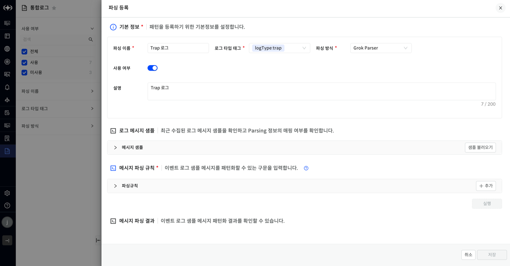

▶ \[그림13\] 통합로그 \> 파싱 설정 \> 파싱 설정 추가

로그 메시지 샘플

통합로그의 파싱 설정 화면의 오른쪽 상단 \[+\] 버튼을 클릭시 나타나는 화면입니다. 파싱 이름, 로그 타입 태그, 파싱 방식, 메시지 파싱 규칙은 필수적으로 입력해야 합니다. 로그 메시지 샘플은 설정한 \[로그 타입 태그\] 기반으로 수집되고 있는 로그들이 입력한 메시지 파싱 규칙에 맞게 잘 파싱되는지 확인하는 기능입니다. \[샘플 불러오기\] 버튼을 클릭하여 파싱 규칙을 적용하고자 하는 로그들을 체크 후 \[불러오기\] 버튼을 클릭합니다. 이 후 \[실행\] 버튼을 통해 메시지 파싱 결과를 확인할 수 있습니다. 샘플 로그와 메시지 파싱 규칙 매핑시 메시지 파싱 규칙 번호 순서대로 체크 후 가장 먼저 매핑되는 파싱 규칙과 매핑됩니다. 매핑되는 파싱 규칙이 없는 경우 실패 처리됩니다.

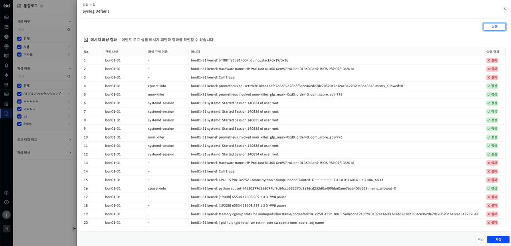

▶ \[그림14\] 통합로그 \> 파싱 설정 \> 파싱 설정 추가

<table>
<thead>
<tr class="header">
<th>관리 대상</th>
<th>로그의 관리 대상</th>
</tr>
</thead>
<tbody>
<tr class="odd">
<td>파싱 규칙 이름</td>
<td>샘플 로그와 매칭된 파싱 규칙 이름</td>
</tr>
<tr class="even">
<td>메시지</td>
<td>샘플 로그 메시지</td>
</tr>
<tr class="odd">
<td>실행 결과</td>
<td>샘플 로그가 파싱규칙과 한개도 매칭되지 않은 경우 [실패] 
한개라도 매칭되는 경우 [성공]</td>
</tr>
</tbody>
</table>

파싱 설정 삭제 절차

1.  \[통합로그\] \> \[파싱 설정\] 화면에서 삭제할 파싱 설정을 체크합니다.

2.  오른쪽 상단 삭제 버튼을 클릭합니다.

3.  팝업창에서 \[동의합니다\] 체크 후 \[확인\] 버튼을 클릭합니다.

파싱 설정 엑셀 다운로드 절차

1.  \[통합로그\] \> \[파싱 설정\] 화면에서 오른쪽 상단 \[엑셀 저장\] 버튼을 클릭합니다.

2.  다운로드한 엑셀을 확인합니다.

