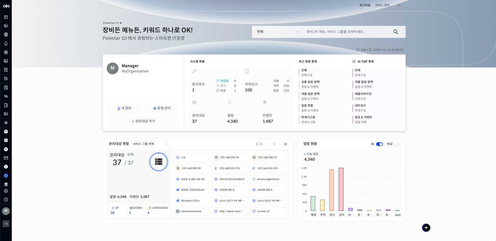
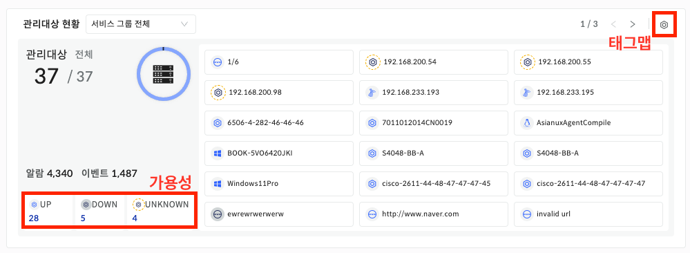
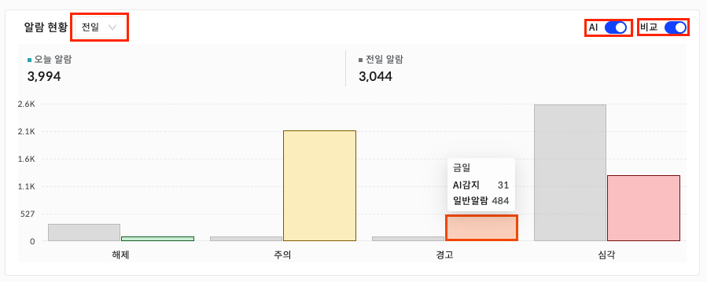

포털 서비스 종합 현황

포털 서비스 종합 현황은 IT 운영 환경의 핵심 정보를 통합 대시보드 형태로 시각화해 한눈에 파악할 수 있도록 구성된 페이지입니다. 여러 서비스 그룹의 장비 상태와 알람, 이벤트 현황을 직관적으로 조회할 수 있으며, 사용자의 접근 패턴과 선호도를 반영한 AI 추천 데이터를 기반으로 운영 효율성을 높이고자 사용자 중심의 인터페이스 환경을 제공합니다.

▶ \[그림1\] 포털 서비스 종합 현황

화면 전환/기본 포털 설정

상단 헤더에서 \[모니터링\] 선택 시 EMS 화면으로, \[서비스 관리\] 선택 시 ITG 화면으로 전환됩니다. \[설정\] 버튼 클릭 시, 사용자의 기본 포털 화면을 설정할 수 있습니다.

<table>
<tbody>
<tr class="odd">
<td>
노트

ITG라이선스 보유 시에만 화면 전환/기본 포털 설정 헤더가 표시됩니다.
</td>
</tr>
</tbody>
</table>

프로필

| 프로필      | 로그인한 사용자의 계정, 조직, 메일 주소를 표시합니다.                       |
| -------- | ----------------------------------------------------- |
| 내 정보     | 클릭하면 \[개인정보설정\] \> \[개인 정보\] \> \[프로필\] 페이지로 이동합니다.   |
| 운영 관리    | 클릭하면 \[운영 관리\] \> \[기본 설정\] \> \[사용자 관리\] 페이지로 이동합니다. |
| 관리 대상 추가 | 클릭하면 우측에서 \[관리 대상 추가\] 드로어가 열립니다.                     |

시스템 현황

| 유지보수 | 등록되어 있는 유지보수 작업(상태: 작업중, 중지, 완료)의 개수를 표현하며, 숫자 클릭 시 \[운영관리\] \> \[운영\] \> \[유지보수 작업\] 페이지로 이동합니다. |
| ---- | ------------------------------------------------------------------------------------------------- |
| 라이선스 | 라이선스 내 계약되어 있는 개수를 표현하며, 숫자 클릭 시 \[운영관리\] \> \[기본 설정\] \> \[라이선스 관리\] 페이지로 이동합니다.                 |
| 관리대상 | 권한이 있는 장비의 수를 표현하며, 클릭 시 \[전체구성\] \> \[관리 대상\] \> \[전체\] 페이지로 이동합니다.                              |
| 알람   | 권한이 있는 장비의 알람 현황 수를 표현하며, 숫자 클릭 시 \[알람&이벤트\] \> \[알람&이벤트 현황\] \> \[알람 현황\] 페이지로 이동합니다.            |
| 이벤트  | 권한이 있는 장비의 알람 현황 수를 표현하며, 숫자 클릭 시 \[알람&이벤트\] \> \[알람&이벤트 현황\] \> \[이벤트 현황\] 페이지로 이동합니다.           |

<table>
<tbody>
<tr class="odd">
<td>
노트

시스템 현황에 표시되는 데이터는 당일 00:00부터 23:59까지 수집된 정보를 기준으로 합니다.
</td>
</tr>
</tbody>
</table>

최근 방문 항목

사용자가 최근 접근한 메뉴와 즐겨찾기를 표현합니다.

클릭 시 해당 메뉴, 즐겨찾기로 이동합니다.

AI TOP 항목

사용자의 요일 및 시간대 별 메뉴 사용 패턴을 분석하여, 자주 접근하는 메뉴와 즐겨찾기 Top5를 표현하며, AI 추천 데이터가 있을 때 보여집니다.

클릭 시 해당 메뉴, 즐겨찾기로 이동합니다.

즐겨찾는 항목

사용자가 일주일 내 자주 접근한 메뉴와 즐겨찾기Top5를 표현하며, AI 추천 데이터가 없을 때 보여집니다.

클릭 시 해당 메뉴, 즐겨찾기로 이동합니다.

관리대상 현황

권한이 있는 관리대상의 현황을 표현합니다.

▶ \[그림2\] 관리대상 현황

<table>
<thead>
<tr class="header">
<th>서비스 그룹</th>
<th>기본 값은 “서비스 그룹 전체”이며, 선택한 서비스 그룹에 따라 장비 현황 데이터가 변경됩니다.</th>
</tr>
</thead>
<tbody>
<tr class="odd">
<td>관리대상</td>
<td>현재 선택한 서비스 그룹의 총 장비 개수가 표현됩니다.</td>
</tr>
<tr class="even">
<td>전체</td>
<td>모든 서비스 그룹의 총 장비 개수가 표현됩니다.</td>
</tr>
<tr class="odd">
<td>알람</td>
<td>권한이 있는 장비의 알람 현황 수를 표현하며, 숫자 클릭 시 [알람&amp;이벤트] &gt; [알람&amp;이벤트 현황] &gt; [알람 현황] 페이지로 이동합니다.</td>
</tr>
<tr class="even">
<td>이벤트</td>
<td>권한이 있는 장비의 알람 현황 수를 표현하며, 숫자 클릭 시 [알람&amp;이벤트] &gt; [알람&amp;이벤트 현황] &gt; [이벤트 현황] 페이지로 이동합니다.</td>
</tr>
<tr class="odd">
<td>가용성</td>
<td>
선택한 서비스 그룹에 해당되는 장비의 가용성 상태 별 개수를 표시합니다. 각 상태(UP, DOWN, UNKNOWN)는 토글 방식으로 선택/해제 할 수 있으며, 특정 상태만 필터링하여 장비 목록을 확인할 수 있습니다.

(예: UP 상태의 장비들만 확인하고 싶은 경우, DOWN, UNKNOWN 해제)
</td>
</tr>
<tr class="even">
<td>장비</td>
<td>우측의 개별 장비 클릭 시, 해당 장비의 상세 드로어가 열립니다.</td>
</tr>
</tbody>
</table>

알람 현황

▶ \[그림3\] 알람 현황

<table>
<thead>
<tr class="header">
<th>AI</th>
<th>
토글 버튼()을 클릭 해 AI 여부를 변경합니다.

활성화: 차트 막대에 마우스 오버 시, AI 이상감지 알람과 일반 알람 개수를 구분하여 보여줍니다.

비활성화: 차트 막대에 마우스 오버 시, 알람 개수를 구분하지 않고 합산하여 보여줍니다.
</th>
</tr>
</thead>
<tbody>
<tr class="odd">
<td>비교</td>
<td>
토글 버튼()을 클릭 해 비교 여부를 변경합니다.

활성화: 오늘 알람 현황 데이터와 선택한 시점(전일, 전주, 전월)의 알람 현황 데이터가 함께 표시됩니다.

비활성화: 오늘의 알람 현황 데이터만 표시합니다.

(*비교시점: 비교 토글 버튼이 활성 상태일 때, “전일”, “전주, “전월” 을 선택할 수 있는 Select box 가 표시됩니다. 선택한 시점에 따라 오늘 알람 현황과 해당 시점의 알람 현황이 비교되어 표시됩니다.)
</td>
</tr>
<tr class="even">
<td>차트</td>
<td>특정 심각도의 차트 클릭 시, 해당 시점과 심각도로 필터링된 [알람&amp;이벤트] &gt; [알람&amp;이벤트 현황] &gt; [알람 현황] 페이지로 이동합니다. (x축: 알람 심각도, y축: 알람 개수)</td>
</tr>
</tbody>
</table>

