포털 서비스 통합 검색

포털 메인 화면에서 검색창을 통해 통합 검색을 할 수 있습니다.

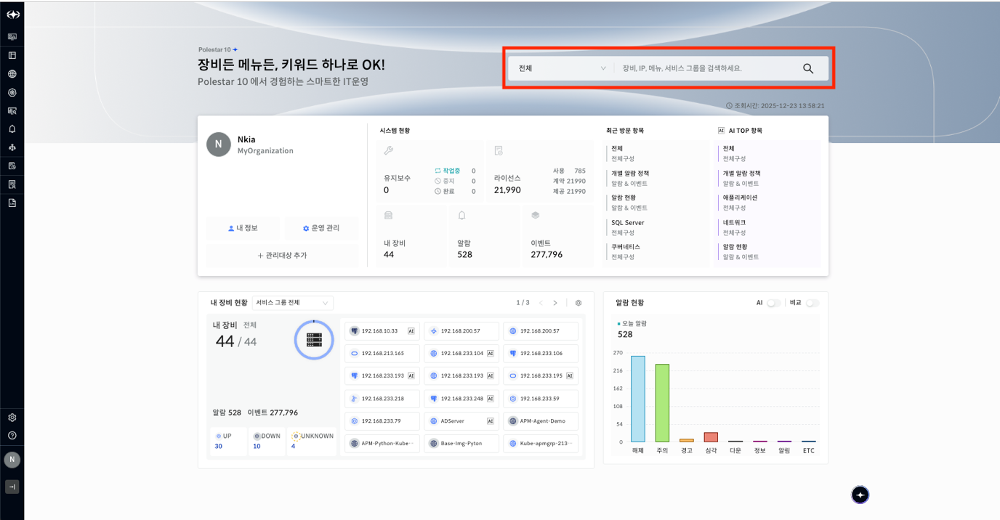

▶ \[그림1\] 포털 메인 화면

글로벌 검색 분류

사용자는 검색 분류를 선택해 검색할 수 있습니다.

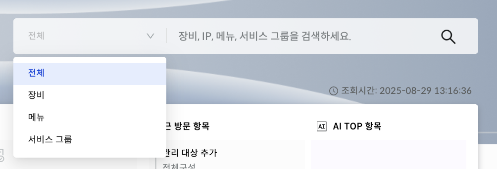

▶ \[그림2\] 글로벌 검색 분류

화면 지표

| 전체     | 장비/메뉴/서비스 그룹을 한번에 조회하여 표현한다. |
| ------ | ---------------------------- |
| 장비     | 장비 기준으로 조회하여 표현한다.           |
| 메뉴     | 메뉴 기준으로 조회하여 표현한다.           |
| 서비스 그룹 | 서비스 그룹 태그 기반으로 조회하여 표현한다.    |

검색어 자동 완성

3자 이상의 검색어 입력 시, 장비, 메뉴, 서비스 그룹 내 검색어와 일치하는 항목과 상세가 드롭다운으로 제공됩니다. 드롭다운 좌측 영역에서 특정 키워드에 마우스 커서를 올리면 우측 영역에 해당 키워드에 대한 상세 데이터를 확인할 수 있습니다.

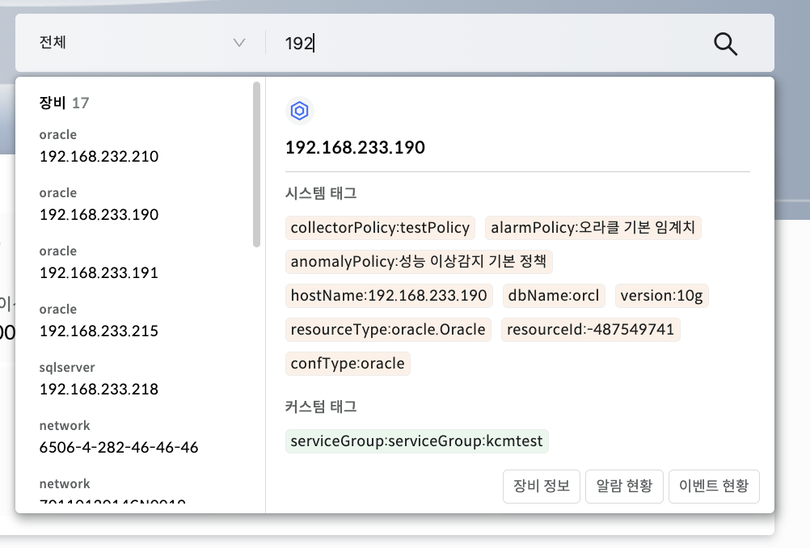

▶ \[그림3\] 장비 상세

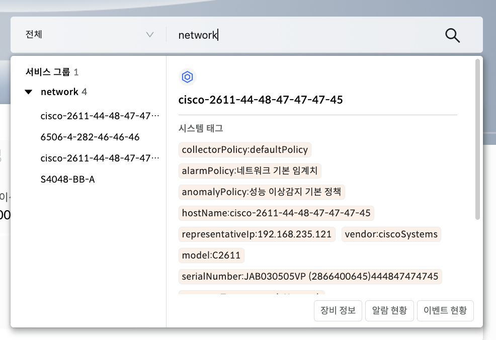

▶ \[그림4\] 서비스 그룹 상세

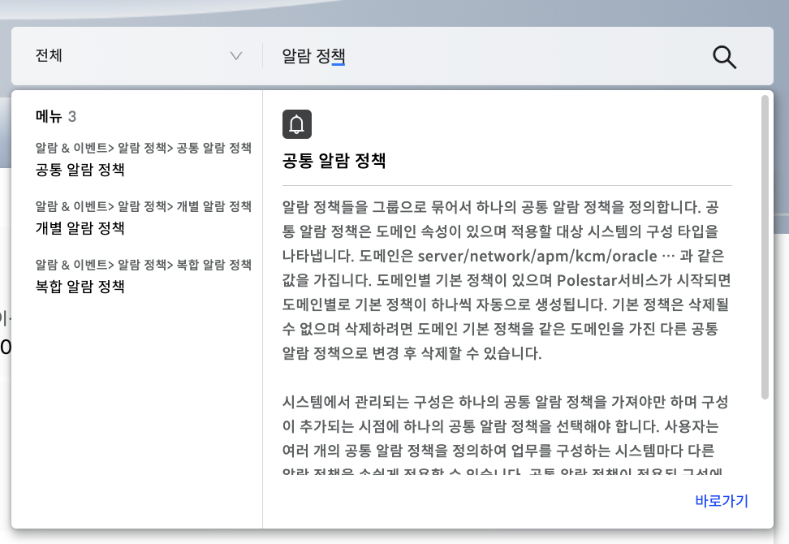

▶ \[그림5\] 메뉴 상세

화면 지표

| 장비 정보  | 해당 장비의 상세 Drawer 가 열린다.       |
| ------ | ----------------------------- |
| 알람 현황  | 해당 장비로 필터링된 알람 현황 페이지로 이동한다.  |
| 이벤트 현황 | 해당 장비로 필터링된 이벤트 현황 페이지로 이동한다. |
| 바로가기   | 해당 메뉴로 이동한다.                  |

AI 추천 검색어

사용자는 추천 검색어를 3개까지 확인할 수 있습니다.

사용자가 AI 추천 검색어를 클릭하면 클릭된 검색어는 검색어 입력창에 자동으로 입력되고 검색이 됩니다.

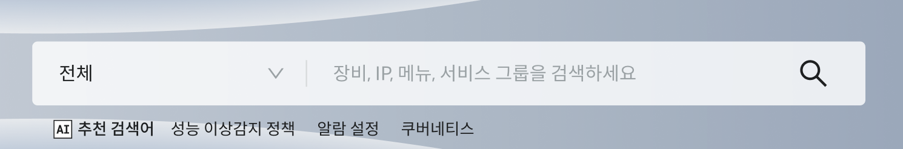

▶ \[그림6\] AI 추천 검색어

검색 결과 화면

검색어를 입력한 후 Enter 키를 누르거나, 돋보기 아이콘을 클릭하면 검색 결과 화면을 확인 할 수 있습니다.

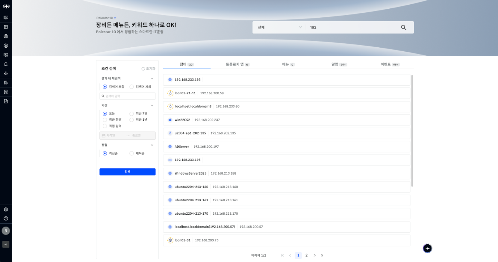

▶ \[그림7\] 검색 결과 화면

상단 배너에는 검색어가 입력된 \[글로벌 검색창\]이 있습니다.

검색 화면 좌측에는 \[조건 검색\]이 있고, 우측에는 \[카테고리 별 검색 결과\]가 있습니다.

카테고리는 \[장비\], \[토폴로지맵\], \[메뉴\], \[알람\], \[이벤트\] 로 이루어져 있습니다.

조건 검색

사용자는 조건을 설정하여 조건 검색을 할 수 있습니다.

조건을 설정한 후 \[검색\] 버튼을 클릭하면 검색 결과를 확인할 수 있습니다.

화면 지표

<table>
<thead>
<tr class="header">
<th>결과 내 재검색</th>
<th>
결과 내에서 추가 검색을 할 수 있는 기능입니다

기본값은 [검색어 포함] 입니다 
결과 내 재검색은 최대 2개까지 넣을 수 있습니다 
검색어 포함/제외를 선택한 후 검색어 입력 창에 검색어를 입력한 후 Enter 키를 누르면 검색어 입력 하단 영역에 태그 형태로 들어갑니다 
[검색어 포함] : 입력한 검색어를 포함하여 검색합니다 
[검색어 제외] : 입력한 검색어를 제외하여 검색합니다
</th>
</tr>
</thead>
<tbody>
<tr class="odd">
<td>기간</td>
<td>
검색 기간을 선택하는 기능입니다

기본값은 [오늘] 입니다 
[직접 입력] 선택 시 날짜 선택 popover가 뜨고, 원하는 기간을 선택할 수 있습니다
</td>
</tr>
<tr class="even">
<td>정렬</td>
<td>
[최신순], [제목순] 2가지로 선택하는 기능입니다

기본값은 [최신순] 입니다
</td>
</tr>
<tr class="odd">
<td>초기화</td>
<td>설정한 조건을 초기화할 수 있는 기능입니다</td>
</tr>
</tbody>
</table>

<table>
<tbody>
<tr class="odd">
<td>
노트

조건 검색 내 [검색] 버튼을 클릭하면 선택되어 있는 카테고리를 유지하며, 해당 카테고리 내의 검색 결과를 확인할 수 있습니다. 
예를 들어, [알람] 카테고리가 선택된 상태에서 조건 검색을 하게 되면, [알람] 카테고리 내의 검색 결과를 확인할 수 있는 것입니다.
</td>
</tr>
</tbody>
</table>

카테고리 별 검색 결과

사용자는 카테고리 별 검색 결과를 확인할 수 있습니다.

카테고리는 총 6개로 \[장비\], \[토폴로지맵\], \[메뉴\], \[알람\], \[이벤트\] 로 이루어져 있습니다.

각 카테고리 탭에는 각 탭의 검색 결과 수를 표시합니다.

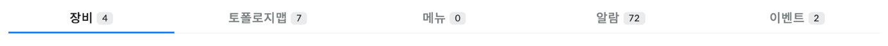

▶ \[그림8\] 카테고리 탭

<table>
<tbody>
<tr class="odd">
<td>
노트

글로벌 검색을 하면 기본 값은 [장비] 카테고리로 설정됩니다.

검색 결과는 20개씩 표시됩니다. 하단의 페이징을 통해 다른 검색 결과들을 확인할 수 있습니다.
</td>
</tr>
</tbody>
</table>

\[장비\] 카테고리

장비 카드에는 서비스 그룹 경로를 포함하여 표현합니다. 목록 중 하나의 카드를 클릭하면 해당 장비의 성능 정보 상세 창이 열립니다.

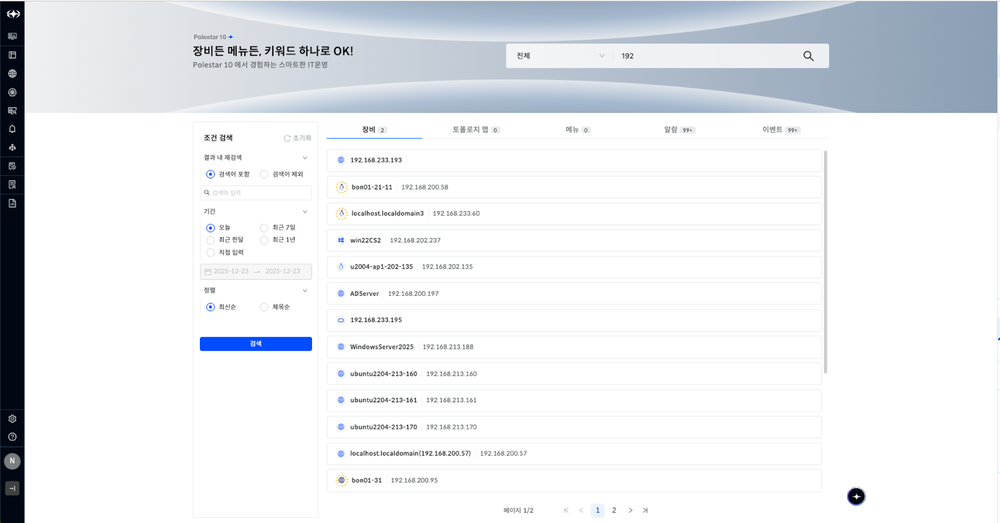

▶ \[그림9\] 장비 검색 결과

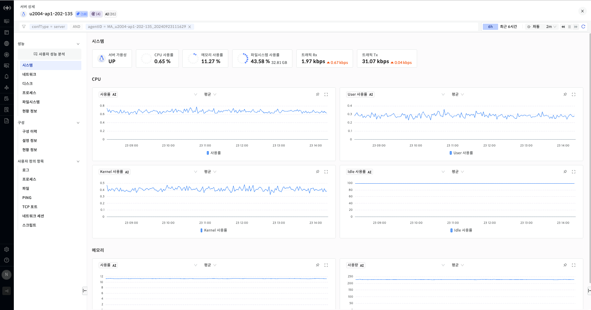

▶ \[그림10\] 장비 아이템 카드 클릭 후 열린 상세 창

\[토폴로지맵\] 카테고리

토폴로지맵 카드는 토폴로지맵 경로를 포함하여 표현합니다. 목록 중 하나의 카드를 클릭하면 해당 맵에 해당 장비로 이동합니다.

<table>
<tbody>
<tr class="odd">
<td>
노트

이동 예시 ) 그룹웨어서버#1일 경우

인프라맵#1 &gt; 그룹웨어서버#1 
그룹웨어 서비스 &gt; 그룹웨어서버#1
</td>
</tr>
</tbody>
</table>

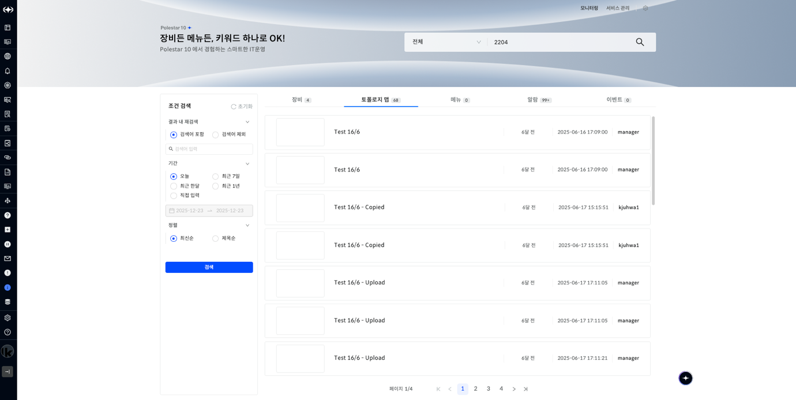

▶ \[그림11\] 토폴로지맵 검색 결과

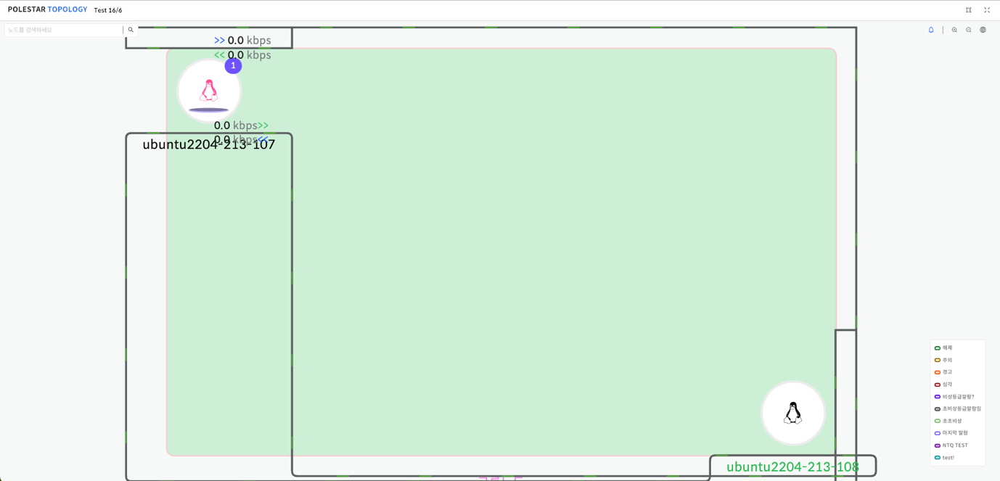

▶ \[그림12\] 토폴로지맵 아이템 카드 클릭 후 열린 새 창

\[메뉴\] 카테고리

메뉴 카드에는 메뉴 경로를 포함하여 표현합니다. 목록 중 하나의 카드를 클릭하면 선택된 메뉴로 이동합니다.

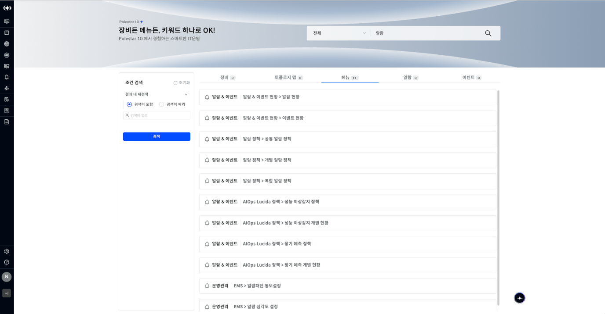

▶ \[그림13\] 메뉴 검색 결과 (검색어 : 알람)

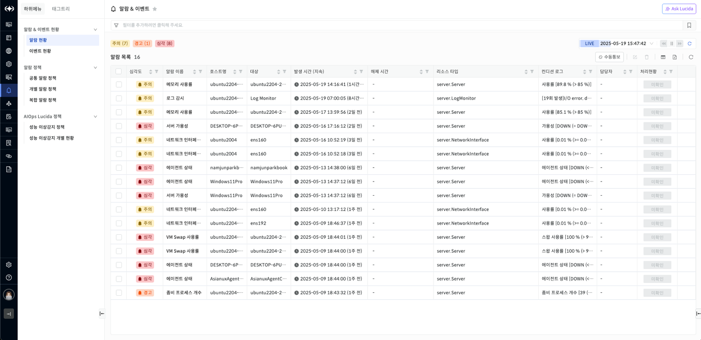

▶ \[그림14\] 메뉴 아이템 카드 클릭 후 해당 메뉴로 이동한 화면 (알람 현황 메뉴로 이동)

\[알람\] 카테고리

알람 카드에는 \[알람 우측 패널\]에서 표현하는 데이터들과 동일하게 표현됩니다. 목록 중 하나의 카드를 클릭하면 해당 알람의 상세 창이 열립니다.

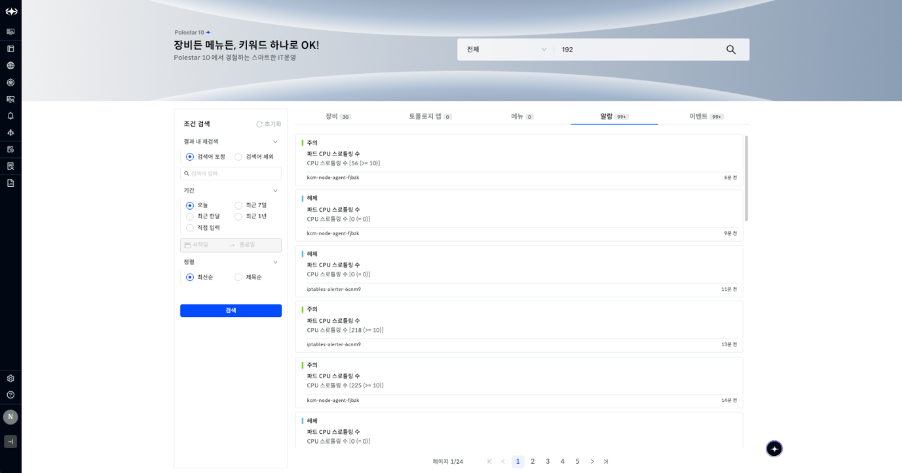

▶ \[그림15\] 알람 검색 결과

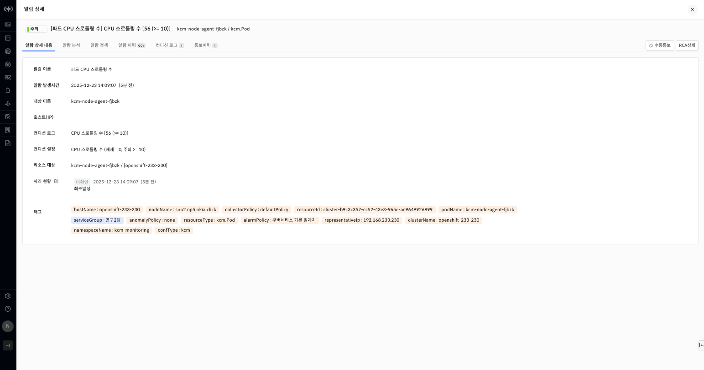

▶ \[그림16\] 알람 아이템 카드 클릭 후 열린 상세 창

\[이벤트\] 카테고리

이벤트 카드에는 \[이벤트 현황\] 메뉴에서 표현하는 데이터가 표현됩니다. 목록 중 하나의 카드를 클릭하면 해당 이벤트의 상세 창이 열립니다.

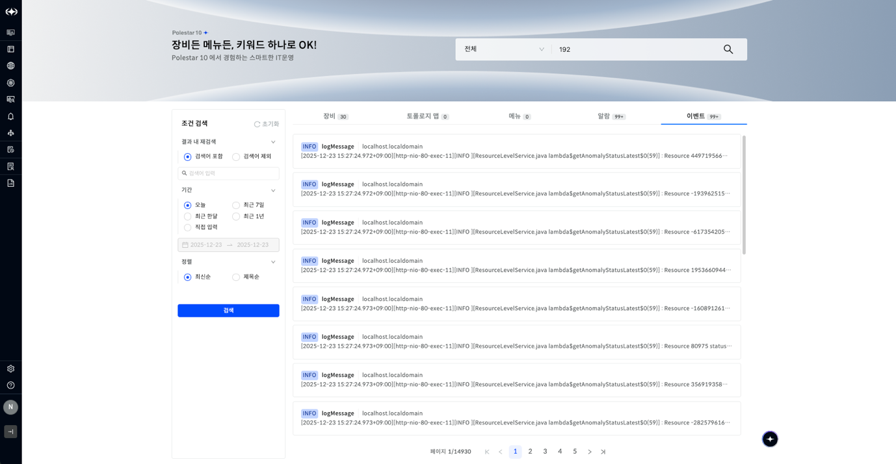

▶ \[그림17\] 이벤트 카테고리 검색 결과

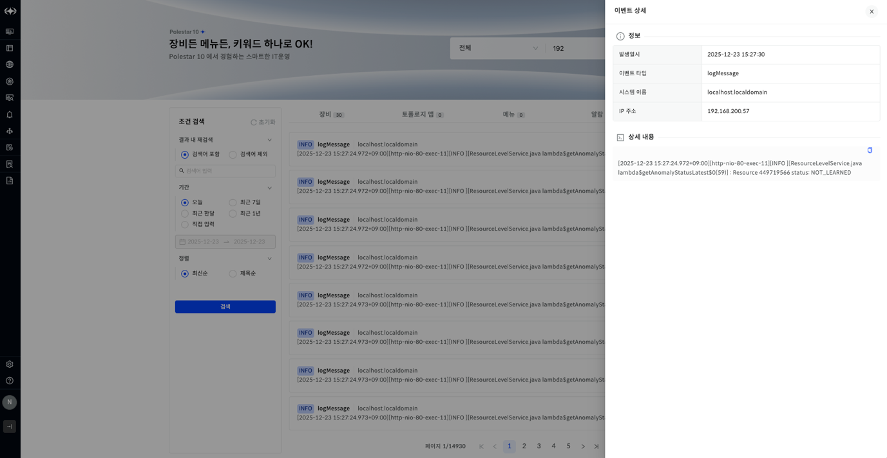

▶ \[그림18\] 이벤트 아이템 카드 클릭 후 열린 상세 창

