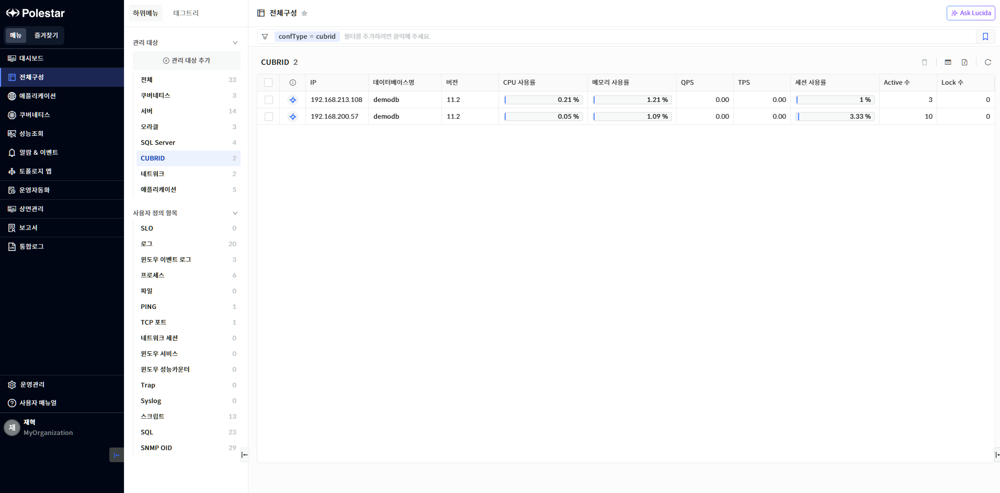
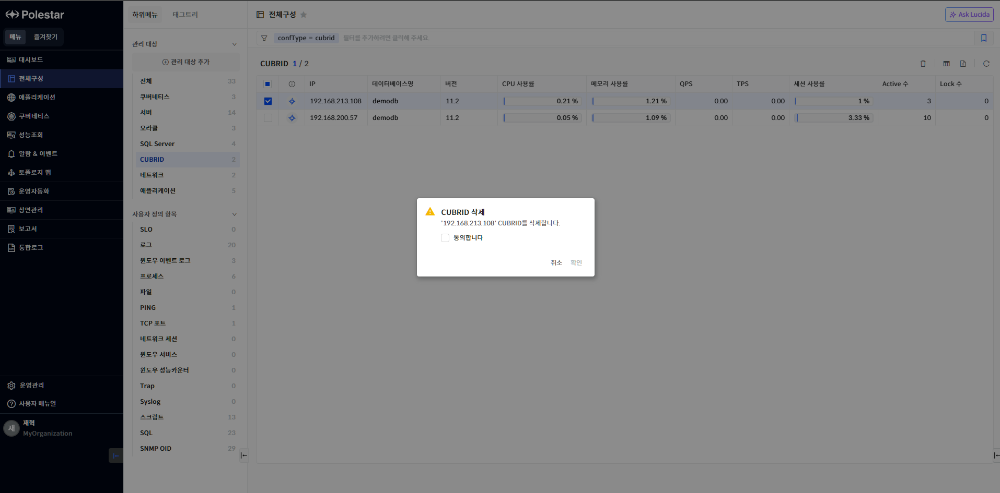
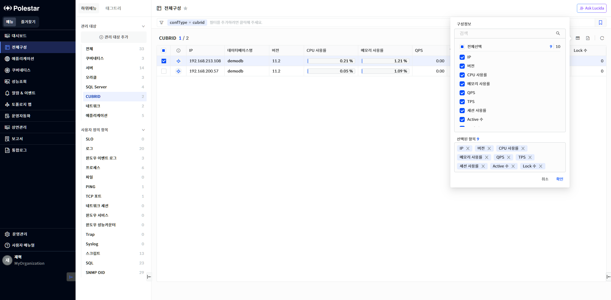

CUBRID 목록

전체 구성에서 \[CUBRID\]를 선택하거나 전체에서 CUBRID 목록의 \[더보기\>\]를 선택하면 전체 CUBRID 목록을 확인할 수 있습니다. CUBRID 목록을 통해 CUBRID 가 설치된 IP, 데이터베이스명, 버전, Port 정보를 확인하고 검색해 볼 수 있으며 CUBRID의 주요 성능 지표(DB CPU 사용률, DB 메모리 사용률, QPS, TPS등)를 확인하여 CUBRID의 전체적인 부하를 파악하고 비교해볼 수 있습니다. 또한 해당 화면에서 등록된 CUBRID를 삭제할 수 있습니다.

<table>
<tbody>
<tr class="odd">
<td>
노트

전체 구성에서 관리되는 CUBRID는 [전체구성] 메뉴의 [관리 대상 추가]에서 CUBRID [관리 대상 등록]을 통해 등록되어야 합니다. 그리고 CUBRID 목록에는 POLESTAR 로그인 사용자에게 읽기 권한이 할당된 CUBRID만 표시됩니다.
</td>
</tr>
</tbody>
</table>

> ▶ \[그림1\] CUBRID 목록
> 
> CUBRID 목록

<table>
<thead>
<tr class="header">
<th>DB</th>
<th>
DB 종류를 아이콘으로 표시하고 색깔은 가용성을 표시합니다.

<table>
<thead>
<tr class="header">
<th>: CUBRID 정상 상태 표시(Up)</th>
</tr>
</thead>
<tbody>
<tr class="odd">
<td>: CUBRID 다운 상태 표시(Down)</td>
</tr>
</tbody>
</table></th>
</tr>
</thead>
<tbody>
<tr class="odd">
<td>IP</td>
<td>CUBRID 등록 시 입력했던 IP가 표시됩니다</td>
</tr>
<tr class="even">
<td>데이터베이스명</td>
<td>CUBRID 등록 시 입력했던 CUBRID의 데이터베이스명이 표시됩니다. 데이터베이스명에 매핑 되는 태그 키 값은 “dbName”입니다.</td>
</tr>
<tr class="odd">
<td>버전</td>
<td>CUBRID 버전명이 표시됩니다.</td>
</tr>
<tr class="even">
<td>CPU 사용률</td>
<td>CUBRID 데이터베이스가 사용한 CPU 사용률입니다.</td>
</tr>
<tr class="odd">
<td>메모리 사용률</td>
<td>CUBRID 데이터베이스가 사용한 메모리 사용률입니다.</td>
</tr>
<tr class="even">
<td>QPS</td>
<td>
CUBRID 데이터베이스에 요청된 초당 쿼리 수입니다.

해당 값은 장비 추가에서 등록한 데이터베이스(Broker) Port로 요청된 쿼리 수입니다.
</td>
</tr>
<tr class="odd">
<td>TPS</td>
<td>
CUBRID 데이터베이스에 요청된 초당 트랜잭션 수입니다.

해당 값은 장비 추가에서 등록한 데이터베이스(Broker) Port로 요청된 트랜잭션 수입니다.
</td>
</tr>
<tr class="even">
<td>세션 사용률</td>
<td>CUBRID 데이터베이스에 허용 가능 세션 수(max_clients) 대비 현재 사용하고 있는 세션수의 비율을 표시합니다. 여기서 세션 수는 cubrid tranlist 유틸리티 명령 결과에서 나온 로우수를 의미합니다. 자세한 내용은 노트를 참고하세요.</td>
</tr>
<tr class="odd">
<td>Active수</td>
<td>CUBRID 데이터베이스에 연결된 세션 중 쿼리문을 수행중인 세션 수입니다.</td>
</tr>
<tr class="even">
<td>Lock수</td>
<td>현재 CUBRID세션 중 Lock으로 인해 블록 된 세션 수를 표시합니다. 장기적으로 보통 Lock 세션 수는 0개인 것이 일반적입니다. 따라서 장기적으로 Lock수가 높다면 세션 현황 조회 기능이나 분석 기능을 통해 어떤 세션이 Lock을 유발하고 블록 되는지 분석할 필요가 있습니다.</td>
</tr>
<tr class="odd">
<td>Port</td>
<td>CUBRID 등록 시 입력했던 CUBRID 매니저 접속 포트입니다</td>
</tr>
</tbody>
</table>

<table>
<tbody>
<tr class="odd">
<td>
노트

CUBRID에서는 보통 “세션”이라는 용어보다는 “트랜잭션 수”(cubrid tranlist 명령 결과 로우 수), “CAS 프로세스 수”, “CAS 연결 수”등의 표현을 주로 사용합니다. 그런데 POLESTAR에서 CUBRID에서 세션이라는 용어를 사용하는 이유는 오라클과 같은 다른 데이터베이스와의 용어 통일을 위해서입니다.
</td>
</tr>
</tbody>
</table>

<table>
<tbody>
<tr class="odd">
<td>
노트

CUBRID에서 세션 사용률은 데이터베이스 환경 변수에서 설정 가능한 허용가능한 CAS 프로세스 수(max_clients) 대비 트랜잭션 수(cubrid tranlist 명령 결과 로우 수)로 계산됩니다.
</td>
</tr>
</tbody>
</table>

CUBRID 삭제

삭제할 CUBRID를 선택하고 \[삭제\] 버튼을 선택하여 CUBRID를 삭제할 수 있습니다.

삭제가 되면 CUBRID 수집이 중지되며 CUBRID 등록이 해제가 됩니다.

CUBRID 등록 해제 및 삭제시에도 기존 데이터는 삭제되지 않고 유지됩니다. 따라서 삭제 후 CUBRID를 다시 등록하면 기존 데이터 정보를 다시 조회할 수 있습니다.

▶ \[그림2\] CUBRID 삭제

> CUBRID 삭제 절차

1.  삭제하고자 하는 CUBRID 선택 (다중 선택 가능)

2.  테이블 우측 상단의 삭제 아이콘 클릭

3.  메시지창에서 확인 클릭

컬럼 수정

오라클 목록의 우측 상단 \[컬럼 수정\] 버튼을 통해 오라클 목록에 원하는 컬럼을 표시하거나 제외할 수 있습니다. 엑셀 저장시에도 컬럼 수정을 통해 표시된 컬럼만 저장됩니다. 컬럼 수정 팝업창에서는 컬럼 검색 기능을 제공하며 선택된 항목을 하단에 표시하고 표시된 컬럼을 제외할 수 있는 기능을 제공합니다.

▶ \[그림3\] CUBRID 목록 컬럼 수정

> CUBRID 컬럼 수정 절차

1.  CUBRID 목록에서 우측 상단 컬럼 수정 아이콘 클릭

2.  컬럼 수정 팝업창에서 화면에 표시하고자 하는 컬럼을 체크박스에서 선택

3.  저장 버튼 클릭

엑셀 저장

CUBRID 목록의 우측 상단 \[엑셀 저장\] 버튼을 통해 CUBRID 목록을 엑셀로 저장할 수 있습니다. 컬럼 수정 기능, 상단 태그 검색 기능, 그리드 컬럼 검색 기능 등을 통해 엑셀에 보여줄 컬럼과 내용을 원하는 조건에 맞게 필터링하여 저장할 수 있습니다.

▶ \[그림4\] CUBRID 목록 엑셀 저장

> CUBRID 목록 엑셀 저장 및 조회 절차

1.  CUBRID 목록에서 우측 상단 엑셀 저장 아이콘 클릭

2.  브라우저 우측 상단 창에 저장된 엑셀 파일명이 표시됨

3.  해당 파일명을 클릭하여 엑셀 파일 확인

