CUBRID 상세

CUBRID 상세 화면에서는 CUBRID의 성능 정보, 구성 정보를 확인할 수 있으며 세션 및 SQL 수행 이력을 상세 분석할 수 있습니다. 성능 메뉴에서는 카테고리(인스턴스, 세션(프로세스), SQL, 메모리, 로그, Broker, Volume)별로 성능을 확인할 수 있습니다. 구성 이력에서는 CUBRID 구성 정보(환경변수, Broker 구성, Volume 크기 등)의 변경 이력을 확인할 수 있으며 현황 정보에서는 환경변수, Broker 요약, Broker Status, Volume의 현재 시점 구성 정보를 확인할 수 있습니다. 설정 정보에서는 CUBRID 접속 정보를 수정하거나 역할 및 담당자 등을 설정할 수 있습니다. 세션 분석 메뉴를 통해 CUBRID에 수행된 세션의 이력을 분석할 수 있고 Top SQL 분석을 통해 CUBRID에 수행된 SQL 중 성능 지연이 발생된 SQL을 빠르게 찾고 분석할 수 있습니다. 마지막으로 SQL 성능 분석에서는 세션 이력정보에서 수집된 SQL의 성능 지표를 Scatter 차트에 표시하여 한눈에 실행된 SQL들의 성능을 확인하고 원하는 SQL을 선택하여 분석할 수 있습니다.

CUBRID 인스턴스 성능

CUBRID 인스턴스 성능 화면은 CUBRID 인스턴스의 전반적인 상태, 성능, 효율성 정보를 조회할 수 있는 화면입니다. 상단에 CUBRID 가용성, 서버 CPU 사용률, 서버 메모리 CPU 사용률 및 Master 프로세스와 Broker 프로세스 수가 표시되고 그 밑으로 CUBRID 주요 성능 지표에 대한 차트와 CUBRID Effciency(효율성) 지표 목록이 표시됩니다.

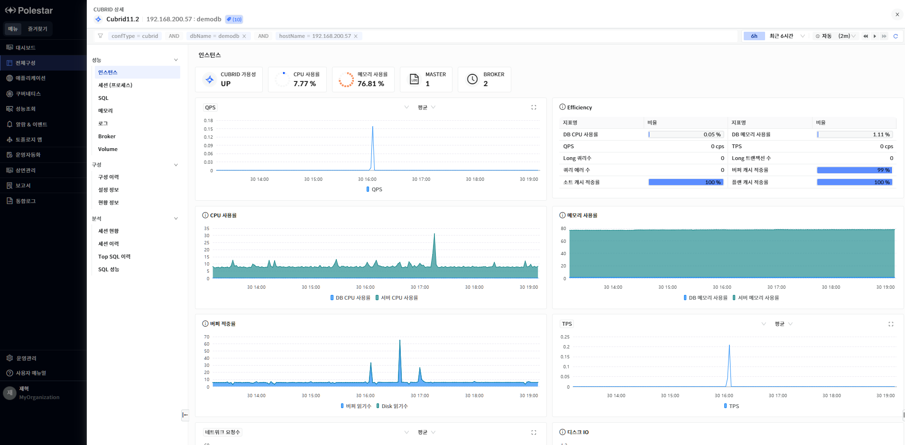

> ▶ \[그림1\] CUBRID 인스턴스 성능

인스턴스 상태

CUBRID의 가용성, 서버 CPU 사용률, 서버 메모리 CPU 사용률 및 Master 프로세스와 Broker 프로세스 수를 표시합니다.

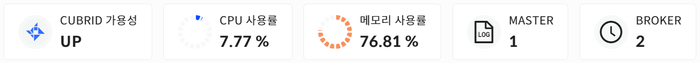

▶ \[그림2\] CUBRID 인스턴스 상태

> 화면 지표

<table>
<thead>
<tr class="header">
<th>가용성</th>
<th>
CUBRID 데이터베이스에 현재 접속 가능 상태를 표시합니다.

UP: CUBRID 데이터베이스에 현재 정상 접속 가능한 상태입니다.

DOWN: CUBRID 데이터베이스에 현재 정상적으로 접속 가능하지 않은 상태입니다.

DOWN은 접속 불가 상태로 CUBRID 또는 CUBRID 데이터베이스가 다운된 상황 말고도 과부하로 인한 응답불가, 접속 불가, 네트웍 장애 등 다양한 상황에서 발생될 수 있습니다.
</th>
</tr>
</thead>
<tbody>
<tr class="odd">
<td>CPU 사용률</td>
<td>CUBRID가 설치된 서버의 CPU사용률입니다. 서버 CPU사용률이 높다면 우선 해당 데이터베이스의 CPU 사용률도 함께 확인하여 데이터베이스의 CPU 부하인지 아닌지를 판단해야 합니다. 이후 데이터베이스 CPU 부하인 경우는 데이터베이스의 성능 지표 및 세션, SQL 이력 분석등을 통해 원인을 분석해 볼 필요가 있습니다.</td>
</tr>
<tr class="even">
<td>메모리 사용률</td>
<td>CUBRID가 설치된 서버의 메모리 사용률입니다. 서버 메모리 사용률이 높다면 우선 해당 데이터베이스의 메모리 사용률도 함께 확인하여 데이터베이스의 메모리 사용량이 많은지를 판단해야 합니다. 이후 데이터베이스 메모리 사용량이 높은 경우는 데이터베이스의 성능 지표 및 세션, SQL 이력 분석등을 통해 원인을 분석해 볼 필요가 있습니다.</td>
</tr>
<tr class="odd">
<td>MASTER</td>
<td>CUBRID Master(cub_server) 프로세스의 개수입니다. 이 값이 0이면 Master 프로세스가 다운 상태이고 1이면 정상입니다. Master프로세스는DB 서버 프로세스를 관리를 위해 CUBRID기동시 실행되는 프로세스입니다.</td>
</tr>
<tr class="even">
<td>BROKER</td>
<td>현재 활성화되어 있는 Broker 프로세스의 수입니다. Broker 프로세스수가 평소 대비 낮다면 중요한 장애 상황으로 관련해서 원인 분석이 필요합니다.</td>
</tr>
</tbody>
</table>

CPU 사용률/메모리 사용률 Area 차트

CPU 사용률 Area 차트는 서버 CPU 사용률과 데이터베이스 CPU사용률 지표를 Area 차트로 표시하여 서버 CPU 사용률 대비 대상 데이터베이스의 CPU 사용률을 확인할 수 있습니다. 마찬가지로 메모리 사용률도 서버와 데이터베이스 사용률을 Area 차트로 표시합니다.

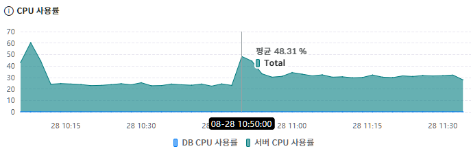

▶ \[그림3\] CPU 사용률 영역 차트

CUBRID Efficiency(효율성) 목록

CUBRID 효율성 지표 값을 통해 현재 CUBRID가 효율적으로 잘 운영되고 있는지 확인할 수 있습니다. 또한 효율성 지표를 통해 성능을 평가하고 문제를 진단하는데 유용하게 사용될 수 있습니다. 해당 지표 중 적중률 관련 지표들은 100%일때가 가장 효율적이라고 판단할 수 있으며 비율이 낮을수록 해당 지표의 효율성이 낮다고 판단할 수 있습니다. 특히 버퍼 캐시 적중률비율이 매우 낮다면 세션 및 SQL 분석을 통해 원인을 찾고 개선할 필요성이 있습니다.

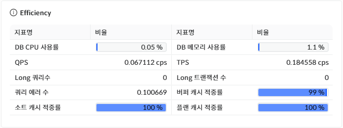

▶ \[그림4\] CUBRID Efficiency(효율성) 목록

> Efficiency 지표

<table>
<thead>
<tr class="header">
<th>DB CPU 사용률</th>
<th>CUBRID 데이터베이스가 사용한 CPU 사용률입니다.</th>
</tr>
</thead>
<tbody>
<tr class="odd">
<td>DB 메모리 사용률</td>
<td>CUBRID 데이터베이스가 사용한 메모리 사용률입니다.</td>
</tr>
<tr class="even">
<td>QPS</td>
<td>
CUBRID 데이터베이스에 요청된 초당 쿼리 수입니다.

해당 값은 장비 추가에서 등록한 데이터베이스(Broker) Port로 요청된 쿼리 수입니다.
</td>
</tr>
<tr class="odd">
<td>TPS</td>
<td>
CUBRID 데이터베이스에 요청된 초당 트랜잭션 수입니다.

해당 값은 장비 추가에서 등록한 데이터베이스(Broker) Port로 요청된 트랜잭션 수입니다.
</td>
</tr>
<tr class="even">
<td>Long 쿼리 수</td>
<td>장비 추가 시 등록한 데이터베이스 접속 Broker에 설정된 Long 쿼리 시간(기본 60초)보다 오래 걸린 초당 쿼리 수를 표시합니다.</td>
</tr>
<tr class="odd">
<td>Long 트랜잭션 수</td>
<td>장비 추가 시 등록한 데이터베이스 접속 Broker에 설정된 Long 트랜잭션 시간(기본 60초)보다 오래 걸린 초당 트랜잭션 수를 표시합니다.</td>
</tr>
<tr class="even">
<td>쿼리 에러수</td>
<td>장비 추가 시 등록한 데이터베이스 접속 Broker로 요청한 쿼리 중 에러가 발생한 쿼리의 초당 에러수를 표시합니다.</td>
</tr>
<tr class="odd">
<td>버퍼 캐시 적중률</td>
<td>버퍼 캐시에서 데이터 블록을 요청할 때 기다림 없이 즉시 제공되는 비율을 나타냅니다. 이는 버퍼 캐시의 효율성을 측정하는 중요한 지표입니다. 이 비율이 높을수록 버퍼 캐시가 효율적으로 작동하고 있음을 나타내며, 낮을 경우 캐시 미스가 많이 발생하고 있음을 의미합니다.</td>
</tr>
<tr class="even">
<td>소트 캐시 적중률</td>
<td>소트 작업 시 디스크가 아닌 소트 캐시를 이용하여 소트가 된 비율을 표시합니다. 해당 값이 높을수록 소트가 메모리를 이용하여 효율적으로 수행됨을 의미합니다.</td>
</tr>
<tr class="odd">
<td>플랜 캐시 적중률</td>
<td>쿼리의 플랜값이 디스크가 아닌 플랜 캐시에서 가져와서 재사용된 비율을 표시합니다. 해당 값이 높을수록 플랜을 메모리에서 빠르게 가져와서 수행되었음을 의미합니다.</td>
</tr>
</tbody>
</table>

<table>
<tbody>
<tr class="odd">
<td>
노트

효율성 지표들은 모두 수집 주기내에 수행된 성능 값을 기반으로 산정되며 현재 시점 가장 최신 값이 표시됩니다.
</td>
</tr>
</tbody>
</table>

멀티 지표 라인 차트

CUBRID 인스턴스의 주요 지표(QPS, TPS, CPU 사용률, 메모리 사용률, Master 프로세스 수 등)를 라인차트로 확인하여 해당 시점 각 주요 항목별 이상이 없는지 빠르게 확인할 수 있습니다. 또한 차트 좌측 상단 콤보 박스를 통해 인스턴스 관련 추가 지표(효율성 목록에 표시한 지표 등)를 차트에 추가하여 비교 조회할 수 있습니다.

<table>
<tbody>
<tr class="odd">
<td>
노트

한 차트에 지표는 최대 5개까지 추가 가능합니다. 차트는 마우스 드래그를 통해 특정 영역을 확대할 수 있으며 X축을 마우스 드래그 하여 시점 이동도 가능합니다.
</td>
</tr>
</tbody>
</table>

CUBRID 세션(프로세스) 성능

CUBRID 세션 및 프로세스 관련 성능을 조회하는 화면입니다. 상단에 세션 사용률 및 세션 수 현황이 표시되며 하단에 세션 관련 지표의 라인차트와 누적 영역 차트가 표시되고 그 밑으로 현재 수행 중이거나 락이 발생된 세션들의 목록이 표시됩니다. 해당 화면에서는 추가적으로 “세션 상세 현황”을 볼 수 있는 화면으로의 이동을 제공하며 세션 상세 현황 화면을 통해 세션이 수행한 SQL 정보, “개별 세션 이력 조회”, “개별 SQL 이력 조회”가 가능합니다. “세션 상세 현황”, “개별 세션 이력 조회”, “개별 SQL 이력 조회”에 대한 상세 내용은 본 매뉴얼의 관련 절을 참조하세요.

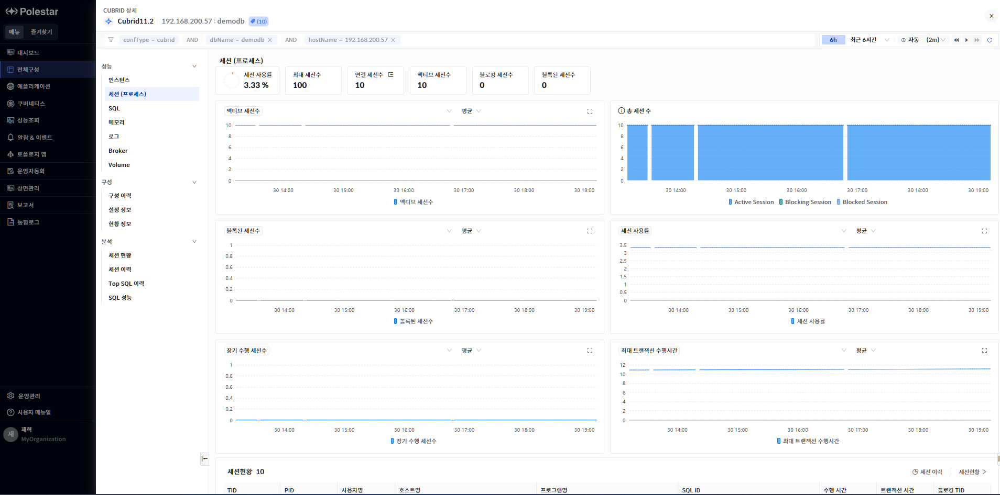

▶ \[그림5\] CUBRID 세션(프로세스) 성능

세션 사용률 및 세션수 현황

현재 시점 CUBRID에 허용 가능 최대 세션수 및 연결 세션수, 세션 사용률, 액티브/블록/블로킹 세션수가 표시되며 연결 세션수 카드에 마우스 오버시 우측 상단에 표시되는 아이콘()을 선택하면 상세 세션 현황 화면으로 이동합니다. 상세 세션 현황 화면에서는 현재 접속된 모든 세션 목록을 조회하고 분석할 수 있으며 자세한 내용은 “세션 현황 화면”절에서 확인하실 수 있습니다.

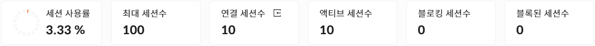

▶ \[그림6\] 세션 사용률 및 세션수 현황

총 세션수 누적 영역 차트

CUBRID 접속 세션수를 4가지 상태(Active/Idle/Blocking/Blocked)로 나누어 누적 영역 차트로 표시합니다. 각 범례를 멀티 선택하여 원하는 범례들 만을 보실 수 있습니다. 특히 전체 세션 대비 Active 세션이 많은 시간대나 Blocking, Blocked 세션수가 있는 시간대는 유의해서 살펴볼 필요가 있습니다.

멀티 지표 라인 차트

CUBRID 세션 관련 주요 지표(액티브 세션수, 세션 사용률, 블록 된 세션수, 블로킹 세션수)를 라인차트로 확인하여 해당 시점 각 주요항목별 이상이 없는 지 빠르게 확인할 수 있습니다. 또한 차트 좌측 상단 콤보 박스를 통해 세션 관련 추가 지표를 차트에 추가하여 비교 조회할 수 있습니다.

<table>
<tbody>
<tr class="odd">
<td>
노트

한 차트에 지표는 최대 5개까지 추가 가능합니다. 차트는 마우스 드래그를 통해 특정 영역을 확대할 수 있으며 X축을 마우스 드래그 하여 시점 이동도 가능합니다.
</td>
</tr>
</tbody>
</table>

세션현황 요약 목록

현재 접속된 세션 중 Actvie 상태이거나 Blocking, Blocked 상태인 세션 목록을 표시합니다. 해당 목록을 통해 현재 수행중인 세션이나 블록 된 세션 정보를 확인할 수 있습니다. 보다 상세한 세션 현황 정보는 우측 상단 \[더보기\] 버튼을 클릭하여 세션 상세 현황 드로어에서 확인할 수 있으며 현지 시점 및 과거 수행된 세션 이력을 분석하고 싶다면 우측 상단 \[세션분석\] 버튼을 클릭하여 나오는 세션분석 화면에서 상세 분석하실 수 있습니다.

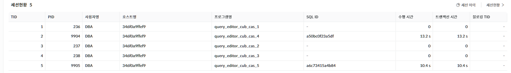

▶ \[그림7\] 세션현황 요약 목록

> 세션(트랜잭션)현황 목록

| TID     | 트랜잭션(세션)을 고유하게 식별하는 트랜잭션(세션) ID입니다. 각 트랜잭션(세션)은 고유한 TID를 가지며, 이를 통해 특정 트랜잭션(세션)을 추적할 수 있습니다. 트랜잭션(세션) ID는 숫자로 표시됩니다.            |
| ------- | ------------------------------------------------------------------------------------------------------------------------------- |
| PID     | 세션이 현재 수행되고 있는 프로세스(스레드) ID를 나타냅니다.                                                                                             |
| 사용자명    | 해당 트랜잭션(세션)를 실행시킨 사용자 이름입니다.                                                                                                    |
| 호스트명    | 해당 트랜잭션(세션)을 실행시킨 호스트의 이름입니다.                                                                                                   |
| SQL ID  | 해당 트랜잭션(세션)에서 수행중인 쿼리의 ID값입니다. ID값은 고유 값으로 해당 쿼리문을 대표하며 KILL 트랜잭션 명령에서 식별키로 사용되는 값입니다.                                          |
| 수행시간    | 해당 트랜잭션(세션)에서 현재 실행중인 쿼리의 수행 시간입니다. 단위는 초입니다.                                                                                   |
| 트랜잭션 시간 | 트랜잭션이 유지된 시간입니다. 단위는 초입니다. 만약 쿼리문 없이 트랜잭션 시간이 증가한다면 트랜잭션을 종료하지 않고 있는 Idle 트랜잭션 일 수 있습니다. 이 경우 원인을 찾고 해당 트랜잭션(세션)을 종료할 필요가 있습니다. |
| 블로킹 TID | 해당 트랜잭션이 대기중일 경우 대기를 발생시킨 트랜잭션 TID가 표시됩니다. 블로킹 TID간의 관계를 좀 더 명확히 보고자 한다면 세션현황이나 세션 이력 화면 하단 Lock Tree를 조회해 볼 수 있습니다.            |

CUBRID SQL 성능

CUBRID에서 수행되는 SQL에 대한 성능을 조회하는 화면입니다. 상단에 SQL Select 수에 대한 라인차트가 표시되고 옆 차트에서는 수행된 SQL의 수행시간을 Scatter 차트로 보여줍니다. 다음으로 DML수, 트랜잭션 수, Lock 수 소트수에 대한 Stack Area 차트가 표시됩니다. 그리고 하단에는 Top 5 SQL을 3가지 기준(세션수, 평균수행시간, 최대수행시간)으로 표시합니다. Top 5 SQL 목록에서는 “Top SQL 분석” 화면으로 이동할 수 있는 기능도 제공합니다. “Top SQL 분석” 화면에 대한 자세한 내용은 “Top SQL 분석”절을 참조하세요.

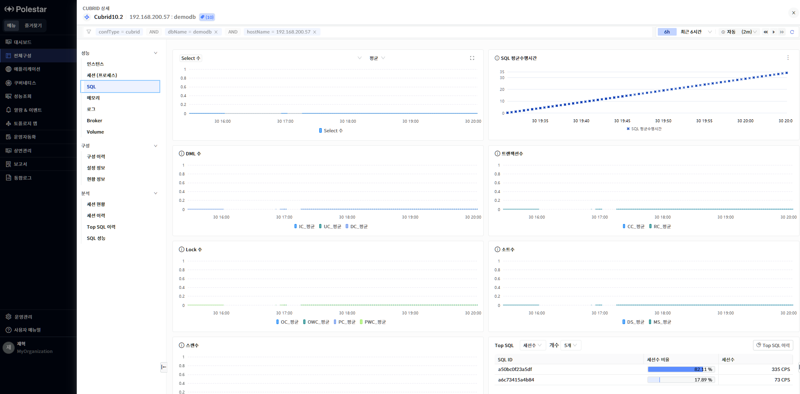

▶ \[그림8\] CUBRID SQL 성능

멀티 지표 라인 차트

CUBRID SQL 성능 주요 지표(Select수, Update수, Commit수, SavePoint수 각종 Lock수등)를 라인차트로 확인하여 해당 시점 각 주요항목별 이상이 없는 지 빠르게 확인할 수 있습니다.

<table>
<tbody>
<tr class="odd">
<td>
노트

한 차트에 지표는 최대 5개까지 추가 가능합니다. 차트는 마우스 드래그를 통해 특정 영역을 확대할 수 있으며 X축을 마우스 드래그 하여 시점 이동도 가능합니다.
</td>
</tr>
</tbody>
</table>

SQL 수행시간 Scatter 차트

평균 수행시간이 1초 이상인 SQL의 수행시간을 Scatter 차트에 각 점으로 표시합니다. 우측 상단에 차트 메뉴를 통해 “SQL 성능 분석” 화면으로 이동할 수 있습니다. “SQL 성능 분석”에 대한 자세한 내용은 “SQL 성능 분석”절을 참조하세요.

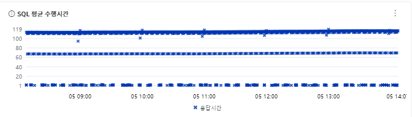

▶ \[그림9\] SQL 평균 수행시간 Scatter 차트

<table>
<tbody>
<tr class="odd">
<td>
노트

Scatter 차트는 최대 3시간 범위의 데이터만 표시되며 따라서 타임 셀렉터를 3시간 이상으로 설정하여도 조회 기간 중 가장 최근 3시간 범위의 데이터만 표시됩니다.
</td>
</tr>
</tbody>
</table>

Top SQL 목록

Top SQL목록은 4가지 기준(평균 수행시간, 평균 CPU시간, 평균 논리 읽기 수, 평균 물리 읽기 수)으로 기준 값이 큰 5개의 SQL을 각 지표 값과 함께 표시합니다. 표시되는 개수는 콤보 박스에서 선택(5개, 10개, 20개)가능하며 기준 지표도 콤보 박스에서 변경할 수 있습니다. 또한 목록 우측 상단 \[Top SQL 분석\] 버튼을 선택하여 “Top SQL 분석” 화면으로 이동할 수 있습니다. “SQL 성능 분석”에 대한 자세한 내용은 “SQL 성능 분석”절을 참조하세요.

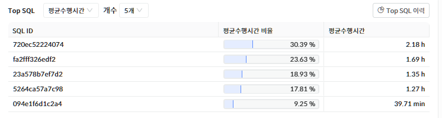

▶ \[그림10\] Top SQL 목록

CUBRID 메모리 성능

CUBRID에서 사용하는 메모리(캐시)관련 성능을 조회하는 화면입니다. 상단에 DB 사용 메모리 및 공유 메모리 현황을 도넛 차트로 표시합니다. 하단에는 메모리(캐시) 관련 주요 지표를 Stack Area 및 라인차트로 표시합니다.

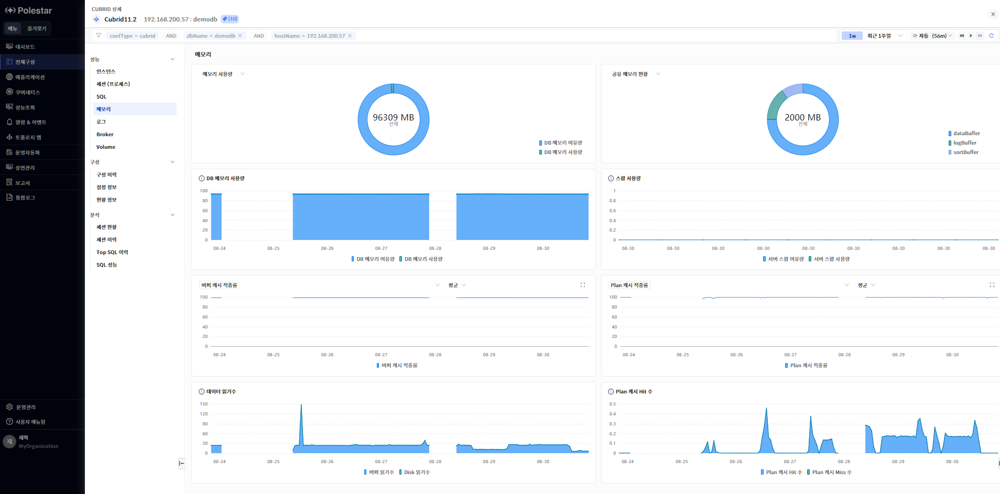

▶ \[그림11\] CUBRID 메모리 성능

멀티 지표 Stack Area 차트 및 라인 차트

CUBRID 메모리(캐시) 관련 주요 성능 지표(DB 메모리 사용량, 스왑 사용량, 버퍼 캐시 적중률, Plan 캐시 적중률, 데이터 읽기수, Plan 캐시 Hit수)를 Stack Area 차트 및 라인차트로 확인하여 해당 시점 각 주요항목별 이상이 없는 지 빠르게 확인할 수 있습니다.

<table>
<tbody>
<tr class="odd">
<td>
노트

한 차트에 지표는 최대 5개까지 추가 가능합니다. 차트는 마우스 드래그를 통해 특정 영역을 확대할 수 있으며 X축을 마우스 드래그 하여 시점 이동도 가능합니다.
</td>
</tr>
</tbody>
</table>

CUBRID 로그 성능

CUBRID 로그 관련 성능을 조회하는 화면입니다. Redo 로그 관련 주요 지표를 라인차트로 표시합니다.

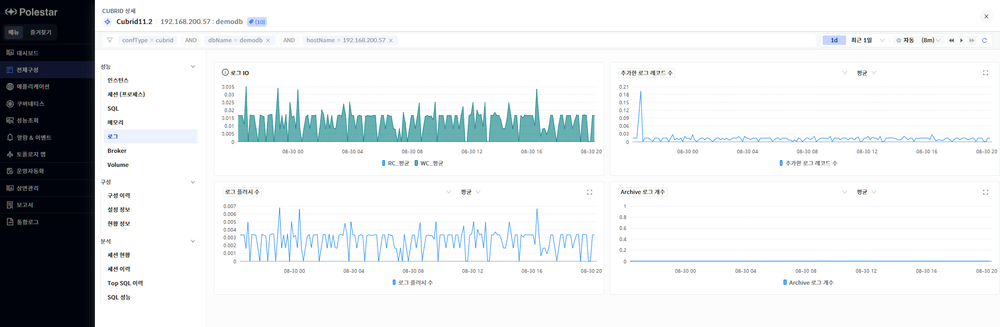

▶ \[그림12\] CUBRID 로그 성능

멀티 지표 라인 차트

CUBRID 로그 관련 주요 성능 지표(로그 io 추가한 로그 레코드 수, 로그 플러시 수, Archive 로그 개수)를 라인차트로 확인하여 해당 시점 각 주요항목별 이상이 없는 지 빠르게 확인할 수 있습니다.

<table>
<tbody>
<tr class="odd">
<td>
노트

한 차트에 지표는 최대 5개까지 추가 가능합니다. 차트는 마우스 드래그를 통해 특정 영역을 확대할 수 있으며 X축을 마우스 드래그 하여 시점 이동도 가능합니다.
</td>
</tr>
</tbody>
</table>

CUBRID Broker 성능

CUBRID Broker 관련 성능을 조회하는 화면입니다. CUBRID에 등록된 모든 활성 Broker의 성능을 한눈에 볼 수 있습니다. 상단에는 전체 Broker의 총 QPS와 총TPS를 라인차트로 표시하고 중단에는 QPS, TPS, 세션수, Job Queue수 기준으로 가장 높게 수행된 Top 5 Broker의 Stack Area 차트가 표시됩니다. 그리고 가장 하단에 전체 Broker 목록과 각 Broker의 요약 성능 값이 표시됩니다. 해당 Broker 목록에 가장 우측에 화살표 버튼을 클릭하면 해당 로우의 Broker에 대한 성능을 라인차트로 조회해 볼 수 있습니다.

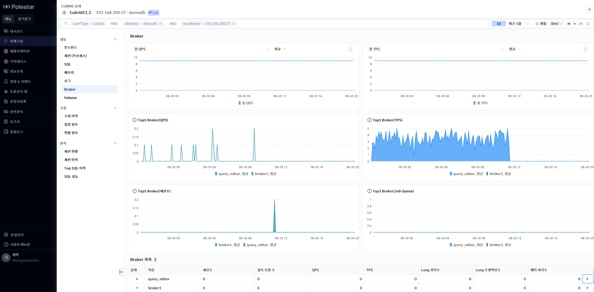

▶ \[그림13\] CUBRID Broker성능

Broker 목록

CUBRID 활성화된 전체 Broker의 성능 정보를 표시하는 목록입니다. 해당 목록을 통해 선택한 각 Broker의 요약 성능 값(QPS, TPS, Long 쿼리수, Error 쿼리수등)을 확인할 수 있습니다. 또한 해당 Broker 목록에 가장 우측에 화살표 버튼을 클릭하면 해당 로우의 Broker에 대한 성능을 라인차트로 조회해 볼 수 있습니다.

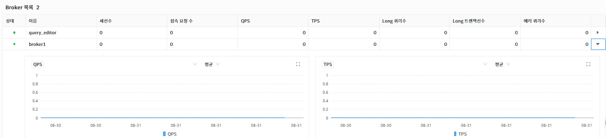

▶ \[그림14\] Broker 목록

> Broker 목록

| 세션수        | 현재 Broker에 연결된 총 세션(CAS) 수입니다.                             |
| ---------- | ---------------------------------------------------------- |
| 접속 요청수     | Broker에 접속 요청한 초당 횟수입니다.                                   |
| QPS        | Broker로 요청된 초당 쿼리 수입니다..                                   |
| TPS        | Broker로 요청된 초당 트랜잭션 수입니다.                                  |
| Long 쿼리수   | Broker에 설정된 Long 쿼리 시간(기본 60초)보다 오래 걸린 초당 쿼리 수를 표시합니다.     |
| Long 트랜잭션수 | Broker에 설정된 Long 트랜잭션 시간(기본 60초)보다 오래 걸린 초당 트랜잭션 수를 표시합니다. |
| 에러 쿼리수     | Broker로 요청한 쿼리 중 에러가 발생한 쿼리의 초당 에러 수를 표시합니다.               |

멀티 지표 라인 차트

CUBRID Broker 관련 주요 성능 지표(총 QPS, 총 TPS, 액티브 Broker 수)를 라인차트로 확인하여 해당 시점 각 주요항목별 이상이 없는 지 빠르게 확인할 수 있습니다.

<table>
<tbody>
<tr class="odd">
<td>
노트

한 차트에 지표는 최대 5개까지 추가 가능합니다. 차트는 마우스 드래그를 통해 특정 영역을 확대할 수 있으며 X축을 마우스 드래그 하여 시점 이동도 가능합니다.
</td>
</tr>
</tbody>
</table>

Top5 Broker 차트

CUBRID Broker의 성능(QPS, TPS, 세션수, Job Queue)별 Top 5 Broker의 성능을 Stack Area 차트로 표시합니다.

CUBRID Volume 성능

CUBRID Volume 관련 성능을 조회하는 화면입니다. CUBRID Volume을 Permanent와 Temp별, TABLE, INDEX등 기능별로 총 크기 및 사용량을 한눈에 볼 수 있습니다. 또한 Archive로그와 Active로그 설정량 추이도 확인할 수 있습니다.

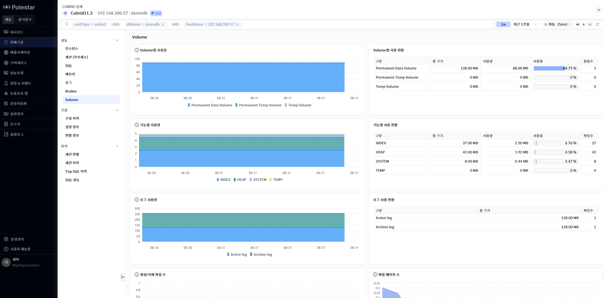

▶ \[그림15\] CUBRID Volume성능

Volume별 사용 현황 목록

CUBRID Volume을 영구 볼륨과 임시 볼륨 기준으로 구분하여 총 크기, 사용량, 볼륨수 정보를 표시합니다.

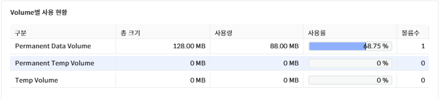

▶ \[그림16\] Volume별 사용 현황 목록

기능별 사용 현황 목록

CUBRID Volume을 기능별로 구분하여 총 크기, 사용량, 파일수 정보를 표시합니다.

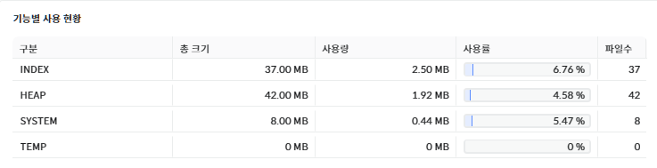

▶ \[그림17\] 기능별 사용 현황 목록

로그 사용 현황 목록

CUBRID 로그 파일의 총 크기, 파일수 정보를 표시합니다.

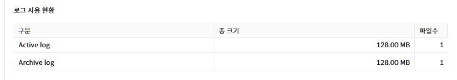

▶ \[그림18\] 로그 사용 현황 목록

멀티 지표 Stack Area 차트

CUBRID Volume 관련 성능 지표(생성/삭제 파일수, 파일읽기수, 파일 동기화수, 파일 쓰기수)를 Stack Area차트로 표시하여 해당 시점 각 주요항목별 이상이 없는 지 빠르게 확인할 수 있습니다.

CUBRID 구성

CUBRID 구성 메뉴는 구성이력, 설정정보, 현황정보로 구성 되어있습니다. 구성 이력에서는 CUBIRD 환경변수, 사용자목록, 테이블 목록 등 구성정보를 확인하고 변경이력을 비교 조회할 수 있으며 설정 정보에서는 현재 설정된 CUBIRD접속 정보나 담당자, 수집 조건 등 변경할 수 있습니다. 그리고 현황정보에서는 현재 시점의 환경변수, Broker 요약, Broker Status, Volume목록을 확인하실 수 있습니다.

<table>
<tbody>
<tr class="odd">
<td>
노트

현황정보의 경우 대상 CUBRID에 현재 시점 성능 정보를 수집해서 표시합니다. 따라서 CUBRID가 다운된 경우는 표시되지 않습니다.
</td>
</tr>
</tbody>
</table>

CUBRID 구성 이력

구성 이력화면은 크게 CUBRID과 Broker, Volume 3개의 탭으로 구분하여 표시합니다. 화면 구성은 상단에 구성 변경 현황 바차트가 표시되어 타임 셀렉터 기간내에 변경이 발생된 구성 변경 개수를 표시해줍니다. 이를 통해 구성이 변경된 시점을 쉽게 파악할 수 있습니다. 하단에는 현재 시점의 구성 정보가 표시됩니다. 구성 이력화면에서는 현재 시점의 구성 정보와 과거 구성 정보를 비교해 볼 수 있는 기능을 제공합니다. 자세한 내용은 ”구성 이력 조회 방법”절을 참고하세요.

CUBRID 탭

CUBRID 탭에서는 CUBRID 접속 정보, 버전, 환경 변수등의 구성정보를 조회하거나 과거 이력과 비교할 수 있습니다.

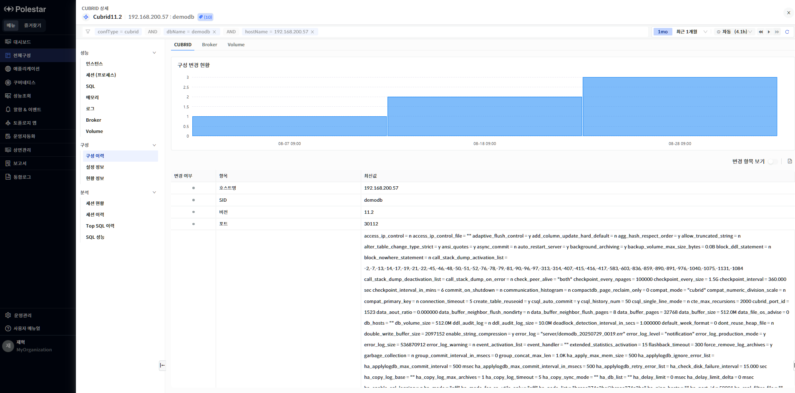

▶ \[그림19\] CUBRID 구성 탭

> CUBRID 구성 지표

<table>
<thead>
<tr class="header">
<th>호스트명</th>
<th>CUBRID 등록 시 입력한 IP (예: 192.168.232.56)</th>
</tr>
</thead>
<tbody>
<tr class="odd">
<td>SID</td>
<td>CUBRID 등록 데이터베이스 명 (예: demodb)</td>
</tr>
<tr class="even">
<td>버전</td>
<td>CUBRID 버전(예: 11.2)</td>
</tr>
<tr class="odd">
<td>포트</td>
<td>CUBRID 데이터베이스(Broker) 접속 포트(예: 33000)</td>
</tr>
<tr class="even">
<td>환경변수</td>
<td>
CUBRID 환경 변수를 “변수명 = 값”으로 표시

(예: max_clients = 100

data_buffer_size = 512

sort_buffer_size = 2)

예시 설명

변수명(max_clients) = 값(100)으로 표시
</td>
</tr>
</tbody>
</table>

Broker 탭

Broker 탭에서는 개별 Broker별 구성 정보를 확인하고 이력 비교해 볼 수 있습니다.

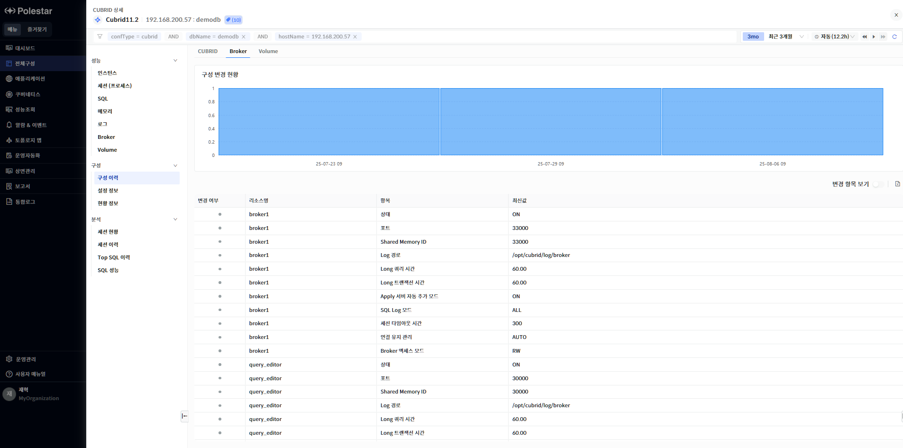

▶ \[그림20\] Broker 구성 탭

> Broker 구성

| 상태                | Broker의 상태(ON, OFF) (예: ON)                            |
| ----------------- | ------------------------------------------------------ |
| 포트                | Broker 접속 포트 (예: 33000)                                |
| Shared Memory ID  | Broker에 할당된 공유 메모리의 ID (예: 33000)                      |
| Log 경로            | Broker 로그 파일이 생성 되는 디렉토리 경로(예: /opt/cubrid/log/broker) |
| Long 쿼리 시간        | Broker에 설정된 Long 쿼리 기준 시간(초) (예: 60.00)                |
| Long 트랜잭션 시간      | Broker에 설정된 Long 트랜잭션 기준 시간(초) (예: 60.00)              |
| Apply 서버 자동 추가 여부 | Apply 서버에 자동 추가되지 여부(예: ON)                            |
| SQL Log 모드        | SQL Log를 기록을 위한 모드(예: ALL)                             |
| 세션 타임아웃 시간        | IDLE한 세션에 대한 타입 아웃 시간(초) (예: 300)                      |
| 연결 유지 관리          | Broker의 연결 유지 관리 설정(예: AUTO, MANUAL)                   |
| Broker 액세스 모드     | Broker의 읽기 쓰기 모드(예: RW)                                |

Volume 탭

Volume 탭에서는 개별 Volume별 구성 정보를 확인하고 이력 비교해 볼 수 있습니다.

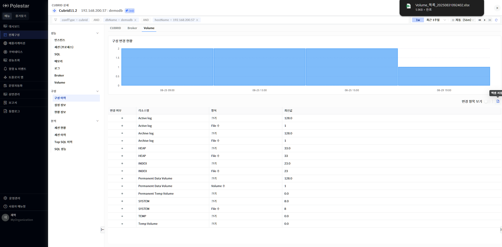

▶ \[그림21\] Volume 구성 탭

> Volume구성

| 크기       | Volume 또는 로그의 크기 (예: 128.0)                            |
| -------- | ------------------------------------------------------ |
| Volume 수 | 리소스명이 Volume인 경우 Volume의 수 (예: 5)                      |
| File 수   | 리소스명이 Log, HEAP, INDEX, SYSTEM, TEMP인 경우 File수 (예: 25) |

구성 변경 이력 조회

구성 이력화면은 CUBRID의 현재 구성과 과거 구성 값을 항목별로 비교하여 변경 여부를 확인할 수 있는 기능을 제공합니다. 이를 통해 과거 구성 값이 현재 어떻게 변경되었는지 확인이 가능합니다. 또한 비교 목록 우측 상단에 변경 항목 보기 토글 버튼을 클릭하면 변경이 발생된 항목만 표시하여 빠르게 변경 항목 확인이 가능합니다.

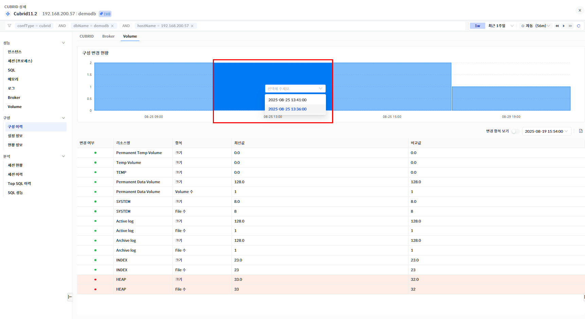

▶ \[그림21\] 구성 변경 이력 조회

> 구성 변경 이력 조회 절차

1.  구성 변경 현황 바 차트에서 비교하고자 하는 시점의 바를 클릭

2.  팝업으로 표시된 콤보 박스에서 비교하고자 하는 일자 선택

3.  하단 목록에 항목별로 최신 값과 비교 값이 표시되고 변경된 항목은 변경여부 컬럼에 빨간색으로 표시됨

4.  목록 상단에 변경 항목 보기 토글 버튼을 클릭하면 변경된 항목만 목록에 표시됨

5.  목록 상단에 날자 선택 콤보 박스에서 비교 날짜를 선택하여도 목록에 비교날짜에 해당하는 값이 비교 값에 표시되어 비교할 수 있음

엑셀 저장

구성 목록 우측 상단 \[엑셀 저장\] 버튼을 통해 세션 목록을 엑셀로 저장할 수 있습니다.

▶ \[그림22\] 구성 목록 엑셀 저장

> 구성 목록 엑셀 저장 및 조회 절차

1.  구성에서 우측 상단 엑셀 저장 아이콘 클릭

2.  브라우저 우측 상단 창에 저장된 엑셀 파일명이 표시됨

3.  해당 파일명을 클릭하여 엑셀 파일 확인

CUBRID 설정 정보

설정 정보 화면은 CUBRID에 설정한 기본 접속 정보와 상세정보(세션 이력 수집 여, 세션 이력 수집 주기) 관리 상태, 해당 CUBRID에 대한 역할별 권한 설정, 담당자 설정을 할 수 있는 화면입니다. 부가적으로 CUBRID에 설정되어 있는 알람 정보(알람 정책 및 알람 개수), 수집 정책, 성능/구성 최근 수집 시간을 확인할 수 있습니다.

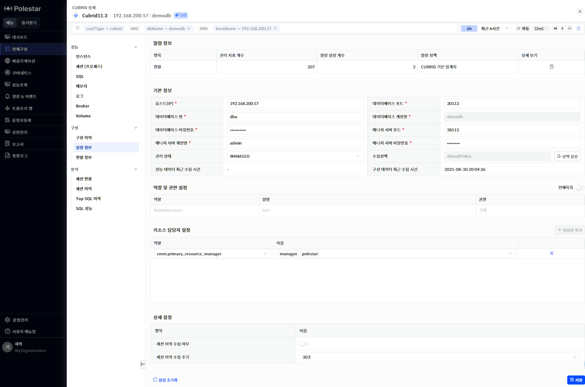

▶ \[그림23\] CUBRID 설정 정보

알람 정보

CUBRID에서 수집하는 관리 지표 개수와 현재 설정된 알람 개수 및 알람 정책 정보를 제공합니다. \[상세보기\]를 선택하여 알람 상세 드로어에서 알람 정책의 세부 알람 설정 목록을 확인할 수 있습니다.

<table>
<tbody>
<tr class="odd">
<td>
노트

세부 알람 설정은 [알람 &amp; 이벤트] 메뉴에서 변경할 수 있습니다. 자세한 내용은 ‘알람 상세’ 매뉴얼을 참고하시기 바랍니다.
</td>
</tr>
</tbody>
</table>

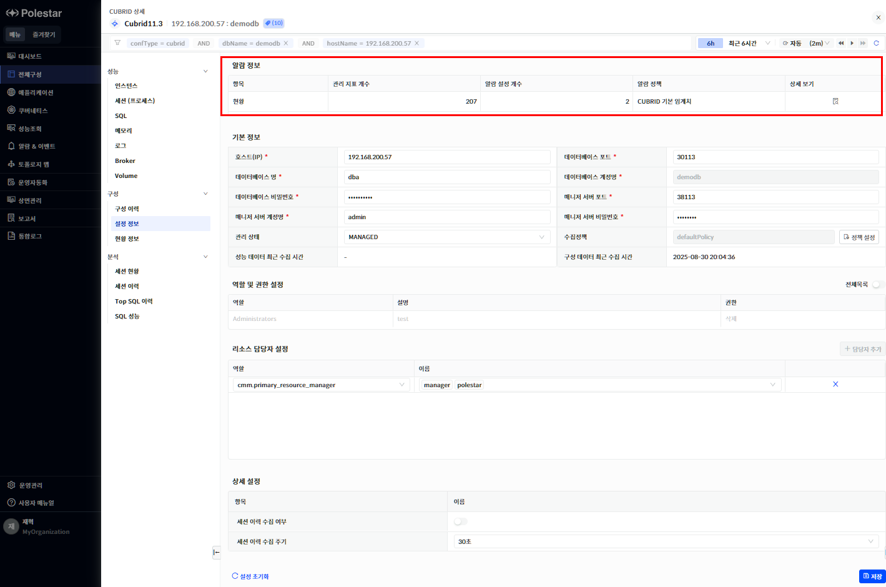

▶ \[그림24\] 알람 정보

▶ \[그림25\] 알람 정책 목록

> 알람 정책 목록

| 관리 지표 개수 | POLESTAR에서 관리하는 성능 지표 개수를 표시합니다.         |
| -------- | ---------------------------------------- |
| 알람 설정 개수 | CUBRID에 설정된 알람 개수를 표시합니다..               |
| 알람 정책    | CUBRID에 설정된 알람 정책을 표시합니다.                |
| 상세 보기    | 알람 정책의 세부 알람 설정 목록을 확인할 수 있는 드로어를 호출합니다. |

기본 정보

CUBRID의 기본 정보를 표시합니다. ‘IP’, ‘포트번호’, ‘연결명’, ‘비밀번호’ 등의 항목을 변경할 수 있습니다.

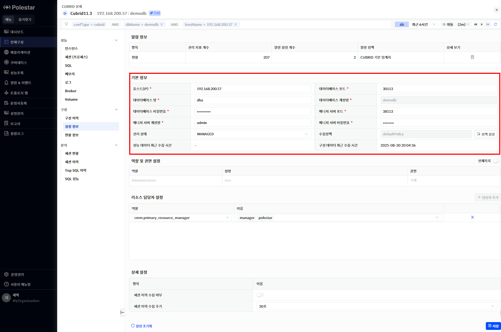

▶ \[그림26\] 기본 정보

> 기본 정보

| 호스트(IP)         | CUBRID의 IP입니다.                                                                                                       |
| --------------- | -------------------------------------------------------------------------------------------------------------------- |
| 데이터베이스 포트       | CUBRID 데이터베이스의 연결 포트입니다. 해당 포트는 Broker 포트이기도 하며 이 포트에 연결된 Broker를 등록하는 데이터베이스의 기본 Broker로 설정합니다.                     |
| 데이터베이스 명        | CUBRID 데이터베이스명입니다. 데이터베이스명은 수정할 수 없습니다.                                                                              |
| 데이터베이스 계정명      | 데이터베이스에 접속하는 계정명입니다. 해당 계정을 이용하여 트랜잭션 정보 등을 조회해 옵니다. 따라서 해당 계정에 CUBRID 성능 정보를 모니터링 할 수 있도록 monitor 권한이 부여되어 있어야 합니다. |
| 데이터베이스 비밀번호     | 데이터베이스에 접속하는 계정의 비밀번호입니다.                                                                                            |
| 매니저 서버 포트       | 매니저 서버 포트 값입니다.                                                                                                      |
| 매니저 서버 계정명      | 매니저 서버 계정명입니다. 매니저 서버 계정은 가능하면 admin 계정 외에 신규 계정을 권장하며 역시 성능 정보를 모니터링 할 수 있도록 monitor 권한이 부여되어 있어야 합니다.              |
| 매니저 서버 비밀번호     | 매니저 서버 계정의 비밀번호입니다.                                                                                                  |
| 관리 상태           | 대상 CUBRID의 관리 상태입니다. (관리함: MANAGED, 관리 안함: UNMANAGED)                                                                |
| 수집 정책           | CUBRID의 수집 정책입니다. 우측 정책 설정 버튼을 클릭하여 대상 CUBRID의 지표 별 수집 정책을 설정할 수 있습니다. 상세한 내용은 “정책 설정”절을 참조하세요.                      |
| 성능 데이터 최근 수집 시간 | CUBRID 성능 데이터를 수집한 가장 최근 시간을 표시합니다. 즉시 실행 버튼을 클릭하여 성능 데이터 수집을 즉시 실행하실 수 있습니다.                                        |
| 구성 데이터 최근 수집 시간 | CUBRID 구성 데이터를 수집한 가장 최근 시간을 표시합니다. 즉시 실행 버튼을 클릭하여 구성데이터 수집을 즉시 실행하실 수 있습니다.                                         |

정책 설정

기본 정보 목록에서 \[정책 설정\] 버튼은 클릭하여 CUBRID에 설정된 데이터 수집 정책의 세부 설정을 목록을 조회할 수 있고, 설정을 변경하거나 변경된 설정을 수집 정책의 기본값으로 초기화할 수 있습니다. 데이터 수집 정책 설정 방법에 대한 자세한 내용은 ‘데이터수집설정’ 매뉴얼을 참조하시기 바랍니다.

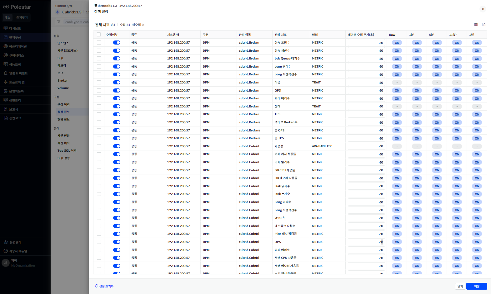

▶ \[그림27\] 기본 정보 – 정책 설정

> 정책 설정 목록

<table>
<thead>
<tr class="header">
<th>수집여부</th>
<th>
지표별 성능 데이터 수집 여부를 설정합니다.

기본적으로 POLESTAR에서 지원하는 모든 지표를 수집하도록 설정 되어있으며, 수집 여부 변경 시 해당 지표는 더 이상 POLESTAR에서 처리하지 않습니다.

: 수집 지표

: 미수집 지표
</th>
</tr>
</thead>
<tbody>
<tr class="odd">
<td>종류</td>
<td>
지표 설정 종류를 표시합니다. 기본값은 ‘COMMON’이며, 세부 설정을 변경한 경우 ‘CUSTOM’으로 표시됩니다.

COMMON: 공통 설정, 관리지표 공통 설정의 지표 설정을 동일하게 사용하는 경우

CUSTOM: 개별 설정, 관리지표 공통 설정의 지표 설정을 변경해서 사용하는 경우
</td>
</tr>
<tr class="even">
<td>시스템 명</td>
<td>CUBRID클의 호스트명 또는 IP를 표시합니다.</td>
</tr>
<tr class="odd">
<td>구분</td>
<td>POLESTAR에서 관제하는 제품군을 표시합니다.</td>
</tr>
<tr class="even">
<td>관리 항목</td>
<td>지표 그룹을 표시합니다.</td>
</tr>
<tr class="odd">
<td>관리 지표</td>
<td>지표명을 표시합니다.</td>
</tr>
<tr class="even">
<td>타입</td>
<td>
지표의 데이터 타입을 표시합니다.

AVAILABILITY: 가용성 데이터

TRAIT: 문자열 데이터

METRIC: 수치 데이터

TABULAR: 목록형 데이터
</td>
</tr>
<tr class="odd">
<td>데이터 수집 주기</td>
<td>
지표 별 데이터 수집 주기를 표시합니다.

모든 지표는 기본 60초 주기로 설정되어 있습니다. 데이터 수집 주기는 관리 항목별로 공통 적용되기 때문에 특정 지표의 데이터 수집 주기를 변경하면 해당 지표와 관리 항목이 동일한 모든 지표의 데이터 수집 주기가 일괄 업데이트 됩니다.
</td>
</tr>
<tr class="even">
<td>통계 데이터</td>
<td>
METRIC 데이터의 주기 별 통계 데이터 저장 여부를 설정합니다.

POLESTAR는 1분, 5분, 1시간, 1일 주기의 통계 데이터를 제공합니다.

통계 저장 여부는 METRIC 데이터에 대해서만 설정할 수 있으며, 데이터 수집 주기가 통계 주기보다 긴 경우만 통계 저장을 지원합니다.

<ul>
<li>
: 통계 데이터 저장
</li>
</ul>
<ul>
<li>
: 통계 데이터 저장 안함
</li>
</ul></td>
</tr>
</tbody>
</table>

역할 및 권한 설정

CUBRID에 대한 접근 권한을 조회하고 변경할 수 있습니다. Administrators 역할은 모든 장비에 기본으로 포함되어 있으며 해제할 수 없습니다.

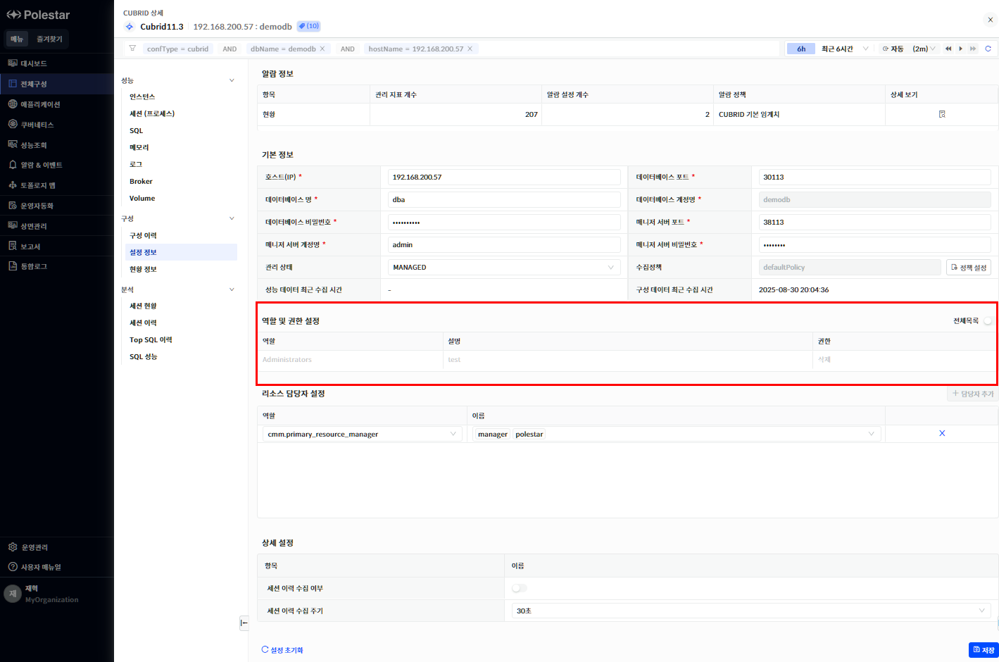

▶ \[그림28\] 역할 및 권한 설정

리소스 담당자 설정

CUBRID의 담당자를 설정할 수 있습니다. (‘담당자 추가’ 기능은 지원 예정입니다.)

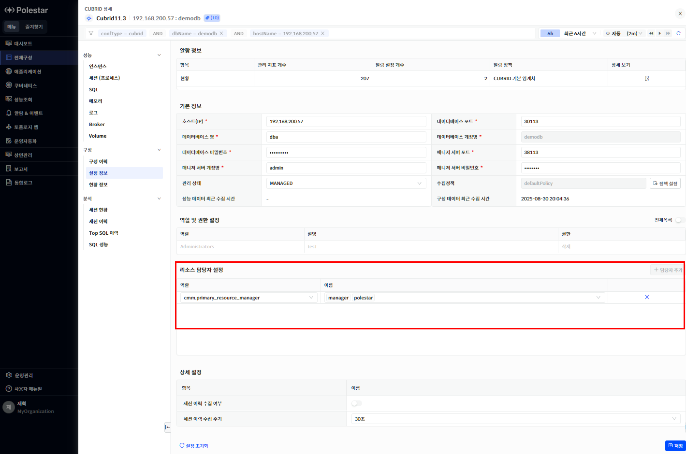

▶ \[그림29\] 리소스 담당자 설정

설정 초기화

설정 정보 화면 하단의 \[설정 초기화\] 버튼을 클릭하여 설정 정보 화면에서 변경했으나 아직 저장은 하지 않은 모든 입력 값을 처음 조회 상태로 되돌릴 수 있습니다.

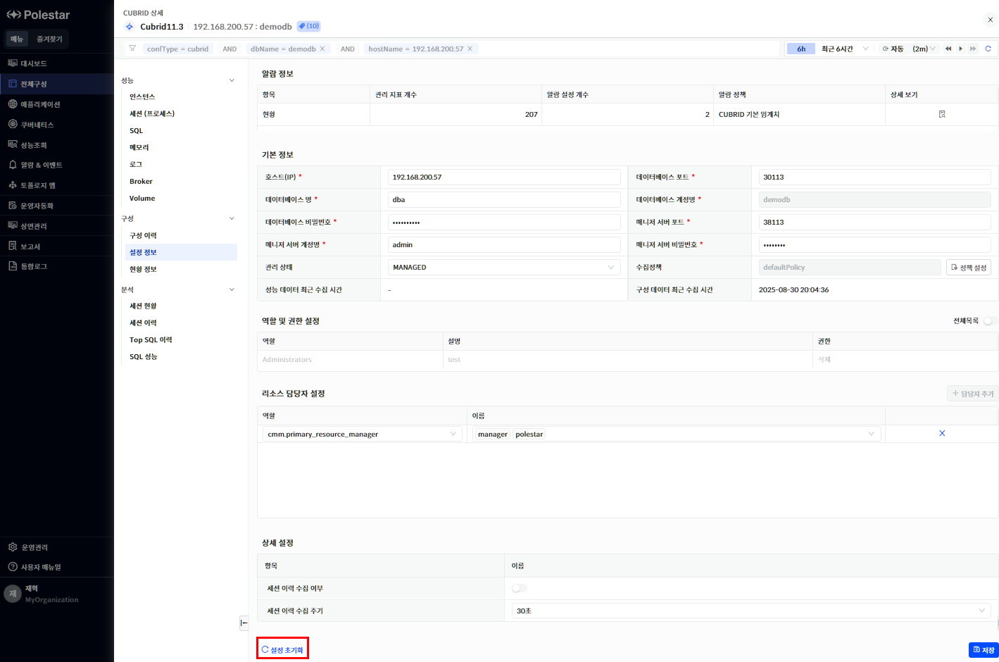

▶ \[그림30\] 설정 초기화

상세 설정

상세 설정을 통해 대상 CUBRID에 세션 이력 수집여부, 세션 이력 수집 주기를 설정할 수 있습니다.

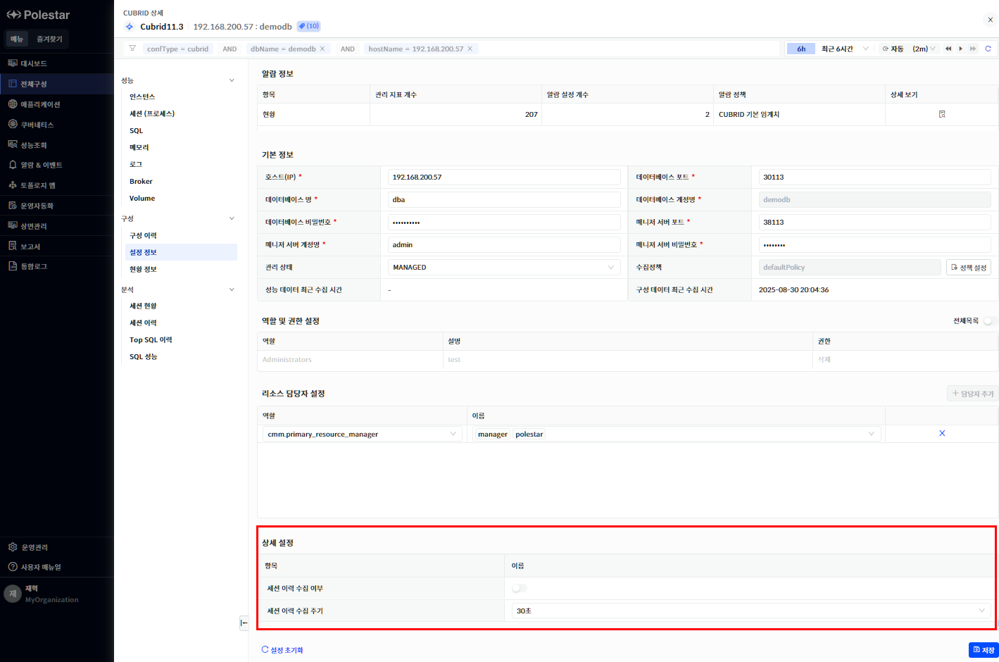

▶ \[그림31\] 상세 설정

> 상세 설정

| 세션 이력 수집 여부 | 세션 이력을 수집할 지 여부를 선택합니다. 세션 이력을 저장하면 세션 분석화면을 통해 세션 분석을 할 수 있습니다. 또한 Top SQL 이력 화면 및 SQL 성능 화면을 통해 SQL 관련 성능 분석도 할 수 있습니다. |
| ----------- | ------------------------------------------------------------------------------------------------------------------------- |
| 세션 이력 수집 주기 | 세션 이력을 수집하는 주기입니다. 기본값은 10초이고 콤보 박스에서 5초, 10초 20초, 30초, 60초, 120초, 300초, 600초 중 하나를 선택해서 설정 할 수 있습니다.                     |

<table>
<tbody>
<tr class="odd">
<td>
노트

관제 대상 데이터베이스 모니터링을 위해 최소한의 부하만으로 가용성 및 성능 모니터링만 필요하다면 세션 이력 수집 여부를 “아니오”로 설정하여 대상 장비 모니터링을 위해 수행되는 호출 부하를 줄일 수 있습니다.
</td>
</tr>
</tbody>
</table>

CUBRID 구성 현황 정보

구성 현황 정보화면에서는 현재 시점의 CUBRID 환경 변수, Broker 요약, Broker Status, Volume 정보를 제공합니다. 해당 화면을 통해 조회하고자 하는 환경 변수를 목록 검색으로 빠르게 찾아볼 수 있으며 Broker의 현재 상태 및 성능 정보, Volume 사용 현황을 쉽게 파악할 수 있습니다.

<table>
<tbody>
<tr class="odd">
<td>
노트

구성 현황 값은 CUBRID의 현재 값을 조회하기 위해 화면 조회 시 대상 CUBRID에 직접 명령을 수행하여 조회해 옵니다. 따라서 CUBRID가 다운된 상태에서는 조회할 수 없습니다. 다운된 상태에서는 구성 이력 화면에서 요약된 구성 정보만 확인하실 수 있습니다.
</td>
</tr>
</tbody>
</table>

환경 변수

CUBRID에 설정된 환경 변수 현재값 및 해당 변수의 카테고리, 상태값, 기본값, 최소값, 최대값을 볼 수 있는 화면입니다.

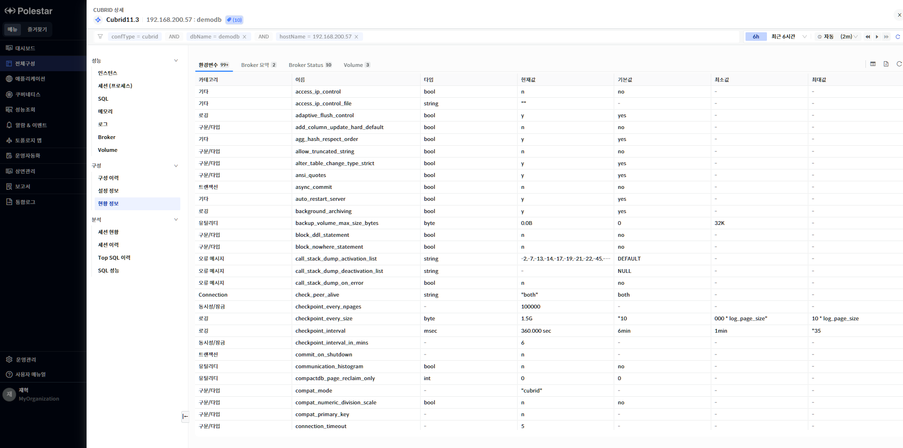

▶ \[그림32\] CUBRID 환경 변수 정보

> 환경 변수 목록

| 카테고리 | 환경 변수의 카테고리 입니다.          |
| ---- | ------------------------- |
| 이름   | 환경 변수 이름입니다.              |
| 타입   | 환경 변수의 타입입니다.             |
| 현재값  | 환경 변수에 현재 설정되어 있는 값입니다.   |
| 기본값  | 환경 변수 처음 기본값입니다.          |
| 최소값  | 해당 환경변수에 설정할 수 있는 최소값입니다. |
| 최대값  | 해당 환경번수에 설정할 수 있는 최대값입니다. |

Broker 요약

CUBRID에 설정되어 있는 Broker에 대한 상태 및 성능 정보를 조회할 수 있는 화면입니다.

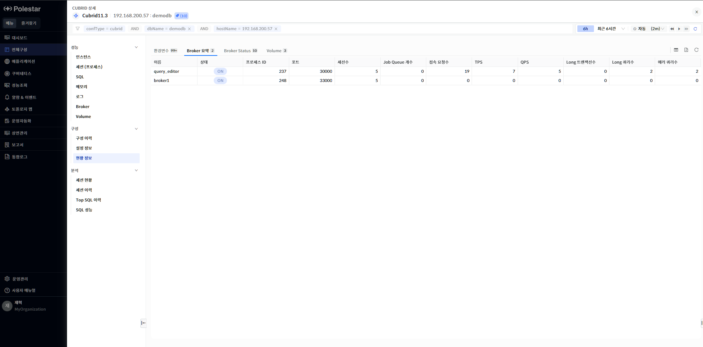

▶ \[그림33\] CUBRID Broker 요약 정보

> Broker 요약 목록

<table>
<thead>
<tr class="header">
<th>이름</th>
<th>Broker 이름입니다.</th>
</tr>
</thead>
<tbody>
<tr class="odd">
<td>Broker 상태</td>
<td>
Broker 상태입니다.

ON: 현재 Broker가 정상적으로 활성화되어 있는 상태입니다.

OFF: 현재 Broker가 비활성화 되어 있는 상태입니다.
</td>
</tr>
<tr class="even">
<td>프로세스 ID</td>
<td>Broker 프로세스의 ID입니다.</td>
</tr>
<tr class="odd">
<td>포트</td>
<td>Broker 접속 포트입니다.</td>
</tr>
<tr class="even">
<td>세션수</td>
<td>대상 Broker에 접속된 세션(CAS) 수입니다.</td>
</tr>
<tr class="odd">
<td>Job Queue개수</td>
<td>대상 Broker Job Queue에 대기중인 요청 개수입니다. 이 값이 0이 아니면 Broker 요청이 외 대기 되는지 분석해 볼 필요가 있습니다.</td>
</tr>
<tr class="even">
<td>접속 요청수</td>
<td>대상 Broker에 연결을 요청한 요청 수입니다.</td>
</tr>
<tr class="odd">
<td>TPS</td>
<td>대상 Broker로 요청된 초당 트랜잭션 수의 누적 값입니다.</td>
</tr>
<tr class="even">
<td>QPS</td>
<td>대상 Broker로 요청된 초당 쿼리 수의 누적 값입니다.</td>
</tr>
<tr class="odd">
<td>Long 트랜잭션수</td>
<td>대상 브로커에 요청된 트랜잭션 중 길게 수행된 트랜잭션 수입니다. 길게 수행된 기준은 Long 트랜잭션 기준 시간 컬럼의 값입니다.</td>
</tr>
<tr class="even">
<td>Long 쿼리수</td>
<td>대상 브로커에 요청된 쿼리 중 길게 수행된 쿼리 수입니다. 길게 수행된 기준은 Long Query 기준 시간 컬럼의 값입니다.</td>
</tr>
<tr class="odd">
<td>에러 쿼리수</td>
<td>대상 브로커에 요청된 쿼리 중 에러가 발생한 쿼리의 수입니다.</td>
</tr>
<tr class="even">
<td>Shared Memory ID</td>
<td>대상 Broker의 공유 메모리 ID값입니다.</td>
</tr>
<tr class="odd">
<td>로그 위치</td>
<td>대상 Broker의 로그 파일이 생성되는 디렉토리 위치입니다.</td>
</tr>
<tr class="even">
<td>Long Query 기준 시간</td>
<td>Long 쿼리의 기준 시간입니다. 단위는 초입니다.</td>
</tr>
<tr class="odd">
<td>Long 트랜잭션 기준 시간</td>
<td>Long 트랜잭션의 기준 시간입니다. 단위는 초입니다.</td>
</tr>
</tbody>
</table>

Broker Status

CUBRID에서 제공되는 Broker Status 명령의 결과와 유사한 Broker 상세 접속 정보를 조회하는 화면입니다.

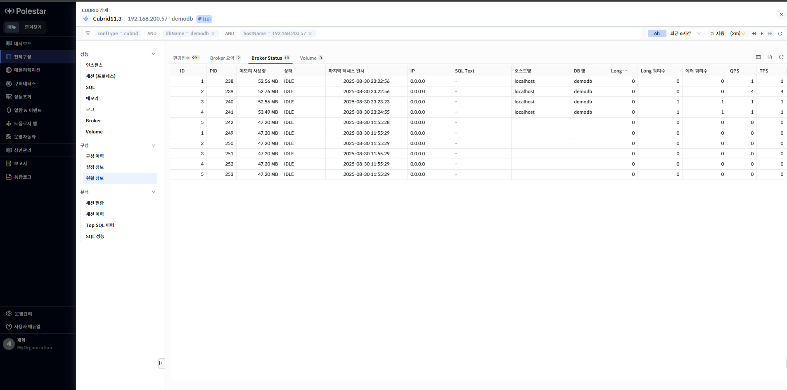

▶ \[그림34\] CUBRID Broker Status 목록

> Broker Status 목록

| ID         | Broker에 접속된 세션(CAS)의 ID값입니다.          |
| ---------- | ------------------------------------- |
| PID        | Broker에 접속된 세션(CAS) 프로세스 ID값입니다.      |
| 메모리사용량     | 해당 세션(CAS)의 메모리 사용량입니다.               |
| 상태         | 해당 세션(CAS)의 상태입니다.                    |
| 마지막 액세스 일시 | 해당 세션(CAS)에 마지막으로 요청된 일시입니다.          |
| IP         | 해당 세션(CAS)의 요청 IP 정보입니다.              |
| SQL Text   | 해당 세션(CAS)에 쿼리 요청이 있다면 해당 쿼리문이 표시됩니다. |
| 호스트명       | 해당 세션(CAS)의 호스트명입니다.                  |
| DB명        | 해당 세션(CAS)가 접속한 데이터베이스명입니다.           |
| Long 트랜잭션수 | 해당 세션(CAS)에서 발생된 Long 트랜잭션 수입니다.      |
| Long 쿼리수   | 해당 세션(CAS)에서 발생된 Long 쿼리 수입니다.        |
| 에러 쿼리수     | 해당 세션(CAS)에서 발생된 에러 쿼리 수입니다.          |
| QPS        | 해당 세션(CAS)의 초당 쿼리 수입니다.               |
| TPS        | 해당 세션(CAS)의 초당 트랜잭션 수입니다.             |
| 생성일시       | 해당 세션(CAS)가 생성된 일시입니다.                |

Volume

CUBRID에 생성된 Volume관련 파일 목록을 조회할 수 있는 화면입니다. 해당 화면을 통해 볼륨 파일의 유형, 사용량, 볼륨 경로 등의 정보를 확인할 수 있습니다.

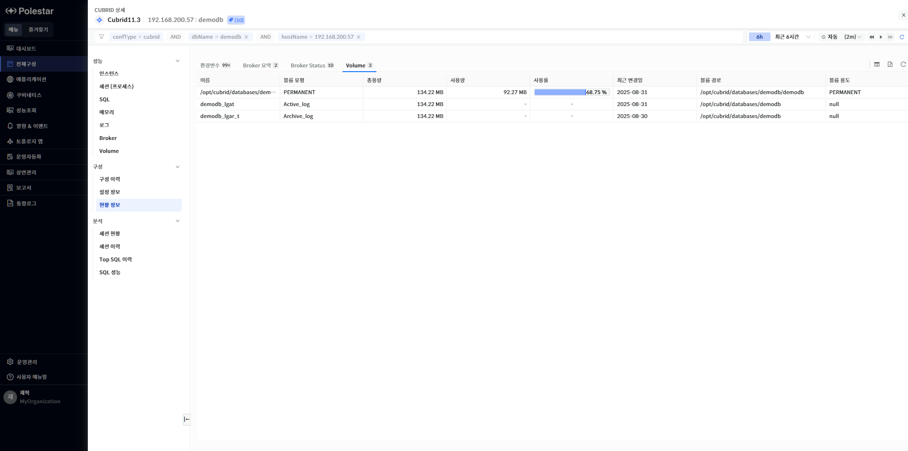

▶ \[그림35\] CUBRID Volume 목록

> Volume 목록

| 이름     | 볼륨 파일의 이름입니다.             |
| ------ | ------------------------- |
| 볼륨 유형  | 볼륨 파일의 유형입니다.             |
| 총용량    | 볼륨의 총용량입니다.               |
| 사용량    | 볼륨 파일의 사용량입니다.            |
| 사용률    | 볼륨 파일의 총용량 대비 사용량의 비율입니다. |
| 최근 변경일 | 마지막으로 볼륨 파일을 변경한 일자입니다.   |
| 볼륨 경로  | 볼륨 파일의 디렉토리 경입니다.         |

CUBRID 분석

CUBRID 분석 기능은 세션 현황, 세션 이력, Top SQL 이력, SQL 성능 관련 4가지 분석 기능을 제공합니다. 세션 현황 분석을 통해 현재 수행중인 세션 중 부하가 발생된 쿼리나 Lock 세션등을 점검하고 문제되는 세션을 KILL하여 조치할 수 있습니다. 세션 이력 분석을 통해서는 CUBRID에 접속한 세션의 과거 수행 SQL, Lock 정보 등을 확인하고 분석할 수 있습니다. Top SQL 이력 분석을 통해서는 CUBRID에서 수행된 쿼리 중 수행시간이 느린 쿼리를 분석할 수 있습니다. 마지막으로 SQL 성능 분석을 통해서는 개별 SQL의 응답시간을 Scatter 차트로 한 눈에 살펴보면서 상세히 분석할 수 있습니다.

<table>
<tbody>
<tr class="odd">
<td>
노트

CUBRID 분석 화면에 표현되는 세션 이력 정보 및 수집 주기는 CUBRID 환경 설정에서 설정할 수 있습니다.
</td>
</tr>
</tbody>
</table>

CUBRID 세션 현황 분석

CUBRID에 현재 접속된 모든 세션 목록과 Lock 발생 현황을 표시해주는 화면입니다. 상단에 세션 사용률 및 세션 수 정보가 카드로 표시되고 그 다음으로 타입, 스키마, SQL별 세션 수를 도넛 차트로 표시합니다. 그리고 최하단에 상세 세션 목록 및 Lock 세션(Lock Tree) 목록이 표시됩니다.

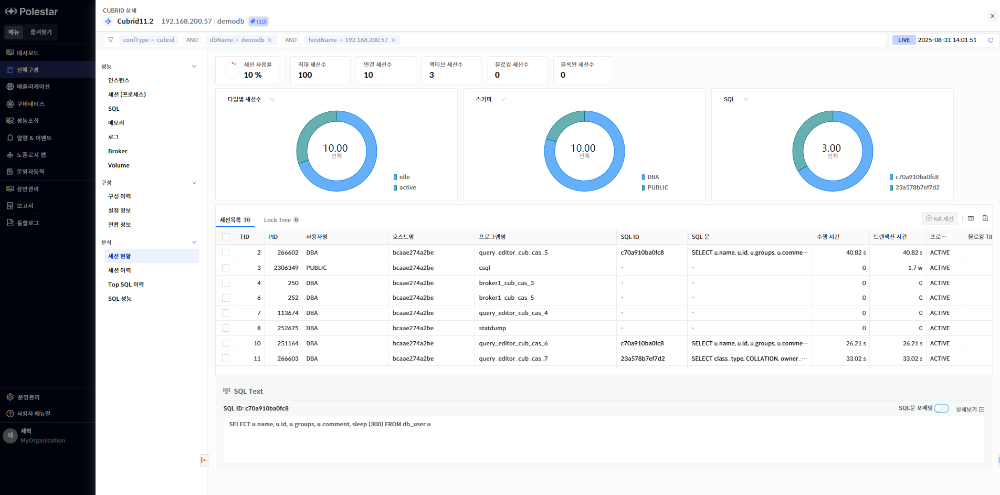

▶ \[그림36\] 세션 상세 현황

조회시간 및 화면 리프레시 버튼

화면 상단 우측 타임 셀렉터 부분에 현재 접속된 CUBRID 세션 목록의 조회 시점이 표시되며 리프레시() 아이콘을 통해 현재 시점의 CUBRID 세션 목록을 다시 조회해 올 수 있습니다.

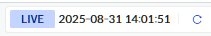

▶ \[그림37\] 조회시간 및 화면 리프레시 버튼

세션 사용률 및 세션수 현황

현재 시점 CUBRID 데이터베이스에 허용 가능 최대 세션수 및 연결 세션수, 세션 사용률, 액티브/블록/블로킹 세션수가 표시됩니다.

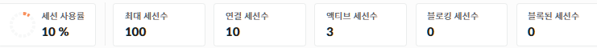

▶ \[그림38\] 세션 사용률 및 세션수 현황

카테고리별 세션 수 도넛 차트

5가지 카테고리(타입, 스키마, SQL, 호스트, 프로그램)별 세션 수에 대한 도넛 차트가 표시됩니다. 각 카테고리는 도넛 차트 좌측 상단의 콤보 박스를 통해 선택 가능하며 범례를 선택하면 해당 범례에 해당하는 세션수만 도넛차트와 세션목록, Lock Tree 목록에 표시됩니다. 도넛 차트 필터링 기능을 통해 특정 SQL이나 스키마 상태 등을 필터링하여 현재 접속된 세션 목록을 상세분석 하실 수 있습니다.

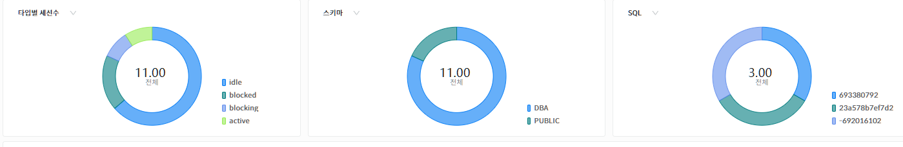

▶ \[그림39\] 카테고리별 세션 수 도넛 차트

세션 목록

현재 CUBRID에 접속된 모든 세션 목록이 표시됩니다. 해당 목록을 통해 어떤 사용자(스키마), 프로그램, 호스트가 접속했는지 확인할 수 있으며 세션의 상태(active, blocked, blocking 등) 및 수행중인 SQL, 수행시간, 트랜잭션 시간 등을 확인할 수 있습니다. 세션 목록은 추가로 하기와 같은 기능을 제공합니다.

제공 기능

1.  세션이 수행한 SQL Text 보여주는 기능

2.  세션이 수행한 SQL에 대한 상세 이력 조회 기능

3.  세션 상세 이력 조회 기능

4.  문제가 되는 세션을 종료(Kill)할 수 있는 기능

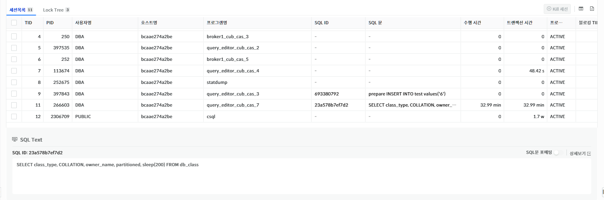

▶ \[그림40\] 세션 목록

> 세션 목록

<table>
<thead>
<tr class="header">
<th>TID</th>
<th>세션(트랜잭션)을 고유하게 식별하는 세션(트랜잭션) ID입니다. 각 세션은 고유한 TID를 가지며, 이를 통해 특정 세션(트랜잭션)을 추적할 수 있습니다. 세션 ID는 숫자로 표시됩니다.</th>
</tr>
</thead>
<tbody>
<tr class="odd">
<td>PID</td>
<td>세션(트랜잭션)의 프로세스 ID입니다.</td>
</tr>
<tr class="even">
<td>사용자명</td>
<td>세션이 현재 사용하고 있는 데이터베이스 사용자 이름입니다.</td>
</tr>
<tr class="odd">
<td>호스트명</td>
<td>데이터베이스에 연결된 클라이언트 호스트 명입니다. 클라이언트가 실행 중인 서버나 컴퓨터의 이름을 나타냅니다.</td>
</tr>
<tr class="even">
<td>프로그램명</td>
<td>데이터베이스에 연결된 클라이언트 프로그램의 이름입니다. 예를 들어, “csql”, “query_editor_cub_cas_1”등이 될 수 있습니다.</td>
</tr>
<tr class="odd">
<td>SQL ID</td>
<td>세션이 현재 실행 중인 SQL 문을 고유하게 식별하는 SQL ID입니다. 이는 특정 SQL 문을 추적하고 성능을 분석하는 데 유용합니다.</td>
</tr>
<tr class="even">
<td>SQL 문</td>
<td>SQL Text문이 표시됩니다.</td>
</tr>
<tr class="odd">
<td>수행시간</td>
<td>세션이 현재 SQL 문을 실행하는 데 걸린 시간이 표시됩니다.</td>
</tr>
<tr class="even">
<td>트랜잭션 시간</td>
<td>세션이 트랜잭션 상태이라면 해당 트랜잭션 상태의 지속 시간이 표시됩니다.</td>
</tr>
<tr class="odd">
<td>트랜잭션 상태</td>
<td>
세션의 트랜잭션 상태를 표시합니다.

트랜잭션 상태값 목록

ACTIVE: 활성

RECOVERY: 복구중인 트랜잭션

COMMITTED: 커밋 완료되어 종료될 트랜잭션

COMMITTING: 커밋중인 트랜잭션

ABORTED: 롤백되어 종료될 트랜잭션

KILLED: 서버에 의해 강제 종료 중인 트랜잭션
</td>
</tr>
<tr class="even">
<td>블로킹 TID</td>
<td>현재 세션을 블로킹하고 있는 세션의 TID입니다. 이는 잠금 경합 문제를 해결하는 데 중요한 정보를 제공합니다.</td>
</tr>
<tr class="odd">
<td>타입</td>
<td>세션의 타입을 나타냅니다. 타입은 총 4개의 카테고리(active, idle, blocking, blocked)로 되어 있습니다.</td>
</tr>
</tbody>
</table>

Lock Tree

CUBRID에 락 세션이 발생되면 Lock Tree 목록에서 해당 락 세션들을 확인할 수 있습니다. Lock Tree에서는 락을 유발한 세션(블로킹 세션)을 부모로 하고 해당 락으로 인해 블록 된 세션을 자식으로 하는 트리 형태로 목록을 표시합니다. 부모 락 세션을 기준으로 해당 트리를 접거나 펼쳐 볼 수 있으며 SQL ID 컬럼에 있는 SQL ID를 선택하면 하단에 해당 세션의 SQL을 표시합니다. SQL Text 창의 우측 상단에 SQL문 포메팅 토글 버튼을 통해 SQL을 포메팅 해서 볼 수 있습니다. 또 그 옆에 상세보기 버튼을 클릭하면 SQL Text 상세 드로어가 표시되며 해당 드로어 화면에서 SQL에 대한 상세 성능 이력 정보를 확인할 수 있습니다. 자세한 내용은 “개별 SQL 이력 보기(SQL Text 상세 드로어)”절을 참조하세요.

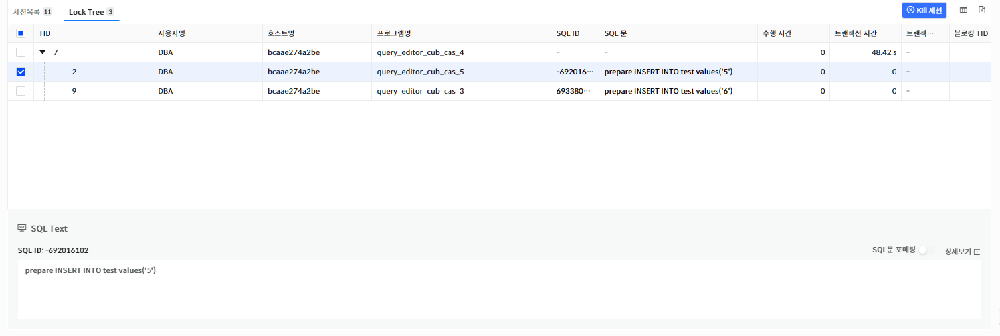

▶ \[그림41\] Lock Tree

> Lock Tree 목록

| TID     | 세션을 고유하게 식별하는 세션 ID입니다. 락을 유발한 세션을 부모로하여 해당 락으로 인해 블록 된 세션을 자식으로 하는 트리형태로 표시합니다.       |
| ------- | -------------------------------------------------------------------------------------- |
| 사용자명    | 세션이 현재 사용하고 있는 데이터베이스 사용자 이름입니다.                                                       |
| 호스트명    | 데이터베이스에 연결된 클라이언트 호스트 명입니다. 클라이언트가 실행 중인 서버나 컴퓨터의 이름을 나타냅니다.                           |
| 프로그램명   | 데이터베이스에 연결된 클라이언트 프로그램의 이름입니다. 예를 들어, “csql”, “query\_editor\_cub\_cas\_1”등이 될 수 있습니다. |
| SQL ID  | 세션이 현재 실행 중인 SQL 문을 고유하게 식별하는 SQL ID입니다. 이는 특정 SQL 문을 추적하고 성능을 분석하는 데 유용합니다.           |
| SQL 문   | SQL Text문이 표시됩니다.                                                                      |
| 수행시간    | 세션이 현재 SQL 문을 실행하는 데 걸린 시간이 표시됩니다.                                                     |
| 트랜잭션 시간 | 세션이 트랜잭션 상태이라면 해당 트랜잭션 상태의 지속 시간이 표시됩니다.                                               |
| 트랜잭션 상태 | 세션의 트랜잭션 상태를 표시합니다.                                                                    |
| 블로킹 TID | 현재 세션을 블로킹하고 있는 세션의 TID입니다. 이는 잠금 경합 문제를 해결하는 데 중요한 정보를 제공합니다.                         |
| 타입      | 세션의 타입을 나타냅니다. 타입은 총 4개의 카테고리(active, idle, blocking, blocked)로 되어 있습니다.               |

개별 세션 이력 조회(TID 드로어)

세션 목록의 TID 컬럼에서 특정 TID를 선택하면 선택한 세션에 대한 상세 이력을 조회할 수 있는 드로어 화면이 열립니다. 해당 화면을 선택한 세션이 과거에 수행한 SQL 및 세션 이력 정보를 상세 조회할 수 있습니다. 보다 상세한 내용은 “개별 세션 이력 조회”절을 참조하세요.

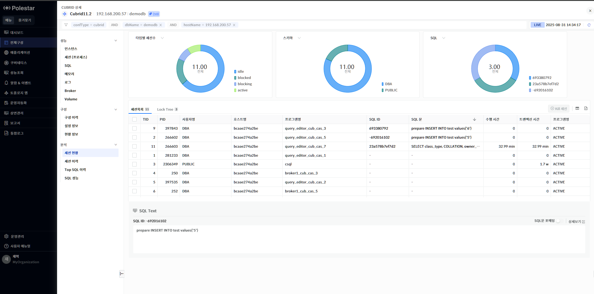

▶ \[그림42\] 세션목록에서 특정 TID 하나를 선택

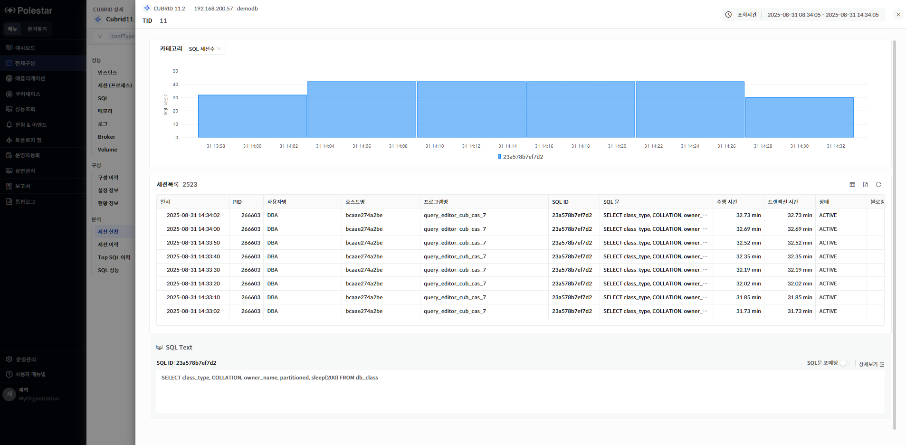

▶ \[그림43\] 선택한 TID에 대한 세션 이력 화면

> 개별 세션 이력 조회 절차

1.  세션목록에서 특정 TID 하나를 선택

2.  선택한 TID에 대한 세션 상세 이력 화면이 표시됨

세션 수행 SQL 조회

세션 목록의 SQL ID 컬럼에서 특정 SQL ID를 선택하면 선택한 SQL ID에 대한 SQL Text를 하단 SQL Text창에서 확인할 수 있습니다.

▶ \[그림44\] 선택한 SQL ID에 대한 SQL Text 표시 화면

> 세션 수행 SQL 조회 절차

1.  세션목록에서 특정 SQL ID를 선택

2.  하단 SQL Text 창에 선택한 SQL ID에 대한 SQL Text가 표시됨

개별 SQL 이력 조회(SQL Text 상세 드로어)

SQL Text 창의 우측 상세보기 버튼을 클릭하면 해당 SQL에 대한 상세 성능 이력 정보를 조회할 수 있는 드로어 화면이 나옵니다. 개별 SQL 이력 조회를 통해 해당 SQL의 과거 수행 이력 정보를 확인할 수 있습니다.

▶ \[그림45\] 개별 SQL 이력 조회 절차

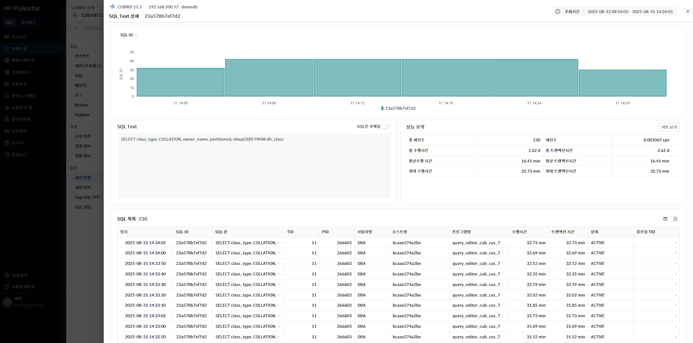

▶ \[그림46\] 개별 SQL에 대한 이력 화면

> 개별 SQL 이력 조회 절차

1.  세션목록에서 특정 SQL ID를 선택

2.  하단 SQL Text 창에 선택한 SQL ID에 대한 SQL Text가 표시됨

3.  SQL Text 우측 상단에 상세보기 버튼 클릭

4.  선택한 SQL에 대한 이력 조회 드로어 화면 표시

5.  좌측 상단 콤보 박스에서 SQL 세션수, 수행시간, 트랜잭션 시간을 선택하여 개별 SQL 성능 조회

<table>
<tbody>
<tr class="odd">
<td>
노트

SQL Text 상세 드로어 화면에서는 좌측 상단 콤보 박스에서 SQL 세션수, 수행시간, 트랜잭션 시간 항목을 선택하여 각 SQL이 수행한 세션 정보나 SQL 수행시간 이력 정보를 확인할 수 있습니다.
</td>
</tr>
</tbody>
</table>

<table>
<tbody>
<tr class="odd">
<td>
주의

SQL Text 상세 드로어 화면에서 좌측 상단 콤보 박스에 SQL 세션수나 수행시간항목은 해당 SQL에 대한 세션 이력 정보가 있을 때에만 표시됩니다.
</td>
</tr>
</tbody>
</table>

Kill 세션

세션 목록에서 종료하고자 하는 세션을 체크하고 Kill 세션 버튼을 클릭하면 해당 세션을 종료할 수 있습니다. 보통 락을 유발하는 세션을 종료하여 블록 된 세션들이 작업을 수행할 수 있도록 할 때 사용합니다. 단 문제가 없는 세션을 종료하지 않도록 주의할 필요가 있습니다.

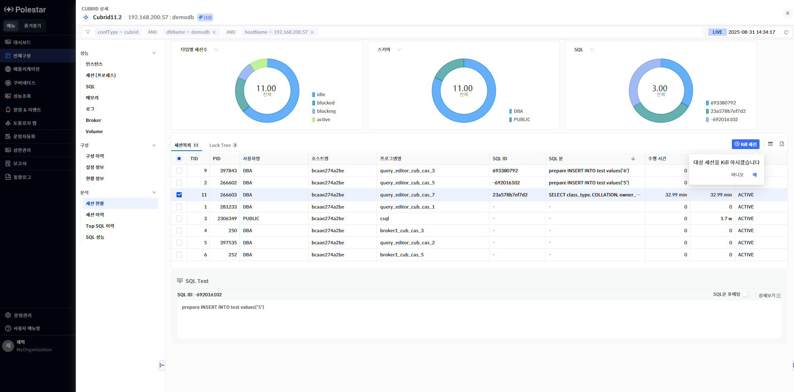

▶ \[그림47\] Kill 세션 절차

> 세션 Kill 절차

1.  세션목록에서 특정 세션을 선택

2.  세션목록 상단의 Kill 버튼을 클릭

3.  대상 세션을 Kill 하시겠습니까? 팝업 창에서 ‘예’ 선택

세션 이력 분석

세션 이력 분석 기능을 통해 CUBRID에 접속한 세션들에 대해 6가지 관점(SQL, 사용자, 호스트, 프로그램, 세션, Lock세션)으로 분석할 수 있습니다.

SQL탭

세션에서 수행된 SQL 관점으로 세션 수행 이력을 분석할 수 있는 화면입니다. 화면 구성은 상단에 해당 SQL을 수행한 세션수가 많은 순으로 표시하는 목록과 도넛 차트가 있고 그 밑으로 타임 셀렉터 기간 동안 SQL을 수행한 세션수를 누적 바차트로 표시합니다. 바 차트 밑으로는 상세 세션목록과 Lock Tree 목록이 표시되며 세션목록이나 Lock Tree에서 SQL ID나 SQL Text 컬럼을 클릭하면 하단에 해당 SQL에 대한 전체 SQL Text가 표시됩니다.

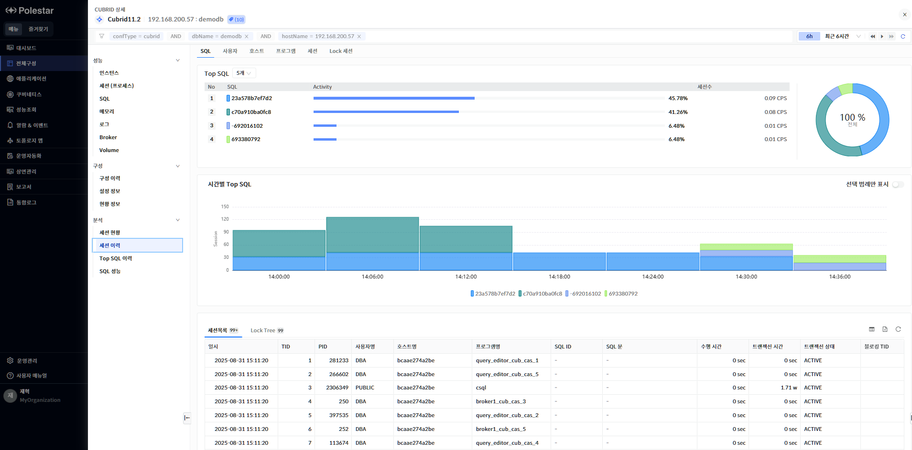

▶ \[그림48\] CUBRID 세션 이력\> SQL탭

SQL 목록

세션이 가장 많이 수행한SQL 순으로 목록이 표시되며 특정 SQL을 클릭하면 하단 바차트에 선택된 SQL이 하이라이트 처리되며 세션목록, Lock Tree에는 선택된 SQL을 수행한 세션만 표시됩니다.

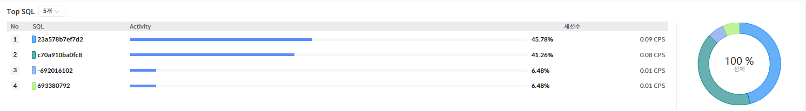

▶ \[그림49\] Top SQL 목록

> Top SQL 목록

| SQL      | SQL ID값입니다.                                                                                     |
| -------- | ----------------------------------------------------------------------------------------------- |
| Activity | 타임 셀렉터 기간동안 해당 SQL을 수행한 세션수의 비율입니다.                                                             |
| 세션수      | 타임 셀렉터 기간동안 해당 SQL을 수행한 세션수를 초당 개수로 표현한 값입니다. 예를 들어 3 CPS면 초당 3개의 세션이 해당 SQL을 수행했다고 해석할 수 있습니다. |

기간별 Top SQL(바차트)

타임 셀렉터 기간에 해당하는 SQL별 세션 수를 누적 바차트로 표시합니다. 바차트의 간격은 기간별로 달라지며 바 차트 개수는 최대 60개까지 표현됩니다. 바차트를 1개 선택하면 해당 시점의 바차트만 활성화되고 하단 세션 목록은 바 차트 1개에 해당하는 기간의 세션만 표시됩니다. 따라서 상단에 SQL 목록에서 SQL을 선택하고 바차트에서 특정 바 1개를 선택한다면 특정 시점에 선택한 SQL을 수행한 세션만 세션 목록에서 필터링하여 조회할 수 있습니다. 마지막으로 바차트 우측 상단 선택 범례만 표시 토글 버튼을 통해 상단 Top SQL 목록에서 선택한 1개의 대상 범례만 바차트에 표시할 수 있습니다.

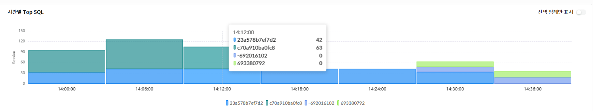

▶ \[그림50\] 기간별 Top SQL

세션목록

타임 셀렉터에 선택한 기간내 세션 이력이 표시됩니다. 해당 목록을 통해 과거 특정 시점에 어떤 사용자, 프로그램, 호스트가 접속했는지 확인 할 수 있으며 세션의 상태(active, blocked, blocking등) 및 수행중인 SQL, SQL의 수행시간, 트랜잭션 시간 등을 확인할 수 있습니다. 세션 목록은 추가로 하기와 같은 기능을 제공합니다.

제공 기능

1.  세션이 수행한 SQL Text를 보여주는 기능

2.  SQL Text를 포메팅하여 보여주는 기능

3.  세션이 수행한 SQL에 대한 상세 이력 조회 기능

4.  개별 세션 상세 이력 조회 기능

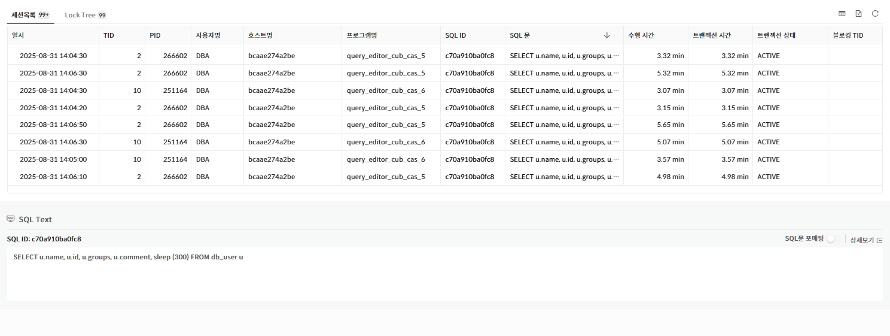

▶ \[그림51\] 세션 목록(이력)

<table>
<tbody>
<tr class="odd">
<td>
주의

세션 목록 상단 바 차트에서 바 1개를 선택 시 세션 목록 및 Lock Tree에는 선택한 바에 있는 범례의 세션만 표현되는 것이 아니고 해당 바 기간내의 모든 세션이 표시됩니다. 이는 해당 기간에 수행된 모든 세션을 함께 비교하기 위함입니다.
</td>
</tr>
</tbody>
</table>

> 세션 목록

| 일시      | 세션이 수행된 시간을 표시합니다.                                                                                       |
| ------- | -------------------------------------------------------------------------------------------------------- |
| TID     | 세션(트랜잭션)을 고유하게 식별하는 세션(트랜잭션) ID입니다. 각 세션은 고유한 TID를 가지며, 이를 통해 특정 세션(트랜잭션)을 추적할 수 있습니다. 세션 ID는 숫자로 표시됩니다. |
| PID     | 세션(트랜잭션)의 프로세스 ID입니다.                                                                                    |
| 사용자명    | 세션이 현재 사용하고 있는 데이터베이스 사용자 이름입니다.                                                                         |
| 호스트명    | 데이터베이스에 연결된 클라이언트 호스트 명입니다. 클라이언트가 실행 중인 서버나 컴퓨터의 이름을 나타냅니다.                                             |
| 프로그램명   | 데이터베이스에 연결된 클라이언트 프로그램의 이름입니다. 예를 들어, “csql”, “query\_editor\_cub\_cas\_1”등이 될 수 있습니다.                   |
| SQL ID  | 세션이 현재 실행 중인 SQL 문을 고유하게 식별하는 SQL ID입니다. 이는 특정 SQL 문을 추적하고 성능을 분석하는 데 유용합니다.                             |
| SQL 문   | SQL Text문이 표시됩니다.                                                                                        |
| 수행시간    | 세션이 현재 SQL 문을 실행하는 데 걸린 시간이 표시됩니다.                                                                       |
| 트랜잭션 시간 | 세션이 트랜잭션 상태이라면 해당 트랜잭션 상태의 지속 시간이 표시됩니다.                                                                 |
| 트랜잭션 상태 | 세션의 트랜잭션 상태를 표시합니다.                                                                                      |
| 블로킹 TID | 현재 세션을 블로킹하고 있는 세션의 TID입니다. 이는 잠금 경합 문제를 해결하는 데 중요한 정보를 제공합니다.                                           |
| 타입      | 세션의 타입을 나타냅니다. 타입은 총 4개의 카테고리(active, idle, blocking, blocked)로 되어 있습니다.                                 |

개별 세션 이력 조회

> 세션 목록의 SID 컬럼에서 특정 SID(화면 예: 264)를 선택하면 선택한 세션에 대한 상세 이력을 조회할 수 있는 드로어 화면이 열립니다. 해당 화면을 선택한 세션이 과거에 수행한 SQL 및 대기 이벤트 정보를 상세 조회할 수 있습니다.

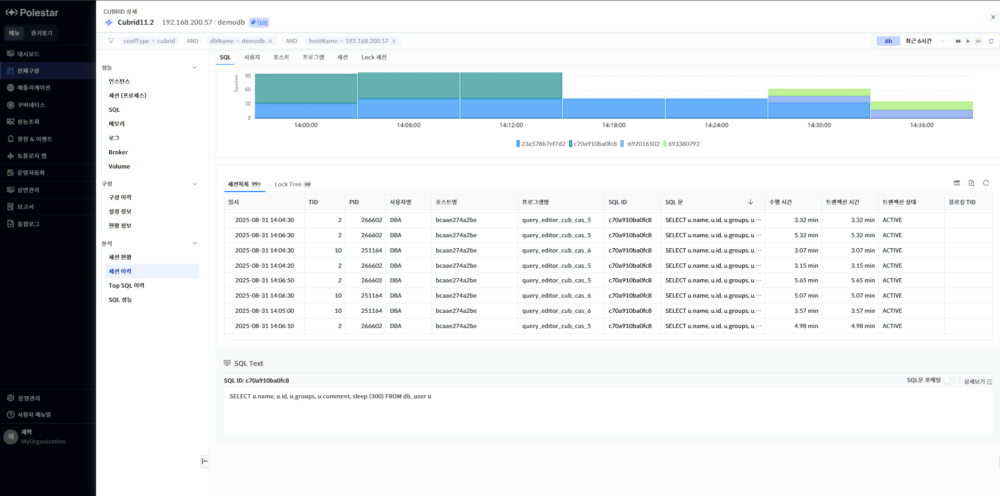

▶ \[그림52\] 세션목록에서 특정 TID 하나를 선택

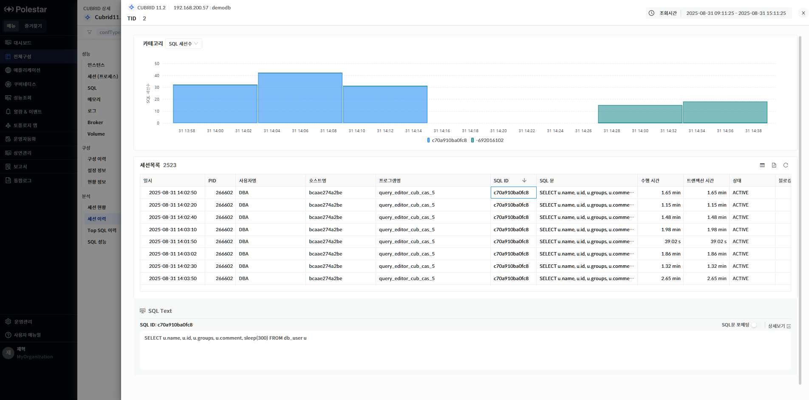

▶ \[그림53\] 선택한 TID에 대한 세션 이력 화면

> 개별 세션 이력 조회 절차

1.  세션목록에서 특정 TID 하나를 선택

2.  선택한 TID에 대한 세션 상세 이력 화면이 표시됨

세션 수행 SQL 조회

세션 목록의 SQL ID 컬럼에서 특정 SQL ID를 선택하면 선택한 SQL ID에 대한 SQL Text를 하단 SQL Text창에서 확인할 수 있습니다.

▶ \[그림54\] 선택한 SQL ID에 SQL Text 표시 화면

> 세션 수행 SQL 조회 절차

1.  세션목록에서 특정 SQL ID를 선택

2.  하단 SQL Text 창에 선택한 SQL ID에 대한 SQL Text가 표시됨

개별 SQL 이력 조회

SQL Text 창의 우측 상세보기 버튼을 클릭하면 해당 SQL에 대한 상세 성능 이력 정보를 조회할 수 있는 드로어 화면이 나옵니다. 개별 SQL 이력 조회를 통해 해당 SQL의 과거 수행 이력 정보를 확인할 수 있습니다.

▶ \[그림55\] 개별 SQL 이력 조회 절차

▶ \[그림56\] 개별 SQL에 대한 이력 화면

> 개별 SQL 이력 조회 절차

1.  세션목록에서 특정 SQL ID를 선택

2.  하단 SQL Text 창에 선택한 SQL ID에 대한 SQL Text가 표시됨

3.  SQL Text 우측 상단에 상세보기 버튼 클릭

4.  선택한 SQL에 대한 이력 조회 드로어 화면 표시

5.  좌측 상단 콤보 박스에서 SQL 세션수, 수행시간, 트랜잭션 시간을 선택하여 개별 SQL 성능 조회

사용자탭

세션을 수행한 사용자 관점으로 세션 수행 이력을 분석할 수 있는 화면입니다. 화면 구성은 상단에 해당 사용자가 수행한 세션의 수가 많은 순으로 표시하는 목록과 도넛 차트가 있고 그 밑으로 타임 셀렉터 기간 동안 해당 사용자가 수행한 세션 수를 누적 바차트로 표시합니다. 바 차트 밑으로는 상세 세션목록과 Lock Tree 목록이 표시되며 세션목록이나 Lock Tree에서 SQL ID 컬럼에 있는 SQL ID를 클릭하면 하단에 해당 SQL ID에 대한 SQL Text가 표시됩니다.

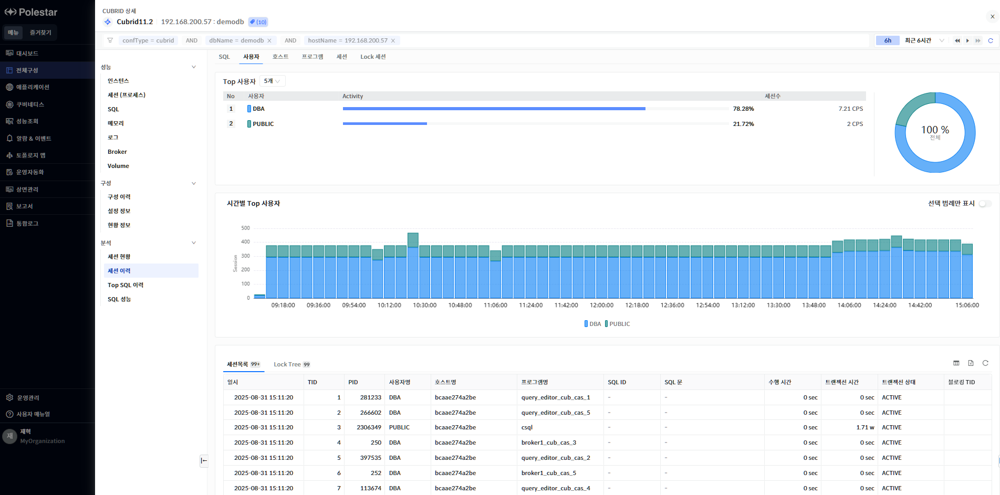

▶ \[그림57\] CUBRID 세션 이력\> 사용자탭

Top 사용자 목록

사용자가 수행한 세션수가 많은 순으로 목록이 표시되며 특정 사용자를 클릭하면 하단 바차트에 선택된 사용자가 하이라이트 처리되며 세션목록, Lock Tree에는 선택된 스카마에서 수행한 세션만 표시됩니다. Top 스키마 타이틀 옆에 콤보 박스에서 Top 스키마 목록에 표시할 개수를 선택할 수 있습니다.

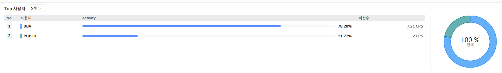

▶ \[그림58\] Top 사용자 목록

> Top 사용자 목록

| 사용자      | 세션을 수행한 사용자 명입니다.                                                                                |
| -------- | ------------------------------------------------------------------------------------------------ |
| Activity | 타임 셀렉터 기간동안 해당 사용자가 실행한 세션수의 비율입니다.                                                              |
| 수정됨      | 타임 셀렉터 기간동안 해당 사용자가 수행한 세션수를 초당 개수로 표현한 값입니다. 예를 들어 3 CPS면 초당 3개의 세션을 해당 사용자가 수행했다라고 해석할 수 있습니다. |

기간별 Top 사용자(바차트)

타임 셀렉터 기간에 해당하는 스키마가 수행한 세션 수를 누적 바차트로 표시합니다. 바차트의 간격은 기간별로 달라지며 바 차트 개수는 최대 60개까지 표현됩니다. 바차트를 1개 선택하면 해당 시점의 바차트만 활성화되고 하단 세션 목록은 바 차트 1개에 해당하는 기간의 세션만 표시됩니다. 따라서 상단에 Top 스키마 목록에서 특정 스키마를 선택하고 바차트에서 특정 바 1개를 선택한다면 특정 시점에 선택한 스키마가 수행한 세션들만 세션 목록에서 필터링하여 조회할 수 있습니다.

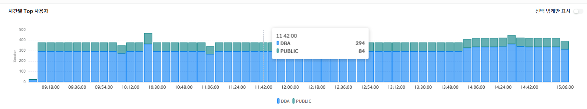

▶ \[그림59\] 기간별 Top 스키마

세션 목록

세션목록은 SQL탭의 세션목록과 기능이 동일합니다. SQL탭 절을 참조하세요.

호스트탭

세션을 수행한 호스트(클라이언트) 관점으로 세션 수행 이력을 분석할 수 있는 화면입니다. 화면 구성은 상단에 해당 호스트가 수행한 세션의 수가 많은 순으로 표시하는 목록과 도넛 차트가 있고 그 밑으로 타임 셀렉터 기간 동안 해당 호스트가 수행한 세션 수를 누적 바차트로 표시합니다. 바 차트 밑으로는 상세 세션목록과 Lock Tree 목록이 표시되며 세션목록이나 Lock Tree에서 SQL ID 컬럼에 있는 SQL ID를 클릭하면 하단에 해당 SQL ID에 대한 SQL Text가 표시됩니다.

▶ \[그림60\] CUBRID 세션 이력\> 호스트탭

Top 호스트 목록

호스트(클라이언트)가 수행한 세션수가 많은 순으로 목록이 표시되며 특정 호스트를 클릭하면 하단 바차트에 선택된 호스트가 하이라이트 처리되며 세션목록, Lock Tree에는 선택된 호스트에서 수행한 세션만 표시됩니다. Top 호스트 타이틀 옆에 콤보 박스에서 Top 호스트 목록에 표시할 개수를 선택할 수 있습니다.

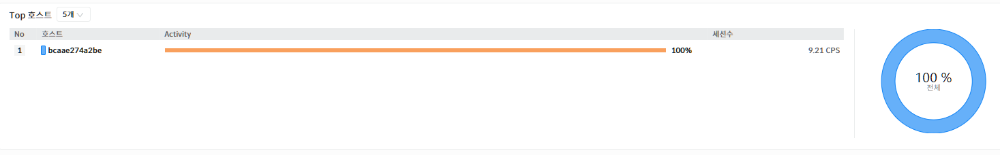

▶ \[그림61\] Top 호스트 목록

> Top 호스트 목록

| 호스트      | 세션을 수행한 호스트(클라이언트) 명입니다.                                                                          |
| -------- | ------------------------------------------------------------------------------------------------- |
| Activity | 타임 셀렉터 기간동안 해당 호스트가 실행한 세션수의 비율입니다.                                                               |
| 수정됨      | 타임 셀렉터 기간동안 해당 호스트가 수행한 세션수를 초당 개수로 표현한 값입니다. 예를 들어 3 CPS면 초당 3개의 세션을 해당 호스트가 수행했다 라고 해석할 수 있습니다. |

기간별 Top 호스트(바차트)

타임 셀렉터 기간에 해당하는 호스트가 수행한 세션 수를 누적 바차트로 표시합니다. 바차트의 간격은 기간별로 달라지며 바 차트 개수는 최대 60개까지 표현됩니다. 바차트를 1개 선택하면 해당 시점의 바차트만 활성화되고 하단 세션 목록은 바 차트 1개에 해당하는 기간의 세션만 표시됩니다. 따라서 상단에 Top 호스트 목록에서 특정 호스트를 선택하고 바차트에서 특정 바 1개를 선택한다면 특정 시점에 선택한 호스트가 수행한 세션들만 세션 목록에서 필터링하여 조회할 수 있습니다.

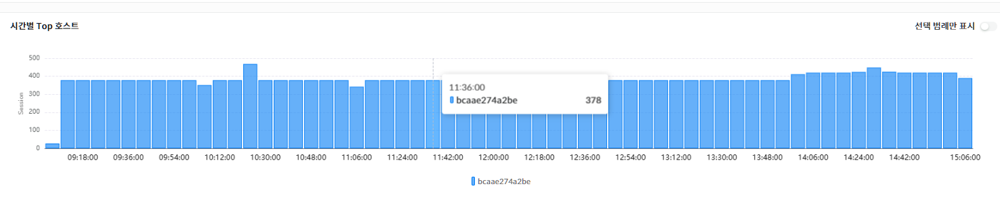

▶ \[그림62\] 기간별 Top 호스트

세션목록

세션목록은 SQL 탭의 세션목록과 기능이 동일합니다. SQL 탭 절을 참조하세요.

프로그램탭

세션을 수행한 프로그램 관점으로 세션 수행 이력을 분석할 수 있는 화면입니다. 화면 구성은 상단에 해당 프로그램이 수행한 세션의 수가 많은 순으로 표시하는 목록과 도넛 차트가 있고 그 밑으로 타임 셀렉터 기간 동안 해당 스키마가 수행한 세션 수를 누적 바차트로 표시합니다. 바 차트 밑으로는 상세 세션목록과 Lock Tree 목록이 표시되며 세션목록이나 Lock Tree에서 SQL ID 컬럼에 있는 SQL ID를 클릭하면 하단에 해당 SQL ID에 대한 SQL Text가 표시됩니다.

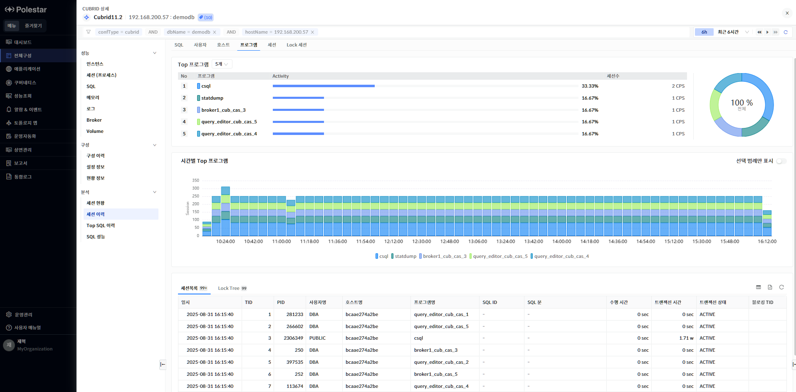

▶ \[그림63\] CUBRID 세션 이력\> 프로그램

Top 프로그램 목록

프로그램이 수행한 세션수가 많은 순으로 목록이 표시되며 특정 프로그램을 클릭하면 하단 바차트에 선택된 프로그램이 하이라이트 처리되며 세션목록, Lock Tree에는 선택된 프로그램에서 수행한 세션만 표시됩니다. Top 프로그램 타이틀 옆에 콤보 박스에서 Top 프로그램 목록에 표시할 개수를 선택할 수 있습니다.

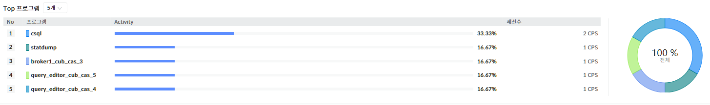

▶ \[그림64\] Top 프로그램 목록

> Top 프로그램 목록

| 프로그램     | 세션을 수행한 프로그램 명입니다.                                                                                  |
| -------- | --------------------------------------------------------------------------------------------------- |
| Activity | 타임 셀렉터 기간동안 해당 프로그램이 실행한 세션수의 비율입니다.                                                                |
| 수정됨      | 타임 셀렉터 기간동안 해당 프로그램이 수행한 세션수를 초당 개수로 표현한 값입니다. 예를 들어 3 CPS면 초당 3개의 세션을 해당 프로그램이 수행 했다라고 해석할 수 있습니다. |

기간별 Top 프로그램(바차트)

타임 셀렉터 기간에 해당하는 프로그램이 수행한 세션 수를 누적 바차트로 표시합니다. 바차트의 간격은 기간별로 달라지며 바 차트 개수는 최대 60개까지 표현됩니다. 바차트를 1개 선택하면 해당 시점의 바차트만 활성화되고 하단 세션 목록은 바 차트 1개에 해당하는 기간의 세션만 표시됩니다. 따라서 상단에 Top 프로그램 목록에서 특정 프로그램을 선택하고 바차트에서 특정 바 1개를 선택한다면 특정 시점에 선택한 프로그램이 수행한 세션들만 세션 목록에서 필터링하여 조회할 수 있습니다.

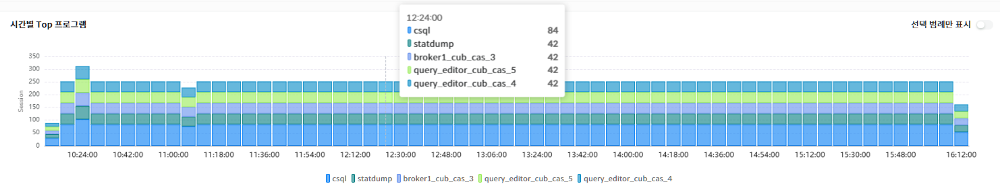

▶ \[그림65\] 기간별 Top 프로그램

세션목록

세션목록은 SQL 탭의 세션목록과 기능이 동일합니다. SQL 탭 절을 참조하세요.

세션탭

세션 관점으로 세션 수행 이력을 분석할 수 있는 화면입니다. 화면 구성은 상단에 해당 세션의 수가 많은 순으로 표시하는 목록과 도넛 차트가 있고 그 밑으로 타임 셀렉터 기간 동안 세션 수 누적 바차트를 표시합니다. 바 차트 밑으로는 상세 세션목록과 Lock Tree 목록이 표시되며 세션목록이나 Lock Tree에서 SQL ID 컬럼에 있는 SQL ID를 클릭하면 하단에 해당 SQL ID에 대한 SQL Text가 표시됩니다.

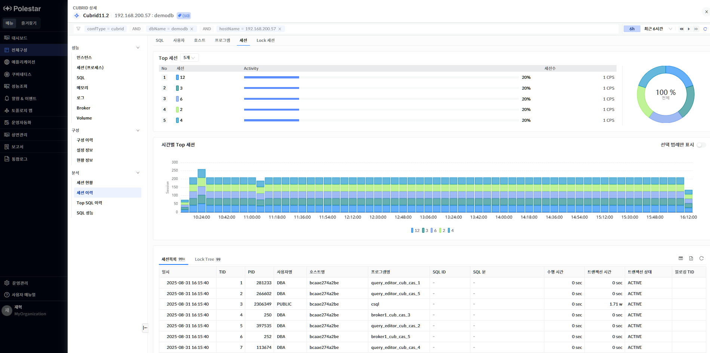

▶ \[그림66\] CUBRID 세션 이력\> 세션

Top 세션 목록

수행한 세션수가 많은 세션 순으로 목록이 표시되며 특정 세션 ID를 클릭하면 하단 바차트에 선택된 세션이 하이라이트 처리되며 세션목록, Lock Tree에는 선택된 프로그램에서 수행한 세션만 표시됩니다. Top 세션 타이틀 옆에 콤보 박스에서 Top 세션 목록에 표시할 개수를 선택할 수 있습니다.

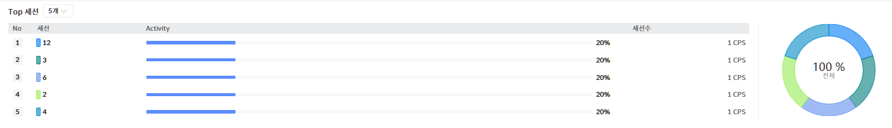

▶ \[그림67\] Top 세션 목록

> Top 세션 목록

| 세션       | 세션의 ID입니다.                                                                                          |
| -------- | --------------------------------------------------------------------------------------------------- |
| Activity | 타임 셀렉터 기간동안 해당 프로그램이 실행한 세션수의 비율입니다.                                                                |
| 수정됨      | 타임 셀렉터 기간동안 해당 프로그램이 수행한 세션수를 초당 개수로 표현한 값입니다. 예를 들어 3 CPS면 초당 3개의 세션을 해당 프로그램이 수행 했다라고 해석할 수 있습니다. |

기간별 Top 세션(바차트)

타임 셀렉터 기간에 해당하는 프로그램이 수행한 세션 수를 누적 바차트로 표시합니다. 바차트의 간격은 기간별로 달라지며 바 차트 개수는 최대 60개까지 표현됩니다. 바차트를 1개 선택하면 해당 시점의 바차트만 활성화되고 하단 세션 목록은 바 차트 1개에 해당하는 기간의 세션만 표시됩니다. 따라서 상단에 Top 프로그램 목록에서 특정 프로그램을 선택하고 바차트에서 특정 바 1개를 선택한다면 특정 시점에 선택한 프로그램이 수행한 세션들만 세션 목록에서 필터링하여 조회할 수 있습니다.

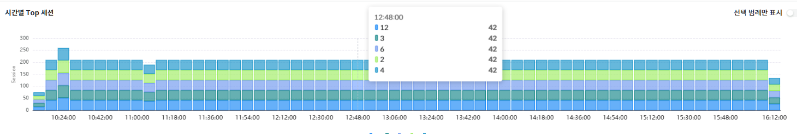

▶ \[그림68\] 기간별 Top 세션

세션목록

세션목록은 SQL 탭의 세션목록과 기능이 동일합니다. SQL 탭 절을 참조하세요.

Lock 세션탭

CUBRID에 발생했던 Lock 관련 세션 정보를 조회하고 분석할 수 있는 화면입니다. 화면 구성은 상단에 Lock 발생이 많았던 세션 SID 순으로 표시하는 목록과 도넛 차트가 있고 그 밑으로 타임 셀렉터 기간 동안 Lock이 발생된 세션에 대한 세션 수를 누적 바차트로 표시합니다. 바 차트내 바 1개를 클릭하면 해당 바에 해당하는 기간 동안의 Lock 세션 이력이 하단 Lock Tree 목록에 표시됩니다. 바 차트 밑으로는 상세 세션목록과 Lock Tree 목록이 표시되며 세션목록이나 Lock Tree에서 SQL ID 컬럼에 있는 SQL ID를 클릭하면 하단에 해당 SQL ID에 대한 SQL Text가 표시됩니다.

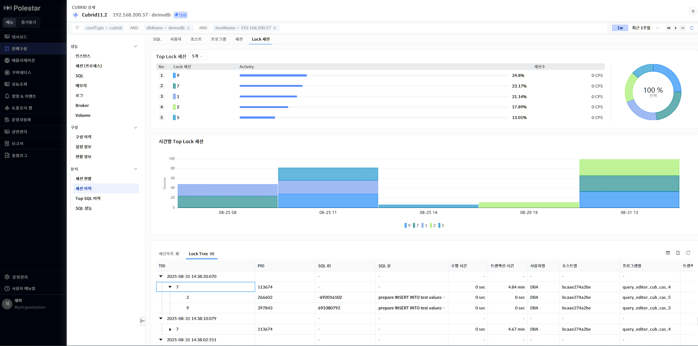

▶ \[그림69\] CUBRID 세션 이력\> Lock 세션

Lock Tree

CUBRID에 락 세션이 발생되면 Lock Tree 목록에서 해당 락 세션들을 확인할 수 있습니다. Lock Tree에서는 락을 유발한 세션(블로킹 세션)을 부모로 하고 해당 락으로 인해 블록 된 세션을 자식으로 하는 트리 형태로 목록을 표시합니다. 이력 날짜 및 부모 락 세션을 기준으로 해당 트리를 접거나 펼쳐 볼 수 있으며 SQL ID 컬럼에 있는 SQL ID를 선택하면 하단에 Blocking 세션의 SQL과 블록 된 세션의 SQL을 같이 표시합니다. SQL Text 창의 우측 상단에 상세보기 버튼을 클릭하면 SQL Text 상세 드로어가 표시되며 해당 드로어 화면에서 SQL에 대한 상세 성능 이력 정보 및 Plan 정보를 확인할 수 있습니다. 자세한 내용은 “개별 SQL 이력 보기”절을 참조하세요.

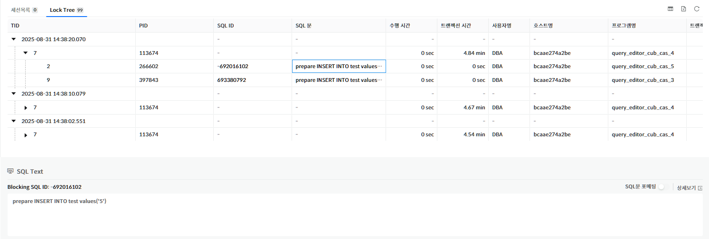

▶ \[그림70\] Lock Tree

> Lock Tree 목록

<table>
<thead>
<tr class="header">
<th>TID</th>
<th>Lock 발생일시, Lock 발생 세션, 블록 된 세션을 트리형태로 표현합니다. Lock이 발생된 시간을 최 상단 부모로 하여 Lock을 유발한 세션을 그 밑에 나오고 해당 Lock으로 인해 블록 된 세션을 Lock 유발세션의 자식으로 하는 트리형태로 표시합니다.</th>
</tr>
</thead>
<tbody>
<tr class="odd">
<td>사용자명</td>
<td>세션이 현재 사용하고 있는 데이터베이스 사용자 이름입니다.</td>
</tr>
<tr class="even">
<td>호스트명</td>
<td>데이터베이스에 연결된 클라이언트 호스트 명입니다. 클라이언트가 실행 중인 서버나 컴퓨터의 이름을 나타냅니다.</td>
</tr>
<tr class="odd">
<td>프로그램명</td>
<td>데이터베이스에 연결된 클라이언트 프로그램의 이름입니다. 예를 들어, “csql”, “query_editor_cub_cas_1”등이 될 수 있습니다.</td>
</tr>
<tr class="even">
<td>SQL ID</td>
<td>세션이 현재 실행 중인 SQL 문을 고유하게 식별하는 SQL ID입니다. 이는 특정 SQL 문을 추적하고 성능을 분석하는 데 유용합니다.</td>
</tr>
<tr class="odd">
<td>SQL 문</td>
<td>SQL Text문이 표시됩니다.</td>
</tr>
<tr class="even">
<td>수행시간</td>
<td>세션이 현재 SQL 문을 실행하는 데 걸린 시간이 표시됩니다.</td>
</tr>
<tr class="odd">
<td>트랜잭션 시간</td>
<td>세션이 트랜잭션 상태이라면 해당 트랜잭션 상태의 지속 시간이 표시됩니다.</td>
</tr>
<tr class="even">
<td>트랜잭션 상태</td>
<td>
세션의 트랜잭션 상태를 표시합니다.

트랜잭션 상태값 목록

ACTIVE: 활성

RECOVERY: 복구중인 트랜잭션

COMMITTED: 커밋 완료되어 종료될 트랜잭션

COMMITTING: 커밋중인 트랜잭션

ABORTED: 롤백되어 종료될 트랜잭션

KILLED: 서버에 의해 강제 종료 중인 트랜잭션
</td>
</tr>
<tr class="odd">
<td>블로킹 TID</td>
<td>현재 세션을 블로킹하고 있는 세션의 TID입니다. 이는 잠금 경합 문제를 해결하는 데 중요한 정보를 제공합니다.</td>
</tr>
<tr class="even">
<td>타입</td>
<td>세션의 타입을 나타냅니다. 타입은 총 4개의 카테고리(active, idle, blocking, blocked)로 되어 있습니다.</td>
</tr>
</tbody>
</table>

Top SQL 이력 분석

Top SQL 이력 분석 기능을 통해 CUBRID에서 수행된 SQL들 중에 성능 이슈가 있는 SQL등을 4가지 관점(SQL, 사용자, 호스트, 프로그램)으로 분석해 볼 수 있습니다. SQL의 다양한 성능(세션수, 평균 수행시간, 총 수행시간, 최대 수행시간) 기준으로, 최대 30개의 Top SQL을 검색하여 분석할 수 있습니다.

SQL탭

개별 SQL 단위로 성능 지연이 발생한 SQL을 분석할 수 있는 화면입니다. 다양한 성능 지표로 Top SQL을 조회하고 해당 Top SQL의 수행이력을 조회해 볼 수 있습니다. 또한 개별 SQL을 선택하여 한 SQL에 대한 상세 이력 분석이 가능합니다.

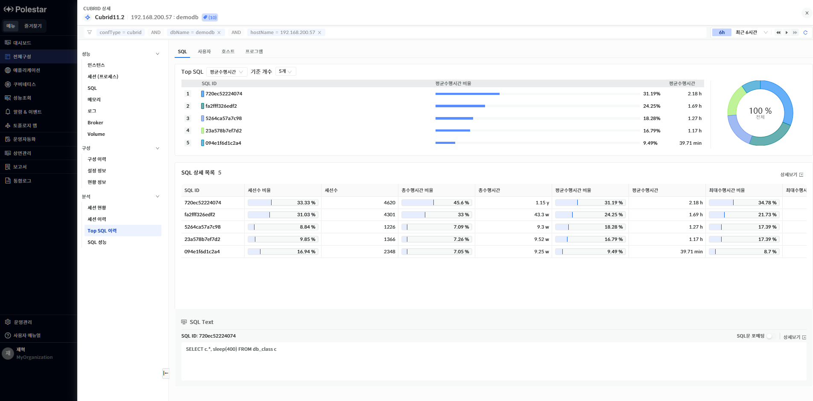

▶ \[그림71\] CUBRID Top SQL 이력\> SQL탭

Top SQL 목록

Top SQL 목록 상단 콤보 박스에서 선택한 성능 지표(기본: 평균수행시간)가 높은 SQL을 선택한 기준개수(기본: 5개)만큼 표시합니다. 목록에서 특정 SQL ID를 클릭하면 하단 Top SQL 상세 목록에 선택된 SQL 이력 세션만 표시됩니다. Top SQL 기준 성능 지표(평균수행시간, 세션수, 총수행시간, 최대수행시간)는 목록 상단 콤보 박스에서 선택할 수 있으며 Top SQL 개수도 목록 상단 개준 개수를 콤보 박스에서 선택할 수 있습니다.

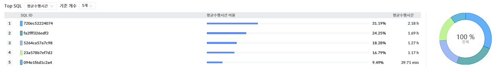

▶ \[그림72\] Top SQL 목록

> Top SQL 목록

| SQL ID    | SQL ID입니다. SQL ID에 마우스를 Hover하면 해당 SQL ID에 해당하는 SQL Text가 툴팁으로 표시됩니다. 또한 해당 SQL ID를 선택하면 하단 Top SQL 상세 목록에서 해당 SQL ID에 해당하는 이력만 표시됩니다. |
| --------- | -------------------------------------------------------------------------------------------------------------------------------------- |
| 평균수행시간 비율 | 대상 SQL의 평균 수행시간을 목록 전체 SQL 평균수행 시간 대비 비율로 표시합니다.                                                                                       |
| 평균수행시간    | 대상 SQL이 선택된 기간 내에 수행되었던 평균 시간입니다.                                                                                                      |

SQL 상세 목록

SQL 상세 목록은 Top SQL로 추출된 SQL에 대한 모든 성능 지표를 컬럼 정보로 표시합니다. 목록 우측 상단 상세보기 버튼을 클릭하면 타임 셀렉터에 선택된 기간내에 수행된 Top SQL 이력 드로어가 표시됩니다.

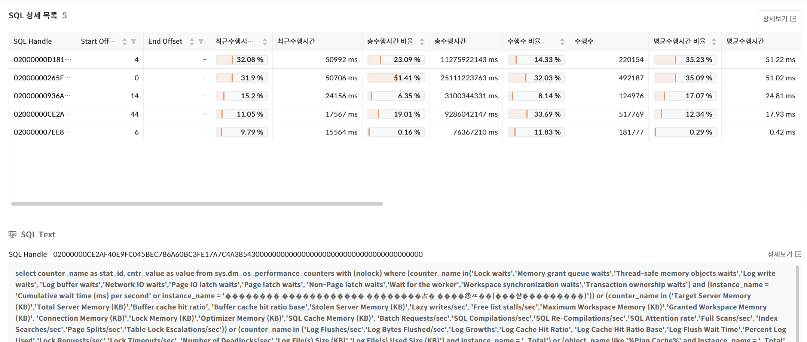

▶ \[그림73\] SQL 상세 목록

> SQL 상세 목록

| SQL ID   | Top SQL ID값입니다.                                     |
| -------- | --------------------------------------------------- |
| 세션수 비율   | 목록내 모든 SQL 수행 세션수 합계 대비 대상 SQL이 수행된 세션수의 비율을 표시합니다. |
| 세션수      | 대상 SQL이 선택된 기간 내에 수행되었던 초당 세션수입니다.                  |
| 총수행시간비율  | 목록내 모든 SQL 총수행시간 합계 대비 대상 SQL이 총수행시간의 비율을 표시합니다..   |
| 총수행시간    | 대상 SQL이 선택된 기간 내에 수행되었던 총 수행시간 시간입니다.               |
| 평균수행시간비율 | 목록내 모든 SQL 평균수행시간 합계 대상 SQL 평균 수행시간의 비율을 표시합니다..    |
| 평균수행시간   | 대상 SQL이 선택된 기간 내에 수행되었던 평균 수행시간 시간입니다.              |
| 최대수행시간비율 | 목록내 모든 SQL 최대수행시간 합계 대비 대상 SQL이 총수행시간의 비율을 표시합니다..  |
| 최대수행시간   | 대상 SQL이 선택된 기간 내에 수행되었던 총 수행시간 시간입니다.               |

Top SQL 상세 목록

SQL 상세 목록 우측 상단의 상세보기 버튼을 클릭하면 타임 셀렉터에 선택한 기간내의 수집한 Top SQL 전체 목록 드로어가 표시됩니다. 상단 Top SQL 목록에서 원하는 SQL만 선택하였다면 대상 SQL만 필터링 하여 보실 수 있습니다. Top SQL 상세 목록을 해당 기간 어떤 SQL이 성능 부하를 발생하였는지 여러 성능 기준으로 확인하실 수 있습니다.

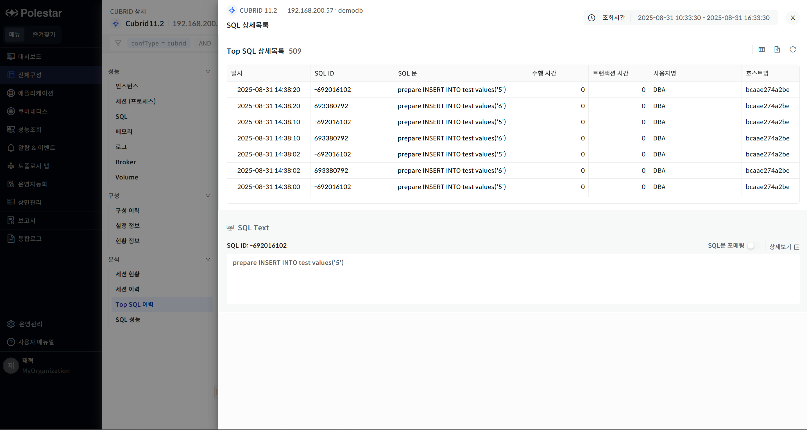

▶ \[그림74\] Top SQL 상세 목록

> Top SQL 상세 목록

<table>
<thead>
<tr class="header">
<th>일시</th>
<th>SQL이 수행된 시간을 표시합니다.</th>
</tr>
</thead>
<tbody>
<tr class="odd">
<td>SQL ID</td>
<td>SQL ID입니다. SQL ID는 SQL문을 고유하게 식별하는 SQL ID입니다. 이는 특정 SQL 문을 추적하고 성능을 분석하는 데 유용합니다.</td>
</tr>
<tr class="even">
<td>SQL 문</td>
<td>SQL 문 앞부분이 최대 30자까지 표시됩니다.</td>
</tr>
<tr class="odd">
<td>수행시간</td>
<td>해당 SQL이 수행된 수행 시간입니다.</td>
</tr>
<tr class="even">
<td>트랜잭션 시간</td>
<td>해당 SQL 이 포함된 트랜잭션에서 소요되고 있는 시간입니다.</td>
</tr>
<tr class="odd">
<td>사용자명</td>
<td>해당 SQL을 수행한 사용자 이름입니다.</td>
</tr>
<tr class="even">
<td>호스트명</td>
<td>해당 SQL을 수행한 클라이언트 호스트 명입니다. 클라이언트가 실행 중인 서버나 컴퓨터의 이름을 나타냅니다.</td>
</tr>
<tr class="odd">
<td>프로그램명</td>
<td>해당 SQL을 수행한 프로그램의 이름입니다. 예를 들어, “csql”, “query_editor_cub_cas_1”등이 될 수 있습니다.</td>
</tr>
<tr class="even">
<td>트랜잭션 상태</td>
<td>
해당 SQL 수행 세션의 트랜잭션 상태를 표시합니다.

트랜잭션 상태값 목록

ACTIVE: 활성

RECOVERY: 복구중인 트랜잭션

COMMITTED: 커밋 완료되어 종료될 트랜잭션

COMMITTING: 커밋중인 트랜잭션

ABORTED: 롤백되어 종료될 트랜잭션

KILLED: 서버에 의해 강제 종료 중인 트랜잭션
</td>
</tr>
<tr class="odd">
<td>PID</td>
<td>해당 SQL 수행 세션의 프로세스 ID를 표시합니다.</td>
</tr>
<tr class="even">
<td>TID</td>
<td>해당 SQL 수행 세션을 고유하게 식별하는 세션(트랜잭션) ID입니다. 각 세션은 고유한 TID를 가지며, 이를 통해 특정 세션(트랜잭션)을 추적할 수 있습니다. TID는 숫자로 표시됩니다.</td>
</tr>
<tr class="odd">
<td>블로킹 TID</td>
<td>해당 SQL을 수행하고 있는 세션을 블로킹하고 있는 세션의 TID입니다. 이는 잠금 경합 문제를 해결하는 데 중요한 정보를 제공합니다.</td>
</tr>
<tr class="even">
<td>타입</td>
<td>해당 SQL을 수행하고 있는 세션의 타입을 나타냅니다. 타입은 총 4개의 카테고리(active, idle, blocking, blocked)로 되어 있습니다.</td>
</tr>
</tbody>
</table>

<table>
<tbody>
<tr class="odd">
<td>
노트

Top SQL에 나오는 SQL 목록은 상단 Top SQL에 표시된 SQL만 나오는 것이 아니고 타임 셀렉터에 선택한 기간내 Top SQL로 수집한 모든 SQL이 나옵니다.
</td>
</tr>
</tbody>
</table>

개별 SQL 이력 조회(SQL Text 드로어)

SQL Text 창의 우측 상세보기 버튼을 클릭하면 해당 SQL에 대한 상세 성능 이력 정보를 조회할 수 있는 드로어 화면이 나옵니다. 개별 SQL 이력 조회를 통해 해당 SQL의 과거 수행 이력 및 수행시간 Plan 정보, 수행 세션 수 정보 등을 확인할 수 있습니다.

▶ \[그림75\] 개별 SQL 상세 이력 조회 절차

▶ \[그림76\] 개별 SQL에 대한 이력 화면

> 개별 SQL 이력 조회 절차

1.  Top SQL목록에서 특정 SQL ID를 선택

2.  하단 SQL Text 창에 선택한 SQL ID에 대한 SQL Text가 표시됨

3.  SQL Text 우측 상단에 상세보기 버튼 클릭

4.  선택한 SQL에 대한 이력 조회 드로어 화면 표시

5.  좌측 상단 콤보 박스에서 SQL 세션수, 수행시간, 트랜잭션 시간을 선택하여 개별 SQL 성능 조회

<table>
<tbody>
<tr class="odd">
<td>
노트

SQL Text 상세 드로어 화면에서는 좌측 상단 콤보 박스에서 세션수 또는 평균 수행시간 항목을 선택하여 각 SQL이 수행한 세션 정보나 SQL 평균 수행시간 이력 정보를 확인할 수 있습니다.
</td>
</tr>
</tbody>
</table>

사용자탭

SQL을 수행한 사용자 단위로 성능 지연이 발생한 SQL을 분석할 수 있는 화면입니다. 다양한 성능 지표로 Top SQL의 수행이력을 조회해 볼 수 있습니다. 또한 개별 SQL을 선택하여 한 SQL에 대한 상세 이력 분석이 가능합니다.

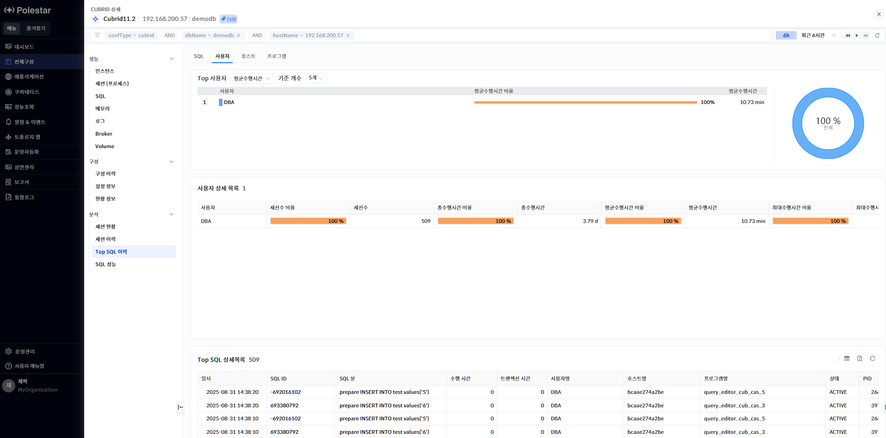

▶ \[그림 77\] CUBRID Top SQL 이력\> 사용자탭

Top 사용자 목록

Top 사용자 목록 상단 콤보 박스에서 선택한 성능 지표(기본: 수행시간)가 높은 스키마를 선택한 기준개수(기본: 5개)만큼 표시합니다. 목록에서 특정 사용자를 클릭하면 중단 사용자 상세 목록에 해당 사용자 목록이 하이라이트 되며, 하단 Top SQL 상세 목록에 선택된 사용자가 수행한 SQL 이력만 표시됩니다. Top 사용자 기준 성능 지표(평균수행시간, 세션수, 총수행시간, 최대수행시간)는 목록 상단 콤보 박스에서 선택할 수 있으며 Top 사용자 개수도 목록 상단 개준 개수를 콤보 박스에서 선택할 수 있습니다.

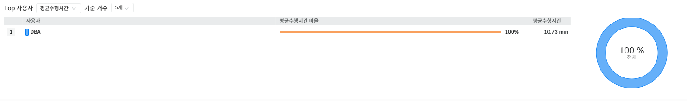

▶ \[그림78\] Top 사용자 목록

> Top 사용자 목록

| 사용자      | 사용자 명입니다. 해당 사용자를 선택하면 하단 Top SQL 상세 목록에서 해당 사용자에 해당하는 이력만 표시됩니다. |
| -------- | ----------------------------------------------------------------- |
| 세션수 비율   | 목록내 모든 SQL 수행 세션수 합계 대비 대상 SQL이 수행된 세션수의 비율을 표시합니다.               |
| 세션수      | 대상 SQL이 선택된 기간 내에 수행되었던 초당 세션수입니다.                                |
| 총수행시간비율  | 목록내 모든 SQL 총수행시간 합계 대비 대상 SQL이 총수행시간의 비율을 표시합니다..                 |
| 총수행시간    | 대상 SQL이 선택된 기간 내에 수행되었던 총 수행시간 시간입니다.                             |
| 평균수행시간비율 | 목록내 모든 SQL 평균수행시간 합계 대상 SQL 평균 수행시간의 비율을 표시합니다..                  |
| 평균수행시간   | 대상 SQL이 선택된 기간 내에 수행되었던 평균 수행시간 시간입니다.                            |
| 최대수행시간비율 | 목록내 모든 SQL 최대수행시간 합계 대비 대상 SQL이 총수행시간의 비율을 표시합니다..                |
| 최대수행시간   | 대상 SQL이 선택된 기간 내에 수행되었던 총 수행시간 시간입니다.                             |

사용자 상세 목록

Top 사용자 목록보다 상세한 성능 정보를 표시합니다. 이를 통해 보다 상세한 성능 비교를 할 수 있습니다. 컬럼 값은 Top 사용자 목록내 설명과 동일합니다.

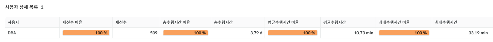

▶ \[그림79\] 사용자 상세 목록

Top SQL 상세 목록

Top SQL 상세 목록은 SQL 탭과 동일합니다. SQL 탭의 “Top SQL 상세 목록” 부분을 참조하세요.

호스트탭

SQL을 수행한 호스트 단위로 성능 지연이 발생한 SQL을 분석할 수 있는 화면입니다. 다양한 성능 지표로 Top SQL의 수행이력을 조회해 볼 수 있습니다. 또한 개별 SQL을 선택하여 한 SQL에 대한 상세 이력 분석이 가능합니다.

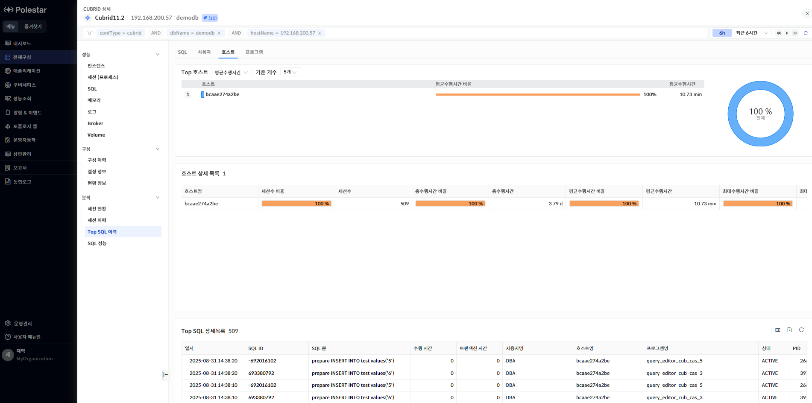

▶ \[그림 80\] CUBRID Top SQL 이력\> 호스트탭

Top 호스트 목록

Top 호스트 목록 상단 콤보 박스에서 선택한 성능 지표(기본: 수행시간)가 높은 호스트를 선택한 기준개수(기본: 5개)만큼 표시합니다. 목록에서 특정 호스트명을 클릭하면 중단 호스트 상세 목록에 해당 호스트 목록이 하이라이트 되며, 하단 Top SQL 상세 목록에 선택된 호스트가 수행한 SQL 이력만 표시됩니다. Top 호스트 기준 성능 지표(평균수행시간, 세션수, 총수행시간, 최대수행시간)는 목록 상단 콤보 박스에서 선택할 수 있으며 Top 호스트 개수도 목록 상단 개준 개수를 콤보 박스에서 선택할 수 있습니다.

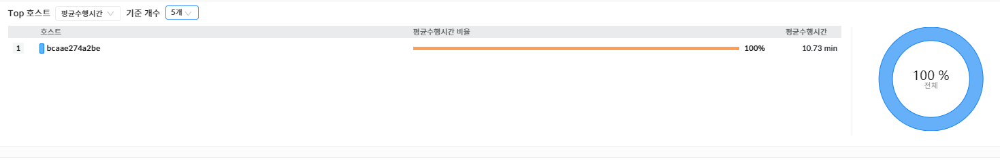

▶ \[그림81\] Top 호스트 목록

> Top 호스트 목록

| 호스트      | 호스트 명입니다. 해당 호스트명을 선택하면 하단 Top SQL 상세 목록에서 해당 호스트명에 해당하는 이력만 표시됩니다. |
| -------- | ------------------------------------------------------------------- |
| 세션수 비율   | 목록내 모든 SQL 수행 세션 수 합계 대비 대상 SQL이 수행된 세션수의 비율을 표시합니다.                |
| 세션수      | 대상 SQL이 선택된 기간 내에 수행되었던 초당 세션 수입니다.                                 |
| 총수행시간비율  | 목록내 모든 SQL 총수행시간 합계 대비 대상 SQL이 총수행시간의 비율을 표시합니다..                   |
| 총수행시간    | 대상 SQL이 선택된 기간 내에 수행되었던 총 수행시간 시간입니다.                               |
| 평균수행시간비율 | 목록내 모든 SQL 평균수행시간 합계 대상 SQL 평균 수행시간의 비율을 표시합니다..                    |
| 평균수행시간   | 대상 SQL이 선택된 기간 내에 수행되었던 평균 수행시간 시간입니다.                              |
| 최대수행시간비율 | 목록내 모든 SQL 최대수행시간 합계 대비 대상 SQL이 총수행시간의 비율을 표시합니다..                  |
| 최대수행시간   | 대상 SQL이 선택된 기간 내에 수행되었던 총 수행시간 시간입니다.                               |

호스트 상세 목록

Top 호스트 목록보다 상세한 성능 정보를 표시합니다. 이를 통해 보다 상세한 성능 비교를 할 수 있습니다. 컬럼 값은 Top 사용자 목록내 설명과 동일합니다.

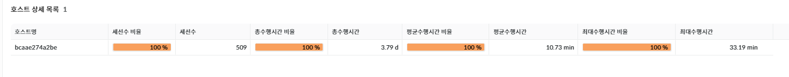

▶ \[그림82\] 호스트 상세 목록

Top SQL 상세 목록

Top SQL 상세 목록은 SQL 탭과 동일합니다. SQL 탭의 “Top SQL 상세 목록” 부분을 참조하세요.

프로그램탭

SQL을 수행한 프로그램 단위로 성능 지연이 발생한 SQL을 분석할 수 있는 화면입니다. 다양한 성능 지표로 Top SQL의 수행이력을 조회해 볼 수 있습니다. 또한 개별 SQL을 선택하여 한 SQL에 대한 상세 이력 분석이 가능합니다.

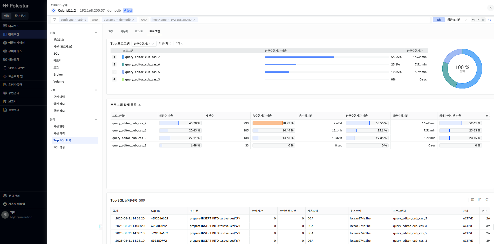

▶ \[그림 83\] CUBRID Top SQL 이력\> 프로그램탭

Top 프로그램 목록

Top 프로그램 목록 상단 콤보 박스에서 선택한 성능 지표(기본: 수행시간)가 높은 프로그램을 선택한 기준개수(기본: 5개)만큼 표시합니다. 목록에서 특정 프로그램을 클릭하면 중단 프로그램 상세 목록에 해당 프로그램 목록이 하이라이트 되며, 하단 Top SQL 상세 목록에 선택된 프로그림에서 수행한 SQL 이력만 표시됩니다. Top 프로그램 기준 성능 지표(평균수행시간, 세션수, 총수행시간, 최대수행시간)는 목록 상단 콤보 박스에서 선택할 수 있으며 Top 프로그램 개수도 목록 상단 개준 개수를 콤보 박스에서 선택할 수 있습니다.

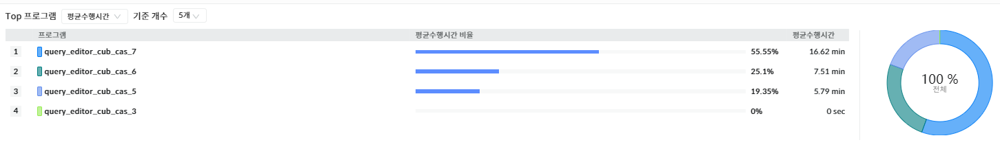

▶ \[그림84\] Top 프로그램 목록

> Top 프로그램 목록

| 프로그램     | 프로그램명입니다. 해당 프로그램명을 선택하면 하단 Top SQL 상세 목록에서 해당 프로그램에 해당하는 이력만 표시됩니다. |
| -------- | -------------------------------------------------------------------- |
| 세션수 비율   | 목록내 모든 SQL 수행 세션수 합계 대비 대상 SQL이 수행된 세션수의 비율을 표시합니다.                  |
| 세션수      | 대상 SQL이 선택된 기간 내에 수행되었던 초당 세션수입니다.                                   |
| 총수행시간비율  | 목록내 모든 SQL 총수행시간 합계 대비 대상 SQL이 총수행시간의 비율을 표시합니다..                    |
| 총수행시간    | 대상 SQL이 선택된 기간 내에 수행되었던 총 수행시간 시간입니다.                                |
| 평균수행시간비율 | 목록내 모든 SQL 평균수행시간 합계 대상 SQL 평균 수행시간의 비율을 표시합니다..                     |
| 평균수행시간   | 대상 SQL이 선택된 기간 내에 수행되었던 평균 수행시간 시간입니다.                               |
| 최대수행시간비율 | 목록내 모든 SQL 최대수행시간 합계 대비 대상 SQL이 총수행시간의 비율을 표시합니다..                   |
| 최대수행시간   | 대상 SQL이 선택된 기간 내에 수행되었던 총 수행시간 시간입니다.                                |

프로그램 상세 목록

Top 프로그램 목록보다 상세한 성능 정보를 표시합니다. 이를 통해 보다 상세한 성능 비교를 할 수 있습니다. 컬럼 값은 Top 프로그램 목록내 설명과 동일합니다.

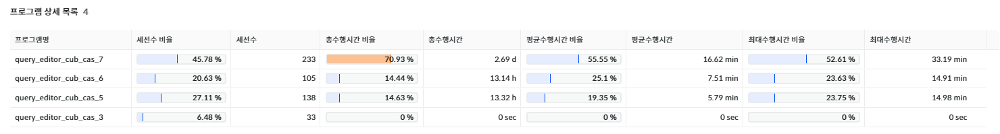

▶ \[그림85\] 프로그램 상세 목록

Top SQL 상세 목록

Top SQL 상세 목록은 SQL 탭과 동일합니다. SQL 탭의 “Top SQL 상세 목록” 부분을 참조하세요.

SQL 성능 분석

SQL 성능 분석 화면에서는 대상 CUBRID에서 수행된 개별 Top SQL에 수행 시간을 분포도(Scatter) 차트로 표현하여 한눈에Top SQL의 수행 시간을 확인할 수 있습니다. 또한 수행 시간외에 트랜잭션 시간 지표도 선택 가능합니다. 그리고 다양한 검색 조건(특정 SQL ID, 특정 사용자 등)으로 SQL을 필터링하여 분석할 수 있습니다.

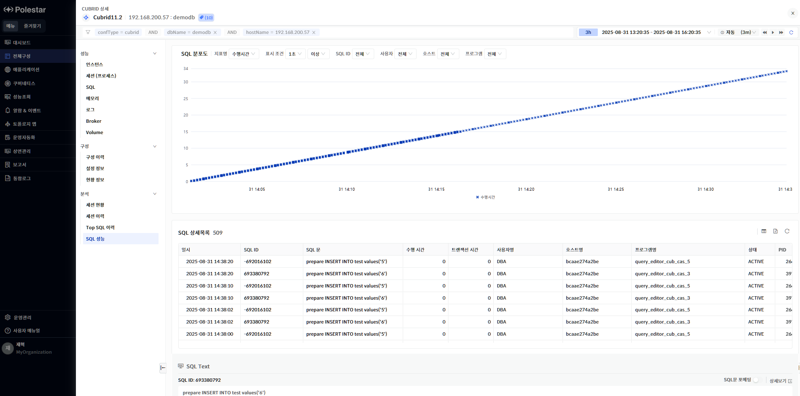

▶ \[그림86\] SQL 성능 분석

SQL 분포도

SQL 분포도는 기본 수행시간이 1초 이상인 Top SQL의 수행시간을 분포도(Scatter) 차트에 각 점으로 표시합니다. SQL 분포도 타이틀 옆의 콤보 박스를 통해 표시되는 지표를 트랜잭션 시간으로 변경 가능하며 우측 상단 표시조건을 변경하여 특정 수행 시간 이상 또는 이하인 SQL 만을 표시할 수 있습니다. 또한 특정 SQL ID, 사용자, 프로그램, 호스트를 선택하여 해당 대상 SQL만을 필터링하여 분석할 수 있습니다. 그리고 차트 내에서는 마우스로 원하는 영역을 드래그 하여 선택하면 해당 영역에 해당하는 SQL 이력 정보만 SQL 상세 목록에 표시됩니다.

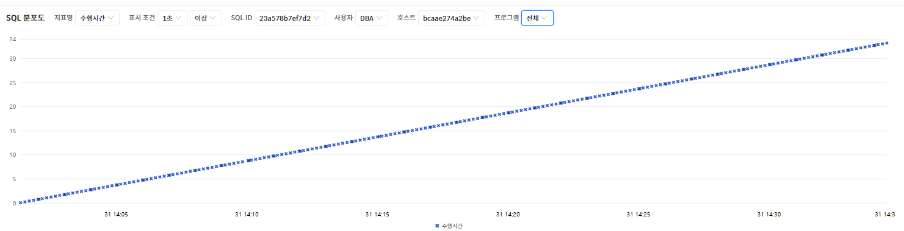

▶ \[그림87\] SQL 분포도

<table>
<tbody>
<tr class="odd">
<td>
주의

분포도(Scatter) 차트는 최대 3시간 데이터 까지만 표시되며 따라서 타임 셀렉터도 3시간까지만 지원합니다.
</td>
</tr>
</tbody>
</table>

SQL 상세 목록

타임 셀렉터에 선택한 기간내의 수집한 SQL 전체 목록이 표시됩니다. 상단 SQL 분포도에서 특정 영역을 선택하면 해당하는 SQL에 대한 목록만 필터링 하여 보실 수 있습니다. 이를 통해 부하가 발생한 SQL에 대해 쉽게 찾고 분석할 수 있습니다.

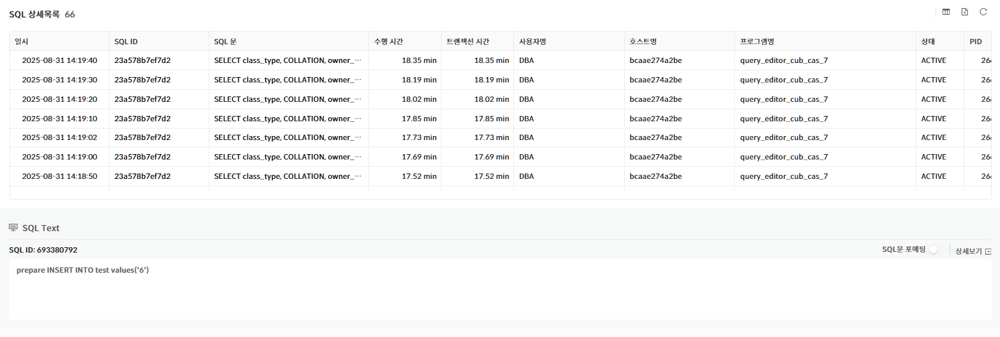

▶ \[그림88\] SQL 상세 목록

> SQL 상세 목록

<table>
<thead>
<tr class="header">
<th>일시</th>
<th>SQL이 수행된 시간을 표시합니다.</th>
</tr>
</thead>
<tbody>
<tr class="odd">
<td>SQL ID</td>
<td>SQL ID입니다. SQL ID는 SQL문을 고유하게 식별하는 SQL ID입니다. 이는 특정 SQL 문을 추적하고 성능을 분석하는 데 유용합니다.</td>
</tr>
<tr class="even">
<td>SQL 문</td>
<td>SQL 문 앞부분이 최대 30자까지 표시됩니다.</td>
</tr>
<tr class="odd">
<td>수행시간</td>
<td>해당 SQL이 수행된 수행 시간입니다.</td>
</tr>
<tr class="even">
<td>트랜잭션 시간</td>
<td>해당 SQL 이 포함된 트랜잭션에서 소요되고 있는 시간입니다.</td>
</tr>
<tr class="odd">
<td>사용자명</td>
<td>해당 SQL을 수행한 사용자 이름입니다.</td>
</tr>
<tr class="even">
<td>호스트명</td>
<td>해당 SQL을 수행한 클라이언트 호스트 명입니다. 클라이언트가 실행 중인 서버나 컴퓨터의 이름을 나타냅니다.</td>
</tr>
<tr class="odd">
<td>프로그램명</td>
<td>해당 SQL을 수행한 프로그램의 이름입니다. 예를 들어, “csql”, “query_editor_cub_cas_1”등이 될 수 있습니다.</td>
</tr>
<tr class="even">
<td>트랜잭션 상태</td>
<td>
해당 SQL 수행 세션의 트랜잭션 상태를 표시합니다.

트랜잭션 상태 값 목록

ACTIVE: 활성

RECOVERY: 복구중인 트랜잭션

COMMITTED: 커밋 완료되어 종료될 트랜잭션

COMMITTING: 커밋중인 트랜잭션

ABORTED: 롤백되어 종료될 트랜잭션

KILLED: 서버에 의해 강제 종료 중인 트랜잭션
</td>
</tr>
<tr class="odd">
<td>PID</td>
<td>해당 SQL 수행 세션의 프로세스 ID를 표시합니다.</td>
</tr>
<tr class="even">
<td>TID</td>
<td>해당 SQL 수행 세션을 고유하게 식별하는 세션(트랜잭션) ID입니다. 각 세션은 고유한 TID를 가지며, 이를 통해 특정 세션(트랜잭션)을 추적할 수 있습니다. TID는 숫자로 표시됩니다.</td>
</tr>
<tr class="odd">
<td>블로킹 TID</td>
<td>해당 SQL을 수행하고 있는 세션을 블로킹하고 있는 세션의 TID입니다. 이는 잠금 경합 문제를 해결하는 데 중요한 정보를 제공합니다.</td>
</tr>
<tr class="even">
<td>타입</td>
<td>해당 SQL을 수행하고 있는 세션의 타입을 나타냅니다. 타입은 총 4개의 카테고리(active, idle, blocking, blocked)로 되어 있습니다.</td>
</tr>
</tbody>
</table>

