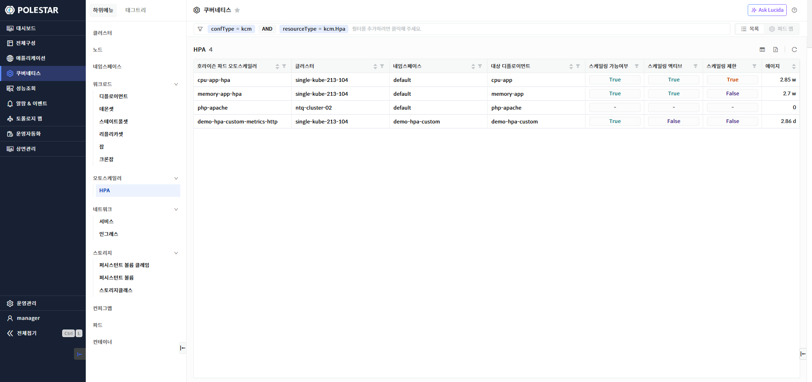
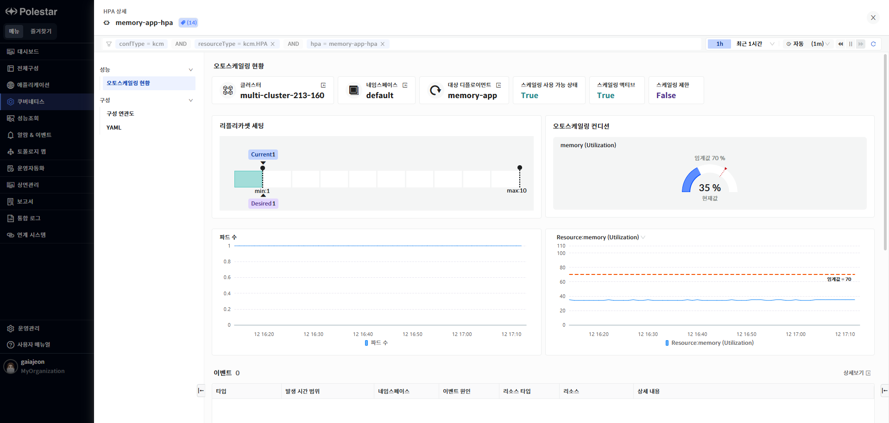
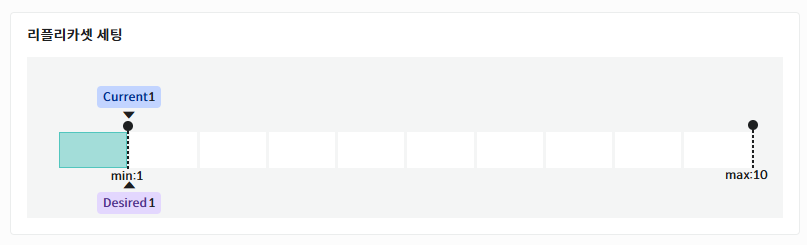
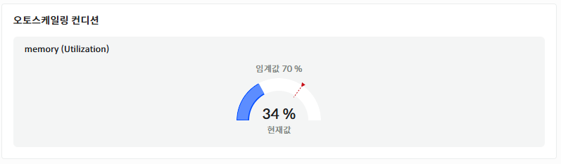
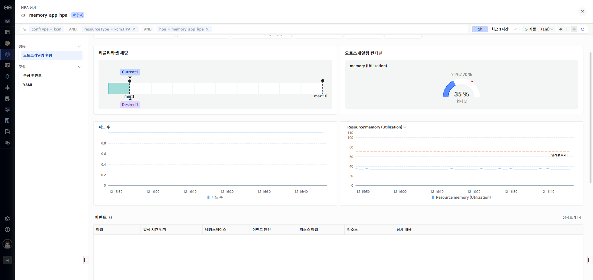
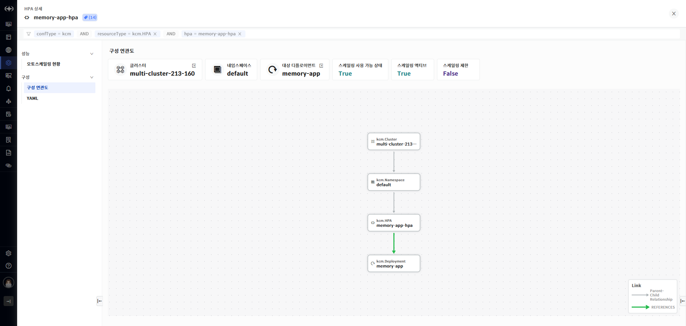
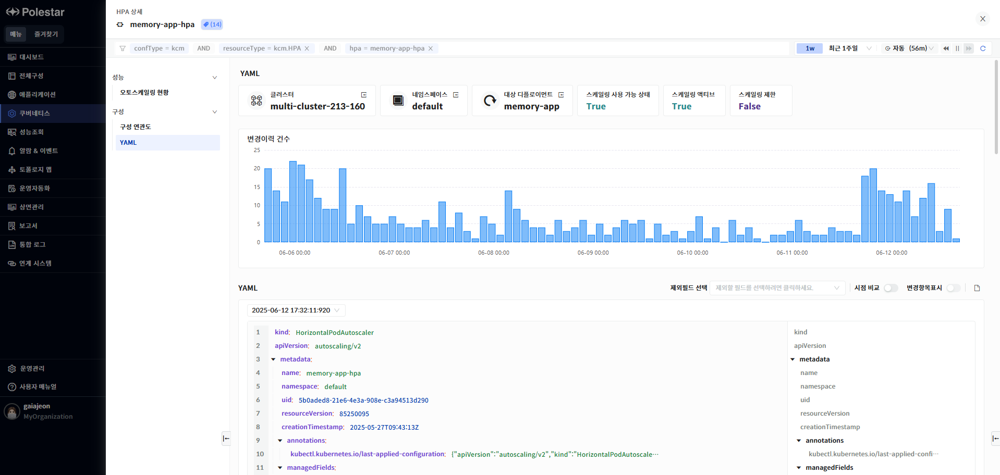
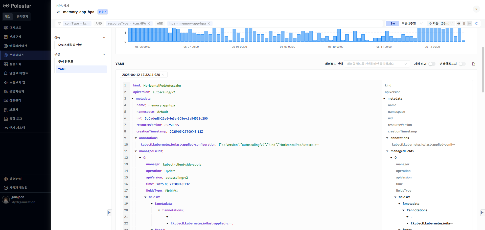
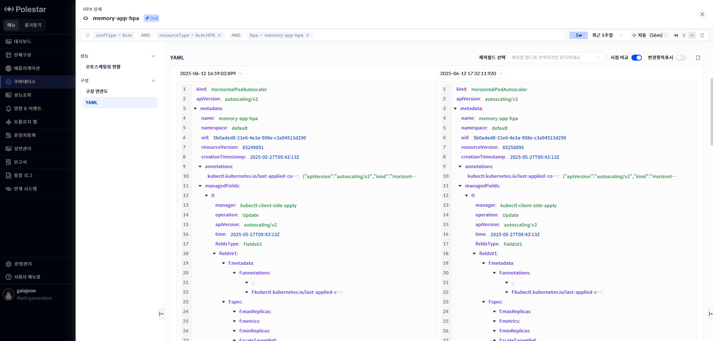

HPA 목록

HPA목록 화면에서는 전체 HPA목록과 각 HPA의 기본 정보와 설정 정보를 확인할 수 있습니다.

> ▶ \[그림1\] HPA
> 
> HPA

<table>
<thead>
<tr class="header">
<th>HPA</th>
<th>HPA명을 표시합니다.</th>
</tr>
</thead>
<tbody>
<tr class="odd">
<td>클러스터</td>
<td>클러스터 명을 표시합니다.</td>
</tr>
<tr class="even">
<td>네임스페이스</td>
<td>HPA의 네임스페이스 명을 표시합니다.</td>
</tr>
<tr class="odd">
<td>대상 디폴로이먼트</td>
<td>HPA가 적용되는 대상 디폴로이먼트명을 표시합니다.</td>
</tr>
<tr class="even">
<td>스케일링 가능 여부</td>
<td>스케일링 가능 여부를 표시합니다.</td>
</tr>
<tr class="odd">
<td>스케일링 액티브</td>
<td>스케일링 액티브 상태를 표시합니다.</td>
</tr>
<tr class="even">
<td>스케일링 제한</td>
<td>스케일링 제한 상태를 표시합니다.</td>
</tr>
<tr class="odd">
<td>에이지</td>
<td>
HPA생성시점으로 현재까지 경과 시간을 표시합니다.

계산 방식 : 현재 타임스탬프 – HPA 생성시점의 타임스탬프
</td>
</tr>
</tbody>
</table>

> HPA상세 화면 이동

1.  상세 성능 및 구성 정보를 확인하고자 하는 HPA 명을 클릭.

HPA 상세 현황

상세 현황 화면에서는 선택한 HPA의 기본 정보와 리플라카셋 설정 및 오토스케일링 조건, 설정된 임계값과 현재 값, 파드 수, 오토스케일러에 의해 발생하는 이벤트를 차트로 확인할 수 있습니다.

오토스케일링 현황

> ▶ \[그림 2\] 오토스케일링 현황
> 
> HPA

<table>
<thead>
<tr class="header">
<th>클러스터</th>
<th>
클러스터 명을 표시합니다.

클러스터의 더보기 아이콘을 클릭하여 클러스터 상세화면으로 이동할 수 있습니다.
</th>
</tr>
</thead>
<tbody>
<tr class="odd">
<td>네임스페이스</td>
<td>
네임스페이스 명을 표시합니다.

네임스페이스의 더보기 아이콘을 클릭하여 네임스페이스 상세화면으로 이동할 수 있습니다.
</td>
</tr>
<tr class="even">
<td>대상 디플로이먼트</td>
<td>
HPA가 적용되는 대상 디플로이먼트명을 표시합니다.

대상 디플로이먼트의 더보기 아이콘을 클릭하여 디플로이먼트 상세화면으로 이동할 수 있습니다.
</td>
</tr>
<tr class="odd">
<td>스케일링 가능 여부</td>
<td>스케일링 가능 여부를 표시합니다.</td>
</tr>
<tr class="even">
<td>스케일링 액티브</td>
<td>스케일링 액티브 상태를 표시합니다.</td>
</tr>
<tr class="odd">
<td>스케일링 제한</td>
<td>스케일링 제한 상태를 표시합니다.</td>
</tr>
<tr class="even">
<td>에이지</td>
<td>
HPA생성시점으로 현재까지 경과 시간을 표시합니다.

계산 방식 : 현재 타임스탬프 – HPA 생성시점의 타임스탬프
</td>
</tr>
</tbody>
</table>

리플리카셋 설정

HPA에 의해 설정된 리플리카셋 설정 정보를 표시합니다.

Current는 현재 파드 수, Desired는 HPA에 의해 요구되어지는 파드 수, min은 현재 HPA의 리플리카 설정의 최소 파드수, max는 최대 파드수를 표시합니다.

> ▶ \[그림 3\] 리플리카셋 설정 정보 차트

오토스케일링 컨디션

HPA에 의해 설정된 오토스케일링 컨디션과 현재값이 표시됩니다. 임계값은 오토스케일링이 동작하는 경계값을 의미하며 현재값은 HPA에 설정된 지표의 현재값을 의미합니다. 현재값이 임계값을 초과하면 오토스케일링이 동작하게 됩니다.

> ▶ \[그림 4\] 오토스케일링 컨디션 차트

이벤트

HPA에 의해 발생한 이벤트 목록을 확인할 수 있습니다.

> ▶ \[그림 5\] HPA 이벤트
> 
> 이벤트

| 타입     | 쿠버네티스 이벤트 타입을 표시합니다. 정상(Normal)과 주의(Warning)으로 표시됩니다. |
| ------ | ----------------------------------------------------- |
| 발생시간   | 이벤트 발생 시간을 표시합니다.                                     |
| 네임스페이스 | 이벤트가 발생한 리소스의 네임스페이스를 표시합니다.                          |
| 이벤트 원인 | 이벤트 원인을 표시합니다.                                        |
| 리소스타입  | 이벤트가 발생한 리소스 타입을 표시합니다.                               |
| 리소스    | 이벤트가 발생한 쿠버네티스 리소스를 표시합니다.                            |
| 상세내용   | 이벤트 상세 내용을 표시합니다                                      |

구성 연관도

> ▶ \[그림 6\] HPA구성 연관도

구성 연관도

선택한 리소스가 가지고 있는 다른 리소스와의 연관관계를 관계도로 표시합니다. 리소스의 상하위 관계를 파악할 수 있으며 리소스의 상태 및 알람 발생 상태가 툴팁을 통해 표시됩니다.

YAML

HPA에 대한 YAML 정보를 제공합니다.태그 필터를 통해 특정 필터 영역을 빠르게 조회할 수 있습니다. YAML의 과거 변경 시점의 내용을 확인 할 수 있으며 YAML 변경 시점간의 비교가 가능합니다.

> ▶ \[그림 7\] YAML
> 
> YAML 조회

1.  YAML 아래에 있는 드랍다운 리스트에서 조회하고자 하는 YAML변경 시점을 선택합니다.

2.  제외 필드를 사용하여 YAML 내용에서 제외하고 싶은 필드를 선택합니다. “managedField”와 “status” 필드를 제외할 수 있습니다.

3.  YAML 표시란의 오른쪽에 표시되어 있는 필드 필터 기능을 사용하여 특정 필드를 빠르게 찾을 수 있습니다.

> ▶ \[그림 8\] YAML 조회
> 
> YAML 비교

1.  \[시점 비교\] 토글 버튼을 On 상태로 변경합니다.

2.  \[시점 비교\] 토클 버튼이 On된 상태에서는 YAML 표시 공간이 두 개로 나뉘어집니다.

3.  화면 오른쪽 YAML 표시 컬럼에는 최근에 조회한 YAML이 표시됩니다. YAML조회 기능에서 특정 시점을 선택하지 않았다면 가장 최근의 YAML이 표시됩니다.

4.  화면 왼쪽YAML 표시 컬럼에는 화면 오른쪽 조회 시점보다 과거 시점의 YAML을 표시할 수 있으며 화면 왼쪽 YAML 표시 컬럼의 상단의 드릴다운 리스트에는 변경 시점 목록이 표시됩니다. 변경 시점의 목록 중 화면 오른쪽 YAML 시점보다 과거 시점만 하이라이트 되어 표시됩니다. 회색으로 표시되는 시점은 화면 오른쪽 시점과 동일한 시점이거나 미래 시점인 경우입니다.

5.  화면 왼쪽 YAML 시점 목록이 표시되는 드릴 다운 리스트에서 비교하고자 하는 변경 시점을 선택합니다.

6.  시점 비교 기능에서도 제외필드 선택 기능을 사용할 수 있습니다.

7.  \[변경항목표시\] 토글 버튼을 On으로 설정하면 변경 항목이 색상으로 표시되어 시점간 비교 내용을 확인 할 수 있습니다.

> ▶ \[그림 9\] YAML 비교

<table>
<tbody>
<tr class="odd">
<td>
노트

YAML 화면에서는 변경 시점과 YAML의 현재 시점도 표시됩니다. 최근에 등록된 YAML의 경우 등록 시점(변경시점으로 저장된)과 현재 시점의 내용이 동일 할 수 있습니다. YAML 비교 기능 사용 시 과거 시점과 현재 시점(화면 조회시간으로 표시) 내용이 동일한 경우 등록 이후 변경된 내용이 없는 경우입니다.
</td>
</tr>
</tbody>
</table>

> YAML 다운로드

1.  YAML표시란의 오른쪽 상단의 다운로드 아이콘을 클릭하면 YAML을 다운로드 할 수 있습니다.

2.  YAML 조회 기능 화면(\[시점 비교\] 토글 버튼 Off상태)에서는 하나의 YAML만 다운됩니다.

3.  YAML 비교 기능 화면(\[시점 비교\] 토글 버튼 On상태)에서 과거 시점이 선택된 경우 두 개의 YAML 파일이 다운됩니다

