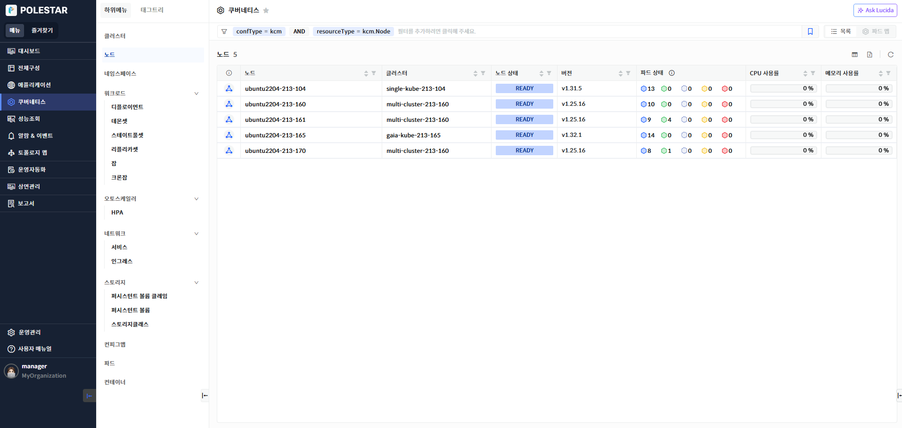
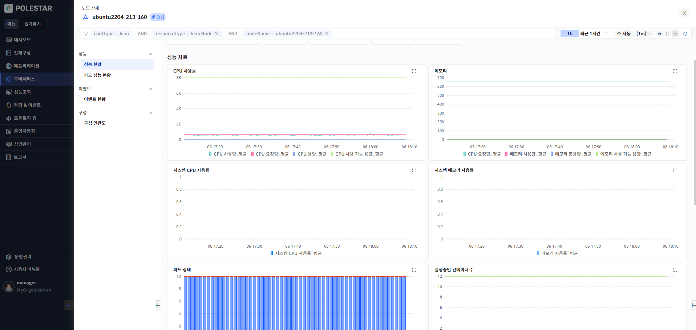
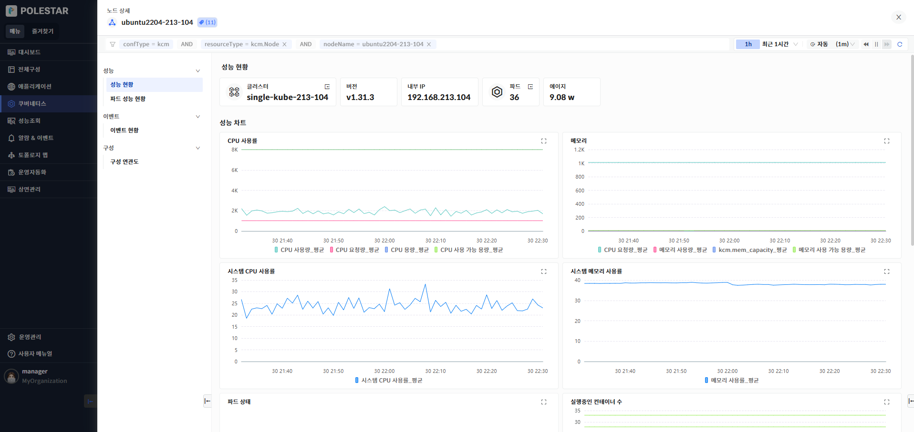
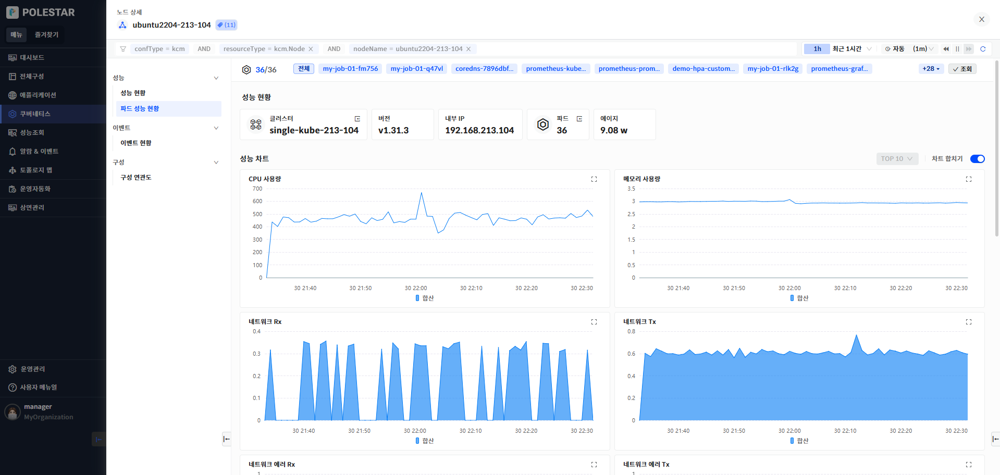
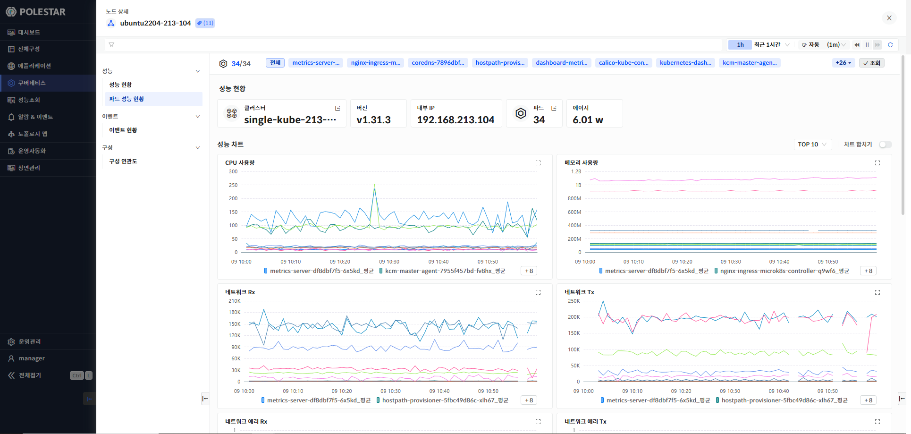
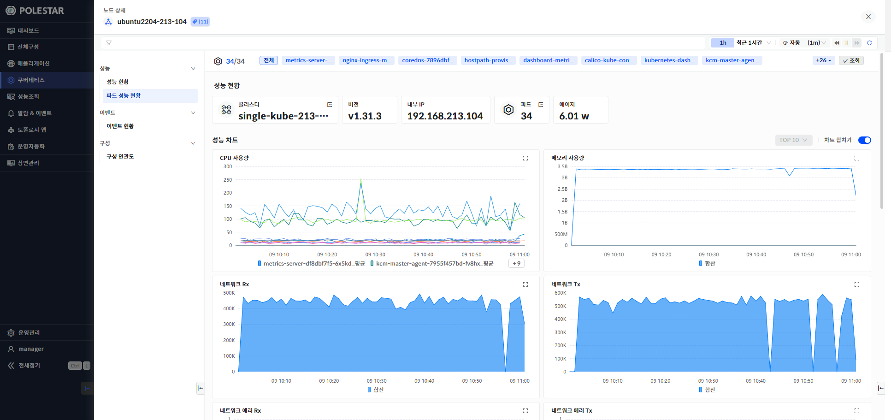
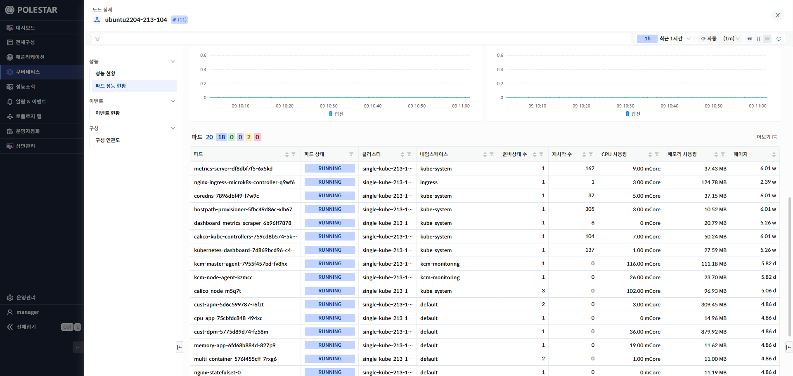
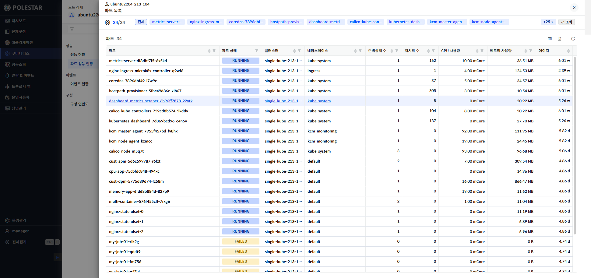
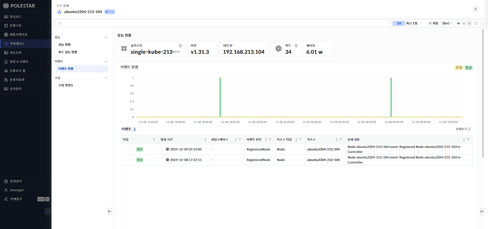
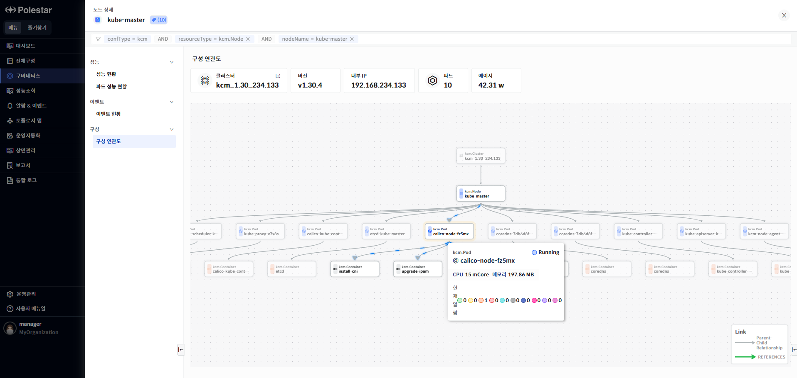

노드 목록

노드 목록 화면에서는 전체 노드 목록과 각 노드의 기본 정보와 CPU와 메모리 사용률과 같은 성능 정보를 확인 할 수 있습니다.

> ▶ \[그림1\] 노드
> 
> 노드

<table>
<thead>
<tr class="header">
<th>노드</th>
<th>노드 명을 표시합니다.</th>
</tr>
</thead>
<tbody>
<tr class="odd">
<td>클러스터</td>
<td>쿠버네티스 클러스터명을 표시합니다. 에이전트에서 설정한 쿠버네티스 클러스터명이 표시됩니다.</td>
</tr>
<tr class="even">
<td>노드 상태</td>
<td>노드 상태를 표시합니다</td>
</tr>
<tr class="odd">
<td>버전</td>
<td>노드의 쿠버네티스 버전을 표시합니다.</td>
</tr>
<tr class="even">
<td>파드 상태</td>
<td>
노드에 등록되어 있는 파드를 상태별 개수를 조회하여 표시합니다.

에이전트가 다운되어 있어 수집을 하지 못할 경우 N/A(Not Available)로 표시됩니다.

<table>
<thead>
<tr class="header">
<th></th>
<th>: 파드 Running 상태</th>
</tr>
</thead>
<tbody>
<tr class="odd">
<td></td>
<td>: 파드 Succeeded상태</td>
</tr>
<tr class="even">
<td></td>
<td>: 파드 Unknown 상태</td>
</tr>
<tr class="odd">
<td></td>
<td>: 파드 Fail 상태</td>
</tr>
<tr class="even">
<td></td>
<td>: 파드 Pending 상태</td>
</tr>
</tbody>
</table></td>
</tr>
<tr class="odd">
<td>CPU 사용률</td>
<td>
노드의 CPU 사용률을 표시합니다.

단위 : %
</td>
</tr>
<tr class="even">
<td>메모리 사용률</td>
<td>
노드의 메모리 사용률을 표시합니다.

단위 : %
</td>
</tr>
<tr class="odd">
<td>내부 IP</td>
<td>노드의 내부 IP를 표시합니다.</td>
</tr>
<tr class="even">
<td>에이지</td>
<td>
노드 리소스 생성시점으로 현재까지 경과 시간을 표시합니다.

계산 방식 : 현재 타임스탬프 – 노드 생성시점의 타임스탬프
</td>
</tr>
</tbody>
</table>

> 노드 상세 화면 이동

1.  상세 성능 및 구성 정보를 확인하고자 하는 노드명을 클릭.

노드 상세 현황

노드 상세 현황 화면에서는 선택한 노드의 기본 정보와 노드 성능을 차트로 확인할 수 있습니다.

성능 현황

> ▶ \[그림2\] 노드 성능 현황
> 
> 노드

<table>
<thead>
<tr class="header">
<th>클러스터</th>
<th>
클러스터 명을 표시합니다.

클러스터의 더보기 아이콘을 클릭하여 클러스터 상세화면으로 이동할 수 있습니다.
</th>
</tr>
</thead>
<tbody>
<tr class="odd">
<td>버전</td>
<td>노드 버전을 표시합니다.</td>
</tr>
<tr class="even">
<td>내부 IP</td>
<td>노드의 내부 IP를 표시합니다.</td>
</tr>
<tr class="odd">
<td>파드</td>
<td>
노드에서 실행 중인 파드 수를 표시합니다.

파드의 더보기 아이콘을 클릭하여 파드 목록을 확인 할 수 있습니다.
</td>
</tr>
<tr class="even">
<td>에이지</td>
<td>
노드의 생성 후 시간을 표시합니다.

계산 방식 : 현재 타임스탬프 – 노드 생성 시점의 타임스팸프
</td>
</tr>
</tbody>
</table>

성능 차트

노드에서 사용하는 CPU, 메모리, 노드 상태 등의 노드와 관련된 다양한 지표를 제공합니다.

> ▶ \[그림 3\] 노드 성능 차트
> 
> 성능 차트

<table>
<thead>
<tr class="header">
<th>CPU</th>
<th>
노드에서 사용하고 있는 CPU 사용량, 총용량, 용량, 사용 가능 용량을 표시합니다.

단위 : miliCore
</th>
</tr>
</thead>
<tbody>
<tr class="odd">
<td>메모리</td>
<td>
노드에서 사용하고 있는 메모리 요청량, 사용량, 총용량, 사용 가능 용량을 표시합니다.

단위 : byte
</td>
</tr>
<tr class="even">
<td>시스템 CPU 사용률</td>
<td>
노드의 시스템 CPU 사용률을 표시합니다.

단위 : %
</td>
</tr>
<tr class="odd">
<td>시스템 메모리 사용률</td>
<td>
노드의 시스템 메모리 사용률을 표시합니다.

단위 : %
</td>
</tr>
<tr class="even">
<td>파드 상태</td>
<td>
노드에서 수행되고 있는 파드의 상태별 수를 표시합니다.

에이전트가 다운되어 있어 수집을 하지 못할 경우 N/A(Not Available)로 표시됩니다.
</td>
</tr>
<tr class="odd">
<td>실행중인 컨테이너 수</td>
<td>노드에서 실행되고 있는 컨테이너의 수를 표시합니다.</td>
</tr>
<tr class="even">
<td>I/O R/W</td>
<td>
I/O 초당 읽은 건수,초당 쓰기 건수를 표시합니다.

단위 : count
</td>
</tr>
<tr class="odd">
<td>네트워크 Rx/Tx</td>
<td>
노드에서 수행되는 네트워크 Rx/Tx 양을 제공합니다.

단위 : byte
</td>
</tr>
<tr class="even">
<td>네트워크 에러 Rx/Tx</td>
<td>
노드에서 수행되는 네트워크 에러 Rx/Tx 건수를 제공합니다.

단위 : count
</td>
</tr>
</tbody>
</table>

파드 성능 현황

> ▶ \[그림 4\] 노드 파드 성능 현황

성능 차트

노드에 속한 파드의 CPU, 메모리, 네트워크 사용량을 차트로 제공합니다. 화면 상단의 파드 목록을 사용하여 조회하고자 하는 파드를 선택할 수 있습니다.

상위 조회는 상위10, 상위20, 상위 30을 제공합니다.

> ▶ \[그림 5\] 노드 파드 성능 차트

성능 차트 오른쪽의 차트 합치기 버튼을 ON 상태로 설정하면 조회한 파드의 성능 지표가 합쳐진 상태로 하나의 라인으로 표시합니다.

> ▶ \[그림 6\] 노드 파드 성능 차트
> 
> 성능 차트

<table>
<thead>
<tr class="header">
<th>CPU 사용량</th>
<th>
각 파드의 CPU 사용량을 상위 n개 혹은 합계(sum)으로 표시합니다.

단위 : miliCore
</th>
</tr>
</thead>
<tbody>
<tr class="odd">
<td>메모리 사용량</td>
<td>
각 파드의 메모리 사용량을 상위 n개 혹은 합계(sum)으로 표시합니다.

단위 : byte
</td>
</tr>
<tr class="even">
<td>네트워크 Rx</td>
<td>
각 파드의 네트워크 수신 데이터 양을 상위 n개 혹은 합계(sum)으로 표시합니다.

단위 : byte
</td>
</tr>
<tr class="odd">
<td>네트워크 Tx</td>
<td>
각 파드의 네트워크 송신 데이터 양을 상위 n개 혹은 합계(sum)으로 표시합니다.

단위 : byte
</td>
</tr>
<tr class="even">
<td>네트워크 에러 Rx</td>
<td>
각 파드의 네트워크 에러 수신 건수를 상위 n개 혹은 합계(sum)으로 표시합니다.

단위 : 초당 에러 건수
</td>
</tr>
<tr class="odd">
<td>네트워크 에러 Tx</td>
<td>
각 파드의 네트워크 에러 송신 건수를 상위 n개 혹은 합계(sum)으로 표시합니다.

단위 : 초당 에러 건수
</td>
</tr>
</tbody>
</table>

파드 목록

노드에 속한 파드 목록을 제공합니다. 목록 상단에 파드의 상태별 개수 정보를 제공합니다. 파드 목록의 숫자 또는 더보기 아이콘을 사용하여 파드 전체 목록 확인이 가능 합니다.

> ▶ \[그림 7\] 파드 목록

> ▶ \[그림 8\] 파드 더보기
> 
> 파드

<table>
<thead>
<tr class="header">
<th>파드</th>
<th>파드명을 표시합니다.</th>
</tr>
</thead>
<tbody>
<tr class="odd">
<td>파드 상태</td>
<td>
파드의 상태를 표시합니다.

에이전트가 다운되어 있어 수집을 하지 못할 경우 N/A(Not Available)로 표시됩니다.
</td>
</tr>
<tr class="even">
<td>클러스터</td>
<td>파드의 클러스터 명을 표시합니다.</td>
</tr>
<tr class="odd">
<td>네임스페이스</td>
<td>파드의 네임스페이스 명을 표시합니다</td>
</tr>
<tr class="even">
<td>준비 상태</td>
<td>준비 상태를 표시합니다.</td>
</tr>
<tr class="odd">
<td>재시작 수</td>
<td>파드 재시작 수를 표시합니다.</td>
</tr>
<tr class="even">
<td>CPU 사용량</td>
<td>
파드의 CPU 사용량을 표시합니다.

단위 : miliCore
</td>
</tr>
<tr class="odd">
<td>메모리 사용량</td>
<td>
파드의 메모리 사용량을 표시합니다.

단위 : byte
</td>
</tr>
<tr class="even">
<td>에이지</td>
<td>
파드의 생성 후 시간을 표시합니다.

계산 방식 : 현재 타임스탬프 – 파드 생성 시점의 타임스팸프
</td>
</tr>
</tbody>
</table>

이벤트 현황

> ▶ \[그림 9\] 노드 이벤트 현황

이벤트 발생

노드 내에서 발생한 이벤트를 표시합니다. 이벤트는 정상(Normal)과 주의(Warning)상태로 조회 기간에 따른 발생 건수를 차트로 표시하며 이벤트 목록을 제공합니다.

> 이벤트

| 타입     | 쿠버네티스 이벤트 타입을 표시합니다. 정상(Normal)과 주의(Warning)으로 표시됩니다. |
| ------ | ----------------------------------------------------- |
| 발생시간   | 이벤트 발생 시간을 표시합니다.                                     |
| 네임스페이스 | 이벤트가 발생한 리소스의 네임스페이스를 표시합니다.                          |
| 리소스타입  | 이벤트가 발생한 리소스 타입을 표시합니다.                               |
| 이벤트 원인 | 이벤트 원인을 표시합니다.                                        |
| 리소스    | 이벤트가 발생한 쿠버네티스 리소스를 표시합니다.                            |
| 상세내용   | 이벤트 상세 내용을 표시합니다.                                     |

구성 연관도

> ▶ \[그림 10\] 노드 구성 연관도

구성 연관도

선택한 리소스가 가지고 있는 다른 리소스와의 연관관계를 관계도로 표시합니다. 리소스의 상하위 관계를 파악할 수 있으며 리소스의 상태 및 알람 발생 상태가 툴팁을 통해 표시됩니다.

