데몬셋 목록

데몬셋 목록 화면에서는 전체 데몬셋 목록과 각 데몬셋의 기본 정보와 데몬셋 상태를 확인할 수 있는 커런트 수 등의 상태 지표값을 확인 할 수 있습니다

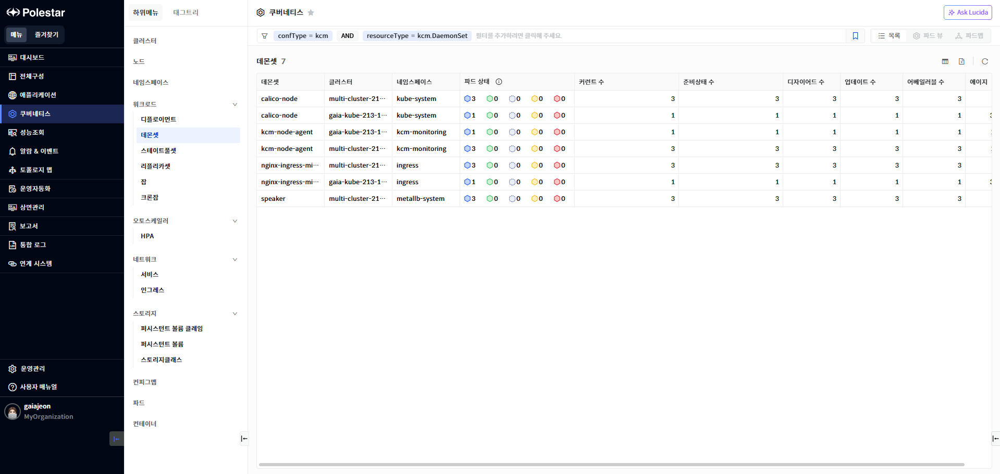

> ▶ \[그림1\] 데몬셋
> 
> 데몬셋

<table>
<thead>
<tr class="header">
<th>데몬셋</th>
<th>데몬셋 명을 표시합니다.</th>
</tr>
</thead>
<tbody>
<tr class="odd">
<td>클러스터</td>
<td>클러스터명을 표시합니다.</td>
</tr>
<tr class="even">
<td>네임스페이스</td>
<td>네임스페이스 명을 표시합니다.</td>
</tr>
<tr class="odd">
<td>파드 상태</td>
<td>
데몬셋에 등록되어 있는 파드를 상태별 개수를 조회하여 표시합니다.

에이전트가 다운되어 있어 수집을 하지 못할 경우 N/A(Not Available)로 표시됩니다.

<table>
<thead>
<tr class="header">
<th></th>
<th>: 파드 Running 상태</th>
</tr>
</thead>
<tbody>
<tr class="odd">
<td></td>
<td>: 파드 Succeeded상태</td>
</tr>
<tr class="even">
<td></td>
<td>: 파드 Unknown 상태</td>
</tr>
<tr class="odd">
<td></td>
<td>: 파드 Fail 상태</td>
</tr>
<tr class="even">
<td></td>
<td>: 파드 Pending 상태</td>
</tr>
</tbody>
</table></td>
</tr>
<tr class="even">
<td>커런트 수</td>
<td>현재 실행 중인 파드 수를 표시합니다.</td>
</tr>
<tr class="odd">
<td>준비상태 수</td>
<td>준비 상태인 파드 수를 표시합니다.</td>
</tr>
<tr class="even">
<td>디자이어드 수</td>
<td>디자이어드 값을 표시합니다.</td>
</tr>
<tr class="odd">
<td>업데이트 수</td>
<td>새 버전으로 업데이트된 파드 수를 표시합니다.</td>
</tr>
<tr class="even">
<td>어베일러블 수</td>
<td>서비스 가능 상태인 파드 수를 표시합니다.</td>
</tr>
<tr class="odd">
<td>에이지</td>
<td>
데몬셋 생성시점으로 현재까지 경과 시간을 표시합니다.

계산 방식 : 현재 타임스탬프 – 데몬셋 생성시점의 타임스탬프
</td>
</tr>
</tbody>
</table>

> 데몬셋 상세 화면 이동

1.  상세 성능 및 구성 정보를 확인하고자 하는 데몬셋 명을 클릭.

데몬셋 상세 현황

데몬셋 상세 현황 화면에서는 선택한 데몬셋의 기본 정보와 데몬셋의 주요 성능을 차트로 확인할 수 있습니다.

성능 현황

> ▶ \[그림2\] 데몬셋 성능 현황
> 
> 데몬셋

<table>
<thead>
<tr class="header">
<th>클러스터</th>
<th>
클러스터 명을 표시합니다.

클러스터의 더보기 아이콘을 클릭하여 클러스터 상세화면으로 이동할 수 있습니다.
</th>
</tr>
</thead>
<tbody>
<tr class="odd">
<td>네임스페이스</td>
<td>
네임스페이스 명을 표시합니다.

네임스페이스의 더보기 아이콘을 클릭하여 네임스페이스 상세화면으로 이동할 수 있습니다.
</td>
</tr>
<tr class="even">
<td>커런트 수</td>
<td>커런트 수를 표시합니다.</td>
</tr>
<tr class="odd">
<td>디자이어드 수</td>
<td>디자이어드 수를 표시합니다.</td>
</tr>
<tr class="even">
<td>준비상태 수</td>
<td>준비상태를 표시합니다.</td>
</tr>
<tr class="odd">
<td>업데이트 수</td>
<td>새 버전으로 업데이트된 파드 수를 표시합니다.</td>
</tr>
<tr class="even">
<td>어베일러블 수</td>
<td>서비스 가능 상태인 파드 수를 표시합니다.</td>
</tr>
<tr class="odd">
<td>파드</td>
<td>
파드 수를 표시합니다.

파드의 더보기 아이콘을 클릭하여 파드 목록을 확인 할 수 있습니다.
</td>
</tr>
<tr class="even">
<td>에이지</td>
<td>
데몬셋의 생성 후 시간을 표시합니다.

계산 방식 : 현재 타임스탬프 – 데몬셋 생성 시점의 타임스팸프
</td>
</tr>
</tbody>
</table>

성능 차트

데몬셋에서 사용하는 CPU, 메모리, 데몬셋 스케줄 정보 등의 데몬셋과 관련된 다양한 지표를 제공합니다.

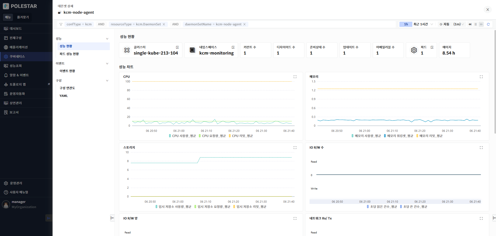

> ▶ \[그림 3\] 데몬셋 성능 차트
> 
> 성능 차트

<table>
<thead>
<tr class="header">
<th>CPU</th>
<th>
데몬셋에서 사용하고 있는 CPU 사용량, 요청량, 리밋을 표시합니다.

단위 : miliCore
</th>
</tr>
</thead>
<tbody>
<tr class="odd">
<td>메모리</td>
<td>
데몬셋에서 사용하고 있는 메모리 사용량, 워킹셋, 리밋을 표시합니다.

단위 : byte
</td>
</tr>
<tr class="even">
<td>스토리지</td>
<td>
데몬셋에서 사용하고 있는 스토리지의 사용량, 요청량, 리밋을 표시합니다.

단위 : byte
</td>
</tr>
<tr class="odd">
<td>I/O R/W 수</td>
<td>
데몬셋에서 수행되는 디스크 I/O 읽기, 쓰기 수를 표시합니다

단위 : count
</td>
</tr>
<tr class="even">
<td>I/O R/W 양</td>
<td>
데몬셋에서 수행되는 디스크 I/O 읽기, 양를 표시합니다

단위 : byte
</td>
</tr>
<tr class="odd">
<td>네트워크 Rx/Tx</td>
<td>
데몬셋에서 수행되는 네트워크 Rx/Tx 양을 표시합니다

단위 : byte
</td>
</tr>
<tr class="even">
<td>네트워크 에러 Rx/Tx</td>
<td>
데몬셋에서 수행되는 네트워크 에러 Rx/Tx 건수를 표시합니다.

단위 : byte
</td>
</tr>
<tr class="odd">
<td>데몬셋 스케줄</td>
<td>스케줄드, 미스스케줄드, 디자이어드 스케줄드 데몬셋 수를 표시합니다</td>
</tr>
<tr class="even">
<td>데몬셋 준비상태</td>
<td>준비상태, 미준비상태 데몬셋 수를 표시합니다.</td>
</tr>
<tr class="odd">
<td>데몬셋 업데이트</td>
<td>업데이티드, 아웃데이티드 데몬셋 수를 표시합니다.</td>
</tr>
</tbody>
</table>

파드 성능 현황

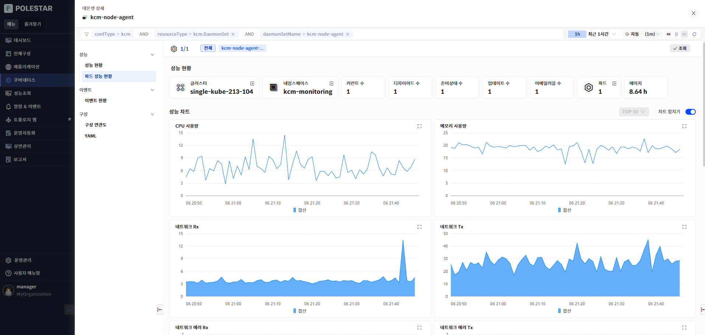

> ▶ \[그림4\] 데몬셋 파드 성능 현황

파드 성능 차트

데몬셋에 속한 파드의 CPU, 메모리, 네트워크 사용량을 차트로 제공합니다. 화면 상단의 파드 목록을 사용하여 조회하고자 하는 파드를 선택할 수 있습니다.

상위 조회는 상위10, 상위20, 상위 30을 제공합니다.

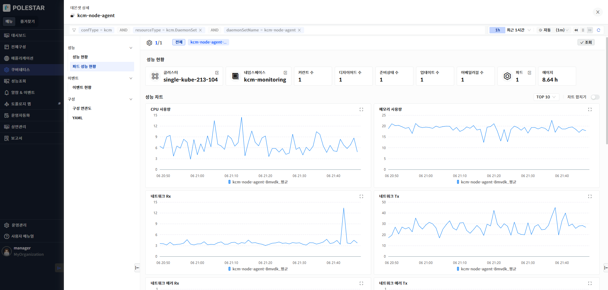

> ▶ \[그림 5\] 데몬셋 파드 성능 차트

성능 차트 오른쪽의 차트 합치기 버튼을 ON 상태로 설정하면 조회한 파드의 성능 지표가 합쳐진 상태로 하나의 라인으로 표시합니다.

> ▶ \[그림 6\] 데몬셋 파드 성능 차트 – 합치기
> 
> 성능 차트

<table>
<thead>
<tr class="header">
<th>CPU 사용량</th>
<th>
각 파드의 CPU 사용량을 상위 n개 혹은 합계(sum)으로 표시합니다.

단위 : miliCore
</th>
</tr>
</thead>
<tbody>
<tr class="odd">
<td>메모리 사용량</td>
<td>
각 파드의 메모리 사용량을 상위 n개 혹은 합계(sum)으로 표시합니다.

단위 : byte
</td>
</tr>
<tr class="even">
<td>네트워크 Rx</td>
<td>
각 파드의 네트워크 수신 데이터 양을 상위 n개 혹은 합계(sum)으로 표시합니다.

단위 : byte
</td>
</tr>
<tr class="odd">
<td>네트워크 Tx</td>
<td>
각 파드의 네트워크 송신 데이터 양을 상위 n개 혹은 합계(sum)으로 표시합니다.

단위 : byte
</td>
</tr>
<tr class="even">
<td>네트워크 에러 Rx</td>
<td>
각 파드의 네트워크 에러 수신 건수를 상위 n개 혹은 합계(sum)으로 표시합니다.

단위 : count
</td>
</tr>
<tr class="odd">
<td>네트워크 에러 Tx</td>
<td>
각 파드의 네트워크 에러 송신 건수를 상위 n개 혹은 합계(sum)으로 표시합니다.

단위 : count
</td>
</tr>
</tbody>
</table>

파드 목록

데몬셋에 속한 파드 목록을 제공합니다. 목록 상단에 파드의 상태별 개수 정보를 제공합니다. 파드 목록의 숫자 또는 더보기 아이콘을 사용하여 파드 전체 목록 확인이 가능 합니다.

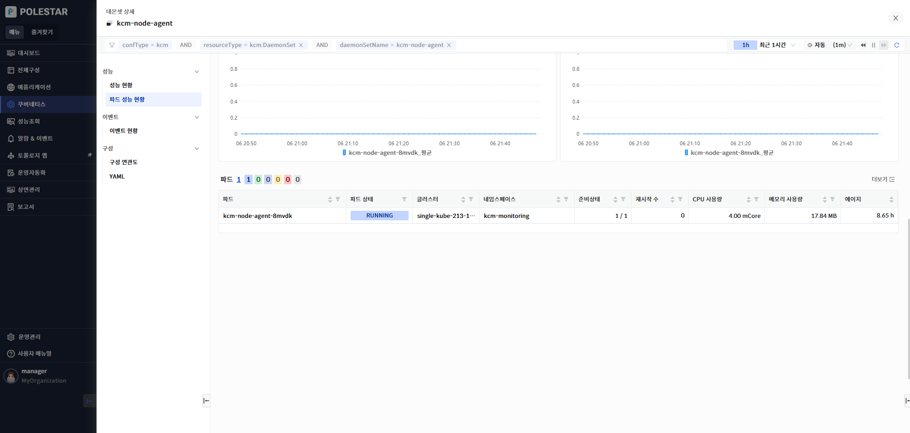

> ▶ \[그림 7\] 파드 목록

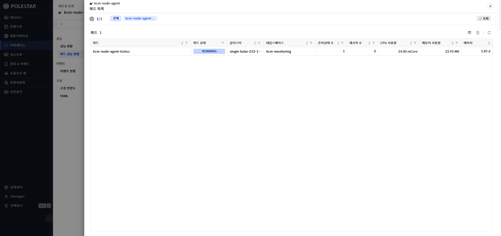

> ▶ \[그림 8\] 파드 더보기
> 
> 파드

<table>
<thead>
<tr class="header">
<th>파드</th>
<th>파드명을 표시합니다.</th>
</tr>
</thead>
<tbody>
<tr class="odd">
<td>파드 상태</td>
<td>
파드의 상태를 표시합니다.

에이전트가 다운되어 있어 수집을 하지 못할 경우 N/A(Not Available)로 표시됩니다.
</td>
</tr>
<tr class="even">
<td>클러스터</td>
<td>파드의 클러스터 명을 표시합니다.</td>
</tr>
<tr class="odd">
<td>네임스페이스</td>
<td>파드의 네임스페이스 명을 표시합니다.</td>
</tr>
<tr class="even">
<td>준비 상태</td>
<td>준비 상태를 표시합니다.</td>
</tr>
<tr class="odd">
<td>재시작 수</td>
<td>파드 재시작 수를 표시합니다.</td>
</tr>
<tr class="even">
<td>CPU 사용량</td>
<td>
파드의 CPU 사용량을 표시합니다.

단위 : miliCore
</td>
</tr>
<tr class="odd">
<td>메모리 사용량</td>
<td>
파드의 메모리 사용량을 표시합니다.

단위 : byte
</td>
</tr>
</tbody>
</table>

<table>
<tbody>
<tr class="odd">
<td>에이지</td>
<td>
파드의 생성 후 시간을 표시합니다.

계산 방식 : 현재 타임스탬프 – 파드 생성 시점의 타임스팸프
</td>
</tr>
</tbody>
</table>

이벤트 현황

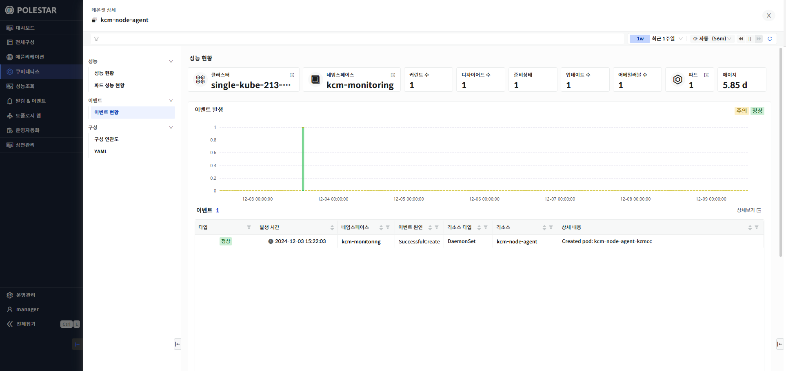

> ▶ \[그림 9\] 데몬셋 이벤트 현황

이벤트 발생

데몬셋내에서 발생한 이벤트를 표시합니다. 이벤트는 정상(Normal)과 주의(Warning)상태로 조회 기간에 따른 발생 건수를 차트로 표시하며 이벤트 목록을 제공합니다.

> 이벤트

| 타입     | 쿠버네티스 이벤트 타입을 표시합니다. 정상(Normal)과 주의(Warning)으로 표시됩니다. |
| ------ | ----------------------------------------------------- |
| 발생시간   | 이벤트 발생 시간을 표시합니다.                                     |
| 네임스페이스 | 이벤트가 발생한 리소스의 네임스페이스를 표시합니다.                          |
| 리소스타입  | 이벤트가 발생한 리소스 타입을 표시합니다.                               |
| 이벤트 원인 | 이벤트 원인을 표시합니다.                                        |
| 리소스    | 이벤트가 발생한 쿠버네티스 리소스를 표시합니다.                            |
| 상세내용   | 이벤트 상세 내용을 표시합니다.                                     |

구성 연관도

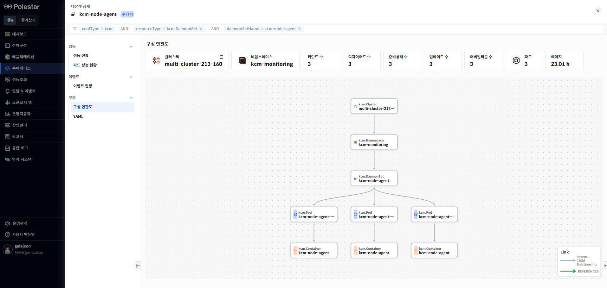

> ▶ \[그림 10\] 데몬셋 구성 연관도

구성 연관도

선택한 리소스가 가지고 있는 다른 리소스와의 연관관계를 관계도로 표시합니다. 리소스의 상하위 관계를 파악할 수 있으며 리소스의 상태 및 알람 발생 상태가 툴팁을 통해 표시됩니다.

YAML

데몬셋에 대한 YAML 정보를 제공합니다. 태그 필터를 통해 특정 필터 영역을 빠르게 조회할 수 있습니다. YAML의 과거 변경 시점의 내용을 확인 할 수 있으며 YAML 변경 시점간의 비교가 가능합니다.

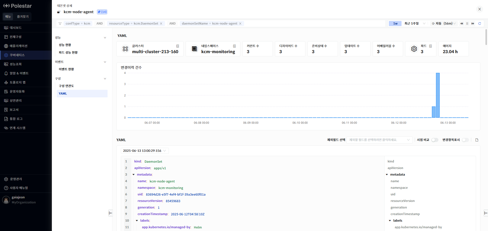

> ▶ \[그림 11\] YAML
> 
> YAML 조회

1.  YAML 아래에 있는 드랍다운 리스트에서 조회하고자 하는 YAML변경 시점을 선택합니다.

2.  제외 필드를 사용하여 YAML 내용에서 제외하고 싶은 필드를 선택합니다. “managedField”와 “status” 필드를 제외할 수 있습니다.

3.  YAML 표시란의 오른쪽에 표시되어 있는 필드 필터 기능을 사용하여 특정 필드를 빠르게 찾을 수 있습니다.

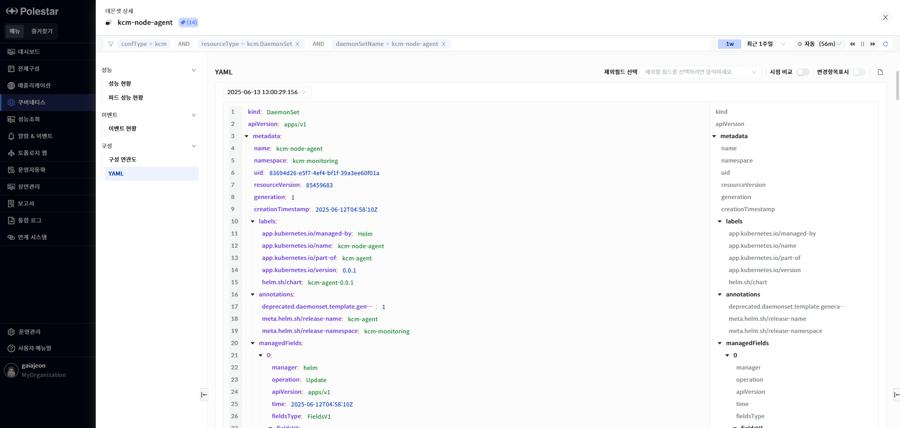

> ▶ \[그림 12\] YAML 조회
> 
> YAML 비교

1.  \[시점 비교\] 토글 버튼을 On 상태로 변경합니다.

2.  \[시점 비교\] 토클 버튼이 On된 상태에서는 YAML 표시 공간이 두 개로 나뉘어집니다.

3.  화면 오른쪽 YAML 표시 컬럼에는 최근에 조회한 YAML이 표시됩니다. YAML조회 기능에서 특정 시점을 선택하지 않았다면 가장 최근의 YAML이 표시됩니다.

4.  화면 왼쪽YAML 표시 컬럼에는 화면 오른쪽 조회 시점보다 과거 시점의 YAML을 표시할 수 있으며 화면 왼쪽 YAML 표시 컬럼의 상단의 드릴다운 리스트에는 변경 시점 목록이 표시됩니다. 변경 시점의 목록 중 화면 오른쪽 YAML 시점보다 과거 시점만 하이라이트 되어 표시됩니다. 회색으로 표시되는 시점은 화면 오른쪽 시점과 동일한 시점이거나 미래 시점인 경우입니다.

5.  화면 왼쪽 YAML 시점 목록이 표시되는 드릴 다운 리스트에서 비교하고자 하는 변경 시점을 선택합니다.

6.  시점 비교 기능에서도 제외필드 선택 기능을 사용할 수 있습니다.

7.  \[변경항목표시\] 토글 버튼을 On으로 설정하면 변경 항목이 색상으로 표시되어 시점간 비교 내용을 확인 할 수 있습니다.

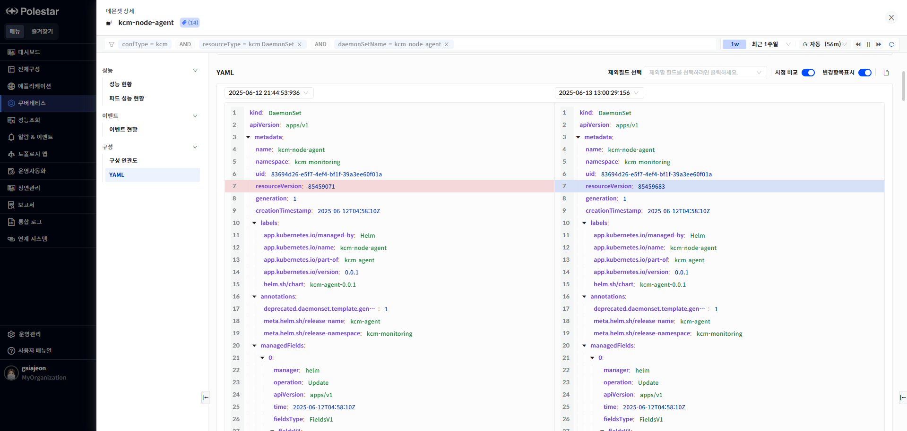

> ▶ \[그림 13\] YAML 비교

<table>
<tbody>
<tr class="odd">
<td>
노트

YAML 화면에서는 변경 시점과 YAML의 현재 시점도 표시됩니다. 최근에 등록된 YAML의 경우 등록 시점(변경시점으로 저장된)과 현재 시점의 내용이 동일 할 수 있습니다. YAML 비교 기능 사용 시 과거 시점과 현재 시점(화면 조회시간으로 표시) 내용이 동일한 경우 등록 이후 변경된 내용이 없는 경우입니다.
</td>
</tr>
</tbody>
</table>

> YAML 다운로드

1.  YAML표시란의 오른쪽 상단의 다운로드 아이콘을 클릭하면 YAML을 다운로드 할 수 있습니다.

2.  YAML 조회 기능 화면(\[시점 비교\] 토글 버튼 Off상태)에서는 하나의 YAML만 다운됩니다.

3.  YAML 비교 기능 화면(\[시점 비교\] 토글 버튼 On상태)에서 과거 시점이 선택된 경우 두 개의 YAML 파일이 다운됩니다

