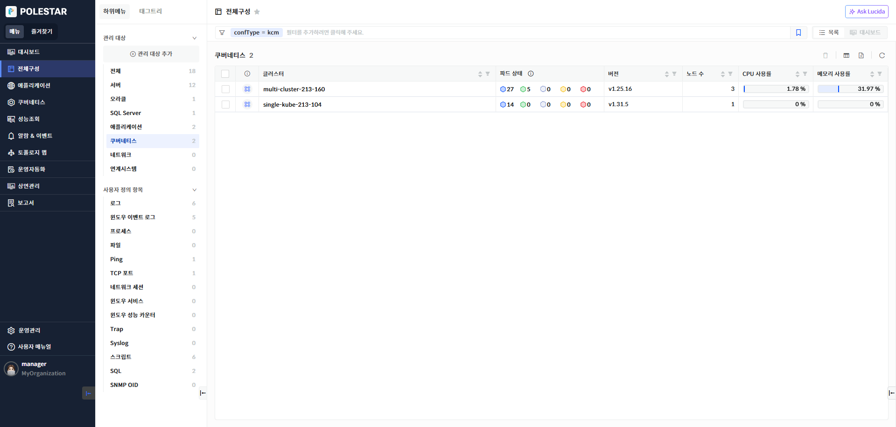
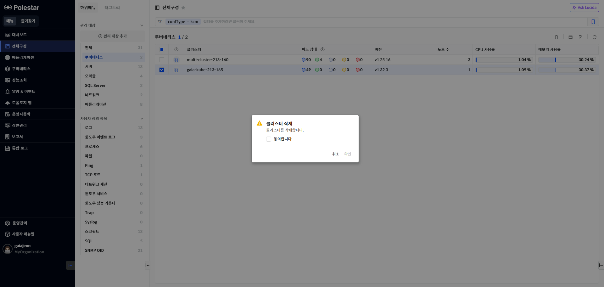
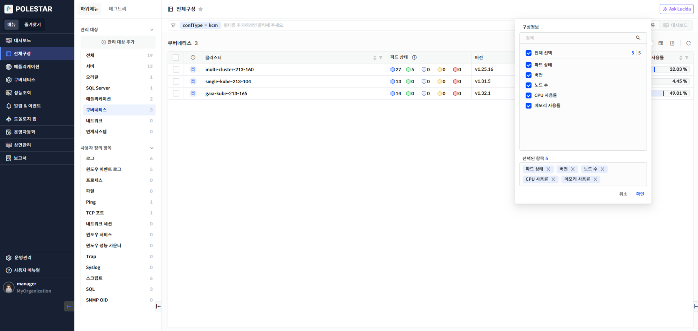
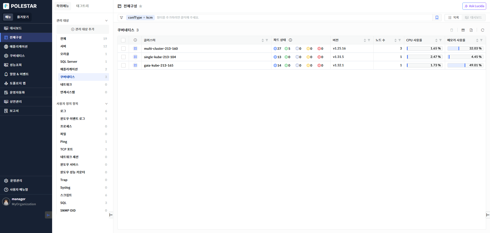

쿠버네티스 목록

전체 구성에서 \[쿠버네티스\]의 \[더보기\>\] 선택하면 전체 쿠버네티스의 클러스터목록을 확인할 수 있습니다. 쿠버네티스는 클러스터단위로 조회할 수 있습니다.

<table>
<tbody>
<tr class="odd">
<td>
노트

전체 구성에서 관리되는 클러스터는 [전체구성] 메뉴의 [관리 대상 추가] 에서 쿠버네티스[관리 대상 등록]을 통해 등록되어야 합니다.
</td>
</tr>
</tbody>
</table>

> ▶ \[그림1\] 쿠버네티스 목록
> 
> 쿠버네티스

<table>
<thead>
<tr class="header">
<th>클러스터</th>
<th><table>
<tbody>
<tr class="odd">
<td>쿠버네티스 클러스터명을 표시합니다. 에이전트에서 설정한 쿠버네티스 클러스터명이 표시됩니다.</td>
</tr>
</tbody>
</table></th>
</tr>
</thead>
<tbody>
<tr class="odd">
<td>파드 상태</td>
<td>
클러스터에 등록되어 있는 파다를 상태별 갯수를 조회하여 표시합니다.

에이전트가 다운되어 있어 수집을 하지 못할 경우 N/A(Not Available)로 표시됩니다.

<table>
<thead>
<tr class="header">
<th></th>
<th>: 파드 Running 상태</th>
</tr>
</thead>
<tbody>
<tr class="odd">
<td></td>
<td>: 파드 Succeeded상태</td>
</tr>
<tr class="even">
<td></td>
<td>: 파드 Unknown 상태</td>
</tr>
<tr class="odd">
<td></td>
<td>: 파드 Fail 상태</td>
</tr>
<tr class="even">
<td></td>
<td>: 파드 Pending 상태</td>
</tr>
</tbody>
</table></td>
</tr>
<tr class="even">
<td>버전</td>
<td>클러스터의 쿠버네티스 버전을 표시합니다.</td>
</tr>
<tr class="odd">
<td>노드 수</td>
<td>클러스터의 노드수를 표시합니다.</td>
</tr>
<tr class="even">
<td>CPU 사용률</td>
<td>
클러스터의 CPU 사용률을 표시합니다.

단위 : %
</td>
</tr>
<tr class="odd">
<td>메모리 사용률</td>
<td>
클러스터의 메모리 사용률을 표시합니다.

단위 : %
</td>
</tr>
</tbody>
</table>

쿠버네티스 삭제

삭제할 쿠버네티스를 선택하고 \[삭제\] 버튼을 선택하면 해당 쿠버네티스의 클러스터를 삭제할 수 있습니다.

클러스터가 삭제되면 클러스터내에 속해 있는 하위리소스(노드, 네임스페이스,워크로드, 스토리지 등의 클러스터의 모든 하위 리소스도 수집서버에서 삭제됩니다. 하지만 쿠버네티스 환경에서 에이전트를 제거하지 않으면 관리 대상 추가화면에서 등록 대기 상태로 나타날 수 있습니다. 완전히 삭제 하기 위해서는 아래 노트를 참조합니다.

▶ \[그림2\] 쿠버네티스 클러스터 삭제

<table>
<tbody>
<tr class="odd">
<td>
노트

쿠버네티스의 에이전트를 영구히 삭제하기 위해서는 쿠버네티스 환경에서 에이전트를 제거해야합니다. 쿠버네티스 에이전트 삭제 방법은 쿠버네티스 관리자 매뉴얼을 참고하세요.
</td>
</tr>
</tbody>
</table>

> 쿠버네티스 삭제 절차

1.  삭제하고자 하는 쿠버네티스 선택 (다중 선택 가능)

2.  테이블 우측 상단의 삭제 아이콘 클릭

3.  메시지창에서 확인 클릭

컬럼 수정

목록의 우측 상단 \[컬럼 수정\] 버튼을 통해 쿠버네티스 목록에 원하는 컬럼을 표시하거나 제외할 수 있습니다. 엑셀 저장시에도 컬럼 수정을 통해 표시된 컬럼만 저장됩니다. 컬럼 수정 팝업창에서는 컬럼 검색 기능을 제공하며 선택된 항목을 하단에 표시하고 표시된 컬럼을 제외할 수 있는 기능을 제공합니다.

> \[그림3\] 쿠버네티스 목록 컬럼 수정
> 
> 쿠버네티스 목록 컬럼 수정 절차

1.  쿠버네티스 목록에서 우측 상단 컬럼 수정 아이콘 클릭

2.  컬럼 수정 팝업창에서 화면에 표시하고자 하는 컬럼을 체크박스에서 선택

3.  저장 버튼 클릭

엑셀 저장

쿠버네티스 목록의 우측 상단 \[엑셀 저장\] 버튼을 통해 클러스터 목록을 엑셀로 저장할 수 있습니다. 컬럼 수정 기능, 상단 태그 검색 기능, 그리드 컬럼 검색 기능 등을 통해 엑셀에 보여줄 컬럼과 내용을 원하는 조건에 맞게 필터링하여 저장할 수 있습니다.

▶ \[그림4\] 쿠버네티스 목록 엑셀 저장

> 쿠버네티스 목록 엑셀 저장 및 조회 절차

1.  쿠버네티스 목록에서 우측 상단 엑셀 저장 아이콘 클릭

2.  브라우저 우측 상단 창에 저장된 엑셀 파일명이 표시됨

3.  해당 파일명을 클릭하여 엑셀 파일 확인

