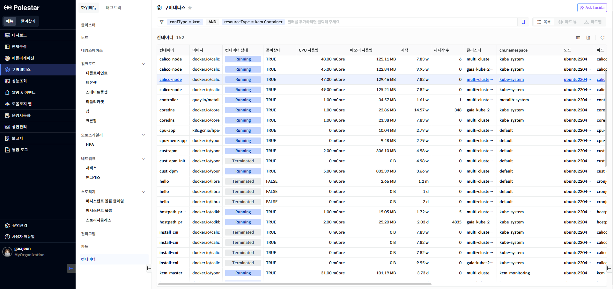
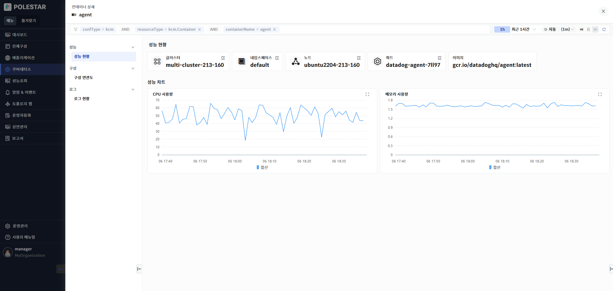
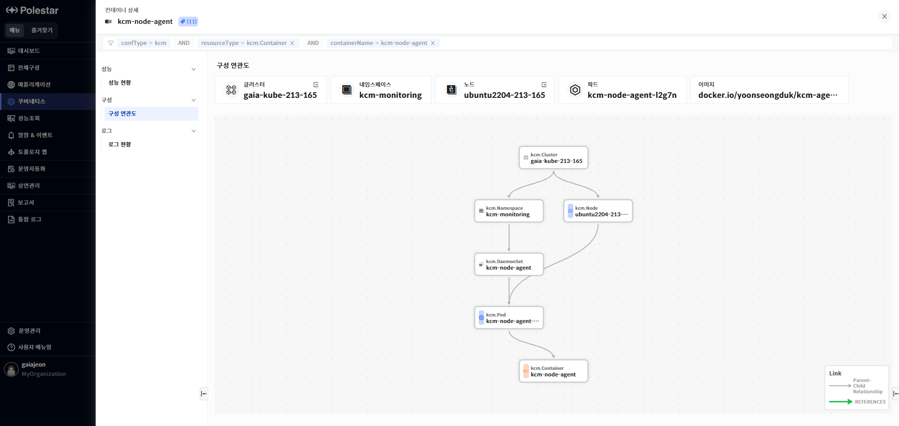
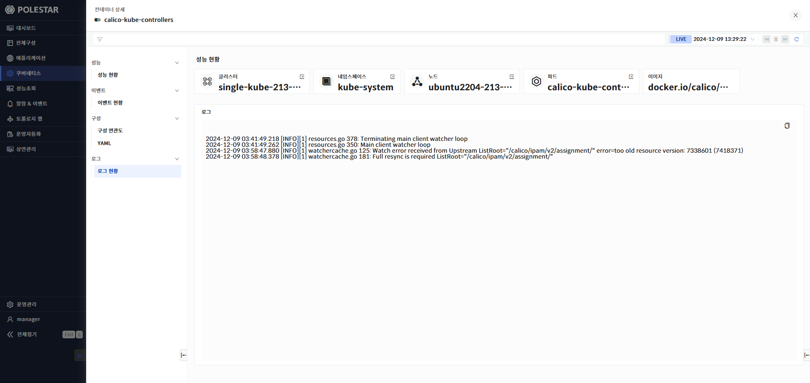

컨테이너 목록

컨테이너 목록 화면에서는 전체 컨테이너 목록과 각 컨테이너의 기본 정보 및 상태를 확인할 수 있습니다.

> ▶ \[그림1\] 컨테이너
> 
> 컨테이너

<table>
<thead>
<tr class="header">
<th>컨테이너</th>
<th>컨테이너 명을 표시합니다.</th>
</tr>
</thead>
<tbody>
<tr class="odd">
<td>이미지</td>
<td>컨테이너 이미지 정보를 표시합니다.</td>
</tr>
<tr class="even">
<td>컨테이너 상태</td>
<td>컨테이너 상태를 표시합니다.</td>
</tr>
<tr class="odd">
<td>준비상태</td>
<td>컨테이너 준비 상태를 표시합니다.</td>
</tr>
<tr class="even">
<td>CPU 사용량</td>
<td>
CPU 사용량을 표시합니다.

단위 : miliCore
</td>
</tr>
<tr class="odd">
<td>메모리 사용량</td>
<td>
메모리 사용량을 표시합니다.

단위 : byte
</td>
</tr>
<tr class="even">
<td>시작</td>
<td>컨테이너 시작 시점을 표시합니다.</td>
</tr>
<tr class="odd">
<td>재시작 수</td>
<td>재시작 수를 표시합니다.</td>
</tr>
<tr class="even">
<td>클러스터</td>
<td>쿠버네티스 클러스터명을 표시합니다. 에이전트에서 설정한 쿠버네티스 클러스터명이 표시됩니다.</td>
</tr>
<tr class="odd">
<td>네임스페이스</td>
<td>네임스페이스 명을 표시합니다</td>
</tr>
<tr class="even">
<td>노드</td>
<td>노드 명을 표시합니다.</td>
</tr>
<tr class="odd">
<td>파드</td>
<td>파드 명을 표시합니다.</td>
</tr>
<tr class="even">
<td>CPU 리밋</td>
<td>
컨테이너가 사용할 수 있는 최대 CPU 코어

단위 : miliCore
</td>
</tr>
<tr class="odd">
<td>CPU 요청량</td>
<td>
컨테이너를 스케줄 할 때 기준이 되는 최소 보장 CPU 코어

단위 : miliCore
</td>
</tr>
<tr class="even">
<td>메모리 리밋</td>
<td>
컨테이너가 사용할 수 있는 최대 메모리 크기

단위 : byte
</td>
</tr>
<tr class="odd">
<td>메모리 요청량</td>
<td>
컨테이너를 스케줄 할 때 기준이 되는 최소 보장 메모리 크기

단위 : byte
</td>
</tr>
<tr class="even">
<td>I/O 읽기 수</td>
<td>
컨테이너가 수행한 읽기 횟수

단위 : count
</td>
</tr>
<tr class="odd">
<td>I/O 쓰기 수</td>
<td>
컨테이너가 수행한 쓰기 횟수

단위 : count
</td>
</tr>
<tr class="even">
<td>I/O 읽기 양</td>
<td>
컨테이너가 수행한 읽기 양

단위 : byte
</td>
</tr>
<tr class="odd">
<td>I/O 쓰기 양</td>
<td>
파드가 수행한 쓰기 양

단위 : byte
</td>
</tr>
</tbody>
</table>

> 컨테이너 상세 화면 이동

1.  구성 정보를 확인하고자 하는 컨테이너 명을 클릭.

컨테이너 상세 현황

컨테이너 상세 현황 화면에서는 선택한 컨테이너의 기본 정보와 컨테이너 성능을 차트로 확인할 수 있습니다.

성능 현황

> ▶ \[그림2\] 컨테이너 성능 현황
> 
> 컨테이너

<table>
<thead>
<tr class="header">
<th>클러스터</th>
<th>
컨테이너의 실행 중인 파드의 클러스터 명을 표시합니다.

클러스터의 더보기 아이콘을 클릭하여 클러스터 상세화면으로 이동할 수 있습니다.
</th>
</tr>
</thead>
<tbody>
<tr class="odd">
<td>네임스페이스</td>
<td>
컨테이너의 실행 중인 파드의 네임스페이스명을 표시합니다.

네임스페이스의 더보기 아이콘을 클릭하여 네임스페이스 상세화면으로 이동할 수 있습니다.
</td>
</tr>
<tr class="even">
<td>노드</td>
<td>
컨테이너의 실행 중인 파드의 노드명을 표시합니다.

노드의 더보기 아이콘을 클릭하여 노드 상세화면으로 이동할 수 있습니다.
</td>
</tr>
<tr class="odd">
<td>파드</td>
<td>
컨테이너의 파드명을 표시합니다.

파드의 더보기 아이콘을 클릭하여 파드 상세화면으로 이동할 수 있습니다.
</td>
</tr>
<tr class="even">
<td>이미지</td>
<td>컨테이너 이미지 정보를 표시합니다.</td>
</tr>
</tbody>
</table>

성능 차트

컨테이너의 CPU, 메모리, 네트워크 사용량을 차트로 제공합니다.

> ▶ \[그림 3\] 컨테이너 성능 차트
> 
> 성능 차트

<table>
<thead>
<tr class="header">
<th>CPU 사용량</th>
<th>
컨테이너의 CPU 사용량을 표시합니다.

단위 : miliCore
</th>
</tr>
</thead>
<tbody>
<tr class="odd">
<td>메모리 사용량</td>
<td>
컨테이너의 메모리 사용량을 표시합니다.

단위 : byte
</td>
</tr>
</tbody>
</table>

구성 연관도

> ▶ \[그림 4\] 컨테이너 구성 연관도

구성 연관도

선택한 리소스가 가지고 있는 다른 리소스와의 연관관계를 관계도로 표시합니다. 리소스의 상하위 관계를 파악할 수 있으며 리소스의 상태 및 알람 발생 상태가 툴팁을 통해 표시됩니다.

로그 현황

> ▶ \[그림 5\] 컨테이너로그

로그

컨테이너의 로그를 확인할 수 있습니다. 컨테이너 로그는 현재 수행 중인 로그가 보여지며 중지된 컨테이너에 대해서는 로그를 확인할 수 없습니다.

