클러스터 상세

클러스터 상세 화면에서는 선택한 클러스터의 기본 정보 및 주요 성능, 파드 목록 및 파드 성능을 차트로 확인할 수 있습니다. 클러스터 구조되를 통해 하위 리소스들을 조회할 수 있으며 , 이벤트를 조회하고, 관리상태, 성능 수집 및 관리자 권한 등에 대한 설정 기능도 제공합니다.

태그 상세 정보

화면 상단의 \[태그\] 버튼을 클릭하여 클러스터에 등록되어 있는 태그 정보를 관리할 수 있습니다.

> 기본 정보

| 쿠버네티스 버전 | 쿠버네티스의 버전을 표시합니다.      |
| -------- | ---------------------- |
| 노드 수     | 클러스터의 노드 수를 표시합니다.     |
| 네임스페이스 수 | 클러스터의 네임스페이스 수를 표시합니다. |
| 디플로이먼트 수 | 클러스터의 디플로이먼트 수를 표시합니다. |
| 파드 수     | 클러스터의 파드 수를 표시합니다.     |

시스템 태그

POLESTAR 시스템에 의해 자동 등록된 태그입니다. 시스템 태그는 사용자가 변경 및 삭제할 수 없습니다.

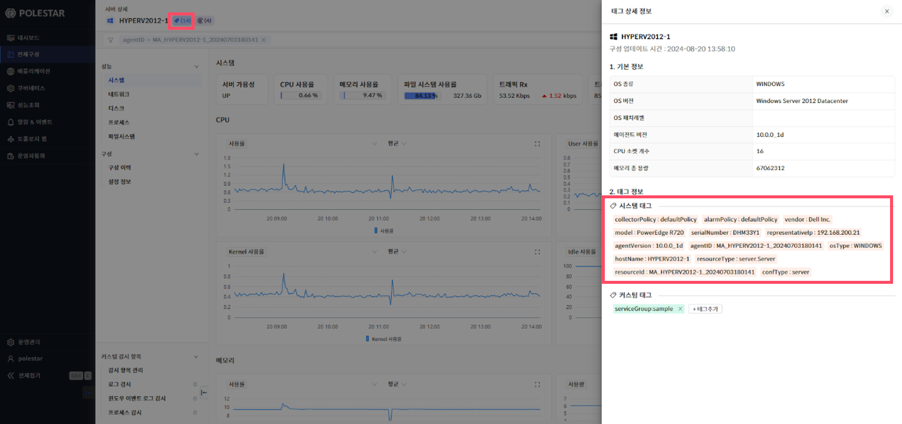

▶ \[그림3\] 시스템 태그

커스텀 태그

사용자가 등록한 태그입니다. 사용자의 목적에 따라 등록, 수정 및 삭제할 수 있습니다.

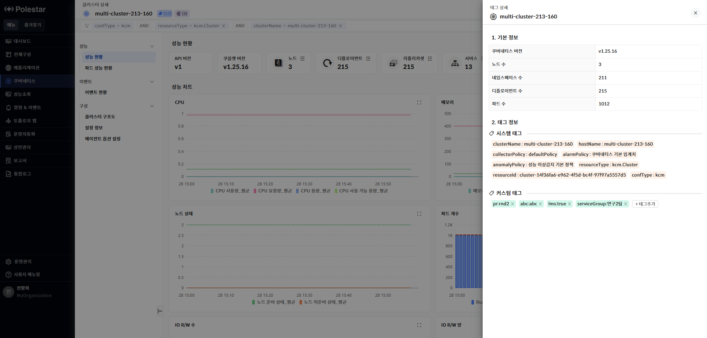

▶ \[그림4\] 커스텀 태그

커스텀 태그 추가

커스텀 태그의 \[태그추가\] 버튼을 선택하여 서버 장비에 커스텀 태그를 등록할 수 있습니다. 이미 등록되어 있는 태그키를 사용하거나, 새로운 태그키를 입력할 수 있습니다.

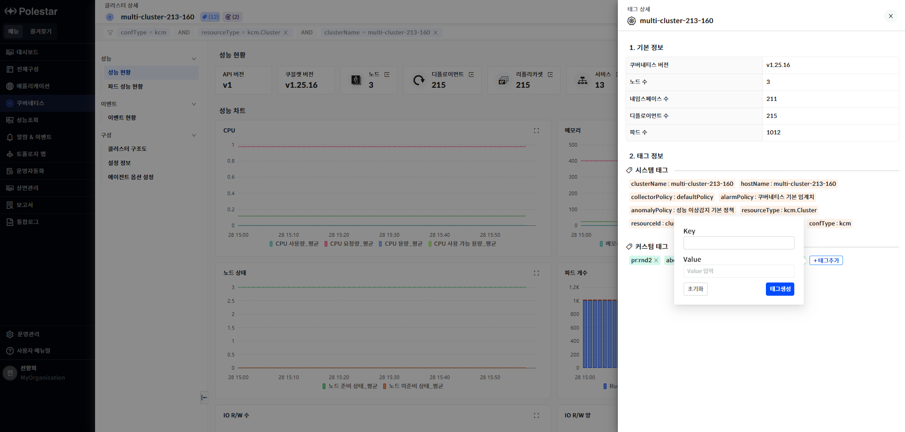

▶ \[그림5\] 커스텀 태그 추가

커스텀 태그 추가 절차

1.  태그 상세 정보 드로어에서 \[태그추가\] 버튼 클릭

2.  태그 추가용 팝업창에서 ‘Key’ 입력란을 클릭하여 등록되어 있는 커스텀 태그 키 선택

3.  신규 커스텀 태그기를 추가하는 경우, 태그 키 목록 상단의 ‘직접입력’ 선택하고 태그 키 입력

4.  ‘Value’ 입력란에 태그 값 입력

5.  \[태그생성\] 버튼 클릭

6.  커스텀 태그 추가 메시지창에서 \[확인\] 버튼 클릭

커스텀 태그 수정

등록한 커스텀 태그의 값을 변경할 수 있습니다.

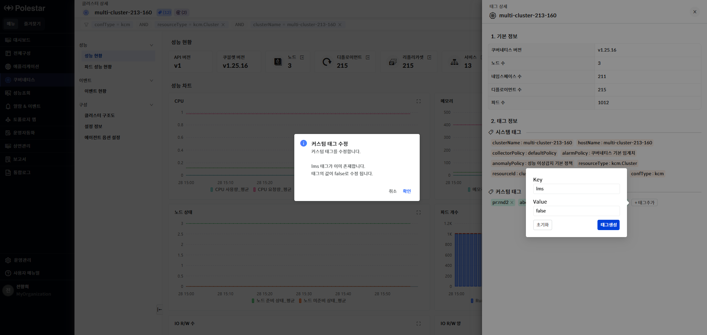

▶ \[그림6\] 커스텀 태그 수정

커스텀 태그 수정 절차

1.  태그 상세 정보 드로어에서 \[태그추가\] 버튼 클릭

2.  태그 추가용 팝업창에서 ‘Key’ 입력란을 클릭하고 값을 변경할 태그 키 선택

3.  변경할 태그 값을 ‘Value’ 입력란에 입력

4.  \[태그생성\] 버튼 클릭

5.  커스텀 필터 수정 메시지창에서 \[확인\] 버튼 클릭

커스텀 태그 삭제

등록된 커스텀 태그를 삭제할 수 있습니다.

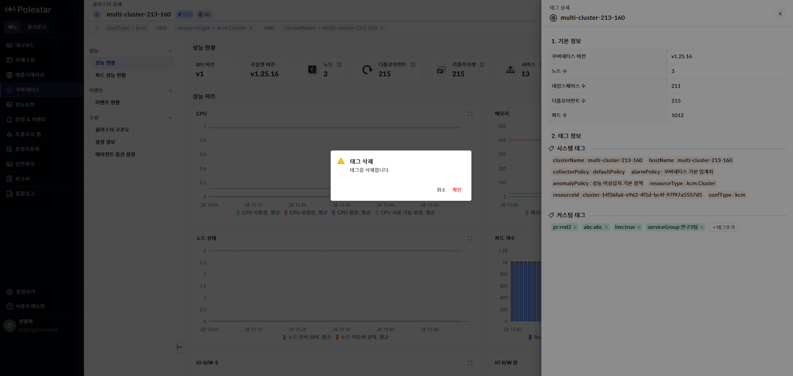

▶ \[그림7\] 커스텀 태그 삭제

커스텀 태그 삭제 절차

1.  태그 상세 정보 드로어에서 삭제할 태그의 ‘X’ 버튼 클릭

2.  커스텀 필터 삭제 메시지창에서 \[확인\] 버튼 클릭

오퍼레이션

화면 상단의 \[오퍼레이션\] 버튼을 클릭하여 클러스터에서 지원하는 오퍼레이션을 실행할 수 있습니다. 사용자는 실행한 오퍼레이션 결과를 다운로드 받을 수 있습니다.

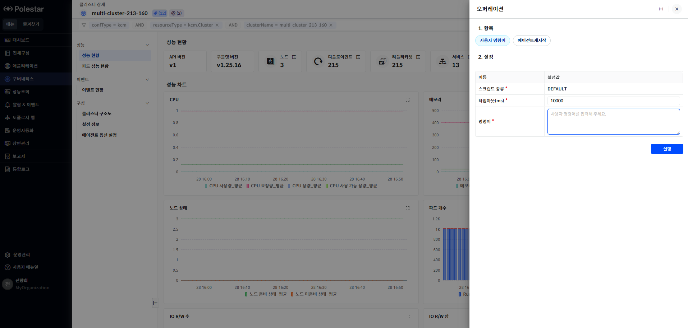

▶ \[그림8\] 오퍼레이션

사용자 명령어

클러스터에 입력된 명령어를 실행하여 결과를 확인할 수 있습니다. kubectl에서 실행될 수 있는 위험한 명령이나 사용자 실수를 유발할 수 있는 명령은 제한됩니다.

<table>
<tbody>
<tr class="odd">
<td>
노트

클러스터에서 실행할 명령어는 “kubectl”로 시작되어야 합니다.
</td>
</tr>
</tbody>
</table>

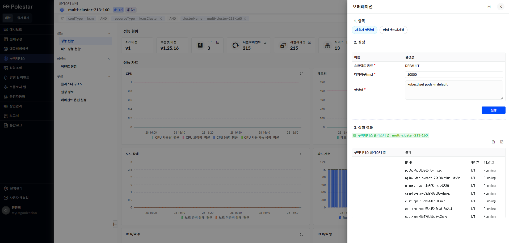

▶ \[그림11\] 사용자 명령어

입력 항목

| 타임아웃 | 응답 대기 시간을 입력합니다. (기본값: 10000, 단위: 밀리초(ms))          |
| ---- | --------------------------------------------------- |
| 명령어  | 클러스터에서 실행할 명령어를 입력합니다. 제한된 문구를 포함한 명령어는 실행할 수 없습니다. |

에이전트 재시작

클러스터에 설치된 POLESTAR 에이전트를 재시작합니다. 에이전트가 재시작 되는 동안은 알람 발생 및 구성/성능 수집이 중지됩니다.

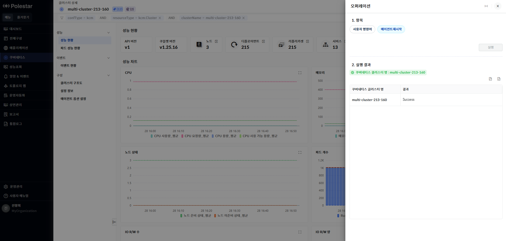

▶ \[그림9\] 에이전트 재시작

성능 현황

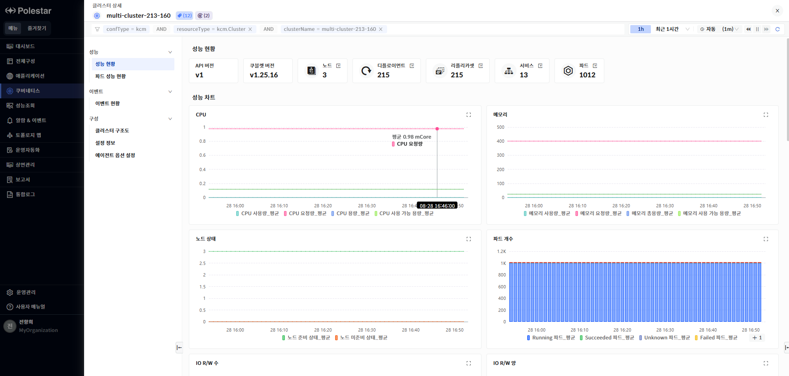

> ▶ \[그림 1\] 클러스터 성능 현황
> 
> 클러스터

<table>
<thead>
<tr class="header">
<th>API 버전</th>
<th>쿠버네티스의 API 버전을 제공합니다.</th>
</tr>
</thead>
<tbody>
<tr class="odd">
<td>쿠불렛 버전</td>
<td>클러스터 내의 노드의 쿠블렛 버전을 제공합니다. 여러 개의 쿠불렛 버전을 제공할 경우 툴팁을 통해 확인할 수 있습니다.</td>
</tr>
<tr class="even">
<td>노드</td>
<td>
클러스터의 노드 수를 표시합니다.

노드의 더보기 아이콘을 클릭하여 노드 목록을 확인 할 수 있습니다.
</td>
</tr>
<tr class="odd">
<td>디플로이먼트</td>
<td>
클러스터의 디플로이먼트 수를 표시합니다.

디플로이먼트의 더보기 아이콘을 클릭하여 디플로이먼트 목록을 확인 할 수 있습니다.
</td>
</tr>
<tr class="even">
<td>리플리카셋</td>
<td>
클러스터의 리플리카셋 수를 표시합니다.

리플리카셋의 더보기 아이콘을 클릭하여 리플리카셋 목록을 확인 할 수 있습니다.
</td>
</tr>
<tr class="odd">
<td>서비스</td>
<td>
서비스 수를 표시합니다.

서비스의 더보기 아이콘을 클릭하여 서비스 목록을 확인 할 수 있습니다.
</td>
</tr>
<tr class="even">
<td>파드</td>
<td>
파드 수를 표시합니다.

파드의 더보기 아이콘을 클릭하여 파드 목록을 확인 할 수 있습니다.
</td>
</tr>
</tbody>
</table>

성능 차트

클러스터에서 사용하는 CPU, 메모리, 노드 상태 등의 클러스터와 관련된 다양한 지표를 제공하며 네임스페이스 또는 노드 기준으로 지표를 조회할 수 있는 차트를 제공합니다.

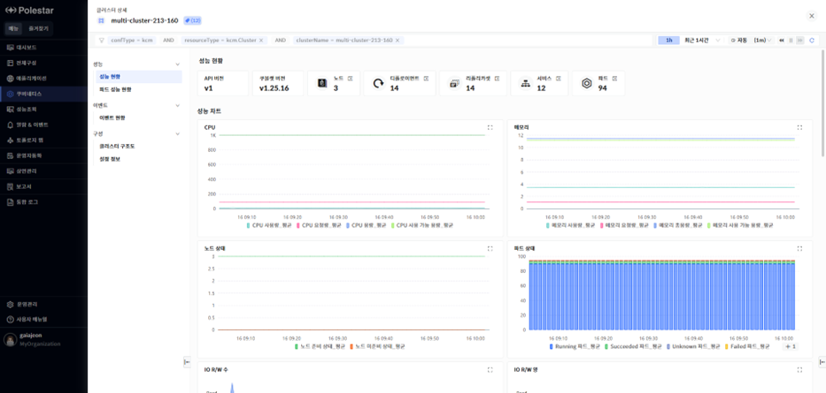

> ▶ \[그림 2\] 클러스터 성능 차트

클러스터내에서 수집하는 지표를 노드, 네임스페이스 단위로 조회할 수 있습니다.

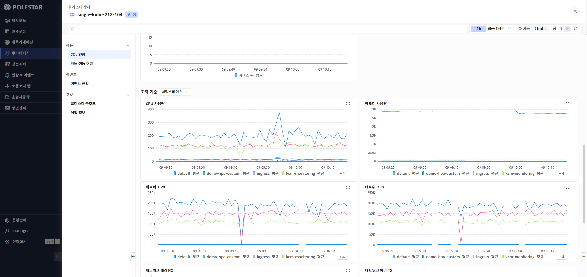

> ▶ \[그림 3\] 노드, 네임스페이스 기준 조회 차트
> 
> 성능 차트

<table>
<thead>
<tr class="header">
<th>CPU</th>
<th>
클러스터에서 사용하고 있는 CPU 사용량, 요청량, 용량, 사용 가능 용량을 표시합니다.

단위 : miliCore
</th>
</tr>
</thead>
<tbody>
<tr class="odd">
<td>메모리</td>
<td>
클러스터에서 사용하고 있는 메모리 사용량, 요청량, 총 용량, 사용 가능 용량을 표시합니다.

단위 : byte
</td>
</tr>
<tr class="even">
<td>노드 상태</td>
<td>
클러스터 내의 노드 상태에 따라 노드 수를 표시합니다.

노드는 노드 준비 상태(Ready), 노드 미준비 상태(Not Ready)가 있습니다.
</td>
</tr>
<tr class="odd">
<td>파드 상태</td>
<td>클러스터에 등록되어 있는 파드를 상태별 개수를 조회하여 표시합니다.</td>
</tr>
<tr class="even">
<td>I/O R/W 수</td>
<td>
I/O 초당 읽은 건수,초당 쓰기 건수를 표시합니다.

단위 : count
</td>
</tr>
<tr class="odd">
<td>I/O R/W 양</td>
<td>
I/O 초당 읽은 데이터양, 초당 쓴 데이터양을 표시합니다.

단위 : byte
</td>
</tr>
<tr class="even">
<td>서비스 수</td>
<td>
서비스 수를 표시합니다.

지표 선택 목록에서 디플로이먼트 수, 스테이트풀셋 수, 데몬셋 수, 잡 수를 선택하여 확인할 수 있습니다.

단위 : count
</td>
</tr>
</tbody>
</table>

> 조회 기준 차트

<table>
<thead>
<tr class="header">
<th>CPU 사용량</th>
<th>
조회기준을 네임스페이스 또는 노드 기준으로 나누어 각 구성 단위별 CPU 사용량을 표시합니다.

단위 : miliCore
</th>
</tr>
</thead>
<tbody>
<tr class="odd">
<td>메모리 사용</td>
<td>
조회기준을 네임스페이스 또는 노드 기준으로 나누어 각 구성 단위별 메모리 사용량을 표시합니다.

단위 : byte
</td>
</tr>
<tr class="even">
<td>네트워크 Rx</td>
<td>
조회기준을 네임스페이스 또는 노드 기준으로 나누어 각 구성 단위별 네트워크 Rx양을 표시합니다.

단위 : byte
</td>
</tr>
<tr class="odd">
<td>네트워크 Tx</td>
<td>
조회기준을 네임스페이스 또는 노드 기준으로 나누어 각 구성 단위별 네트워크 Tx양을 표시합니다.

단위 : byte
</td>
</tr>
<tr class="even">
<td>네트워크 에러 Rx</td>
<td>
조회기준을 네임스페이스 또는 노드 기준으로 나누어 각 구성 단위별 네트워크 에러 Rx 발생건수를 표시합니다.

단위 : count
</td>
</tr>
<tr class="odd">
<td>네트워크 에러 Tx</td>
<td>
조회기준을 네임스페이스 또는 노드 기준으로 나누어 각 구성 단위별 네트워크 에러 Tx 발생건수를 표시합니다.

단위 : count
</td>
</tr>
<tr class="even">
<td>I/O 읽기 수</td>
<td>
조회기준을 네임스페이스 또는 노드 기준으로 나누어 각 구성 단위별 I/O 읽기 수를 표시합니다.

단위 : count

지표 선택 목록에서 I/O 읽기 양을 선택하여 조회할 수 있습니다.

단위 : byte
</td>
</tr>
<tr class="odd">
<td>I/O 쓰기 수</td>
<td>
조회기준을 네임스페이스 또는 노드 기준으로 나누어 각 구성 단위별 I/O 쓰기 수를 표시합니다.

단위 : count

지표 선택 목록에서 I/O 쓰기 양을 선택하여 조회할 수 있습니다.

단위 : byte
</td>
</tr>
</tbody>
</table>

파드 성능 현황

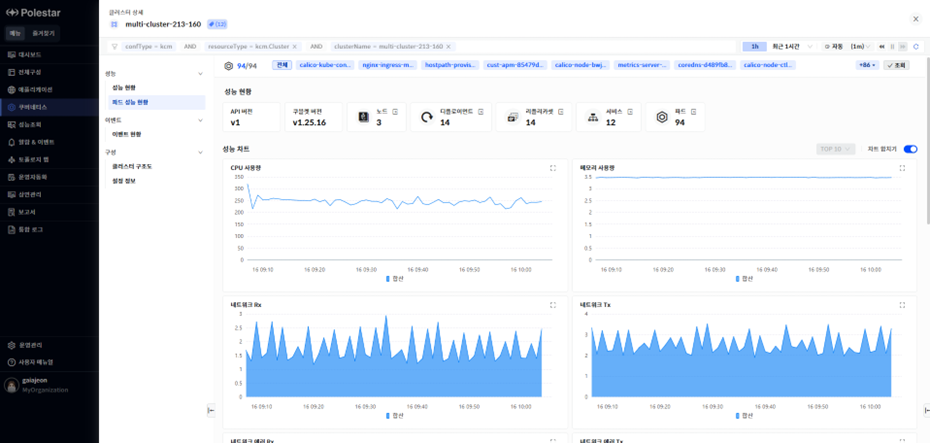

> ▶ \[그림 4\] 클러스터 파드 성능 현황

성능 차트

클러스터에 속한 파드의 CPU, 메모리, 네트워크 사용량을 차트로 제공합니다. 화면 상단의 파드 목록을 사용하여 조회하고자 하는 파드를 선택할 수 있습니다.

상위 조회는 상위10, 상위20, 상위 30을 제공합니다.

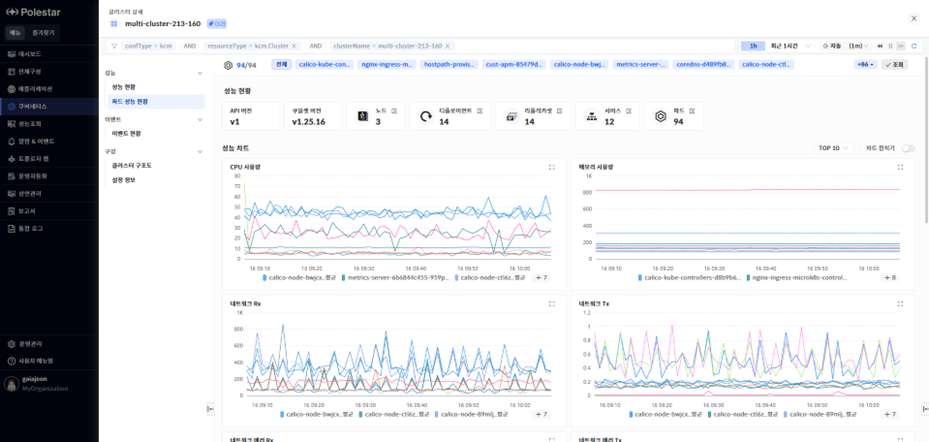

> ▶ \[그림 5\] 파드 성능 차트

성능 차트 오른쪽의 차트 합치기 버튼을 ON 상태로 설정하면 조회한 파드의 성능 지표가 합쳐진 상태로 하나의 라인으로 표시합니다.

> ▶ \[그림 6\] 파드 성능 차트
> 
> 성능 차트

<table>
<thead>
<tr class="header">
<th>CPU 사용량</th>
<th>
각 파드의 CPU 사용량을 상위 n개 혹은 합계(sum)으로 표시합니다.

단위 : miliCore
</th>
</tr>
</thead>
<tbody>
<tr class="odd">
<td>메모리 사용량</td>
<td>
각 파드의 메모리 사용량을 상위 n개 혹은 합계(sum)으로 표시합니다.

단위 : byte
</td>
</tr>
<tr class="even">
<td>네트워크 Rx</td>
<td>
각 파드의 네트워크 수신 데이터 양을 상위 n개 혹은 합계(sum)으로 표시합니다.

단위 : byte
</td>
</tr>
<tr class="odd">
<td>네트워크 Tx</td>
<td>
각 파드의 네트워크 송신 데이터 양을 상위 n개 혹은 합계(sum)으로 표시합니다.

단위 : byte
</td>
</tr>
<tr class="even">
<td>네트워크 에러 Rx</td>
<td>
각 파드의 네트워크 에러 수신 건수를 상위 n개 혹은 합계(sum)으로 표시합니다.

단위 : count
</td>
</tr>
<tr class="odd">
<td>네트워크 에러 Tx</td>
<td>
각 파드의 네트워크 에러 송신 건수를 상위 n개 혹은 합계(sum)으로 표시합니다.

단위 : count
</td>
</tr>
</tbody>
</table>

파드 목록

클러스터에 속한 파드 목록을 제공합니다. 목록 상단에 파드의 상태별 개수 정보를 제공합니다. 파드 목록의 숫자 또는 더보기 아이콘을 사용하여 파드 전체 목록 확인이 가능 합니다.

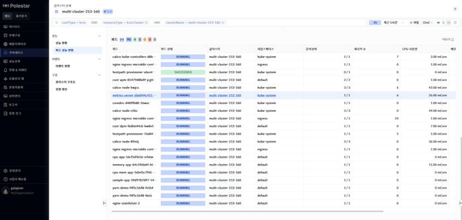

> ▶ \[그림 7\] 파드 목록

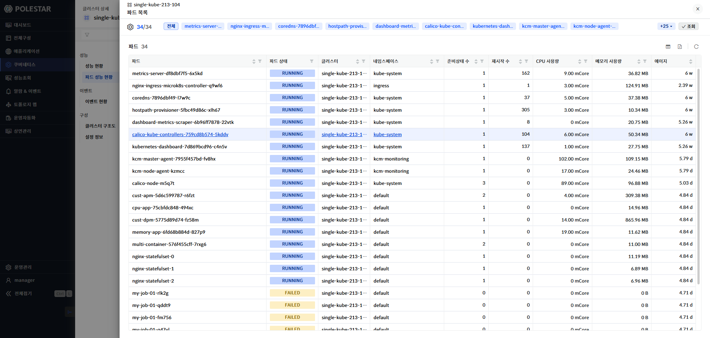

> ▶ \[그림 8\] 파드 더보기
> 
> 파드

<table>
<thead>
<tr class="header">
<th>파드</th>
<th>파드명을 표시합니다.</th>
</tr>
</thead>
<tbody>
<tr class="odd">
<td>파드 상태</td>
<td>
파드를 상태를 표시합니다.

에이전트가 다운되어 있어 수집을 하지 못할 경우 N/A(Not Available)로 표시됩니다.
</td>
</tr>
<tr class="even">
<td>클러스터</td>
<td>파드의 클러스터 명을 표시합니다.</td>
</tr>
<tr class="odd">
<td>네임스페이스</td>
<td>파드의 네임스페이스 명을 표시합니다</td>
</tr>
<tr class="even">
<td>준비 상태</td>
<td>준비 상태를 표시합니다.</td>
</tr>
<tr class="odd">
<td>재시작 수</td>
<td>파드 재시작 수를 표시합니다.</td>
</tr>
<tr class="even">
<td>CPU 사용량</td>
<td>
파드의 CPU 사용량을 표시합니다.

단위 : miliCore
</td>
</tr>
<tr class="odd">
<td>메모리 사용량</td>
<td>
파드의 메모리 사용량을 표시합니다.

단위 : byte
</td>
</tr>
</tbody>
</table>

<table>
<tbody>
<tr class="odd">
<td>에이지</td>
<td>
파드의 생성 후 시간을 표시합니다.

계산 방식 : 현재 타임스탬프 – 파드 생성 시점의 타임스팸프
</td>
</tr>
</tbody>
</table>

이벤트 현황

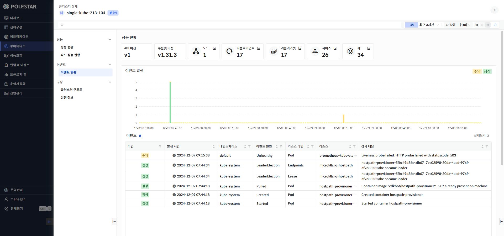

> ▶ \[그림 9\] 클러스터 이벤트 현황

이벤트 발생

클러스터 내에서 발생한 이벤트를 표시합니다. 이벤트는 정상(Normal)과 주의(Warning)상태로 조회 기간에 따른 발생 건수를 차트로 표시하며 이벤트 목록을 제공합니다.

> 이벤트

| 타입     | 쿠버네티스 이벤트 타입을 표시합니다. 정상(Normal)과 주의(Warning)으로 표시됩니다. |
| ------ | ----------------------------------------------------- |
| 발생시간   | 이벤트 발생 시간을 표시합니다.                                     |
| 네임스페이스 | 이벤트가 발생한 리소스의 네임스페이스를 표시합니다.                          |
| 이벤트 원인 | 이벤트 원인을 표시합니다.                                        |
| 리소스타입  | 이벤트가 발생한 리소스 타입을 표시합니다.                               |
| 리소스    | 이벤트가 발생한 쿠버네티스 리소스를 표시합니다.                            |
| 상세내용   | 이벤트 상세 내용을 표시합니다                                      |

클러스터 구조도

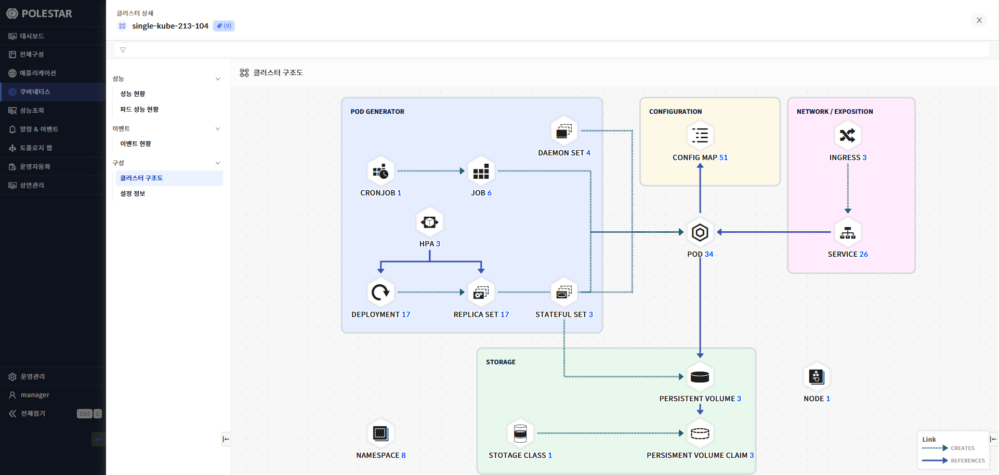

> ▶ \[그림 10\] 클러스터 구조도

클러스터 구조도

클러스터에 속하는 워크로드, 네트워크, 스토리지 리소스 등 클러스터 내에 속해있는 리소스를 파악할 수 있는 구조도를 제공한다. 구조도내의 각 리소스 아이콘 및 리소스 타입 명, 리소스 개수를 클릭하면 해당 리소스 목록 드로우가 표시됩니다.

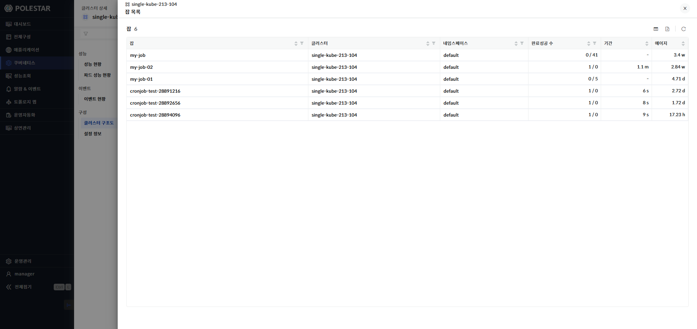

> ▶ \[그림11\] 클러스터 구조도 리소스 타입별 목록

클러스터 구조도에서 표시되는 각 리소스 타입 별 목록은 리소스 탐색기에서 각 타입 별 제공하는 목록 내용과 동일합니다.

<table>
<tbody>
<tr class="odd">
<td>
노트

클러스터 구조도에서 파드 목록 아이콘을 클릭하거나 파드 목록 숫자를 클릭하여 목록을 확인할 경우 구조도에 나오는 파드수와 파드 목록 드로어에서 표시되는 목록 수의 차이가 발생할 수 있습니다. 이는 파드 목록 드로우의 상위의 파드 목록이 표시된 이후에 잡이나 크론잡의 동작으로 인해 기존 파드 목록과의 차이로 발생합니다.
</td>
</tr>
</tbody>
</table>

설정 정보

클러스터에 대한 설정 정보를 제공합니다. 클러스터에 설정되어 있는 알람정보 및 관리 상태, 수집 시간 등을 표시하며 해당 리소스에 대한 역할, 권한 및 리소스 담당자를 설정 할 수 있습니다.

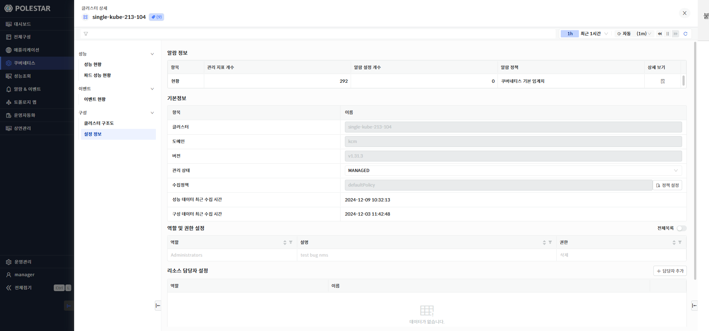

> ▶ \[그림 12\] 설정 정보
> 
> 알람 정보

<table>
<thead>
<tr class="header">
<th>항목</th>
<th>항목 명을 표시합니다.</th>
</tr>
</thead>
<tbody>
<tr class="odd">
<td>관리 지표 개수</td>
<td>클러스터의 관리 지표 수를 표시합니다.</td>
</tr>
<tr class="even">
<td>알람 설정 개수</td>
<td>클러스터에 설정되어 있는 알람 수를 표시합니다.</td>
</tr>
<tr class="odd">
<td>알람 정책</td>
<td>현재 설정된 알람 정책을 표시합니다.</td>
</tr>
<tr class="even">
<td>상세보기</td>
<td>
알람 정책에 대해 상세 보기 할 수 있는 아이콘이 표시됩니다.

아이콘을 클릭하면 해당 알람 정책에서 설정한 알람 내용 목록이 표시됩니다.
</td>
</tr>
</tbody>
</table>

<table>
<tbody>
<tr class="odd">
<td>
노트

쿠버네티스에서 크론잡 또는 잡과 같이 일시적으로 생성되었다가 삭제되는 파드에 의해 알람 설정 개수와 상세보기 클릭 시 표시되는 알람 설정 개수가 다를 수 있습니다.
</td>
</tr>
</tbody>
</table>

> 클러스터

<table>
<thead>
<tr class="header">
<th>클러스터</th>
<th>클러스터 명을 표시합니다.</th>
</tr>
</thead>
<tbody>
<tr class="odd">
<td>도메인</td>
<td>클러스터의 도메인 정보를 표시합니다.</td>
</tr>
<tr class="even">
<td>버전</td>
<td>클러스터의 버전 정보를 표시합니다.</td>
</tr>
<tr class="odd">
<td>관리상태</td>
<td>
MANAGED 또는 UNMANGED 상태를 설정할 수 있습니다.

변경 후 화면 오른쪽 최하단의 저장버튼을 클릭해야 변경됩니다.
</td>
</tr>
<tr class="even">
<td>수집정책</td>
<td>
쿠버네티스에 설정되어 있는 수집정책을 표시합니다.

성능 지표에 대한 수집 주기는 정책 설정 아이콘을 클릭하여 확인할 수 있습니다.
</td>
</tr>
<tr class="odd">
<td>성능 데이터 최근 수집 시간</td>
<td>가장 최근의 성능 데이터 수집 시간을 표시합니다.</td>
</tr>
<tr class="even">
<td>구성 데이터 최근 수집 시간</td>
<td>가장 최근의 구성 데이터 수집 시간을 표시합니다.</td>
</tr>
</tbody>
</table>

> 역할 및 권한 설정

| 역할 | 역할 명을 표시합니다.      |
| -- | ----------------- |
| 설명 | 역할에 대한 설명을 표시합니다. |
| 권한 | 역할의 권한을 표시합니다.    |

> 리소스 담당자 설정

| 역할 | 역할 명을 표시합니다.              |
| -- | ------------------------- |
| 이름 | 해당 역할에 할당된 사용자 이름을 표시합니다. |

성능 이상감지 분석 요약

성능 이상감지 내용과 발생 기준 그리고 프로세스의 RCA의 내용을 텍스트 기반의 요약된 정보를 제공합니다. 해당 기능은 정상 상태와 동일한 기준으로 정보를 제공합니다.

▶ \[그림13\] 이상감지 요약

화면 지표

| 성능 이상감지 알람 | 이상감지 알람 발생 정보를 표시합니다.                                                 |
| ---------- | --------------------------------------------------------------------- |
| 시작 이상감지 지표 | TimeWindow 및 민감도로 정의된 그룹 단위에서 발생한 이상감지 알람의 지표 중 최초 발생한 이상감지 지표를 나타냅니다 |
| 알람 발생 시간   | 알람이 발생한 시점을 나타냅니다. 최초 발생한 이상감지 지표 기준로 정의됩니다.                          |
| 알람 상태      | 알람 발생 유무를 나타냅니다.                                                      |
| 이상 발생 지표 수 | TimeWindow 및 민감도로 정의된 그룹 단위에서 발생한 이상감지 알람에 포함된 이상 지표 개수를 나타냅니다.       |

화면 지표

<table>
<thead>
<tr class="header">
<th>성능 이상감지 알람 발생 기준</th>
<th>성능 이상감지 알람 발생 기준을 나타냅니다.</th>
</tr>
</thead>
<tbody>
<tr class="odd">
<td>정책명</td>
<td>이상감지 알람 발생 기준 정책명을 나타냅니다.</td>
</tr>
<tr class="even">
<td>알람 발생 현재 값</td>
<td>해당 정책의 이상감지 판</td>
</tr>
<tr class="odd">
<td>학습 지표 수</td>
<td>해당 정책에서 관리되는 지표수를 나타냅니다.</td>
</tr>
<tr class="even">
<td>Time Windows</td>
<td>
민감도를 판단할 범위를 나타냅니다.

해당 범위를 기준으로 민감도를 집계합니다.
</td>
</tr>
</tbody>
</table>

리소스 성능 현황

리소스 단위의 성능 지표 이상감지 현황을 볼 수 있는 기능을 제공합니다.

▶ \[그림14\] 리소스 현황

화면 지표

<table>
<thead>
<tr class="header">
<th>리소스 단위의 성능 지표 이상감지 현황</th>
<th>
리소스의 지표의 이상감지 발생 여부를 나타냅니다

학습된 지표가 모두 정상일 경우, 정상상태를 나타내며, 이상이 발생한 지표가 있을 경우, 이상 발생 개수를 나타냅니다
</th>
</tr>
</thead>
<tbody>
<tr class="odd">
<td>학습된 성능 전체 지표수</td>
<td>해당 리소스의 학습된 지표 개수를 나타냅니다.</td>
</tr>
<tr class="even">
<td>알람 발생 현재 값</td>
<td>해당 정책의 이상감지 판</td>
</tr>
<tr class="odd">
<td>학습 지표 수</td>
<td>해당 정책에서 관리되는 지표수를 나타냅니다.</td>
</tr>
</tbody>
</table>

성능 이상 FLOW

성능 이상이 발생한 시간 순으로 카드 형태의 시각화 정보를 확인할 수 있습니다.

비정상 상태일 경우 카드영역이 펼쳐서 제공됩니다.

사용자가 알람 발생 및 이상 발생 현상을 빠르게 확인할 수 있도록 다른 색상으로 표현됩니다.

화면 지표

<table>
<thead>
<tr class="header">
<th>리소스 현황 정보</th>
<th>
카드 영역 안의 리소스 현황 상단에는 리소스 단위의 지표명이 표시됩니다.

이상이 발생하면 Red 계열 색상으로 카드가 표현됩니다.
</th>
</tr>
</thead>
<tbody>
<tr class="odd">
<td>이상 지표 수</td>
<td>이상이 발생한 지표 수</td>
</tr>
<tr class="even">
<td>학습된 지표 수</td>
<td>학습된 지표 수</td>
</tr>
</tbody>
</table>

> 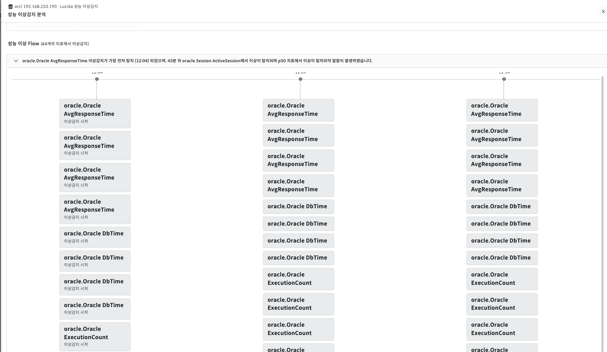

▶ \[그림15\] 성능 이상 FLOW

성능 이상 TIME Navigator & Indicator

현재 시간 기준으로 2 시간 범위의 분 단위 Time Shifter 및 이상 \* 알람 발생 여부에 대한 Indicator 기능을 제공합니다.

Rectangle 하나의 단위는 1분을 의미하며, 선택 시 해당 시점의 정보로 화면의 모든 정보가 갱신됩니다.

▶ \[그림16\] Time Navigator & Anomaly Indicator

성능 이상 TIME Navigator Calander

다른 날짜 또는 시간으로 빠르게 이동할 수 있는 Datetime Picker 형태의 Navigator 기능을 제공합니다.

알람이 발생한 일자/시간/분을 숫자에 표시하여 빠르게 이동할 수 있습니다.

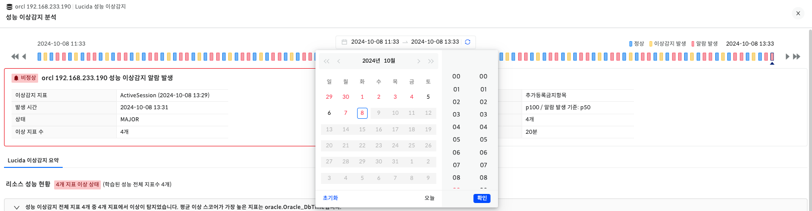

▶ \[그림17\] Time Navigator Calander

확대 보기

성능조회와 동일하게 선택 대상의 확대보기를 제공합니다

화면 지표

<table>
<thead>
<tr class="header">
<th>리소스 지표 성능 및 이상감지 차트</th>
<th>리소스 지표 차트의 확대보기 기능을 통해, 성능 차트 혹은 이상감지 차트를 제공합니다</th>
</tr>
</thead>
<tbody>
<tr class="odd">
<td>신뢰 범위</td>
<td>
버튼 선택 시, 학습되어 생성된 신뢰 범위를 표현합니다.

선택된 리소스 지표의 학습 모델이 존재하지 않을 경우, 비활성화 됩니다.

버튼 활성화 시, 최대/평균/최소의 선택 버튼은 비활성화 되며, Datetime Picker의 시간 선택 범위도 [최근 1일] 기본으로 변경되며, 차트의 인터벌 간격은 이상감지 데이터의 왜곡을 막기 위해, [1분]으로 고정됩니다.
</td>
</tr>
<tr class="even">
<td>스코어 평균 및 합계</td>
<td>해당 지표의 이상감지 스코어 평균 및 지표를 나타냅니다.</td>
</tr>
<tr class="odd">
<td>평균 / 상하한 / 스코어 목록</td>
<td>해당 시점의 평균 / 상하한 / 스코어의 평균, 최소, 최대, 합계, 실제값을 표를 통해 나타냅니다.</td>
</tr>
</tbody>
</table>

