파드 목록

파드 목록 화면에서는 전체 파드 목록과 각 파드의 기본 정보 및 상태를 확인할 수 있습니다.

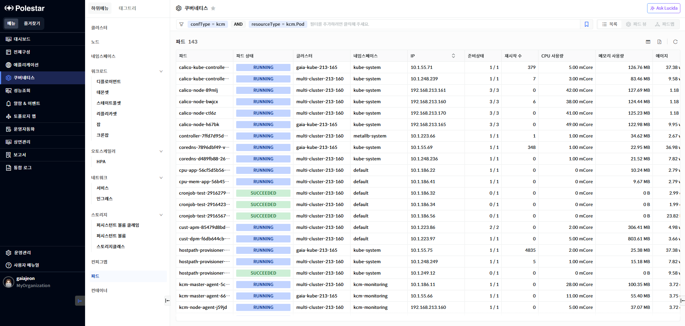

> ▶ \[그림1\] 파드
> 
> 파드 목록

<table>
<thead>
<tr class="header">
<th>파드</th>
<th>파드 명을 표시합니다.</th>
</tr>
</thead>
<tbody>
<tr class="odd">
<td>파드 상태</td>
<td>
파드의 상태를 표시합니다.

에이전트가 다운되어 있어 수집을 하지 못할 경우 N/A(Not Available)로 표시됩니다.
</td>
</tr>
<tr class="even">
<td>클러스터</td>
<td>쿠버네티스 클러스터명을 표시합니다. 에이전트에서 설정한 쿠버네티스 클러스터명이 표시됩니다.</td>
</tr>
<tr class="odd">
<td>네임스페이스</td>
<td>네임스페이스를 표시합니다.</td>
</tr>
<tr class="even">
<td>IP</td>
<td>파드의 IP 주소를 표시합니다.</td>
</tr>
<tr class="odd">
<td>준비상태</td>
<td>
파드의 준비 상태를 표시합니다.

Ready 상태인 컨테이너 수/총 컨테이너 형식으로 표시됩니다.
</td>
</tr>
<tr class="even">
<td>재시작수</td>
<td>컨테이너의 재시작수를 표시합니다</td>
</tr>
<tr class="odd">
<td>CPU 사용량</td>
<td>
CPU 사용량을 표시합니다.

단위 : miliCore
</td>
</tr>
<tr class="even">
<td>메모리 사용량</td>
<td>
메모리 사용량을 표시합니다.

단위 : byte
</td>
</tr>
<tr class="odd">
<td>에이지</td>
<td>
파드생성시점으로 현재까지 경과 시간을 표시합니다.

계산 방식 : 현재 타임스탬프 – 파드 생성시점의 타임스탬프
</td>
</tr>
<tr class="even">
<td>CPU 리밋</td>
<td>
파드가 사용할 수 있는 최대 CPU 코어

단위 : miliCore
</td>
</tr>
<tr class="odd">
<td>CPU 요청량</td>
<td>
파드를 스케줄 할 때 기준이 되는 최소 보장 CPU 코어

단위 : miliCore
</td>
</tr>
<tr class="even">
<td>메모리 리밋</td>
<td>
파드가 사용할 수 있는 최대 메모리 크기

단위 : byte
</td>
</tr>
<tr class="odd">
<td>메모리 요청량</td>
<td>
파드를 스케줄 할 때 기준이 되는 최소 보장 메모리 크기

단위 : byte
</td>
</tr>
<tr class="even">
<td>I/O 읽기 수</td>
<td>
파드가 수행한 읽기 횟수

단위 : count
</td>
</tr>
<tr class="odd">
<td>I/O 쓰기 수</td>
<td>
파드가 수행한 쓰기 횟수

단위 : count
</td>
</tr>
<tr class="even">
<td>I/O 읽기 양</td>
<td>
파드가 수행한 읽기 양

단위 : byte
</td>
</tr>
<tr class="odd">
<td>I/O 쓰기 양</td>
<td>
파드가 수행한 쓰기 양

단위 : byte
</td>
</tr>
</tbody>
</table>

> 파드 상세 화면 이동

1.  구성 정보를 확인하고자 하는 파드 명을 클릭.

파드 상세

파드 상세 화면에서는 선택한 파드의 기본 정보와 컨테이너 목록 및 컨테이너 성능을 차트로 확인할 수 있습니다.

오퍼레이션

화면 상단의 \[오퍼레이션\] 버튼을 클릭하여 파드 또는 컨테이너에서 지원하는 오퍼레이션을 실행할 수 있습니다. 사용자는 실행한 오퍼레이션 결과를 다운로드 받을 수 있습니다.

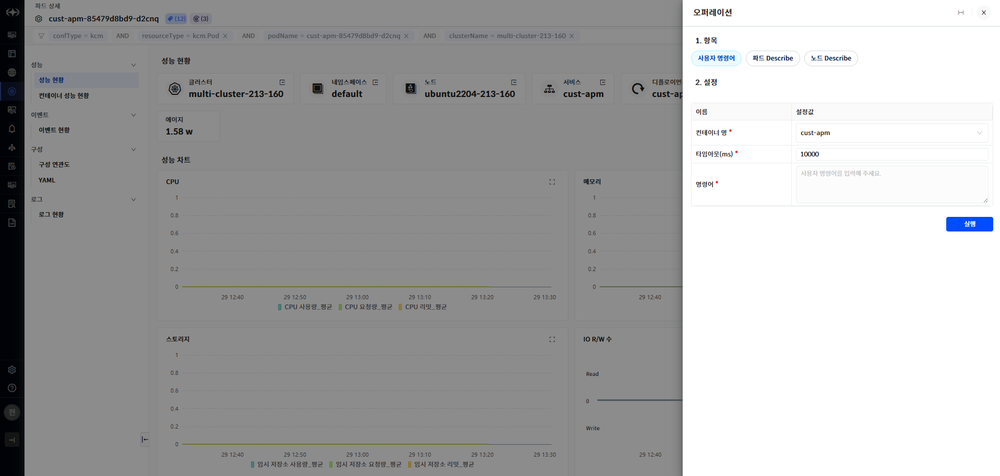

▶ \[그림8\] 오퍼레이션

사용자 명령어

파드내에서 실행중인 컨테이너에 입력된 명령어를 실행하여 결과를 확인할 수 있습니다. 리눅스 환경에서 실행될 수 있는 위험한 명령이나 사용자 실수를 유발할 수 있는 rm과 같은 명령은 제한됩니다.

<table>
<tbody>
<tr class="odd">
<td>
노트

컨테이너에서 실행 제한된 명령어는 현재 SMS에서 제한되는 명령어와 동일합니다.
</td>
</tr>
</tbody>
</table>

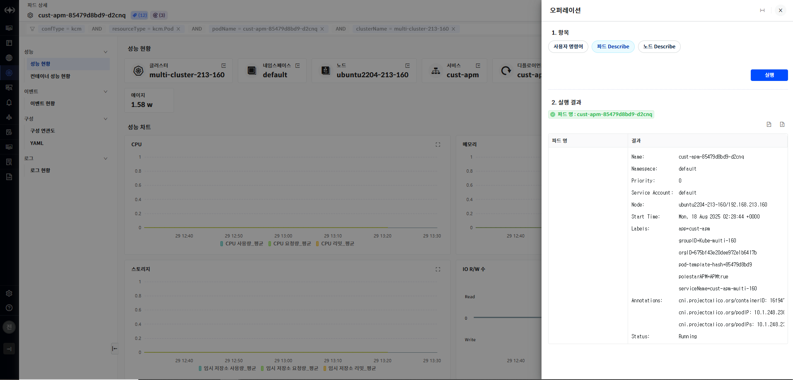

▶ \[그림11\] 사용자 명령어

입력 항목

| 컨테이너 명 | 파드내의 컨테이너 중 명령어를 실행할 컨테이너를 선택합니다.                   |
| ------ | --------------------------------------------------- |
| 타임아웃   | 응답 대기 시간을 입력합니다. (기본값: 10000, 단위: 밀리초(ms))          |
| 명령어    | 컨테이너에서 실행할 명령어를 입력합니다. 제한된 문구를 포함한 명령어는 실행할 수 없습니다. |

파드 Describe

파드의 상세 정보를 보여주는 describe 명령을 실행합니다.

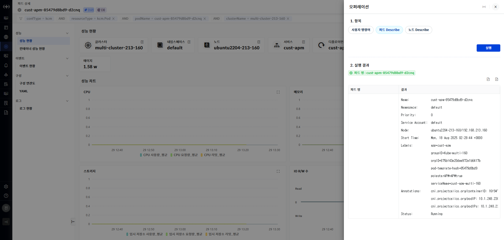

▶ \[그림9\] 파드 Describe

노드 Describe

파드가 실행되고 있는 노드의 상세 정보를 보여주는 describe 명령을 실행합니다.

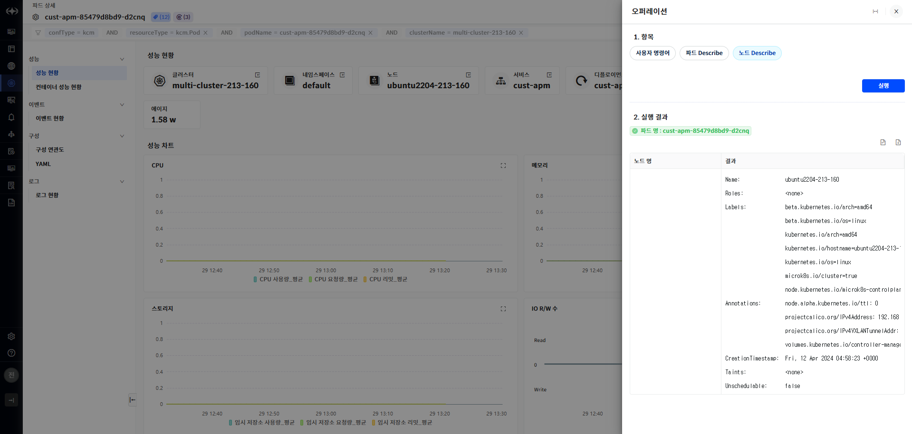

▶ \[그림9\] 노드 Describe

성능 현황

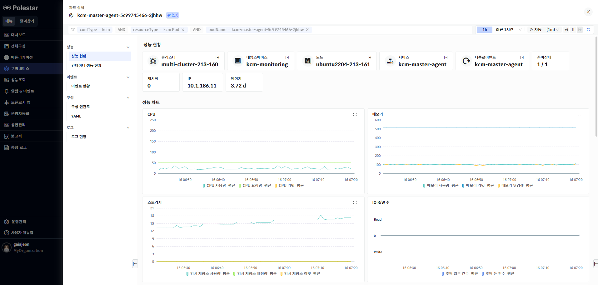

> ▶ \[그림 2\] 파드 성능 현황
> 
> 파드

<table>
<thead>
<tr class="header">
<th>클러스터</th>
<th>
클러스터 명을 표시합니다.

클러스터의 더보기 아이콘을 클릭하여 클러스터 상세화면으로 이동할 수 있습니다.
</th>
</tr>
</thead>
<tbody>
<tr class="odd">
<td>네임스페이스</td>
<td>
파드의 네임스페이스명을 표시합니다.

네임스페이스의 더보기 아이콘을 클릭하여 네임스페이스 상세화면으로 이동할 수 있습니다.
</td>
</tr>
<tr class="even">
<td>노드</td>
<td>
파드가 실행되고 있는 노드명을 표시합니다.

노드의 더보기 아이콘을 클릭하여 노드 상세화면으로 이동할 수 있습니다.
</td>
</tr>
<tr class="odd">
<td>서비스</td>
<td>
파드의 서비스명을 표시합니다.

서비스의 더보기 아이콘을 클릭하여 서비스 상세화면으로 이동할 수 있습니다.
</td>
</tr>
<tr class="even">
<td>디플로이먼트</td>
<td>
파드의 디플로이먼트 명을 표시합니다.

디플로이먼트의 더보기 아이콘을 클릭하여 디플로이먼트 상세화면으로 이동할 수 있습니다.
</td>
</tr>
<tr class="odd">
<td>준비상태</td>
<td>파드의 준비상태를 표시합니다.</td>
</tr>
<tr class="even">
<td>재시작</td>
<td>파드의 재시작 수를 표시합니다.</td>
</tr>
<tr class="odd">
<td>IP</td>
<td>파드가 수행되는 환경의 IP를 표시합니다.</td>
</tr>
<tr class="even">
<td>에이지</td>
<td>
파드생성시점으로 현재까지 경과 시간을 표시합니다.

계산 방식 : 현재 타임스탬프 – 파드 생성시점의 타임스탬프
</td>
</tr>
</tbody>
</table>

성능 차트

파드에서 사용하는 CPU, 메모리, 컨테이너 등의 파드와 관련된 다양한 지표를 제공합니다.

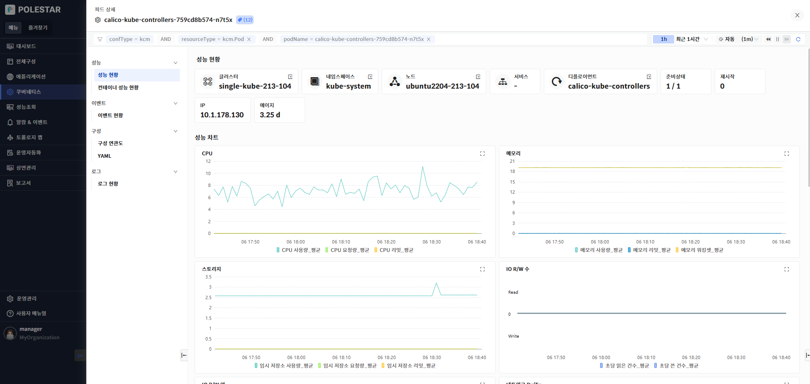

> ▶ \[그림 3\] 파드 성능 차트
> 
> 성능 차트

<table>
<thead>
<tr class="header">
<th>CPU</th>
<th>
파드에서 사용하고 있는 CPU 사용량, 리밋, 요청량을 표시합니다.

단위 : miliCore
</th>
</tr>
</thead>
<tbody>
<tr class="odd">
<td>메모리</td>
<td>
파드에서 사용하고 있는 메모리 사용량, 리밋, 요청량을 표시합니다.

단위 : byte
</td>
</tr>
<tr class="even">
<td>스토리지</td>
<td>
파드에서 사용하고 있는 스토리지의 사용량, 요청량, 리밋을 표시합니다.

단위 : byte
</td>
</tr>
<tr class="odd">
<td>I/O R/W 수</td>
<td>
I/O 초당 읽은 건수,초당 쓰기 건수를 표시합니다.

단위 : count
</td>
</tr>
<tr class="even">
<td>I/O R/W 양</td>
<td>
I/O 초당 읽은 데이터양, 초당 쓴 데이터양을 표시합니다.

단위 : byte
</td>
</tr>
<tr class="odd">
<td>네트워크 Rx/Tx</td>
<td>
파드에서 수행되는 네트워크 Rx/Tx 양을 표시합니다

단위 : byte
</td>
</tr>
<tr class="even">
<td>네트워크 에러 Rx/Tx</td>
<td>
파드에서 수행되는 네트워크 에러 Rx/Tx 건수를 표시합니다.

단위 : count
</td>
</tr>
<tr class="odd">
<td>컨테이너 상태</td>
<td>컨테이너 상태를 표시합니다. 컨테이너의 상태는 Running, Terminated, Waiting 상태를 가집니다.</td>
</tr>
<tr class="even">
<td>컨테이너 재시작 수</td>
<td>
컨테이너 재시작 수를 표시합니다.

단위 : count
</td>
</tr>
<tr class="odd">
<td>컨테이너 경고 이벤트</td>
<td>
컨테이너 경고 이벤트 발생 건수를 표시합니다.

컨테이너 경고 이벤트 중 CrashLoopPullBackOff와 OOM killed 수를 표시합니다.
</td>
</tr>
<tr class="even">
<td>컨테이너별 CPU 사용량</td>
<td>
컨테이너별 CPU 사용량을 표시합니다.

단위 : miliCore
</td>
</tr>
<tr class="odd">
<td>컨테이너별 메모리 사용량</td>
<td>
컨테이너별 메모리사용량을 표시합니다.

단위 : byte
</td>
</tr>
<tr class="even">
<td>CPU 스트로링</td>
<td>
CPU 스토로링 발생 수를 표시합니다.

단위 : count
</td>
</tr>
</tbody>
</table>

컨테이너 성능 현황

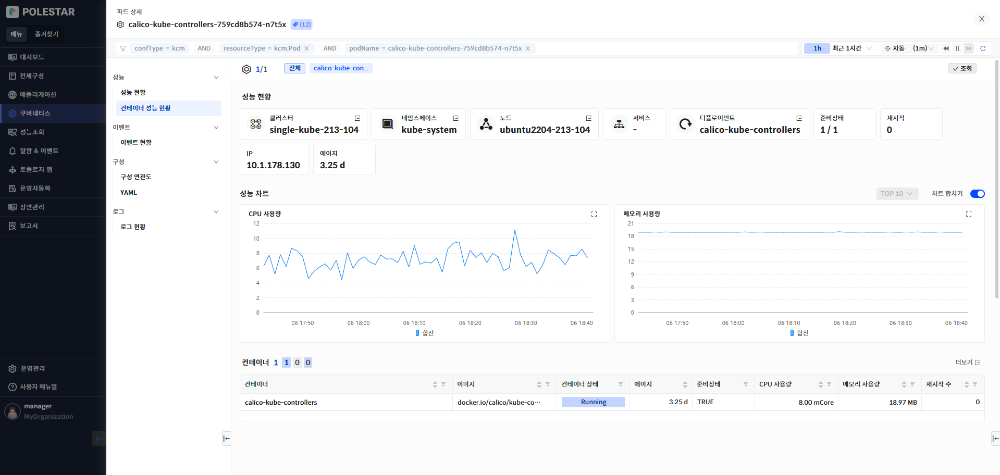

> ▶ \[그림 4\] 컨테이너 성능 현황

성능 차트

파드에 속한 컨테이너의 CPU, 메모리, 네트워크 사용량을 차트로 제공합니다. 화면 상단의 컨테이너 목록을 사용하여 조회하고자 하는 컨테이너를 선택할 수 있습니다.

상위 조회는 상위10, 상위20, 상위 30을 제공합니다.

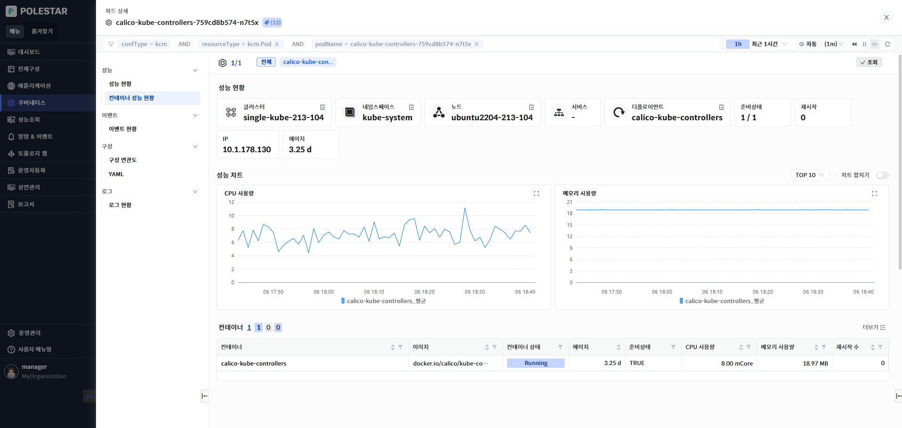

> ▶ \[그림 5\] 컨테이너 성능 차트

성능 차트 오른쪽의 차트 합치기 버튼을 ON 상태로 설정하면 조회한 파드의 성능 지표가 합쳐진 상태로 하나의 라인으로 표시합니다.

> ▶ \[그림 6\] 컨테이너 성능 차트 – 합치기
> 
> 성능 차트

<table>
<thead>
<tr class="header">
<th>CPU 사용량</th>
<th>
각 컨테이너의 CPU 사용량을 상위 n개 혹은 합계(sum)으로 표시합니다.

단위 : miliCore
</th>
</tr>
</thead>
<tbody>
<tr class="odd">
<td>메모리 사용량</td>
<td>
각 컨테이너의 메모리 사용량을 상위 n개 혹은 합계(sum)으로 표시합니다.

단위 : byte
</td>
</tr>
</tbody>
</table>

컨테이너 목록

파드에 속한 컨테이너 목록을 제공합니다. 목록 상단에 컨테이너의 상태별 개수 정보를 제공합니다. 컨테이너 목록의 숫자 또는 더보기 아이콘을 사용하여 컨테이너 전체 목록 확인이 가능 합니다.

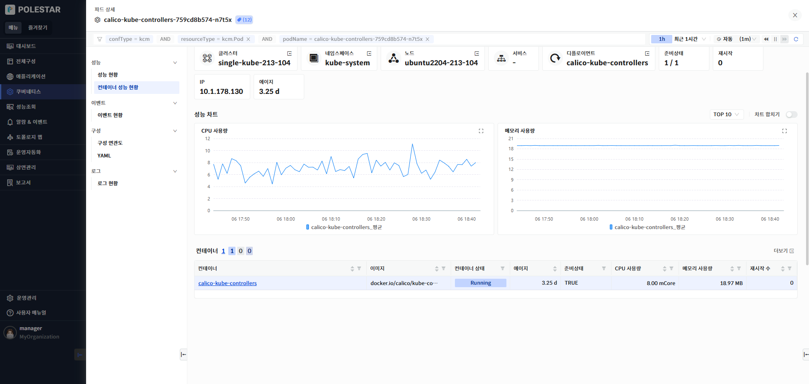

> ▶ \[그림 7\] 컨테이너 목록

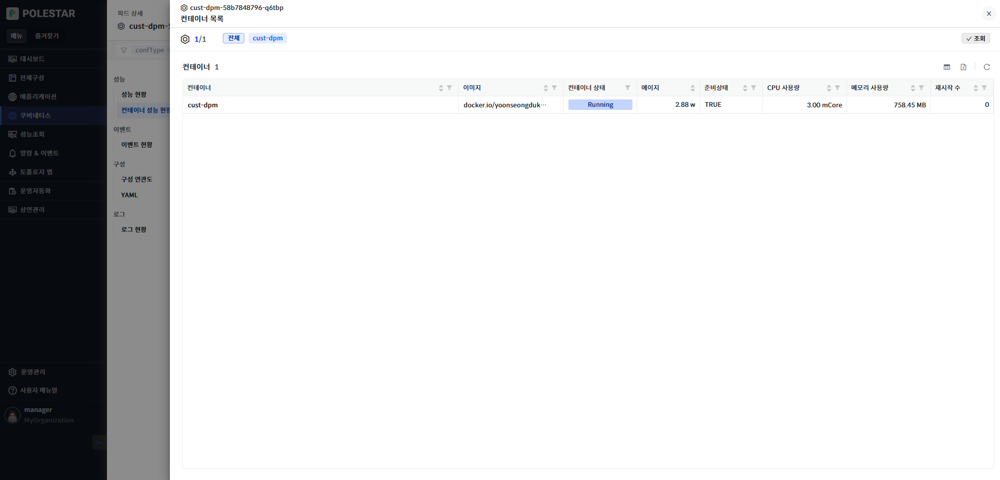

> ▶ \[그림 8\] 컨테이너 더보기
> 
> 컨테이너

<table>
<thead>
<tr class="header">
<th>컨테이너</th>
<th>컨테이너명을 표시합니다.</th>
</tr>
</thead>
<tbody>
<tr class="odd">
<td>이미지</td>
<td>컨테이너의 상태를 표시합니다.</td>
</tr>
<tr class="even">
<td>컨테이너 상태</td>
<td>컨테이너 상태를 표시합니다.</td>
</tr>
<tr class="odd">
<td>에이지</td>
<td>
컨테이너의 생성 후 시간을 표시합니다.

계산 방식 : 현재 타임스탬프 – 생성 시점의 타임스팸프
</td>
</tr>
<tr class="even">
<td>준비 상태</td>
<td>준비 상태 여부를 표시합니다.</td>
</tr>
<tr class="odd">
<td>CPU 사용량</td>
<td>
컨테이너의 CPU 사용량을 표시합니다.

단위 : miliCore
</td>
</tr>
<tr class="even">
<td>메모리 사용량</td>
<td>
컨테이너의 메모리 사용량을 표시합니다.

단위 : byte
</td>
</tr>
<tr class="odd">
<td>재시작 수</td>
<td>
컨테이너 재시작 수를 표시합니다.

단위 : count
</td>
</tr>
</tbody>
</table>

이벤트 현황

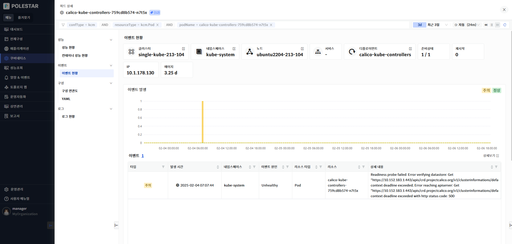

> ▶ \[그림 9\] 크론잡 이벤트 현황

이벤트 발생

파드내에서 발생한 이벤트를 표시합니다. 이벤트는 정상(Normal)과 주의(Warning)상태로 조회 기간에 따른 발생 건수를 차트로 표시하며 이벤트 목록을 제공합니다.

> 이벤트

| 타입     | 쿠버네티스 이벤트 타입을 표시합니다. 정상(Normal)과 주의(Warning)으로 표시됩니다. |
| ------ | ----------------------------------------------------- |
| 발생시간   | 이벤트 발생 시간을 표시합니다.                                     |
| 네임스페이스 | 이벤트가 발생한 리소스의 네임스페이스를 표시합니다.                          |
| 이벤트 원인 | 이벤트 원인을 표시합니다.                                        |
| 리소스타입  | 이벤트가 발생한 리소스 타입을 표시합니다.                               |
| 리소스    | 이벤트가 발생한 쿠버네티스 리소스를 표시합니다.                            |
| 상세내용   | 이벤트 상세 내용을 표시합니다                                      |

구성 연관도

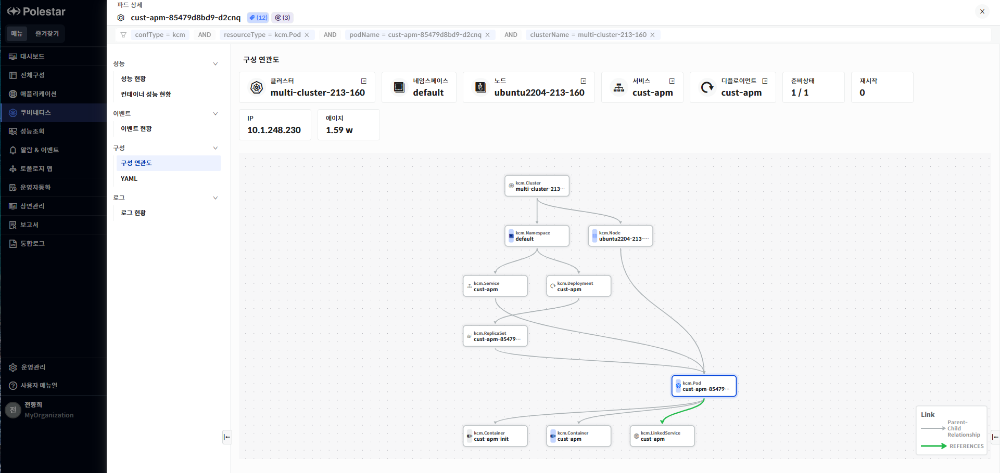

> ▶ \[그림 10\] 파드 구성 연관도

구성 연관도

선택한 리소스가 가지고 있는 다른 리소스와의 연관관계를 관계도로 표시합니다. 리소스의 상하위 관계를 파악할 수 있으며 리소스의 상태 및 알람 발생 상태가 툴팁을 통해 표시됩니다. 파드에서 실행되는 애플리케이션이APM, DPM 툴과 연계되어 있을 경우 레퍼런스 관계로 표시됩니다.

<table>
<tbody>
<tr class="odd">
<td>
노트

구성연관도에서 파드와 연관된 kcm.LinkedService로 APM,KCM이 표시될 경우 해당 카드의 툴팁을 통해 APM, DPM 정보가 표시되며 카드 클릭 시 APM, DPM 화면으로 이동됩니다.
</td>
</tr>
</tbody>
</table>

로그 현황

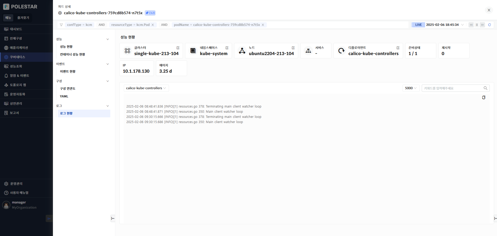

> ▶ \[그림 11\] 파드 로그

로그

파드에서 수행되는 컨테이너의 로그를 확인할 수 있습니다. 하나의 파드에 여러 개의 컨테이너가 수행 중일 경우 컨테이너를 선택하여 확인합니다. 컨테이너 로그는 현재 수행 중인 로그가 보여지며 중지된 컨테이너에 대해서는 로그를 확인할 수 없습니다.

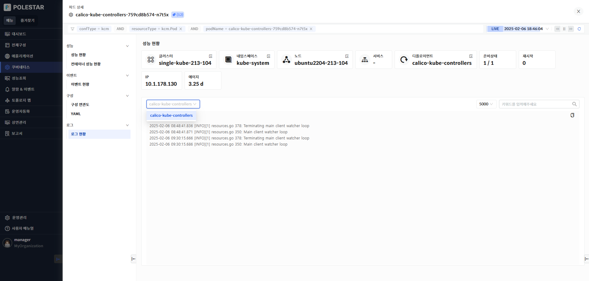

> ▶ \[그림 12\] 파드 로그

YAML

파드에 대한 YAML 정보를 제공합니다. 태그 필터를 통해 특정 필터 영역을 빠르게 조회할 수 있습니다. YAML의 과거 변경 시점의 내용을 확인 할 수 있으며 YAML 변경 시점간의 비교가 가능합니다.

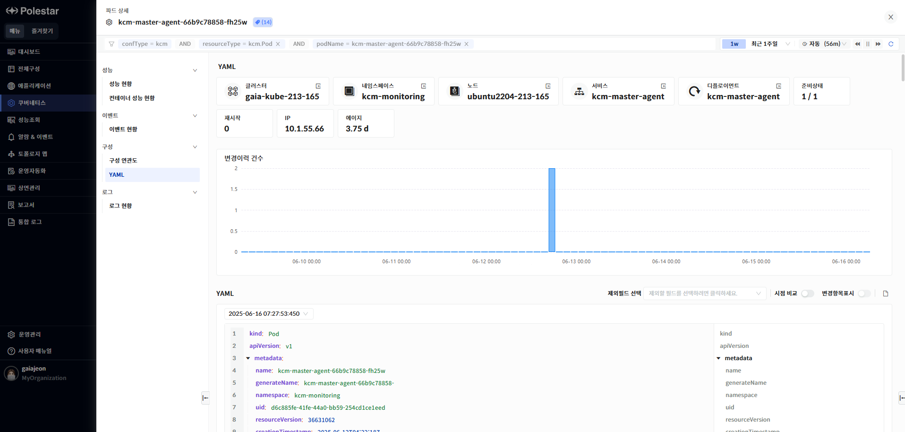

> ▶ \[그림 13\] YAML
> 
> YAML 조회

1.  YAML 아래에 있는 드랍다운 리스트에서 조회하고자 하는 YAML변경 시점을 선택합니다.

2.  제외 필드를 사용하여 YAML 내용에서 제외하고 싶은 필드를 선택합니다. “managedField”와 “status” 필드를 제외할 수 있습니다.

3.  YAML 표시란의 오른쪽에 표시되어 있는 필드 필터 기능을 사용하여 특정 필드를 빠르게 찾을 수 있습니다.

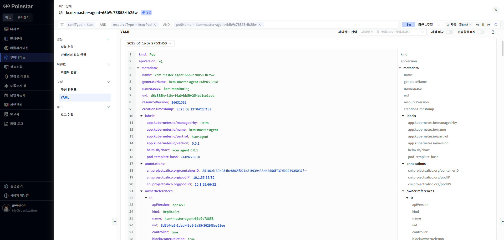

> ▶ \[그림 14\] YAML 조회
> 
> YAML 비교

1.  \[시점 비교\] 토글 버튼을 On 상태로 변경합니다.

2.  \[시점 비교\] 토클 버튼이 On된 상태에서는 YAML 표시 공간이 두 개로 나뉘어집니다.

3.  화면 오른쪽 YAML 표시 컬럼에는 최근에 조회한 YAML이 표시됩니다. YAML조회 기능에서 특정 시점을 선택하지 않았다면 가장 최근의 YAML이 표시됩니다.

4.  화면 왼쪽YAML 표시 컬럼에는 화면 오른쪽 조회 시점보다 과거 시점의 YAML을 표시할 수 있으며 화면 왼쪽 YAML 표시 컬럼의 상단의 드릴다운 리스트에는 변경 시점 목록이 표시됩니다. 변경 시점의 목록 중 화면 오른쪽 YAML 시점보다 과거 시점만 하이라이트 되어 표시됩니다. 회색으로 표시되는 시점은 화면 오른쪽 시점과 동일한 시점이거나 미래 시점인 경우입니다.

5.  화면 왼쪽 YAML 시점 목록이 표시되는 드릴 다운 리스트에서 비교하고자 하는 변경 시점을 선택합니다.

6.  시점 비교 기능에서도 제외필드 선택 기능을 사용할 수 있습니다.

7.  \[변경항목표시\] 토글 버튼을 On으로 설정하면 변경 항목이 색상으로 표시되어 시점간 비교 내용을 확인 할 수 있습니다.

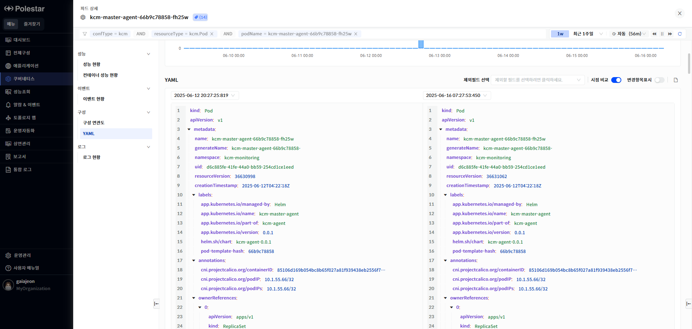

> ▶ \[그림 15\] YAML 비교

<table>
<tbody>
<tr class="odd">
<td>
노트

YAML 화면에서는 변경 시점과 YAML의 현재 시점도 표시됩니다. 최근에 등록된 YAML의 경우 등록 시점(변경시점으로 저장된)과 현재 시점의 내용이 동일 할 수 있습니다. YAML 비교 기능 사용 시 과거 시점과 현재 시점(화면 조회시간으로 표시) 내용이 동일한 경우 등록 이후 변경된 내용이 없는 경우입니다.
</td>
</tr>
</tbody>
</table>

> YAML 다운로드

1.  YAML표시란의 오른쪽 상단의 다운로드 아이콘을 클릭하면 YAML을 다운로드 할 수 있습니다.

2.  YAML 조회 기능 화면(\[시점 비교\] 토글 버튼 Off상태)에서는 하나의 YAML만 다운됩니다.

3.  YAML 비교 기능 화면(\[시점 비교\] 토글 버튼 On상태)에서 과거 시점이 선택된 경우 두 개의 YAML 파일이 다운됩니다

