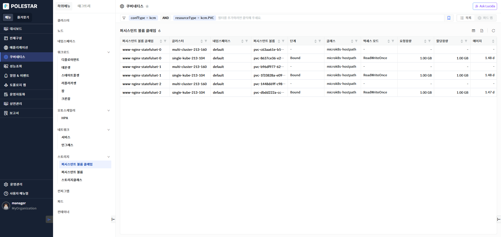
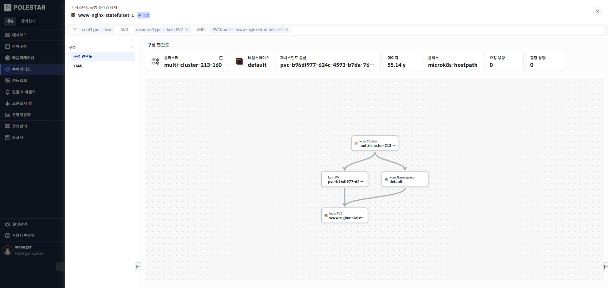
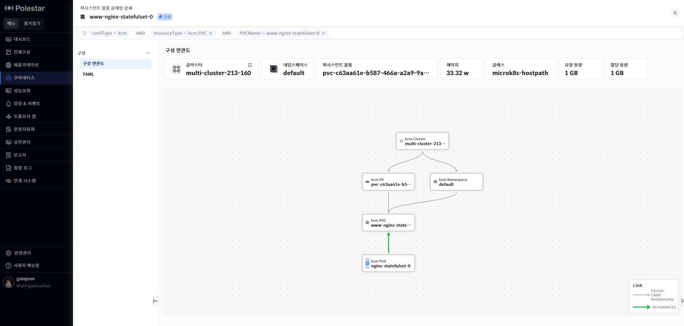
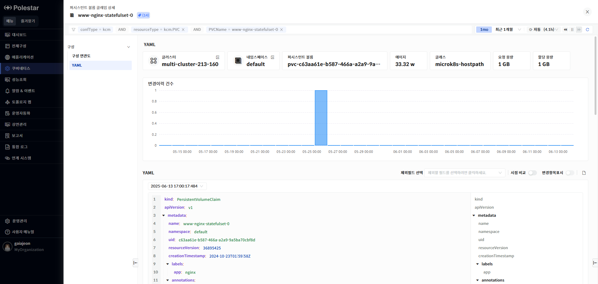
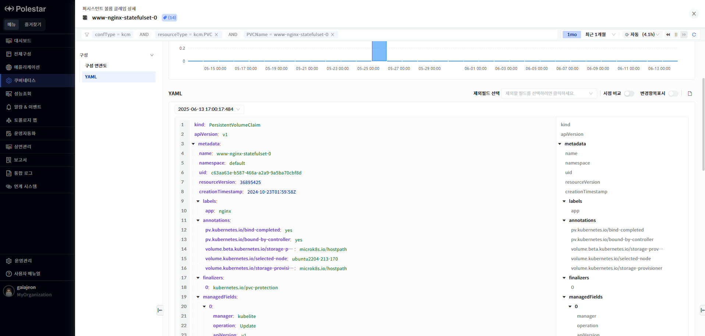
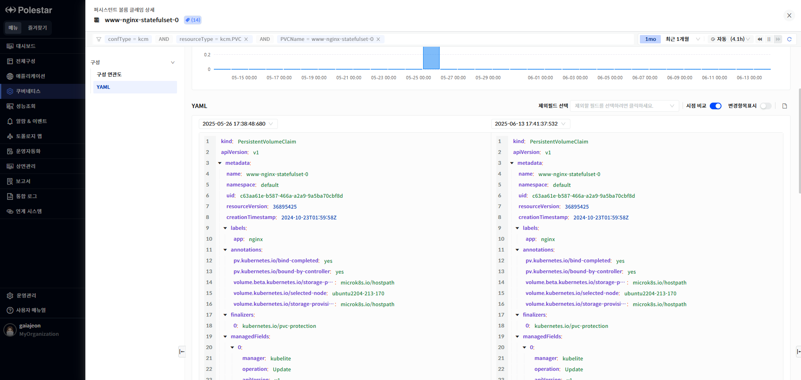

퍼시스턴트 볼륨 클레임 목록

퍼시스턴트 볼륨 클레임 목록 화면에서는 전체 퍼시스턴트 볼륨 클레임 목록과 각 퍼시스턴트 볼륨 클레임의 기본 정보를 확인할 수 있습니다.

> ▶ \[그림1\] 퍼시스턴트 볼륨 클레임
> 
> 퍼시스턴트 볼륨 클레임 목록

<table>
<thead>
<tr class="header">
<th>퍼시스턴트 볼륨 클레임</th>
<th>퍼시스턴트 볼륨 클레임 명을 표시합니다.</th>
</tr>
</thead>
<tbody>
<tr class="odd">
<td>클러스터</td>
<td>클러스터명을 표시합니다. 에이전트에서 설정한 쿠버네티스 클러스터명이 표시됩니다.</td>
</tr>
<tr class="even">
<td>네임스페이스</td>
<td>네임스페이스를 표시합니다.</td>
</tr>
<tr class="odd">
<td>퍼시스턴트 볼륨</td>
<td>퍼시스턴트 볼륨 클레임의 퍼시스턴트 볼륨을 표시합니다</td>
</tr>
<tr class="even">
<td>단계</td>
<td>퍼시스턴트 볼륨 클레임의 현재 단계를 표시합니다.</td>
</tr>
<tr class="odd">
<td>클래스</td>
<td>퍼시시턴트 볼륨 클레임이 사용하고 있는 클래스를 표시합니다.</td>
</tr>
<tr class="even">
<td>액세스 모드</td>
<td>액세스 모드를 표시합니다.</td>
</tr>
<tr class="odd">
<td>요청 용량</td>
<td>요청한 용량을 표시합니다.</td>
</tr>
<tr class="even">
<td>할당 용량</td>
<td>할당된 용량을 표시합니다.</td>
</tr>
<tr class="odd">
<td>에이지</td>
<td>
퍼시스턴트 볼륨 클레임 생성시점으로 현재까지 경과 시간을 표시합니다.

계산 방식 : 현재 타임스탬프 – 퍼시스턴트 볼륨 클레임 생성시점의 타임스탬프
</td>
</tr>
</tbody>
</table>

> 퍼시스턴트 볼륨 클레임 상세 화면 이동

1.  구성 정보를 확인하고자 하는 퍼시스턴트 볼륨 클레임 명을 클릭.

퍼시스턴트 볼륨 클레임 상세 현황

퍼시스턴트 볼륨 클레임 상세 현황 화면에서는 선택한 퍼시스턴트 볼륨 클레임의 기본 정보와 YAML 정보를 확인할 수 있습니다.

> ▶ \[그림 2\] 퍼시스턴트 볼륨 클레임 상세 현황
> 
> 퍼시스턴트 볼륨 클레임

<table>
<thead>
<tr class="header">
<th>클러스터</th>
<th>
클러스터 명을 표시합니다.

클러스터의 더보기 아이콘을 클릭하여 클러스터 상세화면으로 이동할 수 있습니다.
</th>
</tr>
</thead>
<tbody>
<tr class="odd">
<td>네임스페이스</td>
<td>퍼시스턴트 볼륨 클레임의 네임스페이스명을 표시합니다.</td>
</tr>
<tr class="even">
<td>퍼시스턴트 볼륨</td>
<td>퍼시스턴트 볼륨 명을 표시합니다.</td>
</tr>
<tr class="odd">
<td>에이지</td>
<td>
퍼시스턴트 볼륨 클레임 생성시점으로 현재까지 경과 시간을 표시합니다.

계산 방식 : 현재 타임스탬프 – 퍼시스턴트 볼륨 클레임 생성시점의 타임스탬프
</td>
</tr>
<tr class="even">
<td>클래스</td>
<td>퍼시스턴트 볼륨 클레임의 클래스 명을 표시합니다.</td>
</tr>
<tr class="odd">
<td>요청 용량</td>
<td>퍼시스턴트 볼륨 클레임의 요청 용량을 표시합니다.</td>
</tr>
<tr class="even">
<td>할당 용량</td>
<td>퍼시스턴트 볼륨 클레임의 할당 용량을 표시합니다.</td>
</tr>
</tbody>
</table>

구성 연관도

> ▶ \[그림 3\] 퍼시스턴트 볼륨 클레임 구성 연관도

구성 연관도

선택한 리소스가 가지고 있는 다른 리소스와의 연관관계를 관계도로 표시합니다. 리소스의 상하위 관계를 파악할 수 있으며 리소스의 상태 및 알람 발생 상태가 툴팁을 통해 표시됩니다. 퍼시스턴트 볼륨 클레임를 참조하고 있는 파드가 있을 경우 연관도에 참조 관계로 표시됩니다.

YAML

퍼시스턴트 볼륨 클레임에 대한 YAML 정보를 제공합니다. 태그 필터를 통해 특정 필터 영역을 빠르게 조회할 수 있습니다. YAML의 과거 변경 시점의 내용을 확인 할 수 있으며 YAML 변경 시점간의 비교가 가능합니다.

> ▶ \[그림 4\] YAML
> 
> YAML 조회

1.  YAML 아래에 있는 드랍다운 리스트에서 조회하고자 하는 YAML변경 시점을 선택합니다.

2.  제외 필드를 사용하여 YAML 내용에서 제외하고 싶은 필드를 선택합니다. “managedField”와 “status” 필드를 제외할 수 있습니다.

3.  YAML 표시란의 오른쪽에 표시되어 있는 필드 필터 기능을 사용하여 특정 필드를 빠르게 찾을 수 있습니다.

> ▶ \[그림 5\] YAML 조회
> 
> YAML 비교

1.  \[시점 비교\] 토글 버튼을 On 상태로 변경합니다.

2.  \[시점 비교\] 토클 버튼이 On된 상태에서는 YAML 표시 공간이 두 개로 나뉘어집니다.

3.  화면 오른쪽 YAML 표시 컬럼에는 최근에 조회한 YAML이 표시됩니다. YAML조회 기능에서 특정 시점을 선택하지 않았다면 가장 최근의 YAML이 표시됩니다.

4.  화면 왼쪽YAML 표시 컬럼에는 화면 오른쪽 조회 시점보다 과거 시점의 YAML을 표시할 수 있으며 화면 왼쪽 YAML 표시 컬럼의 상단의 드릴다운 리스트에는 변경 시점 목록이 표시됩니다. 변경 시점의 목록 중 화면 오른쪽 YAML 시점보다 과거 시점만 하이라이트 되어 표시됩니다. 회색으로 표시되는 시점은 화면 오른쪽 시점보다 미래 시점인 경우입니다.

5.  화면 왼쪽 YAML 시점 목록이 표시되는 드릴 다운 리스트에서 비교하고자 하는 변경 시점을 선택합니다.

6.  시점 비교 기능에서도 제외필드 선택 기능을 사용할 수 있습니다.

7.  \[변경항목표시\] 토글 버튼을 On으로 설정하면 변경 항목이 색상으로 표시되어 시점간 비교 내용을 확인 할 수 있습니다.

> ▶ \[그림6\] YAML 비교

<table>
<tbody>
<tr class="odd">
<td>
노트

YAML 화면에서는 변경 시점과 YAML의 현재 시점도 표시됩니다. 최근에 등록된 YAML의 경우 등록 시점(변경시점으로 저장된)과 현재 시점의 내용이 동일 할 수 있습니다. YAML 비교 기능 사용 시 과거 시점과 현재 시점(화면 조회시간으로 표시) 내용이 동일한 경우 등록 이후 변경된 내용이 없는 경우입니다.
</td>
</tr>
</tbody>
</table>

> YAML 다운로드

1.  YAML표시란의 오른쪽 상단의 다운로드 아이콘을 클릭하면 YAML을 다운로드 할 수 있습니다.

2.  YAML 조회 기능 화면(\[시점 비교\] 토글 버튼 Off상태)에서는 하나의 YAML만 다운됩니다.

3.  YAML 비교 기능 화면(\[시점 비교\] 토글 버튼 On상태)에서 과거 시점이 선택된 경우 두 개의 YAML 파일이 다운됩니다

