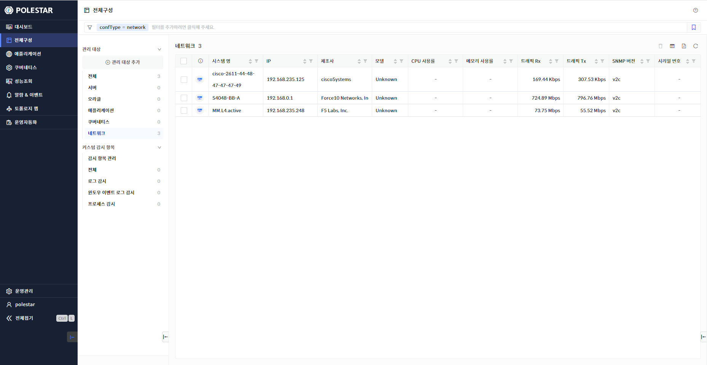
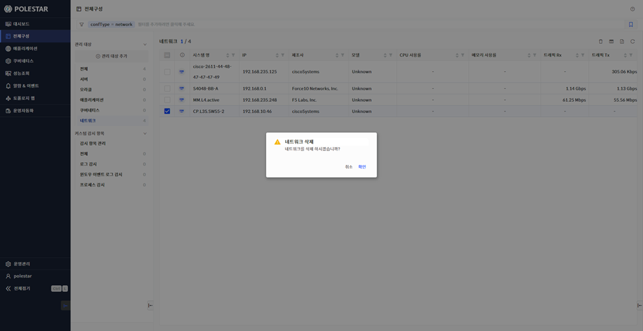
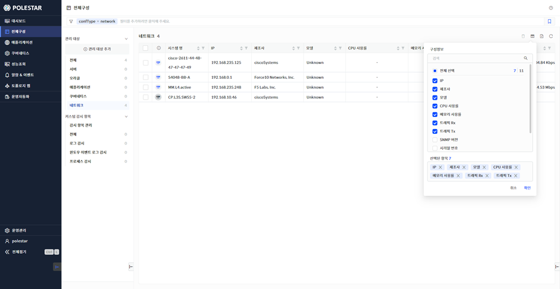
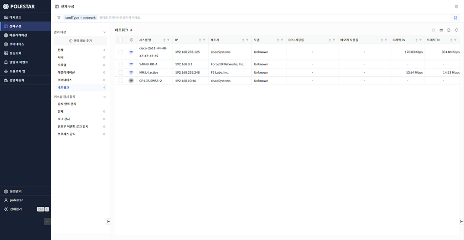

네트워크 목록

전체 구성에서 \[네트워크\]를 선택하거나 전체에서 네트워크의 \[더보기\>\]를 선택하면 전체 네트워크 목록을 확인할 수 있습니다. 네트워크 목록을 통해 네트워크가 설치된 호스트(IP), 시스템명, 제조사, 모델, SNMP 버전 정보를 확인하고 검색해 볼 수 있으며 네트워크의 주요 성능 지표(RTT, Duration Time, CPU/메모리 사용률, 트래픽 RX/TX 등)를 확인하여 네트워크의 전체적인 부하를 파악하고 비교해볼 수 있습니다. 또한 해당 화면에서 등록된 네트워크를 삭제할 수 있습니다.

<table>
<tbody>
<tr class="odd">
<td>
노트

전체 구성에서 관리되는 네트워크는 [전체구성] 메뉴의 [관리 대상 추가]에서 네트워크 [관리 대상 등록]을 통해 등록되어야 합니다. 그리고 네트워크 목록에는 로그인 사용자에게 읽기 권한이 할당된 네트워크만 표시됩니다.
</td>
</tr>
</tbody>
</table>

> ▶ \[그림1\] 네트워크 목록

네트워크 삭제

삭제할 네트워크를 선택하고 \[삭제\] 버튼을 선택하면 등록된 네트워크를 삭제할 수 있습니다. 

▶ \[그림2\] 네트워크 삭제

> 네트워크 삭제 절차

1.  삭제하고자 하는 네트워크 선택 (다중 선택 가능)

2.  테이블 우측 상단의 삭제 아이콘 클릭

3.  메시지창에서 확인 클릭

컬럼 수정

네트워크 목록의 우측 상단 \[컬럼 수정\] 버튼을 통해 네트워크 목록에 원하는 컬럼을 표시하거나 제외할 수 있습니다. 엑셀 저장시에도 컬럼 수정을 통해 표시된 컬럼만 저장됩니다. 컬럼 수정 팝업창에서는 컬럼 검색 기능을 제공하며 선택된 항목을 하단에 표시하고 표시된 컬럼을 제외할 수 있는 기능을 제공합니다.

▶ \[그림3\] 네트워크 목록 컬럼 수정

> 네트워크 컬럼 수정 절차

1.  네트워크 목록에서 우측 상단 컬럼 수정 아이콘 클릭

2.  컬럼 수정 팝업창에서 화면에 표시하고자 하는 컬럼을 체크박스에서 선택

3.  저장 버튼 클릭

엑셀 저장

네트워크 목록의 우측 상단 \[엑셀 저장\] 버튼을 통해 네트워크 목록을 엑셀로 저장할 수 있습니다. 컬럼 수정 기능, 상단 태그 검색 기능, 그리드 컬럼 검색 기능 등을 통해 엑셀에 보여줄 컬럼과 내용을 원하는 조건에 맞게 필터링하여 저장할 수 있습니다.

▶ \[그림4\] 네트워크 목록 엑셀 저장

> 네트워크 목록 엑셀 저장 및 조회 절차

1.  네트워크 목록에서 우측 상단 엑셀 저장 아이콘 클릭

2.  브라우저 우측 상단 창에 저장된 엑셀 파일명이 표시됨

3.  해당 파일명을 클릭하여 엑셀 파일 확인

