네트워크 상세

네트워크 상세 화면에서는 네트워크의 성능 정보, 구성 정보를 확인할 수 있으며 인터페이스를 비롯하여 장비의 트래픽 정보를 상세 분석할 수 있습니다. 성능 메뉴에서는 카테고리(인터페이스, CPU, 메모리, 모듈)별로 성능 정보를 확인할 수 있습니다. 구성 메뉴에서는 카테고리(구성 이력, 설정 정보)별로 구성 관련 정보를 확인할 수 있습니다.

구성 이력 화면에서는 네트워크 구성 정보(호스트, IP주소, 호스트명, 제조사 등)의 변경 이력과 현황 정보를 확인할 수 있습니다. 설정 정보 화면에서는 네트워크 연결 정보를 비롯한 기본 설정 정보와 역할 및 권한, 리소스 담당자, 추가 정보 등을 조회하거나 변경 가능합니다. 네트워크 장비에 설정되어 있는 알람 정보와 수집 정책을 조회할 수 있으며, 성능/구성 데이터 최근 수집 시간을 조회하고 즉시 실행을 통한 즉시 수집 기능을 제공합니다. 현황 정보 화면에서는 네트워크 장비의 인터페이스, TCP 연결 테이블, ARP 테이블, Route 테이블, MAC 주소 테이블 정보를 확인할 수 있습니다. 단, 인터페이스의 경우 관리대상으로 등록된 인터페이스의 구성 정보만 표시합니다.

분석 메뉴에서는 SLB 분석 카테고리를 통해 네트워크 장비의 LB 매핑 정보와 가상서버, 물리서버 상세 정보를 확인할 수 있습니다. SLB 분석 메뉴는 LB 기능을 지원하는 네트워크 장비에서만 사용 가능합니다. LB 기능을 지원하지 않을 경우 SLB 분석 메뉴가 화면에 나타나지 않습니다.

네트워크 시스템 성능

네트워크 시스템 성능 화면은 네트워크 장비의 전반적인 상태와 성능, 구성 정보를 조회할 수 있는 화면입니다. 상단 요약 카드 형식의 영역에서는 네트워크 구성 정보(장비명, IP 주소, 제조사(모델))와 네트워크 성능 정보(SNMP 상태, ICMP 상태, CPU 사용률, 메모리 사용률)가 표시됩니다. 아래에는 네트워크 인터페이스의 구성 정보와 현재 상태를 조회할 수 있는 컴포넌트가 위치합니다. 오른쪽 영역의 상단에는 CPU/메모리 사용률 차트가, 그 밑으로 팬/파워/온도의 상태 정보를 나타내는 컴포넌트가 표시됩니다. 제일 하단에는 네트워크 장비의 주요 성능 지표인 가동일수, RTT에 대한 차트가 표시됩니다.

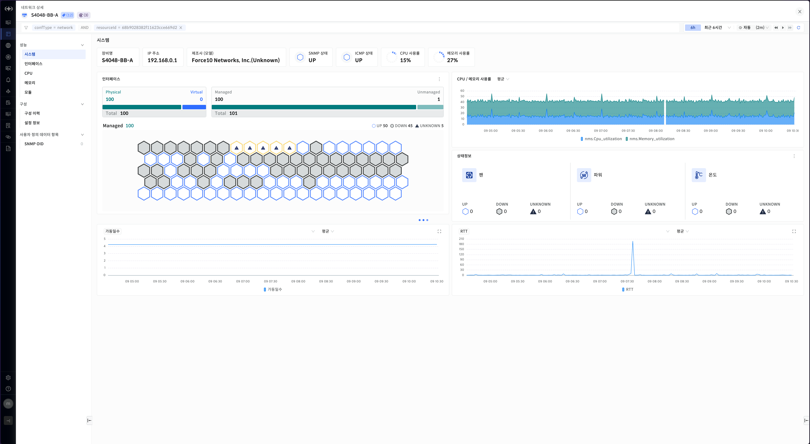

▶ \[그림 1\] 네트워크 시스템 성능

시스템 요약 정보

네트워크의 주요 구성 정보와 통신 상태 및 CPU사용률과 메모리 사용률을 표시합니다.

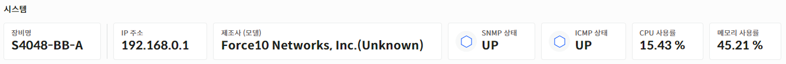

▶ \[그림 \] 네트워크 시스템 요약 정보

> 화면 지표

| 장비명      | 네트워크 장비의 장비명 정보를 표시합니다.        |
| -------- | ------------------------------ |
| IP주소     | 네트워크 장비의 IP 주소 정보를 표시합니다.      |
| 제조사 (모델) | 네트워크 장비의 제조사 및 모델 정보를 표시합니다.   |
| SNMP상태   | 네트워크 장비의 현재 SNMP 통신 상태를 표시합니다. |
| ICMP 상태  | 네트워크 장비의 현재 ICMP 통신 상태를 표시합니다. |
| CPU 사용률  | 네트워크 장비의 현재 CPU 사용률 정보를 표시합니다. |
| 메모리 사용률  | 네트워크 장비의 현재 메모리 사용률 정보를 표시합니다. |

인터페이스

네트워크 장비의 인터페이스 구성과 상태를 한 눈에 볼 수 있도록 표현한 컴포넌트입니다. 상단에는 전체 인터페이스를 대상으로 물리 포트와 가상 포트의 개수와 관리상태 별 인터페이스 수를 표시합니다. 그 밑으로 전체 물리 포트의 상태를 표시하는 포트 맵이 위치합니다. 이를 통해 네트워크 장비의 인터페이스 전체 구성과 개별 상태를 한눈에 파악할 수 있습니다.

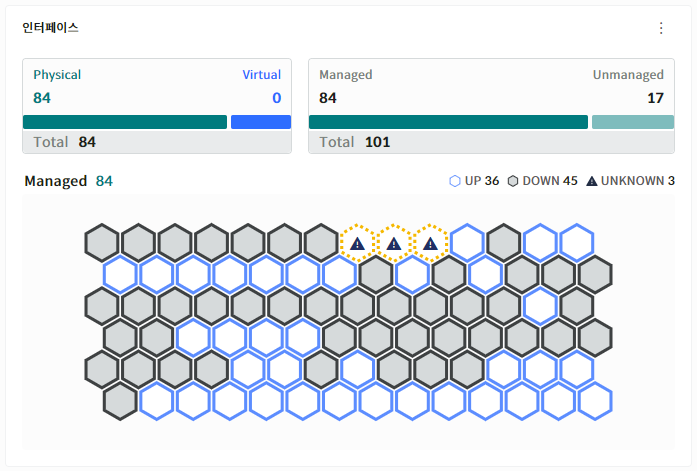

▶ \[그림 \] 인터페이스

> 화면 지표

| Physical  | 등록 및 관리되는 인터페이스 중 물리 인터페이스 수량 정보를 표시합니다. |
| --------- | ---------------------------------------- |
| Virtual   | 등록 및 관리되는 인터페이스 중 가상 인터페이스 수량 정보를 표시합니다. |
| Managed   | 등록 및 관리되고 있는 인터페이스 수량 정보를 표시합니다.         |
| Unmanaged | 관리되고 있지 않은 인터페이스 수량 정보를 표시합니다.           |
| 포트 맵      | 등록 및 관리중인 인터페이스의 현재 상태 정보를 맵 형태로 표현합니다.  |

CPU / 메모리 사용률 차트

CPU/메모리 사용률 차트는 네트워크 장비의 CPU 사용률과 메모리 사용률 지표를 Area 차트로 표시하여 메모리와 CPU 부하 여부를 한 눈에 확인할 수 있습니다. 이를 통해 네트워크 장비가 효율적으로 잘 운영되고 있는지 확인할 수 있습니다.

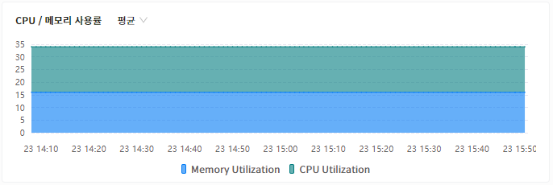

▶ \[그림 \] 네트워크 CPU/메모리 사용률 차트

> 차트 지표

| CPU 사용률 | 네트워크 장비의 전체 CPU 사용률 정보를 표시합니다. |
| ------- | ------------------------------ |
| 메모리 사용률 | 네트워크 장비의 전체 메모리 사용률 정보를 표시합니다. |

<table>
<tbody>
<tr class="odd">
<td>
노트

네트워크 장비 CPU, 메모리의 성능지표 수집은 제조사마다 제공되는 Private OID를 사용하여 수집하며 제조사 지원 여부에 따라 해당 지표가 표현되지 않을 수도 있습니다.
</td>
</tr>
</tbody>
</table>

팬, 파워, 온도 상태정보

네트워크 팬, 파워, 온도에 대해 상태 별 수량 정보를 확인할 수 있습니다. 이상 상태가 발생한 팬, 파워, 온도 수를 한눈에 파악할 수 있습니다.

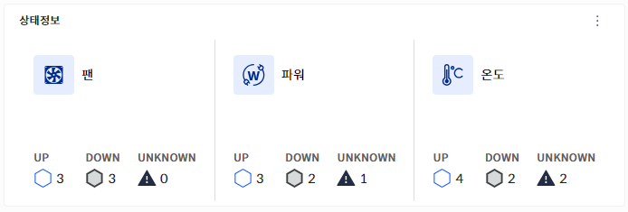

▶ \[그림 \] 팬, 파워, 온도 상태정보

> 화면 지표

| 팬  | 네트워크 장비를 구성하고 있는 팬의 가용성 별 수량을 표시합니다.  |
| -- | ------------------------------------- |
| 파워 | 네트워크 장비를 구성하고 있는 파워의 가용성 별 수량을 표시합니다. |
| 온도 | 네트워크 장비를 구성하고 있는 온도의 가용성 별 수량을 표시합니다. |

<table>
<tbody>
<tr class="odd">
<td>
노트

팬, 파워, 온도의 성능지표 수집은 제조사마다 제공되는 Private OID를 사용하여 수집하며 제조사의 지원 여부에 따라 해당 지표가 표현되지 않을 수도 있습니다.
</td>
</tr>
</tbody>
</table>

장비 성능 정보

네트워크 장비의 성능지표(가동일수, RTT) 정보가 차트로 표시됩니다.

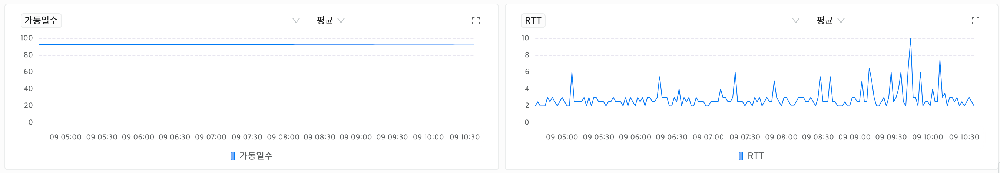

▶ \[그림 \] 네트워크 성능 정보

> 화면 지표

| 가동일수 | 네트워크 장비의 가동일수 정보를 표시합니다.             |
| ---- | ------------------------------------ |
| RTT  | 네트워크 장비의 RTT (PING 응답 시간) 정보를 표시합니다. |

인터페이스 성능

인터페이스 성능 화면은 네트워크 장비의 인터페이스에 대해 상태와 성능 정보를 조회하는 화면입니다. 상단에 주요 성능지표에 대한 인터페이스 Top5 정보가 차트로 표시되며 그 밑으로 네트워크 인터페이스 별 성능 정보가 최대 10개까지 목록으로 표시됩니다. 목록 옆의 파란색 숫자는 네트워크 장비의 전체 인터페이스 수를 의미하며, 더보기를 클릭하여 전체 인터페이스 분석 화면으로 이동할 수 있습니다.

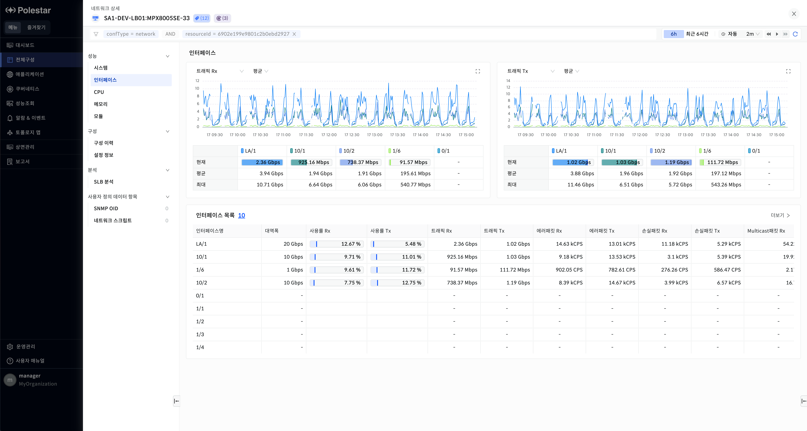

> ▶ \[그림 \] 네트워크 인터페이스

인터페이스 TOP5 정보

전체 네트워크 인터페이스 중 성능지표 수집 값의 평균이 가장 높은 상위 5개 인터페이스에 대한 정보를 나타내는 차트입니다. 상단에는 성능지표 별 Line 차트가 표시되며, 성능지표나 데이터 종류(최소/평균/최대/합산)를 변경할 수 있습니다. 그 밑으로 상위 5개 인터페이스에 대해 성능지표 별 평균, 최대, 현재 데이터를 표시합니다.

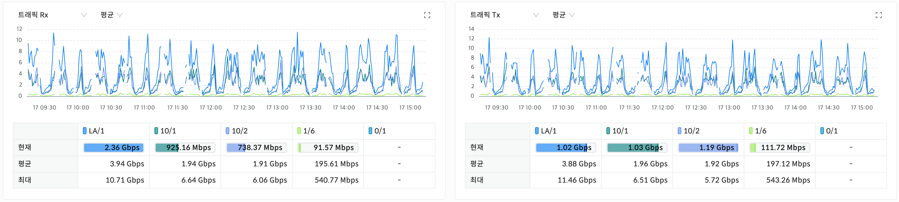

▶ \[그림 \] 네트워크 인터페이스 Top5 정보

> Top5 차트 지표

| 트래픽 Rx            | 트래픽 Rx의 정보를 표시합니다.            |
| ----------------- | ----------------------------- |
| 트래픽 Tx            | 트래픽 Tx의 정보를 표시합니다.            |
| 에러패킷 Rx           | 에러패킷Rx의 정보를 표시합니다.            |
| 에러패킷 Tx           | 에러패킷Tx의 정보를 표시합니다.            |
| 손실패킷 Rx           | 손실패킷Rx의 정보를 표시합니다.            |
| 손실패킷 Tx           | 손실패킷 Tx의 정보를 표시합니다.           |
| Unicast 패킷 Rx     | Unicast 패킷Rx의 정보를 표시합니다.      |
| Unicast 패킷 Tx     | Unicast 패킷 Tx의 정보를 표시합니다.     |
| Non-Unicast 패킷 Rx | Non-Unicast 패킷 Rx의 정보를 표시합니다. |
| Non-Unicast 패킷 Tx | Non-Unicast 패킷 Tx의 정보를 표시합니다. |
| Multicast 패킷 Rx   | Multicast 패킷 Rx의 정보를 표시합니다.   |
| Multicast 패킷 Tx   | Multicast 패킷 Tx의 정보를 표시합니다.   |
| Broadcast 패킷 Rx   | Broadcast 패킷 Rx의 정보를 표시합니다.   |
| Broadcast 패킷 Tx   | Broadcast 패킷 Tx의 정보를 표시합니다.   |

인터페이스 TOP10 목록

전체 네트워크 인터페이스 중 수집된 사용률 Rx 값이 가장 높은 상위 10개 인터페이스에 대한 요약 정보를 확인할 수 있습니다. 전체 인터페이스 목록을 조회하려면 인터페이스 목록 옆의 파란색 숫자를 클릭하거나 \[더보기\>\] 버튼을 클릭하여 전체 인터페이스 목록으로 이동합니다.

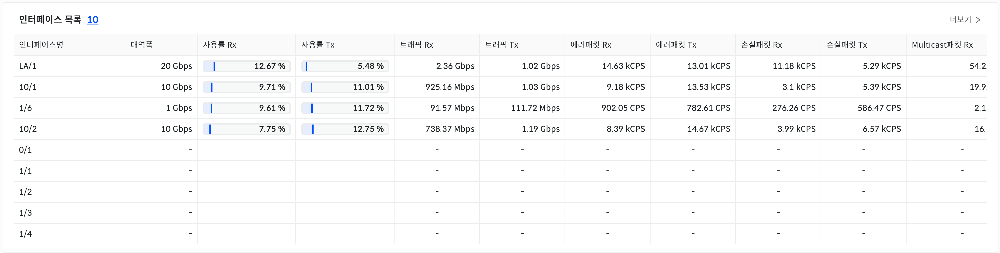

▶ \[그림 \] 인터페이스 Top10 목록

> 화면 지표

| 인터페이스 이름        | 인터페이스 이름을 표시합니다.                                                                    |
| --------------- | ----------------------------------------------------------------------------------- |
| 대역폭             | 수집된 인터페이스 대역폭 정보를 표시합니다. 인터페이스 설정 정보 화면에서 수동 대역폭(bit)가 설정되어 있는 경우 수동 대역폭 정보가 표시됩니다. |
| 사용률 Rx          | 트래픽 사용률 Rx의 정보를 표시합니다.                                                              |
| 사용률 Tx          | 트래픽 사용률 Tx의 정보를 표시합니다.                                                              |
| 트래픽 Rx          | 트래픽 Rx의 정보를 표시합니다.                                                                  |
| 트래픽 Tx          | 트래픽 Tx의 정보를 표시합니다.                                                                  |
| 에러 패킷 Rx        | 에러 패킷 Rx의 정보를 표시합니다.                                                                |
| 에러 패킷 Tx        | 에러 패킷 Tx의 정보를 표시합니다.                                                                |
| 손실 패킷 Rx        | 손실 패킷 Rx의 정보를 표시합니다.                                                                |
| 손실 패킷 Tx        | 손실 패킷 Tx의 정보를 표시합니다.                                                                |
| Multicast 패킷 Rx | Multicast 패킷 Rx의 정보를 표시합니다.                                                         |
| Multicast 패킷 Tx | Multicast 패킷 Tx의 정보를 표시합니다.                                                         |

전체 인터페이스

전체 인터페이스 화면은 네트워크 장비의 모든 인터페이스에 대해 성능 정보를 상세하게 조회하고 분석하는 화면입니다. 상단에는 조회시간동안 수집된 전체 인터페이스의 트래픽 Rx, 트래픽 Tx 정보를 전체 인터페이스 차트로 표시합니다. 그 밑으로 가장 마지막에 수집된 전체 인터페이스의 성능 정보들을 목록으로 표시합니다. 전체 인터페이스 차트의 특정 시점을 클릭하면 해당 시점에 대한 인터페이스 목록을 조회합니다. 이를 통해 특정 시점의 인터페이스 정보를 상세하게 분석할 수 있습니다.

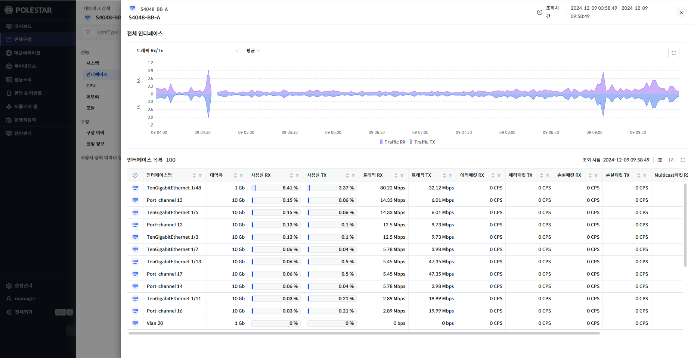

> ▶ \[그림 \] 전체 인터페이스

전체 인터페이스 정보

네트워크 장비의 전체 인터페이스에 대해 성능지표 별 Rx, Tx 데이터를 하나의 차트로 표시합니다. 조회시간동안 수집된 성능지표 별 Rx, Tx 데이터를 비교하고 분석하는데 활용할 수 있습니다. 차트의 특정 시점을 클릭하면 해당 시점에 수집된 인터페이스 정보가 아래의 인터페이스 목록에 표시됩니다.

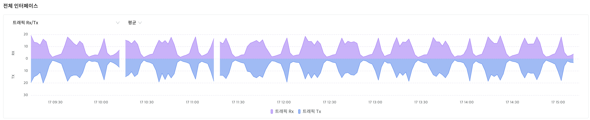

▶ \[그림 \] 전체 인터페이스 성능 차트

> 화면 지표

| 트래픽 Rx/Tx            | 트래픽의 Rx, Tx 성능 정보를 차트에 표시합니다.            |
| -------------------- | ---------------------------------------- |
| 에러 패킷 Rx/Tx          | 에러 패킷의 Rx, Tx 성능 정보를 차트에 표시합니다.          |
| 손실 패킷 Rx/Tx          | 손실 패킷의 Rx, Tx 성능 정보를 차트에 표시합니다.          |
| Unicast 패킷 Rx/Tx     | Unicast 패킷의 Rx, Tx 성능 정보를 차트에 표시합니다.     |
| Non-Unicast 패킷 Rx/Tx | Non-Unicast 패킷의 Rx, Tx 성능 정보를 차트에 표시합니다. |
| Multicast 패킷 Rx/Tx   | Multicast 패킷의 Rx, Tx 성능 정보를 차트에 표시합니다.   |
| Broadcast 패킷 Rx/Tx   | Broadcast 패킷의 Rx, Tx 성능 정보를 차트에 표시합니다.   |
| CRC 오류 패킷            | CRC 오류 패킷의 성능 정보를 차트에 표시합니다.             |
| Collision패킷          | Collision패킷의 성능 정보를 차트에 표시합니다.           |

전체 인터페이스 목록

네트워크 장비의 전체 인터페이스 목록을 표시합니다. 목록 오른쪽 상단에 조회 시점 정보가 표시됩니다. 상단의 전체 인터페이스 차트에서 차트의 특정 시점을 클릭하면 조회 시점이 변경됩니다.

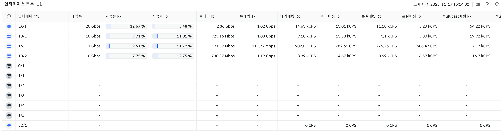

▶ \[그림 \] 전체 인터페이스 목록

> 목록 지표

| 인터페이스명          | 인터페이스명 정보를 표시합니다.                                                                   |
| --------------- | ----------------------------------------------------------------------------------- |
| 대역폭             | 수집된 인터페이스 대역폭 정보를 표시합니다. 인터페이스 설정 정보 화면에서 수동 대역폭(bit)가 설정되어 있는 경우 수동 대역폭 정보가 표시됩니다. |
| 사용률 Rx          | 트래픽 사용률 Rx의 정보를 표시합니다.                                                              |
| 사용률 Tx          | 트래픽 사용률 Tx의 정보를 표시합니다.                                                              |
| 트래픽 Rx          | 트래픽 Rx의 정보를 표시합니다.                                                                  |
| 트래픽 Tx          | 트래픽 Tx의 정보를 표시합니다.                                                                  |
| 에러 패킷 Rx        | 에러 패킷Rx의 정보를 표시합니다.                                                                 |
| 에러 패킷 Tx        | 에러 패킷 Tx의 정보를 표시합니다.                                                                |
| 손실 패킷 Rx        | 손실 패킷 Rx의 정보를 표시합니다.                                                                |
| 손실 패킷 Tx        | 손실 패킷 Tx의 정보를 표시합니다.                                                                |
| Multicast 패킷 Rx | Multicast 패킷 Rx의 정보를 표시합니다.                                                         |
| Multicast 패킷 Tx | Multicast 패킷 Tx의 정보를 표시합니다.                                                         |
| Broadcast 패킷 Rx | Broadcast 패킷 Rx의 정보를 표시합니다.                                                         |
| Broadcast 패킷 Tx | Broadcast 패킷 Tx의 정보를 표시합니다.                                                         |
| Unicast 패킷 Rx   | Unicast 패킷 Rx의 정보를 표시합니다.                                                           |
| Unicast 패킷 Tx   | Unicast 패킷 Tx의 정보를 표시합니다.                                                           |
| Unicast 패킷 Rx   | Non-Unicast 패킷 Rx의 정보를 표시합니다.                                                       |
| Unicast 패킷 Tx   | Non-Unicast 패킷 Tx의 정보를 표시합니다.                                                       |
| Oper Status     | 운영상태 정보를 표시합니다.                                                                     |

개별 인터페이스 상세

개별 인터페이스 상세 화면은 개별 인터페이스에 대한 성능, 구성, 설정 정보를 조회할 수 있는 화면입니다. 개별 인터페이스별 요약 정보와 차트가 표시되고 구성 이력을 확인하거나 개별 설정을 변경할 수 있습니다.

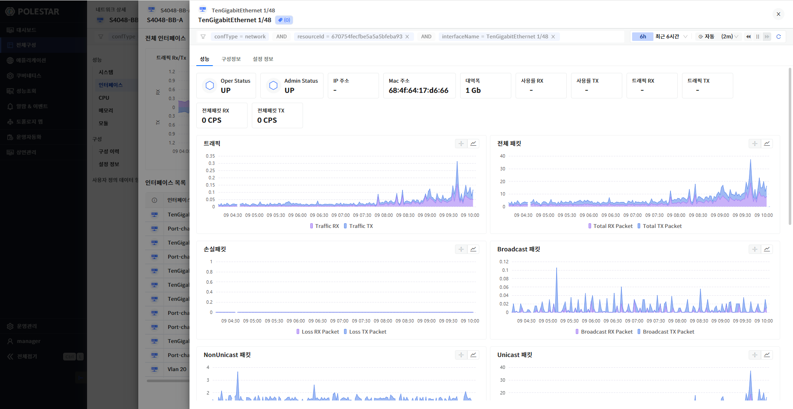

> ▶ \[그림 \] 개별 인터페이스 상세

개별 인터페이스 성능 정보

개별 인터페이스에 대한 성능 정보를 표시합니다. 상단의 카드 영역에서는 인터페이스의 주요 지표에 대한 요약 정보가 표시되며, 대표적인 구성 지표(IP 주소, Mac 주소, 관리상태, 대역폭)와 성능 지표(운영상태, 사용률 Rx, 사용률 Tx, 트래픽 Rx, 트래픽Tx, 전체 패킷 Rx, 전체 패킷 Tx)가 표시됩니다. 그 밑으로 전체 성능 지표(트래픽, 전체 패킷, 손실패킷, Broadcast 패킷, NonUnicast 패킷, Unicast패킷, 사용률, 에러 패킷, Multicast 패킷, CRC, Collision)의 정보가 차트로 표시됩니다.

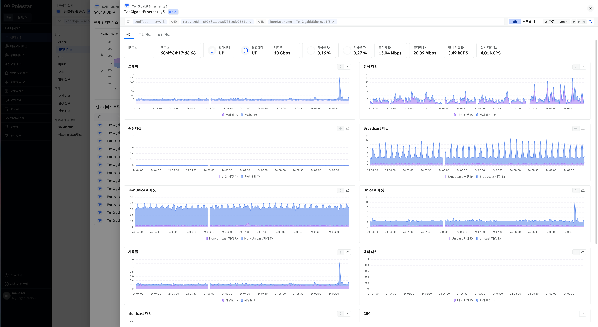

▶ \[그림 \] 개별 인터페이스 성능

> 화면 지표

| Oper Status  | 인터페이스의 운영 상태 정보를 표시합니다.                                                             |
| ------------ | ----------------------------------------------------------------------------------- |
| Admin Status | 인터페이스의 관리 상태 정보를 표시합니다.                                                             |
| IP 주소        | 개별 인터페이스의 IP 주소 정보를 표시합니다.                                                          |
| Mac 주소       | Mac 주소 정보를 표시합니다.                                                                   |
| 대역폭          | 수집된 인터페이스 대역폭 정보를 표시합니다. 인터페이스 설정 정보 화면에서 수동 대역폭(bit)가 설정되어 있는 경우 수동 대역폭 정보가 표시됩니다. |
| 사용률 Rx       | 사용률 Rx의 정보를 표시합니다.                                                                  |
| 사용률 Tx       | 사용률 Tx의 정보를 표시합니다.                                                                  |
| 트래픽 Rx       | 트래픽 Rx의 정보를 표시합니다.                                                                  |
| 트래픽 Tx       | 트래픽 Tx의 정보를 표시합니다.                                                                  |
| 전체 패킷 Rx     | 전체 패킷 Rx의 정보를 표시합니다.                                                                |
| 전체 패킷 Tx     | 전체 패킷 Tx의 정보를 표시합니다.                                                                |

개별 인터페이스 구성 정보

개별 인터페이스에 대한 구성 정보를 표시합니다. 구성 변경 현황 정보와 변경 이력을 확인할 수 있습니다.

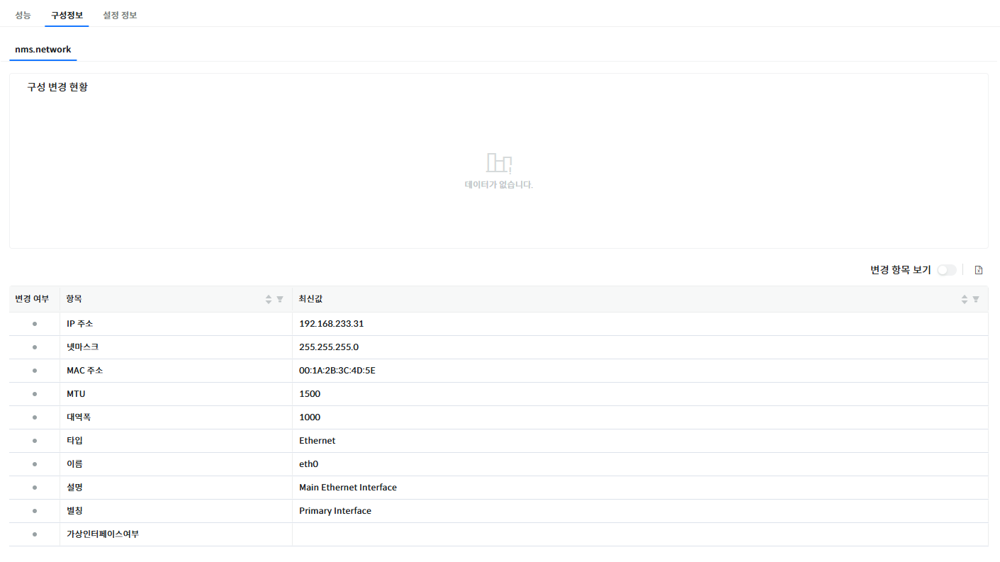

▶ \[그림 \] 개별 인터페이스 구성

> 화면 지표

| IP주소        | 개별 인터페이스의 IP주소 정보를 표시합니다.  |
| ----------- | -------------------------- |
| 넷마스크        | 개별 인터페이스의 넷마스크 정보를 표시합니다.  |
| MAC주소       | 개별 인터페이스의 MAC주소 정보를 표시합니다. |
| MTU         | 개별 인터페이스의 MTU 정보를 표시합니다.   |
| 대역폭         | 개별 인터페이스의 대역폭 정보를 표시합니다.   |
| 타입          | 개별 인터페이스의 타입 정보를 표시합니다.    |
| 이름          | 개별 인터페이스의 이름 정보를 표시합니다.    |
| 설명          | 개별 인터페이스의 설명 정보를 표시합니다.    |
| 별칭          | 개별 인터페이스의 별칭 정보를 표시합니다.    |
| 가상 인터페이스 여부 | 가상 인터페이스 여부를 표시합니다.        |

개별 인터페이스 설정 정보

개별 인터페이스에 대한 설정 정보를 표시합니다.

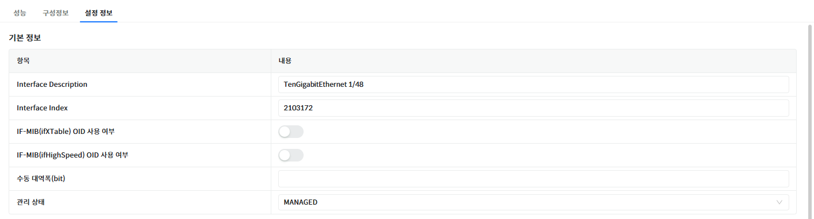

▶ \[그림 \] 개별 인터페이스 설정

> 화면 지표

| Interface Description         | 현재 설정되어 있는 인터페이스 설명 정보를 표시합니다.                   |
| ----------------------------- | ------------------------------------------------ |
| Interface Index               | 현재 설정되어 있는 인터페이스 Index 정보를 표시합니다.                |
| IF-MIB(ifXTable) OID 사용 여부    | 현재 설정되어 있는 IF-MIB(ifXTable) OID 사용 여부를 표시합니다.    |
| IF-MIB(ifHighSpeed) OID 사용 여부 | 현재 설정되어 있는 IF-MIB(ifHighSpeed) OID 사용 여부를 표시합니다. |
| 수동 대역폭(bit)                   | 현재 설정되어 있는 수동 대역폭(bit) 정보를 표시 및 설정합니다.           |
| 관리 상태                         | 현재 설정되어 있는 관리 상태 정보를 표시 및 설정합니다.                 |

CPU

CPU의 성능 정보를 조회하는 화면입니다. 상단에는 전체 CPU에 대한 Gauge 차트와 Line 차트가 표시됩니다. CPU 목록에서는 개별 CPU의 사용률 최소, 평균, 최대 값과 사용률 추이 차트가 표시됩니다.

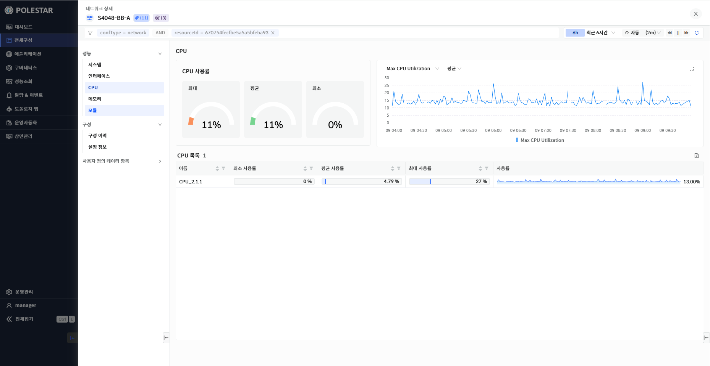

> ▶ \[그림 \] CPU

CPU 성능 정보

네트워크 장비 전체 CPU에 대한 성능 정보를 Gauge 차트와 Line 차트로 표시합니다. Gauge 차트는 전체 CPU의 사용률 지표에 대해 최대, 평균, 최소 값을 표시합니다. Line 차트는 주요 성능 지표를 데이터 타입(평균, 최소, 최대, 합산)별로 표시합니다.

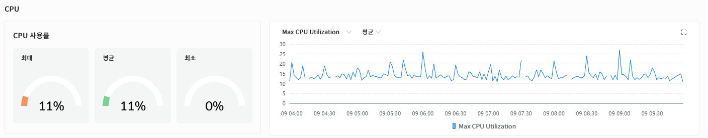

▶ \[그림 \] CPU성능

> 화면 지표

| CPU 사용률 최대          | 전체 CPU 사용률의 최대값을 표시합니다. |
| ------------------- | ----------------------- |
| CPU 사용률 최소          | 전체 CPU 사용률의 최소값을 표시합니다. |
| CPU 사용률 평균          | 전체 CPU 사용률의 평균값을 표시합니다. |
| Max CPU Utilization | 전체 CPU 사용률의 최대값을 표시합니다. |
| Avg CPU Utilization | 전체 CPU 사용률의 평균값을 표시합니다. |
| Min CPU Utilization | 전체 CPU 사용률의 최소값을 표시합니다. |

CPU 목록 정보

개별 CPU에 대한 성능 정보를 목록으로 표시합니다. 개별 CPU의 이름, 최소 사용률, 평균 사용률, 최대 사용률 데이터와 사용률 추이 차트가 표시됩니다.

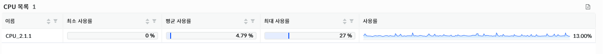

▶ \[그림 \] CPU 목록

> 목록 지표

| 이름       | 개별 CPU 이름을 표시합니다.          |
| -------- | -------------------------- |
| 최소 사용률   | 개별 CPU의 최소 사용률 정보를 표시합니다.  |
| 평균 사용률   | 개별 CPU의 평균 사용률 정보를 표시합니다.  |
| 최대 사용률   | 개별 CPU의 최대 사용률 정보를 표시합니다.  |
| 사용률 (차트) | 개별 CPU의 사용률 정보를 차트로 표시합니다. |

<table>
<tbody>
<tr class="odd">
<td>
노트

CPU의 성능지표 수집은 제조사마다 제공되는 Private OID를 사용하여 수집하며 제조사의 지원 여부에 따라 해당 지표가 표현되지 않을 수도 있습니다.
</td>
</tr>
</tbody>
</table>

메모리

메모리의 성능 정보를 조회하는 화면입니다. 상단에는 전체 메모리에 대한 Gauge 차트와 Line 차트가 표시됩니다. 메모리 목록에서는 개별 메모리의 사용률 최소, 평균, 최대 값과 사용률 추이 차트가 표시됩니다.

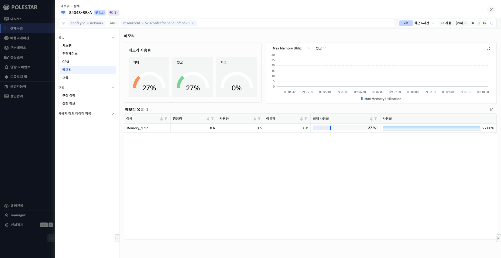

> ▶ \[그림 \] 메모리

메모리 성능 정보

네트워크 장비 전체 메모리에 대한 성능 정보를 Gauge 차트와 Line 차트로 표시합니다. Gauge 차트는 전체 CPU의 사용률 지표에 대해 최대, 평균, 최소 값을 표시합니다. Line 차트는 주요 성능 지표를 데이터 타입(평균, 최소, 최대, 합산)별로 표시합니다.

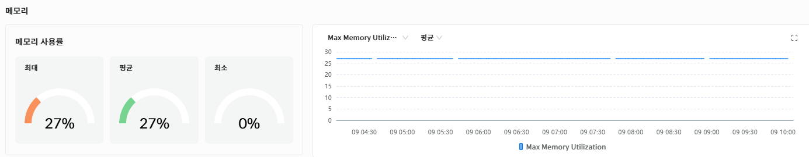

▶ \[그림 \] 메모리 성능

> 화면 지표

| 메모리 사용률 최대 | 전체 메모리 사용률의 최대값을 표시합니다. |
| ---------- | ----------------------- |
| 메모리 사용률 최소 | 전체 메모리 사용률의 최소값을 표시합니다. |
| 메모리 사용률 평균 | 전체 메모리 사용률의 평균값을 표시합니다. |

메모리 목록 정보

개별 메모리에 대한 성능 정보를 목록으로 표시합니다. 개별 메모리의 이름, 총용량, 사용량, 여유량, 최대 사용률 데이터와 사용률 추이 차트가 표시됩니다.

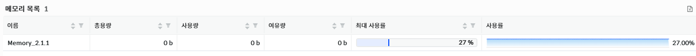

▶ \[그림 \] 메모리 목록

> 화면 지표

| 이름       | 개별 메모리의 이름을 표시합니다.         |
| -------- | -------------------------- |
| 총용량      | 개별 메모리의 총용량 정보를 표시합니다.     |
| 사용량      | 개별 메모리의 사용량 정보를 표시합니다.     |
| 여유량      | 개별 메모리의 여유량 정보를 표시합니다.     |
| 최대 사용률   | 개별 메모리의 최대 사용률 정보를 표시합니다.  |
| 사용률 (차트) | 개별 메모리의 사용률 정보를 차트로 표시합니다. |

<table>
<tbody>
<tr class="odd">
<td>
노트

메모리 성능지표 수집은 제조사마다 제공되는 Private OID를 사용하여 수집하며 제조사의 지원 여부에 따라 해당 지표가 표현되지 않을 수도 있습니다.
</td>
</tr>
</tbody>
</table>

모듈

모듈의 성능 정보를 조회하는 화면입니다. 상단에는 전체 모듈에 대한 가용성 컴포넌트가 표시됩니다. 모듈 목록에서는 개별 모듈의 이름, 상태, 설명이 표시됩니다.

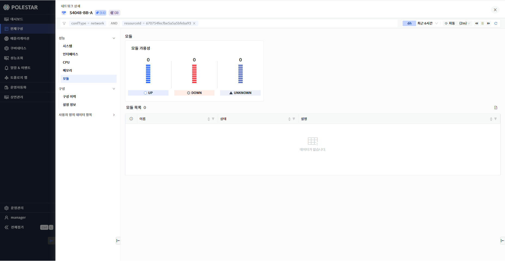

> ▶ \[그림 \] 모듈

모듈 가용성 정보

전체 모듈에 대해 가용성 별 모듈 개수를 한눈에 확인할 수 있습니다.

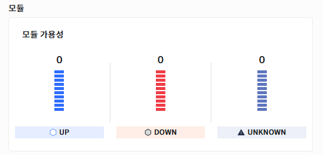

▶ \[그림 \] 모듈 가용성

> 화면 지표

| UP      | 가용성이 UP 상태인 모듈의 수량 정보를 표시합니다.      |
| ------- | ---------------------------------- |
| DOWN    | 가용성이 DOWN 상태인 모듈의 수량 정보를 표시합니다.    |
| UNKNOWN | 가용성이 UNKNOWN 상태인 모듈의 수량 정보를 표시합니다. |

모듈 목록 정보

개별 모듈에 대한 성능 정보를 목록으로 표시합니다. 개별 모듈의 이름, 상태, 설명이 표시됩니다.

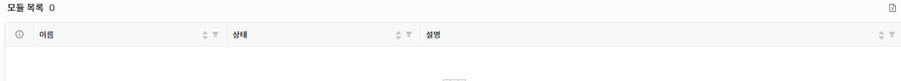

▶ \[그림 \] 모듈 목록

> 목록 지표

| 이름 | 개별 모듈의 이름을 표시합니다.    |
| -- | -------------------- |
| 상태 | 개별 모듈의 상태 정보를 표시합니다. |
| 설명 | 개별 모듈의 설명 정보를 표시합니다. |

<table>
<tbody>
<tr class="odd">
<td>
노트

모듈의 성능지표 수집은 제조사마다 제공되는 Private OID를 사용하여 수집하며 제조사의 지원 여부에 따라 해당 지표가 표현되지 않을 수도 있습니다.
</td>
</tr>
</tbody>
</table>

구성 이력

네트워크 장비의 구성 정보 변경 이력을 조회하는 화면입니다. 상단에 위치한 구성 변경 현황 차트는 타임셀렉터 기간 내에 변경이 발생한 횟수를 Bar 형식으로 표시합니다. 이를 통해 구성이 변경된 시점과 변경 횟수를 한눈에 파악할 수 있습니다. 하단에는 현재 시점의 구성 정보가 표시됩니다. 구성 이력 화면을 통해 현재 시점의 구성 정보와 과거의 구성 정보를 비교할 수 있습니다.

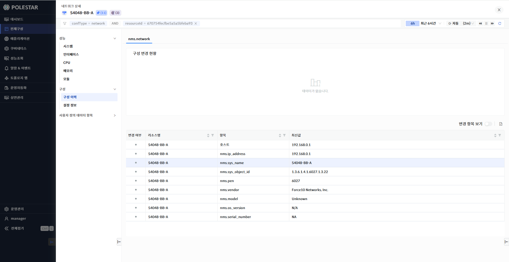

> ▶ \[그림 \] 구성 이력

이력 정보

구성 변경 이력의 시점과 횟수가 Bar 차트로 표시됩니다. 차트의 조회시점은 타임셀렉터를 통해 변경할 수 있습니다.

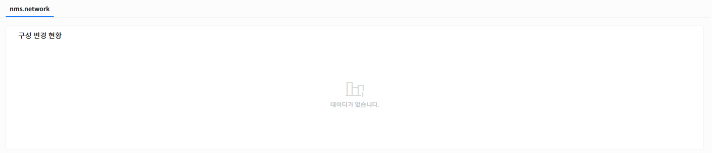

▶ \[그림 \] 구성 변경 현황

구성 목록 정보

네트워크 장비의 현재 구성 정보를 목록으로 표시합니다. 변경 여부, 리소스명, 항목, 최신값 컬럼으로 구성되어 있습니다.

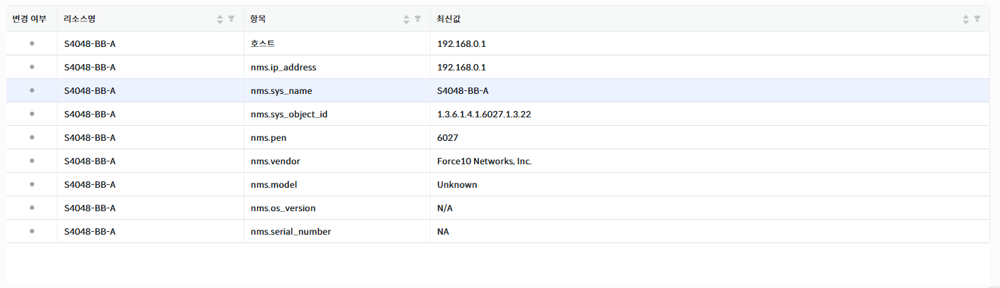

▶ \[그림 \] 구성 목록

> 화면 지표

| 호스트              | 네트워크 장비의 호스트 정보를 표시합니다.              |
| ---------------- | ------------------------------------ |
| IP 주소            | 네트워크 장비의 IP 주소 정보를 표시합니다.            |
| 시스템 명            | 네트워크 장비의 시스템명을 표시합니다.                |
| System Object ID | 네트워크 장비의 System Object ID 정보를 표시합니다. |
| PEN              | 네트워크 장비의 PEN 정보를 표시합니다.              |
| 제조사              | 네트워크 장비의 제조사 정보를 표시합니다.              |
| 모델               | 네트워크 장비의 모델 정보를 표시합니다.               |
| OS버전             | 네트워크 장비의 OS버전 정보를 표시합니다.             |
| 시리얼 번호           | 네트워크 장비의 시리얼 번호 정보를 표시합니다.           |

설정 정보

설정 정보 화면에서는 네트워크 장비의 기본 설정 정보(호스트, SNMP 포트, SNMP 버전, 읽기 커뮤니티), 일반 설정 정보(관리 상태, 수집정책), 역할 및 권한 설정, 리소스 담당자 설정의 현재 값을 조회하고 변경할 수 있습니다. 또한 네트워크 장비에 설정되어 있는 알람 정보(항목, 관리 지표 개수, 알람 설정 개수, 알람 정책), 성능/구성 데이터 최근 수집 시간을 조회할 수 있습니다. 네트워크 장비 연결에 필요한 추가 정보(접속 연결 타입, 연결 포트, 접속 계정, 접속 비밀번호, Enable 비밀번호, OS 버전, System Object ID)는 추가 정보 영역에서 조회하거나 변경할 수 있습니다.

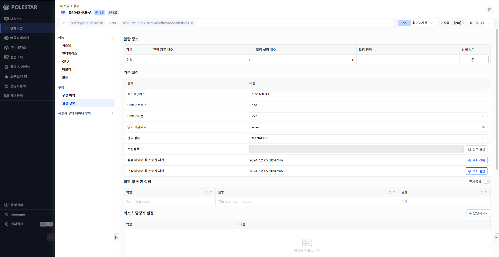

> ▶ \[그림 \] 설정 정보

기본 설정

현재 설정되어 있는 기본 설정 정보가 표시됩니다. 각 항목을 수정 후 저장하여 설정 정보를 변경할 수 있습니다.

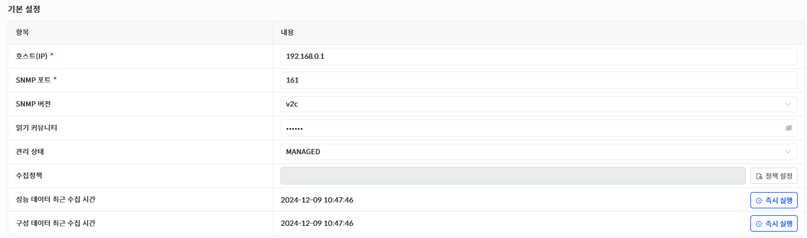

▶ \[그림 \] 기본 설정

> 설정 지표

| 호스트(IP)         | 호스트(IP) 정보를 설정 및 표시합니다.                                         |
| --------------- | --------------------------------------------------------------- |
| SNMP 포트         | SNMP 포트 정보를 설정 및 표시합니다.                                         |
| SNMP 버전         | SNMP 버전 정보를 설정 및 표시합니다.                                         |
| 읽기 커뮤니티         | 읽기 커뮤니티 정보를 설정 및 표시합니다.                                         |
| 관리 상태           | 관리 상태 정보를 설정 및 표시합니다.                                           |
| 수집정책            | 수집정책 정보를 설정 및 표시합니다.                                            |
| 성능 데이터 최근 수집 시간 | 성능 데이터 최근 수집 시간 정보를 표시합니다. 즉시 실행 버튼을 클릭하여 성능 수집을 즉시 실행할 수 있습니다. |
| 구성 데이터 최근 수집 시간 | 성능 데이터 최근 수집 시간 정보를 표시합니다. 즉시 실행 버튼을 클릭하여 구성 수집을 즉시 실행할 수 있습니다. |

현황 정보

현황 정보 화면에서는 네트워크 장비의 구성 현황 정보를 탭별로 조회할 수 있습니다. 인터페이스, TCP 연결 테이블, ARP 테이블, Route 테이블, MAC 주소 테이블 총 5개의 탭으로 구성되어 있으며, 각 탭을 클릭하여 해당 정보를 조회할 수 있습니다. 모든 데이터는 SNMP를 통해 수집됩니다.

<table>
<tbody>
<tr class="odd">
<td>
노트

각 탭의 이름 옆에 표시되는 데이터 수는 최대 99개까지 표시되며, 100개 이상인 경우 99+로 표시됩니다. 테이블 별 정확한 데이터 수는 해당 화면으로 이동하여 테이블 상단의 제목을 통해 확인할 수 있습니다.
</td>
</tr>
</tbody>
</table>

인터페이스

인터페이스 탭에서는 네트워크 장비의 관리대상으로 설정된 인터페이스의 구성 정보를 조회할 수 있습니다. 현황 정보 화면 진입 시 기본으로 선택되어 표시되는 화면입니다. 테이블 우측 상단의 \[컬럼 수정\] 아이콘을 클릭하여 테이블에 표시할 컬럼을 선택할 수 있습니다. 컬럼 헤더의 정렬을 클릭하여 오름차순 또는 내림차순 정렬하거나 필터 아이콘을 통해 조건을 설정하여 조회하고자 하는 데이터만 조회할 수 있습니다. \[엑셀 저장\] 아이콘을 클릭하면 현재 화면에 표시된 컬럼과 필터링된 데이터를 엑셀파일로 다운로드할 수 있습니다.

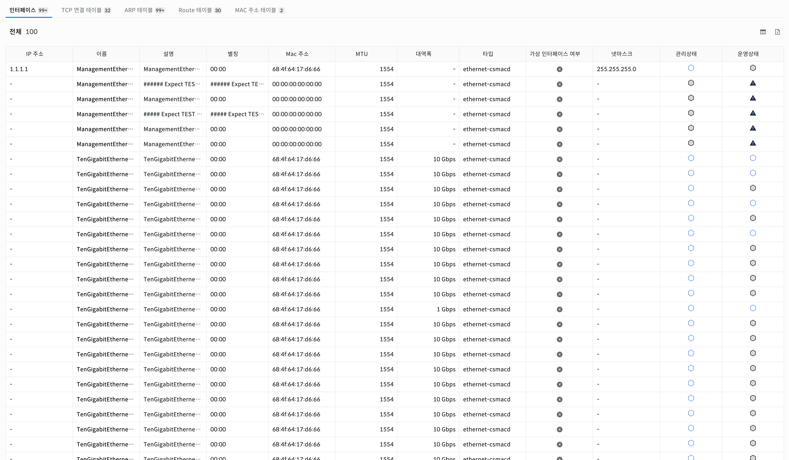

▶ \[그림 \] 인터페이스 목록

> 테이블 지표

| IP 주소       | 인터페이스의 IP 주소 정보를 표시합니다.              |
| ----------- | ------------------------------------ |
| 이름          | 인터페이스의 이름 정보를 표시합니다.                 |
| 설명          | 인터페이스의 설명 정보를 표시합니다.                 |
| 별칭          | 인터페이스의 별칭 정보를 표시합니다.                 |
| MAC 주소      | 인터페이스의 MAC 주소 정보를 표시합니다.             |
| MTU         | Maximum Transmission Unit 정보를 표시합니다. |
| 대역폭         | 인터페이스의 대역폭 정보를 표시합니다.                |
| 타입          | 인터페이스의 타입 정보를 표시합니다.                 |
| 가상 인터페이스 여부 | 가상 인터페이스 여부를 표시합니다.                  |
| 넷마스크        | 서브넷 마스크 정보를 표시합니다.                   |
| 관리상태        | 인터페이스의 관리 상태 정보를 표시합니다.              |
| 운영상태        | 인터페이스의 운영 상태 정보를 표시합니다.              |

TCP 연결 테이블

TCP 연결 탭에서는 네트워크 장비의 TCP 연결 정보를 조회할 수 있습니다. 테이블 우측 상단의 \[컬럼 수정\] 아이콘을 클릭하여 테이블에 표시할 컬럼을 선택할 수 있습니다. 컬럼 헤더의 정렬을 클릭하여 오름차순 또는 내림차순 정렬하거나 필터 아이콘을 통해 조건을 설정하여 조회하고자 하는 데이터만 조회할 수 있습니다. \[엑셀 저장\] 아이콘을 클릭하면 현재 화면에 표시된 컬럼과 필터링된 데이터를 엑셀파일로 다운로드할 수 있습니다.

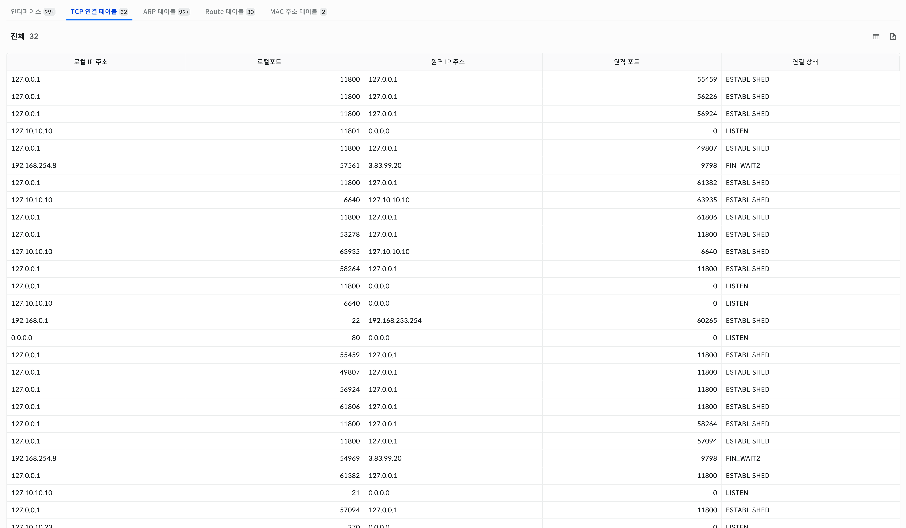

▶ \[그림 \] TCP 연결 테이블 화면

> 테이블 지표

| 로컬 IP 주소 | 로컬 측 IP 주소 정보를 표시합니다.                                    |
| -------- | -------------------------------------------------------- |
| 로컬포트     | 로컬 측 포트 번호 정보를 표시합니다.                                    |
| 원격 IP 주소 | 원격 측 IP 주소 정보를 표시합니다.                                    |
| 원격 포트    | 원격 측 포트 번호 정보를 표시합니다.                                    |
| 연결 상태    | TCP 연결 상태 정보를 표시합니다. (ESTABLISHED, LISTEN, TIME\_WAIT 등) |

ARP 테이블

인ARP 테이블 탭에서는 네트워크 장비의 ARP(Address Resolution Protocol) 정보를 조회할 수 있습니다. ARP 테이블은 IP 주소와 MAC 주소 간의 매핑 정보를 제공합니다. 테이블 우측 상단의 \[컬럼 수정\] 아이콘을 클릭하여 테이블에 표시할 컬럼을 선택할 수 있습니다. 컬럼 헤더의 정렬을 클릭하여 오름차순 또는 내림차순 정렬하거나 필터 아이콘을 통해 조건을 설정하여 조회하고자 하는 데이터만 조회할 수 있습니다. \[엑셀 저장\] 아이콘을 클릭하면 현재 화면에 표시된 컬럼과 필터링된 데이터를 엑셀파일로 다운로드할 수 있습니다.

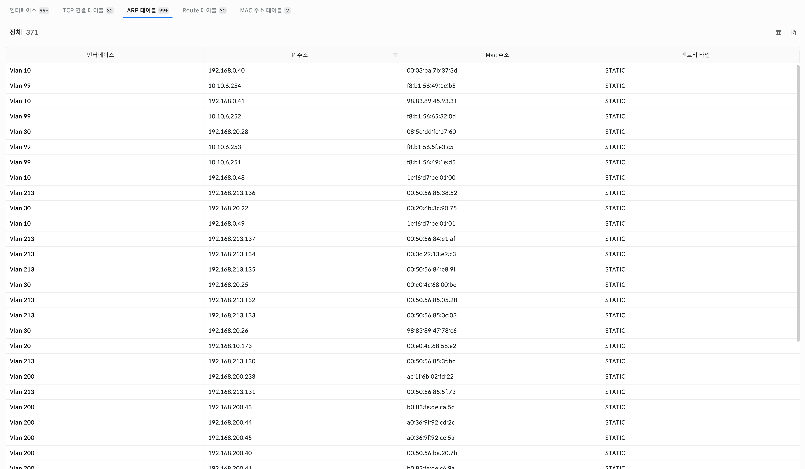

▶ \[그림 \] ARP 테이블 화면

> 테이블 지표

| 인터페이스  | 인터페이스 이름 정보를 표시합니다.                   |
| ------ | ------------------------------------- |
| IP 주소  | IP 주소 정보를 표시합니다.                      |
| MAC 주소 | MAC 주소 정보를 표시합니다.                     |
| 엔트리 타입 | 엔트리 타입 정보를 표시합니다. (DYNAMIC 또는 STATIC) |

Route 테이블

Route 테이블 탭에서는 네트워크 장비의 라우팅 테이블 정보를 조회할 수 있습니다. 라우팅 테이블은 네트워크 패킷이 목적지에 도달하기 위한 경로 정보를 제공합니다. 테이블 우측 상단의 \[컬럼 수정\] 아이콘을 클릭하여 테이블에 표시할 컬럼을 선택할 수 있습니다. 컬럼 헤더의 정렬을 클릭하여 오름차순 또는 내림차순 정렬하거나 필터 아이콘을 통해 조건을 설정하여 조회하고자 하는 데이터만 조회할 수 있습니다. \[엑셀 저장\] 아이콘을 클릭하면 현재 화면에 표시된 컬럼과 필터링된 데이터를 엑셀파일로 다운로드할 수 있습니다.

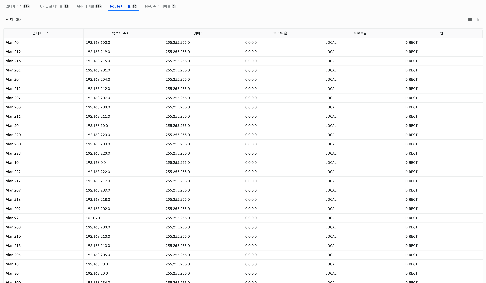

▶ \[그림 \] Route 테이블 화면

> 테이블 지표

| 인터페이스  | 인터페이스 이름 정보를 표시합니다.                    |
| ------ | -------------------------------------- |
| 목적지 주소 | 목적지 IP 주소 정보를 표시합니다.                   |
| 넷마스크   | 서브넷 마스크 정보를 표시합니다.                     |
| 넥스트 홉  | 다음 홉 IP 주소 정보를 표시합니다.                  |
| 프로토콜   | 라우팅 프로토콜 정보를 표시합니다. (RIP, OSPF, BGP 등) |
| 타입     | 라우트 타입 정보를 표시합니다. (DYNAMIC 또는 STATIC)  |

MAC 주소 테이블

MAC 주소 테이블 탭에서는 네트워크 장비의 FDB(Forwarding Database) 정보를 조회할 수 있습니다. FDB는 스위치가 MAC 주소와 포트 간의 매핑 정보를 학습하여 저장한 테이블입니다. 테이블 우측 상단의 \[컬럼 수정\] 아이콘을 클릭하여 테이블에 표시할 컬럼을 선택할 수 있습니다. 컬럼 헤더의 정렬을 클릭하여 오름차순 또는 내림차순 정렬하거나 필터 아이콘을 통해 조건을 설정하여 조회하고자 하는 데이터만 조회할 수 있습니다. \[엑셀 저장\] 아이콘을 클릭하면 현재 화면에 표시된 컬럼과 필터링된 데이터를 엑셀파일로 다운로드할 수 있습니다.

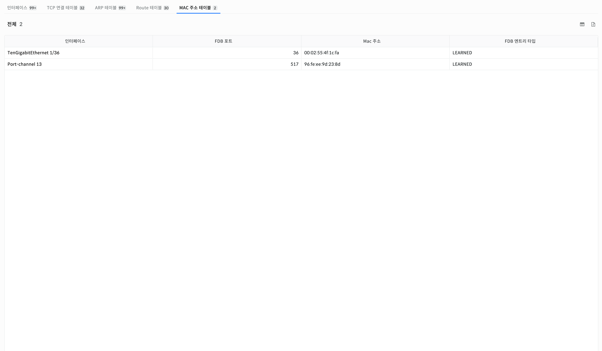

▶ \[그림 \] MAC 주소 테이블 화면

> 테이블 지표

| 인터페이스      | 인터페이스 이름 정보를 표시합니다.                   |
| ---------- | ------------------------------------- |
| FDB 포트     | FDB 포트 번호 정보를 표시합니다.                  |
| MAC 주소     | MAC 주소 정보를 표시합니다.                     |
| FDB 엔트리 타입 | 엔트리 타입 정보를 표시합니다. (DYNAMIC 또는 STATIC) |

SLB 분석

SLB 분석 메뉴에서는 네트워크 장비의 로드밸런싱 기능에 대한 상세 분석 정보를 제공합니다. LB 매핑 정보와 가상서버, 물리서버의 성능 정보를 실시간으로 모니터링하고 분석할 수 있습니다. SLB 분석 메뉴는 LB 기능을 지원하는 네트워크 장비에서만 사용 가능하며, LB 기능을 지원하지 않는 네트워크 장비의 경우 SLB 분석 메뉴가 화면에 나타나지 않습니다.

SLB 전체 현황 탭

SLB 전체 현황 화면에서는 네트워크 장비의 전체 가상서버와 물리서버에 대한 현황 정보를 한눈에 파악할 수 있습니다. 상단에는 전체 가상서버, 물리서버의 요약 정보가 표시되며, 가상서버 Top 차트를 통해 주요 서버들의 성능 데이터와 매핑 관계를 시각적으로 확인할 수 있습니다. 하단의 LB 매핑 목록에서는 가상서버와 물리서버의 매핑 관계와 각 서버의 상세 구성, 성능 정보가 표시됩니다.

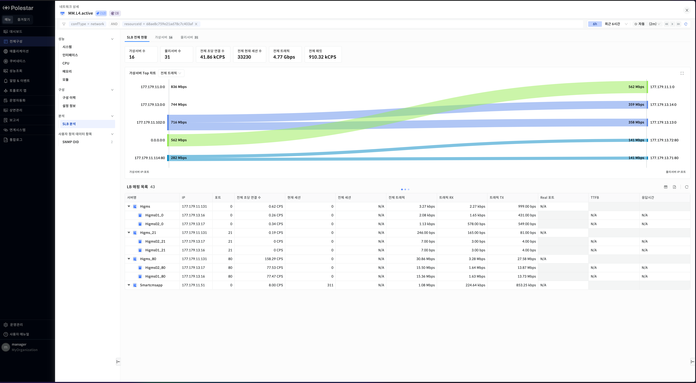

▶ \[그림 \] SLB 전체 현황 화면

SLB 전체 현황 요약 정보

SLB 전체 현황 화면에서는 네트워크 장비에서 수집된 전체 가상서버와 물리서버의 수량과 주요 지표를 요약하여 표시합니다. 네트워크 장비에서 수집된 전체 가상서버와 물리서버의 수량과 모든 서버의 초당 연결 수, 현재 세션 수, 트래픽, 패킷에 대한 전체 정보를 차례로 표시합니다. 현황 정보를 타임셀렉터를 사용한 데이터 조회 시점의 변경 기능을 지원하지 않습니다.

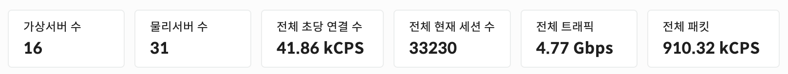

▶ \[그림 \] SLB 전체 현황 요약 정보

> 요약 지표

| 가상서버 수     | 네트워크 장비에서 수집된 전체 가상서버의 수를 표시합니다.             |
| ---------- | -------------------------------------------- |
| 물리서버 수     | 네트워크 장비에서 수집된 전체 물리서버의 수를 표시합니다.             |
| 전체 초당 연결 수 | 네트워크 장비에서 수집된 모든 서버의 초당 연결 수(CPS) 합계를 표시합니다. |
| 전체 현재 세션 수 | 네트워크 장비에서 수집된 모든 서버의 현재 활성 세션 수 합계를 표시합니다.   |
| 전체 트래픽     | 네트워크 장비에서 수집된 모든 서버의 트래픽 합계를 표시합니다.          |
| 전체 패킷      | 네트워크 장비에서 수집된 모든 서버의 패킷 수 합계를 표시합니다.         |

가상서버 Top 차트

전체 가상서버 중 선택된 성능지표의 값을 기준으로 Top5 가상서버와 각 가상서버에 매핑된 물리서버 간의 관계와 데이터 흐름을 Sankey Diagram을 통해 시각적으로 표현하는 차트입니다. 가상서버를 고유 색상으로 구분하여 표시하며 차트의 성능지표(전체 트래픽, 전체 CPS, 전체 현재 세션, 전체 패킷)를 변경하여 다양한 관점에서 분석할 수 있습니다. 가상서버/물리서버의 IP:포트 영역을 클릭 하면 하단의 LB 매핑 목록에 해당 서버 정보가 나타납니다. 차트를 통해 물리서버를 조회하는 경우 LB 매핑 목록에 물리서버 뿐 아니라 연결되어 있는 가상서버도 함께 조회됩니다. 차트 우상단의 화면맞춤 아이콘을 클릭하여 전체 가상서버와 물리서버에 대한 상세 매핑 차트를 조회할 수 있습니다.

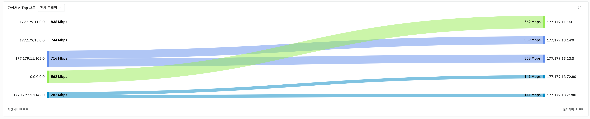

▶ \[그림 \] 가상서버 Top 차트

LB 매핑 목록

가상서버와 각 가상서버에 매핑된 물리서버의 상세 정보를 계층 구조로 표시합니다. 가상서버 좌측의 삼각형 토글 버튼을 클릭하여 매핑된 물리서버 열을 숨기거나 표시할 수 있습니다. 가상서버와 물리서버가 공통적으로 사용하는 구성지표(서버명, IP, 포트)와 성능지표(전체 초당 연결 수, 현재 세션, 전체 세션, 전체 트래픽, 트래픽 RX, 트래픽 TX) 정보 뿐 아니라 가상서버 전용지표(Real 포트), 물리서버 전용지표(TTFB, 응답시간)이 표시됩니다.

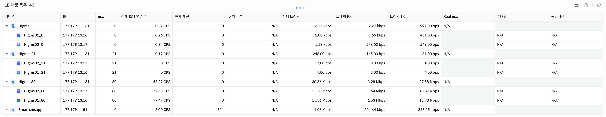

▶ \[그림 \] LB 매핑 목록

<table>
<tbody>
<tr class="odd">
<td>
주의

LB 매핑 목록의 엑셀 다운로드 시, 화면에서 설정한 정렬이나 필터는 적용되지 않으므로 항상 전체 LB 매핑 목록이 다운로드 됩니다. 또한 서버의 종류를 구분하기 위해 서버 타입(Virtual, Physical) 컬럼이 추가로 표시됩니다.
</td>
</tr>
</tbody>
</table>

> LB 매핑 목록

| 서버명        | 개별 서버의 이름을 표시합니다. 이름의 왼쪽 영역에는 서버의 종류에 따라 서로 다른 서버 아이콘이 가용성 정보와 함께 표시됩니다. 가상서버의 경우 매핑된 물리서버 열을 숨기거나 표시할 수 있는 삼각형 모양의 토글 아이콘이 추가로 표시됩니다. |
| ---------- | -------------------------------------------------------------------------------------------------------------------------------------- |
| IP         | 개별 서버의 IP 정보를 표시합니다.                                                                                                                   |
| 포트         | 개별 서버의 포트 정보를 표시합니다.                                                                                                                   |
| 전체 초당 연결 수 | 개별 서버의 전체 초당 연결 수(CPS) 정보를 표시합니다.                                                                                                      |
| 현재 세션      | 개별 서버의 현재 세션 수 정보를 표시합니다.                                                                                                              |
| 전체 세션      | 개별 서버의 전체 세션 수 정보를 표시합니다.                                                                                                              |
| 전체 트래픽     | 개별 서버의 전체 트래픽 정보를 표시합니다.                                                                                                               |
| 트래픽 RX     | 개별 서버의 트래픽 RX 정보를 표시합니다.                                                                                                               |
| 트래픽 TX     | 개별 서버의 트래픽 TX 정보를 표시합니다.                                                                                                               |
| Real 포트    | (가상서버 전용) 가상서버에 매핑된 실제 포트 정보를 표시합니다. 제조사가 제공하는 별도의 Private OID를 사용하여 수집되며 지원하지 않는 장비인 경우 N/A로 표시됩니다.                                   |
| TTFB       | (물리서버 전용) 첫번째 바이트까지의 시간 정보를 표시합니다. 제조사가 제공하는 별도의 Private OID를 사용하여 수집되며 지원하지 않는 장비인 경우 N/A로 표시됩니다.                                     |
| 응답시간       | (물리서버 전용) 물리서버의 응답시간 정보를 표시합니다. 제조사가 제공하는 별도의 Private OID를 사용하여 수집되며 지원하지 않는 장비인 경우 N/A로 표시됩니다.                                        |

<table>
<tbody>
<tr class="odd">
<td>
노트

가상서버의 Real 포트와 물리서버의 TTFB, 응답시간 지표 수집은 제조사마다 제공되는 Private OID를 사용하여 수집하며 제조사의 지원 여부에 따라 해당 지표가 표현되지 않을 수도 있습니다.
</td>
</tr>
</tbody>
</table>

가상서버

가상서버 화면에서는 전체 가상서버의 성능 정보를 상세하게 분석할 수 있습니다. 요약 정보와 트래픽 분석 차트를 통해 가상서버의 전반적인 성능을 모니터링하고 Top 가상서버 목록과 전체 목록을 통해 개별 가상서버의 상세 정보를 비교하고 분석할 수 있습니다.

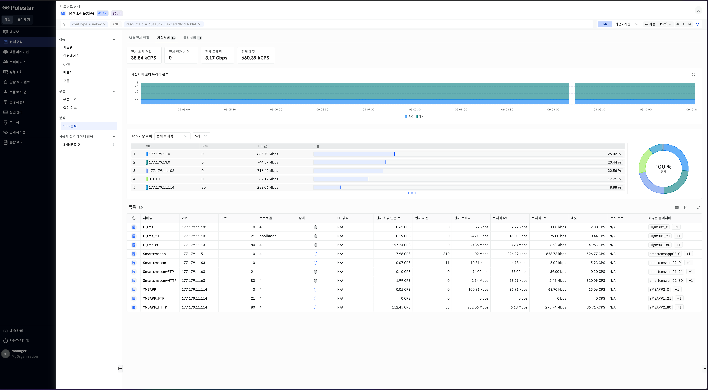

▶ \[그림 \] 가상서버

가상서버 요약 정보

가상서버 화면에서는 네트워크 장비에서 수집된 전체 가상서버의 주요지표를 요약하여 표시합니다. 전체 가상서버의 성능지표(초당 연결 수, 전체 현재 세션 수, 전체 트래픽, 전체 패킷)에 대한 전체 정보를 차례대로 표시합니다.

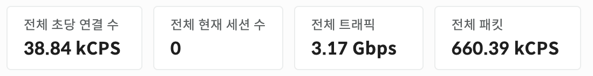

▶ \[그림 \] 가상서버 요약 정보

> 요약 지표

| 전체 초당 연결 수 | 네트워크 장비에서 수집된 모든 가상서버의 초당 연결 수(CPS) 합계를 표시합니다. |
| ---------- | ---------------------------------------------- |
| 전체 현재 세션 수 | 네트워크 장비에서 수집된 모든 가상서버의 현재 활성 세션 수 합계를 표시합니다.   |
| 전체 트래픽     | 네트워크 장비에서 수집된 모든 가상서버의 트래픽 합계를 표시합니다.          |
| 전체 패킷      | 네트워크 장비에서 수집된 모든 가상서버의 패킷 수 합계를 표시합니다.         |

가상서버 전체 트래픽 분석 차트

전체 가상서버의 트래픽 RX, 트래픽 TX 데이터를 Area 차트로 표시합니다. 차트의 조회기간은 타임셀렉터 기준으로 설정되며, 타임셀렉터를 통해 조회기간을 변경할 수 있습니다. 차트의 특정 영역을 드래그하여 해당 시점으로 조회기간을 변경할 수 있습니다.

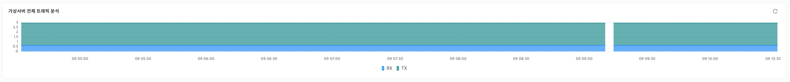

▶ \[그림 \] 가상서버 전체 트래픽 분석 차트

Top 가상서버 목록

전체 가상서버 중 선택된 성능지표의 값이 가장 높은 상위 가상서버를 순위별로 표시합니다. 비율 컬럼은 전체 가상서버의 합산 값에서 개별 가상서버의 값이 차지하는 비율을 의미합니다. 개별 가상서버를 선택하는 경우에는 하단 목록에 선택된 가상서버만 조회되며, 우측의 파이차트에도 해당 가상서버의 영역이 하이라이트 됩니다. 성능지표(전체 트래픽, 전체 초당 연결 수, 전체 현재 세션 수, 전체 패킷)와 목록에 표시할 가상서버의 개수를 변경하여 지표 별 상세 분석이 가능합니다.

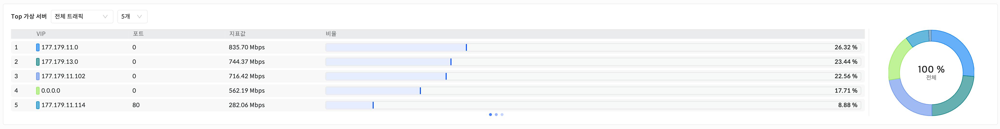

▶ \[그림 \] Top 가상서버 목록

가상서버 목록

네트워크 장비에서 수집된 전체 가상서버의 상세 구성지표 및 성능지표 정보를 목록으로 표시합니다. 서버명을 클릭하면 가상서버 상세 화면으로 이동합니다. 상위의 Top 가상서버에서 가상서버 선택 시 자동으로 목록에서 조회하는 기능이 제공됩니다.

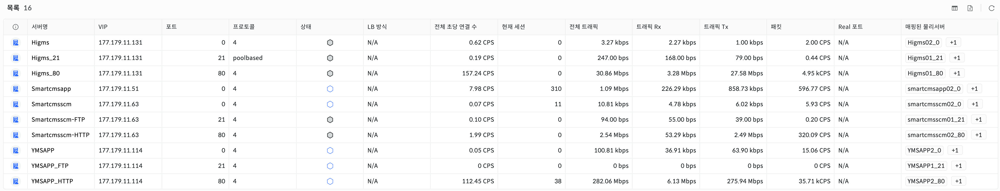

▶ \[그림 \] 가상서버 목록

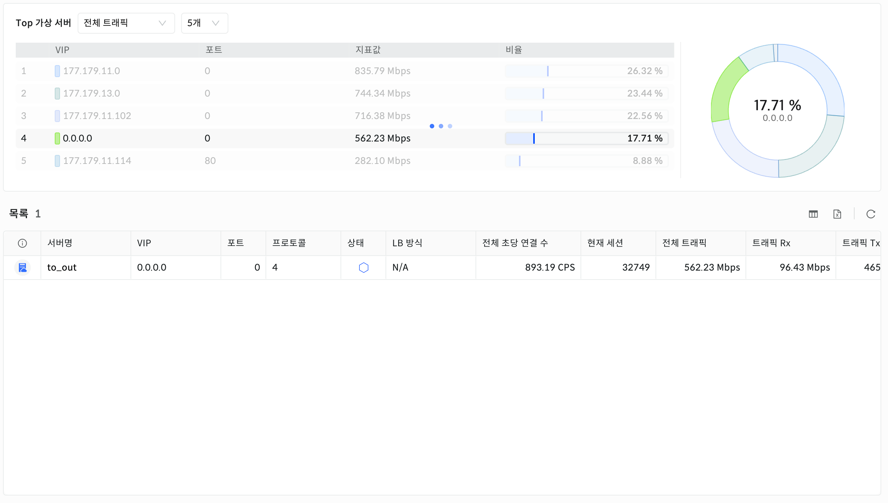

▶ \[그림 \] Top 가상서버를 통해 선택된 가상서버 목록 조회

> 가상서버 목록

| 가용성        | 가상서버의 아이콘과 가용성 정보를 표시합니다.                                                                  |
| ---------- | ------------------------------------------------------------------------------------------ |
| 서버명        | 가상서버의 이름을 표시합니다.                                                                           |
| VIP        | 가상서버의 IP 정보를 표시합니다.                                                                        |
| 포트         | 가상서버의 포트 정보를 표시합니다.                                                                        |
| 프로토콜       | 가상서버가 사용중인 프로토콜 정보를 표시합니다.                                                                 |
| 상태         | 가상서버의 현재 운영 상태 정보를 표시합니다.                                                                  |
| LB 방식      | 가상서버가 사용 중인 로드밸런싱 알고리즘 정보를 표시합니다.                                                          |
| 전체 초당 연결 수 | 가상서버의 초당 연결 수(CPS) 정보를 표시합니다.                                                              |
| 현재 세션      | 가상서버의 현재 세션 정보를 표시합니다.                                                                     |
| 전체 트래픽     | 가상서버의 전체 트래픽 정보를 표시합니다.                                                                    |
| 트래픽 RX     | 가상서버의 트래픽 RX 정보를 표시합니다.                                                                    |
| 트래픽 TX     | 가상서버의 트래픽 TX 정보를 표시합니다.                                                                    |
| 패킷         | 가상서버의 패킷 수 정보를 표시합니다.                                                                      |
| Real 포트    | 가상서버에 매핑된 실제 포트 정보를 표시합니다. 제조사가 제공하는 별도의 Private OID를 사용하여 수집되며 지원하지 않는 장비인 경우 N/A로 표시됩니다. |
| 매핑된 물리서버   | 가상서버에 매핑된 물리서버의 이름을 표시합니다.                                                                 |

<table>
<tbody>
<tr class="odd">
<td>
노트

가상서버의 Real포트 지표 수집은 제조사마다 제공되는 Private OID를 사용하여 수집하며 제조사의 지원 여부에 따라 해당 지표가 표현되지 않을 수도 있습니다.
</td>
</tr>
</tbody>
</table>

가상서버 상세

가상서버 상세 화면에서는 개별 가상서버의 구성 정보와 성능 정보를 상세하게 모니터링하고 분석할 수 있습니다. 상단에는 가상서버의 구성 정보를 카드 형태로 표시하며 그 밑으로 모든 성능 정보를 차트로 표시합니다.

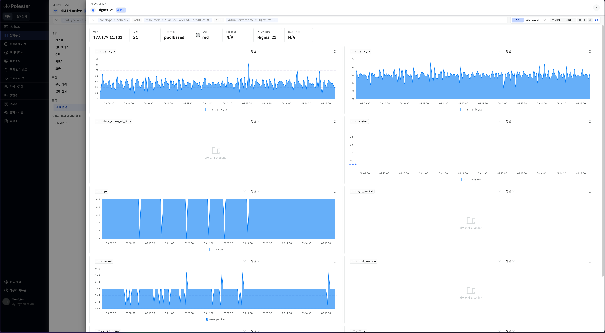

▶ \[그림 \] 가상서버 상세

개별 가상서버 요약 정보

개별 가상서버의 주요 구성지표(VIP, 포트, 프로토콜, 상태, LB 방식, 가상서버명, Real 포트)에 대한 정보를 차례대로 표시합니다.

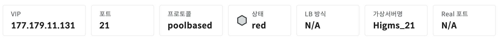

▶ \[그림 \] 개별 가상서버 요약 정보

> 요약 지표

| VIP     | 가상서버의 IP 정보를 표시합니다.                                                                        |
| ------- | ------------------------------------------------------------------------------------------ |
| 포트      | 가상서버의 포트 정보를 표시합니다.                                                                        |
| 프로토콜    | 가상서버가 사용중인 프로토콜 정보를 표시합니다.                                                                 |
| 상태      | 가상서버의 운영 상태 정보를 표시합니다.                                                                     |
| LB 방식   | 가상서버가 사용 중인 로드밸런싱 알고리즘 정보를 표시합니다.                                                          |
| 가상서버명   | 가상서버의 이름 정보를 표시합니다.                                                                        |
| Real 포트 | 가상서버에 매핑된 실제 포트 정보를 표시합니다. 제조사가 제공하는 별도의 Private OID를 사용하여 수집되며 지원하지 않는 장비인 경우 N/A로 표시됩니다. |

개별 가상서버 성능 분석 차트

개별 가상서버의 모든 성능지표 데이터를 차트로 표시합니다.

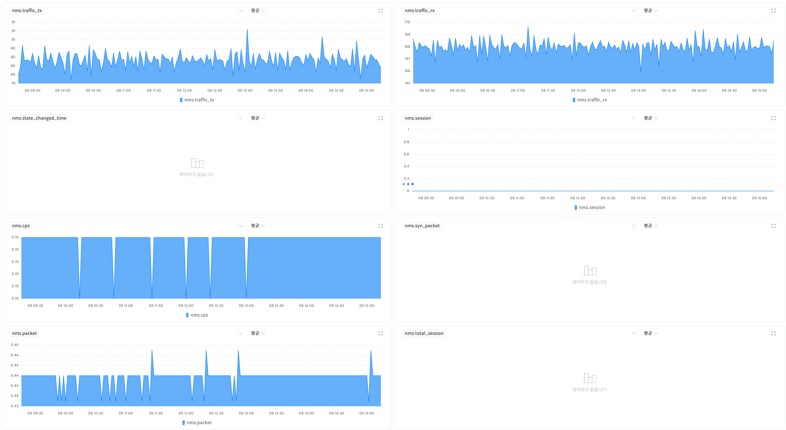

▶ \[그림 \] 개별 가상서버 성능 분석 차트

물리서버

물리서버 화면에서는 전체 물리서버의 성능 정보를 상세하게 분석할 수 있습니다. 요약 정보와 트래픽 분석 차트를 통해 물리서버의 전반적인 성능을 모니터링하고 Top 물리서버 목록과 전체 목록을 통해 개별 물리서버의 상세 정보를 비교하고 분석할 수 있습니다.

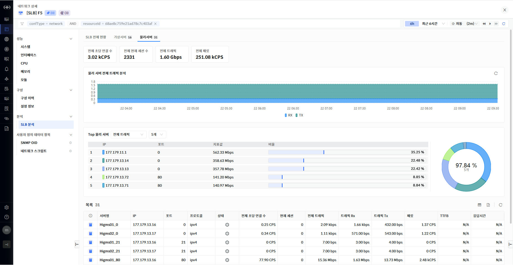

▶ \[그림 \] 물리서버

물리서버 요약 정보

물리서버 화면에서는 네트워크 장비에서 수집된 전체 물리서버의 주요지표를 요약하여 표시합니다. 전체 물리서버의 성능지표(초당 연결 수, 전체 현재 세션 수, 전체 트래픽, 전체 패킷)에 대한 전체 정보를 차례대로 표시합니다. 

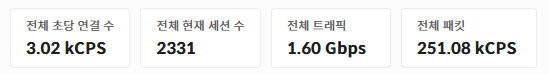

▶ \[그림 \] 물리서버 요약 정보

> 요약 지표

| 전체 초당 연결 수 | 네트워크 장비에서 수집된 모든 물리서버의 초당 연결 수(CPS) 합계를 표시합니다. |
| ---------- | ---------------------------------------------- |
| 전체 현재 세션 수 | 네트워크 장비에서 수집된 모든 물리서버의 현재 활성 세션 수 합계를 표시합니다.   |
| 전체 트래픽     | 네트워크 장비에서 수집된 모든 물리서버의 트래픽 합계를 표시합니다.          |
| 전체 패킷      | 네트워크 장비에서 수집된 모든 물리서버의 패킷 수 합계를 표시합니다.         |

물리서버 전체 트래픽 분석 차트

전체 물리서버의 트래픽 RX, 트래픽 TX 데이터를 Area 차트로 표시합니다. 차트의 조회기간은 타임셀렉터 기준으로 설정되며, 타임셀렉터를 통해 조회기간을 변경할 수 있습니다. 차트의 특정 영역을 드래그하여 해당 시점으로 조회기간을 변경할 수 있습니다.

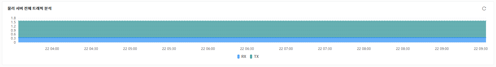

▶ \[그림 \] 물리서버 전체 트래픽 분석 차트

Top 물리서버 목록

전체 물리서버 중 선택된 성능지표의 값이 가장 높은 상위 물리서버를 순위별로 표시합니다. 비율 컬럼은 전체 물리서버의 합산 값에서 개별 물리서버의 값이 차지하는 비율을 의미합니다. 개별 물리서버를 선택하는 경우에는 하단 목록에 선택된 물리서버만 조회되며, 우측의 파이차트에도 해당 물리서버의 영역이 하이라이트 됩니다. 성능지표(전체 트래픽, 전체 초당 연결 수, 전체 현재 세션 수, 전체 패킷)와 목록에 표시할 물리서버의 개수를 변경하여 지표 별 상세 분석이 가능합니다.

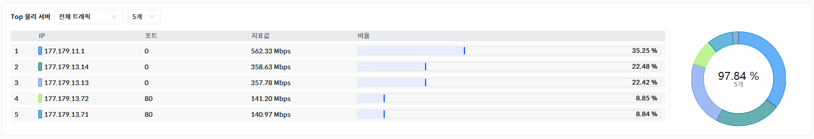

▶ \[그림 \] Top 물리서버 목록

물리서버 목록

네트워크 장비에서 수집된 전체 물리서버의 상세 구성지표 및 성능지표 정보를 목록으로 표시합니다. 서버명을 클릭하면 물리서버 상세 화면으로 이동합니다. 상위의 Top 물리서버에서 물리서버 선택 시 자동으로 목록에서 조회하는 기능이 제공됩니다.

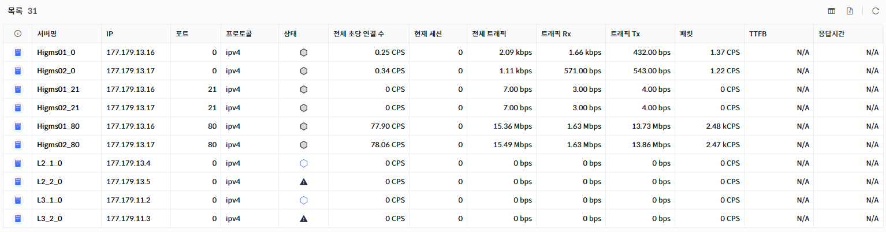

▶ \[그림 \] 물리서버 목록

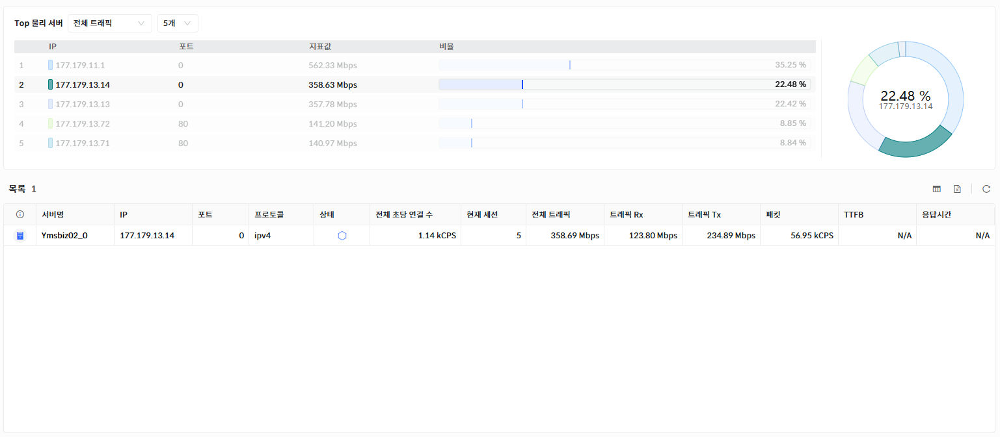

▶ \[그림 \] Top 물리서버를 통해 선택된 물리서버 목록 조회

> 물리서버 목록

| 가용성        | 물리서버의 아이콘과 가용성 정보를 표시합니다.                                                                 |
| ---------- | ----------------------------------------------------------------------------------------- |
| 서버명        | 물리서버의 이름을 표시합니다.                                                                          |
| IP         | 물리서버의 IP 정보를 표시합니다.                                                                       |
| 포트         | 물리서버의 포트 정보를 표시합니다.                                                                       |
| 프로토콜       | 물리서버가 사용중인 프로토콜 정보를 표시합니다.                                                                |
| 상태         | 물리서버의 현재 운영 상태 정보를 표시합니다.                                                                 |
| 전체 초당 연결 수 | 물리서버의 초당 연결 수(CPS) 정보를 표시합니다.                                                             |
| 현재 세션      | 물리서버의 현재 세션 정보를 표시합니다.                                                                    |
| 전체 트래픽     | 물리서버의 전체 트래픽 정보를 표시합니다.                                                                   |
| 트래픽 RX     | 물리서버의 트래픽 RX 정보를 표시합니다.                                                                   |
| 트래픽 TX     | 물리서버의 트래픽 TX 정보를 표시합니다.                                                                   |
| 패킷         | 물리서버의 패킷 수 정보를 표시합니다.                                                                     |
| TTFB       | 첫 번째 바이트까지의 시간 정보를 표시합니다. 제조사가 제공하는 별도의 Private OID를 사용하여 수집되며 지원하지 않는 장비인 경우 N/A로 표시됩니다. |
| 응답시간       | 물리서버의 응답시간 정보를 표시합니다. 제조사가 제공하는 별도의 Private OID를 사용하여 수집되며 지원하지 않는 장비인 경우 N/A로 표시됩니다.     |

<table>
<tbody>
<tr class="odd">
<td>
노트

물리서버의 TTFB, 응답시간 지표 수집은 제조사마다 제공되는 Private OID를 사용하여 수집하며 제조사의 지원 여부에 따라 해당 지표가 표현되지 않을 수도 있습니다.
</td>
</tr>
</tbody>
</table>

물리서버 상세

물리서버 상세 화면에서는 개별 물리서버의 구성 정보와 성능 정보를 상세하게 모니터링하고 분석할 수 있습니다. 상단에는 물리서버의 구성 정보를 카드 형태로 표시하며 그 밑으로 모든 성능 정보를 차트로 표시합니다.

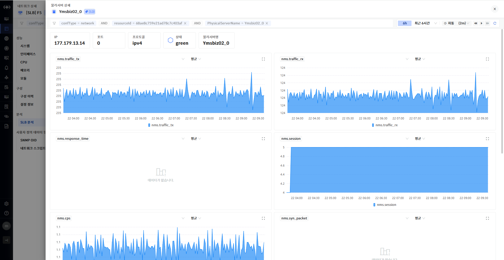

▶ \[그림 \] 물리서버 상세

개별 물리서버 요약 정보

개별 물리서버의 주요 구성지표(IP, 포트, 프로토콜, 상태, 물리서버명)에 대한 정보를 차례대로 표시합니다.

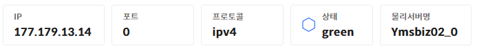

▶ \[그림 \] 개별 물리서버 요약 정보

> 요약 지표

| IP    | 물리서버의 IP 정보를 표시합니다.        |
| ----- | -------------------------- |
| 포트    | 물리서버의 포트 정보를 표시합니다.        |
| 프로토콜  | 물리서버가 사용중인 프로토콜 정보를 표시합니다. |
| 상태    | 물리서버의 운영 상태 정보를 표시합니다.     |
| 물리서버명 | 물리서버의 이름 정보를 표시합니다.        |

개별 물리서버 성능 분석 차트

개별 물리서버의 모든 성능지표 데이터를 차트로 표시합니다.

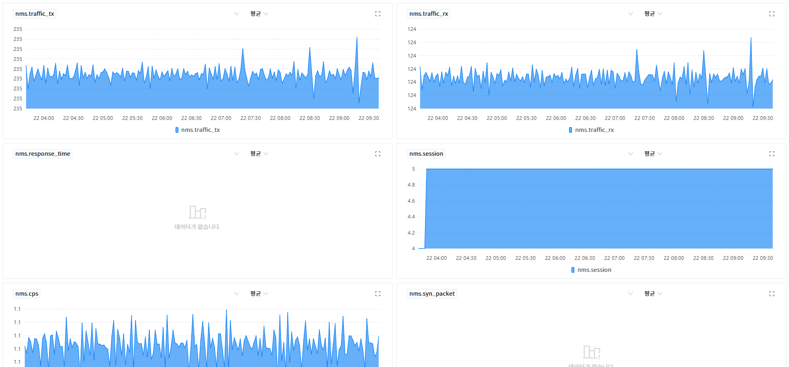

▶ \[그림 \] 개별 물리서버 성능 분석 차트

오퍼레이션

네트워크 장비에 오퍼레이션(Ping, Trace Route, SNMP OID, 네트워크 스크립트)을 실행해볼 수 있는 화면입니다.

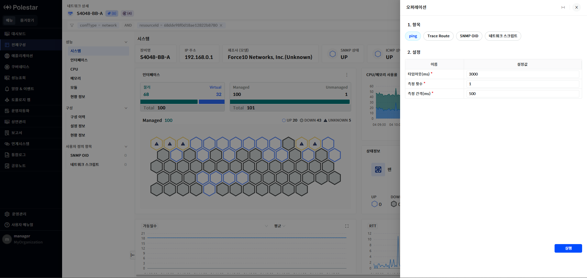

> ▶ \[그림 \] 오퍼레이션

<table>
<tbody>
<tr class="odd">
<td>
노트

네트워크 목록에서 오퍼레이션을 실행하면 다수의 장비에 동일한 오퍼레이션을 실행할 수 있습니다.
</td>
</tr>
</tbody>
</table>

PING

PING 오퍼레이션을 실행합니다.

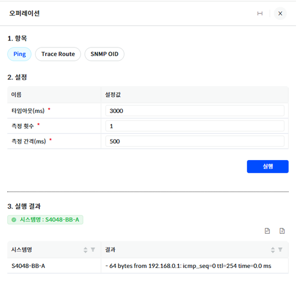

▶ \[그림 \] PING

Trace Route

Trace Route 오퍼레이션을 실행합니다.

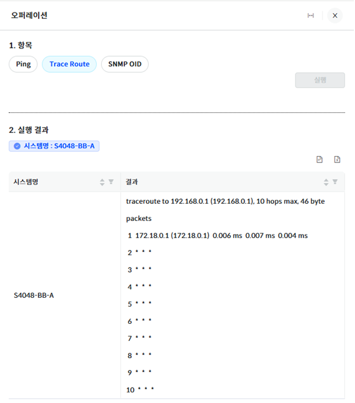

▶ \[그림 \] Trace Route

SNMP OID

SNMP OID 오퍼레이션을 실행합니다.

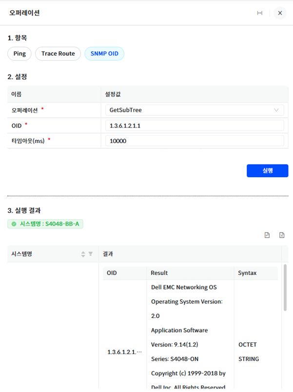

▶ \[그림 \] SNMP OID

네트워크 스크립트

네트워크 스크립트 오퍼레이션을 실행합니다.

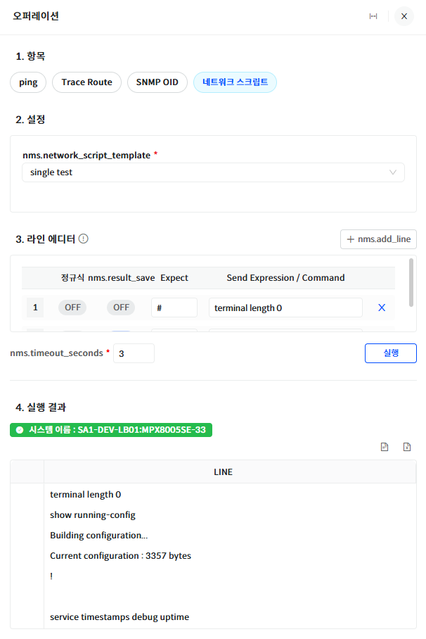

▶ \[그림 \] 네트워크 스크립트

