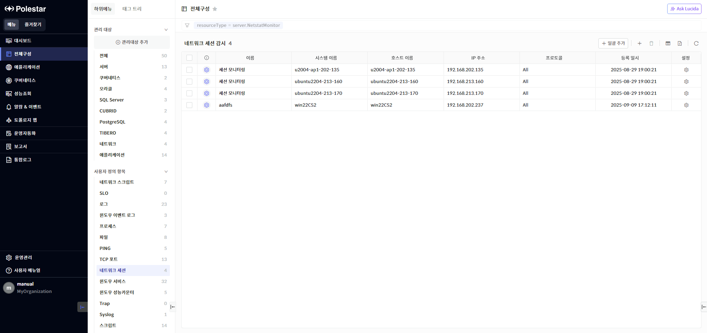
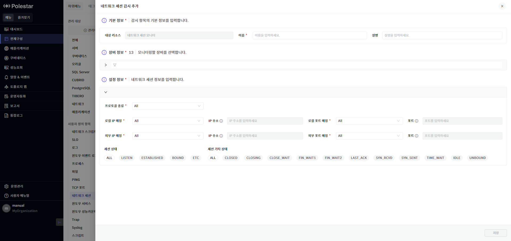
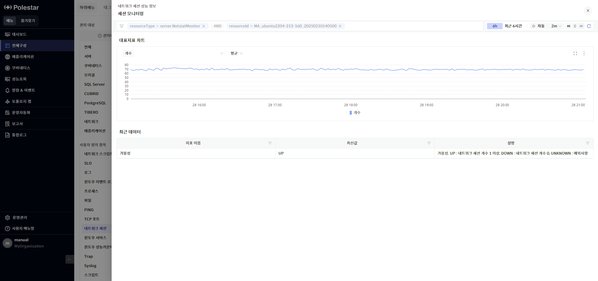
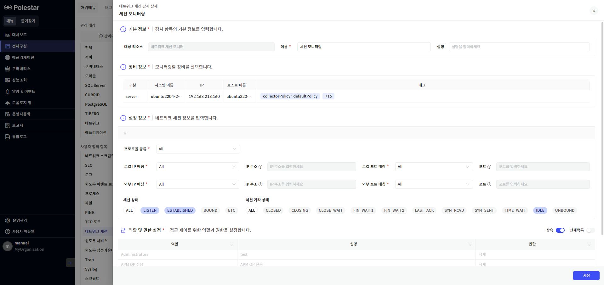
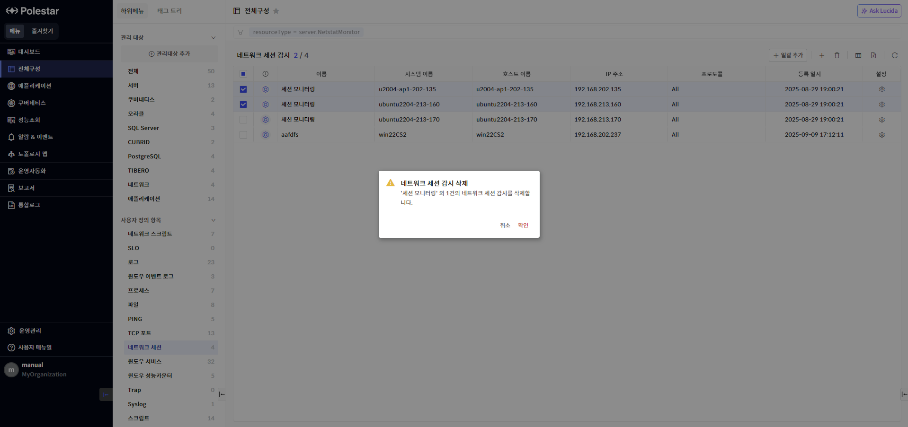
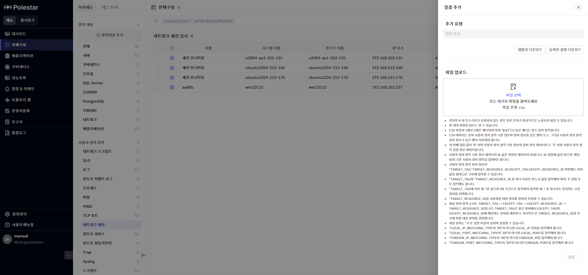
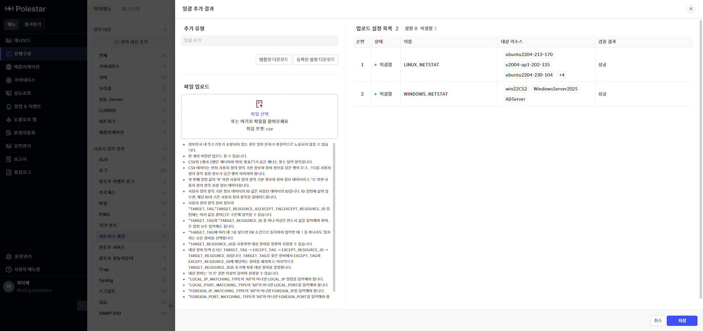

네트워크 세션 감시

특정 네트워크 세션의 상태(가용성, 설정 조건에 맞는 대상 개수)를 감시할 수 있는 기능입니다.

▶ \[그림1\] 네트워크 세션 감시 목록

화면 지표

<table>
<thead>
<tr class="header">
<th>상태</th>
<th>
네트워크 세션 감시 항목의 가용성 상태를 색상으로 표현합니다.

 : 네트워크 세션 개수 1개 이상

 : 네트워크 세션 개수 0개

 : 네트워크 세션 개수 수집 불가
</th>
</tr>
</thead>
<tbody>
<tr class="odd">
<td>이름</td>
<td>네트워크 세션 감시 항목의 이름을 표시합니다.</td>
</tr>
<tr class="even">
<td>시스템 이름</td>
<td>네트워크 세션 감시 항목이 등록된 서버의 시스템 이름을 표시합니다.</td>
</tr>
<tr class="odd">
<td>호스트 이름</td>
<td>네트워크 세션 감시 항목이 등록된 서버의 호스트 이름을 표시합니다.</td>
</tr>
<tr class="even">
<td>IP 주소</td>
<td>네트워크 세션 감시 항목이 등록된 서버의 IP 주소를 표시합니다.</td>
</tr>
<tr class="odd">
<td>프로토콜</td>
<td>네트워크 세션 감시 항목의 프로토콜 설정 정보를 표시합니다.</td>
</tr>
<tr class="even">
<td>등록 일시</td>
<td>네트워크 세션 감시 항목이 등록된 일시를 표시합니다.</td>
</tr>
<tr class="odd">
<td>설정</td>
<td>네트워크 세션 감시 설정을 변경할 수 있는 네트워크 세션 상세 화면을 호출합니다.</td>
</tr>
</tbody>
</table>

네트워크 세션 감시 추가

모니터링할 네트워크 세션 정보를 설정합니다. 모든 필수 항목을 입력해야 \[저장\] 버튼이 활성화됩니다.

<table>
<tbody>
<tr class="odd">
<td>
노트

사용자가 ‘쓰기’ 이상의 권한을 가지고 있는 서버에만 네트워크 세션 감시를 등록할 수 있습니다.

네트워크 세션 감시 추가 시, 서버 장비에 설정된 권한이 자동으로 적용됩니다. 네트워크 세션 감시 수정 기능을 통해 권한 정보를 변경할 수 있습니다.
</td>
</tr>
</tbody>
</table>

▶ \[그림2\] 네트워크 세션 감시 추가

기본 정보

| 대상 리소스 | 감시 항목의 타입을 표시합니다. ‘네트워크 세션 모니터’ 타입이 자동으로 설정되어 있습니다. |
| ------ | --------------------------------------------------- |
| 이름     | 네트워크 세션 감시 항목의 이름을 입력합니다.                           |
| 설명     | 네트워크 세션 감시 항목의 설명을 입력합니다.                           |

장비 정보

네트워크 세션 감시 항목을 등록할 장비를 1대 이상 선택합니다. 장비 목록에는 사용자가 ‘쓰기’ 이상의 권한을 가지고 있는 서버만 표시되며, 태그 필터를 사용해 원하는 대상 장비를 상세 검색할 수 있습니다.

설정 정보

<table>
<thead>
<tr class="header">
<th>프로토콜 종류</th>
<th>
프로토콜 종류를 선택합니다.

(All, TCP, TCP4, TCP6, UDP, UDP4, UDP6)
</th>
</tr>
</thead>
<tbody>
<tr class="odd">
<td>로컬 IP 매칭</td>
<td>
감시할 로컬 IP 주소의 매칭 옵션을 선택합니다.

<ul>
<li>
All: 모든 IP 주소 감시 (IP 주소 설정 필요 없음)
</li>
<li>
Exclude: 설정한 IP 주소 감시 제외
</li>
<li>
Include: 설정한 IP 주소 감시
</li>
</ul></td>
</tr>
<tr class="even">
<td>(로컬) IP 주소</td>
<td>로컬 IP 주소를 입력합니다. -,*를 이용하여 IP 범위를 설정할 수 있습니다. (예: 192.168.10-1,192.168.20.*)</td>
</tr>
<tr class="odd">
<td>로컬 포트 매칭</td>
<td>
감시할 로컬 포트의 매칭 옵션을 선택합니다.

<ul>
<li>
All: 모든 포트 감시 (포트 설정 필요 없음)
</li>
<li>
Exclude: 설정한 포트 감시 제외
</li>
<li>
Include: 설정한 포트 감시
</li>
</ul></td>
</tr>
<tr class="even">
<td>(로컬) 포트</td>
<td>로컬 포트 번호를 입력합니다. 구분자(,)를 이용하여 다수의 포트 번호를 입력할 수 있습니다. (예: 1521,1523)</td>
</tr>
<tr class="odd">
<td>외부 IP 매칭</td>
<td>
감시할 외부 IP 주소의 매칭 옵션을 선택합니다.

<ul>
<li>
All: 모든 IP 주소 감시 (IP 주소 설정 필요 없음)
</li>
<li>
Exclude: 설정한 IP 주소 감시 제외
</li>
<li>
Include: 설정한 IP 주소 감시
</li>
</ul></td>
</tr>
<tr class="even">
<td>(외부) IP 주소</td>
<td>
외부 IP 주소를 입력합니다. -,*를 이용하여 IP 범위를 설정할 수 있습니다.

(예: 192.168.10-1,192.168.20.*)
</td>
</tr>
<tr class="odd">
<td>외부 포트 매칭</td>
<td>
감시할 외부 포트의 매칭 옵션을 선택합니다.

<ul>
<li>
All: 모든 포트 감시 (포트 설정 필요 없음)
</li>
<li>
Exclude: 설정한 포트 감시 제외
</li>
<li>
Include: 설정한 포트 감시
</li>
</ul></td>
</tr>
<tr class="even">
<td>(외부) 포트</td>
<td>외부 포트 번호를 입력합니다. 구분자(,)를 이용하여 다수의 포트 번호를 입력할 수 있습니다. (예: 1521,1523)</td>
</tr>
<tr class="odd">
<td>세션 상태</td>
<td>
감시할 네트워크 상태를 선택합니다.

‘ALL’을 선택하면 모든 세션 상태를 감시합니다.
</td>
</tr>
<tr class="even">
<td>세션 기타 상태</td>
<td>
감시할 기타 네트워크 상태를 선택합니다.

‘ALL’을 선택하면 모든 세션 기타 상태를 감시합니다.
</td>
</tr>
</tbody>
</table>

<table>
<tbody>
<tr class="odd">
<td>
노트

로컬 IP 주소, 외부 IP 주소는 범위 입력이 가능합니다.

예) 단일 입력: 192.168.0.1

예) 여러 조건 입력(,): 192.168.0.1,192.168.10.1-10,192.168.20.*

예) 범위 입력(-): 192.168.0.1-10 192.168.10-20.*

예) 전체 입력(*): 192.168.0.* 192.168.*.*
</td>
</tr>
</tbody>
</table>

네트워크 세션 감시 추가 절차

1.  네트워크 세션 감시 목록 우측 상단의 \[추가\] 버튼 클릭

2.  기본 정보, 장비 정보, 설정 정보를 입력하고 \[저장\] 버튼 클릭

네트워크 세션 성능 정보 조회

네트워크 세션 감시 목록에서 ‘이름’ 필드를 클릭하여 등록한 네트워크 세션 감시의 성능 정보를 조회합니다. 네트워크 세션 감시 설정 정보에 해당하는 네트워크 세션 개수를 확인할 수 있습니다.

▶ \[그림3\] 네트워크 세션 성능 정보

네트워크 세션 감시 수정

네트워크 세션 감시 목록에서 ‘설정’ 필드를 클릭하여 등록한 네트워크 세션 감시의 설정 정보와 역할 및 권한 설정을 수정할 수 있습니다. 네트워크 세션 감시의 기본 권한은 서버 장비의 권한을 따르므로 ‘상속’ 옵션이 활성화되어 있습니다. ‘상속’ 옵션을 비활성화하면 네트워크 세션 감시에만 적용되는 전용 권한을 설정할 수 있습니다. 모든 필수 항목을 입력해야 \[저장\] 버튼이 활성화됩니다.

<table>
<tbody>
<tr class="odd">
<td>
노트

사용자가 ‘쓰기’ 이상의 권한을 가지고 있는 네트워크 세션 감시만 수정할 수 있습니다.
</td>
</tr>
</tbody>
</table>

▶ \[그림4\] 네트워크 세션 상세

네트워크 세션 감시 수정 절차

1.  네트워크 세션 감시 목록에서 수정할 항목의 ‘설정’ 필드 클릭

2.  기본 정보, 설정 정보, 역할 및 권한 설정 중 수정할 항목을 변경하고 \[저장\] 버튼 클릭

네트워크 세션 감시 삭제

네트워크 세션 감시 목록에서 특정 네트워크 세션 항목을 삭제할 수 있습니다.

<table>
<tbody>
<tr class="odd">
<td>
노트

네트워크 세션 감시의 역할 및 권한 상속 여부에 따라 네트워크 세션 감시를 삭제할 수 있는 최소 권한이 달라집니다. 역할 및 권한 상속 여부는 네트워크 세션 상세 화면에서 확인할 수 있습니다.

<ul>
<li>
상속 ON: ‘쓰기’ 이상의 권한 필요
</li>
<li>
상속 OFF: ‘삭제’ 권한 필요
</li>
</ul></td>
</tr>
</tbody>
</table>

▶ \[그림5\] 네트워크 세션 감시 삭제

네트워크 세션 감시 삭제 절차

1.  네트워크 세션 감시 목록에서 삭제할 네트워크 세션 선택 (다수 선택 가능)

2.  네트워크 세션 감시 목록 우측 상단의 \[삭제\] 버튼 클릭

네트워크 세션 감시 일괄 추가

네트워크 세션 감시 설정 정보를 CSV 형식으로 입력하여 다수의 네트워크 세션 감시를 일괄 등록할 수 있습니다.

\[등록된 설정 다운로드\]를 통해 등록되어 있는 네트워크 세션 감시 설정 정보를 CSV 파일로 다운로드하고, 이 CSV 파일을 활용하여 기존 네트워크 세션 감시 설정을 일괄 업데이트 할 수 있습니다.

네트워크 세션 감시 설정 정보를 저장한 CSV 파일을 업로드하고 \[검증\] 버튼을 클릭하면 CSV 파일 데이터의 유효성을 검사하여 등록 진행 가능 여부를 판별합니다. 하나라도 잘못된 설정이 포함되어 있는 경우 일괄 등록을 진행할 수 없습니다. 이 경우, ‘검증 결과’ 필드를 참고하여 설정 오류를 수정하고 다시 검증을 진행하시기 바랍니다.

<table>
<tbody>
<tr class="odd">
<td>
노트

CSV 파일에서 일괄 추가 대상 장비를 태그로 설정한 경우, 사용자의 장비 권한에 따라 네트워크 세션 감시가 적용되는 장비가 달라질 수 있습니다.

<ul>
<li>
등록: 사용자가 ‘쓰기’ 이상의 권한을 가지고 있는 서버
</li>
<li>
수정: 사용자가 ‘쓰기’ 이상의 권한을 가지고 있는 네트워크 세션 감시
</li>
</ul></td>
</tr>
</tbody>
</table>

▶ \[그림6\] 네트워크 세션 감시 일괄 추가

▶ \[그림7\] 네트워크 세션 감시 일괄 추가 – 검증 및 업로드 설정 목록

네트워크 세션 감시 일괄 추가 절차

1.  네트워크 세션 감시 목록 우측 상단의 \[일괄 추가\] 버튼 클릭

2.  \[등록된 설정 다운로드\] 버튼 클릭

3.  다운로드 받은 CSV 파일을 열고, 기존 등록되어 있는 네트워크 세션 감시 설정을 참고해서 신규 네트워크 세션 감시 설정 추가

4.  CSV 파일에 있던 기존 네트워크 세션 감시 설정 삭제

5.  일괄 추가 드로어에서 CSV 파일 업로드하고 \[검증\] 버튼 클릭

6.  ‘업로드 설정 목록’에서 결함 유무 확인하고, 결함이 없는 경우 \[저장\] 버튼 클릭

