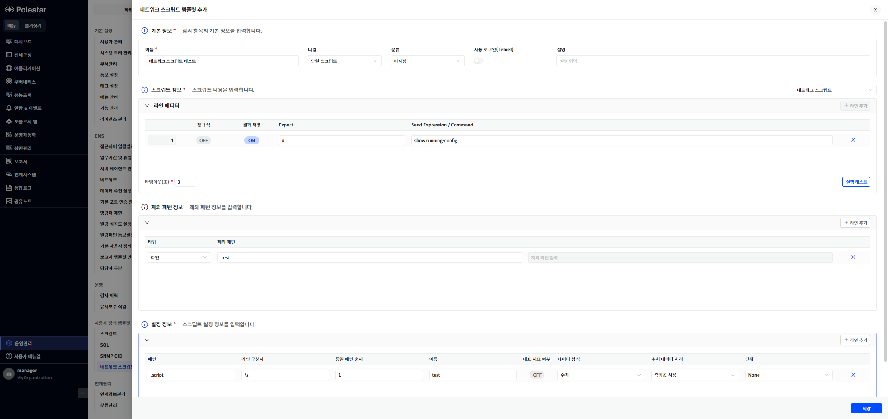
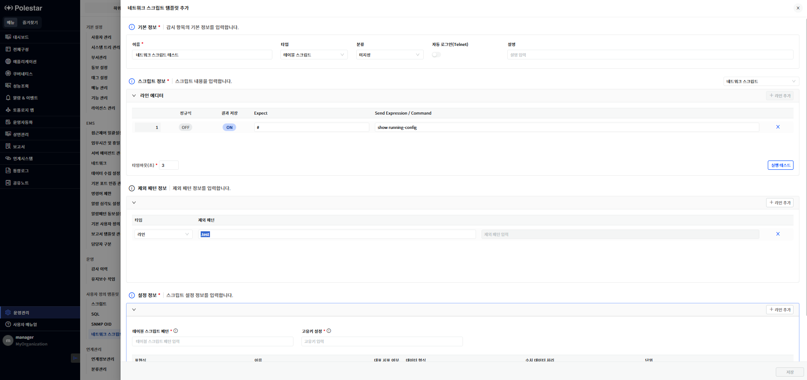
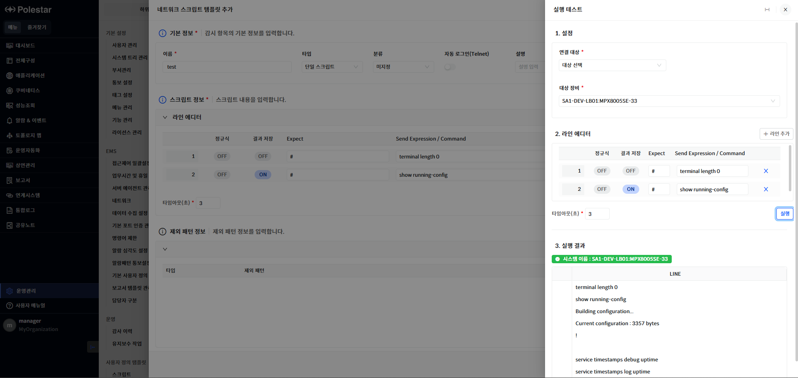
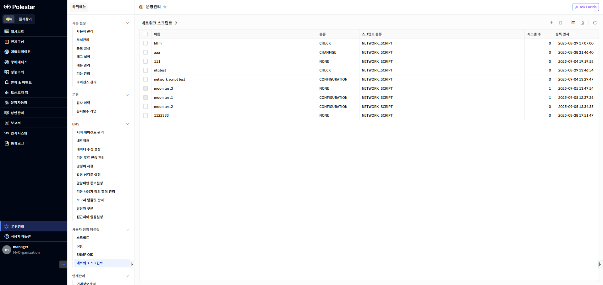
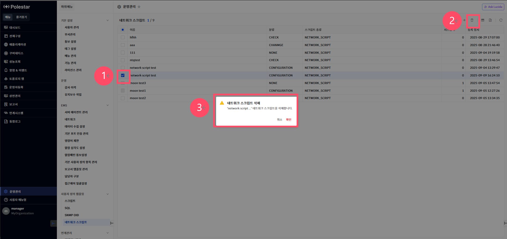
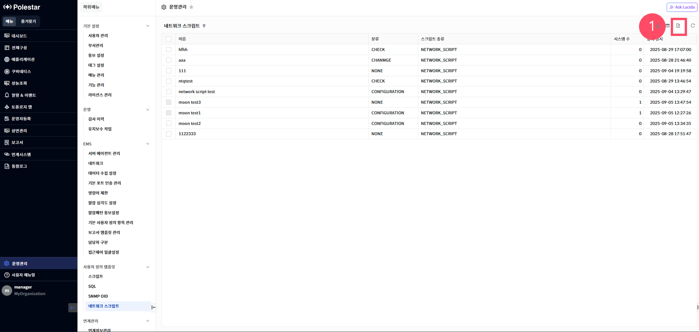

네트워크 스크립트 템플릿

사용자 정의 네트워크 스크립트를 사용하려면 먼저 네트워크 스크립트 템플릿을 정의해야 합니다.

<table>
<tbody>
<tr class="odd">
<td>
노트

이미 정의된 네트워크 스크립트 템플릿이 존재하는 경우에만 사용자 정의 네트워크 스크립트를 네트워크 장비에 추가할 수 있습니다. 
타입별로 템플릿의 등록방식이 다릅니다.

<strong>단일 스크립트</strong> : 하나의 리소스를 만들고 스크립트 결과에 대해서 지표화할 수 있습니다.

<strong>테이블 스크립트</strong> : 테이블형태의 하위 리소스를 생성합니다. 스크립트 결과에 대해서 입력한 테이블 스크립트 패턴을 기반으로 지표를 정의할 수 있으며 각각의 지표는 하위 리소스에서 지표화할 수 있습니다.
</td>
</tr>
</tbody>
</table>

> ▶ \[그림1\] 네트워크 스크립트 템플릿 등록(단일)

> ▶ \[그림2\] 네트워크 스크립트 템플릿 등록(테이블)
> 
> 기본정보

| 이름            | 네트워크 스크립트 템플릿의 이름을 입력합니다.                          |
| ------------- | -------------------------------------------------- |
| 타입            | 네트워크 스크립트 템플릿의 타입을 선택합니다. (단일 스크립트, 테이블 스크립트)      |
| 분류            | 네트워크 스크립트 템플릿의 분류를 설정합니다.(미지정, 구성, 성능, 변경, 동작, 점검) |
| 자동로그인(Telnet) | 자동으로 Telnet 으로 연결여부를 설정합니다.                        |
| 설명            | 네트워크 스크립트 템플릿의 설명을 입력합니다.                          |

> 스크립트 정보

| 정규식                     | 명령어에 대한 정규식 여부를 설정합니다. |
| ----------------------- | ---------------------- |
| 결과저장                    | 결과에 대한 저장여부를 설정합니다.    |
| Expect                  | 명령에 대한 Expect 를 입력합니다. |
| Send Expression/Command | 수행할 명령어를 입력합니다.        |

> 제외패턴 정보

<table>
<thead>
<tr class="header">
<th>타입</th>
<th>결과에서 제외할 부분을 범위 또는 라인으로 지정합니다.</th>
</tr>
</thead>
<tbody>
<tr class="odd">
<td>제외패턴</td>
<td>범위 : START, END 패턴을 입력합니다. 
라인 : 패턴을 입력합니다.</td>
</tr>
</tbody>
</table>

> 네트워크 스크립트 단일 설정정보

| 패턴       | 추출하고자 하는 라인에 대해서 패턴을 입력합니다.(패턴, 라인구분자, 동일패턴순서를 입력하지 않을 경우 전체 저장합니다.) |
| -------- | -------------------------------------------------------------------- |
| 라인 구분자   | 패턴에서 추출한 라인에서 구분자를 입력합니다.                                            |
| 동일패턴순서   | 라인에서 구분자로 구분하고 나온 순서에서 몇 번째를 지표로 지정할지를 설정합니다.                        |
| 이름       | 지표명을 입력합니다.                                                          |
| 데이터형식    | 데이터 형식을 선택합니다. (수치, 문자)                                              |
| 대표지표여부   | 성능정보 차트에 표시할 지표를 선택합니다. (최대4개)                                       |
| 수치데이터 처리 | 수집한 수치 데이터 처리 방식을 선택합니다. (측정값사용, 상향변화량, 하향변화량)                       |
| 단위       | 지표의 단위를 선택합니다.                                                       |

> 네트워크 스크립트 테이블 설정정보

| 테이블 스크립트 패턴 | 스크립트 결과에서 리소스화 하고자 하는 문구에 대해서 패턴을 입력합니다. 표현식을 통해서 지표화 하고자 하는 문구도 함께 입력합니다. (ex) {1}, {name}, {resourceName} |
| ----------- | ----------------------------------------------------------------------------------------------------------- |
| 고유키 설정      | 테이블 스크립트 패턴에 입력한 표현식으로 고유키를 설정합니다.                                                                          |
| 표현식         | 테이블 스크립트 패턴에 입력한 표현식을 입력합니다.                                                                                |
| 이름          | 지표명을 입력합니다.                                                                                                 |
| 데이터형식       | 데이터 형식을 선택합니다. (수치, 문자)                                                                                     |
| 대표지표여부      | 성능정보 차트에 표시할 지표를 선택합니다. (최대4개)                                                                              |
| 수치데이터 처리    | 수집한 수치 데이터 처리 방식을 선택합니다. (측정값사용, 상향변화량, 하향변화량)                                                              |
| 단위          | 지표의 단위를 선택합니다.                                                                                              |

실행 테스트

\[실행 테스트\] 버튼을 클릭하면 실행 테스트 드로어가 나타납니다. 테스트를 통해 설정한 네트워크 스크립트가 실제 등록되어 있는 네트워크 장비에서 정상적으로 동작하는지 확인할 수 있습니다.

▶ \[그림3\] 네트워크 스크립트 실행 테스트

| 대상장비                    | 명령어를 수행할 장비를 선택합니다.    |
| ----------------------- | ---------------------- |
| 정규식                     | 명령어에 대한 정규식 여부를 설정합니다. |
| Expect                  | 명령에 대한 Expect 를 입력합니다. |
| Send Expression/Command | 수행할 명령어를 입력합니다.        |

네트워크 스크립트 템플릿 목록

운영관리 \> 사용자 정의 템플릿에서 \[네트워크 스크립트\]를 선택하면 전체 네트워크 스크립트 템플릿 목록을 확인할 수 있습니다. 네트워크 스크립트 템플릿 목록을 통해 현재 등록되어 있는 네트워크 스크립트 템플릿 기본 정보를 확인할 수 있으며 해당 화면에서 네트워크 스크립트 템플릿을 삭제할 수 있습니다.

<table>
<tbody>
<tr class="odd">
<td>
노트

사용자 정의 네트워크 스크립트를 배포하기 위하여 템플릿을 작성하는 기능입니다. 작성된 템플릿을 기반으로 장비에서 등록하여 네트워크 스크립트를 수집합니다.
</td>
</tr>
</tbody>
</table>

> ▶ \[그림4\] 네트워크 스크립트 템플릿 목록
> 
> 제외패턴 정보

| 이름      | 네트워크 스크립트 템플릿의 이름을 표시합니다.         |
| ------- | --------------------------------- |
| 분류      | 네트워크 스크립트 템플릿의 분류를 표시합니다.         |
| 스크립트 종류 | 네트워크 스크립트의 종류를 표시합니다.             |
| 시스템 수   | 네트워크 스크립트 템플릿을 등록한 시스템의 수를 표시합니다. |
| 등록일시    | 네트워크 스크립트 템플릿이 등록된 날짜를 표시합니다.     |

네트워크 스크립트 템플릿 삭제

삭제할 네트워크 스크립트 템플릿을 선택하고 \[삭제\] 버튼을 선택하여 네트워크 스크립트 템플릿을 삭제할 수 있습니다.

▶ \[그림5\] 네트워크 스크립트 템플릿 삭제

> 네트워크 스크립트 템플릿 삭제 절차

1.  삭제하고자 하는 네트워크 스크립트 템플릿 선택 (다중 선택 가능)

2.  테이블 우측 상단의 삭제 아이콘 클릭

3.  메시지창에서 확인 클릭

엑셀 저장

네트워크 스크립트 템플릿 목록의 우측 상단 \[엑셀 저장\] 버튼을 통해 네트워크 스크립트 템플릿 목록을 엑셀로 저장할 수 있습니다. 그리드 컬럼 검색 기능 등을 통해 엑셀에 보여줄 컬럼과 내용을 원하는 조건에 맞게 필터링하여 저장할 수 있습니다.

▶ \[그림6\] 네트워크 스크립트 템플릿 목록 엑셀 저장

> 네트워크 스크립트 템플릿 목록 엑셀 저장 및 조회 절차

1.  네트워크 스크립트 템플릿 목록에서 우측 상단 엑셀 저장 아이콘 클릭

2.  브라우저 우측 상단 창에 저장된 엑셀 파일명이 표시됨

3.  해당 파일명을 클릭하여 엑셀 파일 확인

