네트워크 자동맵

전체구성에서 \[맵\]을 선택하여 네트워크 자동맵에서 네트워크 데이터의 흐름을 확인할 수 있습니다. 네트워크 자동맵은 최근 5분 동안 에이전트에서 수집한 데이터를 자동으로 시각화하여 노드와 링크로 표시합니다.

<table>
<tbody>
<tr class="odd">
<td>
노트

네트워크 자동맵에서 표시되는 노드는 [전체구성] 메뉴의 [관리 대상 추가]에서 [관리 대상 등록]을 통해 등록되어야 합니다.

네트워크 자동맵은 Administrators 역할을 가진 계정에게 제공되는 기능이며, 장비 권한 설정에 영향을 받지 않습니다. 장비 권한과 관계없이 노드로 표시할 수 있습니다.

네트워크 자동맵은 커널 버전이 Red Hat Linux 4.18.0-80 이상이고, /sys/kernel/btf 경로에 vmlinux 파일이 있는 경우 지원합니다. (타 OS는 네트워크 자동맵에 표시되지 않습니다.)
</td>
</tr>
</tbody>
</table>

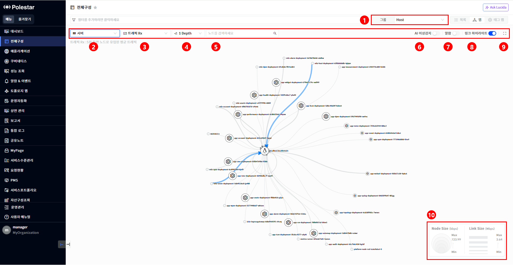

▶ \[그림 \] 네트워크 자동맵

레이아웃

<table>
<thead>
<tr class="header">
<th>1. 그룹</th>
<th>
네트워크 자동맵 노드를 표시하는 기준을 선택합니다.

<ul>
<li>
Host : 네트워크 자동맵 표시 기본 설정. 장비 이름 기준으로 노드 표시.
</li>
<li>
Service Group : ‘serviceGroup’ 태그가 동일한 노드를 같은 그룹으로 분류하여 표시.
</li>
</ul></th>
</tr>
</thead>
<tbody>
<tr class="odd">
<td>2. 도메인</td>
<td>도메인을 선택합니다. (서버, 네트워크)</td>
</tr>
<tr class="even">
<td>3. 지표</td>
<td>네트워크 자동맵에 나타낼 지표를 선택합니다.</td>
</tr>
<tr class="odd">
<td>4. 연결 표시</td>
<td>최대 크기 등급에 해당하는 노드를 기준으로 네트워크 자동맵에 표시할 노드 depth를 설정합니다.</td>
</tr>
<tr class="even">
<td>5. 노드 검색</td>
<td>네트워크 자동맵 화면에 표시된 노드를 검색합니다.</td>
</tr>
<tr class="odd">
<td>6. AI 이상감지</td>
<td>
네트워크 자동맵 노드 중 성능 이상감지 분석을 지원하는 노드를 표시합니다.

(Enterprise 라이선스 전용 기능입니다.)
</td>
</tr>
<tr class="even">
<td>7. 알람</td>
<td>노드에 현재 발생한 알람의 표시 여부를 설정합니다.</td>
</tr>
<tr class="odd">
<td>8. 링크 하이라이트</td>
<td>최대 크기 등급에 해당하는 링크를 강조합니다.</td>
</tr>
<tr class="even">
<td>9. 화면 맞춤</td>
<td>네트워크 자동맵을 화면에 맞춘 크기로 표시합니다.</td>
</tr>
<tr class="odd">
<td>10. 범례</td>
<td>네트워크 자동맵에 표시된 노드와 링크의 크기 정보를 표시합니다.</td>
</tr>
</tbody>
</table>

화면 액션

네트워크 자동맵은 마우스 액션을 통해 화면을 조정할 수 있습니다.

마우스 액션

<table>
<thead>
<tr class="header">
<th>1. 마우스 휠</th>
<th>
네트워크 자동맵 화면을 확대/축소합니다.

(Ctrl키 + 마우스 휠 조합으로도 화면을 확대/축소할 수 있습니다.)
</th>
</tr>
</thead>
<tbody>
<tr class="odd">
<td>2. 드래그 앤 드롭</td>
<td>네트워크 자동맵 화면을 끌어서 원하는 위치로 이동합니다.</td>
</tr>
</tbody>
</table>

그룹

네트워크 자동맵 노드를 표시하는 기준을 선택할 수 있습니다. 그룹에 따라 네트워크 자동맵의 노드 구성과 레이아웃이 달라집니다. 기본 설정은 ‘Host’입니다.

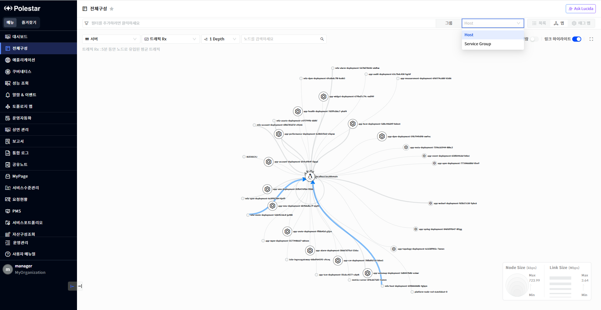

▶ \[그림 \] 그룹

화면 지표

| 1\. Host          | 장비 이름 기준으로 노드를 표시합니다. (네트워크 자동맵 표시 기본 설정)          |
| ----------------- | -------------------------------------------------- |
| 2\. Service Group | 동일한 ‘serviceGroup’ 태그를 가진 장비들을 노드 그룹으로 분류하여 표시합니다. |

도메인

네트워크 자동맵에 나타낼 지표를 선택합니다. 선택한 지표에 따라 노드와 링크의 크기가 달라집니다.

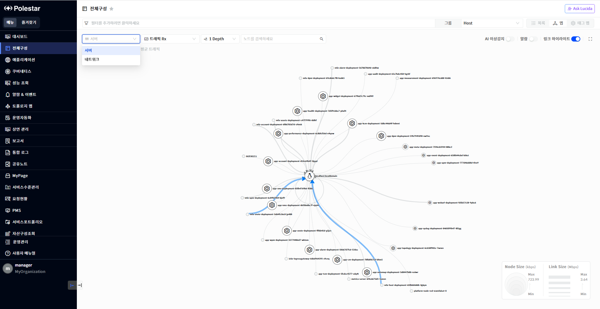

▶ \[그림 \] 도메인

화면 지표

<table>
<tbody>
<tr class="odd">
<td>1. 도메인</td>
<td>
도메인 정보를 선택합니다.

도메인 종류 : 서버, 네트워크
</td>
</tr>
</tbody>
</table>

지표

네트워크 자동맵에 나타낼 지표를 선택합니다. 선택한 지표에 따라 노드와 링크의 크기가 달라집니다.

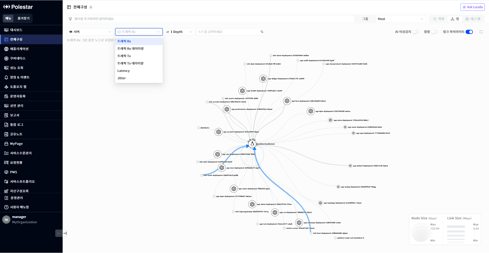

▶ \[그림 \] 지표

화면 지표

<table>
<thead>
<tr class="header">
<th>1. 트래픽 Rx</th>
<th>
5분 동안 노드로 유입된 평균 트래픽을 표시합니다.

단위 : kbps
</th>
</tr>
</thead>
<tbody>
<tr class="odd">
<td>2. 트래픽 Rx 데이터량</td>
<td>
5분 동안 노드로 유입된 트래픽 크기를 표시합니다.

단위 : kb
</td>
</tr>
<tr class="even">
<td>3. 트래픽 Tx</td>
<td>
5분 동안 노드에서 발생한 평균 트래픽을 표시합니다.

단위 : kbps
</td>
</tr>
<tr class="odd">
<td>4. 트래픽 Tx 데이터량</td>
<td>
5분 동안 노드에서 발생한 트래픽 크기를 표시합니다.

단위 : kb
</td>
</tr>
<tr class="even">
<td>5. Latency</td>
<td>
노드에 연결된 세션의 응답 시간을 표시합니다.

단위 : ms
</td>
</tr>
<tr class="odd">
<td>6. Jitter</td>
<td>
노드 Latency의 차이를 표시합니다. 최대 500건의 latency 데이터를 기반으로 Jitter 값을 산출합니다.

계산 방식 :

((Latency 500 - Latency 499) + ... + (Latency 500 – Latency 1)) / 500

단위 : ms
</td>
</tr>
</tbody>
</table>

연결 표시

최대 크기 등급에 해당하는 노드를 기준으로 네트워크 자동맵에 표시할 노드 depth를 설정합니다. Depth는 노드와 노드 사이의 연결을 의미하며, depth 계산의 시작점은 최대 크기 등급의 노드입니다. 최대 크기 등급의 노드와 연결된 노드는 1 depth에 해당하며, 1 depth 노드에 연결된 노드는 2 depth가 됩니다. 최대 크기 등급의 노드와 연결이 멀어질수록 depth가 증가합니다. 단, 최대 크기 등급의 노드간의 연결은 depth 계산을 하지 않습니다 (=0 depth). 연결 표시의 기본 설정은 1 depth 표시입니다.

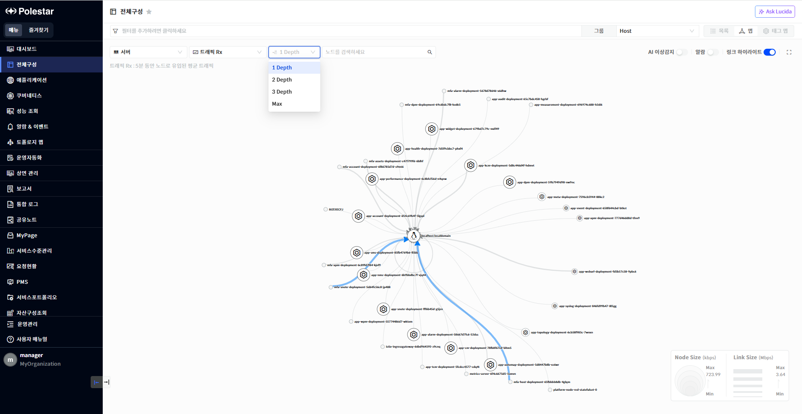

▶ \[그림 \] 연결 표시

화면 지표

| 1\. 1 Depth | 최대 크기 등급의 노드와 직접 연결된 노드만 표시합니다.                     |
| ----------- | --------------------------------------------------- |
| 2\. 2 Depth | 1 Depth 노드에 연결된 노드까지 표시합니다.                         |
| 3\. 3 Depth | 2 Depth 노드에 연결된 노드까지 표시합니다.                         |
| 4\. Max     | Depth 계산을 하지 않고 최대 크기 등급 노드를 기준으로 연결된 모든 노드를 표시합니다. |

노드 검색

네트워크 자동맵 화면에 표시된 노드를 대소문자 구분하지 않고 검색합니다. 검색어에 해당하지 않는 노드는 화면에서 흐리게 표시됩니다.

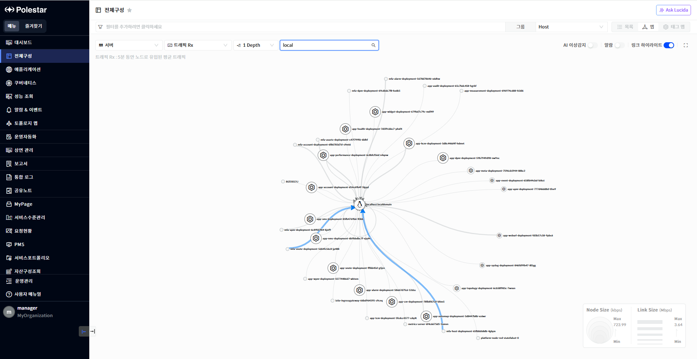

▶ \[그림 \] 노드 검색

AI 이상감지

Enterprise 라이선스를 사용하는 경우 네트워크 자동맵 우측 상단에 “AI 이상감지” 토글 버튼이 표시됩니다. 이 토글을 활성화화면 성능 이상감지 분석을 지원하는 노드에 AI 아이콘이 추가되어 복잡한 네트워크 환경에서도 해당 노드를 쉽게 구분할 수 있습니다.

<table>
<tbody>
<tr class="odd">
<td>
노트

성능 이상감지 지원 여부는 ‘성능 이상감지 정책’ 설정에 따라 달라집니다.

성능 이상감지 정책은 [알람 &amp; 이벤트] 메뉴 중 ‘AIOps Lucida 정책’에서 설정할 수 있습니다.

Enterprise 라이선스가 아닌 경우, ‘AI 이상감지’ 토글 버튼은 표시되지 않습니다.
</td>
</tr>
</tbody>
</table>

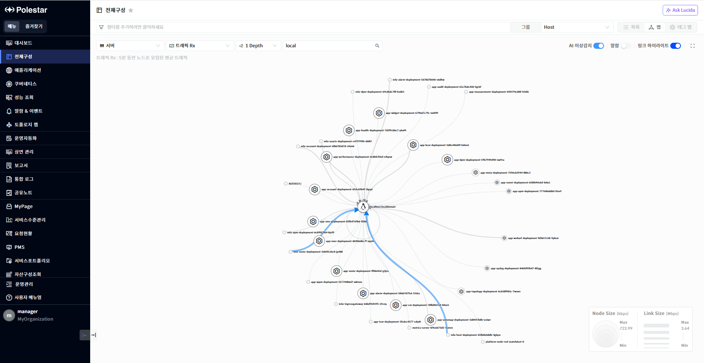

▶ \[그림 \] AI 이상감지

알람

네트워크 자동맵 노드에 현재 발생한 알람의 표시 여부를 설정합니다. 네트워크 자동맵 화면 접속 시 알람 설정은 비활성화 상태이며, 토글 버튼을 통해 활성화할 수 있습니다. 알람을 활성화하면 상위 3단계 심각도의 알람이 노드에 표시됩니다. 한 노드에 여러 등급의 알람이 발생한 경우, 심각도 등급이 가장 높은 알람이 노드에 표시되며, 심각도 버튼을 클릭하여 해당 심각도 알람 표시 여부를 ON/OFF할 수 있습니다. 만약 최근 5분 사이에 새롭게 발생한 알람이 있다면 노드 알람 표시가 깜박입니다.

<table>
<tbody>
<tr class="odd">
<td>
노트

알람은 [알람 &amp; 이벤트] 메뉴에서 알람 정책을 등록한 경우 발생합니다.

발생한 알람의 상세 내용은 [알람 &amp; 이벤트] 메뉴의 [알람 현황]에서 확인할 수 있습니다.
</td>
</tr>
</tbody>
</table>

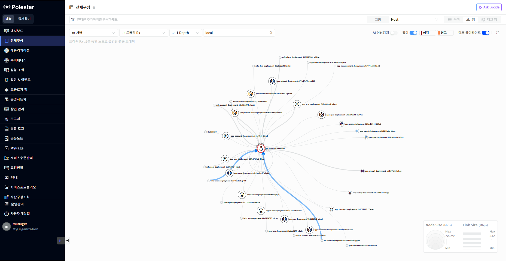

▶ \[그림 \] 알람

링크 하이라이트

네트워크 자동맵에 표시된 링크 중에서 최대 크기 등급에 해당하는 링크를 파란색으로 강조해서 표시합니다. 네트워크 자동맵 화면 접속 시 링크 하이라이트 설정은 활성화 상태이며, 토글 버튼을 통해 비활성화할 수 있습니다.

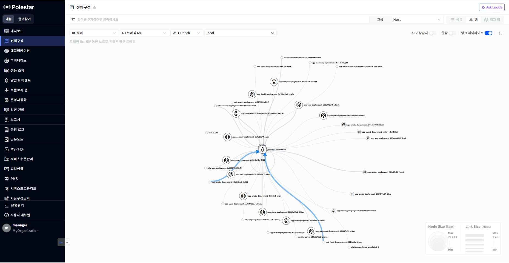

▶ \[그림 \] 링크 하이라이트

화면 맞춤

네트워크 자동맵 화면은 마우스 휠을 통해 확대 및 축소할 수 있고, 화면을 드래그하여 원하는 위치로 이동할 수 있습니다. 네트워크 자동맵을 화면 크기에 맞춰서 보고 싶은 경우 화면 맞춤 기능을 사용합니다.

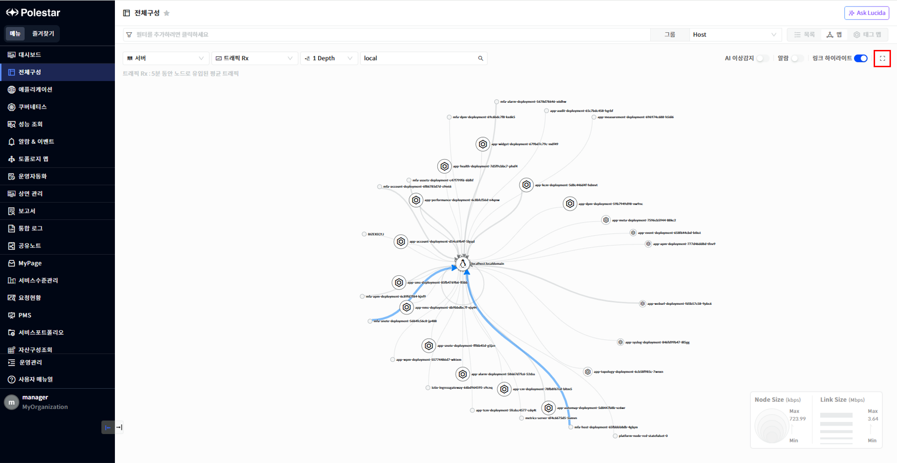

▶ \[그림 \] 화면 맞춤

범례

네트워크 자동맵에 표시된 노드와 링크의 크기 정보를 표시합니다. 노드와 링크는 데이터 크기에 따라 5단계로 분류됩니다. 범례의 Max 값은 화면에 표시된 노드와 링크 데이터 중 가장 큰 데이터를 의미합니다. 범례는 지표를 선택할 때마다 해당 지표 데이터에 따라 업데이트 됩니다.

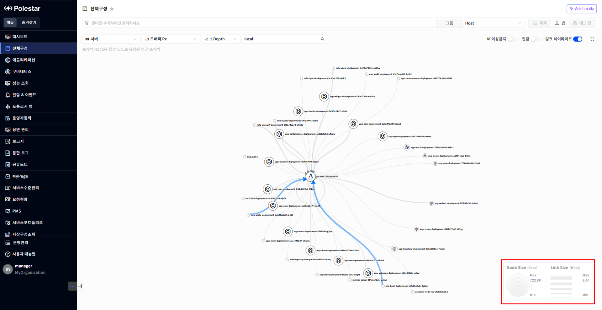

▶ \[그림 \] 범례

노드

네트워크 자동맵에서 각각의 리소스는 노드 형태로 표시됩니다. 노드 위로 마우스 hover하면 노드와 연결된 링크가 하이라이트 되어 노드와 연결된 네트워크가 시각적으로 표현됩니다.

각 노드의 상세 정보는 노드를 클릭하면 호출되는 노드 요약 드로어에서 확인할 수 있습니다. 노드 요약 드로어에서는 각 노드의 IP별 네트워크 데이터, 상태 요약, 알람 현황, 기본 성능 데이터 차트, 이벤트 목록을 제공합니다. 만약 노드와 연결된 상대편 노드(=destination노드)가 POLESTAR에서 관리 중인 장비인 경우, 해당 장비의 기본 성능 데이터도 노드 드로어에서 확인할 수 있습니다. destination 노드가 POLESTAR 관리 장비가 아니더라도 기본 네트워크 성능 지표 정보를 제공합니다.

‘AI 이상감지’ 기능이 활성화되어 있고, AI 아이콘이 표시되어 있는 노드에서는 성능 이상감지 분석 결과도 네트워크 자동맵에서 손쉽게 확인할 수 있습니다.

네트워크 자동맵에서 가장 작은 사이즈의 노드에는 아이콘이 표시되지 않습니다.

네트워크 자동맵 데이터를 수집하지는 않지만 POLESTAR 관리 장비인 경우, 노드 크기에 따라 장비별 대표 아이콘이 노드에 표시되고, 노드 드로어 대신 툴팁을 통해 트래픽 Rx와 트래픽 Rx 데이터량 지표값을 제공합니다. 노드를 클릭해서 해당 장비의 상세 드로어를 확인할 수 있습니다.

노드 타입

<table>
<thead>
<tr class="header">
<th>1. 네트워크 자동맵 노드</th>
<th>
서버 에이전트가 설치된 노드입니다.

<ul>
<li>
노드 클릭: 노드 요약 드로어 표시
</li>
<li>
노드 툴팁: 네트워크 자동맵에서 지원하는 모든 지표의 데이터 표시
</li>
</ul></th>
</tr>
</thead>
<tbody>
<tr class="odd">
<td>2. POLESTAR 리소스 노드</td>
<td>
네트워크 자동맵 데이터를 수집하지는 않지만, POLESTAR에서 관리 중인 장비를 표시하는 노드입니다.

<ul>
<li>
노드 클릭: 해당 장비의 상세 드로어 표시
</li>
<li>
노드 툴팁: 장비 이름과 트래픽 Rx, 트래픽Rx 데이터량 표시
</li>
</ul></td>
</tr>
</tbody>
</table>

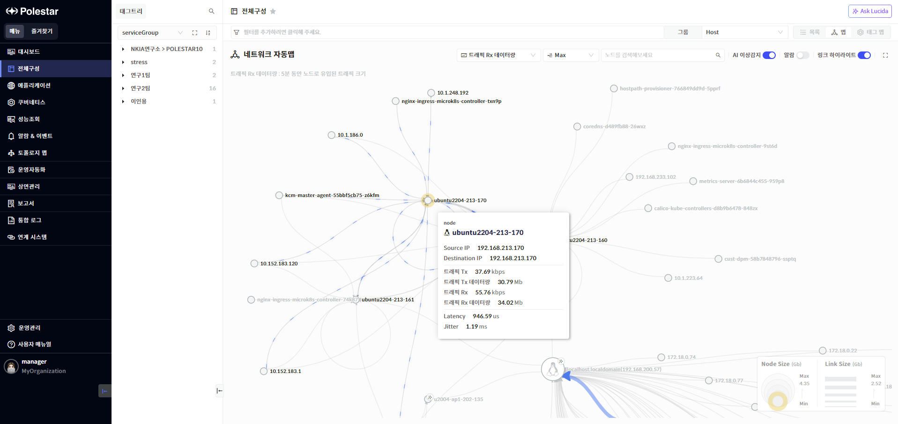

▶ \[그림 \] 네트워크 자동맵 노드 툴팁

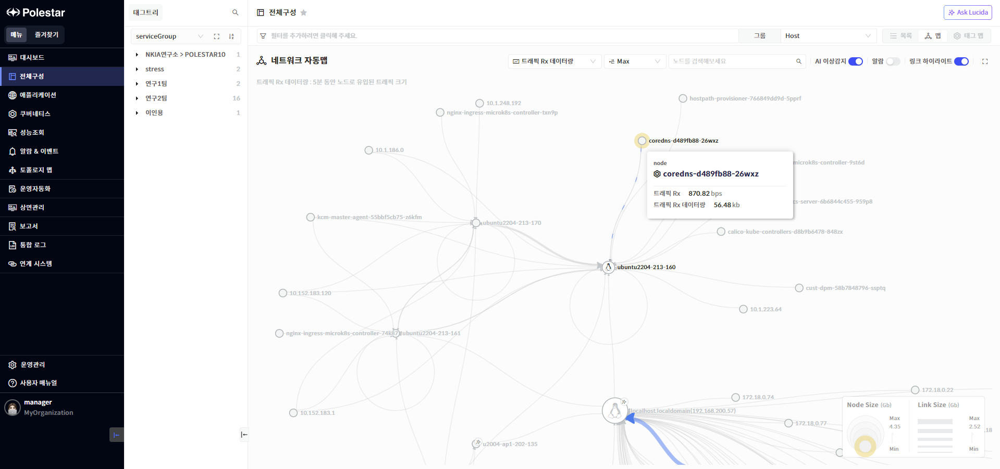

▶ \[그림 \] POLESTAR 리소스 노드 툴팁

노드 요약 드로어

노드를 클릭하면 노드 요약 드로어가 나타납니다. 선택한 노드가 ‘Source IP’ 셀렉터에 표시되고, Source IP와 연결된 destination 노드 목록이 ‘Destination IP’ 셀렉터에 표시됩니다. 사용자는 이 두 셀렉터를 사용하여 노드 사이의 상세 성능 데이터를 확인할 수 있습니다.

택한 Source 노드 IP와 Destination 노드 IP를 기준으로 산출한 네트워크 데이터가 드로어 상단에 표시되고, Source 노드의 주요 지표 차트, Source 노드에서 수집하고 있는 이벤트 목록은 각각의 탭으로 제공합니다. Destination 노드가 POLESTAR에 등록되어 있는 경우, Destination 노드의 주요 지표 차트도 Source 노드 요약 드로어에서 확인할 수 있습니다.

<table>
<tbody>
<tr class="odd">
<td>
노트

‘Destination IP’ 셀렉터는 네트워크 자동맵 화면에서 선택한 지표 데이터 내림차순으로 정렬되어 있습니다.
</td>
</tr>
</tbody>
</table>

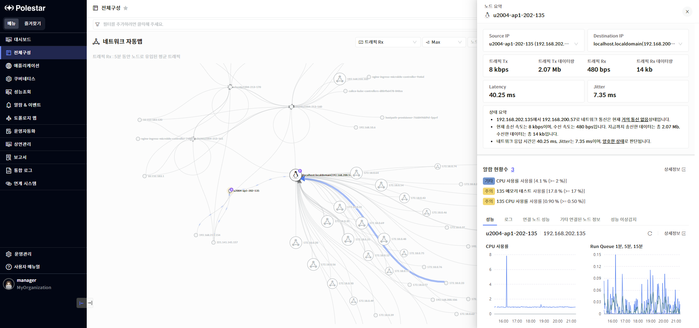

▶ \[그림 \] 노드 요약 드로어 (서버)

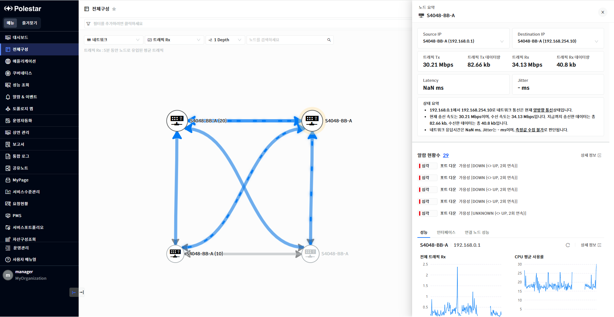

▶ \[그림 \] 노드 요약 드로어 (네트워크)

상태 요약

상태 요약에서는 Source 노드와 Destination 노드 사이의 성능 데이터를 통신 상태, 속도 및 누적 데이터 전송량, 응답 품질 등 사용자에게 친숙한 단어로 설명함으로써 복잡한 수치값을 쉽게 이해할 수 있도록 도와줍니다.

알람 현황수

Source 노드의 알람 현황 정보를 간략하게 표시합니다. 최근 발생한 알람이 5개까지 표시되며, 상세정보 링크를 클릭하여 알람 상세 드로어에서 자세한 알람 정보를 확인할 수 있습니다.

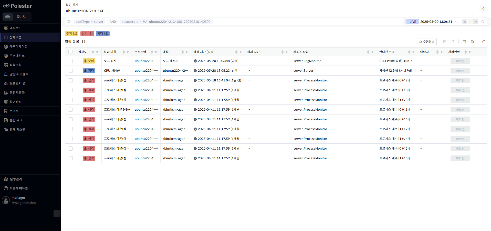

▶ \[그림 \] 노드 요약 드로어 – 알람 현황수 – 상세정보 드로어

성능 탭

성능탭에서는 Source 노드의 최근 6시간 동안의 주요 지표 차트를 확인할 수 있습니다. 특정 차트에 마우스 hover 시 다른 차트에도 동일 시점을 표시하는 가이드라인이 생성되고, 차트를 드래그해서 확대하면 나머지 차트에도 동일하게 적용됩니다. 차트 상단의 초기화 버튼을 클릭해서 차트를 처음 상태로 복구할 수 있으며, 상세정보 링크를 클릭하면 Source 노드 서버 장비의 상세 내용을 별도의 드로어에서 확인할 수 있습니다. 선택된 노드(도메인) 종류에 따라 성능 탭 화면 지표가 변경됩니다.

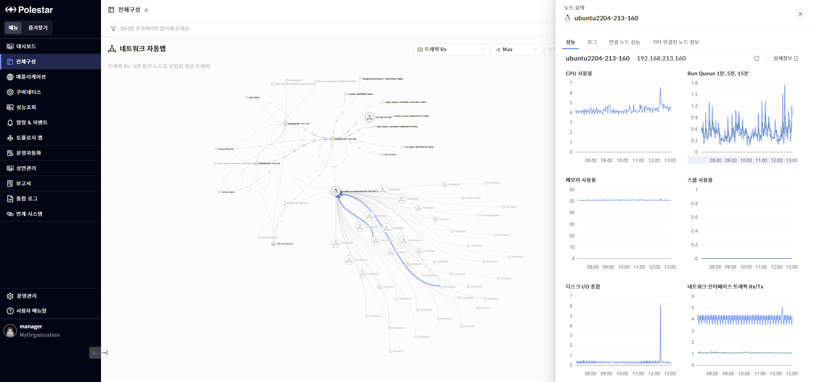

▶ \[그림 \] 노드 요약 드로어 – 성능 탭 (서버)

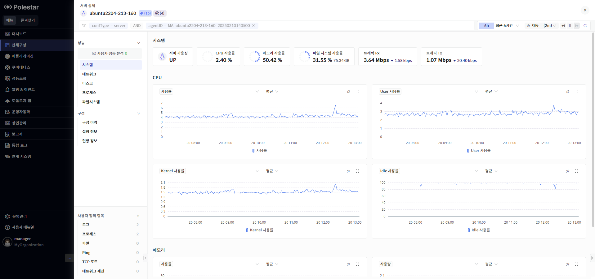

▶ \[그림 \] 노드 요약 드로어 – 성능 탭 – 상세정보 드로어 (서버)

화면 지표 (서버)

<table>
<thead>
<tr class="header">
<th>1. CPU 사용률</th>
<th>
서버의 CPU 평균 사용률을 표시합니다.

단위 : %
</th>
</tr>
</thead>
<tbody>
<tr class="odd">
<td>2. Run Queue 1분, 5분, 15분</td>
<td>
최근 1분/5분/15분 동안의 Queue 평균 개수를 표시합니다.

단위 : 건
</td>
</tr>
<tr class="even">
<td>3. 메모리 사용률</td>
<td>
서버의 물리적 메모리 사용률을 표시합니다.

단위 : %
</td>
</tr>
<tr class="odd">
<td>4. 스왑 사용률</td>
<td>
서버의 스왑 메모리 사용률을 표시합니다.

단위 : %
</td>
</tr>
<tr class="even">
<td>5. 디스크 I/O 총합</td>
<td>
서버 디스크 I/O의 총합을 표시합니다.

단위 : kBPS
</td>
</tr>
<tr class="odd">
<td>6. 네트워크 인터페이스 트래픽 Rx/Tx</td>
<td>
서버의 포트로 유입된 트래픽의 평균값(Rx)과 서버의 포트에서 나간 트래픽의 평균값(Tx)을 표시합니다.

단위 : kbps
</td>
</tr>
</tbody>
</table>

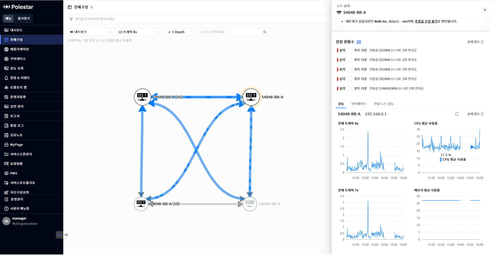

▶ \[그림 \] 노드 요약 드로어 – 성능 탭 (네트워크)

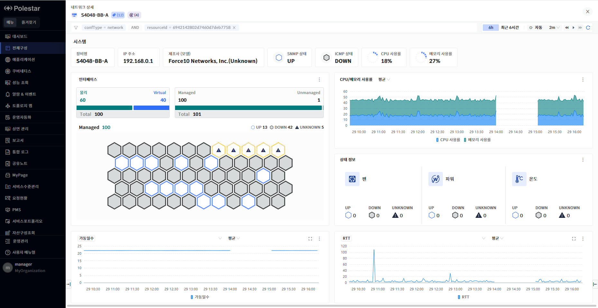

▶ \[그림 \] 노드 요약 드로어 – 성능 탭 – 상세정보 드로어 (네트워크)

화면 지표 (네트워크)

<table>
<thead>
<tr class="header">
<th>1. CPU 사용률</th>
<th>
네트워크 장비의CPU 평균 사용률을 표시합니다.

단위 : %
</th>
</tr>
</thead>
<tbody>
<tr class="odd">
<td>2. 메모리 사용률</td>
<td>
네트워크 장비의 물리적 메모리 사용률을 표시합니다.

단위 : %
</td>
</tr>
<tr class="even">
<td>3. 전체 트래픽 RX</td>
<td>
네트워크 장비의 전체 트래픽RX 사용량을 표시합니다.

단위 : bps
</td>
</tr>
<tr class="odd">
<td>4. 전체 트래픽 RX</td>
<td>
네트워크 장비의 전체 트래픽TX 사용량을 표시합니다.

단위 : bps
</td>
</tr>
</tbody>
</table>

로그 탭

노드(도메인) 종류가 서버 인 경우 로그 탭이 활성화됩니다. Source 노드에서 수집한 최근 6시간 동안의 이벤트 목록을 표시합니다. 상세내용 필드를 클릭하면 이벤트 상세 드로어에서 수집한 이벤트 내용 전문을 확인할 수 있습니다.

<table>
<tbody>
<tr class="odd">
<td>
노트

Source 노드 서버에 ‘로그 감시’를 등록하여 서버에서 발생한 이벤트를 수집할 수 있습니다.
</td>
</tr>
</tbody>
</table>

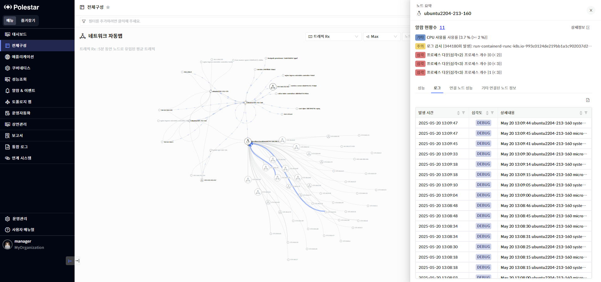

▶ \[그림 \] 노드 요약 드로어 – 로그 탭

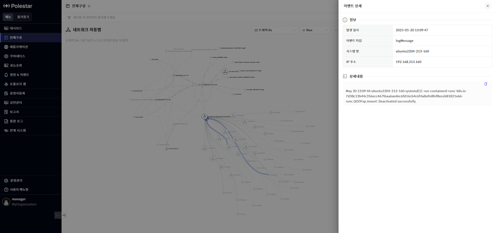

▶ \[그림 \] 노드 요약 드로어 - 이벤트 상세 드로어

화면 지표

<table>
<thead>
<tr class="header">
<th>1. 발생 시간</th>
<th>이벤트가 발생된 시간입니다.</th>
</tr>
</thead>
<tbody>
<tr class="odd">
<td>2. 심각도</td>
<td>이벤트의 심각도 레벨입니다.</td>
</tr>
<tr class="even">
<td>3. 상세내용</td>
<td>이벤트 메시지 상세 내용입니다.</td>
</tr>
<tr class="odd">
<td>4. 이벤트 타입</td>
<td>
이벤트를 발생시키는 원본 소스 타입입니다.

logMessage : 로그파일
</td>
</tr>
<tr class="even">
<td>5. 시스템명</td>
<td>이벤트가 발생된 구성 정보의 이름입니다.</td>
</tr>
<tr class="odd">
<td>6. IP주소</td>
<td>이벤트가 발생된 구성의 IP 정보입니다.</td>
</tr>
</tbody>
</table>

인터페이스 탭

노드(도메인) 종류가 네트워크 인 경우 인터페이스 탭이 활성화됩니다. Source 노드에서 수집한 최근 6시간 동안의 이벤트 목록을 표시합니다. 상세내용 필드를 클릭하면 이벤트 상세 드로어에서 수집한 이벤트 내용 전문을 확인할 수 있습니다.

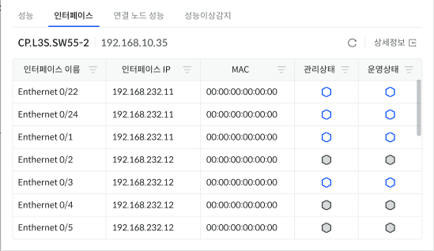

▶ \[그림 \] 노드 요약 드로어 – 인터페이스 탭

화면 지표

| 1\. 이름    | 인터페이스의 이름입니다.    |
| --------- | ---------------- |
| 2\. IP주소  | 인터페이스의 IP주소입니다.  |
| 3\. MAC주소 | 인터페이스의 MAC주소입니다. |
| 4\. 운영상태  | 인터페이스의 운영상태입니다.  |
| 5\. 관리상태  | 인터페이스의 관리상태입니다.  |

연결 노드 성능 탭

Source 노드와 연결된 Destination 노드가 POLESTAR에서 관리 중인 장비인 경우, 노드 요약 드로어에 연결 노드 성능 탭이 표시됩니다. 연결 노드 성능 탭은 성능 탭과 동일한 방식으로 Destination 노드의 주요 성능 차트와 상세정보 링크를 제공합니다. Destination 노드 타입에 따라 주요 성능 지표는 달라집니다.

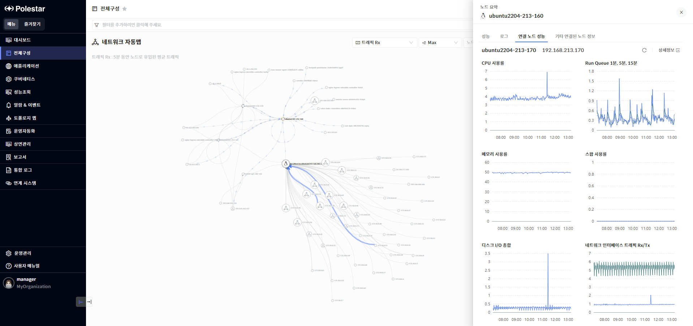

▶ \[그림 \] 노드 요약 드로어 – 연결 노드 성능 탭

기타 연결된 노드 정보 탭

Destination 노드가 POLESTAR에서 관리하는 장비가 아닌 경우, 기타 연결된 노드 정보 탭에서 트래픽 및 응답시간 관련 데이터 목록을 확인할 수 있습니다. 목록 우측 상단의 컬럼 수정 버튼을 클릭해서 목록에서 표시할 데이터를 설정할 수 있습니다. 데이터 목록은 엑셀 파일로 다운로드 받을 수 있습니다.

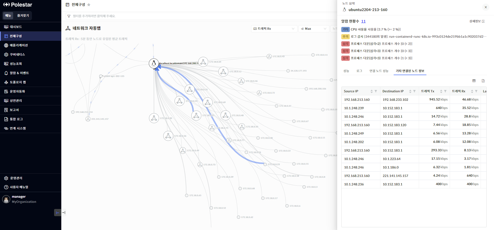

▶ \[그림 \] 노드 요약 드로어 – 기타 연결된 노드 정보 탭

성능 이상감지 탭

이상감지 분석을 지원하는 Source 노드 요약 드로어에는 성능 이상감지 탭이 표시됩니다. 성능 이상감지 탭에서는 이상감지 학습이 완료된 지표 차트가 최대 6개까지 제공되며, 전체 지표는 상세정보 링크를 클릭하면 호출되는 성능 이상감지 분석 드로어에서 확인할 수 있습니다.

<table>
<tbody>
<tr class="odd">
<td>
노트

성능 이상감지 탭은 네트워크 자동맵 화면에서 AI 이상감지 토글 버튼을 ON 상태로 설정한 상태에서만 표시됩니다.

성능 이상감지와 관련된 상세 설명은 ‘성능 이상감지 정책’과 ‘이상감지 분석’ 매뉴얼을 참고하시기 바랍니다.
</td>
</tr>
</tbody>
</table>

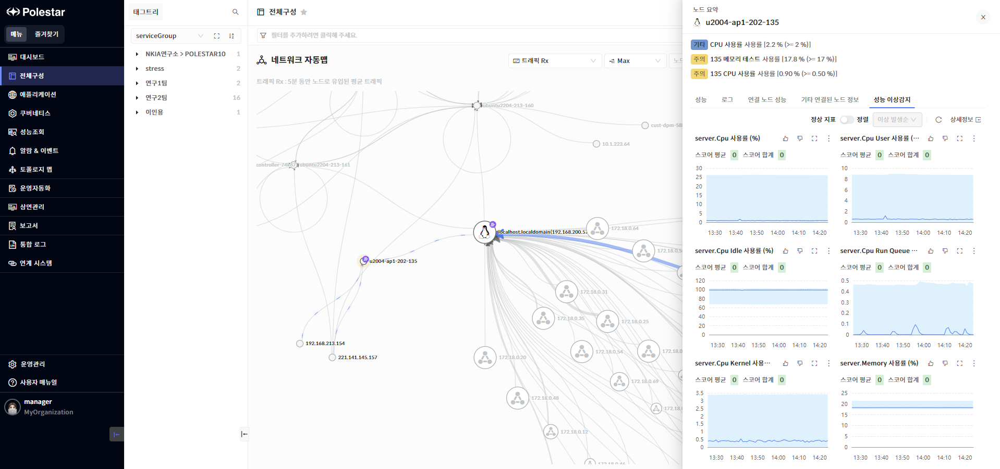

▶ \[그림 \] 노드 요약 드로어 – 성능 이상감지 탭

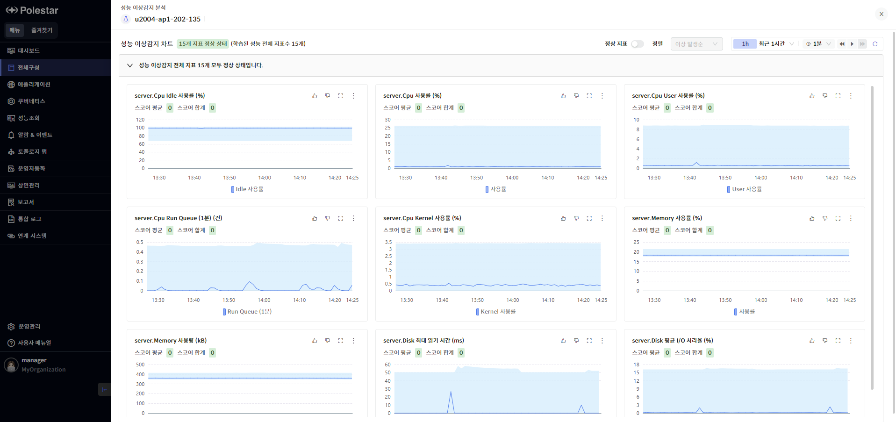

▶ \[그림 \] 노드 요약 드로어 – 성능 이상감지 탭 – 상세정보 드로어

링크

링크는 노드와 노드 사이의 네트워크 데이터 흐름을 표시합니다. 링크에 마우스 hover를 하면 해당 링크가 보라색으로 하이라이트 되고 링크의 네트워크 데이터 상세 정보가 툴팁으로 나타납니다. 만약 source 노드와 destination 노드는 동일하지만 연결된 IP 정보가 다른 네트워크 데이터가 여러 건이 있는 다중 링크의 경우, 링크에는 데이터 개수가 표시되고 성능 데이터가 가장 큰 링크 정보가 툴팁에 표시됩니다.

링크 요약 드로어에서 source와 destination 셀렉터를 조합하여 링크의 네트워크 데이터 정보와 상태요약, 프로세스 정보를 확인할 수 있습니다.

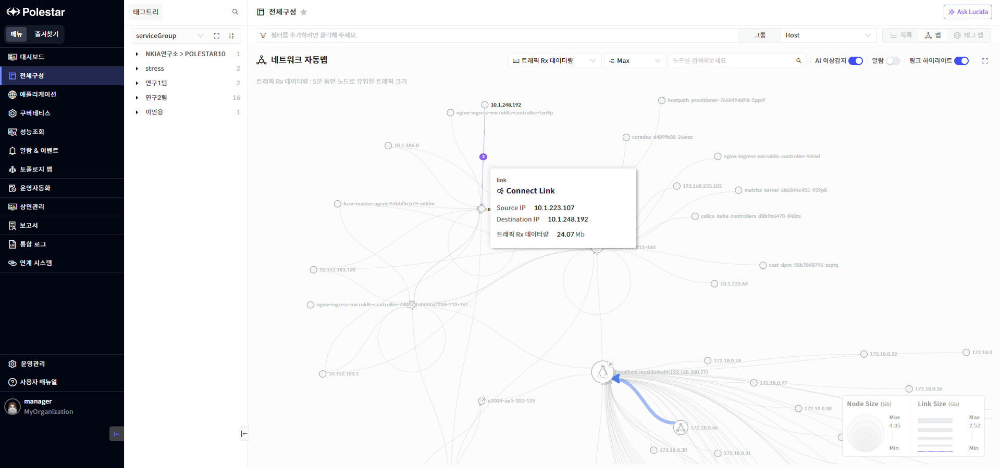

▶ \[그림 \] 링크 hover 시 링크 하이라이트 및 링크 툴팁

링크 요약 드로어

링크를 클릭하면 링크 요약 드로어가 나타납니다. ‘Source IP’, ‘Destination IP’ 셀렉터를 조합하여 두 노드 사이의 네트워크 데이터를 조회할 수 있습니다.

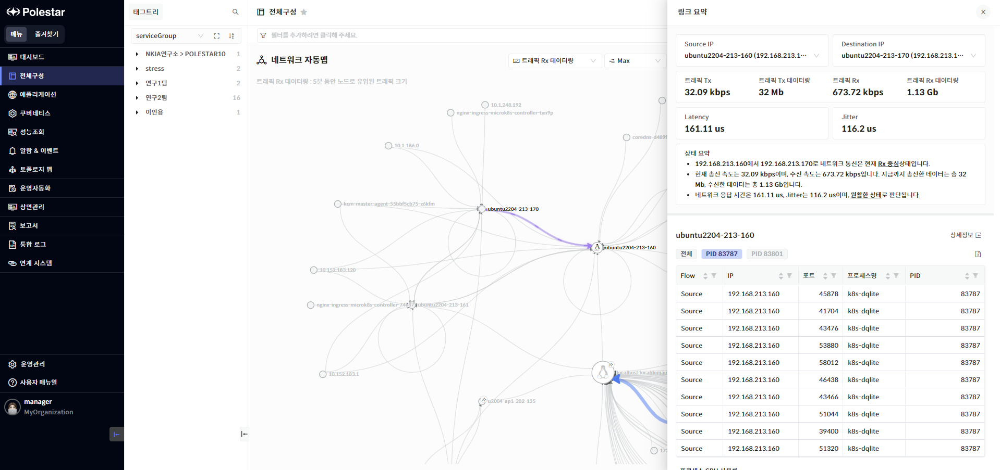

▶ \[그림 \] 링크 요약 드로어 (서버)

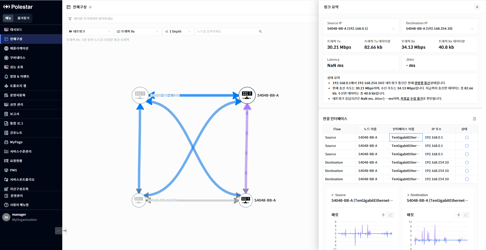

▶ \[그림 \] 링크 요약 드로어 (네트워크)

상태 요약

상태 요약에서는 Source 노드와 Destination 노드 사이의 성능 데이터를 통신 상태, 속도 및 누적 데이터 전송량, 응답 품질 등 사용자에게 친숙한 단어로 설명함으로써 복잡한 수치값을 쉽게 이해할 수 있도록 도와줍니다.

프로세스 목록

노드(도메인) 종류가 서버 링크인 경우 나타나는 목록입니다. 링크 요약 드로어 상단의 ‘Source IP’, ‘Destination IP’ 셀렉터에서 선택한 노드별IP에서 실행 중인 프로세스 목록 정보를 제공합니다. 단, Destination 노드의 프로세스 정보는 Destination 노드가 네트워크 자동맵 노드인 경우에만 수집할 수 있습니다.

프로세스 목록 상단의 PID 버튼을 활용하여 Source 노드의 전체 프로세스 주요 성능 차트와 특정 PID의 성능 추이를 쉽게 비교할 수 있고, 상세정보 링크를 통해 Source 노드 서버의 프로세스 상세 드로어롤 확인할 수 있습니다.

화면 지표

| 1\. Flow  | Source, Destination을 표시합니다.                           |
| --------- | ----------------------------------------------------- |
| 2\. IP    | Source 또는 Destination 노드의 IP 정보를 표시합니다.               |
| 3\. 포트    | Source 또는 Destination 노드의 포트 정보를 표시합니다.               |
| 4\. 프로세스명 | Source 또는 Destination 노드의 프로세스 이름을 표시합니다.             |
| 5\. PID   | Source 또는 Destination 노드에서 실행 중인 프로세스의 PID 정보를 표시합니다. |

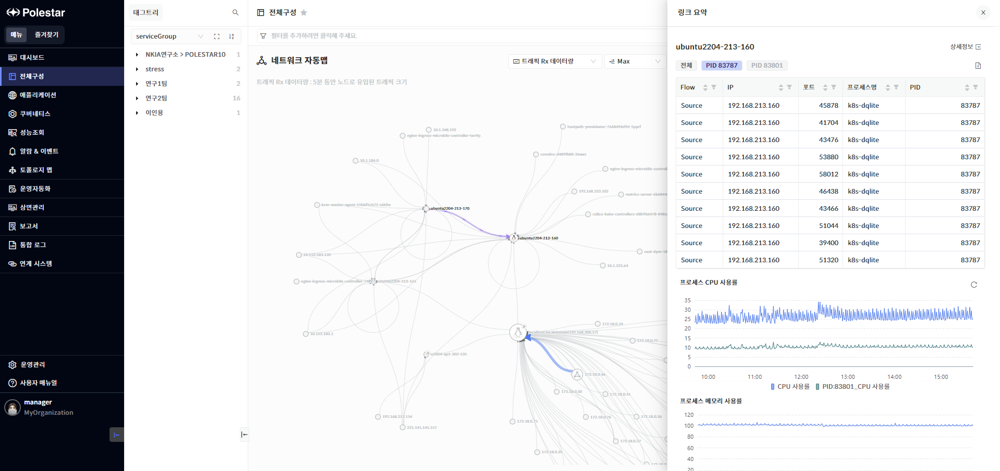

▶ \[그림 \] 링크 요약 드로어 – 프로세스 목록

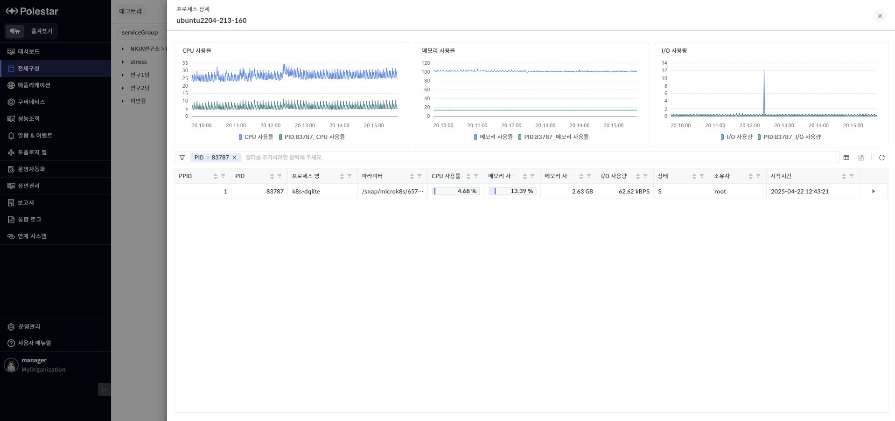

▶ \[그림 \] 링크 요약 드로어 – 프로세스 목록 - 상세정보 드로어

연결 인터페이스 목록

노드(도메인) 종류가 네트워크 링크인 경우 나타나는 목록입니다. 링크 요약 드로어 상단의 ‘Source IP’, ‘Destination IP’ 셀렉터에서 선택한 노드별IP에서 실행 중인 프로세스 목록 정보를 제공합니다. 단, Destination 노드의 프로세스 정보는 Destination 노드가 네트워크 자동맵 노드인 경우에만 수집할 수 있습니다. 연결 인터페이스 목록에 연결된 인터페이스들에 대한 요약 정보가 표시됩니다.

화면 지표

| 1\. Flow     | Source, Destination을 표시합니다. |
| ------------ | --------------------------- |
| 2\. 장비 이름    | 연결 인터페이스의 장비 이름을 표시합니다.     |
| 3\. 인터페이스 이름 | 연결 인터페이스 이름을 표시합니다.         |
| 4\. 인터페이스 IP | 연결 인터페이스 IP를 표시합니다.         |
| 5\. 상태       | 연결 인터페이스 상태(가용성) 정보를 표시합니다. |

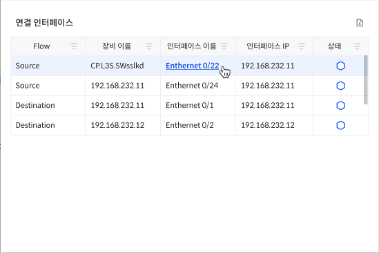

▶ \[그림 \] 링크 요약 드로어 – 연결 인터페이스 목록

연결 인터페이스 성능 지표

연결 인터페이스 목록에서 인터페이스 이름을 선택하면 하단에 Source-Destination 성능 지표 차트가 표시됩니다.

화면 지표

| 1\. 트래픽 | Source, Destination의 트래픽 Rx, Tx 성능 지표 차트를 표시합니다.    |
| ------- | --------------------------------------------------- |
| 2\. 패킷  | Source, Destination의 패킷 Rx, Tx 성능 지표 차트를 표시합니다**.** |

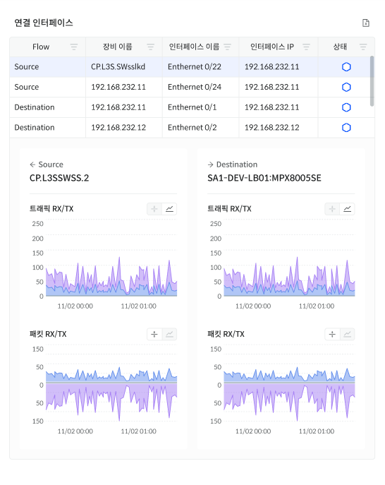

▶ \[그림 \] 링크 요약 드로어 – 연결 인터페이스

