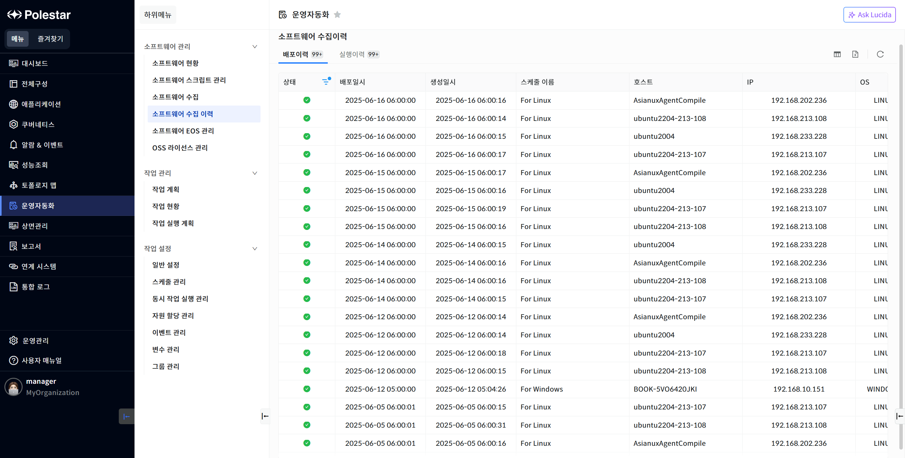
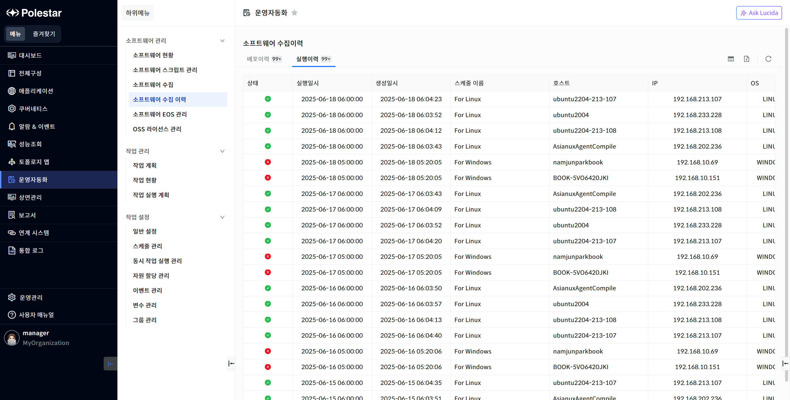

소프트웨어 수집 이력

배포이력

스케줄에 의해 소프트웨어 수집이 실행되었을 때 서버에 스크립트를 올바르게 배포했는지에 대한 이력을 확인할 수 있습니다.

▶ \[그림1\] 배포이력

화면 지표

<table>
<thead>
<tr class="header">
<th>상태</th>
<th>
서버에 스크립트를 올바르게 배포했는지에 대한 결과를 표시합니다.

항목: 성공, 실패
</th>
</tr>
</thead>
<tbody>
<tr class="odd">
<td>배포일시</td>
<td>스케줄에 의해 배포기능이 실행된 시간을 표시합니다.</td>
</tr>
<tr class="even">
<td>생성일시</td>
<td>배포이력의 자료가 생성된 시간을 표시합니다.</td>
</tr>
<tr class="odd">
<td>스케줄 이름</td>
<td>설정된 스케줄의 이름을 표시합니다.</td>
</tr>
<tr class="even">
<td>호스트</td>
<td>스크립트가 배포된 장비의 호스트명을 표시합니다.</td>
</tr>
<tr class="odd">
<td>IP</td>
<td>스크립트가 배포된 장비의 IP를 표시합니다.</td>
</tr>
<tr class="even">
<td>OS</td>
<td>스크립트가 배포된 장비의 OS를 표시합니다.</td>
</tr>
<tr class="odd">
<td>메시지</td>
<td>
상태에 대한 메시지를 표시합니다.

항목: 성공은 OK, 실패는 사유
</td>
</tr>
</tbody>
</table>

실행이력

스케줄에 의해 소프트웨어 수집이 실행되었을 때 서버에서 스크립트가 올바르게 실행했는지에 대한 이력을 확인할 수 있습니다.

▶ \[그림2\] 실행이력

화면 지표

<table>
<thead>
<tr class="header">
<th>상태</th>
<th>
서버에서 스크립트가 올바르게 실행했는지에 대한 결과를 표시합니다.

항목: 성공, 실패
</th>
</tr>
</thead>
<tbody>
<tr class="odd">
<td>실행일시</td>
<td>스케줄에 의해 스크립트가 서버에서 실행된 시간을 표시합니다.</td>
</tr>
<tr class="even">
<td>생성일시</td>
<td>실행이력의 자료가 생성된 시간을 표시합니다.</td>
</tr>
<tr class="odd">
<td>호스트</td>
<td>스크립트가 실행된 서버의 이름을 표시합니다.</td>
</tr>
<tr class="even">
<td>IP</td>
<td>스크립트가 실행된 장비의 IP를 표시합니다.</td>
</tr>
<tr class="odd">
<td>OS</td>
<td>스크립트가 실행된 장비의 OS를 표시합니다.</td>
</tr>
<tr class="even">
<td>메시지</td>
<td>
상태에 대한 메시지를 표시합니다.

항목: 성공은 OK, 실패는 사유
</td>
</tr>
</tbody>
</table>

