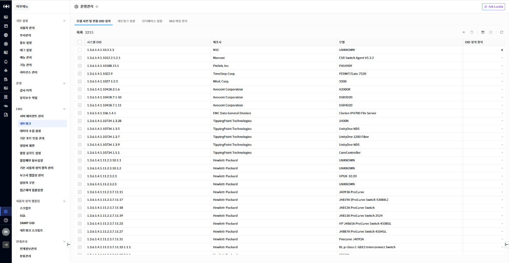
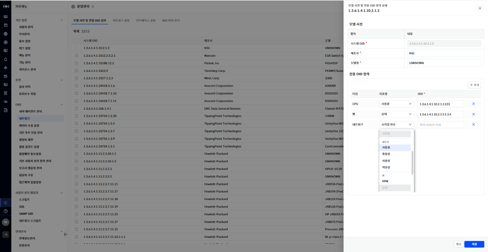
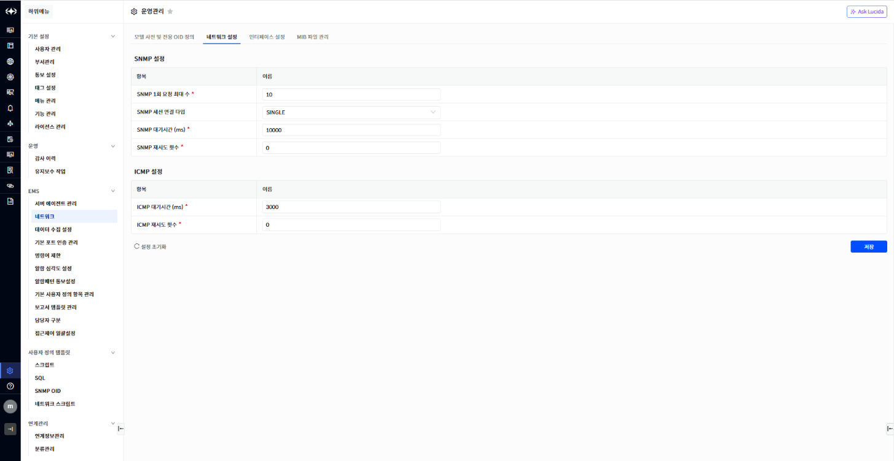
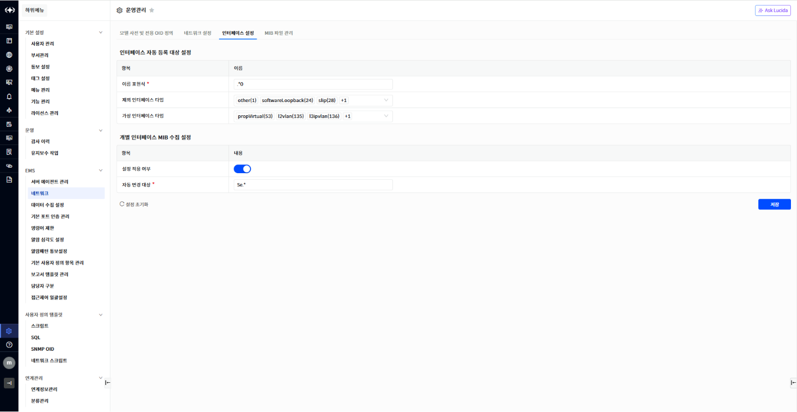
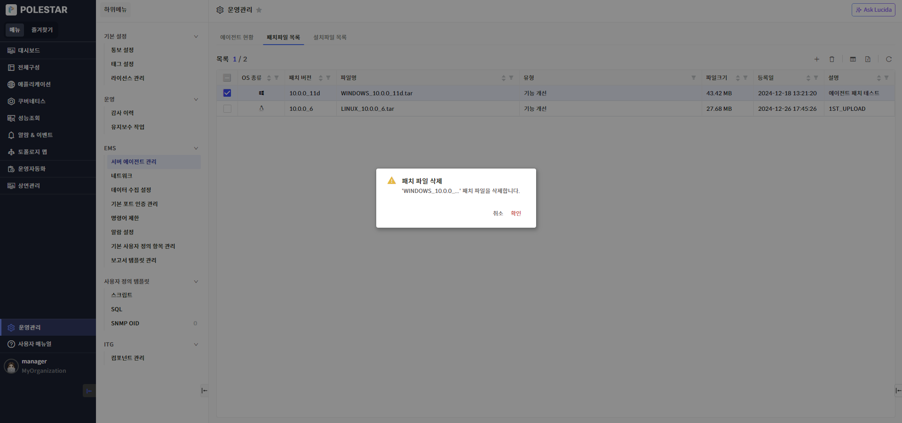
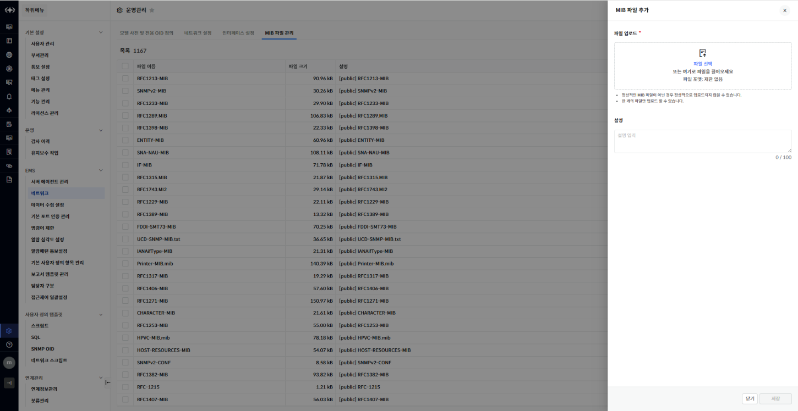
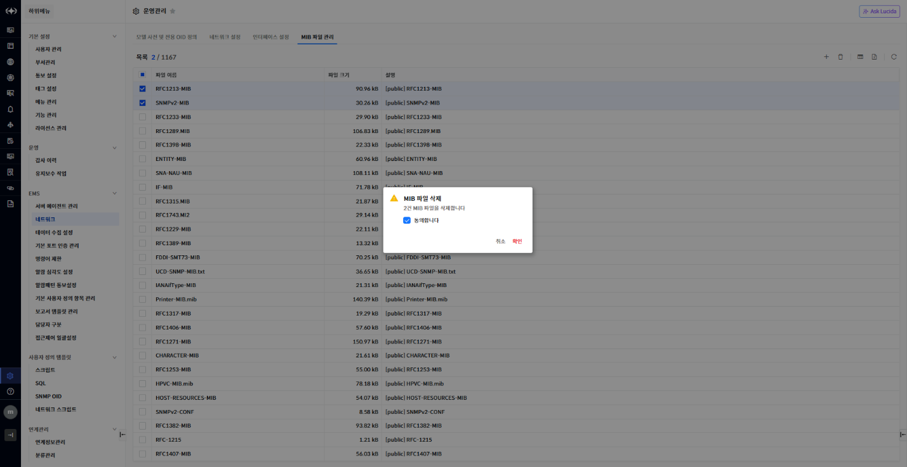

네트워크 관리

운영관리에서 \[네트워크\]를 선택하여 POLESTAR에 등록된 네트워크 장비의 다양한 설정 정보를 진행할 수 있습니다.

모델 사전 및 전용 OID 정의

\[모델 사전 및 전용 OID 정의\] 탭을 선택하여 POLESTAR에 네트워크 장비의 모델 정보 및 전용 OID 정의할 수 있습니다.

▶ \[그림1\] 모델 사전 및 전용 OID 정의 목록

> 화면 지표

| 시스템 OID   | 시스템 OID 정보를 표시합니다.         |
| --------- | -------------------------- |
| 제조사       | 제조사 정보를 표시합니다.             |
| 모델        | 모델 정보를 표시합니다.              |
| OID 정의 항목 | 전용 OID 로 정의된 항목 수량을 표시합니다. |

전용 OID 정의

사용자가 각 제조사에 전용 OID를 정의할 수 있습니다.

▶ \[그림2\] 모델 사전 및 전용 OID 정의 상세

> 전용 OID 정의 추가

1.  전용 OID 정의 \[+추가\] 버튼 클릭

2.  지표명, OID 정보 입력

3.  \[저장\] 버튼 클릭

네트워크 설정

\[네트워크 설정\] 탭을 선택하여 네트워크에서 사용되는 SNMP, ICMP 정보를 설정할 수 있습니다.

▶ \[그림3\] 네트워크 설정 항목

> 설정 항목

<table>
<thead>
<tr class="header">
<th>SNMP 설정</th>
<th>SNMP 설정 정보를 표시합니다.</th>
</tr>
</thead>
<tbody>
<tr class="odd">
<td>SNMP 1회 요청 최대 수</td>
<td>SNMP 요청 시 1회 최대 요청 수량을 설정합니다</td>
</tr>
<tr class="even">
<td>SNMP 세션 연결 타입</td>
<td>
SNMP 세션 연결 타입을 설정합니다.

(SINGLE, MULTI, CREATE)
</td>
</tr>
<tr class="odd">
<td>SNMP 대기시간 (ms)</td>
<td>SNMP 응답 대기 시간을 설정합니다.</td>
</tr>
<tr class="even">
<td>SNMP 재시도 횟수</td>
<td>SNMP 요청 재시도 횟수를 설정합니다.</td>
</tr>
</tbody>
</table>

| ICMP 설정        | ICMP 설정 정보를 표시합니다.     |
| -------------- | ---------------------- |
| ICMP 대기시간 (ms) | ICMP 응답 대기 시간을 설정합니다.  |
| ICMP 재시도 횟수    | ICMP 요청 재시도 횟수를 설정합니다. |

인터페이스 설정

\[인터페이스 설정\] 탭을 선택하여 네트워크 인터페이스 모니터링에서 사용되는 정보를 설정할 수 있습니다.

▶ \[그림4\] 인터페이스 설정 항목

> 설정 항목

| 인터페이스 자동 등록 대상 설정 | 인터페이스 자동 등록 설정 정보를 표시합니다.    |
| ----------------- | ---------------------------- |
| 이름 표현식            | 관리 대상 인터페이스 대상을 표현식으로 설정합니다. |
| 제외 인터페이스 타입       | 관리 제외 인터페이스 타입 정보를 설정합니다.    |
| 가상 인터페이스 타입       | 가상 인터페이스 타입 정보를 설정합니다.       |

| 개별 인터페이스 MIB 수집 설정 | 개별 인터페이스 MIB 수집 여부 설정 정보를 표시합니다. |
| ------------------ | -------------------------------- |
| 설정 적용 여부           | 개별 인터페이스 MIB 수집 설정 사용 여부를 설정합니다. |
| 자동 변경 대상           | 개별 인터페이스 MIB 수집 설정 대상 정보를 설정합니다. |

MIB 파일 관리

\[모델 사전 및 전용 OID 정의\] 탭을 선택하여 POLESTAR에 네트워크 장비의 모델 정보 및 전용 OID 정의할 수 있습니다..

▶ \[그림5\] MIB 파일 관리 목록

> 화면 지표

| 파일 이름 | MIB 파일 이름을 표시합니다. |
| ----- | ----------------- |
| 파일 크기 | MIB 파일 크기를 표시합니다. |
| 설명    | 설명 정보를 표시합니다.     |

MIB 파일 추가

\[추가\] 버튼을 클릭하여 MIB 파일을 추가할 수 있습니다.

<table>
<tbody>
<tr class="odd">
<td>
노트

정상적인 MIB 파일이 아닌 경우 정상적으로 업로드 되지 않을 수 있습니다.

한 개의 파일만 업로드 할 수 있습니다.
</td>
</tr>
</tbody>
</table>

▶ \[그림6\] MIB 파일 추가

> 화면 지표

| 파일 업로드 | 업로드 할 MIB 파일을 선택합니다. |
| ------ | -------------------- |
| 설명     | 설명을 입력합니다.           |

MIB 파일 삭제

\[삭제\] 버튼을 클릭하여 MIB 파일을 삭제할 수 있습니다.

▶ \[그림7\] MIB 파일 삭제

> MIB 파일 삭제 절차

1.  삭제할 MIB 파일 선택

2.  \[삭제\] 버튼 클릭

3.  \[동의합니다\] 선택 후 \[확인\] 버튼 클릭

