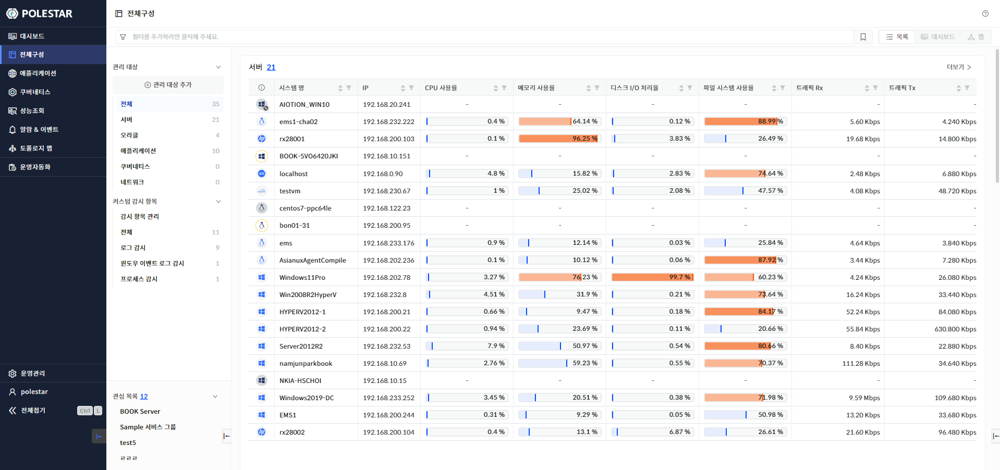
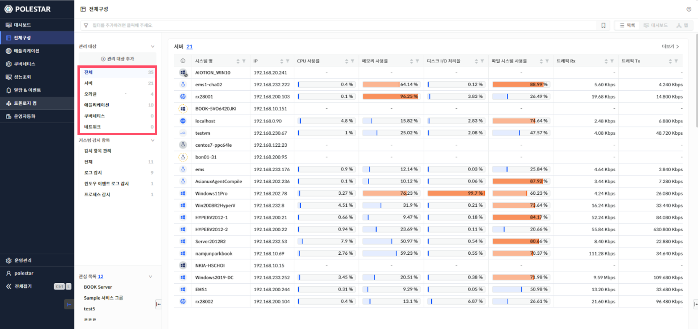

전체구성

전체구성에서 \[전체\]를 선택하여 POLESTAR에서 모니터링하는 관리 대상 타입별 장비 목록을 확인할 수 있습니다.

▶ \[그림1\] 전체구성

관리 대상

관리 대상 타입별 목록은 각 장비의 주요 정보를 포함합니다. 목록은 최대 20개까지 표시되며, 검색필터를 사용하여 목록을 필터링할 수 있습니다. 관리 대상 메뉴에서 관리 대상 타입을 선택하거나, 관리 대상 타입별 목록 상단의 개수 또는 \[더보기\]를 클릭하면 해당 장비 타입의 전체 장비 현황 화면으로 이동합니다.

<table>
<tbody>
<tr class="odd">
<td>
노트

관리 대상 타입별 목록의 지표 설명은 각 관리 대상 타입의 매뉴얼을 참고하시기 바랍니다.
</td>
</tr>
</tbody>
</table>

▶ \[그림2\] 관리 대상

