PMS – 사업관리

\[PMS\] 메뉴에서 \[사업관리\] 탭을 선택하면, 사업 목록 및 신규 등록 또는 정보 수정을 할 수 있습니다.

<table>
<tbody>
<tr class="odd">
<td>
노트

사업관리 정보 수정은 권한이 부여된 사용자만 가능합니다.
</td>
</tr>
</tbody>
</table>

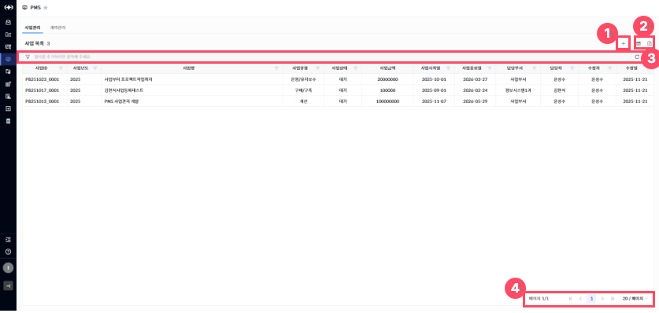

> ▶ \[그림1\] 사업 목록
> 
> 화면 지표(사업 목록)

<table>
<thead>
<tr class="header">
<th>사업ID</th>
<th>사업을 구분하기 위한 고유식별을 위한 ID 값입니다.</th>
</tr>
</thead>
<tbody>
<tr class="odd">
<td>사업연도</td>
<td>해당 사업이 수행되는 연도를 나타냅니다.</td>
</tr>
<tr class="even">
<td>사업명</td>
<td>등록된 사업의 명칭을 표시합니다.</td>
</tr>
<tr class="odd">
<td>사업유형</td>
<td>
사업이 속한 유형 또는 분류를 나타내며, 사업의 성격을 구분하는 데 사용됩니다.

- 구매/구축 : 새로운 시스템·솔루션을 도입하거나, 기존 환경에 없던 기능/서비스를 새롭게 구축하는 사업 유형입니다.

- 변경 : 기존 시스템의 구조, 기능, 정책 등을 변경하거나, 환경 변화로 인해 필요해진 수정 작업을 수행하는 사업 유형입니다.

- 개선 : 현재 운영 중인 시스템의 성능, 사용성, 안정성 등을 향상시키기 위해 기능 보완 또는 UX/UI 개선 등을 수행하는 사업 유형입니다.

- 운영/유지보수 : 시스템의 안정적인 운영을 위해 장애 처리, 정기 점검, 패치 적용, 성능 모니터링 등의 유지관리 업무를 수행하는 사업 유형입니다.
</td>
</tr>
<tr class="even">
<td>사업상태</td>
<td>
현재 사업이 어떤 진행 단계에 있는지를 나타냅니다.

- 기획 : 신규 사업 등록 시 기획 상태로 기본 셋팅이 되며, 사업이 승인되기 전 상태를 의미합니다.

- 승인 : 사업이 내부적으로 승인 허가를 받은 상태를 의미합니다.

- 수행 : 사업이 실제로 진행되고 있는 상태를 의미합니다.

- 완료 : 사업에 연관된 작업이 모두 완료된 상태를 의미합니다.

- 종료 : 사업이 종료된 상태를 의미합니다.
</td>
</tr>
<tr class="odd">
<td>사업금액</td>
<td>해당 사업에 배정된 총 예산 금액을 의미합니다.</td>
</tr>
<tr class="even">
<td>사업시작일/사업종료일</td>
<td>사업이 시작되는 날짜와 종료 예정일을 의미하며, 사업 기간을 판단하는 기준이 됩니다.</td>
</tr>
<tr class="odd">
<td>담당부서/담당자</td>
<td>해당 사업을 관리·운영하는 부서와 실제 업무 담당자를 표시합니다.</td>
</tr>
<tr class="even">
<td>수정자/수정일</td>
<td>사업을 마지막으로 수정한 사용자와 그 일자 정보입니다.</td>
</tr>
</tbody>
</table>

> 상세 정보

<table>
<thead>
<tr class="header">
<th>[그림1].”1” 
등록</th>
<th>등록 버튼을 클릭하면 사업관리 등록 화면(드로어)이 열립니다.</th>
</tr>
</thead>
<tbody>
<tr class="odd">
<td>[그림1].”2” 
컬럼수정 &amp; 엑셀저장</td>
<td>표시할 컬럼을 선택하거나 숨길 수 있는 설정 기능을 제공하는 컬럼수정 버튼과, 현재 화면에 표시된 데이터를 엑셀파일로 다운로드 하는 기능을 제공하는 엑셀저장 버튼입니다.</td>
</tr>
<tr class="even">
<td>[그림1].”3” 
그리드 필터</td>
<td>그리드 필터는 상단 행(필터 행)을 통해 각 컬럼 단위로 상세한 조건 검색이 가능한 기능입니다.</td>
</tr>
<tr class="odd">
<td>[그림1].”4” 
페이징</td>
<td>목록 데이터를 구간별로 나누어 페이지 단위로 조회할 수 있도록 도와주는 기능입니다.</td>
</tr>
</tbody>
</table>

사업관리 등록

사업관리 등록 및 수정은 권한이 부여된 사용자만 가능합니다.  
신규 등록을 진행하려면, 사업 목록의 \[등록\] 버튼(\[그림1\]-1)을 클릭하면 등록 화면(드로어)이 열립니다.

<table>
<tbody>
<tr class="odd">
<td>
노트

사업관리 등록 시, ‘사업ID’는 자동으로 채번되며, 상태 ‘기획’으로 등록됩니다.
</td>
</tr>
</tbody>
</table>

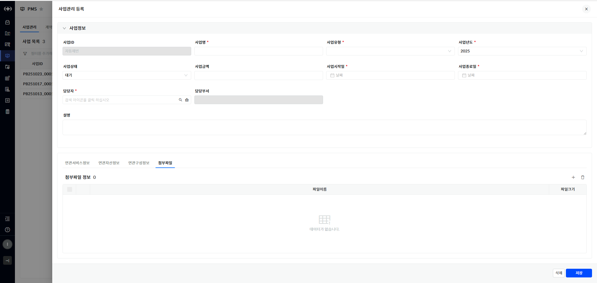

> ▶ \[그림2\] 사업관리 등록 화면(드로어)
> 
> 화면 지표(기본정보)

<table>
<thead>
<tr class="header">
<th>사업ID</th>
<th>사업을 구분하기 위한 고유식별을 위한 ID 값입니다.</th>
</tr>
</thead>
<tbody>
<tr class="odd">
<td>사업명</td>
<td>등록된 사업의 명칭을 표시합니다.</td>
</tr>
<tr class="even">
<td>사업유형</td>
<td>
사업이 속한 유형 또는 분류를 나타내며, 사업의 성격을 구분하는 데 사용됩니다.

- 구매/구축 : 새로운 시스템·솔루션을 도입하거나, 기존 환경에 없던 기능/서비스를 새롭게 구축하는 사업 유형입니다.

- 변경 : 기존 시스템의 구조, 기능, 정책 등을 변경하거나, 환경 변화로 인해 필요해진 수정 작업을 수행하는 사업 유형입니다.

- 개선 : 현재 운영 중인 시스템의 성능, 사용성, 안정성 등을 향상시키기 위해 기능 보완 또는 UX/UI 개선 등을 수행하는 사업 유형입니다.

- 운영/유지보수 : 시스템의 안정적인 운영을 위해 장애 처리, 정기 점검, 패치 적용, 성능 모니터링 등의 유지관리 업무를 수행하는 사업 유형입니다.
</td>
</tr>
<tr class="odd">
<td>사업연도</td>
<td>사업이 수행되는 연도를 나타냅니다.</td>
</tr>
<tr class="even">
<td>사업상태</td>
<td>
현재 사업이 어떤 진행 단계에 있는지를 나타냅니다.

- 기획 : 신규 사업 등록 시 기획 상태로 기본 셋팅이 되며, 사업이 승인되기 전 상태를 의미합니다.

- 승인 : 사업이 내부적으로 승인 허가를 받은 상태를 의미합니다.

- 수행 : 사업이 실제로 진행되고 있는 상태를 의미합니다.

- 완료 : 사업에 연관된 작업이 모두 완료된 상태를 의미합니다.

- 종료 : 사업이 종료된 상태를 의미합니다.
</td>
</tr>
<tr class="odd">
<td>사업금액</td>
<td>해당 사업에 배정된 총 예산 금액을 의미합니다.</td>
</tr>
<tr class="even">
<td>사업시작일/사업종료일</td>
<td>사업이 시작되는 날짜와 종료 예정일을 의미하며, 사업 기간을 판단하는 기준이 됩니다.</td>
</tr>
<tr class="odd">
<td>담당부서/담당자</td>
<td>해당 사업을 관리·운영하는 부서와 실제 업무 담당자를 표시합니다.</td>
</tr>
<tr class="even">
<td>설명</td>
<td>해당 사업에 대한 추가 정보, 세부 내용, 특이사항 등을 자유롭게 기재할 수 있는 항목입니다.</td>
</tr>
</tbody>
</table>

> 사업 등록 절차

1.  사업 목록 우측 상단의 등록 버튼(\[그림1\].”1”)을 클릭합니다.

2.  화면(\[그림2\])의 필수 항목(\[ \* \] 모양의 표식이 되어있는 항목)을 입력합니다.

3.  화면 우측 하단의 \[저장\]버튼 클릭합니다.

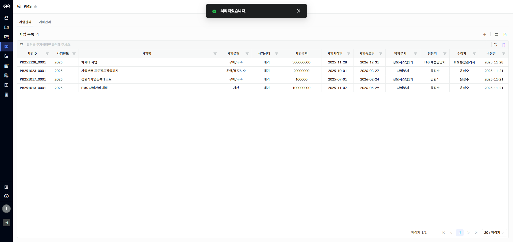

▶ \[그림3\] 사업 관리 등록 – 등록 완료

사업 관리 수정

사업 목록에서 “사업ID” , “사업연도” , “사업명”을 클릭하면 수정이 가능한 상세화면(드로어)가 열립니다.

사업 관리 정보와 연결된 연관서비스, 연관계약정보, 연관자산정보, 연관구성정보, 첨부파일 조회가 가능합니다.

<table>
<tbody>
<tr class="odd">
<td>
노트

지정된 권한이 있는 사용자만 사업관리를 수정할 수 있습니다.
</td>
</tr>
</tbody>
</table>

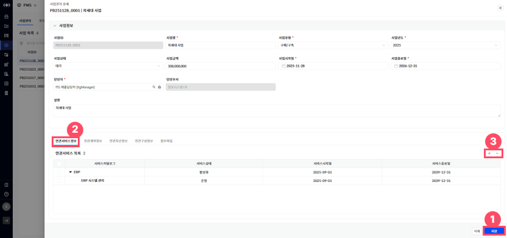

> ▶ \[그림4\] 사업관리 상세 화면(드로어) – 연관서비스(탭)
> 
> 상세 정보

<table>
<thead>
<tr class="header">
<th>[그림 4].“1” 
저장</th>
<th>저장 버튼 클릭을 통해 사업 관리를 저장할 수 있습니다.</th>
</tr>
</thead>
<tbody>
<tr class="odd">
<td>[그림 4].“2” 
연관서비스 탭</td>
<td>해당 사업 관리에 연결된 서비스카탈로그를 조회할 수 있습니다.</td>
</tr>
<tr class="even">
<td>[그림 <strong>4</strong>].“3” 
<strong>추가, 삭제</strong></td>
<td>해당 사업 관리에 서비스카탈로그를 추가 및 삭제할 수 있습니다.</td>
</tr>
</tbody>
</table>

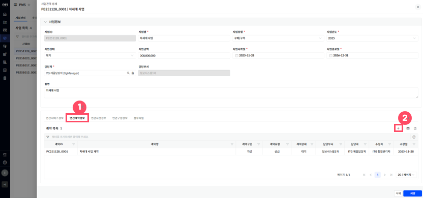

> ▶ \[그림5\] 사업관리 상세화면(드로어) – 연관계약정보(탭)
> 
> 화면 지표(계약 목록)

<table>
<thead>
<tr class="header">
<th>계약ID</th>
<th>계약의 고유식별을 위한 ID 값입니다.</th>
</tr>
</thead>
<tbody>
<tr class="odd">
<td>계약명</td>
<td>계약을 식별할 수 있는 명칭입니다.</td>
</tr>
<tr class="even">
<td>계약구분</td>
<td>
해당 계약이 어떤 성격의 계약인지를 구분하기 위한 항목입니다.

- 기성 : 월별·분기별 등 정해진 기간(주기)에 따라 그 기간 동안 수행된 업무량 또는 계약 조건에 따라 금액을 분할하여 청구·지급하는 방식의 계약입니다. 사업 전체 완료 이전에도 정기적으로 대금 정산이 이루지는 방식을 의미합니다.

- 준공 : 전체 사업이 최종 완료된 시점에 일괄적으로 대금을 청구하고 지급하는 방식의 계약입니다. 중간 정산 없이 최종 산출물 검수 완료 후 대금 정산이 이루어지는 방식을 의미합니다.
</td>
</tr>
<tr class="odd">
<td>계약유형</td>
<td>
계약이 어떤 형태로 체결되었는지를 구분하기 위한 항목입니다.

- 공급 : 제품, 장비, 소프트웨어 라이선스 등 특정 물품 또는 솔루션을 제공하는 형태의 계약유형을 의미합니다.

- 유지보수 : 이미 구축·납품된 시스템을 안정적으로 운영하기 위해 장애 대응, 패치 적용, 정기 점검, 기술 지원 등을 수행하는 형태의 계약유형을 의미합니다.

- 운영 : 시스템을 실제 서비스 환경에서 지속적으로 운영·관리하는 업무를 수행하는 형태의 계약유형을 의미합니다.
</td>
</tr>
<tr class="even">
<td>계약상태</td>
<td>
계약의 진행 상태를 나타냅니다.

- 기획 : 신규 계약 등록 시 기획 상태로 기본 설정이 되며, 계약이 승인되기 전 상태를 의미합니다.

- 승인 : 계약이 내부적으로 승인 허가를 받은 상태를 의미합니다.

- 수행 : 계약이 실제로 진행되고 있는 상태를 의미합니다.

- 준공 : 계약에 연관된 작업이 모두 완료된 상태를 의미합니다.

- 종료 : 계약이 종료된 상태를 의미합니다.
</td>
</tr>
<tr class="odd">
<td>담당부서/담당자</td>
<td>해당 계약을 관리·운영하는 부서와 실제 업무 담당자를 표시합니다.</td>
</tr>
<tr class="even">
<td>수정자/수정일</td>
<td>계약을 마지막으로 수정한 사용자와 그 일자 정보입니다.</td>
</tr>
</tbody>
</table>

> 상세 정보(연관계약정보 탭)

<table>
<thead>
<tr class="header">
<th>[그림 5].“1” 
연관계약정보 탭</th>
<th>해당 사업에 연결된 계약목록을 조회 및 수정이 가능합니다.</th>
</tr>
</thead>
<tbody>
<tr class="odd">
<td>[그림 5].“2” 
<strong>계약 추가</strong></td>
<td>해당 <strong>사업</strong>에 연결할 계약을 신규 등록 가능합니다.</td>
</tr>
</tbody>
</table>

> ▶ \[그림6\] 사업관리 상세화면(드로어) – 연관자산정보(탭)
> 
> 화면 지표(자산정보 목록)

<table>
<thead>
<tr class="header">
<th>자산ID</th>
<th>자산의 고유식별을 위한 ID 값입니다.</th>
</tr>
</thead>
<tbody>
<tr class="odd">
<td>자산명</td>
<td>자산을 식별할 수 있는 명칭입니다.</td>
</tr>
<tr class="even">
<td>자산분류체계정보</td>
<td>자산의 분류 체계이며 다단계 계층구조로 정의되어 있습니다.</td>
</tr>
<tr class="odd">
<td>자산상태</td>
<td>
자산의 상태정보입니다.

- 입고 : 자산이 설치되어 운영되기전 들여온 상태입니다.

- 운영 : 자산이 설치되어 운영중인 상태입니다.

- 보류 : 자산이 운영되지 않고 정지 중 인 상태입니다.

- 폐기 : 자산이 폐기처리 된 상태입니다.
</td>
</tr>
<tr class="even">
<td>모델</td>
<td>자산 제품정보입니다.</td>
</tr>
</tbody>
</table>

> 상세 정보(자산정보 탭)

<table>
<thead>
<tr class="header">
<th>[그림 6].“1” 
자산정보 탭</th>
<th>해당 사업관리에 연결된 자산정보를 조회할 수 있습니다.</th>
</tr>
</thead>
<tbody>
<tr class="odd">
<td>[그림 6].“2” 
자산분류체계 트리</td>
<td>화면 좌측에 자산분류체계 트리 클릭 시 해당 분류만 조회할 수 있습니다.</td>
</tr>
</tbody>
</table>

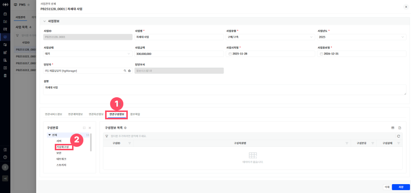

> ▶ \[그림7\] 사업관리 상세화면(드로어) – 연관구성정보(탭)
> 
> 화면 지표(구성정보 목록)

<table>
<thead>
<tr class="header">
<th>구성ID</th>
<th>구성의 고유식별을 위한 ID 값입니다.</th>
</tr>
</thead>
<tbody>
<tr class="odd">
<td>구성자원명</td>
<td>구성을 식별할 수 있는 명칭입니다.</td>
</tr>
<tr class="even">
<td>구성분류</td>
<td>구성의 분류체계입니다.</td>
</tr>
<tr class="odd">
<td>구성상태</td>
<td>
구성의 관리 상태 정보입니다.

- 사용 : 작업관리 등록 가능한 상태입니다.

- 정지 : 작업관리 등록 불가, 기존에 등록된 구성 조회용도로만 사용되는 상태입니다.
</td>
</tr>
</tbody>
</table>

> 상세 정보(구성정보 탭)

<table>
<thead>
<tr class="header">
<th>[그림 7].“1” 
구성정보 탭</th>
<th>해당 사업관리에 연결된 구성정보를 조회할 수 있습니다.</th>
</tr>
</thead>
<tbody>
<tr class="odd">
<td>[그림 7].“2” 
구성분류 트리</td>
<td>화면 좌측에 구성분류 트리 클릭 시 해당 분류만 조회할 수 있습니다.</td>
</tr>
</tbody>
</table>

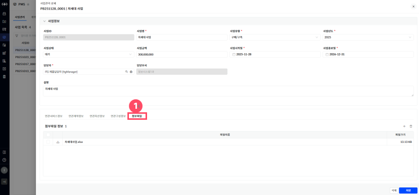

> ▶ \[그림8\] 사업관리 상세화면(드로어) – 첨부파일(탭)
> 
> 화면 지표(첨부파일 정보 목록)

| 다운로드 버튼 | 첨부된 파일을 다운로드 할 수 있습니다.                            |
| ------- | ------------------------------------------------- |
| 파일이름    | 첨부된 파일의 이름을 표시하며, 사용자가 업로드한 원본 파일명을 확인할 수 있습니다.   |
| 파일크기    | 첨부파일의 용량을 나타내며, 파일을 다운로드하거나 관리할 때 참고할 수 있는 정보입니다. |

> 상세 정보(첨부파일 탭)

<table>
<tbody>
<tr class="odd">
<td>[그림 8].“1” 
첨부파일 탭</td>
<td>해당 사업관리에 연결된 첨부파일을 조회할 수 있으며, 파일을 추가하거나 다운로드할 수 있습니다.</td>
</tr>
</tbody>
</table>

사업관리 삭제

사업관리 상세화면(드로어)에서 \[삭제\] 버튼을 클릭하여 사업을 삭제할 수 있습니다.

<table>
<tbody>
<tr class="odd">
<td>
노트

지정된 권한이 있는 사용자만 사업을 삭제할 수 있습니다.
</td>
</tr>
</tbody>
</table>

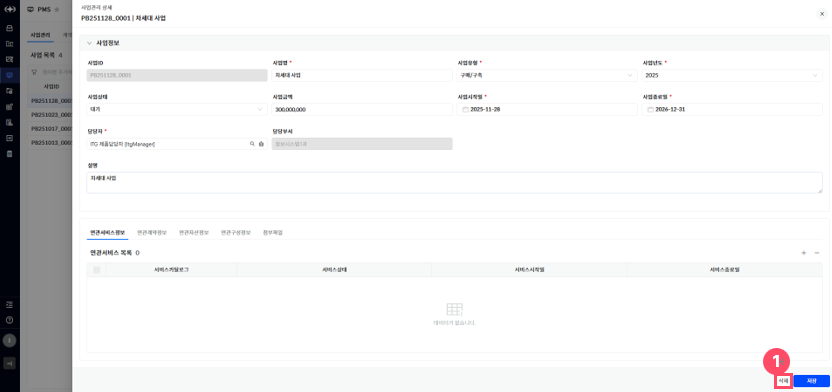

> ▶ \[그림9\] 사업관리 상세 화면(드로어)
> 
> 상세 정보

<table>
<tbody>
<tr class="odd">
<td>[그림 9].“1” 
삭제</td>
<td>삭제 버튼 클릭을 통해 사업을 삭제할 수 있습니다.</td>
</tr>
</tbody>
</table>

PMS – 계약관리

\[PMS\] 메뉴에서 \[계약관리\] 탭을 선택하면, 계약 목록 조회 및 신규 등록 또는 정보 수정을 할 수 있습니다.

<table>
<tbody>
<tr class="odd">
<td>
노트

계약관리 정보 수정은 권한이 부여된 사용자만 가능합니다.
</td>
</tr>
</tbody>
</table>

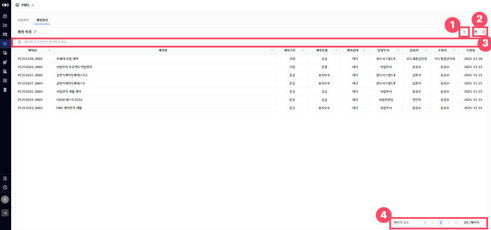

> ▶ \[그림10\] 계약 목록
> 
> 화면 지표(계약 목록)

<table>
<thead>
<tr class="header">
<th>계약ID</th>
<th>계약을 구분하기 위한 고유식별을 위한 ID 값입니다.</th>
</tr>
</thead>
<tbody>
<tr class="odd">
<td>계약명</td>
<td>등록된 계약의 명칭을 표시합니다.</td>
</tr>
<tr class="even">
<td>계약구분</td>
<td>
해당 계약이 어떤 성격의 계약인지를 구분하기 위한 항목입니다.

- 기성 : 월별·분기별 등 정해진 기간(주기)에 따라 그 기간 동안 수행된 업무량 또는 계약 조건에 따라 금액을 분할하여 청구·지급하는 방식의 계약입니다. 사업 전체 완료 이전에도 정기적으로 대금 정산이 이루지는 방식을 의미합니다.

- 준공 : 전체 사업이 최종 완료된 시점에 일괄적으로 대금을 청구하고 지급하는 방식의 계약입니다. 중간 정산 없이 최종 산출물 검수 완료 후 대금 정산이 이루어지는 방식을 의미합니다.
</td>
</tr>
<tr class="odd">
<td>계약유형</td>
<td>
계약이 어떤 형태로 체결되었는지를 구분하기 위한 항목입니다.

- 공급 : 제품, 장비, 소프트웨어 라이선스 등 특정 물품 또는 솔루션을 제공하는 형태의 계약유형을 의미합니다.

- 유지보수 : 이미 구축·납품된 시스템을 안정적으로 운영하기 위해 장애 대응, 패치 적용, 정기 점검, 기술 지원 등을 수행하는 형태의 계약유형을 의미합니다.

- 운영 : 시스템을 실제 서비스 환경에서 지속적으로 운영·관리하는 업무를 수행하는 형태의 계약유형을 의미합니다.
</td>
</tr>
<tr class="even">
<td>계약상태</td>
<td>
계약의 진행 상태를 나타냅니다.

- 기획 : 신규 계약 등록 시 기획 상태로 기본 설정이 되며, 계약이 승인되기 전 상태를 의미합니다.

- 승인 : 계약이 내부적으로 승인 허가를 받은 상태를 의미합니다.

- 수행 : 계약이 실제로 진행되고 있는 상태를 의미합니다.

- 준공 : 계약에 연관된 작업이 모두 완료된 상태를 의미합니다.

- 종료 : 계약이 종료된 상태를 의미합니다.
</td>
</tr>
<tr class="odd">
<td>담당부서/담당자</td>
<td>해당 계약을 관리·운영하는 부서와 실제 업무 담당자를 표시합니다.</td>
</tr>
<tr class="even">
<td>수정자/수정일</td>
<td>계약을 마지막으로 수정한 사용자와 그 일자 정보입니다.</td>
</tr>
</tbody>
</table>

> 상세 정보

<table>
<thead>
<tr class="header">
<th>[그림10].”1” 
등록</th>
<th>등록 버튼을 클릭하면 계약관리 등록 화면(드로어)이 열립니다.</th>
</tr>
</thead>
<tbody>
<tr class="odd">
<td>[그림10].”2” 
컬럼수정 &amp; 엑셀저장</td>
<td>표시할 컬럼을 선택하거나 숨길 수 있는 설정 기능을 제공하는 컬럼수정 버튼과, 현재 화면에 표시된 데이터를 엑셀파일로 다운로드 하는 기능을 제공하는 엑셀저장 버튼입니다.</td>
</tr>
<tr class="even">
<td>[그림10].”3” 
그리드 필터</td>
<td>그리드 필터는 상단 행(필터 행)을 통해 각 컬럼 단위로 상세한 조건 검색이 가능한 기능입니다.</td>
</tr>
<tr class="odd">
<td>[그림10].”4” 
페이징</td>
<td>목록 데이터를 구간별로 나누어 페이지 단위로 조회할 수 있도록 도와주는 기능입니다.</td>
</tr>
</tbody>
</table>

계약관리 등록

계약관리 등록 및 수정은 권한이 부여된 사용자만 가능합니다.  
신규 등록을 진행하려면, 계약 목록의 \[등록\] 버튼(\[그림10\]-1)을 클릭하면 등록 화면(드로어)이 열립니다.

<table>
<tbody>
<tr class="odd">
<td>
노트

계약관리 등록 시, ‘계약ID’는 자동으로 채번되며, 상태는 ‘기획’으로 등록됩니다.
</td>
</tr>
</tbody>
</table>

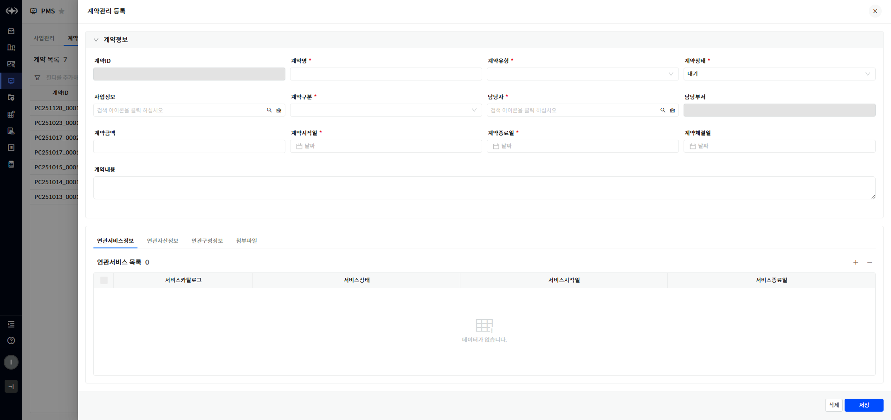

> ▶ \[그림11\] 계약관리 등록 화면(드로어)
> 
> 화면 지표(기본정보)

<table>
<thead>
<tr class="header">
<th>계약ID</th>
<th>계약을 구분하기 위한 고유식별을 위한 ID 값입니다.</th>
</tr>
</thead>
<tbody>
<tr class="odd">
<td>계약명</td>
<td>등록된 계약의 명칭을 표시합니다.</td>
</tr>
<tr class="even">
<td>계약유형</td>
<td>
계약이 어떤 형태로 체결되었는지를 구분하기 위한 항목입니다.

- 공급 : 제품, 장비, 소프트웨어 라이선스 등 특정 물품 또는 솔루션을 제공하는 형태의 계약유형을 의미합니다.

- 유지보수 : 이미 구축·납품된 시스템을 안정적으로 운영하기 위해 장애 대응, 패치 적용, 정기 점검, 기술 지원 등을 수행하는 형태의 계약유형을 의미합니다.

- 운영 : 시스템을 실제 서비스 환경에서 지속적으로 운영·관리하는 업무를 수행하는 형태의 계약유형을 의미합니다.
</td>
</tr>
<tr class="odd">
<td>계약상태</td>
<td>
계약의 진행 상태를 나타냅니다.

- 기획 : 신규 계약 등록 시 기획 상태로 기본 설정이 되며, 계약이 승인되기 전 상태를 의미합니다.

- 승인 : 계약이 내부적으로 승인 허가를 받은 상태를 의미합니다.

- 수행 : 계약이 실제로 진행되고 있는 상태를 의미합니다.

- 준공 : 계약에 연관된 작업이 모두 완료된 상태를 의미합니다.

- 종료 : 계약이 종료된 상태를 의미합니다.
</td>
</tr>
<tr class="even">
<td>사업정보</td>
<td>해당 계약이 연결된 사업의 정보를 표시합니다.</td>
</tr>
<tr class="odd">
<td>계약구분</td>
<td>
해당 계약이 어떤 성격의 계약인지를 구분하기 위한 항목입니다.

- 기성 : 월별·분기별 등 정해진 기간(주기)에 따라 그 기간 동안 수행된 업무량 또는 계약 조건에 따라 금액을 분할하여 청구·지급하는 방식의 계약입니다. 사업 전체 완료 이전에도 정기적으로 대금 정산이 이루지는 방식을 의미합니다.

- 준공 : 전체 사업이 최종 완료된 시점에 일괄적으로 대금을 청구하고 지급하는 방식의 계약입니다. 중간 정산 없이 최종 산출물 검수 완료 후 대금 정산이 이루어지는 방식을 의미합니다.
</td>
</tr>
<tr class="even">
<td>담당부서/담당자</td>
<td>해당 계약을 관리·운영하는 부서와 실제 업무 담당자를 표시합니다.</td>
</tr>
<tr class="odd">
<td>계약금액</td>
<td>해당 계약에 배정된 총 금액입니다.</td>
</tr>
<tr class="even">
<td>계약시작일/계약종료일</td>
<td>계약의 효력이 발생하는 시작일과 종료일을 나타내며, 계약 기간을 확인하는 데 사용됩니다.</td>
</tr>
<tr class="odd">
<td>계약체결일</td>
<td>해당 계약이 공식적으로 체결된 날짜를 의미합니다.</td>
</tr>
<tr class="even">
<td>계약내용</td>
<td>계약의 주요 내용, 조건, 범위 등을 기술한 항목으로, 계약의 상세 사항을 확인할 수 있습니다.</td>
</tr>
</tbody>
</table>

> 계약 등록 절차

1.  계약 목록 우측 상단의 등록 버튼(\[그림10\].”1”)을 클릭합니다.

2.  화면(\[그림11\])의 필수 항목(\[ \* \] 모양의 표식이 되어있는 항목)을 입력합니다.

3.  화면 우측 하단의 \[저장\]버튼 클릭합니다.

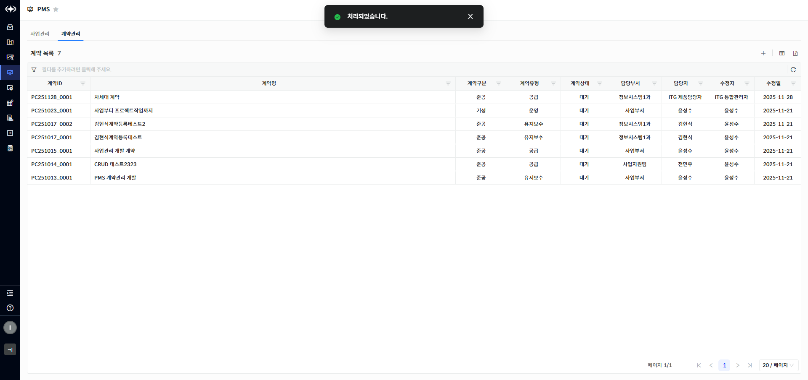

> ▶ \[그림12\] 계약 관리 등록 – 등록 완료

계약 관리 수정

계약 목록에서 “계약ID”, “계약명”을 클릭하면 수정이 가능한 상세화면(드로어)가 열립니다.

계약 관리 정보와 연결된 요구사항, 연관서비스정보, 연관자산정보, 연관구성정보, 첨부파일 조회가 가능합니다.

<table>
<tbody>
<tr class="odd">
<td>
노트

지정된 권한이 있는 사용자만 계약관리를 수정할 수 있습니다.
</td>
</tr>
</tbody>
</table>

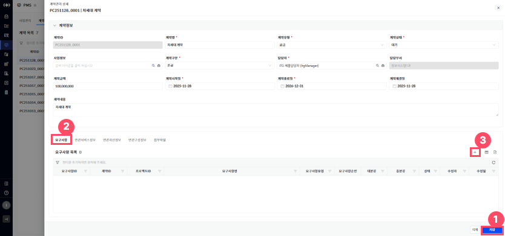

> ▶ \[그림13\] 계약관리 상세 화면(드로어) – 요구사항(탭)
> 
> 상세 정보

<table>
<thead>
<tr class="header">
<th>[그림 13].“1” 
저장</th>
<th>저장 버튼 클릭을 통해 계약 관리를 저장할 수 있습니다.</th>
</tr>
</thead>
<tbody>
<tr class="odd">
<td>[그림 13].“2” 
요구사항 탭</td>
<td>해당 계약에 연결된 요구사항을 조회하거나 수정할 수 있습니다.</td>
</tr>
<tr class="even">
<td>[그림 13].“3” 
요구사항 추가</td>
<td>요구사항을 신규 등록할 수 있습니다.</td>
</tr>
</tbody>
</table>

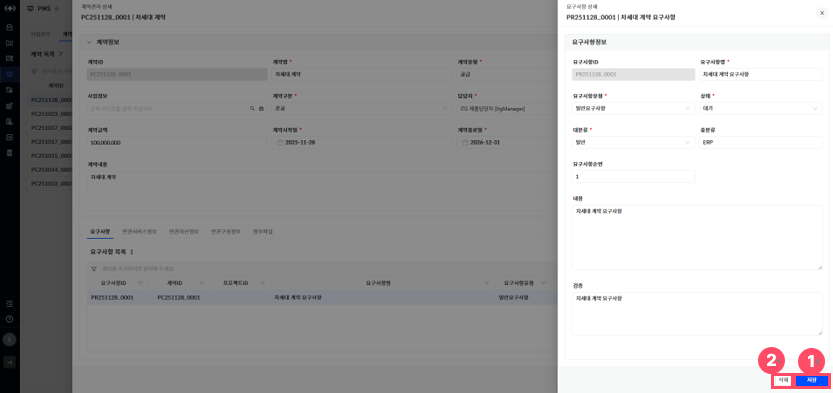

> ▶ \[그림14\] 계약관리 상세 화면(드로어) – 요구사항(탭) – 요구사항 상세
> 
> 화면 지표(기본정보)

<table>
<thead>
<tr class="header">
<th>요구사항ID</th>
<th>요구사항을 식별하기 위한 고유 ID 값입니다.</th>
</tr>
</thead>
<tbody>
<tr class="odd">
<td>요구사항명</td>
<td>요구사항의 제목을 표시합니다.</td>
</tr>
<tr class="even">
<td>요구사항유형</td>
<td>
요구사항을 구분하기 위한 항목입니다.

- 일반요구사항 : 사업 전반에 공통적으로 적용되는 요구사항으로, 특정 기능이나 작업에 한정되지 않고 전체 프로젝트 또는 시스템 전반에서 준수해야 하는 기준, 정책, 환경 조건 등을 의미합니다.

- 과업요구사항 : 해당 사업에서 수행해야 할 구체적인 작업 혹은 기능과 직접적으로 연결된 요구사항입니다. 개발, 설계, 인터페이스, 보고서 작성 등 실제 수행 대상 과업에 필요한 세부 기능 및 절차를 정의합니다.
</td>
</tr>
<tr class="odd">
<td>상태</td>
<td>
요구사항의 진행 상태를 나타냅니다.

- 대기 : 신규 등록 시 초기 상태 값이며 요구사항이 정의하는 단계를 의미합니다.

- 요청 : 요구사항 정의가 완료된 후 사용을 하기 위해 확정을 요구하는 단계를 의미합니다.

- 통과 : 요구사항이 확정된 단계를 의미합니다.

- 미흡 : 요구사항의 재정의가 필요한 단계를 의미합니다.
</td>
</tr>
<tr class="even">
<td>대분류</td>
<td>
요구사항을 상위 범주 기준으로 분류하는 항목입니다.

- 일반 : 일반 요구사항을 의미합니다.

- 추가 : 신규로 추가된 요구사항을 의미합니다.

- 변경 : 기존 요구사항이 변경된 요구사항을 의미합니다.
</td>
</tr>
<tr class="odd">
<td>중분류</td>
<td>대분류 아래에서 한 단계 더 세부적으로 요구사항을 분류하는 항목입니다.</td>
</tr>
<tr class="even">
<td>요구사항순번</td>
<td>요구사항이 목록 내에서 정렬되는 순번입니다.</td>
</tr>
<tr class="odd">
<td>내용</td>
<td>요구사항에 대한 상세 설명을 기재하는 항목입니다.</td>
</tr>
<tr class="even">
<td>검증</td>
<td>해당 요구사항이 충족되었는지를 확인하는 검증하는 항목입니다.</td>
</tr>
</tbody>
</table>

> 상세 정보

<table>
<thead>
<tr class="header">
<th>[그림 14].“1” 
저장</th>
<th>해당 계약 관리의 요구사항을 저장할 수 있습니다.</th>
</tr>
</thead>
<tbody>
<tr class="odd">
<td>[그림 14].“2” 
삭제</td>
<td>해당 계약 관리의 요구사항을 삭제할 수 있습니다.</td>
</tr>
</tbody>
</table>

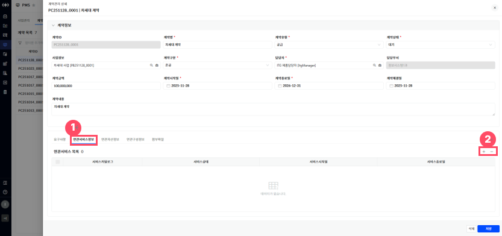

> ▶ \[그림15\] 계약관리 상세 화면(드로어) – 연관서비스(탭)
> 
> 상세 정보

<table>
<thead>
<tr class="header">
<th>[그림 15].“1” 
연관서비스 탭</th>
<th>해당 계약 관리에 연결된 서비스카탈로그를 조회할 수 있습니다.</th>
</tr>
</thead>
<tbody>
<tr class="odd">
<td>[그림 <strong>15</strong>].“2” 
<strong>추가, 삭제</strong></td>
<td>해당 계약 관리에 서비스카탈로그를 추가 및 삭제할 수 있습니다.</td>
</tr>
</tbody>
</table>

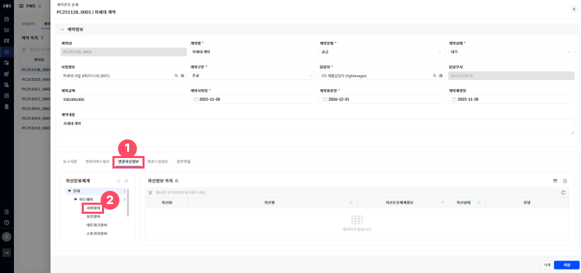

> ▶ \[그림16\] 계약관리 상세화면(드로어) – 연관자산정보(탭)
> 
> 화면 지표(자산정보 목록)

<table>
<thead>
<tr class="header">
<th>자산ID</th>
<th>자산의 고유식별을 위한 ID 값입니다.</th>
</tr>
</thead>
<tbody>
<tr class="odd">
<td>자산명</td>
<td>자산을 식별할 수 있는 명칭입니다.</td>
</tr>
<tr class="even">
<td>자산분류체계정보</td>
<td>자산의 분류 체계이며 다단계 계층구조로 정의되어 있습니다.</td>
</tr>
<tr class="odd">
<td>자산상태</td>
<td>
자산의 상태정보입니다.

- 입고 : 자산이 설치되어 운영되기전 들여온 상태입니다.

- 운영 : 자산이 설치되어 운영중인 상태입니다.

- 보류 : 자산이 운영되지 않고 정지 중 인 상태입니다.

- 폐기 : 자산이 폐기처리 된 상태입니다.
</td>
</tr>
<tr class="even">
<td>모델</td>
<td>자산 제품정보입니다.</td>
</tr>
</tbody>
</table>

> 상세 정보(자산정보 탭)

<table>
<thead>
<tr class="header">
<th>[그림 16].“1” 
자산정보 탭</th>
<th>해당 계약관리에 연결된 자산정보를 조회할 수 있습니다.</th>
</tr>
</thead>
<tbody>
<tr class="odd">
<td>[그림 16].“2” 
자산분류체계 트리</td>
<td>화면 좌측에 자산분류체계 트리 클릭 시 해당 분류만 조회할 수 있습니다.</td>
</tr>
</tbody>
</table>

> ▶ \[그림17\] 계약관리 상세화면(드로어) – 연관구성정보(탭)
> 
> 화면 지표(구성정보 목록)

<table>
<thead>
<tr class="header">
<th>구성ID</th>
<th>구성의 고유식별을 위한 ID 값입니다.</th>
</tr>
</thead>
<tbody>
<tr class="odd">
<td>구성자원명</td>
<td>구성을 식별할 수 있는 명칭입니다.</td>
</tr>
<tr class="even">
<td>구성분류</td>
<td>구성의 분류체계입니다.</td>
</tr>
<tr class="odd">
<td>구성상태</td>
<td>
구성의 관리 상태 정보입니다.

- 사용 : 작업관리 등록 가능한 상태입니다.

- 정지 : 작업관리 등록 불가, 기존에 등록된 구성 조회용도로만 사용되는 상태입니다.
</td>
</tr>
</tbody>
</table>

> 상세 정보(구성정보 탭)

<table>
<thead>
<tr class="header">
<th>[그림 17].“1” 
구성정보 탭</th>
<th>해당 계약관리에 연결된 구성정보를 조회할 수 있습니다.</th>
</tr>
</thead>
<tbody>
<tr class="odd">
<td>[그림 17].“2” 
구성분류 트리</td>
<td>화면 좌측에 구성분류 트리 클릭 시 해당 분류만 조회할 수 있습니다.</td>
</tr>
</tbody>
</table>

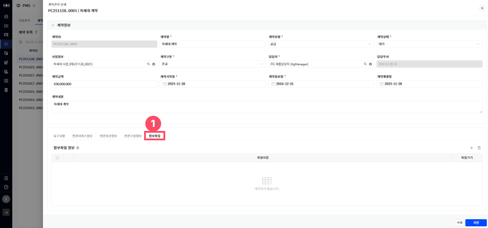

> ▶ \[그림18\] 계약관리 상세화면(드로어) – 첨부파일(탭)
> 
> 화면 지표(첨부파일 정보 목록)

| 다운로드 버튼 | 첨부된 파일을 다운로드 할 수 있습니다.                            |
| ------- | ------------------------------------------------- |
| 파일이름    | 첨부된 파일의 이름을 표시하며, 사용자가 업로드한 원본 파일명을 확인할 수 있습니다.   |
| 파일크기    | 첨부파일의 용량을 나타내며, 파일을 다운로드하거나 관리할 때 참고할 수 있는 정보입니다. |

> 상세 정보(첨부파일 탭)

<table>
<tbody>
<tr class="odd">
<td>[그림 18].“1” 
첨부파일 탭</td>
<td>해당 계약관리에 연결된 첨부파일을 조회할 수 있으며, 파일을 추가하거나 다운로드할 수 있습니다.</td>
</tr>
</tbody>
</table>

계약관리 삭제

계약관리 상세화면(드로어)에서 \[삭제\] 버튼을 클릭하여 계약을 삭제할 수 있습니다.

<table>
<tbody>
<tr class="odd">
<td>
노트

지정된 권한이 있는 사용자만 계약을 삭제할 수 있습니다.
</td>
</tr>
</tbody>
</table>

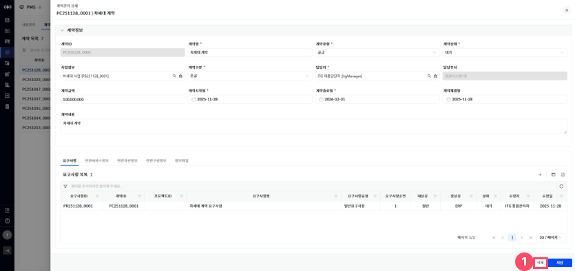

> ▶ \[그림19\] 계약관리 상세 화면(드로어)
> 
> 상세 정보

<table>
<tbody>
<tr class="odd">
<td>[그림 19].“1” 
삭제</td>
<td>삭제 버튼 클릭을 통해 계약을 삭제할 수 있습니다.</td>
</tr>
</tbody>
</table>

