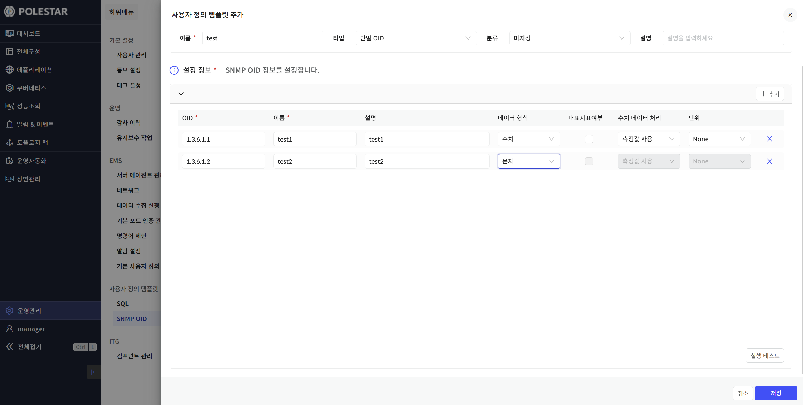
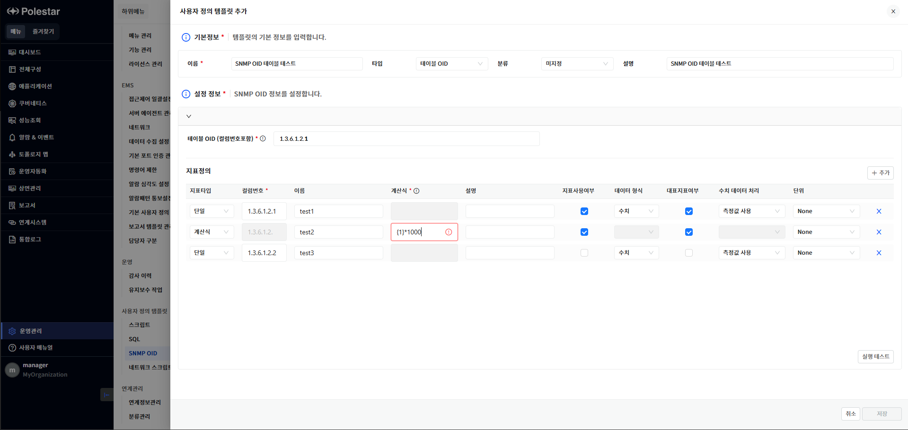
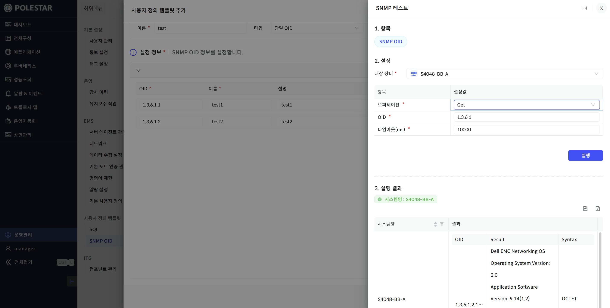
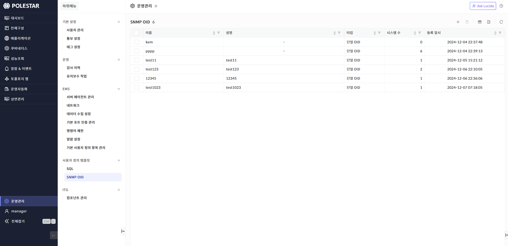
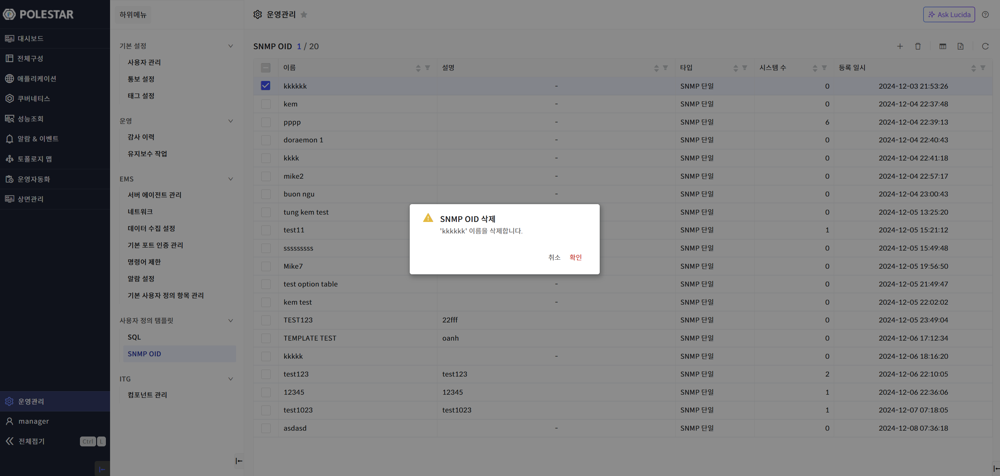
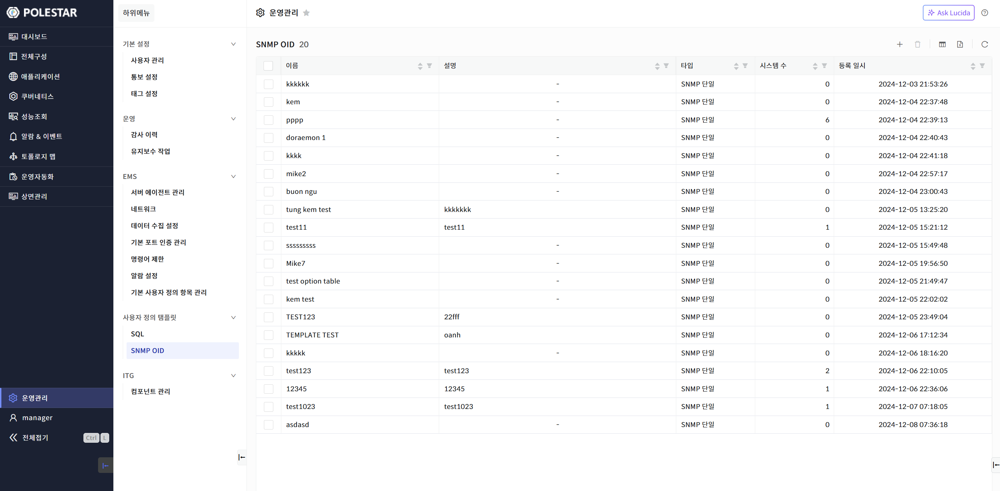

SNMP OID 템플릿

사용자 정의 SNMP OID를 사용하려면 먼저 SNMP OID 템플릿을 정의해야 합니다.

<table>
<tbody>
<tr class="odd">
<td>
노트

이미 정의된 SNMP OID 템플릿이 존재하는 경우에만 사용자 정의 SNMP OID를 네트워크 장비에 추가할 수 있습니다.

타입별로 템플릿의 등록방식이 다릅니다.

<strong>단일 OID</strong> : 하나의 리소스를 만들고 각각의 OID를 지표화할 수 있습니다.

<strong>테이블 OID</strong> : 테이블형태의 하위 리소스를 생성합니다. 입력한 테이블 OID를 기반으로 지표를 정의할 수 있으며 각각의 지표는 하위 리소스에서 지표화할 수 있습니다.
</td>
</tr>
</tbody>
</table>

> ▶ \[그림1\] SNMP OID(단일) 템플릿 등록

> ▶ \[그림2\] SNMP OID(테이블) 템플릿 등록
> 
> 기본정보

| 이름 | SNMP OID 템플릿의 이름을 입력합니다.                          |
| -- | ------------------------------------------------- |
| 타입 | SNMP OID 템플릿의 타입을 선택합니다. (단일 OID, 테이블 OID )       |
| 분류 | SNMP OID 템플릿의 분류를 설정합니다.(미지정, 구성, 성능, 변경, 동작, 점검) |
| 설명 | SNMP OID 템플릿의 설명을 입력합니다.                          |

> SNMP OID 단일 설정정보

| OID      | 모니터링 하려는 SNMP OID를 입력합니다.                      |
| -------- | ---------------------------------------------- |
| 이름       | 지표명을 입력합니다.                                    |
| 설명       | 지표의 설명을 입력합니다.                                 |
| 데이터형식    | SNMP OID 응답의 데이터 형식을 선택합니다. (수치, 문자)           |
| 대표지표여부   | 성능정보 차트에 표시할 지표를 선택합니다. (최대4개)                 |
| 수치데이터 처리 | 수집한 수치 데이터 처리 방식을 선택합니다. (측정값사용, 상향변화량, 하향변화량) |
| 단위       | 지표의 단위를 선택합니다.                                 |

> SNMP OID 테이블 설정정보

<table>
<thead>
<tr class="header">
<th>테이블OID 
(컬럼번호포함)</th>
<th>GetSubtree를 수행하기 위한 테이블 OID 정보를 입력합니다. (수행 결과는 리소스의 이름으로 표시합니다.)</th>
</tr>
</thead>
<tbody>
<tr class="odd">
<td>지표타입</td>
<td>
단일 : 단순 OID 에 대한 결과를 지표화 합니다.

계산식 : 단일에서 설정한 컬럼번호를 활용하여 계산식으로 지표화 합니다.
</td>
</tr>
<tr class="even">
<td>컬럼번호</td>
<td>수집하려는 SNMP OID 번호로 테이블 OID부분을 제외한 컬럼 번호만 입력합니다.</td>
</tr>
<tr class="odd">
<td>이름</td>
<td>지표명을 입력합니다.</td>
</tr>
<tr class="even">
<td>계산식</td>
<td>
지표타입이 계산식일 경우 컬럼번호를 기준으로 계산식을 입력합니다.

(ex) 지표타입 단일에서 컬럼번호 “1” 을 설정하였다면 {1} * 1000 으로 설정 가능합니다.
</td>
</tr>
<tr class="odd">
<td>설명</td>
<td>지표의 설명을 입력합니다.</td>
</tr>
<tr class="even">
<td>지표사용여부</td>
<td>OID 수집 시 지표화 하여 데이터를 저장할지 여부를 체크합니다.(계산식 용도로만 사용하기 위해서는 지표사용여부를 체크하지 않습니다.)</td>
</tr>
<tr class="odd">
<td>데이터형식</td>
<td>데이터 형식을 선택합니다. (수치, 문자)</td>
</tr>
<tr class="even">
<td>대표지표여부</td>
<td>성능정보 차트에 표시할 지표를 선택합니다. (최대4개)</td>
</tr>
<tr class="odd">
<td>수치데이터 처리</td>
<td>수집한 수치 데이터 처리 방식을 선택합니다. (측정값사용, 상향변화량, 하향변화량)</td>
</tr>
<tr class="even">
<td>단위</td>
<td>지표의 단위를 선택합니다.</td>
</tr>
</tbody>
</table>

실행 테스트

\[실행 테스트\] 버튼을 클릭하면 SNMP 테스트 드로어가 나타납니다. 테스트를 통해 설정한 SNMP OID가 실제 등록되어 있는 네트워크 장비에서 정상적으로 동작하는지 확인할 수 있습니다.

▶ \[그림3\] SNMP OID 실행 테스트

| 대상 장비 | SNMP OID 실행 테스트를 수행할 네트워크 장비를 선택합니다.             |
| ----- | ------------------------------------------------ |
| 오퍼레이션 | SNMP 오퍼레이션 방식을 선택합니다. (Get, GetNext, GetSubtree) |
| OID   | SNMP OID 를 입력합니다.                                |
| 타임아웃  | SNMP 타임아웃을 설정합니다.                                |
| 실행결과  | 테스트 실행결과를 표시합니다.                                 |

SNMP OID 템플릿 목록

운영관리 \> 사용자 정의 템플릿에서 \[SNMP OID\]를 선택하면 전체 SNMP OID 템플릿 목록을 확인할 수 있습니다. SNMP OID 템플릿 목록을 통해 현재 등록되어 있는 SNMP OID 템플릿 기본 정보를 확인할 수 있으며 해당 화면에서 SNMP OID 템플릿을 삭제할 수 있습니다.

<table>
<tbody>
<tr class="odd">
<td>
노트

사용자 정의 SNMP OID를 배포하기 위하여 템플릿을 작성하는 기능입니다. 작성된 템플릿을 기반으로 장비에서 등록하여 SNMP OID를 수집합니다.
</td>
</tr>
</tbody>
</table>

> ▶ \[그림4\] SNMP OID 템플릿 목록
> 
> SNMP OID 템플릿 목록

| 이름    | SNMP OID 템플릿의 이름을 표시합니다.                    |
| ----- | ------------------------------------------- |
| 설명    | SNMP OID 템플릿의 설명을 표시합니다.                    |
| 타입    | SNMP OID 템플릿의 타입을 표시합니다. (단일 OID, 테이블 OID ) |
| 시스템 수 | SNMP OID 템플릿을 등록한 시스템의 수를 표시합니다.            |
| 등록일시  | SNMP OID 템플릿이 등록된 날짜를 표시합니다.                |

SNMP OID 템플릿 삭제

삭제할 SNMP OID 템플릿을 선택하고 \[삭제\] 버튼을 선택하여 SNMP OID 템플릿을 삭제할 수 있습니다.

▶ \[그림5\] SNMP OID 템플릿 삭제

> SNMP OID 템플릿 삭제 절차

1.  삭제하고자 하는 SNMP OID 템플릿 선택 (다중 선택 가능)

2.  테이블 우측 상단의 삭제 아이콘 클릭

3.  메시지창에서 확인 클릭

엑셀 저장

SNMP OID 템플릿 목록의 우측 상단 \[엑셀 저장\] 버튼을 통해 SNMP OID 템플릿 목록을 엑셀로 저장할 수 있습니다. 그리드 컬럼 검색 기능 등을 통해 엑셀에 보여줄 컬럼과 내용을 원하는 조건에 맞게 필터링하여 저장할 수 있습니다.

▶ \[그림6\] SNMP OID 템플릿 목록 엑셀 저장

> SNMP OID 템플릿 목록 엑셀 저장 및 조회 절차

1.  SNMP OID 템플릿 목록에서 우측 상단 엑셀 저장 아이콘 클릭

2.  브라우저 우측 상단 창에 저장된 엑셀 파일명이 표시됨

3.  해당 파일명을 클릭하여 엑셀 파일 확인

