SQL Server 상세

SQL Server 상세 화면에서는 SQL Server의 성능 정보, 구성 정보를 확인할 수 있으며 세션 및 SQL 수행 이력을 상세 분석할 수 있습니다. 성능 메뉴에서는 카테고리(인스턴스, 세션(프로세스), SQL, 메모리, 로그, Storage)별로 성능을 확인할 수 있습니다. 구성 이력에서는 SQL Server 구성 정보(환경변수, 기동시간 등)의 변경 이력을 확인할 수 있으며 현황 정보에서는 환경변수, 사용자, 데이터/로그 사용량, 데이터베이스 IO 성능 정보를 확인할 수 있습니다. 설정 정보에서는 SQL Server 접속 정보를 수정하거나 역할 및 담당자 등을 설정할 수 있습니다. 세션 분석 메뉴를 통해 SQL Server에 수행된 세션의 현황 및 이력을 분석할 수 있고 Top SQL 분석을 통해 SQL Server에 수행된 SQL 중 성능 지연이 발생된 SQL을 빠르게 찾고 분석할 수 있습니다. 마지막으로 SQL 성능 분석에서는 Top SQL로 수집된 SQL의 성능 지표를 Scatter 차트에 표시하여 한눈에 Top SQL들의 성능을 확인하고 원하는 SQL을 선택하여 분석할 수 있습니다.

SQL Server 인스턴스 성능

SQL Server 인스턴스 성능 화면은 SQL Server 인스턴스의 전반적인 상태, 성능, 효율성 정보를 조회할 수 있는 화면입니다. 상단에 SQL Server 가용성 및 인스턴스 주요 성능 지표가 표시되고 그 밑으로 SQL Server 주요 성능 지표에 대한 차트와 Effciency(효율성) 지표에 대한 현돵 목록이 표시됩니다.

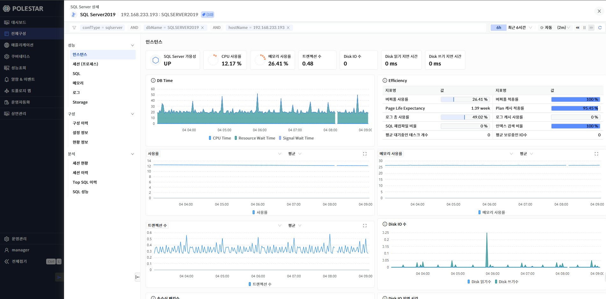

> ▶ \[그림1\] SQL Server 인스턴스 성능

인스턴스 상태

SQL Server의 가용성 및 주요 지표의 현황 정보를 표시합니다.

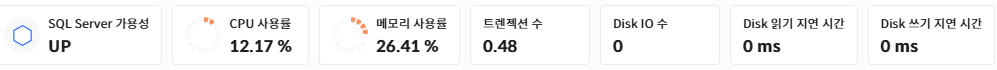

▶ \[그림2\] SQL Server 인스턴스 요약 성능 현황

> 화면 지표

<table>
<thead>
<tr class="header">
<th>가용성</th>
<th>
SQL Server의 현재 접속 가능 상태를 표시합니다.

UP : SQL Server가 현재 정상 접속 가능한 상태입니다.

DOWN: SQL Server에 현재 정상적으로 접속 가능하지 않은 상태입니다.

DOWN은 접속 불가 상태로 SQL Server가 다운된 상황 말고도 과부하로 인한 응답불가, 접속 불가, 네트웍 장애 등 다양한 상황에서 발생될 수 있습니다.
</th>
</tr>
</thead>
<tbody>
<tr class="odd">
<td>CPU 사용률</td>
<td>SQL Server가 사용한 CPU 사용률입니다. CPU 사용률이 높다면 다양한 성능 지표 및 세션, SQL 이력 분석등을 통해 원인을 분석해 볼 필요가 있습니다. 본 제품은 CPU를 많이 사용한 SQL을 찾고 분석할 수 있는 기능을 제공합니다.</td>
</tr>
<tr class="even">
<td>메모리 사용률</td>
<td>SQL Server에 할당된 메모리(Target Memory) 대비 사용된 메모리(Total Memory)의 비율입니다. OS 전체 메모리 대비 사용된 비율이 아닌 점 유의하여야 합니다. 해당 지표가 매우 높거나 평소보다 크게 높아지면 제공되는 다른 성능 지표 및 세션, SQL 이력 분석등을 통해 메모리가 많이 사용되는 원인을 분석할 필요가 있습니다. 본 제품은 메모리를 많이 사용한 세션과 SQL을 찾고 분석할 수 있는 기능을 제공합니다.</td>
</tr>
<tr class="odd">
<td>트랜젝션수</td>
<td>SQL Server의 현재 수행중인 트랜잭션의 수를 표시합니다. 트랜젝션수가 평소대비 많이 높다면 평소보다 Lock된 세션이나 SQL은 없는지 길게 수행되는 SQL이 없는지 등을 분석할 필요가 있습니다. 본 제품은 오래 수행된 SQL을 분석할 수 있는 기능을 제공하며 특히 블로킹을 유발하거나 블록 된 세션을 트리 그리드 형태로 분석 할 수 있는 기능을 제공합니다.</td>
</tr>
<tr class="even">
<td>Disk IO 수</td>
<td>현재 SQL Server의 디스크 읽기, 쓰기 수의 총합을 표시합니다. 이 값이 평소 대비 높다면 관련 성능 지표나 세션, SQL에 대한 분석을 할 필요가 있습니다.</td>
</tr>
<tr class="odd">
<td>Disk 읽기 지연시간</td>
<td>현재 SQL Server의 읽기 지연시간을 표시합니다. 이 값은 보통 0에 가까운 매우 작은 수치여야 하며 이 값이 평소대비 많이 크다면 이에 대한 원인 분석이 필요합니다.</td>
</tr>
<tr class="even">
<td>Disk 쓰기 지연시간</td>
<td>현재 SQL Server의 쓰기 지연시간을 표시합니다. 이 값은 보통 0에 가까운 매우 작은 수치여야 하며 이 값이 평소대비 많이 크다면 이에 대한 원인 분석이 필요합니다.</td>
</tr>
</tbody>
</table>

DB Time 누적 Area 차트

DB Time을 CPU 시간과 대기 시간(Resource 대기, Signal 대기)의 누적 Area 차트로 표현한 차트입니다. 이를 통해 SQL Server가 사용한 시간과 함께 해당 시점 CPU를 많이 사용하였는지 대기를 많이 하였는지 파악 할 수 있습니다. Signal 대기 시간은 CPU를 사용하기 위해 대기한 시간이고 Resource 대기시간은 Signal 대기를 제외한 모든 대기 시간입니다.

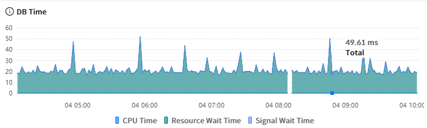

▶ \[그림3\] DB Time 누적 영역 차트

SQL Server Efficiency(효율성) 목록

SQL Server 효율성 지표 값을 통해 현재 SQL Server가 효율적으로 잘 운영되고 있는지 확인할 수 있습니다. 또한 효율성 지표를 통해 성능을 평가하고 문제를 진단하는데 유용하게 사용될 수 있습니다.

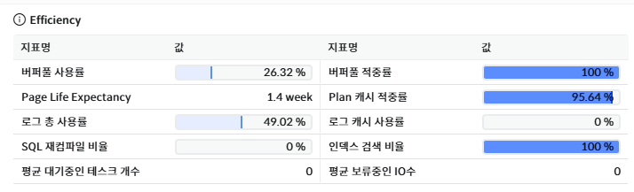

▶ \[그림4\] SQL Server Efficiency(효율성) 목록

> Efficiency 지표

<table>
<thead>
<tr class="header">
<th>버퍼풀 사용률</th>
<th>
버퍼풀(Buffer Pool)은 디스크로부터 읽어온 데이터 페이지를 메모리에 저장하여 디스크 I/O를 줄이고 성능을 향상시키는 역할을 합니다. 버퍼풀 사용률(Buffer Pool Usage)은 현재 버퍼풀에서 사용 중인 데이터 페이지 비율을 나타내며, SQL Server의 메모리 리소스가 얼마나 효율적으로 사용되고 있는지 평가하는 지표입니다.

버퍼풀의 주요 구성 요소: 데이터 캐시, 프로시저 캐시, 로그 캐시

계신식: (Total Server Memory(KB) / Target Server Memory(KB) * 100

Total Server Memory(KB) : 현재 실제로 사용하는 메모리 양

Target Server Memory(KB) : 최대 사용할 수 있는 메모리 양
</th>
</tr>
</thead>
<tbody>
<tr class="odd">
<td>버퍼풀 적중률</td>
<td>
SQL Server가 디스크 대신 메모리(버퍼풀)에서 데이터를 검색한 비율을 나타냅니다. 높은 적중률은 쿼리 수행 시 디스크 I/O가 줄어들어 성능이 향상되었음을 의미합니다.

계산식: (버퍼 캐시 히트 수 / (버퍼 캐시 히트 수 + 버퍼 캐시 미스 수)) * 100
</td>
</tr>
<tr class="even">
<td>Page Life Expectancy</td>
<td>
버퍼풀에서 한 페이지가 제거되기 전에 머무르는 평균 시간입니다.

높은 값: 메모리 여유가 충분하여 페이지가 오래 유지됨

낮은 값: 메모리 부족으로 페이지가 자주 교체됨(디스크 I/O 증가)

전통적으로 PLE 값이 <strong>300 초 이상</strong>을 권장했으나, 이는 서버의 워크로드와 메모리 크기에 따라 달라질 수 있습니다.

계산식: Page life expectancy (성능 카운터)
</td>
</tr>
<tr class="odd">
<td>Plan 캐시 적중률</td>
<td>
SQL Server가 실행 계획(Execution Plan)을 Plan Cache에서 검색하여 재사용하는 비율을 나타냅니다. 높은 적중률은 실행 계획을 효율적으로 재사용하고, 컴파일 비용을 절감하며 서버 성능을 향상시킴을 의미합니다.

높은 적중률: SQL Server가 실행 계획을 재사용하고 있어 컴파일 오버헤드가 줄어듦

낮은 적중률: 쿼리가 자주 새롭게 컴파일됨(Ad-hoc 워크로드 많음)

계산식: (Total Cache Lookups – Total Cache Misses) / Total Cache Lookups * 100

Total Cache Lookups: SQL Server가 Plan Cache에서 실행 계획을 <strong>찾으려고 시도한 총 횟수</strong>

Total Cache Misses: SQL Server가 Plan Cache에서 실행 계획을 찾지 못한 <strong>총 횟수</strong>
</td>
</tr>
<tr class="even">
<td>로그 총 사용률</td>
<td>
데이터베이스의 로그 파일 크기 대비 현재 사용 중인 로그 공간의 비율을 의미합니다.

높은 사용률: 트랜잭션 로그가 가득 차거나, 자동 증가(auto-grow)가 빈번하게 발생

낮은 사용률: 로그 공간이 충분하며 효율적으로 관리되고 있음

계산식: 현재 사용 중인 로그 크기 / 총 로그 크기 * 100
</td>
</tr>
<tr class="odd">
<td>로그 캐시 적중률</td>
<td>
SQL Server에서 트랜잭션 로그(Log Buffer)를 메모리에서 얼마나 효과적으로 사용하고 있는지를 나타내는 성능 지표입니다. 높은 적중률은 로그 쓰기 작업이 메모리에서 처리되어 디스크 I/O가 최소화되고, 성능이 최적화되고 있음을 의미합니다.

계산식: (Total Log Cache Reads -Total Log Cache Misses) / Total Log Cache Reads ×100

Total Log Cache Reads: 로그 버퍼(Log Buffer)**에서 로그 레코드를 읽으려 시도한 총 횟수

Total Log Cache Misses: 로그 버퍼에서 찾지 못해 <strong>디스크 I/O</strong> 작업이 발생한 총 횟수
</td>
</tr>
<tr class="even">
<td>SQL 재컴파일 비율</td>
<td>
SQL Server가 기존 실행 계획을 재사용하지 못하고, 쿼리를 새로 컴파일(최적화)하는 비율입니다. 재컴파일이 과도할 경우 CPU 리소스를 낭비하며 서버 성능 저하를 초래합니다.

재컴파일이 높아지는 사례

1. 통계 변경: 데이터 변경이 많아 통계 업데이트로 재컴파일 발생.

2. Ad-hoc 쿼리: 파라미터화되지 않은 쿼리가 실행 계획을 재사용하지 못함.

3. SET 옵션 변경: 쿼리 내 옵션 변경으로 기존 계획 무효화.

4. 임시 테이블 사용: Temp Table 구조 변경 시 재컴파일.

5. 동적 SQL: 자주 변동되는 쿼리로 Plan Cache 재사용 불가.

6. 데이터 변경율: 대규모 삽입/업데이트 작업으로 기존 계획 무효화.

계산식: (SQL Re-Compilations/sec) / (Batch Requests/sec) * 100

SQL Re-Compilations/sec: 초당 실행 계획이 재컴파일된 횟수

Batch Requests/sec: 초당 SQL Server에 제출된 전체 배치 요청의 수
</td>
</tr>
<tr class="odd">
<td>인덱스 검색 비율</td>
<td>
쿼리가 테이블 데이터를 조회할 때 인덱스 검색(Seek)과 인덱스 스캔(Scan)이 얼마나 자주 사용되는지 비율로 나타낸 성능 지표입니다. 
이 지표는 데이터베이스의 쿼리 성능을 진단하고, 인덱스 효율성을 평가하는 데 유용합니다.

계산식: Index Seeks / (Index Seeks / Index Scans) * 100

Index Seeks: SQL Server가 인덱스를 통해 데이터 검색을 시도한 횟수

Index Scans: SQL Server가 인덱스 또는 테이블 전체를 스캔한 횟수
</td>
</tr>
<tr class="even">
<td>평균 대기중인 태스크 개수</td>
<td>
스케줄러(Scheduler)에서 실행되지 않고 대기 중인 작업(Task) 수를 나타냅니다. 특정 스케줄러에서 실행 준비가 되었으나 CPU 자원을 기다리는 RUNNABLE 상태의 태스크 수를 평균적으로 계산하며 값이 높으면 CPU 병목 또는 리소스 부족 가능성이 있습니다. 적정 범위는 1 미만입니다.

계산식: 총 RUNNABLE 태스크 수 / 총 태스크 수
</td>
</tr>
<tr class="odd">
<td>평균 보류중인 IO수</td>
<td>
디스크 I/O 요청이 완료되지 않고 대기 중인 작업의 평균 수를 나타내는 지표입니다. 디스크 I/O 성능이 낮아 처리 속도가 느린 경우나 동시에 실행되는 요청 수가 스토리지 처리 한계를 초과한 경우 등에 경우 보류중인 IO수가 높아질 수 있습니다.

계산식: 총 pending disk io태스크 수 / 총 태스크 수
</td>
</tr>
</tbody>
</table>

<table>
<tbody>
<tr class="odd">
<td>
노트

효율성 지표들은 모두 수집 주기내에 수행된 성능 값을 기반으로 산정됩니다. 따라서 기동 후부터 전체 기간에 대해서 산정하는 값과 차이가 있을 수 있습니다. 예를 들어 버퍼 캐시 적중률의 경우 일반적으로 알려진 쿼리를 수행하여 나온 값은 SQL Server기동 후부터 쿼리를 실행하는 시점까지의 전체 누적 값을 기반으로 계산됩니다. 이 값은 기동 후부터 현재까지의 성능을 가늠해볼 수 있는 값이나 현재 시점을 성능을 알 수는 없습니다. 이에 POLESTAR DPM에서는 수집 주기에 성능 값만으로 버퍼 캐시 적중률을 산정합니다. 이렇게 하면 보다 현재 시점의 성능 파악을 쉽게 할 수 있으며 해당 지표의 변화 추이도 상세히 파악할 수 있습니다.
</td>
</tr>
</tbody>
</table>

멀티 지표 라인 차트

오라클 인스턴스의 주요 지표(DB Time, CPU 사용률, 메모리 사용률, 트랜젝션수, DiskIO수, 송수신 패킷수, Disk IO 지연 시간)를 라인차트로 확인하여 해당 시점 각 주요 항목별 이상이 없는지 빠르게 확인할 수 있습니다. 또한 차트 좌측 상단 콤보 박스를 통해 인스턴스 관련 추가 지표)를 차트에 추가하여 비교 조회할 수 있습니다.

<table>
<tbody>
<tr class="odd">
<td>
노트

한 차트에 지표는 최대 5개까지 추가 가능합니다. 차트는 마우스 드래그를 통해 특정 영역을 확대할 수 있으며 X축을 마우스 드래그 하여 시점 이동도 가능합니다.
</td>
</tr>
</tbody>
</table>

SQL Server 세션(프로세스) 성능

SQL Server 세션 및 프로세스 관련 성능을 조회하는 화면입니다. 상단에 세션 사용률 및 세션 수 현황이 표시되며 하단에 세션 관련 지표의 라인차트와 누적 영역 차트가 표시되고 그 밑으로 현재 수행 중이거나 락 세션 목록이 표시됩니다. 해당 화면에서는 추가적으로 “세션 상세 현황”을 볼 수 있는 화면을 제공하며 세션 상세 현황 화면을 통해 세션이 수행한 SQL 정보, “개별 세션 이력 조회”, “개별 SQL 이력 조회”가 가능합니다. “세션 상세 현황”, “개별 세션 이력 조회”, “개별 SQL 이력 조회”에 대한 상세 내용은 본 매뉴얼의 관련 절을 참조하세요.

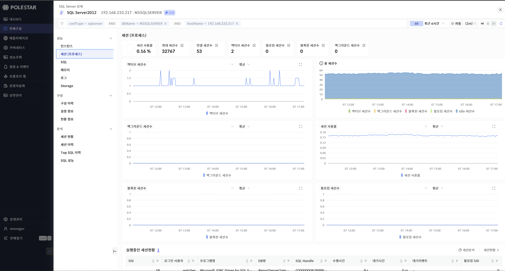

▶ \[그림5\] SQL Server 세션(프로세스) 성능

세션 사용률 및 세션수 현황

현재 시점 SQL Server 허용 가능 최대 세션수 및 연결 세션수, 세션 사용률, 엑티브/블록/블로킹 세션수가 표시되며 각 카드에 마우스 오버시 우측 상단에 표시되는 아이콘()을 선택하면 세션 현황 화면으로 이동됩니다. 상세 세션 현황 드로어 화면에서는 현재 접속된 모든 세션 목록을 조회하고 분석할 수 있으며 자세한 내용은 “세션 현황 화면”절에서 확인하실 수 있습니다.

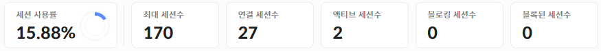

▶ \[그림6\] 세션 사용률 및 세션수 현황

총 세션수 누적 영역 차트

SQL Seerver 접속 세션수를 5가지 상태(Active/Idle/Background/Blocking/Blocked)로 나누어 누적 영역 차트로 표시합니다. 각 범례를 멀티 선택하여 원하는 범례들 만을 보실 수 있습니다. 특히 전체 세션 대비 Active 세션이 많이 지는 시간대나 Blocking, Blocked 세션수가 있는 시간대는 유의해서 살펴볼 필요가 있습니다.

멀티 지표 라인 차트

SQL Server 세션 관련 주요 지표(엑티브 세션수, 백그라운드 세션수, 세션 사용률, 블록된 세션수, 블로킹 세션수)를 라인차트로 확인하여 해당 시점 각 주요항목별 이상이 없는 지 빠르게 확인할 수 있습니다. 또한 차트 좌측 상단 콤보 박스를 통해 세션 관련 추가 지표를 차트에 추가하여 비교 조회할 수 있습니다.

<table>
<tbody>
<tr class="odd">
<td>
노트

한 차트에 지표는 최대 5개까지 추가 가능합니다. 차트는 마우스 드래그를 통해 특정 영역을 확대할 수 있으며 X축을 마우스 드래그 하여 시점 이동도 가능합니다.
</td>
</tr>
</tbody>
</table>

실행중인 세션현황 목록

현재 접속된 세션중 Actvie 상태이거나 Blocking, Blocked 상태인 세션 목록을 표시합니다. 해당 목록을 통해 현재 수행중인 세션이나 블락된 세션 정보를 확인할 수 있습니다. 보다 상세한 세션 현황 정보는 우측 상단 \[세션현황\] 버튼을 클릭하여 세션 상세 현황 드로어에서 확인할 수 있으며 현지 시점 및 과거 수행된 세션 이력을 분석하고 싶다면 우측 상단 \[세션분석\] 버튼을 클릭하여 나오는 세션분석 화면에서 상세 분석하실 수 있습니다.

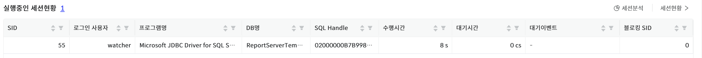

▶ \[그림7\] 실행중인 세션현황 목록

> 실행중인 세션현황 목록

| SID        | 세션을 고유하게 식별하는 세션 ID입니다. 각 세션은 고유한 SID를 가지며, 이를 통해 특정 세션을 추적할 수 있습니다. 세션 ID는 숫자로 표시됩니다.  |
| ---------- | --------------------------------------------------------------------------------------- |
| 로그인 사용자    | 세션이 현재 사용하고 있는 로그인 사용자 이름입니다.                                                           |
| 프로그램명      | SQL Server에 연결된 클라이언트 프로그램의 이름입니다. 백그라운드 세션의 경우 값이 없습니다.                                |
| DB명        | 현재 세션이 사용중인 데이터베이스 이름입니다.                                                               |
| SQL Handle | 현재 세션이 수행중인 SQL의 Handle값입니다. 해당 SQL Handle에 해당하는 SQL Text은 세션현황 화면이나 세션분석화면에서 볼 수 있습니다. |
| 수행시간       | 세션이 현재 SQL 문을 실행하는 데 소요되고 있는 시간입니다.                                                     |
| 대기시간       | 세션이 대기 이벤트에 있는 대기로 인해 대기한 시간입니다.                                                        |
| 대기이벤트      | 세션이 현재 기다리고 있는 특정 대기 이벤트입니다.                                                            |
| 블로킹 SID    | 현재 세션을 블로킹하고 있는 세션의 SID입니다. 이는 잠금 경합 문제를 해결하는 데 중요한 정보를 제공합니다.                          |

SQL Server SQL 성능

SQL Server에서 수행되는 SQL에 대한 성능을 조회하는 화면입니다. 상단에 SQL 최근 수행시간, 초당 전송된 배치 요청수, 트랜잭션 수에 대한 라인차트가 표시되고 Top SQL에 대한 최근 수행시간을 Scatter 차트로 보여줍니다. 다음으로 Top 5 SQL을 4가지 기준(최근 수행시간, 최근 CPU시간, 최근 논리 읽기 수, 최근 물리 읽기 수)으로 표시합니다. Top 5 SQL 목록에서는 “Top SQL 분석” 화면으로 이동할 수 있는 기능도 제공합니다. “Top SQL 분석” 화면에 대한 자세한 내용은 “Top SQL 분석”절을 참조하세요.

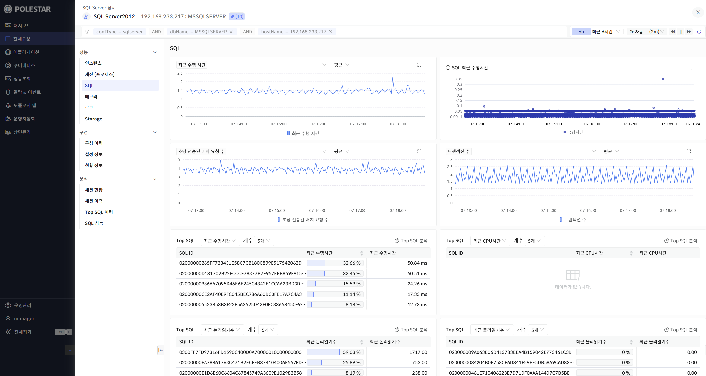

▶ \[그림8\] SQL Server SQL 성능

멀티 지표 라인 차트

SQL Server SQL 성능 주요 지표(최근 수행시간, 초당 전송된 배치 요청수, 트랜잭션 수)를 라인차트로 확인하여 해당 시점 각 주요항목별 이상이 없는 지 빠르게 확인할 수 있습니다.

<table>
<tbody>
<tr class="odd">
<td>
노트

한 차트에 지표는 최대 5개까지 추가 가능합니다. 차트는 마우스 드래그를 통해 특정 영역을 확대할 수 있으며 X축을 마우스 드래그 하여 시점 이동도 가능합니다.
</td>
</tr>
</tbody>
</table>

SQL 최근 수행시간 Scatter 차트

최근 수행시간이 1초 이상인 SQL의 수행시간을 Scatter 차트에 각 점으로 표시합니다. 우측 상단에 차트 메뉴를 통해 “SQL 성능” 화면으로 이동할 수 있습니다. “SQL 성능 분석”에 대한 자세한 내용은 “SQL 성능 분석”절을 참조하세요.

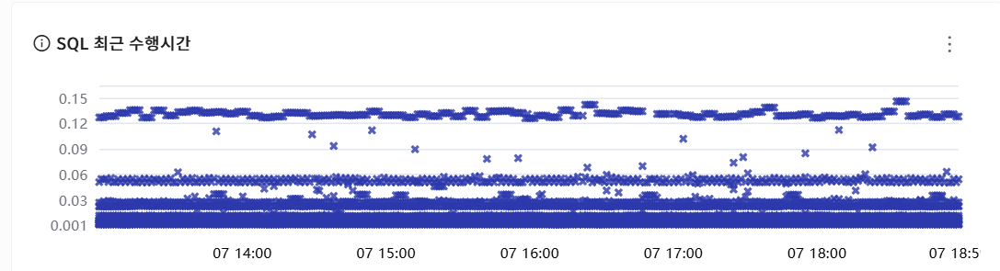

▶ \[그림9\] SQL 평균 수행시간 Scatter 차트

<table>
<tbody>
<tr class="odd">
<td>
노트

Scatter 차트는 최대 1일 데이터 까지만 표시되며 따라서 타임 셀렉터를 1일 이상으로 설정하여도 조회 기간 중 가장 최근 1일 데이터 까지만 표시됩니다.
</td>
</tr>
</tbody>
</table>

Top SQL 목록

Top SQL목록은 4가지 기준(최근 수행시간, 최근 CPU시간, 최근 논리 읽기 수, 최근 물리 읽기 수)으로 기준 값이 큰 5개의 SQL을 각 지표 값과 함께 표시합니다. 표시되는 개수는 콤보 박스에서 선택(5개, 10개, 20개)가능하며 기준 지표도 콤보 박스에서 변경할 수 있습니다. 또한 목록 우측 상단 \[Top SQL 분석\] 버튼을 선택하여 “Top SQL 분석” 화면으로 이동할 수 있습니다. “SQL 성능 분석”에 대한 자세한 내용은 “SQL 성능 분석”절을 참조하세요.

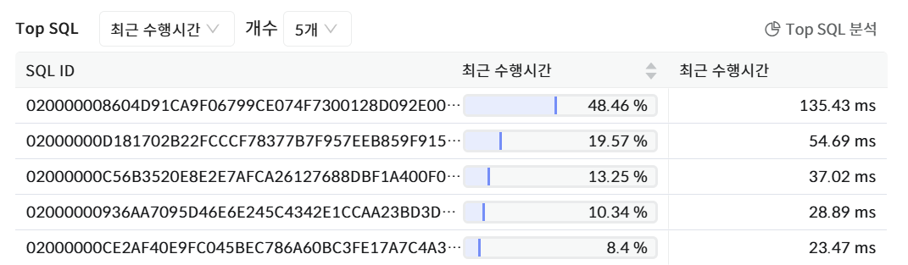

▶ \[그림10\] Top SQL 목록

SQL Server 메모리 성능

SQL Server에서 사용하는 메모리(캐시)관련 성능을 조회하는 화면입니다. 상단에 Clerk별 메모리 Top 5, 데이터베이스별 메모리 Top 5 정보를 도넛 차트로 표시합니다. 하단에는 메모리(캐시) 관련 주요 지표를 라인차트와 데이터베이스별 메모리 사용 정보 목록을 표시합니다.

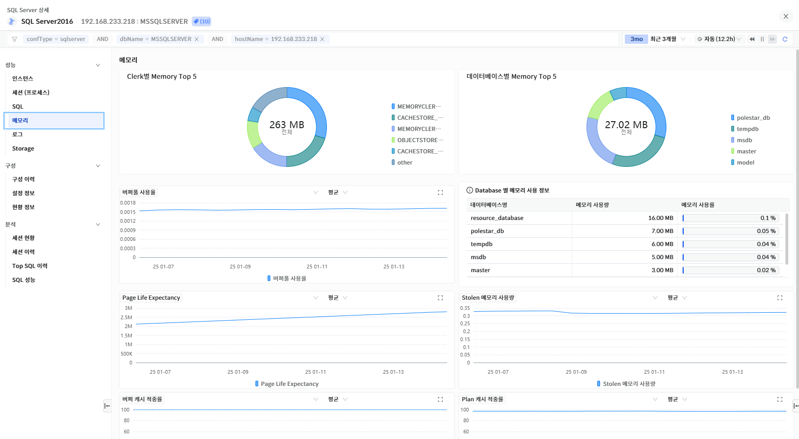

▶ \[그림11\] SQL Server 메모리 성능

멀티 지표 라인 차트

SQL Server 메모리(캐시) 관련 주요 성능 지표(버퍼풀 사용률, Page Life Expectancy, Stolen 메모리 사용량, 버퍼 캐시 사용률, Plan 캐시 적중률)를 라인차트로 확인하여 해당 시점 각 주요항목별 이상이 없는 지 빠르게 확인할 수 있습니다.

<table>
<tbody>
<tr class="odd">
<td>
노트

한 차트에 지표는 최대 5개까지 추가 가능합니다. 차트는 마우스 드래그를 통해 특정 영역을 확대할 수 있으며 X축을 마우스 드래그 하여 시점 이동도 가능합니다.
</td>
</tr>
</tbody>
</table>

SQL Server 로그 성능

SQL Server 로그 관련 성능을 조회하는 화면입니다. 로그 관련 주요 지표를 라인차트로 표시합니다.

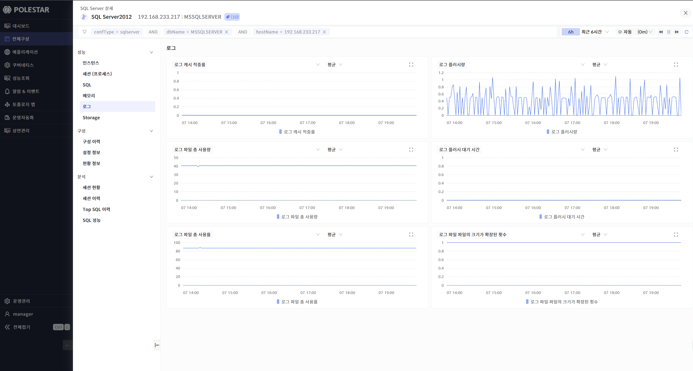

▶ \[그림12\] SQL Server 로그 성능

멀티 지표 라인 차트

SQL Server 로그 관련 주요 성능 지표(로그 캐시 적중률, 로그 플러시량, 로그 파일 총 사용량, 로그 플러시 대기 시간, 로그 파일 총 사용률, 로그 파일의 크기가 확장된 횟수)를 라인차트로 확인하여 해당 시점 각 주요항목별 이상이 없는 지 빠르게 확인할 수 있습니다.

<table>
<tbody>
<tr class="odd">
<td>
노트

한 차트에 지표는 최대 5개까지 추가 가능합니다. 차트는 마우스 드래그를 통해 특정 영역을 확대할 수 있으며 X축을 마우스 드래그 하여 시점 이동도 가능합니다.
</td>
</tr>
</tbody>
</table>

SQL Server Storage 성능

SQL Server Storage(저장공간) 관련 성능을 조회하는 화면입니다. 데이터베이스 및 TempDB관련 주요 지표를 라인차트 및 누적 영역 차트로 표시하며 데이터베이스 사용량이 높은 Top 5 데이터베이스 정보를 목록으로 보여줍니다.

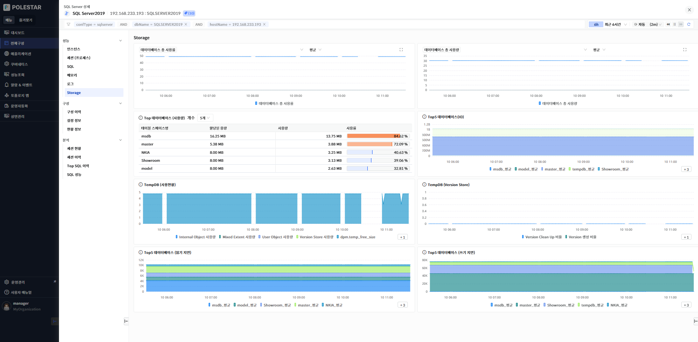

▶ \[그림13\] SQL Server Storage 성능

멀티 지표 라인 차트 및 누적 영역 차트

SQL Server Storage 관련 주요 성능 지표(데이터베이스 총 사용률, 데이터베이스 총 사용량, Top 5 데이터베이스 IO, Top 5 데이터베이스 읽기/쓰기 지연시간, TempDB 사용현황, TempDB Version Store정보)를 라인차트 및 누적 영역 차트로 확인하여 해당 시점 각 주요항목별 이상이 없는 지 빠르게 확인할 수 있습니다.

<table>
<tbody>
<tr class="odd">
<td>
노트

한 차트에 지표는 최대 5개까지 추가 가능합니다. 차트는 마우스 드래그를 통해 특정 영역을 확대할 수 있으며 X축을 마우스 드래그 하여 시점 이동도 가능합니다.
</td>
</tr>
</tbody>
</table>

Top5 데이터베이스

데이터베이스 사용률이 높은 5개의 데이터베이스를 목록으로 표시합니다. 목록에는 데이터베이스 에 할당된 용량, 사용량, 사용률 정보가 표시됩니다.

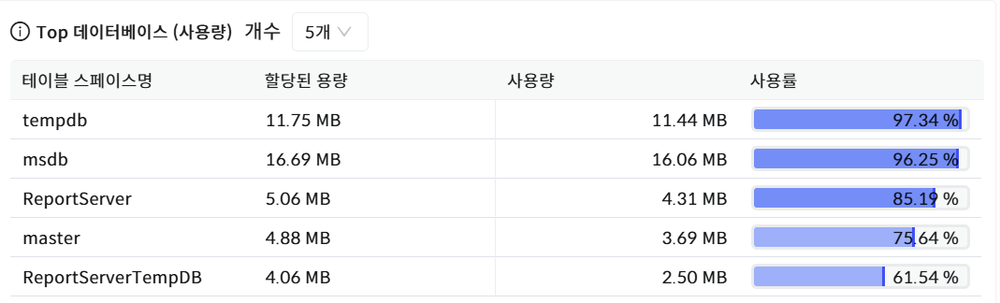

▶ \[그림14\] Top5 데이터베이스 목록

SQL Server 구성

SQL Server 구성 메뉴는 구성이력, 설정정보, 현황정보로 구성 되어있습니다. 구성 이력에서는 SQL Server 환경변수, 데이터베이스 목록 등 구성정보를 확인하고 변경이력을 비교 조회할 수 있으며 설정 정보에서는 현재 설정된 SQL Server 접속 정보나 담당자, 수집 조건 등 변경할 수 있습니다. 그리고 현황정보에서는 현재 시점의 로그인 사용자, 환경변수, Data/Log 파일, 데이터베이스(IO)을 확인하실 수 있습니다.

<table>
<tbody>
<tr class="odd">
<td>
노트

현황정보의 경우 대상 SQL Server에 직접 조회 쿼리를 수행하여 가져옵니다. 따라서 오라클이 다운된 경우는 조회할 수 없습니다.
</td>
</tr>
</tbody>
</table>

SQL Server 구성 이력

구성 이력화면은 크게 SQL Server와 데이터베이스 2개의 탭으로 구분하여 표시합니다. 화면 구성은 상단에 구성 변경 현황 바차트가 표시되어 타임 셀렉터 기간내에 변경이 발생된 구성 변경 개수를 표시해줍니다. 이를 통해 구성이 변경된 시점을 쉽게 파악할 수 있습니다. 하단에는 현재 시점의 구성 정보가 표시됩니다. 구성 이력화면에서는 현재 시점의 구성 정보와 과거 구성 정보를 비교해 볼 수 있는 기능을 제공합니다. 자세한 내용은 ”구성 이력 조회 방법”절을 참고하세요.

SQL Server 탭

SQL Server 탭에서는 SQL Server 환경변수, 상세버전, 인코딩 정보등의 구성정보를 조회하거나 과거 이력과 비교할 수 있습니다.

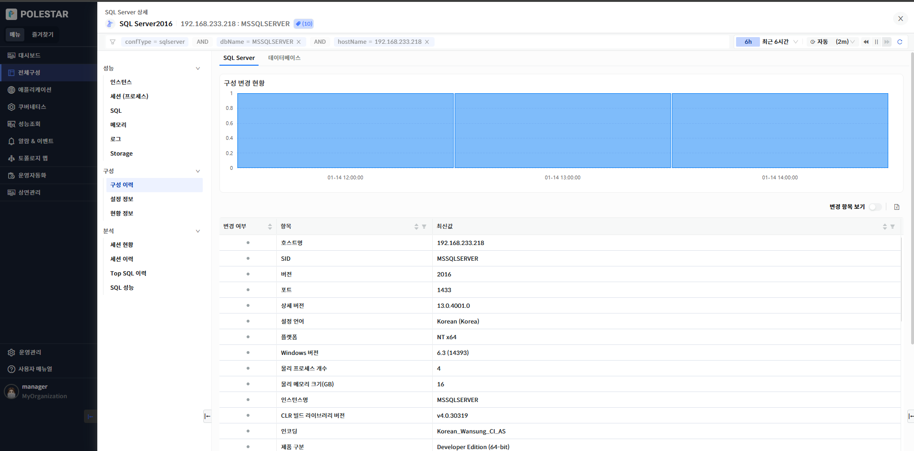

▶ \[그림15\] SQL Server 구성 탭

> SQL Server 구성 지표

<table>
<thead>
<tr class="header">
<th>호스트명</th>
<th>SQL Server 등록시 입력한 호스트명 또는 IP</th>
</tr>
</thead>
<tbody>
<tr class="odd">
<td>SID</td>
<td>SQL Server 인스턴스명</td>
</tr>
<tr class="even">
<td>버전</td>
<td>SQL Server Major 버전(예: 2012, 2022)</td>
</tr>
<tr class="odd">
<td>포트</td>
<td>SQL Server 접속 포트(예: 1521)</td>
</tr>
<tr class="even">
<td>상세버전</td>
<td>SQL Server 상세 버전(예: 11.0.7001.0)</td>
</tr>
<tr class="odd">
<td>설정 언어</td>
<td>SQL Server에 설정된 언어(예: 영어(미국))</td>
</tr>
<tr class="even">
<td>플랫폼</td>
<td>SQL Server OS 플랫폼(예: NT x64)</td>
</tr>
<tr class="odd">
<td>Windows 버전</td>
<td>Windows 버전(예: 6.1(7601))</td>
</tr>
<tr class="even">
<td>물리 프로세스 개수</td>
<td>대상 물리 서버의 프로세스 개수(예: 4)</td>
</tr>
<tr class="odd">
<td>물리 메모리 크기(GB)</td>
<td>대상 물리 서버의 메모리 크기(예: 15)</td>
</tr>
<tr class="even">
<td>인스턴스명</td>
<td>SQL Server의 인스턴스명(예: MSSQLSERVER)</td>
</tr>
<tr class="odd">
<td>CLR 빌드 라이브러리 버전</td>
<td>공용 언어 런타임(Common Language Runtime, CLR)의 버전을 나타냅니다. CLR은 .NET Framework 기반으로 SQL Server에서 사용자 정의 함수(UDF), 저장 프로시저, 트리거 등을 실행할 때 사용됩니다. (예: v4.0.30319)</td>
</tr>
<tr class="even">
<td>인코딩</td>
<td>SQL Server의 인코딩 타입(예: Korean_Wansung_CI_AS)</td>
</tr>
<tr class="odd">
<td>제품 구분</td>
<td>Developer Edition(64 bit)</td>
</tr>
<tr class="even">
<td>클러스터링 여부</td>
<td>대상 SQL Server가 클러스터링 되어 있는지 여부(예: FALSE)</td>
</tr>
<tr class="odd">
<td>하이퍼 쓰레드용 프로세스 개수</td>
<td>대상 서버의 하이퍼 쓰레드 사용시 프로세스의 개수(예: 1)</td>
</tr>
<tr class="even">
<td>기동 시간</td>
<td>SQL Server가 기동된 시간</td>
</tr>
<tr class="odd">
<td>환경 변수</td>
<td>
SQL Server에 설정된 환경변수 목록

[환경변수명] = [값] 으로 구성됨
</td>
</tr>
</tbody>
</table>

데이터베이스 탭

데이터베이스 탭에서는 개별 데이터베이스별 구성 정보를 확인하고 이력 비교해 볼 수 있습니다.

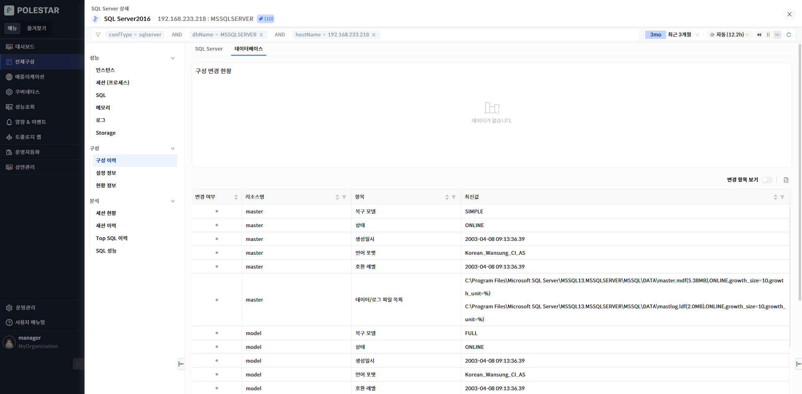

▶ \[그림16\] 데이터베이스 구성 탭

> 데이터베이스 구성

<table>
<thead>
<tr class="header">
<th>복구 모델</th>
<th>
데이터베이스 복구 및 로그 관리 방식을 결정하는 설정입니다. SQL Server는 세 가지 복구 모델을 제공합니다.

SIMPLE: 트랜잭션 로그를 최소화하여 관리하며, 포인트 인 타임 복구를 지원하지 않습니다.

FULL: 모든 트랜잭션 로그를 기록하고, 포인트 인 타임 복구를 지원합니다

BULK_LOGGED: 대량 작업에서 로그를 최소화하여 성능을 최적화하지만, 포인트 인 타임 복구는 지원하지 않습니다.
</th>
</tr>
</thead>
<tbody>
<tr class="odd">
<td>상태</td>
<td>
데이터베이스가 현재 어떤 작업 상태에 있는지 나타내며, 데이터베이스의 가용성 및 작업 가능 여부를 파악하는 데 중요한 정보를 제공합니다.

ONLINE: 데이터베이스가 정상적으로 사용 가능한 상태입니다.

OFFLINE: 데이터베이스가 오프라인 상태이며, 사용자나 관리자가 명시적으로 오프라인으로 설정한 상태입니다.

RESTORING: 데이터베이스가 복구 작업 중인 상태입니다. (백업 복원 진행 중)

RECOVERING: 데이터베이스가 자동 복구 작업을 수행 중이며, 아직 사용자 요청을 처리할 수 없는 상태입니다.

RECOVERY_PENDING: 데이터베이스에 복구가 필요하지만 파일 손상 또는 연결 문제로 복구를 시작할 수 없는 상태입니다.

SUSPECT: 데이터베이스가 손상되어 복구가 필요하며, 데이터베이스가 정상적으로 동작하지 않을 가능성이 있는 상태입니다.

EMERGENCY: 데이터베이스가 READ_ONLY 및 SINGLE_USER 모드로 설정된 상태로, 관리자만 데이터에 접근하여 복구 작업을 수행할 수 있습니다.

COPYING: 데이터베이스가 복제(복사) 작업 중인 상태입니다.

RESTORE WITH STANDBY: 데이터베이스가 읽기 전용 모드로 복구 대기 상태에 있습니다(로그 배송 등에서 사용)
</td>
</tr>
<tr class="even">
<td>생성일시</td>
<td>데이터베이스 생성된 일시입니다. (예: 2023-02-13 13:46:34.373)</td>
</tr>
<tr class="odd">
<td>언어 포맷</td>
<td>데이터베이스가 사용중인 언어 포멧입니다. (예: Latin1_General_CI_AS_KS_WS)</td>
</tr>
<tr class="even">
<td>호환 레벨</td>
<td>데이터베이스의 하위 버전 호환 레벨입니다.</td>
</tr>
<tr class="odd">
<td>데이터/로그 파일 목록</td>
<td>
해당 데이터베이스에 할당된 데이터와 로그 파일 목록 정보입니다.

파일명 뿐만 아니라 용량 및 각 파일의 상태 정보도 기록됩니다.
</td>
</tr>
</tbody>
</table>

구성 변경 이력 조회

구성 이력화면은 SQL Server의 현재 구성과 과거 구성 값을 항목별로 비교하여 변경 여부를 확인할 수 있는 기능을 제공합니다. 이를 통해 과거 구성 값이 현재 어떻게 변경되었는지 확인이 가능합니다. 또한 비교 목록 우측 상단에 변경 항목 보기 토글 버튼을 클릭하면 변경이 발생된 항목만 표시하여 빠르게 변경 항목 확인이 가능합니다.

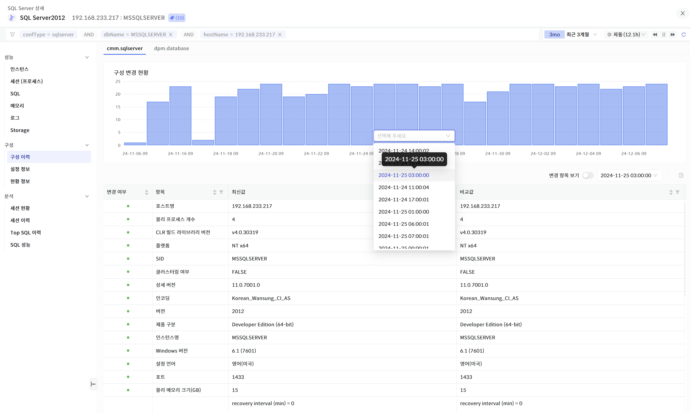

▶ \[그림17\] 구성 변경 이력 조회

> 구성 변경 이력 조회 절차

1.  구성 변경 현황 바 차트에서 비교하고자 하는 시점의 바를 클릭

2.  팝업으로 표시된 콤보 박스에서 비교하고자 하는 일자 선택

3.  하단 목록에 항목별로 최신 값과 비교 값이 표시되고 변경된 항목은 변경여부 컬럼에 빨간색으로 표시됨

4.  목록 상단에 변경 항목 보기 토글 버튼을 클릭하면 변경된 항목만 목록에 표시됨

5.  목록 상단에 날자 선택 콤보 박스에서 비교 날짜를 선택하여도 목록에 비교날짜에 해당하는 값이 비교 값에 표시되어 비교할 수 있음

엑셀 저장

구성 목록 우측 상단 \[엑셀 저장\] 버튼을 통해 구성 목록을 엑셀로 저장할 수 있습니다.

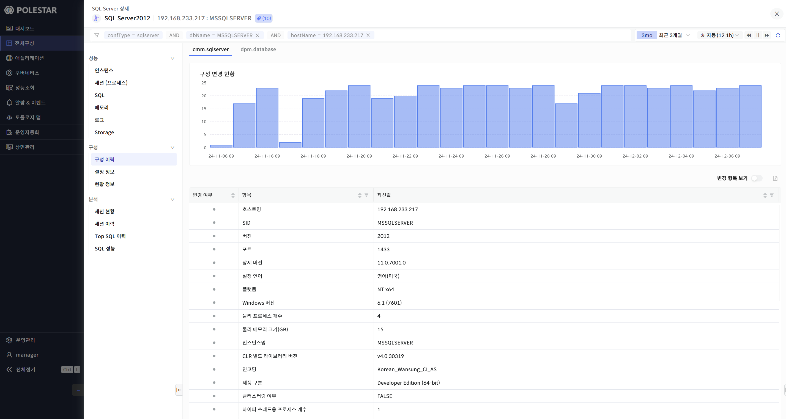

▶ \[그림18\] 구성 목록 엑셀 저장

> 구성 목록 엑셀 저장 및 조회 절차

1.  구성에서 우측 상단 엑셀 저장 아이콘 클릭

2.  브라우저 우측 상단 창에 저장된 엑셀 파일명이 표시됨

3.  해당 파일명을 클릭하여 엑셀 파일 확인

SQL Server 설정 정보

설정 정보 화면은 SQL Server에 설정한 기본 접속 정보와 상세정보(Top SQL 수집여부, Plan 수집 여부 등) 관리 상태, 해당 SQL Server에 대한 역할별 권한 설정, 담당자 설정을 할 수 있는 화면입니다. 부가적으로 SQL Server에 설정되어 있는 알람 정보(알람 정책 및 알람 개수), 수집 정책, 성능/구성 최근 수집 시간을 확인할 수 있으며 성능 및 구성을 즉시 수집할 수 있는 기능도 제공합니다.

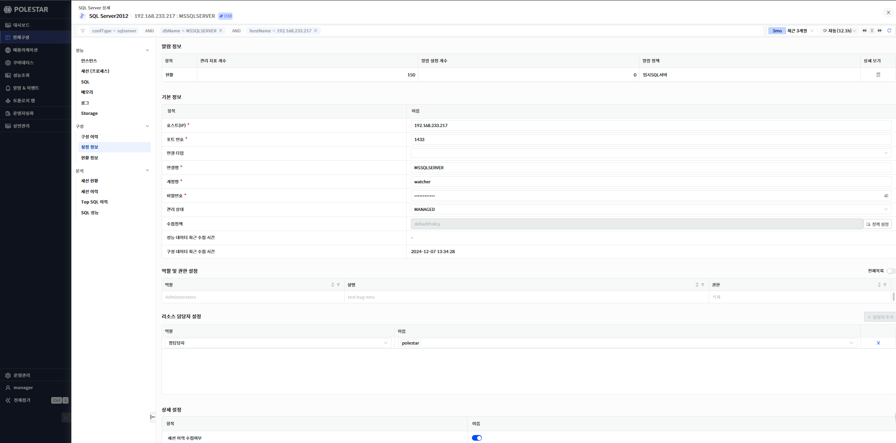

▶ \[그림19\] SQL Server 설정 정보

알람 정보

SQL Server에서 수집하는 관리 지표 개수와 현재 설정된 알람 개수 및 알람 정책 정보를 제공합니다. \[상세보기\]를 선택하여 알람 상세 드로어에서 알람 정책의 세부 알람 설정 목록을 확인할 수 있습니다.

<table>
<tbody>
<tr class="odd">
<td>
노트

현황정보의 경우 대상 SQL Server에 직접 조회 쿼리를 수행하여 가져옵니다. 따라서 오라클이 다운된 경우는 조회할 수 없습니다.
</td>
</tr>
</tbody>
</table>

<table>
<tbody>
<tr class="odd">
<td>
노트

세부 알람 설정은 [알람 &amp; 이벤트] 메뉴에서 변경할 수 있습니다. 자세한 내용은 ‘알람 상세’ 매뉴얼을 참고하시기 바랍니다.
</td>
</tr>
</tbody>
</table>

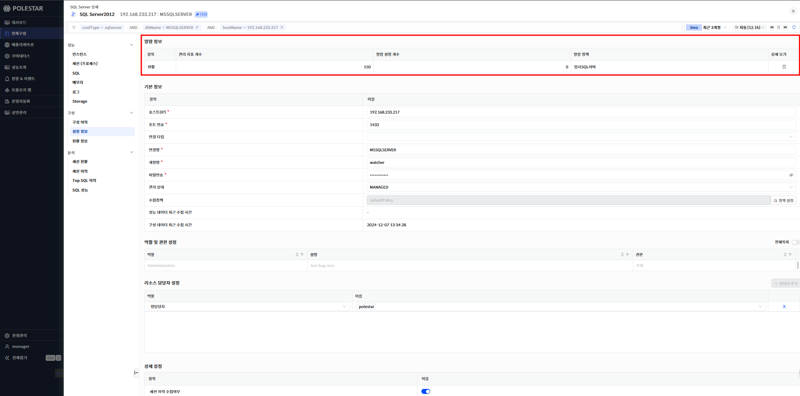

▶ \[그림20\] 알람 정보

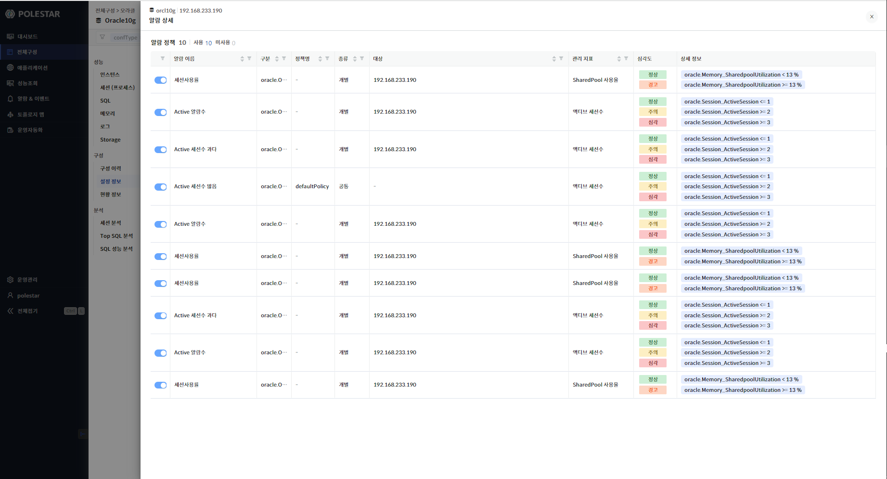

▶ \[그림21\] 알람 정책 목록

> 알람 정책 목록

| 관리 지표 개수 | POLESTAR에서 관리하는 성능 지표 개수를 표시합니다.         |
| -------- | ---------------------------------------- |
| 알람 설정 개수 | 서버에 설정된 알람 개수를 표시합니다..                   |
| 알람 정책    | 서버에 설정된 알람 정책을 표시합니다.                    |
| 상세 보기    | 알람 정책의 세부 알람 설정 목록을 확인할 수 있는 드로어를 호출합니다. |

기본 정보

SQL Server의 기본 정보를 표시합니다. ‘호스트(IP)’, ‘포트번호’, ‘비밀번호’ 등의 항목을 변경할 수 있습니다.

▶ \[그림22\] 기본 정보

> 기본 정보

| 호스트(IP)         | SQL Server의 호스트명 또는 IP입니다.                                                                                 |
| --------------- | ---------------------------------------------------------------------------------------------------------- |
| 포트 번호           | SQL Server 포트 번호입니다.                                                                                       |
| 연결명             | SQL Server의 인스턴스 명입니다. 이 값은 자동으로 설정되는 값으로 변경할 수 없습니다.                                                      |
| 계정명             | SQL Server의 접속 계정 이름입니다.                                                                                   |
| 비밀번호            | SQL Server 접속 계정의 비밀번호입니다.                                                                                 |
| 관리 상태           | 대상 SQL Server의 관리 상태를 선택합니다.                                                                               |
| 수집 정책           | 대상 SQL Server의 수집 정책입니다. 우측 정책 설정 버튼을 클릭하여 대상 SQL Server의 지표 별 수집 정책을 설정할 수 있습니다. 상세한 내용은 “정책 설정”절을 참조하세요. |
| 성능 데이터 최근 수집 시간 | SQL Server의 성능 데이터를 수집한 가장 최근 시간을 표시합니다.                                                                   |
| 구성 데이터 최근 수집 시간 | SQL Server 구성 데이터를 수집한 가장 최근 시간을 표시합니다.                                                                    |

정책 설정

기본 정보 목록에서 \[정책 설정\] 버튼은 클릭하여 SQL Server에 설정된 데이터 수집 정책의 세부 설정을 목록을 조회할 수 있고, 설정을 변경하거나 변경된 설정을 수집 정책의 기본값으로 초기화할 수 있습니다. 데이터 수집 정책 설정 방법에 대한 자세한 내용은 ‘데이터수집설정’ 매뉴얼을 참조하시기 바랍니다.

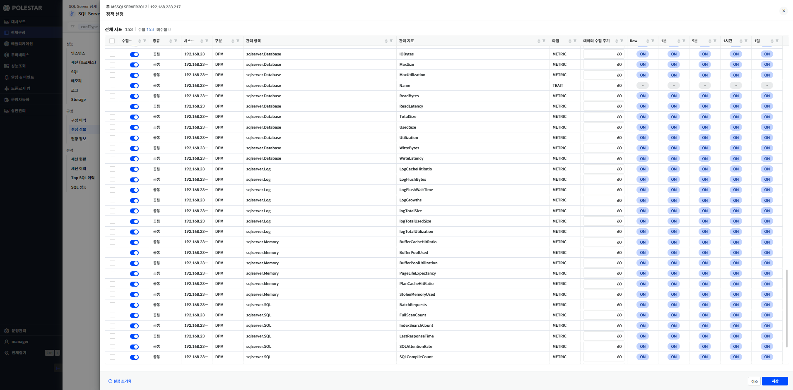

▶ \[그림23\] 기본 정보 – 정책 설정

> 정책 설정 목록

<table>
<thead>
<tr class="header">
<th>수집여부</th>
<th>
지표별 성능 데이터 수집 여부를 설정합니다.

기본적으로 POLESTAR에서 지원하는 모든 지표를 수집하도록 설정 되어있으며, 수집 여부 변경 시 해당 지표는 더 이상 POLESTAR에서 처리하지 않습니다.

: 수집 지표

: 미수집 지표
</th>
</tr>
</thead>
<tbody>
<tr class="odd">
<td>종류</td>
<td>
지표 설정 종류를 표시합니다. 기본값은 ‘COMMON’이며, 세부 설정을 변경한 경우 ‘CUSTOM’으로 표시됩니다.

COMMON: 공통 설정, 관리지표 공통 설정의 지표 설정을 동일하게 사용하는 경우

CUSTOM: 개별 설정, 관리지표 공통 설정의 지표 설정을 변경해서 사용하는 경우
</td>
</tr>
<tr class="even">
<td>시스템 명</td>
<td>SQL Server의 호스트명 또는 IP를 표시합니다.</td>
</tr>
<tr class="odd">
<td>구분</td>
<td>POLESTAR에서 관제하는 제품군을 표시합니다.</td>
</tr>
<tr class="even">
<td>관리 항목</td>
<td>지표 그룹을 표시합니다.</td>
</tr>
<tr class="odd">
<td>관리 지표</td>
<td>지표명을 표시합니다.</td>
</tr>
<tr class="even">
<td>타입</td>
<td>
지표의 데이터 타입을 표시합니다.

AVAILABILITY: 가용성 데이터

TRAIT: 문자열 데이터

METRIC: 수치 데이터

TABULAR: 목록형 데이터
</td>
</tr>
<tr class="odd">
<td>데이터 수집 주기</td>
<td>
지표 별 데이터 수집 주기를 표시합니다.

모든 지표는 기본 60초 주기로 설정되어 있습니다. 데이터 수집 주기는 관리 항목별로 공통 적용되기 때문에 특정 지표의 데이터 수집 주기를 변경하면 해당 지표와 관리 항목이 동일한 모든 지표의 데이터 수집 주기가 일괄 업데이트 됩니다.
</td>
</tr>
<tr class="even">
<td>통계 데이터</td>
<td>
METRIC 데이터의 주기 별 통계 데이터 저장 여부를 설정합니다.

POLESTAR는 1분, 5분, 1시간, 1일 주기의 통계 데이터를 제공합니다.

통계 저장 여부는 METRIC 데이터에 대해서만 설정할 수 있으며, 데이터 수집 주기가 통계 주기보다 긴 경우만 통계 저장을 지원합니다.

<ul>
<li>
: 통계 데이터 저장
</li>
</ul>
<ul>
<li>
: 통계 데이터 저장 안함
</li>
</ul></td>
</tr>
</tbody>
</table>

역할 및 권한 설정

SQL Server에 대한 접근 권한을 조회하고 변경할 수 있습니다. Administrators 역할은 모든 장비에 기본으로 포함되어 있으며 해제할 수 없습니다.

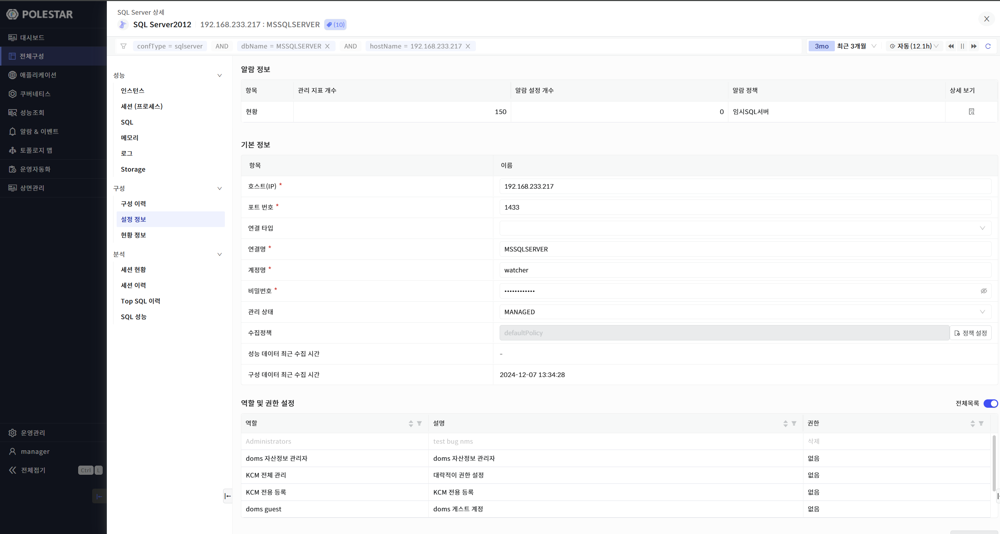

▶ \[그림24\] 역할 및 권한 설정

리소스 담당자 설정

SQL Server의 담당자를 설정할 수 있습니다.

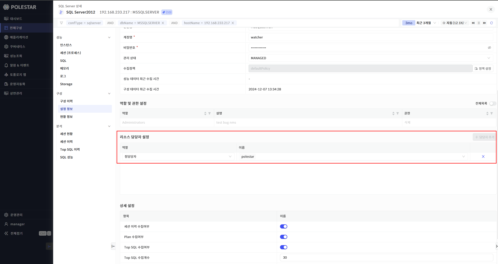

▶ \[그림25\] 리소스 담당자 설정

설정 초기화

설정 정보 화면 하단의 \[설정 초기화\] 버튼을 클릭하여 설정 정보 화면에서 변경했으나 아직 저장은 하지 않은 모든 입력 값을 처음 조회 상태로 되돌릴 수 있습니다.

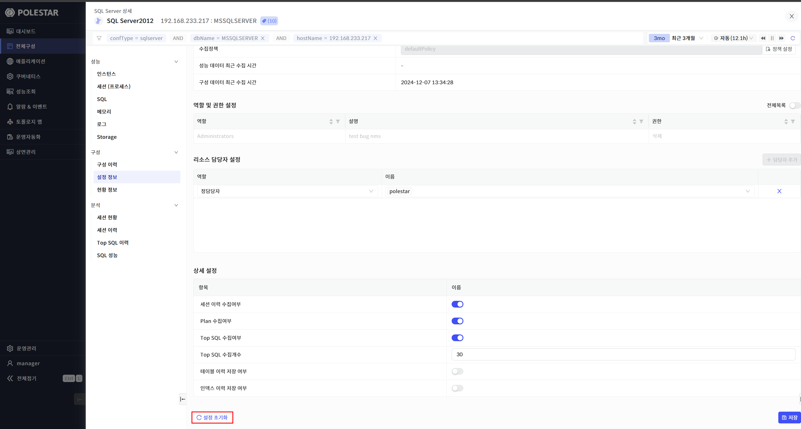

▶ \[그림26\] 설정 초기화

상세 설정

상세 설정을 통해 대상 SQL Server에 세션 이력 정보를 수집여부, Plan 수집여부, Top SQL 수집 여부, Top SQL 수집 개수 등을 설정할 수 있습니다.

▶ \[그림27\] 상세 설정

> 상세 설정

| 세션 이력 수집 여부  | 세션 이력을 수집할 지 여부를 선택합니다. 세션 이력을 저장하면 세션 분석화면을 통해 세션 분석을 할 수 있습니다.                               |
| ------------ | ---------------------------------------------------------------------------------------------- |
| Plan 수집여부    | Plan 정보를 수집할 지 여부를 선택합니다. Plan 정보를 수집하면 Top SQL 분석 및 SQL 분석 화면에서 Plan 정보를 볼 수 있습니다.            |
| Top SQL 수집여부 | Top SQL 이력을 수집할지 여부를 선택합니다. Top SQL을 수집 하면Top SQL 분석 및 SQL 분석 화면에서 SQL 이력 분석을 할 수 있습니다.        |
| Top SQL 수집개수 | Top SQL 이력 저장 시 저장될 Top SQL 개수를 설정합니다. 수집 개수가 많을수록 많은 SQL이 저장되지만 모니터링 대상 데이터베이스에 부하를 줄 수 있습니다. |

<table>
<tbody>
<tr class="odd">
<td>
노트

관제 대상 데이터베이스 모니터링을 위해 최소한의 부하만으로 가용성 및 성능 모니터링만 필요하다면 Plan 이력이나 Top SQL 수집 여부, 테이블/인덱스 이력 저장 여부를 “아니오”로 설정하여 대상 장비 모니터링을 위해 수행되는 쿼리 부하를 줄일 수 있습니다.
</td>
</tr>
</tbody>
</table>

SQL Server 구성 현황 정보

구성 현황 정보화면에서는 현재 시점의 SQL Server의 로그인 사용자, 환경 변수, Data/Log 파일 목록, 데이터베이스 목록(IO) 정보를 제공합니다. 해당 화면을 통해 조회하고자 하는 환경 변수를 목록 검색으로 빠르게 찾아볼 수 있으며 SQL Server내에 사용자 목록 및 사용자의 현재 상태 등을 조회하거나 Data/Log 용량 및 데이터베이스 IO 성능 정보를 쉽게 파악할 수 있습니다.

<table>
<tbody>
<tr class="odd">
<td>
노트

구성 현황 값은 SQL Server의 현재 값을 조회하기 위해 대상 SQL Server에 직접 쿼리를 수행하여 조회해 옵니다. 따라서 SQL Server가 다운된 상태에서는 조회할 수 없습니다. 다운된 상태에서는 구성 이력 화면에서 요약된 구성 정보로 확인하실 수 있습니다.
</td>
</tr>
</tbody>
</table>

로그인 사용자

SQL Server에 등록된 로그인 사용자의 이름, 비활성화 여부, 생성 일시, 비밀번호 만기 확인등의 정보를 조회할 수 있는 화면입니다.

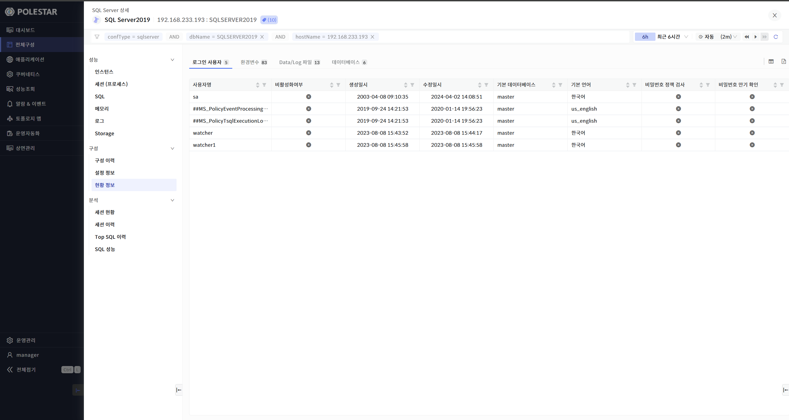

▶ \[그림28\] SQL Server 로그인 사용자 정보

> 로그인 사용자 목록

| 사용자명       | 로그인 사용자 이름입니다.                                                     |
| ---------- | ------------------------------------------------------------------ |
| 비활성화여부     | 해당 로그인 사용자가 비활성화 되어 있는지 여부입니다. 비활성화시 해당 사용자는 SQL Server 접속이 제한됩니다. |
| 생성일시       | 해당 로그인 사용자의 생성 일시입니다.                                              |
| 수정일시       | 로그인 사용자의 속성을 수정한 일시입니다.                                            |
| 기본 데이터베이스  | 로그인 사용자가 SQL Server에 접속할 때 기본으로 접속되는 데이터베이스명입니다.                   |
| 기본 언어      | 로그인 사용자가 사용하는 기본 언어입니다.                                            |
| 비밀번호 정책 검사 | 해당 로그인 사용자의 비밀 번호를 비밀 번호 정책에 맞는지 검사할 지 여부입니다.                      |
| 비밀번호 만기 확인 | 해당 로그인 사용자의 비밀번호가 만기 되었는 지의 여부입니다.                                 |

환경변수

SQL Server의 환경 변수 값의 현재값, 최대값, 최소값, 동적변경 여부등을 조회할 수 있는 화면입니다.

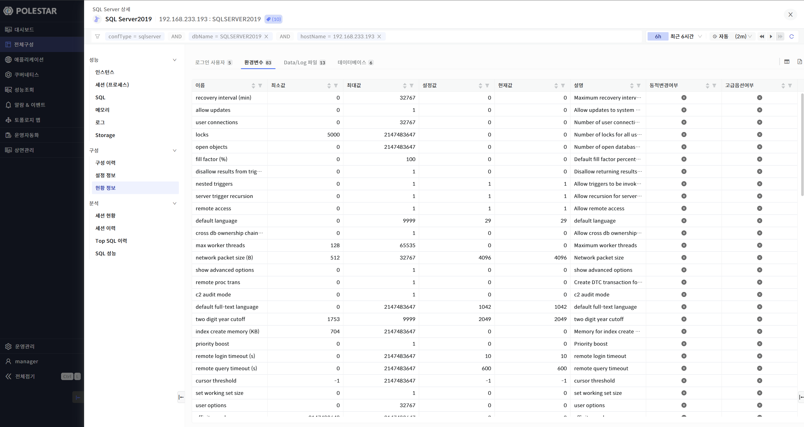

▶ \[그림29\] SQL Server 환경변수 정보

> 환경변수 목록

| 이름     | 환경 변수 이름입니다.                                          |
| ------ | ----------------------------------------------------- |
| 최소값    | 환경 변수가 가질 수 있는 최소값입니다.                                |
| 최대값    | 환경 변수가 가길 수 있는 최대값입니다.                                |
| 설정값    | 환경변수에 설정된 값입니다.                                       |
| 현재값    | 환경변수의 현재 적용된 값입니다.                                    |
| 설명     | 환경변수의 설명입니다. 설명은 SQL Server가 제공하는 원문을 그대로 제공합니다.      |
| 동적변경여부 | 해당 환경 변수를 SQL Server 재기동 없이 동적으로 변경할 수 있는지 여부를 표시합니다. |
| 고급옵션여부 | 해당 환경변수가 기본 변수 인지 고급 설정 변수인지 여부를 표시합니다.               |

Data/Log 파일

SQL Server Data파일 및 Log 파일 목록을 조회하는 화면입니다. 각 Data 파일 및 Log에 대한 디렉토리 위치 크기, 상태 등을 조회하는 화면입니다.

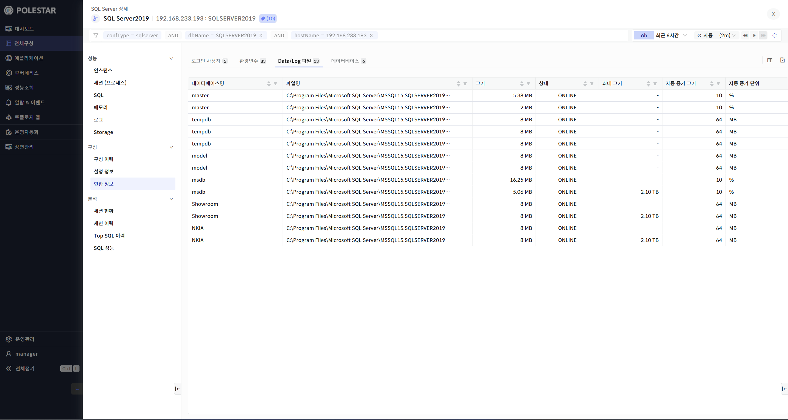

▶ \[그림30\] Data/Log 파일 목록

> Data/Log 파일 목록

<table>
<thead>
<tr class="header">
<th>데이터베이스명</th>
<th>해당 Data파일 또는 Log파일이 속한 데이터베이스 이름입니다.</th>
</tr>
</thead>
<tbody>
<tr class="odd">
<td>파일명</td>
<td>Data 또는 로그 파일의 전체 경로명 및 파일명을 표시합니다.</td>
</tr>
<tr class="even">
<td>크기</td>
<td>Data 또는 로그 파일의 크기입니다.</td>
</tr>
<tr class="odd">
<td>상태</td>
<td>
Data 또는 로그 파일의 상태입니다.

ONLINE: 파일이 정상적으로 사용 가능하며 읽기/쓰기 작업을 처리할 수 있는 상태입니다.

OFFLINE: 파일이 사용 불가능하며, 데이터베이스에서 논리적으로 분리된 상태입니다.

RESTORING: 파일이 백업에서 복원 중이며, 복원이 완료되기 전에는 사용할 수 없는 상태입니다.

RECOVERY_PENDING: 파일이 복구가 필요하지만 복구를 시작할 수 없는 상태입니다. (파일 손상 또는 연결 문제로 인해 발생)

SUSPECT: 파일이 손상되었거나 읽기/쓰기가 불가능한 상태입니다.
</td>
</tr>
<tr class="even">
<td>최대 크기</td>
<td>Data 또는 로그 파일의 허용 가능한 최대 크기입니다.</td>
</tr>
<tr class="odd">
<td>자동 증가 크기</td>
<td>Data 또는 로그 파일이 크기를 자동 증가 시킬 때 늘어나는 크기값입니다. 해당 크기는 자동 증가 단위에 따라 달라집니다.</td>
</tr>
<tr class="even">
<td>자동 증가 단위</td>
<td>Data 또는 로그 파일이 크기를 자동 증가 시킬 때 늘어나는 단위입니다. 단위는 비율(%)과 용량(MB등) 두가지가 가능합니다.</td>
</tr>
</tbody>
</table>

데이터베이스

SQL Server에 추가된 데이터베이스를 조회할 수 있는 화면입니다. 해당 화면을 통해 데이터베이스의 복구 모델, 할당량, 읽기량, 쓰기량등의 정보를 확인할 수 있습니다.

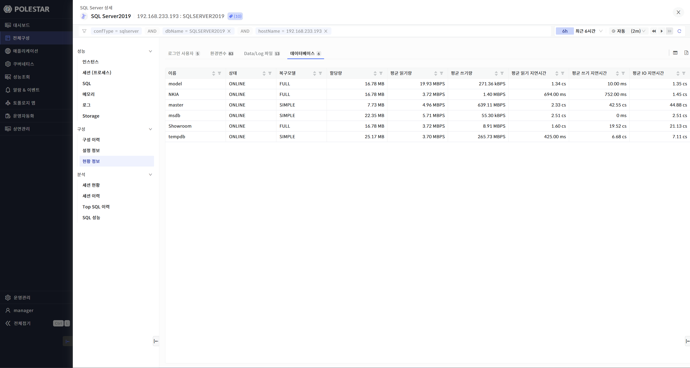

▶ \[그림31\] SQL Server 데이터베이스 목록

> 데이터베이스 목록

<table>
<thead>
<tr class="header">
<th>이름</th>
<th>데이터베이스 이름입니다.</th>
</tr>
</thead>
<tbody>
<tr class="odd">
<td>상태</td>
<td>
데이터베이스가 현재 어떤 작업 상태에 있는지 나타내며, 데이터베이스의 가용성 및 작업 가능 여부를 파악하는 데 중요한 정보를 제공합니다.

ONLINE: 데이터베이스가 정상적으로 사용 가능한 상태입니다.

OFFLINE: 데이터베이스가 오프라인 상태이며, 사용자나 관리자가 명시적으로 오프라인으로 설정한 상태입니다.

RESTORING: 데이터베이스가 복구 작업 중인 상태입니다. (백업 복원 진행 중)

RECOVERING: 데이터베이스가 자동 복구 작업을 수행 중이며, 아직 사용자 요청을 처리할 수 없는 상태입니다.

RECOVERY_PENDING: 데이터베이스에 복구가 필요하지만 파일 손상 또는 연결 문제로 복구를 시작할 수 없는 상태입니다.

SUSPECT: 데이터베이스가 손상되어 복구가 필요하며, 데이터베이스가 정상적으로 동작하지 않을 가능성이 있는 상태입니다.

EMERGENCY: 데이터베이스가 READ_ONLY 및 SINGLE_USER 모드로 설정된 상태로, 관리자만 데이터에 접근하여 복구 작업을 수행할 수 있습니다.

COPYING: 데이터베이스가 복제(복사) 작업 중인 상태입니다.

RESTORE WITH STANDBY: 데이터베이스가 읽기 전용 모드로 복구 대기 상태에 있습니다(로그 배송 등에서 사용)
</td>
</tr>
<tr class="even">
<td><strong>복구 모델</strong></td>
<td>
데이터베이스 복구 및 로그 관리 방식을 결정하는 설정입니다. SQL Server는 세 가지 복구 모델을 제공합니다.

SIMPLE: 트랜잭션 로그를 최소화하여 관리하며, 포인트 인 타임 복구를 지원하지 않습니다.

FULL: 모든 트랜잭션 로그를 기록하고, 포인트 인 타임 복구를 지원합니다

BULK_LOGGED: 대량 작업에서 로그를 최소화하여 성능을 최적화하지만, 포인트 인 타임 복구는 지원하지 않습니다.
</td>
</tr>
<tr class="odd">
<td>할당량</td>
<td>데이터베이스에 현재 할당된 용량입니다.</td>
</tr>
<tr class="even">
<td>평균 읽기량</td>
<td>데이터베이스의 현재 초당 평균 읽기량입니다.</td>
</tr>
<tr class="odd">
<td>평균 쓰기량</td>
<td>데이터베이스의 현재 초당 평균 쓰기량입니다.</td>
</tr>
<tr class="even">
<td>평균 읽기 지연시간</td>
<td>데이터베이스의 현재 평균 읽기 지연 시간입니다.</td>
</tr>
<tr class="odd">
<td>평균 쓰기 지연시간</td>
<td>데이터베이스의 현재 평균 쓰기 지연 시간입니다.</td>
</tr>
<tr class="even">
<td>평균 IO 지연시간</td>
<td>데이터베이스의 현재 평균 IO(읽기+쓰기) 지연 시간입니다.</td>
</tr>
</tbody>
</table>

SQL Server 분석

SQL Server 분석 기능은 세션 현황, 세션 이력, Top SQL 이력, SQL 성능 분석의 4가지 기능을 제공합니다. 세션 현황 및 이력 분석을 통해 SQL Server에 접속한 세션들에 대한 수행 SQL, 대기이벤트 정보, Lock 정보 등을 확인할 수 있습니다. Top SQL 이력 분석을 통해서는 SQL Server에 수행된 SQL중 수행시간이 느린 쿼리를 분석할 수 있습니다. 마지막으로 SQL 성능 분석을 통해서는 개별 SQL의 응답시간을 Scatter 차트로 한 눈에 살펴보면서 상세히 분석할 수 있습니다.

<table>
<tbody>
<tr class="odd">
<td>
노트

SQL Server 분석 화면에 표현되는 세션, SQL, Plan 이력 정보 저장 여부 및 Top SQL수집 개수는 SQL Server 추가시나 SQL Server 환경 설정에서 설정할 수 있습니다.
</td>
</tr>
</tbody>
</table>

세션 현황

SQL Server에 현재 접속된 모든 세션 목록과 Lock 발생 현황을 표시해주는 화면입니다. 상단에 세션 사용률 및 세션 수 정보가 카드로 표시되고 그 다음으로 상태, 데이터베이스, SQL별 세션 수를 도넛 차트로 표시합니다. 도넛 차트에는 추가로 사용자, 프로그램, 호스트를 선택할 수 있습니다. 그리고 최하단에 상세 세션 목록 및 Lock 세션(Lock Tree) 목록이 표시됩니다.

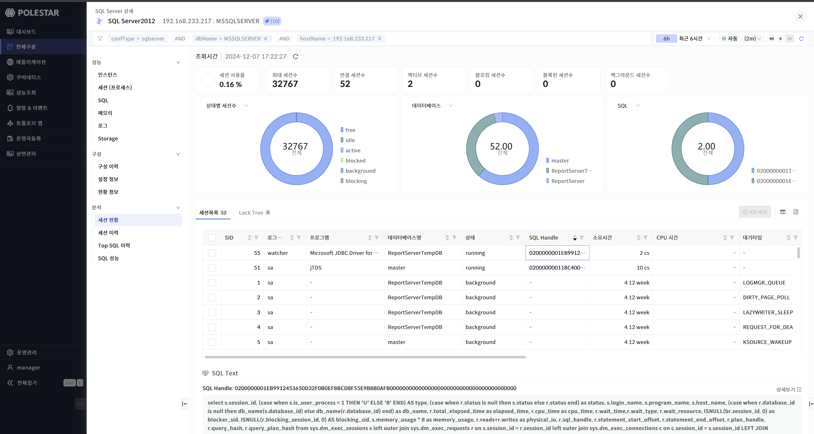

▶ \[그림32\] 세션 상세 현황

조회시간 및 화면 리프레시 버튼

화면 추측 상단 타임셀렉터에 현재 조회된 세션 현황의 조회 시간이 표시되며 리프레시() 아이콘을 통해 현재 시점의 SQL Server 세션 목록을 다시 조회해 올 수 있습니다.

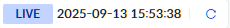

▶ \[그림35\] 조회시간 및 화면 리프레시 버튼

세션 사용률 및 세션수 현황

현재 시점 SQL Server 허용 가능 최대 세션수 및 연결 세션수, 세션 사용률, 엑티브/블록/블로킹 세션수가 표시됩니다.

▶ \[그림34\] 세션 사용률 및 세션수 현황

카테고리별 세션 수 도넛 차트

6가지 카테고리(상태, 데이터베이스, SQL, 사용자, 프로그램, 호스트)별 세션 수에 대한 도넛 차트가 표시됩니다. 각 카테고리는 도넛 차트 좌측 상단의 콤보 박스를 통해 선택 가능하며 범례를 선택하면 해당 범례에 해당하는 세션수만 도넛차트와 세션목록, Lock Tree 목록에 표시됩니다. 도넛 차트 필터링 기능을 통해 특정 SQL이나 스키마 상태 등을 필터링하여 현재 접속된 세션 목록을 상세분석 하실 수 있습니다.

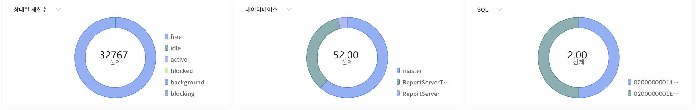

▶ \[그림35\] 카테고리별 세션 수 도넛 차트

세션 목록

현재 SQL Server에 접속된 모든 세션 목록이 표시됩니다. 해당 목록을 통해 어떤 사용자, 프로그램, 호스트가 접속했는지 확인할 수 있으며 세션의 상태(active, blocked, blocking 등) 및 수행중인 SQL, 대기중인 이벤트, 메모리 사용량 등을 확인할 수 있습니다. 세션 목록은 추가로 하기와 같은 기능을 제공합니다.

제공 기능

1.  세션이 수행한 SQL Text 보여주는 기능(SQL Text 포메팅 기능 포함)

2.  세션이 수행한 SQL에 대한 상세 이력 조회 기능

3.  세션 상세 이력 조회 기능

4.  문제가 되는 사용자 세션을 종료(Kill)할 수 있는 기능

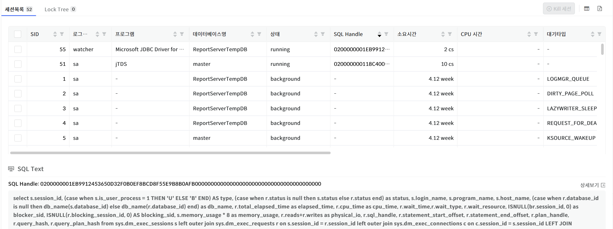

▶ \[그림36\] 세션 목록

> 세션 목록

<table>
<thead>
<tr class="header">
<th>SID</th>
<th>세션을 고유하게 식별하는 세션 ID입니다. 각 세션은 고유한 SID를 가지며, 이를 통해 특정 세션을 추적할 수 있습니다. 세션 ID는 숫자로 표시됩니다.</th>
</tr>
</thead>
<tbody>
<tr class="odd">
<td>로그인 사용자</td>
<td>세션이 현재 사용하고 있는 로그인 사용자 이름입니다.</td>
</tr>
<tr class="even">
<td>프로그램명</td>
<td>SQL Server에 연결된 클라이언트 프로그램의 이름입니다. 백그라운드 세션의 경우 값이 없습니다.</td>
</tr>
<tr class="odd">
<td>데이터베이스명</td>
<td>현재 세션이 사용중인 데이터베이스 이름입니다.</td>
</tr>
<tr class="even">
<td>상태</td>
<td>
세션의 상태를 표시

세션 상태값: running, suspended. runnable, pending, background, rollback, sleeping, preconnect, dormant

상태값은 하기 세션 상태값 설명 목록 참조
</td>
</tr>
<tr class="odd">
<td>SQL Handle</td>
<td>현재 세션이 수행중인 SQL의 Handle값입니다. 해당 SQL Handle에 해당하는 SQL Text은 세션현황 화면이나 세션분석화면에서 볼 수 있습니다.</td>
</tr>
<tr class="even">
<td>소요시간</td>
<td>세션이 현재 SQL 문을 실행하는 데 소요되고 있는 시간입니다.</td>
</tr>
<tr class="odd">
<td>CPU 시간</td>
<td>세션이 현재 SQL 문을 실행하는 데 사용한 CPU 시간입니다.</td>
</tr>
<tr class="even">
<td>대기시간</td>
<td>세션이 대기 이벤트에 있는 대기로 인해 대기한 시간입니다.</td>
</tr>
<tr class="odd">
<td>대기리소스</td>
<td>세션이 현재 대기하고 있는 대상 리소스 입니다.</td>
</tr>
<tr class="even">
<td>블로킹 SID</td>
<td>현재 세션을 블로킹하고 있는 세션의 SID입니다. 이는 잠금 경합 문제를 해결하는 데 중요한 정보를 제공합니다.</td>
</tr>
<tr class="odd">
<td>메모리사용량</td>
<td>세션이 사용하고 있는 메모리 사용량입니다.</td>
</tr>
<tr class="even">
<td>물리 IO수</td>
<td>세션이 사용하고 있는 물리 IO 수입니다.</td>
</tr>
<tr class="odd">
<td>호스트명</td>
<td>해당 세션의 호스트명입니다. 백그라운드 세션의 경우는 표시되지 않습니다.</td>
</tr>
<tr class="even">
<td>타입</td>
<td>세션이 백그라운드 세션(B)인지 사용자 세션(U)인지를 표시합니다.</td>
</tr>
</tbody>
</table>

> 세션 상태 값 목록

<table>
<thead>
<tr class="header">
<th>running</th>
<th>세션이 현재 CPU에서 실행 중이며, 작업이 처리되고 있는 상태입니다.</th>
</tr>
</thead>
<tbody>
<tr class="odd">
<td>suspended</td>
<td>세션이 리소스(I/O, 잠금 등)를 기다리며 실행이 중단된 상태입니다. 주로 대기 유형(예: 잠금 대기, 디스크 I/O 병목)을 분석하여 원인을 파악해야 합니다.</td>
</tr>
<tr class="even">
<td>runnable</td>
<td>세션이 실행 준비를 마쳤으나, CPU 스케줄링을 기다리는 상태입니다. CPU 리소스 부족 또는 과도한 병렬 처리가 이 상태를 유발할 수 있습니다.</td>
</tr>
<tr class="odd">
<td>pending</td>
<td>세션이 아직 실행되지 않고 스케줄러 대기열에 배치될 준비를 하고 있는 상태입니다. 작업이 시작되기 전에 대기하는 짧은 준비 상태를 나타냅니다.</td>
</tr>
<tr class="even">
<td>background</td>
<td>SQL Server의 내부 작업(예: 체크포인트, 시스템 유지 관리)이 실행 중인 상태입니다.</td>
</tr>
<tr class="odd">
<td>rollback</td>
<td>세션이 트랜잭션을 취소하고, 변경 사항을 되돌리는 작업을 수행 중인 상태입니다. 대규모 롤백 작업은 I/O 부하를 증가시킬 수 있으므로 지속 시간에 주의해야 합니다.</td>
</tr>
<tr class="even">
<td>sleeping</td>
<td>세션이 유휴 상태로, 클라이언트 요청을 기다리는 상태입니다. 유휴 세션이 많으면 연결 관리를 통해 자원 낭비를 줄이는 것이 좋습니다.</td>
</tr>
<tr class="odd">
<td>preconnect</td>
<td>
SQL Server가 클라이언트 연결 요청을 처리하기 위해 준비 중인 상태입니다.

네트워크 연결 문제나 리소스 부족으로 처리 지연이 발생할 수 있습니다.
</td>
</tr>
<tr class="even">
<td>dormant</td>
<td>세션이 비활성화된 상태로, 작업이 재활성화되기를 기다립니다. CLR 작업 완료 후 대기 상태에서 주로 발생하며, 특정 작업과 연관됩니다.</td>
</tr>
</tbody>
</table>

Lock Tree

SQL Server에 락 세션이 발생되면 Lock Tree 목록에서 해당 락 세션들을 확인할 수 있습니다. Lock Tree에서는 락을 유발한 세션(블로킹 세션)을 부모로 하고 해당 락으로 인해 블록된 세션을 자식으로 하는 트리 형태로 목록을 표시합니다. 부모락 세션을 기준으로 해당 트리를 접거나 펼쳐 볼 수 있으며 SQL ID 컬럼에 있는 SQL ID를 선택하면 하단에 해당 SQL ID에 해당하는 SQL Text가 표시됩니다. SQL Text 창의 우측 상단에 SQL문 포메팅 버튼을 클릭하면 해당 SQL문을 포메팅하여 볼 수 있으며 상세보기버튼을 클릭하면 SQL Text 상세 드로어가 표시되며 해당 드로어 화면에서 SQL에 대한 상세 성능 이력 정보 및 Plan 정보를 확인할 수 있습니다. 자세한 내용은 “개별 SQL 이력 보기(SQL Text 상세 드로어)”절을 참조하세요.

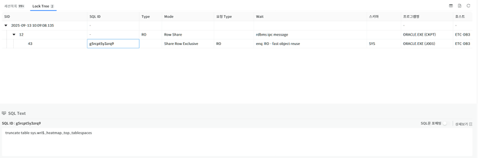

▶ \[그림37\] Lock Tree

> Lock Tree 목록

<table>
<thead>
<tr class="header">
<th>SID</th>
<th>세션을 고유하게 식별하는 세션 ID입니다. 락을 유발한 세션을 부모로하여 해당 락으로 인해 블록된 세션을 자식으로 하는 트리형태로 표시합니다.</th>
</tr>
</thead>
<tbody>
<tr class="odd">
<td>SQL Handle</td>
<td>락을 유발하거나 락된 세션에서 수행한 SQL Handle(SQL 식별 ID)입니다.</td>
</tr>
<tr class="even">
<td>대기이벤트</td>
<td>Lock 대기 이벤트를 나타냅니다.</td>
</tr>
<tr class="odd">
<td>대기리소스</td>
<td>Lock으로 인해 대기중인 대상 리소스를 나타냅니다.</td>
</tr>
<tr class="even">
<td>대기 시간</td>
<td>Lock 대기 시간을 나타냅니다.</td>
</tr>
<tr class="odd">
<td>상태</td>
<td>
세션의 상태를 표시

세션 상태값: running, suspended. runnable, pending, background, rollback, sleeping, preconnect, dormant

상태값은 세션 상태값 설명 목록 참조
</td>
</tr>
<tr class="even">
<td>로그인사용자</td>
<td>세션이 현재 사용하고 있는 로그인 사용자 이름입니다.</td>
</tr>
<tr class="odd">
<td>프로그램명</td>
<td>SQL Server에 연결된 클라이언트 프로그램의 이름입니다. 백그라운드 세션의 경우 값이 없습니다.</td>
</tr>
<tr class="even">
<td>데이터베이스명</td>
<td>현재 세션이 사용중인 데이터베이스 이름입니다.</td>
</tr>
<tr class="odd">
<td>호스트명</td>
<td>해당 세션의 호스트명입니다. 백그라운드 세션의 경우는 표시되지 않습니다.</td>
</tr>
<tr class="even">
<td>타입</td>
<td>세션이 백그라운드 세션(B)인지 사용자 세션(U)인지를 표시합니다.</td>
</tr>
</tbody>
</table>

개별 세션 이력 조회(SID 드로어)

세션 목록의 SID 컬럼에서 특정 SID를 선택하면 선택한 세션에 대한 상세 이력을 조회할 수 있는 드로어 화면이 열립니다. 해당 화면을 선택한 세션이 과거에 수행한 SQL 및 대기 이벤트 정보를 상세 조회할 수 있습니다. 보다 상세한 내용은 “개별 세션 이력 조회”절을 참조하세요.

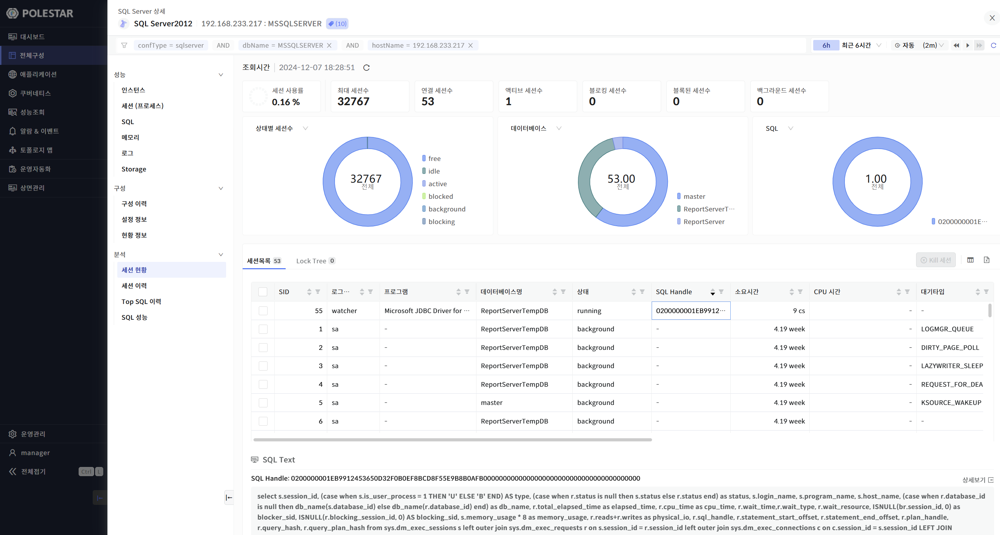

▶ \[그림38\] 세션목록에서 특정 SID 하나를 선택

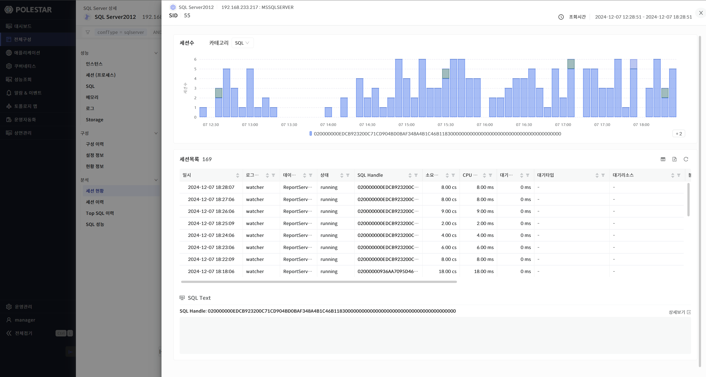

▶ \[그림39\] 선택한 SID에 대한 세션 이력 화면

> 개별 세션 이력 조회 절차

1.  세션목록에서 특정 SID 하나를 선택(화면 예시: 55)

2.  선택한 SID(화면 예시: 55)에 대한 세션 상세 이력 화면이 표시됨

세션 수행 SQL 조회

세션 목록의 SQL Handle 컬럼에서 특정 SQL Handle을 선택하면 선택한 SQL Handle에 대한 SQL Text를 하단 SQL Text창에서 확인할 수 있습니다.

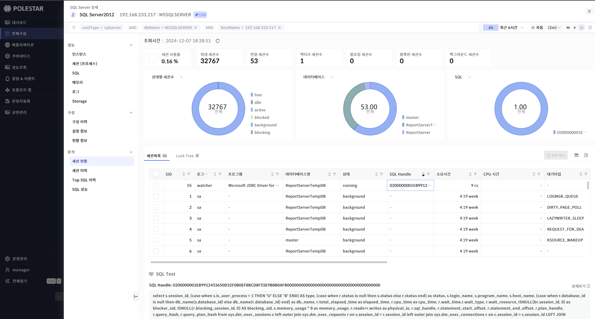

▶ \[그림40\] 선택한 SQL Handle에 대한 SQL Text 표시 화면

> 세션 수행 SQL 조회 절차

1.  세션목록에서 특정 SQL Handle을 선택

2.  하단 SQL Text 창에 선택한 SQL Handle에 대한 SQL Text가 표시됨

개별 SQL 이력 조회(SQL Text 상세 드로어)

SQL Text 창의 우측 상세보기 버튼을 클릭하면 해당 SQL에 대한 상세 성능 이력 정보를 조회할 수 있는 드로어 화면이 나옵니다. 개별 SQL 이력 조회를 통해 해당 SQL의 과거 수행 이력 및 수행시간 Plan 정보, 수행 세션 수 정보 등을 확인할 수 있습니다.

▶ \[그림41\] 개별 SQL 이력 조회 절차

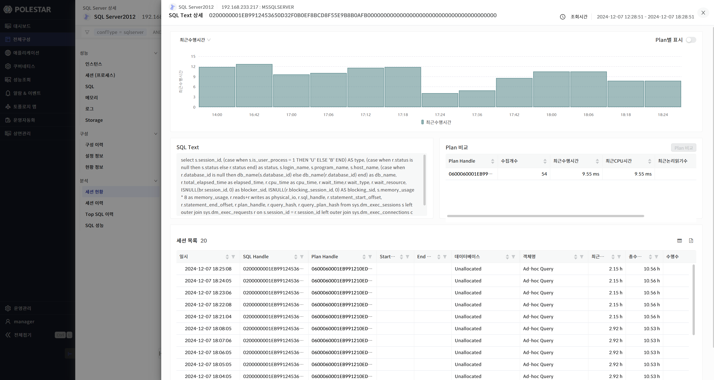

▶ \[그림42\] 개별 SQL에 대한 이력 화면

> 개별 SQL 이력 조회 절차

1.  세션목록에서 특정 SQL Handle을 선택

2.  하단 SQL Text 창에 선택한 SQL Handle에 대한 SQL Text가 표시됨

3.  SQL Text 우측 상단에 상세보기 버튼 클릭

4.  선택한 SQL에 대한 이력 조회 드로어 화면 표시

5.  좌측 상단 콤보 박스에서 최근수행시간, 최근 CPU시간등을 선택하여 개별 SQL 성능 조회

<table>
<tbody>
<tr class="odd">
<td>
노트

SQL Text 상세 드로어 화면에서는 좌측 상단 콤보 박스에서 최근 수행시간, 최근 CPU 시간등의 항목을 선택하여 선택한 항목 기준으로 SQL이 수행한 성능 이력 정보를 확인할 수 있습니다.
</td>
</tr>
</tbody>
</table>

Kill 세션

세션 목록에서 종료하고자 하는 세션을 체크하고 Kill 세션 버튼을 클릭하면 해당 세션을 종료할 수 있습니다. 보통 락을 유발하는 세션을 종료하여 블록된 세션들이 작업을 수행할 수 있도록 할 때 사용합니다. 단 문제가 없는 세션을 종료하지 않도록 주의할 필요가 있습니다.

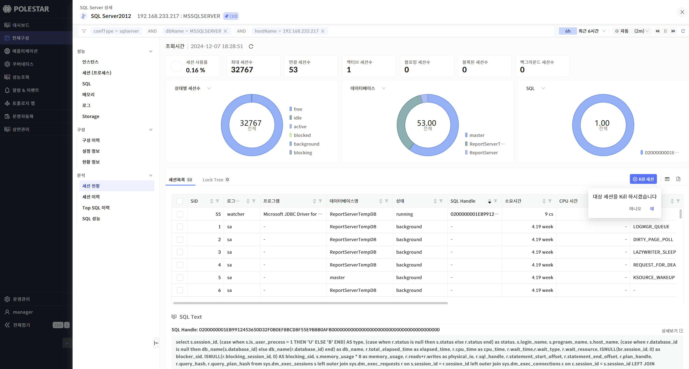

▶ \[그림43\] Kill 세션 절차

> 세션 Kill 절차

1.  세션목록에서 특정 세션을 선택(화면 예시: 38)

2.  세션목록 상단의 Kill 버튼을 클릭

3.  대상 세션을 Kill 하시겠습니까? 팝업 창에서 ‘예’ 선택

<table>
<tbody>
<tr class="odd">
<td>
노트

Kill 세션으로 종료할 수 있는 세션은 사용자 세션이며 백그라운드 세션은 Kill 세션 버튼을 수행하여도 종료되지 않습니다. 이는 정상적인 백그라운드 세션이 강제 종료되는 것을 방지하기 위함입니다.
</td>
</tr>
</tbody>
</table>

컬럼 수정

세션 목록의 우측 상단 \[컬럼 수정\] 버튼을 통해 세션 목록에 원하는 컬럼을 표시하거나 제외할 수 있습니다. 엑셀 저장시에도 컬럼 수정을 통해 표시된 컬럼만 저장됩니다. 컬럼 수정 드로어는 컬럼 검색 기능을 제공하며 선택된 항목을 하단에 표시하고 표시된 컬럼을 제외할 수 있는 기능을 제공합니다.

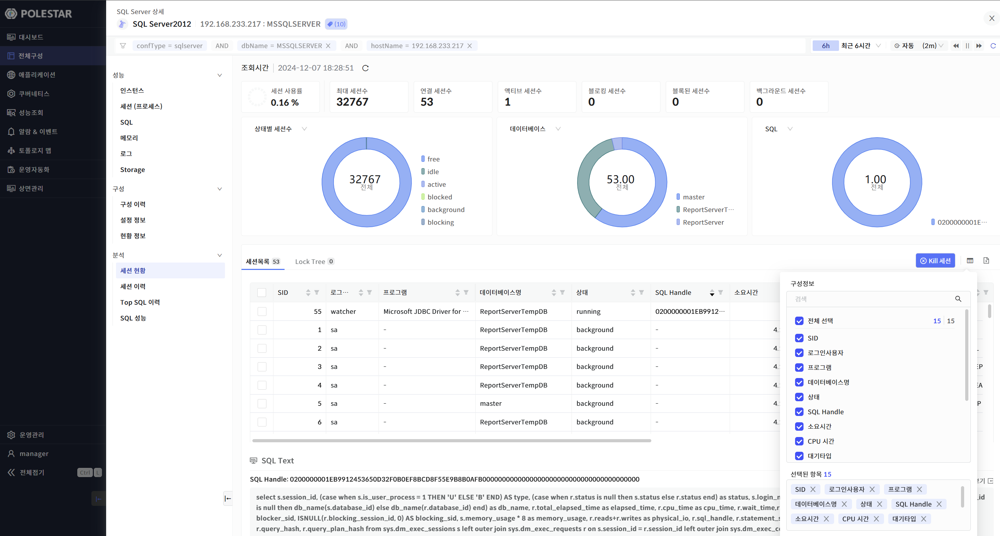

▶ \[그림44\] 세션목록 컬럼 수정

> 세션목록 컬럼 수정 절차

1.  세션목록에서 우측 상단 컬럼 수정 아이콘 클릭

2.  컬럼 수정 드로어에서 화면에 표시하고자 하는 컬럼을 체크박스에서 선택

3.  저장 버튼 클릭

엑셀 저장

세션 목록의 우측 상단 \[엑셀 저장\] 버튼을 통해 세션 목록을 엑셀로 저장할 수 있습니다. 컬럼 수정 기능, 상단 태그 검색 기능, 그리드 컬럼 검색 기능 등을 통해 엑셀에 보여줄 컬럼과 내용을 원하는 조건에 맞게 필터링하여 저장할 수 있습니다.

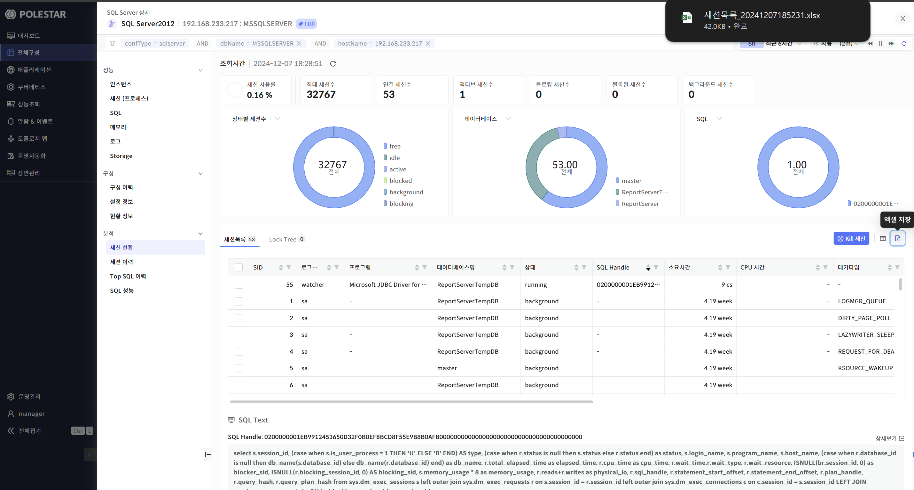

▶ \[그림45\] 세션목록 엑셀 저장

> 세션목록 엑셀 저장 절차

1.  세션 목록에서 우측 상단 엑셀 저장 아이콘 클릭

2.  브라우저 우측 상단 창에 저장된 엑셀 파일명이 표시됨

3.  해당 파일명을 클릭하여 엑셀 파일 확인

세션 이력

세션 이력 분석 기능을 통해 SQL Server에 접속한 세션들에 대해 7가지 관점(대기 이벤트, SQL, 데이터베이스, 프로그램, 호스트, 세션, Lock세션)으로 각 관점 별 수행 SQL과 수행시간, 대기이벤트 정보, Lock 정보 등을 확인할 수 있습니다.

대기 이벤트

대기 이벤트 관점으로 세션 수행 이력을 분석할 수 있는 화면입니다. 화면 구성은 상단에 해당 대기 이벤트를 대기한 세션의 수가 많은 순으로 표시하는 목록과 도넛 차트가 있고 그 밑으로 타임 셀렉터 기간 동안 해당 대기 이벤트를 대기한 세션 수를 누적 바차트로 표시합니다. 바 차트 밑으로는 상세 세션목록과 Lock Tree 목록이 표시되며 세션목록이나 Lock Tree에서 SQL Handle 컬럼에 있는 SQL Handle을 클릭하면 하단에 해당 SQL Handle에 대한 SQL Text가 표시됩니다.

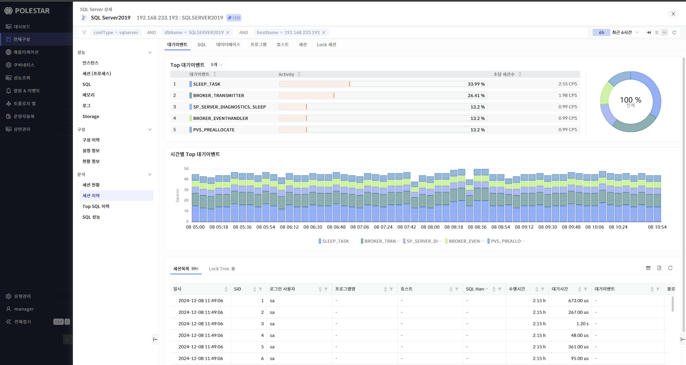

▶ \[그림46\] SQL Server 세션 이력 \> 대기 이벤트

Top 대기 이벤트

대기 이벤트 세션수가 많은 순으로 목록이 표시되며 특정 대기 이벤트를 클릭하면 하단 바차트에 선택된 대기 이벤트가 하이라이트 처리되며 세션목록, Lock Tree에는 선택된 대기 이벤트를 대기한 세션만 표시됩니다. Top 대기 이벤트 옆에 콤보 박스에서 Top 대기 이벤트 목록에 표시할 개수를 선택할 수 있습니다.

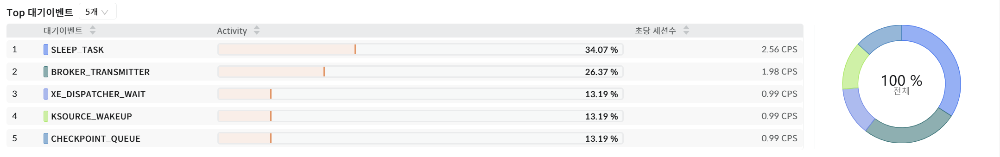

▶ \[그림47\] Top 대기 이벤트

> Top 대기 이벤트 목록

<table>
<thead>
<tr class="header">
<th>대기 이벤트</th>
<th>
세션이 대기한 대기 이벤트(타입) 이름입니다. 대기 이벤트(타입)은 태스크가 특정 리소스를 사용할 수 없을 때 대기하는 이유를 나타냅니다. SQL Server는 작업(Task)을 처리하는 동안 CPU, 메모리, 디스크, 잠금 등 다양한 리소스를 사용하며, 리소스가 부족하거나 잠금 등의 이유로 작업이 진행되지 못하면 해당 태스크는 대기 상태로 전환됩니다. 대기 이벤트(타입)은 이러한 대기의 원인을 진단하는 데 유용한 정보를 제공합니다.

주요 대기 이벤트(타입)

1) CPU 관련 대기

- SOS_SCHEDULER_YIELD: 태스크가 CPU에서 실행되었으나, 다른 태스크에게 CPU를 양보하고 다시 실행 대기 상태로 전환

- CXPACKET: 렬 쿼리의 스레드 간 동기화를 위해 대기. 병렬 처리가 비효율적으로 설정되었거나 데이터 분배가 균등하지 않은 경우 발생

2) 잠금 관련 대기

- LCK_M_X: 배타적 잠금(EXCLUSIVE LOCK)을 기다리는 대기 상태

- LCK_M_S: 공유 잠금(SHARED LOCK)을 기다리는 대기 상태

- LATCH_EX: 데이터 페이지 또는 메타데이터 변경을 위한 배타적 래치(EXCLUSIVE LATCH)를 기다리는 상태

3) I/O 관련 대기

- PAGEIOLATCH_SH: 스크에서 데이터 페이지를 읽어 메모리에 로드하는 동안 발생하는 대기

- WRITELOG: 트랜잭션 로그가 디스크에 기록될 때까지 대기하는 상태

- ASYNC_IO_COMPLETION: 비동기 I/O 작업 완료를 기다리는 상태

4) 메모리 관련 대기

- RESOURCE_SEMAPHORE: 쿼리가 메모리를 할당받기 위해 대기하는 상태

- MEMORY_ALLOCATION_EXT: 메모리 할당 작업 중 추가 자원을 기다리는 상태

5) 네트워크 관련 대기

- ASYNC_NETWORK_IO: 클라이언트가 서버에서 데이터를 수신하기를 기다리는 상태. (네트워크 대역폭 또는 클라이언트 응답 지연)

6) 기타 주요 대기

- HADR_SYNC_COMMIT: Always On 가용성 그룹에서 데이터 커밋 동기화를 기다리는 상태

- CLR_SEMAPHORE: CLR 작업을 실행하기 위해 리소스를 기다리는 상태
</th>
</tr>
</thead>
<tbody>
<tr class="odd">
<td>Activity</td>
<td>타임 셀렉터 기간동안 해당 대기 이벤트를 대기한 세션수의 비율입니다.</td>
</tr>
<tr class="even">
<td>초당 세션수</td>
<td>타임 셀렉터 기간동안 해당 대기 이벤트를 대기한 세션수를 초당 개수로 표현한 값입니다. 예를 들어 3 CPS면 초당 3개의 세션이 해당 대기이벤트를 대기했다 라고 해석할 수 있습니다.</td>
</tr>
</tbody>
</table>

기간별 Top 대기 이벤트(바차트)

타임 셀렉터 기간에 해당하는 대기 이벤트 대기 세션 수를 누적 바차트로 표시합니다. 바차트의 간격은 기간별로 달라지며 바 차트 개수는 최대 60개까지 표현됩니다. 바차트를 1개 선택하면 해당 시점의 바차트만 활성화되고 하단 세션 목록은 바 차트 1개에 해당하는 기간의 세션만 표시됩니다. 따라서 상단에 Top 대기 이벤트 목록에서 특정 SQL를 선택하고 바차트에서 특정 바 1개를 선택한다면 특정 시점에 선택한 대기 이벤트를 대기한 세션들만 세션 목록에서 필터링하여 조회할 수 있습니다.

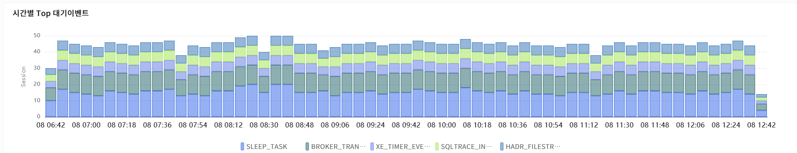

▶ \[그림48\] 기간별 대기 이벤트

세션목록

타임 셀렉터에 선택한 기간내 SQL Server에 접속 했던 모든 세션 이력이 표시됩니다. 해당 목록을 통해 과거 특정 시점에 어떤 로그인 사용자, 프로그램, 호스트가 접속했는지 확인 할 수 있으며 세션의 상태 및 수행중인 SQL, 대기중인 이벤트, 메모리 사용량 등을 확인 할 수 있습니다. 세션 목록은 추가로 하기와 같은 기능을 제공합니다.

제공 기능

1.  세션이 수행한 SQL Text를 보여주는 기능

2.  세션이 수행한 SQL에 대한 상세 이력 조회 기능

3.  세션 상세 이력 조회 기능

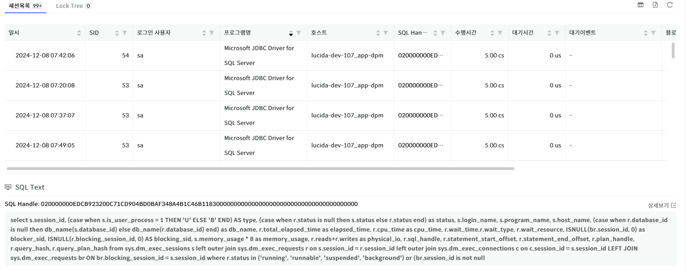

▶ \[그림49\] 세션 목록(이력)

<table>
<tbody>
<tr class="odd">
<td>
주의

세션 목록 상단 바 차트에서 바 1개를 선택 시 세션 목록 및 Lock Tree에는 선택한 바에 있는 범례의 세션만 표현되는 것이 아니고 해당 바 기간내의 모든 세션이 표시됩니다. 이는 해당 기간에 수행된 모든 세션을 함께 비교하기 위함입니다.
</td>
</tr>
</tbody>
</table>

> 세션 목록

<table>
<thead>
<tr class="header">
<th>일시</th>
<th>해당 세션 정보가 저장된 시간입니다.</th>
</tr>
</thead>
<tbody>
<tr class="odd">
<td>SID</td>
<td>세션을 고유하게 식별하는 세션 ID입니다. 각 세션은 고유한 SID를 가지며, 이를 통해 특정 세션을 추적할 수 있습니다. 세션 ID는 숫자로 표시됩니다.</td>
</tr>
<tr class="even">
<td>로그인 사용자</td>
<td>세션이 현재 사용하고 있는 로그인 사용자 이름입니다.</td>
</tr>
<tr class="odd">
<td>프로그램명</td>
<td>SQL Server에 연결된 클라이언트 프로그램의 이름입니다. 백그라운드 세션의 경우 값이 없습니다.</td>
</tr>
<tr class="even">
<td>데이터베이스명</td>
<td>현재 세션이 사용중인 데이터베이스 이름입니다.</td>
</tr>
<tr class="odd">
<td>상태</td>
<td>
세션의 상태를 표시

세션 상태값: running, suspended. runnable, pending, background, rollback, sleeping, preconnect, dormant

상태값은 하기 세션 상태값 설명 목록 참조
</td>
</tr>
<tr class="even">
<td>SQL Handle</td>
<td>현재 세션이 수행중인 SQL의 Handle값입니다. 해당 SQL Handle에 해당하는 SQL Text은 세션현황 화면이나 세션분석화면에서 볼 수 있습니다.</td>
</tr>
<tr class="odd">
<td>소요시간</td>
<td>세션이 현재 SQL 문을 실행하는 데 소요되고 있는 시간입니다.</td>
</tr>
<tr class="even">
<td>CPU 시간</td>
<td>세션이 현재 SQL 문을 실행하는 데 사용한 CPU 시간입니다.</td>
</tr>
<tr class="odd">
<td>대기시간</td>
<td>세션이 대기 이벤트에 있는 대기로 인해 대기한 시간입니다.</td>
</tr>
<tr class="even">
<td>대기리소스</td>
<td>세션이 현재 대기하고 있는 대상 리소스 입니다.</td>
</tr>
<tr class="odd">
<td>블로킹 SID</td>
<td>현재 세션을 블로킹하고 있는 세션의 SID입니다. 이는 잠금 경합 문제를 해결하는 데 중요한 정보를 제공합니다.</td>
</tr>
<tr class="even">
<td>메모리사용량</td>
<td>세션이 사용하고 있는 메모리 사용량입니다.</td>
</tr>
<tr class="odd">
<td>물리 IO수</td>
<td>세션이 사용하고 있는 물리 IO 수입니다.</td>
</tr>
<tr class="even">
<td>호스트명</td>
<td>해당 세션의 호스트명입니다. 백그라운드 세션의 경우는 표시되지 않습니다.</td>
</tr>
<tr class="odd">
<td>타입</td>
<td>세션이 백그라운드 세션(B)인지 사용자 세션(U)인지를 표시합니다.</td>
</tr>
</tbody>
</table>

> 세션 상태 값 목록

<table>
<thead>
<tr class="header">
<th>Running</th>
<th>세션이 현재 CPU에서 실행 중이며, 작업이 처리되고 있는 상태입니다.</th>
</tr>
</thead>
<tbody>
<tr class="odd">
<td>suspended</td>
<td>세션이 리소스(I/O, 잠금 등)를 기다리며 실행이 중단된 상태입니다. 주로 대기 유형(예: 잠금 대기, 디스크 I/O 병목)을 분석하여 원인을 파악해야 합니다.</td>
</tr>
<tr class="even">
<td>runnable</td>
<td>세션이 실행 준비를 마쳤으나, CPU 스케줄링을 기다리는 상태입니다. CPU 리소스 부족 또는 과도한 병렬 처리가 이 상태를 유발할 수 있습니다.</td>
</tr>
<tr class="odd">
<td>pending</td>
<td>세션이 아직 실행되지 않고 스케줄러 대기열에 배치될 준비를 하고 있는 상태입니다. 작업이 시작되기 전에 대기하는 짧은 준비 상태를 나타냅니다.</td>
</tr>
<tr class="even">
<td>background</td>
<td>SQL Server의 내부 작업(예: 체크포인트, 시스템 유지 관리)이 실행 중인 상태입니다.</td>
</tr>
<tr class="odd">
<td>Rollback</td>
<td>세션이 트랜잭션을 취소하고, 변경 사항을 되돌리는 작업을 수행 중인 상태입니다. 대규모 롤백 작업은 I/O 부하를 증가시킬 수 있으므로 지속 시간에 주의해야 합니다.</td>
</tr>
<tr class="even">
<td>sleeping</td>
<td>세션이 유휴 상태로, 클라이언트 요청을 기다리는 상태입니다. 유휴 세션이 많으면 연결 관리를 통해 자원 낭비를 줄이는 것이 좋습니다.</td>
</tr>
<tr class="odd">
<td>preconnect</td>
<td>
SQL Server가 클라이언트 연결 요청을 처리하기 위해 준비 중인 상태입니다.

네트워크 연결 문제나 리소스 부족으로 처리 지연이 발생할 수 있습니다.
</td>
</tr>
<tr class="even">
<td>dormant</td>
<td>세션이 비활성화된 상태로, 작업이 재활성화되기를 기다립니다. CLR 작업 완료 후 대기 상태에서 주로 발생하며, 특정 작업과 연관됩니다.</td>
</tr>
</tbody>
</table>

Lock Tree

SQL Server에 락 세션이 발생되면 Lock Tree 목록에서 해당 락 세션들을 확인할 수 있습니다. Lock Tree에서는 락을 유발한 세션(블로킹 세션)을 부모로 하고 해당 락으로 인해 블록된 세션을 자식으로 하는 트리 형태로 목록을 표시합니다. 부모락 세션을 기준으로 해당 트리를 접거나 펼쳐 볼 수 있으며 SQL ID 컬럼에 있는 SQL ID를 선택하면 하단에 Blocking 세션의 SQL과 블록된 세션의 SQL을 같이 표시합니다. SQL Text 창의 우측 상단에 상세보기 버튼을 클릭하면 SQL Text 상세 드로어가 표시되며 해당 드로어 화면에서 SQL에 대한 상세 성능 이력 정보 및 Plan 정보를 확인할 수 있습니다. 자세한 내용은 “개별 SQL 이력 보기(SQL Text 상세 드로어)”절을 참조하세요.

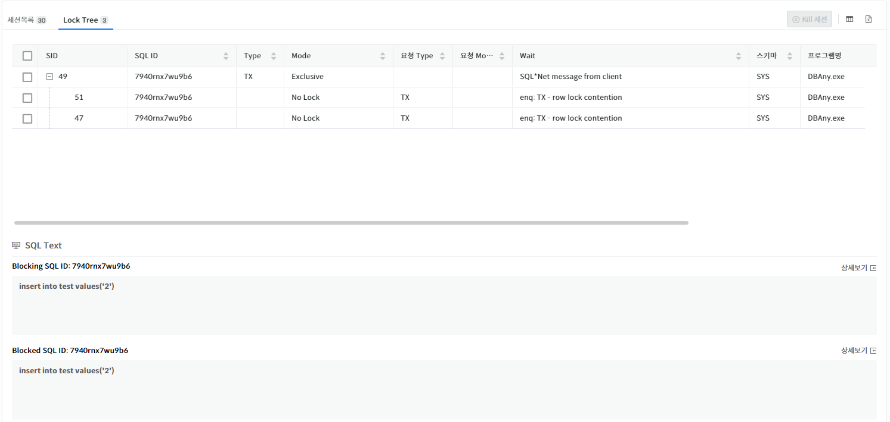

▶ \[그림50\] Lock Tree

> Lock Tree 목록

<table>
<thead>
<tr class="header">
<th>SID</th>
<th>Lock 발생일시, Lock 발생 세션, 블록 된 세션을 트리형태로 표현합니다. Lock이 발생된 시간을 최 상단 부모로 하여 Lock을 유발한 세션을 그 밑에 나오고 해당 Lock으로 인해 블록 된 세션을 Lock 유발세션의 자식으로 하는 트리형태로 표시합니다.</th>
</tr>
</thead>
<tbody>
<tr class="odd">
<td>SQL Handle</td>
<td>락을 유발하거나 락된 세션에서 수행한 SQL Handle(SQL 식별 ID)입니다.</td>
</tr>
<tr class="even">
<td>대기이벤트</td>
<td>Lock 대기 이벤트를 나타냅니다.</td>
</tr>
<tr class="odd">
<td>대기리소스</td>
<td>Lock으로 인해 대기중인 대상 리소스를 나타냅니다.</td>
</tr>
<tr class="even">
<td>대기 시간</td>
<td>Lock 대기 시간을 나타냅니다.</td>
</tr>
<tr class="odd">
<td>상태</td>
<td>
세션의 상태를 표시

세션 상태값: running, suspended. runnable, pending, background, rollback, sleeping, preconnect, dormant

상태값은 세션 상태값 설명 목록 참조
</td>
</tr>
<tr class="even">
<td>로그인사용자</td>
<td>세션이 현재 사용하고 있는 로그인 사용자 이름입니다.</td>
</tr>
<tr class="odd">
<td>프로그램명</td>
<td>SQL Server에 연결된 클라이언트 프로그램의 이름입니다. 백그라운드 세션의 경우 값이 없습니다.</td>
</tr>
<tr class="even">
<td>데이터베이스명</td>
<td>현재 세션이 사용중인 데이터베이스 이름입니다.</td>
</tr>
<tr class="odd">
<td>호스트명</td>
<td>해당 세션의 호스트명입니다. 백그라운드 세션의 경우는 표시되지 않습니다.</td>
</tr>
<tr class="even">
<td>타입</td>
<td>세션이 백그라운드 세션(B)인지 사용자 세션(U)인지를 표시합니다.</td>
</tr>
</tbody>
</table>

개별 세션 이력 조회(SID 드로어)

세션 목록의 SID 컬럼에서 특정 SID를 선택하면 선택한 세션에 대한 상세 이력을 조회할 수 있는 드로어 화면이 열립니다. 해당 화면을 선택한 세션이 과거에 수행한 SQL 및 대기 이벤트 정보를 상세 조회할 수 있습니다.

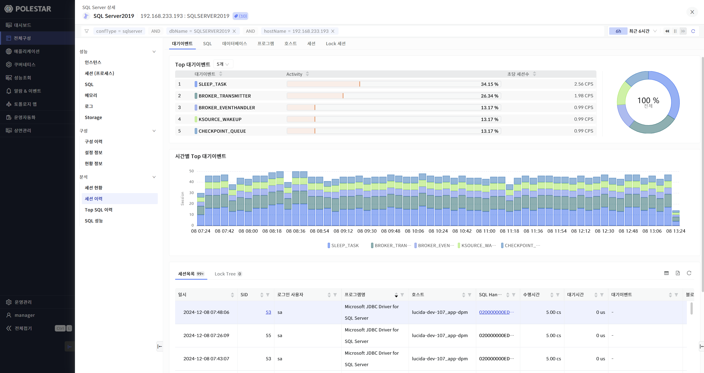

▶ \[그림51\] 세션목록에서 특정 SID 하나를 선택

▶ \[그림52\] 선택한 SID에 대한 세션 이력 화면

> 개별 세션 이력 조회 절차

1.  세션목록에서 특정 SID 하나를 선택(화면 예시: 55)

2.  선택한 SID(화면 예시: 55)에 대한 세션 상세 이력 화면이 표시됨

세션 수행 SQL 조회

세션 목록의 SQL Handle 컬럼에서 특정 SQL Handle을 선택하면 선택한 SQL Handle에 대한 SQL Text를 하단 SQL Text창에서 확인할 수 있습니다.

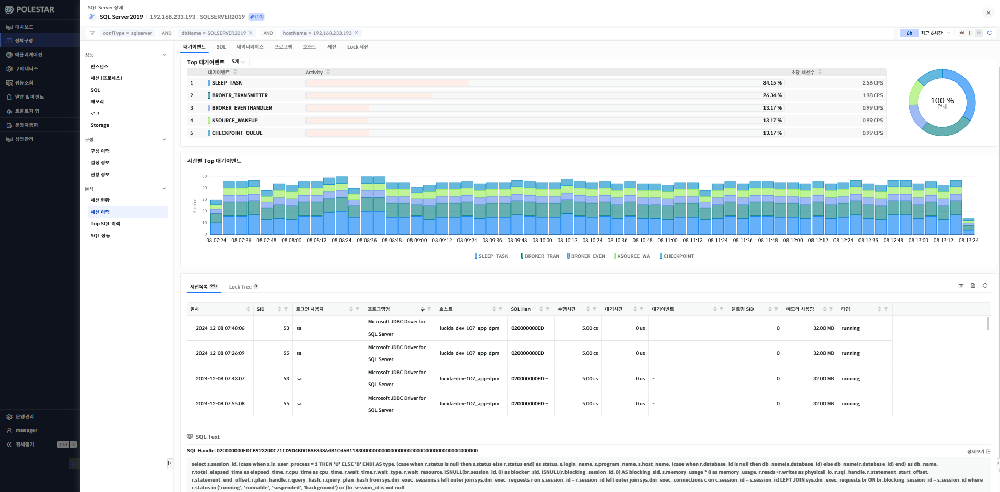

▶ \[그림53\] 선택한 SQL Handle에 대한 SQL Text 표시 화면

> 세션 수행 SQL 조회 절차

3.  세션목록에서 특정 SQL Handle을 선택

4.  하단 SQL Text 창에 선택한 SQL Handle에 대한 SQL Text가 표시됨

개별 SQL 이력 조회(SQL Text 상세 드로어)

SQL Text 창의 우측 상세보기 버튼을 클릭하면 해당 SQL에 대한 상세 성능 이력 정보를 조회할 수 있는 드로어 화면이 나옵니다. 개별 SQL 이력 조회를 통해 해당 SQL의 과거 수행 이력 및 수행시간 Plan 정보, 수행 세션 수 정보 등을 확인할 수 있습니다.

▶ \[그림54\] 개별 SQL 이력 조회 절차

▶ \[그림55\] 개별 SQL에 대한 이력 화면

> 개별 SQL 이력 조회 절차

1.  세션목록에서 특정 SQL Handle을 선택

2.  하단 SQL Text 창에 선택한 SQL Handle에 대한 SQL Text가 표시됨

3.  SQL Text 우측 상단에 상세보기 버튼 클릭

4.  선택한 SQL에 대한 이력 조회 드로어 화면 표시

5.  좌측 상단 콤보 박스에서 최근수행시간, 최근 CPU시간등을 선택하여 개별 SQL 성능 조회

<table>
<tbody>
<tr class="odd">
<td>
노트

SQL Text 상세 드로어 화면에서는 좌측 상단 콤보 박스에서 최근 수행시간, 최근 CPU 시간등의 항목을 선택하여 선택한 항목 기준으로 SQL이 수행한 성능 이력 정보를 확인할 수 있습니다.
</td>
</tr>
</tbody>
</table>

SQL

SQL 이 수행된 관점으로 세션 수행 이력을 분석할 수 있는 화면입니다. 화면 구성은 상단에 해당 SQL을 수행한 세션의 수가 많은 순으로 표시하는 목록과 도넛 차트가 있고 그 밑으로 타임 셀렉터 기간 동안 해당 SQL을 수행한 세션수를 누적 바차트로 표시합니다. 바 차트 밑으로는 상세 세션목록과 Lock Tree 목록이 표시되며 세션목록이나 Lock Tree에서 SQL Handle 컬럼에 있는 SQL Handle을 클릭하면 하단에 해당 SQL Handle에 대한 SQL Text가 표시됩니다.

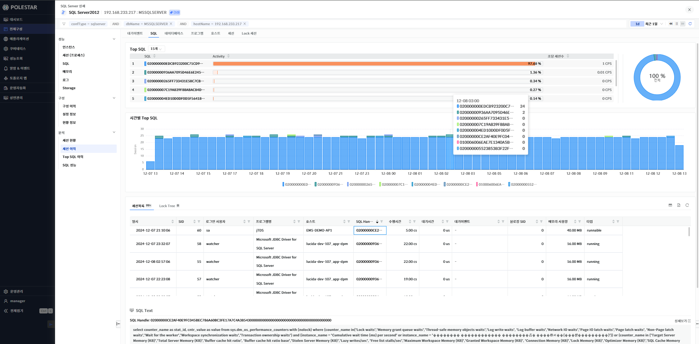

▶ \[그림56\] SQL Server 세션 이력 \> SQL

Top SQL 목록

SQL을 수행한 세션수가 많은 순으로 목록이 표시되며 특정 SQL을 클릭하면 하단 바차트에 선택된 SQL이 하이라이트 처리되며 세션목록, Lock Tree에는 선택된 SQL을 수행한 세션만 표시됩니다. Top SQL 타이틀 옆에 콤보 박스에서 Top SQL 목록에 표시할 개수를 선택할 수 있습니다.

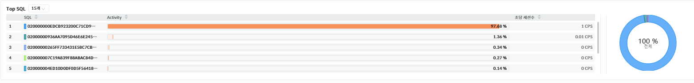

▶ \[그림57\] Top SQL 목록

> Top SQL 목록

<table>
<thead>
<tr class="header">
<th>SQL</th>
<th>
세션이 수행한 SQL Handle입니다.

해당 SQL Handle에 마우스를 Hover하면 SQL Handle에 해당하는 SQL Text가 툴 팁으로 표시됩니다.
</th>
</tr>
</thead>
<tbody>
<tr class="odd">
<td>Activity</td>
<td>타임 셀렉터 기간동안 해당 SQL을 실행한 세션수의 비율입니다.</td>
</tr>
<tr class="even">
<td>초당 세션수</td>
<td>타임 셀렉터 기간동안 해당 SQL을 수행한 세션수를 초당 개수로 표현한 값입니다. 예를 들어 3 CPS면 초당 3개의 세션이 해당 SQL을 수행 했다라고 해석할 수 있습니다.</td>
</tr>
</tbody>
</table>

기간별 Top SQL(바차트)

타임 셀렉터 기간에 해당하는 SQL 수행 세션 수를 누적 바차트로 표시합니다. 바차트의 간격은 기간별로 달라지며 바 차트 개수는 최대 60개까지 표현됩니다. 바차트를 1개 선택하면 해당 시점의 바차트만 활성화되고 하단 세션 목록은 바 차트 1개에 해당하는 기간의 세션만 표시됩니다. 따라서 상단에 Top SQL 목록에서 특정 SQL를 선택하고 바차트에서 특정 바 1개를 선택한다면 특정 시점에 선택한 SQL을 수행한 세션들만 세션 목록에서 필터링하여 조회할 수 있습니다.

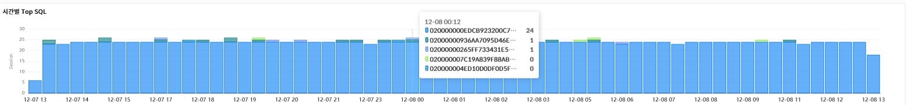

▶ \[그림58\] 기간별 Top SQL

세션목록

세션목록은 대기 이벤트 탭의 세션목록과 기능이 동일합니다. 대기 이벤트 탭 절을 참조하세요.

데이터베이스

세션이 수행된 데이터베이스 관점으로 세션 수행 이력을 분석할 수 있는 화면입니다. 화면 구성은 상단에 해당 데이터베이스에서 수행된 세션의 수가 많은 순으로 표시하는 목록과 도넛 차트가 있고 그 밑으로 타임 셀렉터 기간 동안 해당 데이터베이스에서 수행된 세션 수를 누적 바차트로 표시합니다. 바 차트 밑으로는 상세 세션목록과 Lock Tree 목록이 표시되며 세션목록이나 Lock Tree에서 SQL Handle 컬럼에 있는 SQL Handle를 클릭하면 하단에 해당 SQL Handle에 대한 SQL Text가 표시됩니다.

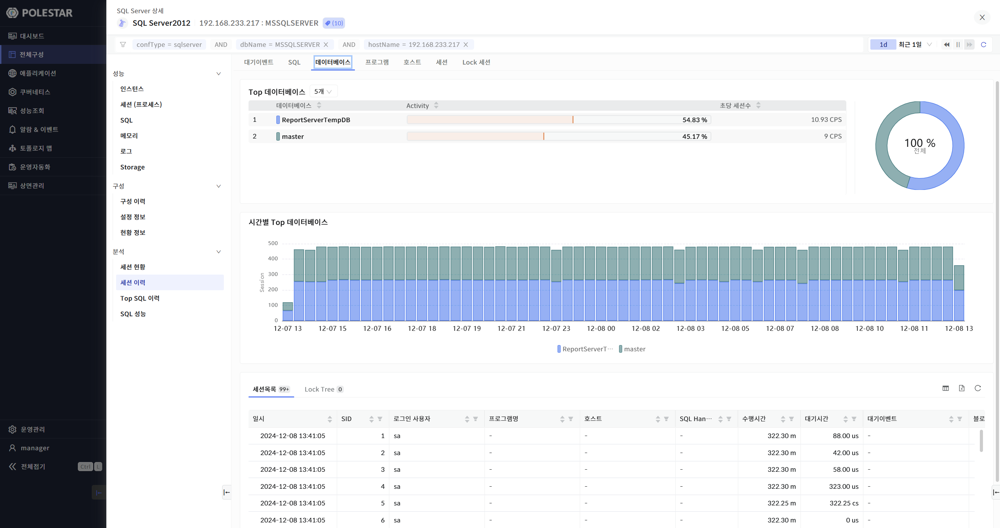

▶ \[그림59\] SQL Server 세션 이력 \> 데이터베이스

Top 데이터베이스 목록

대상 데이터베이스에서 수행한 세션수가 많은 순으로 목록이 표시되며 특정 데이터베이스를 클릭하면 하단 바차트에 선택된 데이터베이스가 하이라이트 처리되며 세션목록, Lock Tree에는 선택된 데이터베이스에서 수행한 세션만 표시됩니다. Top 데이터베이스 타이틀 옆에 콤보 박스에서 Top 스키마 목록에 표시할 개수를 선택할 수 있습니다.

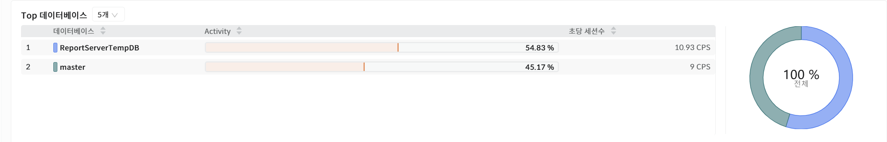

▶ \[그림60\] Top 데이터베이스 목록

> Top 데이터베이스 목록

| 데이터베이스   | 세션이 수행된 데이터베이스 명입니다.                                                                             |
| -------- | ------------------------------------------------------------------------------------------------ |
| Activity | 타임 셀렉터 기간동안 해당 스키마가 실행한 세션수의 비율입니다.                                                              |
| 초당 세션수   | 타임 셀렉터 기간동안 해당 스키마가 수행한 세션수를 초당 개수로 표현한 값입니다. 예를 들어 3 CPS면 초당 3개의 세션을 해당 스키마가 수행했다라고 해석할 수 있습니다. |

기간별 Top 데이터베이스(바차트)

타임 셀렉터 기간에 해당하는 데이터베이스가 수행한 세션 수를 누적 바차트로 표시합니다. 바차트의 간격은 기간별로 달라지며 바 차트 개수는 최대 60개까지 표현됩니다. 바차트를 1개 선택하면 해당 시점의 바차트만 활성화되고 하단 세션 목록은 바 차트 1개에 해당하는 기간의 세션만 표시됩니다. 따라서 상단에 Top 데이터베이스 목록에서 특정 데이터베이스를 선택하고 바차트에서 특정 바 1개를 선택한다면 특정 시점에 선택한 데이터베이스가 수행한 세션들만 세션 목록에서 필터링하여 조회할 수 있습니다.

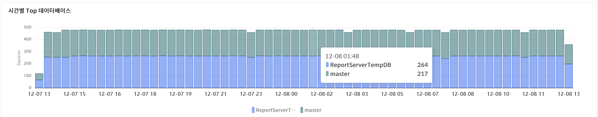

▶ \[그림61\] 기간별 Top 데이터베이스

세션 목록

세션목록은 대기 이벤트 탭의 세션목록과 기능이 동일합니다. 대기 이벤트 탭 절을 참조하세요.

프로그램

세션을 수행한 프로그램 관점으로 세션 수행 이력을 분석할 수 있는 화면입니다. 화면 구성은 상단에 해당 프로그램이 수행한 세션의 수가 많은 순으로 표시하는 목록과 도넛 차트가 있고 그 밑으로 타임 셀렉터 기간 동안 해당 프로그램이 수행한 세션 수를 누적 바차트로 표시합니다. 바 차트 밑으로는 상세 세션목록과 Lock Tree 목록이 표시되며 세션목록이나 Lock Tree에서 SQL Handle 컬럼에 있는 SQL Handle를 클릭하면 하단에 해당 SQL Handle에 대한 SQL Text가 표시됩니다.

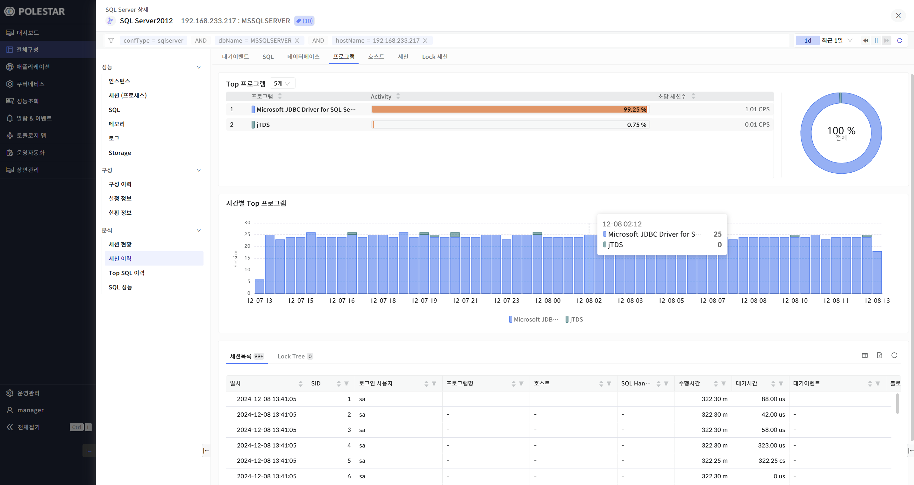

▶ \[그림62\] SQL Server 세션 이력 \> 프로그램

Top 프로그램 목록

프로그램이 수행한 세션수가 많은 순으로 목록이 표시되며 특정 프로그램을 클릭하면 하단 바차트에 선택된 프로그램이 하이라이트 처리되며 세션목록, Lock Tree에는 선택된 프로그램에서 수행한 세션만 표시됩니다. Top 프로그램 타이틀 옆에 콤보 박스에서 Top 프로그램 목록에 표시할 개수를 선택할 수 있습니다.

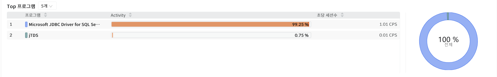

▶ \[그림63\] Top 프로그램 목록

> Top 프로그램 목록

| 프로그램     | 세션을 수행한 프로그램 명입니다.                                                                                   |
| -------- | ---------------------------------------------------------------------------------------------------- |
| Activity | 타임 셀렉터 기간동안 해당 프로그램이 실행한 세션수의 비율입니다.                                                                 |
| 초당 세션수   | 타임 셀렉터 기간동안 해당 프로그램이 수행한 세션수를 초당 개수로 표현한 값입니다. 예를 들어 3 CPS면 초당 3개의 세션을 해당 프로그램이 수행 했다라고 해석 할 수 있습니다. |

기간별 Top 프로그램(바차트)

타임 셀렉터 기간에 해당하는 프로그램이 수행한 세션 수를 누적 바차트로 표시합니다. 바차트의 간격은 기간별로 달라지며 바 차트 개수는 최대 60개까지 표현됩니다. 바차트를 1개 선택하면 해당 시점의 바차트만 활성화되고 하단 세션 목록은 바 차트 1개에 해당하는 기간의 세션만 표시됩니다. 따라서 상단에 Top 프로그램 목록에서 특정 프로그램을 선택하고 바차트에서 특정 바 1개를 선택한다면 특정 시점에 선택한 프로그램이 수행한 세션들만 세션 목록에서 필터링하여 조회할 수 있습니다.

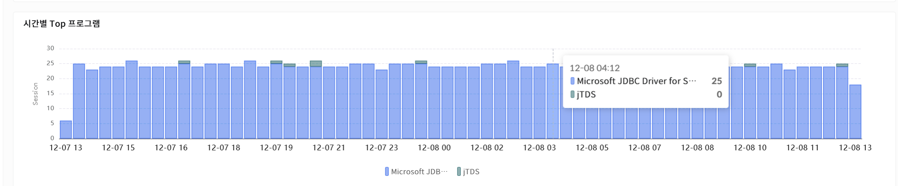

▶ \[그림64\] 기간별 Top 프로그램

세션목록

세션목록은 대기 이벤트 탭의 세션목록과 기능이 동일합니다. 대기 이벤트 탭 절을 참조하세요.

호스트

세션을 수행한 호스트(클라이언트) 관점으로 세션 수행 이력을 분석할 수 있는 화면입니다. 화면 구성은 상단에 해당 호스트가 수행한 세션의 수가 많은 순으로 표시하는 목록과 도넛 차트가 있고 그 밑으로 타임 셀렉터 기간 동안 해당 호스트가 수행한 세션 수를 누적 바차트로 표시합니다. 바 차트 밑으로는 상세 세션목록과 Lock Tree 목록이 표시되며 세션목록이나 Lock Tree에서 SQL Handle 컬럼에 있는 SQL Handle을 클릭하면 하단에 해당 SQL Handle에 대한 SQL Text가 표시됩니다.

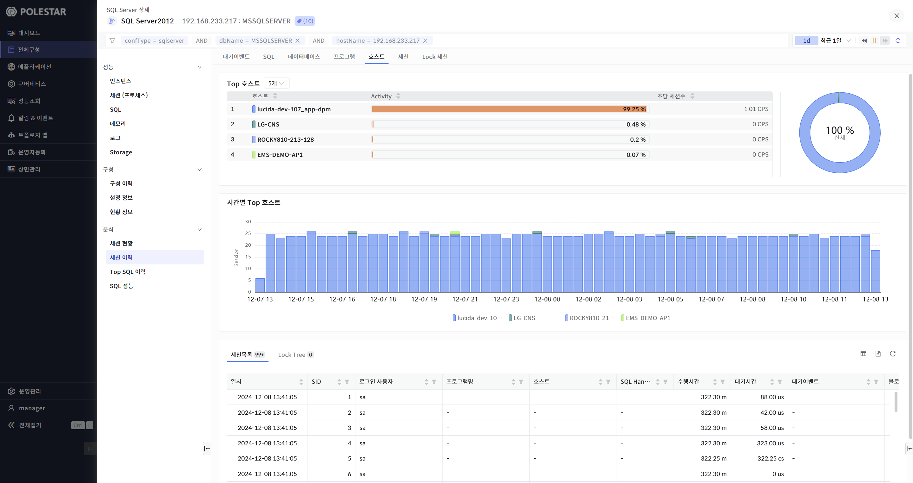

▶ \[그림65\] SQL Server 세션 이력 \> 호스트

Top 호스트 목록

호스트(클라이언트)가 수행한 세션수가 많은 순으로 목록이 표시되며 특정 호스트를 클릭하면 하단 바차트에 선택된 호스트가 하이라이트 처리되며 세션목록, Lock Tree에는 선택된 호스트에서 수행한 세션만 표시됩니다. Top 호스트 타이틀 옆에 콤보 박스에서 Top 호스트 목록에 표시할 개수를 선택할 수 있습니다.

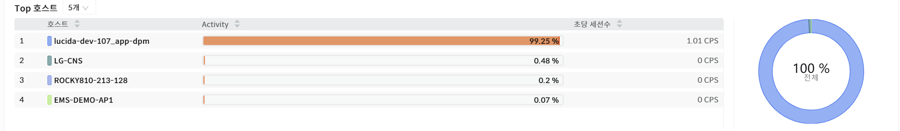

▶ \[그림66\] Top 호스트 목록

> Top 호스트 목록

| 호스트      | 세션을 수행한 호스트(클라이언트) 명입니다.                                                                          |
| -------- | ------------------------------------------------------------------------------------------------- |
| Activity | 타임 셀렉터 기간동안 해당 호스트가 실행한 세션수의 비율입니다.                                                               |
| 초당 세션수   | 타임 셀렉터 기간동안 해당 호스트가 수행한 세션수를 초당 개수로 표현한 값입니다. 예를 들어 3 CPS면 초당 3개의 세션을 해당 호스트가 수행 했다라고 해석할 수 있습니다. |

기간별 Top 호스트(바차트)

타임 셀렉터 기간에 해당하는 호스트가 수행한 세션 수를 누적 바차트로 표시합니다. 바차트의 간격은 기간별로 달라지며 바 차트 개수는 최대 60개까지 표현됩니다. 바차트를 1개 선택하면 해당 시점의 바차트만 활성화되고 하단 세션 목록은 바 차트 1개에 해당하는 기간의 세션만 표시됩니다. 따라서 상단에 Top 호스트 목록에서 특정 호스트를 선택하고 바차트에서 특정 바 1개를 선택한다면 특정 시점에 선택한 호스트가 수행한 세션들만 세션 목록에서 필터링하여 조회할 수 있습니다.

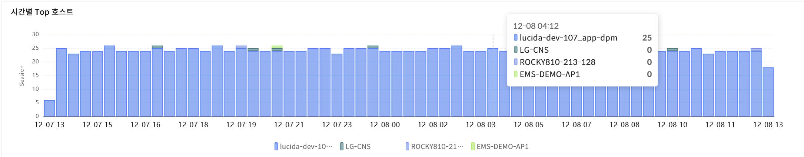

▶ \[그림67\] 기간별 Top 호스트

세션목록

세션목록은 대기 이벤트 탭의 세션목록과 기능이 동일합니다. 대기 이벤트 탭 절을 참조하세요.

Lock 세션

SQL Server에 발생했던 Lock 관련 세션 정보를 조회하고 분석할 수 있는 화면입니다. 화면 구성은 상단에 Lock 발생이 많았던 세션 SID 순으로 표시하는 목록과 도넛 차트가 있고 그 밑으로 타임 셀렉터 기간 동안 Lock이 발생된 세션에 대한 세션 수를 누적 바차트로 표시합니다. 바 차트내 바 1개를 클릭하면 해당 바에 해당하는 기간 동안의 Lock 세션 이력이 하단 Lock Tree 목록에 표시됩니다. 바 차트 밑으로는 상세 세션목록과 Lock Tree 목록이 표시되며 세션목록이나 Lock Tree에서 SQL Handle 컬럼에 있는 SQL Handle을 클릭하면 하단에 해당 SQL Handle에 대한 SQL Text가 표시됩니다.

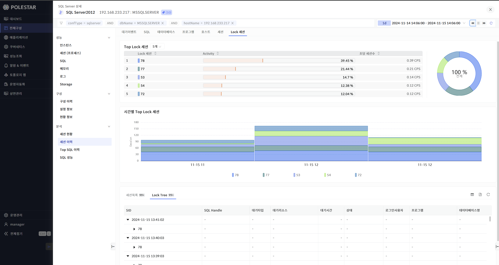

▶ \[그림68\] SQL Server 세션 이력 \> Lock 세션

Lock Tree

SQL Server에 락 세션이 발생되면 Lock Tree 목록에서 해당 락 세션들을 확인할 수 있습니다. Lock Tree에서는 락을 유발한 세션(블로킹 세션)을 부모로 하고 해당 락으로 인해 블록된 세션을 자식으로 하는 트리 형태로 목록을 표시합니다. 부모락 세션을 기준으로 해당 트리를 접거나 펼쳐 볼 수 있으며 SQL ID 컬럼에 있는 SQL ID를 선택하면 하단에 해당 SQL ID에 해당하는 SQL Text가 표시됩니다. SQL Text 창의 우측 상단에 SQL문 포메팅 버튼을 클릭하면 해당 SQL문을 포메팅하여 볼 수 있으며 상세보기버튼을 클릭하면 SQL Text 상세 드로어가 표시되며 해당 드로어 화면에서 SQL에 대한 상세 성능 이력 정보 및 Plan 정보를 확인할 수 있습니다. 자세한 내용은 “개별 SQL 이력 보기(SQL Text 상세 드로어)”절을 참조하세요.

▶ \[그림69\] Lock Tree

> Lock Tree 목록

<table>
<thead>
<tr class="header">
<th>SID</th>
<th>Lock 발생일시, Lock 발생 세션, 블록 된 세션을 트리형태로 표현합니다. Lock이 발생된 시간을 최 상단 부모로 하여 Lock을 유발한 세션을 그 밑에 나오고 해당 Lock으로 인해 블록 된 세션을 Lock 유발세션의 자식으로 하는 트리형태로 표시합니다.</th>
</tr>
</thead>
<tbody>
<tr class="odd">
<td>SQL Handle</td>
<td>락을 유발하거나 락된 세션에서 수행한 SQL Handle(SQL 식별 ID)입니다.</td>
</tr>
<tr class="even">
<td>대기이벤트</td>
<td>Lock 대기 이벤트를 나타냅니다.</td>
</tr>
<tr class="odd">
<td>대기리소스</td>
<td>Lock으로 인해 대기중인 대상 리소스를 나타냅니다.</td>
</tr>
<tr class="even">
<td>대기 시간</td>
<td>Lock 대기 시간을 나타냅니다.</td>
</tr>
<tr class="odd">
<td>상태</td>
<td>
세션의 상태를 표시

세션 상태값: running, suspended. runnable, pending, background, rollback, sleeping, preconnect, dormant

상태값은 세션 상태값 설명 목록 참조
</td>
</tr>
<tr class="even">
<td>로그인사용자</td>
<td>세션이 현재 사용하고 있는 로그인 사용자 이름입니다.</td>
</tr>
<tr class="odd">
<td>프로그램명</td>
<td>SQL Server에 연결된 클라이언트 프로그램의 이름입니다. 백그라운드 세션의 경우 값이 없습니다.</td>
</tr>
<tr class="even">
<td>데이터베이스명</td>
<td>현재 세션이 사용중인 데이터베이스 이름입니다.</td>
</tr>
<tr class="odd">
<td>호스트명</td>
<td>해당 세션의 호스트명입니다. 백그라운드 세션의 경우는 표시되지 않습니다.</td>
</tr>
<tr class="even">
<td>타입</td>
<td>세션이 백그라운드 세션(B)인지 사용자 세션(U)인지를 표시합니다.</td>
</tr>
</tbody>
</table>

Top SQL 이력 분석

Top SQL 이력 분석 기능을 통해 SQL Server에 수행된 SQL들 중에 성능 이슈가 있는 SQL등을 3가지 관점(SQL, 데이터베이스, 객체)으로 분석해 볼 수 있습니다. SQL의 다양한 성능(최근 수행시간, 총 수행시간, 수행 수, 최근 CPU 시간, 최근 논리 읽기 수, 최근 물리 읽기 수 등) 기준으로, 최대 30개의 Top SQL을 검색하여 분석할 수 있습니다.

SQL

개별 SQL 단위로 성능 지연이 발생한 SQL을 분석할 수 있는 화면입니다. 다양한 성능 지표로 Top SQL을 조회하고 해당 Top SQL의 수행이력을 조회해 볼 수 있습니다. 또한 개별 SQL을 선택하여 한 SQL에 대한 상세 이력 분석이 가능하며 Top SQL 상세 목록에서 Plan Handle 값을 선택하면 상세 실행계획을 트리 그리드형태로 확인해 볼 수 있습니다. 또한 개별 SQL에 Plan 이 여려 개인 경우 Plan간 비교 기능도 제공합니다.

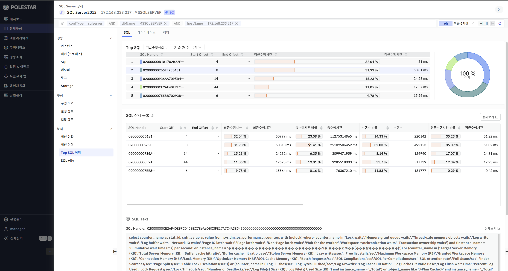

▶ \[그림70\] SQL Server Top SQL 이력 \> SQL

Top SQL 목록

Top SQL 목록 상단 콤보 박스에서 선택한 성능 지표(기본: 수행시간)가 높은 SQL을 선택한 기준개수(기본: 5개)만큼 표시합니다. 목록에서 특정 SQL Handle를 클릭하면 하단 SQL 상세 목록에 선택된 SQL 이력 세션만 표시됩니다. Top SQL 기준 성능 지표(최근수행시간, 총수행시간, 수행수, 평균 수행시간, 최근 CPU 시간, 최근 메모리 사용량, 최근 논리 읽기 수, 최근 물리 읽기 수, 최근 논리 쓰기수, 최근 로우수)는 목록 상단 콤보 박스에서 선택할 수 있으며 Top SQL 개수도 목록 상단 개준 개수(5개, 10개, 15개, 20개, 30개)를 콤보 박스에서 선택할 수 있습니다.

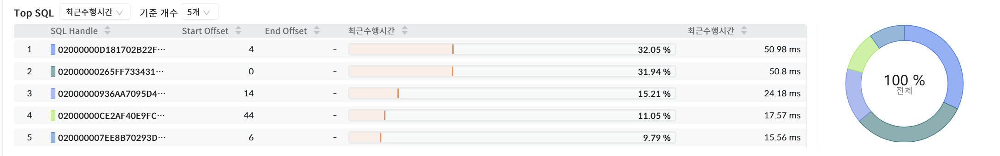

▶ \[그림71\] Top SQL 목록

> Top SQL 목록

| SQL Handle   | Top SQL Handle 입니다. SQL Handle에 마우스를 Hover하면 해당 SQL Handle에 해당하는 SQL Text가 툴팁으로 표시됩니다. 또한 해당 SQL Handle를 선택하면 하단 Top SQL 상세 목록에서 해당 SQL Handle에 해당하는 이력만 표시됩니다. |
| ------------ | --------------------------------------------------------------------------------------------------------------------------------------------------------------- |
| Start Offset | 대상 SQL의 SQL Handle내 Start Offset입니다.                                                                                                                            |
| End Offset   | 대상 SQL의 SQL Handle내 End Offset입니다.                                                                                                                              |
| 최근수행시간 비율    | Top SQL목록에 표시된 SQL의 최근수행시간의 합에서 해당 SQL의 최근 수행한 시간의 비율입니다.                                                                                                       |
| 최근 수행시간      | 해당 SQL의 조회 기간내 최근 수행시간의 평균값입니다.                                                                                                                                 |

SQL 상세 목록

Top SQL 목록 데이터의 상세 정보가 SQL 상세 목록에서 원하는 SQL의 Handle값을 선택하면 하단 SQL Text 창에 대상 SQL이 선택됩니다. 목록 우측 상단 상세보기 버튼을 클릭하면 타임셀렉터에 선택된 기간내에 수행된 Top SQL 이력 드로어가 표시됩니다.

▶ \[그림72\] SQL 상세 목록

> SQL 상세 목록

| SQL Handle   | Top SQL Handle 입니다. SQL Handle에 마우스를 Hover하면 해당 SQL Handle에 해당하는 SQL Text가 툴팁으로 표시됩니다. 또한 해당 SQL Handle를 선택하면 하단 Top SQL 상세 목록에서 해당 SQL Handle에 해당하는 이력만 표시됩니다. |
| ------------ | --------------------------------------------------------------------------------------------------------------------------------------------------------------- |
| Start Offset | 대상 SQL의 SQL Handle내 Start Offset입니다.                                                                                                                            |
| End Offset   | 대상 SQL의 SQL Handle내 End Offset입니다.                                                                                                                              |
| 최근수행시간 비율    | Top SQL목록에 표시된 SQL의 최근수행시간의 합에서 해당 SQL의 최근 수행한 시간의 비율입니다.                                                                                                       |
| 최근 수행시간      | 해당 SQL의 조회 기간내 최근 수행시간의 평균값입니다.                                                                                                                                 |
| 총수행시간비율      | Top SQL목록에 표시된 SQL의 총수행시간의 합에서 해당 SQL의 총 수행한 시간의 비율입니다.                                                                                                         |
| 총수행시간        | 해당 SQL의 조회 기간내 총 수행시간의 평균값입니다.                                                                                                                                  |
| 수행수 비율       | Top SQL목록에 표시된 SQL의 수행수의 합에서 해당 SQL의 총 수행수의 비율입니다.                                                                                                              |
| 수행수          | 해당 SQL의 조회 기간내 총 수행수의 평균값입니다.                                                                                                                                   |
| 평균수행시간비율     | Top SQL목록에 표시된 SQL의 평균수행시간의 합에서 해당 SQL의 평균수행시간의 비율입니다.                                                                                                          |
| 평균수행시간       | 해당 SQL의 조회 기간내 평균수행시간의 평균값입니다.                                                                                                                                  |
| 최근CPU시간비율    | Top SQL목록에 표시된 SQL의 최근CPU시간의 합에서 해당 SQL의 최근CPU시간의 비율입니다.                                                                                                        |
| 최근CPU시간      | 해당 SQL의 조회 기간내 최근CPU시간의 평균값입니다.                                                                                                                                 |
| 최근메모리사용량비율   | Top SQL목록에 표시된 SQL의 최근메모리사용량의 합에서 해당 SQL의 최근메모리사용량의 비율입니다.                                                                                                      |
| 최근메모리사용량     | 해당 SQL의 조회 기간내 최근메모리사용량의 평균값입니다.                                                                                                                                |
| 최근논리읽기수비율    | Top SQL목록에 표시된 SQL의 최근논리읽기수의 합에서 해당 SQL의 최근논리읽기수의 비율입니다.                                                                                                        |
| 최근논리읽기수      | 해당 SQL의 조회 기간내 최근논리읽기수의 평균값입니다.                                                                                                                                 |
| 최근물리읽기수비율    | Top SQL목록에 표시된 SQL의 최근물리읽기수의 합에서 해당 SQL의 최근물리읽기수의 비율입니다.                                                                                                        |
| 최근물리읽기수      | 해당 SQL의 조회 기간내 최근물리읽기수의 평균값입니다.                                                                                                                                 |
| 최근논리쓰기수비율    | Top SQL목록에 표시된 SQL의 최근논리쓰기수의 합에서 해당 SQL의 최근논리쓰기수의 비율입니다.                                                                                                        |
| 최근논리쓰기수      | 해당 SQL의 조회 기간내 최근논리쓰기수의 평균값입니다.                                                                                                                                 |
| 최근로우수비율      | Top SQL목록에 표시된 SQL의 최근로우수의 합에서 해당 SQL의 최근로우수의 비율입니다.                                                                                                            |
| 최근로우수        | 해당 SQL의 조회 기간내 최근로우수의 평균값입니다.                                                                                                                                   |

Top SQL 상세 목록

SQL 상세 목록 우측 상단의 상세보기 버튼을 클릭하면 타임 셀렉터에 선택한 기간내의 수집한 Top SQL 전체 목록 드로어가 표시됩니다. 상단 Top SQL 목록에서 원하는 SQL만 선택하였다면 대상 SQL만 필터링 하여 보실 수 있습니다. Top SQL 상세 목록을 해당 기간 어떤 SQL이 성능 부하를 발생하였는지 여러 성능 기준으로 확인하실 수 있습니다.

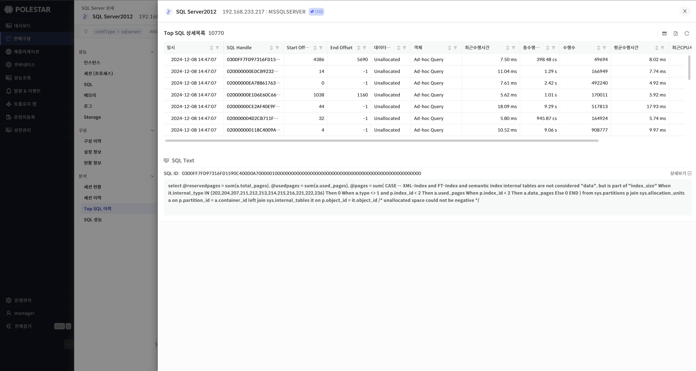

▶ \[그림73\] Top SQL 상세 목록

> Top SQL 상세 목록

| 일시           | 해당 SQL의 이력 정보가 수집된 일시 입니다.                                                       |
| ------------ | -------------------------------------------------------------------------------- |
| SQL Handle   | 대상 SQL의 SQL Handle 입니다. 해당 SQL Handle를 선택하면 하단 SQL Text창에 선택한 SQL Text가 표시됩니다.   |
| Start Offset | 대상 SQL의 SQL Handle내 Start Offset입니다.                                             |
| End Offset   | 대상 SQL의 SQL Handle내 End Offset입니다.                                               |
| 데이터베이스       | 해당 SQL이 수행된 데이터베이스명입니다. 스토어드 프로시저와 같은 객체 타입인 경우 표시되며 Ad-hoc Query인 경우 표시되지 않습니다. |
| 객체           | 스토어드 프로시저와 같은 객체 타입인 경우 해당 객체명이 표시됩니다. Ad-hoc Query인 경우는 Ad-hoc Query라고 표시됩니다.   |
| 최근 수행시간      | 해당 SQL의 해당 시점 최근 수행 시간입니다.                                                       |
| 총수행시간        | SQL Server기동 이후 해당 이력이 수집된 시점까지 SQL이 수행된 총 수행 시간입니다..                            |
| 수행수          | SQL Server기동 이후 해당 이력이 수집된 시점까지 SQL이 수행된 총 수행 수입니다..                             |
| 평균수행시간       | SQL Server기동 이후 해당 이력이 수집된 시점까지 SQL이 수행된 평균 수행 시간입니다.                            |
| 최근CPU시간      | 해당 SQL의 해당 시점 최근 CPU 시간입니다.                                                      |
| 최근메모리사용량     | 해당 SQL의 해당 시점 최근 메모리 사용량입니다.                                                     |
| 최근논리읽기수      | 해당 SQL의 해당 시점 최근 논리 읽기 수입니다.                                                     |
| 최근물리읽기수      | 해당 SQL의 해당 시점 최근 물리 읽기 수입니다.                                                     |
| 최근논리쓰기수      | 해당 SQL의 해당 시점 최근 논리 쓰기 수입니다.                                                     |
| 최근로우수        | 해당 SQL의 해당 시점 최근 로우 수입니다.                                                        |

<table>
<tbody>
<tr class="odd">
<td>
노트

Top SQL에 나오는 SQL 목록은 상단 Top SQL에 표시된 SQL만 나오는 것이 아니고 타임 셀렉터에 선택한 기간내 Top SQL로 수집한 모든 SQL이 나옵니다. Top SQL 수집 여부 및 개수 설정은 SQL Server 추가시나 설정 정보에서 변경하실 수 있습니다.
</td>
</tr>
</tbody>
</table>

개별 SQL 이력 조회(SQL Text 상세 드로어)

SQL Text 창의 우측 상세보기 버튼을 클릭하면 해당 SQL에 대한 상세 성능 이력 정보를 조회할 수 있는 드로어 화면이 나옵니다. 개별 SQL 이력 조회를 통해 해당 SQL의 과거 수행 이력 및 수행시간 Plan 정보, 수행 세션 수 정보 등을 확인할 수 있습니다.

▶ \[그림74\] 개별 SQL 이력 조회 절차

▶ \[그림75\] 개별 SQL에 대한 이력 화면

> 개별 SQL 이력 조회 절차

1.  세션목록에서 특정 SQL Handle을 선택

2.  하단 SQL Text 창에 선택한 SQL Handle에 대한 SQL Text가 표시됨

3.  SQL Text 우측 상단에 상세보기 버튼 클릭

4.  선택한 SQL에 대한 이력 조회 드로어 화면 표시

5.  좌측 상단 콤보 박스에서 최근수행시간, 최근 CPU시간등을 선택하여 개별 SQL 성능 조회

<table>
<tbody>
<tr class="odd">
<td>
노트

SQL Text 상세 드로어 화면에서는 좌측 상단 콤보 박스에서 최근 수행시간, 최근 CPU 시간등의 항목을 선택하여 선택한 항목 기준으로 SQL이 수행한 성능 이력 정보를 확인할 수 있습니다.
</td>
</tr>
</tbody>
</table>

Plan 드로어

개별 SQL 상세 드로어에서 Plan Handle값을 선택하면 상세 실행계획(Plan)을 하단 그림과 같이 트리 그리드 형태로 확인해 볼 수 있습니다. 트리 형태의 Plan정보를 Depth별로 펼치고 접어 가면서 살펴보실 수 있습니다.

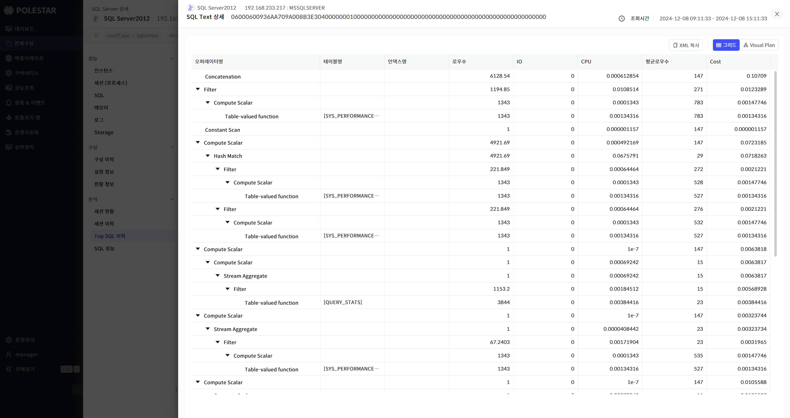

▶ \[그림76\] Plan 목록

> Plan 목록

<table>
<thead>
<tr class="header">
<th>오퍼레이터명</th>
<th>
실행 계획에서 수행되는 연산의 유형입니다. 이 컬럼은 SQL 문이 어떻게 실행되는지를 보여줍니다.

예: Hash Match, Compute Scalar, Table-valued function
</th>
</tr>
</thead>
<tbody>
<tr class="odd">
<td>테이블명</td>
<td>해당 오퍼레이터와 연관된 테이블이 있다면 대상 테이블 명이 표시됩니다.</td>
</tr>
<tr class="even">
<td>인덱스명</td>
<td>해당 오퍼레이터에 연관된 인덱스가 있다면 해당 인덱스명이 표시됩니다.</td>
</tr>
<tr class="odd">
<td>로우수</td>
<td>특정 오퍼레이터(연산자)가 처리할 것으로 예상되는 <strong>행(Row)의 개수</strong>를 나타냅니다. estimateRows = 1000은 해당 오퍼레이터가 약 1000개의 행을 처리할 것으로 예상된다는 의미입니다.</td>
</tr>
<tr class="even">
<td>IO</td>
<td>해당 오퍼레이터에서 수행에 예상되는 IO 수입니다. 자식 오퍼레이터들을 합산하지 않습니다. 그리고 동일 Plan 내에서 상대적인 값이므로 Plan내 가장 많은 IO를 사용한 곳을 찾을 때 유용합니다. 해당 IO값을 다른 Plan의 IO값과 절대적인 값으로 비교할 수는 없습니다.</td>
</tr>
<tr class="odd">
<td>CPU</td>
<td>해당 오퍼레이터에서 수행에 예상되는 CPU 사용량입니다. 자식 오퍼레이터들을 합산하지 않습니다. 그리고 동일 Plan 내에서 상대적인 값이므로 Plan내 가장 많은 CPU를 사용한 곳을 찾을 때 유용합니다. 해당 CPU값을 다른 Plan의 CPU값과 절대적인 값으로 비교할 수는 없습니다.</td>
</tr>
<tr class="even">
<td>평균로우크기</td>
<td>오퍼레이터가 처리할 것으로 예상되는 각 행(Row)의 평균 크기를 나타냅니다. 각 행의 크기는 행에 포함된 열(Column)의 데이터 타입 및 데이터 크기를 기반으로 계산됩니다.</td>
</tr>
<tr class="odd">
<td>Cost</td>
<td>해당 오퍼레이터의 예상 비용(IO + CPU)에 자식 오퍼레이터들의 Cost를 합산한 값입니다. 하위 트리 전체의 총 비용을 나타내며, 실행 계획 내 상대적 작업 비용을 비교하는 데 사용됩니다.</td>
</tr>
</tbody>
</table>

데이터베이스

SQL을 수행된 데이터베이스별로 성능 지연이 발생한 SQL을 분석할 수 있는 화면입니다. 다양한 성능 지표로 SQL을 많이 수행한 데이터베이스 순으로 Top SQL의 수행이력을 조회해 볼 수 있습니다. 또한 개별 SQL을 선택하여 한 SQL에 대한 상세 이력 분석이 가능하며 Top SQL 상세 목록에서 Plan Handle 값을 선택하면 상세 실행계획(Plan)을 트리 그리드형태로 확인해 볼 수 있습니다. 또한 개별 SQL에 Plan 이 여려 개인 경우 Plan간 비교 기능도 제공합니다.

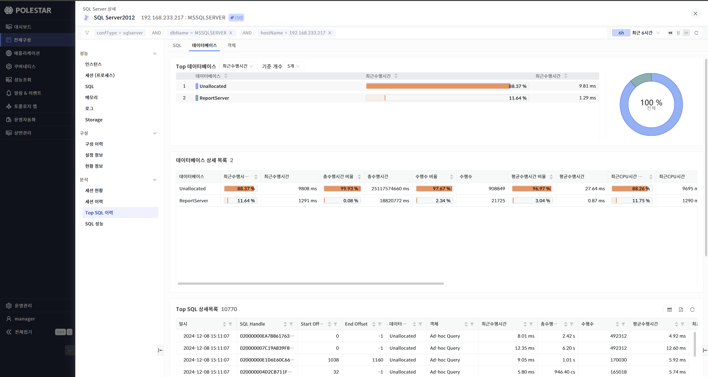

▶ \[그림78\] SQL Server Top SQL 이력 \> 데이터베이스

Top 데이터베이스 목록

Top 데이터베이스 목록 상단 콤보 박스에서 선택한 성능 지표(기본: 최근수행시간)가 높은 데이터베이스를 선택한 기준개수(기본: 5개)만큼 표시합니다. 목록에서 특정 데이터베이스를 클릭하면 중단 데이터베이스 상세 목록에 해당 데이터베이스 목록이 하이라이트 되며, 하단 Top SQL 상세 목록에 선택된 데이터베이스에서 수행한 SQL 이력만 표시됩니다. Top 데이터베이스 기준 성능 지표(최근수행시간, 총수행시간, 수행수, 평균 수행시간, 최근 CPU 시간, 최근 메모리 사용량, 최근 논리 읽기 수, 최근 물리 읽기 수, 최근 논리 쓰기수, 최근 로우수)는 목록 상단 콤보 박스에서 선택할 수 있으며 Top 데이터베이스 개수도 목록 상단 개준 개수(5개, 10개, 15개, 20개, 30개)를 콤보 박스에서 선택할 수 있습니다.

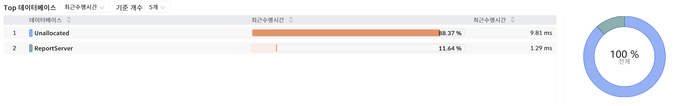

▶ \[그림79\] Top 데이터베이스 목록

> Top 데이터베이스 목록

| 데이터베이스    | 데이터베이스 이름입니다.                                                           |
| --------- | ----------------------------------------------------------------------- |
| 최근수행시간 비율 | Top 데이터베이스목록에 표시된 SQL의 최근수행시간의 합에서 해당 데이터베이스가 수행한SQL의 최근 수행한 시간의 비율입니다. |
| 최근 수행시간   | 해당 데이터베이스의 조회 기간내 최근 수행시간의 평균값입니다.                                      |

데이터베이스 상세 목록

Top 데이터베이스 목록의 값보다 더 상세한 성능 정보를 표시하는 목록입니다.

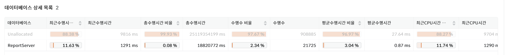

▶ \[그림80\] 데이터베이스 상세 목록

> 데이터베이스 상세 목록

| 데이터베이스     | Top 데이터베이스의 대상인 데이터베이스명입니다.                                     |
| ---------- | --------------------------------------------------------------- |
| 최근수행시간 비율  | Top 데이터베이스목록에 표시된 데이터베이스의 최근수행시간의 합에서 해당 SQL의 최근 수행한 시간의 비율입니다. |
| 최근 수행시간    | 해당 수집 기간에 수집한 Top SQL중 대상 데이터베이스에 속한 SQL들의 최근 수행시간의 평균값입니다.     |
| 총수행시간비율    | Top 데이터베이스목록에 표시된 데이터베이스의 총수행시간의 합에서 해당 SQL의 총 수행한 시간의 비율입니다.   |
| 총수행시간      | 해당 수집 기간에 수집한 Top SQL중 대상 데이터베이스에 속한 SQL들의 총 수행시간의 평균값입니다.      |
| 수행수 비율     | Top 데이터베이스목록에 표시된 데이터베이스의 수행수의 합에서 해당 SQL의 총 수행수의 비율입니다.        |
| 수행수        | 해당 수집 기간에 수집한 Top SQL중 대상 데이터베이스에 속한 SQL들의 총 수행수의 평균값입니다.       |
| 평균수행시간비율   | Top 데이터베이스목록에 표시된 데이터베이스의 합에서 해당 SQL의 평균수행시간의 비율입니다.            |
| 평균수행시간     | 해당 수집 기간에 수집한 Top SQL중 대상 데이터베이스에 속한 SQL들의 평균수행시간의 평균값입니다.      |
| 최근CPU시간비율  | Top 데이터베이스목록에 표시된 데이터베이스의 합에서 해당 SQL의 최근CPU시간의 비율입니다.           |
| 최근CPU시간    | 해당 수집 기간에 수집한 Top SQL중 대상 데이터베이스에 속한 SQL들의 최근CPU시간의 평균값입니다.     |
| 최근메모리사용량비율 | Top 데이터베이스목록에 표시된 데이터베이스의 합에서 해당 SQL의 최근메모리사용량의 비율입니다.          |
| 최근메모리사용량   | 해당 수집 기간에 수집한 Top SQL중 대상 데이터베이스에 속한 SQL들의 최근메모리사용량의 평균값입니다.    |
| 최근논리읽기수비율  | Top 데이터베이스목록에 표시된 데이터베이스의 합에서 해당 SQL의 최근 논리읽기 수의 비율입니다.         |
| 최근논리읽기수    | 해당 수집 기간에 수집한 Top SQL중 대상 데이터베이스에 속한 SQL들의 최근 논리읽기 수의 평균값입니다.   |
| 최근물리읽기수비율  | Top 데이터베이스목록에 표시된 데이터베이스의 합에서 해당 SQL의 최근 물리읽기 수의 비율입니다.         |
| 최근물리읽기수    | 해당 수집 기간에 수집한 Top SQL중 대상 데이터베이스에 속한 SQL들의 최근 물리읽기 수의 평균값입니다.   |
| 최근논리쓰기수비율  | Top 데이터베이스목록에 표시된 데이터베이스의 합에서 해당 SQL의 최근 논리쓰기 수의 비율입니다.         |
| 최근논리쓰기수    | 해당 수집 기간에 수집한 Top SQL중 대상 데이터베이스에 속한 SQL들의 최근 논리쓰기 수의 평균값입니다.   |
| 최근로우수비율    | Top 데이터베이스목록에 표시된 데이터베이스의 합에서 해당 SQL의 최근로우수의 비율입니다.             |
| 최근로우수      | 해당 수집 기간에 수집한 Top SQL중 대상 데이터베이스에 속한 SQL들의 최근로우수의 평균값입니다.       |

<table>
<tbody>
<tr class="odd">
<td>
주의

데이터베이스에서 사용한 수행 시간, 수행수 등의 성능 지표는 해당 기간내 모든 SQL이 아니고 수집한 Top SQL내에서의 합계입니다. Top SQL 수집 개수는 SQL Server 추가시나 SQL Server 설정 정보에서 변경하실 수 있습니다. 또한 Ad-hoc SQL은 데이터베이스명을 알 수가 없어 Unallocated 데이터베이스에 성능 값이 합산됩니다. 데이터베이스명이 표시되는 경우는 저장 프로시저, 함수, 또는 트리거등이 Top SQL로 수집될 때 입니다.
</td>
</tr>
</tbody>
</table>

Top SQL 상세 목록

Top SQL 상세 목록은 SQL 탭과 동일합니다. SQL 탭의 “Top SQL 상세 목록” 부분을 참조하세요.

객체

객체탭에서는 저장 프로시저, 함수, 또는 트리거와 같은 객체별로 성능 및 SQL을 분석할 수 있습니다. Ad-hoc 쿼리의 경우 객체명이 없으므로 Ad-hoc Query에 모두 합산됩니다. 또한 개별 SQL을 선택하여 한 SQL에 대한 상세 이력 분석이 가능하며 Top 객체 상세목록에서 Plan Handle 값을 선택하면 상세 실행계획(Plan)을 트리 그리드형태로 확인해 볼 수 있습니다. 또한 개별 SQL에 Plan 이 여려 개인 경우 Plan간 비교 기능도 제공합니다.

▶ \[그림81\] SQL Server Top SQL 이력 \> 객체

> Top 객체 목록

| 객체        | 객체 이름입니다.                                                         |
| --------- | ----------------------------------------------------------------- |
| 최근수행시간 비율 | Top 객체 목록에 표시된 SQL의 최근수행시간의 합에서 해당 객체 가 수행한SQL의 최근 수행한 시간의 비율입니다. |
| 최근 수행시간   | 해당 객체의 조회 기간내 최근 수행시간의 평균값입니다.                                    |

객체 상세 목록

Top 객체 목록의 값보다 더 상세한 성능 정보를 표시하는 목록입니다.

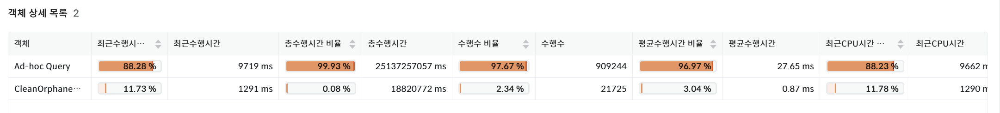

▶ \[그림82\] 객체 상세 목록

> 객체 상세 목록

객체 상세 목록은 첫 컬럼이 객체인 것 외에 위 데이터베이스 상세 목록과 동일합니다. 자세한 컬럼 설명은 해당 목록을 참고하세요.

<table>
<tbody>
<tr class="odd">
<td>
주의

객체명이 표시되는 경우는 저장 프로시저, 함수, 또는 트리거 일 때 이며 나머지의 경우는 Ad-hoc Query에 합산되어 표시됩니다..
</td>
</tr>
</tbody>
</table>

Top SQL 상세 목록

Top SQL 상세 목록은 SQL 탭과 동일합니다. SQL 탭의 “Top SQL 상세 목록” 부분을 참조하세요.

SQL 성능 분석

SQL 성능 분석 화면에서는 대상 SQL Server에서 수행된 SQL에 최근 수행 시간등의 성능 지표를 분포도(Scatter) 차트로 표현하여 한눈에 SQL들의 성능 지표값의 분포를 확인할 수 있습니다. 또한 최근 수행 시간외에 최근 CPU 시간, 최근 논리 읽기 수, 최근 물리 읽기 수 지표등도 제공하며 분포도(Scatter)차트에 최근 수행시간이 특정 시간 이상 또는 이하인 SQL 만을 표시할 수 있습니다.

SQL 분포도

SQL 분포도는 기본 최근 수행시간이 1초 이상인 Top SQL의 평균 수행시간을 분포도(Scatter) 차트에 각 점으로 표시합니다. SQL 분포도 타이틀 옆의 콤보 박스를 통해 표시되는 지표를 최근 CPU 시간이나 최근 논리 읽기 수 또는 최근 물리 읽기수등으로 변경 가능하며 우측 상단 표시조건을 변경하여 최근 수행 시간 몇 초 이상 또는 이하인 SQL 만을 표시할 수 있습니다. 또한 마우스로 원하는 영역을 드래그 하여 선택하면 해당 영역에 해당하는 SQL 이력 정보만 SQL 상세 목록에 표시됩니다.

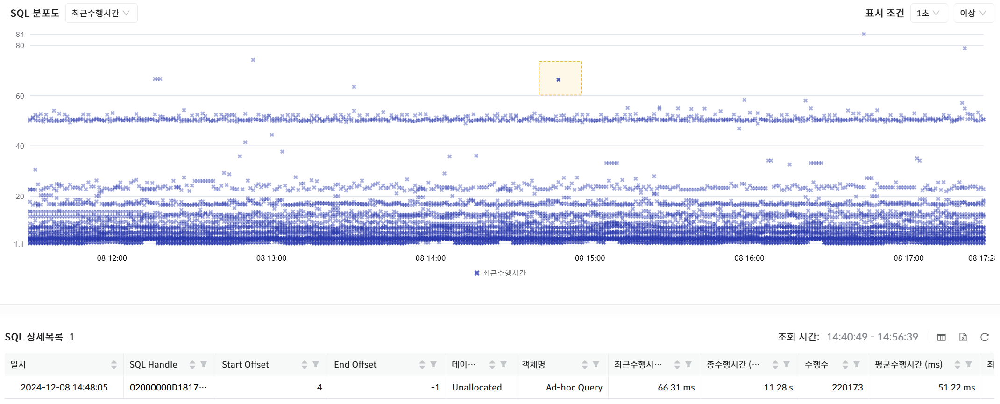

▶ \[그림83\] SQL 분포도

<table>
<tbody>
<tr class="odd">
<td>
주의

분포도(Scatter) 차트는 최대 6시간 간격의 데이터 까지만 표시됩니다.
</td>
</tr>
</tbody>
</table>

SQL 상세 목록

타임 셀렉터에 선택한 기간내의 수집한 SQL 전체 목록이 표시됩니다. 상단 SQL 분포도에서 특정 영역을 선택하면 해당하는 SQL에 대한 목록만 필터링 하여 보실 수 있습니다. 이를 통해 부하가 발생한 SQL에 대해 쉽게 찾고 분석할 수 있습니다.

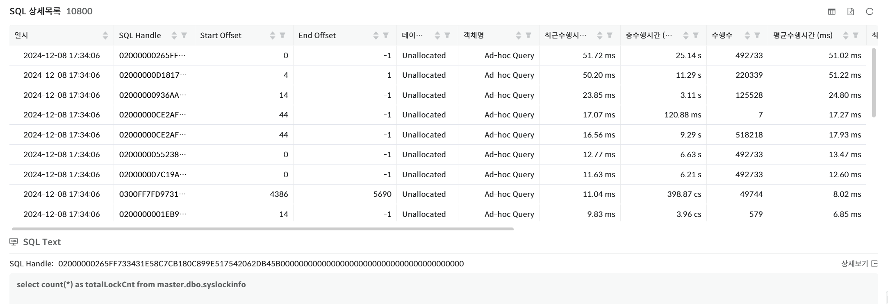

▶ \[그림84\] SQL 상세 목록

> SQL 상세 목록

| 일시           | 해당 SQL의 이력 정보가 수집된 일시입니다.                                                        |
| ------------ | -------------------------------------------------------------------------------- |
| SQL Handle   | 대상 SQL의 SQL Handle입니다. 해당 SQL Handle를 선택하면 하단 SQL Text창에 선택한 SQL Text가 표시됩니다.    |
| Start Offset | 대상 SQL의 SQL Handle내 Start Offset입니다.                                             |
| End Offset   | 대상 SQL의 SQL Handle내 End Offset입니다.                                               |
| 데이터베이스       | 해당 SQL이 수행된 데이터베이스명입니다. 스토어드 프로시저와 같은 객체 타입인 경우 표시되며 Ad-hoc Query인 경우 표시되지 않습니다. |
| 객체           | 스토어드 프로시저와 같은 객체 타입인 경우 해당 객체명이 표시됩니다. Ad-hoc Query인 경우는 Ad-hoc Query라고 표시됩니다.   |
| 최근 수행시간      | 해당 SQL의 해당 시점 최근 수행 시간입니다.                                                       |
| 총수행시간        | SQL Server기동 이후 해당 이력이 수집된 시점까지 SQL이 수행된 총 수행 시간입니다..                            |
| 수행수          | SQL Server기동 이후 해당 이력이 수집된 시점까지 SQL이 수행된 총 수행 수입니다..                             |
| 평균수행시간       | SQL Server기동 이후 해당 이력이 수집된 시점까지 SQL이 수행된 평균 수행 시간입니다.                            |
| 최근CPU시간      | 해당 SQL의 해당 시점 최근 CPU 시간입니다.                                                      |
| 최근메모리사용량     | 해당 SQL의 해당 시점 최근 메모리 사용량입니다.                                                     |
| 최근논리읽기수      | 해당 SQL의 해당 시점 최근 논리 읽기 수입니다.                                                     |
| 최근물리읽기수      | 해당 SQL의 해당 시점 최근 물리 읽기 수입니다.                                                     |
| 최근논리쓰기수      | 해당 SQL의 해당 시점 최근 논리 쓰기 수입니다.                                                     |
| 최근로우수        | 해당 SQL의 해당 시점 최근 로우 수입니다.                                                        |

<table>
<tbody>
<tr class="odd">
<td>
노트

Top SQL에 나오는 SQL 목록은 상단 Top SQL에 표시된 SQL만 나오는 것이 아니고 타임 셀렉터에 선택한 기간내 Top SQL로 수집한 모든 SQL이 나옵니다. Top SQL 수집 여부 및 개수 설정은 SQL Server 추가시나 설정 정보에서 변경하실 수 있습니다.
</td>
</tr>
</tbody>
</table>

성능 이상감지 요약

해당 서버의 이상감지가 발생한 모든 지표의 개수를 카운트를 통해 제공합니다.

주요 지표 중 4개는 이상감지 현황을 차트를 통해 제공받습니다.

차트에 표시되는 데이터는 실제 값, Upper & Lower Band를 표시하며, Band를 넘은 실제 값은 다른 색상을 통해 이상감지 여부를 파악할 수 있습니다.

AIOPS 권한이 없는 사용자 계정으로 접근 시, 이상감지 리스트는 표출되지 않습니다.

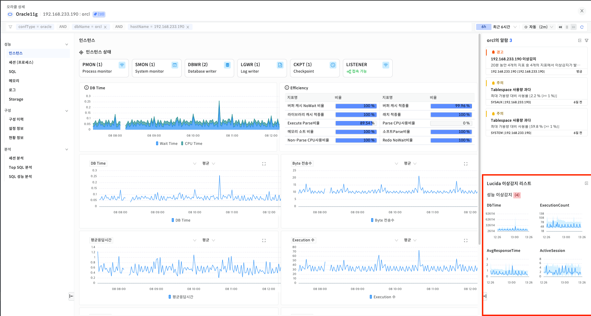

▶ \[그림85\] 이상감지 요약

화면 지표

<table>
<thead>
<tr class="header">
<th>성능이상감지 지표명</th>
<th>학습된 주요 지표 중 4개의 정보를 제공합니다</th>
</tr>
</thead>
<tbody>
<tr class="odd">
<td>실제값</td>
<td>
서버의 주요 지표의 성능데이터를 표시합니다.

상하한선 Band 영역을 벗어날 시, 이상감지로 판단되어 다른 색상으로 표시됩니다.
</td>
</tr>
<tr class="even">
<td>Upper Band</td>
<td>실제 값의 변동 추이를 이상으로 판단할 지의 상한선 기준을 표시합니다</td>
</tr>
<tr class="odd">
<td>Lower Band</td>
<td>실제 값의 변동 추이를 이상으로 판단할 지의 하한선 기준을 표시합니다.</td>
</tr>
<tr class="even">
<td>이상 발생 지표 개수</td>
<td>서버의 학습된 지표 중, 이상감지가 된 지표들의 개수를 표시합니다.</td>
</tr>
</tbody>
</table>

성능 이상감지 분석 요약

성능 이상감지 내용과 발생 기준 그리고 프로세스의 RCA의 내용을 텍스트 기반의 요약된 정보를 제공합니다. 해당 기능은 정상 상태와 동일한 기준으로 정보를 제공합니다.

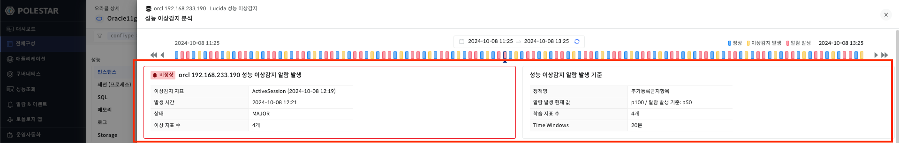

▶ \[그림86\] 이상감지 요약

화면 지표

| 성능 이상감지 알람 | 이상감지 알람 발생 정보를 표시합니다.                                                 |
| ---------- | --------------------------------------------------------------------- |
| 시작 이상감지 지표 | TimeWindow 및 민감도로 정의된 그룹 단위에서 발생한 이상감지 알람의 지표 중 최초 발생한 이상감지 지표를 나타냅니다 |
| 알람 발생 시간   | 알람이 발생한 시점을 나타냅니다. 최초 발생한 이상감지 지표 기준으로 정의됩니다.                         |
| 알람 상태      | 알람 발생 유무를 나타냅니다.                                                      |
| 이상 발생 지표 수 | TimeWindow 및 민감도로 정의된 그룹 단위에서 발생한 이상감지 알람에 포함된 이상 지표 개수를 나타냅니다.       |

화면 지표

<table>
<thead>
<tr class="header">
<th>성능 이상감지 알람 발생 기준</th>
<th>성능 이상감지 알람 발생 기준을 나타냅니다.</th>
</tr>
</thead>
<tbody>
<tr class="odd">
<td>정책명</td>
<td>이상감지 알람 발생 기준 정책명을 나타냅니다.</td>
</tr>
<tr class="even">
<td>알람 발생 현재 값</td>
<td>해당 정책의 이상감지로 판단된 현재값입니다.</td>
</tr>
<tr class="odd">
<td>학습 지표 수</td>
<td>해당 정책에서 관리되는 지표수를 나타냅니다.</td>
</tr>
<tr class="even">
<td>Time Windows</td>
<td>
민감도를 판단할 범위를 나타냅니다.

해당 범위를 기준으로 민감도를 집계합니다.
</td>
</tr>
</tbody>
</table>

리소스 성능 현황

리소스 단위의 성능 지표 이상감지 현황을 볼 수 있는 기능을 제공합니다.

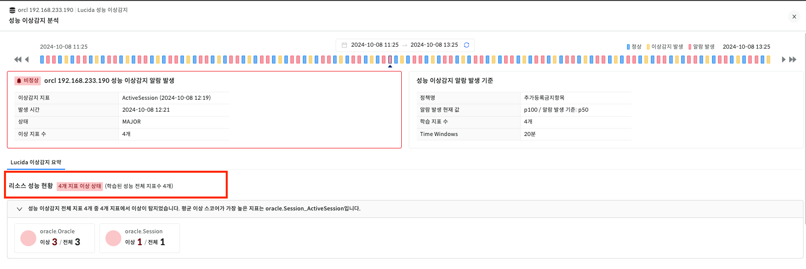

▶ \[그림87\] 리소스 현황

화면 지표

<table>
<thead>
<tr class="header">
<th>리소스 단위의 성능 지표 이상감지 현황</th>
<th>
리소스의 지표의 이상감지 발생 여부를 나타냅니다

학습된 지표가 모두 정상일 경우, 정상상태를 나타내며, 이상이 발생한 지표가 있을 경우, 이상 발생 개수를 나타냅니다
</th>
</tr>
</thead>
<tbody>
<tr class="odd">
<td>학습된 성능 전체 지표수</td>
<td>해당 리소스의 학습된 지표 개수를 나타냅니다.</td>
</tr>
<tr class="even">
<td>알람 발생 현재 값</td>
<td>해당 정책의 이상감지 판</td>
</tr>
<tr class="odd">
<td>학습 지표 수</td>
<td>해당 정책에서 관리되는 지표수를 나타냅니다.</td>
</tr>
<tr class="even">
<td></td>
<td></td>
</tr>
</tbody>
</table>

성능 이상 FLOW

성능 이상이 발생한 시간 순으로 카드 형태의 시각화 정보를 확인할 수 있습니다.

비정상 상태일 경우 카드영역이 펼쳐서 제공됩니다.

사용자가 알람 발생 및 이상 발생 현상을 빠르게 확인할 수 있도록 다른 색상으로 표현됩니다.

화면 지표

<table>
<thead>
<tr class="header">
<th>리소스 현황 정보</th>
<th>
카드 영역 안의 리소스 현황 상단에는 리소스 단위의 지표명이 표시됩니다.

이상이 발생하면 Red 계열 색상으로 카드가 표현됩니다.
</th>
</tr>
</thead>
<tbody>
<tr class="odd">
<td>이상 지표 수</td>
<td>이상이 발생한 지표 수</td>
</tr>
<tr class="even">
<td>학습된 지표 수</td>
<td>학습된 지표 수</td>
</tr>
</tbody>
</table>

> 

▶ \[그림88\] 성능 이상 FLOW

성능 이상 TIME Navigator & Indicator

현재 시간 기준으로 2 시간 범위의 분 단위 Time Shifter 및 이상 \* 알람 발생 여부에 대한 Indicator 기능을 제공합니다.

Rectangle 하나의 단위는 1분을 의미하며, 선택 시 해당 시점의 정보로 화면의 모든 정보가 갱신됩니다.

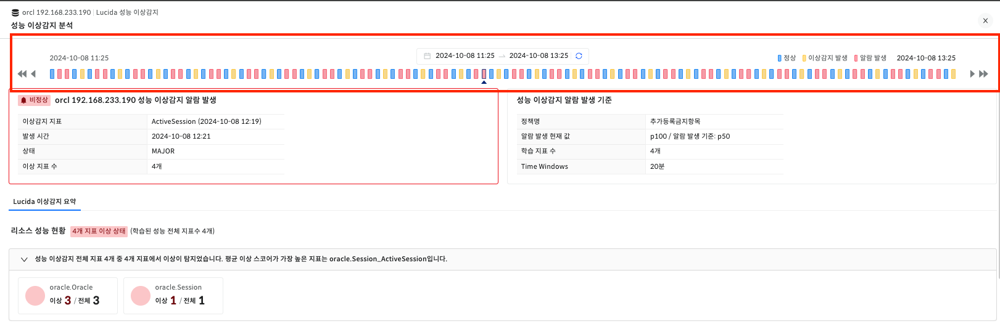

▶ \[그림89\] Time Navigator & Anomaly Indicator

성능 이상 TIME Navigator Calander

다른 날짜 또는 시간으로 빠르게 이동할 수 있는 Datetime Picker 형태의 Navigator 기능을 제공합니다.

알람이 발생한 일자/시간/분을 숫자에 표시하여 빠르게 이동할 수 있습니다.

▶ \[그림90\] Time Navigator Calander

확대 보기

성능조회와 동일하게 선택 대상의 확대보기를 제공합니다

화면 지표

<table>
<thead>
<tr class="header">
<th>리소스 지표 성능 및 이상감지 차트</th>
<th>리소스 지표 차트의 확대보기 기능을 통해, 성능 차트 혹은 이상감지 차트를 제공합니다</th>
</tr>
</thead>
<tbody>
<tr class="odd">
<td>신뢰 범위</td>
<td>
버튼 선택 시, 학습되어 생성된 신뢰 범위를 표현합니다.

선택된 리소스 지표의 학습 모델이 존재하지 않을 경우, 비활성화 됩니다.

버튼 활성화 시, 최대/평균/최소의 선택 버튼은 비활성화 되며, Datetime Picker의 시간 선택 범위도 [최근 1일] 기본으로 변경되며, 차트의 인터벌 간격은 이상감지 데이터의 왜곡을 막기 위해, [1분]으로 고정됩니다.
</td>
</tr>
<tr class="even">
<td>스코어 평균 및 합계</td>
<td>해당 지표의 이상감지 스코어 평균 및 지표를 나타냅니다.</td>
</tr>
<tr class="odd">
<td>평균 / 상하한 / 스코어 목록</td>
<td>해당 시점의 평균 / 상하한 / 스코어의 평균, 최소, 최대, 합계, 실제값을 표를 통해 나타냅니다.</td>
</tr>
</tbody>
</table>

