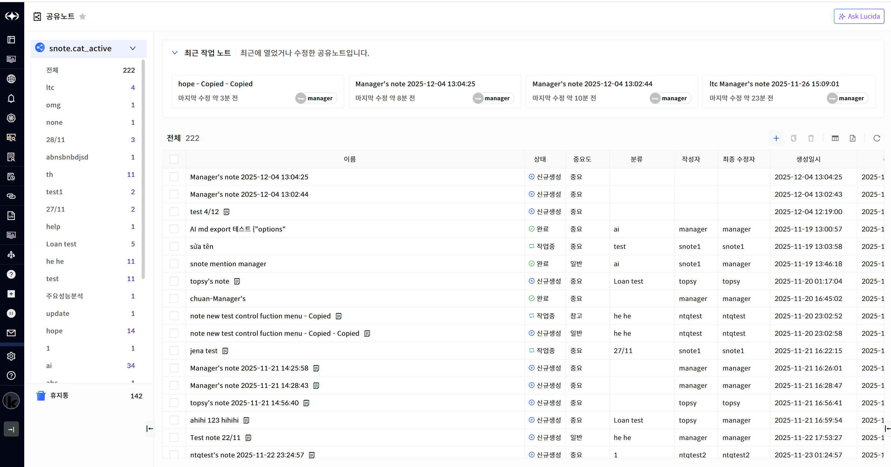
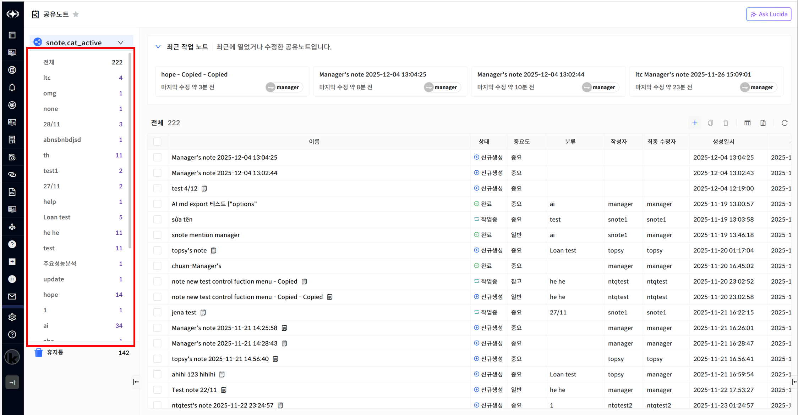
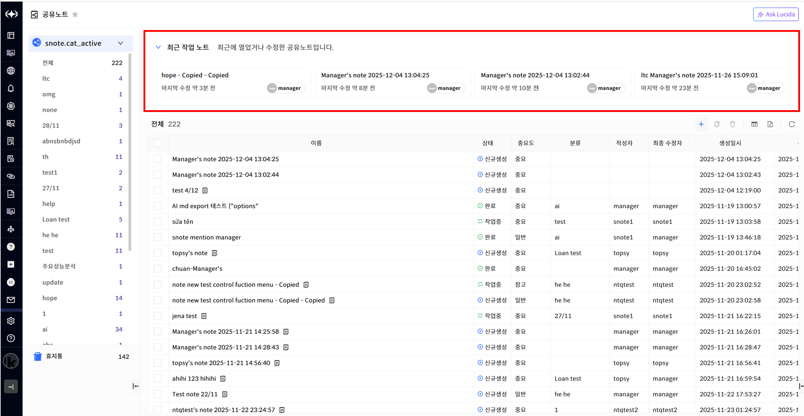
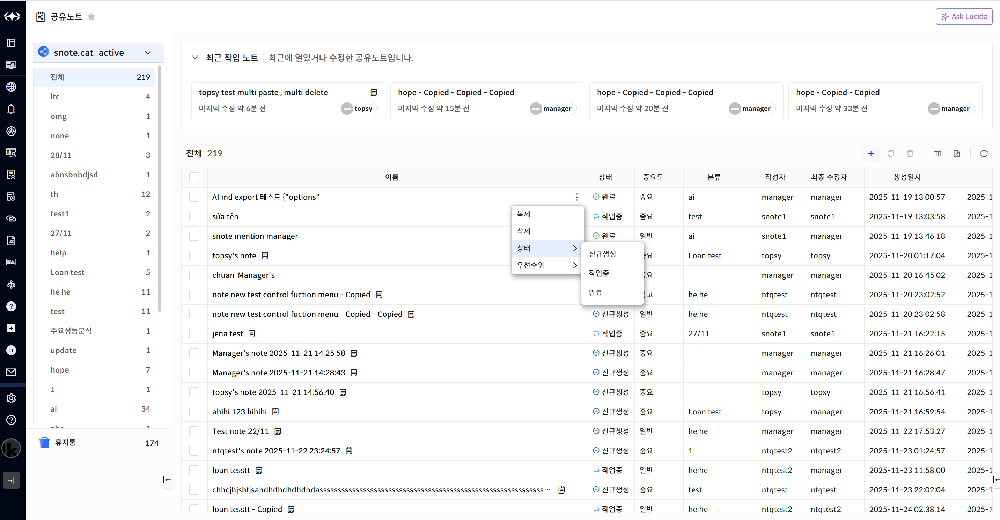
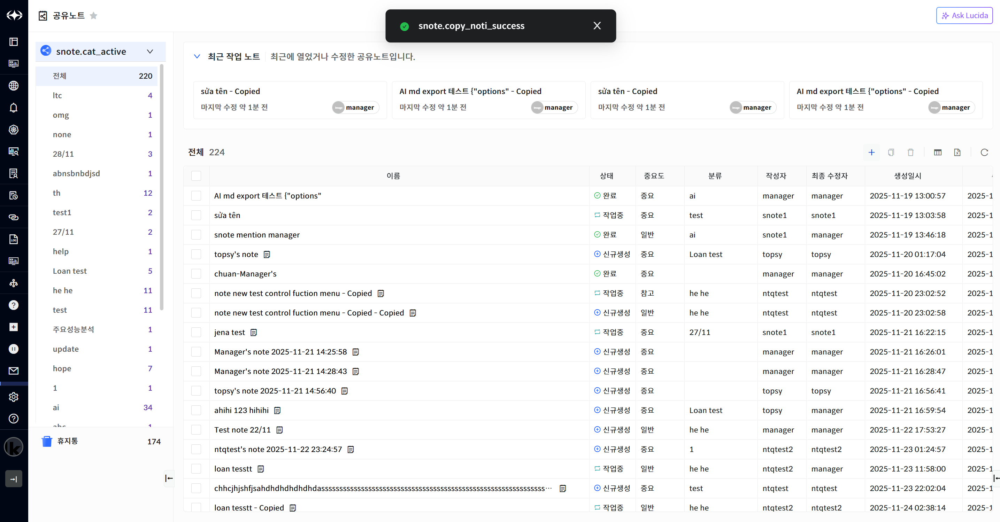
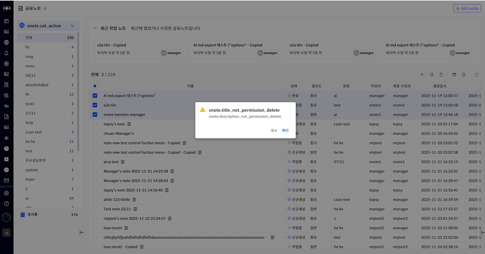
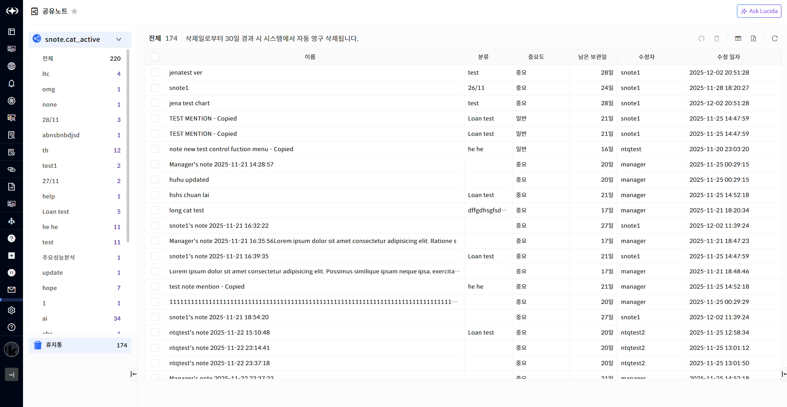
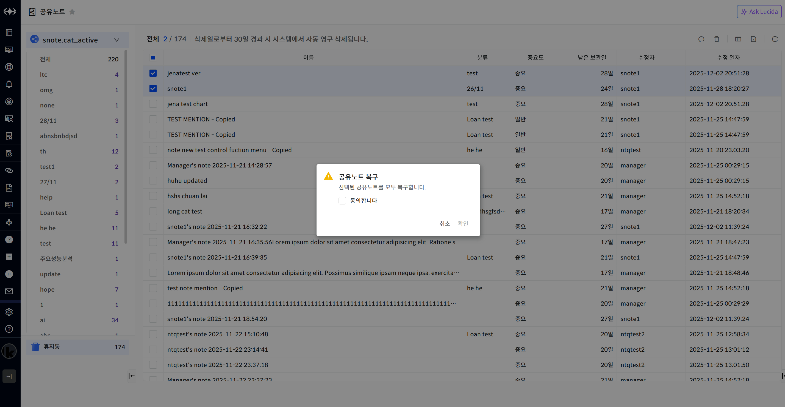
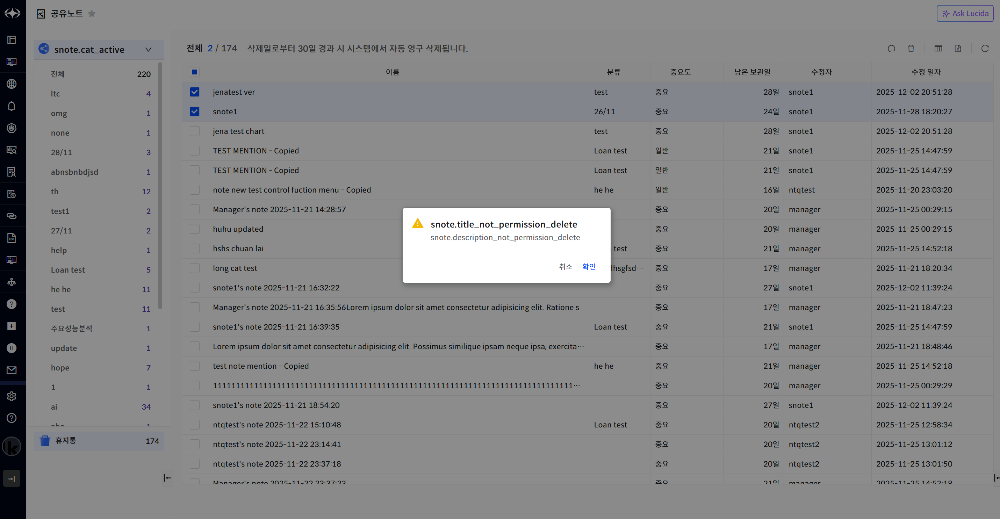

공유 노트 목록

공유 노트를 조회하기 위해서는 화면 왼쪽 메인 메뉴 영역에서 \[공유노트\] 메뉴를 선택합니다.

> ▶ \[그림1\] 공유 노트 목록

하위 분류 목록

> 사용자가 입력한 분류를 이용하여 등록된 노트를 구분하는 기능을 제공합니다. 분류는 신규노트 입력 시 사용자에게 새로운 분류를 입력 받을 수 있습니다. 분류를 선택하면 분류에 해당하는 목록이 표시됩니다.

> ▶ \[그림2\] 하위 분류 목록

최근 작업 노트

최근에 작성된 노트를 시간 순서로 최대 4개까지 표시합니다. 수정시간과 작성자를 표시하며 Edit 모드에서 10분 이상 업데이트가 없을 경우 노트 아이콘이 표시됩니다.

▶ \[그림3\] 최근 작업 노트

공유 노트 개별 메뉴

공유 노트에서 마우스 오버시 개별 메뉴가 표시됩니다. 공유 노트의 부여된 권한에 따라 표시되는 메뉴 목록에 차이가 있습니다.

► \[그림4\] 공유 노트 개별 메뉴

개별 메뉴

| 복제   | 선택한 공유 노트를 복제합니다. 복제된 공유 노트의 소유는 복제를 수행한 사용자에게 부여됩니다. |
| ---- | ----------------------------------------------------- |
| 삭제   | 선택된 공유 노트를 삭제합니다. 삭제된 공유 노트는 휴지통으로 이동합니다.             |
| 상태   | 선택된 공유 노트의 상태를 변경합니다.                                 |
| 우선순위 | 선택된 공유 노트의 우선순위를 변경합니다.                               |

공유 노트 복제

공유 노트의 개별 메뉴 또는 목록의 우측 상단에서 \[복제\] 기능을 이용할 수 있습니다. 공유 노트를 복제할 경우 원본의 모든 데이터를 복사하며 이름 뒤에 \[-Copied\]를 추가하여 생성합니다. 목록의 우측 상단에 표시되는 \[복제\] 버튼은 공유 노트를 체크하면 활성화되며 여러 개를 선택할 수 있습니다.

► \[그림5\] 공유 노트 복제

공유 노트 삭제

삭제할 공유 노트를 선택하고 \[삭제\] 버튼을 클릭하면 공유 노트를 삭제할 수 있습니다.

\[전체선택\] 버튼을 클릭하면 표시된 공유 노트를 선택할 수 있으며 \[삭제\] 버튼을 클릭하면 선택된 공유 노트를 삭제할 수 있습니다.

<table>
<tbody>
<tr class="odd">
<td>
노트

공유 노트를 삭제하면 휴지통으로 이동되며 휴지통 목록에서 복원 또는 삭제가 가능합니다.
</td>
</tr>
</tbody>
</table>

▶ \[그림6\] 공유 노트 삭제

> 공유 노트 삭제 절차

1.  삭제하고자 하는 공유 노트 선택 (다중 선택 가능)

2.  테이블 우측 상단의 삭제 아이콘 클릭

3.  메시지창에서 확인 클릭

휴지통 목록

휴지통을 조회하기 위해서는 화면 왼쪽 메인 메뉴 영역에서 \[공유노트\]\>\[휴지통\] 메뉴를 선택합니다. 공유 노트 목록에서 삭제된 내용만 휴지통 목록에 표시됩니다. 휴지통 목록에서 30일 보관되며 이후에는 영구 삭제가 됩니다.

► \[그림7\] 휴지통 목록

공유 노트 복구

휴지통의 목록의 우측 상단에서 \[복구\] 기능을 이용할 수 있습니다. 잘못 삭제된 공유 노트를 선택하여 \[복구\] 기능을 이용하면 공유 노트 목록으로 이동됩니다.

► \[그림8\] 공유 노트 복구

공유 노트 즉시 삭제

휴지통 목록에서 30일 이후에 자동으로 삭제가 가능하며 \[즉시삭제\] 기능도 제공합니다. 공유 노트를 선택하고 \[즉시삭제\] 버튼을 클릭하면 공유 노트는 영구적으로 삭제할 수 있습니다.

\[전체선택\] 버튼을 클릭하면 표시된 공유 노트를 선택할 수 있으며 \[즉시삭제\] 버튼을 클릭하면 선택된 공유 노트를 삭제할 수 있습니다.

<table>
<tbody>
<tr class="odd">
<td>
노트

공유 노트를 즉시 삭제하면 영구적으로 삭제가 되며 복원이 불가능합니다.
</td>
</tr>
</tbody>
</table>

▶ \[그림9\] 공유 노트 즉시 삭제

